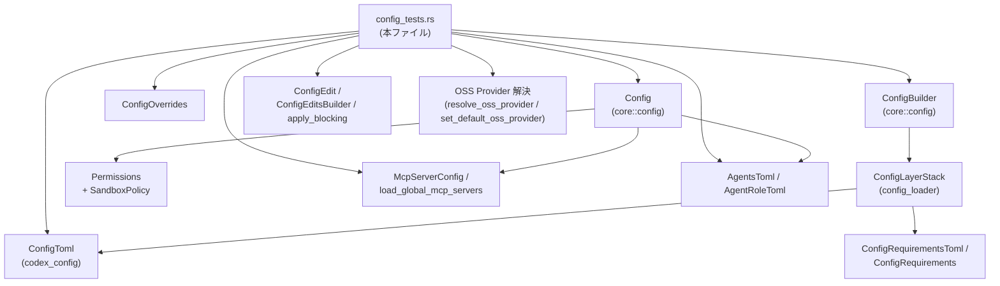
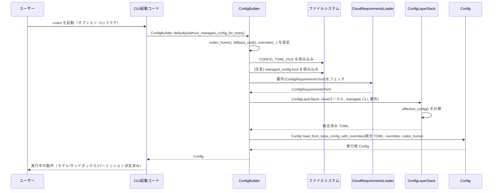

# core/src/config/config_tests.rs コード解説

## 0. ざっくり一言

`core/src/config/config_tests.rs` は、Codex の設定まわり一式（`ConfigToml` → `Config` 変換・パーミッション/サンドボックス・MCP サーバ設定・プロファイル優先順位・クラウド要件・リアルタイム/通知設定など）の**振る舞いと制約を検証するテスト群**です。

※ この回答からは実ファイルの行番号を取得できないため、テストコードの場所は**関数名で参照**し、`config_tests.rs:Lx-y` 形式の行番号は記載できません。

---

## 1. このモジュールの役割

### 1.1 概要

このファイルは、次のような点を中心に **設定サブシステムの仕様をテストで固定**しています。

- `ConfigToml`（TOML からの素の設定）を `Config`（実行時設定）に変換する処理の仕様
- プロファイル・CLI オーバーライド・マネージド設定・クラウド要件の**優先順位（preference/precedence）**
- パーミッションプロファイル → サンドボックス (`SandboxPolicy` / `FileSystemSandboxPolicy` / `NetworkSandboxPolicy`)
- MCP サーバ (`McpServerConfig`) の読み書き・フィルタリング・シリアライズ仕様
- Web 検索モード・機能フラグ (`Features`)・オープンソースモデルプロバイダ選択
- エージェントロール設定（分割 config ファイル・スタンドアロン `.toml` 検出）のバリデーション
- リアルタイム音声/WS 設定、TUI 通知設定など UI 連携部分の config

多くのテストは **エラーメッセージと `std::io::ErrorKind` まで含めて検証**しており、仕様がかなり厳密に固定されています。

### 1.2 アーキテクチャ内での位置づけ

本ファイルは **テスト専用モジュール**であり、実装の本体は別モジュールにあります（`Config`, `ConfigBuilder`, `ConfigToml`, `ConfigLayerStack`, `CloudRequirementsLoader` など）。

依存関係（簡略化）は次の通りです。



### 1.3 設計上のポイント（テストから読める範囲）

- **責務の分割**
  - `ConfigToml`: TOML 直デシリアライズ用の生設定。
  - `Config`: 実行時に使う正規化済み設定。
  - `ConfigBuilder`: ファイル・マネージド設定・クラウド要件・CLI オーバーライドを束ねて `Config` を構築。
  - `Permissions` / `SandboxPolicy`: ファイル/ネットワークのサンドボックスと承認ポリシのランタイム表現。
  - MCP 関連 (`McpServerConfig`, `load_global_mcp_servers`, `ConfigEdit::ReplaceMcpServers`) は**永続化フォーマットとランタイム表現の橋渡し**を担当。
- **状態と不変条件**
  - `Config` 構造体には多数のフィールド（モデル、サンドボックス設定、フィーチャーフラグ、リアルタイム設定など）があり、それぞれに**不変条件**がテストで固定されています。
  - `Constrained<T>` 型で「クラウド要件により許可される値の集合」を表現し、設定値が集合外のときに**自動でフォールバック**する仕組みがあることが分かります。
- **エラーハンドリング方針**
  - すべて `Result` ベース。`std::io::ErrorKind::InvalidInput` / `InvalidData` / `NotFound` など具体的な `ErrorKind` を使い分け。
  - エラーメッセージ文字列までテストしており、ユーザに対する**ヘルプメッセージ**も仕様として固定されています（例: 旧 Ollama プロバイダ削除エラー、`bearer_token` 禁止メッセージなど）。
- **安全性・セキュリティ**
  - ファイルシステムパスの正規化と制限（workspace 外書き込み禁止・`..` を含むサブパス禁止）。
  - Unknown special path は無視＋警告にとどめ、権限を広げない。
  - MCP HTTP サーバでは**インライン bearer token を禁止**し、環境変数参照 (`bearer_token_env_var`) のみ許可。
  - クラウド要件 (`ConfigRequirementsToml`) が**ローカル設定より優先**するケースでは、自動フォールバック＋警告。

- **並行性 / 非同期**
  - 多数のテストが `#[tokio::test]` であり、`ConfigBuilder::build` や `load_global_mcp_servers` 等が **async 関数**であることが分かります。
  - MCP サーバ設定の読み書きは、`tokio::fs` / `apply_blocking` の組み合わせで行われ、I/O の非同期性とテストの再現性を両立しています。

---

## 2. 主要な機能一覧（テスト対象の機能）

このファイルがカバーしている主要な機能を、実装モジュール別に整理します。

- 設定読み込み・統合
  - `Config::load_from_base_config_with_overrides`: `ConfigToml`＋CLI オーバーライド＋ `codex_home` から `Config` を生成。
  - `ConfigBuilder::build`: config ファイル、マネージド config、CLI、クラウド要件をまとめて `Config` を構築。
  - `ConfigLayerStack::new` / `load_config_layers_state` / `deserialize_config_toml_with_base`: 設定レイヤーの結合と正規化。

- パーミッションとサンドボックス
  - `ConfigToml` 内の `[permissions]` / `default_permissions` から `Permissions`・`FileSystemSandboxPolicy`・`NetworkSandboxPolicy` を構成。
  - `ConfigToml::derive_sandbox_policy`: `sandbox_mode`, プロジェクトの `trust_level`, Windows の制限, 要件 (`Constrained<SandboxPolicy>`) から最終的な `SandboxPolicy` を決定。
  - `default_permissions` 未設定や workspace 外書き込みなど、危険設定の拒否。

- MCP サーバ設定
  - `load_global_mcp_servers`: `config.toml` の `[mcp_servers]` セクションを読み取り `BTreeMap<String, McpServerConfig>` に変換。
  - `ConfigEdit::ReplaceMcpServers` + `apply_blocking`: MCP サーバ一覧の**丸ごと置き換えと TOML へのシリアライズ**。
  - `filter_mcp_servers_by_requirements`: MDM / クラウドから渡される MCP 要件に従って allowlist / blocklist を適用。

- プロファイルと優先順位
  - `ConfigProfile` と `profiles.*` セクション、および `ConfigOverrides.config_profile` によるプロファイル選択。
  - モデル (`model`), モデルプロバイダ (`model_provider`), 承認ポリシ (`approval_policy`), Sandbox モードなどの**優先順位ルール**（コメントにもある 1〜4 の優先順位）。
  - `resolve_oss_provider`: explicit 引数 → プロファイル → グローバル設定 → 未設定、という優先順位。

- クラウド要件 (`ConfigRequirementsToml`) と `Constrained<T>`
  - `allowed_sandbox_modes`, `allowed_web_search_modes`, `allowed_approval_policies`, `feature_requirements` など。
  - ローカル設定が要件に反したとき、**要件側のデフォルト値へのフォールバック**と `startup_warnings` の出力。
  - ランタイムでの feature 変更 (`features.set`) に対しても同じ制約を適用。

- モデル・OSS プロバイダ・カタログ
  - `set_default_oss_provider`: `config.toml` の `oss_provider` を設定・更新・検証。
  - 旧 Ollama チャットプロバイダ ID の拒否と、それに対するヘルプエラー。
  - `model_catalog_json`: 外部 JSON ファイルからモデルカタログを読み込み、空カタログは `InvalidData` エラーとする。

- エージェントロール設定
  - `AgentsToml` / `AgentRoleToml` と、外部 `agents/*.toml` ファイルのマージ。
  - `.codex/agents/*.toml` の自動検出と名前解決（ファイル中の `name` がキーより優先）。
  - 必須フィールド（`developer_instructions`, `description`, `name`）の欠如時に role を無効化して警告を出すルール。
  - ニックネーム候補のバリデーション（空・重複・安全でない文字の拒否）。

- Web 検索モード・フィーチャーフラグ
  - `resolve_web_search_mode` / `resolve_web_search_mode_for_turn`: Config / Profile / Feature の組み合わせから Web 検索モードを決定。
  - 旧フラグ (`experimental_use_freeform_apply_patch` など) と feature テーブル (`FeaturesToml`) のマッピング。
  - クラウド要件に基づく feature の正規化と、**別名 feature key の拒否**（例: `collab` → `multi_agent` を要求）。

- Realtime / Audio / TUI 設定
  - `[realtime]`, `[audio]`, `experimental_realtime_*` の TOML → `RealtimeConfig` / `RealtimeAudioConfig` 変換。
  - TUI 通知設定（`notifications`, `notification_method`, `notification_condition`）のデシリアライズとデフォルト。

---

## 3. 公開 API と詳細解説

> 注: ここで説明する関数・型の多くは**別モジュールで定義された本番コード**であり、本ファイルではテストから読み取れる範囲で概要を整理しています。内部実装の詳細はコード本体を参照する必要があります。

### 3.1 型一覧（本テストで中心的に扱う型）

| 名前 | 種別 | 役割 / 用途 |
|------|------|-------------|
| `ConfigToml` | 構造体 | `config.toml` を直接デシリアライズした生の設定。`sandbox_mode`, `permissions`, `projects`, `profiles`, `features`, `realtime`, `audio` など多数のフィールドを持つ。 |
| `Config` | 構造体 | すべてのレイヤー（TOML, プロファイル, CLI, マネージド, クラウド要件）を統合し、既定値や検証を通した実行時設定。 |
| `ConfigOverrides` | 構造体 | CLI などから渡される一時的なオーバーライド（`cwd`, `sandbox_mode`, `config_profile`, `compact_prompt` 等）を保持。 |
| `ConfigBuilder` | 構造体 | `codex_home` などを指定して、TOML ファイル・マネージド設定・クラウド要件を読み込み、`Config` を非同期に構築するビルダー。 |
| `ConfigLayerStack` | 構造体 | 生の TOML レイヤー（ベース, マネージド, CLI オーバーライド等）と要件 (`ConfigRequirements`) をまとめ、`effective_config()` を提供。 |
| `Permissions` | 構造体 | `approval_policy`, `sandbox_policy` (`Constrained<SandboxPolicy>`), `file_system_sandbox_policy`, `network_sandbox_policy`, ネットワークプロキシなどをまとめたランタイムパーミッション。 |
| `SandboxPolicy` | enum | `DangerFullAccess`, `ReadOnly`, `WorkspaceWrite { .. }` など、論理的なサンドボックスモード。 |
| `FileSystemSandboxPolicy` | 構造体 | `FileSystemSandboxEntry` のリストや `restricted` コンストラクタを持ち、ファイルシステムレベルでの許可パス・アクセスモードを表現。 |
| `NetworkSandboxPolicy` | enum | `Restricted` / `Enabled` (命名はテストから推測) など、ネットワークアクセス許可状態。 |
| `McpServerConfig` | 構造体 | MCP サーバ1件分の設定。`transport`, `enabled`, `required`, 各種タイムアウト、ツールフィルタ、OAuth リソース等。 |
| `McpServerTransportConfig` | enum | `Stdio { command, args, env, env_vars, cwd }` や `StreamableHttp { url, bearer_token_env_var, http_headers, env_http_headers }` などのトランスポート設定。 |
| `ConfigEdit` | enum | 設定の変更操作を表す。テストでは `ConfigEdit::ReplaceMcpServers` のみ使用。 |
| `ConfigEditsBuilder` | 構造体 | モデルや feature の変更・プロファイル指定などを組み立てて `apply()` で `config.toml` を更新するビルダー。 |
| `Constrained<T>` | 構造体 | 値 `T` と「どの値が許されるか」の制約をまとめた型。`new`, `allow_any`, `can_set`, `set`, `value`, `get` などの API があることがテストから分かる。 |
| `CloudRequirementsLoader` | 構造体 | クラウドから `ConfigRequirementsToml` を非同期取得するローダ。テストでは `CloudRequirementsLoader::new(async { ... })` が使われている。 |
| `ConfigRequirementsToml` | 構造体 | クラウド側の制約設定（許可 sandbox モード・Web 検索モード・feature 要件・MCP 要件・guardian ポリシなど）を TOML デシリアライズする型。 |
| `ModelProviderInfo` | 構造体 | モデルプロバイダ1件分の情報（`name`, `base_url`, `env_key`, `wire_api`, 各種リトライ設定等）。 |
| `AgentsToml` / `AgentRoleToml` | 構造体 | エージェントロールの設定。説明文・開発者向け指示・モデル・ニックネーム候補・外部 `config_file` のパスなど。 |
| `ToolSuggestConfig` / `ToolSuggestDiscoverable` | 構造体 | 「ツール提案」機能の discoverable エントリ（connector / plugin + id）一覧。 |
| `RealtimeConfig` / `RealtimeAudioConfig` / `RealtimeToml` | 構造体 | Realtime セッションのバージョン・型・トランスポート・音声などの設定。 |
| `TuiNotificationSettings` / `Notifications` / `NotificationMethod` / `NotificationCondition` | 構造体 / enum | TUI の通知動作（有効/無効・カスタムイベント・通知方法・発火条件）を表現。 |
| `PrecedenceTestFixture` | 構造体（テスト専用） | プロファイル優先順位テスト用の補助型。`cfg`, 一時ディレクトリ、モデルプロバイダマップを保持。 |

### 3.2 重要関数の詳細

#### 1. `Config::load_from_base_config_with_overrides`

**概要**

テストから読み取れる範囲では、このメソッドは:

- `ConfigToml`（ベース設定）と `ConfigOverrides`（CLI 等からのオーバーライド）および `codex_home` ディレクトリを受け取り、
- 各種検証・既定値補完・パス解決を行って、
- 完全な実行時設定 `Config` を返します。

**引数（テストから分かる範囲）**

| 引数名 | 型 | 説明 |
|--------|----|------|
| `base` | `ConfigToml` | TOML から読み取ったベース設定。テストでは `ConfigToml::default()` や `toml::from_str::<ConfigToml>(...)` の結果が渡されます。 |
| `overrides` | `ConfigOverrides` | CLI などから渡されるオーバーライド（`cwd`, `sandbox_mode`, `config_profile`, `compact_prompt` など）。 |
| `codex_home` | `PathBuf` | Codex のホームディレクトリ。履歴 DB や memories ディレクトリ、ログディレクトリなどの基準。 |

戻り値は `std::io::Result<Config>` 相当であることが、`?` 演算子と `err.kind()` 検査から読み取れます。

**戻り値**

- 成功時: 実行時設定 `Config`。
- 失敗時: `std::io::Error`（`InvalidInput`, `InvalidData`, `NotFound` などの `ErrorKind`）を返します。

**内部処理の流れ（テストから見える仕様）**

テスト全体から読み取れる処理順を要約すると次のようになります。

1. **基本パス・カレントディレクトリの決定**
   - `ConfigOverrides.cwd` が相対パスなら、**カレントディレクトリ基準で絶対パス化**し、`Config.cwd` に格納（`load_config_normalizes_relative_cwd_override`）。
   - `.git` が存在するディレクトリを workspace root とみなし、メモリ用ディレクトリや sandbox の project_roots 判定に利用。

2. **`ConfigToml` からのフィールド取り込み**
   - `history`, `memories`, `skills`, `tools`, `tui`, `feedback`, `model_catalog_json`, `tool_suggest`, `realtime`, `audio` など、多数のサブテーブルをそのまま、または一部正規化して `Config` に反映。
   - 例: `[history] persistence = "save-all"` → `History { persistence: SaveAll }` (`test_toml_parsing`)。

3. **パーミッション / サンドボックスの構成**
   - `[permissions]` と `default_permissions` から `Permissions` を構成。
   - `default_permissions` がないのに `[permissions]` プロファイルがある場合は `InvalidInput` エラー（`permissions_profiles_require_default_permissions`）。
   - `filesystem` エントリ検証（後述の `derive_sandbox_policy` と合わせて動作）。

4. **プロジェクト・プロファイル・CLI オーバーライドの適用**
   - プロジェクトの `trust_level` に応じて sandbox / approval policy を決定（`test_untrusted_project_gets_workspace_write_sandbox`, `test_untrusted_project_gets_unless_trusted_approval_policy`）。
   - `ConfigOverrides.config_profile` が指定されていればそのプロファイルを優先し、なければ `ConfigToml.profile` を使用（`test_precedence_fixture_with_gpt3_profile` など）。

5. **ストレージパスの決定**
   - `sqlite_home` は sandbox が WorkspaceWrite の場合、デフォルトで `codex_home` に設定（`sqlite_home_defaults_to_codex_home_for_workspace_write`）。
   - `memories_root` ディレクトリを `codex_home/memories` に作成し、sandbox の writable roots に**必ず 1 回だけ**含める（`workspace_write_always_includes_memories_root_once`）。

6. **機能フラグ・Web 検索モード・その他の正規化**
   - 旧フラグと feature テーブルのマッピング（`legacy_toggles_map_to_features`, `feature_table_overrides_legacy_flags`）。
   - Web 検索モードは `ConfigToml`, `ConfigProfile`, `Features` から解決（`web_search_mode_*` テスト）。

7. **エージェントロール・モデルカタログ・OSS プロバイダなど他の設定も反映**
   - 詳細は後述の関数やセクションで補足。

**Examples（使用例）**

ベース TOML と CLI オーバーライドから最小限の `Config` を構成する例です。

```rust
use codex_config::config_toml::ConfigToml;
use core::config::{Config, ConfigOverrides};
use std::path::PathBuf;

fn load_runtime_config() -> std::io::Result<Config> {
    // TOML から ConfigToml を読み込む（ここでは空の default を使用）
    let base = ConfigToml::default();

    // CLI などからのオーバーライド
    let overrides = ConfigOverrides {
        // 作業ディレクトリを明示的に指定
        cwd: Some(PathBuf::from("my_project")),
        // サンドボックスモードを WorkspaceWrite にする
        sandbox_mode: Some(SandboxMode::WorkspaceWrite),
        ..Default::default()
    };

    // Codex のホームディレクトリ
    let codex_home = dirs::home_dir().unwrap().join(".codex");

    // 実行時 Config を構築
    Config::load_from_base_config_with_overrides(base, overrides, codex_home)
}
```

**Errors / Panics**

テストから読み取れる主なエラー条件:

- `[permissions]` プロファイルがあるのに `default_permissions` が未設定  
  → `ErrorKind::InvalidInput`, メッセージ:  
  `"config defines`[permissions]` profiles but does not set `default_permissions`"`  
  （`permissions_profiles_require_default_permissions`）
- workspace 外への書き込みを許可する filesystem エントリ  
  → `ErrorKind::InvalidInput`, メッセージに `"filesystem writes outside the workspace root"`  
  （`permissions_profiles_reject_writes_outside_workspace_root`）
- `:minimal` など nested entries をサポートしない special path に nested entries を付ける  
  → `ErrorKind::InvalidInput`, メッセージ:  
  `"filesystem path`:minimal`does not support nested entries"`  
  （`permissions_profiles_reject_nested_entries_for_non_project_roots`）
- `:project_roots` のサブパスに `../..` 等の親ディレクトリ遷移が含まれる  
  → `ErrorKind::InvalidInput`, メッセージ:  
  `"filesystem subpath`../sibling` must be a descendant path without `.` or `..`components"`  
  （`permissions_profiles_reject_project_root_parent_traversal`）
- エージェントロールの nickname 候補が空・重複・不正文字を含む  
  → `ErrorKind::InvalidInput`（メッセージは各テスト参照）。

panic については、テストからは明示的な panic パスは読み取れません（`Result` を返し `expect_err` / `expect` で検証）。

**Edge cases（代表的なエッジケース）**

- `[permissions]` は定義されているが、実際に解釈可能な filesystem エントリが一つもない場合:
  - sandbox は `ReadOnly` になるが、startup warning が出る  
    （`permissions_profiles_allow_missing_filesystem_with_warning`, `permissions_profiles_allow_empty_filesystem_with_warning`）。
- 未知の special path（`:future_special_path` 等）は sandbox に `FileSystemSpecialPath::unknown` として追加されるが、**実際のアクセス権は付与されない**。同時に warning が出る。
- `agents` で `config_file` が指すファイルが存在しない場合:  
  `InvalidInput` エラー＋メッセージ `"must point to an existing file"`（`load_config_rejects_missing_agent_role_config_file`）。
- `model_catalog_json` が空の `{"models":[]}` の場合:  
  `ErrorKind::InvalidData` ＋ `"must contain at least one model"`（`model_catalog_json_rejects_empty_catalog`）。

**使用上の注意点**

- `codex_home` や `cwd` に指定するディレクトリは、**事前に存在している必要**があります。テストでは `tempfile::TempDir` で作成してから渡しています。
- ファイルシステムパーミッションの設定は、workspace root に対する相対指定や special path の意味を正しく理解する必要があります。`"."` や `"docs"` は workspace 内のパスとして解釈されます。
- エージェントロール・モデルカタログ・MCP サーバなど、複数ファイルから構成される機能は、**ファイルの有無や内容に対する追加の検証**が入るため、変更時は必ずテストを追加するのが安全です。

---

#### 2. `ConfigBuilder::build(...)`（および関連 API）

**概要**

`ConfigBuilder` は `codex_home` や CLI ハーネス用オーバーライド、クラウド要件ローダなどを設定したうえで、**非同期に `Config` を構築するためのビルダー**です。テストでは主に:

- マネージド config の有無
- CLI オーバーライド vs マネージド config の優先順位
- クラウド要件による sandbox / approvals / features の上書き

を検証しています。

**引数 / 使用される設定（テストから分かる範囲）**

- `codex_home(PathBuf)`: 必須。`CONFIG_TOML_FILE` や `managed_config.toml` の検索ベース。
- `fallback_cwd(Option<PathBuf>)`: config に `cwd` が無い場合に使う作業ディレクトリ。
- `harness_overrides(ConfigOverrides)`: テストハーネスからのオーバーライド。
- `cloud_requirements(CloudRequirementsLoader)`: クラウドから `ConfigRequirementsToml` を取得するローダ。
- `without_managed_config_for_tests()`: マネージド config を読み込まない特殊なビルダー（テスト専用）。

`build().await` は `Result<Config, std::io::Error>` を返すと解釈できます。

**内部処理の流れ（概略）**

テストから読み取れる典型フローは次の通りです。

1. **ローカル config とマネージド config の読み込み**
   - `codex_home/CONFIG_TOML_FILE` を読む。
   - オプションで `managed_config.toml` を読み、ローカル config の上にマージ。
   - CLI オーバーライド（キーと `TomlValue`）をさらに上書き（`managed_config_wins_over_cli_overrides`）。

2. **クラウド要件の取得**
   - `CloudRequirementsLoader` により async で `ConfigRequirementsToml` を取得。
   - これを `ConfigRequirements`（`ConstrainedWithSource` を含む）に変換して `ConfigLayerStack` に渡す。

3. **`ConfigLayerStack::effective_config()` でマージ済み TOML を得る**
   - ここでマネージド / CLI / 要件の優先順位が確定。

4. **`deserialize_config_toml_with_base` → `Config::load_from_base_config_with_overrides`**
   - 最終的な `ConfigToml` をデシリアライズし、`Config` に変換。

5. **`Config` 内で `Constrained<T>` による正規化**
   - sandbox, approvals, feature など、クラウド要件で制約されるフィールドを `Constrained<T>` で包み、値が許容範囲にあるか検証。
   - 許容されない場合は **要件側のデフォルト値にフォールバック**し、`startup_warnings` にメッセージを追加。

**Examples（使用例）**

クラウド要件を考慮して `Config` を構築する簡略例です。

```rust
use core::config::{ConfigBuilder, ConfigOverrides};
use crate::config_loader::CloudRequirementsLoader;

#[tokio::main]
async fn main() -> std::io::Result<()> {
    let codex_home = std::env::var_os("CODEX_HOME")
        .map(|p| p.into())
        .unwrap_or_else(|| dirs::home_dir().unwrap().join(".codex"));

    // ここではデフォルトローダを使う（実際は HTTP などでフェッチ）
    let requirements_loader = CloudRequirementsLoader::default();

    let config = ConfigBuilder::without_managed_config_for_tests()
        .codex_home(codex_home.clone())
        .fallback_cwd(Some(std::env::current_dir()?))
        .cloud_requirements(requirements_loader)
        .harness_overrides(ConfigOverrides::default())
        .build()
        .await?;

    println!("Active profile: {:?}", config.active_profile);
    Ok(())
}
```

**Errors / Edge cases**

- 要件ファイルが **不正な feature key を含む**場合、`InvalidData` エラー（`feature_requirements_reject_collab_legacy_alias`）。
- 要件によりデフォルト sandbox / approval が許されない場合:
  - `build()` 自体は成功するが、`config.startup_warnings` に「Configured value for `sandbox_mode`/`approval_policy` is disallowed...」などの警告が入る場合があります（`root_approvals_reviewer_falls_back_when_disallowed_by_requirements` など）。
- 要件で `approvals_reviewer` のデフォルトが `GuardianSubagent` に固定されるとき、ローカル設定なしでも自動的にその値が採用されます（`requirements_disallowing_default_approvals_reviewer_falls_back_to_required_default`）。

**使用上の注意点**

- `CloudRequirementsLoader` 由来の制約は **ローカル設定より強い** ため、ビジネスロジック的に重要な制約は必ずクラウド側に置いたうえでテストを追加するのが望ましいです。
- テスト用の `without_managed_config_for_tests` はプロダクションコードでは通常使わず、マネージド config を考慮するデフォルトビルダーを用いる想定です。
- 非同期 I/O を行うため、`build` は Tokio ランタイム上で呼び出す必要があります（テストでも `#[tokio::test]` が付いています）。

---

#### 3. `ConfigToml::derive_sandbox_policy(...) -> SandboxPolicy`

**概要**

`ConfigToml` 上の `sandbox_mode`, プロファイルレベルの `sandbox_mode`, プロジェクトの `trust_level`, Windows サンドボックスレベル、クラウド要件による制約を考慮して、最終的な `SandboxPolicy` を決定します。

**主な引数（テストから分かる範囲）**

| 引数名 | 型 | 説明 |
|--------|----|------|
| `sandbox_mode_override` | `Option<SandboxMode>` | CLI 等からの明示的な sandbox_mode。 |
| `profile_sandbox_mode` | `Option<SandboxMode>` | プロファイル (`ConfigProfile`) で指定された sandbox_mode。 |
| `windows_level` | `WindowsSandboxLevel` | Windows 用のサンドボックスレベル（`Disabled` 等）。OS ごとの制限を判定するのに使う。 |
| `project_dir` | `&Path` | 対象プロジェクトのディレクトリパス。 |
| `sandbox_policy_constraint` | `Option<&Constrained<SandboxPolicy>>` | クラウド要件に基づく許可サンドボックス集合。 |

**戻り値**

- `SandboxPolicy`（`DangerFullAccess` / `ReadOnly` / `WorkspaceWrite { ... }`）のいずれか。

**アルゴリズム（テストから読み取れる仕様）**

1. **明示的な sandbox_mode の決定**
   - 優先順位: `sandbox_mode_override` → `profile_sandbox_mode` → `ConfigToml.sandbox_mode` → プロジェクト `trust_level` に基づく暗黙値。
   - 例: `test_untrusted_project_gets_workspace_write_sandbox` では、`trust_level = "untrusted"` だけで `WorkspaceWrite` になる。

2. **OS によるダウングレード**
   - Windows では `WorkspaceWrite` や `DangerFullAccess` をサポートしない場合があり、その場合 `ReadOnly` にダウングレードされる（`derive_sandbox_policy_preserves_windows_downgrade_for_unsupported_fallback`）。

3. **クラウド要件 (`Constrained<SandboxPolicy>`) の適用**
   - `sandbox_policy_constraint` が指定されている場合、選択された `SandboxPolicy` が許可されているか検証。
   - 許可されていない場合、**制約の初期値（例: `DangerFullAccess` や `WorkspaceWrite`）にフォールバック**（`derive_sandbox_policy_falls_back_to_constraint_value_for_implicit_defaults`）。
   - ただし Windows の制限はこの後も適用される。

4. **結果の返却**

**Edge cases / Tests**

- `"untrusted"` プロジェクトでは、Windows 以外で `WorkspaceWrite`、Windows では `ReadOnly`（`test_untrusted_project_gets_workspace_write_sandbox`）。
- クラウド要件が `ReadOnly` のみ許可している場合、ローカル設定が `danger-full-access` でも `ReadOnly` にフォールバック（`explicit_sandbox_mode_falls_back_when_disallowed_by_requirements`）。
- 逆に要件が `DangerFullAccess` のみ許可し、暗黙デフォルトが `WorkspaceWrite` のようなケースでも、要件側の値が優先される（`derive_sandbox_policy_falls_back_to_constraint_value_for_implicit_defaults`）。

**使用上の注意点**

- `ConfigToml.projects` に `trust_level` を設定している場合、この関数の結果に直接影響します。意図せず `DangerFullAccess` を許可しないように設定方針を整理しておく必要があります。
- Windows 環境では、Linux/macOS と異なる sandbox ポリシーになることを前提に設計する必要があります（テストも `cfg!(target_os = "windows")` で条件分岐しています）。

---

#### 4. `filter_mcp_servers_by_requirements(servers, mcp_requirements)`

**概要**

MCP サーバ設定 (`HashMap<String, McpServerConfig>`) に対して、MDM/クラウド由来の要件 (`McpServerRequirement`) を適用し、**許可されたサーバだけを `enabled` に保つフィルタ関数**です。許可されないサーバは `enabled = false` とし、`disabled_reason` に情報を残します。

**主な引数（テスト利用から推定）**

| 引数名 | 型 | 説明 |
|--------|----|------|
| `servers` | `&mut HashMap<String, McpServerConfig>` | 現在の MCP サーバ設定。インプレースで `enabled` / `disabled_reason` が更新されます。 |
| `mcp_requirements` | `Option<&Sourced<BTreeMap<String, McpServerRequirement>>>` | サーバ名ごとの要求仕様（コマンド/URL の一致など）とそのソース情報。`None` の場合は全許可。 |

`McpServerRequirement` は少なくとも `identity` フィールドを持ち、`Command { command: String }` / `Url { url: String }` のいずれかであることがテストから分かります。

**動作仕様（テストからの要約）**

- 要件が `None` の場合 (`filter_mcp_servers_by_allowlist_allows_all_when_unset`)  
  → すべてのサーバが `enabled = true`, `disabled_reason = None` のまま。
- 要件が空の `BTreeMap` の場合 (`filter_mcp_servers_by_allowlist_blocks_all_when_empty`)  
  → すべてのサーバが `enabled = false`, `disabled_reason = Some(Requirements { source })`。
- 要件付きの場合 (`filter_mcp_servers_by_allowlist_enforces_identity_rules`):
  - サーバ名が要件に存在しない場合 → disable。
  - サーバ名が存在しても、`Command` / `Url` が一致しない場合 → disable。
  - 一致する場合のみ `enabled = true` を維持。
  - disable の際 `disabled_reason = Some(McpServerDisabledReason::Requirements { source })` を設定。

**使用例（テストに近い形）**

```rust
let mut servers = HashMap::from([
    ("docs".to_string(), stdio_mcp("docs-cmd")),
    ("search".to_string(), http_mcp("https://example.com/mcp")),
]);

let source = RequirementSource::LegacyManagedConfigTomlFromMdm;
let requirements = Sourced::new(
    BTreeMap::from([(
        "docs".to_string(),
        McpServerRequirement {
            identity: McpServerIdentity::Command {
                command: "docs-cmd".to_string(),
            },
        },
    )]),
    source.clone(),
);

filter_mcp_servers_by_requirements(&mut servers, Some(&requirements));

// "docs" は有効のまま、"search" は無効化される
```

**Errors / Edge cases**

- この関数自体は `Result` を返さず、エラーというより**無効化（disable）**で表現します。
- `mcp_requirements` が `None` の場合と、空マップの場合で意味が異なる点（前者は「制約なし」、後者は「全禁止」）に注意が必要です。

**使用上の注意点**

- enable/disable の結果は `McpServerConfig` 内部のフラグ更新だけなので、**永続化したい場合はその後 `ConfigEdit::ReplaceMcpServers` などで書き戻す必要**があります。
- `McpServerIdentity` の一致条件（URL フルマッチ・コマンド文字列の一致）はテストの文字列比較から読み取れますが、実装側が余白や正規化を行っているかどうかはこのファイルだけでは不明です。

---

#### 5. MCP サーバ永続化: `load_global_mcp_servers` と `ConfigEdit::ReplaceMcpServers` / `apply_blocking`

**概要**

- `load_global_mcp_servers(codex_home)` は、`codex_home/CONFIG_TOML_FILE` の `[mcp_servers]` セクションから MCP サーバ設定を読み込みます。
- `ConfigEdit::ReplaceMcpServers(map)` と `apply_blocking` の組み合わせで、**MCP サーバ一覧を TOML にシリアライズして書き戻す**ことができます。

**主な仕様（テストからの要約）**

- 設定なし (`[mcp_servers]` 未定義) の場合は、空マップを返す（`load_global_mcp_servers_returns_empty_if_missing`）。
- 旧フィールド `startup_timeout_ms` は `Duration::from_millis` に変換し、新フィールド `startup_timeout_sec` にマッピング（`load_global_mcp_servers_accepts_legacy_ms_field`）。
- HTTP トランスポートで `bearer_token` フィールドが存在する場合は `InvalidData` エラー＋メッセージに `bearer_token_env_var` を含める（`load_global_mcp_servers_rejects_inline_bearer_token`）。
- `ReplaceMcpServers` で書き戻す場合:
  - `env` テーブルのキーはソートされた順でシリアライズ（`replace_mcp_servers_serializes_env_sorted`）。
  - `env_vars`, `cwd`, `enabled`, `required`, `enabled_tools`, `disabled_tools`, `oauth_resource` などのフィールドが期待通り TOML に出力される（各 `replace_mcp_servers_*` テスト）。
  - optional なセクション（`http_headers`, `env_http_headers`, `bearer_token_env_var`, `startup_timeout_sec`）は、None になったら TOML から削除される（`replace_mcp_servers_streamable_http_removes_optional_sections`）。
  - 複数サーバがある場合、**それぞれの HTTP headers セクションが独立**していることを保証（`replace_mcp_servers_streamable_http_isolates_headers_between_servers`）。

**例: MCP HTTP サーバの設定を書き込んで読み戻す**

```rust
let codex_home = TempDir::new()?;

// 1. メモリ上に MCP 設定を構築
let servers = BTreeMap::from([(
    "docs".to_string(),
    McpServerConfig {
        transport: McpServerTransportConfig::StreamableHttp {
            url: "https://example.com/mcp".to_string(),
            bearer_token_env_var: Some("MCP_TOKEN".to_string()),
            http_headers: None,
            env_http_headers: None,
        },
        enabled: true,
        required: false,
        disabled_reason: None,
        startup_timeout_sec: Some(Duration::from_secs(2)),
        tool_timeout_sec: None,
        enabled_tools: None,
        disabled_tools: None,
        scopes: None,
        oauth_resource: None,
        tools: HashMap::new(),
    },
)]);

// 2. TOML に書き戻す
apply_blocking(
    codex_home.path(),
    /*profile*/ None,
    &[ConfigEdit::ReplaceMcpServers(servers.clone())],
)?;

// 3. TOML から再読み込み
let loaded = load_global_mcp_servers(codex_home.path()).await?;
let docs = loaded.get("docs").unwrap();
assert!(docs.enabled);
```

**Errors / Edge cases**

- `load_global_mcp_servers` の `bearer_token` 拒否はセキュリティ上重要で、**誤ってプレーンテキストトークンを config に置かないよう防いでいます**。
- 旧形式 `startup_timeout_ms` を読み込んだ場合も、新形式に変換されるため、再シリアライズすると `*_sec` に統一される（フォーマットの正規化）。

**使用上の注意点**

- `apply_blocking` は名前の通り**ブロッキング I/O** を行うため、非同期コンテキストから大量に呼ぶとパフォーマンスに影響する可能性があります（テストでは短時間の単発呼び出しのみ）。
- HTTP ヘッダや環境変数のマップは、**シリアライズ → デシリアライズで順序が変わる**（ソートされる）ことに注意する必要があります。機能上は問題ないように設計されています。

---

#### 6. `set_project_trust_level_inner(doc: &mut DocumentMut, project_dir: &Path, trust_level: TrustLevel)`

**概要**

`toml_edit::DocumentMut` を直接操作して、`[projects]` セクション内にある特定プロジェクトの `trust_level` を設定する内部関数です。**インラインテーブル形式の旧表現から新しい明示的テーブル形式へのマイグレーション**も行います。

**主な挙動（テストからの要約）**

- プロジェクトエントリが存在しない場合は、新しく `[projects."path"]` テーブルを追加し、`trust_level = "trusted"` 等を設定（`test_set_project_trusted_writes_explicit_tables`）。
- 旧形式:

  ```toml
  [projects]
  "/path" = { trust_level = "untrusted" }
  ```

  を、次のような形式に変換（`test_set_project_trusted_converts_inline_to_explicit`）。

  ```toml
  [projects]

  [projects."/path"]
  trust_level = "trusted"
  ```

- トップレベル `projects = { ... }` のようなインラインテーブルに複数エントリがある場合、**既存エントリを保ったまま explicit テーブルへ展開**し、新規プロジェクトを追加（`test_set_project_trusted_migrates_top_level_inline_projects_preserving_entries`）。

**Errors**

- テストでは常に `Ok(())` を前提にしており、エラー条件は明示されていません。実装側で TOML の構造が想定外の場合にエラーとなる可能性はありますが、このファイルだけからは分かりません。

**使用上の注意点**

- `project_dir` のパスは、Windows の場合も適切に quoted key（`"C:\\path"` など）として扱われるように、`set_project_trust_level_inner` 側でエスケープしています（テストではその出力を比較）。
- 既存の `projects` キーの構造が複雑な場合（ネスト済みテーブルなど）、挙動はこのファイルからは読み取れません。テストでは主にトップレベル / 単純な inline テーブルを対象にしています。

---

#### 7. OSS プロバイダ関連: `set_default_oss_provider` / `resolve_oss_provider`

**概要**

- `set_default_oss_provider(codex_home, provider_id)` は、`config.toml` の `oss_provider` キーを設定/更新/検証します。
- `resolve_oss_provider(explicit_provider, &ConfigToml, config_profile)` は、CLI 引数・プロファイル・グローバル設定の順に OSS プロバイダ ID を解決します。

**`set_default_oss_provider` の挙動（テストから）**

- 空の config に対して有効な provider ID（`OLLAMA_OSS_PROVIDER_ID`, `LMSTUDIO_OSS_PROVIDER_ID`）を設定すると、`oss_provider = "..."` エントリが書き込まれる（`test_set_default_oss_provider`）。
- 既存 config（例: `model = "gpt-4"`）に対して呼び出しても、既存エントリは保持しつつ `oss_provider` を追加。
- すでに `oss_provider` がある場合は、その値を上書き（`lmstudio` → `ollama` など）。
- 無効な provider ID を指定すると `InvalidInput` エラー＋メッセージ `"Invalid OSS provider"` が含まれる。
- 旧 `LEGACY_OLLAMA_CHAT_PROVIDER_ID` を指定した場合は、`InvalidInput` エラー＋メッセージに `OLLAMA_CHAT_PROVIDER_REMOVED_ERROR` を含める（`test_set_default_oss_provider_rejects_legacy_ollama_chat_provider`）。

**`resolve_oss_provider` の優先順位**

テスト群 `test_resolve_oss_provider_*` から、優先順位は次の通りと読み取れます。

1. 関数引数 `explicit_provider: Option<&str>` が `Some` なら、それを返す。
2. `config_profile: Option<String>` が `Some(profile_name)` で、`ConfigToml.profiles[profile_name].oss_provider` が設定されていれば、その値。
3. `ConfigToml.oss_provider`（グローバル設定）が設定されていれば、その値。
4. 上記すべてが無ければ `None`。

**使用例**

```rust
let mut profiles = HashMap::new();
profiles.insert("dev".to_string(), ConfigProfile {
    oss_provider: Some("profile-provider".to_string()),
    ..Default::default()
});

let config_toml = ConfigToml {
    oss_provider: Some("global-provider".to_string()),
    profiles,
    ..Default::default()
};

// CLI の明示がある場合
assert_eq!(
    resolve_oss_provider(Some("explicit"), &config_toml, Some("dev".to_string())),
    Some("explicit".to_string())
);

// CLI なし・プロファイルありの場合
assert_eq!(
    resolve_oss_provider(None, &config_toml, Some("dev".to_string())),
    Some("profile-provider".to_string())
);

// プロファイル未指定の場合はグローバルにフォールバック
assert_eq!(
    resolve_oss_provider(None, &config_toml, None),
    Some("global-provider".to_string())
);
```

**使用上の注意点**

- 旧 Ollama チャットプロバイダ ID を `ConfigToml.model_provider` に直接書いた場合も、`Config::load_from_base_config_with_overrides` が `NotFound` エラー＋ `OLLAMA_CHAT_PROVIDER_REMOVED_ERROR` を返します（`test_load_config_rejects_legacy_ollama_chat_provider_with_helpful_error`）。
- OSS プロバイダ ID の妥当性チェックは `set_default_oss_provider` 側で行われるため、新しい provider を追加する場合はこの関数に対応するエントリを追加し、テストを更新する必要があります。

---

### 3.3 その他の関数・テスト補助

本ファイル内で定義される補助関数・型（実装単純なもの）は以下の通りです。

| 関数 / 型名 | 役割（1 行） |
|-------------|--------------|
| `stdio_mcp(command: &str) -> McpServerConfig` | `McpServerTransportConfig::Stdio` を使った MCP サーバ設定のテスト用コンストラクタ。 |
| `http_mcp(url: &str) -> McpServerConfig` | `McpServerTransportConfig::StreamableHttp` を使った MCP サーバ設定のテスト用コンストラクタ。 |
| `PrecedenceTestFixture` | プロファイル優先順位テスト用に、一時ディレクトリ・`ConfigToml`・モデルプロバイダマップをまとめた構造体。 |
| `create_test_fixture() -> std::io::Result<PrecedenceTestFixture>` | 上記フィクスチャを構築し、`profiles.o3/gpt3/zdr/gpt5` を含む `ConfigToml` を返す。 |
| `TuiTomlTest`, `RootTomlTest` | TUI 通知設定のデシリアライズを検証するためのシンプルなラッパ構造体。 |

テスト関数（`#[test]` / `#[tokio::test]`）は膨大な数がありますが、ほとんどが上記の主要 API の**契約とエッジケース**を検証するものです。

---

## 4. データフロー

ここでは、典型的な「最終的な `Config` を得る」シナリオのデータフローを示します。

### 4.1 ConfigBuilder を使った設定構築フロー



このフローの中で:

- **安全性**  
  - `Config::load_from_base_config_with_overrides` でパス・パーミッション・エージェント等の検証が行われます。
  - `ConfigLayerStack` と `Constrained<T>` がクラウド要件を適用し、危険な設定や許されない feature を**自動的に矯正**します。

- **並行性**  
  - `CloudRequirementsLoader` は async で要件取得を行います。
  - テストでは `CloudRequirementsLoader::new(async { ... })` を使って擬似要件を返しており、非同期処理であることが分かります。

---

## 5. 使い方（How to Use）

本ファイル自体はテストコードですが、ここで検証されている API の典型的な使い方をまとめます。

### 5.1 基本的な使用方法: Config の構築

```rust
use core::config::{ConfigBuilder, ConfigOverrides};
use crate::config_loader::CloudRequirementsLoader;

#[tokio::main]
async fn main() -> std::io::Result<()> {
    let codex_home = dirs::home_dir().unwrap().join(".codex");

    // 必要であれば CLI フラグ等から ConfigOverrides を生成
    let overrides = ConfigOverrides {
        cwd: Some(std::env::current_dir()?),
        config_profile: Some("work".to_string()),
        ..Default::default()
    };

    // クラウド要件ローダ（ここではデフォルト）
    let cloud_req = CloudRequirementsLoader::default();

    let config = ConfigBuilder::without_managed_config_for_tests()
        .codex_home(codex_home.clone())
        .fallback_cwd(overrides.cwd.clone())
        .cloud_requirements(cloud_req)
        .harness_overrides(overrides)
        .build()
        .await?;

    println!("Model: {:?}", config.model);
    println!("Sandbox: {:?}", config.permissions.sandbox_policy.get());

    Ok(())
}
```

### 5.2 MCP サーバ設定の読み書き

```rust
use core::config::edit::{ConfigEdit, apply_blocking};
use std::collections::{BTreeMap, HashMap};

async fn update_mcp_servers(codex_home: &std::path::Path) -> std::io::Result<()> {
    // 現在の MCP サーバ一覧を読み込む
    let mut current = load_global_mcp_servers(codex_home).await?;

    // docs サーバを追加・変更
    current.insert(
        "docs".to_string(),
        McpServerConfig {
            transport: McpServerTransportConfig::Stdio {
                command: "docs-server".to_string(),
                args: vec!["--verbose".to_string()],
                env: None,
                env_vars: Vec::new(),
                cwd: None,
            },
            enabled: true,
            required: false,
            disabled_reason: None,
            startup_timeout_sec: Some(Duration::from_secs(2)),
            tool_timeout_sec: None,
            enabled_tools: None,
            disabled_tools: None,
            scopes: None,
            oauth_resource: None,
            tools: HashMap::new(),
        },
    );

    // すべての MCP サーバ定義を置き換える
    apply_blocking(
        codex_home,
        None,
        &[ConfigEdit::ReplaceMcpServers(current)],
    )?;

    Ok(())
}
```

### 5.3 よくある使用パターン

- **プロファイルを切り替えたい場合**
  - `ConfigOverrides.config_profile` にプロファイル名を渡して `ConfigBuilder` / `Config::load_from_base_config_with_overrides` を呼び出す。
  - モデル・approval_policy・sandbox_mode などプロファイル固有の値が反映される（`test_precedence_fixture_with_*_profile` 参照）。

- **プロジェクトの信頼レベルを CLI から変更したい場合**
  - `set_project_trust_level_inner` を利用して `config.toml` の `[projects]` セクションを編集し、その後 `ConfigBuilder` で再構築。

- **OSS プロバイダを設定 or 変更したい場合**
  - `set_default_oss_provider(codex_home, provider_id)` を呼び出し、`resolve_oss_provider` は CLI 引数に応じて必要に応じて上書き。

### 5.3 よくある間違いとその修正例

```rust
// 間違い例: workspace 外への書き込み許可を設定してしまう
let cfg = ConfigToml {
    default_permissions: Some("workspace".to_string()),
    permissions: Some(PermissionsToml {
        entries: BTreeMap::from([(
            "workspace".to_string(),
            PermissionProfileToml {
                filesystem: Some(FilesystemPermissionsToml {
                    entries: BTreeMap::from([(
                        "/tmp".to_string(), // ← workspace 外パス
                        FilesystemPermissionToml::Access(FileSystemAccessMode::Write),
                    )]),
                }),
                network: None,
            },
        )]),
    }),
    ..Default::default()
};

// → Config::load_from_base_config_with_overrides は InvalidInput エラーになる


// 正しい例: :project_roots を使った workspace 内パスの指定
let cfg = ConfigToml {
    default_permissions: Some("workspace".to_string()),
    permissions: Some(PermissionsToml {
        entries: BTreeMap::from([(
            "workspace".to_string(),
            PermissionProfileToml {
                filesystem: Some(FilesystemPermissionsToml {
                    entries: BTreeMap::from([(
                        ":project_roots".to_string(),
                        FilesystemPermissionToml::Scoped(BTreeMap::from([
                            (".".to_string(), FileSystemAccessMode::Write),
                        ])),
                    )]),
                }),
                network: None,
            },
        )]),
    }),
    ..Default::default()
};
```

### 5.4 使用上の注意点（まとめ）

- **セキュリティ**
  - MCP HTTP サーバでは `bearer_token` を TOML に書かないこと。代わりに `bearer_token_env_var` を使う必要があります（`load_global_mcp_servers_rejects_inline_bearer_token`）。
  - ファイルシステムパスに `..` や workspace 外の絶対パスを書くと、`InvalidInput` エラーになります。
  - エージェントロールのニックネームや名前は、限定された文字セットのみ許可されます（XSS 的な問題やログ等での崩れを防ぐ意図があると推測できます）。

- **クラウド要件との整合性**
  - sandbox_mode, approval_policy, features などがクラウド側で制約されている場合、ローカル設定は**黙ってフォールバック**されることがあります。`Config.startup_warnings` をモニタリングすることで気付きやすくできます。
  - 古い別名 feature key (`smart_approvals`, `collab`) は無視 or 拒否されるため、ドキュメントに従って canonical な key を使用する必要があります。

- **非同期 I/O**
  - `ConfigBuilder::build` や `load_global_mcp_servers` は async なので、Tokio ランタイム内で呼び出す必要があります。
  - `apply_blocking` のようなブロッキング I/O は、高頻度で呼ぶときは注意が必要です。

---

## 6. 変更の仕方（How to Modify）

このファイルはテストコードですが、**設定機能に変更を加える場合のテスト観点**として重要です。

### 6.1 新しい機能を追加する場合

1. **設定スキーマの追加**
   - TOML レベル: `codex_config::config_toml::ConfigToml` にフィールドを追加。
   - ランタイム: `Config` に対応するフィールドを追加し、`Config::load_from_base_config_with_overrides` で値をコピー/正規化。

2. **クラウド要件に関連する場合**
   - `ConfigRequirementsToml` に新フィールドを追加。
   - `ConfigRequirements` / `Constrained<T>` の処理を拡張。
   - ここに対応するテストを本ファイルに追加（要件が有効/無効なケース両方）。

3. **テストの追加場所**
   - 単純な TOML デシリアライズ: `config_toml_deserializes_*` 系のテスト近辺に追加。
   - `Config` まで反映される挙動: 既存の `config_loads_*` / `*_defaults_*` 系テストに倣い、`Config::load_from_base_config_with_overrides` を使うテストを追加。
   - クラウド要件を含める場合: `requirements_*` 系テストの近くで `CloudRequirementsLoader::new(async { ... })` を用いたテストを追加。

### 6.2 既存の機能を変更する場合

- **影響範囲の確認**
  - 変更対象フィールドが `ConfigToml` → `Config` のどの経路で伝播しているかを確認。
  - このファイルのテスト名で grep して、関連するテストケースを特定します（例: `web_search_mode`、`multi_agent_v2` など）。

- **契約（前提条件・返り値の意味）の維持**
  - 多くのテストが**具体的なエラーメッセージ文字列**まで検証しているため、文言を変更するとテストが壊れます。ユーザ向けメッセージの互換性を保つか、意図的に breaking change とするかを検討する必要があります。
  - `ErrorKind` も厳密にチェックされています。意味的に `InvalidInput` → `InvalidData` などへ変える場合は、テストと仕様書の両方を更新する必要があります。

- **テスト・要件との整合性**
  - 新しいデフォルト値や優先順位ルールを導入した場合、クラウド要件 (`ConfigRequirementsToml`) との整合性を再確認し、必要なら新しい `requirements_*` テストを追加します。
  - 特に `Constrained<T>` の初期値は、フォールバック時の値に直接影響するため、テストで期待値を明示しておくのが安全です。

---

## 7. 関連ファイル

このテストモジュールと密接に関連する（テスト対象となっている）主なファイル・モジュールは次の通りです。

| パス / モジュール | 役割 / 関係 |
|------------------|------------|
| `core/src/config/mod.rs`（仮） | `Config`, `ConfigOverrides`, `ConfigBuilder`, `Permissions`, `SandboxPolicy` など、本テストの主要対象を定義していると考えられるモジュールです（ファイル名は本チャンクからは確定できません）。 |
| `core/src/config/edit.rs` | `ConfigEdit`, `ConfigEditsBuilder`, `apply_blocking` を定義し、MCP サーバ設定やモデル/feature の編集 API を提供します（`use crate::config::edit::*` から推測）。 |
| `core/src/config/config_loader.rs` | `ConfigLayerStack`, `ConfigRequirementsToml`, `ConfigRequirements`, `CloudRequirementsLoader` など、設定レイヤーとクラウド要件の読み込みロジックを提供します。 |
| `codex_config::config_toml` | `ConfigToml`, `AgentsToml`, `AgentRoleToml`, `RealtimeConfig` など、外部公開されている TOML スキーマを定義しています。 |
| `codex_config::permissions_toml` | `PermissionsToml`, `PermissionProfileToml`, `FilesystemPermissionsToml`, `NetworkToml` など、権限プロファイル用 TOML スキーマ。 |
| `codex_features` | `Feature`, `FeaturesToml`, `Features` など、機能フラグの定義と解決を提供。 |
| `codex_models_manager` | `bundled_models_response` により、組み込みモデルカタログ (`models.json`) の読み込みを提供。`model_catalog_json_*` テストで利用。 |
| `codex_model_provider_info` | `ModelProviderInfo`, `LMSTUDIO_OSS_PROVIDER_ID`, `OLLAMA_OSS_PROVIDER_ID`, `WireApi` などモデルプロバイダ関連情報。 |
| `core_test_support` | `TempDirExt`, `PathBufExt`, `test_absolute_path` 等、テスト用の補助 trait/関数群。 |

> 注: ここで挙げたパスやモジュールは、`use` 文と型名から読み取れる範囲に基づくものであり、厳密なファイル構成は実リポジトリを確認する必要があります。

---

このファイルは実装コードではなくテストコードですが、ここに書かれたテストから **Config サブシステムの API 契約・安全性要件・優先順位ルール・エッジケース**が詳細に読み取れます。設定まわりに変更を加える際は、まずこのファイルを読み、既存テストが表す仕様を理解した上で、新しいテストを追加・更新していくのが安全です。
