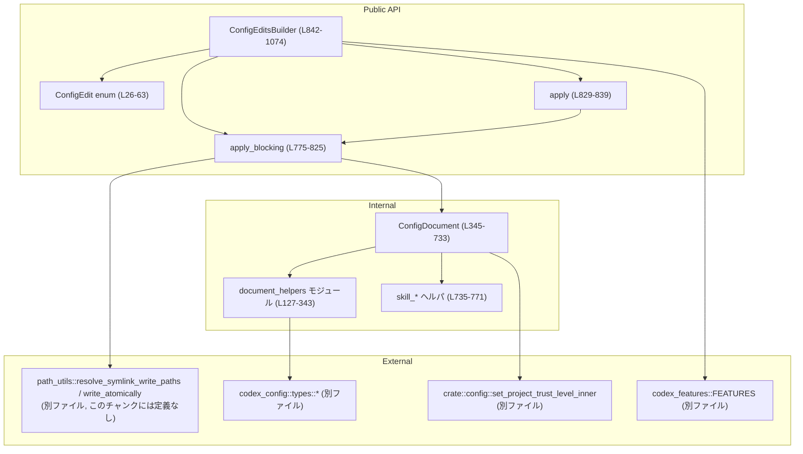
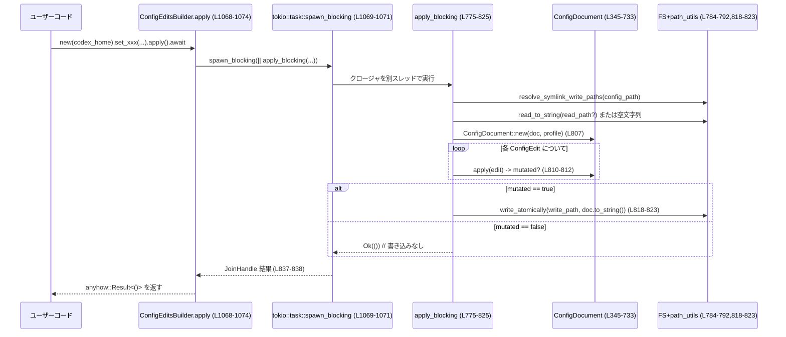

# core/src/config/edit.rs コード解説

## 0. ざっくり一言

ユーザー設定の `config.toml` に対して、**型安全な編集操作（`ConfigEdit`）を組み立てて、まとめて原子的に書き戻すためのモジュール**です（`core/src/config/edit.rs:L24-63`, `L775-839`, `L842-1074`）。

---

## 1. このモジュールの役割

### 1.1 概要

- このモジュールは **設定ファイル `config.toml` の部分的な更新**を行うためのエンジンです。
- 呼び出し側は `ConfigEdit` 列挙体で変更内容を表現し、`apply_blocking` / 非同期の `apply`、もしくは `ConfigEditsBuilder` を通じて複数の編集を一括適用します（`L24-63`, `L775-839`, `L842-1074`）。
- 内部では `toml_edit::DocumentMut` を使って **コメントやフォーマットをできるだけ保ったまま** TOML を更新し、`write_atomically` で原子的にディスクに保存します（`L17`, `L362-733`, `L818-823`）。

### 1.2 アーキテクチャ内での位置づけ

主なコンポーネント間の依存関係は次のようになっています。



- 設定ファイル I/O やシンボリックリンク処理は `path_utils` モジュールに委譲されています（`L1-2`, `L784-785`, `L818-823`）。実装詳細はこのチャンクには現れません。
- プロジェクト単位の `trust_level` 設定は、既存ロジック `config::set_project_trust_level_inner` に再委譲しています（`L431-437`）。

### 1.3 設計上のポイント

- **編集操作の列挙 (`ConfigEdit`)**  
  - すべての設定変更を `ConfigEdit` のバリアントで表現し、内部の `ConfigDocument::apply` で具体的な TOML 更新にマッピングします（`L24-63`, `L367-440`）。
- **TOML 編集の安全性とフォーマット保持**  
  - `toml_edit::DocumentMut` を用い、`preserve_decor` で既存の装飾（コメント、インデント等）を可能な範囲で引き継ぎます（`L17`, `L703-732`）。
  - インラインテーブルが存在する場合でも `ensure_table_for_write/read` で通常テーブルに昇格させてから書き込みます（`L139-169`）。
- **プロファイルスコープの扱い**  
  - `Scope` と `scoped_segments` により、グローバル設定と `profiles.<name>.…` 以下の設定を同一コードパスで扱います（`L351-354`, `L628-645`）。
- **非同期とブロッキング I/O の分離**  
  - ファイル I/O は `apply_blocking` に集約し、非同期 API `apply` と `ConfigEditsBuilder::apply` は `tokio::task::spawn_blocking` で別スレッドにオフロードします（`L829-839`, `L1068-1073`）。
- **変更検出（mutated フラグ）**  
  - すべての編集操作は「何か変更があったか」を `bool` で返し、1 つも変更が無い場合はファイルを書き戻しません（`L367-440`, `L808-815`）。

---

## 2. コンポーネントと主要な機能一覧

### 2.1 コンポーネントインベントリー（主要型・関数）

#### 公開 API

| 名前 | 種別 | 公開性 | 行範囲 | 役割 / 用途 |
|------|------|--------|--------|-------------|
| `ConfigEdit` | enum | `pub` | `edit.rs:L26-63` | 個々の設定変更（モデル選択、サービスティア、MCP サーバ、スキル設定など）を表現するコマンド型。 |
| `syntax_theme_edit` | 関数 | `pub` | `edit.rs:L73-78` | `[tui].theme` を与えられたテーマ名で設定する `ConfigEdit` を生成。 |
| `status_line_items_edit` | 関数 | `pub` | `edit.rs:L84-91` | `[tui].status_line` を文字列配列として明示的に設定する `ConfigEdit` を生成。空配列も書き込む。 |
| `terminal_title_items_edit` | 関数 | `pub` | `edit.rs:L97-104` | `[tui].terminal_title` を文字列配列として明示的に設定する `ConfigEdit` を生成。 |
| `model_availability_nux_count_edits` | 関数 | `pub` | `edit.rs:L106-124` | モデルごとの NUX 表示回数マップから、`[tui.model_availability_nux]` 以下をクリア・再構築する複数の `ConfigEdit` を生成。 |
| `apply_blocking` | 関数 | `pub` | `edit.rs:L775-825` | `ConfigEdit` のリストを読み込み済み `config.toml` に適用し、必要なら原子的に書き戻すブロッキング API。 |
| `apply` | 関数 | `pub async` | `edit.rs:L829-839` | `apply_blocking` を `tokio::task::spawn_blocking` 経由で呼び出す非同期ラッパー。 |
| `ConfigEditsBuilder` | 構造体 | `pub` | `edit.rs:L842-847` | 複数の `ConfigEdit` をメソッドチェーンで組み立て、`apply` / `apply_blocking` でまとめて反映するビルダー。 |
| `ConfigEditsBuilder::new` | メソッド | `pub` | `edit.rs:L850-856` | `codex_home` を指定してビルダーを初期化。 |
| `ConfigEditsBuilder::with_profile` | メソッド | `pub` | `edit.rs:L858-861` | 編集対象のプロファイル（`profiles.<name>`）を指定。 |
| `ConfigEditsBuilder::set_model` | メソッド | `pub` | `edit.rs:L863-869` | `ConfigEdit::SetModel` の追加。 |
| `ConfigEditsBuilder::set_service_tier` | メソッド | `pub` | `edit.rs:L871-874` | `ConfigEdit::SetServiceTier` の追加。 |
| `ConfigEditsBuilder::set_personality` | メソッド | `pub` | `edit.rs:L876-879` | `ConfigEdit::SetModelPersonality` の追加。 |
| `ConfigEditsBuilder::set_hide_*` 群 | メソッド | `pub` | `edit.rs:L882-907` | 各種 notice / migration フラグのトグル用 `ConfigEdit` を追加。 |
| `ConfigEditsBuilder::record_model_migration_seen` | メソッド | `pub` | `edit.rs:L909-915` | モデルマイグレーションの表示済み情報を書き込む `ConfigEdit` を追加。 |
| `ConfigEditsBuilder::set_windows_wsl_setup_acknowledged` | メソッド | `pub` | `edit.rs:L917-920` | Windows WSL セットアップ完了フラグ用 `ConfigEdit` を追加。 |
| `ConfigEditsBuilder::set_model_availability_nux_count` | メソッド | `pub` | `edit.rs:L923-926` | `model_availability_nux_count_edits` の結果をビルダーにまとめて追加。 |
| `ConfigEditsBuilder::replace_mcp_servers` | メソッド | `pub` | `edit.rs:L929-932` | `[mcp_servers]` テーブルを与えられたマップで置き換える `ConfigEdit` を追加。 |
| `ConfigEditsBuilder::set_project_trust_level` | メソッド | `pub` | `edit.rs:L935-943` | `ConfigEdit::SetProjectTrustLevel` を追加。実際の適用は `config.rs` 側ロジックに委譲。 |
| `ConfigEditsBuilder::set_feature_enabled` | メソッド | `pub` | `edit.rs:L947-977` | `[features]` または `profiles.<name>.features` の boolean フラグを、デフォルト値やスコープを考慮して Set/ClearPath に変換。 |
| `ConfigEditsBuilder::set_windows_sandbox_mode` | メソッド | `pub` | `edit.rs:L980-995` | `windows.sandbox`（プロファイル付きの場合は `profiles.<name>.windows.sandbox`）を設定。 |
| `ConfigEditsBuilder::set_realtime_microphone` | メソッド | `pub` | `edit.rs:L998-1007` | `[audio].microphone` の設定値を set/clear。 |
| `ConfigEditsBuilder::set_realtime_speaker` | メソッド | `pub` | `edit.rs:L1010-1019` | `[audio].speaker` の設定値を set/clear。 |
| `ConfigEditsBuilder::set_realtime_voice` | メソッド | `pub` | `edit.rs:L1022-1031` | `[realtime].voice` の設定値を set/clear。 |
| `ConfigEditsBuilder::clear_legacy_windows_sandbox_keys` | メソッド | `pub` | `edit.rs:L1034-1052` | 旧式の Windows サンドボックス関連 feature フラグを一括削除。 |
| `ConfigEditsBuilder::with_edits` | メソッド | `pub` | `edit.rs:L1054-1059` | すでに作成済みの `ConfigEdit` 群をビルダーに統合。 |
| `ConfigEditsBuilder::apply_blocking` | メソッド | `pub` | `edit.rs:L1062-1065` | ビルダー内部の `edits` を `apply_blocking` で同期適用。 |
| `ConfigEditsBuilder::apply` | メソッド | `pub async` | `edit.rs:L1068-1074` | ビルダー内部の `edits` を非同期に適用（`tokio::task::spawn_blocking` 経由）。 |

#### 内部コンポーネント（参考）

| 名前 | 種別 | 公開性 | 行範囲 | 役割 / 用途 |
|------|------|--------|--------|-------------|
| `NOTICE_TABLE_KEY` | 定数 | `const`（モジュール内） | `edit.rs:L22` | `[notice]` テーブルのキー文字列 `"notice"`。 |
| `SkillConfigSelector` | enum | モジュール内 | `edit.rs:L66-70` | スキル設定を名前またはパスで特定するための識別子。 |
| `mod document_helpers` | モジュール | `mod` | `edit.rs:L127-343` | MCP サーバ設定のシリアライズや、インラインテーブル/配列の補助関数群。`pub(super)` で `ConfigDocument` からのみ使用。 |
| `document_helpers::ensure_table_for_write/read` | 関数 | `pub(super)` | `edit.rs:L139-169` | `TomlItem` をテーブルとして書き込み/読み取り可能な形に正規化。インラインテーブルを通常テーブルへ変換。 |
| `document_helpers::serialize_mcp_server_*` | 関数群 | `fn`/`pub(super)` | `edit.rs:L171-286` | `McpServerConfig` / `McpServerToolConfig` を TOML テーブル/インラインテーブルにシリアライズ。 |
| `document_helpers::merge_inline_table` | 関数 | `pub(super)` | `edit.rs:L288-299` | 既存インラインテーブルと新しいインラインテーブルをマージ（装飾を維持しつつ値を上書き）。 |
| `ConfigDocument` | 構造体 | モジュール内 | `edit.rs:L345-348` | `DocumentMut` とプロファイル名を保持し、`ConfigEdit` を TOML 更新に適用する内部エンジン。 |
| `Scope` | enum | モジュール内 | `edit.rs:L351-354` | 設定のスコープ（`Global` / `Profile`）を区別。 |
| `TraversalMode` | enum | モジュール内 | `edit.rs:L356-360` | TOML 階層を辿る際に「存在する前提か」「無ければ作るか」を制御。 |
| `ConfigDocument::apply` | メソッド | `fn` | `edit.rs:L367-440` | `ConfigEdit` 1 件を `DocumentMut` に反映し、「変更されたか」を返す。 |
| `ConfigDocument::replace_mcp_servers` | メソッド | `fn` | `edit.rs:L464-515` | `[mcp_servers]` テーブルの差分更新（削除・追加・インラインテーブルのマージ）。 |
| `ConfigDocument::set_skill_config` | メソッド | `fn` | `edit.rs:L517-625` | `[[skills.config]]` 配列を編集して、スキルの enable/disable オーバーライドを管理。 |
| `ConfigDocument::preserve_decor` | メソッド | `fn` | `edit.rs:L703-732` | テーブルや値の装飾情報（コメント・空白）を既存項目から新項目へコピー。 |
| `normalize_skill_config_path` | 関数 | `fn` | `edit.rs:L735-739` | スキルパスを `dunce::canonicalize` で正規化し、文字列に変換。 |
| `skill_config_selector_from_table` | 関数 | `fn` | `edit.rs:L742-758` | `[[skills.config]]` の 1 テーブルから `SkillConfigSelector` を復元。 |
| `write_skill_config_selector` | 関数 | `fn` | `edit.rs:L761-771` | テーブルに `name` または `path` を書き込み、もう片方を削除。 |
| `mod tests` | モジュール | `cfg(test)` | `edit.rs:L1077-1079` | テストコード（`edit_tests.rs`）を参照。このチャンクには中身は現れません。 |

### 2.2 主要な機能（概要）

- 設定変更コマンド DSL: `ConfigEdit` による **離散的な設定変更操作のモデル化**（`L24-63`）。
- TUI 設定のユーティリティ: テーマ・ステータスライン・ターミナルタイトルを簡単に編集する関数（`L73-104`）。
- NUX（初回体験）カウンタの管理: モデルごとの表示回数を `[tui.model_availability_nux]` にシリアライズ（`L106-124`）。
- MCP サーバ設定の置き換えとシリアライズ: `[mcp_servers]` テーブルの差分更新と `McpServerConfig` の TOML 化（`L464-515`, `L171-265`）。
- スキル設定の有効/無効化: `[[skills.config]]` 配列の編集によるスキルごとのオーバーライド管理（`L517-625`, `L742-771`）。
- プロジェクトの信頼レベル設定: `ConfigEdit::SetProjectTrustLevel` と `config::set_project_trust_level_inner` による `[projects."<path>"].trust_level` の変更（`L54-56`, `L431-437`）。
- feature フラグ管理: `FEATURES` メタデータに基づく `[features]` やプロファイルスコープの feature on/off（`L947-977`）。
- Windows／リアルタイム系設定: Windows サンドボックスやオーディオ入出力、リアルタイム音声設定の set/clear ヘルパ（`L980-1031`, `L1034-1052`）。
- 設定の永続化（同期・非同期）: `apply_blocking` / `apply` / `ConfigEditsBuilder` による原子的な書き込み（`L775-825`, `L829-839`, `L842-1074`）。

---

## 3. 公開 API と詳細解説

### 3.1 型一覧

| 型名 | 種別 | 公開性 | 行範囲 | 役割 / 用途 |
|------|------|--------|--------|-------------|
| `ConfigEdit` | enum | `pub` | `edit.rs:L26-63` | 設定変更操作（モデルや notice フラグ、MCP サーバ、スキル設定、任意パス set/clear など）を表現。 |
| `ConfigEditsBuilder` | struct | `pub` | `edit.rs:L842-847` | 複数の `ConfigEdit` を蓄積し、一括で `apply_blocking` / `apply` を呼ぶためのビルダー。 |
| `SkillConfigSelector` | enum | モジュール内 | `edit.rs:L66-70` | スキル設定を名前 or ファイルパスで識別する内部ヘルパ。 |
| `ConfigDocument` | struct | モジュール内 | `edit.rs:L345-348` | `DocumentMut` とプロファイル名を保持し、`ConfigEdit` を実際の TOML 操作にマッピングする内部型。 |
| `Scope` | enum | モジュール内 | `edit.rs:L351-354` | 設定スコープ（グローバル or プロファイル）。 |
| `TraversalMode` | enum | モジュール内 | `edit.rs:L356-360` | TOML 階層を辿る際に新規作成を許可するかどうかのモード。 |

### 3.2 関数詳細（7 件）

#### 1. `syntax_theme_edit(name: &str) -> ConfigEdit` （L73-78）

**概要**

- `[tui].theme = "<name>"` を設定する `ConfigEdit::SetPath` を生成します（`edit.rs:L73-78`）。

**引数**

| 引数名 | 型 | 説明 |
|--------|----|------|
| `name` | `&str` | 設定したいテーマ名。 |

**戻り値**

- `ConfigEdit::SetPath`  
  - `segments = ["tui", "theme"]`  
  - `value = toml_edit::value(name.to_string())`（`L74-77`）

**内部処理**

1. `"tui"` と `"theme"` の 2 セグメントを持つ `Vec<String>` を作成（`L75`）。
2. `name` を `String` に変換し、`toml_edit::value` で `TomlItem::Value` に変換（`L76`）。
3. これらをフィールドに持つ `ConfigEdit::SetPath` バリアントを返却（`L74-77`）。

**Examples（使用例）**

```rust
use std::path::Path;
use core::config::edit::{ConfigEditsBuilder, syntax_theme_edit};

// codex_home ディレクトリを決める                         // config.toml があるルート
let codex_home = Path::new("/path/to/codex_home");

// ビルダーを作成し、syntax_theme_edit を追加              // ConfigEdit を1つ追加
let builder = ConfigEditsBuilder::new(codex_home)          // codex_home を設定
    .with_edits([syntax_theme_edit("solarized-dark")]);    // [tui].theme を設定

// ブロッキングで適用                                     // 同期的にファイルへ書き込み
builder.apply_blocking()?;                                 // anyhow::Result<()> を返す
```

**Errors / Panics**

- この関数自体はエラーもパニックも発生させません。  
  実際のエラーは `ConfigEdit` を適用する `apply_blocking` / `apply` 側で発生します。

**Edge cases**

- `name` が空文字列でもそのまま書き込まれます。  
  バリデーションは行っていません（`L73-78`から判断）。

**使用上の注意点**

- テーマ名の妥当性（存在するテーマかどうか）はこの関数では検証されません。  
  呼び出し元で必要に応じてチェックする前提の構造になっています。

---

#### 2. `model_availability_nux_count_edits(shown_count: &HashMap<String, u32>) -> Vec<ConfigEdit>` （L106-124）

**概要**

- モデルごとの NUX（案内）表示回数を、`[tui.model_availability_nux]` 以下のキーに書き込む `ConfigEdit` のリストを生成します（`edit.rs:L106-124`）。

**引数**

| 引数名 | 型 | 説明 |
|--------|----|------|
| `shown_count` | `&HashMap<String, u32>` | モデルスラッグ → 表示回数のマップ。 |

**戻り値**

- `Vec<ConfigEdit>`  
  - 先頭に `ClearPath(["tui", "model_availability_nux"])`（`L110-112`）。  
  - 続いて各モデルについて `SetPath(["tui", "model_availability_nux", <slug>]) = i64(count)`（`L113-121`）。

**内部処理**

1. `shown_count` のキー/値を `Vec<(&String, &u32)>` にしてソート（`sort_unstable_by`）（`L107-108`）。
2. `edits` ベクタを作り、最初に `[tui.model_availability_nux]` の `ClearPath` を追加（`L110-112`）。
3. ソート済みエントリを順番に走査し、各モデルスラッグのキーに対して `SetPath` を追加（`L113-121`）。
4. 生成した `Vec<ConfigEdit>` を返却（`L124`）。

**Examples（使用例）**

```rust
use std::collections::HashMap;
use std::path::Path;
use core::config::edit::{ConfigEditsBuilder, model_availability_nux_count_edits};

let mut counts = HashMap::new();                                      // 空のマップを作る
counts.insert("gpt-4.1-mini".to_string(), 3);                         // モデルごとの表示回数
counts.insert("gpt-4.1".to_string(), 1);

let edits = model_availability_nux_count_edits(&counts);              // ConfigEdit のベクタ生成
let codex_home = Path::new("/path/to/codex_home");

ConfigEditsBuilder::new(codex_home)                                   // ビルダー作成
    .with_edits(edits)                                                // NUX カウンタ関連の編集を取り込む
    .apply_blocking()?;                                               // 同期的に適用
```

**Errors / Panics**

- 本関数内にはエラーを返す処理やパニック要因はありません。
- `u32` → `i64` の変換は範囲内なので安全です（`L120`）。

**Edge cases**

- `shown_count` が空の場合  
  - `[tui.model_availability_nux]` はクリアされますが、新しいエントリは追加されません（`L110-112`）。
- 同じキーが複数回現れるケースは、`HashMap` の性質上、最後に挿入した値のみが使用されます。

**使用上の注意点**

- `Apply` 側で `ClearPath` → `SetPath` の順に適用される前提で設計されています。  
  1 つの `Vec<ConfigEdit>` 内に順序が保持されるため、`ConfigEditsBuilder::with_edits` でそのまま渡せば順序は保たれます（`L1054-1059`）。

---

#### 3. `ConfigDocument::apply(&mut self, edit: &ConfigEdit) -> anyhow::Result<bool>` （L367-440）

**概要**

- 内部エンジン `ConfigDocument` 上で、1 つの `ConfigEdit` を適用し、「設定が実際に変更されたかどうか」を `bool` で返します（`edit.rs:L367-440`）。
- ほとんどの `ConfigEdit` バリアントについて、この関数が唯一の適用ロジックです。

**引数**

| 引数名 | 型 | 説明 |
|--------|----|------|
| `self` | `&mut ConfigDocument` | 編集対象の TOML ドキュメントとプロファイル情報。 |
| `edit` | `&ConfigEdit` | 適用する設定変更コマンド。 |

**戻り値**

- `anyhow::Result<bool>`  
  - `Ok(true)` … ドキュメントが変更された場合。  
  - `Ok(false)` … 変更がなかった場合（すでに同じ状態、バリデーションによりスキップなど）。  
  - `Err(_)` … `SetProjectTrustLevel` で委譲した `set_project_trust_level_inner` が失敗した場合（`L431-437`）。

**内部処理の流れ**

主要な分岐のみ抜粋します。

1. `match edit` でバリアントごとの処理を切り替え（`L368-440`）。
2. `SetModel`  
   - `write_profile_value(["model"], …)` と `write_profile_value(["model_reasoning_effort"], …)` を呼ぶ。どちらかが変更されれば `true`（`L369-380`）。
3. `SetServiceTier` / `SetModelPersonality`  
   - 同様に `write_profile_value` を通じてプロファイルスコープに書き込み（`L381-388`）。
4. 各種 `SetNoticeHide*` 等  
   - `Scope::Global` と `[NOTICE_TABLE_KEY, "..."]` への書き込み。`NOTICE_TABLE_KEY` は `"notice"`（`L389-420`）。  
   - `write_value` → `insert` → `descend` を通じて `DocumentMut` を更新（`L450-453`, `L648-663`, `L677-700`）。
5. `ReplaceMcpServers`  
   - `replace_mcp_servers` を呼び出し（`L421-422`, `L464-515`）。
6. `SetSkillConfig` / `SetSkillConfigByName`  
   - `set_skill_config` に `SkillConfigSelector::Path/Name` を渡してスキル設定を更新（`L423-427`, `L517-625`）。
7. `SetPath` / `ClearPath`  
   - `insert` / `clear_owned` で任意パスの値をセットまたは削除（`L428-429`, `L648-663`, `L460-462`）。
8. `SetProjectTrustLevel`  
   - `crate::config::set_project_trust_level_inner` を呼び、エラーをそのまま `?` で伝播（`L431-437`）。

**Examples（使用例）**

`ConfigDocument` は外部公開されていないため、直接使うことは想定されていません。  
外部からは `apply_blocking` または `ConfigEditsBuilder` 経由で使用します。

```rust
// 擬似コード: apply_blocking 内のループに相当
for edit in edits {                         // edits: &[ConfigEdit]
    mutated |= document.apply(edit)?;      // 何か変わったら true を OR する (L810-812)
}
```

**Errors / Panics**

- `SetProjectTrustLevel` のみ、内部で `set_project_trust_level_inner(..)?` を呼ぶため、ここでエラーが起こり得ます（`L431-437`）。
- それ以外の分岐では `Result` を返さず、パニックを起こすような `unwrap` もありません。

**Edge cases**

- `SetSkillConfig` / `SetSkillConfigByName` において、名前が空文字列の場合は即座に `false` を返し、何も変更しません（`L524-526`）。
- `SetPath` に空の `segments` が渡された場合、`insert` の `split_last` が `None` を返し `false` になり、変更されません（`L648-651`）。  
  このような入力を行う呼び出し側があるかどうかは、このチャンクには現れません。

**使用上の注意点**

- `apply` の戻り値 `bool` は「その edit で実際にファイル内容が変わったかどうか」を示し、上位ではファイル書き込み有無の判定に使われます（`L808-815`）。
- 新しい `ConfigEdit` バリアントを追加する際は、ここに対応処理を追加しないと無視されます。

---

#### 4. `ConfigDocument::set_skill_config(&mut self, selector: SkillConfigSelector, enabled: bool) -> bool` （L517-625）

**概要**

- `[[skills.config]]` 配列を編集して、特定スキルの「無効化オーバーライド」を追加・更新・削除します（`edit.rs:L517-625`）。
- `enabled == true` の場合は **無効化設定を削除**（＝デフォルトに戻す）、`enabled == false` の場合は **無効化エントリを作成/更新** する挙動になっています。

**引数**

| 引数名 | 型 | 説明 |
|--------|----|------|
| `selector` | `SkillConfigSelector` | スキルを名前またはパスで識別する。初期値は `ConfigEdit` から渡される。 |
| `enabled` | `bool` | `true` なら無効化オーバーライドを削除（＝有効化）、`false` なら無効化オーバーライドを設定。 |

**戻り値**

- `bool`  
  - `true` … ドキュメントが変更された。  
  - `false` … 何も変更していない（既に同じ状態・入力無効など）。

**内部処理の流れ**

1. `selector` の正規化  
   - 名前の場合は `trim()` して空白を除去。パスの場合は `normalize_skill_config_path` で正規化（`L518-522`, `L735-739`）。
   - 名前が空になった場合は `false` を返して終了（`L524-526`）。
2. `skills` テーブルの取得または作成  
   - 既に存在するなら使用（`L531-533`）。  
   - 存在しない場合、`enabled == true` なら「無効化すべきエントリも無い」と判断して `false`（`L535-537`）。  
   - `enabled == false` の場合は新規作成（`L538-545`）。
3. `skills.config` の取得または作成  
   - `TomlItem::ArrayOfTables` でなければならない。違う場合で `enabled == true` なら `false` を返す（`L559-577`）。  
   - `enabled == false` の場合は空の `ArrayOfTables` に差し替える（`L573-578`）。
4. 既存エントリの探索  
   - `skill_config_selector_from_table` で各配列要素から `SkillConfigSelector` を生成し、`selector` と等しいもののインデックスを探す（`L580-588`, `L742-758`）。
5. `enabled` による分岐  
   - `enabled == true` かつ既存エントリがある場合 → その要素を削除。配列が空になれば `skills.config` を削除し、`skills` テーブルも空なら削除フラグを立てる（`L590-599`）。  
   - `enabled == false` かつ既存エントリがある場合 → 該当テーブルに対してセレクタを書き戻し、`enabled = false` をセット（`L601-607`）。  
   - `enabled == false` かつ既存エントリがない場合 → 新規テーブルを作成し、セレクタと `enabled = false` を設定して配列末尾に追加（`L610-616`）。
6. 外側の `remove_skills_table` フラグが立っている場合は `skills` テーブル自体を削除（`L620-623`）。

**Examples（使用例 - 概念的）**

この関数も内部専用で、直接呼ぶことはありません。概念的な挙動のみ示します。

- あるスキルを**無効化する**（オーバーライド追加）: `selector = Name("foo")`, `enabled = false`  
- あるスキルを**有効化に戻す**（オーバーライド削除）: `selector = Name("foo")`, `enabled = true`  

**Errors / Panics**

- この関数自体は `Result` を返さず、`unwrap` も使用していません。  
  条件が合わない場合は早期 `return false` で終わります。

**Edge cases**

- `skills` テーブルが存在しない & `enabled == true` の場合は何も行わず `false`（`L535-537`）。  
  → すでに「デフォルト状態」であるためです。
- `skills.config` が ArrayOfTables 以外の型だった場合  
  - `enabled == true` では何もせず `false`（`L573-576`）。  
  - `enabled == false` では型を強制的に ArrayOfTables に置き換え（`L577-578`）。
- 同じスキルに対して複数エントリが存在する可能性は、`existing_index` が最初の 1 件のみを対象にしているため、残りは維持されます（`L584-588`）。

**使用上の注意点**

- スキル名の比較はトリム済み文字列の完全一致、パス比較は `normalize_skill_config_path` の結果の一致で行われます（`L518-522`, `L742-747`）。
- 「無効化」情報を持たない＝デフォルト状態（おそらく有効）という前提で設計されていることに注意が必要です。

---

#### 5. `apply_blocking(codex_home: &Path, profile: Option<&str>, edits: &[ConfigEdit]) -> anyhow::Result<()>` （L775-825）

**概要**

- 設定ディレクトリ `codex_home` 配下の `CONFIG_TOML_FILE` を読み込み、与えられた `ConfigEdit` 群をすべて適用し、変更があれば `write_atomically` で書き戻す同期 API です（`edit.rs:L775-825`）。
- **言語固有の安全性/エラー処理**として、`anyhow::Result` と `?` 演算子、`with_context` を用いて詳細なエラー情報を提供します（`L775-825`）。

**引数**

| 引数名 | 型 | 説明 |
|--------|----|------|
| `codex_home` | `&Path` | `config.toml` が存在するルートディレクトリ。 |
| `profile` | `Option<&str>` | 編集対象のプロファイル名。`None` の場合は後でドキュメント内の `profile` キーを見る。 |
| `edits` | `&[ConfigEdit]` | 適用する設定変更の一覧。 |

**戻り値**

- `anyhow::Result<()>`  
  - 成功時は `Ok(())`。  
  - ファイル I/O・TOML パース・シンボリックリンク解決などに失敗すると `Err`。

**内部処理の流れ**

1. `edits` が空なら即 `Ok(())`（`L780-782`）。
2. `codex_home.join(CONFIG_TOML_FILE)` で設定ファイルパスを生成（`L784`）。
3. `resolve_symlink_write_paths` で書き込み・読み込み用パスを取得（`L785`）。  
   - この関数の詳細はこのチャンクには現れません。
4. 読み込みパスがあれば `std::fs::read_to_string` で内容を読み込む。ファイルが無い場合は空文字列とみなす（`L786-792`）。
5. 読み込んだ文字列が空なら `DocumentMut::new()`、それ以外なら `parse::<DocumentMut>()` で TOML をパース（`L795-799`）。
6. プロファイルの決定  
   - 引数 `profile` が `Some` ならそれを採用。  
   - `None` の場合、TOML 内の `profile` キーを文字列として取得（`L801-805`）。
7. `ConfigDocument::new(doc, profile)` で内部エンジンを生成し、各 `edit` に対して `apply` を実行。`mutated` フラグに OR（`L807-812`）。
8. 1 つも変更されなかった場合は何も書き込まず `Ok(())`（`L814-815`）。
9. 変更があった場合は `write_atomically(write_paths.write_path, document.doc.to_string())` を呼び出し、`with_context` でエラーにファイルパス情報を付与（`L818-823`）。

**Examples（使用例）**

```rust
use std::path::Path;
use core::config::edit::{ConfigEdit, apply_blocking};

let codex_home = Path::new("/path/to/codex_home");        // 設定ディレクトリ
let edits = vec![
    ConfigEdit::SetNoticeHideFullAccessWarning(true),     // フラグを更新
];

apply_blocking(codex_home, None, &edits)?;                // デフォルトプロファイルで適用
```

**Errors / Panics**

- エラー発生箇所（いずれも `?` で伝播, `anyhow::Error` にラップされます）:
  - `resolve_symlink_write_paths` 失敗（`L785`）。
  - `DocumentMut::parse` による TOML パースエラー（`L798-799`）。
  - `write_atomically` 中の I/O エラー（`L818-823`）。
- `std::fs::read_to_string` の `NotFound` だけは空文字列として扱い、それ以外は `Err` に変換します（`L787-791`）。
- この関数自体には `unwrap` はなく、明示的なパニックはありません。

**Edge cases**

- 設定ファイルが存在しない場合  
  - 空の `DocumentMut` として扱われ、初回書き込み時に新しい `config.toml` が生成される挙動になります（`L786-799`）。
- `edits` がすべて「結果的に無変更」な場合（例: 既に同じ値になっている）  
  - `mutated == false` のままとなり、ファイルへの書き込みは行われません（`L808-815`）。

**使用上の注意点**

- **並行性**:  
  - `apply_blocking` 自体はファイルロックを行っていません。このモジュール内には他プロセスとの競合制御は現れないため、同一 `config.toml` に対する並列更新があると、最後に書いた方が勝つ挙動になります。
- 呼び出し側スレッドをブロックするため、非同期コンテキストからは `apply`（後述）の使用が適切です。

---

#### 6. `apply(codex_home: &Path, profile: Option<&str>, edits: Vec<ConfigEdit>) -> anyhow::Result<()>` （L829-839）

**概要**

- `apply_blocking` を `tokio::task::spawn_blocking` で別スレッドにオフロードする **非同期版 API** です（`edit.rs:L829-839`）。
- 非同期ランタイム（tokio）上でブロッキング I/O を安全に扱うためのラッパーです。

**引数**

| 引数名 | 型 | 説明 |
|--------|----|------|
| `codex_home` | `&Path` | 設定ディレクトリ。 |
| `profile` | `Option<&str>` | プロファイル名。 |
| `edits` | `Vec<ConfigEdit>` | 適用する編集操作。所有権をスレッドに移すため `Vec`。 |

**戻り値**

- `anyhow::Result<()>`  
  - `apply_blocking` と同じ結果を非同期に返します（`L836-838`）。

**内部処理の流れ**

1. `codex_home` と `profile` を `to_path_buf` / `ToOwned::to_owned` で所有権付きの値に変換（`L834-835`）。
2. `tokio::task::spawn_blocking(move || apply_blocking(&codex_home, profile.as_deref(), &edits))` を呼び出し（`L836`）。
3. `await` で `JoinHandle` の結果を待ち、`context("config persistence task panicked")?` でスレッドパニックを `anyhow::Error` に変換（`L837-838`）。

**Examples（使用例）**

```rust
use std::path::Path;
use core::config::edit::{ConfigEdit, apply};

#[tokio::main]                               // tokio ランタイムを起動
async fn main() -> anyhow::Result<()> {
    let codex_home = Path::new("/path/to/codex_home");
    let edits = vec![
        ConfigEdit::SetNoticeHideWorldWritableWarning(true),
    ];

    apply(codex_home, Some("work"), edits).await?; // 非同期で適用
    Ok(())
}
```

**Errors / Panics**

- `apply_blocking` 由来のエラーをそのまま返します（`L836-838`）。
- `spawn_blocking` 内部でパニックが起きた場合、`JoinError` が `context("config persistence task panicked")?` によって `anyhow::Error` となります（`L837-838`）。
  - 呼び出し側から見ると「パニック」は `Err` として観測され、再パニックしません。

**Edge cases**

- `edits` が空でも `apply_blocking` と同じロジックで即座に `Ok(())` になります（`L780-782` 参照）。

**使用上の注意点**

- **非同期コンテキスト専用**  
  - `.await` を呼ぶには tokio ランタイムが必要です。
- `edits` の所有権は `spawn_blocking` に移動し、その後は使用できません（`move ||` クロージャ, `L836`）。
- `apply` を高頻度で呼び出すと、スレッドプールに多数のブロッキングタスクが積まれる可能性があるため、上位レイヤーでバッチングする設計（`ConfigEditsBuilder`）が用意されています。

---

#### 7. `ConfigEditsBuilder::set_feature_enabled(&mut self, key: &str, enabled: bool) -> Self` （L947-977）

※ 実際には `mut self` を取り `Self` を返すメソッドです。

**概要**

- `[features]` または `profiles.<name>.features` における feature フラグを、**デフォルト値の有無を考慮しながら on/off** する `ConfigEdit` を追加します（`edit.rs:L947-977`）。
- 「デフォルトで無効（default_enabled == false）」な feature を root スコープで無効化する場合は、明示的に `false` を書かず `ClearPath` でキー自体を削除する、というポリシーを実現しています（`L949-952`, `L965-975`）。

**引数**

| 引数名 | 型 | 説明 |
|--------|----|------|
| `self` | `Self`（所有権を持つビルダー） | メソッドチェーン用。 |
| `key` | `&str` | feature キー名。 |
| `enabled` | `bool` | 有効化 (`true`) か無効化 (`false`)。 |

**戻り値**

- `Self`  
  - `self.edits` に `ConfigEdit::SetPath` または `ClearPath` を追加したビルダー自身（`L969-977`）。

**内部処理の流れ**

1. プロファイルスコープ判定  
   - `profile_scoped = self.profile.is_some()`（`L954`）。  
   - プロファイルありなら `["profiles", profile, "features", key]`、なければ `["features", key]` のセグメントを構築（`L955-964`）。
2. feature メタデータから `default_enabled` を取得  
   - `FEATURES.iter().find(|spec| spec.key == key)` で該当 spec を探索。  
   - 見つかった場合、`!spec.default_enabled` なら「デフォルト false」の feature と判定（`L965-968`）。  
     - 見つからない場合は `is_default_false_feature = false`。
3. 追加する `ConfigEdit` の選択（`L969-975`）
   - 以下のいずれかに該当する場合は **値を書き込む** (`SetPath`)：  
     - `enabled == true`  
     - プロファイルスコープ (`profile_scoped == true`)  
     - デフォルト false feature ではない (`!is_default_false_feature`)  
   - それ以外（root スコープかつデフォルト false feature を無効化する場合）は `ClearPath` を追加。

**Examples（使用例）**

```rust
use std::path::Path;
use core::config::edit::ConfigEditsBuilder;

let codex_home = Path::new("/path/to/codex_home");

// ルートスコープで feature を有効化する例
ConfigEditsBuilder::new(codex_home)
    .set_feature_enabled("experimental_tool", true)   // [features].experimental_tool = true
    .apply_blocking()?;

// プロファイルスコープで feature を無効化する例
ConfigEditsBuilder::new(codex_home)
    .with_profile(Some("work"))                       // profiles.work を対象
    .set_feature_enabled("experimental_tool", false)  // profiles.work.features.experimental_tool = false
    .apply_blocking()?;
```

**Errors / Panics**

- このメソッド自体はエラーを返さず、`panic!` を発生させるコードもありません。
- `FEATURES` に `key` が見つからない場合でも、`is_default_false_feature` が単に `false` になるだけで、特別なエラー処理はありません（`L965-968`）。

**Edge cases**

- `FEATURES` に存在しないキー  
  - 常に「デフォルト true 扱い」として処理されます（`is_default_false_feature == false`）。
- デフォルト false の feature を root スコープで無効化  
  - `ClearPath` が追加されるだけで `false` は書き込まれません。  
  - これにより、将来 feature が「デフォルト true」になったときにも設定ファイルが邪魔をしない設計です（`L949-952`, `L969-975`）。

**使用上の注意点**

- 特定 feature のデフォルト値は `codex_features::FEATURES` に依存します。このチャンク内には定義が無いため詳細は不明ですが（`L6`, `L965-968`）、実装コメントから「graduation（正式化）時に設定ファイルに縛られないため」の配慮であると読み取れます（`L947-952` のコメント）。
- 異なるプロファイル間で同一 feature を異なる値にしたい場合、`with_profile(Some(..))` を使ってスコープを明示する必要があります（`L858-861`, `L955-961`）。

---

### 3.3 その他の関数（概要一覧）

| 関数名 / メソッド名 | 役割（1 行） | 行範囲 |
|----------------------|-------------|--------|
| `status_line_items_edit` | `[tui].status_line` を明示的な配列として設定する `ConfigEdit` 生成関数。 | `edit.rs:L84-91` |
| `terminal_title_items_edit` | `[tui].terminal_title` を明示的な配列として設定する `ConfigEdit` 生成関数。 | `edit.rs:L97-104` |
| `document_helpers::ensure_table_for_write/read` | TOML アイテムをテーブルとして扱えるように正規化する内部ヘルパ。 | `edit.rs:L139-169` |
| `document_helpers::serialize_mcp_server(_inline)` | `McpServerConfig` を TOML テーブル／インラインテーブルに変換。 | `edit.rs:L171-265`, `L280-286` |
| `document_helpers::merge_inline_table` | インラインテーブル同士を、装飾を維持しつつ値をマージ。 | `edit.rs:L288-299` |
| `ConfigDocument::replace_mcp_servers` | `[mcp_servers]` テーブルの差分更新ロジック。 | `edit.rs:L464-515` |
| `ConfigDocument::scoped_segments` | `Scope` と `profile` 情報から `profiles.<name>.…` 形式のパスを生成。 | `edit.rs:L628-645` |
| `ConfigDocument::insert/remove/descend` | `DocumentMut` 内部のネストされたテーブルを辿って値を挿入・削除する汎用ロジック。 | `edit.rs:L648-675`, `L677-700` |
| `normalize_skill_config_path` | スキルパスを canonicalize した文字列に変換。 | `edit.rs:L735-739` |
| `skill_config_selector_from_table` | `[[skills.config]]` の1エントリから `SkillConfigSelector` を復元。 | `edit.rs:L742-758` |
| `write_skill_config_selector` | `SkillConfigSelector` をテーブルに書き戻し、`name`/`path` の整合性を保つ。 | `edit.rs:L761-771` |
| `ConfigEditsBuilder::set_model` など各種 setter | 適切な `ConfigEdit` バリアントを `self.edits` に追加する薄いラッパ。 | `edit.rs:L863-943`, `L980-1031` |
| `ConfigEditsBuilder::clear_legacy_windows_sandbox_keys` | 旧式 feature フラグの `ClearPath` を一括生成。 | `edit.rs:L1034-1052` |
| `ConfigEditsBuilder::with_edits` | 既存の `ConfigEdit` ベクタをビルダーに統合。 | `edit.rs:L1054-1059` |
| `ConfigEditsBuilder::apply_blocking` / `apply` | ビルダー内部の `edits` を同期／非同期で永続化。 | `edit.rs:L1062-1065`, `L1068-1074` |

---

## 4. データフロー

ここでは、典型的な使用シナリオ「ビルダーで編集を組み立てて非同期適用」を例に、データフローを示します。

### 4.1 シーケンス図



### 4.2 要点

- **I/O は常にブロッキングスレッドで実行**され、非同期 API は単にその結果を `.await` します（`L829-839`, `L1068-1074`）。
- `ConfigEdit` 群は `ConfigDocument::apply` によって逐次的に適用され、`mutated` フラグで「何か変更があったか」を追跡します（`L807-812`）。
- 変更がなければ `write_atomically` は呼ばれません（`L814-815`）。

---

## 5. 使い方（How to Use）

### 5.1 基本的な使用方法（ビルダー + 同期適用）

```rust
use std::collections::HashMap;
use std::path::Path;
use core::config::edit::{ConfigEditsBuilder, ConfigEdit};   // このモジュールの公開 API をインポート

fn main() -> anyhow::Result<()> {
    let codex_home = Path::new("/path/to/codex_home");       // config.toml のルートディレクトリ

    // NUX カウンタの例示用マップを作成
    let mut nux_counts = HashMap::new();                     // HashMap<String,u32> を作る
    nux_counts.insert("gpt-4.1-mini".to_string(), 3);        // モデルごとの表示回数
    nux_counts.insert("gpt-4.1".to_string(), 1);

    // ビルダーで一連の編集を組み立てる
    ConfigEditsBuilder::new(codex_home)                      // codex_home を指定してビルダー生成 (L850-856)
        .with_profile(Some("work"))                          // プロファイル "work" を対象にする (L858-861)
        .set_model(Some("gpt-4.1-mini"), None)               // モデルを設定 (L863-869)
        .set_service_tier(None)                              // サービスティアをリセット (L871-874)
        .set_hide_full_access_warning(true)                  // notice フラグを更新 (L882-885)
        .set_model_availability_nux_count(&nux_counts)       // NUX カウンタを反映 (L923-926)
        .set_feature_enabled("experimental_tool", true)      // feature を有効化 (L947-977)
        .apply_blocking()?;                                  // 同期適用 (L1062-1065)

    Ok(())
}
```

### 5.2 非同期コンテキストでの使用（tokio）

```rust
use std::path::Path;
use core::config::edit::ConfigEditsBuilder;          // ビルダー API を使用

#[tokio::main]                                      // tokio ランタイムを起動
async fn main() -> anyhow::Result<()> {
    let codex_home = Path::new("/path/to/codex_home");

    ConfigEditsBuilder::new(codex_home)             // ビルダー生成
        .set_windows_wsl_setup_acknowledged(true)   // Windows WSL セットアップ完了フラグ (L917-920)
        .set_windows_sandbox_mode("isolated")       // Windows サンドボックスモード設定 (L980-995)
        .apply()                                    // 非同期適用 (L1068-1074)
        .await?;

    Ok(())
}
```

### 5.3 よくある使用パターン

- **単純な1項目編集**  
  - 直接 `ConfigEdit` を構築し、`apply_blocking` / `apply` に渡す（`L24-63`, `L775-839`）。
- **複数編集のバッチ適用**  
  - `ConfigEditsBuilder` を使い、メソッドチェーンでまとめて編集を追加し、一度だけディスク書き込みを行う（`L842-1074`）。
- **プロファイルごとの上書き**  
  - `with_profile(Some("name"))` を呼んでから setter を使うと、`profiles.<name>.…` に対してのみ編集が行われます（`L858-861`, `L628-645`）。

### 5.3 よくある間違い

```rust
use std::path::Path;
use core::config::edit::{ConfigEditsBuilder, apply_blocking};

// 間違い例: apply_blocking を非同期コンテキストで直接呼ぶ
#[tokio::main]
async fn wrong() -> anyhow::Result<()> {
    let codex_home = Path::new("/path/to/codex_home");
    let edits = vec![];                            // 実際には何か ConfigEdit を入れる

    // 悪い例: 非同期コンテキストでブロッキング I/O を直に呼ぶ
    apply_blocking(codex_home, None, &edits)?;     // ランタイムのスレッドをブロックする
    Ok(())
}

// 正しい例: apply (非同期版) を利用
#[tokio::main]
async fn correct() -> anyhow::Result<()> {
    let codex_home = Path::new("/path/to/codex_home");
    let builder = ConfigEditsBuilder::new(codex_home)
        .set_hide_world_writable_warning(true);   // ConfigEdit を追加

    builder.apply().await?;                       // spawn_blocking 経由でブロッキング I/O をオフロード
    Ok(())
}
```

### 5.4 使用上の注意点（まとめ）

- **並行更新**:  
  - このモジュール内にはファイルロックが無く、同一 `config.toml` を複数プロセス／スレッドが同時に更新すると、最後に書いたものが勝つ挙動になります。
- **プロファイルスコープ**:  
  - `Scope::Profile` は `scoped_segments` を通じて `profiles.<name>.…` に変換されます（`L628-645`）。  
  - 直接 `ConfigEdit::SetPath` を生成する場合、プロファイルを意識したパスかどうかは呼び出し側の責任になります。
- **Feature フラグのデフォルト**:  
  - `set_feature_enabled` は `FEATURES` に基づき「デフォルト false feature は root で `false` を書かない」という振る舞いをします（`L947-977`）。  
  - 期待するデフォルトと異なる振る舞いにならないよう、キー名とメタデータの整合性に注意が必要です。

---

## 6. 変更の仕方（How to Modify）

### 6.1 新しい設定編集機能を追加する場合

1. **`ConfigEdit` にバリアント追加**  
   - 例: `SetFooBar { value: FooType }` を追加（`L26-63`）。  
   - 必要な型は `use` 句を追加して導入。
2. **`ConfigDocument::apply` に対応分岐追加**  
   - `match edit` に新バリアントの腕を追加し、`write_value` / `insert` / `set_...` 等で `DocumentMut` を更新（`L367-440`）。
3. **必要なら内部ヘルパを追加**  
   - 複雑なロジックが必要なら `ConfigDocument` のメソッドとして実装（`L362-733`）。
4. **ビルダーに糖衣構文を追加（任意）**  
   - `ConfigEditsBuilder` に `set_foo_bar` のようなメソッドを追加し、対応する `ConfigEdit` を `self.edits.push(...)`（`L842-1074`）。
5. **テスト追加**  
   - `edit_tests.rs` に新バリアントとロジックのテストを追加（`L1077-1079`）。このチャンクにはテストの中身は現れません。

### 6.2 既存機能を変更する場合の注意点

- **`ConfigEdit` の意味変更**  
  - `ConfigDocument::apply` との対応関係を必ず確認し、一貫性を保つ必要があります（`L367-440`）。
- **TOML 構造の変更**  
  - `document_helpers::ensure_table_for_write/read` を適切に使い、インラインテーブル／通常テーブルの扱いが矛盾しないようにする必要があります（`L139-169`）。
- **`mutated` フラグの維持**  
  - 変更がない場合は `false` を返す契約を崩すと、無駄な書き込みが増えたり、変更検出ロジックが壊れる可能性があります（`L807-815`）。
- **外部依存ロジック**  
  - `SetProjectTrustLevel` は `config::set_project_trust_level_inner` に依存しているため、その関数側の契約やテストも確認する必要があります（`L431-437`）。

---

## 7. 関連ファイル

| パス | 役割 / 関係 |
|------|------------|
| `core/src/config/edit.rs` | 本ファイル。`ConfigEdit` 定義と設定ファイル編集エンジン、ビルダー API を提供。 |
| `core/src/config/edit_tests.rs` | `#[cfg(test)]` で参照されるテストコード。このチャンクには内容は現れません（`L1077-1079`）。 |
| `core/src/path_utils.rs` など | `resolve_symlink_write_paths` / `write_atomically` の実装を提供。シンボリックリンク解決と原子的書き込みを担う（`L1-2`, `L784-785`, `L818-823`）。このチャンクには詳細は現れません。 |
| `core/src/config.rs` | `set_project_trust_level_inner` を定義し、`SetProjectTrustLevel` の実際の適用ロジックを提供（`L431-437`）。 |
| `codex_config` クレート | `CONFIG_TOML_FILE` や `McpServerConfig` など設定用型・定数を定義（`L4-5`, `L127-132`）。 |
| `codex_protocol` クレート | `Personality`, `ServiceTier`, `TrustLevel`, `ReasoningEffort` などの設定関連型を提供（`L7-10`）。 |
| `codex_features` クレート | `FEATURES` 配列を提供し、feature フラグのデフォルト情報を供給（`L6`, `L965-968`）。 |

---

## Bugs / Security 観点の補足（このチャンクから読み取れる範囲）

- **ファイル同時編集の競合**  
  - 本モジュール内にファイルロックは見当たらず（`edit.rs` 全体）、複数プロセス／スレッドから同じ `config.toml` を同時に編集すると、最後に `write_atomically` を実行したものが全体を上書きする可能性があります（`L818-823`）。  
    これは設計として許容されている可能性もありますが、同時編集が前提の場合は外部でのロックが必要です。
- **パス正規化の挙動**  
  - `normalize_skill_config_path` は `dunce::canonicalize` のエラーを握りつぶし、元のパスを使用します（`L735-739`）。  
    - ファイルが存在しない場合などに、同じ論理パスでも環境によって異なる正規化結果になる可能性があります。
- **シンボリックリンクの扱い**  
  - `resolve_symlink_write_paths` の詳細は不明ですが（`L785`）、シンボリックリンクを辿る前提で設計されているように見えます。  
    シンボリックリンク攻撃への耐性などは、このチャンクだけからは判断できません。
- **パニック伝播**  
  - `apply` および `ConfigEditsBuilder::apply` は `spawn_blocking` タスク内のパニックを `anyhow::Error` として返すように設計されており（`L837-838`, `L1069-1073`）、上位で再パニックは発生しません。  
    これは「設定保存処理の失敗がアプリ全体を落とさない」ことを意識した設計と解釈できますが、どの程度エラーをログに残すかは上位層に依存します（ログ出力は本モジュールには現れません）。

---

## Contracts / Edge Cases（まとめ）

このモジュールの主要な契約（前提条件・挙動）とエッジケースを、コードから読み取れる範囲で整理します。

- `apply_blocking` / `apply`
  - `edits.is_empty()` の場合は一切 I/O を行わない（`L780-782`）。
  - 1 つも `mutated == true` にならなければ書き込みを行わない（`L808-815`）。
- `ConfigDocument::insert/remove`
  - セグメント配列が空の場合は `false` を返し、何も行わない（`L648-651`, `L665-668`）。
  - `TraversalMode::Existing` で中間テーブルが存在しない／テーブルでない場合は `None` を返し、結果として `false` になる（`L677-700`）。
- `SetSkillConfig` / `SetSkillConfigByName`
  - スキル名が空文字列にトリミングされると変更は行われない（`L518-526`）。
  - `skills` / `skills.config` の既存構造が期待と異なる場合、`enabled == true` では変更せず `false` を返すことがある（`L535-537`, `L573-576`）。
- `set_feature_enabled`
  - `FEATURES` にないキーでもそのまま扱われる（`L965-968`）。
  - デフォルト false feature を root スコープで無効化するとキーが削除される（`ClearPath`）、という契約になっている（`L949-952`, `L969-975`）。

テストコードは `edit_tests.rs` に存在しますが、このチャンクには内容が現れないため、どのシナリオがテストされているかは不明です（`L1077-1079`）。
