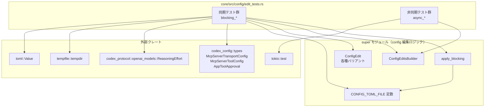
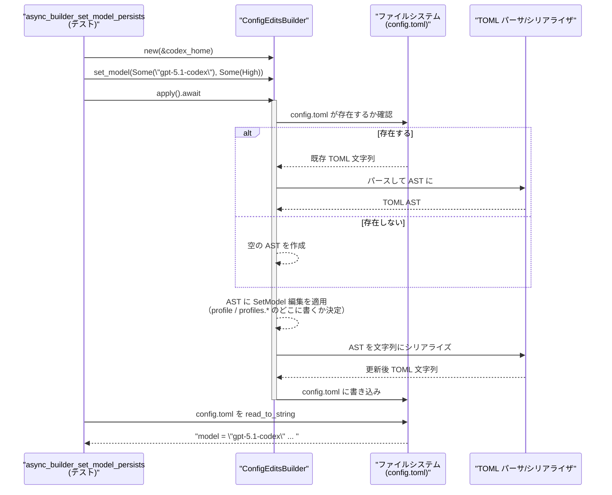

# core/src/config/edit_tests.rs コード解説

## 0. ざっくり一言

このファイルは、`super` モジュールが提供する設定編集 API（`apply_blocking`, `ConfigEditsBuilder`, `ConfigEdit` など）が、ファイルシステム上の `config.toml` を期待どおりに読み書きできているかを検証する統合テスト群です。  
モデル設定、プロフィール、MCP サーバー設定、通知フラグなど、多様な編集操作とコメント・インラインテーブル・シンボリックリンクの扱いを確認しています。

> 注: ここではテストから読み取れる「挙動・契約」を説明します。`apply_blocking` や `ConfigEditsBuilder` 本体の実装はこのチャンクには含まれていません。

---

## 1. このモジュールの役割

### 1.1 概要

- このモジュールは **設定ファイル `config.toml` の編集ユーティリティ**（`super::*`）が正しく動作することを検証するために存在します。
- 主に次のような機能の動作をテストしています。
  - モデル名・推論強度（`ReasoningEffort`）の設定／クリア
  - プロファイル（`profile` / `profiles.*`）ごとの設定スコープ
  - `ConfigEdit::SetPath` による任意パスの更新
  - スキル設定（`[[skills.config]]`）の追加・削除
  - 通知関連フラグ（`[notice]` 以下）の更新
  - モデルマイグレーション履歴の記録
  - MCP サーバー設定（`[mcp_servers.*]`）の置き換えとコメント保持
  - 非同期 API（`ConfigEditsBuilder::apply`）の挙動

すべてのテストは実際に一時ディレクトリ上にファイルを書き出し、その内容を TOML 文字列や `toml::Value` で検証しています（`tempdir()` の利用）。

### 1.2 アーキテクチャ内での位置づけ

このファイル自体はテストモジュールであり、コアロジックには依存する側です。依存関係は以下のようになります。



> 行番号情報はこのチャンクには含まれていないため、図中ではテスト名のみを示しています。

### 1.3 設計上のポイント（テストコードから読み取れること）

- **実ファイルベースのテスト**  
  - すべて `tempdir()` で一時ディレクトリを作成し、その中の `CONFIG_TOML_FILE`（`config.toml` と推測されます）を対象にします。
- **TOML 構造とレイアウトへの強い依存**  
  - 多くのテストが `assert_eq!(actual, expected)` で TOML 文字列全体を比較しており、**キー順・改行・コメント位置**も含めてレイアウトを検証しています。
- **コメント・インラインテーブルの保持を重視**  
  - MCP サーバー設定や `profiles` のインラインテーブルについて、編集後も既存コメントや未変更フィールドが保持されることを確認しています。
- **同期／非同期 API の等価性**  
  - `apply_blocking` と `ConfigEditsBuilder::apply` が、見かけ上同じ結果（同じ TOML）を生成することをテストしています。
- **シンボリックリンクとループ検出**  
  - `config.toml` がシンボリックリンク（あるいはリンクチェーン）の場合に、**リンク先に書き込むこと**と、**ループがある場合はリンクを通常ファイルに置き換えること**をテストしています。

---

## 2. 主要な機能一覧（コンポーネントインベントリー）

### 2.1 テストケース一覧

このファイル内で定義されている 32 個のテスト関数の役割は次のとおりです（登場順）。

| テスト関数名 | 検証対象の機能・挙動 |
|-------------|----------------------|
| `blocking_set_model_top_level` | プロファイル未使用時にトップレベルの `model` と `model_reasoning_effort` が書き込まれること |
| `builder_with_edits_applies_custom_paths` | `ConfigEditsBuilder::with_edits` + `SetPath` による任意パス（ここでは `enabled`）の書き込み |
| `set_model_availability_nux_count_writes_shown_count` | `set_model_availability_nux_count` が `[tui.model_availability_nux]` テーブルとキー（モデル名）を生成すること |
| `set_skill_config_writes_disabled_entry` | `SetSkillConfig` により `[[skills.config]]` エントリが `enabled = false` で追加されること |
| `set_skill_config_removes_entry_when_enabled` | 既に存在する `[[skills.config]]` の `enabled = false` エントリを、`enabled = true` で呼び出すと削除すること |
| `set_skill_config_writes_name_selector_entry` | `SetSkillConfigByName` により、`path` ではなく `name = "github:yeet"` を持つエントリが生成されること |
| `blocking_set_model_preserves_inline_table_contents` | `profiles = { fast = { ... } }` というインラインテーブル内の `sandbox_mode` が保持されたまま `model` だけ更新されること |
| `blocking_set_model_writes_through_symlink_chain` (unix) | `CONFIG_TOML_FILE` がシンボリックリンクチェーンの場合でも、最終ターゲットに書き込むこと |
| `blocking_set_model_replaces_symlink_on_cycle` (unix) | `config.toml` に向かうリンクがループしている場合、リンクを通常ファイルに置き換えて書き込むこと |
| `batch_write_table_upsert_preserves_inline_comments` | 複数の `SetPath` をバッチ適用した際に、既存コメントや別テーブルの内容が保持されること |
| `blocking_clear_model_removes_inline_table_entry` | `model: None` を指定すると、`profiles.fast` の `model` を削除し、`sandbox_mode` を保持したまま `model_reasoning_effort` を追加すること |
| `blocking_set_model_scopes_to_active_profile` | `profile = "team"` 指定時に、トップレベルではなく `[profiles.team]` に対して `model` と `model_reasoning_effort` を設定すること |
| `blocking_set_model_with_explicit_profile` | `apply_blocking` に明示的なプロファイル名を渡した場合、そのプロファイルの設定のみを更新すること（スペースを含む名前 `"team a"` を含む） |
| `blocking_set_hide_full_access_warning_preserves_table` | 既存 `[notice]` テーブルとコメントを保持しつつ `hide_full_access_warning = true` を追加すること |
| `blocking_set_hide_rate_limit_model_nudge_preserves_table` | `SetNoticeHideRateLimitModelNudge(true)` により `[notice]` テーブル下に `hide_rate_limit_model_nudge = true` を追加すること |
| `blocking_set_hide_gpt5_1_migration_prompt_preserves_table` | 任意キー文字列（識別子として妥当な `"hide_gpt5_1_migration_prompt"`）をそのままキーとして追加すること |
| `blocking_set_hide_gpt_5_1_codex_max_migration_prompt_preserves_table` | ハイフンを含むキー名（`hide_gpt-5.1-codex-max_migration_prompt`）を **引用符付きキー** として書き出すこと |
| `blocking_record_model_migration_seen_preserves_table` | `[notice.model_migrations]` テーブルを作成し、`from -> to` のマッピングを 1 行で記録すること |
| `blocking_replace_mcp_servers_round_trips` | `ReplaceMcpServers` で `McpServerConfig` の BTreeMap を完全に TOML シリアライズし、再読み込みしても同じ意味になること（フィールド順や env のソートも含む） |
| `blocking_replace_mcp_servers_serializes_tool_approval_overrides` | サーバーの `tools` に対する `McpServerToolConfig`（`approval_mode = "approve"`）のシリアライズ |
| `blocking_replace_mcp_servers_preserves_inline_comments` | 既存の `[mcp_servers]` インラインテーブルとコメントを変更せずに再適用されること（差分が無い場合） |
| `blocking_replace_mcp_servers_preserves_inline_comment_suffix` | インラインテーブルの末尾コメント（`# keep me`）を保持したままキー `enabled = false` を追加すること |
| `blocking_replace_mcp_servers_preserves_inline_comment_after_removing_keys` | インラインテーブルからキー（`args`）を削除しても、末尾コメントを保持すること |
| `blocking_replace_mcp_servers_preserves_inline_comment_prefix_on_update` | テーブル直下のコメント行（プレフィックスコメント）を保持しつつインラインテーブルの内容を更新すること |
| `blocking_clear_path_noop_when_missing` | 存在しないパスへの `ClearPath` が **設定ファイル自体を作成しない** こと |
| `blocking_set_path_updates_notifications` | `SetPath(["tui", "notifications"], false)` により `tui.notifications` が `false` として作成されること |
| `async_builder_set_model_persists` | `ConfigEditsBuilder::apply`（非同期）で `model` と `model_reasoning_effort` が同期版と同じ文字列になること |
| `blocking_builder_set_model_round_trips_back_and_forth` | `ConfigEditsBuilder::set_model` を複数回呼んだときに、期待どおり上書き・再上書きできること |
| `blocking_set_asynchronous_helpers_available` | ビルダーの非同期ヘルパー `set_hide_full_access_warning` + `apply` が期待どおり `[notice.hide_full_access_warning]` を更新すること |
| `blocking_builder_set_realtime_audio_persists_and_clears` | `[audio.microphone]` / `[audio.speaker]` の設定追加と、マイク設定だけを消したときの挙動（テーブル自体は残る） |
| `blocking_builder_set_realtime_voice_persists_and_clears` | `[realtime.voice]` の設定追加と、その値を `None` にしたときの削除挙動 |
| `replace_mcp_servers_blocking_clears_table_when_empty` | `ReplaceMcpServers(BTreeMap::new())` によって `[mcp_servers]` テーブル全体が削除されること |

> 各テストは `tempdir()` で独立したディレクトリを作成し、`CONFIG_TOML_FILE` を読み書きして検証しています（`tempfile::tempdir` の利用）。

---

## 3. 公開 API と詳細解説

このファイルには公開 API の定義は含まれていませんが、テストから以下の型・関数が利用されていることが分かります。

### 3.1 型一覧（構造体・列挙体など）

| 名前 | 種別 | 役割 / 用途 | 備考 |
|------|------|-------------|------|
| `ConfigEditsBuilder` | 構造体（ビルダー） | 一連の設定編集（`ConfigEdit` 群）を組み立てて、同期／非同期で `config.toml` に適用するためのビルダー | 定義は `super` モジュール側。`new`, `with_edits`, `set_model` などがテストから確認できます。 |
| `ConfigEdit` | 列挙体 | 単一の設定編集操作を表すコマンド。`SetModel`, `SetPath`, `SetSkillConfig`, `ReplaceMcpServers` など多数のバリアントがあることが分かります。 | 具体的な定義はこのファイルにはありません。 |
| `McpServerConfig` | 構造体 | MCP サーバー 1 台分の設定。`transport`, `enabled`, `required`, `tools` などのフィールドがあると分かります。 | 型自体は `super` モジュールから提供。内部で `McpServerTransportConfig` や `McpServerToolConfig` を使用。 |
| `McpServerTransportConfig` | 列挙体 | MCP サーバーへの接続方法を表す。`Stdio` や `StreamableHttp` バリアントがあることがテストから分かります。 | `codex_config::types` からインポート。 |
| `McpServerToolConfig` | 構造体 | MCP サーバーの個々のツールごとの設定。`approval_mode` フィールドがあることがテストから分かります。 | `codex_config::types` からインポート。 |
| `AppToolApproval` | 列挙体 | ツールの承認状態（例: `Approve`）を表す。 | `codex_config::types` からインポート。 |
| `ReasoningEffort` | 列挙体 | モデルの推論強度を表す。`High`, `Minimal`, `Low` などのバリアントが使われています。 | `codex_protocol::openai_models` からインポート。 |
| `TomlValue` (`toml::Value`) | 列挙体 | TOML 値の抽象表現。テストでは結果をパースして構造で検証する用途に使われています。 | シリアライズ／デシリアライズの検証に使用。 |

### 3.2 主要 API の詳細（テストから読み取れる契約）

ここでは、このテストファイルから利用状況が分かる代表的な API について、テストから推測される契約をまとめます。  
※シグネチャの型は利用例からの推定を含むため、正確な定義は `super` モジュールを参照してください。

---

#### `apply_blocking(codex_home, profile, edits) -> Result<_, _>`

**概要**

- 設定ディレクトリ（`codex_home`）配下の `CONFIG_TOML_FILE` を読み込み（存在すれば）、`edits` に含まれる `ConfigEdit` 群を順に適用してから書き戻す **同期処理** です。
- プロファイル指定がある場合は、そのプロファイルにスコープされた編集を行います。

**引数（推測）**

| 引数名 | 型（推測） | 説明 |
|--------|-----------|------|
| `codex_home` | `impl AsRef<Path>` に相当 | `config.toml` が置かれる「Codex ホーム」ディレクトリへのパス。テストでは `tempdir().path()` を渡しています。 |
| `profile` | `Option<&str>` | 編集対象とするプロファイル名。`None` の場合は、既存 `config.toml` の `profile` キー（アクティブプロファイル）を用いるように見えます。 |
| `edits` | `&[ConfigEdit]` | 適用する編集操作の配列。各要素が順に適用されます。 |

**戻り値**

- `Result<_, _>` であり、`Ok` 時の中身はテストでは使用されていません（常に `.expect("...")` でエラー検出のみ）。
- 失敗時のエラー型はこのファイルからは不明ですが、ファイル I/O や TOML パースエラーなどが含まれると考えられます。

**内部処理の流れ（テストから読み取れる挙動）**

1. `codex_home.join(CONFIG_TOML_FILE)` を対象に、既存ファイルの有無を確認する。
2. もし `config.toml` が **シンボリックリンク** の場合は、リンクを辿って実際のターゲットファイルを決定する。  
   - ループがなければチェーンの末端に書き込む（`blocking_set_model_writes_through_symlink_chain` 参照）。  
   - ループを検出した場合は `config.toml` のリンクを通常ファイルに置き換えて書き込む（`blocking_set_model_replaces_symlink_on_cycle` 参照）。
3. 既存ファイルがあれば TOML としてパースし、なければ「空の設定」として扱う。
4. 引数 `profile` および既存の `profile = "name"` 設定を元に、編集のスコープ（トップレベル vs `[profiles.<name>]`）を決める。  
   - 例: `blocking_set_model_scopes_to_active_profile`, `blocking_set_model_with_explicit_profile`。
5. `edits` の各 `ConfigEdit` を順に適用し、TOML AST を更新する。  
   - コメントやインラインテーブルをできるかぎり保持することが多くのテストで確認されています。
6. 更新後の AST を TOML 文字列としてシリアライズし、対象ファイルに書き戻す。  
   - フォーマット（改行、インデント、コメント位置）もテストで検証されています。

**Examples（使用例）**

テスト `blocking_set_model_top_level` に類似した使用例です（同期版）。

```rust
use std::path::Path;
use codex_core::config::{apply_blocking, ConfigEdit};
use codex_protocol::openai_models::ReasoningEffort;

// Codex のホームディレクトリ（ここでは仮）
let codex_home: &Path = Path::new("/path/to/codex_home");

// モデルと推論強度を設定する編集を 1 件だけ行う
apply_blocking(
    codex_home,
    /* profile */ None,                                // プロファイルを明示しない
    &[
        ConfigEdit::SetModel {
            model: Some("gpt-5.1-codex".to_string()),  // モデル名
            effort: Some(ReasoningEffort::High),       // 推論強度
        }
    ],
)?;                                                    // 失敗時は Err を返す

// codex_home/config.toml には以下のような内容が書き込まれることが期待される：
// model = "gpt-5.1-codex"
// model_reasoning_effort = "high"
```

※ 実際のパスやモジュールパスはリポジトリ構成によります。この例はテストコードのパターンを簡略化したものです。

**Errors / Panics**

- エラー条件は実装がこのチャンクに無いため不明です。ファイル読み書き失敗や TOML パースエラー時に `Err` を返す可能性が高いと考えられます。
- テストコード内では `.expect("...")` により、`Err` の場合はテストが panic して終了します。

**Edge cases（エッジケース）**

- 対象キーが存在しない `ClearPath`  
  - `blocking_clear_path_noop_when_missing` から、削除対象キーが存在しない場合は **config ファイル自体を作成しない** ことが分かります。
- シンボリックリンク
  - `config.toml` が多段のシンボリックリンクチェーンであっても、末端のファイルに書き込まれます。
  - ループ検出時はシンボリックリンクを通常ファイルに置き換えます。
- プロファイルの扱い
  - プロファイル未指定かつ `profile = "team"` が存在する場合、`[profiles.team]` に設定を書き込みます。
  - 明示的なプロファイル名を渡した場合（例: `"team a"`）、そのプロファイルに対してのみ書き込みます。

**使用上の注意点（テストから言えること）**

- 操作対象の `config.toml` がシンボリックリンクである場合、そのリンク先が意図したものである必要があります。テストはループ対策のみを確認しており、任意パスへのリンクに関するセキュリティ要件はこのファイルからは分かりません。
- `ClearPath` は「存在すれば消す」動作であり、「無いがゆえに何かを作る」ことはしません。設定ファイルを必ず生成したい場合は `SetPath` など別の編集が必要になります。
- 複数の `ConfigEdit` を同時に渡した場合の適用順序はスライスの順に見えますが、テストでは順序依存のケースは登場していません。

---

#### `ConfigEditsBuilder::set_model(model: Option<&str>, effort: Option<ReasoningEffort>)`

**概要**

- ビルダーに対して「モデルと推論強度を設定する編集」を追加するメソッドです。
- チェーンして他の設定（通知フラグ、リアルタイム音声設定など）と組み合わせることができます。

**引数（推測）**

| 引数名 | 型（推測） | 説明 |
|--------|-----------|------|
| `model` | `Option<&str>` または `Option<String>` | 設定するモデル名。`None` を渡すと既存の `model` を削除する挙動が `blocking_clear_model_removes_inline_table_entry` から分かります。 |
| `effort` | `Option<ReasoningEffort>` | 推論強度。`Some` の場合は `model_reasoning_effort` が設定され、`None` の場合は既存値を保持／削除するかどうかはこのファイルだけでは明確ではありません。 |

**戻り値**

- メソッドチェーンが可能なことから、`self` もしくは `&mut Self` を返していると考えられます。  
  正確な戻り値型は `ConfigEditsBuilder` の定義を参照してください。

**内部処理（テストから読み取れる挙動）**

1. 渡された `model` / `effort` を元に、内部的に対応する `ConfigEdit::SetModel` をビルダーに登録する。
2. 複数回呼び出した場合は、`apply_blocking` / `apply` 時点で最後の指定が反映される（`blocking_builder_set_model_round_trips_back_and_forth` 参照）。
3. `apply_blocking` または `apply` を呼ぶと、`apply_blocking` 相当のロジックによりファイルへ反映される。

**Examples（使用例）**

同期ビルダーの例（`blocking_builder_set_model_round_trips_back_and_forth` に相当）:

```rust
use codex_core::config::ConfigEditsBuilder;
use codex_protocol::openai_models::ReasoningEffort;

let codex_home = std::path::Path::new("/path/to/codex_home");

// 1回目: o4-mini / low を設定
ConfigEditsBuilder::new(codex_home)
    .set_model(Some("o4-mini"), Some(ReasoningEffort::Low))   // モデルと推論強度を設定
    .apply_blocking()?;                                       // 同期で書き込み

// 2回目: gpt-5.1-codex / high に上書き
ConfigEditsBuilder::new(codex_home)
    .set_model(Some("gpt-5.1-codex"), Some(ReasoningEffort::High))
    .apply_blocking()?;

// 3回目: 1回目の設定へ再度戻す
ConfigEditsBuilder::new(codex_home)
    .set_model(Some("o4-mini"), Some(ReasoningEffort::Low))
    .apply_blocking()?;
```

**Errors / Panics**

- `apply_blocking` / `apply` が返す `Result` を通じてエラーが伝播します。
- `set_model` 自体が panic する条件はテストからは読み取れません。

**Edge cases**

- `model = None` の場合  
  - `blocking_clear_model_removes_inline_table_entry` から、該当プロファイルの `model` キーを削除し、`sandbox_mode` は残しつつ `model_reasoning_effort` を追加する挙動が確認できます。
- プロファイルスコープ  
  - `ConfigEditsBuilder::set_model` と `apply_blocking` の組み合わせで、アクティブプロファイルや明示プロファイルのテーブルに対してのみ `model` が設定されることが分かります。

**使用上の注意点**

- `ReasoningEffort` はシリアライズ時に小文字の文字列（`"high"`, `"low"`, `"minimal"`）として出力されるため、TOML を直接編集する場合もこの値に合わせる必要があります。
- `model` を `None` にした場合の `model_reasoning_effort` の扱い（維持／削除）は、テストでは「`effort: Some(...)` で上書き」しか検証されていません。`None` を渡したときの挙動は実装側の確認が必要です。

---

#### `ConfigEdit::SetModel { model: Option<String>, effort: Option<ReasoningEffort> }`

**概要**

- 単一の編集として、「モデル名」と「推論強度」の変更／削除を表現する `ConfigEdit` のバリアントです。
- 直接 `apply_blocking` に渡して使用するほか、ビルダー内部でも利用されていると考えられます。

**引数（フィールド）**

| フィールド名 | 型 | 説明 |
|-------------|----|------|
| `model` | `Option<String>` | 新しいモデル名。`Some` ならそのモデルに更新、`None` なら現在のモデル設定を削除。 |
| `effort` | `Option<ReasoningEffort>` | 新しい推論強度。`Some` の場合は `model_reasoning_effort` を追加／上書き。 |

**挙動（テストからの情報）**

- トップレベル設定への適用（プロファイル未使用）  
  - `blocking_set_model_top_level` で `model` と `model_reasoning_effort` がトップレベルに書かれています。
- プロファイルへの適用  
  - アクティブプロファイルがある場合（`profile = "team"`）、`[profiles.team]` 下に `model` と `model_reasoning_effort` が書き込まれます。
  - 明示的なプロファイル名引数がある場合も同様です（`blocking_set_model_with_explicit_profile`）。
- インラインテーブルから通常テーブルへの変換  
  - `profiles = { fast = { model = "gpt-4o", sandbox_mode = "strict" } }` のようなインラインテーブルから、`[profiles.fast]` テーブルに展開されることがあります（`blocking_clear_model_removes_inline_table_entry`）。

**Edge cases**

- `model = None` で `effort = Some(...)`  
  - `model` キーだけを削除し、`sandbox_mode` 等の他のキーは保持しつつ `model_reasoning_effort` を追加することが確認されています。
- コメント・余分なフィールド  
  - `blocking_set_model_preserves_inline_table_contents` から、`sandbox_mode` のような他のフィールドが削除されないことが確認できます。

---

#### `ConfigEdit::SetPath { segments: Vec<String>, value: toml::Value }`

**概要**

- 任意のパス（テーブル階層 + キー）に対して、TOML 値を書き込む汎用的な編集です。
- MCP サーバー設定や `sandbox_workspace_write.network_access` など、さまざまな箇所の更新に使われています。

**引数（フィールド）**

| フィールド名 | 型 | 説明 |
|-------------|----|------|
| `segments` | `Vec<String>` | パスを構成するセグメント。`["tui", "notifications"]` など。テーブル階層＋最終キーが含まれると見なせます。 |
| `value` | `toml::Value`（推測） | 書き込む TOML 値。テストでは `value(true)`, `value("...")` などのヘルパーから生成されています。 |

**挙動（テストからの情報）**

- ネストされたテーブルを自動的に作成  
  - `blocking_set_path_updates_notifications` で `["tui", "notifications"]` を指定すると、`[tui]` テーブルが作成され、その中に `notifications = false` が書き込まれます。
- 既存テーブル・コメントの保持  
  - `batch_write_table_upsert_preserves_inline_comments` により、既存のコメント行や他のテーブル（`[mcp_servers.linear.http_headers]` など）が保持されたまま、指定されたパスだけが更新されることが確認できます。

**使用上の注意点**

- `segments` の最後の要素がキー名であると解釈されると考えられます（`["sandbox_workspace_write", "network_access"]` など）。
- 既存キーを上書きするか新規作成するかは、指定パスの有無によります。テストでは両パターンが存在します。

---

#### `ConfigEdit::SetSkillConfig { path: PathBuf, enabled: bool }` / `SetSkillConfigByName { name: String, enabled: bool }`

**概要**

- スキルごとの有効／無効設定を `[[skills.config]]` テーブルに書き込むための編集です。
- `enabled = false` のエントリを追加したり、`enabled = true` で元のエントリを削除したりします。

**挙動（テストからの情報）**

- `SetSkillConfig`（path ベース）
  - 有効な path と `enabled = false` を指定すると、`[[skills.config]]` エントリが新規追加されます（`set_skill_config_writes_disabled_entry`）。
  - 既に `enabled = false` のエントリが存在する状態で、同じ `path` で `enabled = true` を指定すると、そのエントリが削除され、ファイルが空になるケースが確認できます（`set_skill_config_removes_entry_when_enabled`）。
- `SetSkillConfigByName`（name ベース）
  - `name = "github:yeet"` のような文字列キーを使ってスキルを識別し、`enabled = false` エントリを追加します（`set_skill_config_writes_name_selector_entry`）。

**Edge cases**

- 複数エントリとの関係（同じ path/name の重複など）はこのテストファイルからは分かりません。

---

#### `ConfigEdit::ReplaceMcpServers(BTreeMap<String, McpServerConfig>)`

**概要**

- `BTreeMap<String, McpServerConfig>` で与えられた MCP サーバー一覧で、設定ファイル内の `mcp_servers` 設定を置き換える編集です。
- 既存のコメントやインラインテーブルの形式を、可能な範囲で保持しながら更新します。

**引数**

| 引数名 | 型 | 説明 |
|--------|----|------|
| `servers` | `BTreeMap<String, McpServerConfig>` | サーバー名をキーとする MCP サーバー設定の集合。キー順は BTreeMap のソート順でシリアライズされます。 |

**挙動（テストからの情報）**

- 完全な置き換え（標準テーブル形式）
  - `blocking_replace_mcp_servers_round_trips` で、`http` と `stdio` の 2 サーバー構成をシリアライズし、期待 TOML と完全一致することが確認されています。  
    - `startup_timeout_sec` は `Duration::from_secs(5)` が `5.0` として書き出されています。
    - 環境変数マップ（`env`）はキー順にソートされて書き出されています（`A`, `B`）。
    - デフォルト値と等しいフィールドは省略されているように見えます（例: `enabled = true` は書かれていない）。
- ツールごとの設定
  - `blocking_replace_mcp_servers_serializes_tool_approval_overrides` で、`McpServerToolConfig{ approval_mode: Some(AppToolApproval::Approve) }` が  
    `[mcp_servers.docs.tools.search]` 下に `approval_mode = "approve"` として書き出されることが確認されています。
- 既存のインラインテーブルとコメントの保持
  - `blocking_replace_mcp_servers_preserves_inline_comments` では、変更前と同一の設定を渡した場合、元のインラインテーブル＋コメントをそのまま残すことが確認されています。
  - `blocking_replace_mcp_servers_preserves_inline_comment_suffix` / `..._after_removing_keys` / `..._prefix_on_update` により、インラインテーブルの前後にあるコメントを保持しつつキーの追加／削除が行われることが分かります。
- 空のマップ
  - `replace_mcp_servers_blocking_clears_table_when_empty` で、空の `BTreeMap` を渡すと `[mcp_servers]` テーブル全体が削除されることが確認されています。

**Edge cases**

- 未知のフィールドや将来追加されるフィールドに対してもコメントが保持されるかどうかは、このテストファイルからは分かりません。

**使用上の注意点**

- 既存の `mcp_servers` 設定を「完全に置き換える」性質が強い API です。空のマップを渡すとテーブル自体が消えるため、部分的な変更だけを行いたい場合は別の API が必要です。
- インラインテーブル形式（`foo = { ... }`）を維持しつつフィールド追加／削除を行うことができますが、フォーマットに依存したロジックである可能性があるため、大きなフォーマット変更を手作業で行った後の挙動は実装の確認が必要です。

---

#### `ConfigEdit::ClearPath { segments: Vec<String> }`

**概要**

- 任意パスに対応するキーまたはテーブルを削除する編集です。
- 対象パスが存在しない場合は **完全な no-op** になることがテストで確認されています。

**挙動（テストからの情報）**

- `blocking_clear_path_noop_when_missing` で、空ディレクトリに対して  
  `ClearPath { segments: vec!["missing".to_string()] }` を適用しても `config.toml` が作成されないことが確認されています。
- 削除対象のキーが存在する場合の挙動（テーブルごと消えるか、キーだけ消えるか）はこのファイルからは分かりません。

**使用上の注意点**

- 「存在しないキーを削除しても副作用がない」ことが保証されているため、安全に冪等な削除処理として利用できます。
- 削除後のテーブルが空になった場合の扱い（テーブル自体を消すかどうか）は、別のテスト（MCP サーバー用の `ReplaceMcpServers`）でしか確認されていません。`ClearPath` が同様の振る舞いをするかは不明です。

---

### 3.3 その他の関数・操作（一覧）

テストから利用が確認できる補助的な API（詳細解説は割愛）です。

| 名前 / バリアント | 役割（1 行） |
|-------------------|--------------|
| `ConfigEditsBuilder::new(codex_home)` | `codex_home` を基準に設定編集ビルダーを作成する。同期・非同期両方のエントリポイント。 |
| `ConfigEditsBuilder::with_edits(edits)` | 既存の `Vec<ConfigEdit>` をビルダーに取り込み、そのまま `apply_blocking` できるようにする。 |
| `ConfigEditsBuilder::apply_blocking()` | ビルダーに積んだ編集を同期的に `config.toml` に適用する。 |
| `ConfigEditsBuilder::apply().await` | ビルダーに積んだ編集を非同期に適用する。`#[tokio::test]` での使用を前提としている。 |
| `ConfigEditsBuilder::set_model_availability_nux_count(&HashMap<String, u32>)` | `[tui.model_availability_nux]` に「モデル名 → 表示回数」のマップを書き込む。 |
| `ConfigEditsBuilder::set_hide_full_access_warning(bool)` | `[notice.hide_full_access_warning]` を bool で設定する非同期ヘルパー。 |
| `ConfigEdit::SetNoticeHideFullAccessWarning(bool)` | 同上の設定を同期 API から行うための編集。 |
| `ConfigEdit::SetNoticeHideRateLimitModelNudge(bool)` | `[notice.hide_rate_limit_model_nudge]` を設定する。 |
| `ConfigEdit::SetNoticeHideModelMigrationPrompt(String, bool)` | 任意キー（文字列）でモデル移行プロンプトを非表示にするためのフラグを `[notice]` に追加。ハイフン含みキーの引用符処理も行う。 |
| `ConfigEdit::RecordModelMigrationSeen { from, to }` | `[notice.model_migrations]` テーブルに `from = "to"` 形式でモデル移行履歴を追加。 |
| `ConfigEditsBuilder::set_realtime_microphone(Option<&str>)` | `[audio.microphone]` の設定を追加／削除する。 |
| `ConfigEditsBuilder::set_realtime_speaker(Option<&str>)` | `[audio.speaker]` の設定を追加／削除する。 |
| `ConfigEditsBuilder::set_realtime_voice(Option<&str>)` | `[realtime.voice]` の設定を追加／削除する。 |
| `value(...)`（ヘルパー） | 与えられた Rust の値（bool, &str 等）を TOML の `Value` に変換するユーティリティと推測されます。 |

---

## 4. データフロー（代表シナリオ）

ここでは代表的なシナリオとして、「ビルダーでモデルを設定して `config.toml` に反映する」場合のデータフローを示します。  
実装はこのチャンクに無いため、テストから読み取れる範囲の推測です。



- 同期版（`apply_blocking`）も、I/O 部だけがブロッキングである点を除けばほぼ同じフローで動作していると見なせます。
- MCP サーバーの置き換えや `SetPath` も、同様に「読み込み → AST 編集 → シリアライズ → 書き込み」の流れに乗っていると考えられます。

---

## 5. 使い方（How to Use）

このファイルはテストですが、実際に設定編集 API を利用する際にもほぼ同じパターンで呼び出すことになります。

### 5.1 基本的な使用方法（同期版）

1. Codex のホームディレクトリパスを決める。
2. 適用したい編集 (`ConfigEdit` 群) を定義するか、`ConfigEditsBuilder` で組み立てる。
3. `apply_blocking` もしくは `ConfigEditsBuilder::apply_blocking` を呼ぶ。

```rust
use std::path::Path;
use codex_core::config::{apply_blocking, ConfigEdit, ConfigEditsBuilder};
use codex_protocol::openai_models::ReasoningEffort;

// 1. Codex ホームディレクトリ
let codex_home: &Path = Path::new("/path/to/codex_home");

// 2-A. 直接 ConfigEdit を渡す場合
apply_blocking(
    codex_home,
    None,  // プロファイル未指定
    &[
        ConfigEdit::SetModel {
            model: Some("gpt-5.1-codex".to_string()),
            effort: Some(ReasoningEffort::High),
        }
    ],
)?;

// 2-B. ビルダーを使う場合
ConfigEditsBuilder::new(codex_home)
    .set_model(Some("o4-mini"), Some(ReasoningEffort::Low)) // モデル設定
    .set_realtime_voice(Some("cedar"))                      // リアルタイム音声設定
    .apply_blocking()?;                                     // 3. まとめて適用
```

### 5.2 非同期版の使用パターン

非同期環境（Tokio ランタイムなど）では `ConfigEditsBuilder::apply` を `await` して使用します。テスト `async_builder_set_model_persists` や `blocking_set_asynchronous_helpers_available` と同じパターンです。

```rust
use codex_core::config::ConfigEditsBuilder;
use codex_protocol::openai_models::ReasoningEffort;

#[tokio::main]
async fn main() -> Result<(), Box<dyn std::error::Error>> {
    let codex_home = std::path::PathBuf::from("/path/to/codex_home");

    ConfigEditsBuilder::new(&codex_home)
        .set_model(Some("gpt-5.1-codex"), Some(ReasoningEffort::High)) // モデル設定
        .set_hide_full_access_warning(true)                            // 通知フラグ設定
        .apply()                                                       // 非同期適用
        .await?;                                                       // エラーは ? で伝播

    Ok(())
}
```

### 5.3 よくある使用パターン

- **任意のフラグの設定**  
  - `SetPath` を用いて `["tui", "notifications"]` や `["sandbox_workspace_write", "network_access"]` など任意のパスを更新できます。
- **スキルの有効／無効管理**  
  - 実行時にスキルの path や name を把握していれば、`SetSkillConfig` / `SetSkillConfigByName` でユーザーごとの有効・無効状態を記録できます。
- **MCP サーバー設定の一括更新**  
  - 外部構成管理から `BTreeMap<String, McpServerConfig>` を構成し、`ReplaceMcpServers` でまとめて適用することができます。このとき空マップを渡すと全削除になるため注意が必要です。

### 5.4 よくある間違いと注意点

```rust
use codex_core::config::{apply_blocking, ConfigEdit};

// 誤り例: ClearPath だけで config.toml を作ろうとしている
let codex_home = std::path::Path::new("/tmp/codex");
apply_blocking(
    codex_home,
    None,
    &[ConfigEdit::ClearPath {
        segments: vec!["missing".to_string()],
    }],
)?;

// → テスト blocking_clear_path_noop_when_missing によれば、
//    この操作では config.toml は作成されない。
```

正しい例:

```rust
use codex_core::config::{apply_blocking, ConfigEdit};
use toml::Value;

// 正: まず何らかの SetPath などでキーを作成し、その後 ClearPath で削除する
apply_blocking(
    codex_home,
    None,
    &[
        ConfigEdit::SetPath {
            segments: vec!["foo".to_string()],
            value: Value::Boolean(true),
        },
        ConfigEdit::ClearPath {
            segments: vec!["foo".to_string()],
        },
    ],
)?;
```

**共通の注意点（このテストファイルから言える範囲）**

- 非同期 API (`apply`) は、`#[tokio::test]` で実行されていることから、Tokio などの非同期ランタイム上で呼び出す必要があります。
- MCP サーバー設定の編集はコメント保持などフォーマットに依存した挙動を行うため、`mcp_servers` セクションの手作業での大規模な再フォーマットを行った後は、念のためテスト追加や確認を行うことが望ましいです。
- 1つの `config.toml` に対して複数プロセス／スレッドから同時に書き込みを行うケースはテストされていません。一般的なファイル I/O と同様に、排他制御を検討する必要があります（スレッド安全性についてはこのファイルからは判断できません）。

---

## 6. 変更の仕方（テストと機能の拡張）

### 6.1 新しい編集機能を追加する場合（テスト観点）

このファイルは「設定編集機能の挙動を守る」ための統合テスト集です。新しい `ConfigEdit` バリアントやビルダーメソッドを追加する場合、次のようなステップでテストを拡張するのが自然です。

1. **編集の責務を明確にする**
   - どのキー／テーブルを、どのような条件で更新・削除するのかを決めます。
2. **最小限の seed config を用意する**
   - `std::fs::write(codex_home.join(CONFIG_TOML_FILE), r#"..."#)` のように、想定される入力状態を文字列で用意します。
3. **単体の編集を適用するテストを書く**
   - `apply_blocking` または `ConfigEditsBuilder` を使って、新バリアントを 1 回だけ適用するテストを追加します。
   - 期待される TOML を文字列で書き、`assert_eq!` で比較します。
4. **コメント・既存フィールドの保持を確認する**
   - 既存のテストと同様に、コメントや関係のないフィールドが保持されることを確認します。
5. **エッジケースのテスト**
   - `None` を渡した場合、空コレクションを渡した場合、存在しないキーに対する操作などの挙動を追加テストで確認します。

### 6.2 既存機能を変更する場合（契約破壊の防止）

- **影響範囲の確認**
  - 対象となる `ConfigEdit` バリアント / ビルダーメソッドが、どのテストで使われているかを本ファイルから検索します。
  - 文字列比較ベースのテストが多いため、フォーマット変更（改行やキー順）を行う際は注意が必要です。
- **前提条件の維持**
  - 例えば `ClearPath` の「対象がなければ no-op」や、`ReplaceMcpServers` の「空マップでテーブル削除」といった挙動は、このファイルにテストがあり、契約として期待されていると考えられます。
- **新たなテストの追加**
  - フォーマットやエッジケースの扱いを変える場合は、それを明示的に検証する新テストを追加することで回帰を防げます。

---

## 7. 関連ファイル・モジュール

このテストモジュールと密接に関係する外部モジュール・ファイルは次のとおりです（ファイル名は推測を含みます）。

| パス / モジュール | 役割 / 関係 |
|-------------------|------------|
| `super` モジュール（例: `core/src/config/edit.rs`） | このテストが対象としているコアの設定編集ロジック。`apply_blocking`, `ConfigEditsBuilder`, `ConfigEdit`, `McpServerConfig`, `CONFIG_TOML_FILE` などを提供していると考えられます。 |
| `codex_config::types` | `McpServerTransportConfig`, `McpServerToolConfig`, `AppToolApproval` の定義を提供し、MCP サーバー関連テストで使用されています。 |
| `codex_protocol::openai_models` | `ReasoningEffort` 列挙体を提供し、モデル設定の推論強度に使用されています。 |
| `tempfile` クレート | `tempdir()` を提供し、各テストで独立した一時ディレクトリを作成するために使われています。 |
| `tokio` クレート | `#[tokio::test]` 属性を通じて非同期テストランタイムを提供し、`ConfigEditsBuilder::apply` のテストに使用されています。 |
| `toml` クレート | `toml::Value` と `toml::from_str` を通じて、生成された `config.toml` の構造検証に使われています。 |

---

このレポートは、`core/src/config/edit_tests.rs` に含まれるテストコードから読み取れる範囲で、設定編集 API の契約・データフロー・エッジケースを整理したものです。実際の API 定義や詳細実装については、`super` モジュール側のソースコードを併せて参照する必要があります。
