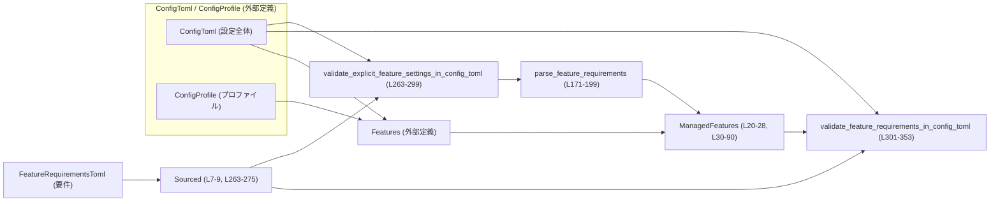
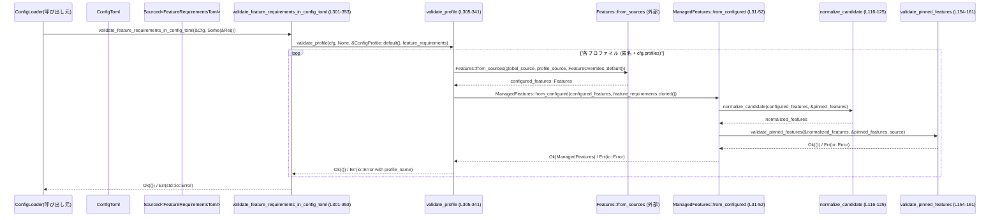

# core/src/config/managed_features.rs

## 0. ざっくり一言

`ManagedFeatures` 構造体と補助関数群により、設定ファイル (`ConfigToml`) から構成された機能フラグ (`Features`) が、`FeatureRequirementsToml` で定義された制約（必ず ON/OFF であるべき「ピン留め」機能）を満たしているかを正規化・検証するモジュールです（`managed_features.rs:L20-28, L263-353`）。

---

## 1. このモジュールの役割

### 1.1 概要

- このモジュールは、**設定ファイルから導出される機能フラグセット**が、別途定義された**機能要件 (`FeatureRequirementsToml`)** を満たしていることを保証するために存在します。
- `ManagedFeatures` は `Features` のラッパーとして、**ピン留め機能（特定の機能を常に true/false に固定する制約）** を強制しつつ、依存関係の正規化を行います（`managed_features.rs:L20-28, L116-125`）。
- さらに、`ConfigToml` に書かれた明示的な機能設定が、要件と矛盾していないかを検証する関数を提供します（`validate_explicit_feature_settings_in_config_toml`, `validate_feature_requirements_in_config_toml` / `managed_features.rs:L263-353`）。

### 1.2 アーキテクチャ内での位置づけ

`ConfigToml` + `FeatureRequirementsToml` から `Features` を構成し、それを検証する流れを簡略図で示します。



- `validate_explicit_feature_settings_in_config_toml (L263-299)` は、**設定ファイル中の「明示的な設定値」** と要件の矛盾のみをチェックします。
- `validate_feature_requirements_in_config_toml (L301-353)` は、`Features::from_sources(...)` で実際に有効になる機能セットを計算し、それが要件に合致するかを `ManagedFeatures::from_configured` を通じて検証します。

### 1.3 設計上のポイント

- **責務の分離**
  - 制約付きの機能セットの管理: `ManagedFeatures`（`L20-90`）
  - 要件 TOML からの制約（ピン留め機能）の抽出: `parse_feature_requirements`（`L171-199`）
  - 設定ファイル中の明示的な機能設定の列挙: `explicit_feature_settings_in_config`（`L201-261`）
  - 設定ファイルに対する 2 種類の検証: `validate_explicit_feature_settings_in_config_toml`, `validate_feature_requirements_in_config_toml`（`L263-353`）
- **状態の取り扱い**
  - `ManagedFeatures` は `Features` を所有し、さらに要件から導かれた `pinned_features: BTreeMap<Feature, bool>` を内部に保持します（`L24-27`）。
  - ピン留め情報は構築時に確定し、その後は変更されません（`pinned_features` に対する書き込みは `from_configured` 内だけ / `L35-51`）。
- **エラーハンドリング**
  - 制約違反は `ConstraintError::InvalidValue` として表現し（`L138-147, L288-293`）、外部 API では主に `std::io::ErrorKind::InvalidData` にラップして返します（`L159-161, L183-195, L286-295, L329-337`）。
  - `ConstraintResult<T>` は `ConstraintError` をエラーとする `Result` 型であることがコードから読み取れます（例: `validate_pinned_features_constraint` / `L127-152`）。
- **安全性 / 並行性**
  - このファイル内には `unsafe` ブロックは存在せず、標準の所有権・借用規則に従う安全なコードです。
  - `ManagedFeatures` は `Deref<Target = Features>` を実装しますが `DerefMut` は実装していないため、外部から内部 `Features` を可変参照で直接変更することはできません（`L108-114`）。
  - `Send` / `Sync` 実装の有無は、このチャンクからは分かりません（`Features` や `ConstrainedWithSource` の定義が別ファイルのため）。

---

## 2. 主要な機能一覧

- 制約付き機能セット `ManagedFeatures` の構築と保持（`from_configured`, フィールド `pinned_features` / `L20-28, L31-52`）
- 機能セットの正規化（依存関係の解決）と制約の検証（`normalize_candidate`, `normalize_and_validate`, `validate_pinned_features*` / `L58-67, L116-161`）
- 機能の変更操作（`set`, `set_enabled`, `enable`, `disable`, `can_set` / `L69-90`）
- `FeatureRequirementsToml` からのピン留め機能マップの構築（`parse_feature_requirements` / `L171-199`）
- `ConfigToml` 内の明示的な機能設定の列挙（`explicit_feature_settings_in_config` / `L201-261`）
- `ConfigToml` と `FeatureRequirementsToml` の整合性検証（明示的設定の検証・実際の有効機能セットの検証 / `L263-353`）

---

## 3. 公開 API と詳細解説

### 3.1 型一覧（構造体・列挙体など）

| 名前 | 種別 | 公開度 | 行範囲 | 役割 / 用途 |
|------|------|--------|--------|-------------|
| `ManagedFeatures` | 構造体 | `pub` | `managed_features.rs:L20-28` | `Features` をラップし、要件に基づくピン留め機能と正規化済みの状態を保持する |

関連する実装:

- `impl ManagedFeatures`（メソッド定義）`L30-90`
- `impl From<Features> for ManagedFeatures`（テスト専用の簡易構築）`L96-105`
- `impl std::ops::Deref for ManagedFeatures`（`&ManagedFeatures` を `&Features` として扱う）`L108-114`

### 3.1.1 関数・メソッド インベントリ

主要な関数・メソッドの一覧です（公開度と行範囲付き）。

| 名前 | 種別 | 公開度 | 行範囲 | 役割（1 行） |
|------|------|--------|--------|--------------|
| `ManagedFeatures::from_configured` | 関数 (assoc) | `pub(crate)` | `L31-52` | `Features` と要件から `ManagedFeatures` を構築し、ピン留め機能を適用・検証する |
| `ManagedFeatures::get` | メソッド | `pub` | `L54-56` | 内部の `Features` への参照を返す |
| `ManagedFeatures::normalize_and_validate` | メソッド | 非公開 | `L58-67` | 変更候補を正規化し、制約とピン留め機能に対して検証する |
| `ManagedFeatures::can_set` | メソッド | `pub` | `L69-71` | 値を実際に変更せずに、候補が制約を満たすか検証する |
| `ManagedFeatures::set` | メソッド | `pub` | `L73-76` | 正規化・検証のうえで `Features` を更新する |
| `ManagedFeatures::set_enabled` | メソッド | `pub` | `L78-82` | 特定の機能の ON/OFF を変更する高水準 API |
| `ManagedFeatures::enable` | メソッド | `pub` | `L84-86` | 機能を有効化するショートカット |
| `ManagedFeatures::disable` | メソッド | `pub` | `L88-90` | 機能を無効化するショートカット |
| `normalize_candidate` | 関数 | 非公開 | `L116-125` | ピン留め機能を強制したうえで依存関係を正規化する |
| `validate_pinned_features_constraint` | 関数 | 非公開 | `L127-152` | 正規化後の `Features` がピン留め要件に従っているか検証する |
| `validate_pinned_features` | 関数 | 非公開 | `L154-161` | 上記検証エラーを `std::io::Error` にマッピングする |
| `feature_requirements_display` | 関数 | 非公開 | `L163-169` | ピン留め要件をエラーメッセージ用の文字列表現に整形する |
| `parse_feature_requirements` | 関数 | 非公開 | `L171-199` | `FeatureRequirementsToml` からピン留め機能マップを構築する |
| `explicit_feature_settings_in_config` | 関数 | 非公開 | `L201-261` | `ConfigToml` 内の明示的な機能設定を列挙する |
| `validate_explicit_feature_settings_in_config_toml` | 関数 | `pub(crate)` | `L263-299` | 設定ファイル中の明示的な機能設定が要件と矛盾しないか検証する |
| `validate_feature_requirements_in_config_toml` | 関数 | `pub(crate)` | `L301-353` | 実際に有効になる機能セットが要件を満たすかプロファイルごとに検証する |
| `validate_profile`（ネスト関数） | 関数 | 非公開 | `L305-341` | 単一プロファイルに対する機能要件検証の共通処理 |

---

### 3.2 関数詳細（重要なもの）

ここでは特に重要な 7 個の関数・メソッドについて詳しく説明します。

#### 1. `ManagedFeatures::from_configured(configured_features: Features, feature_requirements: Option<Sourced<FeatureRequirementsToml>>) -> std::io::Result<Self>` (L31-52)

**概要**

- 既に構成済みの `Features` と、任意の機能要件 (`FeatureRequirementsToml`) から `ManagedFeatures` を構築します。
- 要件が指定されていれば「ピン留め機能」を抽出し、候補となる `Features` を正規化・検証したうえで内部状態として保持します。

**引数**

| 引数名 | 型 | 説明 |
|--------|----|------|
| `configured_features` | `Features` | `Features::from_sources` などで構成された機能セット（`L311-326` 参照の呼び出し側） |
| `feature_requirements` | `Option<Sourced<FeatureRequirementsToml>>` | 機能要件とその出典（ファイルパスなど）のオプション。`None` の場合、ピン留め制約は適用されない（`L35-44`）。 |

**戻り値**

- `Ok(ManagedFeatures)`:
  - 正規化・検証が成功した場合に返されます（`L46-51`）。
- `Err(std::io::Error)`:
  - 要件のパースやピン留め機能検証に失敗した場合に返されます（`parse_feature_requirements`, `validate_pinned_features` 由来 / `L40-41, L47-48`）。

**内部処理の流れ**

1. `feature_requirements` をパターンマッチし、存在する場合は `parse_feature_requirements` を呼び出して `pinned_features: BTreeMap<Feature, bool>` と `source: RequirementSource` を構築する（`L35-44`）。
2. 要件がない場合は `pinned_features` を空の `BTreeMap`、`source` を `None` とする（`L43-44`）。
3. `normalize_candidate` を使って、`configured_features` にピン留め機能を強制し、依存関係を正規化した `normalized_features` を得る（`L46, L116-125`）。
4. `validate_pinned_features` を使って、`normalized_features` がピン留め要件を満たしているか検証する（`L47-48, L154-161`）。
5. 問題がなければ、`ConstrainedWithSource::new(Constrained::allow_any(normalized_features), source)` から `value` を構築し、`ManagedFeatures` インスタンスを返す（`L49-51`）。

**Errors / エラー条件**

- 要件 TOML のキーが不正な場合（`parse_feature_requirements` が `InvalidData` を返すケース / `L183-195`）。
- 正規化された機能セットがピン留め要件を満たさない場合（`validate_pinned_features_constraint` → `ConstraintError::InvalidValue` → `std::io::ErrorKind::InvalidData` / `L138-147, L159-161`）。

**Edge cases（エッジケース）**

- `feature_requirements` が `None` の場合:
  - `pinned_features` は空、`source` も `None` になり、ピン留めによる検証は行われません（`L43-44`）。`normalize_candidate` ではピン留めの適用がスキップされます（`L116-123`）。
- `feature_requirements` が存在するが、`FeatureRequirementsToml.entries` が空のマップだった場合:
  - `parse_feature_requirements` は空の `BTreeMap` を返し（`L175-198`）、結果として `pinned_features` も空となります。

**使用上の注意点**

- この関数は `pub(crate)` であり、**クレート外からは直接呼び出せません**（`L31`）。
- 制約付きの機能セットを扱う場合、必ずこのコンストラクタ（または同様に制約を適用するコンストラクタ）を通すことが前提になります。テスト用の `From<Features>` 実装（`L96-105`）はピン留め制約を無視するため、本番コードで使うべきではありません（コンパイル上も `#[cfg(test)]` により利用不可）。

---

#### 2. `ManagedFeatures::can_set(&self, candidate: &Features) -> ConstraintResult<()>` (L69-71)

**概要**

- `candidate` を実際に適用する前に、**正規化後に制約とピン留め要件を満たすかどうかだけをチェック**します。

**引数**

| 引数名 | 型 | 説明 |
|--------|----|------|
| `candidate` | `&Features` | 新しく適用したい機能セットの候補 |

**戻り値**

- `Ok(())`: 正規化後も制約違反がない場合。
- `Err(ConstraintError)`: 何らかの制約違反（`Constrained` 側の制約、またはピン留め要件）を検知した場合。

**内部処理の流れ**

1. `candidate.clone()` に対して `normalize_and_validate` を呼び出す（`L70, L58-67`）。
   - ここでピン留め機能を適用し、依存関係を正規化し、`ConstrainedWithSource` の `can_set` とピン留め要件検証をまとめて行います（`L58-65`）。
2. 成功した場合は `map(|_| ())` により `Ok(())` を返し、エラーの場合はそのまま `Err(ConstraintError)` を返します（`L70-71`）。

**Errors / エラー条件**

- `normalize_and_validate` 内で、
  - 内部 `Constrained` が `can_set` を拒否した場合（`L60`）。
  - ピン留め機能と正規化後の `Features` に矛盾がある場合（`validate_pinned_features_constraint` / `L61-65, L137-147`）。

**Edge cases**

- `candidate` が現在の状態と同一であっても、正規化処理は毎回実行されます（`normalize_candidate` は `candidate` をミューテートする / `L116-125`）。

**使用上の注意点**

- エラーを無視して `set` を呼び出すと、`set` 自身も同じ検証を行うため結果は変わりませんが、**事前チェックとして `can_set` を使うと UI などでの警告表示に利用しやすくなります**。
- 並行性について: このメソッドは `&self` のみを取り、内部で状態を書き換えないため、読み取り専用の文脈で安全に呼び出せます。

---

#### 3. `ManagedFeatures::set(&mut self, candidate: Features) -> ConstraintResult<()>` (L73-76)

**概要**

- 新しい `Features` 値を、正規化と制約検証を通した上で内部状態として設定します。

**引数**

| 引数名 | 型 | 説明 |
|--------|----|------|
| `candidate` | `Features` | 適用したい機能セット（所有権を移動） |

**戻り値**

- `Ok(())`: 更新成功。
- `Err(ConstraintError)`: 制約違反があった場合、内部状態は変更されません。

**内部処理の流れ**

1. `normalize_and_validate(self, candidate)` を呼び出して正規化と検証を行い、`normalized: Features` を取得します（`L74, L58-67`）。
2. `self.value.value.set(normalized)` を呼び出し、`Constrained<Features>` 内の値を更新します（`L75`）。ここでは `Constrained` の実装に依存しますが、`normalize_and_validate` で事前に `can_set` 済みです。

**Errors / エラー条件**

- `normalize_and_validate` が `Err(ConstraintError)` を返した場合（`L74`）。
  - ピン留め要件、もしくは内部 `Constrained` の制約違反。

**Edge cases**

- `candidate` が現在値と同じでも `normalize_dependencies` などが再実行されるため、**依存関係の正規化ロジックが変わった場合の再調整**としても利用できます。
- ピン留めされている機能の値を変えようとした場合、正規化後にピン留め値と異なればエラーとなり、更新は行われません（`L136-147`）。

**使用上の注意点**

- 必ず戻り値をチェックし、`Err` の場合に無視しないことが重要です。`ConstraintError::InvalidValue` には、「許可される値 (`allowed`)」「制約の出典 (`requirement_source`)」が含まれ、ユーザーへのフィードバックに利用できます（`L135-147`）。
- 内部では `&mut self` が必要であり、**同時に複数スレッドから更新しない設計が前提**です。`Send/Sync` の有無は外部定義に依存し、このチャンクからは分かりません。

---

#### 4. `ManagedFeatures::set_enabled(&mut self, feature: Feature, enabled: bool) -> ConstraintResult<()>` (L78-82)

**概要**

- 指定した 1 つの `Feature` を ON/OFF する高水準メソッドで、変更後の全体セットを正規化・検証した上で適用します。

**引数**

| 引数名 | 型 | 説明 |
|--------|----|------|
| `feature` | `Feature` | 対象とする機能識別子 |
| `enabled` | `bool` | `true` で有効化、`false` で無効化 |

**戻り値**

- `ManagedFeatures::set` と同様に、成功時 `Ok(())`、制約違反時 `Err(ConstraintError)` を返します（`L81-82`）。

**内部処理の流れ**

1. 現在の `Features` を `self.get().clone()` で複製（`L79`）。
2. 複製側の `Features` に対して `set_enabled(feature, enabled)` を呼び出し、機能フラグを変更（`L80`）。
3. `self.set(next)` で全体セットを正規化・検証の上で適用（`L81`）。

**Edge cases**

- ピン留めされている機能に対して、ピン留め値と異なる `enabled` を指定した場合:
  - 正規化後にピン留め値が優先されるか、矛盾としてエラーになるかは `Features::normalize_dependencies` の振る舞いによりますが、最終的に `validate_pinned_features_constraint` でチェックされ、矛盾があれば `ConstraintError::InvalidValue` になります（`L137-147`）。

**使用上の注意点**

- このメソッドは内部で `Features` を丸ごとクローンするため、大量の機能フラグがある場合はコストに注意が必要です。
- 複数の機能をまとめて変更したい場合は、一度 `Features` をクローンして複数回 `set_enabled` した後で `ManagedFeatures::set` を一度だけ呼ぶ方が効率的です。

---

#### 5. `parse_feature_requirements(feature_requirements: FeatureRequirementsToml, source: &RequirementSource) -> std::io::Result<BTreeMap<Feature, bool>>` (L171-199)

**概要**

- `FeatureRequirementsToml` に含まれるキーと値から、**ピン留め機能マップ** `BTreeMap<Feature, bool>` を構築します。
- キーが非 canonical な別名の場合はエラーとし、canonical なキーへの修正を促すメッセージを返します。

**引数**

| 引数名 | 型 | 説明 |
|--------|----|------|
| `feature_requirements` | `FeatureRequirementsToml` | 要件 TOML の値。`entries` フィールドが `(String, bool)` のペアで構成される（`L176`）。 |
| `source` | `&RequirementSource` | 要件の出典（ファイル名など）で、エラーメッセージに埋め込まれます（`L173-174, L186-187, L193-194`）。 |

**戻り値**

- `Ok(BTreeMap<Feature, bool>)`: 正しく解釈できた場合。キーはすべて canonical な `Feature` に解決済みです（`L175-179, L198`）。
- `Err(std::io::Error)`: 不正なキーが含まれる場合。`InvalidData` 種別で詳細なメッセージが含まれます（`L183-195`）。

**内部処理の流れ**

1. 空の `BTreeMap<Feature, bool>` を用意（`L175`）。
2. `feature_requirements.entries` を `(key, enabled)` のペアでループ（`L176`）。
3. まず `canonical_feature_for_key(&key)` を試み、成功すればその `Feature` をキーとして `enabled` をマップに挿入（`L177-179`）。
4. そうでなければ `feature_for_key(&key)` を試みる:
   - 成功した場合: 「別名が使用されている」と判断し、canonical なキー名に `feature.key()` を使うよう促すエラー文字列を生成して `InvalidData` を返す（`L182-189`）。
5. どちらにもマッチしない場合: 完全に無効なキーとして、簡略化したエラーメッセージで `InvalidData` を返す（`L192-195`）。

**Errors / エラー条件**

- canonical でないが既知の別名キーである場合:
  - `"invalid`features` requirement `{key}` from {source}: use canonical feature key `{}`"` というメッセージ（`L186-188`）。
- 全く未知のキーである場合:
  - `"invalid`features` requirement `{key}`from {source}"` というメッセージ（`L193-194`）。

**Edge cases**

- `entries` が空の場合:
  - ループは 1 度も実行されず、空のマップを `Ok` で返します（`L175-176, L198`）。
- 同じ canonical feature を指すキーが複数回現れるケース:
  - 後から挿入した値で上書きされます（`BTreeMap::insert` の仕様）。そのような入力が許されるかどうかは、このチャンクからは分かりません。

**使用上の注意点**

- この関数は `FeatureRequirementsToml` を値で受け取り（所有権を奪い）ます（`L172`）。同じ値を別の用途でも使う場合、呼び出し側でクローンを取る必要があります（例: `validate_explicit_feature_settings_in_config_toml` では `feature_requirements.clone()` を渡している / `L275`）。
- 設定ファイル側 (`ConfigToml`) のキーは `feature_for_key` で解決され、canonical でない別名も許容されます（`L204-208, L226-233`）。一方、要件ファイルは canonical キーのみを認める、という役割分担です。

---

#### 6. `validate_explicit_feature_settings_in_config_toml(cfg: &ConfigToml, feature_requirements: Option<&Sourced<FeatureRequirementsToml>>) -> std::io::Result<()>` (L263-299)

**概要**

- `ConfigToml` 内に書かれている **明示的な機能設定**（特定のキーに対する true/false）について、要件でピン留めされた機能と矛盾していないかをチェックします。

**引数**

| 引数名 | 型 | 説明 |
|--------|----|------|
| `cfg` | `&ConfigToml` | 検証対象の設定全体（グローバル設定 + プロファイル設定を含む） |
| `feature_requirements` | `Option<&Sourced<FeatureRequirementsToml>>` | 要件と出典のペア。`None` の場合は検証をスキップ（`L267-273`）。 |

**戻り値**

- `Ok(())`: 明示的な設定が全て要件と整合している場合、または要件が存在しない場合。
- `Err(std::io::Error)`: 矛盾する設定が見つかった場合。`InvalidData` として `ConstraintError::InvalidValue` を内包します（`L286-295`）。

**内部処理の流れ**

1. `feature_requirements` が `Some` の場合のみ処理を進め、それ以外は `Ok(())` を即座に返す（`L267-273`）。
2. `parse_feature_requirements` を呼び出して `pinned_features: BTreeMap<Feature, bool>` を構築（`L275`）。
3. `pinned_features` が空なら、検証する対象がないため `Ok(())` を返す（`L276-278`）。
4. `allowed` 文字列 = `feature_requirements_display(&pinned_features)` を構築（`L280`）。
5. `explicit_feature_settings_in_config(cfg)` から `(path, feature, enabled)` のリストを得る（`L281`）。
6. 各明示的設定に対して、
   - `pinned_features.get(&feature)` でピン留め要件の有無を確認（`L282-284`）。
   - ピン留めされていて、かつ `required != enabled` であれば矛盾としてエラーを返す（`L286-295`）。

**Errors / エラー条件**

- 要件 TOML のパースエラー:
  - `parse_feature_requirements` 由来の `InvalidData`（`L275`）。
- 明示的設定とピン留め値の矛盾:
  - `ConstraintError::InvalidValue` を `InvalidData` にラップして返す。
  - `field_name: "features"`、`candidate: "{path}={enabled}"`、`allowed` にはピン留め値の一覧、`requirement_source` に要件の出典が含まれます（`L286-295`）。

**Edge cases**

- 要件側でピン留めされていない機能については、明示的設定の値は自由であり、この関数ではチェックされません（`get(&feature).is_some_and(...)` / `L282-285`）。
- `explicit_feature_settings_in_config` は、解釈できない機能キーを無視します（`feature_for_key(&key)` の `Some` の場合のみ追加 / `L204-208, L226-233`）。未知のキーが問題かどうかは、このチャンクからは分かりません。

**使用上の注意点**

- この関数は「明示的な設定値」のみを対象とし、デフォルト値や依存関係から自動的に有効になる機能は扱いません。その検証は次の `validate_feature_requirements_in_config_toml` が担当します。
- 設定ロード時に、
  1. `validate_explicit_feature_settings_in_config_toml`
  2. `validate_feature_requirements_in_config_toml`
  
  の両方を呼ぶことで、静的な矛盾と動的な矛盾を分けて検知できます。

---

#### 7. `validate_feature_requirements_in_config_toml(cfg: &ConfigToml, feature_requirements: Option<&Sourced<FeatureRequirementsToml>>) -> std::io::Result<()>` (L301-353)

**概要**

- `ConfigToml` と各 `ConfigProfile` から実際に有効になる `Features` を構成し、それらが要件を満たしているかを `ManagedFeatures::from_configured` を用いて検証します。

**引数**

| 引数名 | 型 | 説明 |
|--------|----|------|
| `cfg` | `&ConfigToml` | 検証対象の設定全体 |
| `feature_requirements` | `Option<&Sourced<FeatureRequirementsToml>>` | 機能要件とその出典。`None` の場合でも `ManagedFeatures::from_configured` に `None` が渡されるため、検証はスキップされます（`L343-348`）。 |

**戻り値**

- `Ok(())`: 全てのプロファイルにおいて、要件を満たしている（または要件がない）場合。
- `Err(std::io::Error)`:
  - いずれかのプロファイルで機能要件に反する設定があり、`ManagedFeatures::from_configured` がエラーとなった場合。

**内部処理の流れ**

1. ネスト関数 `validate_profile` を定義（`L305-341`）。引数には `cfg`, `profile_name`, `profile`, `feature_requirements` を取る。
2. `validate_profile` 内で、
   - `Features::from_sources(global_source, profile_source, FeatureOverrides::default())` により、指定プロファイルに対して有効になる `Features` を構成（`L311-326`）。
   - `ManagedFeatures::from_configured(configured_features, feature_requirements.cloned())` を呼び出し、正規化と要件検証を行う（`L327-328`）。ここで `Sourced<FeatureRequirementsToml>` は `.cloned()` によってコピーされます。
   - エラー時、
     - `profile_name` が `Some` なら `"invalid feature configuration for profile`{profile_name}`: {err}"` というメッセージでラップ（`L330-336`）。
     - それ以外（グローバル設定検証時）はエラーをそのまま返す（`L337-338`）。
3. まず「匿名のデフォルトプロファイル」として `ConfigProfile::default()` に対して検証を行う（`L343-348`）。
4. 続いて `cfg.profiles` 中の各 `(profile_name, profile)` に対して `validate_profile(cfg, Some(profile_name), ...)` を呼び出す（`L349-351`）。
5. 全て成功すれば `Ok(())` を返す（`L352`）。

**Errors / エラー条件**

- `Features::from_sources` がエラーを返すかどうかは、このチャンクからは分かりません（定義が外部のため）。
- `ManagedFeatures::from_configured` が `InvalidData` を返す場合:
  - 要件 TOML のパースエラー（`parse_feature_requirements` 由来）や、ピン留め要件違反が原因です（`L31-52, L171-199, L154-161`）。
- プロファイル名付きのエラーでは、`std::io::Error::new(err.kind(), format!("invalid feature configuration for profile`{profile_name}`: {err}"))` により、元のエラー種別を保ったままメッセージのみ拡張しています（`L330-336`）。

**Edge cases**

- `cfg.profiles` が空の場合:
  - デフォルトプロファイルの検証のみが行われます（`L343-348`）。
- `feature_requirements` が `None` の場合:
  - `ManagedFeatures::from_configured` に `None` が渡され、ピン留め制約が適用されないため、実質的にこの関数は「Features 構成ができるか」の確認のみになります（制約が `Constrained::allow_any` のままかどうかはこのチャンクからは不明 / `L49`）。

**使用上の注意点**

- `validate_explicit_feature_settings_in_config_toml` と異なり、この関数は **依存関係の正規化を含めた「最終的に有効になる機能セット」** を対象とするため、*暗黙に有効になる機能* も制約に照らして検証できます。
- プロファイル名付きエラーはユーザーにとって分かりやすいですが、エラー文字列に元エラーを含むため、ログ出力時の情報量は多くなります。

---

### 3.3 その他の関数

補助的な関数・メソッドの簡易一覧です。

| 関数名 | 行範囲 | 役割（1 行） |
|--------|--------|--------------|
| `ManagedFeatures::get` | `L54-56` | 内部 `Features` への共有参照を返す |
| `ManagedFeatures::normalize_and_validate` | `L58-67` | 候補セットを `normalize_candidate` し、`Constrained` とピン留め要件で検証する |
| `ManagedFeatures::enable` | `L84-86` | `set_enabled(feature, true)` のショートカット |
| `ManagedFeatures::disable` | `L88-90` | `set_enabled(feature, false)` のショートカット |
| `normalize_candidate` | `L116-125` | ピン留め機能を強制・依存関係を正規化した `Features` を返す |
| `validate_pinned_features_constraint` | `L127-152` | ピン留め要件と正規化済み `Features` の整合性チェック（`ConstraintResult<()>`） |
| `validate_pinned_features` | `L154-161` | 上記のエラーを `std::io::Error(InvalidData)` に変換 |
| `feature_requirements_display` | `L163-169` | `FeatureRequirementsToml` から作ったマップを `[key1=true, key2=false]` 形式に整形する |
| `explicit_feature_settings_in_config` | `L201-261` | `ConfigToml` と各 `ConfigProfile` から明示的な機能設定 `(path, Feature, bool)` を列挙する |

---

## 4. データフロー

### 4.1 代表的な処理シナリオ: 設定ファイルの機能要件の検証

設定読み込み後に、`ConfigToml` と `FeatureRequirementsToml` を使って全プロファイルの機能要件を検証するフローです。



- `validate_explicit_feature_settings_in_config_toml (L263-299)` を組み合わせると、**「静的な矛盾（明示的設定 vs 要件）」** と **「動的な矛盾（最終的な有効セット vs 要件）」** の両方を検出する設計になっています。
- ピン留め機能の具体的な値は `parse_feature_requirements` → `pinned_features: BTreeMap<Feature, bool>` の経路で構築されます（`L171-199, L35-41`）。

---

## 5. 使い方（How to Use）

### 5.1 基本的な使用方法

#### 5.1.1 `ManagedFeatures` の構築と更新（クレート内から）

```rust
use codex_config::{Sourced, FeatureRequirementsToml};             // 要件の型（外部定義）
use codex_features::{Features, Feature};                           // 機能フラグの型（外部定義）

use crate::config::managed_features::ManagedFeatures;              // 本モジュールの構造体

fn build_and_update_features(
    configured_features: Features,                                  // 事前に構成された機能セット
    feature_requirements: Option<Sourced<FeatureRequirementsToml>>, // 要件 + 出典
) -> std::io::Result<()> {
    // 制約付き機能セットを構築する（ピン留め条件があれば適用される）       // L31-52
    let mut managed =
        ManagedFeatures::from_configured(configured_features, feature_requirements)?;

    // 例: UnifiedExec 機能を有効化してみる（制約違反なら Err になる）       // L84-86
    managed.enable(Feature::UnifiedExec)
        .map_err(|constraint_err| {
            // ConstraintError を std::io::Error に変換して上位に返す           // 外側 API に揃える
            std::io::Error::new(std::io::ErrorKind::InvalidData, constraint_err)
        })?;

    // 最終的な Features を読み取り専用で取得する                             // L54-56, L108-114
    let final_features: &Features = managed.get();

    // final_features を使った処理 ...                                         // 呼び出し側で利用

    Ok(())
}
```

ポイント:

- 構築時に要件を指定することで、以後の `set` / `enable` / `disable` が常に要件に従うようになります。
- 変更メソッドは `ConstraintResult<()>` を返すため、**必ずエラー処理**を行う必要があります。

#### 5.1.2 設定ファイルの検証（クレート内の設定ロードコード）

```rust
use codex_config::{Sourced, FeatureRequirementsToml};
use crate::config::managed_features::{
    validate_explicit_feature_settings_in_config_toml,             // L263-299
    validate_feature_requirements_in_config_toml,                  // L301-353
};
use codex_config::config_toml::ConfigToml;

fn validate_config_with_features(
    cfg: &ConfigToml,                                             // 読み込んだ設定
    feature_requirements: Option<&Sourced<FeatureRequirementsToml>>,
) -> std::io::Result<()> {
    // 1. 明示的な機能設定が要件と矛盾していないか確認する                      // L263-299
    validate_explicit_feature_settings_in_config_toml(cfg, feature_requirements)?;

    // 2. 実際に有効になる機能セットが要件を満たすか、全プロファイルで検証     // L301-353
    validate_feature_requirements_in_config_toml(cfg, feature_requirements)?;

    Ok(())
}
```

- この 2 段階の検証により、設定ファイルの不正な組み合わせを早期に検知できます。
- `feature_requirements` が `None` の場合、どちらの関数も実質的には何もしません（直ちに `Ok(())` を返すか、ピン留めなしで構築する）。

### 5.2 よくある使用パターン

- **事前検証パターン**:
  - UI や CLI で、「この設定に変更した場合に要件違反になるか」を事前に確認したい場合、`ManagedFeatures::can_set` を利用します（`L69-71`）。

```rust
fn try_preview_change(
    managed: &ManagedFeatures,                 // 既存の制約付き機能セット
    new_features: &Features,                   // 変更後候補
) -> bool {
    // 制約を満たすなら Ok(()) なので is_ok() で判定                       // L69-71
    managed.can_set(new_features).is_ok()
}
```

- **単一機能トグルパターン**:
  - UI のチェックボックスやフラグ用に、`enable` / `disable` / `set_enabled` を利用します（`L78-90`）。

### 5.3 よくある間違い

```rust
// 誤り例: Features を直接操作して制約を無視してしまうパターン
fn wrong_update(managed: &mut ManagedFeatures, feature: Feature) {
    let mut features = managed.get().clone();          // クローンを作成（L54-56）
    features.set_enabled(feature, true);               // ここまでは OKだが...
    // ここで managed に戻さないと、ManagedFeatures 内部の状態は変わらない
    // managed.set(features); を呼ばないと制約付きの状態は更新されない
}

// 正しい例: set を通して制約を再検証する
fn correct_update(managed: &mut ManagedFeatures, feature: Feature) -> ConstraintResult<()> {
    let mut features = managed.get().clone();          // 現在の状態をコピー
    features.set_enabled(feature, true);               // 候補を作成
    managed.set(features)                              // 制約とピン留めを検証したうえで更新
}
```

- `ManagedFeatures` は `Deref` により `&Features` として扱えますが、**内部状態の変更は必ず `set` / `set_enabled` / `enable` / `disable` を通す必要があります**（`L108-114`）。
- テスト専用の `impl From<Features> for ManagedFeatures` は制約を適用しないため、本番のコードパスで利用すべきではありません（`#[cfg(test)]` によりビルドされません / `L93-105`）。

### 5.4 使用上の注意点（まとめ）

- **制約の前提**
  - ピン留め機能は、`FeatureRequirementsToml` によって定義されますが、そのフォーマットや意味論の詳細はこのチャンクには現れません（`L7, L171-199`）。
  - 要件ファイル内のキーは必ず canonical である必要があります。
- **エラー処理**
  - 多くの関数が `std::io::ErrorKind::InvalidData` で失敗し、その原因は `ConstraintError::InvalidValue` や不正キーです（`L159-161, L183-195, L286-295`）。
  - エラー文字列には「どの設定パスが問題か (`candidate`)」「どの値が許可されるか (`allowed`)」「要件がどこから来たか (`requirement_source`)」が含まれます。
- **並行性**
  - グローバル可変状態や `unsafe` は使われていませんが、`&mut ManagedFeatures` を複数スレッドから同時に使わない設計が前提です。
- **セキュリティ / ロバストネス**
  - 要件ファイルに未知のキーや別名キーがある場合、エラーとして検出されます（`L182-195`）。
  - 設定ファイル側の未知の機能キーはこのモジュールでは無視されます（`feature_for_key(&key)` が `Some` の時だけ列挙 / `L204-208, L226-233`）。未知キーの扱いが問題になるかどうかは別の部分の実装に依存し、このチャンクからは判断できません。

---

## 6. 変更の仕方（How to Modify）

### 6.1 新しい機能や制約を追加する場合

1. **新しい `Feature` の追加**
   - `codex_features::Feature` 列挙体に新しい値を追加し、その canonical キーが `canonical_feature_for_key` / `feature_for_key` で解決できるように変更する必要があります（このチャンクにはその実装は現れませんが、呼び出しが存在します / `L177-178, L182-183, L206-207, L227-228`）。
2. **設定ファイルキーからのマッピング**
   - `ConfigToml` に新しいブールオプションを追加した場合、それをどの `Feature` に対応させるかを `explicit_feature_settings_in_config` に追記します（`L201-261`）。
3. **要件 TOML でのピン留め対象にする**
   - 要件ファイル内で新しいキーを使えるようにするには、`canonical_feature_for_key` がそのキーを返すようになっている必要があります（`L177-179`）。

### 6.2 既存の機能を変更する場合

- **ピン留めロジックを変更したい場合**
  - `normalize_candidate` の順序（ピン留め適用 → 依存関係正規化 / `L120-124`）と `validate_pinned_features_constraint` のチェック方法（値の完全一致 / `L136-147`）を確認し、必要に応じて調整します。
- **エラーメッセージや検証条件を変える場合**
  - `ConstraintError::InvalidValue` の生成箇所（`L138-147, L288-293`）と `feature_requirements_display` のフォーマット（`L163-169`）を合わせて変更する必要があります。
- **影響範囲の確認**
  - `ManagedFeatures::from_configured` と `validate_feature_requirements_in_config_toml` が強く結びついているため（`L31-52, L301-353`）、片方だけ変更すると整合性が崩れる可能性があります。
  - テストコード（このチャンクには現れませんが、`#[cfg(test)]` の From 実装からテストが存在することが推測されます / `L93-105`）の更新も必要になる可能性があります。

---

## 7. 関連ファイル

このモジュールと密接に関係する型・モジュールは、`use` 宣言から次のように読み取れます。

| パス / 型 | 役割 / 関係 |
|-----------|------------|
| `codex_config::config_toml::ConfigToml` | 設定ファイル全体を表す型。明示的な機能設定列挙と検証の入力として使われます（`L11, L201-261, L263-353`）。 |
| `codex_config::profile_toml::ConfigProfile` | プロファイルごとの設定。`validate_feature_requirements_in_config_toml` 内で個別に検証されます（`L12, L305-341`）。 |
| `codex_config::{FeatureRequirementsToml, RequirementSource, Sourced}` | 機能要件とその出典情報。ピン留め機能の構築とエラーメッセージに利用されます（`L7-9, L171-199, L263-295`）。 |
| `codex_config::{Constrained, ConstrainedWithSource, ConstraintError, ConstraintResult}` | 制約付き値とエラー型。`ManagedFeatures` の内部状態と検証結果に使用されます（`L3-6, L24-27, L58-61, L127-161`）。 |
| `codex_features::{Features, Feature, FeatureConfigSource, FeatureOverrides}` | 機能フラグの集合と個々の機能、設定ソースを表す型。`Features::from_sources` や `Feature` のキー解決に利用されます（`L13-16, L201-261, L311-326`）。 |
| `codex_features::{canonical_feature_for_key, feature_for_key}` | 文字列キーから `Feature` を解決するユーティリティ。要件 TOML と設定ファイルのキー解釈に使われます（`L17-18, L177-178, L182-183, L204-208, L226-233`）。 |

> これらの型の詳細な定義や、`Features::normalize_dependencies` / `Features::from_sources` の挙動は、このチャンクには現れません。そのため、内部のアルゴリズムやパフォーマンス特性については、このファイルだけからは判断できません。
