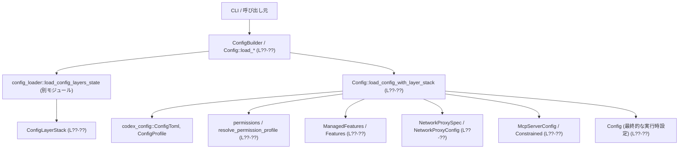
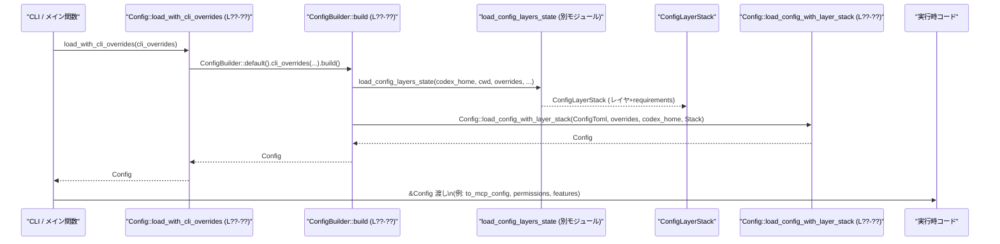

# core/src/config/mod.rs コード解説

---

## 0. ざっくり一言

このモジュールは、`config.toml` やプロファイル・requirements.toml・CLI オプションなど複数ソースから設定を読み込み、**実行時に使う統合済みの `Config` 構造体**を生成・提供する中核コンポーネントです。  
パーミッション・サンドボックス・モデル/プロバイダ・ネットワーク・TUI・OTEL など、アプリケーション全体の振る舞いをここで集約します。

> 行番号情報はチャンクに含まれていないため、本解説の根拠表記は `core/src/config/mod.rs:L??-??` のように示します（正確な行番号は不明です）。

---

## 1. このモジュールの役割

### 1.1 概要

- このモジュールは **Codex アプリケーションの設定管理**を担い、次の問題を解決するために存在します。
  - 複数レイヤ（ユーザ設定、プロジェクト設定、クラウド要求、CLI など）のマージ
  - requirements.toml による **制約（Constrained 値）**の強制
  - パーミッション・サンドボックスとネットワーク制御の一元化
- 主な機能は以下です。
  - 統合済み設定 `Config` の生成 (`ConfigBuilder`, `Config::load_config_with_layer_stack`)
  - MCP サーバやサンドボックスなどの **安全関連設定**の構築
  - trust level や OSS プロバイダなど一部設定値の永続化編集
  - Web 検索モード・マルチエージェント設定などの補助的な解決ロジック

### 1.2 アーキテクチャ内での位置づけ

このモジュールは「設定の統合ポイント」として、多数のサブモジュール・外部クレートと連携します。



- `ConfigBuilder::build` が `ConfigLayerStack` を構築し、マージ済み TOML を `ConfigToml` に変換します（`load_config_layers_state` 経由）。
- `Config::load_config_with_layer_stack` が、`ConfigToml` と `ConfigRequirements` から最終的な `Config` を組み立てます。
- サンドボックス・ネットワーク・MCP・Features などは、それぞれ専用のサブモジュール／外部クレートに委譲しつつ、このモジュールで統合されています。

### 1.3 設計上のポイント

- **レイヤード設定 + 制約適用**
  - `ConfigLayerStack` が設定レイヤと requirements を保持し、`Constrained<T>` / `ConstrainedWithSource<T>` で「許可される値の範囲」を表現します（`Config::load_config_with_layer_stack` 内の利用）。
  - ユーザ設定や CLI オプションが制約に違反する場合は、**警告を出しつつ要求元の値にフォールバック**します（`apply_requirement_constrained_value`）。
- **パーミッション構文の二系統サポート**
  - 旧来の `sandbox_mode` と、新しい `[permissions]` プロファイル構文を同時にサポートし、`resolve_permission_config_syntax` でどちらを有効にするかを決定します。
- **安全性重視のデフォルト**
  - 危険な設定（例: `SandboxPolicy::DangerFullAccess`、`bearer_token` 直書きなど）には専用の分岐や検査があります。
  - `resolve_web_search_mode_for_turn` などで、制約やサンドボックスに応じた安全なモードを選択します。
- **I/O は集中して起動時に実行**
  - 設定読み込み・ファイル書き込み・JSON/TOML 変換は主に `ConfigBuilder::build` と `Config::load_config_with_layer_stack` 経由で行われ、平常時は出来上がった `Config` を読むだけです。

---

## 2. 主要な機能一覧

- `ConfigBuilder` による **設定読み込み・ビルド処理**（非同期 I/O）
- `Config` 構造体による **アプリ全体の実行時設定の保持**
- `Permissions` 構造体による **パーミッション・サンドボックス・ネットワーク設定の集約**
- requirements.toml を用いた **制約付き設定 (`Constrained<T>`) の適用**
- MCP サーバ設定のフィルタリングと制約適用 (`constrain_mcp_servers`, `load_global_mcp_servers`)
- Web 検索モード・設定の解決 (`resolve_web_search_mode`, `resolve_web_search_mode_for_turn`, `resolve_web_search_config`)
- マルチエージェント v2 設定の解決 (`resolve_multi_agent_v2_config`)
- trust level/OSS プロバイダの **config.toml への永続化編集** (`set_project_trust_level`, `set_default_oss_provider`)
- AGENTS.md / モデル指示ファイル読み込み (`load_instructions`, `try_read_non_empty_file`)
- Windows サンドボックス設定のトグル (`set_windows_sandbox_enabled`, `set_windows_elevated_sandbox_enabled`)
- OTEL（OpenTelemetry）設定の構築 (`Config::load_config_with_layer_stack` 内で `OtelConfig` を組み立て)

---

## 3. 公開 API と詳細解説

### 3.1 型一覧（構造体・列挙体など）

このファイル内で定義され、外部から主に利用される型をまとめます。

| 名前 | 種別 | 公開レベル | 役割 / 用途 | 根拠 |
|------|------|-----------|-------------|------|
| `Permissions` | 構造体 | `pub` | コマンド実行やファイル/ネットワークサンドボックス、ネットワークプロキシ、Windows サンドボックスなど、実行時パーミッション関連設定を集約します。 | core/src/config/mod.rs:L??-?? |
| `Config` | 構造体 | `pub` | アプリケーション全体の統合済み設定。モデル、プロバイダ、TUI、履歴、サンドボックス、Features、OTEL などほぼ全ての設定を保持します。 | 同上 |
| `MultiAgentV2Config` | 構造体 | `pub` | マルチエージェント v2 機能の UI 表示やメタデータの制御を行うシンプルな設定。 | 同上 |
| `ConfigBuilder` | 構造体 | `pub` | Codex ホームや CLI オーバライド、loader オーバライドなどを指定し、非同期に `Config` を構築するビルダー。 | 同上 |
| `AgentRoleConfig` | 構造体 | `pub` | ユーザ定義エージェントロール（説明文・専用 config ファイル・ニックネーム候補）のメタ情報。`Config.agent_roles` に格納されます。 | 同上 |
| `ConfigOverrides` | 構造体 | `pub` | CLI/harness 経由の各種オーバライド（モデル、cwd、sandbox_mode など）をまとめるための入力用構造体。 | 同上 |
| `PermissionConfigSyntax` | 列挙体 | `enum` (内部) | パーミッション設定の構文モード（`Legacy` / `Profiles`）を表現。外部 API というより、内部判定用です。 | 同上 |
| `PermissionSelectionToml` | 構造体 | 内部 + `Deserialize` | 各レイヤの簡易 TOML 抽出用（`default_permissions` / `sandbox_mode` の有無を判定）。 | 同上 |
| `LoadedUserInstructions` | 構造体 | 内部 | AGENTS ファイルの内容とパスを保持する内部ヘルパー。 | 同上 |

加えて、このモジュールは多くの型を re-export します（例: `ManagedFeatures`, `NetworkProxySpec`, `ConfigService` など）が、それらは他ファイル定義のためここでは一覧に留めます。

### 3.2 重要な関数 / メソッド詳細（抜粋）

#### `ConfigBuilder::build(self) -> std::io::Result<Config>`

**概要**

- `ConfigBuilder` に設定された `codex_home`・CLI オーバライド・loader オーバライド・クラウド requirements などを基に、非同期に `Config` を構築します。
- 推奨される `Config` 生成経路の基盤となるメソッドです。

**引数**

| 引数名 | 型 | 説明 |
|--------|----|------|
| `self` | `ConfigBuilder` | ビルドパラメータを保持したビルダー自身。`codex_home`, `cli_overrides`, `harness_overrides` などを保持します。 |

**戻り値**

- `std::io::Result<Config>`  
  - `Ok(Config)` : 設定を正常に読み込み・マージ・検証できた場合
  - `Err(e)` : `config.toml` のパースエラー、無効な値、ファイルシステムエラーなど

**内部処理の流れ**

1. `self` を分解し、`codex_home` が未指定なら `find_codex_home()` で決定します。
2. `cli_overrides` や `harness_overrides`、`loader_overrides` にデフォルトを補充します。
3. `cwd_override`（オーバライドされた作業ディレクトリ or `fallback_cwd`）から `AbsolutePathBuf` を構築し、`harness_overrides.cwd` に反映します。
4. `load_config_layers_state` を呼び出して `ConfigLayerStack` を構築し、`effective_config()` でマージ済み TOML を取得します。
5. マージ済み TOML を `ConfigToml` に変換します。変換に失敗した場合は、`first_layer_config_error` の情報を付加して `std::io::Error` に変換します。
6. `Config::load_config_with_layer_stack` を呼び出して最終的な `Config` を構築し、その結果を返します。

**Examples（使用例）**

```rust
// 非同期コンテキスト（例: tokio）での基本的な Config ロード例
use core::config::mod_rs_path::Config; // 実際は crate ルートからのパスに置き換え
use toml::Value as TomlValue;

#[tokio::main]
async fn main() -> std::io::Result<()> {
    // CLI オーバライドがない場合は空ベクタ
    let cli_overrides: Vec<(String, TomlValue)> = Vec::new();  // `key`, `value` のペア列

    // ConfigBuilder を使って Config を構築
    let config = ConfigBuilder::default()
        .cli_overrides(cli_overrides)                         // CLI からの上書き設定
        .build()                                              // 非同期ビルド
        .await?;                                              // I/O エラーなどを伝播

    println!("Active model: {:?}", config.model);             // 設定済みモデル名を確認
    Ok(())
}
```

**Errors / Panics**

- `find_codex_home()` や `AbsolutePathBuf::current_dir()` が失敗すると `Err(io::Error)` を返します。
- `load_config_layers_state` が設定レイヤの読み込みに失敗した場合や、`ConfigToml` への変換に失敗した場合も `Err` になります。
- パニックを起こすコードはこのメソッド内には見当たりません（`expect` 等未使用）。  
  根拠: エラーはすべて `?` と `std::io::Error::new` 経由で Result に変換されています。  
  （core/src/config/mod.rs:L??-??）

**Edge cases（エッジケース）**

- `codex_home` が明示されない場合でも、`CODEX_HOME` 環境変数やデフォルト（`~/.codex`）を使って自動決定します。
- `cwd` が相対パスで指定された場合、現在の作業ディレクトリに対して解決されます。
- マージ済み TOML が `ConfigToml` に変換できない場合、**最初のレイヤに起因する詳細なエラー**を含んだ `InvalidData` エラーで失敗します。

**使用上の注意点**

- 非同期関数なので、必ず `.await` が必要です。
- `ConfigBuilder` のフィールドはすべて **所有権ムーブ**で設定されるため、同じビルダーインスタンスを再利用することは想定されていません。
- 設定読み込みは比較的重い I/O を伴うため、アプリ起動時に一度だけ呼び出し、その後は `Config` を共有するのが前提です。

---

#### `Config::load_config_with_layer_stack(cfg: ConfigToml, overrides: ConfigOverrides, codex_home: PathBuf, config_layer_stack: ConfigLayerStack) -> std::io::Result<Config>`

**概要**

- マージ済み TOML (`ConfigToml`) と requirements (`ConfigRequirements`) および CLI/harness オーバライドから、**最終的な `Config` を組み立てる中核メソッド**です。
- モデル・プロバイダ・サンドボックス・パーミッション・Features・TUI・OTEL などをすべてここで決定します。

**引数**

| 引数名 | 型 | 説明 |
|--------|----|------|
| `cfg` | `ConfigToml` | マージ済み `config.toml` 相当の設定。 |
| `overrides` | `ConfigOverrides` | CLI やハーネスからのオーバライド値群。 |
| `codex_home` | `PathBuf` | Codex ホームディレクトリの絶対パス。 |
| `config_layer_stack` | `ConfigLayerStack` | 各設定レイヤと requirements を含むスタック。 |

**戻り値**

- `std::io::Result<Config>`  
  成功時は完全に検証済みの `Config` を返し、失敗時は InvalidInput / InvalidData などの `io::Error` を返します。

**内部処理の主なステップ**

1. **モデルプロバイダ検証**
   - `validate_model_providers` で `cfg.model_providers` の整合性をチェックします。  
     （core/src/config/mod.rs:L??-??）

2. **requirements の取得**
   - `config_layer_stack.requirements()` から `ConfigRequirements` を clone し、  
     - `approval_policy` / `approvals_reviewer` / `sandbox_policy` / `web_search_mode` を `ConstrainedWithSource` として取得します。
     - `feature_requirements`, `mcp_servers`, `enforce_residency`, `network` なども取得。

3. **AGENTS.md / user instructions 読み込み**
   - `load_instructions(Some(&codex_home))` で `LOCAL_PROJECT_DOC_FILENAME` / `DEFAULT_PROJECT_DOC_FILENAME` を探索し、非空の場合のみ取り込みます。

4. **ConfigOverrides の分解とプロファイル選択**
   - `config_profile_key`（CLI/overrides）または `cfg.profile` からアクティブプロファイル名を決定。
   - 該当プロファイルが存在しない場合は `NotFound` エラーを返します。

5. **Features / ManagedFeatures の構築**
   - ベース (`cfg.features`)、プロファイル (`config_profile.features`)、オーバライド (`FeatureOverrides`) から `Features::from_sources` を呼び、さらに `ManagedFeatures::from_configured` で requirements を適用します。

6. **cwd と追加 writable roots の決定**
   - `overrides.cwd` から `resolved_cwd: AbsolutePathBuf` を決定し、`additional_writable_roots` を `AbsolutePathBuf` に解決・補正します。
   - memories 用ディレクトリ (`memory_root(codex_home)`) を作成し、writable roots に必ず含めます。

7. **パーミッション構文決定とサンドボックス構築**
   - `resolve_permission_config_syntax` により `Legacy` / `Profiles` / なし を判定します。
   - `Profiles` 有効時:
     - `cfg.permissions` と `cfg.default_permissions` からプロファイルを選択し、`compile_permission_profile` で `FileSystemSandboxPolicy` と `NetworkSandboxPolicy` を生成。
   - `Legacy` の場合:
     - `cfg.derive_sandbox_policy` で `SandboxPolicy` を生成し、そこから `FileSystemSandboxPolicy` / `NetworkSandboxPolicy` を派生。
   - いずれの場合も、WorkspaceWrite のときに `additional_writable_roots` を反映します。

8. **approval_policy / approvals_reviewer / web_search_mode の決定と制約適用**
   - Override → Profile → Global → デフォルト の優先順で値を決定。
   - requirement がある場合、`apply_requirement_constrained_value` で検証し、違反時は requirement 側のデフォルトにフォールバックしつつ警告を `startup_warnings` に追加します。

9. **MCP サーバ・ネットワーク構成の制約適用**
   - `constrain_mcp_servers` で MCP サーバ一覧に requirements を適用します。
   - `NetworkProxySpec::from_config_and_constraints` に `configured_network_proxy_config` と network requirements、`sandbox_policy` を渡して有効なネットワークプロキシ設定を構築します。

10. **モデル / プロバイダ / サービスティアなどの決定**
    - `model`, `review_model`, `model_provider_id`, `model_provider` を決定し、存在しないプロバイダはエラー。
    - `service_tier` は `Feature::FastMode` の有効性によって `Fast` を抑制する場合があります。

11. **エージェント・Ghost Snapshot・TUI・OTEL などの付帯設定**
    - `agent_max_threads`, `agent_max_depth`, `agent_job_max_runtime_seconds` の境界チェック（0 や負など）を行い、無効な値なら `InvalidInput` でエラー。
    - `GhostSnapshotConfig` を構成（閾値が 0 以下なら `None` として扱う）。
    - TUI 関連、analytics/feedback、OTEL (`OtelConfigToml` → `OtelConfig`) を構成。

12. **Constrained 値から最終値の再派生**
    - `constrained_sandbox_policy.value` を用いて、必要に応じて `FileSystemSandboxPolicy` / `NetworkSandboxPolicy` を再計算し、`get_readable_roots_required_for_codex_runtime` の結果を追加 readable roots に反映します。

13. **`Config` 構造体の生成**
    - 上記で求めた値をすべてフィールドに詰めて `Config` を返します。

**Examples（使用例）**

```rust
// テストや専用ハーネスから、特定の ConfigToml を直接使いたい場合のイメージ
use codex_config::config_toml::ConfigToml;
use std::path::PathBuf;

fn build_config_for_test(cfg: ConfigToml, codex_home: PathBuf) -> std::io::Result<Config> {
    let overrides = ConfigOverrides {
        // 必要な項目だけオーバライド
        approval_policy: Some(codex_protocol::protocol::AskForApproval::Never),
        ..ConfigOverrides::default()
    };

    // requirements なしの空スタックを使うテスト用パス
    let stack = ConfigLayerStack::default();              // 本番では ConfigBuilder::build で生成
    Config::load_config_with_layer_stack(cfg, overrides, codex_home, stack)
}
```

**Errors / Panics**

- 無効なプロファイル名、欠落した `[permissions]` や `default_permissions` など論理的に不整合な設定値は `InvalidInput` もしくは `NotFound` でエラーになります。
- `agents.max_threads == 0` / `agents.max_depth < 1` / `agents.job_max_runtime_seconds == 0` や `> i64::MAX` は明示的にエラーになります。
- ファイルシステム操作（memories ディレクトリ作成など）が失敗した場合もエラーです。
- 明示的な `panic!` はなく、エラーは全て `Result` 経由で伝播します。

**Edge cases（エッジケース）**

- `[permissions]` が存在し `default_permissions` が未設定な場合、Profiles 構文を選ぶとエラーになります。
- requirements 側の制約によって `sandbox_policy` や `approval_policy` が変更されると、ファイル/ネットワークサンドボックスもそれに合わせて再計算されます。
- `forced_chatgpt_workspace_id` や `compact_prompt` は空文字や空白のみの場合、`None` として扱われます（トリム処理あり）。

**Bugs/Security 観点（このメソッドに関して）**

- サンドボックスと network requirements を一貫して適用しており、明示的に「制約違反を警告しつつ要求側デフォルトにフォールバック」という形になっているため、**requirements を無視することはありません**。
- `get_readable_roots_required_for_codex_runtime` で内部実行ファイルへの読取権限を必ず追加しており、サンドボックスが強すぎて内部コマンドが動かなくなるリスクを軽減しています。

---

#### `Config::to_models_manager_config(&self) -> ModelsManagerConfig`

**概要**

- 現在の `Config` から、モデル管理に必要な設定だけを切り出して `ModelsManagerConfig` を構築します。

**引数**

| 引数名 | 型 | 説明 |
|--------|----|------|
| `&self` | `&Config` | 実行中の統合済み設定。 |

**戻り値**

- `ModelsManagerConfig`  
  - コンテキストウィンドウ、履歴の自動コンパクト閾値、ツール出力トークン上限、ベース指示文、パーソナリティ機能の有効フラグ、推論サマリ関連設定など。

**内部処理**

- `self` の以下のフィールドから対応する値をそのままコピーまたは変換します。
  - `model_context_window`, `model_auto_compact_token_limit`, `tool_output_token_limit`
  - `base_instructions.clone()`
  - `personality_enabled: self.features.enabled(Feature::Personality)`
  - `model_supports_reasoning_summaries`, `model_catalog.clone()`

**使用上の注意点**

- `Config` に対する軽量なビュー構築なので、I/O やエラーは発生しません。
- `Clone` を行うフィールド（`base_instructions`, `model_catalog`）のサイズに注意します（大きなモデルカタログの場合）。

---

#### `Config::to_mcp_config(&self, plugins_manager: &crate::plugins::PluginsManager) -> McpConfig`

**概要**

- `Config` と現在ロードされているプラグインから、MCP（Model Context Protocol）クライアント向けの設定 `McpConfig` を構築します。

**引数**

| 引数名 | 型 | 説明 |
|--------|----|------|
| `&self` | `&Config` | 実行中設定。 |
| `plugins_manager` | `&crate::plugins::PluginsManager` | プラグイン管理オブジェクト。MCP サーバの追加定義を提供します。 |

**戻り値**

- `McpConfig`  
  MCP サーバ一覧、ネットワーク・サンドボックス関連設定、OAuth 設定などを含む MCP クライアント用構成。

**内部処理の流れ**

1. `plugins_manager.plugins_for_config(self)` で現在の Config に適用されるプラグインを取得。
2. `self.mcp_servers.get().clone()` で Constrained な MCP サーバマップをクローン。
3. プラグインが提供する MCP サーバ定義を `configured_mcp_servers` にマージ（既存キーは上書きしない）。
4. `McpConfig` を構築：
   - `chatgpt_base_url`, `codex_home`, OAuth 関連、`codex_linux_sandbox_exe` 等を `self` からコピー。
   - Feature flags から `skill_mcp_dependency_install_enabled`, `apps_enabled`, `use_legacy_landlock` を設定。
   - `approval_policy` やプラグインの capability summaries も含める。

**Edge cases**

- Requirements により一部 MCP サーバが無効化されている場合でも、`self.mcp_servers.get()` によってその状態が反映された形で渡されます。
- プラグイン由来の MCP サーバ定義は既存キーを上書きしないため、「設定ファイル側が優先」のポリシーになっています。

---

#### `load_global_mcp_servers(codex_home: &Path) -> std::io::Result<BTreeMap<String, McpServerConfig>>`

**概要**

- `CODEX_HOME` 以下の設定レイヤをマージした TOML から、**グローバルな MCP サーバ定義**だけを抽出して返すユーティリティ関数です。
- requirements 適用前の「生の」設定を読み、非推奨フィールド (`bearer_token`) の検出にも使われます。

**引数**

| 引数名 | 型 | 説明 |
|--------|----|------|
| `codex_home` | `&Path` | Codex ホームディレクトリ。 |

**戻り値**

- `Ok(BTreeMap<String, McpServerConfig>)` : `mcp_servers` セクションが存在する場合、その内容を返します。
- `Ok(empty)` : `mcp_servers` セクションが存在しない場合。
- `Err(io::Error)` : TOML 変換失敗、`bearer_token` 使用、I/O エラー等。

**内部処理の流れ**

1. 空の `cli_overrides` と `cwd = None` で `load_config_layers_state` を呼び出し、`ConfigLayerStack` を取得。
2. `effective_config()` でマージ済み TOML を取得し、トップレベルキー `mcp_servers` を探す。
3. 見つからなければ空の `BTreeMap` を返す。
4. 見つかった場合は `ensure_no_inline_bearer_tokens` で `bearer_token` フィールドの有無を検査。
   - 見つかった場合は `InvalidData` エラーを返す（後述）。
5. `servers_value.clone().try_into()` で `BTreeMap<String, McpServerConfig>` に変換して返す。

**Security 観点**

- `ensure_no_inline_bearer_tokens` により、MCP サーバ設定における **平文 `bearer_token` の記述は明示的にエラー**とされます。
  - ユーザには `bearer_token_env_var` を使うように促すメッセージを返します。
  - これはアクセスキー漏えいを防ぐための安全対策です。  
    根拠: 関数コメントと実装（core/src/config/mod.rs:L??-??）

**使用上の注意点**

- プロジェクトローカルの `.codex/` MCP サーバ定義は、この関数では読み込まれません（コメントに「in-repo .codex/ folders は含まれない」と明示）。
- MCP サーバ設定の静的な検査・一覧表示に向いた関数であり、ランタイム利用時は `Config::to_mcp_config` から得られる設定を使うのが一貫しています。

---

#### `set_project_trust_level(codex_home: &Path, project_path: &Path, trust_level: TrustLevel) -> anyhow::Result<()>`

**概要**

- `CODEX_HOME/config.toml` の `projects` セクションに対して、指定されたプロジェクトパスの `trust_level` を設定・更新します。
- 内部では `ConfigEditsBuilder` を使って config.toml をパッチします。

**引数**

| 引数名 | 型 | 説明 |
|--------|----|------|
| `codex_home` | `&Path` | Codex ホーム。`config.toml` が存在するディレクトリ。 |
| `project_path` | `&Path` | 信頼レベルを設定するプロジェクトのパス。 |
| `trust_level` | `TrustLevel` | `trusted` / `untrusted` などの信頼レベル。文字列表現に変換されます。 |

**戻り値**

- `anyhow::Result<()>`  
  - 成功時は `Ok(())`。
  - 失敗時は `ConfigEditsBuilder::apply_blocking` からのエラー（ファイル I/O、TOML 編集失敗等）。

**内部処理**

- `ConfigEditsBuilder::new(codex_home)` を生成し、
- `.set_project_trust_level(project_path, trust_level)` を呼び出して編集内容を構築し、
- `.apply_blocking()` により同期的にファイルへ書き込みます。  
  実際の TOML 編集ロジックは `set_project_trust_level_inner`（このファイル内）で定義されており、明示的な `[projects]` → `["/path"]` テーブル形式を保証します。

**使用上の注意点**

- コメントに「Use with caution」とある通り、既存の `config.toml` を直接変更するため、**並行実行時の競合**（他プロセスが同じファイルを書き換える場合）には注意が必要です。
- パスは `project_trust_key(project_path)` によって正規化された文字列として保存されるため、同じ物理パスに対して異なる表記をすると別エントリになる可能性があります。

---

#### `resolve_oss_provider(explicit_provider: Option<&str>, config_toml: &ConfigToml, config_profile: Option<String>) -> Option<String>`

**概要**

- CLI オプションやプロファイル設定を考慮して、使用する OSS プロバイダ名を決定します。

**引数**

| 引数名 | 型 | 説明 |
|--------|----|------|
| `explicit_provider` | `Option<&str>` | CLI 等で明示指定されたプロバイダ（例: `--local-provider`）。 |
| `config_toml` | `&ConfigToml` | マージ済み設定。 |
| `config_profile` | `Option<String>` | 使用するプロファイル名。 |

**戻り値**

- `Some(String)` : 有効な OSS プロバイダが何らかの手段で設定されている場合。
- `None` : どのレイヤにも OSS プロバイダ設定が無い場合。

**解決ロジック**

1. `explicit_provider` が `Some` ならそれを最優先で採用。
2. そうでなければ、`config_toml.get_config_profile(config_profile)` でプロファイルを取得（エラーは無視して `None`）。
3. プロファイルがあれば `profile.oss_provider` を優先。
4. プロファイルにない場合は `config_toml.oss_provider` を使用。
5. どこにも設定がなければ `None`。

---

#### `resolve_web_search_mode_for_turn(web_search_mode: &Constrained<WebSearchMode>, sandbox_policy: &SandboxPolicy) -> WebSearchMode`

**概要**

- 事前に決定された `web_search_mode` の制約と、実際の `SandboxPolicy` を考慮して、**個々のターンで実際に使う Web 検索モード**を決定します。

**引数**

| 引数名 | 型 | 説明 |
|--------|----|------|
| `web_search_mode` | `&Constrained<WebSearchMode>` | requirements で制約された Web 検索モード。 |
| `sandbox_policy` | `&SandboxPolicy` | 現在のサンドボックス状況（特に `DangerFullAccess` かどうか）。 |

**戻り値**

- 実際に利用する `WebSearchMode`（`Live` / `Cached` / `Disabled`）。

**内部処理の流れ**

1. `preferred = web_search_mode.value()` で現在の希望値を取得。
2. `SandboxPolicy::DangerFullAccess` かつ `preferred != Disabled` の場合:
   - `Live` → `Cached` → `Disabled` の順で `can_set` を試し、最初に許可されるモードを返却。
3. それ以外の場合:
   - まず `preferred` を `can_set` で試し、許可されるならそれを返却。
   - だめなら `Cached` → `Live` → `Disabled` の順で fallback。
4. どのモードも許可されない場合、最終的に `Disabled` を返す。

**Contracts / Security 観点**

- `Constrained` により requirements で禁止されているモードは `can_set` が `Err` を返し、このロジックで必ず避けられます。
- `DangerFullAccess` のときに `Live` を優先しようとしている点から、「フルアクセス環境ではよりダイレクトな Web 検索を使う」という設計意図が読み取れますが、**制約が優先されるため安全側に倒れます**。  
  （core/src/config/mod.rs:L??-??）

---

### 3.3 その他の関数（主なもの）

| 関数名 | 役割（1 行） | 根拠 |
|--------|--------------|------|
| `resolve_sqlite_home_env` | 環境変数 `SQLITE_HOME_ENV` から SQLite ホームディレクトリを取得し、相対パスなら `resolved_cwd` 基準で解決します。 | core/src/config/mod.rs:L??-?? |
| `load_config_as_toml_with_cli_overrides` | requirements 未適用の `ConfigToml` を CLI オーバライド込みで読み込む（**非推奨**とコメントされています）。 | 同上 |
| `deserialize_config_toml_with_base` | `AbsolutePathBufGuard` を使って、相対パスを特定ディレクトリ基準で解決しながら `ConfigToml` にデシリアライズします。 | 同上 |
| `load_catalog_json` / `load_model_catalog` | `model_catalog_json` から `ModelsResponse` を読み込み、モデル数 0 の場合はエラーにします。 | 同上 |
| `filter_mcp_servers_by_requirements` / `constrain_mcp_servers` | MCP サーバ一覧に対して requirements を適用し、許可されないサーバを disabled 扱いにします。 | 同上 |
| `apply_requirement_constrained_value` | `ConstrainedWithSource<T>` に対して設定値を適用し、違反時に要求値へフォールバック&警告を追加します。 | 同上 |
| `set_default_oss_provider` | `oss_provider` の検証後、config.toml に `oss_provider` キーを書き込むユーティリティ。 | 同上 |
| `resolve_tool_suggest_config` | `ConfigToml` の `tool_suggest` セクションから空白でない discoverable ID を抽出し、`ToolSuggestConfig` に変換します。 | 同上 |
| `resolve_web_search_mode` | ベース／プロファイルの設定と feature flags から、デフォルトの Web 検索モードを決定します。 | 同上 |
| `resolve_web_search_config` | ベース + プロファイルの web_search 設定をマージして `WebSearchConfig` に変換します。 | 同上 |
| `resolve_multi_agent_v2_config` | features 設定から MultiAgent v2 用の UI 設定を組み立てます。 | 同上 |
| `load_instructions` | `codex_home` 直下の AGENTS ファイル候補を探し、非空なら内容とパスを返します。 | 同上 |
| `try_read_non_empty_file` | 指定されたパスのファイルを読み、空でなければ `Some(String)`、空なら `InvalidData` エラーを返します。 | 同上 |
| `set_windows_sandbox_enabled` / `set_windows_elevated_sandbox_enabled` | `Config.permissions.windows_sandbox_mode` を Unelevated/Elevated/None の間でトグルします。 | 同上 |
| `managed_network_requirements_enabled` | requirements.toml に `network` セクションがあるかどうかを返します。 | 同上 |
| `bundled_skills_enabled` | `config_layer_stack` を使ってバンドル済みスキルが有効かどうかを判定します。 | 同上 |
| `uses_deprecated_instructions_file` / `toml_uses_deprecated_instructions_file` | 各レイヤの TOML に `experimental_instructions_file` が含まれるかを検査します。 | 同上 |
| `guardian_policy_config_from_requirements` | requirements.toml の `guardian_policy_config` をトリムして非空なら返します。 | 同上 |
| `find_codex_home` | 環境変数等を考慮して Codex ホームディレクトリを決定します（ラッパー）。 | 同上 |
| `log_dir` | `Config.log_dir` を返します（ラッパー）。 | 同上 |

---

## 4. データフロー

ここでは、「CLI から `Config` を生成して MCP 設定を使う」典型的な流れを示します。

### 4.1 設定ロード〜利用のシーケンス



- `load_with_cli_overrides` は `ConfigBuilder` の薄いラッパーで、CLI オーバライドのみを指定して `build` を呼び出します。
- `load_config_layers_state` がシステム/ユーザ/プロジェクト/クラウドレイヤをマージし、requirements も読み込みます。
- `Config::load_config_with_layer_stack` が、マージ済み設定と requirements をもとに `Config` を構築します。
- 以後、アプリケーションは `Config` を参照するだけで、サンドボックス・履歴・TUI・MCP 設定などにアクセスできます。

---

## 5. 使い方（How to Use）

### 5.1 基本的な使用方法

アプリ起動時に `Config` をロードし、その後各サブシステムに渡して利用するパターンを想定します。

```rust
use std::error::Error;
use toml::Value as TomlValue;
// 実際のパスは crate ルートに合わせて調整
use crate::config::{Config, ConfigBuilder};

#[tokio::main]
async fn main() -> Result<(), Box<dyn Error>> {
    // 1. CLI オプションなどからオーバライドを構築
    let cli_overrides: Vec<(String, TomlValue)> = vec![
        // 例: ("model".into(), TomlValue::String("gpt-4.1-mini".into())),
    ];

    // 2. Config をロード（requirements も適用）
    let config = Config::load_with_cli_overrides(cli_overrides).await?;  // 非同期

    // 3. Config から必要な情報を取り出して利用
    println!("cwd: {}", config.cwd.display());
    println!("service tier: {:?}", config.service_tier);
    println!("sandbox policy: {:?}", config.permissions.sandbox_policy);

    // 4. MCP 用設定などを下位コンポーネントに渡す
    // let mcp_config = config.to_mcp_config(&plugins_manager);

    Ok(())
}
```

### 5.2 よくある使用パターン

1. **ハーネス用の固定設定を使う（ユーザ設定を無視）**

```rust
use crate::config::{Config, ConfigOverrides};
use toml::Value as TomlValue;

async fn run_headless_task() -> std::io::Result<()> {
    let cli_overrides: Vec<(String, TomlValue)> = Vec::new();
    let overrides = ConfigOverrides {
        approval_policy: Some(AskForApproval::Never), // 常に許可
        // 他のオーバライドも必要に応じて指定
        ..ConfigOverrides::default()
    };

    // CLI + harness overrides を同時適用
    let cfg = Config::load_with_cli_overrides_and_harness_overrides(cli_overrides, overrides).await?;

    // cfg.permissions.approval_policy は requirements を踏まえた最終値
    Ok(())
}
```

1. **グローバル MCP サーバ設定だけを確認するツール**

```rust
use crate::config::load_global_mcp_servers;
use std::path::Path;

async fn list_mcp_servers() -> std::io::Result<()> {
    let codex_home = Path::new("/home/user/.codex");
    let servers = load_global_mcp_servers(codex_home).await?;
    for (name, server) in servers {
        println!("{name}: {:?}", server.transport);
    }
    Ok(())
}
```

### 5.3 よくある間違い

```rust
// 間違い例: 非同期関数を await せずに使用
// let config = Config::load_with_cli_overrides(vec![]);  // これは Future を返すだけ

// 正しい例: tokio などのランタイム内で await する
let config = Config::load_with_cli_overrides(vec![]).await?;
```

```rust
// 間違い例: agents.max_threads = 0 を config.toml に設定してしまう
// [agents]
// max_threads = 0  # ← 無効であり、起動時に InvalidInput エラー

// 正しい例: 最低 1 以上にする
// [agents]
// max_threads = 4
```

```rust
// 間違い例: MCP サーバに plain bearer_token を書く
// [mcp_servers.my_server]
// bearer_token = "sk-..."  # ← ensure_no_inline_bearer_tokens によりエラー

// 正しい例: 環境変数経由にする
// [mcp_servers.my_server]
// bearer_token_env_var = "MY_SERVER_TOKEN"
```

### 5.4 使用上の注意点（まとめ）

- **非同期実行**: `ConfigBuilder::build` および `Config::load_with_cli_overrides*` は `async` なので、tokio などのランタイム内で使用する必要があります。
- **requirements.toml の影響**:
  - `approval_policy`, `sandbox_policy`, `web_search_mode` などは、ユーザ設定よりも requirements が優先されます。
  - 制約違反時には `startup_warnings` にメッセージが追加されるため、起動時にログへ出すと有用です。
- **ファイル書き込み系 API の取り扱い**:
  - `set_project_trust_level` や `set_default_oss_provider` は config.toml を直接書き換えます。複数プロセスが同時に編集しないように注意が必要です。
- **セキュリティ関連**:
  - MCP の `bearer_token` は禁止されており、`bearer_token_env_var` を利用する設計になっています。
  - `resolve_web_search_mode_for_turn` は requirements に反するモードを選択しないため、Web 検索の利用有無は制約側でコントロールできます。

---

## 6. 変更の仕方（How to Modify）

### 6.1 新しい機能を追加する場合

例: `Config` に新しい設定フィールドを追加する場合の観点です。

1. **型定義の追加**
   - `Config` 構造体に新フィールドを追加します（例: `pub new_feature_flag: bool`）。  
     根拠: 既存の多くのフィールドがここで定義されているため（core/src/config/mod.rs:L??-??）。

2. **ConfigToml 側との対応付け**
   - 新フィールドが `ConfigToml` にも存在する場合は、そのフィールドを `Config::load_config_with_layer_stack` 内で読み取り、`Config` に詰めます。
   - プロファイルごとに上書きされる場合は、`config_profile.xxx.or(cfg.xxx)` のパターンに倣います。

3. **requirements と Constrained 値の必要性の検討**
   - 「管理者による制約が必要」な項目であれば、`ConfigRequirements` にフィールドを追加し、この関数内で `apply_requirement_constrained_value` を使って制約を適用するパターンを参考にします。

4. **既存のユーティリティとの連携**
   - サンドボックスや Web 検索など他の設定と関連する場合は、`resolve_*` 系関数に新ロジックを追加するか、新しい補助関数を定義します。

### 6.2 既存の機能を変更する場合

- **影響範囲の確認**
  - `Config` フィールドを変更すると、`Config::to_models_manager_config`, `Config::to_mcp_config`, `log_dir` など多くの呼び出し側に影響します。
  - `ConfigOverrides` のフィールド追加・削除は CLI オプションやハーネスのオプション設計に直結します。

- **契約条件（Contracts）に注意**
  - `agents.max_threads >= 1`、`agents.max_depth >= 1`、`job_max_runtime_seconds` の範囲チェックなど、明示的な制約がコード内にあります。これらを変える場合は、呼び出し側や docs も含めて整合性を確認する必要があります。
  - `Constrained<T>` / `ConstrainedWithSource<T>` の利用箇所では、「requirements を優先する」という契約を崩さないことが重要です。

- **テスト・検証**
  - `#[cfg(test)]` なヘルパー（`test_config`, `load_from_base_config_with_overrides`）が用意されているため、設定ロジックを変えた際の回帰テストに活用できます（実際のテストコードはこのチャンクには含まれていません）。

---

## 7. 関連ファイル

このモジュールと密接に関係するファイル・モジュールです（ファイルパスは Rust の `mod` 規則から推定されますが、正確なパス構造はこのチャンク単体からは確定できません）。

| パス / モジュール | 役割 / 関係 |
|-------------------|------------|
| `core/src/config/edit.rs` (`pub mod edit`) | `ConfigEdit` や `ConfigEditsBuilder` を提供し、config.toml の部分更新（trust level や oss_provider の設定）に利用されます。 |
| `core/src/config/managed_features.rs` (`mod managed_features`) | `ManagedFeatures` 型の実装と、Features + requirements からの feature gate 管理を提供します。 |
| `core/src/config/network_proxy_spec.rs` | `NetworkProxySpec`, `StartedNetworkProxy` を定義し、ネットワークプロキシの起動・設定を扱います。 |
| `core/src/config/permissions.rs` | `compile_permission_profile`, `resolve_permission_profile`, `get_readable_roots_required_for_codex_runtime` など、ファイル/ネットワークサンドボックス設定を担当します。 |
| `core/src/config/service.rs` | `ConfigService`, `ConfigServiceError` を提供し、外部から設定を操作/取得するサービスレイヤの役割を持ちます。 |
| `crate::config_loader` モジュール群 | `ConfigLayerStack`, `ConfigRequirements`, `load_config_layers_state`, `project_trust_key` など、設定レイヤの読み込みと requirements の適用ロジックを提供します。 |
| `codex_config` クレート | `ConfigToml`, `ConfigProfile`, `OtelConfigToml` など、TOML 形式の設定表現を提供します。 |
| `codex_protocol::config_types` | `SandboxPolicy`, `TrustLevel`, `ServiceTier`, `WebSearchMode` など、ドメイン固有の設定型を定義します。 |
| `codex_network_proxy` / `codex_sandboxing` | ネットワークプロキシとシステムサンドボックスの実装を提供し、本モジュールから設定が渡されます。 |

---

以上が `core/src/config/mod.rs` の主要な構造と振る舞いの解説です。このファイルは Codex 全体の設定の「集約点」であり、Config の生成ロジックと安全性ポリシーの多くがここに集約されています。
