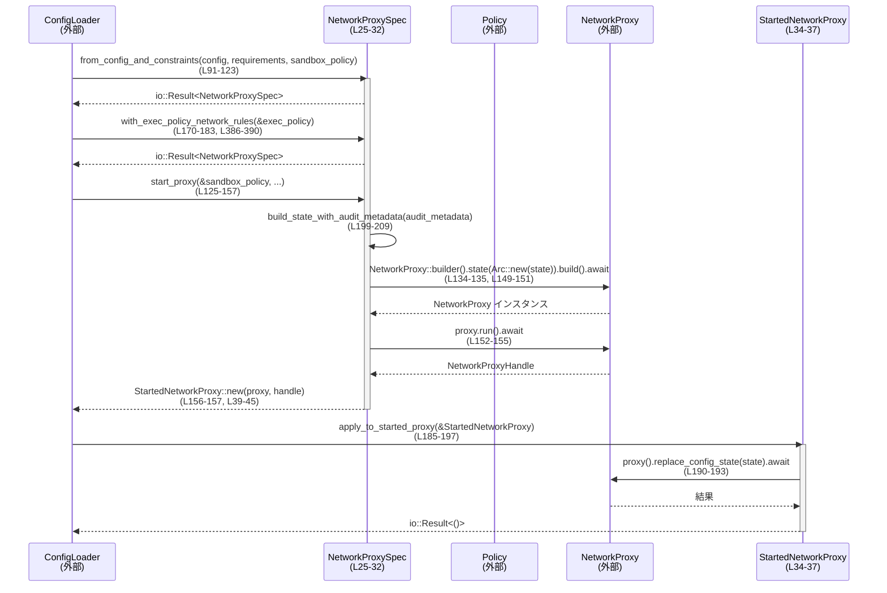

# core/src/config/network_proxy_spec.rs コード解説

---

## 0. ざっくり一言

このモジュールは、`NetworkProxyConfig` と各種制約 (`NetworkConstraints` / `SandboxPolicy` / `Policy`) から **ネットワークプロキシの有効な設定＋制約セット** を組み立て、`codex_network_proxy::NetworkProxy` を起動・再設定するためのラッパーを提供するモジュールです  
（根拠: `NetworkProxySpec` 定義とそのメソッド群  
`core/src/config/network_proxy_spec.rs:L25-32, L91-197, L386-407`）。

---

## 1. このモジュールの役割

### 1.1 概要

- このモジュールは **ネットワークプロキシの設定値** と **外部から与えられる制約** を統合し、  
  - 許可/拒否ドメインリスト  
  - Unix ソケットやローカルバインドの許可  
  - 危険なフルアクセスモード  
  といったポリシーを一貫性のある形にまとめます  
  （`from_config_and_constraints`, `apply_requirements`  
  `core/src/config/network_proxy_spec.rs:L91-123, L218-340`）。

- また、その設定から `NetworkProxyState` を構築し、  
  - プロキシの起動 (`start_proxy`)  
  - 実行中プロキシへの設定反映 (`apply_to_started_proxy`)  
  を行うための API を提供します  
  （`core/src/config/network_proxy_spec.rs:L125-157, L185-197`）。

- 実行ポリシー (`Policy`) やサンドボックスポリシー (`SandboxPolicy`) に応じて  
  **許可/拒否ドメインを拡張しつつ、制約との整合性を検証** します  
  （`with_exec_policy_network_rules`, `apply_exec_policy_network_rules`, `validate_policy_against_constraints` 呼び出し  
  `core/src/config/network_proxy_spec.rs:L170-183, L386-390, L110-115`）。

### 1.2 アーキテクチャ内での位置づけ

このモジュール周辺の主なコンポーネント関係を簡略化すると、次のようになります。

```mermaid
graph TD
  NConstraints["NetworkConstraints(外部)"]
  NConfig["NetworkProxyConfig(外部)"]
  SP["SandboxPolicy(外部)"]
  ExecPol["Policy(exec_policy)(外部)"]
  NPSpec["NetworkProxySpec (L25-32)"]
  NProxyConstr["NetworkProxyConstraints (生成 L218-340)"]
  NState["ConfigState / NetworkProxyState (L199-216)"]
  Reloader["StaticNetworkProxyReloader<br/>(L52-61, L63-76)"]
  NProxy["NetworkProxy (外部, start_proxy L125-157)"]
  Started["StartedNetworkProxy (L34-37, L39-49)"]

  NConstraints -->|from_config_and_constraints<br/>& apply_requirements<br/>(L91-123, L218-340)| NPSpec
  NConfig -->|base_config/config フィールド<br/>(L27, L29)| NPSpec
  SP -->|sandbox_policy 引数<br/>(L95, L127, L221)| NPSpec
  ExecPol -->|with_exec_policy_network_rules<br/>& apply_exec_policy_network_rules<br/>(L170-183, L386-390)| NPSpec

  NPSpec -->|build_config_state_for_spec<br/>(L212-216)| NState
  NPSpec -->|build_state_with_audit_metadata<br/>(L199-209)| NState
  NState -->|with_reloader_and_audit_metadata<br/>(L205-209)| Reloader

  NPSpec -->|start_proxy(L125-157)| NProxy
  NProxy -->|run().await| Started
  Started -->|proxy().replace_config_state()<br/>apply_to_started_proxy(L185-197)| NProxy

  NPSpec -->|constraints フィールド<br/>(L30)| NProxyConstr
```

- **設定レイヤ**  
  - `NetworkProxyConfig`（外部型）＋`NetworkConstraints`＋`SandboxPolicy` を `NetworkProxySpec` が統合します。
- **制約レイヤ**  
  - `NetworkProxyConstraints` に「管理側の制約」を記録し、`validate_policy_against_constraints` で検証します。
- **実行レイヤ**  
  - `NetworkProxySpec` から `ConfigState` / `NetworkProxyState` を組み立て、`NetworkProxy` のビルダーに渡します。
  - 実行中は `StaticNetworkProxyReloader` を通じて「静的な」設定リロードインターフェースを提供します。

### 1.3 設計上のポイント

- **設定と制約の分離**  
  - 実際にプロキシへ渡す `config` と、「これ以上緩めてはいけない」制約 `constraints` を別のフィールドとして保持します  
    （`NetworkProxySpec` フィールド  
    `core/src/config/network_proxy_spec.rs:L27-31`）。

- **サンドボックス／モードごとの挙動切り替え**  
  - `SandboxPolicy` のバリアントに応じて  
    - allowlist/denylist の拡張可否 (`allowlist_expansion_enabled`, `denylist_expansion_enabled`)  
    - 「危険なフルアクセス + denylistのみ」モード (`danger_full_access_denylist_only_enabled`)  
    を切り替えています  
    （`core/src/config/network_proxy_spec.rs:L225-229, L342-350, L356-364, L366-370`）。

- **エラーハンドリングの方針**  
  - 公開 API の多くが `std::io::Result<T>` を返し、  
    外部ライブラリ由来のエラーを `std::io::Error` にラップして返します  
    （`from_config_and_constraints`, `start_proxy`, `with_exec_policy_network_rules`, `apply_to_started_proxy`  
    `core/src/config/network_proxy_spec.rs:L95, L132, L172, L188`）。

- **非同期／並行性**  
  - プロキシ起動や設定更新は `async fn` として定義され、`NetworkProxy` 内部で非同期タスクが動作する前提です  
    （`start_proxy`, `apply_to_started_proxy`  
    `core/src/config/network_proxy_spec.rs:L125-157, L185-197`）。
  - 設定状態は `Arc<ConfigState>` として共有され、再ロード用に `StaticNetworkProxyReloader` が `ConfigReloader` を実装します  
    （`core/src/config/network_proxy_spec.rs:L52-61, L63-76, L133-135, L204-208`）。

- **セキュリティ関連の明示的なフラグ**  
  - `hard_deny_allowlist_misses` フィールドにより、「許可リストにないものは絶対に許可しない」モードかどうかを保持します  
    （初期化: `from_config_and_constraints`  
    `core/src/config/network_proxy_spec.rs:L97-100, L121`）。
  - `danger_full_access_denylist_only` フラグが有効なときは、`*` での全許可＋denylist 方式に切り替え、プロキシや Unix ソケットなども広く許可します  
    （`apply_requirements`  
    `core/src/config/network_proxy_spec.rs:L228-229, L260-264, L330-337`）。

---

## 2. 主要な機能一覧

このモジュールが提供する主な機能は次のとおりです。

- ネットワーク設定＋制約の統合:
  - `NetworkProxyConfig` と `NetworkConstraints` と `SandboxPolicy` から  
    一貫した設定と制約 (`NetworkProxyConstraints`) を生成  
    （`from_config_and_constraints`, `apply_requirements`  
    `core/src/config/network_proxy_spec.rs:L91-123, L218-340`）。
- ネットワークプロキシの起動:
  - 上記設定から `NetworkProxy` を構築し、非同期で起動する  
    （`start_proxy`  
    `core/src/config/network_proxy_spec.rs:L125-157`）。
- 実行中プロキシの再設定:
  - 新しい `NetworkProxySpec` から `ConfigState` を再構築し、`replace_config_state` で適用  
    （`apply_to_started_proxy`  
    `core/src/config/network_proxy_spec.rs:L185-197`）。
- 実行ポリシーベースのドメインルール適用:
  - `Policy::compiled_network_domains()` の結果をプロキシ設定に upsert  
    （`with_exec_policy_network_rules`, `apply_exec_policy_network_rules`, `upsert_network_domains`  
    `core/src/config/network_proxy_spec.rs:L170-183, L386-390, L392-407`）。
- プロキシ接続情報の取得:
  - HTTP プロキシのホスト＋ポート文字列 / SOCKS5 有効フラグを提供  
    （`proxy_host_and_port`, `socks_enabled`  
    `core/src/config/network_proxy_spec.rs:L83-89`）。

---

## 3. 公開 API と詳細解説

### 3.1 型一覧（構造体・定数など）

| 名前 | 種別 | 可視性 | 役割 / 用途 | 定義位置 |
|------|------|--------|-------------|----------|
| `GLOBAL_ALLOWLIST_PATTERN` | 定数 `&'static str` | モジュール内 | フルアクセス時の許可ドメインパターン（`"*"`） | `core/src/config/network_proxy_spec.rs:L23` |
| `NetworkProxySpec` | 構造体 | `pub` | ネットワークプロキシの「元設定」「適用済み設定」「制約」「モードフラグ」をまとめた仕様オブジェクト | `core/src/config/network_proxy_spec.rs:L25-32` |
| `StartedNetworkProxy` | 構造体 | `pub` | 起動済み `NetworkProxy` と、そのライフタイムを保持する `NetworkProxyHandle` をまとめたラッパー | `core/src/config/network_proxy_spec.rs:L34-37` |
| `StaticNetworkProxyReloader` | 構造体 | モジュール内 (`struct`) | 静的な `ConfigState` を保持し、`ConfigReloader` を実装する補助型 | `core/src/config/network_proxy_spec.rs:L52-55` |
| `tests` | モジュール | `cfg(test)` 時のみ | このファイル用のテストモジュール（内容はこのチャンクには現れません） | `core/src/config/network_proxy_spec.rs:L409-411` |

#### 3.1.1 `NetworkProxySpec` のフィールド

| フィールド名 | 型 | 説明 | 定義位置 |
|-------------|----|------|----------|
| `base_config` | `NetworkProxyConfig` | 制約適用前の元のプロキシ設定。サンドボックスポリシーの変更に対する再計算に使用 | `core/src/config/network_proxy_spec.rs:L27` |
| `requirements` | `Option<NetworkConstraints>` | 管理側から与えられるネットワーク制約（存在しない場合もある） | `core/src/config/network_proxy_spec.rs:L28` |
| `config` | `NetworkProxyConfig` | `requirements` とサンドボックスポリシーを適用した後の有効設定 | `core/src/config/network_proxy_spec.rs:L29` |
| `constraints` | `NetworkProxyConstraints` | 「設定が満たすべき制約」を記録した構造体。検証に利用 | `core/src/config/network_proxy_spec.rs:L30` |
| `hard_deny_allowlist_misses` | `bool` | 管理側 allowed ドメインのみ／漏れはすべて拒否かどうかを表すフラグ | `core/src/config/network_proxy_spec.rs:L31` |

### 3.2 重要な関数の詳細

ここでは特に重要な 7 関数について詳しく説明します。

---

#### `NetworkProxySpec::from_config_and_constraints(config, requirements, sandbox_policy) -> std::io::Result<Self>`

**概要**

- ベースとなる `NetworkProxyConfig` と任意の `NetworkConstraints`、および `SandboxPolicy` から、  
  制約を適用済みの `NetworkProxySpec` を構築します  
  （`core/src/config/network_proxy_spec.rs:L91-123`）。

**引数**

| 引数名 | 型 | 説明 |
|--------|----|------|
| `config` | `NetworkProxyConfig` | ベースとなるプロキシ設定 |
| `requirements` | `Option<NetworkConstraints>` | 管理側から指定される制約（なければ `None`） |
| `sandbox_policy` | `&SandboxPolicy` | サンドボックスのポリシー（例: `ReadOnly`, `WorkspaceWrite`, `DangerFullAccess`） |

**戻り値**

- `std::io::Result<NetworkProxySpec>`  
  - 成功時: 制約適用済みの `NetworkProxySpec`  
  - 失敗時: 制約と設定が矛盾する場合などに `std::io::ErrorKind::InvalidInput` で失敗します  
    （`validate_policy_against_constraints` 呼び出し部  
    `core/src/config/network_proxy_spec.rs:L110-115`）。

**内部処理の流れ**

1. `config` をクローンして `base_config` として保持します  
   （`core/src/config/network_proxy_spec.rs:L96`）。
2. `requirements` が `Some` の場合に限り、`managed_allowed_domains_only` が `true` かどうかを見て `hard_deny_allowlist_misses` を決定します  
   （`is_some_and(Self::managed_allowed_domains_only)`  
   `core/src/config/network_proxy_spec.rs:L97-100`）。
3. `requirements` が `Some` なら `apply_requirements` を呼び出し、`config` と `constraints` を更新します。`None` なら `constraints` は `NetworkProxyConstraints::default()` のままにします  
   （`core/src/config/network_proxy_spec.rs:L100-109`）。
4. 得られた `config` と `constraints` を `validate_policy_against_constraints` に渡し、一貫性を検証します。エラーは `std::io::ErrorKind::InvalidInput` でラップされます  
   （`core/src/config/network_proxy_spec.rs:L110-115`）。
5. 最終的なフィールド (`base_config`, `requirements`, `config`, `constraints`, `hard_deny_allowlist_misses`) を設定して `Self` を返します  
   （`core/src/config/network_proxy_spec.rs:L116-122`）。

**Examples（使用例）**

※ この関数は `pub(crate)` なので crate 内部から使われる想定です。典型的には設定ローダ側で次のように使われる形が想定されます（コード例は簡略化された疑似コードです）。

```rust
// ベース設定 config と requirements, sandbox_policy が得られているとする
let spec = NetworkProxySpec::from_config_and_constraints(
    config,              // ベース設定
    Some(requirements),  // 管理側制約
    &sandbox_policy,     // サンドボックス方針
)?;
// spec を使ってプロキシ起動などを行う
```

**Errors / Panics**

- `validate_policy_against_constraints` がエラーを返した場合  
  → `std::io::ErrorKind::InvalidInput` でラップされ、「network proxy constraints are invalid: ...」というメッセージになります  
  （`core/src/config/network_proxy_spec.rs:L110-115`）。
- パニックを起こすコード（`unwrap` など）は使用していません。

**Edge cases（エッジケース）**

- `requirements` が `None` の場合:
  - `hard_deny_allowlist_misses` は常に `false`（`is_some_and` により）。  
  - `constraints` はすべてデフォルト値 (`NetworkProxyConstraints::default()`) になります。
- `requirements.managed_allowed_domains_only` が `Some(true)` で、`requirements.domains` が `None` の場合:
  - `hard_deny_allowlist_misses` は `true` になりますが、`apply_requirements` 内で `unwrap_or_default()` されるため、  
    「許可ドメインが空＋許可リスト漏れは全拒否」という非常に厳しいモードになります  
    （`core/src/config/network_proxy_spec.rs:L265-273`）。

**使用上の注意点**

- この関数で作られた `NetworkProxySpec` は、以降の `start_proxy` や `apply_to_started_proxy` の前提になります。  
  一度エラーなく生成できれば、`validate_policy_against_constraints` による整合性検証は通っていることが保証されます。
- `requirements` と `sandbox_policy` の組み合わせにより、非常に制限の厳しい設定になる場合があります（たとえば前述の許可ドメイン空＋ハード拒否）。  
  ネットワークが完全に遮断される可能性があるため、上位レイヤで意図した設定かどうか確認する必要があります。

---

#### `NetworkProxySpec::start_proxy(&self, sandbox_policy, policy_decider, blocked_request_observer, enable_network_approval_flow, audit_metadata) -> std::io::Result<StartedNetworkProxy>`

**概要**

- 現在の `NetworkProxySpec` から `NetworkProxyState` を構築し、`NetworkProxy` を非同期に起動して `StartedNetworkProxy` を返します  
  （`core/src/config/network_proxy_spec.rs:L125-157`）。

**引数**

| 引数名 | 型 | 説明 |
|--------|----|------|
| `&self` | `&NetworkProxySpec` | 事前に構築されたプロキシ仕様 |
| `sandbox_policy` | `&SandboxPolicy` | サンドボックスモード（自動の policy_decider 設定に影響） |
| `policy_decider` | `Option<Arc<dyn NetworkPolicyDecider>>` | ネットワーク許可フローを決定する外部コンポーネント（任意） |
| `blocked_request_observer` | `Option<Arc<dyn BlockedRequestObserver>>` | ブロックされたリクエストを観測するオブザーバ（任意） |
| `enable_network_approval_flow` | `bool` | ネットワーク許可フロー（ask フロー）を有効化するかどうか |
| `audit_metadata` | `NetworkProxyAuditMetadata` | 監査用メタデータ |

**戻り値**

- `std::io::Result<StartedNetworkProxy>`  
  - 成功時: 起動済み `NetworkProxy` とハンドルを保持する `StartedNetworkProxy`  
  - 失敗時: プロキシ構築または起動時のエラーを `std::io::Error::other` でラップして返します  
    （`core/src/config/network_proxy_spec.rs:L149-151, L152-155`）。

**内部処理の流れ**

1. `build_state_with_audit_metadata` で `NetworkProxyState` を構築します  
   （`core/src/config/network_proxy_spec.rs:L133, L199-209`）。
2. `NetworkProxy::builder().state(Arc::new(state))` でビルダーを初期化します  
   （`core/src/config/network_proxy_spec.rs:L134-135`）。
3. `enable_network_approval_flow` が `true` かつ `!self.hard_deny_allowlist_misses` の場合のみ、policy decider を設定します  
   （`core/src/config/network_proxy_spec.rs:L135`）。
   - `policy_decider` が `Some` なら `builder.policy_decider_arc(policy_decider)` を呼びます  
     （`core/src/config/network_proxy_spec.rs:L136-137`）。
   - そうでなく、`sandbox_policy` が `ReadOnly` または `WorkspaceWrite` であれば、  
     クロージャ `|_request| async { NetworkDecision::ask("not_allowed") }` を policy decider として設定します  
     （`core/src/config/network_proxy_spec.rs:L138-144`）。
4. `blocked_request_observer` が `Some` なら、`builder.blocked_request_observer_arc(...)` で設定します  
   （`core/src/config/network_proxy_spec.rs:L146-148`）。
5. `builder.build().await` で `NetworkProxy` インスタンスを生成し、エラーは `std::io::Error::other` でラップします  
   （`core/src/config/network_proxy_spec.rs:L149-151`）。
6. 生成した `proxy` に対し `proxy.run().await` で実行を開始し、`NetworkProxyHandle` を受け取ります。エラーは同様にラップされます  
   （`core/src/config/network_proxy_spec.rs:L152-155`）。
7. `StartedNetworkProxy::new(proxy, handle)` でラッパーを作成し、返します  
   （`core/src/config/network_proxy_spec.rs:L156-157, L39-45`）。

**Examples（使用例）**

```rust
// async コンテキスト内の想定コード例

// 事前に NetworkProxySpec を構築済みとする
let spec: NetworkProxySpec = /* ... */;

// sandbox_policy, audit_metadata も用意されているとする
let sandbox_policy = SandboxPolicy::ReadOnly { /* ... */ };
let audit_metadata = NetworkProxyAuditMetadata::default(); // 実際のコンストラクタは外部定義

// policy_decider/observer は今回は指定しない例
let started = spec.start_proxy(
    &sandbox_policy,     // サンドボックスポリシー
    None,                // policy_decider なし
    None,                // blocked_request_observer なし
    true,                // 許可フローを有効化
    audit_metadata,      // 監査メタデータ
).await?;

// 実行中の NetworkProxy を取得
let proxy = started.proxy();
```

**Errors / Panics**

- `build()` または `run()` がエラーを返した場合、
  - `"failed to build network proxy: {err}"`  
  - `"failed to run network proxy: {err}"`  
  というメッセージで `std::io::Error::other` に変換されます  
  （`core/src/config/network_proxy_spec.rs:L149-151, L152-155`）。
- パニックを発生させるコードは含まれていません。

**Edge cases（エッジケース）**

- `enable_network_approval_flow == false` の場合:
  - `policy_decider` は設定されません（完全に allow/deny リストベースの挙動になります）。
- `hard_deny_allowlist_misses == true` の場合:
  - `enable_network_approval_flow` が `true` でも、policy decider は設定されません  
    （`core/src/config/network_proxy_spec.rs:L135`）。  
    このモードでは、許可リストにないドメインは無条件に拒否される設計と考えられます。
- `policy_decider == None` かつ `sandbox_policy` が `ReadOnly` / `WorkspaceWrite` の場合:
  - 「not_allowed」という理由で `NetworkDecision::ask(...)` を返す policy decider が自動設定されます。

**使用上の注意点**

- この関数は `async fn` なので、Tokio などの非同期ランタイム上で `await` する必要があります。
- `StartedNetworkProxy` 内で `_handle: NetworkProxyHandle` を保持しているため、  
  `StartedNetworkProxy` をドロップするとプロキシが停止する可能性があります（ハンドルの挙動は外部型の仕様によります）  
  （`core/src/config/network_proxy_spec.rs:L34-37, L39-45`）。
- 危険なフルアクセスモード（`DangerFullAccess`）では、自動の `ask` policy_decider は設定されず、  
  許可/拒否リストに基づく挙動になる点に注意が必要です。

---

#### `NetworkProxySpec::with_exec_policy_network_rules(&self, exec_policy: &Policy) -> std::io::Result<Self>`

**概要**

- 現在の `NetworkProxySpec` をコピーし、`Policy::compiled_network_domains()` による  
  実行ポリシー上の許可/拒否ドメインを `config` に upsert した新しい `NetworkProxySpec` を返します  
  （`core/src/config/network_proxy_spec.rs:L170-183, L386-390`）。

**引数**

| 引数名 | 型 | 説明 |
|--------|----|------|
| `&self` | `&NetworkProxySpec` | 元となる仕様 |
| `exec_policy` | `&Policy` | 実行ポリシー（ネットワークドメイン情報を含む） |

**戻り値**

- `std::io::Result<NetworkProxySpec>`  
  - 成功時: `self` をコピーし、`exec_policy` のドメインルールを反映した新しい仕様。  
  - 失敗時: 新しい `config` が `constraints` に反すると `InvalidInput` エラーを返します  
    （`core/src/config/network_proxy_spec.rs:L176-181`）。

**内部処理の流れ**

1. `self` をクローンして `spec` とします（`NetworkProxySpec` は `Clone` 派生）  
   （`core/src/config/network_proxy_spec.rs:L25-26, L174`）。
2. `apply_exec_policy_network_rules(&mut spec.config, exec_policy)` を呼び出し、  
   実行ポリシー上の許可/拒否ドメインを `spec.config` に upsert します  
   （`core/src/config/network_proxy_spec.rs:L175, L386-390`）。
3. 新しい `spec.config` と既存の `spec.constraints` を `validate_policy_against_constraints` で検証します。  
   エラーは `InvalidInput` でラップされます  
   （`core/src/config/network_proxy_spec.rs:L176-181`）。
4. 検証に成功すれば `Ok(spec)` を返します。

**Examples（使用例）**

```rust
// すでに from_config_and_constraints で spec を作ってあるとする
let spec_with_exec = spec.with_exec_policy_network_rules(&exec_policy)?;

// spec_with_exec を使って start_proxy するなど
let started = spec_with_exec.start_proxy(
    &sandbox_policy,
    None,
    None,
    true,
    audit_metadata,
).await?;
```

**Errors / Panics**

- `validate_policy_against_constraints` がエラーを返した場合、
  - `"network proxy constraints are invalid: {err}"` のメッセージで `InvalidInput` を返します  
    （`core/src/config/network_proxy_spec.rs:L176-181`）。
- パニックを起こすコードはありません。

**Edge cases（エッジケース）**

- `exec_policy.compiled_network_domains()` が空の許可/拒否ドメインリストを返す場合:
  - `config` は変更されません（`upsert_network_domains` が何もしないため）  
    （`core/src/config/network_proxy_spec.rs:L386-390, L392-407`）。
- `exec_policy` で追加しようとしたドメインが、`constraints` 上許可されていない場合:
  - `validate_policy_against_constraints` によってエラーとなります。

**使用上の注意点**

- この関数は `self` を破壊的変更せず、新しい `NetworkProxySpec` を返します。  
  元の `self` をそのまま残しておきたい場合にも安全に使えます。
- 実行ポリシーの変更ごとに `with_exec_policy_network_rules` を呼んでから  
  `apply_to_started_proxy` で反映するといったフローが想定されます。

---

#### `NetworkProxySpec::apply_to_started_proxy(&self, started_proxy: &StartedNetworkProxy) -> std::io::Result<()>`

**概要**

- 現在の `NetworkProxySpec` から新しい `ConfigState` を構築し、  
  実行中の `NetworkProxy` に対して `replace_config_state` で適用します  
  （`core/src/config/network_proxy_spec.rs:L185-197`）。

**引数**

| 引数名 | 型 | 説明 |
|--------|----|------|
| `&self` | `&NetworkProxySpec` | 適用したい設定／制約を持つ仕様 |
| `started_proxy` | `&StartedNetworkProxy` | すでに `start_proxy` で起動済みのプロキシラッパー |

**戻り値**

- `std::io::Result<()>`  
  - 成功時: `Ok(())`  
  - 失敗時: `replace_config_state` 由来のエラーを `std::io::Error::other` でラップして返します  
    （`core/src/config/network_proxy_spec.rs:L189-196`）。

**内部処理の流れ**

1. `build_config_state_for_spec` で現在の `self.config` と `self.constraints` から `ConfigState` を構築します  
   （`core/src/config/network_proxy_spec.rs:L189, L212-216`）。
2. `started_proxy.proxy()` により、内部の `NetworkProxy` をクローンして取得します  
   （`core/src/config/network_proxy_spec.rs:L190-192, L47-49`）。
3. `proxy.replace_config_state(state).await` を呼び、設定を差し替えます。  
   エラーは `std::io::Error::other` でラップされます  
   （`core/src/config/network_proxy_spec.rs:L191-196`）。

**Examples（使用例）**

```rust
// すでに started: StartedNetworkProxy があり、
// 新しい spec_new: NetworkProxySpec を持っているとする
spec_new.apply_to_started_proxy(&started).await?;
```

**Errors / Panics**

- `NetworkProxy::replace_config_state` がエラーを返した場合、
  - `"failed to update network proxy state: {err}"` というメッセージで `std::io::Error::other` に変換されます  
    （`core/src/config/network_proxy_spec.rs:L191-196`）。
- 明示的なパニックはありません。

**Edge cases（エッジケース）**

- `started_proxy` が内部的にすでに停止しているなどで `replace_config_state` が失敗する場合、  
  エラーとして上位に伝播します（詳細な条件は `NetworkProxy` 実装側に依存し、このチャンクからは分かりません）。

**使用上の注意点**

- 設定の再適用は非同期処理であり、複数回連続して呼ぶと、内部で連続して状態更新が起きる可能性があります。  
  状態遷移の競合がないよう、上位レイヤで呼び出しタイミングを制御する必要があります（`NetworkProxy` 側がどう同期するかは外部実装です）。
- `NetworkProxySpec` 自体は `Clone` 可能なので、元の設定を残したまま別のバージョンを適用することもできます。

---

#### `NetworkProxySpec::apply_requirements(config, requirements, sandbox_policy, hard_deny_allowlist_misses) -> (NetworkProxyConfig, NetworkProxyConstraints)`

**概要**

- `NetworkConstraints` と `SandboxPolicy` に基づいて、  
  与えられた `NetworkProxyConfig` に制約を適用しつつ、対応する `NetworkProxyConstraints` を構築します  
  （`core/src/config/network_proxy_spec.rs:L218-340`）。

**引数**

| 引数名 | 型 | 説明 |
|--------|----|------|
| `config` | `NetworkProxyConfig` | ベース設定（値として受け取り、内部で変更） |
| `requirements` | `&NetworkConstraints` | 管理側のネットワーク要件 |
| `sandbox_policy` | `&SandboxPolicy` | サンドボックスポリシー |
| `hard_deny_allowlist_misses` | `bool` | 管理 allowed ドメインのみモードかどうか |

**戻り値**

- `(NetworkProxyConfig, NetworkProxyConstraints)`  
  - 制約適用後の `config` と、その制約を表す `constraints` をペアで返します。

**内部処理の流れ（要約）**

1. `NetworkProxyConstraints::default()` で `constraints` を初期化  
   （`core/src/config/network_proxy_spec.rs:L224`）。
2. サンドボックスと `hard_deny_allowlist_misses` から  
   - `allowlist_expansion_enabled`（許可リスト拡張可否）  
   - `denylist_expansion_enabled`（拒否リスト拡張可否）  
   - `danger_full_access_denylist_only`（危険なフルアクセス＋denylist のみモード）  
   を計算  
   （`core/src/config/network_proxy_spec.rs:L225-229`）。
3. `requirements` の各フィールド（`enabled`, `http_port`, `socks_port`, `allow_upstream_proxy`, `dangerously_allow_non_loopback_proxy`, `dangerously_allow_all_unix_sockets`, `allow_local_binding` など）を順に反映し、  
   `constraints` にも同じ値を記録  
   （`core/src/config/network_proxy_spec.rs:L231-259, L326-329`）。
4. ドメイン許可リストの処理:
   - `danger_full_access_denylist_only == true` の場合は、allowed ドメインを `["*"]` に固定  
     （`GLOBAL_ALLOWLIST_PATTERN`）  
     （`core/src/config/network_proxy_spec.rs:L260-264`）。
   - それ以外の場合は  
     - `requirements.domains` から管理側 allowed ドメインを取得  
       - `hard_deny_allowlist_misses` が `true` のときは `Some(...).unwrap_or_default()` で「空でも Some」にする  
         （`core/src/config/network_proxy_spec.rs:L265-273`）。  
       - そうでなければ `Option<Vec<String>>` をそのまま尊重  
         （`core/src/config/network_proxy_spec.rs:L274-278`）。
     - `managed_allowed_domains` が `Some` のとき  
       - `allowlist_expansion_enabled` が `true` なら、既存のユーザー定義 allowed ドメインと  
         `merge_domain_lists`（大文字小文字を無視してマージ）  
         （`core/src/config/network_proxy_spec.rs:L283-287, L373-382`）。  
       - `false` なら管理側リストのみを使用。  
       - `config.network.set_allowed_domains(...)` により設定へ反映し、`constraints.allowed_domains` に管理側リストを保存  
         （`core/src/config/network_proxy_spec.rs:L291-295`）。
5. ドメイン拒否リストの処理:
   - `requirements.domains` から denied ドメインを取得し、  
     `denylist_expansion_enabled` に応じてユーザー定義 denylist と `merge_domain_lists` でマージするかどうかを決定  
     （`core/src/config/network_proxy_spec.rs:L298-313`）。
6. Unix ソケット許可の処理:
   - `requirements.unix_sockets.is_some()` かつ `!danger_full_access_denylist_only` の場合  
     - `NetworkUnixSocketPermissionsToml::allow_unix_sockets` によるリストを `set_allow_unix_sockets` に適用し、  
       `constraints.allow_unix_sockets` に保存  
       （`core/src/config/network_proxy_spec.rs:L315-325`）。
7. `danger_full_access_denylist_only` が `true` の場合の追加処理:
   - `allow_upstream_proxy`, `dangerously_allow_all_unix_sockets`, `allow_local_binding` をすべて `true` にし、  
     `constraints` にも同じ値を設定  
     （`core/src/config/network_proxy_spec.rs:L330-337`）。
8. 最終的な `(config, constraints)` を返します  
   （`core/src/config/network_proxy_spec.rs:L339-340`）。

**Examples（使用例）**

この関数は `pub(crate)` かつ内部専用ですが、フローのイメージとしては次のようになります。

```rust
// requirements, sandbox_policy, hard_deny_allowlist_misses が与えられているとする
let (config_applied, constraints) =
    NetworkProxySpec::apply_requirements(config, &requirements, &sandbox_policy, hard_deny)?;
```

**Errors / Panics**

- 戻り値はプレーンなタプルであり、この関数自体はエラーを返しません。
- パニックを起こすような `unwrap` などは  
  `requirements.domains` まわりの処理で `unwrap_or_default` を用いており、パニックにはなりません  
  （`core/src/config/network_proxy_spec.rs:L270-272`）。

**Edge cases（エッジケース）**

- `danger_full_access_denylist_only == true`:
  - allowed ドメインが `["*"]` に固定され、denylist のみで制御する形になります。  
  - さらに、`allow_upstream_proxy`, `dangerously_allow_all_unix_sockets`, `allow_local_binding` は強制的に `true` になります  
    （`core/src/config/network_proxy_spec.rs:L260-264, L330-337`）。
- `hard_deny_allowlist_misses == true` かつ管理側 allowed ドメインリストが `None` の場合:
  - `managed_allowed_domains` は空ベクタとして扱われ、ユーザー側で allowed ドメインを追加することも  
    `allowlist_expansion_enabled == false` により禁止されます。  
  - 結果として、全ドメインが拒否される設定となる可能性があります。
- `denylist_expansion_enabled == false` の場合:
  - 管理側 denylist のみが適用され、ユーザー定義 denylist は無視されます。

**使用上の注意点**

- **セキュリティ面**  
  - `danger_full_access_denylist_only` を有効にすると、ネットワークアクセスが事実上「全許可＋denylist」になるため、  
    非常に強力な権限になります。上位ポリシーで慎重に制御する必要があります。
- **一貫性検証**  
  - この関数の結果はすぐに `validate_policy_against_constraints` にかけられる前提のため、  
    呼び出し元では必ず検証フェーズを挟む設計になっています（`from_config_and_constraints` 参照）。

---

#### `apply_exec_policy_network_rules(config: &mut NetworkProxyConfig, exec_policy: &Policy)`

**概要**

- `exec_policy.compiled_network_domains()` で得られた許可／拒否ドメインを、  
  `config` のドメインパーミッションに upsert します  
  （`core/src/config/network_proxy_spec.rs:L386-390`）。

**引数**

| 引数名 | 型 | 説明 |
|--------|----|------|
| `config` | `&mut NetworkProxyConfig` | 更新対象のプロキシ設定 |
| `exec_policy` | `&Policy` | 実行ポリシー（ネットワークドメインルールを含む） |

**戻り値**

- なし（`()`）。

**内部処理の流れ**

1. `exec_policy.compiled_network_domains()` から `(allowed_domains, denied_domains)` のタプルを取得します  
   （`core/src/config/network_proxy_spec.rs:L387`）。
2. `upsert_network_domains(config, allowed_domains, /*allow*/ true)` を呼び、  
   許可ドメインを upsert します  
   （`core/src/config/network_proxy_spec.rs:L388`）。
3. `upsert_network_domains(config, denied_domains, /*allow*/ false)` を呼び、  
   拒否ドメインを upsert します  
   （`core/src/config/network_proxy_spec.rs:L389`）。

**Examples（使用例）**

```rust
let mut config = base_config.clone();
apply_exec_policy_network_rules(&mut config, &exec_policy);
// config.network の許可/拒否ドメインが exec_policy に合わせて更新される
```

**Errors / Panics**

- この関数自体はエラーを返しません。
- 内部で呼ばれる `upsert_network_domains` も `Result` を返していません。

**Edge cases（エッジケース）**

- `exec_policy.compiled_network_domains()` が空のベクタを返した場合:
  - 何も変更されません。
- 許可と拒否の両方に同じドメインが含まれる場合:
  - `upsert_network_domains` の呼び出し順が「許可→拒否」なので、**最終的には拒否が優先**される可能性があります  
    （`core/src/config/network_proxy_spec.rs:L388-389, L392-407`）。

**使用上の注意点**

- `config` はミュータブル参照で渡されるため、呼び出し後の `config` は上書きされた状態になります。  
  元の設定を保持したい場合は、呼び出し前に `clone` する必要があります。
- 設定と制約の整合性は別途 `validate_policy_against_constraints` で検証する設計です。

---

#### `upsert_network_domains(config: &mut NetworkProxyConfig, hosts: Vec<String>, allow: bool)`

**概要**

- 指定されたホスト名リストを、重複を除きながら `config.network.upsert_domain_permission` により  
  Allow または Deny のドメインパーミッションとして登録します  
  （`core/src/config/network_proxy_spec.rs:L392-407`）。

**引数**

| 引数名 | 型 | 説明 |
|--------|----|------|
| `config` | `&mut NetworkProxyConfig` | 更新対象のプロキシ設定 |
| `hosts` | `Vec<String>` | ドメイン／ホスト名の一覧 |
| `allow` | `bool` | `true` なら Allow, `false` なら Deny として登録 |

**戻り値**

- なし（`()`）。

**内部処理の流れ**

1. 空の `HashSet<String>` を作成し、同一ホストの重複を検出します  
   （`core/src/config/network_proxy_spec.rs:L393`）。
2. `hosts` をループし、`incoming.insert(host.clone())` が `true`（初回）であれば  
   `config.network.upsert_domain_permission(...)` を呼んで登録します  
   （`core/src/config/network_proxy_spec.rs:L394-405`）。
3. `upsert_domain_permission` の第 2 引数には  
   - `allow == true` のとき `NetworkDomainPermission::Allow`  
   - `allow == false` のとき `NetworkDomainPermission::Deny`  
   を渡します  
   （`core/src/config/network_proxy_spec.rs:L398-402`）。
4. 第 3 引数として `normalize_host` 関数を渡し、ホスト名の正規化を外部関数に委ねます  
   （`core/src/config/network_proxy_spec.rs:L403-404`）。

**Examples（使用例）**

```rust
let mut config = base_config.clone();

let hosts = vec![
    "example.com".to_string(),
    "Example.com".to_string(), // 大文字小文字が異なる
];

upsert_network_domains(&mut config, hosts, true); // allow=true で許可ドメインとして登録
```

**Errors / Panics**

- この関数自体はエラーや `Result` を返しません。
- `HashSet::insert` や `upsert_domain_permission` によるパニック条件は、このチャンクからは分かりません  
  （通常の範囲ではパニックしない前提の API です）。

**Edge cases（エッジケース）**

- `hosts` 内での重複処理:
  - `incoming` による重複判定は **文字列の完全一致**（ケースセンシティブ）です。  
    したがって `"example.com"` と `"Example.com"` は別エントリとして扱われます。
  - しかし実際に `upsert_domain_permission` に渡される際には `normalize_host` による正規化が行われるため、  
    正規化の結果次第では最後に登録されたものが有効になる可能性があります。
- `hosts` が空ベクタの場合:
  - 何も行われません。

**使用上の注意点**

- 許可と拒否の両方で同じホストが登録されるとき、`apply_exec_policy_network_rules` の呼び出し順により  
  最後に設定した権限が有効になります（このモジュールでは「許可→拒否」の順なので拒否が優先）。  
  セキュリティ的には「deny が勝つ」挙動であり、意図された設計と考えられます。

---

#### `NetworkProxySpec::build_state_with_audit_metadata(&self, audit_metadata) -> std::io::Result<NetworkProxyState>`

**概要**

- 現在の `NetworkProxySpec` から `ConfigState` を構築し、それを保持する `StaticNetworkProxyReloader` と  
  監査メタデータを渡して `NetworkProxyState` を生成します  
  （`core/src/config/network_proxy_spec.rs:L199-209`）。

**簡易説明**

- `build_config_state_for_spec()` で `ConfigState` を取得  
  （`core/src/config/network_proxy_spec.rs:L203, L212-216`）。
- そのクローンを持つ `StaticNetworkProxyReloader` を `Arc` でラップ  
  （`core/src/config/network_proxy_spec.rs:L204`）。
- `NetworkProxyState::with_reloader_and_audit_metadata(state, reloader, audit_metadata)` を呼んで  
  状態オブジェクトを返します  
  （`core/src/config/network_proxy_spec.rs:L205-209`）。

**使用上の注意点**

- `StaticNetworkProxyReloader` は `maybe_reload` で常に `Ok(None)` を返すため、  
  この `NetworkProxyState` は「外部からの自動リロード」は行わず、  
  `apply_to_started_proxy` などから明示的に `replace_config_state` される前提です  
  （`core/src/config/network_proxy_spec.rs:L65-67, L185-197`）。

---

#### `NetworkProxySpec::merge_domain_lists(managed: Vec<String>, user_entries: &[String]) -> Vec<String>`

**概要**

- 管理側ドメイン一覧とユーザー追加ドメイン一覧をマージし、  
  大文字小文字を無視して重複しないように結合します  
  （`core/src/config/network_proxy_spec.rs:L373-382`）。

**内部処理**

- `user_entries` を順に見て、`managed.iter().any(|managed_entry| managed_entry.eq_ignore_ascii_case(entry))` が `false` のものだけ `managed` に `push` します  
  （`core/src/config/network_proxy_spec.rs:L374-381`）。

**使用上の注意点**

- 管理側のリストを優先しつつ、ユーザー側で追加された「新しい」ドメインだけを受け入れるための補助関数です。
- これは allowlist/denylist の両方に使われます。

---

### 3.3 その他の関数・メソッド一覧（コンポーネントインベントリ）

すべての関数・メソッドを一覧化し、簡単な役割と定義位置を示します。

| 名前 | 種別 | 可視性 | 役割（1 行） | 定義位置 |
|------|------|--------|--------------|----------|
| `StartedNetworkProxy::new(proxy, handle)` | 関連関数 | モジュール内 | `NetworkProxy` と `NetworkProxyHandle` を受け取ってラッパーを構築 | `core/src/config/network_proxy_spec.rs:L40-45` |
| `StartedNetworkProxy::proxy(&self)` | メソッド | `pub` | 内部の `NetworkProxy` を `clone` して返す | `core/src/config/network_proxy_spec.rs:L47-49` |
| `StaticNetworkProxyReloader::new(state)` | 関連関数 | モジュール内 | `ConfigState` を保持するリローダを作成 | `core/src/config/network_proxy_spec.rs:L58-60` |
| `StaticNetworkProxyReloader::maybe_reload(&self)` | メソッド | `async` | 常に `Ok(None)` を返し、設定は自動リロードしない | `core/src/config/network_proxy_spec.rs:L65-67` |
| `StaticNetworkProxyReloader::reload_now(&self)` | メソッド | `async` | 保持している `ConfigState` のクローンを返す | `core/src/config/network_proxy_spec.rs:L69-71` |
| `StaticNetworkProxyReloader::source_label(&self)` | メソッド | 同期 | `"StaticNetworkProxyReloader"` というラベル文字列を返す | `core/src/config/network_proxy_spec.rs:L73-75` |
| `NetworkProxySpec::enabled(&self)` | メソッド | `pub(crate)` | 現在の `config.network.enabled` フラグを返す | `core/src/config/network_proxy_spec.rs:L79-81` |
| `NetworkProxySpec::proxy_host_and_port(&self)` | メソッド | `pub` | `proxy_url` からホスト:ポート文字列を生成（デフォルトポート 3128） | `core/src/config/network_proxy_spec.rs:L83-85` |
| `NetworkProxySpec::socks_enabled(&self)` | メソッド | `pub` | `config.network.enable_socks5` を返す | `core/src/config/network_proxy_spec.rs:L87-89` |
| `NetworkProxySpec::recompute_for_sandbox_policy(&self, sandbox_policy)` | メソッド | `pub(crate)` | 元の `base_config` ＋ `requirements` に対して、別の `SandboxPolicy` で再計算した `NetworkProxySpec` を作成 | `core/src/config/network_proxy_spec.rs:L159-168` |
| `NetworkProxySpec::build_config_state_for_spec(&self)` | メソッド | モジュール内 | `self.config` と `self.constraints` から `ConfigState` を構築 (`build_config_state` ラッパー) | `core/src/config/network_proxy_spec.rs:L212-216` |
| `NetworkProxySpec::allowlist_expansion_enabled(sandbox_policy, hard_deny_allowlist_misses)` | メソッド | モジュール内 | allowlist 拡張を許可するかどうかを `SandboxPolicy` とフラグから決める | `core/src/config/network_proxy_spec.rs:L342-350` |
| `NetworkProxySpec::managed_allowed_domains_only(requirements)` | メソッド | モジュール内 | `requirements.managed_allowed_domains_only.unwrap_or(false)` を返す | `core/src/config/network_proxy_spec.rs:L352-354` |
| `NetworkProxySpec::danger_full_access_denylist_only_enabled(requirements, sandbox_policy)` | メソッド | モジュール内 | `DangerFullAccess` かつ `requirements.danger_full_access_denylist_only.unwrap_or(false)` のとき `true` | `core/src/config/network_proxy_spec.rs:L356-364` |
| `NetworkProxySpec::denylist_expansion_enabled(sandbox_policy)` | メソッド | モジュール内 | denylist 拡張を許可するかどうかを `SandboxPolicy` から決める | `core/src/config/network_proxy_spec.rs:L366-370` |

---

## 4. データフロー

ここでは、典型的なフロー:

> 設定＋制約 → `NetworkProxySpec` 構築 → 実行ポリシー反映 → プロキシ起動 → 設定再適用

をシーケンス図で示します。



**要点**

- 設定・制約の組み立て（`from_config_and_constraints`）と実行ポリシー反映（`with_exec_policy_network_rules`）は、  
  プロキシ起動前に行われる純粋な構成フェーズです。
- 実際のネットワーク I/O を伴うのは `start_proxy` および `apply_to_started_proxy` 内で、  
  いずれも `async` で非同期に動作します。
- 設定の再適用は、`ConfigReloader` ではなく `replace_config_state` を通じて行われる点が特徴です。

---

## 5. 使い方（How to Use）

### 5.1 基本的な使用方法

典型的なフローを、全体コード例として示します（外部型の具体的なコンストラクタは簡略化します）。

```rust
use std::sync::Arc;
use codex_network_proxy::NetworkProxyAuditMetadata;
use codex_execpolicy::Policy;
use codex_protocol::protocol::SandboxPolicy;

// 1. ベース設定と制約、サンドボックスポリシーを用意
let base_config: NetworkProxyConfig = /* 設定読み込みなど */;
let requirements: Option<NetworkConstraints> = /* 管理側制約の読み込み */;
let sandbox_policy: SandboxPolicy = /* 例: SandboxPolicy::ReadOnly { ... } */;
let exec_policy: Policy = /* 実行ポリシー */;

// 2. NetworkProxySpec を構築
let spec = NetworkProxySpec::from_config_and_constraints(
    base_config,
    requirements,
    &sandbox_policy,
)?;

// 3. 実行ポリシーのネットワークルールを反映
let spec = spec.with_exec_policy_network_rules(&exec_policy)?;

// 4. プロキシを起動（async コンテキスト内）
let audit_metadata = NetworkProxyAuditMetadata::default(); // 実際の API は外部定義
let started = spec.start_proxy(
    &sandbox_policy,
    None,                // 必要なら Arc<dyn NetworkPolicyDecider> を渡す
    None,                // 必要なら Arc<dyn BlockedRequestObserver> を渡す
    true,                // 許可フローを有効化するか
    audit_metadata,
).await?;

// 5. 起動したプロキシの NetworkProxy ハンドルを取得
let proxy = started.proxy();

// 6. 設定変更があれば、spec を作り直して apply_to_started_proxy で反映
let new_spec = spec.recompute_for_sandbox_policy(&sandbox_policy)?;
// 例: exec_policy の変更も反映するなら with_exec_policy_network_rules も再度呼ぶ
let new_spec = new_spec.with_exec_policy_network_rules(&exec_policy)?;
new_spec.apply_to_started_proxy(&started).await?;
```

### 5.2 よくある使用パターン

- **静的 allowlist のみで運用するパターン**
  - `requirements.managed_allowed_domains_only = Some(true)` ＋ `hard_deny_allowlist_misses = true` となるように設定し、  
    `enable_network_approval_flow = false` で `start_proxy` を呼びます。  
    → 許可リストにないドメインは一切許可されません。
- **ReadOnly/WorkspaceWrite + ask フロー**
  - `sandbox_policy` を `ReadOnly` または `WorkspaceWrite` とし、  
    `enable_network_approval_flow = true`, `policy_decider = None` で `start_proxy`。  
    → 自動的に `NetworkDecision::ask("not_allowed")` ベースの policy_decider が設定されます。

### 5.3 よくある間違いと注意点（推測できる範囲）

- **「自動リロードされる」と誤解する**
  - `ConfigReloader` が登場するため、外部の設定変更に応じて勝手にリロードされると期待するかもしれませんが、  
    このモジュールが使う `StaticNetworkProxyReloader` は `maybe_reload` で常に `Ok(None)` を返す静的ローダです  
    （`core/src/config/network_proxy_spec.rs:L65-67`）。  
    実際の設定更新は `apply_to_started_proxy` 経由で行う必要があります。
- **DangerFullAccess＋denylist only の影響を過小評価する**
  - `danger_full_access_denylist_only` を有効にすると、allowed ドメインは `["*"]` となり、  
    Unix ソケットやローカルバインドも強制的に許可されます  
    （`core/src/config/network_proxy_spec.rs:L260-264, L330-337`）。  
    非常に強い権限なので、本番環境では慎重に扱う必要があります。

### 5.4 使用上の注意点（まとめ）

- **スレッド安全性 / 並行性**
  - `NetworkProxy` や `ConfigState` は `Arc` で共有される設計ですが、  
    実際のスレッド安全性は外部 crate の実装 (`codex_network_proxy`) に依存します。  
    このファイルでは、`Arc` を使って共有しつつ、状態更新は `replace_config_state` 経由で行う、という前提だけが見えます  
    （`core/src/config/network_proxy_spec.rs:L133-135, L185-197`）。
- **エラーハンドリング**
  - すべての I/O っぽい操作 (`start_proxy`, `apply_to_started_proxy`, 構成検証) は `std::io::Result` を返し、  
    内部エラーは `std::io::Error::new` または `other` でラップされます。  
    呼び出し側は `?` 演算子などで明示的にエラー処理を行うことが推奨されます。
- **セキュリティ**
  - denylist/allowlist の拡張可否は `SandboxPolicy` で決定されます。  
    - `ReadOnly` / `WorkspaceWrite`: allowlist/denylist の拡張が有効（ただし `hard_deny_allowlist_misses` により allowlist は固定しうる）  
      （`core/src/config/network_proxy_spec.rs:L342-350, L366-370`）。  
    - `DangerFullAccess`: denylist の拡張は無効で、`danger_full_access_denylist_only` を有効化すると広範な許可になります。  
  - 実行ポリシーからのドメインルール追加は、deny が allow より後から適用されるため、最終的に deny が優先されます  
    （`core/src/config/network_proxy_spec.rs:L388-389`）。

---

## 6. 変更の仕方（How to Modify）

### 6.1 新しい機能を追加する場合

**例: `NetworkConstraints` に新しいフィールドを追加し、それに基づく挙動を制御したい場合**

1. **制約フィールドの反映箇所を特定**  
   - 既存フィールド（`enabled`, `http_port`, `socks_port`, ...）の取り扱いは  
     `apply_requirements` にまとまっているため、ここに新しいフィールドの処理を追加するのが自然です  
     （`core/src/config/network_proxy_spec.rs:L231-259, L315-329`）。
2. **`NetworkProxyConstraints` への対応付け**  
   - その制約を「固定すべきもの」としたい場合、`constraints` にも対応するフィールドを追加し、  
     `apply_requirements` 内で `constraints.xxx = Some(value)` のように設定します。
3. **検証ロジックとの整合性**  
   - `validate_policy_against_constraints` が新しい制約をどう解釈するべきか、外部の実装を更新します  
     （このファイルからは内容は分かりません）。
4. **関連する API の更新**  
   - 必要に応じて `NetworkProxySpec` に公開メソッド（例: 新しいフラグの getter）を追加します。

### 6.2 既存の機能を変更する場合

- **影響範囲の確認**
  - `apply_requirements` の挙動を変更すると、`from_config_and_constraints` → `with_exec_policy_network_rules` → `start_proxy` → `apply_to_started_proxy` という全フローに影響します。
  - 特に allowlist/denylist の扱いはセキュリティに直結するため、どの SandboxPolicy でどのように拡張可能かを整理する必要があります。
- **前提条件・契約の確認**
  - 例: `hard_deny_allowlist_misses` が `true` のときは allowlist を拡張してはならない、  
    `danger_full_access_denylist_only` のときは `["*"]` を allowed ドメインとして設定する、など。  
    これらは `allowlist_expansion_enabled` / `danger_full_access_denylist_only_enabled` の仕様として埋め込まれています  
    （`core/src/config/network_proxy_spec.rs:L225-229, L342-350, L356-364`）。
- **テストの確認**
  - このファイル専用のテストは `network_proxy_spec_tests.rs` に置かれています  
    （`core/src/config/network_proxy_spec.rs:L409-411`）。  
    仕様変更時は必ず該当テストを確認・追加する必要があります（テスト内容はこのチャンクには現れません）。

---

## 7. 関連ファイル・モジュール

| パス / モジュール | 役割 / 関係 |
|------------------|------------|
| `core/src/config/network_proxy_spec_tests.rs` | 本モジュールのテスト。`#[cfg(test)] #[path = "network_proxy_spec_tests.rs"] mod tests;` から参照されます（内容はこのチャンクには現れません） (`core/src/config/network_proxy_spec.rs:L409-411`)。 |
| `crate::config_loader::NetworkConstraints` | 本ファイルで使用される制約型。`from_config_and_constraints` や `apply_requirements` の入力として利用されます (`core/src/config/network_proxy_spec.rs:L1, L91-104, L218-223`)。 |
| クレート `codex_network_proxy` | `NetworkProxy`, `NetworkProxyConfig`, `NetworkProxyConstraints`, `ConfigState`, `NetworkProxyState`, `NetworkDomainPermission` などプロキシ実装を提供します (`core/src/config/network_proxy_spec.rs:L4-18, L34-37, L149-155, L392-404`)。 |
| クレート `codex_execpolicy` | `Policy` 型を提供し、`compiled_network_domains()` により実行時のネットワークルールを供給します (`core/src/config/network_proxy_spec.rs:L3, L170-176, L386-390`)。 |
| クレート `codex_protocol::protocol::SandboxPolicy` | サンドボックスのポリシーを表す列挙型で、本モジュールの挙動（allowlist/denylist の拡張可否など）を切り替えるのに使用されます (`core/src/config/network_proxy_spec.rs:L19, L95, L127, L221, L343, L358, L367`)。 |

---

このレポートは、`core/src/config/network_proxy_spec.rs` のコードから読み取れる情報のみに基づいています。  
外部型や関数（`NetworkProxy`, `NetworkProxyConfig`, `validate_policy_against_constraints` など）の詳細な挙動は、このチャンクには現れていないため、推測は行っていません。
