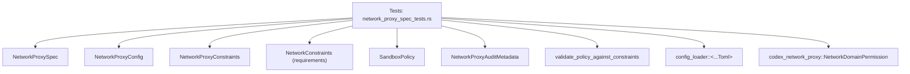
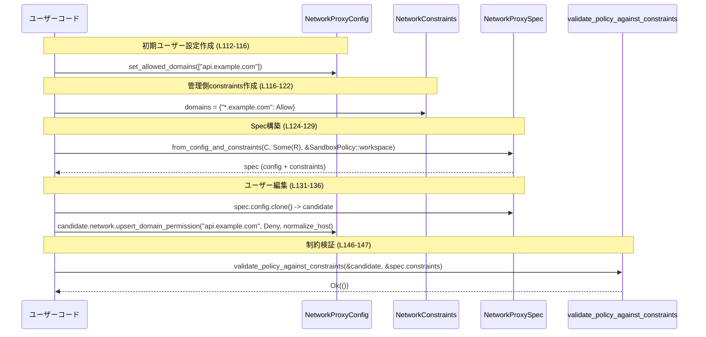

# core/src/config/network_proxy_spec_tests.rs

## 0. ざっくり一言

NetworkProxySpec と関連するネットワーク制約（allowlist/denylist、危険モードフラグなど）の**マージロジックと再計算ロジックの仕様をテストで固定しているモジュール**です。  
ユーザー設定・マネージド制約・SandboxPolicy（モード）の組み合わせが、最終的なネットワークポリシーと制約オブジェクトにどう反映されるかを網羅的にチェックしています。

> 以降に出てくる行番号は、このチャンク内で 1 始まりで振り直した**相対行番号**です。

---

## 1. このモジュールの役割

### 1.1 概要

- このモジュールは、`NetworkProxySpec` の構築と再計算ロジックが、  
  - ユーザー設定 (`NetworkProxyConfig`)
  - 管理側要求 (`NetworkConstraints`)
  - サンドボックスモード (`SandboxPolicy`)
  をどう統合するかをテストしています。
- 特に、HTTP ドメインの allowlist/denylist、UNIX ソケット許可、`DangerFullAccess` 系の危険モード、`managed_allowed_domains_only` / `danger_full_access_denylist_only` フラグの動作を詳細に検証しています（例: L150-185, L186-245, L376-460）。

### 1.2 アーキテクチャ内での位置づけ

このファイルは「設定統合ロジックのテスト層」であり、実装は `super::*` 側（おそらく `network_proxy_spec.rs`）にあります（L21-41, L57-62 など）。

主な依存関係は次のとおりです。



- テストは `NetworkProxySpec::from_config_and_constraints` / `recompute_for_sandbox_policy` を呼んで `spec` を構築します（L57-62, L337-342, L350-366）。
- `spec.config` から実際にプロキシが使うネットワークポリシー（allow/deny のリストなど）を確認します（L64-70, L174-181 等）。
- `spec.constraints` は「管理側が固定したい値」を表し、ユーザー編集時に `validate_policy_against_constraints` で検証されます（L146-147, L624-625）。

### 1.3 設計上のポイント（テストから読み取れる仕様）

テストから読み取れる設計上の特徴を列挙します。

- **二層構造: 実効設定と制約**
  - `NetworkProxySpec` は
    - 実際に使う設定 `config.network.*`
    - 「管理側固定」の制約 `constraints.*`
    を別々に保持します（例: L64-75, L174-183, L231-244）。
- **モード依存のマージロジック**
  - `SandboxPolicy::new_read_only_policy` / `new_workspace_write_policy` / `DangerFullAccess` に応じて、ユーザー設定と管理制約のマージ方法が変わります（L57-62, L92-97, L167-172, L213-218, L277-282）。
- **管理 allow/deny とユーザー設定の関係**
  - 管理 allow/deny は「ベースライン」として `constraints` に入り、ユーザー設定は `config` にのみ入り、ユーザー側エントリは原則として後から変更可能です（L111-148, L589-625）。
- **危険モードフラグ**
  - `managed_allowed_domains_only`: 管理 allow のみを有効にし、ユーザー allow を全て無視し、allowlist に無いドメインはハード deny にする（L376-460）。
  - `danger_full_access_denylist_only`: full-access モード時にドメイン allowlist を `"*"` に拡大し、管理 deny のみを制約として残す（L186-245, L327-374）。
- **再計算（recompute）**
  - `recompute_for_sandbox_policy` により、同じ requirements から異なる `SandboxPolicy` 用の `NetworkProxySpec` を再構築できます（L327-374）。
- **Result によるエラー処理**
  - 主要な構築関数は `Result` を返し、テストでは `.expect(..)` で成功を前提にしています（L37-40, L57-62, L92-97, L337-342, L350-352, L365-366, L146-147, L624-625）。

---

## 2. 主要な機能一覧（仕様レベル）

このファイル自体はテスト専用ですが、テスト名とアサーションから、`NetworkProxySpec` まわりの主要機能を整理します。

- 監査メタデータの伝搬:  
  `build_state_with_audit_metadata` が `NetworkProxyAuditMetadata` を state にそのまま渡す（L21-41）。
- 管理 allowed domains をユーザー allow のベースラインとして扱う（通常モード）:  
  管理側 `Allow` パターンとユーザー allow リストをマージし、管理エントリだけを制約として固定する（L43-76, L111-148）。
- 管理 allowed とユーザー deny の衝突時の扱い:  
  同じパターンに対してユーザー deny があっても、最終 config は deny のまま維持し、制約側には管理 allow だけが残る（L78-108）。
- DangerFullAccess モードでの挙動:
  - ベースライン固定モード: 管理 allow/deny だけを有効にし、ユーザー allow/deny を無視、拡張不可（L150-185）。
  - `danger_full_access_denylist_only`:  
    ドメイン allowlist を `"*"` にし、管理 deny のみを固定。`allow_upstream_proxy` / `dangerously_allow_all_unix_sockets` / `allow_local_binding` を強制的に true にする（L186-245）。
- `danger_full_access_denylist_only` フラグのスコープ:
  - DangerFullAccess のときだけ特別な挙動をし、`workspace_write` モードでは通常のマージロジックのまま（L247-325）。
- 管理 allowed domains only モード:
  - `managed_allowed_domains_only` が true の場合、ユーザー allow は無視され、管理 allow のみが有効（L376-403, L405-437）。
  - 管理側 allowlist が空/未指定でも、ユーザー allow は全て無効で、allowlist ミスはハード deny になる（L439-461, L463-485）。
  - DangerFullAccess でもこの「管理 allow が無ければすべて阻止」の挙動は維持される（L463-485）。
- allow-only / deny-only requirements と DangerFullAccess:
  - deny だけが指定されている場合、DangerFullAccess では allowlist は制約されず、deny だけが固定される（L487-518）。
  - allow だけが指定されている場合、DangerFullAccess では denylist は制約されず、allow だけが固定される（L520-551）。
- default/workspace モードでの deny ベースライン:
  - 管理 deny とユーザー deny をマージし、管理 deny だけを制約として残し、ユーザー deny は後から変更可能（L553-586, L588-625）。

---

## 3. 公開 API と詳細解説

### 3.1 型一覧（このファイルから見える主要な型）

> 種別や役割は、**テストから読み取れる範囲**での説明です。実際の定義は `super::*` や `crate::config_loader` 側にあります。

| 名前 | 種別 | 役割 / 用途 | 根拠 |
|------|------|-------------|------|
| `NetworkProxySpec` | 構造体 | ネットワークプロキシの最終設定 (`config`) と管理制約 (`constraints`)、フラグ (`hard_deny_allowlist_misses`) をまとめたオブジェクト | 初期化とフィールド使用（L23-29, L64-75, L174-183, L231-244, L427-436, L457-460） |
| `NetworkProxyConfig` | 構造体 | ユーザー視点のネットワーク設定（`network.allowed_domains` / `denied_domains`/unix ソケット設定など）を保持 | `default` から作成し、`network` フィールド経由で利用（L45-48, L80-83, L112-116, L152-158 他多数） |
| `NetworkProxyConstraints` | 構造体 | プロキシ設定に対して管理側が固定したい値（allow/deny リスト、フラグ類）を保持 | `NetworkProxySpec` のフィールドとして使用（L27, L71-75, L104-107, L182-183, L231-244, L315-324, L402-403, L431-436, L458-459, L512-513, L582-585） |
| `NetworkProxyAuditMetadata` | 構造体 | 監査用メタデータ（`conversation_id`, `app_version`, `user_account_id` など）を保持し、state に渡される | 初期化と `build_state_with_audit_metadata` → `state.audit_metadata()` の比較（L30-35, L37-40） |
| `NetworkConstraints` | 構造体 | 要求されるネットワーク制約（Toml 由来）を表現。ドメイン/UNIX ソケット/各種フラグ/危険モード用フラグなどを含む | インスタンス化とフィールド設定（L49-55, L84-90, L116-122, L159-165, L195-211, L256-275, L329-336, L382-389, L411-418, L445-448, L469-472, L493-499, L526-532, L559-565, L595-600） |
| `SandboxPolicy` | enum など | サンドボックスのモード。`new_read_only_policy` / `new_workspace_write_policy` / `DangerFullAccess` といったバリアント・コンストラクタがある | 生成やバリアント使用（L60, L95-96, L170, L216, L280-281, L340-341, L351-352, L365-366, L394-395, L423-424, L453-454, L477-478, L504-505, L537-538, L570-571） |
| `NetworkDomainPermissionsToml` | 構造体 | TOML から読み込まれたドメイン権限設定のマップ (`entries: BTreeMap<String, NetworkDomainPermissionToml>`) | `domain_permissions` の戻り値・フィールド利用（L10-18, L50-53, L85-88, L117-120, L160-163, L198-201, L259-265, L330-333, L383-386, L412-415, L494-497, L527-530, L560-563, L595-598） |
| `NetworkDomainPermissionToml` | enum | TOML レベルでのドメインの許可/拒否を表す（`Allow`, `Deny`） | 各テスト内で `Allow` / `Deny` を指定（L50-53, L85-88, L117-120, L160-163, L198-201, L259-265, L330-333, L383-386, L412-415, L494-497, L527-530, L560-563, L595-598） |
| `NetworkDomainPermission` | enum | 実ランタイムの許可/拒否を表すトレイト・型。`upsert_domain_permission` で使われる | `NetworkDomainPermission::Deny` / `Allow` を指定（L134-135, L612-613） |
| `NetworkUnixSocketPermissionsToml` | 構造体 | TOML から読み込んだ UNIX ソケットの権限設定マップ | `entries: BTreeMap` 初期化で使用（L203-208, L267-272） |
| `NetworkUnixSocketPermissionToml` | enum | UNIX ソケットの TOML レベル権限（ここでは `Allow` のみ使用） | L203-208, L267-272 |
| State 型（名前不明） | 構造体など | `NetworkProxySpec::build_state_with_audit_metadata` の戻り値で、`audit_metadata()` メソッドを持つ | `state.audit_metadata()` の呼び出し（L37-40） |

### 3.2 重要関数の詳細

#### `domain_permissions(entries: impl IntoIterator<Item = (&'static str, NetworkDomainPermissionToml)>) -> NetworkDomainPermissionsToml`

**概要**

- テストから TOML 風のドメイン権限マップ (`NetworkDomainPermissionsToml`) を簡潔に作るヘルパー関数です（L10-18）。
- ドメインパターンの `&'static str` を `String` に変換し、`NetworkDomainPermissionToml` と組みにして `entries` マップに詰めます。

**引数**

| 引数名 | 型 | 説明 |
|--------|----|------|
| `entries` | `impl IntoIterator<Item = (&'static str, NetworkDomainPermissionToml)>` | ドメインパターン文字列と TOML 権限（Allow/Deny）のペア列 |

**戻り値**

- `NetworkDomainPermissionsToml`  
  `entries` フィールドに `BTreeMap<String, NetworkDomainPermissionToml>` を持つ構造体です（具体的な定義は別ファイル）。

**内部処理の流れ**

1. `entries.into_iter()` でイテレータに変換（L14-15）。
2. `map(|(pattern, permission)| (pattern.to_string(), permission))` で `&'static str` を `String` に変換（L16）。
3. `collect()` で `BTreeMap<String, NetworkDomainPermissionToml>` に収集し、`NetworkDomainPermissionsToml { entries }` を作成（L13-18）。

**Examples（使用例）**

テストでの典型的な使用例です。

```rust
// "*.example.com" を Allow とするマネージドドメイン制約を作る
let requirements = NetworkConstraints {
    domains: Some(domain_permissions([(
        "*.example.com",
        NetworkDomainPermissionToml::Allow, // TOMLレベルで Allow
    )])),
    ..Default::default()
};
```

（根拠: L49-55）

**Errors / Panics**

- この関数自体は `Result` を返さず、`collect()` でパニックを起こすようなコードも含まれていません。
- 実際の `NetworkDomainPermissionsToml` の `collect()` 実装でパニックする可能性があるかは、このファイルからは分かりません。

**Edge cases**

- 空イテレータを渡した場合は、`entries` が空の `NetworkDomainPermissionsToml` になります（L445-448, L559-565 など、`domains: None` ケースは別ですが、`Some(domain_permissions([]))` を想定すると空マップになります）。

**使用上の注意点**

- あくまでテスト用ヘルパーであり、本番コードから直接使う設計かどうかは、このチャンクからは読み取れません。

---

#### `NetworkProxySpec::from_config_and_constraints(config: NetworkProxyConfig, requirements: Option<NetworkConstraints>, sandbox_policy: &SandboxPolicy) -> Result<NetworkProxySpec, E>`

> `E` はエラー型で、テストからは型名が読み取れないため抽象的に表記しています。  
> 呼び出し例はいずれも `.expect("...")` しているため、`Result` を返すことだけが分かります（L57-62, L92-97 等）。

**概要**

- ユーザー設定 (`NetworkProxyConfig`) と管理要求 (`NetworkConstraints`)、実行モード (`SandboxPolicy`) を元に、`NetworkProxySpec` を構築するファクトリ関数です。
- `spec.config` には実際に使われるネットワークポリシー、`spec.constraints` には管理側が固定する制約値が入ります。

**引数**

| 引数名 | 型 | 説明 |
|--------|----|------|
| `config` | `NetworkProxyConfig` | 初期ユーザー設定。`network.allowed_domains` / `denied_domains` などが含まれる（L45-48, L80-83 等）。 |
| `requirements` | `Option<NetworkConstraints>` | 管理側が TOML 等で指定したネットワーク制約。`None` の場合は制約無しとみなされる（L24-26, L49-55, L329-336 など）。 |
| `sandbox_policy` | `&SandboxPolicy` | 実行モード。`new_read_only_policy`, `new_workspace_write_policy`, `DangerFullAccess` 等で挙動が大きく変わる（L60, L95-96, L170, L216, L280-281, L340-341 等）。 |

**戻り値**

- `Result<NetworkProxySpec, E>`  
  - `Ok(spec)` の場合: `spec.config` と `spec.constraints` が指定された組み合わせを反映したものになっている。
  - `Err(e)` の条件や型は、このファイルからは不明です。テストでは常に `expect("...")` で成功を仮定しています。

**内部処理の流れ（テストから推測できるレベル）**

※ 実装は見えていないため、「どのような状態になるか」を仕様として整理します。

1. **ドメイン allow/deny の統合**
   - `requirements.domains` に `Allow` が含まれる場合:
     - 通常モード（read-only / workspace-write）では、管理 allow は `spec.constraints.allowed_domains` に入り、ユーザー allow とマージされた結果が `spec.config.network.allowed_domains()` になります（L43-76, L111-148, L247-325）。
   - `requirements.domains` に `Deny` が含まれる場合:
     - 同様に管理 deny は `spec.constraints.denied_domains` に入り、ユーザー deny とマージされた結果が `spec.config.network.denied_domains()` になります（L553-586, L588-625）。

2. **モードごとの振る舞い**
   - `SandboxPolicy::new_read_only_policy()`:
     - 少なくとも `requirements_allowed_domains_are_a_baseline_for_user_allowlist` で、管理 allow + ユーザー allow の両方が `spec.config` に反映され、`constraints` には管理分だけが入る挙動が確認できます（L43-76）。
   - `SandboxPolicy::new_workspace_write_policy()`:
     - read-only と似ていますが、ユーザー設定を後から編集し、`validate_policy_against_constraints` で検証することを想定したモードです（L111-148, L247-325, L553-586, L588-625）。
   - `SandboxPolicy::DangerFullAccess`:
     - `danger_full_access_denylist_only` が false/未設定の場合:
       - allow-only / deny-only requirements に応じて allow/deny のどちらかだけが制約となり、残りはユーザー設定が優先されます（L487-518, L520-551）。
     - `danger_full_access_denylist_only == Some(true)` の場合:
       - allowlist が `"*"` に拡張され、管理 deny のみが制約として残ります（L186-245, L327-374）。

3. **管理フラグ類の処理**
   - `allow_upstream_proxy`, `dangerously_allow_all_unix_sockets`, `allow_local_binding`, `unix_sockets` などは、モードと `danger_full_access_denylist_only` に応じて
     - workspace-write では requirements に従って `spec.config` と `spec.constraints` に同じ値が入る（L256-275, L277-325）。
     - DangerFullAccess + denylist-only では `spec.config` と `constraints` がともに `true`/`None` に強制される（L195-211, L220-244）。

4. **managed_allowed_domains_only の処理**
   - `managed_allowed_domains_only == Some(true)` の場合:
     - ユーザー allow は無視され、管理 allow のみが `spec.config.network.allowed_domains()` に残る（L376-403, L405-437）。
     - 管理 allow がそもそも無い場合は allowlist が `None` 扱いとなり、`spec.constraints.allowed_domains` は空ベクタ (`Some(Vec::new())`) になり、`spec.hard_deny_allowlist_misses` が true に設定されます（L439-461, L463-485）。

**Examples（使用例）**

基本的な利用パターン（workspace-write モード）:

```rust
// 1. ユーザー初期設定を用意する
let mut config = NetworkProxyConfig::default();
config.network.set_allowed_domains(vec!["api.example.com".to_string()]); // ユーザーallow

// 2. 管理側のドメイン要求を用意する（マネージドallow）
let requirements = NetworkConstraints {
    domains: Some(domain_permissions([(
        "*.example.com",
        NetworkDomainPermissionToml::Allow, // マネージドのallow
    )])),
    ..Default::default()
};

// 3. SandboxPolicyを選択してSpecを構築する
let spec = NetworkProxySpec::from_config_and_constraints(
    config,
    Some(requirements),
    &SandboxPolicy::new_workspace_write_policy(), // workspace-writeモード
).expect("managed baseline should still load");

// 4. spec.config にはユーザー + 管理のallowが反映される（テスト例ではread-onlyだが概念は同じ）
assert_eq!(
    spec.config.network.allowed_domains(),
    Some(vec!["*.example.com".to_string(), "api.example.com".to_string()])
);
```

（L43-76, L111-129 を簡略化）

**Errors / Panics**

- 実装側のエラー条件（戻り値が `Err` になる条件）は、このテストからは読み取れません。
- テストでは `.expect("...")` を使っているため、「通常は成功する構成」でしか呼ばれていません（L37-40, L57-62, L92-97, L337-342 等）。

**Edge cases**

- `requirements: None` の場合:  
  `build_state_with_audit_metadata` のテストの `spec` 初期化では `requirements: None` にしています（L23-29）。このとき `from_config_and_constraints` は使っていないため、挙動は別途実装依存です。
- `managed_allowed_domains_only == Some(true)` かつ `domains: None` の場合:  
  - allowlist は `None` になり、`constraints.allowed_domains == Some(Vec::new())`、`spec.hard_deny_allowlist_misses == true` となります（L439-461, L463-485）。
- deny-only / allow-only な requirements と DangerFullAccess の組み合わせ:
  - deny-only: allowlist は制約されず、deny のみ制約になる（L487-518）。
  - allow-only: denylist は制約されず、allow のみ制約になる（L520-551）。

**使用上の注意点**

- `SandboxPolicy` と各種フラグ（`managed_allowed_domains_only`, `danger_full_access_denylist_only`）の組み合わせによって挙動が大きく変わるため、どのモードで spec を構築しているかを明示的に意識する必要があります。
- `managed_allowed_domains_only` を true にするとユーザー allow が完全に無視され、allowlist に無いドメインがハード deny になることに注意が必要です（L405-437, L439-461, L463-485）。
- DangerFullAccess + `danger_full_access_denylist_only` は極めて強い権限（全ドメイン `"*"` 許可、UNIX ソケットやローカルバインドも全許可）を与える設計になっているため（L186-245）、安全性要件に合致しているかの確認が重要です。

---

#### `NetworkProxySpec::recompute_for_sandbox_policy(&self, sandbox_policy: &SandboxPolicy) -> Result<NetworkProxySpec, E>`

**概要**

- 既に構築済みの `NetworkProxySpec` から、別の `SandboxPolicy` 用の spec を再構築する関数です。
- requirements は内部に保持している（と推測され）、policy だけを変えて再計算します（L327-374）。

**引数**

| 引数名 | 型 | 説明 |
|--------|----|------|
| `sandbox_policy` | `&SandboxPolicy` | 新たに適用するサンドボックスモード（L351-352, L365-366）。 |

**戻り値**

- `Result<NetworkProxySpec, E>`  
  - 各モードに応じて再計算された新しい `NetworkProxySpec`。

**内部処理の流れ（テストから推測）**

1. 元の `NetworkProxySpec` に内包されている requirements を再利用し、新しい `SandboxPolicy` を指定して内部ロジックを再実行する。
2. `danger_full_access_denylist_only == Some(true)` で、もともと workspace-write で構築されていたケース（L329-342）に対して:
   - `DangerFullAccess` で再構築すると:
     - `allowed_domains` が `"*"` に拡大される（L354-357）。
     - `denied_domains` は管理 deny のみ（L358-361）。
     - `allow_local_binding` が true になる（L362-363）。
   - 再度 `workspace_write` で再構築すると:
     - `allowed_domains` は `None` に戻る（L368-369）。
     - `denied_domains` は変わらない（L370-372）。
     - `allow_local_binding` が false に戻る（L373-374）。

**Examples**

```rust
// workspace-writeモードで初期構築
let spec = NetworkProxySpec::from_config_and_constraints(
    NetworkProxyConfig::default(),
    Some(requirements_with_denylist_only),
    &SandboxPolicy::new_workspace_write_policy(),
)?;

// full-accessに切り替える
let full_access_spec = spec.recompute_for_sandbox_policy(&SandboxPolicy::DangerFullAccess)?;

// 再びworkspace-writeに戻す
let back_to_workspace_spec =
    full_access_spec.recompute_for_sandbox_policy(&SandboxPolicy::new_workspace_write_policy)?;
```

（L329-374 を概念的にまとめた例）

**Errors / Panics**

- `from_config_and_constraints` と同様、エラー条件はこのファイルからは不明です。
- テストでは連続して `.expect("...")` を呼んでいるため、正常系のみを確認しています（L337-342, L350-352, L365-366）。

**Edge cases**

- `danger_full_access_denylist_only` が `Some(true)` の場合の挙動だけがテストされています（L329-336）。  
  他のフラグや allow-only/deny-only requirements に対する再計算挙動は、このチャンクからは分かりません。

**使用上の注意点**

- `recompute_for_sandbox_policy` は元の spec を破壊せず、新しい spec を返す（イミュータブルな `&self` から `Result<Self, E>` を返していると解釈できます）ため、モードごとの spec を並行して扱うことができそうです。
- ただし、requirements や base_config が内部でどの程度コピーされるか（パフォーマンス面）はこのファイルからは分かりません。

---

#### `NetworkProxySpec::build_state_with_audit_metadata(metadata: NetworkProxyAuditMetadata) -> Result<State, E>`

**概要**

- `NetworkProxySpec` から実行用の state オブジェクトを構築し、その際に `NetworkProxyAuditMetadata` を state に埋め込む関数です（L21-41）。
- テストでは「渡した `metadata` が state からそのまま取得できること」を保証しています。

**引数**

| 引数名 | 型 | 説明 |
|--------|----|------|
| `metadata` | `NetworkProxyAuditMetadata` | 監査情報（会話ID、アプリバージョン、ユーザーアカウントID等）。`Clone` 可能であることがテストから分かります（L30-35, L37-38）。 |

**戻り値**

- `Result<State, E>`  
  `State` は実際の型名が不明ですが、少なくとも `audit_metadata()` メソッドを持ち、`&NetworkProxyAuditMetadata` を返します（L37-40）。

**内部処理の流れ（推測レベル）**

1. `self` 内の設定（`config`, `constraints` など）と渡された `metadata` を使って state を構築する。
2. state 内に `metadata` を保存し、`audit_metadata()` で参照できるようにする。
3. 構築に失敗した場合は `Err(e)` を返す。

**Examples**

```rust
let spec = NetworkProxySpec {
    base_config: NetworkProxyConfig::default(),
    requirements: None,
    config: NetworkProxyConfig::default(),
    constraints: NetworkProxyConstraints::default(),
    hard_deny_allowlist_misses: false,
};

let metadata = NetworkProxyAuditMetadata {
    conversation_id: Some("conversation-1".to_string()),
    app_version: Some("1.2.3".to_string()),
    user_account_id: Some("acct-1".to_string()),
    ..NetworkProxyAuditMetadata::default()
};

let state = spec.build_state_with_audit_metadata(metadata.clone())?;

// state に渡した metadata が格納されていること
assert_eq!(state.audit_metadata(), &metadata);
```

（L21-40 を翻案）

**Errors / Panics**

- エラー条件は不明です。テストでは `expect("state should build")` としているのみです（L37-40）。
- `metadata` の必須フィールドや値検証の有無も、このファイルからは読み取れません。

**Edge cases**

- `metadata` の一部フィールドが `None` の場合でも動作するかどうかは、テストからは分かりません（テストでは複数フィールドを `Some` にしています: L30-33）。

**使用上の注意点**

- state 構築に失敗する可能性を考慮し、呼び出し側では `Result` をハンドリングする必要があります（テストでは `.expect`）。
- `NetworkProxySpec` の `config`/`constraints` が妥当でない場合、state の構築に失敗する可能性があると考えられますが、具体的条件は不明です。

---

#### `NetworkNetworkConfig::upsert_domain_permission(host: String, permission: NetworkDomainPermission, normalize_host: fn(&str) -> String)`

> 正確なメソッドシグネチャは見えていませんが、`candidate.network.upsert_domain_permission("host".to_string(), NetworkDomainPermission::Deny/Allow, normalize_host)` という形で呼ばれています（L131-136, L609-614）。

**概要**

- ドメインの permission を「挿入または更新（upsert）」するメソッドです。
- `Allow` を指定すると allowlist に、`Deny` を指定すると denylist にエントリが移動する挙動がテストから確認できます（L131-145, L609-623）。

**引数**

| 引数名 | 型 | 説明 |
|--------|----|------|
| `host` | `String` | 許可/拒否を設定したいホスト名（例: `"api.example.com"`、`"blocked.example.com"`）。 |
| `permission` | `NetworkDomainPermission` | 実行時の許可/拒否（`Allow` / `Deny`）。 |
| `normalize_host` | 関数ポインタ | ホスト名を正規化する関数。具体的な実装はこのファイルには出てきませんが、常に引数として渡されています（L135, L613）。 |

**戻り値**

- テストからは戻り値の型は読み取れません。通常の upsert であれば `()` か `Result<(), E>` といった形が想定されますが、ここでは不明です。

**内部処理の流れ（テストから推測）**

1. `host` を `normalize_host` で正規化する。
2. `permission` が `Allow` の場合:
   - 対応するエントリを allowlist に追加し、denylist からは削除する。
3. `permission` が `Deny` の場合:
   - 対応するエントリを denylist に追加し、allowlist からは削除する。
4. 管理側の制約エントリ（`spec.constraints.allowed_domains` / `denied_domains`）は更新しない。  
   これは、ユーザー側エントリを変更しても `constraints` に影響しないテストから分かります（L146-147, L624-625）。

**Examples**

```rust
// Allow -> Deny に変更する例
let mut candidate = spec.config.clone();
candidate.network.upsert_domain_permission(
    "api.example.com".to_string(),
    NetworkDomainPermission::Deny,
    normalize_host,
);

assert_eq!(
    candidate.network.allowed_domains(),
    Some(vec!["*.example.com".to_string()]) // マネージドallowのみ残る
);
assert_eq!(
    candidate.network.denied_domains(),
    Some(vec!["api.example.com".to_string()])
);
validate_policy_against_constraints(&candidate, &spec.constraints)
    .expect("user allowlist entries should not become managed constraints");
```

（L131-147）

**Errors / Panics**

- テストではエラー処理をしていない（戻り値を無視）ため、エラー/パニック条件は不明です。

**Edge cases**

- もともと存在しないホストに対して upsert した場合:
  - テストでは元々 deny にだけあったホストを allow にするケース（L609-623）と、allow にだけあったホストを deny にするケース（L131-145）があるため、「新規追加」も問題なく行われると推測できます。
- 管理側エントリとユーザーエントリが同じホストを指す場合の優先順位:
  - テスト上、そのようなケースは直接登場しません（管理側は `*.example.com` などのパターン、ユーザーは具体的なホスト名）。

**使用上の注意点**

- `upsert_domain_permission` でユーザーエントリを変更した後は、`validate_policy_against_constraints` を通して制約違反がないかを検証する設計になっています（L146-147, L624-625）。
- 管理ドメインパターンとユーザードメインが重なる場合の評価順序（より具体な deny が allow より優先される等）は、このファイルからは分かりません。

---

#### `validate_policy_against_constraints(config: &NetworkProxyConfig, constraints: &NetworkProxyConstraints) -> Result<(), E>`

**概要**

- ユーザーが編集した `NetworkProxyConfig` が、`NetworkProxyConstraints` で指定された管理側制約を守っているかを検証する関数です。
- テストでは、ユーザー側が allow/deny を編集した後に、この関数を呼び出してエラーが出ないことを確認しています（L146-147, L624-625）。

**引数**

| 引数名 | 型 | 説明 |
|--------|----|------|
| `config` | `&NetworkProxyConfig` | ユーザーが編集した後の設定（`spec.config.clone()` をベースに変更したもの）（L131-136, L609-614）。 |
| `constraints` | `&NetworkProxyConstraints` | 管理側制約。`from_config_and_constraints` で構築された `spec.constraints`（L146-147, L624-625）。 |

**戻り値**

- `Result<(), E>`（E は不明）
  - `Ok(())`: 設定が制約内に収まっている。
  - `Err(e)`: 何らかの制約違反（管理エントリの削除など）が発生している。

**内部処理の流れ（仕様レベルでの推測）**

テストから読み取れる挙動:

- allow 側:
  - 管理 allow (`constraints.allowed_domains`) に含まれるパターンは、ユーザー編集後の `config.network.allowed_domains()` に残っていれば OK（L111-148）。  
    ユーザーが自分の allow エントリを deny に変えても、管理 allow パターンが残っていれば許容されます。
- deny 側:
  - 管理 deny (`constraints.denied_domains`) に含まれるドメインは、ユーザー編集後も denylist に残っている必要がある（L553-586, L588-625）。

**Examples**

```rust
let spec = NetworkProxySpec::from_config_and_constraints(
    config,
    Some(requirements),
    &SandboxPolicy::new_workspace_write_policy(),
)?;

// ユーザーがdenyエントリをallowに変更
let mut candidate = spec.config.clone();
candidate.network.upsert_domain_permission(
    "blocked.example.com".to_string(),
    NetworkDomainPermission::Allow,
    normalize_host,
);

// 管理側deny ("managed-blocked.example.com") が残っているのでOK
validate_policy_against_constraints(&candidate, &spec.constraints)
    .expect("user denylist entries should not become managed constraints");
```

（L588-625 を簡略）

**Errors / Panics**

- 実際に `Err` となるケースはテストに含まれていません。
- 管理エントリそのものを削除したり、管理フラグを変更した場合に `Err` になると推測されますが、このファイルからは断定できません。

**Edge cases**

- allow/deny の両方で同じパターンが存在する場合の判定順序は不明です。
- `constraints` 側に `None` のフィールドがある場合（例: `allowed_domains: None`）、そのフィールドが「制約無し」なのか「空で固定」なのかは、テストから判断する必要があります:
  - `danger_full_access_denylist_only_allows_all_domains_and_enforces_managed_denies` では `constraints.allowed_domains == None` で、allowlist が `"*"` になっている（L220-223, L238-239） → 「制約無し」の意味と考えられます。

**使用上の注意点**

- `spec.config` からの編集後は、常に `validate_policy_against_constraints` を通して制約を満たしていることを確認する設計が想定されます。
- `constraints` によってはユーザーの変更をほぼ許さない（完全固定）場合もあり得ますが、その具体的な条件は実装依存です。

---

### 3.3 その他の関数（テスト関数）

このファイル内に定義されているテスト関数は、仕様の個別ケースを表現しています。関数名がそのまま仕様の要約になっています。

| 関数名 | 役割（テスト対象の仕様） | 根拠 |
|--------|------------------------|------|
| `build_state_with_audit_metadata_threads_metadata_to_state` | `build_state_with_audit_metadata` が `NetworkProxyAuditMetadata` を state にそのまま伝搬することを確認 | L21-41 |
| `requirements_allowed_domains_are_a_baseline_for_user_allowlist` | 管理 allowed domains がユーザー allowlist のベースラインとしてマージされる（read-only モード） | L43-76 |
| `requirements_allowed_domains_do_not_override_user_denies_for_same_pattern` | 管理 allowed domains がユーザー deny を上書きしないことを確認 | L78-108 |
| `requirements_allowlist_expansion_keeps_user_entries_mutable` | 管理 allow ベースラインの上にユーザー allow を追加しても、後からユーザー側エントリを自由に変更できること | L110-148 |
| `danger_full_access_keeps_managed_allowlist_and_denylist_fixed` | DangerFullAccess で管理 allow/deny のみに固定し、ユーザー設定を無視すること | L150-185 |
| `danger_full_access_denylist_only_allows_all_domains_and_enforces_managed_denies` | DangerFullAccess + denylist-only フラグで全ドメイン `"*"` 許可 + 管理 deny だけを固定し、ネットワーク関連フラグも全許可にすること | L186-245 |
| `danger_full_access_denylist_only_does_not_change_workspace_write_behavior` | denylist-only フラグが workspace-write モードには影響しないこと | L247-325 |
| `recompute_for_sandbox_policy_rebuilds_denylist_only_full_access_policy` | `recompute_for_sandbox_policy` が denylist-only 構成を workspace-write ⇔ full-access 間で正しく切り替えること | L327-374 |
| `managed_allowed_domains_only_disables_default_mode_allowlist_expansion` | `managed_allowed_domains_only` が allowlist 拡張を禁止し、管理 allow のみを有効にすること | L376-403 |
| `managed_allowed_domains_only_ignores_user_allowlist_and_hard_denies_misses` | `managed_allowed_domains_only` でユーザー allow を無視し、allowlist ミスをハード deny にすること | L405-437 |
| `managed_allowed_domains_only_without_managed_allowlist_blocks_all_user_domains` | 管理 allow が無い `managed_allowed_domains_only` でユーザー全ドメインをブロックし、空の allowlist を固定すること | L439-461 |
| `managed_allowed_domains_only_blocks_all_user_domains_in_full_access_without_managed_list` | 上記挙動が DangerFullAccess でも維持されること | L463-485 |
| `deny_only_requirements_do_not_create_allow_constraints_in_full_access` | DangerFullAccess で deny-only requirements が allowlist 制約を作らないこと | L487-518 |
| `allow_only_requirements_do_not_create_deny_constraints_in_full_access` | DangerFullAccess で allow-only requirements が denylist 制約を作らないこと | L520-551 |
| `requirements_denied_domains_are_a_baseline_for_default_mode` | workspace-write モードで管理 deny が denylist のベースラインになること | L553-586 |
| `requirements_denylist_expansion_keeps_user_entries_mutable` | 管理 deny ベースライン上でユーザー deny を追加し、その後 allow に変更しても制約は管理 deny のみに留まること | L588-625 |

---

## 4. データフロー

### 4.1 代表的なシナリオ: 管理 allow ベースライン + ユーザー編集 + 検証

`requirements_allowlist_expansion_keeps_user_entries_mutable` テスト（L110-148）は、次のようなデータフローを示しています。

1. ユーザーが `api.example.com` を allow に設定した `NetworkProxyConfig` を用意する（L112-116）。
2. 管理側が `"*.example.com"` を `Allow` とする `NetworkConstraints` を用意する（L116-122）。
3. `NetworkProxySpec::from_config_and_constraints` が両者をマージし、`spec.config` と `spec.constraints` を作る（L124-129）。
4. ユーザーが `spec.config` をクローンし、`upsert_domain_permission` で `api.example.com` を `Deny` に変更する（L131-136）。
5. 変更後の `candidate` を `validate_policy_against_constraints` に渡し、管理制約を満たしていることを確認する（L146-147）。

これをシーケンス図で表すと次のようになります。



---

## 5. 使い方（How to Use）

### 5.1 基本的な使用方法（概念レベル）

テストから読み取れる「典型的なフロー」は次の通りです。

```rust
// 1. ユーザー設定やマネージド制約を用意する
let mut user_config = NetworkProxyConfig::default();                  // ユーザー基準の設定 (L45, L112 など)
user_config.network.set_allowed_domains(vec!["api.example.com".into()]);

let managed_requirements = NetworkConstraints {
    domains: Some(domain_permissions([(
        "*.example.com",                                             // 管理側が許可したいパターン
        NetworkDomainPermissionToml::Allow,
    )])),
    ..Default::default()
};

// 2. SandboxPolicyに応じてNetworkProxySpecを構築する
let spec = NetworkProxySpec::from_config_and_constraints(
    user_config,
    Some(managed_requirements),
    &SandboxPolicy::new_workspace_write_policy(),                     // モードに応じて切り替え (L124-128 等)
)?;

// 3. 実効ポリシー (spec.config) と管理制約 (spec.constraints) を利用
println!("effective allow: {:?}", spec.config.network.allowed_domains());
println!("managed allow constraints: {:?}", spec.constraints.allowed_domains);

// 4. ユーザーがGUI等で設定変更 → upsert_domain_permissionで反映
let mut candidate = spec.config.clone();
candidate.network.upsert_domain_permission(
    "api.example.com".into(),
    NetworkDomainPermission::Deny,
    normalize_host,
);

// 5. 変更後の設定を管理制約に照らして検証
validate_policy_against_constraints(&candidate, &spec.constraints)?;
```

### 5.2 よくある使用パターン（モード別）

1. **ワークスペース書き込みモード (`new_workspace_write_policy`)**
   - 管理側が「ベースライン」を提供し、ユーザーがそこから設定を拡張・一部絞り込みできるモードです（L111-148, L247-325, L553-586, L588-625）。
   - allow/deny は管理分 + ユーザー分の和集合だが、`constraints` には管理分だけが固定される。

2. **フルアクセスモード (`DangerFullAccess`)**
   - `danger_full_access_denylist_only: None/false` の場合:
     - allow-only requirements → allowlist は管理値に置き換え、denylist はユーザー値を維持（L520-551）。
     - deny-only requirements → denylist は管理値に置き換え、allowlist はユーザー値を維持（L487-518）。
   - `danger_full_access_denylist_only: Some(true)` の場合:
     - ドメイン allowlist は `"*"` に拡張（全許可）、管理 deny は固定（L186-245, L327-374）。
     - UNIX ソケットなど、ネットワーク関連フラグが強制的に緩和される（L195-211, L220-231）。

3. **管理 allowed domains only モード (`managed_allowed_domains_only: Some(true)`)**
   - 管理 allow だけを有効にし、ユーザー allow はすべて無視されます（L376-403, L405-460）。
   - 管理 allow が無い場合は、全てのドメインがブロックされ、allowlist ミスはハード deny になります（L439-461, L463-485）。

### 5.3 よくある間違い（起こり得る誤解）

テストから逆算して「誤解しそうなポイント」を挙げます。

```rust
// 誤りの可能性: DangerFullAccessなら常に全ドメインが許可されると考える
let spec = NetworkProxySpec::from_config_and_constraints(
    config,
    Some(NetworkConstraints {
        managed_allowed_domains_only: Some(true), // 管理allowのみ
        ..Default::default()
    }),
    &SandboxPolicy::DangerFullAccess,
)?;
// 期待: allowed_domains() == Some(vec!["*"])
// 実際: allowed_domains() == None (全ブロック) （L463-485）
```

- **誤解 1: DangerFullAccess なら常に `"*"` 許可になる**
  - 実際には、`managed_allowed_domains_only` が true で管理 allow が空の場合、DangerFullAccess でも allowlist は空で、全てのドメインがブロックされます（L463-485）。

```rust
// 誤りの可能性: deny-only requirements が allowlist を制限すると思う
let requirements = NetworkConstraints {
    domains: Some(domain_permissions([(
        "managed-blocked.example.com",
        NetworkDomainPermissionToml::Deny,
    )])),
    ..Default::default()
};

let spec = NetworkProxySpec::from_config_and_constraints(
    user_config_with_allows,
    Some(requirements),
    &SandboxPolicy::DangerFullAccess,
)?;

assert_eq!(spec.config.network.allowed_domains(), Some(vec!["api.example.com".into()])); // 管理denyがallowを制限していない (L487-518)
```

- **誤解 2: DangerFullAccess で deny-only requirements が allowlist を制約する**
  - 実際には、deny-only requirements は denylist のみを制約し、allowlist はユーザー設定のままです（L487-518）。

### 5.4 使用上の注意点（まとめ）

- **フラグの組み合わせによる挙動変化**
  - `managed_allowed_domains_only` と `danger_full_access_denylist_only` が同時に関与すると挙動が大きく変わり得るため、どのフラグが有効かを設計時に明確にする必要があります。
- **ハード deny フラグ**
  - `spec.hard_deny_allowlist_misses` が true のとき（管理 allow only モードなど）、allowlist に無いドメインへのアクセスは即座に deny される仕様になっています（L405-437, L439-461, L463-485）。
- **Result の扱い**
  - 主要 API は `Result` を返しており、テストでは `.expect(..)` で短絡していますが、実運用コードではエラーをハンドリングする必要があります。

---

## 6. 変更の仕方（How to Modify）

### 6.1 新しい機能を追加する場合（テスト観点）

- **例: 新しい SandboxPolicy バリアントを追加する場合**
  1. 実装側（`super::*` 側）に新バリアントと、その挙動（config/constraints のマージロジック）を追加する。
  2. 本テストファイルに、新バリアント専用のテスト関数を追加し、以下を検証する。
     - `from_config_and_constraints` で `spec.config` と `spec.constraints` が期待通りになること。
     - 必要であれば `recompute_for_sandbox_policy` の挙動も追加で検証する。
  3. `validate_policy_against_constraints` でユーザー編集後も制約を守れているかを確認するテストを用意する（L111-148, L588-625 と同様）。

- **例: 新しい制約フィールドを NetworkConstraints に追加する場合**
  1. `NetworkProxyConstraints` に対応フィールドを追加し、`from_config_and_constraints` でマッピングする実装を行う。
  2. このファイルに「管理値が config と constraints の双方にどう反映されるか」を確認するテストを追加する（L195-211, L220-244, L256-275, L277-325 などが参考になります）。

### 6.2 既存の機能を変更する場合（影響範囲の確認）

- **allow/deny マージロジックを変更する場合**
  - 影響を受けるテスト:
    - allow ベースライン関連: L43-76, L110-148, L376-403, L405-437。
    - deny ベースライン関連: L553-586, L588-625。
    - DangerFullAccess モード関連: L150-185, L186-245, L247-325, L487-518, L520-551。
  - `constraints.allowed_domains` / `.denied_domains` の意味（ベースライン vs 完全固定）を変えると、多数のテストが失敗する可能性があります。

- **フラグの意味を変更する場合**
  - `managed_allowed_domains_only` の意味を変更すると、L376-460, L463-485 が影響を受けます。
  - `danger_full_access_denylist_only` の意味を変更すると、L186-245, L247-325, L327-374 が影響を受けます。

- **テスト更新の注意**
  - このファイルは仕様の「自動ドキュメント」の役割も果たしているため、仕様を変える際はまず新仕様に合わせた期待結果を明文化し、それに沿ってテストのアサーションを更新するのが安全です。

---

## 7. 関連ファイル

このテストから推測される関連モジュールです（実際のパスはリポジトリ構成に依存します）。

| パス（推定またはモジュール名） | 役割 / 関係 |
|--------------------------------|------------|
| `core/src/config/network_proxy_spec.rs` など (`super::*`) | `NetworkProxySpec`, `NetworkProxyConfig`, `NetworkProxyConstraints`, `NetworkProxyAuditMetadata`, `NetworkConstraints`, `SandboxPolicy`, `validate_policy_against_constraints` などの本体実装が存在すると考えられます（L23-29, L57-62, L92-97 他）。 |
| `crate::config_loader` モジュール | `NetworkDomainPermissionToml`, `NetworkDomainPermissionsToml`, `NetworkUnixSocketPermissionToml`, `NetworkUnixSocketPermissionsToml` の定義および TOML ロードロジックを提供（L2-5, L10-18）。 |
| `codex_network_proxy` クレート | 実行時の `NetworkDomainPermission`（Allow/Deny）型の定義（L6, L134-135, L612-613）。 |
| `std::collections::BTreeMap` | 管理ドメイン/UNIX ソケットのマップ構造の基盤（L8, L203-208, L267-272）。 |

このテストファイルは、これらモジュールが提供する API の仕様を確認する重要な回帰テスト群として機能していると解釈できます。
