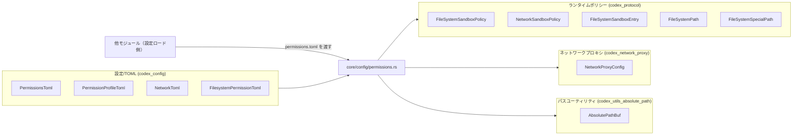
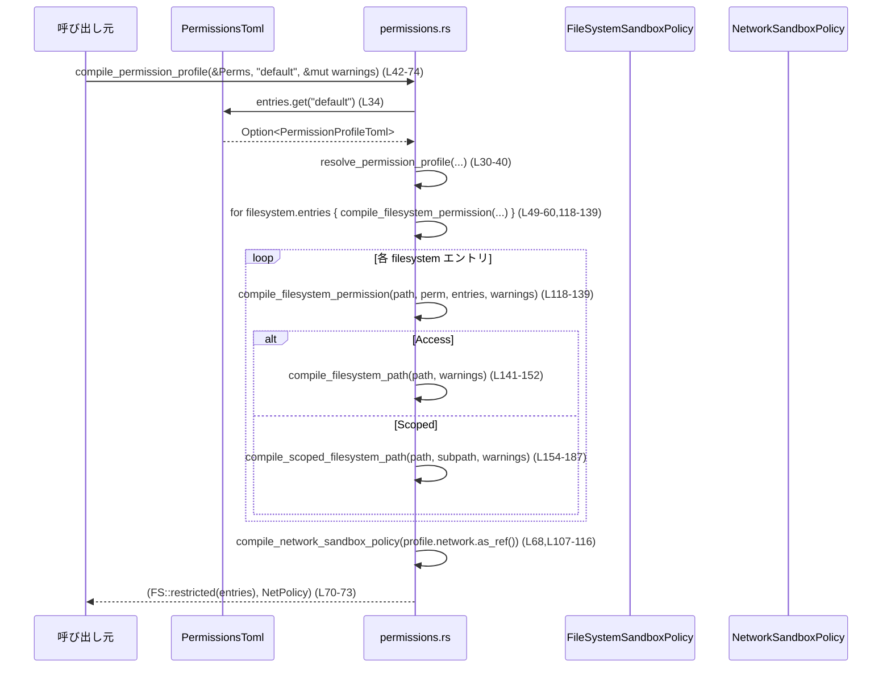

# core/src/config/permissions.rs コード解説

## 0. ざっくり一言

Codex の設定ファイル（permissions.toml 系）から、  
ファイルシステム／ネットワークのサンドボックスポリシーやネットワークプロキシ設定を組み立てるユーティリティ群です。  
あわせて、パスのバリデーション・正規化と「特殊パス（`:root` など）」の解釈も行います。

（行番号は、このチャンクに含まれるテキストに対するものです）

---

## 1. このモジュールの役割

### 1.1 概要

このモジュールは **Codex の権限設定（permissions）を解釈して実行時ポリシーに変換する** ために存在し、主に次の機能を提供します（`permissions.rs:L21-221`）:

- TOML で定義された permission profile から、  
  `FileSystemSandboxPolicy` / `NetworkSandboxPolicy` を構築する
- `NetworkToml` から `NetworkProxyConfig` を導出する
- Codex の実行に必須な読み取りパス（zsh など）を計算する
- パス文字列（通常パス／特殊パス）のバリデーションと正規化を行う

### 1.2 アーキテクチャ内での位置づけ

主な依存関係は次のとおりです（利用側は「このモジュールを呼び出す側」を抽象的に表現しています）。



- 設定層（TOML 構造体群）と実行時ポリシー層（サンドボックスポリシー）をつなぐ変換モジュールという位置づけです。
- ネットワークプロキシ設定用の `NetworkProxyConfig` も、ここで TOML から導出されます。

### 1.3 設計上のポイント

コードから読み取れる特徴を列挙します。

- **責務の分割**（`permissions.rs:L42-187`）
  - プロファイル全体のコンパイル：`compile_permission_profile`
  - ファイルシステムの個々のエントリ：`compile_filesystem_permission`
  - パス文字列の解釈：
    - `compile_filesystem_path` / `compile_scoped_filesystem_path`
    - `parse_special_path`（特殊パス）
    - `parse_absolute_path_for_platform` / `normalize_*` / `is_windows_*` など
- **状態を持たない構造**
  - グローバルな状態は持たず、必要な情報は引数として渡されます。
  - 警告メッセージのみ `&mut Vec<String>` に蓄積しつつ `tracing::warn!` でログ出力します（`permissions.rs:L96-99,296-298`）。
- **エラーハンドリング**
  - ほぼすべて `io::Result<T>` で失敗を表現し、`InvalidInput` などで詳細メッセージを付与します（`permissions.rs:L30-40,L118-223,L277-293`）。
  - 未知の特殊パスはエラーではなく警告＋無視（安全側）としています（`permissions.rs:L189-205,L307-325`）。
- **プラットフォーム依存性の明示**
  - Windows とそれ以外で絶対パス判定ロジックを分け、Windows 独自のデバイスパスも扱っています（`permissions.rs:L211-263`）。
- **安全性**
  - `unsafe` ブロックは存在せず、パス検証で `.` や `..` を禁じるなど、サンドボックスの安全性を意識した実装になっています（`permissions.rs:L277-293`）。

---

## 2. 主要な機能一覧

- プロファイル解決: `resolve_permission_profile` — 名前から `PermissionProfileToml` を取得（`permissions.rs:L30-40`）
- プロファイルのコンパイル: `compile_permission_profile` — TOML プロファイルから `FileSystemSandboxPolicy` / `NetworkSandboxPolicy` を生成（`permissions.rs:L42-74`）
- ネットワークプロキシ設定の生成: `network_proxy_config_from_profile_network` — `NetworkToml` から `NetworkProxyConfig` を構築（`permissions.rs:L21-28`）
- Codex 运行必須の読み取りルート決定: `get_readable_roots_required_for_codex_runtime` — シェルなどが読める必要のある絶対パスリストを返す（`permissions.rs:L76-105`）
- ネットワークサンドボックスポリシーのコンパイル: `compile_network_sandbox_policy`（`permissions.rs:L107-116`）
- ファイルシステム権限エントリのコンパイル: `compile_filesystem_permission`（`permissions.rs:L118-139`）
- ファイルシステムパスのコンパイル: `compile_filesystem_path` / `compile_scoped_filesystem_path`（`permissions.rs:L141-187`）
- 特殊パスのパース: `parse_special_path`（`permissions.rs:L189-205`）
- 絶対パス・サブパスの検証と正規化: `parse_absolute_path*`, `normalize_*`, `is_windows_*`, `parse_relative_subpath`（`permissions.rs:L207-275,L277-293`）
- 警告メッセージ管理: `push_warning`, `missing_filesystem_entries_warning`, `maybe_push_unknown_special_path_warning`（`permissions.rs:L296-325`）

### 2.1 コンポーネントインベントリー（関数一覧）

| 名前 | 種別 | 可視性 | 役割 | 行範囲 |
|------|------|--------|------|--------|
| `network_proxy_config_from_profile_network` | 関数 | `pub(crate)` | `NetworkToml` から `NetworkProxyConfig` を生成 | `permissions.rs:L21-28` |
| `resolve_permission_profile` | 関数 | `pub(crate)` | プロファイル名から `PermissionProfileToml` を取得 | `permissions.rs:L30-40` |
| `compile_permission_profile` | 関数 | `pub(crate)` | 権限プロファイル全体をサンドボックスポリシーへコンパイル | `permissions.rs:L42-74` |
| `get_readable_roots_required_for_codex_runtime` | 関数 | `pub(crate)` | Codex 実行時に読み取り必須なルートパスを列挙 | `permissions.rs:L76-105` |
| `compile_network_sandbox_policy` | 関数 | `fn` | `NetworkToml` から `NetworkSandboxPolicy` を決定 | `permissions.rs:L107-116` |
| `compile_filesystem_permission` | 関数 | `fn` | 1 つの filesystem エントリを `FileSystemSandboxEntry` 群に変換 | `permissions.rs:L118-139` |
| `compile_filesystem_path` | 関数 | `fn` | 単一パス文字列を `FileSystemPath` に変換 | `permissions.rs:L141-152` |
| `compile_scoped_filesystem_path` | 関数 | `fn` | ベースパス＋サブパスから scoped `FileSystemPath` を構築 | `permissions.rs:L154-187` |
| `parse_special_path` | 関数 | `fn` | `:root` などの特殊パスを `FileSystemSpecialPath` に変換 | `permissions.rs:L194-205` |
| `parse_absolute_path` | 関数 | `fn` | 現在プラットフォームの設定で絶対パスをパース | `permissions.rs:L207-209` |
| `parse_absolute_path_for_platform` | 関数 | `fn` | `is_windows` フラグ付きで絶対パスを検証 | `permissions.rs:L211-223` |
| `is_absolute_path_for_platform` | 関数 | `fn` | 正規化済みパスが絶対かどうか判定 | `permissions.rs:L225-232` |
| `normalize_absolute_path_for_platform` | 関数 | `fn` | Windows のデバイスパスなどを正規化 | `permissions.rs:L234-243` |
| `normalize_windows_device_path` | 関数 | `fn` | `\\?\` 形式などの Windows デバイスパスを UNC/ドライブパスに変換 | `permissions.rs:L245-262` |
| `is_windows_absolute_path` | 関数 | `fn` | UNC またはドライブパスの絶対パス判定 | `permissions.rs:L265-267` |
| `is_windows_drive_absolute_path` | 関数 | `fn` | `<drive>:\` 形式の絶対パス判定 | `permissions.rs:L269-275` |
| `parse_relative_subpath` | 関数 | `fn` | 相対サブパスの検証（`.` / `..` 禁止） | `permissions.rs:L277-293` |
| `push_warning` | 関数 | `fn` | `tracing::warn!` と `startup_warnings` への追加 | `permissions.rs:L296-298` |
| `missing_filesystem_entries_warning` | 関数 | `fn` | filesystem 設定が空の場合の警告メッセージ生成 | `permissions.rs:L301-305` |
| `maybe_push_unknown_special_path_warning` | 関数 | `fn` | 未知の特殊パスに対する警告出力 | `permissions.rs:L307-325` |

---

## 3. 公開 API と詳細解説

### 3.1 型一覧（構造体・列挙体など）

このファイル内で **新たに定義されている型はありません**。  
外部クレートから利用している主な型は次のとおりです（参考として記載します）。

| 名前 | 所属 | 種別 | 用途 |
|------|------|------|------|
| `PermissionsToml` | `codex_config::permissions_toml` | 構造体 | プロファイル名 → `PermissionProfileToml` のマップを含む設定ルート（`permissions.rs:L30-34`） |
| `PermissionProfileToml` | 同上 | 構造体 | 1 プロファイル分の filesystem / network 設定（`permissions.rs:L42-50`） |
| `FilesystemPermissionToml` | 同上 | enum | filesystem 権限エントリ（`Access` / `Scoped`）の種別（`permissions.rs:L118-137`） |
| `NetworkToml` | 同上 | 構造体 | ネットワークの有効／無効設定を持つ（`permissions.rs:L21-27,L107-115`） |
| `FileSystemSandboxPolicy` | `codex_protocol::permissions` | 構造体/enum | ファイルシステムサンドボックスのポリシー。`restricted(entries)` コンストラクタを提供（`permissions.rs:L70-73`） |
| `NetworkSandboxPolicy` | 同上 | enum | ネットワークサンドボックスの状態（`Enabled` / `Restricted`）（`permissions.rs:L68-73,L107-115`） |
| `FileSystemSandboxEntry` | 同上 | 構造体 | 1 つの filesystem パスとそのアクセス権を表す（`permissions.rs:L118-137`） |
| `FileSystemPath` | 同上 | enum | 通常パスまたは特殊パス（`Special`）をラップ（`permissions.rs:L141-187`） |
| `FileSystemSpecialPath` | 同上 | enum | `:root` などの特殊パスを表現（`permissions.rs:L189-205`） |
| `NetworkProxyConfig` | `codex_network_proxy` | 構造体 | ネットワークプロキシの設定（`permissions.rs:L21-27`） |
| `AbsolutePathBuf` | `codex_utils_absolute_path` | 構造体 | 絶対パスのみを表す `PathBuf` 相当のラッパー（`permissions.rs:L84-88,L150-151,L185-186,L211-223`） |

### 3.2 関数詳細（主要 7 件）

#### 3.2.1 `compile_permission_profile(permissions: &PermissionsToml, profile_name: &str, startup_warnings: &mut Vec<String>) -> io::Result<(FileSystemSandboxPolicy, NetworkSandboxPolicy)>`

**定義**: `permissions.rs:L42-74`

**概要**

- `PermissionsToml` 内から指定されたプロファイルを探し、その filesystem / network 設定を **実行時のサンドボックスポリシー** に変換します。
- filesystem 設定が存在しない／空の場合、警告を `startup_warnings` とログに記録します。

**引数**

| 引数名 | 型 | 説明 |
|--------|----|------|
| `permissions` | `&PermissionsToml` | 全プロファイルを含む権限設定ルート |
| `profile_name` | `&str` | 変換対象プロファイルの名前 |
| `startup_warnings` | `&mut Vec<String>` | 起動時の警告メッセージを蓄積するバッファ |

**戻り値**

- `io::Result<(FileSystemSandboxPolicy, NetworkSandboxPolicy)>`  
  - `Ok((fs_policy, net_policy))` … 正常にポリシーを構築できた場合  
  - `Err(e)` … プロファイルが存在しない、またはパスの不正など入力エラー

**内部処理の流れ**

1. `resolve_permission_profile` で `profile_name` に対応する `PermissionProfileToml` を取得（`permissions.rs:L47`）。
2. filesystem 設定 `profile.filesystem` を確認。
   - `None` の場合：`missing_filesystem_entries_warning` で警告文字列を生成し、`push_warning` でログ＋`startup_warnings` に追加（`permissions.rs:L61-66`）。
   - `Some(filesystem)` かつ空の場合：同様に警告（`permissions.rs:L50-56`）。
   - エントリが存在する場合：`for (path, permission) in &filesystem.entries` で回し、各エントリを `compile_filesystem_permission` で `FileSystemSandboxEntry` に変換し `entries` ベクタへ追加（`permissions.rs:L57-59`）。
3. network 設定 `profile.network` を `compile_network_sandbox_policy` に渡し、`NetworkSandboxPolicy` を得る（`permissions.rs:L68`）。
4. filesystem 側は `FileSystemSandboxPolicy::restricted(entries)` でポリシー化し、network 側ポリシーと共に返す（`permissions.rs:L70-73`）。

**Examples（使用例）**

```rust
// 仮のヘルパー: 設定ファイルから PermissionsToml を読み込んだとする
let permissions: PermissionsToml = load_permissions_from_file("permissions.toml")?; // ユーザー側の関数を想定

let mut startup_warnings = Vec::new(); // 警告を蓄積するバッファ

// "default" プロファイルからポリシーを構築
let (fs_policy, net_policy) =
    compile_permission_profile(&permissions, "default", &mut startup_warnings)?;

// ここで fs_policy / net_policy をワーカーやスレッドに適用する
println!("warnings: {startup_warnings:#?}");
```

※ `load_permissions_from_file` はこのモジュールには存在しない仮の関数です。

**Errors / Panics**

- `resolve_permission_profile` が `Err(InvalidInput)` を返す場合（指定プロファイルが存在しない）  
  → そのまま `Err` として伝播（`permissions.rs:L47`）。
- filesystem エントリ内の各パスが不正な場合
  - `compile_filesystem_permission` 内で `compile_filesystem_path` / `compile_scoped_filesystem_path` が `Err(InvalidInput)` を返し、そのまま伝播（`permissions.rs:L118-139,L141-152,L154-187`）。
- panic を起こすコードは見当たりません。

**Edge cases（エッジケース）**

- プロファイル名が設定に存在しない  
  → `resolve_permission_profile` が `Err(InvalidInput)` を返し、コンパイルは失敗します（`permissions.rs:L30-40`）。
- filesystem ブロックが **存在しない** (`None`) または **空**  
  → ポリシーは `restricted([])`（= 何も許可しない前提）として返されますが、警告が生成されます（`permissions.rs:L49-66,L70-73`）。
- network ブロックが `None`  
  → `NetworkSandboxPolicy::Restricted` となります（`permissions.rs:L107-115`）。

**使用上の注意点**

- `startup_warnings` を必ず呼び出し元で確認しないと、設定ミス（未知 special path など）がログ以外からは分かりにくくなります。
- この関数自身はスレッドセーフですが、`&mut Vec<String>` を複数スレッドで共有する場合は呼び出し側で同期が必要です。
- filesystem 設定が空の場合もエラーにはならないため、「意図的に何も許可しない」のか「設定漏れ」なのかは警告メッセージで判断する必要があります。

---

#### 3.2.2 `get_readable_roots_required_for_codex_runtime(codex_home: &Path, zsh_path: Option<&PathBuf>, main_execve_wrapper_exe: Option<&PathBuf>) -> Vec<AbsolutePathBuf>`

**定義**: `permissions.rs:L76-105`

**概要**

- Codex の動作に必要なシェルツール等が **少なくとも読み取り可能であるべき** 絶対パスルートの一覧を返します。
- 主に zsh の実行ファイルや `execve` ラッパーの場所を収集します。

**引数**

| 引数名 | 型 | 説明 |
|--------|----|------|
| `codex_home` | `&Path` | Codex のホームディレクトリ。`tmp/arg0` のために利用 |
| `zsh_path` | `Option<&PathBuf>` | zsh バイナリへのパス（存在すれば） |
| `main_execve_wrapper_exe` | `Option<&PathBuf>` | メイン execve ラッパーの実行ファイルパス（存在すれば） |

**戻り値**

- `Vec<AbsolutePathBuf>`  
  - 各要素は絶対パス（`AbsolutePathBuf`）で、読み取り許可が必要と想定される場所。

**内部処理の流れ**

1. `codex_home/tmp/arg0` を `AbsolutePathBuf::from_absolute_path` で絶対パスに変換し、`Option` に変換（`permissions.rs:L84`）。
2. `zsh_path` / `main_execve_wrapper_exe` が与えられていれば、それぞれ `AbsolutePathBuf::from_absolute_path` で絶対パス化し、失敗したものは無視（`permissions.rs:L85-88`）。
3. execve ラッパーのパスについて:
   - `arg0_root` の配下にある場合は **親ディレクトリ**（実行ラッパーが配置されているディレクトリ）を返す。
   - そうでない場合はそのパス自体を返す（`permissions.rs:L86-95`）。
4. `zsh_path`（あれば）を `readable_roots` に push。
5. execve ラッパーのルート（あれば）も push。ベクタを返す（`permissions.rs:L97-104`）。

**Examples（使用例）**

```rust
let codex_home = Path::new("/opt/codex");
let zsh = Some(&PathBuf::from("/usr/bin/zsh"));
let execve_wrapper = Some(&PathBuf::from("/opt/codex/tmp/arg0/wrapper"));

let roots = get_readable_roots_required_for_codex_runtime(
    codex_home,
    zsh.as_ref(),
    execve_wrapper.as_ref(),
);

// roots に zsh 実行ファイル（またはそのパス）や execve ラッパーのディレクトリが含まれる想定
for root in roots {
    println!("must be readable: {}", root.as_path().display());
}
```

**Errors / Panics**

- この関数は `Result` を返さず、内部で `AbsolutePathBuf::from_absolute_path(...).ok()` によってエラーを **無視** し、該当パスをスキップします（`permissions.rs:L84-88`）。
- panic を起こすコードは見当たりません。

**Edge cases（エッジケース）**

- `zsh_path` / `main_execve_wrapper_exe` が `None`  
  → 該当項目は結果ベクタに含まれません。
- `AbsolutePathBuf::from_absolute_path` がエラーを返した場合  
  → `ok()` によって `None` になり、単にそのパスは無視されます。
- execve ラッパーが `codex_home/tmp/arg0` の下でない場合  
  → そのパス自体（`AbsolutePathBuf`）が返されます。

**使用上の注意点**

- この関数の戻り値だけを信頼して sandbox 設定を組む場合、`AbsolutePathBuf` への変換に失敗したパスは **静かに落ちる** ため、別途ログ等で検証しておく必要があります。
- セキュリティ上は「見逃すと読めない」方向の問題であり、「余計な権限が付く」方向ではない点に注意が必要です。

---

#### 3.2.3 `network_proxy_config_from_profile_network(network: Option<&NetworkToml>) -> NetworkProxyConfig`

**定義**: `permissions.rs:L21-28`

**概要**

- プロファイルの network 設定 (`NetworkToml`) から `NetworkProxyConfig` を生成します。
- network 設定が無い場合は `NetworkProxyConfig::default()` を返します。

**引数**

| 引数名 | 型 | 説明 |
|--------|----|------|
| `network` | `Option<&NetworkToml>` | プロファイルの network 設定。`None` の場合はデフォルト設定を使用 |

**戻り値**

- `NetworkProxyConfig`  
  - `Some(network)` の場合は `NetworkToml::to_network_proxy_config` の結果。
  - `None` の場合は `NetworkProxyConfig::default()` の結果。

**内部処理の流れ**

1. `Option::map_or_else` を用いて、
   - `None` → `NetworkProxyConfig::default`
   - `Some(network)` → `NetworkToml::to_network_proxy_config(network)`
   を選択（`permissions.rs:L24-27`）。

**Examples（使用例）**

```rust
let net_toml: Option<&NetworkToml> = profile.network.as_ref(); // プロファイルから取得

let proxy_config = network_proxy_config_from_profile_network(net_toml);

// proxy_config をネットワークプロキシの初期化に渡す
```

**Errors / Panics**

- 戻り値が `Result` ではないため、この関数自体ではエラーを返しません。
- `NetworkToml::to_network_proxy_config` の内部でパニックやエラー返却が起きるかどうかは、このチャンクからは分かりません（不明）。

**Edge cases / 使用上の注意点**

- network 設定が `None` でもエラーにはならず、`NetworkProxyConfig::default()` でネットワーク動作が決まります。  
  どのような default になるかは `NetworkProxyConfig` の実装に依存します（このチャンクからは不明）。

---

#### 3.2.4 `resolve_permission_profile<'a>(permissions: &'a PermissionsToml, profile_name: &str) -> io::Result<&'a PermissionProfileToml>`

**定義**: `permissions.rs:L30-40`

**概要**

- `PermissionsToml.entries` から指定したプロファイル名のエントリを探し、見つからなければ `InvalidInput` エラーを返します。

**引数**

| 引数名 | 型 | 説明 |
|--------|----|------|
| `permissions` | `&PermissionsToml` | プロファイル名 → プロファイルのマップを含む設定オブジェクト |
| `profile_name` | `&str` | 取得したいプロファイルの名前 |

**戻り値**

- `io::Result<&PermissionProfileToml>`  
  - `Ok(&profile)` … 該当プロファイルが存在した場合  
  - `Err(InvalidInput)` … 見つからなかった場合

**内部処理の流れ**

1. `permissions.entries.get(profile_name)` でマップを参照（`permissions.rs:L34`）。
2. `Option::ok_or_else` で `None` の場合に `io::Error::new(InvalidInput, ...)` を生成（`permissions.rs:L34-39`）。
3. `Result` として返却。

**Examples（使用例）**

```rust
match resolve_permission_profile(&permissions, "default") {
    Ok(profile) => {
        // profile.filesystem や profile.network を使用して処理を続行
    }
    Err(e) => {
        eprintln!("unknown profile: {e}");
    }
}
```

**Errors / Panics**

- プロファイルが存在しない場合のみ `Err(InvalidInput)` を返します。
- panic は発生しません。

**Edge cases / 使用上の注意点**

- プロファイル名のtypo や設定漏れはここで検知されます。  
  その際のエラーメッセージは `default_permissions refers to undefined profile \`{profile_name}\``です（`permissions.rs:L35-38`）。

---

#### 3.2.5 `compile_filesystem_permission(path: &str, permission: &FilesystemPermissionToml, entries: &mut Vec<FileSystemSandboxEntry>, startup_warnings: &mut Vec<String>) -> io::Result<()>`

**定義**: `permissions.rs:L118-139`

**概要**

- 1 つの filesystem 設定エントリ（TOML）を、0 個以上の `FileSystemSandboxEntry` に展開します。
- `Access` なら 1 エントリ、`Scoped` ならサブパスの数だけ複数エントリが生成されます。

**引数**

| 引数名 | 型 | 説明 |
|--------|----|------|
| `path` | `&str` | ベースのパス文字列（通常または特殊） |
| `permission` | `&FilesystemPermissionToml` | このパスに対する権限定義（`Access` / `Scoped`） |
| `entries` | `&mut Vec<FileSystemSandboxEntry>` | 生成されたエントリを追加するバッファ |
| `startup_warnings` | `&mut Vec<String>` | パスが未知の特殊パスなどの場合の警告格納 |

**戻り値**

- `io::Result<()>`  
  - `Ok(())` … すべてのサブエントリのコンパイルに成功  
  - `Err(e)` … パスが不正、特殊パスが許可されない形で使われたなどの入力エラー

**内部処理の流れ**

1. `match permission` で `Access` / `Scoped` に分岐（`permissions.rs:L124-137`）。
2. `Access(access)` の場合：
   - `compile_filesystem_path(path, startup_warnings)?` で `FileSystemPath` を生成。
   - `FileSystemSandboxEntry { path: ..., access: *access }` を `entries` へ push（`permissions.rs:L125-128`）。
3. `Scoped(scoped_entries)` の場合：
   - `for (subpath, access) in scoped_entries` でサブエントリを走査（`permissions.rs:L129-135`）。
   - 各サブエントリについて `compile_scoped_filesystem_path(path, subpath, startup_warnings)?` で `FileSystemPath` を生成。
   - `FileSystemSandboxEntry` を `entries` に push。

**Examples（使用例）**

```rust
let mut entries = Vec::new();
let mut warnings = Vec::new();

// 例: Access 権限
compile_filesystem_permission(
    "/var/log",
    &FilesystemPermissionToml::Access(FileAccess::Read), // 仮の型
    &mut entries,
    &mut warnings,
)?;

// 例: Scoped 権限
compile_filesystem_permission(
    ":project_roots",
    &FilesystemPermissionToml::Scoped(vec![
        ("src".to_string(), FileAccess::ReadWrite), // 仮の型
    ]),
    &mut entries,
    &mut warnings,
)?;
```

※ `FileAccess` の実際の型名などはこのチャンクには現れないため、上記はあくまでイメージです（不明）。

**Errors / Panics**

- `compile_filesystem_path` / `compile_scoped_filesystem_path` が返した `Err(io::Error)` をそのまま伝播します。
  - 不正な絶対パス、相対サブパスに `.`/`..` を含む、特殊パスにサブパスを許可しないなどのケース（`permissions.rs:L141-187,L277-293`）。

**Edge cases / 使用上の注意点**

- `Scoped` でサブパスに `"."` が渡された場合：ベースパスと同じ扱いになります（`permissions.rs:L159-161`）。
- 特殊パスに対する scoped エントリは、一部のみサポートされます。
  - `:project_roots` と未知の特殊パス (`Unknown`) はサブパス付きが許容される。
  - その他（例: `:root`, `:minimal`, `:tmpdir`）は `"filesystem path`{path}`does not support nested entries"` という `InvalidInput` エラーになります（`permissions.rs:L165-175`）。

---

#### 3.2.6 `compile_filesystem_path(path: &str, startup_warnings: &mut Vec<String>) -> io::Result<FileSystemPath>`

**定義**: `permissions.rs:L141-152`

**概要**

- filesystem 設定の 1 つのパス文字列を `FileSystemPath` に変換します。
- `:root` などの特殊パスと、通常の絶対パス（あるいは `~/...` のようなホーム相対形）を区別して扱います。

**引数**

| 引数名 | 型 | 説明 |
|--------|----|------|
| `path` | `&str` | filesystem 設定に書かれたパス文字列 |
| `startup_warnings` | `&mut Vec<String>` | 未知特殊パスが指定された場合の警告格納 |

**戻り値**

- `io::Result<FileSystemPath>`  
  - `Ok(FileSystemPath::Special { .. })` … 特殊パス文字列だった場合  
  - `Ok(FileSystemPath::Path { path })` … 通常の（正規な）絶対パスだった場合  
  - `Err(InvalidInput)` … 絶対パス要件を満たさないなど

**内部処理の流れ**

1. `parse_special_path(path)` を呼び、特殊パスかどうか判定（`permissions.rs:L145`）。
2. 特殊パスだった場合：
   - `maybe_push_unknown_special_path_warning` で、`Unknown` であれば警告を出す（`permissions.rs:L145-147`）。
   - `FileSystemPath::Special { value: special }` を返す。
3. 特殊パスでなければ：
   - `parse_absolute_path(path)?` で絶対パスを検証・変換（`permissions.rs:L150`）。
   - `FileSystemPath::Path { path }` を返す（`permissions.rs:L151`）。

**Errors / Panics**

- `parse_absolute_path` が `Err(InvalidInput)` を返した場合、それがそのまま呼び出し元へ伝播します（`permissions.rs:L207-223`）。

**Edge cases / 使用上の注意点**

- `path` が `":unknown_something"` のような未定義の特殊パスであっても、`FileSystemSpecialPath::Unknown` として `FileSystemPath::Special` に変換され、警告だけでエラーにはなりません（`permissions.rs:L189-205,L307-325`）。
- 通常パスの場合、絶対パスでない・`~` / `~/` から始まらない文字列は `InvalidInput` になります（`permissions.rs:L211-221`）。

---

#### 3.2.7 `compile_scoped_filesystem_path(path: &str, subpath: &str, startup_warnings: &mut Vec<String>) -> io::Result<FileSystemPath>`

**定義**: `permissions.rs:L154-187`

**概要**

- ベースパス `path` とサブパス `subpath` を組み合わせて、scoped な `FileSystemPath` を構築します。
- 特殊パス＋サブパス、および通常パス＋サブパスをそれぞれ適切に処理します。

**引数**

| 引数名 | 型 | 説明 |
|--------|----|------|
| `path` | `&str` | ベースのパス文字列（特殊パスも可） |
| `subpath` | `&str` | サブパス（`.` または相対パス） |
| `startup_warnings` | `&mut Vec<String>` | 未知特殊パスに対する警告格納 |

**戻り値**

- `io::Result<FileSystemPath>` — 成功時は scoped な `FileSystemPath`、失敗時は `InvalidInput` など。

**内部処理の流れ**

1. `subpath == "."` の場合：ベースパスの意味と同じなので `compile_filesystem_path(path, startup_warnings)` を呼んで結果を返す（`permissions.rs:L159-161`）。
2. ベースパスが特殊パスかどうかを `parse_special_path(path)` で判定（`permissions.rs:L163`）。
   - 特殊パスだった場合：
     1. `parse_relative_subpath(subpath)?` でサブパスが相対であり、かつ `.`/`..` を含まないか検証（`permissions.rs:L164,L277-293`）。
     2. `match special` で特殊パスの種類に応じた処理を行う（`permissions.rs:L165-175`）。
        - `ProjectRoots` → `FileSystemSpecialPath::project_roots(Some(subpath))`
        - `Unknown` → `FileSystemSpecialPath::unknown(path, Some(subpath))`
        - その他 → `Err(InvalidInput)`（nested entry 非対応）
     3. 結果が `FileSystemPath::Special { value }` なら `maybe_push_unknown_special_path_warning(value, startup_warnings)` を呼んで警告の可能性を処理（`permissions.rs:L177-179`）。
     4. `Ok(special)` を返す（`permissions.rs:L180`）。
   - 特殊パスでない場合：
     1. `parse_relative_subpath(subpath)?` でサブパス検証（`permissions.rs:L183`）。
     2. `parse_absolute_path(path)?` でベースパスが絶対か確認（`permissions.rs:L184`）。
     3. `AbsolutePathBuf::resolve_path_against_base(&subpath, base.as_path())` でベースパス＋サブパスを結合（`permissions.rs:L185`）。
     4. `FileSystemPath::Path { path }` を返す（`permissions.rs:L186`）。

**Errors / Panics**

- サブパスが空、または `.` / `..` を含む場合  
  → `parse_relative_subpath` が `Err(InvalidInput)` を返します（`permissions.rs:L277-293`）。
- 特殊パスがサブパス付きに対応していない場合  
  → `"filesystem path`{path}`does not support nested entries"` の `InvalidInput`（`permissions.rs:L172-175`）。
- ベースパスが絶対でない／許可された形式でない場合  
  → `parse_absolute_path` から `Err(InvalidInput)`（`permissions.rs:L211-221`）。

**Edge cases / 使用上の注意点**

- 特殊パス `:project_roots` に対する scoped エントリは、サブパス付きで許可されます（`FileSystemSpecialPath::project_roots(Some(subpath))`）。
- 未知の特殊パスにサブパスを付けた場合も、警告付きで `Unknown` として扱われ、エラーにはなりません（`permissions.rs:L169-171,L307-325`）。
- 通常パス＋サブパスの場合でも、サブパスは `Component::Normal` のみを許容しているため、`../` によるディレクトリトラバーサルはできません（セキュリティ上の防御）。

---

### 3.3 その他の関数（概要のみ）

| 関数名 | 役割（1 行） | 行範囲 |
|--------|--------------|--------|
| `compile_network_sandbox_policy` | `NetworkToml` の `enabled` フラグから `NetworkSandboxPolicy::{Enabled,Restricted}` を決定 | `permissions.rs:L107-116` |
| `parse_special_path` | `:root`, `:minimal`, `:project_roots`, `:tmpdir` などを `FileSystemSpecialPath` に変換し、未知のものは `Unknown` としてラップ | `permissions.rs:L189-205` |
| `parse_absolute_path` | 実行プラットフォームに応じて絶対パスを検証するラッパー | `permissions.rs:L207-209` |
| `parse_absolute_path_for_platform` | Windows か否かを明示的に指定して絶対パスを検証 | `permissions.rs:L211-223` |
| `is_absolute_path_for_platform` | 正規化済みパスが絶対かどうかを Windows/非 Windows で判定 | `permissions.rs:L225-232` |
| `normalize_absolute_path_for_platform` | Windows のデバイスパスを標準形式に変換するか、そのまま借用する | `permissions.rs:L234-243` |
| `normalize_windows_device_path` | `\\?\UNC\` や `\\.\` プレフィックスを外し、UNC/ドライブパスに書き換える | `permissions.rs:L245-262` |
| `is_windows_absolute_path` | UNC またはドライブ形式の絶対パス判定 | `permissions.rs:L265-267` |
| `is_windows_drive_absolute_path` | `<drive>:\` / `<drive>/` 形式が絶対かどうか判定 | `permissions.rs:L269-275` |
| `parse_relative_subpath` | 相対サブパスが `Component::Normal` のみで構成されることを検証 | `permissions.rs:L277-293` |
| `push_warning` | `tracing::warn!` と `startup_warnings.push` を同時に行う | `permissions.rs:L296-298` |
| `missing_filesystem_entries_warning` | filesystem 設定が空／未定義なプロファイル用の説明的な警告文生成 | `permissions.rs:L301-305` |
| `maybe_push_unknown_special_path_warning` | `FileSystemSpecialPath::Unknown` の場合にのみ警告を出す | `permissions.rs:L307-325` |

---

## 4. データフロー

ここでは、**プロファイルからサンドボックスポリシーを生成する典型フロー**を説明します。

### 4.1 プロファイルコンパイルのシーケンス



要点:

- filesystem 側では、TOML の構造を細かく検証しつつ `FileSystemSandboxEntry` ベクタに落とし込みます。
- network 側は `enabled` フラグのみを見る単純なロジックです。
- 未知の特殊パスは警告に留めて無視されるため、設定ファイルの forward compatibility が確保されています（コメント `permissions.rs:L189-193`）。

---

## 5. 使い方（How to Use）

### 5.1 基本的な使用方法

代表的なフローは「設定を読み込む → プロファイル名を決める → ポリシーをコンパイルする」です。

```rust
use std::path::Path;
use codex_config::permissions_toml::PermissionsToml;
use codex_protocol::permissions::{FileSystemSandboxPolicy, NetworkSandboxPolicy};

// 仮: TOML から PermissionsToml を読み込む関数
fn load_permissions_from_file(path: &str) -> std::io::Result<PermissionsToml> {
    // 実装はこのモジュールには存在しない
    unimplemented!()
}

fn setup_policies() -> std::io::Result<(FileSystemSandboxPolicy, NetworkSandboxPolicy)> {
    let permissions = load_permissions_from_file("permissions.toml")?; // 入力設定

    let mut warnings = Vec::new(); // 起動時警告を集めるベクタ

    // "default" プロファイルを使用して sandbox ポリシーを構築
    let (fs_policy, net_policy) =
        compile_permission_profile(&permissions, "default", &mut warnings)?; // L42-74

    // ログや標準出力に警告を出すなど、呼び出し側で扱う
    for w in &warnings {
        eprintln!("WARNING: {w}");
    }

    Ok((fs_policy, net_policy))
}
```

### 5.2 よくある使用パターン

1. **ネットワークサンドボックスとプロキシ設定の併用**

```rust
let profile = resolve_permission_profile(&permissions, "default")?; // L30-40

// サンドボックスポリシー
let (fs_policy, net_policy) =
    compile_permission_profile(&permissions, "default", &mut warnings)?;

// プロキシ設定
let proxy_config =
    network_proxy_config_from_profile_network(profile.network.as_ref()); // L21-28

// net_policy と proxy_config の整合性は呼び出し側で考慮する
```

1. **Codex 実行スレッドに必須な読み取りルートを追加**

```rust
let codex_home = Path::new("/opt/codex");
let roots = get_readable_roots_required_for_codex_runtime(
    codex_home,
    Some(&PathBuf::from("/usr/bin/zsh")),
    Some(&PathBuf::from("/opt/codex/tmp/arg0/wrapper")),
); // L76-105

// sandbox policy に roots を統合する処理は呼び出し側で行う
```

### 5.3 よくある間違い

**誤り例: 相対パスを指定してしまう**

```rust
// 誤り: 相対パス
// permissions.toml 側で "logs" のように設定していると、compile_filesystem_path でエラー
```

**正しい例**

```toml
# permissions.toml の例（イメージ）
[profiles.default.filesystem.entries]
"/var/log" = "read"   # 絶対パス
":project_roots" = { "src" = "read-write" } # 特殊パス + サブパス
```

**誤り例: サブパスで `..` を使う**

```toml
# 誤り: subpath に ".." を含める
[profiles.default.filesystem.entries.":project_roots"]
".. " = "read"  # parse_relative_subpath がエラーを返す（L277-293）
```

### 5.4 使用上の注意点（まとめ）

- **入力検証 / Contracts**
  - filesystem パスは
    - 絶対パス  
    - または `~` / `~/...`  
    - または `:` で始まる特殊パス  
    のいずれかでなければ `InvalidInput` になります（`permissions.rs:L211-221`）。
  - サブパスは `Component::Normal` のみを許容し、`.` や `..` を含むとエラーになります（`permissions.rs:L277-293`）。
- **セキュリティ**
  - サブパスに `..` を禁止することで、ベースパスから外へ出るディレクトリトラバーサルを防いでいます。
  - 未知の特殊パスは **権限付与には利用されず**、無視＋警告されるため「失敗は安全側」に倒れます（`permissions.rs:L189-205,L307-325`）。
- **エラーハンドリング**
  - `compile_permission_profile` 系はすべて `io::Result` を返すため、呼び出し側で `?` 演算子などを用いて明示的に処理する必要があります。
  - 一方 `get_readable_roots_required_for_codex_runtime` は内部エラーを握りつぶしていることに注意が必要です。
- **並行性**
  - このモジュールはグローバル可変状態を持たず、`&mut Vec<String>` などの引数は呼び出し側で排他制御すれば並行利用が可能です。
  - ログ出力には `tracing::warn!` を利用しており、`tracing` のスレッドセーフ性に従います。
- **観測性（Observability）**
  - 重要な異常（未知特殊パス、filesystem 設定が空など）はすべて `tracing::warn!` と警告文字列の両方で記録されるため、ログを監視することで設定の問題に気付きやすくなっています（`permissions.rs:L296-298,L301-305,L307-325`）。

---

## 6. 変更の仕方（How to Modify）

### 6.1 新しい機能を追加する場合

1. **新しい特殊パスを追加したい場合**
   - `parse_special_path` に新しい `match` 分岐を追加する（`permissions.rs:L194-205`）。
   - 対応する `FileSystemSpecialPath` のバリアントやコンストラクタは `codex_protocol::permissions` 側で拡張する必要があります（このチャンクでは詳細不明）。
   - 必要であれば `compile_scoped_filesystem_path` にもサブパス対応ロジックを追加します（`permissions.rs:L165-175`）。

2. **新しい filesystem permission の種別を追加したい場合**
   - `FilesystemPermissionToml` に新バリアントを追加し、それに応じた分岐を `compile_filesystem_permission` 内に追加します（`permissions.rs:L118-137`）。
   - 新種別に対して適切な `FileSystemSandboxEntry` の生成戦略を検討します。

3. **追加の「読み取り必須ルート」を考慮したい場合**
   - `get_readable_roots_required_for_codex_runtime` に追加入力（例: 追加のシェルパス）を与えるか、新引数を増やす形で拡張します（`permissions.rs:L76-105`）。

### 6.2 既存の機能を変更する場合

- **パス検証ロジックを変更する際の注意点**
  - `parse_absolute_path_for_platform` と `parse_relative_subpath` の契約は、サンドボックスの安全性に直結します（`permissions.rs:L211-223,L277-293`）。
    - 絶対パス条件を緩めると、意図しないディレクトリに対する権限付与につながる可能性があります。
    - `..` を許可するとディレクトリトラバーサルが可能になるため、慎重な検討が必要です。
- **ネットワークサンドボックスの意味変更**
  - `compile_network_sandbox_policy` の `enabled: Some(true)` 以外をすべて `Restricted` にしている仕様を変える場合、既存設定との互換性に注意してください（`permissions.rs:L112-115`）。
- **警告メッセージの変更**
  - `missing_filesystem_entries_warning` や `maybe_push_unknown_special_path_warning` の文言は、ユーザドキュメントとの整合性もあるため、変更時には関連ドキュメントやテストも確認する必要があります（`permissions.rs:L301-305,L307-325`）。
- **テスト**
  - `#[cfg(test)] #[path = "permissions_tests.rs"] mod tests;` があるため、このファイルと同じディレクトリにテストモジュールが存在します（`permissions.rs:L328-330`）。
  - 具体的なテスト内容はこのチャンクからは分かりませんが、パス検証や特殊パス挙動が対象になっている可能性が高く、変更時はこのテストを参照・更新するとよいです（内容は不明）。

---

## 7. 関連ファイル

| パス | 役割 / 関係 |
|------|------------|
| `codex_config::permissions_toml`（複数型） | このモジュールが入力として利用する TOML 設定の型 (`PermissionsToml`, `PermissionProfileToml`, `FilesystemPermissionToml`, `NetworkToml`)（`permissions.rs:L7-10`） |
| `codex_protocol::permissions`（複数型） | このモジュールが出力として生成するサンドボックスポリシーやパス表現 (`FileSystemSandboxPolicy`, `NetworkSandboxPolicy`, `FileSystemSandboxEntry`, `FileSystemPath`, `FileSystemSpecialPath`)（`permissions.rs:L14-18`） |
| `codex_network_proxy::NetworkProxyConfig` | ネットワークプロキシ設定の生成先型（`permissions.rs:L11,L21-28`） |
| `codex_utils_absolute_path::AbsolutePathBuf` | 絶対パス専用のパス型。パス検証および結合で使用（`permissions.rs:L19,L84-88,L150-151,L185-186,L211-223`） |
| `core/src/config/permissions_tests.rs` | `#[path = "permissions_tests.rs"] mod tests;` で指定されているテストモジュール。挙動検証用（`permissions.rs:L328-330`） |

このチャンクに含まれないファイル（特に `permissions_tests.rs` や各外部クレート内の型定義）の詳細挙動は、ここからは分からないため、「不明」としています。
