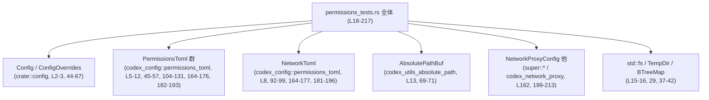
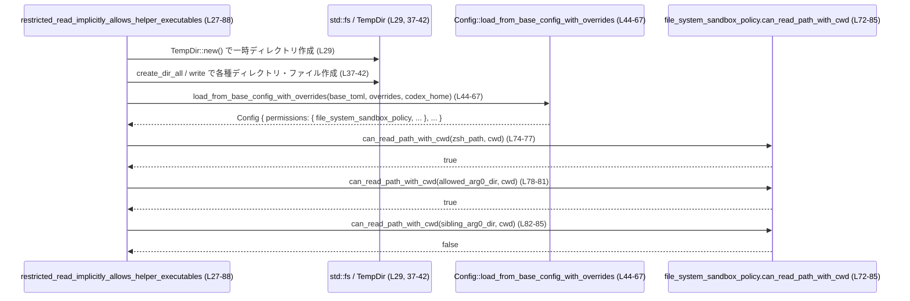

# core/src/config/permissions_tests.rs

## 0. ざっくり一言

このファイルは、**権限関連の設定ロジック**（ファイルシステムサンドボックスとネットワークアクセス許可）と、**パス正規化ユーティリティ**に対するユニットテストをまとめたモジュールです（`#[test]` 関数が 5 個定義されています）  
（core/src/config/permissions_tests.rs:L18-25, L27-88, L90-100, L102-158, L160-217）。

---

## 1. このモジュールの役割

### 1.1 概要

- このモジュールは、設定モジュールおよび関連クレートが提供する以下の機能が、想定どおりに動作することを検証します。  
  - プラットフォーム依存の絶対パス正規化（Windows の verbatim パスの簡略化）（L18-25）。
  - ファイルシステムサンドボックスがヘルパー実行ファイルを暗黙的に読めること（L27-88）。
  - ネットワーク設定 TOML で、旧式の `allowed_domains` キーが無視されること（L90-100）。
  - ドメイン／UNIX ソケット許可コンテナから、許可/拒否リストが正しく投影されること（L102-158）。
  - `NetworkToml` からプロキシ設定への適用時に、UNIX ソケット権限がパス単位で上書きされること（L160-217）。

### 1.2 アーキテクチャ内での位置づけ

このファイルは **テストモジュール**であり、上位モジュール `super::*` や `crate::config`、さらに外部クレート `codex_config` / `codex_network_proxy` などが提供する公開 API の振る舞いを検証しています（L1-16, L44-67, L92-97, L133-157, L164-216）。

主な依存関係は以下のとおりです。

- `super::*`  
  - `normalize_absolute_path_for_platform`、`NetworkProxyConfig` など、親モジュールで定義された関数・型をインポートしています（L1, L20-23, L162）。
- `crate::config::{Config, ConfigOverrides}`  
  - 設定全体のロードとオーバーライドに用いられます（L2-3, L44-67）。
- `codex_config::config_toml::ConfigToml` および `codex_config::permissions_toml::*`  
  - TOML から読み込まれた権限設定構造体群（L4-12, L45-57, L104-131, L164-176, L182-193）。
- `codex_utils_absolute_path::AbsolutePathBuf`  
  - パスを絶対パスとして扱うための型（L13, L69-71）。
- `codex_network_proxy::*`  
  - ネットワークプロキシ向けの UNIX ソケット権限構造体・列挙体（L199-213）。
- 標準ライブラリ・ユーティリティ  
  - `BTreeMap`（順序付きマップ, L15, L48-52, L104-131, L166-175, L183-192, L201-214）  
  - `TempDir`（一時ディレクトリ, L16, L29）  
  - `std::fs`（ディレクトリ作成・ファイル作成, L37-42）  
  - `toml::from_str`（TOML パース, L92-97）。

依存関係の概略図です（テストモジュール視点）。



### 1.3 設計上のポイント

- **テスト対象のグルーピング**  
  - パス正規化、ファイルシステム権限、ネットワーク権限（ドメイン＋UNIX ソケット）の 3 系統の機能ごとにテストが分かれています（L18-25, L27-88, L90-100, L102-158, L160-217）。
- **副作用の制御**  
  - ファイルシステムに触れるテストでは `TempDir` を使い、一時ディレクトリ配下にのみファイル・ディレクトリを作成しています（L29-42）。  
    これにより、テストが他の環境に影響を与えないようにしています。
- **エラーハンドリング**  
  - `restricted_read_implicitly_allows_helper_executables` は `std::io::Result<()>` を返し、`?` 演算子で I/O エラーや設定ロード時のエラーを伝播します（L28-29, L37-42, L44-67, L69-71）。  
  - その他のテストは `()` を返し、`expect` を使って意図しない状態を明示的に panic として扱っています（L38, L97）。
- **権限モデルのセキュリティ契約をテストで明文化**  
  - ファイルシステムサンドボックスが zsh や実行ラッパーなどのヘルパーに対して読み取り許可を与える一方で、セッション外のディレクトリは拒否されるべき、という前提をテストで固定しています（L32-36, L69-85）。  
  - ネットワーク設定では、旧 `allowed_domains` キーを無視すること（後方互換のための安全策）や、`Allow`・`Deny`・`None` の 3 状態を持つ権限コンテナの投影ロジックをテストで確認しています（L92-100, L102-157, L160-216）。
- **並行性**  
  - このファイル内にはスレッドや `async`/`await` は登場せず、全テストは単一スレッドで逐次実行される前提のコードになっています（全体から、スレッド生成や `async fn` の記述が存在しないことによる）。

---

## 2. 主要な機能一覧（コンポーネントインベントリー）

### 2.1 このファイルが定義するテスト関数

| 名前 | 種別 | 役割 / 用途 | 根拠行 |
|------|------|-------------|--------|
| `normalize_absolute_path_for_platform_simplifies_windows_verbatim_paths` | テスト関数 | Windows の verbatim パス `\\?\D:\...` が、`normalize_absolute_path_for_platform` によって通常の絶対パス `D:\...` に正規化されることを確認します。 | permissions_tests.rs:L18-25 |
| `restricted_read_implicitly_allows_helper_executables` | テスト関数 | 一時ディレクトリ下に疑似ワークスペースと CODEx ホームを構築し、`Config::load_from_base_config_with_overrides` から得られるファイルシステムサンドボックスポリシーが、zsh 実行ファイルとアクティブな arg0 セッションディレクトリを読み取り許可し、他セッションディレクトリは拒否することを確認します。 | permissions_tests.rs:L27-88 |
| `network_toml_ignores_legacy_network_list_keys` | テスト関数 | `NetworkToml` の TOML パーサが、旧式の `allowed_domains = ["openai.com"]` というキーを無視し、デフォルト値として解釈することを確認します。 | permissions_tests.rs:L90-100 |
| `network_permission_containers_project_allowed_and_denied_entries` | テスト関数 | `NetworkDomainPermissionsToml` と `NetworkUnixSocketPermissionsToml` から、許可ドメイン・拒否ドメイン・許可 UNIX ソケットのリストが正しく投影されることを確認します。 | permissions_tests.rs:L102-158 |
| `network_toml_overlays_unix_socket_permissions_by_path` | テスト関数 | 2 つの `NetworkToml` インスタンスを順に `NetworkProxyConfig` に適用したとき、UNIX ソケットの権限がパス単位で上書きされる（後からの設定が優先される）ことを確認します。 | permissions_tests.rs:L160-217 |

### 2.2 このファイルから呼び出される主な外部 API

いずれも定義はこのチャンクには現れませんが、**テストから分かる範囲の役割**をまとめます。

| 名前 | 種別 | 観察される振る舞い / 役割 | 使用箇所（根拠行） |
|------|------|--------------------------|--------------------|
| `normalize_absolute_path_for_platform` | 関数（`super::*` からインポート） | Windows の verbatim パス文字列と `is_windows` フラグを受け取り、`PathBuf` と比較可能な値を返します。Windows verbatim パス `\\?\D:\...` に対して、`D:\...` と同値のパスを返すことが期待されています。 | permissions_tests.rs:L20-24 |
| `Config::load_from_base_config_with_overrides` | 関数/関連関数 | `ConfigToml` と `ConfigOverrides`、`codex_home` パスを受け取り、`Config` をロードします。戻り値は `?` で伝播可能な `Result` 型です。ロードした `Config` から `permissions.file_system_sandbox_policy` にアクセスできます。 | permissions_tests.rs:L44-67, L72 |
| `AbsolutePathBuf::try_from` | 関連関数 | `zsh_path` や `allowed_arg0_dir` などの `PathBuf` を絶対パス表現に変換し、`Result` として返します。 | permissions_tests.rs:L69-71 |
| `can_read_path_with_cwd` | メソッド（`file_system_sandbox_policy` 上） | 引数に対象パスと CWD を取り、読み取りが許可されているかどうかを `bool` で返します。zsh 実行ファイルとアクティブな arg0 セッションディレクトリは `true`、別セッションディレクトリは `false` であることが期待されています。 | permissions_tests.rs:L72-85 |
| `toml::from_str::<NetworkToml>` | 関数 | TOML 文字列から `NetworkToml` をパースします。旧 `allowed_domains` キーが設定されていても、`NetworkToml::default()` と等しい値を返すことが期待されています。 | permissions_tests.rs:L92-99 |
| `NetworkDomainPermissionsToml::allowed_domains` | メソッド | `entries` における `Allow` なドメインを `Vec<String>` として返し、存在しない場合は `None` を返します。 | permissions_tests.rs:L104-119, L133-139 |
| `NetworkDomainPermissionsToml::denied_domains` | メソッド | `entries` における `Deny` なドメインを `Vec<String>` として返し、存在しない場合は `None` を返します。 | permissions_tests.rs:L104-119, L140-152 |
| `NetworkUnixSocketPermissionsToml::allow_unix_sockets` | メソッド | `entries` から、`Allow` とされている UNIX ソケットパスのみを `Vec<String>` として返します。`None` は無視されます。 | permissions_tests.rs:L120-131, L154-157 |
| `NetworkToml::apply_to_network_proxy_config` | メソッド | `NetworkToml` の内容を `NetworkProxyConfig` に適用します。`unix_sockets` の権限は `Path` キーでマージされ、後から適用した設定が同一パスの権限を上書きします。 | permissions_tests.rs:L164-179, L181-196 |
| `NetworkProxyConfig::default` | 関連関数 | 空のネットワークプロキシ設定を生成します。 | permissions_tests.rs:L162 |
| `codex_network_proxy::NetworkUnixSocketPermissions` および `ProxyNetworkUnixSocketPermission` | 構造体・列挙体 | `config.network.unix_sockets` に格納される、プロキシ側の UNIX ソケット権限表現です。`Allow`・`None` などのバリアントを持ちます。 | permissions_tests.rs:L199-215 |

---

## 3. 公開 API と詳細解説

このファイル自身には公開 API（`pub` 関数・型）は定義されておらず、すべてユニットテスト用のローカル関数です。ただし、**テストを通じて外部 API の期待される振る舞いが明示**されています。

### 3.1 型一覧（このファイルから参照される主な型）

このファイル内で新たな構造体・列挙体は定義されていませんが、テストが依存している主な型を整理します。

| 名前 | 種別 | 定義場所（モジュール） | 役割 / 用途 | 根拠行 |
|------|------|------------------------|-------------|--------|
| `Config` | 構造体 | `crate::config`（`use crate::config::Config` より） | アプリケーション全体の設定を表す型。ここでは `permissions.file_system_sandbox_policy` へのアクセスに利用されています。 | L2, L44-67, L72 |
| `ConfigOverrides` | 構造体 | `crate::config` | コマンドラインや実行環境による設定の上書きを表現します。`cwd`, `zsh_path`, `main_execve_wrapper_exe` などが設定されています。 | L3, L60-65 |
| `ConfigToml` | 構造体 | `codex_config::config_toml` | ベースとなる設定を TOML から読み込んだ形の中間表現。ここでは `default_permissions` や `permissions` を指定しています。 | L4, L45-59 |
| `PermissionsToml`, `PermissionProfileToml`, `FilesystemPermissionsToml` | 構造体 | `codex_config::permissions_toml` | 権限プロファイルを TOML 形式で表現するための型群。ファイルシステム権限プロファイルを設定するために使用されています。 | L5, L11-12, L45-57 |
| `NetworkToml` | 構造体 | `codex_config::permissions_toml` | ネットワーク権限の TOML 表現。`unix_sockets` や旧式の `allowed_domains` キー等を含みます。 | L8, L92-99, L164-177, L181-196 |
| `NetworkDomainPermissionsToml`, `NetworkDomainPermissionToml` | 構造体・列挙体 | `codex_config::permissions_toml` | ドメイン単位のネットワーク権限（Allow/Deny 等）を保持し、許可/拒否ドメインの抽出を行います。 | L6-7, L104-119, L133-152 |
| `NetworkUnixSocketPermissionsToml`, `NetworkUnixSocketPermissionToml` | 構造体・列挙体 | `codex_config::permissions_toml` | UNIX ソケットのアクセス権限（Allow/None 等）を保持し、許可対象を抽出します。 | L9-10, L120-131, L154-157, L166-175, L183-192 |
| `AbsolutePathBuf` | 構造体 | `codex_utils_absolute_path` | 絶対パス表現を安全に扱うためのラッパー型。`try_from(PathBuf)` で生成されます。 | L13, L69-71 |
| `NetworkProxyConfig` | 構造体 | モジュールパス不明（`super::*` または同一クレート内） | ネットワークプロキシの設定。ここでは `NetworkToml::apply_to_network_proxy_config` の適用先となります。 | L162, L164-179, L181-196 |
| `codex_network_proxy::NetworkUnixSocketPermissions` | 構造体 | `codex_network_proxy` | プロキシ用の UNIX ソケット権限設定を表します。 | L199-215 |
| `ProxyNetworkUnixSocketPermission` | 列挙体 | `codex_network_proxy` | プロキシ用の UNIX ソケット単位の権限（`Allow` / `None` など）を表現します。 | L203-213 |

### 3.2 関数詳細（このファイル内の主なテスト）

#### `fn normalize_absolute_path_for_platform_simplifies_windows_verbatim_paths()`

**概要**

- Windows の verbatim パス `\\?\D:\...` が、`normalize_absolute_path_for_platform` によって通常の `D:\...` 形式に簡略化されることを検証するテストです（L18-25）。

**引数**

- テスト関数自体に引数はありません（L18-25）。

**戻り値**

- 戻り値は `()` です（`->` なし, L19）。

**内部処理の流れ**

1. `normalize_absolute_path_for_platform` に文字列リテラル `r"\\?\D:\c\x\worktrees\2508\swift-base"` と、`is_windows` フラグとして `true` を渡し、その戻り値を `parsed` に束縛します（L20-23）。
2. `assert_eq!` により、戻り値 `parsed` が `PathBuf::from(r"D:\c\x\worktrees\2508\swift-base")` と等しいことを検証します（L24）。

**Examples（使用例）**

テストと同じパターンをコメント付きで示します。

```rust
// Windows の verbatim パスをテスト用に用意する                            // permissions_tests.rs:L20-22
let raw = r"\\?\D:\c\x\worktrees\2508\swift-base";                         // verbatim 形式

// is_windows = true として正規化関数を呼び出す                             // L20-23
let parsed = normalize_absolute_path_for_platform(raw, true);

// verbatim プレフィックスが取り除かれていることを確認する                  // L24
assert_eq!(parsed, PathBuf::from(r"D:\c\x\worktrees\2508\swift-base"));
```

**Errors / Panics**

- このテスト関数内には `?` や `expect` は含まれていないため、明示的なエラー伝播や panic は記述されていません（L18-25）。
- 実際の panic の可能性は、`normalize_absolute_path_for_platform` 実装に依存しますが、その詳細はこのチャンクには現れません。

**Edge cases（エッジケース）**

- このテストがカバーしているのは、**Windows verbatim 形式かつ `is_windows = true` のケース**のみです（L20-23）。  
- `is_windows = false` や POSIX パス、相対パスなどについては、このファイルからは挙動が分かりません。

**使用上の注意点**

- Windows 固有のパス表現に依存する関数であるため、テストでも `is_windows` フラグを明示的に渡しています（L22）。  
  他のプラットフォームでの利用や、`PathBuf` 以外の型との比較等についてはこのチャンクでは不明です。

---

#### `fn restricted_read_implicitly_allows_helper_executables() -> std::io::Result<()>`

**概要**

- 一時ディレクトリ内に疑似的なワークスペース環境と CODEx ホームを構築し、  
  ロードした設定のファイルシステムサンドボックスポリシーが以下を満たすことを検証します（L27-88）。
  - `zsh` ヘルパー実行ファイルは読み取り可能。
  - アクティブな arg0 セッションディレクトリは読み取り可能。
  - 別セッションの arg0 ディレクトリは読み取り不可。

**引数**

- 引数はありません（L27-28）。

**戻り値**

- `std::io::Result<()>` を返します（L28）。  
  - `TempDir::new` や `std::fs` 操作、`Config::load_from_base_config_with_overrides`、`AbsolutePathBuf::try_from` などの I/O エラーを `?` により呼び出し元に伝播します（L29, L37-42, L44-67, L69-71）。

**内部処理の流れ**

1. 一時ディレクトリと各種パスの構築  
   - `TempDir::new()` で一時ディレクトリを作成し（L29）、その配下に `workspace`（CWD）、`.codex`（codex_home）、`runtime/zsh`、`tmp/arg0/codex-arg0-session`、`tmp/arg0/codex-arg0-other-session` を組み立てます（L30-36）。
2. ディレクトリ・ファイルの作成  
   - `std::fs::create_dir_all` で各ディレクトリを作成します（L37-40）。  
     `zsh_path.parent().expect("zsh path should have parent")` により、`zsh_path` が必ず親ディレクトリを持つ前提をチェックしています（L38）。  
   - `std::fs::write` で `zsh` と `codex-execve-wrapper` の空ファイルを作成します（L41-42）。
3. 設定のロード  
   - `ConfigToml` をインラインで構築し、`default_permissions` に `"workspace"`、`permissions` に `"workspace"` プロファイルを 1 つだけ持つ `PermissionsToml` を指定します（L44-57）。  
     このプロファイルは、空の `FilesystemPermissionsToml`（entries が空の `BTreeMap`）と `network: None` で構成されています（L51-55）。  
   - `ConfigOverrides` で `cwd`, `zsh_path`, `main_execve_wrapper_exe` を上書きし（L60-65）、`codex_home` とともに `Config::load_from_base_config_with_overrides` に渡して `Config` をロードします（L44-67）。
4. 絶対パスへの変換  
   - `AbsolutePathBuf::try_from` で `zsh_path`、`allowed_arg0_dir`、`sibling_arg0_dir` を絶対パス表現に変換します（L69-71）。
5. ポリシーの取得  
   - `config.permissions.file_system_sandbox_policy` を参照し、`policy` 変数に束縛します（L72）。
6. 読み取り可否の検証  
   - `policy.can_read_path_with_cwd(expected_zsh.as_path(), &cwd)` が `true` であることを `assert!` で確認します（L74-77）。  
   - `expected_allowed_arg0_dir` は `true`、`expected_sibling_arg0_dir` は `false` であることを同様に検証します（L78-85）。
7. 正常終了  
   - 最後に `Ok(())` を返します（L87）。

**Examples（使用例）**

テストから抜粋した、設定ロードとポリシー確認の部分にコメントを付けた例です。

```rust
// ConfigToml と PermissionsToml を構築する                              // L44-57
let base = ConfigToml {
    default_permissions: Some("workspace".to_string()),               // デフォルトプロファイル名
    permissions: Some(PermissionsToml {
        entries: BTreeMap::from([(
            "workspace".to_string(),
            PermissionProfileToml {
                filesystem: Some(FilesystemPermissionsToml {
                    entries: BTreeMap::new(),                         // ルールなし
                }),
                network: None,                                       // ネットワーク権限なし
            },
        )]),
    }),
    ..Default::default()
};

// 実行環境依存のパスを Overrides として渡す                             // L60-66
let overrides = ConfigOverrides {
    cwd: Some(cwd.clone()),
    zsh_path: Some(zsh_path.clone()),
    main_execve_wrapper_exe: Some(execve_wrapper.clone()),
    ..Default::default()
};

// Config をロードする                                                   // L44-67
let config = Config::load_from_base_config_with_overrides(
    base,
    overrides,
    codex_home.clone(),
)?;

// サンドボックスポリシーに対して読み取り可否を問い合わせる             // L72-85
let policy = &config.permissions.file_system_sandbox_policy;
assert!(policy.can_read_path_with_cwd(expected_zsh.as_path(), &cwd));
```

**Errors / Panics**

- `TempDir::new`, `create_dir_all`, `write`, `Config::load_from_base_config_with_overrides`, `AbsolutePathBuf::try_from` のいずれかが失敗した場合、`?` により `Err(std::io::Error)`（もしくは互換のエラー型）がテストの呼び出し元に返されます（L28-29, L37-42, L44-67, L69-71）。
- `zsh_path.parent().expect("zsh path should have parent")` は、`zsh_path` に親ディレクトリがない場合に panic しますが、ここでは `runtime/zsh` という形でパスを構築しているため、通常は起こらない前提です（L32, L38）。

**Edge cases（エッジケース）**

- `cwd` や `codex_home` が絶対パスでない場合の挙動、および symlink が関与するケースなどは、このテストからは分かりません。
- `FilesystemPermissionsToml` の `entries` が空の場合でも、`cwd` やヘルパー関連のパスが暗黙的に許可される、という契約が暗に存在します（L51-52, L74-81）。
- 別セッションディレクトリ（`codex-arg0-other-session`）が拒否されることのみが確認されており、その他の補助ディレクトリについてはテストされていません（L35, L83-85）。

**使用上の注意点**

- `ConfigOverrides` で `cwd`, `zsh_path`, `main_execve_wrapper_exe` を適切に設定しないと、このテストが前提とするポリシー（ヘルパーの暗黙許可）が成立しない可能性があります（L60-65）。
- 実運用コードでも、ヘルパー用実行ファイルの設置パスと `ConfigOverrides` の値を一致させることが重要であると読み取れます。

---

#### `fn network_toml_ignores_legacy_network_list_keys()`

**概要**

- `NetworkToml` の TOML パーサが、旧式の `allowed_domains` キーを無視し、`NetworkToml::default()` と等価な値を返すことを検証するテストです（L90-100）。

**内部処理の流れ**

1. `toml::from_str::<NetworkToml>` で、`allowed_domains = ["openai.com"]` という TOML をパースします（L92-96）。
2. `.expect("legacy network list keys should be ignored")` でパースに成功することを要求します（L97）。
3. `assert_eq!(parsed, NetworkToml::default())` により、結果がデフォルトと同一であることを確認します（L99）。

**Errors / Panics**

- TOML パースに失敗した場合、`expect` により `"legacy network list keys should be ignored"` メッセージ付きで panic します（L92-97）。

**Edge cases**

- 旧式キー `allowed_domains` のみが含まれるケースについてテストされていますが、新旧キーが混在した場合などはこのファイルからは不明です。

---

#### `fn network_permission_containers_project_allowed_and_denied_entries()`

**概要**

- ドメインおよび UNIX ソケット権限コンテナから、許可/拒否のリストが期待どおりに抽出されることを検証します（L102-158）。

**内部処理の流れ**

1. `NetworkDomainPermissionsToml` の構築  
   - `entries` に 3 つのエントリを追加します（L104-118）。  
     - `"*.openai.com"` → `Allow`（L106-109）  
     - `"api.example.com"` → `Allow`（L110-113）  
     - `"blocked.example.com"` → `Deny`（L114-117）
2. `NetworkUnixSocketPermissionsToml` の構築  
   - `entries` に 2 つのエントリを追加します（L120-131）。  
     - `"/tmp/example.sock"` → `Allow`（L122-125）  
     - `"/tmp/ignored.sock"` → `None`（L126-129）
3. `allowed_domains` のテスト  
   - `domains.allowed_domains()` が `Some(vec!["*.openai.com", "api.example.com"])` を返すことを `assert_eq!` で確認します（L133-139）。
4. `denied_domains` のテスト（存在する場合）  
   - `domains.denied_domains()` が `Some(vec!["blocked.example.com"])` を返すことを確認します（L140-143）。
5. `denied_domains` のテスト（存在しない場合）  
   - `Allow` のみを持つ `NetworkDomainPermissionsToml` に対して `denied_domains()` が `None` を返すことを確認します（L144-152）。
6. UNIX ソケットの許可リスト  
   - `unix_sockets.allow_unix_sockets()` が `vec!["/tmp/example.sock"]` を返し、`None` とされたパスは含まれないことを確認します（L154-157）。

**Edge cases**

- ドメインやソケットが 0 件の場合、どのような値（`None` / 空ベクタ）を返すかはこのテストからは分かりません。
- `NetworkDomainPermissionToml::None` のような状態が存在するかどうかは、このチャンクには現れません（`Allow` と `Deny` のみが使用されています, L108-116）。

---

#### `fn network_toml_overlays_unix_socket_permissions_by_path()`

**概要**

- 2 つの `NetworkToml` を順に `NetworkProxyConfig` に適用した場合に、UNIX ソケットの権限がパス単位でマージ・上書きされることを検証するテストです（L160-217）。

**内部処理の流れ**

1. `NetworkProxyConfig::default()` で初期設定を用意します（L162）。
2. 1 つ目の `NetworkToml` を構築し、`unix_sockets` に 2 エントリを設定します（L164-176）。  
   - `"/tmp/base.sock"` → `Allow`（L167-170）  
   - `"/tmp/override.sock"` → `Allow`（L171-174）
3. `.apply_to_network_proxy_config(&mut config)` を呼び出し、1 つ目の設定を適用します（L178-179）。
4. 2 つ目の `NetworkToml` を構築し、`unix_sockets` に以下を設定します（L181-193）。  
   - `"/tmp/extra.sock"` → `Allow`（L184-187）  
   - `"/tmp/override.sock"` → `None`（L188-191）
5. 再び `apply_to_network_proxy_config` を呼び出し、2 つ目の設定を上書き適用します（L195-196）。
6. `config.network.unix_sockets` が、以下のマップを保持していることを `assert_eq!` により検証します（L198-215）。  
   - `"/tmp/base.sock"` → `ProxyNetworkUnixSocketPermission::Allow`（L201-205）  
   - `"/tmp/extra.sock"` → `Allow`（L206-209）  
   - `"/tmp/override.sock"` → `None`（L210-213）  

**Edge cases**

- 同一パスに対する複数回の設定が存在する場合、**後から適用された `NetworkToml` が優先される**ことが確認できます（`"/tmp/override.sock"` に対する `Allow` → `None` の上書き, L172-174, L188-191, L210-213）。
- `None` に設定されたエントリが、どのように内部表現から削除または無効化されるかは、`apply_to_network_proxy_config` の実装に依存し、このファイルからは詳細不明です。

---

### 3.3 その他の関数

このファイル内には、上記以外の関数は存在しません（すべて `#[test]` が付いた 5 関数のみ, L18, L27, L90, L102, L160）。  
その他の処理は、標準ライブラリや外部クレートの API 呼び出しとして記述されています。

---

## 4. データフロー

ここでは、最も複雑なテストである  
`restricted_read_implicitly_allows_helper_executables`（L27-88）におけるデータフローを整理します。

### 4.1 処理の要点（文章）

1. 一時ディレクトリ配下にワークスペース (`cwd`) と CODEx ホーム (`codex_home`) を構築し、zsh 実行ファイルと execve ラッパーを配置します（L29-42）。
2. `ConfigToml` と `ConfigOverrides` を用いて `Config::load_from_base_config_with_overrides` を呼び出し、`Config` をロードします（L44-67）。
3. ロードした `Config` から `permissions.file_system_sandbox_policy` を取り出します（L72）。
4. `AbsolutePathBuf` 経由で絶対パスに変換した zsh ファイルと arg0 ディレクトリを対象に、`policy.can_read_path_with_cwd(path, &cwd)` を呼び出し、読み取り可否を判定します（L69-71, L74-85）。

### 4.2 シーケンス図（データフロー）



この図から分かるように、**ファイルシステムサンドボックスポリシーは、設定ロード時に構築され、実行時には `can_read_path_with_cwd` という純粋な判定 API として利用されている**ことが分かります（L72-85）。

---

## 5. 使い方（How to Use）

このファイル自体はテストモジュールですが、**テストコードは外部 API の具体的な利用例**としても参考になります。

### 5.1 基本的な使用方法（例：NetworkToml からプロキシ設定への適用）

`NetworkToml::apply_to_network_proxy_config` の典型的な使い方は、`network_toml_overlays_unix_socket_permissions_by_path` テストに示されています（L160-217）。

```rust
// プロキシ設定の初期化                                              // L162
let mut config = NetworkProxyConfig::default();

// ベースとなる UNIX ソケット権限を NetworkToml で指定               // L164-176
let base = NetworkToml {
    unix_sockets: Some(NetworkUnixSocketPermissionsToml {
        entries: BTreeMap::from([
            ("/tmp/base.sock".to_string(), NetworkUnixSocketPermissionToml::Allow),
            ("/tmp/override.sock".to_string(), NetworkUnixSocketPermissionToml::Allow),
        ]),
    }),
    ..Default::default()
};

// ベース設定を適用                                                   // L178-179
base.apply_to_network_proxy_config(&mut config);

// 後から追加・上書きする設定を別の NetworkToml として定義           // L181-193
let overlay = NetworkToml {
    unix_sockets: Some(NetworkUnixSocketPermissionsToml {
        entries: BTreeMap::from([
            ("/tmp/extra.sock".to_string(), NetworkUnixSocketPermissionToml::Allow),
            ("/tmp/override.sock".to_string(), NetworkUnixSocketPermissionToml::None),
        ]),
    }),
    ..Default::default()
};

// オーバーレイ設定を適用（同一パスは上書きされる）                 // L195-196
overlay.apply_to_network_proxy_config(&mut config);
```

このように、**複数の `NetworkToml` を順次適用することで、設定ファイルのレイヤリング（ベース + オーバーレイ）を実現**していることが分かります。

### 5.2 よくある使用パターン

1. **旧形式キーを無視したパース**

   - `NetworkToml` を TOML から読み込む際、旧形式の `allowed_domains` を完全に無視したい場合は、特別な処理を行う必要はなく、単純に `toml::from_str::<NetworkToml>` を使えば良いことがテストから分かります（L92-99）。

2. **許可/拒否リストの抽出**

   - ドメインや UNIX ソケット権限を `NetworkDomainPermissionsToml` や `NetworkUnixSocketPermissionsToml` で管理し、必要に応じて `allowed_domains()`, `denied_domains()`, `allow_unix_sockets()` でリストを取得するパターンが想定されています（L104-131, L133-157）。

3. **絶対パスとサンドボックスポリシー**

   - パスを `AbsolutePathBuf` に変換したうえで、`file_system_sandbox_policy.can_read_path_with_cwd` に渡すことで、**CWD を前提とした安全なアクセス判定**が行われます（L69-75, L79-83）。

### 5.3 よくある間違い（とテストが防いでいるもの）

```rust
// 間違い例: 旧式の allowed_domains に依存してしまう設定
// TOML:
allowed_domains = ["openai.com"]
```

- 上記のような TOML を `NetworkToml` にパースしても、**デフォルト値と同一として扱われる**ため、実際にはドメインのホワイトリストにはなりません（L92-99）。

```rust
// 正しい例: 新しい permissions_toml を使ってドメイン権限を設定する
let domains = NetworkDomainPermissionsToml {
    entries: BTreeMap::from([
        ("*.openai.com".to_string(), NetworkDomainPermissionToml::Allow),
        ("blocked.example.com".to_string(), NetworkDomainPermissionToml::Deny),
    ]),
};

// 必要に応じて allowed / denied を取得する                         // L133-143
let allowed = domains.allowed_domains();
let denied  = domains.denied_domains();
```

このように、**旧式フィールドに頼らず、`permissions_toml` ベースの新しい権限モデルを使う必要がある**ことがテストから読み取れます。

### 5.4 使用上の注意点（まとめ）

- `Config::load_from_base_config_with_overrides` を用いる際は、`cwd`, `zsh_path`, `main_execve_wrapper_exe` など、ファイルシステムサンドボックスに影響する情報を適切に `ConfigOverrides` に設定する必要があります（L60-65）。
- `NetworkToml` の上書きロジックは、**同一パスに対して後から適用された設定が優先**されるため、設定ファイルを複数レイヤーに分割する場合は、その読み込み順を意識する必要があります（L164-196, L201-213）。
- 旧式の `allowed_domains` キーは無視されるため、ホワイトリストなどのセキュリティポリシーを TOML で表現する際には、**新しい構造（`NetworkDomainPermissionsToml` 等）を使用することが前提**になっています（L92-99, L104-119）。

---

## 6. 変更の仕方（How to Modify）

### 6.1 新しい機能を追加する場合（テスト観点）

このファイルはテスト専用なので、「機能追加」は主に **新しい権限ルールや設定項目に対応するテストの追加**を意味します。

- **ファイルシステム権限の新ルールを追加する場合**
  1. 一時ディレクトリを使って、必要なディレクトリ・ファイル構造を再現する（L29-42 を参考）。
  2. `ConfigToml` と `ConfigOverrides` を用意し、新ルールが有効になるようにフィールドを設定する（L44-65）。
  3. `Config::load_from_base_config_with_overrides` で設定をロードし、`file_system_sandbox_policy` のメソッドを呼び出して期待する挙動を `assert!` / `assert_eq!` で検証する（L72-85）。

- **ネットワーク権限の新しいフラグや状態を追加する場合**
  1. `NetworkDomainPermissionsToml` / `NetworkUnixSocketPermissionsToml` の `entries` に新状態を持つ値を設定する（L104-119, L120-131）。
  2. その状態が `allowed_domains` / `denied_domains` / `allow_unix_sockets` などの投影メソッドにどのように反映されるべきかをテストで明示する（L133-157）。
  3. 必要であれば `NetworkToml::apply_to_network_proxy_config` への影響も確認する（L164-196, L199-215）。

### 6.2 既存の機能を変更する場合

既存 API の仕様を変更・拡張する際には、**テストに反映されている契約を意識する**必要があります。

- **影響範囲の確認**
  - `normalize_absolute_path_for_platform` の挙動を変える場合は、このテスト（L18-25）だけでなく、同関数を利用しているその他のコードも確認する必要があります（このチャンクには現れません）。
  - `file_system_sandbox_policy` のデフォルト許可パスを変更すると、`restricted_read_implicitly_allows_helper_executables` の期待（ヘルパーの暗黙許可）が変わる可能性があります（L72-85）。
  - `NetworkToml::apply_to_network_proxy_config` のマージ戦略を変更する場合は、UNIX ソケットの上書き挙動を前提としているテスト（L160-217）との整合性に注意が必要です。

- **契約（前提条件・返り値の意味）の確認**
  - `NetworkDomainPermissionsToml::allowed_domains` / `denied_domains` が `Some(Vec<_>)` と `None` をいつ返すのか、テストは現在以下を前提としています（L133-152）。  
    - `Allow` / `Deny` が一切ない場合は `None`。  
    - 存在する場合は `Some` で少なくとも 1 要素を含むベクタ。
  - `NetworkUnixSocketPermissionsToml::allow_unix_sockets` は、`None` とされたソケットを結果から除外する前提です（L154-157）。

- **関連テストの更新**
  - 仕様変更に伴い期待値が変わる場合は、本ファイル内の該当テストの `assert!` / `assert_eq!` を新仕様に合わせて更新する必要があります。

---

## 7. 関連ファイル

このテストモジュールと密接に関係するファイル・モジュール（推測ではなく、`use` および完全修飾名から分かる範囲）をまとめます。

| パス / モジュール | 役割 / 関係 |
|-------------------|------------|
| `super::*`（具体的なファイルパスはこのチャンクには現れない） | `normalize_absolute_path_for_platform` や `NetworkProxyConfig` など、本テストが直接利用する関数・型を定義している上位モジュールです（L1, L20-23, L162）。 |
| `crate::config::Config` | `Config::load_from_base_config_with_overrides` を通じて設定をロードし、`permissions.file_system_sandbox_policy` を提供する設定モジュールです（L2, L44-67, L72）。 |
| `crate::config::ConfigOverrides` | 実行時環境による設定上書きを表現する型で、本テストでは `cwd`, `zsh_path`, `main_execve_wrapper_exe` を指定しています（L3, L60-65）。 |
| `codex_config::config_toml` | `ConfigToml` を定義するクレート/モジュールで、ベース設定の TOML 表現を読み込む役割を持ちます（L4, L45-59）。 |
| `codex_config::permissions_toml` | ファイルシステム・ネットワーク権限の TOML 表現（`PermissionsToml`, `PermissionProfileToml`, `FilesystemPermissionsToml`, `NetworkToml`, `NetworkDomainPermissionsToml`, `NetworkUnixSocketPermissionsToml` 等）を提供します（L5-12, L45-57, L104-131, L164-176, L182-193）。 |
| `codex_utils_absolute_path` | `AbsolutePathBuf` を提供し、本テストではパスの絶対化とサンドボックスポリシーへの入力に使用されています（L13, L69-71）。 |
| `codex_network_proxy` | `NetworkUnixSocketPermissions` および `ProxyNetworkUnixSocketPermission` など、プロキシ用のネットワーク権限表現を提供します。本テストでは `config.network.unix_sockets` の期待値構築に用いられています（L199-215）。 |
| `toml` クレート | `toml::from_str::<NetworkToml>` により、TOML 文字列から `NetworkToml` をパースする機能を提供します（L92-97）。 |
| `tempfile` クレート | `TempDir` を提供し、テスト用の一時ディレクトリ環境の構築と自動クリーンアップを担います（L16, L29）。 |

---

### 言語固有の安全性 / エラー / 並行性（まとめ）

- **安全性（ファイルシステム）**  
  - 一時ディレクトリを用いたテストにより、実システムのファイルに影響を与えずにサンドボックスポリシーを検証しています（L29-42）。  
  - `AbsolutePathBuf` を使ってパスを絶対化し、パス解釈上の曖昧さを減らしています（L69-71）。

- **エラーハンドリング**  
  - Rust の `Result` と `?` を利用して I/O エラーを静的に扱っており、`restricted_read_implicitly_allows_helper_executables` のシグネチャ `-> std::io::Result<()>` からもその方針が読み取れます（L28, L29, L37-42, L44-67, L69-71）。
  - `expect` により、「起きてはならない状態」（zsh に親ディレクトリがない／旧式キーのパース失敗）を明示的な panic として扱っています（L38, L97）。

- **並行性**  
  - このファイル内にはスレッド生成や `async fn`、`Send` / `Sync` といった並行性に関するコードは存在せず、すべて単一スレッド同期コードで構成されています（全体）。  
  - したがって、並行実行時の競合やレースコンディションに関する情報は、このチャンクには現れません。
