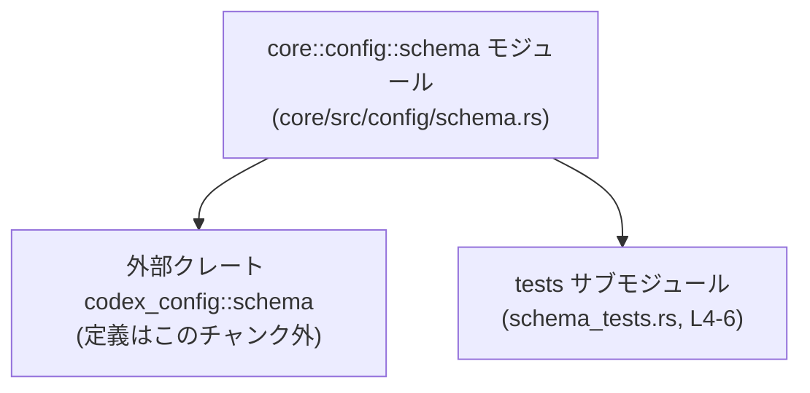
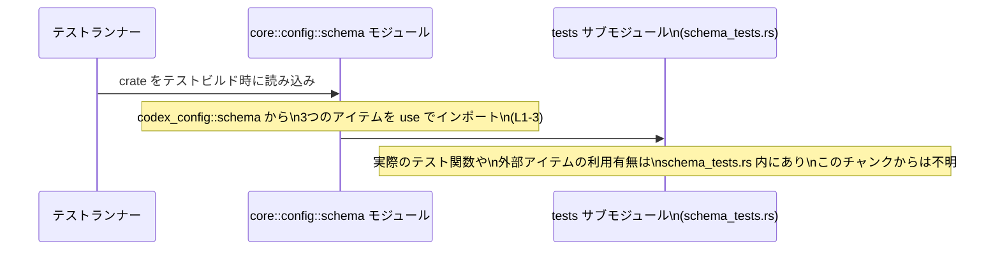

# core/src/config/schema.rs コード解説

## 0. ざっくり一言

このモジュールは、外部クレート `codex_config::schema` からいくつかのアイテムをインポートし、テスト専用の `tests` サブモジュールを別ファイル `schema_tests.rs` に結びつけるための薄いラッパーモジュールです（core/src/config/schema.rs:L1-6）。

---

## 1. このモジュールの役割

### 1.1 概要

- `codex_config::schema` モジュールから 3 つのアイテムをインポートします（core/src/config/schema.rs:L1-3）。
- `cfg(test)` が有効なときだけコンパイルされる `tests` サブモジュールを、ファイル `schema_tests.rs` によって定義します（core/src/config/schema.rs:L4-6）。
- このチャンクには関数や構造体・列挙体などのロジックは定義されておらず、テスト用の足場（テストハーネス）としての役割のみが確認できます。

### 1.2 アーキテクチャ内での位置づけ

このモジュールは「core crate の `config::schema` モジュール」として、外部クレート `codex_config` の `schema` モジュールに依存しつつ、その上にテストモジュールを配置する構造になっています。



- A → B: `use codex_config::schema::...;` による外部依存（core/src/config/schema.rs:L1-3）。
- A → C: `#[cfg(test)]` と `#[path = "schema_tests.rs"]` によるテストモジュール定義（core/src/config/schema.rs:L4-6）。

### 1.3 設計上のポイント

- **ロジックを持たない薄いモジュール**
  - 関数・型の定義はなく、`use` と `mod tests;` のみが存在します（core/src/config/schema.rs:L1-6）。
- **テスト専用モジュールの分離**
  - `#[cfg(test)]` により、`tests` モジュールはテストビルド時にのみコンパイルされ、本番バイナリには含まれません（core/src/config/schema.rs:L4）。
  - `#[path = "schema_tests.rs"]` により、通常の Rust の `tests` モジュールとは異なり、ファイル名を明示的に指定しています（core/src/config/schema.rs:L5）。
- **外部依存のテスト容易性の確保**
  - 親モジュールで `codex_config::schema` からアイテムをインポートしておくことで、テストファイル側から `super::...` でアクセスしやすくする意図が想定されますが、テストコードがないため詳細はこのチャンクからは分かりません。

---

## 2. 主要な機能一覧

このファイルに「処理」と呼べるロジックは存在しませんが、構造上の機能として次が確認できます。

- `codex_config::schema` からのアイテムインポート  
  `canonicalize`, `config_schema_json`, `write_config_schema` をスコープに導入します（core/src/config/schema.rs:L1-3）。ただし種別（関数・型など）はこのチャンクからは不明です。
- テストサブモジュール `tests` の宣言  
  テストコードを `schema_tests.rs` に配置し、`cfg(test)` が有効なときのみコンパイルする設定を行います（core/src/config/schema.rs:L4-6）。

---

## 3. 公開 API と詳細解説

### 3.1 型・モジュール一覧

このファイル内で新たに定義される型（構造体・列挙体など）はありません（core/src/config/schema.rs:L1-6）。  
モジュールおよび外部からインポートされるアイテムを一覧します。

#### モジュール

| 名前    | 種別     | 役割 / 用途 | 定義位置 |
|---------|----------|-------------|----------|
| `tests` | モジュール | テストコードを格納するサブモジュール。`cfg(test)` 時にのみ有効で、ソースは `schema_tests.rs` に置かれます。 | core/src/config/schema.rs:L4-6 |

#### 外部からインポートされるアイテム

`use` でインポートされる 3 つの名前について、このチャンクでは「何らかのアイテム」であることしか分かりません（関数・型・定数などは不明）。

| 名前                 | 種別（このチャンクで判別不能） | 由来モジュール                    | 定義有無 |
|----------------------|--------------------------------|-----------------------------------|----------|
| `canonicalize`       | 不明（外部アイテム）           | `codex_config::schema`           | このチャンクには定義がない（core/src/config/schema.rs:L1） |
| `config_schema_json` | 不明（外部アイテム）           | `codex_config::schema`           | このチャンクには定義がない（core/src/config/schema.rs:L2） |
| `write_config_schema`| 不明（外部アイテム）           | `codex_config::schema`           | このチャンクには定義がない（core/src/config/schema.rs:L3） |

> 補足: 名前からは関数である可能性が高いものもありますが、型情報が見えないため、ここでは「種別不明」としています。

### 3.2 関数詳細（最大 7 件）

このファイル内には関数定義が 1 つも存在しないため（メタ情報 functions=0、かつソースに `fn` が出現しない: core/src/config/schema.rs:L1-6）、詳細解説対象の関数はありません。

- 公開 API: なし（`pub fn` や `pub struct` 等が存在しません）。
- 内部関数: なし。

### 3.3 その他の関数

同上で、関数が存在しないため該当しません。

---

## 4. データフロー

### 4.1 このファイルにおけるデータフローの有無

- このファイル内には関数・メソッド・処理ロジックが一切存在しないため、**実行時のデータフローは定義されていません**（core/src/config/schema.rs:L1-6）。
- 存在が確認できるのは、**コンパイル時のモジュール構造**と**テストモジュールの有効化条件**だけです。

### 4.2 テスト時のモジュール読み込みフロー

テスト実行時のモジュールレベルの流れのみを図示します。  
実際の関数呼び出し（`canonicalize` など）が行われているかどうかは、このチャンクには現れません。



---

## 5. 使い方（How to Use）

### 5.1 基本的な使用方法

このモジュール自体には呼び出すべき API はありません。  
主な利用シナリオは「テストコードから `codex_config::schema` のアイテムを扱いやすくする」ことです。

以下は **一般的な利用例** であり、`canonicalize` などの正確なシグネチャはこのチャンクからは不明であるため、仮のサンプルです。

```rust
// core/src/config/schema.rs （本チャンクと同等）
use codex_config::schema::canonicalize;          // L1
use codex_config::schema::config_schema_json;    // L2
use codex_config::schema::write_config_schema;   // L3

#[cfg(test)]                                     // L4: テスト時のみコンパイル
#[path = "schema_tests.rs"]                      // L5: 同ディレクトリのファイルを tests として扱う
mod tests;                                       // L6: サブモジュール宣言
```

```rust
// core/src/config/schema_tests.rs （例: テストコード側）

use super::*; // 親モジュール(core::config::schema)でインポートしたアイテムをすべて借用

#[test]
fn canonicalize_works_for_valid_input() {
    // canonicalize の引数・戻り値はこのチャンクからは不明なため仮の型です
    let input = /* 仮の入力値 */;

    // 親モジュールで use 済みなので、ここでは canonicalize という短い名前で呼び出せる
    let _output = canonicalize(input);

    // ここで期待される出力に対するアサートを書く（詳細はこのチャンクからは不明）
}
```

このように、テストファイル側は `use super::*;` によって親モジュールの `use` 結果を再利用できます。

### 5.2 よくある使用パターン

- **テスト専用の依存関係を親モジュールでまとめて import**
  - テストから頻繁に使う外部アイテム（ここでは `codex_config::schema` のアイテム）を、親モジュール側で `use` しておき、テストファイルからは `super::*` で一括して借用するパターンです（core/src/config/schema.rs:L1-3）。
- **テストコードを専用ファイルに分離**
  - モジュール本体とは別ファイル (`schema_tests.rs`) にテスト実装を分け、`#[path]` 属性で紐付けします（core/src/config/schema.rs:L5-6）。

### 5.3 よくある間違い（想定）

このモジュールパターンにおいて起こりがちな誤り例と、その修正例を示します（一般論であり、このチャンクから直接発見されたバグではありません）。

```rust
// 誤り例: cfg(test) を付け忘れる
#[path = "schema_tests.rs"]
mod tests;   // ← 通常ビルドでも tests がコンパイルされてしまう
```

```rust
// 正しい例: テスト時のみ tests をコンパイル
#[cfg(test)]
#[path = "schema_tests.rs"]
mod tests;
```

```rust
// 誤り例: ファイル名と #[path] の不一致
#[cfg(test)]
#[path = "schema_test.rs"]  // 実ファイルが schema_tests.rs なのに s が抜けている
mod tests;
```

```rust
// 正しい例: #[path] とファイル名を一致させる
#[cfg(test)]
#[path = "schema_tests.rs"]
mod tests;
```

### 5.4 使用上の注意点（まとめ）

- **本番コードへの影響**
  - `tests` モジュールは `#[cfg(test)]` によってテストビルド時にしかコンパイルされないため、本番バイナリのサイズや性能には直接影響しません（core/src/config/schema.rs:L4）。
- **外部アイテムの実体はこのチャンクからは不明**
  - `canonicalize` などの安全性・エラー発生条件・並行性（スレッド安全性など）は、このチャンクでは一切確認できません。これらの詳細は `codex_config::schema` 側の実装に依存します（core/src/config/schema.rs:L1-3）。
- **所有権・エラー処理・並行性**
  - このファイル内には実行ロジックがなく、所有権の移動・エラー処理（`Result`/`Option`）・非同期処理（`async`/`await`）・スレッド処理といった Rust 固有の機能を直接扱うコードは存在しません（core/src/config/schema.rs:L1-6）。
  - したがって、これらに起因するバグやセキュリティ問題は **このファイル単体からは生じません**。外部アイテムやテストコード側の実装を見る必要があります。

---

## 6. 変更の仕方（How to Modify）

### 6.1 新しい機能を追加する場合

このモジュールはロジックを持たないため、新しい機能（ビジネスロジックなど）を直接ここに追加することはあまり想定されません。一般的には次のような方針が考えられます。

1. **新しいロジックは別モジュールに定義**
   - 例: `core/src/config/new_feature.rs` に実装し、そこで `codex_config::schema` を利用する。
2. **そのロジックに対するテストで `codex_config::schema` のアイテムが必要なら**
   - この `schema.rs` と同様に、テスト対象モジュールの親で `use codex_config::schema::...;` を行う。
   - テストファイルからは `super::*` で再利用する。

このファイル自体に追記する場合は、**テストが利用するインポートの追加**が主な変更になると考えられます。

- `codex_config::schema` に新しいアイテムが増え、それをテストで使いたい場合:
  - `use codex_config::schema::new_item;` のように 1 行追加します（core/src/config/schema.rs:L1-3 と同様のパターン）。
  - そのうえで `schema_tests.rs` から `super::new_item` として利用できます。

### 6.2 既存の機能を変更する場合

このファイルに対する変更時に注意すべき点をまとめます。

- **インポート名の変更**
  - `codex_config::schema` 側で名前や API が変わった場合、ここでの `use` も合わせて変更する必要があります（core/src/config/schema.rs:L1-3）。
  - その変更はテストファイル (`schema_tests.rs`) にも影響するため、該当テストがコンパイル・実行できるかを必ず確認する必要があります。
- **テストモジュールのパス変更**
  - `#[path = "schema_tests.rs"]` を変更する場合は、実ファイル名との整合性に注意します（core/src/config/schema.rs:L5）。
  - `tests` というモジュール名自体を変える場合（例: `mod schema_tests;`）は、テストファイル側や他のモジュールからの参照が存在するかを確認する必要があります（このチャンクからは不明）。
- **ビルド条件の変更**
  - `#[cfg(test)]` を削除したり変更すると、テストモジュールが本番ビルドに含まれてしまう可能性があります（core/src/config/schema.rs:L4）。
  - セキュリティ上やサイズ上の理由から、テストコードは本番に含めないのが一般的です。

---

## 7. 関連ファイル

このモジュールと密接に関係するファイルやコンポーネントをまとめます。

| パス / モジュール       | 役割 / 関係 |
|-------------------------|------------|
| `core/src/config/schema.rs` | 本レポート対象。`codex_config::schema` からのインポートと、`tests` サブモジュールの宣言を行う。 |
| `core/src/config/schema_tests.rs` | `#[path = "schema_tests.rs"]` で指定されるテストファイル。`tests` モジュールの実体であり、`canonicalize` などのアイテムを利用している可能性が高いが、このチャンクには内容が現れない（core/src/config/schema.rs:L5-6）。 |
| `codex_config::schema`  | 外部クレート `codex_config` のモジュール。`canonicalize`, `config_schema_json`, `write_config_schema` を提供していることのみが分かるが、具体的な API や挙動はこのチャンクからは不明（core/src/config/schema.rs:L1-3）。 |

---

### バグ・セキュリティ・テスト・性能に関する補足

- **バグ/セキュリティ**
  - このファイルはモジュール構造の宣言のみであり、実行ロジックを持たないため、単体ではバグやセキュリティ上の問題を引き起こす可能性はほとんどありません。
  - リスクがあるとすれば、`#[cfg(test)]` を外してテストコードを本番に含めてしまうなどの設定ミスです（core/src/config/schema.rs:L4-6）。
- **契約 / エッジケース**
  - 外部アイテムの契約（前提条件）やエッジケースは `codex_config::schema` の実装に依存し、このチャンクからは判断できません。
- **テスト**
  - 実際のテスト内容は `schema_tests.rs` に記述されており、このチャンクからは参照できません。ただし、少なくとも「このモジュールにはテストが用意されている」こと自体は確認できます（core/src/config/schema.rs:L4-6）。
- **性能 / スケーラビリティ / 並行性**
  - 実行ロジックがないため、このファイル単体の性能・スケーラビリティ・並行性への影響はありません。これらはすべて外部アイテムとテストコードの実装に依存します。
