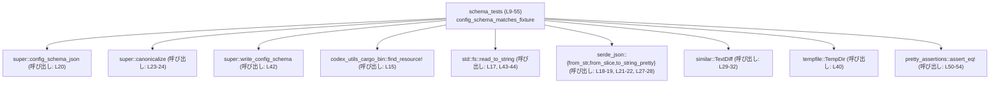
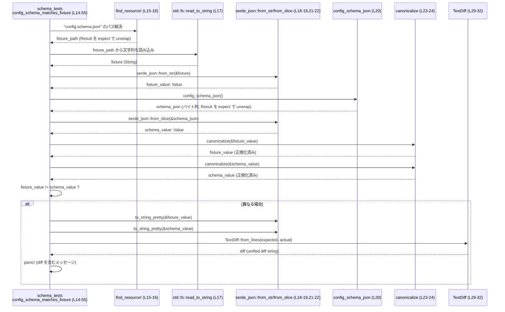
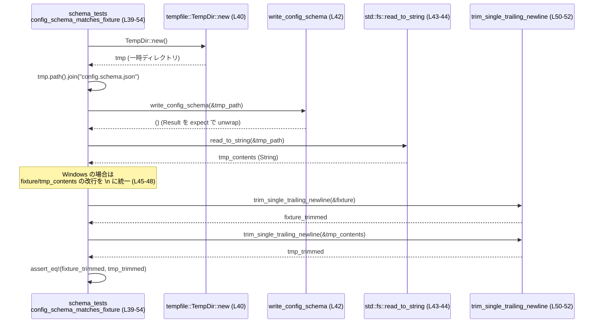

# core/src/config/schema_tests.rs

## 0. ざっくり一言

`config.toml` 用の JSON スキーマ (`config.schema.json`) が、リポジトリに保存されているフィクスチャと現在の実装から生成されるスキーマとで **完全に一致しているか** を検証するテストモジュールです。

---

## 1. このモジュールの役割

### 1.1 概要

- このモジュールは **設定スキーマの整合性のチェック** を行うテストを提供します。
- フィクスチャ (`config.schema.json` のリソース) と、コードから生成したスキーマを比較し、内容（正規化された JSON）とファイル内容（改行差分を吸収しつつほぼバイト単位）を検証します。

### 1.2 アーキテクチャ内での位置づけ

このモジュールは `core::config` モジュールのテスト用サブモジュールであり、同じモジュール階層の関数（`canonicalize`, `config_schema_json`, `write_config_schema`）を呼び出して検証を行います。

依存関係の概要を Mermeid 図で示します（行番号はこのファイル内の出現位置です）。



> `canonicalize`, `config_schema_json`, `write_config_schema` の定義はこのチャンクには現れず、詳細は不明です。

### 1.3 設計上のポイント

- **二段階の検証**  
  1. JSON を正規化した上での「意味的な同一性」の比較（`canonicalize` 経由, schema_tests.rs:L18-26）。  
  2. ファイルとして生成したスキーマとフィクスチャの **文字列としての完全一致**（末尾の改行・Windows 改行を調整, schema_tests.rs:L39-54）。

- **詳細な差分メッセージ**  
  - 差分がある場合、`similar::TextDiff` による unified diff を含めた `panic!` メッセージを出します（schema_tests.rs:L26-36）。

- **クロスプラットフォーム配慮**  
  - Windows とそれ以外で改行コードが異なる問題を `#[cfg(windows)]` ガード付きで吸収しています（schema_tests.rs:L45-48）。

- **テスト前提のエラーハンドリング**  
  - すべての I/O やシリアライズは `expect` や `panic!` により失敗時にテストを即座に失敗させる方針です（例: schema_tests.rs:L15-22, L40-44）。

---

## 2. コンポーネント一覧（インベントリ）

### 2.1 このモジュール内の関数

| 名前 | 種別 | 役割 / 用途 | 定義位置 |
|------|------|-------------|----------|
| `trim_single_trailing_newline` | 関数 | 末尾に 1 つだけ存在する `\n` を取り除いた `&str` を返すヘルパー。文字列比較時に末尾改行差分を吸収するために使用。 | `schema_tests.rs:L9-11` |
| `config_schema_matches_fixture` | テスト関数 (`#[test]`) | フィクスチャのスキーマと、実装から生成されるスキーマが同一であることを検証するメインテスト。 | `schema_tests.rs:L13-55` |

### 2.2 依存コンポーネント一覧（このチャンクから見えるもの）

| 名前 | 種別 | 役割 / 用途 | 使用位置 |
|------|------|-------------|----------|
| `super::canonicalize` | 関数（詳細不明） | JSON 値を「正規化」して比較しやすくする処理に用いられています。キー順序の統一などを行っていると推測できますが、このチャンクには実装がありません。 | `schema_tests.rs:L1, L23-24` |
| `super::config_schema_json` | 関数（詳細不明） | 現在のコードから `config.schema.json` 相当の JSON をシリアライズし、バイト列として取得するために使用。失敗時は `Result` が `Err` になり `expect` でパニックします。 | `schema_tests.rs:L2, L20` |
| `super::write_config_schema` | 関数（詳細不明） | 指定したパスに `config.schema.json` ファイルを書き出すために使用。 | `schema_tests.rs:L3, L42` |
| `codex_utils_cargo_bin::find_resource!` | マクロ | ビルドに埋め込まれたリソースから `config.schema.json` フィクスチャファイルのパスを解決するために使用。戻り値は `Result` と推測されますが詳細は不明。 | `schema_tests.rs:L15` |
| `pretty_assertions::assert_eq!` | マクロ | 最終的なファイル内容比較で、期待値と実際の値が異なる場合に見やすい diff を表示しつつテストを失敗させる。 | `schema_tests.rs:L50-54` |
| `similar::TextDiff` | 構造体 | 差分検出ライブラリ。正規化後 JSON 文字列の差分を unified diff 形式で生成するために使用。 | `schema_tests.rs:L29-32` |
| `tempfile::TempDir` | 構造体 | 一時ディレクトリを作成し、その中にスキーマファイルを生成・検証するために使用。スコープを抜けると自動削除されます。 | `schema_tests.rs:L7, L40-41` |
| `std::fs::read_to_string` | 関数 | フィクスチャファイルと、一時ディレクトリに生成したスキーマファイルを文字列として読み込む。 | `schema_tests.rs:L17, L43-44` |
| `serde_json::{from_str, from_slice, to_string_pretty}` | 関数群 | JSON 文字列／バイト列と `serde_json::Value` との相互変換、および整形文字列への変換に使用。 | `schema_tests.rs:L18-19, L21-22, L27-28` |

> 上記依存コンポーネントの実装はこのチャンクには存在しないため、役割説明は名称と使用方法に基づく範囲に留めています。

---

## 3. 公開 API と詳細解説

このファイルはテストモジュールであり、外部に公開される API (`pub` 関数や型) は定義されていません。ここではモジュール内で重要な 2 つの関数について詳しく説明します。

### 3.1 型一覧

このチャンクには、新たに定義された構造体・列挙体・型エイリアスはありません（`serde_json::Value` などは外部クレートの型です）。

### 3.2 関数詳細

#### `trim_single_trailing_newline(contents: &str) -> &str`

**概要**

- 引数の文字列の末尾に **ちょうど 1 つ** の改行文字 `\n` が存在する場合に、それを取り除いたスライスを返します（schema_tests.rs:L9-11）。
- 末尾に改行がない、または 2 つ以上続いている場合には、そのままのスライスを返します。

**引数**

| 引数名 | 型 | 説明 |
|--------|----|------|
| `contents` | `&str` | 末尾の改行を 1 個だけ削除対象とする元の文字列。 |

**戻り値**

- 型: `&str`
- 意味: `contents` と同じデータを指すスライスですが、`contents` の末尾が `"\n"` で終わっていれば、その 1 文字を除いた範囲を指します（schema_tests.rs:L10）。

**内部処理の流れ**

1. `contents.strip_suffix('\n')` を呼び出し、末尾が `\n` の場合はその 1 文字を取り除いたスライスを `Some` として受け取ります（schema_tests.rs:L10）。
2. `unwrap_or(contents)` によって、`Some` の場合は改行削除後のスライス、`None` の場合は元の `contents` を返します（schema_tests.rs:L10）。

**Examples（使用例）**

この関数はテスト内で、生成ファイルとフィクスチャの末尾改行差分を吸収するために使われています（schema_tests.rs:L50-52）。

```rust
// フィクスチャと生成結果の末尾改行のみを無視して比較する
assert_eq!(
    trim_single_trailing_newline(&fixture),       // 末尾の \n を 1 つだけ無視
    trim_single_trailing_newline(&tmp_contents),  // 同上
);
```

**Errors / Panics**

- この関数内ではパニックを起こしません。
- 参照スライスの返却のみであり、`strip_suffix` と `unwrap_or` はパニックしない形で使われています。

**Edge cases（エッジケース）**

- `contents` が空文字列 `""` の場合: そのまま `""` を返します。
- `contents` が `"abc\n"` の場合: `"abc"` を指すスライスを返します。
- `contents` が `"abc\n\n"` の場合: 末尾の 1 文字のみ `\n` とみなされるため `"abc\n"` を返します（`strip_suffix` は 1 回のみ削除）。
- `contents` が `"\n"` の場合: `""` を返します。

**使用上の注意点**

- 戻り値は **元の `contents` と同じライフタイム** を持ちます。元の文字列がスコープを抜けると参照は無効になります（Rust の参照の一般的な制約）。
- 末尾の改行が複数ある場合に **1 つだけ** を削除する挙動である点に注意が必要です。

---

#### `config_schema_matches_fixture()`

**概要**

- `#[test]` 属性を持つテスト関数です（schema_tests.rs:L13）。
- 以下の 2 点を検証します（schema_tests.rs:L14-54）。
  1. フィクスチャの JSON と、`config_schema_json()` が生成する JSON が、正規化後に等しいこと。
  2. `write_config_schema()` が実際に生成する `config.schema.json` ファイルが、フィクスチャファイルと **内容的に完全一致** していること（末尾改行・改行コードの違い以外）。

**引数**

- なし（テスト関数なので引数を取りません）。

**戻り値**

- 戻り値は `()` です。テストが成功すれば通常終了し、失敗条件では `panic!` や `expect` によるパニックでテストが失敗します。

**内部処理の流れ**

前半（正規化 JSON 比較, schema_tests.rs:L15-37）:

1. `codex_utils_cargo_bin::find_resource!("config.schema.json")` でフィクスチャファイルのパスを取得し、`expect` で解決失敗をテストエラーとします（schema_tests.rs:L15-16）。
2. そのパスから `std::fs::read_to_string` で内容を読み込みます（schema_tests.rs:L17）。
3. 読み込んだ文字列を `serde_json::from_str` で `serde_json::Value` にパースします（schema_tests.rs:L18-19）。
4. `config_schema_json()` を呼び出し、現在の実装から生成したスキーマ JSON のバイト列を取得します（schema_tests.rs:L20）。
5. そのバイト列を `serde_json::from_slice` で `serde_json::Value` に変換します（schema_tests.rs:L21-22）。
6. フィクスチャ側・生成側の `Value` をそれぞれ `canonicalize` に通し、比較用の正規化値を得ます（schema_tests.rs:L23-24）。
7. `if fixture_value != schema_value` で比較し、異なる場合は:
   - `serde_json::to_string_pretty` で両者を整形 JSON 文字列に変換します（schema_tests.rs:L26-28）。
   - `TextDiff::from_lines(&expected, &actual)` で unified diff を作成し、`to_string()` で文字列にします（schema_tests.rs:L29-32）。
   - 差分を埋め込んだ `panic!` メッセージを生成し、テストを失敗させます（schema_tests.rs:L33-36）。

後半（生成ファイルとフィクスチャの完全一致, schema_tests.rs:L39-54）:

1. `TempDir::new()` で一時ディレクトリを作成します（schema_tests.rs:L40）。
2. そのディレクトリに `config.schema.json` という名前でパスを作成します（schema_tests.rs:L41）。
3. `write_config_schema(&tmp_path)` を呼び出し、上記パスにスキーマファイルを書き出します（schema_tests.rs:L42）。
4. `std::fs::read_to_string(&tmp_path)` で生成されたファイルを読み込みます（schema_tests.rs:L43-44）。
5. Windows 環境の場合のみ、`fixture` と `tmp_contents` に対して `\r\n` を `\n` に置き換えます（schema_tests.rs:L45-48）。
6. `trim_single_trailing_newline` を両方に適用した上で `assert_eq!` で比較し、一致しなければテストを失敗させます（schema_tests.rs:L50-54）。

**Examples（使用例）**

この関数自体がテストエントリポイントのため、別途呼び出すコードを書く機会は通常ありません。実行例としては、プロジェクトルートで:

```bash
# Rust 標準のテストランナーを使ってこのテストを実行
cargo test -- core::config::schema_tests::config_schema_matches_fixture
```

のようにテスト名を指定して実行します（モジュールパスはプロジェクト構成に依存し、このチャンクからは正確には分かりません）。

**Errors / Panics**

この関数は多くの箇所で `expect` と `panic!` を使っています。いずれも「テストが失敗する」ためのものであり、ランタイムエラーが**安全に顕在化する**ようになっています。

主なパニック要因（すべてテスト失敗）:

- リソースパス解決失敗（`find_resource!().expect(...)`）: `schema_tests.rs:L15-16`
- フィクスチャファイル読み込み失敗（`read_to_string(...).expect(...)`）: `schema_tests.rs:L17`
- フィクスチャ JSON パース失敗（`from_str(...).expect(...)`）: `schema_tests.rs:L18-19`
- 実装側スキーマ JSON 生成失敗（`config_schema_json().expect(...)`）: `schema_tests.rs:L20`
- 実装側スキーマ JSON デコード失敗（`from_slice(...).expect(...)`）: `schema_tests.rs:L21-22`
- 正規化後の JSON が異なる場合の `panic!`（`schema_tests.rs:L25-36`）
- 一時ディレクトリ作成失敗（`TempDir::new().expect(...)`）: `schema_tests.rs:L40`
- 生成スキーマファイル書き込み失敗（`write_config_schema(...).expect(...)`）: `schema_tests.rs:L42`
- 生成スキーマファイル読み込み失敗（`read_to_string(...).expect(...)`）: `schema_tests.rs:L43-44`
- 最終的なファイル内容の不一致（`assert_eq!`）: `schema_tests.rs:L50-54`

**Edge cases（エッジケース）**

- **フィクスチャ JSON のフィールド順序が変わる場合**  
  - `canonicalize` によってフィールド順序などの非本質的な差異が吸収される設計と考えられます（schema_tests.rs:L23-24）。  
  - `canonicalize` の具体的な挙動はこのチャンクからは不明ですが、「比較用の正規化」という名称と文脈から推測できます。

- **改行コードの違い**  
  - Windows では `\r\n` を、その他環境では `\n` を用いるため、`#[cfg(windows)]` ブロックで `\r\n` → `\n` に変換して比較します（schema_tests.rs:L45-48）。

- **末尾に余分な改行がある場合**  
  - `trim_single_trailing_newline` を通すことで、末尾に 1 つだけ付いた改行は無視して比較します（schema_tests.rs:L50-52）。

- **一時ディレクトリの権限やファイルシステムエラー**  
  - `TempDir::new()` やファイル書き込み・読み込みが失敗した場合は、いずれも `expect` によりテストが失敗します（schema_tests.rs:L40-44）。

**使用上の注意点**

- この関数は **Rust のテストランナーが呼ぶ前提** で設計されており、アプリケーションコードから直接呼び出すことを意図していません。
- 外部依存（`canonicalize`, `config_schema_json`, `write_config_schema`）の仕様変更により、テストを通すためにフィクスチャの更新が必要になる場合があります。その際は `panic!` メッセージにあるとおり、`just write-config-schema` で生成し直す運用が想定されています（メッセージ文言: schema_tests.rs:L33-36）。
- ファイル I/O などはすべて同期的であり、並行処理（スレッド・非同期処理）は使用していません。

### 3.3 その他の関数

- このチャンクには、上記以外のローカル関数やメソッドは存在しません。

---

## 4. データフロー

このセクションでは、テスト `config_schema_matches_fixture` 実行時のデータの流れを、シーケンス図で示します。

### 4.1 正規化 JSON 比較のフロー



### 4.2 ファイル内容の完全一致チェックのフロー



---

## 5. 使い方（How to Use）

### 5.1 基本的な使用方法

このモジュールは **ユニットテスト** として利用されます。通常の開発フローでは、次のようにしてテスト全体またはこのテストのみを実行します。

```bash
# プロジェクト全体のテストを実行（このモジュールのテストも含まれる）
cargo test

# （モジュールパスが分かる場合）特定のテストのみ実行
cargo test -- config_schema_matches_fixture
```

- これにより、`config.schema.json` フィクスチャと現在の実装が矛盾していないかが自動的に検証されます。

### 5.2 よくある使用パターン

- **設定スキーマの変更時**
  1. `config.toml` のスキーマを変更するコード（おそらく `super::config_schema_json` / `super::write_config_schema` の実装）を編集する。
  2. `just write-config-schema`（panic メッセージで案内されているコマンド, schema_tests.rs:L33-36）で新しいスキーマファイルを生成し、フィクスチャを更新する。
  3. `cargo test` を再実行し、このテストが通ることを確認する。

  このチャンクには `just` コマンドやそのターゲットの定義は現れませんが、メッセージから「フィクスチャの更新用コマンド」として利用されることが分かります。

### 5.3 よくある間違い（想定されるもの）

このチャンクから推測できる、誤用・勘違いのパターンです。

```rust
// 誤りの例: スキーマ生成コードを変更したが、フィクスチャを更新していない
// 結果: config_schema_matches_fixture が失敗し、差分の unified diff が表示される。

// 正しい運用例: スキーマ実装を変更した後にフィクスチャを更新
// 1. スキーマ生成コードを編集
// 2. `just write-config-schema` で config.schema.json を再生成
// 3. git でフィクスチャの差分を確認し、意図どおりならコミット
// 4. `cargo test` でテストを通す
```

### 5.4 使用上の注意点（まとめ）

- **前提条件**
  - `config.schema.json` フィクスチャがビルドリソースとして正しく配置・登録されている必要があります（`find_resource!` 前提, schema_tests.rs:L15）。
  - `super::config_schema_json` と `super::write_config_schema` の実装が、同じスキーマを表現している必要があります（前半・後半で利用, schema_tests.rs:L20, L42）。

- **エラー・パニック**
  - すべての異常は `expect` / `panic!` / `assert_eq!` を通じて **テスト失敗** として扱われます。これは Rust のテストとして一般的なパターンです。

- **並行性**
  - このテストは一時ディレクトリとファイルに対して書き込みを行いますが、`TempDir` により一意なパスが確保されるため、テストが並列に実行されてもファイル名の衝突は起きにくい構造です（schema_tests.rs:L40-42）。
  - テスト内にはスレッド生成や `async` はなく、すべて同期的な処理です。

---

## 6. 変更の仕方（How to Modify）

### 6.1 新しい機能を追加する場合

このモジュールに追加する可能性がある「新しいテスト」や「ヘルパー関数」についてのガイドです。

- **別のスキーマファイルを検証したい場合**
  1. 新しいフィクスチャリソース（例: `other_config.schema.json`）をプロジェクトに追加する。
  2. `codex_utils_cargo_bin::find_resource!` を新しいリソース名で呼ぶテスト関数を追加する（`config_schema_matches_fixture` と同様の流れ, schema_tests.rs:L15-22,39-54 を参考）。
  3. 対応する `super::write_config_schema` に相当する関数・コマンドを実装し、テストから呼び出す。

- **正規化ルールを変更したい場合**
  - `canonicalize` の定義はこのチャンクには現れませんが、そこで実施する正規化（例えばキー順序の固定化）を変更し、それに応じてこのテストの期待結果（フィクスチャ）を更新する必要があります。

### 6.2 既存の機能を変更する場合

- **`config_schema_matches_fixture` のロジック変更**
  - 影響範囲:
    - スキーマ生成ロジック（`config_schema_json`, `write_config_schema`）
    - フィクスチャファイル (`config.schema.json`)
  - 注意すべき契約:
    - 「正規化後の JSON が等しいこと」と「実際のファイル内容が等しいこと」の両方を検証する、という二重のチェックを維持するかどうか（schema_tests.rs:L23-24, L50-54）。
    - Windows と Unix 系 OS で改行コードの違いを吸収する挙動（schema_tests.rs:L45-48）。

- **`trim_single_trailing_newline` を変更する場合**
  - 仕様変更（例: 末尾のすべての改行を削除するなど）を行うと、フィクスチャと生成ファイルの比較条件が変わります。
  - 他の場所で再利用される可能性も考慮し、コメントで仕様を明示しておくと安全です。

- **テスト内容を増やす場合**
  - 新たなテスト関数を追加する際は、ファイル I/O の競合を避けるため `TempDir` のような一時ディレクトリを利用するパターン（schema_tests.rs:L40-43）を踏襲するのが安全です。

---

## 7. 関連ファイル

このチャンクでは、`super` モジュール由来の関数に依存していることが分かりますが、その定義ファイルは明示されていません。

| パス / モジュール（推測を含む） | 役割 / 関係 |
|---------------------------------|------------|
| `core/src/config/*` のいずれか（推定） | `super::canonicalize`, `super::config_schema_json`, `super::write_config_schema` が定義されていると考えられるモジュール。現在の設定スキーマの生成ロジックを提供します。ただし、このチャンクには具体的なファイルパスは現れません。 |
| `config.schema.json`（ビルドリソース） | `codex_utils_cargo_bin::find_resource!` により参照されるスキーマフィクスチャ。現在の実装と比較して整合性を検証する対象です（schema_tests.rs:L15-18）。 |
| `justfile`（推定） | `panic!` メッセージ内で `just write-config-schema` が案内されているため、`config.schema.json` を生成する `just` タスクが定義されていると推測されますが、このチャンクにはその内容は現れません（schema_tests.rs:L33-36）。 |

> これら関連ファイル・モジュールの詳細な内容は、このチャンクには含まれていないため、「推測」レベルに留めています。
