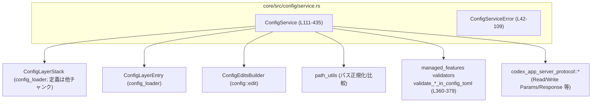
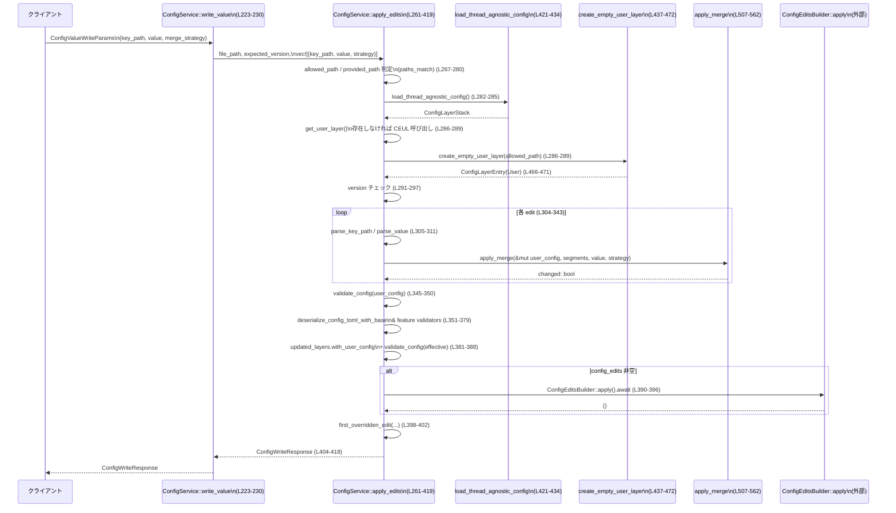

core/src/config/service.rs

---

## 0. ざっくり一言

ユーザー設定ファイル（`config.toml`）を含む複数レイヤーの設定を読み書きし、**安全にマージ・検証して永続化するサービス層**を提供するモジュールです。  
外部 API 型（`codex_app_server_protocol`）と内部 TOML 設定の橋渡しも行います。

---

## 1. このモジュールの役割

### 1.1 概要

- このモジュールは、Codex の設定を
  - ユーザー設定
  - システム / プロジェクト / セッションフラグ / MDM などの各設定レイヤー  
 から統合して扱うためのサービスを提供します。
- 主な責務は次のとおりです。
  - 設定レイヤーの読み出しと API 用構造体（`ApiConfig`）への変換  
    （`ConfigService::read`、`load_user_saved_config`）（L153-205, L246-259）
  - ユーザー設定ファイルへの **単一 / バッチ書き込み** と TOML マージ・検証・永続化  
    （`write_value`、`batch_write`、内部コア `apply_edits`）（L223-244, L261-419）
  - 設定要件（requirements）の読み出し（L207-221）
  - 上位レイヤーによりユーザー設定が上書きされている場合のメタデータ生成  
    （`compute_override_metadata` 等）（L681-709, L712-735）

### 1.2 アーキテクチャ内での位置づけ

ConfigService は「設定サービス層」として、設定レイヤー管理・ファイル I/O・パス解決など複数コンポーネントをまとめています。



- 読み出し系 (`read`, `read_requirements`, `load_user_saved_config`) は `ConfigLayerStack` を利用してレイヤーを構築します（L153-178, L207-215, L246-255）。
- 書き込み系 (`write_value`, `batch_write`) は内部で `apply_edits` を呼び出し、`ConfigEditsBuilder` を経由して `config.toml` を永続化します（L223-244, L390-396）。
- パスのチェックやシンボリックリンク対応は `path_utils` と `resolve_symlink_write_paths` を通じて行われます（L267-275, L437-444）。
- エラーはすべて `ConfigServiceError` にまとめられ、呼び出し元に一貫した形で返されます（L42-109, L80-101）。

### 1.3 設計上のポイント

- **レイヤー化された設定モデル**  
  - `ConfigLayerStack` により、ユーザー・システム・プロジェクト・MDM・セッションフラグなど複数レイヤーの設定を管理します（L153-180, L381-383, L681-700）。
- **書き込み対象の厳格な制限**  
  - 書き込みは `CONFIG_TOML_FILE` を `codex_home` から解決した「ユーザー設定ファイル」のみ許可されます（L267-280）。
- **楽観的ロックによる競合検知**  
  - `expected_version` と実際のユーザーレイヤーの `version` を比較し、競合時は `ConfigVersionConflict` を返します（L291-297）。
- **TOML ベースの厳密な検証**  
  - ユーザー設定と全体の effective 設定の両方について、`ConfigToml` への `try_into` による型検証と feature 要件検証を行います（L345-359, L360-379, L381-388）。
- **安全な I/O と非同期実装**  
  - 非同期 I/O (`tokio::fs`) と `spawn_blocking` によるブロッキング書き込みのオフロードを併用し、Tokio ランタイム上で安全に動作します（L446-452, L474-479）。
- **ユーザー設定が上位レイヤーにより上書きされていることの通知**  
  - `compute_override_metadata` と `first_overridden_edit` で、ユーザーが書いた値が別レイヤーにより上書きされている場合に詳細メッセージとメタデータを返します（L681-709, L712-722, L653-678）。

---

## 2. 主要な機能一覧

- 設定の読み出し: 有効な設定 (`effective_config`) を API 用構造体 `ApiConfig` として返す（L153-205）。
- 設定要件の読み出し: `ConfigRequirementsToml` を必要に応じて返す（L207-221）。
- ユーザー設定の永続化:
  - 単一キー書き込み (`write_value`)（L223-230）
  - 複数キー書き込み (`batch_write`)（L232-244）
- TOML 設定のマージと削除:
  - JSON 値を TOML に変換 (`parse_value`)（L481-489）
  - ドット区切りパスの解析 (`parse_key_path`)（L491-499）
  - マージ戦略 `MergeStrategy` に基づく設定値更新 (`apply_merge`, `clear_path`)（L507-562, L564-585）
- 設定の検証と feature 要件チェック (`validate_config`, `validate_*_in_config_toml`)（L626-629, L360-379）
- ユーザー設定ファイルの作成/読み込み（シンボリックリンク対応含む）  
  (`create_empty_user_layer`, `write_empty_user_config`)（L437-472, L474-479）
- 上位レイヤーによる上書きメタデータの生成  
  (`override_message`, `compute_override_metadata`, `first_overridden_edit`, `find_effective_layer`)（L653-678, L681-709, L712-735）

---

## 3. 公開 API と詳細解説

### 3.1 型一覧（構造体・列挙体など）

| 名前 | 種別 | 役割 / 用途 | 定義位置 |
|------|------|-------------|----------|
| `ConfigServiceError` | 列挙体 | 設定サービス全体で発生するエラーを分類（書き込みエラー / I/O / JSON / TOML / その他）して表現する。 | `core/src/config/service.rs:L42-109` |
| `ConfigService` | 構造体 | 設定レイヤーの読み出し・ユーザー設定の書き込みを行うサービスオブジェクト。`codex_home` や CLI オーバーライド、クラウド要件ローダーを内部に保持する。 | `core/src/config/service.rs:L111-117` |
| `MergeError` | 列挙体（内部） | `apply_merge` / `clear_path` 内部でのパス不在や検証エラーを表す内部用エラー。外部には `ConfigServiceError::Write` として変換される。 | `core/src/config/service.rs:L501-505` |

※ `ConfigLayerStack`, `ConfigLayerEntry` などは他モジュールで定義されており、このチャンクには定義が現れません。

### 3.2 関数詳細（主要 7 件）

#### 1. `ConfigService::read(&self, params: ConfigReadParams) -> Result<ConfigReadResponse, ConfigServiceError>`  

（`core/src/config/service.rs:L153-205`）

**概要**

- 設定レイヤーを構築し、最終的な有効設定を `ApiConfig` として返す読み出し API です。
- 必要に応じて、各レイヤーの情報もレスポンスに含めます（`include_layers` フラグ）（L191-203）。

**引数**

| 引数名 | 型 | 説明 |
|--------|----|------|
| `params` | `ConfigReadParams` | カレントディレクトリ `cwd`（プロジェクトルート推定に利用）や `include_layers` などの読み出しオプション（L157-178, L191-203）。 |

**戻り値**

- `Ok(ConfigReadResponse)`  
  - `config`: 有効設定を API 用構造体に変換したもの（L186-189）。  
  - `origins`: 設定値ごとの起源情報（`layers.origins()`）（L191-193）。  
  - `layers`: `include_layers == true` の場合に、レイヤー一覧を `ConfigLayerStackOrdering::HighestPrecedenceFirst` で返す（L194-203）。
- `Err(ConfigServiceError)`  
  - パス解決 / 設定読み込み / シリアライズ / デシリアライズに失敗した場合。

**内部処理の流れ**

1. `params.cwd` の有無で処理分岐（L157-178）。
   - `Some(cwd)` の場合:
     - `AbsolutePathBuf::try_from` で絶対パスに変換（L159-161）。
     - `crate::config::ConfigBuilder` を用いて設定レイヤーをビルド（`codex_home`, CLI オーバーライド, loader overrides, fallback_cwd, cloud_requirements を反映）（L162-173）。
   - `None` の場合:
     - `load_thread_agnostic_config()` を呼び出し、カレントディレクトリに依存しないレイヤーを読み込む（L175-177, L424-434）。
2. `layers.effective_config()` で有効な TOML 値を取得（L180-183）。
3. `ConfigToml` への `try_into` で構造検証（L182-184）。
4. `ConfigToml` を JSON にシリアライズし、`ApiConfig` にデシリアライズして API 用型に変換（L186-189）。
5. `ConfigReadResponse` を組み立てて返す（L191-204）。

**Examples（使用例）**

```rust
use crate::config::service::ConfigService;
use codex_app_server_protocol::ConfigReadParams;

#[tokio::main]
async fn main() -> Result<(), Box<dyn std::error::Error>> {
    // Codex のホームディレクトリを指定
    let codex_home = std::path::PathBuf::from("/path/to/codex_home"); // ConfigService に渡す codex_home

    // デフォルト設定でサービスを構築
    let service = ConfigService::new_with_defaults(codex_home);       // L134-141

    // スレッド非依存の設定を読み出す（cwd: None）
    let params = ConfigReadParams {
        cwd: None,                     // プロジェクトルートに紐づかない読み出し
        include_layers: true,          // レイヤー情報も欲しい場合
        ..Default::default()
    };

    let resp = service.read(params).await?;                            // L153-205
    println!("effective config: {:?}", resp.config);                   // 有効設定の確認

    Ok(())
}
```

**Errors / Panics**

- `Io` エラー (`ConfigServiceError::Io`)（L87-89）
  - `cwd` の絶対パス化失敗（L159-161）。
  - 設定レイヤー読み込み失敗（ConfigBuilder::build や `load_thread_agnostic_config` が `Err`）（L169-172, L175-177）。
- `Toml` エラー
  - `effective_config` を `ConfigToml` に変換できない場合（L182-184）。
- `Json` エラー
  - `ConfigToml` から JSON/`ApiConfig` への変換に失敗した場合（L186-189）。
- 本関数内に `panic!` は登場しません。

**Edge cases（エッジケース）**

- `cwd == None` の場合  
  - 「thread-agnostic」設定として、リポジトリ内 `.codex/` を含まないレイヤーが読み込まれます（コメント, L421-424）。
- `include_layers == false` の場合  
  - `layers` フィールドは `None` になります（L194-203）。

**使用上の注意点**

- 非同期関数のため、Tokio などの非同期ランタイム上で `.await` する必要があります。
- `ConfigReadParams` の追加フィールド（このチャンクには現れません）がある場合、それらの扱いは外部型定義に依存します。

---

#### 2. `ConfigService::write_value(&self, params: ConfigValueWriteParams) -> Result<ConfigWriteResponse, ConfigServiceError>`  

（`core/src/config/service.rs:L223-230`）

**概要**

- 単一の `key_path` に対する設定値を書き込むための公開 API です。
- 実処理は内部の `apply_edits` に委譲されます（L227-229）。

**引数**

| 引数名 | 型 | 説明 |
|--------|----|------|
| `params` | `ConfigValueWriteParams` | 書き込み先パス（`key_path`）、値（`value`）、マージ戦略（`merge_strategy`）、対象ファイル（`file_path`）、期待バージョン（`expected_version`）などを含む（L223-229）。 |

**戻り値**

- `Ok(ConfigWriteResponse)`  
  - 書き込み結果ステータス `status`（`Ok` / `OkOverridden`）や、更新後バージョン `version`、`overridden_metadata` を含む（L404-418）。
- `Err(ConfigServiceError)`  
  - パス不正 / バージョン不一致 / 検証エラー / I/O など。

**内部処理の流れ**

1. 引数 `params` から `(key_path, value, merge_strategy)` のタプルを 1 個だけ持つ `Vec` を作成（L227-228）。
2. `apply_edits(params.file_path, params.expected_version, edits)` を呼び出し、結果をそのまま返す（L227-229）。

**Examples（使用例）**

```rust
use crate::config::service::ConfigService;
use codex_app_server_protocol::{ConfigValueWriteParams, MergeStrategy};

async fn enable_feature(
    svc: &ConfigService,
    version: Option<String>,
) -> Result<(), crate::config::service::ConfigServiceError> {
    // "features.experimental" キーを true に設定
    let params = ConfigValueWriteParams {
        key_path: "features.experimental".to_string(),      // ドット区切り keyPath（L491-499）
        value: serde_json::json!(true),                    // JSON 経由で TOML ブール値に変換（L481-488）
        merge_strategy: MergeStrategy::Replace,            // 上書き戦略
        file_path: None,                                   // デフォルトのユーザー config.toml を対象（L267-273）
        expected_version: version,                         // 楽観ロック用
        ..Default::default()
    };

    let resp = svc.write_value(params).await?;             // L223-230
    println!("new version = {}", resp.version);
    Ok(())
}
```

**Errors / Panics**

- `ConfigServiceError::Write` with:
  - `ConfigLayerReadonly`（許可されないファイルパスへの書き込み要求）（L275-280）。
  - `ConfigVersionConflict`（期待バージョンと実バージョンが異なる）（L291-297）。
  - `ConfigValidationError` / `ConfigPathNotFound` など（L305-323, L345-379）。
- `ConfigServiceError::Io` / `Anyhow` など（`apply_edits` 内で説明）。

**Edge cases**

- `params.value` が JSON `null` の場合は、そのパスの値を削除する操作になります（`parse_value` が `None` を返す, L481-484）。

**使用上の注意点**

- `key_path` は空文字列であってはならず、`.` 区切りで階層を表します（L491-499）。
- 配列インデックス指定は文字列を整数にパースして行われます（L643-645）ので、負数や非数値は使用できません。
- 楽観ロックを利用する場合は、直前の `read` などで取得したバージョンを `expected_version` に指定する必要があります（L291-297）。

---

#### 3. `ConfigService::batch_write(&self, params: ConfigBatchWriteParams) -> Result<ConfigWriteResponse, ConfigServiceError>`  

（`core/src/config/service.rs:L232-244`）

**概要**

- 複数の `key_path` に対する設定値を **一括で書き込む** API です。
- まとめて `apply_edits` に渡すため、検証・永続化は 1 回で行われます（L236-243）。

**引数**

| 引数名 | 型 | 説明 |
|--------|----|------|
| `params` | `ConfigBatchWriteParams` | `edits: Vec<{ key_path, value, merge_strategy }>` に加え、`file_path` と `expected_version` を含みます（L232-240）。 |

**戻り値**

- `ConfigWriteResponse`（`write_value` と同様）。（L404-418）

**内部処理の流れ**

1. `params.edits` をイテレートし、`(key_path, value, merge_strategy)` のタプル `Vec` に変換（L236-240）。
2. `apply_edits(params.file_path, params.expected_version, edits)` を呼び出して結果を返す（L242-243）。

**Examples（使用例）**

```rust
use crate::config::service::ConfigService;
use codex_app_server_protocol::{ConfigBatchWriteParams, MergeStrategy};

async fn configure_two_values(
    svc: &ConfigService,
    version: Option<String>,
) -> Result<(), crate::config::service::ConfigServiceError> {
    let edits = vec![
        // 1つ目のキー
        codex_app_server_protocol::ConfigEdit {
            key_path: "features.experimental".into(),
            value: serde_json::json!(true),
            merge_strategy: MergeStrategy::Replace,
        },
        // 2つ目のキー
        codex_app_server_protocol::ConfigEdit {
            key_path: "logging.level".into(),
            value: serde_json::json!("debug"),
            merge_strategy: MergeStrategy::Replace,
        },
    ];

    let params = ConfigBatchWriteParams {
        edits,
        file_path: None,
        expected_version: version,
        ..Default::default()
    };

    let resp = svc.batch_write(params).await?;             // L232-244
    println!("status = {:?}", resp.status);
    Ok(())
}
```

**Errors / Panics**

- `apply_edits` と同じエラー条件がまとめて適用されます。
- 途中の 1 つの edit で検証エラーなどが起きると、その時点で `Err` を返し、それまでの変更は永続化されません（L304-343, L390-396）。

**Edge cases**

- `params.edits` が空の場合、`apply_edits` には空の `Vec` が渡されます。  
  - この場合でもバージョンチェックと検証は行われますが、`config_edits` が空なので `ConfigEditsBuilder` による永続化は行われません（L300-303, L390-396）。

**使用上の注意点**

- まとめて検証・永続化されるため、複数変更の一貫性を保ちたい場合に適しています。
- 大量の編集を渡すと、検証・マージコストが増える点に注意します（TOML 構造全体を何度も検証するため, L345-359, L381-388）。

---

#### 4. `ConfigService::apply_edits(&self, file_path: Option<String>, expected_version: Option<String>, edits: Vec<(String, JsonValue, MergeStrategy)>) -> Result<ConfigWriteResponse, ConfigServiceError>`  

（プライベートメソッド, `core/src/config/service.rs:L261-419`）

**概要**

- 書き込み API のコアロジックです。
- 以下を一連のフローとして実行します。
  - 書き込み対象ファイルパスの検証（ユーザー設定のみ許可）（L267-280）
  - 設定レイヤー読み込みとユーザーレイヤー抽出/作成（L282-289, L437-472）
  - 楽観ロックによるバージョンチェック（L291-297）
  - 各 edit のパース・マージ・差分抽出（L304-343）
  - 設定の検証・feature 要件チェック（L345-379, L381-388）
  - `ConfigEditsBuilder` による TOML ファイルへの永続化（L390-396）
  - 上書きメタデータの計算とレスポンス生成（L398-418）

**引数**

| 引数名 | 型 | 説明 |
|--------|----|------|
| `file_path` | `Option<String>` | ユーザー設定ファイルへの明示的パス。`None` の場合、`codex_home` から解決されたデフォルトの `config.toml` が使われる（L267-273）。 |
| `expected_version` | `Option<String>` | 楽観ロック用バージョン。`Some` の場合、ユーザーレイヤーの `version` と一致する必要がある（L291-297）。 |
| `edits` | `Vec<(String, JsonValue, MergeStrategy)>` | `(key_path, value, merge_strategy)` のリスト（L261-266, L304-343）。 |

**戻り値**

- `Ok(ConfigWriteResponse)`  
  - `status`: `Ok` もしくは、ユーザー値が他レイヤーにより上書きされた場合は `OkOverridden`（L398-402）。
  - `version`: 更新後のユーザーレイヤーバージョン（L406-415）。
  - `file_path`: 実際に書き込み対象とした `AbsolutePathBuf`（L416-417）。
  - `overridden_metadata`: 上書きされた最初のキーに対する詳細メタデータ（存在すれば）（L398-418）。
- `Err(ConfigServiceError)`  
  - 書き込み禁止・バージョン競合・パス不正・検証エラー・I/O エラー等。

**内部処理の流れ（要点）**

1. **書き込み対象パスの決定と検証**  
   - `CONFIG_TOML_FILE` を `codex_home` に対して解決し、許可されるパス `allowed_path` を求める（L267-268）。
   - `file_path` が `Some` の場合は絶対パスとして解釈し、`AbsolutePathBuf::from_absolute_path` でチェック（L269-272）。
   - `paths_match(&allowed_path, &provided_path)` で比較し、一致しなければ `ConfigLayerReadonly` による `Write` エラー（L275-280, L631-633）。

2. **設定レイヤーとユーザーレイヤーの取得 / 作成**  
   - `load_thread_agnostic_config` でレイヤーを読み込む（L282-285, L424-434）。
   - `layers.get_user_layer()` が `None` の場合は `create_empty_user_layer` で新規ユーザーレイヤーを作成（L286-289, L437-472）。

3. **バージョンチェック**  
   - `expected_version.as_deref()` と `user_layer.version` を比較し、不一致なら `ConfigVersionConflict`（L291-297）。

4. **編集の適用**  
   各 edit についてループ（L304-343）:
   - `parse_key_path` で `key_path` をセグメント配列に分割（L305-307, L491-499）。
   - `value_at_path` で元の値を取得し、後で差分判定に使用（L308-309, L635-650）。
   - `parse_value` で JSON から TOML 値（`Option<TomlValue>`）へ変換（L309-311, L481-489）。
   - `apply_merge` で指定のマージ戦略に従い値を適用（L313-324, L507-562）。
   - 値が変化していれば、`ConfigEdit::SetPath` または `ClearPath` を `config_edits` に追加（L326-340）。

5. **検証と feature 要件チェック**  
   - ユーザー設定のみを `validate_config`（`ConfigToml::try_into`）で検証（L345-350, L626-629）。
   - `deserialize_config_toml_with_base` で base 設定との統合を行い（L351-359）、  
     `validate_explicit_feature_settings_in_config_toml` / `validate_feature_requirements_in_config_toml` で feature 要件をチェック（L360-379）。

6. **effective 設定での再検証**  
   - `layers.with_user_config` でユーザー設定を差し替えた新しいレイヤーを作り（L381-382）、`effective_config` を再計算し検証（L382-388）。

7. **永続化**  
   - `config_edits` が非空であれば、`ConfigEditsBuilder::new(&self.codex_home).with_edits(config_edits).apply().await` により TOML ファイルへ書き込む（L390-396）。

8. **上書きメタデータの計算とレスポンス生成**  
   - `first_overridden_edit` で、ユーザーレイヤーの変更が他レイヤーにより上書きされている最初のキーを探す（L398-402, L712-722）。
   - `WriteStatus` と `overridden_metadata` を設定し、`ConfigWriteResponse` を返す（L398-418）。

**Examples（使用例）**

外部から直接呼び出すことはありませんが、`write_value` / `batch_write` から内部的に呼び出されます（L227-229, L242-243）。

**Errors / Panics**

- `ConfigServiceError::Write`（L276-279, L295-297, L305-323, L345-379, L409-413）
  - 書き込み禁止（`ConfigLayerReadonly`）
  - バージョン競合（`ConfigVersionConflict`）
  - keyPath 不正 / パス not found / 構造検証エラー（`ConfigValidationError`, `ConfigPathNotFound`）
  - ユーザーレイヤー取得失敗（`UserLayerNotFound`）（L409-413）
- `ConfigServiceError::Io`
  - ユーザー設定パス解決・設定読み込み・永続化処理での I/O エラー（L270-271, L283-285, L474-479）。
- `ConfigServiceError::Anyhow`
  - `ConfigEditsBuilder::apply` など、具体的なエラー型が様々な箇所のラップ（L332-333, L391-395）。
- `panic` は明示的には使用されていません。ただし、`ConfigEditsBuilder::apply` や `load_config_layers_state` 等外部関数の挙動はこのチャンクからは不明です。

**Edge cases**

- `edits` が空でも、バージョンチェック・検証は行われますが、`config_edits` が空のため TOML ファイルは書き換えられません（L300-303, L390-396）。
- `file_path` に絶対パス以外が渡された場合、`AbsolutePathBuf::from_absolute_path` が失敗し、I/O エラーとして扱われます（L269-272）。
- `key_path` が存在しない場合、削除操作 (`value == null`) は `MergeError::PathNotFound` となり、`ConfigPathNotFound` エラーに変換されます（L313-323, L564-585）。

**使用上の注意点**

- 書き込み対象はユーザー設定ファイルのみであり、他レイヤーの設定ファイルに直接書き込むことはできません（L275-280）。
- `expected_version` を使用せずに書き込むと、別クライアントによる更新と競合しても検知できません（L291-297）。
- `ConfigEditsBuilder` はファイルの差分書き込みを行うため、大きな config を頻繁に更新する場合のパフォーマンスに注意が必要です（外部実装のため詳細はこのチャンクには現れません）。

---

#### 5. `create_empty_user_layer(config_toml: &AbsolutePathBuf) -> Result<ConfigLayerEntry, ConfigServiceError>`  

（`core/src/config/service.rs:L437-472`）

**概要**

- ユーザーレイヤーが存在しない場合に呼び出され、  
  - 既存 `config.toml` があれば読み込み、
  - なければ空のユーザー設定ファイルを作成し、  
 その内容を持つ `ConfigLayerEntry` を返します。

**引数**

| 引数名 | 型 | 説明 |
|--------|----|------|
| `config_toml` | `&AbsolutePathBuf` | ユーザー `config.toml` の絶対パス（L437-439）。 |

**戻り値**

- `Ok(ConfigLayerEntry)`  
  - ソース `ConfigLayerSource::User { file: config_toml.clone() }` と TOML 値を持つレイヤーエントリ（L466-471）。
- `Err(ConfigServiceError)`  
  - シンボリックリンク解決エラー、ファイル読み書きエラー、TOML パースエラー。

**内部処理の流れ**

1. `resolve_symlink_write_paths(config_toml.as_path())` で、  
   - 読み取り用パス `read_path`（シンボリックリンクの解決結果）
   - 書き込み用パス `write_path`  
   を取得（L440-444）。
2. `read_path` の有無で分岐（L445-465）:
   - `Some(path)` の場合:
     - `tokio::fs::read_to_string` で既存ファイルを読み込む（L446-447）。
     - TOML としてパースし、`toml_value` とする（L447-449）。
     - ファイルが存在しない場合（`ErrorKind::NotFound`）は空ファイルを書き出し、空の TOML テーブルを返す（L450-453）。
   - `None` の場合:
     - `write_empty_user_config(write_path).await?` でファイルを新規作成し、空の TOML テーブルを返す（L461-464）。
3. `ConfigLayerEntry::new(ConfigLayerSource::User { file: config_toml.clone() }, toml_value)` を返す（L466-471）。

**Examples（使用例）**

外部コードから直接呼び出すのではなく、`apply_edits` 内でユーザーレイヤーが存在しない場合にのみ使用されます（L286-289）。

**Errors / Panics**

- `ConfigServiceError::Io`
  - シンボリックリンク解決失敗（L440-444）。
  - `read_to_string` 失敗（`NotFound` 以外）（L446-459）。
  - 空ファイル作成 (`write_empty_user_config`) 失敗（L450-453, L461-464, L474-479）。
- `ConfigServiceError::Toml`
  - 既存ファイルの TOML パースに失敗した場合（L447-449）。

**Edge cases**

- シンボリックリンク構成が複雑な場合でも、`resolve_symlink_write_paths` により正しい読み書きパスを使うようになっています（L440-444）。
- 既存ファイルが空の場合、`toml::from_str` がどう振る舞うかはこのチャンクからは分かりません。

**使用上の注意点**

- シンボリックリンクに対応するため、`config_toml` のパスを直接書き込みには使用していません。  
  書き込みは常に `write_path` 経由で行われます（L440-444, L474-479）。
- 非同期関数であり、I/O が絡むためエラー処理を必ず行う必要があります。

---

#### 6. `apply_merge(root: &mut TomlValue, segments: &[String], value: Option<&TomlValue>, strategy: MergeStrategy) -> Result<bool, MergeError>`  

（`core/src/config/service.rs:L507-562`）

**概要**

- TOML 値ツリー `root` に対して、`segments` で指定されたパスに `value` を適用する内部マージ処理です。
- `MergeStrategy::Upsert` の場合、既存値がテーブル同士なら再帰的にマージします（L547-553）。

**引数**

| 引数名 | 型 | 説明 |
|--------|----|------|
| `root` | `&mut TomlValue` | ルートとなる TOML 値（通常はユーザー設定全体）（L508-509）。 |
| `segments` | `&[String]` | ドット区切り `key_path` を分割したパスセグメント（L509-511）。 |
| `value` | `Option<&TomlValue>` | 新しい値。`None` の場合は削除操作として扱われます（L513-515）。 |
| `strategy` | `MergeStrategy` | マージ戦略（Upsert / Replace など。具体的なバリアントはこのチャンクには現れません）（L511-512）。 |

**戻り値**

- `Ok(bool)`  
  - `true`: 実際に値が変更された。  
  - `false`: マージの結果、値に変化がなかった。
- `Err(MergeError)`  
  - パスが存在しない（削除時）または検証エラー（`keyPath` 空、親がテーブルでないなど）（L517-521, L543-545, L564-585）。

**内部処理の流れ**

1. `value == None` の場合は削除操作として `clear_path(root, segments)` を呼び出す（L513-515）。
2. `segments.split_last()` で最後のキー `last` と親セグメント `parents` を取得。空なら `Validation("keyPath must not be empty")`（L517-521）。
3. `root` から `parents` をたどり、テーブルを辿って `current` を目的の親ノードに移動（L523-541）。
   - 中間がテーブル以外の場合は、新しい空テーブルに差し替えた上で続行（L532-539）。
4. `current` をテーブルとして取り出せない場合、`Validation("cannot set value on non-table parent")`（L543-545）。
5. `MergeStrategy::Upsert` かつ既存値/新値が共にテーブルの場合は、`merge_toml_values(existing, value)` で再帰マージし、`true` を返す（L547-553）。
6. それ以外の場合:
   - 既存値との比較で変更の有無を判定し（L556-559）、テーブルに `last -> value.clone()` を挿入（L560）。
   - `changed` を返す（L556-561）。

**Examples（使用例）**

内部専用です。`apply_edits` 内でユーザー設定を更新するために使用されます（L313-323）。

**Errors / Panics**

- `MergeError::Validation`
  - `segments` が空（keyPath 空）の場合（L517-521）。
  - 親がテーブルでない場合（L543-545）。
- `MergeError::PathNotFound`
  - 削除時にパスが存在しない場合（`clear_path` 内, L564-585）。

**Edge cases**

- 中間ノードがテーブルでない場合、**暗黙的に空テーブルへ置き換えてから** 処理を続行します（L532-539）。  
  これにより、「親がスカラーだが子を生やしたい」ケースでもマージが成功します。
- `MergeStrategy::Upsert` でテーブル同士をマージする場合は、既存値が保持される一方、他の戦略では単純に上書きされます（L547-553）。

**使用上の注意点**

- 配列のマージはここでは扱っておらず、`value_at_path` での読み取りのみ配列インデックスに対応しています（L643-645）。  
  配列の要素編集は別のロジックに依存します（このチャンクには現れません）。
- `value.clone()` により値がコピーされるため、大きなテーブルを頻繁にマージする場合のコストに注意が必要です。

---

#### 7. `compute_override_metadata(layers: &ConfigLayerStack, effective: &TomlValue, segments: &[String]) -> Option<OverriddenMetadata>`  

（`core/src/config/service.rs:L681-709`）

**概要**

- 指定された `segments` パスに対して、ユーザーレイヤーの値が最終的な effective 設定で上書きされているかを判定し、  
  上書き元レイヤー情報とメッセージ、effective 値を含む `OverriddenMetadata` を生成します。

**引数**

| 引数名 | 型 | 説明 |
|--------|----|------|
| `layers` | `&ConfigLayerStack` | 設定レイヤー全体。ユーザーレイヤーを特定し、上書き元を探索するのに使う（L681-688, L725-735）。 |
| `effective` | `&TomlValue` | 現在の有効設定（L682-684）。 |
| `segments` | `&[String]` | 対象キーへのパス（L683-684）。 |

**戻り値**

- `Some(OverriddenMetadata)`  
  - ユーザー値と effective 値が異なり、かつ有効レイヤーに該当パスが存在するとき（L692-703）。
- `None`  
  - ユーザー値が存在しない、またはユーザー値と effective 値が同一、またはどちらにも値がない場合（L686-698）。  
  - 有効レイヤーにパスが存在しない場合（`find_effective_layer` が `None`）（L700-701）。

**内部処理の流れ**

1. ユーザーレイヤーを `layers.get_user_layer()` から取得できなければ `None`（L686-689）。
2. `value_at_path` を用いて、ユーザー値 `user_value` と effective 値 `effective_value` を取得（L686-691, L635-650）。
3. 以下の条件では `None` を返す（L692-698）。
   - `user_value.is_some()` かつ `user_value == effective_value`
   - `user_value.is_none()` かつ `effective_value.is_none()`
4. `find_effective_layer` で上書き元レイヤーを特定（L700-701, L725-735）。
5. `override_message(&overriding_layer.name)` でユーザー向けメッセージを生成（L700-701, L653-678）。
6. `effective_value` を JSON にシリアライズして `OverriddenMetadata` を構成（L703-708）。

**Examples（使用例）**

`apply_edits` の最後で `first_overridden_edit` を通じて使用されます（L398-402, L712-722）。  
ユーザーが書き込んだ値が MDM やシステム設定などにより上書きされている場合、レスポンスの `overridden_metadata` にその情報が含まれます。

**Errors / Panics**

- 本関数自体は `Option` を返すのみで、エラーは発生しません。
- JSON へのシリアライズに失敗した場合は `None` と同様に `JsonValue::Null` として扱われます（`.ok().unwrap_or(JsonValue::Null)`）（L706-708）。

**Edge cases**

- ユーザーが値を削除した（`user_value == None`）が、上位レイヤーに値が存在する場合でも、「ユーザー値と effective 値が異なる」扱いとなり、上書きメタデータが生成されます（L692-703）。
- `find_effective_layer` はレイヤーを「高優先度から低優先度」へ探索するため、実際に effective 値を提供しているレイヤーのみが返されます（L725-735）。

**使用上の注意点**

- `segments` はユーザーが編集したパスを指す必要があります。  
  `first_overridden_edit` を利用すると、複数 edit の中から最初に上書きされたもののみを報告します（L712-722）。
- メッセージ文言は `override_message` 内に固定文字列として定義されているため（L653-678）、ローカライズ等を行うにはそちらの変更が必要です。

---

### 3.3 その他の関数

補助的な関数と単純なラッパーの一覧です。

| 関数名 / メソッド | 概要 | 定義位置 |
|------------------|------|----------|
| `ConfigServiceError::write/io/json/toml/anyhow` | 各エラー種別を簡潔に構築する内部コンストラクタ。 | `L80-101` |
| `ConfigServiceError::write_error_code` | 自身が `Write` エラーであれば `ConfigWriteErrorCode` を取り出す。 | `L103-108` |
| `ConfigService::new` | すべてのフィールドを明示指定して `ConfigService` を構築。 | `L120-132` |
| `ConfigService::new_with_defaults` | CLI オーバーライド・loader/cloud 要件をデフォルトで構築。 | `L134-141` |
| `ConfigService::without_managed_config_for_tests` | テスト用に managed config を無効化した `LoaderOverrides` で構築（`cfg(test)`）。 | `L143-151` |
| `ConfigService::read_requirements` | effective 設定とは別に、`requirements_toml()` を `Option` で返す。空なら `None`。 | `L207-221` |
| `ConfigService::load_user_saved_config` | effective 設定を `ConfigToml` → `UserSavedConfig` に変換して返す。 | `L246-259` |
| `ConfigService::load_thread_agnostic_config` | `cwd: None` として `load_config_layers_state` を呼び、スレッド依存しない設定レイヤーを読み込む。 | `L421-434` |
| `write_empty_user_config` | `write_atomically` を `tokio::task::spawn_blocking` で呼び出し、空のユーザー設定ファイルを作成。 | `L474-479` |
| `parse_value` | JSON 値を TOML 値に変換。`null` の場合は削除を意味する `None` を返す。 | `L481-489` |
| `parse_key_path` | ドット区切りの keyPath を `Vec<String>` に分割し、空ならエラー。 | `L491-499` |
| `clear_path` | 指定パスの値を削除。パスが存在しない場合は `MergeError::PathNotFound`。 | `L564-585` |
| `toml_value_to_item` | `toml::Value` を `toml_edit::Item` に変換し、編集用のアイテムを生成。 | `L588-599` |
| `toml_value_to_value` | `toml::Value` を `toml_edit::Value` に変換。配列・テーブルも再帰的に変換。 | `L602-623` |
| `validate_config` | `TomlValue` を `ConfigToml` に `try_into` することで構造検証。 | `L626-629` |
| `paths_match` | `path_utils::paths_match_after_normalization` の薄いラッパー。 | `L631-633` |
| `value_at_path` | テーブル/配列をパスセグメントで辿り、TOML 値への参照を返す。 | `L635-650` |
| `override_message` | 上書き元レイヤーに応じたメッセージ文字列を生成。 | `L653-678` |
| `first_overridden_edit` | 複数 edit の中から、最初に override メタデータが付与されるものを探す。 | `L712-722` |
| `find_effective_layer` | 高優先度レイヤーから順に、指定パスに値を持つレイヤーを探索。 | `L725-735` |
| `mod tests` | テストモジュールの宣言。実装は `service_tests.rs` にあるが、このチャンクには現れない。 | `L738-740` |

---

## 4. データフロー

代表的なシナリオとして、「単一設定値の書き込み (`write_value`)」のデータフローを示します。

### 4.1 書き込みフロー概要

1. クライアントは `ConfigService::write_value` に `ConfigValueWriteParams` を渡す（L223-230）。
2. `write_value` は内部で `apply_edits` を呼び出し、`key_path` / `value` / `merge_strategy` を 1 件分だけ `edits` に包む（L227-229）。
3. `apply_edits` は:
   - パス検証 → 設定レイヤー読み込み → ユーザーレイヤー取得/作成（L267-289）。
   - バージョンチェック（L291-297）。
   - edit の解析・マージ・検証・永続化（L304-396）。
   - override メタデータ算出とレスポンス構築（L398-418）。
4. 結果として `ConfigWriteResponse` がクライアントに返されます（L404-418）。

### 4.2 シーケンス図



---

## 5. 使い方（How to Use）

### 5.1 基本的な使用方法

#### 有効設定の読み出し

```rust
use crate::config::service::ConfigService;                     // このファイルの ConfigService（L111-117）
use codex_app_server_protocol::ConfigReadParams;               // 読み出しパラメータ型（外部）

#[tokio::main]                                                 // Tokio ランタイムを起動
async fn main() -> Result<(), Box<dyn std::error::Error>> {
    // Codex のホームディレクトリを指定する
    let codex_home = std::path::PathBuf::from("/path/to/codex_home");

    // デフォルト設定で ConfigService を構築する（L134-141）
    let service = ConfigService::new_with_defaults(codex_home);

    // スレッド非依存の設定を読み出す
    let params = ConfigReadParams {
        cwd: None,                                             // プロジェクトルートに紐づかない読み出し（L157-178）
        include_layers: true,                                  // レイヤー情報も取得したい場合
        ..Default::default()
    };

    // 非同期で設定を読み出す（L153-205）
    let resp = service.read(params).await?;

    // 有効設定とレイヤー起源を利用する
    println!("config = {:?}", resp.config);                    // ApiConfig（L186-189）
    println!("origins = {:?}", resp.origins);                  // 各値の起源（L191-193）

    Ok(())
}
```

#### 単一値の書き込み

```rust
use crate::config::service::ConfigService;
use codex_app_server_protocol::{ConfigValueWriteParams, MergeStrategy};

async fn update_user_setting(
    service: &ConfigService,
    version: Option<String>,
) -> Result<(), crate::config::service::ConfigServiceError> {
    let params = ConfigValueWriteParams {
        key_path: "editor.theme".into(),                       // keyPath（L491-499）
        value: serde_json::json!("dark"),                      // JSON から TOML 文字列へ変換（L481-488）
        merge_strategy: MergeStrategy::Replace,
        file_path: None,                                       // デフォルトのユーザー config（L267-273）
        expected_version: version,                             // 楽観ロック用（L291-297）
        ..Default::default()
    };

    let resp = service.write_value(params).await?;             // L223-230
    println!("write status = {:?}", resp.status);              // Ok / OkOverridden（L398-402）
    println!("new version = {}", resp.version);                // 更新後バージョン（L406-415）

    Ok(())
}
```

### 5.2 よくある使用パターン

1. **プロジェクトルートに紐づく設定読み出し**

   - `ConfigReadParams` の `cwd` にプロジェクトルートディレクトリを指定すると、その配下の `.codex/` 設定もレイヤーとして適用されます（L157-173）。

2. **バッチ書き込みで一貫した更新**

   - 複数の設定値を一度に変更したい場合は `batch_write` を使い、すべての編集が検証を通ったときだけ永続化されるようにします（L232-244, L304-343, L390-396）。

3. **ユーザー保存設定の取得**

   - `load_user_saved_config` で、ユーザーの effective 設定を `codex_app_server_protocol::UserSavedConfig` として取得できます（L246-259）。

### 5.3 よくある間違い

```rust
use crate::config::service::ConfigService;

// 間違い例: 相対パスを file_path に渡している
async fn wrong_file_path(service: &ConfigService) {
    let params = codex_app_server_protocol::ConfigValueWriteParams {
        key_path: "editor.theme".into(),
        value: serde_json::json!("dark"),
        merge_strategy: codex_app_server_protocol::MergeStrategy::Replace,
        // 相対パス -> AbsolutePathBuf::from_absolute_path が失敗し Io エラーになる可能性（L269-272）
        file_path: Some("config.toml".into()),
        expected_version: None,
        ..Default::default()
    };

    let result = service.write_value(params).await;
    assert!(result.is_err());                                  // ConfigServiceError::Io / Write のいずれか
}

// 正しい例: file_path を省略し、デフォルトのユーザー config.toml を利用
async fn correct_file_path(service: &ConfigService) {
    let params = codex_app_server_protocol::ConfigValueWriteParams {
        key_path: "editor.theme".into(),
        value: serde_json::json!("dark"),
        merge_strategy: codex_app_server_protocol::MergeStrategy::Replace,
        file_path: None,                                       // L267-273
        expected_version: None,
        ..Default::default()
    };
    let _ = service.write_value(params).await;
}
```

```rust
// 間違い例: keyPath を空文字列にしている
async fn empty_key_path(service: &ConfigService) {
    let params = codex_app_server_protocol::ConfigValueWriteParams {
        key_path: "".into(),
        value: serde_json::json!("dark"),
        merge_strategy: codex_app_server_protocol::MergeStrategy::Replace,
        file_path: None,
        expected_version: None,
        ..Default::default()
    };
    // parse_key_path が "keyPath must not be empty" を返し、ConfigValidationError になる（L491-499, L305-307）
    let result = service.write_value(params).await;
    assert!(result.is_err());
}
```

### 5.4 使用上の注意点（まとめ）

- **書き込み対象レイヤーの制限**  
  - ユーザー設定レイヤー（`CONFIG_TOML_FILE`）以外への書き込みは `ConfigLayerReadonly` エラーとなります（L267-280）。  
    → システム / プロジェクト / MDM 設定は読み取り専用です。
- **楽観ロックと競合検知**  
  - `expected_version` を使わないと、他クライアントによる変更と競合しても検知されません（L291-297）。  
  - 競合時は `ConfigVersionConflict` が返されるので、最新の設定を再取得してからリトライする必要があります。
- **エラー種別の把握**  
  - `ConfigServiceError` は I/O / JSON / TOML / その他のエラーを明確に区別するため、呼び出し側で適切なメッセージや再試行処理を行いやすくなっています（L42-76）。
- **非同期 / 並行性**  
  - すべての I/O は非同期 (`tokio::fs`) または `spawn_blocking` 経由で行われるため、Tokio ランタイム外での利用はできません（L446-452, L474-479）。
  - 複数のクライアントから同時に `write_value` / `batch_write` を呼び出した場合、`expected_version` による楽観ロックを使わないと「後勝ち」になる可能性があります。
- **セキュリティ観点**  
  - `paths_match_after_normalization` により、パス正規化後の比較で書き込み対象を制限しており、パストラバーサル的な攻撃で任意ファイルを書き換えることを防いでいます（L267-280, L631-633）。
  - シンボリックリンクは `resolve_symlink_write_paths` で明示的に扱われ、読み書きパスが分離されているため不正なリンクに対する耐性が向上します（L440-444）。

---

## 6. 変更の仕方（How to Modify）

### 6.1 新しい機能を追加する場合

1. **新しい読み書き API を追加したい場合**
   - 公開メソッドの追加先は `impl ConfigService`（L119-435）が適切です。
   - 既存の `read` / `write_value` / `batch_write` を参考に、エラーはすべて `ConfigServiceError` にマッピングします（L153-205, L223-244）。
   - 書き込み系は極力 `apply_edits` を再利用し、  
     - パス検証
     - バージョンチェック
     - 検証・feature 要件チェック  
     を統一的に行うのが自然です（L261-419）。

2. **新しい検証ロジックを追加したい場合**
   - ユーザー設定全体に対する構造検証は `validate_config` の周辺（L345-350, L626-629）。
   - feature 依存の検証は `validate_explicit_feature_settings_in_config_toml` / `validate_feature_requirements_in_config_toml` を呼び出す部分（L360-379）に追加するのが自然です。
   - effective 設定全体に対する検証は `updated_layers.effective_config()` の直後（L381-388）にまとめられています。

3. **上書きメタデータを拡張したい場合**
   - メッセージ文言は `override_message` に集中しているため（L653-678）、ここに新しいレイヤー種別や文言を追加します。
   - メタデータ項目を増やす場合は `OverriddenMetadata` 型（定義は外部）と、その構築を行う `compute_override_metadata`（L681-709）を変更します。

### 6.2 既存の機能を変更する場合

- **影響範囲の確認**
  - `ConfigService` は設定読み書きの中心にあるため、変更前に公開メソッドがどこから呼ばれているか（特に `read` / `write_value` / `batch_write`）を検索する必要があります。このチャンクには呼び出し元は現れません。
  - `apply_edits` を変更する場合、単一/バッチ両方の書き込みに影響します（L223-244, L261-419）。

- **注意すべき契約（前提条件・返り値の意味）**
  - `write_value` / `batch_write` は「ユーザー設定のみ書き込む」という制約に依存しています（L267-280）。  
    他レイヤーへの書き込みを許可する設計変更は、セキュリティと運用に大きく影響するため慎重な検討が必要です。
  - `apply_merge` は「中間ノードが非テーブルならテーブルに初期化する」という振る舞いを前提にしています（L532-539）。  
    これを変えると、既存のマージ挙動が変化するため互換性に注意が必要です。
  - `compute_override_metadata` / `first_overridden_edit` は「最初の上書きだけを報告する」という仕様になっています（L712-722）。  
    すべての上書きを報告したい場合は、インターフェース変更が必要です。

- **テスト**
  - このファイルには `mod tests;` だけが宣言されており、実装は `service_tests.rs` にあります（L738-740）。
  - 機能変更時は、ここにあるテスト（このチャンクには現れません）が更新されているか確認する必要があります。

---

## 7. 関連ファイル

このモジュールと密接に関連するモジュール / パスです（いずれも定義本体はこのチャンクには現れません）。

| モジュール / パス | 役割 / 関係 |
|-------------------|------------|
| `crate::config::edit` | `ConfigEdit` と `ConfigEditsBuilder` を提供し、`apply_edits` が計算した差分を実際の `config.toml` に書き込むために使用されます（L2-3, L329-339, L390-396）。 |
| `crate::config::managed_features` | `validate_explicit_feature_settings_in_config_toml` / `validate_feature_requirements_in_config_toml` により、feature 関連の設定要件を検証します（L4-5, L360-379）。 |
| `crate::config_loader` | `CloudRequirementsLoader`, `ConfigLayerStack`, `ConfigLayerEntry`, `ConfigRequirementsToml` など、設定レイヤーの構築と要件読み出しを提供します（L6-13, L153-178, L207-215, L381-383, L681-700）。 |
| `crate::path_utils` | `paths_match_after_normalization`, `SymlinkWritePaths`, `resolve_symlink_write_paths`, `write_atomically` により、パスの正規化・シンボリックリンク対応・アトミック書き込みを行います（L14-17, L631-633, L437-444, L474-479）。 |
| `codex_app_server_protocol` | API レイヤーで使用される `ConfigReadParams` / `ConfigWriteResponse` / `MergeStrategy` / `OverriddenMetadata` 等の型定義を提供します（L18-29, L153-205, L223-244, L404-418, L681-709）。 |
| `codex_config::config_toml::ConfigToml` | TOML 設定の内部表現。`validate_config` などで構造検証に使用されます（L31, L182-184, L255-257, L626-629）。 |
| `core/src/config/service_tests.rs` | `mod tests` から参照されるテストコード。書き込み・読み出し・検証ロジックの挙動を確認するために存在すると推測されますが、内容はこのチャンクには現れません（L738-740）。 |

---

以上が `core/src/config/service.rs` に関する公開 API・コアロジック・データフローおよびエラー/並行性の観点を整理した解説です。
