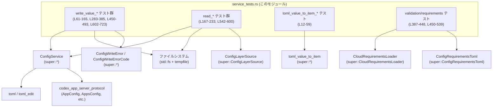
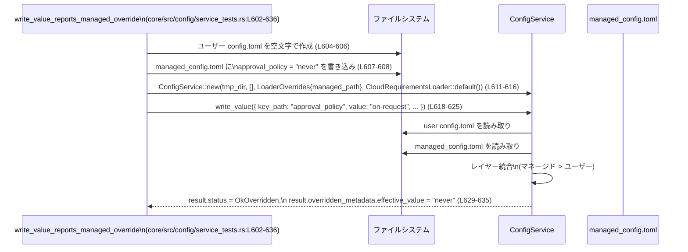

# core/src/config/service_tests.rs

## 0. ざっくり一言

`ConfigService` とその周辺コンポーネント（レイヤード設定、バリデーション、マージ戦略など）の **期待されるふるまいを統合テストするモジュール** です。  
TOML 変換ヘルパー `toml_value_to_item` のテーブル構造保持も合わせて検証しています。

---

## 1. このモジュールの役割

### 1.1 概要

このモジュールは、主に次の問題を検証します。

- **設定ファイルの安全な書き換え**  
  コメントやキー順序を壊さずに値を書き換えられるか（`write_value` の Replace/Upsert 挙動）  
  （`write_value_preserves_comments_and_order` など, core/src/config/service_tests.rs:L61-104, L638-723）

- **レイヤー構造（ユーザー／システム／マネージド／セッション）の統合結果と起源情報**  
  各レイヤーの優先順位と、どのレイヤーが最終値を決めたかを `origins` / `layers` で確認  
  （`read_includes_origins_and_layers`, `read_reports_managed_overrides_user_and_session_flags`, L167-233, L542-600）

- **書き込み時のバリデーションと競合検出**  
  - バージョン不一致（楽観的ロック）による競合拒否  
    （`version_conflict_rejected`, L339-361）
  - 不正値やポリシー違反（reserved provider ID, feature requirements との不整合など）の拒否  
    （L387-448, L450-539）

- **マネージド設定による上書きの扱い**  
  ユーザー設定がマネージド設定で上書きされる場合の `WriteStatus` や `overridden_metadata` の報告  
  （`write_value_reports_override`, `write_value_reports_managed_override`, L283-337, L602-636）

- **プラットフォーム依存ケース（macOS の MDM / managed preferences）**  
  MDM レイヤーがあってもテストが安定するように考慮しつつ、`~` 展開を含む managed preferences があっても書き込みが成功することを確認  
  （L205-232, L235-281）

### 1.2 アーキテクチャ内での位置づけ

このテストモジュールは、親モジュール（`super::*`）で公開されている `ConfigService` や各種型の **利用者** として振る舞い、実際のファイル I/O を通じて期待値を検証します。

依存関係の概要を Mermaid で示します。



※ `ConfigService` や `toml_value_to_item` の具体的な実装はこのファイルには含まれておらず、`super::*` からインポートされています（L1）。

### 1.3 設計上のポイント

コードから読み取れる範囲での設計上の特徴は次の通りです。

- **実ファイルを使った E2E テスト**  
  - すべてのテストは `tempfile::tempdir()` で一時ディレクトリを作成し、その中に `CONFIG_TOML_FILE` や `managed_config.toml` を書き出します（例: L63-76, L169-176）。
  - これにより、TOML 文字列 → パース → `ConfigService` 経由での読み書き → ファイル内容の検証までの **実運用に近いパス** をテストしています。

- **非同期処理と Tokio テストランナー**  
  - 多くのテストは `#[tokio::test]` を付けた `async fn` として書かれており、`ConfigService::read` / `write_value` が `async` API であることが分かります（L61, L106, L167 など）。
  - ファイル I/O 自体は `std::fs` の同期 API を使用しており、テスト内でブロッキング I/O を許容する設計です。

- **結果メタデータの重視**  
  - 読み出し結果には `config` だけでなく `origins` や `layers` が含まれ、各キーの出所や全レイヤーのスタックが分かるようになっています（L193-232, L573-599）。
  - 書き込み結果には `status` や `overridden_metadata` が含まれ、ユーザーの変更がマネージド設定で上書きされているかどうかをクライアント側で認識できます（L303-337, L618-635）。

- **厳格なバリデーション**  
  - 不正な列挙値（`approval_policy = "bogus"`）や予約済みプロバイダ ID（`model_providers.openai`）、クラウドから要求される feature 要件との矛盾はすべて `ConfigValidationError` で拒否されます（L387-420, L422-448, L450-539）。
  - ユーザー設定がマネージド設定で上書きされる場合でも、**ユーザー設定の内容自体は常に検証対象** となります（L387-420）。

- **楽観的ロックによる競合検出**  
  - `expected_version` パラメータと、`ConfigVersionConflict` エラーを通じて、バージョン不一致時の書き込み競合が検出されます（L339-361）。

---

## 2. 主要な機能一覧（テスト観点）

このファイルが検証している機能を列挙します。

- TOML 変換:
  - `toml_value_to_item` がネストしたテーブルを **暗黙テーブル化せずに明示テーブルとして保持** できること（L12-59）。
- 設定値の書き込み (`ConfigService::write_value`):
  - コメントとキー順序を壊さずに新しいキーを追加できる（L61-104）。
  - `"apps.app1.*"` といったネストしたパスを扱い、`AppsConfig` / `AppConfig` に正しくマッピングできる（L106-165）。
  - `MergeStrategy::Upsert` はテーブルをマージし、`Replace` は指定されたテーブルを置き換える（L638-723）。
  - `file_path: None` の場合、ユーザー設定ファイルのデフォルトパスに書き込む（L363-385）。
- 設定の読み出し (`ConfigService::read`):
  - `include_layers: true` のとき、各キーの起源 (`origins`) とレイヤースタック (`layers`) を返す（L167-233, L542-599）。
  - セッションフラグ（CLI 上書き）、ユーザー設定、マネージド設定の優先順位を正しく反映する（L542-599）。
- バリデーションとエラー処理:
  - バージョン不一致を `ConfigVersionConflict` として検出する（L339-361）。
  - 無効な値やポリシー違反を `ConfigValidationError` として検出する（L387-420, L422-448, L450-539）。
  - エラーオブジェクトから `write_error_code()` でエラーコードを取得でき、`Display` 実装で詳細メッセージも参照可能（L357-360, L413-417, L439-445, L480-488, L526-533）。
- マネージド設定とオーバーライド:
  - マネージド設定ファイル（`managed_config.toml`）や MDM（macOS）由来の設定レイヤーを認識し、ユーザー設定より **優先** させる（L167-233, L542-599）。
  - 書き込み結果の `WriteStatus` / `overridden_metadata` で、ユーザー設定がマネージド設定により上書きされるかどうかを報告する（L283-337, L602-635）。
  - macOS の managed preferences（base64 エンコードされた TOML）に含まれる `"~/..."` パス展開があっても書き込みが成功することを確認する（L235-281）。

---

## 3. 公開 API と詳細解説（テストから分かる範囲）

### 3.1 型一覧（構造体・列挙体など）

テストから利用が確認できる主な型をまとめます。多くは `super::*` からインポートされており、**正確な定義は別ファイル** にあります。

| 名前 | 種別 | 役割 / 用途 | 根拠 |
|------|------|-------------|------|
| `ConfigService` | 構造体（推定） | 設定ファイルの読み書き、レイヤー統合、クラウド要件の適用などを行う中心的なサービス。`new` と `without_managed_config_for_tests` コンストラクタ、および `read` / `write_value` メソッドがテストから呼ばれています。 | インスタンス生成とメソッド呼び出し（L77, L111, L178-183, L256-261, L296-301, L345, L368, L395-400, L427, L455-467, L501-513, L558-563, L611-616, L666） |
| `ConfigValueWriteParams` | 構造体 | `write_value` に渡すパラメータ。`file_path`, `key_path`, `value`, `merge_strategy`, `expected_version` フィールドを持ちます。 | フィールド初期化（L79-85, L113-123, L128-134, L264-270, L304-310, L347-353, L370-376, L403-409, L429-435, L470-476, L516-522, L619-625, L668-674, L697-703） |
| `ConfigReadParams` | 構造体 | `read` に渡すパラメータ。`include_layers` と `cwd` フィールドが確認できます。 | フィールド初期化（L186-189, L139-142, L315-318, L566-569） |
| `MergeStrategy` | 列挙体 | 設定値のマージ戦略。少なくとも `Replace` と `Upsert` の 2 バリアントが存在し、Upsert はマージ、Replace は上書きを表します。 | 使用箇所（L83, L121, L132, L268, L308, L351, L374, L407, L433, L474, L520, L623, L672, L702） |
| `WriteStatus` | 列挙体 | `write_value` 成功時の状態コード。少なくとも `Ok` と `OkOverridden` バリアントを持ちます。 | 比較箇所（L274, L335, L629） |
| `ConfigWriteErrorCode` | 列挙体 | 書き込みエラー種別。`ConfigVersionConflict`, `ConfigValidationError` などのバリアントが確認できます。 | `write_error_code()` の戻り値比較（L357-360, L413-417, L439-442, L480-483, L526-529） |
| `CloudRequirementsLoader` | 構造体（推定） | クラウド側の設定要件（`ConfigRequirementsToml`）を非同期に読み込むローダー。`default()` と `new(async {...})` が利用されています。 | 使用箇所（L182-183, L260-261, L300-301, L399-400, L459-467, L505-513, L562-563, L615-616） |
| `ConfigRequirementsToml` | 構造体 | クラウド要件設定（例：`feature_requirements`）を表す TOML 構造。`Default` 実装と `feature_requirements` フィールドが確認できます。 | 構造体リテラル（L459-465, L505-511） |
| `crate::config_loader::FeatureRequirementsToml` | 構造体 | `feature_requirements` の中身を表す型。`entries: BTreeMap<String, bool>` フィールドを持ちます。 | 構造体リテラル（L461-463, L507-509） |
| `ConfigLayerSource` | 列挙体 | 各設定レイヤーの出所を表す。`LegacyManagedConfigTomlFromFile { file }`, `LegacyManagedConfigTomlFromMdm`, `User { file }`, `System { .. }`, `SessionFlags` などのバリアントが確認できます。 | `name` フィールドとの比較（L201-203, L218-232, L575-599, L632-633） |
| `AppConfig` | 構造体 | `apps.app1` の設定内容。`enabled`, `destructive_enabled`, `open_world_enabled`, `default_tools_approval_mode`, `default_tools_enabled`, `tools` フィールドが確認できます。 | 構造体リテラル（L152-159） |
| `AppsConfig` | 構造体 | `apps` ルートの設定。`default` と `apps: HashMap<String, AppConfig>` フィールドが確認できます。 | 構造体リテラル（L148-161） |
| `AppToolApproval` | 列挙体 | ツール承認モード。`Prompt` バリアントが確認できます。 | `Some(AppToolApproval::Prompt)`（L156） |
| `AskForApproval` | 列挙体 | `approval_policy` の値を表す型。`Never` バリアントが確認できます。 | 比較箇所（L193, L321-324） |
| `AbsolutePathBuf` | 構造体 | 絶対パスを表すユーティリティ。`try_from` コンストラクタが確認できます。 | 使用箇所（L172-176, L294, L551, L609） |
| `TomlValue` | 型エイリアス（推定） | TOML 値表現（`toml` クレートの `Value` かそれに類する型）。`toml::from_str` の戻り値として使用されています。 | 使用箇所（L22, L678-692） |
| `TomlItem` | 型 | `toml_edit` に対応するアイテム型。`as_table`, `as_value` メソッドが使用されます。 | 使用箇所（L23, L28-31, L37-40, L48-51, L53-56） |

> 注: ここに挙げた型の詳細定義（フィールドの型、全バリアントなど）は **このファイルには現れません**。上記はテストから読み取れる最低限の情報です。

### 3.2 関数詳細（重要テスト 7 件）

以下では、`ConfigService` の中核動作をカバーしている主要なテスト 7 件を取り上げ、そこから分かる **API の契約** を整理します。

---

#### `write_value_preserves_comments_and_order()`

**所在**: `core/src/config/service_tests.rs:L61-104`

**概要**

- `ConfigService::write_value` が TOML ファイルへの書き込み時に
  - 既存のコメント
  - 既存キーの並び順  
  を維持しつつ、新しいキー `features.personality` を追加できることを確認するテストです（L64-74, L89-101）。

**テスト内の主な呼び出し**

- `ConfigService::without_managed_config_for_tests(tmp.path().to_path_buf())`（L77）
- `service.write_value(ConfigValueWriteParams { ... }).await`（L78-87）

**内部処理の流れ（テスト観点）**

1. 一時ディレクトリを作成し、初期 TOML 文字列（コメント・テーブル・既存キーを含む）を `config.toml` に書き込みます（L63-76）。
2. `ConfigService` をテスト用コンストラクタで初期化します（L77）。
3. `key_path = "features.personality"`、`value = true`、`merge_strategy = Replace` で `write_value` を呼び出し、エラーが出ないことを確認します（L79-87）。
4. 書き込み後のファイル内容を文字列として読み出し、期待される完全な TOML 文字列と **全文一致** することを `assert_eq!` で確認します（L89-103）。

**ここから分かる `ConfigService::write_value` の契約**

- Replace ではあっても、テーブル全体を消し去るのではなく、指定キーとその親テーブルを **最小限の変更で** 更新する実装であることが示唆されます。
- コメント行（`# Codex user configuration`, `# Preserve this comment`）や既存キー `unified_exec` の位置が変わらないことから、`ConfigService` は `toml_edit` 的な AST ベース編集を行っていると考えられます。

**Errors / Panics**

- このテストでは `.expect("write succeeds")` を使用しているため、`write_value` が `Result::Err` を返した場合にテストがパニックします（L86-87）。
- コメントや順序に関するエラーコードはこのテストからは見えません。

**Edge cases（エッジケース）**

- 入力ファイルが **既に複数のテーブルとコメントを持つ場合** でも、書き込みによりフォーマットが崩れないことを確認しています。
- 空ファイルや、`features` テーブルが存在しない場合の挙動はこのテストでは扱っていません。

**使用上の注意点（API 利用者向け）**

- コメントや手動整形された TOML を維持したい場合でも、`ConfigService::write_value` を使えば安全にキーを追加・変更できると考えられます。
- Replace を選んでも「指定テーブル丸ごと上書き」になるとは限らず、**キー単位での編集** である点に注意が必要です（テーブル単位での完全な上書きには後述の Upsert/Replace テストを参照）。

---

#### `write_value_supports_nested_app_paths()`

**所在**: `core/src/config/service_tests.rs:L106-165`

**概要**

- `apps` 配下のネストしたパス（例: `apps.app1.default_tools_approval_mode`）に対する書き込みが、
  `AppsConfig` / `AppConfig` 型に正しく反映されることを検証するテストです。

**内部処理の流れ**

1. 空の `config.toml` を作成します（L108-110）。
2. `key_path = "apps"`、値に JSON オブジェクト `{"app1": { "enabled": false }}` を指定して Replace 書き込み（L113-123）。
3. 次に `key_path = "apps.app1.default_tools_approval_mode"` に `"prompt"` を書き込みます（L128-134）。
4. `ConfigService::read` を `include_layers: false` で呼び出し、`read.config.apps` が期待する `AppsConfig` 構造と一致することを確認します（L138-162）。

**ここから分かる契約**

- `write_value` は JSON `Value` から TOML 構造へ変換し、`apps` テーブルやその子テーブルを生成できること（L113-122）。
- ネストした `key_path` 形式（`apps.app1.default_tools_approval_mode`）は、既存の `apps.app1` テーブルに対して **部分更新** として解釈されること（L128-136）。
- `ConfigService::read` は `codex_app_server_protocol::AppsConfig` / `AppConfig` への **型付きデシリアライズ** を行うこと（L146-161）。

**Errors / Panics**

- いずれの書き込みも `.expect("... succeeds")` を使っているため、失敗時にはテストがパニックします（L124-136）。
- 不正な `app` 名やフィールド名に対するエラーはこのテストでは扱っていません。

**Edge cases**

- 同じ `app1` に対して複数回の書き込みを行っても、2 回目の書き込み（ネストキー）が最初の構造を壊さずにマージされることを確認しています。
- `AppsConfig::default` 値（`default: None`）を明示的に確認しているため、未設定フィールドが `None` になることが前提になっています（L148-160）。

**使用上の注意点**

- アプリごとの設定をキー文字列ベースで扱う場合、`"apps.<app_id>.<field>"` 形式の `key_path` を用いる設計になっていることが分かります。
- Replace 戦略を使いつつも、ネストキー書き込みでは **親テーブル全体を壊さずに更新** される点は、前述のコメント保持と同様の AST 編集ポリシーを示唆します。

---

#### `read_includes_origins_and_layers()`

**所在**: `core/src/config/service_tests.rs:L167-233`

**概要**

- `ConfigService::read` が
  - 統合された最終設定 (`response.config`)
  - 各キーの起源（`response.origins`）
  - 全設定レイヤーのスタック（`response.layers`）  
  を返し、それらが想定どおりの順序で並ぶことを検証します。

**内部処理の流れ**

1. ユーザー設定ファイルに `model = "user"` を書き込み、`AbsolutePathBuf` へ変換（L169-172）。
2. マネージド設定ファイルに `approval_policy = "never"` を書き込み、同様に `AbsolutePathBuf` へ変換（L174-176）。
3. `LoaderOverrides::with_managed_config_path_for_tests` を用いてマネージド設定ファイルを指定し、`ConfigService::new` を初期化（L178-183）。
4. `include_layers: true` で `read` を呼び出し、結果を `response` に格納（L185-191）。
5. 統合された `response.config.approval_policy` が `AskForApproval::Never` になっていることを確認し（L193）、この値の起源が `LegacyManagedConfigTomlFromFile { file: managed_file }` であることを検証（L195-203）。
6. `layers` を取得し、先頭が `LegacyManagedConfigTomlFromMdm` の場合はスキップする特別処理を行った上で（L205-215）、その後の 3 レイヤーがマネージド → ユーザー → システムの順であることを確認（L216-232）。

**ここから分かる契約**

- `ConfigService::read` は
  - 統合設定
  - 各キーの `origin`（`HashMap<String, Origin>` のような構造）
  - レイヤー一覧（`Vec<Layer>` のような構造）
  を含むレスポンス型を返します。
- レイヤーは少なくとも `LegacyManagedConfigTomlFromFile`, `User`, `System` バリアントを持ち、別途 `LegacyManagedConfigTomlFromMdm` が先頭に来ることもあります（L201-232）。
- マネージド設定ファイルはユーザー設定より **優先度が高く**、`approval_policy` の実効値と起源に反映されます（L193, L195-203）。

**Errors / Panics**

- このテストでは `.expect("response")` を使用しているため、`read` が失敗した場合はテストがパニックします（L190-191）。
- `layers` が `None` で返ってくる場合は `expect("layers present")` によって即座にパニックします（L205）。

**Edge cases**

- macOS 環境では MDM 管理のレイヤーが追加される可能性を考慮し、先頭が `LegacyManagedConfigTomlFromMdm` である場合にそれをスキップする処理が入っています（L205-215）。  
  これは **テストの安定性を保つため** であり、本番コードでは MDM レイヤーも使用されることが想定されます。

**使用上の注意点**

- `include_layers` を `true` にしないと `layers` 情報が得られないため、クライアントが設定の出所や優先順位を知る必要がある場合はこのフラグを有効にする必要があります。
- 環境によっては追加のレイヤー（MDM）が含まれる可能性があるため、レイヤーの数や順序に **完全に固定的な前提を置かない** ことが重要です。

---

#### `version_conflict_rejected()`

**所在**: `core/src/config/service_tests.rs:L339-361`

**概要**

- `ConfigService::write_value` が `expected_version` パラメータに基づく **バージョン競合** を検出し、`ConfigVersionConflict` エラーを返すことを確認します。

**内部処理の流れ**

1. ユーザー設定ファイルに `model = "user"` を書き込みます（L341-343）。
2. マネージド設定なしの `ConfigService` を初期化します（L345）。
3. `expected_version = Some("sha256:bogus".to_string())` を指定して `model = "gpt-5"` の書き込みを試み、`expect_err("should fail")` によってエラーが返ることを確認します（L347-355）。
4. エラーから `write_error_code()` を取得し、その値が `Some(ConfigWriteErrorCode::ConfigVersionConflict)` であることを確認します（L357-360）。

**ここから分かる契約**

- `ConfigService::write_value` はバージョン管理付きで動作しており、クライアントは事前に取得した設定のバージョンを `expected_version` として渡すことで、楽観的ロックを実現できます。
- バージョンが一致しない（ここでは意図的に bogus 値）場合、書き込みは **拒否され**、エラーコード `ConfigVersionConflict` が返されます。

**Errors / Panics**

- このテストでは意図的にエラーを期待しており、`expect_err` を使用することで **成功した場合にパニック** します（L354-355）。
- エラー型は `write_error_code()` メソッドと `Display` 実装を持っており、利用者はエラーコードとメッセージに基づいて分岐できます（L357-360）。

**Edge cases**

- 正しい `expected_version` を渡した場合の成功パスはこのファイルには現れません。
- バージョン文字列の正確なフォーマット（ここでは `"sha256:..."` のような文字列）はテストからは断定できませんが、少なくともこの形式の文字列が使われ得ることが分かります（L352）。

**使用上の注意点**

- 複数クライアントやプロセスが同じ設定ファイルを更新する可能性がある場合、`expected_version` を必ず指定することで **競合のサイレント上書き** を防げます。
- `expected_version` を省略すると、競合検出が行われない設計である可能性があります（このファイル内では `None` のケースで競合エラーが発生していないため）。

---

#### `invalid_user_value_rejected_even_if_overridden_by_managed()`

**所在**: `core/src/config/service_tests.rs:L387-420`

**概要**

- ユーザー設定で無効な値（ここでは `approval_policy = "bogus"`）を設定しようとした場合、たとえ同じキーがマネージド設定で上書きされるとしても **ユーザー設定の値は検証される** ことを確認するテストです。

**内部処理の流れ**

1. ユーザー設定ファイルに `model = "user"` を書き込みます（L389-391）。
2. マネージド設定ファイルに `approval_policy = "never"` を書き込みます（L392-393）。
3. マネージド設定を指定して `ConfigService::new` を初期化します（L395-400）。
4. `key_path = "approval_policy"`, `value = "bogus"` で `write_value` を呼び出し、`expect_err("should fail validation")` でバリデーションエラーを期待します（L402-411）。
5. エラーコードが `ConfigValidationError` であることを確認し（L413-417）、ユーザー設定ファイルの内容が書き込み前と同じであることを確認します（L418-419）。

**ここから分かる契約**

- マネージド設定によって実効値が決まるキーであっても、ユーザー設定ファイルに書き込まれる値は **常にバリデーション対象** です。
- `ConfigService` は「どうせマネージドに上書きされるから」という理由で不正なユーザー値を書き込むことを許しません。

**Errors / Panics**

- 書き込みは `ConfigValidationError` を返し、ファイルは更新されません（L413-419）。
- これにより、設定ファイルの整合性が保たれ、後続のツール（エディタ等）が生のユーザー設定を解析する場合でも破損しないことが保証されます。

**Edge cases**

- 具体的な有効値の一覧（例：`"never"`, `"on-request"` など）は別テストを参照する必要がありますが、ここでは `"bogus"` が無効であることだけが確認できます。
- すでにユーザー設定に不正値が入っている状態での読み出し時の挙動はこのファイルでは扱っていません。

**使用上の注意点**

- マネージド環境でもユーザーに UI から値を入力させる場合、`write_value` のバリデーションエラーを適切にハンドリングし、そのエラー内容（`to_string()`）をユーザーに伝える必要があります（L413-417）。
- ユーザー設定ファイルが常に検証済みである、という前提に依存した別のツールを構築しやすくなります。

---

#### `write_value_rejects_feature_requirement_conflict()`

**所在**: `core/src/config/service_tests.rs:L450-493`

**概要**

- クラウドから配信された `feature_requirements` により、特定の機能フラグ（ここでは `features.personality`）が **必須 (`true`)** に設定されている場合、ユーザーがそれを無効 (`false`) にしようとすると `ConfigValidationError` で拒否されることを確認するテストです。

**内部処理の流れ**

1. 空の `config.toml` を作成します（L452-454）。
2. `CloudRequirementsLoader::new(async { ... })` で、`ConfigRequirementsToml { feature_requirements: Some(FeatureRequirementsToml { entries: { "personality": true } }) }` を返すローダーを構築します（L455-467）。
3. このローダーとともに `ConfigService::new` を初期化します（L455-467）。
4. `key_path = "features.personality"`, `value = false` で `write_value` を呼び出し、`expect_err("conflicting feature write should fail")` によりエラーを期待します（L469-478）。
5. エラーコードが `ConfigValidationError` であることを確認し（L480-483）、エラー文字列に `"invalid value for`features`:`features.personality=false`"` が含まれることを検証します（L484-488）。
6. 設定ファイルが空のままである（書き込みがロールバックされている）ことを確認します（L490-493）。

**ここから分かる契約**

- `ConfigService` はクラウドからの `ConfigRequirementsToml` を参照し、そこに指定された feature 要件（`entries: BTreeMap<String, bool>`）に反する書き込みを **拒否** します。
- バリデーションエラーのメッセージは、問題となったキーと値を `features.personality=false` のように含むため、クライアント側でユーザーに対して具体的なフィードバックが可能です（L484-488）。

**Errors / Panics**

- エラーは `ConfigValidationError` として報告されます（L480-483）。
- 書き込みは完全にキャンセルされ、ファイルに一切の変更が加えられないことが確認されています（L490-493）。

**Edge cases**

- 複数の feature 要件が同時に存在する場合の挙動や、「要件が存在しないキー」への書き込みの挙動はこのファイルには現れません。
- `true` への書き込みが明示的に成功するテストはありませんが、少なくとも `false` は禁止されていることが分かります。

**使用上の注意点**

- クラウド管理環境下で feature を動的に制御したい場合、ユーザー UI では「最低限この機能は有効にしておく必要がある」といった要件をローカル側に示すために、このバリデーションエラーをそのまま表示できます。
- クラウド要件がまだ読み込まれていないタイミングでの書き込み（ローダーが `None` を返す場合）の挙動は、別途確認が必要です。

---

#### `write_value_rejects_profile_feature_requirement_conflict()`

**所在**: `core/src/config/service_tests.rs:L496-539`

**概要**

- 上記と同様の feature 要件バリデーションを、`profiles.<name>.features.*` のような **プロファイルごとの設定** に対しても適用することを確認するテストです。

**内部処理の流れ**

ほぼ `write_value_rejects_feature_requirement_conflict` と同じで、異なるのは `key_path` とエラーメッセージだけです。

1. 空の `config.toml` を作成（L498-499）。
2. 同じ `CloudRequirementsLoader` セットアップ（L501-513）。
3. `key_path = "profiles.enterprise.features.personality"` に `false` を書き込もうとしてエラーを期待（L515-524）。
4. エラーコードが `ConfigValidationError` であることと、エラー文字列に  
   `"invalid value for`features`:`profiles.enterprise.features.personality=false`"` が含まれることを確認（L526-535）。
5. ファイルが空のままであることを確認（L536-539）。

**契約・注意点**

- クラウド要件は「グローバルな features 設定」だけでなく、「プロファイル配下の features 設定」にも適用されます。
- つまり、ユーザーがプロファイル単位で機能を無効にしようとしても、クラウド側で「必須」とされた機能は無効化できません。

---

#### `upsert_merges_tables_replace_overwrites()`

**所在**: `core/src/config/service_tests.rs:L638-723`

**概要**

- `MergeStrategy::Upsert` と `MergeStrategy::Replace` の **違い** を、`mcp_servers.linear` テーブルを例にとって明確にするテストです。
  - Upsert: 既存テーブルに対して値をマージし、未指定のサブテーブルは維持。
  - Replace: 指定テーブルを上書きし、未指定のサブテーブルは削除。

**内部処理の流れ**

1. 初期 TOML `base` を書き込みます（L642-652, L664-665）。  
   - `[mcp_servers.linear]` に基本フィールド  
   - `[mcp_servers.linear.env_http_headers]`  
   - `[mcp_servers.linear.http_headers]`
2. `overlay` JSON を作成（`bearer_token_env_var` の変更、`http_headers` の一部更新と追加）し、Upsert で書き込み（L654-674）。
3. 書き込み後のファイルを `TomlValue` として読み出し、期待される `expected_upsert` と等しいことを確認（L678-693）。  
   ここでは `env_http_headers` テーブルが維持され、`http_headers` はマージされています。
4. 再度 `base` を書き戻し（L695-695）、今度は同じ `overlay` を Replace で書き込みます（L697-704）。
5. 書き込み後のファイルを `TomlValue` として読み出し、期待される `expected_replace` と等しいことを確認（L708-720）。  
   ここでは `env_http_headers` テーブルが削除されていることが分かります。

**ここから分かる契約**

- Upsert:
  - テーブル内の既存キーとサブテーブルは原則として維持され、`overlay` に含まれるキーのみが追加・更新されます。
  - 未指定のサブテーブル（ここでは `env_http_headers`）は削除されません。
- Replace:
  - 対象テーブル（`mcp_servers.linear`）の中身は **指定されたキーのみに置き換えられ**、未指定のサブテーブル（`env_http_headers`）は削除されます。

**Errors / Panics**

- Upsert/Replace いずれの書き込みも `.expect("... succeeds")` による成功前提です（L675-676, L705-706）。
- 不正な overlay 形式や型不一致によるエラーはこのテストでは扱っていません。

**Edge cases**

- Overlay 側にネストしたサブテーブル（例: `env_http_headers`）が含まれる場合の挙動はここでは確認していません。
- 既存に存在するが overlay でも明示されているキーの扱い（上書き vs マージ）については、`http_headers.alpha` が上書きされることから「上書き」が基本ポリシーだと分かります（L657-658, L689-690, L716-717）。

**使用上の注意点**

- 既存設定を壊したくない（新しいフィールドだけ追加／一部更新したい）場合は Upsert を選ぶ必要があります。
- テーブルごと再定義したい場合（古いフィールドを一掃したい場合）は Replace を用いるべきですが、その際には**意図しないサブテーブルの削除に注意**が必要です。

---

### 3.3 その他の関数（テスト関数一覧）

テスト関数はすべて、このモジュールで定義されているプライベートなテストエントリです。

| 関数名 | 役割（1 行） | 根拠 |
|--------|--------------|------|
| `toml_value_to_item_handles_nested_config_tables` | `toml_value_to_item` がネストした TOML テーブル構造と明示テーブルフラグを保持できることを検証します。 | core/src/config/service_tests.rs:L12-59 |
| `write_value_succeeds_when_managed_preferences_expand_home_directory_paths` | macOS の managed preferences（`~/...` を含む base64 TOML）を適用した環境でも `write_value` が成功することを検証します。 | L235-281 |
| `write_value_reports_override` | ユーザー設定の変更がマネージド設定と同じ値に揃う場合、`WriteStatus::Ok` となり `overridden_metadata` が `None` であることを確認します。 | L283-337 |
| `write_value_defaults_to_user_config_path` | `file_path: None` の場合でもユーザー設定ファイルに書き込まれることを検証します。 | L363-385 |
| `reserved_builtin_provider_override_rejected` | 予約済みビルトインプロバイダ（`model_providers.openai`）の上書きが `ConfigValidationError` で拒否されることを検証します。 | L422-448 |
| `read_reports_managed_overrides_user_and_session_flags` | マネージド設定がセッションフラグ（CLI）やユーザー設定よりも優先されることを、`model` キーを使って検証します。 | L542-600 |
| `write_value_reports_managed_override` | ユーザー設定値がマネージド設定と異なる場合でも、`WriteStatus::OkOverridden` と `overridden_metadata` により「実効値はマネージド」と報告されることを検証します。 | L602-636 |

---

## 4. データフロー

### 4.1 書き込みとマネージドオーバーライドのシーケンス

`write_value_reports_managed_override` テスト（L602-636）を例に、ユーザー設定とマネージド設定の関係、および `WriteStatus` 報告の流れを示します。



この図から分かるポイント:

- ユーザーによる書き込み自体は成功し（`OkOverridden`）、ユーザー設定ファイルも更新されると推測されます（ファイル内容の検証はこのテストでは行っていません）。
- しかし、実効値はマネージド設定により `"never"` に固定されていることが `overridden_metadata.effective_value` から分かります（L631-635）。
- クライアントはこのメタデータを用いて、「あなたの設定は適用されましたが、管理者ポリシーにより別の値が有効になっています」といった UI 表示が可能になります。

### 4.2 レイヤー優先順位のフロー

`read_reports_managed_overrides_user_and_session_flags`（L542-600）を元に、`model` キーの決定フローを図示します。

```mermaid
graph TD
    U["ユーザー設定\nconfig.toml: model=\"user\" (L545-546)"]
    S["セッションフラグ\nCLI: model=\"session\" (L553-556)"]
    M["マネージド設定\nmanaged_config.toml: model=\"system\" (L549-551)"]

    subgraph Layers["ConfigService::read(include_layers=true) のレイヤー統合\n(core/src/config/service_tests.rs:L565-599)"]
      M --> S --> U
    end

    Layers --> R["response.config.model = Some(\"system\") (L573)"]
```

テストでは `layers` の順序として

1. `LegacyManagedConfigTomlFromFile`
2. `SessionFlags`
3. `User`

が確認されており（L591-599）、結果として `model` の実効値は `"system"` になります（L573）。

---

## 5. 使い方（How to Use）

このファイル自体はテストモジュールですが、ここから `ConfigService` の実用的な使い方が読み取れます。

### 5.1 基本的な使用方法

**前提**: `ConfigService` や関連型の完全修飾パスはこのファイルからは分かりません。以下の例では、テストと同様にそれらがスコープにある前提で記述します。

```rust
use super::*; // テストと同様に親モジュールからインポートする前提

// 一時ディレクトリまたは設定ディレクトリのパスを用意する
let config_dir = std::path::PathBuf::from("/path/to/config_dir");

// マネージド設定を使わない ConfigService を初期化する
let service = ConfigService::without_managed_config_for_tests(config_dir.clone());

// 1. 設定の読み出し
let response = service
    .read(ConfigReadParams {
        include_layers: true, // レイヤー情報も欲しい場合は true
        cwd: None,            // カレントディレクトリ依存の解決が不要なら None
    })
    .await?;

// 統合設定にアクセス
let model = response.config.model;

// 2. 設定の書き込み
let write_result = service
    .write_value(ConfigValueWriteParams {
        file_path: None,                         // ユーザー設定ファイルのデフォルトパスを使用
        key_path: "model".to_string(),           // 書き換えたいキー
        value: serde_json::json!("gpt-5"),       // JSON Value として新しい値
        merge_strategy: MergeStrategy::Replace,  // 単一キーの書き換えなら Replace で十分
        expected_version: None,                  // 競合検出が不要なら None
    })
    .await?;

// 書き込み結果のステータスを確認
match write_result.status {
    WriteStatus::Ok => {
        // 書き込みがそのまま有効になっている
    }
    WriteStatus::OkOverridden => {
        // マネージド設定などで上書きされている
        if let Some(meta) = write_result.overridden_metadata {
            eprintln!(
                "Your value was overridden by {:?}: effective = {}",
                meta.overriding_layer.name,
                meta.effective_value,
            );
        }
    }
    // 他のステータスがあればここでハンドリング
}
```

このコードは、テストで検証されているパターンのうち、

- `read` によるレイヤー付き読み出し（L185-191, L565-571）
- `write_value` による単純なキー書き換え（L370-376, L618-625）
- `WriteStatus` と `overridden_metadata` の解釈（L629-635）

を反映したものです。

### 5.2 よくある使用パターン

#### 5.2.1 ネストしたキーの書き込み（アプリ設定）

`write_value_supports_nested_app_paths`（L106-165）に倣い、アプリケーションごとの設定を書き込む例です。

```rust
// apps.app1.enabled を false にする
service
    .write_value(ConfigValueWriteParams {
        file_path: None,
        key_path: "apps.app1.enabled".to_string(),
        value: serde_json::json!(false),
        merge_strategy: MergeStrategy::Replace, // 単一キー更新なので Replace でOK
        expected_version: None,
    })
    .await?;

// apps.app1.default_tools_approval_mode を "prompt" に設定
service
    .write_value(ConfigValueWriteParams {
        file_path: None,
        key_path: "apps.app1.default_tools_approval_mode".to_string(),
        value: serde_json::json!("prompt"),
        merge_strategy: MergeStrategy::Replace,
        expected_version: None,
    })
    .await?;
```

#### 5.2.2 テーブル単位のマージ／上書き

`upsert_merges_tables_replace_overwrites`（L638-723）に相当するケースです。

```rust
// MCP サーバー linear の設定をマージ更新する（既存の env_http_headers を維持）
service
    .write_value(ConfigValueWriteParams {
        file_path: None,
        key_path: "mcp_servers.linear".to_string(),
        value: serde_json::json!({
            "bearer_token_env_var": "NEW_TOKEN",
            "http_headers": {
                "alpha": "updated",
                "beta": "b",
            },
        }),
        merge_strategy: MergeStrategy::Upsert,
        expected_version: None,
    })
    .await?;

// 逆に、テーブルを完全に再定義したい場合
service
    .write_value(ConfigValueWriteParams {
        file_path: None,
        key_path: "mcp_servers.linear".to_string(),
        value: serde_json::json!({
            "bearer_token_env_var": "NEW_TOKEN",
            "http_headers": {
                "alpha": "updated",
                "beta": "b",
            },
        }),
        merge_strategy: MergeStrategy::Replace, // env_http_headers など未指定テーブルは削除される
        expected_version: None,
    })
    .await?;
```

### 5.3 よくある間違い

テストが明示的に「誤用」として扱っているパターンと、その正しい扱いを対比します。

```rust
// 誤り: バージョンを無視した書き込み（並行更新があり得る場合）
let result = service
    .write_value(ConfigValueWriteParams {
        file_path: None,
        key_path: "model".to_string(),
        value: serde_json::json!("gpt-5"),
        merge_strategy: MergeStrategy::Replace,
        expected_version: Some("sha256:bogus".to_string()), // 実際のバージョンと不一致
    })
    .await;

// → version_conflict_rejected (L339-361) のように ConfigVersionConflict エラーになる

// 正しい例: 事前に read でバージョンを取得し、その値を expected_version に渡す
// （実際にバージョン情報をどこから取得するかは、このファイルからは分かりません）

// 誤り: 必須 feature を false にしようとする
let error = service
    .write_value(ConfigValueWriteParams {
        file_path: None,
        key_path: "features.personality".to_string(),
        value: serde_json::json!(false),
        merge_strategy: MergeStrategy::Replace,
        expected_version: None,
    })
    .await
    .expect_err("should fail"); // L469-478

// → ConfigValidationError, エラーメッセージに invalid value が含まれる（L480-488）

// 誤り: 予約済み provider の上書き
let error = service
    .write_value(ConfigValueWriteParams {
        file_path: None,
        key_path: "model_providers.openai.name".to_string(),
        value: serde_json::json!("OpenAI Override"),
        merge_strategy: MergeStrategy::Replace,
        expected_version: None,
    })
    .await
    .expect_err("should reject reserved provider override"); // L429-437
```

### 5.4 使用上の注意点（まとめ）

テストから読み取れる共通の注意点を整理します。

- **バリデーション**
  - `approval_policy` や `model_providers.*` など、列挙型に対応するキーは文字列値に厳格な制約があります。無効な値は `ConfigValidationError` になります（L387-420, L422-448）。
  - クラウド要件（`ConfigRequirementsToml`）に反する feature 設定は拒否されます（L450-539）。

- **マネージド／MDM 環境**
  - マネージド設定ファイルや MDM 設定レイヤーはユーザー設定やセッションフラグよりも高い優先度を持ちます（L167-233, L542-599）。
  - `WriteStatus::OkOverridden` および `overridden_metadata` により、書き込みが有効値に反映されない場合でもクライアントはその事実を知ることができます（L602-635）。

- **並行更新（楽観的ロック）**
  - 複数クライアントが同じ設定ファイルを編集し得る環境では、`expected_version` を正しく設定することが重要です（L339-361）。
  - バージョン不一致エラー `ConfigVersionConflict` を捕捉して、再読み込み→再試行のフローを構築することが推奨されます。

- **非同期コンテキスト**
  - `ConfigService::read` / `write_value` は `async` であり、Tokio などのランタイム上で実行する必要があります（L61, L106, L167 など）。
  - テストでは `std::fs` を用いたブロッキング I/O が使用されていますが、本番コードでは必要に応じて非同期 I/O の利用も検討が必要です（このファイルからは不明）。

---

## 6. 変更の仕方（How to Modify）

このモジュール自身はテストですが、`ConfigService` の仕様変更や新機能追加に応じてテストをどう拡張／更新するかの観点で説明します。

### 6.1 新しい機能を追加する場合

例: 新しい設定キー `features.experimental_mode` を追加したい場合。

1. **本体側の変更**
   - 親モジュール（`super`）にある設定構造体および `ConfigService` の読み書きロジックに、新しいキーやフィールドを追加します（実際のファイル名はこのチャンクからは不明です）。
2. **テストの追加箇所**
   - 単純な書き込み／読み出しが意図通り動くことを検証するために、`write_value_supports_nested_app_paths` や `write_value_preserves_comments_and_order` に倣った新しいテストを追加します。
   - feature 要件やマネージド設定に関係する場合は、`write_value_rejects_feature_requirement_conflict` などと同様に、クラウド要件ローダー経由のテストも追加します。
3. **レイヤー関連の検証**
   - もし新しいキーがマネージド設定や MDM によって制御される場合は、`read_includes_origins_and_layers` や `read_reports_managed_overrides_user_and_session_flags` と同様に、`origins` と `layers` で起源と優先順位を確認するテストを追加します。

### 6.2 既存の機能を変更する場合

- **影響範囲の確認**
  - どのキー／レイヤー／マージ戦略が変更されるかを整理し、それに関連するテスト（上記のテーブルや 3.2 の詳細解説で挙げたテスト）をすべて見直します。
- **契約の維持**
  - コメント保持やキー順序の保持といったユーザー体験に直結する契約（L61-104）は、変更が難しい前提条件です。仕様変更の際は、この契約を維持するか、仕様として明示的に変更する必要があります。
  - `WriteStatus` と `overridden_metadata` の意味が変わる場合は、`write_value_reports_override` および `write_value_reports_managed_override` のテスト更新が不可欠です（L283-337, L602-635）。
- **エラーコードとメッセージ**
  - 新しいエラーコードを導入したり、既存のエラー条件を変更する場合は、`write_error_code()` を用いているテスト（L357-360, L413-417, L439-442, L480-483, L526-529）を更新し、期待するコードとメッセージが一致するようにします。

---

## 7. 関連ファイル

このモジュールから参照されている主なモジュール・型との関係をまとめます。ファイルパスはコードから直接は読み取れないため、モジュール名ベースで記載します。

| パス / モジュール | 役割 / 関係 |
|-------------------|------------|
| `super`（親モジュール） | `ConfigService`, `ConfigValueWriteParams`, `ConfigReadParams`, `MergeStrategy`, `WriteStatus`, `ConfigWriteErrorCode`, `LoaderOverrides`, `CloudRequirementsLoader`, `ConfigRequirementsToml` など、このテストで検証されている主実装を提供します（L1, L178-183, L455-467 等）。 |
| `codex_app_server_protocol` | `AppConfig`, `AppsConfig`, `AppToolApproval`, `AskForApproval` といったアプリ設定・承認ポリシーの型定義を提供します（L3-6, L146-161, L193, L321-324）。 |
| `crate::config_loader` モジュール | `FeatureRequirementsToml` 型を提供し、クラウド由来の feature 要件の表現に使用されます（L461-463, L507-509）。 |
| `codex_utils_absolute_path` | `AbsolutePathBuf` 型を提供し、設定ファイルパスの絶対パス表現に利用されます（L7, L172-176, L294, L551, L609）。 |
| 外部クレート `toml` / `toml_edit` | TOML のパースおよび編集を行うために使用されます。`TomlValue` は `toml::from_str` 結果の型として、`TomlItem` は `toml_edit` の編集用 AST として利用されています（L22-23, L42-44, L53-56, L678-692）。 |
| 外部クレート `tempfile` | テスト用一時ディレクトリの作成に使用され、ディスク上の実ファイルを元にした E2E テストを可能にします（L10, L63, L108, L169 等）。 |
| 外部クレート `tokio` | 非同期テストランナーとして `#[tokio::test]` を提供し、`ConfigService` の async API をテストするために使用されます（L61, L106, L167 など）。 |
| 外部クレート `base64`（macOS 限定） | macOS の managed preferences を base64 文字列からデコードし、`LoaderOverrides` の `managed_preferences_base64` に設定するために利用されます（L235-254）。 |

このように、`core/src/config/service_tests.rs` は `ConfigService` を中心とした設定管理ロジックの **仕様をテストとして文書化しているモジュール** と位置づけられ、公開 API の使い方やエッジケース、エラー条件を理解する上で有用なリファレンスとなっています。
