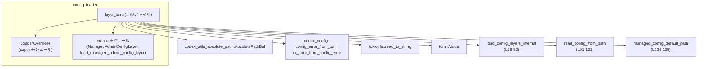
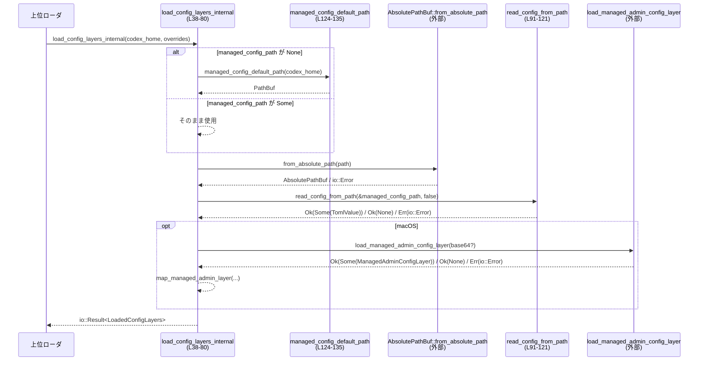

# core/src/config_loader/layer_io.rs

## 0. ざっくり一言

`managed_config.toml` や macOS の MDM（Managed Preferences）など、システムにより管理される設定を非同期に読み込み、統一した構造体として返すための I/O ヘルパーモジュールです（`layer_io.rs:L19-36, L38-80, L91-135`）。

---

## 1. このモジュールの役割

### 1.1 概要

- このモジュールは、Codex の「マネージド設定」（管理者が配布する設定）を複数のソースから読み込み、1 つの `LoadedConfigLayers` 構造体にまとめる役割を持ちます（`layer_io.rs:L31-36, L38-80`）。
- 設定ファイル（例: `/etc/codex/managed_config.toml`）と、macOS の場合は MDM 由来の設定を扱います（`layer_io.rs:L15-16, L32-35, L67-71, L82-89`）。
- TOML 形式のパースエラーやファイル I/O エラーを `std::io::Error` に正規化しつつ、ファイルが存在しない場合は「設定なし」として正常扱いします（`layer_io.rs:L91-121`）。

### 1.2 アーキテクチャ内での位置づけ

このファイルは `config_loader` サブモジュール内で、実際の I/O（ファイル読み込み・TOML パース・MDM ロード）を担当します。上位のローダは、このモジュールの `load_config_layers_internal` を呼び出し、得られた `LoadedConfigLayers` をマージして最終設定を構築すると考えられます（上位ローダの実装はこのチャンクには現れません）。



- `LoaderOverrides` の中身（どんなフィールドを持つか）はこのチャンクには現れないため不明です（`layer_io.rs:L38-53`）。
- macOS 用の `ManagedAdminConfigLayer` と `load_managed_admin_config_layer` の詳細も、このチャンクには含まれていません（`layer_io.rs:L2-5, L67-71, L82-89`）。

### 1.3 設計上のポイント

- **レイヤ構造**  
  - ファイル由来と MDM 由来の設定を、それぞれ独自の型で表現し、`LoadedConfigLayers` に `Option` として保持します（`layer_io.rs:L19-28, L31-36`）。  
    - ファイル: `Option<MangedConfigFromFile>`  
    - MDM: `Option<ManagedConfigFromMdm>`
- **非同期 I/O**  
  - 実ファイルの読み込みは `tokio::fs::read_to_string` で行い、`async fn` として設計されています（`layer_io.rs:L12, L38, L91`）。  
  - ブロッキング I/O は用いておらず、Tokio ランタイムでの同時実行に適合します。
- **エラーハンドリング方針**  
  - ファイルが存在しない場合: ログを出しつつ `Ok(None)` を返して「設定レイヤなし」と扱う（`layer_io.rs:L108-115`）。  
  - TOML パースエラー: ログ出力の上、`config_error_from_toml` と `io_error_from_config_error` を経由して `io::ErrorKind::InvalidData` の `io::Error` に変換（`layer_io.rs:L96-107`）。  
  - その他の I/O エラー: ログ出力の上、元の `io::Error` をそのまま返す（`layer_io.rs:L116-119`）。
- **プラットフォーム依存の切り替え**  
  - `#[cfg(unix)]` と `#[cfg(target_os = "macos")]` によって、デフォルトパスや MDM ロードの有無を切り替えています（`layer_io.rs:L2-5, L15-16, L42-53, L67-74, L82-89, L125-133`）。
- **安全性（Rust 観点）**  
  - すべての公開構造体は `Clone` と `Debug` を実装しており（`layer_io.rs:L18, L24, L30`）、所有権/借用はシンプルな所有権移動のみで、`unsafe` は使用していません。
  - 共有可変状態（`static mut` や `Mutex` 等）は登場せず、関数は純粋に引数とローカル変数で完結しているため、並行呼び出しによるデータ競合は発生しません。

---

## 2. 主要な機能一覧

- マネージド設定レイヤの読み込み: `load_config_layers_internal` でファイルおよび（macOS の場合）MDM から設定を読み込み `LoadedConfigLayers` にまとめる（`layer_io.rs:L38-80`）。
- TOML 設定ファイルの非同期読み込みとパース: `read_config_from_path` でパスから TOML を読み込み `Option<TomlValue>` として返す（`layer_io.rs:L91-121`）。
- プラットフォーム別のデフォルト設定ファイルパス決定: `managed_config_default_path` で Codex のホームディレクトリやシステムパスからデフォルトを決定する（`layer_io.rs:L123-135`）。
- macOS MDM レイヤの変換: `ManagedAdminConfigLayer` を `ManagedConfigFromMdm` に変換し、統一フォーマットに揃える（`layer_io.rs:L82-89`）。

---

## 3. 公開 API と詳細解説

### 3.1 型一覧（構造体・定数）

| 名前 | 種別 | 役割 / 用途 | 根拠 |
|------|------|-------------|------|
| `MangedConfigFromFile` | 構造体 | ファイルから読み込んだ TOML 設定 (`TomlValue`) と、そのファイルパス（絶対パス）を保持するコンテナです。 | `layer_io.rs:L19-22` |
| `ManagedConfigFromMdm` | 構造体 | macOS の MDM 由来の TOML 設定 (`TomlValue`) と、元の TOML 文字列を保持するコンテナです。 | `layer_io.rs:L25-28` |
| `LoadedConfigLayers` | 構造体 | 読み込まれた「マネージド設定」レイヤの集合を表します。ファイルと MDM の 2 種類を `Option` として持ちます。 | `layer_io.rs:L31-36` |
| `CODEX_MANAGED_CONFIG_SYSTEM_PATH` | 定数（`&'static str`） | Unix 系 OS におけるデフォルトのマネージド設定ファイルパス（`/etc/codex/managed_config.toml`）。 | `layer_io.rs:L15-16` |

※ これらの型・定数は `pub(super)` のため、このモジュールを含むクレート内の親モジュールから利用される内部 API です（`layer_io.rs:L18, L24, L30, L123`）。

---

### 3.2 関数詳細

#### `load_config_layers_internal(codex_home: &Path, overrides: LoaderOverrides) -> io::Result<LoadedConfigLayers>`

**概要**

- マネージド設定レイヤをすべて読み込み、`LoadedConfigLayers` にまとめて返します（`layer_io.rs:L38-80`）。
- 読み込み対象:
  - ファイル: `managed_config_path` の指定があればそれを、なければ `managed_config_default_path(codex_home)` を使用。
  - macOS の場合のみ MDM 由来設定（`load_managed_admin_config_layer`）も読み込み。

**引数**

| 引数名 | 型 | 説明 |
|--------|----|------|
| `codex_home` | `&Path` | Codex のホームディレクトリ。Unix 以外ではデフォルトの `managed_config.toml` を決める際に使われます（`layer_io.rs:L55-57, L124-135`）。Unix ではデフォルトパスに直接 `/etc/codex/...` を使うため無視されます。 |
| `overrides` | `LoaderOverrides` | 設定読み込みの上書き用パラメータ。具体的なフィールド構成はこのチャンクには現れませんが、少なくとも `managed_config_path` と（macOS の場合）`managed_preferences_base64` を含みます（`layer_io.rs:L42-53`）。 |

**戻り値**

- `io::Result<LoadedConfigLayers>`  
  - `Ok(LoadedConfigLayers)`: 読み込み処理が正常に完了した場合。個々のレイヤが存在しない場合は、それぞれ `None` になります（`layer_io.rs:L59-65, L67-74, L76-79`）。
  - `Err(io::Error)`: パスの正規化やファイル読み込み、TOML パース、MDM ロードのいずれかでエラーが発生した場合（`layer_io.rs:L55-57, L60-61, L67-71`）。

**内部処理の流れ**

根拠: `layer_io.rs:L38-80`

1. `LoaderOverrides` から、プラットフォームに応じて必要なフィールドを取り出します。  
   - macOS: `managed_config_path`, `managed_preferences_base64`（`layer_io.rs:L42-47`）。  
   - 非 macOS: `managed_config_path` のみ（`layer_io.rs:L49-53`）。
2. `managed_config_path` が `Some` ならそれを使い、`None` なら `managed_config_default_path(codex_home)` を呼び出してデフォルトパスを取得します（`layer_io.rs:L55-57`）。
3. 得られたパスを `AbsolutePathBuf::from_absolute_path` で絶対パスに正規化します。ここで失敗した場合は `io::Error` が返されます（`layer_io.rs:L55-57`）。
4. `read_config_from_path(&managed_config_path, false)` を非同期に呼び出し、`Option<TomlValue>` を取得します（`layer_io.rs:L59-61`）。
   - `Some` の場合は `MangedConfigFromFile { managed_config, file: managed_config_path.clone() }` に変換します（`layer_io.rs:L62-65`）。
   - `None` の場合は「ファイルレイヤなし」として `managed_config` は `None` になります。
5. macOS の場合は、`load_managed_admin_config_layer(managed_preferences_base64.as_deref())` を呼び出して MDM レイヤを取得し、`map_managed_admin_layer` で `ManagedConfigFromMdm` に変換します（`layer_io.rs:L67-71`）。その他の OS では常に `managed_preferences = None` です（`layer_io.rs:L73-74`）。
6. 上記 2 種類のレイヤを `LoadedConfigLayers { ... }` に詰め、`Ok(...)` として返します（`layer_io.rs:L76-79`）。

**Examples（使用例）**

以下は、上位コードから `load_config_layers_internal` を呼び出し、ファイルレイヤの有無を確認する例です。`LoaderOverrides` の詳細はこのチャンクからは不明なため、フィールドはコメントで示します。

```rust
use std::path::Path;                                            // パス型のインポート
use std::io;                                                    // io::Result 用
use core::config_loader::{layer_io::load_config_layers_internal, LoaderOverrides};

#[tokio::main]                                                  // Tokio ランタイムで実行
async fn main() -> io::Result<()> {
    let codex_home = Path::new("/home/user/.codex");            // Codex のホームディレクトリを決める
    let overrides = LoaderOverrides {
        // managed_config_path: None,                          // デフォルトパスを使用（詳細は別モジュール）
        // managed_preferences_base64: None,                   // macOS の場合のみ有効（このチャンクでは定義不明）
        ..Default::default()                                    // 他のフィールドは省略（このチャンクでは不明）
    };

    let layers = load_config_layers_internal(codex_home, overrides).await?; // 非同期にレイヤ読み込み

    if let Some(file_layer) = &layers.managed_config {          // ファイル由来のレイヤが存在するか
        println!("Managed config file: {}", file_layer.file);   // 絶対パスを表示
    } else {
        println!("No managed config file layer");
    }

    Ok(())
}
```

**Errors / Panics**

- `AbsolutePathBuf::from_absolute_path(...)` がエラーを返した場合（例: 相対パスが渡された等）、`io::Error` として呼び出し元に伝播します（`layer_io.rs:L55-57`）。
- `read_config_from_path` 内の I/O や TOML パースで発生した `io::Error` が、そのまま伝播します（`layer_io.rs:L59-61`）。
- macOS の場合は `load_managed_admin_config_layer` が返す `io::Result<Option<ManagedAdminConfigLayer>>` の `Err` がそのまま伝播すると考えられますが、実装はこのチャンクには現れないため詳細は不明です（`layer_io.rs:L67-71`）。
- `panic!` を発生させるコードは、この関数内には見当たりません（`layer_io.rs:L38-80`）。

**Edge cases（エッジケース）**

- `managed_config_path` が `None` の場合  
  → `managed_config_default_path(codex_home)` が使用されます。Unix では `/etc/codex/managed_config.toml` 固定、非 Unix では `codex_home.join("managed_config.toml")` です（`layer_io.rs:L55-57, L124-135`）。
- マネージド設定ファイルが存在しない場合  
  → `read_config_from_path` が `Ok(None)` を返し、`managed_config` フィールドは `None` になります（`layer_io.rs:L59-61, L108-115`）。
- macOS 以外の OS  
  → `managed_config_from_mdm` は常に `None` です（`layer_io.rs:L73-74`）。
- macOS で `managed_preferences_base64` が `None` の場合  
  → `load_managed_admin_config_layer(managed_preferences_base64.as_deref())` の挙動は、このチャンクには現れません。不明です（`layer_io.rs:L67-71`）。

**使用上の注意点**

- `async fn` であるため、Tokio などの非同期ランタイム上で `.await` して呼び出す必要があります（`layer_io.rs:L12, L38`）。
- 戻り値の `LoadedConfigLayers` では、各レイヤが `Option` になっているため、「レイヤが存在しない」ケースを必ず考慮する必要があります（`layer_io.rs:L31-36, L76-79`）。
- Unix と非 Unix でデフォルトパスの解釈が異なります。特に Unix では `codex_home` 引数は無視されます（`layer_io.rs:L124-133`）。
- セキュリティ観点: MDM 由来の設定やファイルパスは、上位レイヤで適切な権限管理（誰が設定を変更できるか等）を行う必要がありますが、その部分はこのチャンクには存在しません。

---

#### `read_config_from_path(path: impl AsRef<Path>, log_missing_as_info: bool) -> io::Result<Option<TomlValue>>`

**概要**

- 指定されたパスから TOML ファイルを非同期に読み込み、`toml::Value` として返します（`layer_io.rs:L91-121`）。
- ファイルが存在しない場合はログメッセージを出した上で `Ok(None)` を返し、「設定がない」ことを表現します。

**引数**

| 引数名 | 型 | 説明 |
|--------|----|------|
| `path` | `impl AsRef<Path>` | 読み込むファイルへのパス。`&str` や `&Path` など、`AsRef<Path>` を実装する型を受け付けます（`layer_io.rs:L91-93`）。 |
| `log_missing_as_info` | `bool` | ファイルが存在しない場合に、`info` レベルでログを出すか（`true`）、`debug` レベルにとどめるか（`false`）を切り替えるフラグです（`layer_io.rs:L108-113`）。 |

**戻り値**

- `io::Result<Option<TomlValue>>`  
  - `Ok(Some(value))`: ファイルが読み込まれ、かつ TOML として正常にパースされた場合（`layer_io.rs:L95-97`）。  
  - `Ok(None)`: ファイルが存在しなかった場合（`io::ErrorKind::NotFound`）で、その他のエラーが発生していない場合（`layer_io.rs:L108-115`）。  
  - `Err(io::Error)`: 読み込みや TOML パースに失敗した場合（`layer_io.rs:L96-107, L116-119`）。

**内部処理の流れ**

根拠: `layer_io.rs:L91-121`

1. `tokio::fs::read_to_string(path.as_ref()).await` で、指定パスのファイルを非同期に読み込みます（`layer_io.rs:L95`）。
2. 成功 (`Ok(contents)`) した場合:
   - `toml::from_str::<TomlValue>(&contents)` で TOML パースを試みます（`layer_io.rs:L96`）。
   - パース成功なら `Ok(Some(value))` を返します（`layer_io.rs:L97`）。
   - パース失敗 (`Err(err)`) の場合:
     - `tracing::error!("Failed to parse {}: {err}", path.as_ref().display());` でエラーログを出力（`layer_io.rs:L99`）。
     - `config_error_from_toml(path.as_ref(), &contents, err.clone())` により設定エラーオブジェクトを生成（`layer_io.rs:L100`）。
     - `io_error_from_config_error(io::ErrorKind::InvalidData, config_error, Some(err))` で `io::Error` に変換し、`Err(...)` を返します（`layer_io.rs:L101-105`）。
3. 読み込みエラー (`Err(err)`) の場合で、`err.kind() == io::ErrorKind::NotFound`:
   - `log_missing_as_info` が `true` なら `info` レベル、それ以外なら `debug` レベルで「not found」をログ出力（`layer_io.rs:L108-113`）。
   - `Ok(None)` を返します（`layer_io.rs:L114-115`）。
4. 上記以外の読込エラー:
   - `tracing::error!("Failed to read {}: {err}", path.as_ref().display());` を出力し（`layer_io.rs:L117`）、`Err(err)` をそのまま返します（`layer_io.rs:L118-119`）。

**Examples（使用例）**

単一の設定ファイルを読み込む簡単な例です。

```rust
use std::path::Path;                                      // Path 型を使用
use std::io;                                              // io::Result 用
use core::config_loader::layer_io::read_config_from_path; // 関数のインポート
use toml::Value as TomlValue;                             // TOML 値型の別名

#[tokio::main]
async fn main() -> io::Result<()> {
    let path = Path::new("/etc/codex/managed_config.toml");  // 読み込む設定ファイルパス

    // ファイルがなくても info ログを出して None を返す
    match read_config_from_path(path, true).await? {
        Some(config) => {
            // TOML Value として利用
            println!("Managed config has keys: {:?}", config.as_table().map(|t| t.keys()));
        }
        None => {
            println!("No managed config file found, using defaults");
        }
    }

    Ok(())
}
```

**Errors / Panics**

- `fs::read_to_string` が返す各種 I/O エラーが `Err(io::Error)` としてそのまま伝播します（`layer_io.rs:L95, L116-119`）。
- TOML パースエラーは、`io::ErrorKind::InvalidData` を持つ `io::Error` に変換されて返されます（`layer_io.rs:L96-107`）。
- `panic!` を明示的に呼び出すコードはなく、`unwrap` 等も使用していません（`layer_io.rs:L91-121`）。

**Edge cases（エッジケース）**

- ファイルが存在しない (`io::ErrorKind::NotFound`)  
  → `Ok(None)` が返ります。ログレベルは `log_missing_as_info` によって `info` または `debug` になります（`layer_io.rs:L108-115`）。
- ファイルが空、あるいは不正な TOML  
  → `toml::from_str` がエラーとなり、`InvalidData` の `io::Error` に変換されて `Err` が返ります（`layer_io.rs:L96-107`）。  
  空文字列も TOML としては無効なため、この扱いになります。
- 読み込み途中の I/O エラー（パーミッション拒否、デバイスエラーなど）  
  → エラーログを出力し、元の `io::Error` をそのまま返します（`layer_io.rs:L116-119`）。

**使用上の注意点**

- 戻り値が `Option<TomlValue>` であるため、「ファイルがなかった」ケース（`Ok(None)`）と「読み込みに失敗した」ケース（`Err(_)`）を明確に区別する必要があります。
- `config_error_from_toml` にファイル内容 `&contents` を渡していますが（`layer_io.rs:L100`）、この関数がどの程度内容をログやエラーメッセージに露出するかは、このチャンクからは分かりません。機密情報を含む設定ファイルを扱う場合、上位レイヤでのログ設定などに注意が必要と考えられます。
- 非同期関数のため、必ず `.await` して利用する必要があります（`layer_io.rs:L91`）。

---

#### `managed_config_default_path(codex_home: &Path) -> PathBuf`

**概要**

- マネージド設定ファイルのデフォルトパスを OS に応じて返します（`layer_io.rs:L123-135`）。

**引数**

| 引数名 | 型 | 説明 |
|--------|----|------|
| `codex_home` | `&Path` | Codex のホームディレクトリ。非 Unix 環境でのみ使用され、`managed_config.toml` の位置を決定します（`layer_io.rs:L131-133`）。 |

**戻り値**

- `PathBuf`: デフォルトのマネージド設定ファイルパス。
  - Unix (`#[cfg(unix)]`): `/etc/codex/managed_config.toml` 固定（`layer_io.rs:L125-129`）。
  - 非 Unix: `codex_home.join("managed_config.toml")`（`layer_io.rs:L131-133`）。

**内部処理の流れ**

根拠: `layer_io.rs:L124-135`

1. Unix 環境では:
   - `codex_home` を `_ = codex_home;` で明示的に未使用とし（コンパイラ警告抑制）、`PathBuf::from(CODEX_MANAGED_CONFIG_SYSTEM_PATH)` を返します（`layer_io.rs:L125-129`）。
2. 非 Unix 環境では:
   - `codex_home.join("managed_config.toml")` を返します（`layer_io.rs:L131-133`）。

**Examples（使用例）**

```rust
use std::path::Path;                                   // Path 型を使用
use core::config_loader::layer_io::managed_config_default_path;

fn main() {
    let codex_home = Path::new("/home/user/.codex");   // Codex ホームディレクトリ
    let default_path = managed_config_default_path(codex_home);

    println!("Default managed config path: {}", default_path.display());
}
```

**Errors / Panics**

- この関数は `PathBuf` を構築するだけであり、`Result` を返さず、`panic!` を発生させる操作も行っていません（`layer_io.rs:L124-135`）。

**Edge cases（エッジケース）**

- Unix 環境では `codex_home` がどのような値でも無視され、常にシステムパス `/etc/codex/managed_config.toml` が返されます（`layer_io.rs:L125-129`）。
- 非 Unix 環境で `codex_home` が相対パスか絶対パスかに関わらず、そのまま `join("managed_config.toml")` されます。

**使用上の注意点**

- Unix 環境でカスタムのマネージド設定パスを使いたい場合は、`LoaderOverrides.managed_config_path` で明示的に指定する必要があると考えられます（そのフィールド定義はこのチャンクにはありませんが、`load_config_layers_internal` 内の使用から推察されます：`layer_io.rs:L55-57`）。
- OS によって返されるパスが異なるため、テストやデプロイ時には環境ごとのパスを意識する必要があります。

---

#### `map_managed_admin_layer(layer: ManagedAdminConfigLayer) -> ManagedConfigFromMdm`（macOS 限定）

**概要**

- macOS の MDM から取得した `ManagedAdminConfigLayer` を、`ManagedConfigFromMdm` に変換する小さなヘルパー関数です（`layer_io.rs:L82-89`）。

**引数**

| 引数名 | 型 | 説明 |
|--------|----|------|
| `layer` | `ManagedAdminConfigLayer` | macOS の `super::macos` モジュールで定義されている MDM 設定レイヤ。内部構造はこのチャンクには現れませんが、少なくとも `config` と `raw_toml` フィールドを持ちます（`layer_io.rs:L84`）。 |

**戻り値**

- `ManagedConfigFromMdm`: `config` を `managed_config` に、`raw_toml` をそのままコピーした構造体（`layer_io.rs:L85-88`）。

**内部処理の流れ**

根拠: `layer_io.rs:L82-89`

1. 構造体分配（パターンマッチ）で `ManagedAdminConfigLayer { config, raw_toml }` を分解します（`layer_io.rs:L84`）。
2. `ManagedConfigFromMdm { managed_config: config, raw_toml }` を構築して返します（`layer_io.rs:L85-88`）。

**Examples（使用例）**

この関数は内部的に `load_config_layers_internal` から `.map(map_managed_admin_layer)` として使用されています（`layer_io.rs:L67-71`）。直接呼び出す場面は通常想定されません。

```rust
// 疑似コード: 実際の ManagedAdminConfigLayer の定義はこのチャンクには存在しません
#[cfg(target_os = "macos")]
fn convert_layer(layer: ManagedAdminConfigLayer) -> ManagedConfigFromMdm {
    map_managed_admin_layer(layer)  // config と raw_toml をフィールドに詰め替えるだけ
}
```

**Errors / Panics**

- フィールドの単純なムーブのみであり、エラーもパニックも発生しません（`layer_io.rs:L82-89`）。

**Edge cases / 使用上の注意点**

- macOS 以外のプラットフォームでは、この関数自体がコンパイル対象になりません（`#[cfg(target_os = "macos")]`、`layer_io.rs:L82`）。
- `ManagedAdminConfigLayer` の構造や生成ロジックはこのチャンクに含まれないため、`config` がどのような TOML 構造であるかは不明です。

---

### 3.3 その他の関数

このファイルには補助的な関数として `map_managed_admin_layer` が存在しますが、3.2 で詳細を記載済みです。他に補助的なラッパー関数はありません（`layer_io.rs:L38-135`）。

---

## 4. データフロー

典型的なシナリオとして、上位モジュールが `load_config_layers_internal` を呼び出し、ファイルと（macOS の場合）MDM から設定を集約する流れを示します。



- ファイルからは `Option<MangedConfigFromFile>` としてレイヤが構築されます（`layer_io.rs:L59-65, L31-33`）。
- macOS の MDM からは `Option<ManagedConfigFromMdm>` が得られます（`layer_io.rs:L67-71, L31, L34-35`）。
- 上位ローダは、この 2 つの `Option` を見て、どのレイヤが利用可能かを判断します。

---

## 5. 使い方（How to Use）

### 5.1 基本的な使用方法

このモジュールは `pub(super)` による内部 API のため、直接利用されるのは同じクレート内の上位ローダと想定されますが、利用パターンは概ね次のようになります。

```rust
use std::path::Path;                                              // Path 型
use std::io;                                                      // io::Result
use core::config_loader::{LoaderOverrides, layer_io::load_config_layers_internal};

#[tokio::main]                                                    // Tokio ランタイム起動
async fn main() -> io::Result<()> {
    let codex_home = Path::new("/home/user/.codex");              // ホームディレクトリを決定

    let overrides = LoaderOverrides {
        // managed_config_path: Some(PathBuf::from("/tmp/custom.toml")), // カスタムパス指定（定義はこのチャンクにはない）
        // managed_preferences_base64: None,                             // macOS の場合の MDM 設定（詳細不明）
        ..Default::default()
    };

    let layers = load_config_layers_internal(codex_home, overrides).await?; // マネージド設定レイヤを読み込む

    // ファイルレイヤを利用
    if let Some(file_layer) = &layers.managed_config {
        println!("Using managed config: {}", file_layer.file.display());
        // file_layer.managed_config（TOML Value）から実際の設定値を解釈するのは別モジュールの責務
    }

    // macOS なら MDM レイヤも存在する可能性がある
    if let Some(mdm_layer) = &layers.managed_config_from_mdm {
        println!("MDM config raw TOML length: {}", mdm_layer.raw_toml.len());
    }

    Ok(())
}
```

### 5.2 よくある使用パターン

1. **デフォルトパスを使ったファイルレイヤのみの読み込み**

   - `LoaderOverrides.managed_config_path = None` とし、`load_config_layers_internal` に `codex_home` を渡す。
   - Unix: `/etc/codex/managed_config.toml`  
     非 Unix: `<codex_home>/managed_config.toml` が利用されます（`layer_io.rs:L55-57, L124-135`）。

2. **テストやユーティリティから `read_config_from_path` だけを使う**

   - 特定の TOML ファイルを読み込んで `TomlValue` を検査する用途など。
   - ファイルが存在しないケースを許容したい場合は `log_missing_as_info` を `false` にしてログレベルを抑える（`layer_io.rs:L108-113`）。

```rust
// テストコードなどでの単純な利用例
let value_opt = read_config_from_path("tests/data/managed_config.toml", false).await?;
if let Some(value) = value_opt {
    // value の中身を検証
}
```

### 5.3 よくある間違い

```rust
// 間違い例: async 関数を同期コンテキストからそのまま呼び出している
fn wrong_usage() {
    // コンパイルエラー: async 関数を .await せずに使用しようとしている
    // let layers = load_config_layers_internal(Path::new("."), LoaderOverrides::default());
}

// 正しい例: Tokio などのランタイム上で .await する
#[tokio::main]
async fn correct_usage() {
    let layers = load_config_layers_internal(Path::new("."), LoaderOverrides::default()).await;
}
```

```rust
// 間違い例: None と Err の区別をしていない
#[tokio::main]
async fn wrong_option_handling() -> std::io::Result<()> {
    // ? により Err は伝播するが、Some/None の区別をしていないと
    // 「設定ファイルが存在しない」ことに気づけない
    let config = read_config_from_path("/etc/codex/managed_config.toml", true).await?;
    // config が None の可能性があるのに unwrap するとランタイムエラーになる
    // let value = config.unwrap(); // これは避けるべき
    Ok(())
}

// 正しい例: None と Err を区別して処理
#[tokio::main]
async fn correct_option_handling() -> std::io::Result<()> {
    match read_config_from_path("/etc/codex/managed_config.toml", true).await? {
        Some(value) => { /* 設定あり */ }
        None => { /* 設定ファイルが存在しないケースを処理 */ }
    }
    Ok(())
}
```

### 5.4 使用上の注意点（まとめ）

- **非同期 I/O**  
  - `load_config_layers_internal` と `read_config_from_path` はいずれも `async fn` であり、Tokio などの非同期ランタイムが必須です（`layer_io.rs:L38, L91`）。
- **並行性**  
  - 状態を持たない純粋関数で、共有可変状態を扱っていないため、複数タスクから同時に呼び出してもデータ競合は起きません（`layer_io.rs:L38-121`）。
- **エラーログ**  
  - TOML パースエラーや I/O エラー時には `tracing::error!` でログが出力されます（`layer_io.rs:L99, L117`）。ログレベルやログ出力先の設定は別途行う必要があります。
- **セキュリティ上の観点**  
  - `config_error_from_toml` にファイル内容を渡している点（`layer_io.rs:L100`）から、エラーメッセージやログに一部の内容が含まれる可能性があります。ただし、実際にどのような情報が出力されるかはこのチャンクでは判断できません。機密情報を含む設定ファイルを扱う場合、上位層でのログ設定で出力内容を制御することが望ましいと考えられます。
- **明示的なバグ・セキュリティホール**  
  - このチャンクに含まれるコードのみを見る限り、所有権やエラーハンドリングに起因する明白なバグや未処理のエラーは確認できません（`layer_io.rs:L19-135`）。  
    ただし、依存している外部関数（`config_error_from_toml`, `io_error_from_config_error`, `load_managed_admin_config_layer`, `AbsolutePathBuf::from_absolute_path`）の挙動次第で、全体としての安全性が変わる可能性があります。

---

## 6. 変更の仕方（How to Modify）

### 6.1 新しい機能を追加する場合

例として、「別のソース（環境変数やネットワーク設定サーバなど）からのマネージド設定レイヤ」を追加したい場合を考えます。

- **追加先のファイル**
  - 新しいレイヤの読み込みロジックは、このファイルと同様に「I/O に関する処理」であれば `layer_io.rs` に追加するのが自然です。
- **依存すべき既存の型・関数**
  - `LoadedConfigLayers` に新しいフィールドを追加し、新しいレイヤ構造体（例: `ManagedConfigFromEnv`）を定義します（`layer_io.rs:L31-36`）。
  - `load_config_layers_internal` 内で新しいソースから設定を読み込み、その結果を `LoadedConfigLayers` の新フィールドにセットします（`layer_io.rs:L38-80`）。
- **呼び出し元への影響**
  - `LoadedConfigLayers` の構造が変わるため、上位の設定マージロジックが新フィールドを考慮するように変更される必要があります。上位ロジックの位置はこのチャンクには現れません。

### 6.2 既存の機能を変更する場合

- **デフォルトパスを変更したい場合**
  - Unix: `CODEX_MANAGED_CONFIG_SYSTEM_PATH` の値を変更します（`layer_io.rs:L15-16`）。
  - 非 Unix: `managed_config_default_path` の `codex_home.join("managed_config.toml")` 部分を関数や設定値に置き換えます（`layer_io.rs:L131-133`）。
- **ファイルが存在しないときのログレベルや挙動を変えたい場合**
  - `read_config_from_path` の `Err(err) if err.kind() == io::ErrorKind::NotFound` 部分（`layer_io.rs:L108-115`）で、`tracing::info!` / `tracing::debug!` の呼び出しと `Ok(None)` の返し方を調整します。
- **TOML パースエラーの扱いを変えたい場合**
  - `toml::from_str` エラー時の `config_error_from_toml` と `io_error_from_config_error` 呼び出し部分を変更します（`layer_io.rs:L96-107`）。
- **影響範囲の確認**
  - `LoadedConfigLayers` のフィールドを変更する場合は、この型を参照している他のモジュール（このチャンク外）を検索する必要があります。
  - `load_config_layers_internal` のシグネチャや戻り値を変更する場合は、呼び出し側のコンパイルエラーで影響範囲を確認できます。

---

## 7. 関連ファイル

このモジュールと密接に関係するファイル・外部コンポーネントは、以下のとおりです。

| パス / モジュール | 役割 / 関係 |
|-------------------|------------|
| `core/src/config_loader/mod.rs`（推定） | `super::LoaderOverrides` を定義し、この `layer_io` モジュールを呼び出す上位ローダを含むと考えられます。実際の内容はこのチャンクには現れません（`layer_io.rs:L1, L38-53`）。 |
| `core/src/config_loader/macos.rs`（推定） | macOS 向けの `ManagedAdminConfigLayer` 型と `load_managed_admin_config_layer` 関数を提供します（`layer_io.rs:L2-5, L67-71, L82-89`）。 |
| `codex_utils_absolute_path` クレート | `AbsolutePathBuf::from_absolute_path` によって、パスが絶対パスであることを保証・検証します（`layer_io.rs:L8, L55-57`）。 |
| `codex_config` クレート | `config_error_from_toml` と `io_error_from_config_error` で、TOML パースエラーを意味のある設定エラー/`io::Error` に変換します（`layer_io.rs:L6-7, L100-105`）。 |
| `tokio::fs` | 非同期ファイル読み込み (`read_to_string`) を提供します（`layer_io.rs:L12, L95`）。 |
| `toml` クレート | TOML パーサおよび値型として使用されます（`layer_io.rs:L13, L96-97`）。 |

このチャンクにはテストコードやテスト用モジュールは含まれていないため、どのようなテストが存在するかは不明です（`layer_io.rs:L1-135`）。
