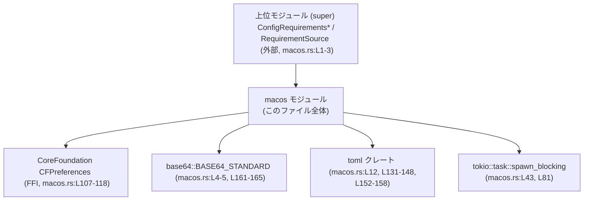
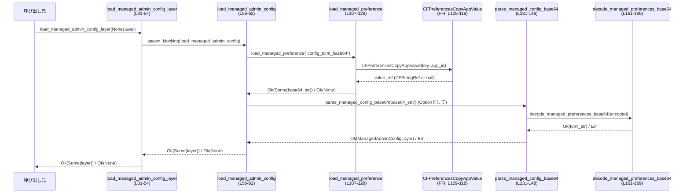

core/src/config_loader/macos.rs

---

## 0. ざっくり一言

macOS の「管理対象（MDM）プロファイル」配下に置かれた構成情報を、  
Base64 + TOML 形式で読み出し、アプリケーション設定や requirements に反映するためのモジュールです。  
macOS 固有 API（CoreFoundation の `CFPreferences`）を Tok io の非同期タスクから安全に呼び出しています。

---

## 1. このモジュールの役割

### 1.1 概要

- このモジュールは **macOS の Managed Preferences（MDM 管理設定）から設定値を取得する問題** を解決するために存在し、  
  **Base64 文字列として保存された TOML を読み出して構造化し、アプリの設定レイヤに統合する機能** を提供します。
- 管理者が MDM 経由で配布する `config_toml_base64` と `requirements_toml_base64` を読み、  
  TOML としてパースしてからアプリ内の設定/requirements 型に変換します。

※ 行番号の範囲は、このチャンク内での推定位置です（例: `macos.rs:L31-54`）。

### 1.2 アーキテクチャ内での位置づけ

主な依存関係と役割は次の通りです。

- 上位モジュール（`super`）  
  - `ConfigRequirementsToml` 型（requirements TOML 表現）を提供（`macos.rs:L1`）。
  - `ConfigRequirementsWithSources` 型（複数ソースの requirements 統合）を提供（`macos.rs:L2`）。
  - `RequirementSource` 列挙体（設定ソースの識別）を提供（`macos.rs:L3`）。
- 外部クレート
  - `core_foundation`（`CFPreferencesCopyAppValue` 経由で macOS の Managed Preferences を取得、`macos.rs:L107-118`）。
  - `base64`（MDM 管理値の Base64 デコード、`macos.rs:L161-165`）。
  - `toml`（TOML パース、`macos.rs:L131-148`, `L152-158`）。
  - `tokio::task::spawn_blocking`（ブロッキングな macOS API 呼び出しのオフロード、`macos.rs:L43`, `L81`）。
  - `tracing`（ログ出力、複数箇所）。

依存関係の簡易図（主要コンポーネントのみ）:



### 1.3 設計上のポイント

- **責務の分割**（`macos.rs:L31-62, L64-105, L107-170`）
  - 公開 API 相当の非同期関数は `load_managed_admin_config_layer` / `load_managed_admin_requirements_toml` に集約。
  - 実際の macOS Managed Preferences 読み出しは `load_managed_preference` に集約。
  - TOML / Base64 のデコード・パースは `decode_managed_preferences_base64` / `parse_*_base64` に分離。
- **非同期とブロッキング処理の切り分け**（`macos.rs:L43, L81`）
  - CFPreferences を呼ぶ関数は同期関数として定義し、それらを `tokio::task::spawn_blocking` で実行することで、  
    非同期ランタイムのワーカースレッドをブロックしない設計になっています。
- **エラーハンドリング**（`macos.rs:L43-52, L81-95, L131-148, L152-169`）
  - 失敗時は `io::Result` を用いて `io::ErrorKind::InvalidData` などにマッピング。
  - Base64/TOML/UTF-8 の各段階の失敗を、それぞれログ出力＋`io::Error` に変換。
  - `spawn_blocking` の `JoinError` はログに詳細を出しつつ、高レベルでは単一の汎用エラーにまとめています。
- **macOS 固有 API を `unsafe` に閉じ込める**（`macos.rs:L107-118, L127`）
  - `CFPreferencesCopyAppValue` の宣言と呼び出しは `load_managed_preference` の内部のみに閉じ込め、  
    それ以外は安全な Rust コードで扱うようにしています。

---

## 2. 主要な機能一覧

- Managed config レイヤ読み込み: `load_managed_admin_config_layer`  
  - MDM から Base64 + TOML のコンフィグを読み取り、`ManagedAdminConfigLayer` に変換する（`macos.rs:L31-62`）。
- Managed requirements 読み込み・マージ: `load_managed_admin_requirements_toml`  
  - MDM から Base64 + TOML の requirements を読み取り、`ConfigRequirementsWithSources` にマージする（`macos.rs:L64-97`）。
- macOS Managed Preferences 読み出し（内部）: `load_managed_preference`  
  - `CFPreferencesCopyAppValue` で文字列値を取得して `String` に変換する（`macos.rs:L107-129`）。
- Base64 文字列のデコード（内部）: `decode_managed_preferences_base64`  
  - Base64 → バイト列 → UTF-8 文字列への変換を行う（`macos.rs:L161-169`）。
- TOML パース（内部）:
  - `parse_managed_config_base64`: TOML を `TomlValue::Table` として読み、`ManagedAdminConfigLayer` を作る（`macos.rs:L131-148`）。
  - `parse_managed_requirements_base64`: TOML を `ConfigRequirementsToml` 型にパースする（`macos.rs:L152-158`）。
- Requirements ソース情報の生成（内部）: `managed_preferences_requirements_source`  
  - `RequirementSource::MdmManagedPreferences` を構築する（`macos.rs:L24-29`）。

---

## 3. 公開 API と詳細解説

### 3.1 型一覧（構造体・列挙体など）

| 名前 | 種別 | 役割 / 用途 | 根拠 |
|------|------|-------------|------|
| `ManagedAdminConfigLayer` | 構造体 | 管理者が MDM 経由で設定した TOML 設定のパース結果と、生の TOML 文字列を保持する | `macos.rs:L18-22` |

フィールドの概要:

| フィールド名 | 型 | 説明 | 根拠 |
|-------------|----|------|------|
| `config` | `TomlValue` | TOML 全体を `toml::Value`（このファイルでは別名 `TomlValue`）として保持。ルートはテーブルであることが保証される | `macos.rs:L20, L131-137` |
| `raw_toml` | `String` | Base64 → UTF-8 デコードした生の TOML テキスト | `macos.rs:L21, L131-137` |

### 3.2 関数詳細（最大 7 件）

ここでは、外部から利用される可能性が高いものと、中核的な内部ロジックを 7 件まで詳述します。

---

#### `managed_preferences_requirements_source() -> RequirementSource`

**概要**

MDM Managed Preferences から読み込まれた requirements の「ソース」を表す `RequirementSource` 値を構築します。  
`ConfigRequirementsWithSources` にマージする際の識別子として使われます。

**根拠**: `macos.rs:L24-29`

**引数**

なし。

**戻り値**

- `RequirementSource`  
  `RequirementSource::MdmManagedPreferences` バリアントを返し、`domain` と `key` にそれぞれ  
  `MANAGED_PREFERENCES_APPLICATION_ID` と `MANAGED_PREFERENCES_REQUIREMENTS_KEY` の文字列を設定します。  
  （`RequirementSource` の内部構造はこのチャンクには現れませんが、フィールド名から読み取れる範囲のみ記述しています。`macos.rs:L24-28`）

**内部処理の流れ**

1. 定数 `MANAGED_PREFERENCES_APPLICATION_ID`（アプリケーション ID）と  
   `MANAGED_PREFERENCES_REQUIREMENTS_KEY`（要件設定のキー）を `to_string()` で `String` に変換（`macos.rs:L26-27`）。
2. それらをフィールドとして `RequirementSource::MdmManagedPreferences` を構築し返します（`macos.rs:L25-28`）。

**Examples（使用例）**

```rust
// super モジュールから RequirementSource を受け取る関数に渡すことを想定した例
use crate::config_loader::macos::managed_preferences_requirements_source;

fn describe_source() {
    let source = managed_preferences_requirements_source(); // MDM Managed Preferences 由来のソース
    // ここで source をログ出力したり、ConfigRequirementsWithSources に渡したりできる
}
```

**Errors / Panics**

- エラーも panic も発生しません（単純な構築のみ）。

**Edge cases（エッジケース）**

- なし。定数からの文字列生成のみです。

**使用上の注意点**

- `RequirementSource` の具体的なバリアント名やフィールドはこのチャンクには現れないため、  
  他のバリアントとの違いを利用する処理は、上位モジュール側の定義を確認する必要があります。

---

#### `load_managed_admin_config_layer(override_base64: Option<&str>) -> io::Result<Option<ManagedAdminConfigLayer>>` （`async`）

**概要**

MDM Managed Preferences または明示的に渡された Base64 文字列から、  
管理者設定の TOML を読み取り `ManagedAdminConfigLayer` として返します。

**根拠**: `macos.rs:L31-54, L56-62, L131-148, L161-169`

**引数**

| 引数名 | 型 | 説明 |
|--------|----|------|
| `override_base64` | `Option<&str>` | `Some` の場合はこの Base64 文字列を直接利用し、MDM からの読み出しを行わない。`None` の場合は macOS の Managed Preferences を読み出す |

**戻り値**

- `io::Result<Option<ManagedAdminConfigLayer>>`
  - `Ok(Some(layer))` : 有効な設定が取得できた場合の `ManagedAdminConfigLayer`。
  - `Ok(None)` : 設定が見つからない／空文字列だった場合。
  - `Err(e)` : Base64/TOML/UTF-8 デコードの失敗や、バックグラウンドタスクの失敗など。

**内部処理の流れ**

1. `override_base64` が `Some(encoded)` の場合（`macos.rs:L34-41`）:
   - `encoded.trim()` で前後の空白を除去（`macos.rs:L35`）。
   - 空文字列であれば `Ok(None)` を返す（`macos.rs:L36-37`）。
   - それ以外なら `parse_managed_config_base64(trimmed).map(Some)` を返す（`macos.rs:L39`）。
2. `override_base64` が `None` の場合（`macos.rs:L43-52`）:
   - `tokio::task::spawn_blocking(load_managed_admin_config)` を呼び出し、  
     ブロッキングな `load_managed_admin_config()` を専用スレッドで実行（`macos.rs:L43`）。
   - `await` して `JoinHandle` の結果を受け取る（`macos.rs:L43`）。
   - `Ok(result)` の場合は `result` をそのまま返す（`macos.rs:L44`）。  
     ここでの `result` は `io::Result<Option<ManagedAdminConfigLayer>>`。
   - `Err(join_err)` の場合は、キャンセルかどうかでログを分けて出し（`macos.rs:L46-50`）、  
     `io::Error::other("Failed to load managed config")` として失敗を返す（`macos.rs:L51`）。

`load_managed_admin_config` の中身:

- `load_managed_preference(MANAGED_PREFERENCES_CONFIG_KEY)?` で Base64 文字列を取得（`macos.rs:L56-57`）。
- `Option<String>` を `as_deref().map(str::trim)` などで変換し、  
  文字列があれば `parse_managed_config_base64` に渡す（`macos.rs:L58-61`）。
- 最終的に `Option<ManagedAdminConfigLayer>` を返す（`macos.rs:L56-62`）。

**Examples（使用例）**

1. MDM から読み出す標準的な使い方:

```rust
use crate::config_loader::macos::load_managed_admin_config_layer;

async fn load_config() -> std::io::Result<()> {
    // override_base64 = None なので、macOS Managed Preferences から読み込む
    if let Some(layer) = load_managed_admin_config_layer(None).await? {
        // layer.config に TOML テーブル、layer.raw_toml に生 TOML が入っている
        println!("Managed config TOML: {}", layer.raw_toml);
    }
    Ok(())
}
```

1. テストや一時的な上書き用に、文字列から直接読み込む例:

```rust
use crate::config_loader::macos::load_managed_admin_config_layer;

async fn load_override_config() -> std::io::Result<()> {
    // 仮の TOML を Base64 化したもの
    let encoded = "dGVzdCA9ICJ2YWx1ZSIK"; // 例: `test = "value"` を Base64 にした文字列

    if let Some(layer) = load_managed_admin_config_layer(Some(encoded)).await? {
        assert_eq!(layer.config["test"].as_str(), Some("value"));
    }
    Ok(())
}
```

**Errors / Panics**

- Base64 デコード失敗（`decode_managed_preferences_base64` 内, `macos.rs:L161-165`）:
  - `io::ErrorKind::InvalidData` で `Err` を返す。ログ:  
    `"Failed to decode managed value as base64: {err}"`（`macos.rs:L162-164`）。
- UTF-8 として不正なバイト列（`macos.rs:L166-169`）:
  - 同様に `io::ErrorKind::InvalidData`。ログ:  
    `"Managed value base64 contents were not valid UTF-8: {err}"`。
- TOML パース失敗（構文エラー）（`macos.rs:L145-148`）:
  - `io::ErrorKind::InvalidData`。ログ:  
    `"Failed to parse managed config TOML: {err}"`。
- TOML ルートがテーブルでない（`macos.rs:L138-143`）:
  - `io::ErrorKind::InvalidData`。メッセージ `"managed config root must be a table"`。
- `spawn_blocking` の `JoinError`:
  - キャンセル/失敗を `tracing::error!` でログ出力（`macos.rs:L46-50`）。
  - 呼び出し側には `"Failed to load managed config"` というメッセージの `io::Error::other` を返す（`macos.rs:L51`）。
- panic を発生させるコードは含まれていません（`unwrap` 等は未使用）。

**Edge cases（エッジケース）**

- `override_base64` が `Some("")` または空白のみ（`"   "`）:
  - `trim()` 後に空文字となり `Ok(None)` を返す（`macos.rs:L34-37`）。
- macOS Managed Preferences にキーが存在しない場合:
  - `load_managed_preference` が `Ok(None)` を返し（`macos.rs:L120-125`）、  
    その結果 `load_managed_admin_config` も `Ok(None)` を返す（`macos.rs:L56-62`）。
- MDM 側に不正な Base64 / UTF-8 / TOML が設定されている場合:
  - それぞれのステップで `Err(io::ErrorKind::InvalidData)` となる。

**使用上の注意点**

- **非同期コンテキスト**: `async fn` のため、Tokio などの非同期ランタイム上で `.await` する必要があります。
- **ブロッキング処理の分離**: CFPreferences 呼び出しは `spawn_blocking` 内で行われるため、  
  呼び出し元で追加のスレッドプール設定等を行う場合は、Tokio のランタイム設定とあわせて検討する必要があります。
- **エラー情報の粒度**: `spawn_blocking` の失敗はすべて `"Failed to load managed config"` にマッピングされるため、  
  呼び出し側からは理由を細かく区別できません。より詳細な原因が必要な場合は、この関数をラップしてログを参照する必要があります。

---

#### `load_managed_admin_requirements_toml(target: &mut ConfigRequirementsWithSources, override_base64: Option<&str>) -> io::Result<()>` （`async`）

**概要**

MDM Managed Preferences またはオーバーライド文字列から requirements TOML を読み込み、  
`ConfigRequirementsWithSources` に「未設定フィールドのみ上書き」する形でマージします。

**根拠**: `macos.rs:L64-97, L99-105, L152-158, L161-169`

**引数**

| 引数名 | 型 | 説明 |
|--------|----|------|
| `target` | `&mut ConfigRequirementsWithSources` | 読み込んだ requirements をマージする対象。`merge_unset_fields` メソッドを持つことが前提（`macos.rs:L74-77, L83-85`）。 |
| `override_base64` | `Option<&str>` | `Some` の場合はこの Base64 requirements を用い、Managed Preferences からの読み出しを行わない。`None` の場合は macOS の Managed Preferences を読み出す。 |

**戻り値**

- `io::Result<()>`
  - 成功時は `Ok(())`。
  - Base64/TOML/UTF-8 のデコードエラーやタスク失敗時は `Err(e)`。

**内部処理の流れ**

1. `override_base64` が `Some(encoded)` の場合（`macos.rs:L68-79`）:
   - `encoded.trim()` で空白除去（`macos.rs:L69`）。
   - 空文字列であれば何もせず `Ok(())` を返す（`macos.rs:L70-72`）。
   - それ以外なら `parse_managed_requirements_base64(trimmed)?` で `ConfigRequirementsToml` を取得（`macos.rs:L76-77`）。
   - `target.merge_unset_fields(managed_preferences_requirements_source(), parsed)` を呼び、未設定フィールドにだけ値をマージ（`macos.rs:L74-77`）。
2. `override_base64` が `None` の場合（`macos.rs:L81-95`）:
   - `spawn_blocking(load_managed_admin_requirements).await` でブロッキング処理を別スレッドにオフロード。
   - `Ok(result)` の場合:
     - `result?` で `io::Result<Option<ConfigRequirementsToml>>` をアンラップし（`macos.rs:L83`）、
     - `Some(requirements)` のときだけ `merge_unset_fields` を呼ぶ（`macos.rs:L83-85`）。
   - `Err(join_err)` の場合:
     - キャンセル/失敗をログ出力（`macos.rs:L89-93`）。
     - `"Failed to load managed requirements"` という `io::Error::other` を返す（`macos.rs:L94`）。

`load_managed_admin_requirements` の中身:

- `load_managed_preference(MANAGED_PREFERENCES_REQUIREMENTS_KEY)?` で Base64 文字列を取得（`macos.rs:L99-100`）。
- `Option<String>` を `as_deref().map(str::trim)` などで変換し（`macos.rs:L101-103`）、  
  文字列があれば `parse_managed_requirements_base64` に渡す（`macos.rs:L103-104`）。
- `Option<ConfigRequirementsToml>` を返す（`macos.rs:L99-105`）。

**Examples（使用例）**

```rust
use crate::config_loader::macos::load_managed_admin_requirements_toml;
// ConfigRequirementsWithSources は super モジュール等で定義されているものとする

async fn load_requirements(
    target: &mut ConfigRequirementsWithSources,
) -> std::io::Result<()> {
    // MDM から読み込み
    load_managed_admin_requirements_toml(target, None).await?;
    Ok(())
}
```

オーバーライドを用いる例:

```rust
async fn load_requirements_override(
    target: &mut ConfigRequirementsWithSources,
) -> std::io::Result<()> {
    let encoded = "..."; // Base64 の requirements TOML
    load_managed_admin_requirements_toml(target, Some(encoded)).await?;
    Ok(())
}
```

**Errors / Panics**

- Base64/UTF-8/TOML の各エラーは `parse_managed_requirements_base64` と  
  `decode_managed_preferences_base64` により `io::ErrorKind::InvalidData` で返されます（`macos.rs:L152-158, L161-169`）。
- Managed Preferences に値が見つからない場合はエラーにはならず、何もマージされません（`macos.rs:L99-105, L83-85`）。
- `spawn_blocking` の `JoinError` は `"Failed to load managed requirements"` にマッピングされます（`macos.rs:L81-96`）。
- panic は使用されていません。

**Edge cases（エッジケース）**

- `override_base64` が空文字／空白のみ:
  - 何もせず `Ok(())`（`macos.rs:L69-72`）。
- Managed Preferences にキーが存在しない:
  - `load_managed_admin_requirements` が `Ok(None)` を返し、そのまま何もマージしません（`macos.rs:L99-105, L83-85`）。
- 不正な Base64/UTF-8/TOML:
  - エラーとして `Err(io::ErrorKind::InvalidData)` が返され、`target` には変更が行われません。

**使用上の注意点**

- `ConfigRequirementsWithSources::merge_unset_fields` の挙動（どのフィールドを「未設定」とみなすか）は  
  このチャンクには定義がなく不明です。上位モジュールの実装を確認する必要があります。
- 複数の設定ソースがある場合、どの順序で `load_managed_admin_requirements_toml` を呼び出すかにより、  
  優先順位の結果が変わる可能性があります。

---

#### `load_managed_preference(key_name: &str) -> io::Result<Option<String>>`

**概要**

macOS の `CFPreferencesCopyAppValue` を用いて、指定されたキーの Managed Preferences 値を文字列として取得します。  
値が存在しない場合は `Ok(None)` を返します。

**根拠**: `macos.rs:L107-129`

**引数**

| 引数名 | 型 | 説明 |
|--------|----|------|
| `key_name` | `&str` | Managed Preferences のキー名（例: `"config_toml_base64"`） |

**戻り値**

- `io::Result<Option<String>>`
  - `Ok(Some(value))` : Managed Preferences に値が存在した場合の文字列。
  - `Ok(None)` : 値が存在しなかった場合。
  - `Err(e)` : この関数の中ではエラー生成はなく、現状は常に `Ok(..)` を返します。

**内部処理の流れ**

1. `#[link(name = "CoreFoundation", kind = "framework")]` で CoreFoundation フレームワークをリンク（`macos.rs:L108`）。
2. `unsafe extern "C"` ブロック内で `CFPreferencesCopyAppValue` を宣言（`macos.rs:L109-111`）。
3. `CFString::new(key_name)` および `CFString::new(MANAGED_PREFERENCES_APPLICATION_ID)` から  
   `CFStringRef` を取得し、`CFPreferencesCopyAppValue` を呼び出す（`macos.rs:L113-118`）。
4. 戻り値 `value_ref` が `null` かどうかをチェック（`macos.rs:L120-124`）。
   - `null` ならば debug ログを出し `Ok(None)` を返す。
5. `null` でない場合は `CFString::wrap_under_create_rule(value_ref as _)` で `CFString` を所有権付きでラップ（`macos.rs:L127`）。
6. `.to_string()` で Rust の `String` に変換し、`Ok(Some(value))` を返す（`macos.rs:L127-128`）。

**Examples（使用例）**

```rust
use crate::config_loader::macos::load_managed_preference;

fn get_raw_config_base64() -> std::io::Result<Option<String>> {
    // 実際には pub で公開されていないため、同モジュール内またはテストからの利用を想定した例です。
    load_managed_preference("config_toml_base64")
}
```

**Errors / Panics**

- この関数自身では `io::Error` は生成していません。  
  ただし FFI 呼び出しの失敗などは `null` ポインタとして返ってくる可能性があり、その場合は `Ok(None)` となります。
- `CFString::wrap_under_create_rule` や `to_string` が panic する可能性は一般的には低いですが、  
  このチャンクには panic 条件についての情報はありません。

**Edge cases（エッジケース）**

- キーが存在しない／値が設定されていない場合:
  - `value_ref` が `null` となり `Ok(None)` を返します（`macos.rs:L120-125`）。
- 値が文字列以外に設定されている場合:
  - `CFPreferencesCopyAppValue` が返す型はこのチャンクでは確認できません。  
    `CFString::wrap_under_create_rule(value_ref as _)` が正しく動作するかは不明です。

**使用上の注意点**

- **unsafe の閉じ込め**: FFI 呼び出しとポインタ変換が `unsafe` ブロック内にあるため、  
  この関数の実装を変更する場合は CoreFoundation API のライフタイム・所有権ルール（Create Rule）に注意が必要です。
- **スレッド安全性**: `CFPreferencesCopyAppValue` のスレッド安全性は Apple のドキュメントに依存します。  
  現状は `spawn_blocking` 内でしか使われていないため、Tokio の非同期ランタイムと直接衝突しないように設計されています。

---

#### `parse_managed_config_base64(encoded: &str) -> io::Result<ManagedAdminConfigLayer>`

**概要**

Base64 エンコードされた TOML 文字列をデコードし、`toml::Value` としてパースした上で  
`ManagedAdminConfigLayer` にまとめて返します。TOML のルートはテーブルであることを要求します。

**根拠**: `macos.rs:L131-148, L161-169`

**引数**

| 引数名 | 型 | 説明 |
|--------|----|------|
| `encoded` | `&str` | Base64 エンコードされた TOML 文字列 |

**戻り値**

- `io::Result<ManagedAdminConfigLayer>`
  - 成功時は `ManagedAdminConfigLayer { config, raw_toml }`。
  - 失敗時は `io::ErrorKind::InvalidData` などの `io::Error`。

**内部処理の流れ**

1. `decode_managed_preferences_base64(encoded)?` で Base64 → UTF-8 文字列への変換を行い、`raw_toml` を得る（`macos.rs:L132`）。
2. `toml::from_str::<TomlValue>(&raw_toml)` で TOML を `toml::Value` としてパース（`macos.rs:L133`）。
3. `match` でパース結果を分岐（`macos.rs:L133-149`）:
   - `Ok(TomlValue::Table(parsed))` の場合:
     - `ManagedAdminConfigLayer { config: TomlValue::Table(parsed), raw_toml }` を返す（`macos.rs:L134-137`）。
   - `Ok(other)`（テーブル以外）:
     - エラーログ（`tracing::error!`）出力（`macos.rs:L139`）。
     - `"managed config root must be a table"` という `io::ErrorKind::InvalidData` を返す（`macos.rs:L140-143`）。
   - `Err(err)`（TOML パース失敗）:
     - エラーログ出力（`macos.rs:L146`）。
     - `io::Error::new(io::ErrorKind::InvalidData, err)` を返す（`macos.rs:L147-148`）。

**Examples（使用例）**

```rust
use crate::config_loader::macos::parse_managed_config_base64;

fn parse_example() -> std::io::Result<()> {
    // `setting = 1` という TOML を Base64 にした例
    let encoded = base64::engine::general_purpose::STANDARD.encode(b"setting = 1");
    let layer = parse_managed_config_base64(&encoded)?;
    assert_eq!(layer.config["setting"].as_integer(), Some(1));
    Ok(())
}
```

**Errors / Panics**

- Base64 デコード／UTF-8 変換エラーは `decode_managed_preferences_base64` で処理されます（`macos.rs:L161-169`）。
- TOML パース失敗は `io::ErrorKind::InvalidData` にマッピングされます（`macos.rs:L133, L145-148`）。
- ルートがテーブルでない場合も `io::ErrorKind::InvalidData` となります（`macos.rs:L138-143`）。
- panic は使用されていません。

**Edge cases（エッジケース）**

- 空の TOML（`""`）:
  - TOML の仕様上、これがどう扱われるかは `toml::from_str` の挙動に依存し、このチャンクだけでは断定できません。
- ルートが配列やスカラーの場合:
  - `Ok(other)` パスに入り、エラーとして扱われます（`macos.rs:L138-143`）。

**使用上の注意点**

- この関数はルートをテーブルに限定しているため、`toml::Value` として任意の構造を受け取りたい場合は  
  別のパーサ関数を定義する必要があります。
- エラー内容は `io::Error` に包まれるため、もとの `toml::de::Error` を参照したい場合は `source()` で取り出す必要があります。

---

#### `parse_managed_requirements_base64(encoded: &str) -> io::Result<ConfigRequirementsToml>`

**概要**

Base64 エンコードされた requirements 用 TOML 文字列をデコードし、  
`ConfigRequirementsToml` 型にパースして返します。

**根拠**: `macos.rs:L152-158, L161-169`

**引数**

| 引数名 | 型 | 説明 |
|--------|----|------|
| `encoded` | `&str` | Base64 エンコードされた requirements TOML 文字列 |

**戻り値**

- `io::Result<ConfigRequirementsToml>`
  - 成功時は `ConfigRequirementsToml` インスタンス。
  - 失敗時は `io::ErrorKind::InvalidData` など。

**内部処理の流れ**

1. `decode_managed_preferences_base64(encoded)?` で Base64 → UTF-8 の文字列に変換（`macos.rs:L153`）。
2. `toml::from_str::<ConfigRequirementsToml>(&decoded)` でパース（`macos.rs:L153`）。
3. 失敗した場合は `.map_err(|err| { ... })` のクロージャでログを出し、  
   `io::Error::new(io::ErrorKind::InvalidData, err)` を返す（`macos.rs:L153-158`）。

**Examples（使用例）**

```rust
use crate::config_loader::macos::parse_managed_requirements_base64;
// ConfigRequirementsToml 型は super モジュールで定義されていると想定

fn parse_requirements(encoded: &str) -> std::io::Result<ConfigRequirementsToml> {
    parse_managed_requirements_base64(encoded)
}
```

**Errors / Panics**

- Base64/UTF-8 エラーは `decode_managed_preferences_base64` によって `io::ErrorKind::InvalidData` として返されます。
- TOML パースエラーも `InvalidData` にマッピングされ、ログが出力されます（`macos.rs:L155-157`）。
- panic は使用されていません。

**Edge cases（エッジケース）**

- TOML の内容や構造が `ConfigRequirementsToml` の期待と合致しない場合（フィールド欠如等）は  
  パースエラーとなり `Err(io::ErrorKind::InvalidData)` になります。  
  具体的な必須フィールドはこのチャンクには現れません。

**使用上の注意点**

- `ConfigRequirementsToml` の構造に関しては、上位モジュールの定義を確認する必要があります。

---

#### `decode_managed_preferences_base64(encoded: &str) -> io::Result<String>`

**概要**

Managed Preferences に保存された Base64 文字列をデコードし、UTF-8 文字列として返します。  
Base64 デコードおよび UTF-8 変換の両方で詳細なエラーログを出します。

**根拠**: `macos.rs:L161-169`

**引数**

| 引数名 | 型 | 説明 |
|--------|----|------|
| `encoded` | `&str` | Base64 エンコードされた文字列 |

**戻り値**

- `io::Result<String>`
  - 成功時は UTF-8 文字列。
  - 失敗時は `io::ErrorKind::InvalidData` などの `io::Error`。

**内部処理の流れ**

1. `BASE64_STANDARD.decode(encoded.as_bytes())` で Base64 デコード（`macos.rs:L162-163`）。
   - 失敗時はログを出し、`io::ErrorKind::InvalidData` として返す。
2. `String::from_utf8(decoded_bytes)` で UTF-8 文字列に変換（`macos.rs:L161, L166-167`）。
   - 失敗時もログを出し、`io::ErrorKind::InvalidData` として返す（`macos.rs:L167-169`）。

**Examples（使用例）**

```rust
use crate::config_loader::macos::decode_managed_preferences_base64;

fn decode_example() -> std::io::Result<()> {
    let text = "hello";
    let encoded = base64::engine::general_purpose::STANDARD.encode(text.as_bytes());
    let decoded = decode_managed_preferences_base64(&encoded)?;
    assert_eq!(decoded, text);
    Ok(())
}
```

**Errors / Panics**

- Base64 デコードエラー時:
  - ログ: `"Failed to decode managed value as base64: {err}"`（`macos.rs:L162-164`）。
  - `io::ErrorKind::InvalidData`。
- UTF-8 変換エラー時:
  - ログ: `"Managed value base64 contents were not valid UTF-8: {err}"`（`macos.rs:L167-168`）。
  - `io::ErrorKind::InvalidData`。
- panic は使用されていません。

**Edge cases（エッジケース）**

- 空文字列:
  - Base64 デコードの仕様に依存しますが、通常は空バイト列 → 空文字列として `Ok("")` となるはずです。  
    このチャンクだけでは仕様を断定できないため、Base64 実装のドキュメントを参照する必要があります。
- 末尾に無関係な空白がある場合:
  - `encoded.as_bytes()` にそのまま渡されるため、Base64 エラーになる可能性があります。  
    実際の呼び出し側（`load_managed_admin_*`）では `trim()` 済みの値を渡しているため、通常は問題にならない設計です（`macos.rs:L35, L59, L69, L102`）。

**使用上の注意点**

- この関数は「Base64 + UTF-8」という 2 段階の前提を持っています。  
  それ以外のエンコーディング（例: Shift_JIS 等）には対応していません。
- 直接この関数を外部で利用する場合も、呼び出し前に `trim()` で空白を取り除くのが安全です。

---

### 3.3 その他の関数

| 関数名 | 役割（1 行） | 根拠 |
|--------|--------------|------|
| `load_managed_admin_config()` | Managed Preferences の `config_toml_base64` を読み出し、`Option<ManagedAdminConfigLayer>` に変換する内部同期関数 | `macos.rs:L56-62` |
| `load_managed_admin_requirements()` | Managed Preferences の `requirements_toml_base64` を読み出し、`Option<ConfigRequirementsToml>` に変換する内部同期関数 | `macos.rs:L99-105` |

---

## 4. データフロー

### 4.1 Managed config 読み込み時のデータフロー

代表的なシナリオとして、オーバーライド指定なしで Managed config を読み込む場合のフローを示します。

- 呼び出し元が `load_managed_admin_config_layer(None).await` を呼ぶ。
- 非同期関数内で `spawn_blocking(load_managed_admin_config)` により別スレッドで同期処理を実行。
- 同期処理 `load_managed_admin_config` が `load_managed_preference` を通じて CFPreferences から Base64 文字列を取得。
- Base64 文字列は `parse_managed_config_base64` → `decode_managed_preferences_base64` に渡され、TOML の `ManagedAdminConfigLayer` に変換される。



この図は、主に以下のポイントを示しています。

- ブロッキングな macOS API 呼び出し（`CFPreferencesCopyAppValue`）が同期関数内に閉じ込められていること。
- エラーがあれば、それ以降の処理（デコード・パース）は実行されず `io::Error` として呼び出し元に返ること。
- `Option` を通して「設定が存在しない」ケースと本当のエラーが区別されていること。

---

## 5. 使い方（How to Use）

### 5.1 基本的な使用方法

アプリケーション起動時に、MDM 管理設定を読み込んで設定に反映する流れの例です。

```rust
use std::io;
use crate::config_loader::macos::{
    load_managed_admin_config_layer,
    load_managed_admin_requirements_toml,
};

// ConfigRequirementsWithSources やアプリ設定型は別モジュールで定義されているとする
async fn init_config(
    requirements: &mut ConfigRequirementsWithSources,
) -> io::Result<()> {
    // 1. Managed config を読み込む
    if let Some(managed_layer) = load_managed_admin_config_layer(None).await? {
        // managed_layer.config, managed_layer.raw_toml をアプリ設定にマージ
        println!("Managed config: {}", managed_layer.raw_toml);
    }

    // 2. Managed requirements を読み込んでマージ
    load_managed_admin_requirements_toml(requirements, None).await?;

    Ok(())
}
```

### 5.2 よくある使用パターン

1. **MDM を無視してローカル設定のみを使う**

   - `load_managed_admin_config_layer` / `load_managed_admin_requirements_toml` を呼ばない。
   - または `override_base64` に空文字列を渡して「何もしない」ことを明示（`trim` 後に空文字 → noop）。

2. **テスト用にオーバーライドを使う**

```rust
async fn init_config_with_override(
    requirements: &mut ConfigRequirementsWithSources,
) -> io::Result<()> {
    let config_override = Some("...base64 of test config...");
    let req_override = Some("...base64 of test requirements...");

    if let Some(layer) = load_managed_admin_config_layer(config_override).await? {
        // layer をテスト用設定として使う
    }

    load_managed_admin_requirements_toml(requirements, req_override).await?;

    Ok(())
}
```

- これにより、macOS 環境や MDM 設定が利用できない CI などでも同じコードパスをテストできます。

### 5.3 よくある間違い

```rust
// 間違い例: Base64 文字列に前後の空白が入っているまま渡す
let encoded = "  dGVzdCA9IDEK  ";
let layer = load_managed_admin_config_layer(Some(encoded)).await?;
// ※実装では内部で trim() しているため、これは実際には問題にはなりません。

// 正しい例: trim 処理はこの関数内で行われるため、そのまま渡してよい
let layer = load_managed_admin_config_layer(Some(encoded)).await?;
```

```rust
// 間違い例: 非同期コンテキスト外で await しようとする
// let layer = load_managed_admin_config_layer(None).await?;

// 正しい例: Tokio ランタイム内で await
#[tokio::main]
async fn main() -> std::io::Result<()> {
    let _ = load_managed_admin_config_layer(None).await?;
    Ok(())
}
```

### 5.4 使用上の注意点（まとめ）

- **非同期ランタイム依存**: `load_managed_admin_config_layer` と `load_managed_admin_requirements_toml` は `tokio::task::spawn_blocking` を使用しているため、  
  Tokio ランタイムが必要です（別のランタイムを使う場合はラッパーが必要になる可能性があります）。
- **MDM 以外の環境**: Managed Preferences が設定されていない環境では `Option::None` ／何もマージしない動作となるため、  
  他の設定ソース（ファイルや環境変数など）との組み合わせを考慮した設計が必要です。
- **ログ依存のトラブルシュート**: エラーの詳細は `tracing` ログにのみ出力される箇所があるため、  
  運用時のトラブルシュートにはログ収集が重要です（`macos.rs:L46-52, L89-95, L139-147, L155-168`）。

---

## 6. 変更の仕方（How to Modify）

### 6.1 新しい機能を追加する場合

例: 新しい Managed Preferences キー（例: `"feature_flags_base64"`）を追加したい場合。

1. **定数の追加**
   - `MANAGED_PREFERENCES_*` と同様の定数を追加（`macos.rs:L14-16` を参考）。
2. **読み出し関数の追加**
   - `load_managed_admin_config` / `load_managed_admin_requirements` のパターンを参考に、  
     新しいキー用の同期関数を実装（`load_managed_preference` の再利用）。
3. **非同期ラッパーの追加**
   - `load_managed_admin_config_layer` / `load_managed_admin_requirements_toml` と同様に  
     `spawn_blocking` を使った非同期関数を用意。
4. **TOML パーサの用意**
   - `parse_managed_config_base64` / `parse_managed_requirements_base64` と同様の関数を作成し、  
     適切な型にパースする。

### 6.2 既存の機能を変更する場合

- `load_managed_preference` の戻り値や FFI 呼び出しを変更する際の注意:
  - `CFPreferencesCopyAppValue` の使用方法（Create Rule / Copy Rule）を守る必要があります。
  - `null` の扱い（「値が存在しない」か、「何らかのエラー」か）を変更する場合は、  
    呼び出し側の `Option` ロジックにも影響するため、影響範囲を確認する必要があります。
- `parse_managed_config_base64` のルートテーブル制約を変更する場合:
  - すでにこの前提に依存したコード（`ManagedAdminConfigLayer` の利用側）が存在する可能性があるため、  
    返却型やエラー条件の変更には注意が必要です。
- 非同期ラッパー（`load_managed_admin_config_layer` / `load_managed_admin_requirements_toml`）の  
  エラーメッセージやログを変更する場合:
  - 監視やアラートでこれらのログメッセージを利用している場合は、それらの設定も更新する必要があります。

---

## 7. 関連ファイル

このモジュールと密接に関係する型や機能は、`super` モジュールからインポートされていますが、  
このチャンクにはファイルパスが明示されていません。

| パス | 役割 / 関係 |
|------|------------|
| （不明, super モジュール）`ConfigRequirementsToml` | requirements 用 TOML の構造を表す型。`parse_managed_requirements_base64` の戻り値として使用（`macos.rs:L1, L152-158`）。 |
| （不明, super モジュール）`ConfigRequirementsWithSources` | 複数ソースからの requirements を統合するコンテナ。`load_managed_admin_requirements_toml` でマージ対象として利用（`macos.rs:L2, L64-77, L83-85`）。 |
| （不明, super モジュール）`RequirementSource` | requirements のソース種別を表す列挙体。`managed_preferences_requirements_source` で `MdmManagedPreferences` バリアントが使用される（`macos.rs:L3, L24-29`）。 |

このファイル単体からは、これらの型がどのファイルに定義されているかは分かりませんが、  
`core/src/config_loader` ディレクトリ内の他ファイルで定義されている可能性があります（推測であり、断定はできません）。
