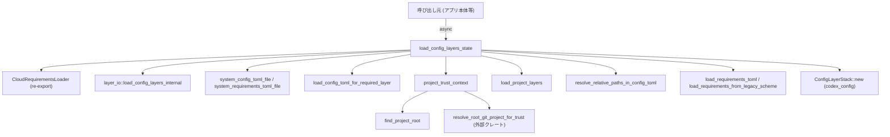
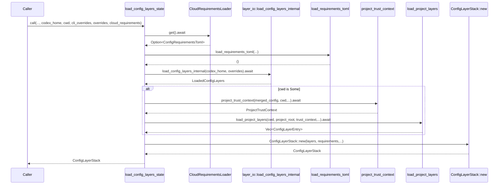

# core/src/config_loader/mod.rs コード解説

※補足: 提供されたコード断片には行番号情報が含まれていないため、説明中の「根拠」は関数名・型名・コメントなどで示します。`mod.rs:Lxx-Lyy` 形式の厳密な行番号は、この情報だけからは特定できません。

---

## 0. ざっくり一言

Codex の設定ファイル群（`config.toml` / `requirements.toml` / legacy `managed_config.toml` など）を読み込み、**信頼レベル（trusted/untrusted）や由来ごとのレイヤー構造**を持つ `ConfigLayerStack` と **制約情報 (`ConfigRequirements`)** を構築するモジュールです。

---

## 1. このモジュールの役割

### 1.1 概要

- このモジュールは **Codex の設定を複数レイヤーから統合し、適用可能な設定スタックを構築する**ために存在します。
- クラウド／管理者／システム／ユーザー／プロジェクト／CLI など複数のソースから設定と制約を読み込み、**優先順位と信頼性**に基づいてマージします。
- プロジェクトごとの **trust 設定（trusted / untrusted）** に応じて、`config.toml` を「有効／disabled」としてレイヤーに格納します。
- Windows / Unix 固有の設定ファイル位置の解決や、古い `managed_config.toml` を新しい `requirements.toml` 形式にマッピングする互換レイヤーも含みます。

### 1.2 アーキテクチャ内での位置づけ

主要依存関係と役割の関係を簡略化した図です。



- 本モジュールは `ConfigLayerStack` と `ConfigRequirements` を組み立てる**フロントエンド**のような位置づけで、実際の構造体定義や低レベル処理は `codex_config`・`layer_io`・OS API などに委譲しています。
- 信頼判断に必要な Git ルート探索は `codex_git_utils::resolve_root_git_project_for_trust` に依存しています。

### 1.3 設計上のポイント

コードから読み取れる特徴を挙げます。

- **レイヤー構造・優先順位**
  - 設定（`ConfigLayerStack`）は、システム → ユーザー → プロジェクト（project tree / repo）→ セッション（CLI/UI overrides）→ legacy managed_config の順に積み上がります。
  - 一方で制約（`ConfigRequirementsWithSources`）は、**先に適用されたソースが勝つ（後続ソースは未設定フィールドのみ埋める）**という `merge_unset_fields` ポリシーです。
- **信頼モデル**
  - プロジェクトごとの trust 設定を `ProjectTrustContext` にまとめ、ディレクトリごとに
    - trust 情報の検索（dir → project_root → repo_root）
    - untrusted / 未定義のときのユーザー向けメッセージ生成  
    を行います。
  - untrusted なディレクトリ配下の `.codex/config.toml` はレイヤーとしては追加されますが、`ConfigLayerEntry::new_disabled` によって**無効化されたレイヤー**として扱われます。
- **パス解決と安全性**
  - `resolve_relative_paths_in_config_toml` が `AbsolutePathBufGuard` と `ConfigToml` との round-trip を使って、**config.toml 中の相対パスをファイル位置に対して正規化**します。
  - ただし、`ConfigToml` にマッピングできない TOML については、**元の `toml::Value` をそのまま返して無理に壊さない**設計です。
- **エラーハンドリング**
  - すべて `Result` ベースで、`io::Error` に畳み込んで呼び出し側に返します。
  - 一部では `ConfigError` を優先して返すためのヘルパ (`first_layer_config_error_from_entries`, `io_error_from_config_error`) を使い、ユーザーが原因を特定しやすいようになっています。
  - 設定ファイルが「存在しない」のと「壊れている／パース不可」のケースを区別し、「存在しない」場合は空のテーブルを使うなど、エラーと非エラーの線引きが明示されています。
- **並行性**
  - ファイル I/O はすべて `tokio::fs` の `async` API を使用し、非同期ランタイム上でブロックしないようになっています。
  - Windows の `SHGetKnownFolderPath` 呼び出しで `unsafe` を使用しますが、メモリ管理（null チェック → UTF-16 読み取り → `CoTaskMemFree`）が明示されています。
- **互換性レイヤー**
  - legacy `managed_config.toml` を `LegacyManagedConfigToml` → `ConfigRequirementsToml` に変換することで、**古い形式の設定から新しい requirements モデルに橋渡し**しています。

---

## 2. 主要な機能一覧

このモジュールが提供する主要機能は次のとおりです。

- `load_config_layers_state`: Codex 全体の設定レイヤー (`ConfigLayerStack`) と requirements を構築するメイン API。
- `resolve_relative_paths_in_config_toml`: `config.toml` 内の相対パスを、読み込まれたディレクトリを基準に絶対パスへ解決する。
- プロジェクト trust 関連
  - `project_trust_context`: マージ済み設定から trust マップを構築。
  - `project_trust_key`: パスを canonicalize して trust マップ用キーに変換。
  - `load_project_layers`: `project_root`〜`cwd` 間の `.codex/config.toml` を探索し、信頼レベルに応じたレイヤーを構築。
- requirements 関連
  - `load_requirements_toml`: システム `requirements.toml` を読み込み、未設定の制約を埋める。
  - `load_requirements_from_legacy_scheme`: legacy `managed_config.toml` を requirements に変換して統合。
- 設定ファイル読み込み共通処理
  - `load_config_toml_for_required_layer`: 指定パスの `config.toml` を読み込み、`ConfigLayerEntry` を生成。
- OS 依存パス解決
  - `system_config_toml_file` / `system_requirements_toml_file`: OS ごとの標準パスを解決。
  - Windows 向けの ProgramData / `OpenAI\Codex` パス解決関数群。

---

## 3. 公開 API と詳細解説

### 3.1 型一覧（構造体・列挙体など）

#### このモジュールで定義している主な型

| 名前 | 種別 | 公開範囲 | 役割 / 用途 |
|------|------|----------|-------------|
| `ProjectTrustContext` | 構造体 | private | プロジェクトの trust 設定（project_root / repo_root / trust マップ / user_config_file）をまとめたコンテキスト。`load_project_layers` で参照されます。 |
| `ProjectTrustConfigToml` | 構造体 | private (`Deserialize`) | `config.toml` 中の `projects` セクションを `HashMap<String, ProjectConfig>` として受けるための TOML マッピング。 |
| `ProjectTrustDecision` | 構造体 | private | 特定ディレクトリに対する trust レベル（`Option<TrustLevel>`）と、その判定に使ったキー文字列を保持。 |
| `LegacyManagedConfigToml` | 構造体 | private (`Deserialize`, `Debug`, `Clone`, `Default`, `PartialEq`) | legacy `managed_config.toml` のサブセットを表現する型。`approval_policy` / `approvals_reviewer` / `sandbox_mode` を保持。 |

#### このモジュールが re-export している代表的な型

ほとんどは `codex_config` / `codex_protocol` からの再エクスポートです。全ては列挙しませんが、代表的なものを示します。

| 名前 | 出所 | 役割 / 用途 |
|------|------|-------------|
| `ConfigLayerStack`, `ConfigLayerEntry`, `ConfigLayerStackOrdering` | `codex_config` | 設定レイヤーのスタック本体と要素、並び順。 |
| `ConfigError`, `ConfigLoadError` | `codex_config` | 設定読み込み時の論理エラー情報。 |
| `ConfigRequirements`, `ConfigRequirementsToml`, `ConfigRequirementsWithSources` | `codex_config` | 設定に対する制約集合と、TOML からの表現。 |
| `LoaderOverrides` | `codex_config` | CLI や環境変数などによる読み込みオーバーライド指定。 |
| `RequirementSource`, `ConstrainedWithSource`, `Sourced` | `codex_config` | 各制約がどのソースから来たかを保持するためのメタ情報。 |
| `SandboxModeRequirement`, `SandboxMode`, `WebSearchModeRequirement`, `ResidencyRequirement`, `SandboxModeRequirement` | `codex_config` / `codex_protocol` | サンドボックスなどのセキュリティ関連設定の制約表現。 |
| `AskForApproval`, `ApprovalsReviewer` | `codex_protocol` | 承認ポリシーとレビュー担当者に関する設定値。 |
| `ConfigLayerSource` | `codex_app_server_protocol` | 各レイヤーの「どこから来たか」を示すメタ情報（System / User / Project / SessionFlags など）。 |
| `AbsolutePathBuf`, `AbsolutePathBufGuard` | `codex_utils_absolute_path` | 「必ず絶対パスであること」を保証するラッパと、相対パス解決のためのガード。 |

これら re-export により、モジュール利用側は `codex_config::...` を直接 import せず、`crate::config_loader` からまとめて利用できます。

---

### 3.2 重要関数の詳細

ここでは特に重要と思われる 7 関数を詳しく説明します。

#### `load_config_layers_state(...) -> io::Result<ConfigLayerStack>`

```rust
pub async fn load_config_layers_state(
    codex_home: &Path,
    cwd: Option<AbsolutePathBuf>,
    cli_overrides: &[(String, TomlValue)],
    overrides: LoaderOverrides,
    cloud_requirements: CloudRequirementsLoader,
) -> io::Result<ConfigLayerStack>
```

**概要**

Codex のすべての設定ソース（クラウド・管理者・システム・ユーザー・プロジェクト・CLI 等）から設定と制約を読み込み、**優先順位と trust を反映した `ConfigLayerStack`** を構築します。モジュールのメイン公開 API です。

**引数**

| 引数名 | 型 | 説明 |
|--------|----|------|
| `codex_home` | `&Path` | Codex のホームディレクトリ（通常は `${CODEX_HOME}`）。ユーザー config や一部 MDM 設定のベースになります。 |
| `cwd` | `Option<AbsolutePathBuf>` | 呼び出しコンテキストのカレントディレクトリ。`Some` の場合はプロジェクトツリーを探索して project 層を構築します。`None` の場合は thread-agnostic な読み込み（プロジェクト依存レイヤーなし）。 |
| `cli_overrides` | `&[(String, TomlValue)]` | CLI フラグなどから渡された TOML パスと値のペア。`build_cli_overrides_layer` で `toml::Value` に変換されます。 |
| `overrides` | `LoaderOverrides` | 読み込み時の挙動を制御する追加オーバーライド（macOS MDM からの base64 設定など）。 |
| `cloud_requirements` | `CloudRequirementsLoader` | クラウド側から配信される `requirements.toml` 相当の制約を非同期に取得するローダ。 |

**戻り値**

- `Ok(ConfigLayerStack)`  
  システム・ユーザー・プロジェクト・セッション・legacy 管理者設定などから構築されたレイヤースタック。内部的には `ConfigRequirements` と `requirements.toml` 相当 TOML も埋め込まれます。
- `Err(io::Error)`  
  I/O エラー、TOML パースエラー、requirements ロードエラーなど。

**内部処理の流れ**

高レベルの処理順序は以下の通りです（コメントにも同様の説明があります）。

1. **cloud requirements の適用**
   - `cloud_requirements.get().await` でクラウドから `Option<ConfigRequirementsToml>` を取得。
   - `Some(requirements)` の場合、`RequirementSource::CloudRequirements` として `config_requirements_toml.merge_unset_fields(...)` により、未設定のフィールドのみ埋める。

2. **macOS の managed admin requirements（macOS のみ）**
   - `macos::load_managed_admin_requirements_toml` により、MDM 等から配布された制約を `config_requirements_toml` に反映。

3. **システム `requirements.toml` の読み込み**
   - `system_requirements_toml_file()` で OS ごとの標準パスを取得。
   - `load_requirements_toml` で存在すれば読み込み、`RequirementSource::SystemRequirementsToml` として `merge_unset_fields`。

4. **legacy managed_config.toml からの制約 backfill**
   - `layer_io::load_config_layers_internal(codex_home, overrides)` で legacy `managed_config.toml` 群を読み込む。
   - `load_requirements_from_legacy_scheme` で `LegacyManagedConfigToml` → `ConfigRequirementsToml` に変換し、`config_requirements_toml` に `merge_unset_fields`。

5. **CLI overrides レイヤーの構築**
   - `cli_overrides` が非空なら `build_cli_overrides_layer` で `TomlValue` を構築。
   - 相対パスを `cwd` または `codex_home` を基準に `resolve_relative_paths_in_config_toml` で解決。

6. **システム・ユーザー config レイヤーの追加**
   - `system_config_toml_file()` でシステム config のパスを取得し、`load_config_toml_for_required_layer` で `ConfigLayerEntry::System` を生成。
   - `${CODEX_HOME}/config.toml` を同様に読み込み `ConfigLayerEntry::User` として追加。

7. **プロジェクトレイヤー（cwd がある場合）**
   - これまでのレイヤーと CLI overrides（あれば）を `merge_toml_values` で統合し、`merged_so_far` を作成。
   - `project_root_markers_from_config` からプロジェクトルートマーカーを取得（失敗時は `first_layer_config_error_from_entries` を優先して返す）。
   - `project_trust_context` で `ProjectTrustContext` を構築（`projects` セクションのパース等）。エラー時は `toml::de::Error` をソースとして `io_error_from_config_error` を呼び出すパスがあります。
   - `load_project_layers` を呼んで `project_root`〜`cwd` 間の `.codex/config.toml` レイヤーを構築し、`layers` に追加。

8. **セッション（CLI/UI） overrides レイヤーの追加**
   - 先ほど構築した `cli_overrides_layer` があれば `ConfigLayerSource::SessionFlags` として最上位レイヤーに追加。

9. **legacy managed_config.toml を config レイヤーとしても統合**
   - `loaded_config_layers.managed_config` / `managed_config_from_mdm` を処理し、相対パスを解決したうえで `ConfigLayerSource::LegacyManagedConfigTomlFromFile` / `FromMdm` としてレイヤーに追加。

10. **`ConfigLayerStack` の構築**
    - 最後に `ConfigLayerStack::new(layers, config_requirements_toml.clone().try_into()?, config_requirements_toml.into_toml())` でスタックを返却。

この流れをシーケンス図で表すと次のようになります。



**Examples（使用例）**

典型的な呼び出し例です（CloudRequirementsLoader や LoaderOverrides の具体構築は省略しています）。

```rust
use crate::config_loader::{
    load_config_layers_state, ConfigLayerStack, LoaderOverrides, CloudRequirementsLoader,
};
use codex_utils_absolute_path::AbsolutePathBuf;
use std::path::Path;

// tokio ランタイム上で実行する
#[tokio::main]
async fn main() -> std::io::Result<()> {
    // Codex のホームディレクトリ（例: ~/.config/codex）
    let codex_home = Path::new("/home/user/.config/codex");

    // 現在の作業ディレクトリを AbsolutePathBuf に変換したものを想定
    let cwd = Some(AbsolutePathBuf::from_absolute_path(std::env::current_dir()?.as_path())?);

    // CLI から渡されたオーバーライド（例: --set model=gpt-4）
    let cli_overrides: Vec<(String, toml::Value)> = vec![(
        "model".to_string(),
        toml::Value::String("gpt-4".to_string()),
    )];

    // その他のローダーオーバーライド（詳細は codex_config 側）
    let overrides = LoaderOverrides::default();

    // クラウド側 requirements ローダー（実際には適切に構築する必要があります）
    let cloud_requirements = CloudRequirementsLoader::default(); // 仮の例

    // 設定レイヤースタックを読み込む
    let stack: ConfigLayerStack = load_config_layers_state(
        codex_home,
        cwd,
        &cli_overrides,
        overrides,
        cloud_requirements,
    )
    .await?;

    // stack.layers() などで各レイヤーにアクセス可能
    println!("Loaded {} layers", stack.layers().len());

    Ok(())
}
```

**Errors / Panics**

- `io::ErrorKind::Other`  
  - `cloud_requirements.get().await` がエラーを返した場合、`io::Error::other` でラップされます。
- `io::ErrorKind::InvalidData`（主なケース）
  - `requirements.toml` / `config.toml` / legacy `managed_config.toml` 等の TOML パースエラー。
  - `project_root_markers_from_config` の結果に `ConfigError` が含まれる場合は、`first_layer_config_error_from_entries` による最初のレイヤーのエラーを `io_error_from_config_error` が `io::Error` に変換して返します。
  - `ProjectTrustConfigToml` のパースに失敗した場合、`project_trust_context` が `InvalidData` を返し、さらに `toml::de::Error` をソースとしてラップする可能性があります。
  - `ConfigLayerStack::new` の中で requirements との整合性に問題があれば `try_into()?` でエラーになる可能性があります（詳細は `ConfigRequirementsWithSources` 実装側）。
- それ以外の `io::ErrorKind`  
  - 各種 `tokio::fs::read_to_string` / `metadata` などの I/O エラーがそのまま伝搬します。

コード上、**明示的な `panic!` はありません**。ただし外部クレート内部や OS API 呼び出しでのパニック可能性は、本コードからは読み取れません。

**Edge cases（エッジケース）**

- `cwd == None`  
  - プロジェクトツリー探索と `load_project_layers` がスキップされます。thread-agnostic な `/config` エンドポイントからの利用を想定した挙動です。
- システム / ユーザー `config.toml` が存在しない場合
  - `load_config_toml_for_required_layer` が空の `Table` を返すため、レイヤー自体は存在しますが値は空になります。
- システム `requirements.toml` が存在しない場合
  - `load_requirements_toml` は `NotFound` を無視し、制約を追加しません。
- プロジェクト `.codex/config.toml` が存在しないが `.codex` ディレクトリがある場合
  - `load_project_layers` が **空の config を持つレイヤー**を追加することで、構造上の存在を表現します。
- プロジェクトが untrusted の場合
  - `.codex/config.toml` があっても `ConfigLayerEntry::new_disabled` として追加され、実際の設定値は反映されません。ただしレイヤー情報や disable 理由文字列はスタックに保持されます。

**使用上の注意点**

- **非同期ランタイム必須**  
  - `tokio::fs` を多用しているため、`tokio` などの async ランタイム上で `await` する必要があります。
- **`cwd` を適切に設定すること**  
  - `cwd` を `None` のままにするとプロジェクトレベルの設定が考慮されません。多くの対話的な利用（エディタ連携など）では、ユーザーの作業ディレクトリを渡すことが前提になります。
- **codex_home は絶対パスが前提**  
  - 各種 `AbsolutePathBuf` の構築に使われるため、絶対パスを渡すことが安全です。
- **クラウド / MDM との整合性**  
  - `cloud_requirements` や macOS の MDM ベースの設定は `merge_unset_fields` により **後から読み込まれるシステム/ローカル設定では上書きできない**フィールドを作ります。意図しない override を期待しないことが重要です。

---

#### `load_config_toml_for_required_layer(config_toml, create_entry)`

**概要**

指定されたパスから `config.toml` を読み込み、必要に応じて TOML をパースし、相対パスを解決した上で `ConfigLayerEntry` を構築する共通ヘルパーです。ファイルが存在しない場合は **空の `Table` を使ってレイヤーを生成**します。

**引数**

| 引数名 | 型 | 説明 |
|--------|----|------|
| `config_toml` | `impl AsRef<Path>` | 読み込む `config.toml` のパス。 |
| `create_entry` | `impl FnOnce(TomlValue) -> ConfigLayerEntry` | パース済み TOML から `ConfigLayerEntry` を作るクロージャ。ソース種別（System/User/Project 等）の付与に使います。 |

**戻り値**

- `Ok(ConfigLayerEntry)`  
  正常に読み込まれた（または未存在として空テーブルで代替された）レイヤー。
- `Err(io::Error)`  
  ファイル読み込みエラー（NotFound 以外）または TOML パースエラー。

**内部処理**

1. `tokio::fs::read_to_string(toml_file).await` でファイル内容を読み込む。
2. 成功した場合:
   - `toml::from_str::<TomlValue>(&contents)` でパース。エラー時には `config_error_from_toml` を用いて `ConfigError` を生成し、`io_error_from_config_error` で `io::ErrorKind::InvalidData` に変換。
   - `toml_file.parent()` から親ディレクトリを取得できなければ `InvalidData` エラー。
   - `resolve_relative_paths_in_config_toml(config, parent_dir)` で相対パスを解決。
3. `read_to_string` が `NotFound` の場合:
   - 空の `TomlValue::Table`（空マップ）を用いる。
4. それ以外の I/O エラーの場合:
   - `io::Error::new(e.kind(), format!("Failed to read config file {}: {e}", ...))` でラップ。
5. 最終的な `TomlValue` を `create_entry` に渡し、`ConfigLayerEntry` を返す。

**Errors / Edge cases**

- 親ディレクトリが存在しない（`Path::parent()` が `None`）場合は `InvalidData` として扱われます。
- TOML パースエラー時は、`config_error_from_toml` によりエラー位置などの詳細を含んだ `ConfigError` に変換されます。

**使用上の注意点**

- この関数自体は Source 種別を決めません。必ず `create_entry` 側で `ConfigLayerSource::System` などを指定する必要があります。
- `NotFound` をエラーにせず空テーブルを返す挙動は、この関数を使う全ての呼び出し元（System/User/Project 等）に共通です。「存在しないのは許容、壊れているのはエラー」というポリシーです。

---

#### `load_requirements_toml(config_requirements_toml, requirements_toml_file)`

**概要**

システム `requirements.toml`（Unix: `/etc/codex/requirements.toml`、Windows: `C:\ProgramData\OpenAI\Codex\requirements.toml`）を読み込み、存在する場合に `ConfigRequirementsWithSources` に対して **未設定フィールドのみ埋める**ようにマージします。

**引数**

| 引数名 | 型 | 説明 |
|--------|----|------|
| `config_requirements_toml` | `&mut ConfigRequirementsWithSources` | これまでに構築されてきた requirements 集合。in-place で更新されます。 |
| `requirements_toml_file` | `impl AsRef<Path>` | requirements ファイルのパス。呼び出し元で OS ごとに決定済み。 |

**戻り値**

- `Ok(())`  
  正常終了またはファイル未存在 (`NotFound`) の場合。
- `Err(io::Error)`  
  I/O エラー（`NotFound` 以外）や TOML パースエラー。

**内部処理**

1. `AbsolutePathBuf::from_absolute_path(requirements_toml_file.as_ref())` により絶対パスを保証。
2. `tokio::fs::read_to_string(&requirements_toml_file).await` で読み込み。
3. 成功した場合:
   - `toml::from_str::<ConfigRequirementsToml>(&contents)` でパースし、エラーなら `InvalidData` で返す。
   - `RequirementSource::SystemRequirementsToml { file: requirements_toml_file.clone() }` として `merge_unset_fields` によって `config_requirements_toml` を更新。
4. `read_to_string` が `NotFound` の場合:
   - 何もせず `Ok(())` を返す。
5. その他の I/O エラーの場合:
   - `io::Error::new(e.kind(), format!("Failed to read requirements file ..."))` でエラーを返す。

**使用上の注意点**

- `NotFound` は「制約ファイルがないだけ」とみなし、エラーにはなりません。
- TOML パースエラーは `InvalidData` としてエラーになります。システムレベルの `requirements.toml` が壊れていると、起動時にエラーとなる可能性があります。

---

#### `load_requirements_from_legacy_scheme(config_requirements_toml, loaded_config_layers)`

**概要**

legacy `managed_config.toml`（ファイルおよび MDM 由来）を `LegacyManagedConfigToml` として読み直し、`ConfigRequirementsToml` に変換した上で、既存の `config_requirements_toml` に **未設定フィールドのみの backfill** を行います。

**引数**

| 引数名 | 型 | 説明 |
|--------|----|------|
| `config_requirements_toml` | `&mut ConfigRequirementsWithSources` | 現在までの requirements 状態。 |
| `loaded_config_layers` | `LoadedConfigLayers` | `layer_io::load_config_layers_internal` が返す legacy managed_config 関連情報。`managed_config` と `managed_config_from_mdm` を含みます。 |

**戻り値**

- `Ok(())` または `Err(io::Error)`（legacy 設定の TOML パースに失敗した場合など）。

**内部処理**

1. `LoadedConfigLayers` から `managed_config_from_mdm`（MDM 由来）と `managed_config`（ファイル由来）を取り出し、`into_iter().chain(...)` により高優先（MDM）→低優先（ファイル）の順でイテレーションします。
2. 各要素について:
   - `config.managed_config.try_into::<LegacyManagedConfigToml>()` で TOML → struct に変換。
   - 失敗した場合は `InvalidData` の `io::Error` を返す。
   - `ConfigRequirementsToml::from(legacy_config)` によって新形式 requirements に変換。
   - `config_requirements_toml.merge_unset_fields(source, new_requirements_toml)` で既存の requirements を補完。

**使用上の注意点**

- legacy ファイルが壊れているとここで `InvalidData` エラーとなりますが、「best-effort」とコメントされており、とはいえ実装上はエラーを返します。
- `LegacyManagedConfigToml` が持つフィールドは限定的（`approval_policy`, `approvals_reviewer`, `sandbox_mode`）であり、それ以外の設定は backfill の対象外です。

---

#### `project_trust_context(merged_config, cwd, project_root_markers, config_base_dir, user_config_file)`

**概要**

マージ済みの設定 (`merged_config`) から `projects` セクションを `ProjectTrustConfigToml` として読み取り、現在の `cwd` に基づいて

- `project_root` の決定
- `repo_root`（Git ルート）の解決
- path → trust_level のマップ (`projects_trust`)

を含んだ `ProjectTrustContext` を構築します。

**引数**

| 引数名 | 型 | 説明 |
|--------|----|------|
| `merged_config` | `&TomlValue` | それまでにマージされた設定（system + user + CLI overrides 等）。 |
| `cwd` | `&AbsolutePathBuf` | 現在の作業ディレクトリ。プロジェクトルート探索や Git ルート探索の基点。 |
| `project_root_markers` | `&[String]` | プロジェクトルートを判定するためのマーカー（`.git` や `.codex` 等）一覧。 |
| `config_base_dir` | `&Path` | `ProjectTrustConfigToml` 内のパス解決に使うベースディレクトリ。 |
| `user_config_file` | `&AbsolutePathBuf` | ユーザー config ファイルの絶対パス。エラーメッセージの一部に利用。 |

**戻り値**

- `Ok(ProjectTrustContext)`  
  trust 情報をまとめたコンテキスト。
- `Err(io::Error)`  
  `merged_config` からの `ProjectTrustConfigToml` への変換失敗（`InvalidData`）や `find_project_root` 中の I/O エラー等。

**内部処理**

1. `AbsolutePathBufGuard::new(config_base_dir)` により、`merged_config.clone().try_into::<ProjectTrustConfigToml>()` の間だけ相対パスの解決ベースを設定。
2. `find_project_root(cwd, project_root_markers).await?` でプロジェクトルートを探索。
3. `project_trust_config.projects.unwrap_or_default()` から `HashMap<String, ProjectConfig>` を取り出し、
   - 各 `(key, project)` について `project.trust_level` が `Some` のものだけを取り出し、
   - `project_trust_key(Path::new(&key))` で canonicalized キーに変換し、`HashMap<String, TrustLevel>` を構築。
4. `resolve_root_git_project_for_trust(cwd.as_path())` で Git のルートを解決し、`repo_root_key` を同様に `project_trust_key` で変換。
5. 以上をまとめて `ProjectTrustContext` を返す。

**使用上の注意点**

- `projects` セクションが不正な場合、ここで `InvalidData` エラーが発生し、呼び出し元 `load_config_layers_state` で `ConfigError` との優先度付きエラー処理が行われます。
- `project_trust_key` により、ユーザー指定のキーは canonicalize されたパスに変換されるため、`projects` セクションでは **実際のパスと同じ（または同じ場所を指す）もの**を指定する必要があります。

---

#### `load_project_layers(cwd, project_root, trust_context, codex_home)`

**概要**

`project_root` から `cwd` までのパス上に存在する `.codex` ディレクトリを探索し、それぞれに対して `config.toml` の有無・内容・trust 状態に応じて `ConfigLayerEntry` を構築し、**trust-aware な Project レイヤー一覧**を返します。

**引数**

| 引数名 | 型 | 説明 |
|--------|----|------|
| `cwd` | `&AbsolutePathBuf` | 現在の作業ディレクトリ。ここまでの ancestors を辿ります。 |
| `project_root` | `&AbsolutePathBuf` | `find_project_root` により決定されたプロジェクトルート。 |
| `trust_context` | `&ProjectTrustContext` | trust レベルの判定や disable 理由文字列生成に利用。 |
| `codex_home` | `&Path` | Codex ホーム。`.codex` が codex_home にある場合は project レイヤーとして扱わないための比較に利用。 |

**戻り値**

- `Ok(Vec<ConfigLayerEntry>)`  
  `ConfigLayerSource::Project` を持つレイヤーのリスト（低優先度→高優先度に並びます）。
- `Err(io::Error)`  
  `.codex` 配下の `config.toml` の読み込み/パースエラー（trust 状態によっては抑制）など。

**内部処理**

1. `codex_home` を `AbsolutePathBuf` に変換し、`normalize_path` で正規化したパスも取得（UNC の扱いなどに対応）。
2. `cwd.as_path().ancestors()` をたどり、`project_root` までを収集して逆順（root 側から cwd 側）に並べ替え。
3. 各ディレクトリ `dir` について:
   - `dot_codex = dir.join(".codex")` とし、存在するかつディレクトリであれば処理対象。
   - `dot_codex` が `codex_home` と同一（または正規化後で同一）ならスキップ（Codex 自身の config を project レイヤーに含めない）。
   - `layer_dir = AbsolutePathBuf::from_absolute_path(dir)?`。
   - `decision = trust_context.decision_for_dir(&layer_dir)` で trust 状態を取得。
   - `config_file = dot_codex_abs.join(CONFIG_TOML_FILE)`。
   - `tokio::fs::read_to_string(&config_file).await` で読み込み:
     - 成功時:
       - `toml::from_str::<TomlValue>(&contents)` を試み、成功なら `resolve_relative_paths_in_config_toml` でパス解決。
       - 失敗時:
         - `decision.is_trusted()` が `true` なら `InvalidData` エラーとして返す。
         - 非 trusted なら、空テーブルを使って `project_layer_entry(..., config_toml_exists = true)` を呼び、**disabled レイヤー**として追加。
     - `NotFound` の場合:
       - 空テーブル＋`config_toml_exists = false` で `project_layer_entry` を呼び、レイヤーを追加。
     - その他のエラーはそのまま `io::Error` として返す。

**使用上の注意点**

- trust 設定が `Untrusted` または未設定の場合、config が壊れていてもエラーにはならず、無効レイヤーとして扱われます。この挙動により、**不特定の untrusted プロジェクトでの設定破損が全体の動作を止めない**ようになっています。
- ディレクトリ走査順は「project_root に近いものが低優先度、`cwd` に近いものが高優先度」という仕様で、コード上も `dirs.reverse()` で実現されています。

---

#### `resolve_relative_paths_in_config_toml(value_from_config_toml, base_dir)`

**概要**

`config.toml` から読み込んだ `toml::Value` に対して、`ConfigToml` 型を介した serialize/deserialize の往復を行うことで

- `ConfigToml` が知っているフィールドについては **相対パスを `base_dir` に対して解決**
- `ConfigToml` が知らないフィールドは **元の TOML の値・形を維持**

した新しい `toml::Value` を返す関数です。

**引数**

| 引数名 | 型 | 説明 |
|--------|----|------|
| `value_from_config_toml` | `TomlValue` | そのまま `toml::from_str` した結果など、元の TOML。所有権を消費します。 |
| `base_dir` | `&Path` | 相対パスを解決する基準ディレクトリ（通常は `config.toml` の親ディレクトリなど）。 |

**戻り値**

- `Ok(TomlValue)`  
  パス解決後もとの形状を維持した TOML。
- `Err(io::Error)`  
  `ConfigToml` への変換は成功したが `TomlValue` への戻しでエラーになった場合（serialize エラー）。

**内部処理**

1. `let _guard = AbsolutePathBufGuard::new(base_dir);` により、`AbsolutePathBuf` の相対パス解決ベースを設定。
2. `value_from_config_toml.clone().try_into::<ConfigToml>()` を試みる。
   - `Ok(resolved)` の場合のみ後続処理へ。
   - `Err(_)` の場合は「ConfigToml にマッピングできない TOML」とみなし、そのまま `Ok(value_from_config_toml)` を返して終了。
3. `_guard` を明示的に `drop` してから `TomlValue::try_from(resolved)` で `ConfigToml` → TOML へ戻す。
   - エラー時は `InvalidData` の `io::Error` を返す。
4. `copy_shape_from_original(&value_from_config_toml, &resolved_value)` を呼び出し、
   - もとのキー構造・配列長を維持しながら、`ConfigToml` が解決した値を差し込んだ `TomlValue` を構築。
5. 最終的な `TomlValue` を返す。

**使用上の注意点**

- `ConfigToml` にマッピングできない（例: まったく別構造の TOML）場合、**パス解決は行われず元の値がそのまま返される**点に注意が必要です。
- パスの解決ロジック自体は `ConfigToml` のデシリアライザに依存しており、この関数では「その round-trip を安全に TOML に戻す」役割のみを持ちます。
- `AbsolutePathBufGuard` はおそらくスレッドローカルな「ベースディレクトリ状態」を設定する RAII ガードであり、ガードのスコープをきちんと限定するために `drop(_guard)` が明示されています。

---

#### `project_trust_key(project_path: &Path) -> String`

**概要**

プロジェクトパスを canonicalize (`dunce::canonicalize`) し、その結果を文字列化して trust マップのキーとして使うための関数です。Windows では可能な限り UNC を取り除くなど、**同じ場所を指すパスが同じキーになるような工夫**がされています（`dunce` の挙動による）。

**引数・戻り値**

- `project_path: &Path`  
  対象となるディレクトリパス。
- `String`  
  canonicalize 結果（失敗時はそのままのパス）を `to_string_lossy()` で文字列化したもの。

**使用上の注意点**

- canonicalization に失敗した場合は「そのままのパス」を文字列化して使います。
- trust 設定のキーとして `project_trust_key` を用いることで、同じ実ディレクトリに異なる手段でアクセスした場合にも可能な限り同じエントリが参照されます。

---

### 3.3 その他の関数（サマリ）

主要関数以外のヘルパーをまとめます。

| 関数名 | 公開 | 役割（1 行） |
|--------|------|--------------|
| `first_layer_config_error` | `pub(crate) async` | `ConfigLayerStack` から最初の `ConfigError` を取得する `codex_config` 側関数のラッパー。 |
| `first_layer_config_error_from_entries` | `pub(crate) async` | `ConfigLayerEntry` スライスから最初の `ConfigError` を取得するラッパー。 |
| `system_requirements_toml_file` | cfg(unix/windows), private | OS ごとにシステム `requirements.toml` の場所を決定（Unix は固定パス、Windows は `windows_system_requirements_toml_file` 経由）。 |
| `system_config_toml_file` | cfg(unix/windows), private | OS ごとにシステム `config.toml` の場所を決定。 |
| `windows_codex_system_dir` | cfg(windows), private | `C:\ProgramData\OpenAI\Codex` 相当のディレクトリパスを `SHGetKnownFolderPath` の結果に基づき決定。 |
| `windows_system_requirements_toml_file` | cfg(windows), private | `windows_codex_system_dir().join("requirements.toml")` を `AbsolutePathBuf` に変換。 |
| `windows_system_config_toml_file` | cfg(windows), private | `windows_codex_system_dir().join("config.toml")` を `AbsolutePathBuf` に変換。 |
| `windows_program_data_dir_from_known_folder` | cfg(windows), private | Windows API `SHGetKnownFolderPath(FOLDERID_ProgramData)` を呼び出し、`PathBuf` として ProgramData パスを取得（`unsafe` 使用）。 |
| `ProjectTrustDecision::is_trusted` | `fn` | `trust_level` が `Some(TrustLevel::Trusted)` かどうかを判定。 |
| `ProjectTrustContext::decision_for_dir` | `fn` | 指定ディレクトリの trust レベルを dir → project_root → repo_root の順で探す。 |
| `ProjectTrustContext::disabled_reason_for_dir` | `fn` | trust がない/Untrusted のディレクトリに対して、ユーザー向けメッセージを生成。 |
| `project_layer_entry` | private | trust 状態と `config_toml` の存在有無に応じて `ConfigLayerEntry::new` / `new_disabled` を構築。 |
| `copy_shape_from_original` | private | `resolve_relative_paths_in_config_toml` の補助。元の TOML の形（キー・配列長）を維持しながら resolved 値をはめ込む。 |
| `find_project_root` | `async fn` | `cwd` から祖先をたどり、`project_root_markers` のいずれかを含む最初のディレクトリを project_root として返す。 |

---

## 4. データフロー

代表的なシナリオとして、「ユーザーが CLI から Codex を起動し、作業ディレクトリ配下の `.codex/config.toml` も含めて設定を読み込む」ケースを考えます。

1. 呼び出し側は `codex_home` と `cwd` を決定し、`load_config_layers_state` を `await` します。
2. `load_config_layers_state` は以下の順に情報を収集します。
   - クラウドの requirements（`CloudRequirementsLoader`）。
   - macOS MDM（macOS 限定）。
   - システム `requirements.toml`。
   - legacy `managed_config.toml` からの制約 backfill。
   - システム / ユーザー `config.toml`。
   - CLI overrides。
3. これらを一旦マージし、`project_root_markers` と `ProjectTrustContext` を構築します。
4. `ProjectTrustContext` と `load_project_layers` により、`.codex` フォルダを trust-aware に探索し、プロジェクトレイヤーを構築します。
5. 最終的に `ConfigLayerStack::new` で `ConfigLayerStack` が生成され、呼び出し側に返ります。

---

## 5. 使い方（How to Use）

### 5.1 基本的な使用方法

典型的には、**アプリケーション起動時**または**リクエスト毎のコンテキスト構築時**に `load_config_layers_state` を呼び出します。

```rust
use crate::config_loader::{
    load_config_layers_state,
    ConfigLayerStack,
    LoaderOverrides,
    CloudRequirementsLoader,
};
use codex_utils_absolute_path::AbsolutePathBuf;
use std::path::Path;

#[tokio::main] // tokio ランタイムを起動
async fn main() -> std::io::Result<()> {
    // Codex のホームディレクトリ（例: $HOME/.config/codex）
    let codex_home = Path::new("/home/user/.config/codex");

    // カレントディレクトリを AbsolutePathBuf に変換
    let cwd = std::env::current_dir()?;                         // OS から現在ディレクトリを取得
    let cwd_abs = AbsolutePathBuf::from_absolute_path(&cwd)?;   // 絶対パスであることを保証
    let cwd_opt = Some(cwd_abs);                                // Option に包む

    // CLI オーバーライド（ここでは空）
    let cli_overrides: Vec<(String, toml::Value)> = Vec::new();

    // オーバーライド指定やクラウドローダは適宜構築
    let overrides = LoaderOverrides::default();
    let cloud_requirements = CloudRequirementsLoader::default(); // 仮の例

    // 設定レイヤースタックを読み込む
    let stack: ConfigLayerStack =
        load_config_layers_state(codex_home, cwd_opt, &cli_overrides, overrides, cloud_requirements)
            .await?;

    // 以降、stack から実際の設定値・制約値を解決して利用する
    println!("Loaded {} layers", stack.layers().len());

    Ok(())
}
```

### 5.2 よくある使用パターン

1. **スレッド非依存の設定ロード（サーバ起動時など）**
   - `cwd` に `None` を渡すことで、プロジェクト依存の `.codex` 設定を含めずに「グローバルな」設定スタックを構築できます。
   - 例: アプリケーションサーバの `/config` エンドポイントが自分自身の config 状態を返す用途など。

2. **エディタ連携や TUI での per-project 設定**
   - ユーザーの作業ディレクトリ（プロジェクト内）を `cwd` として渡すことで、`.codex` フォルダや Git ルートを考慮した設定が反映されます。
   - untrusted プロジェクトの場合、`.codex/config.toml` が **disabled** として表示されるため、UI 側で「このプロジェクトは信頼されていない」などの表示に利用できます。

3. **CLI オーバーライド付きの一時的セッション**
   - `cli_overrides` に `"model"` などを指定すると、`ConfigLayerSource::SessionFlags` レイヤーとして最上位に積まれます。
   - これにより、管理者やクラウドの制約を破らない範囲でユーザーが一時的に設定を上書きできます。

### 5.3 よくある間違い

```rust
// 間違い例: cwd を None にしており、プロジェクト設定が一切使われない
let stack = load_config_layers_state(codex_home, None, &cli_overrides, overrides, cloud_requirements)
    .await?;

// 正しい例: ユーザーの実際の作業ディレクトリを cwd として渡す
let cwd_abs = AbsolutePathBuf::from_absolute_path(std::env::current_dir()?.as_path())?;
let stack = load_config_layers_state(
    codex_home,
    Some(cwd_abs),
    &cli_overrides,
    overrides,
    cloud_requirements,
).await?;
```

```rust
// 間違い例: tokio ランタイムの外で await しようとしている
// let stack = load_config_layers_state(...).await; // コンパイルエラー

// 正しい例: tokio::main や明示的な Runtime 上で await する
#[tokio::main]
async fn main() -> std::io::Result<()> {
    let stack = load_config_layers_state(...).await?;
    Ok(())
}
```

### 5.4 使用上の注意点（まとめ）

- **非同期 I/O**: すべてのファイルアクセスは `tokio::fs` を使っているため、`tokio` などのランタイムが必須です。
- **信頼レベルの意味**:
  - `Trusted`: `.codex/config.toml` が有効に適用されます。
  - `Untrusted` または未設定: `.codex/config.toml` は disabled レイヤーとなり、設定内容は無視されます（ただしレイヤー情報はスタックに残ります）。
- **パス解決**:
  - `resolve_relative_paths_in_config_toml` によりパス解決が行われますが、`ConfigToml` にマッピングできない TOML は対象外です。
- **システム / ユーザー config の扱い**:
  - これらが存在しないこと自体は正常ケースです。存在して壊れている場合のみエラーになります。
- **Windows 固有注意点**:
  - ProgramData の解決に Windows API を利用しているため、非常に特殊な環境（権限不足など）では `windows_program_data_dir_from_known_folder` が失敗し、デフォルト `C:\ProgramData` にフォールバックします（`tracing::warn!` でログ出力）。

---

## 6. 変更の仕方（How to Modify）

このセクションでは、コードの構造を理解した上でどこを入口にすればよいかを整理します（改善提案ではなく「変更時にどこを見るか」のガイドです）。

### 6.1 新しい設定レイヤー／ソースを追加する場合

- **入口となる場所**
  - ほぼ必ず `load_config_layers_state` に新しいレイヤー追加処理を挿入することになります。
- **依存先**
  - 新しいレイヤーの設定ファイルフォーマットは、既存の `ConfigToml` または別の構造体を定義する必要があります（`codex_config` 側）。
  - その後、`ConfigLayerEntry::new` か `new_disabled` で `ConfigLayerSource` の新バリアントを追加することになると考えられます。
- **信頼や制約との関係**
  - そのレイヤーが「制約（requirements）」なのか、「通常設定」なのか、あるいはその両方なのかを明示し、`ConfigRequirementsWithSources` への関与を検討する必要があります。

### 6.2 trust 判定ロジックを変更する場合

- **参照すべき箇所**
  - `ProjectTrustContext`, `ProjectTrustDecision`, `ProjectTrustContext::decision_for_dir`, `disabled_reason_for_dir`。
  - `project_trust_context` の `projects` セクションからのマップ構築。
- **注意すべき契約**
  - `ProjectTrustDecision::is_trusted` は「Trusted/それ以外」の二値判定を行っており、`load_project_layers` の挙動（壊れた config.toml の扱いなど）がこれを前提としています。
  - `project_layer_entry` は trust 状態と `config_toml_exists` の組み合わせにより `ConfigLayerEntry` の enabled/disabled を決めています。

---

## 7. 関連ファイル

| パス | 役割 / 関係 |
|------|------------|
| `core/src/config_loader/layer_io.rs` | `layer_io::load_config_layers_internal` や `LoadedConfigLayers` を定義していると推測されます。legacy `managed_config.toml` 読み込みや MDM 由来設定のロードを担当。 |
| `core/src/config_loader/macos.rs` | `macos::load_managed_admin_requirements_toml` を提供（macOS のみ）。MDM を用いた admin requirements の読み込み。 |
| `codex_config/src/config_toml.rs` 等 | `ConfigToml`, `ProjectConfig`, `ConfigRequirementsToml`, `ConfigRequirementsWithSources`, `LoaderOverrides` など、本モジュールが利用・再エクスポートする型の定義元。 |
| `codex_app_server_protocol` | `ConfigLayerSource` など、app server のプロトコルに関わる型の定義元。 |
| `codex_git_utils` | `resolve_root_git_project_for_trust` を提供し、Git リポジトリルートを trust 判定の補助に利用。 |

---

## テストと品質の補足

最後に、`mod unit_tests` 内のテストから読み取れる仕様確認ポイントを整理します。

- `ensure_resolve_relative_paths_in_config_toml_preserves_all_fields`
  - `resolve_relative_paths_in_config_toml` が
    - `AbsolutePathBuf` フィールド（`model_instructions_file`）の相対パスを絶対パスに変換しつつ、
    - `ConfigToml` に存在する通常フィールド（`model`）と存在しないフィールド（`foo`）の両方を元の形で保持する  
    ことを検証しています。
- `legacy_managed_config_backfill_*` の 3 テスト
  - `LegacyManagedConfigToml` → `ConfigRequirementsToml` 変換の仕様（`ReadOnly` が常に含まれる、`GuardianSubagent` の場合に `User` も許可するなど）を確認しています。
- Windows 向け 2 テスト
  - `windows_system_requirements_toml_file` / `windows_system_config_toml_file` が `OpenAI\Codex\requirements.toml` / `config.toml` というサフィックスを必ず持つこと、かつ `windows_program_data_dir_from_known_folder` から導かれる ProgramData パスと合致することを検証しています。

これらにより、**パス解決・legacy backfill・Windows パス決定**の3点については、自動テストで仕様が固定されていることが確認できます。
