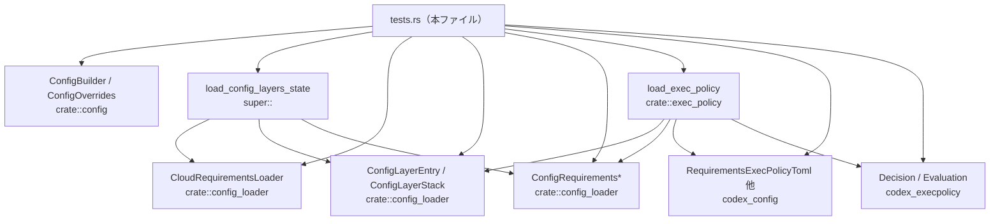
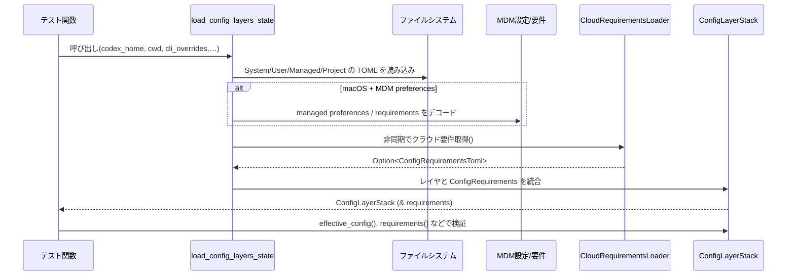
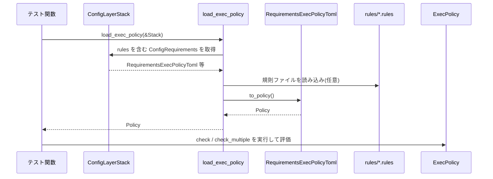

# core/src/config_loader/tests.rs コード解説

## 0. ざっくり一言

`core/src/config_loader/tests.rs` は、設定ローダ (`config_loader` モジュール) と実行ポリシー (`exec_policy` モジュール) の挙動を検証するテスト群です。設定ファイルのレイヤ統合、信頼レベルに応じたプロジェクト設定の扱い、クラウド/MDM 要件、CLI オーバーライド、実行ポリシー（コマンド制御）の契約が、このファイル内のテストで網羅的に確認されています。

---

## 1. このモジュールの役割

### 1.1 概要

このテストモジュールは次の問題を検証するために存在します。

- 設定ローダが **ユーザ設定 / マネージド設定 / システム設定 / プロジェクト設定 / CLI オーバーライド / クラウド要件 / MDM 要件** を正しい優先度でマージできているか。
- プロジェクトの **信頼レベル (Trusted / Untrusted / Unknown)** に応じて、プロジェクト設定や MCP サーバの有効化が安全に制御されているか。
- `requirements.toml` やクラウド/MDM 由来の **ConfigRequirements** が、`can_set` による制約として正しく機能するか。
- `exec_policy` の TOML 定義やファイルベースのルールが、内部ポリシー表現に正しく変換され、コマンドに対して期待どおりの決定 (Forbidden / Prompt) を下すか。

### 1.2 アーキテクチャ内での位置づけ

このファイルは「テスト専用モジュール」であり、`super` や `crate` から公開 API を呼び出して挙動を検証しています。主な依存関係は以下の通りです。



> ※ 行番号情報はこの環境からは取得できないため、関数位置は名前ベースで説明します。

### 1.3 設計上のポイント

コード（テスト）から読み取れる設計上の特徴は次の通りです。

- **レイヤーモデル**  
  - 設定は「System / User / Managed / Project / CLI / MDM / Cloud requirements」など、複数レイヤから構成され、`ConfigLayerEntry` と `ConfigLayerStack` を通じてマージされます。
  - `layers_high_to_low` や `get_layers(ConfigLayerStackOrdering::HighestPrecedenceFirst)` を使って、優先順位の高い順にアクセスします。

- **信頼レベルとセキュリティ**  
  - プロジェクトの信頼レベル (`TrustLevel::Trusted` / `Untrusted` / Unknown) によって、  
    - プロジェクトレイヤを有効にするか（`disabled_reason` の有無）  
    - プロジェクトローカル MCP サーバを有効化できるか  
    が制御されます。
  - クラウド要件と MDM 要件の競合時は「クラウド優先」「fail closed（クラウド要件取得失敗時は全体をエラーにする）」といった安全側の挙動がテストされています。

- **エラーハンドリング**  
  - `ConfigBuilder::build` や `load_config_layers_state` のエラーは `std::io::Error` にラップされ、その内部に `ConfigLoadError` が格納される前提で `config_error_from_io` が利用されています。
  - TOML 構文エラーおよびスキーマエラーについて、`codex_config::config_error_from_typed_toml` と同じ内容のエラーが返ることが確認されています。

- **非同期・並行性**  
  - ほぼ全ての I/O は `tokio::fs` を通じて非同期に行い、テストは `#[tokio::test]`（一部 `flavor = "current_thread"`）で実行されています。
  - 複数タスク間で共有する状態はなく、テストは原則として「1 テスト = 1 非同期タスク」のシンプルな並行モデルです。

- **実行ポリシー**  
  - `RequirementsExecPolicyToml` を TOML 文字列からパース → 内部ポリシーに変換 → `Evaluation` でコマンド列を評価、という一連のフローがテストされています。
  - ルール記述の不備（`decision` 欠如、`allow` 禁止、空配列など）は明示的に `RequirementsExecPolicyParseError` として扱われます。

---

## 2. 主要な機能一覧

このテストファイルが対象としている主な機能を、目的別に列挙します。

- **CLI オーバーライド関連**
  - CLI 経由で指定されたパスが `cwd` に対して解決されることの検証
  - `model_instructions_file` オーバーライドによるベース指示文の変更
  - CLI オーバーライドがプロジェクト信頼判定や MCP サーバのセキュリティ制約を壊さないことの検証

- **ユーザ / マネージド / システム設定のレイヤリング**
  - `config.toml` / `managed_config.toml` の TOML 構文エラーとスキーマエラーの扱い
  - マネージド設定がユーザ設定を上書きするレイヤ順序
  - 設定ファイルが全て存在しない場合でも、空の User レイヤと System レイヤが存在すること

- **macOS 管理対象環境 (MDM) 向け挙動（`#[cfg(target_os = "macos")]`）**
  - MDM の「managed preferences」が最優先レイヤとして適用されること
  - `~/` を含むパスがホームディレクトリに展開されること
  - MDM から配布される requirements（許可ポリシー、sandbox モード）が適用され、ローカル設定を上書きすること

- **Requirements（制約）ローディング**
  - `requirements.toml` から `ConfigRequirements` への変換と、`can_set` による制約チェック
  - クラウド要件・システム要件・MDM 要件の優先順位とマージ動作
  - クラウド要件ローダのエラー時に fail closed になること

- **プロジェクトレイヤと信頼レベル**
  - ネストした `.codex` ディレクトリに対する「最も近い cwd のものが最優先」ルール
  - `.codex` 直下のパス解決（`model_instructions_file` など）
  - `.codex` ディレクトリがあるが `config.toml` がない場合の振る舞い（空プロジェクトレイヤ）
  - `codex_home` 自体をプロジェクトレイヤとして誤って扱わないこと
  - プロジェクトが Untrusted / Unknown の場合に、プロジェクトレイヤを `disabled_reason` 付きで無効化し、ユーザレイヤを優先すること
  - 無効なプロジェクト TOML の扱い（Untrusted / Unknown では空設定として無効化）

- **実行ポリシー (`exec_policy`)**
  - `RequirementsExecPolicyToml` の prefix ルールのパースロジック
  - `Decision::Forbidden / Prompt` のみが許容されること（`allow` は禁止）
  - `[rules]` セクションと `.rules` ファイルのルールが両方適用されること

---

## 3. 公開 API と詳細解説

### 3.1 型一覧（構造体・列挙体など）

このファイル内で主に利用される外部公開型（定義は別モジュール）をまとめます。

| 名前 | 種別 | 役割 / 用途 | 定義場所（モジュール） |
|------|------|-------------|------------------------|
| `ConfigBuilder` | 構造体 | 各種レイヤ・オーバーライド・trust 情報を元に最終的なアプリ設定を構築するビルダ | `crate::config` |
| `ConfigOverrides` | 構造体 | テストハーネスや CLI から渡す一時的なオーバーライド（特に `cwd`）を保持 | `crate::config` |
| `ConfigLayerEntry` | 構造体 | 1 つの設定レイヤ（System/User/Project/Managed/...）を表し、名前・TOML 値・無効化理由などを保持 | `crate::config_loader` |
| `ConfigLayerStack` | 構造体 | 複数の `ConfigLayerEntry` を優先順位付きで保持し、`effective_config()` でマージ結果を提供 | `crate::config_loader` |
| `CloudRequirementsLoader` | 構造体 | 非同期にクラウドから `ConfigRequirementsToml` を取得するローダ | `crate::config_loader` |
| `ConfigRequirementsToml` | 構造体 | `requirements.toml` やクラウド/MDM から読み込む「制約」の TOML 表現 | `crate::config_loader` |
| `ConfigRequirementsWithSources` | 構造体 | 各フィールドごとに「値＋その値の由来（RequirementSource）」を保持するラッパ | `crate::config_loader` |
| `ConfigRequirements` | 構造体 | 実行時に利用する制約オブジェクト。`approval_policy` 等に対して `can_set` を提供 | `crate::config_loader` |
| `RequirementSource` | 列挙体 | Cloud / System / MDM / Unknown など、制約値がどこから来たかを表す | `crate::config_loader` |
| `RequirementsExecPolicyToml` | 構造体 | 実行ポリシーの TOML 定義（`prefix_rules` など） | `codex_config` |
| `Decision`, `Evaluation`, `RuleMatch` | 列挙体・構造体 | コマンドに対する実行可否判定と、どのルールにマッチしたかを表す | `codex_execpolicy` |

> これらの型の具体的なフィールドやメソッド定義は、このチャンクには現れません。

### 3.2 詳細解説する関数（7件）

ここでは、テストが強く依存している機能の代表として 7 関数を取り上げます。

---

#### `config_error_from_io(err: &std::io::Error) -> &super::ConfigError`

**概要**

`load_config_layers_state` や `ConfigBuilder::build` が返す `std::io::Error` から、内部に格納された `ConfigLoadError` を取り出し、さらにその中の `ConfigError` を参照として返すためのテスト用ヘルパです。

**引数**

| 引数名 | 型 | 説明 |
|--------|----|------|
| `err` | `&std::io::Error` | `ConfigLoadError` を `source` として内包していることが期待されるエラー |

**戻り値**

- `&super::ConfigError`  
  見つかった `ConfigLoadError` の中に含まれる設定エラーオブジェクト。

**内部処理の流れ**

1. `err.get_ref()` で、`std::io::Error` にラップされている内部のエラー（`dyn Error`）への参照を取得。
2. `downcast_ref::<ConfigLoadError>()` で `ConfigLoadError` 型にダウンキャストを試みる。
3. 見つかった `ConfigLoadError` に対して `ConfigLoadError::config_error` を呼び、`ConfigError` 参照を得る。
4. いずれかの段階で失敗した場合は `expect("expected ConfigLoadError")` でパニックする。

**Errors / Panics**

- `err` の `source` が `ConfigLoadError` でない場合、本関数はパニックします。  
  テストでは「設定ローダは必ず `ConfigLoadError` を内包している」という前提を検証しているため、ここでの `expect` は仕様チェックです。

**Edge cases**

- `err.get_ref()` が `None` の場合（内部エラーが無い場合）はパニックになります。
- `ConfigLoadError` 以外の型が内包されている場合もパニックになります。

**使用上の注意点**

- プロダクションコードではなく「テスト専用」のヘルパであり、安全な API ではありません。
- 呼び出し側は、`std::io::Error` が必ず `ConfigLoadError` を含むように構成されていることを前提として使っています。

---

#### `cli_overrides_resolve_relative_paths_against_cwd() -> std::io::Result<()>` （テスト）

**概要**

CLI オーバーライドで指定した相対パス (`log_dir = "run-logs"`) が、ハーネスオーバーライドの `cwd` に対して解決されることを検証するテストです。

**引数**

- テスト関数のため引数はありません。

**戻り値**

- `std::io::Result<()>`  
  テスト内で `ConfigBuilder::build().await?` を使うため、I/O エラーをそのまま返します。

**内部処理の流れ**

1. `tempdir()` で `codex_home` と `cwd` 用の一時ディレクトリを作成。
2. `ConfigBuilder::default()` に対して:
   - `.codex_home(codex_home.path().to_path_buf())`
   - `.cli_overrides(vec![("log_dir", "run-logs")])`
   - `.harness_overrides(ConfigOverrides { cwd: Some(cwd_path.clone()), .. })`
   を設定して `.build().await?` を呼び出し、`config` を生成。
3. `AbsolutePathBuf::resolve_path_against_base("run-logs", cwd_path)` で期待される絶対パスを計算。
4. `assert_eq!(config.log_dir, expected.to_path_buf())` で一致を確認。

**Errors / Panics**

- `ConfigBuilder::build` が失敗した場合、テスト関数は `Err` を返して失敗します。
- `tempdir()` の失敗などで `expect("tempdir")` がパニックする可能性がありますが、テスト環境前提であり、通常は起こりません。

**Edge cases**

- `cwd` を指定しないケースや、`log_dir` が絶対パスのケースはこのテストではカバーされていません（他テストまたは実装側参照）。

**使用上の注意点**

- 「CLI オーバーライドの相対パスは `cwd` ベース」という契約を前提に実装を行う必要があります。
- 安全性（セキュリティ）の観点から、`cwd` がユーザ指定可能な場合でも、単に「どこを基準に解決するか」を決めているだけであり、アクセス制御は別途 trust レベルや sandbox 設定に依存します。

---

#### `returns_empty_when_all_layers_missing() -> std::io::Result<()>` （テスト）

**概要**

ユーザ設定 (`config.toml`) とマネージド設定 (`managed_config.toml`) が存在しない場合でも、

- User レイヤが「空のテーブル」として存在すること
- System レイヤが 1 つは存在すること
- 結果の `effective_config()` が空テーブルになること

を検証するテストです。

**引数 / 戻り値**

- 引数なし。
- `std::io::Result<()>`（内部で非同期 I/O を伴うため）。

**内部処理の流れ**

1. 一時ディレクトリ `tmp` と、存在しない `managed_config.toml` のパスを準備。
2. `LoaderOverrides::with_managed_config_path_for_tests(managed_path)` でマネージド設定の検索パスだけを指定。
3. `load_config_layers_state(tmp.path(), Some(cwd), &[], overrides, CloudRequirementsLoader::default()).await` を呼び出し、`layers` を取得。
4. `layers.get_user_layer()` が返す `ConfigLayerEntry` が:
   - `name` が `ConfigLayerSource::User { file = CONFIG_TOML_FILE の絶対パス }`
   - `config` が空テーブル (`TomlValue::Table({})`)
   - `raw_toml` が `None`
   - `disabled_reason` が `None`  
   であることを `assert_eq!` で確認。
5. `layers.effective_config()` からベーステーブルを取得し、`is_empty()` を確認。
6. `layers.layers_high_to_low()` から `ConfigLayerSource::System` を持つレイヤ数をカウントし、ちょうど 1 つであることを確認。
7. 非 macOS 環境では、最終的な `effective_config()` が空テーブルであることを再度確認。

**Errors / Panics**

- `load_config_layers_state` が I/O エラーなどで失敗するとテスト失敗となります。
- `get_user_layer().expect(...)` でユーザレイヤが無いとパニックしますが、このテストは「常に存在するべき」という契約を検証しています。

**Edge cases**

- System レイヤが 2 つ以上存在する、もしくは 0 の場合はテストが失敗し、設計上の前提が崩れたことになります。
- macOS 特有の MDM や managed preferences の影響は、このテストでは条件付きコンパイルにより考慮されていません（macOS では別テストが存在）。

**使用上の注意点**

- 実装側では「設定ファイルが存在しない = エラー」ではなく、「空設定として扱う」という契約になっています。
- システムデフォルト値は System レイヤにのみ含まれる前提で、テストは System レイヤの存在を保証しています。

---

#### `load_requirements_toml_produces_expected_constraints() -> anyhow::Result<()>` （テスト）

**概要**

`requirements.toml` を `ConfigRequirementsWithSources` に読み込み、`ConfigRequirements` へ変換したときに、

- `allowed_approval_policies`
- `allowed_web_search_modes`
- `enforce_residency`
- `feature_requirements`

が正しく反映され、`can_set` による制約判定が意図通りに働くことを確認するテストです。

**引数 / 戻り値**

- 引数なし。
- 戻り値は `anyhow::Result<()>`（テスト内で `?` を多用するため）。

**内部処理の流れ**

1. 一時ディレクトリに `requirements.toml` を生成し、以下の内容を書き込み:
   - `allowed_approval_policies = ["never", "on-request"]`
   - `allowed_web_search_modes = ["cached"]`
   - `enforce_residency = "us"`
   - `[features] personality = true`
2. `ConfigRequirementsWithSources::default()` を生成し、`load_requirements_toml(&mut, &path).await?` を実行。
3. 読み込んだ `config_requirements_toml` から:
   - `allowed_approval_policies` が `Some(vec![Never, OnRequest])` であること
   - `allowed_web_search_modes` が `Some(vec![WebSearchModeRequirement::Cached])` であること
   - `feature_requirements.value.entries` に `("personality", true)` が含まれること  
   を確認。
4. `ConfigRequirements` に `try_into()` で変換。
5. `config_requirements.approval_policy` について:
   - `.value() == AskForApproval::Never`
   - `.can_set(&Never)` は OK
   - `.can_set(&OnFailure)` は `Err` になること
6. `config_requirements.web_search_mode` について:
   - `.value() == WebSearchMode::Cached`
   - `.can_set(&Cached)` および `.can_set(&Disabled)` は OK
   - `.can_set(&Live)` は `Err`
7. `enforce_residency.value() == Some(ResidencyRequirement::Us)` であること。
8. `feature_requirements.value.entries` が `("personality", true)` を保持していること。

**Errors / Panics**

- `load_requirements_toml` のパースエラーや I/O エラーがあればテストは失敗します。
- `try_into::<ConfigRequirements>()` が失敗した場合もテスト失敗となります。

**Edge cases**

- `allowed_*` 系が空配列の場合や、未知の文字列が指定された場合はこのテストではカバーされていません（別テストまたは実装側でカバーされていると考えられますが、コードからは判定不能です）。

**使用上の注意点**

- `ConfigRequirementsWithSources` はフィールドごとに source 情報も保持しますが、本テストでは主に「値が正しいか」「`can_set` が期待通りか」に焦点が当てられています。
- `can_set` は「その値に変更することが許可されているか」を表すため、UI や API での設定変更時に使用することが想定されます。

---

#### `cloud_requirements_take_precedence_over_mdm_requirements() -> anyhow::Result<()>` （macOS テスト）

**概要**

同じフィールド（ここでは `allowed_approval_policies`）に対して MDM 要件とクラウド要件の両方が値を提供した場合に、**クラウド要件が優先される**ことを検証する macOS 限定テストです。

**内部処理の流れ**

1. MDM からの要件を模倣するために、`loader_overrides.macos_managed_config_requirements_base64` に base64 エンコードされた TOML:

   ```toml
   allowed_approval_policies = ["on-request"]
   ```

   を設定。
2. `CloudRequirementsLoader::new(async { Ok(Some(ConfigRequirementsToml { allowed_approval_policies: Some(vec![Never]), ... })) })` を渡して `load_config_layers_state` を呼び出し。
3. 取得した `state.requirements().approval_policy` が:
   - `.value() == Never`
   - `.can_set(&OnRequest)` を呼ぶと `ConstraintError::InvalidValue` になり、`requirement_source` が `RequirementSource::CloudRequirements` であること  
   を確認。

**Errors / Panics**

- クラウド/MDM 要件のパースやローディングでエラーがあればテストは失敗します。
- `tokio::test` により、非同期 I/O エラーは `?` を通じてテスト全体の `Err` になります。

**Edge cases**

- MDM 要件のみ、クラウド要件のみ、といったパターンは他のテストで検証されています（`managed_preferences_requirements_*` や `load_config_layers_includes_cloud_requirements` など）。
- 複数フィールド（sandbox モードなど）が競合した場合の振る舞いは、このテストでは扱っていません。

**使用上の注意点**

- セキュリティ上、「クラウドからの制約（サーバ側ポリシー）がクライアント側の MDM 設定より強く適用される」という契約がこのテストで固定されています。
- 実装側で新しい RequirementSource を追加する場合、この優先順位を崩さないようにテスト追加が必要です。

---

#### `project_layers_prefer_closest_cwd() -> std::io::Result<()>` （テスト）

**概要**

プロジェクトツリー内で複数の `.codex` ディレクトリが存在する場合、**現在の作業ディレクトリに最も近い `.codex` が最優先のプロジェクトレイヤになる**というルールを検証するテストです。

**内部処理の流れ**

1. 以下のようなディレクトリ構造を用意:
   - `project_root/.git`（プロジェクトルートマーカー）
   - `project_root/.codex/config.toml`（`foo = "root"`）
   - `project_root/child/.codex/config.toml`（`foo = "child"`）
2. `codex_home` を作成し、`make_config_for_test(&codex_home, &project_root, TrustLevel::Trusted, None).await` でプロジェクトを Trusted として登録。
3. `cwd` を `project_root/child` に設定し、`load_config_layers_state(&codex_home, Some(cwd), ...)` を呼び出し `layers` を取得。
4. `layers.layers_high_to_low()` から `ConfigLayerSource::Project { dot_codex_folder }` を抽出し、順番が:
   1. `project_root/child/.codex`
   2. `project_root/.codex`  
   であることを確認。
5. `layers.effective_config().get("foo")` が `"child"` であることを確認。

**Errors / Panics**

- `.git` がないとプロジェクトとして認識されないなどの実装依存の前提がありますが、テスト内では `.git` を必ず作成しています。
- `make_config_for_test` が `codex_home/config.toml` の生成に失敗するとテスト失敗となります。

**Edge cases**

- `.git` 以外のプロジェクトマーカー（例: `.hg`）については別テスト（`project_root_markers_supports_alternate_markers`）で扱われています。
- Trusted ではない場合の挙動は `project_layers_disabled_when_untrusted_or_unknown` でカバーされています。

**使用上の注意点**

- 実装側では「プロジェクトルート探索」と「cwd から上方向への `.codex` 探索」のロジックを変更する際、このテスト群が壊れないことを確認する必要があります。
- 特に、信頼レベルのチェックと `.codex` 探索ロジックが絡むため、セキュリティ仕様と一体で考える必要があります。

---

#### `loads_requirements_exec_policy_without_rules_files() -> anyhow::Result<()>` （サブモジュール内テスト）

```rust
mod requirements_exec_policy_tests { ... }
```

の中の 1 テストです。

**概要**

`ConfigRequirements` に `[rules]` セクションで prefix ルールが定義されているだけの状態で、**外部 `.rules` ファイルが存在しなくても `load_exec_policy` が正しいポリシーを構築できる**ことを検証します。

**内部処理の流れ**

1. 一時ディレクトリ `temp_dir` を作成。
2. `requirements_from_toml` ヘルパを用いて、次のような requirements を構築:

   ```toml
   [rules]
   prefix_rules = [
       { pattern = [{ token = "rm" }], decision = "forbidden" },
   ]
   ```

   - `ConfigRequirementsToml` にパース
   - `ConfigRequirementsWithSources` に `RequirementSource::Unknown` としてマージ
   - `ConfigRequirements` に変換
3. `config_stack_for_dot_codex_folder_with_requirements(temp_dir.path(), requirements)` で、1 つの Project レイヤと上記 requirements を持つ `ConfigLayerStack` を作成。
4. `load_exec_policy(&config_stack).await?` で実行ポリシーをロード。
5. `policy.check_multiple([vec!["rm".to_string()]].iter(), &panic_if_called)` により、`rm` コマンドに対する評価が:
   - `decision = Decision::Forbidden`
   - `matched_rules` に `PrefixRuleMatch` が 1 件含まれる  
   ことを確認。

**Errors / Panics**

- `RequirementsExecPolicyToml` のパースや `to_policy()` への変換エラーは `load_exec_policy` 内で扱われ、ここでエラーになればテスト失敗となります。
- `panic_if_called` は「ルールがマッチしない場合に呼ばれるヒューリスティック」として渡されますが、ルールがマッチする前提のため、呼び出されるとパニックします。

**Edge cases**

- `.rules` ファイルが存在する場合のマージ動作は別テスト（`merges_requirements_exec_policy_with_file_rules`）で扱われます。
- 複数ルールや `any_of` パターンは他のテストで検証されています。

**使用上の注意点**

- 実装側で `load_exec_policy` のソース優先順位や、`ConfigLayerStack` のどのレイヤから rules を拾うかを変更する際、本テストと他の exec policy テスト群が意図する仕様（特に「設定ファイルだけでも動く」）を守る必要があります。

---

### 3.3 その他の関数一覧

テスト用関数とヘルパ関数の一覧です（簡単な説明のみ）。

| 関数名 | 種別 | 役割（1 行） |
|--------|------|--------------|
| `make_config_for_test` | 非公開ヘルパ | `codex_home/config.toml` に特定プロジェクトの trust 設定と project_root_markers を書き込む。 |
| `returns_config_error_for_invalid_user_config_toml` | テスト | ユーザ `config.toml` の TOML 構文エラーが `ConfigError` として返ることを検証。 |
| `returns_config_error_for_invalid_managed_config_toml` | テスト | `managed_config.toml` の TOML 構文エラーが `ConfigError` として返ることを検証。 |
| `returns_config_error_for_schema_error_in_user_config` | テスト | スキーマエラー（型不一致）が `config_error_from_typed_toml` と同内容で返ることを検証。 |
| `schema_error_points_to_feature_value` | テスト | スキーマエラーの位置情報（行・列）が誤値の `"true"` を指すことを検証。 |
| `merges_managed_config_layer_on_top` | テスト | ユーザ設定と managed 設定の `foo` や `[nested]` をマージし、managed が優先されることを検証。 |
| `managed_preferences_take_highest_precedence` (macOS) | テスト | MDM の managed preferences が config.toml や managed_config.toml よりも優先されることを検証。 |
| `managed_preferences_expand_home_directory_in_workspace_write_roots` (macOS) | テスト | MDM の `writable_roots = ["~/code"]` がホームディレクトリに展開されることを検証。 |
| `managed_preferences_requirements_are_applied` (macOS) | テスト | MDM 要件による `approval_policy`・`sandbox_policy` の制約が適用されることを検証。 |
| `managed_preferences_requirements_take_precedence` (macOS) | テスト | MDM 要件が managed_config.toml の `approval_policy` を上書きすることを検証。 |
| `cloud_requirements_are_not_overwritten_by_system_requirements` | テスト | Cloud 由来の `allowed_approval_policies` が system requirements で上書きされないことを検証。 |
| `load_config_layers_includes_cloud_requirements` | テスト | `CloudRequirementsLoader` 経由の要件が `requirements_toml()` に取り込まれ、制約として効くことを検証。 |
| `load_config_layers_fails_when_cloud_requirements_loader_fails` | テスト | クラウド要件取得失敗時に `std::io::ErrorKind::Other` で fail closed することを検証。 |
| `project_paths_resolve_relative_to_dot_codex_and_override_in_order` | テスト | `model_instructions_file` が各 `.codex` ディレクトリをベースに解決され、最も近いものが優先されることを検証。 |
| `cli_override_model_instructions_file_sets_base_instructions` | テスト | CLI の `model_instructions_file` オーバーライドで `base_instructions` が指定ファイル内容になることを検証。 |
| `project_layer_is_added_when_dot_codex_exists_without_config_toml` | テスト | `.codex` だけ存在し `config.toml` がなくても空の Project レイヤが追加されることを検証。 |
| `codex_home_is_not_loaded_as_project_layer_from_home_dir` | テスト | `home/.codex` を Project レイヤとして誤認しないことを検証。 |
| `codex_home_within_project_tree_is_not_double_loaded` | テスト | プロジェクトツリー内の `codex_home` が Project レイヤとして二重に読み込まれないことを検証。 |
| `project_layers_disabled_when_untrusted_or_unknown` | テスト | Untrusted/Unknown プロジェクトでは Project レイヤが `disabled_reason` 付きで無効化されることを検証。 |
| `cli_override_can_update_project_local_mcp_server_when_project_is_trusted` | テスト | Trusted プロジェクトでは CLI オーバーライドでローカル MCP サーバを有効化できることを検証。 |
| `cli_override_for_disabled_project_local_mcp_server_returns_invalid_transport` | テスト | Untrusted/Unknown 状態でローカル MCP を有効化しようとすると「invalid transport」エラーになることを検証。 |
| `invalid_project_config_ignored_when_untrusted_or_unknown` | テスト | 無効なプロジェクト config TOML は Untrusted/Unknown では空設定として無視されることを検証。 |
| `cli_overrides_with_relative_paths_do_not_break_trust_check` | テスト | CLI の相対パス指定がプロジェクト信頼チェックを壊さないことを検証。 |
| `project_root_markers_supports_alternate_markers` | テスト | ConfigToml の `project_root_markers` で `.hg` など別マーカーを指定できることを検証。 |
| `tokens` (サブモジュール) | ヘルパ | コマンド文字列スライスから `Vec<String>` に変換するユーティリティ。 |
| `panic_if_called` (サブモジュール) | ヘルパ | ルールがマッチしなかった場合にのみ呼ばれる想定のコールバック（呼ばれたらパニック）。 |
| `config_stack_for_dot_codex_folder_with_requirements` (サブモジュール) | ヘルパ | 指定フォルダと requirements を持つ `ConfigLayerStack` を 1 つの Project レイヤで構築。 |
| `requirements_from_toml` (サブモジュール) | ヘルパ | TOML 文字列を `ConfigRequirements` に変換。 |
| `parses_single_prefix_rule_from_raw_toml` ～ `empty_prefix_rules_is_rejected` | テスト | `RequirementsExecPolicyToml` の prefix ルールの各種パース成功・失敗ケースを検証。 |
| `merges_requirements_exec_policy_with_file_rules` | テスト | `[rules]` セクションのルールと `.rules` ファイルのルールがマージされることを検証。 |

---

## 4. データフロー

### 4.1 設定レイヤとクラウド/MDM 要件の流れ

テストから読み取れる代表的なフロー（例: `load_config_layers_includes_cloud_requirements` + MDM 系テスト）を示します。

1. テストが `CloudRequirementsLoader` または MDM base64 文字列をセットした `LoaderOverrides` を準備。
2. `load_config_layers_state(codex_home, cwd, cli_overrides, loader_overrides, cloud_loader)` を呼び出し。
3. `load_config_layers_state` 内部で:
   - System/User/Managed/Project レイヤを探索・読み込み、`ConfigLayerEntry` に格納。
   - MDM managed preferences / requirements があれば、さらに上位レイヤとして追加。
   - `CloudRequirementsLoader` を await し、その結果を `ConfigRequirementsWithSources` にマージ。
4. `ConfigLayerStack` が構築され、`requirements_toml()` と `requirements()` (`ConfigRequirements`) が利用可能になる。
5. テスト側は:
   - `layers.effective_config()` で最終 TOML を検査。
   - `layers.requirements()` から `approval_policy` などを検査。
   - `can_set` による制約チェックを行う。



### 4.2 実行ポリシーのロードフロー

`requirements_exec_policy_tests` から読み取れる `load_exec_policy` の代表的フローです。

1. テストが `ConfigRequirements` に `[rules]` セクションを設定し、`ConfigLayerStack` を構築。
2. `load_exec_policy(&config_stack).await` を呼び出し。
3. `load_exec_policy` 内部で:
   - requirements 内の `RequirementsExecPolicyToml` を取得。
   - 必要に応じて `rules/` ディレクトリから `.rules` ファイルをロード。
   - それらを `to_policy()` に渡し、内部ポリシーに変換。
4. 返されたポリシーに対して `check` / `check_multiple` を呼び、`Decision` と `RuleMatch` を得る。



---

## 5. 使い方（How to Use）

### 5.1 ConfigBuilder / load_config_layers_state の典型的な利用

テストから再構成した、簡略化された利用例です。

```rust
use crate::config::ConfigBuilder;
use crate::config::ConfigOverrides;
use crate::config_loader::{load_config_layers_state, CloudRequirementsLoader};
use codex_utils_absolute_path::AbsolutePathBuf;
use codex_config::CONFIG_TOML_FILE;
use std::path::Path;

async fn build_config_example(codex_home: &Path) -> anyhow::Result<()> {
    // codex_home 配下に config.toml がある前提
    let cwd = AbsolutePathBuf::from_absolute_path(codex_home.join("work"))?;

    // CLI オーバーライド例
    let cli_overrides = vec![(
        "log_dir".to_string(),
        toml::Value::String("logs".to_string()),
    )];

    // ConfigBuilder を使って最終設定を構築
    let config = ConfigBuilder::default()
        .codex_home(codex_home.to_path_buf())
        .cli_overrides(cli_overrides)
        .harness_overrides(ConfigOverrides {
            cwd: Some(cwd.clone().into()),
            ..Default::default()
        })
        .build()
        .await?; // Result でエラーが返る

    println!("log_dir = {:?}", config.log_dir);

    // より細かくレイヤを見たい場合は load_config_layers_state を直接呼ぶ
    let layers = load_config_layers_state(
        codex_home,
        Some(cwd),
        &[] as &[(String, toml::Value)],
        Default::default(),              // LoaderOverrides
        CloudRequirementsLoader::default(),
    )
    .await?;

    println!("effective config = {:?}", layers.effective_config());

    Ok(())
}
```

### 5.2 よくある使用パターン

- **プロジェクト信頼レベル込みでコンフィグを構築したい場合**
  - テストの `make_config_for_test` と同様に、`codex_home/config.toml` に `projects` と `trust_level` を記録してから `ConfigBuilder::build` を呼ぶ。
- **クラウド要件を反映したい場合**
  - `CloudRequirementsLoader::new(async { ... })` で非同期クロージャを渡し、`load_config_layers_state` 経由で `ConfigLayerStack` を取得する。
- **exec policy を利用したい場合**
  - `ConfigLayerStack` から `[rules]` を含む `ConfigRequirements` を作り、`load_exec_policy(&stack).await` を呼んで `Policy` を得る。

### 5.3 よくある間違い（テストから見えるもの）

```rust
// 間違い例: プロジェクトが Untrusted/Unknown のまま
// ローカル MCP サーバを有効化しようとする
let config = ConfigBuilder::default()
    .codex_home(codex_home_without_trust_info)
    .cli_overrides(vec![(
        "mcp_servers.sentry.enabled".to_string(),
        toml::Value::Boolean(true),
    )])
    .fallback_cwd(Some(project_child_dir))
    .build()
    .await?; // ← テストではここが "invalid transport" エラーになることを期待

// 正しい例: 事前にプロジェクトを Trusted として登録
make_config_for_test(
    &codex_home,
    &project_root,
    TrustLevel::Trusted,
    None,
).await?;

let config = ConfigBuilder::default()
    .codex_home(codex_home)
    .cli_overrides(vec![(
        "mcp_servers.sentry.enabled".to_string(),
        toml::Value::Boolean(true),
    )])
    .fallback_cwd(Some(project_child_dir))
    .build()
    .await?; // Trusted のため成功し、MCP サーバが有効になる
```

### 5.4 使用上の注意点（まとめ）

- **信頼レベル**  
  - プロジェクト設定やローカル MCP サーバの有効化は、`TrustLevel::Trusted` でなければ適用されないことを前提に設計されています。
  - Untrusted/Unknown の場合でも Project レイヤは存在しますが、`disabled_reason` が設定され、effective config には反映されません。

- **クラウド/MDM 要件**  
  - 同じフィールドに対して複数ソースから値が来る場合の優先順位（Cloud > MDM > System 等）がテストで固定されています。
  - クラウド要件ローダが失敗した場合、全体を fail closed とする（設定ロード自体をエラーにする）ことが契約になっています。

- **エラーのラップ**  
  - `ConfigLoadError` は `std::io::Error` にラップされて外部に出る設計であり、テストでは `downcast_ref` を前提としています。実装側でエラーラップ方法を変更する場合は、テストの見直しが必要です。

---

## 6. 変更の仕方（How to Modify）

### 6.1 新しい機能を追加する場合（テスト観点）

- **新しい設定ソース（例: 別種の managed 設定）を追加する場合**
  1. `crate::config_loader` 内で `ConfigLayerSource` と読み込み処理を追加。
  2. レイヤ順序や結合ロジックが Cloud / MDM / System / User などとどう関係するかを決める。
  3. この `tests.rs` に、  
     - 正常にレイヤが追加されるケース  
     - 他ソースとの競合時に期待する優先順位になるケース  
     - エラー時に fail-open / fail-closed のどちらにするか  
     を明示するテストを追加する。

- **Requirements の新しいフィールドを追加する場合**
  1. `ConfigRequirementsToml` / `ConfigRequirementsWithSources` / `ConfigRequirements` にフィールドを追加。
  2. `requirements.toml` 経由でロードされるケース、クラウド/MDM 経由で供給されるケースのテストを追加し、`can_set` 挙動を検証する。

- **Exec policy の新しいルール形式を追加する場合**
  1. `RequirementsExecPolicyToml` に新しいフィールドを追加し、`to_policy()` にロジックを追加。
  2. `requirements_exec_policy_tests` モジュールに、パース・ポリシー変換・評価のテストを追加。

### 6.2 既存機能を変更する場合（注意事項）

- **レイヤ優先順位を変更する場合**
  - `merges_managed_config_layer_on_top`・macOS の MDM 関連テスト・クラウド要件テストなど、多数のテストがレイヤ順序に依存しています。修正前に影響テストを洗い出す必要があります。

- **信頼レベルの扱いを変更する場合**
  - `project_layers_prefer_closest_cwd`、`project_layers_disabled_when_untrusted_or_unknown`、`cli_override_for_disabled_project_local_mcp_server_returns_invalid_transport` など、trust とセキュリティに関するテストを確認・更新する必要があります。

- **エラー型やラップ方法を変更する場合**
  - `config_error_from_io` や各種 `returns_config_error_*` テストが `ConfigError` の構造に直接依存しています。エラーの階層やメッセージフォーマットを変更する際は、それに合わせてテストも更新する必要があります。

---

## 7. 関連ファイル

このテストモジュールと密接に関係するモジュール/ファイル（推測ではなく、このチャンクから名前が分かるもの）です。

| パス / モジュール | 役割 / 関係 |
|------------------|------------|
| `core/src/config_loader/tests.rs` | 本ファイル。`config_loader` モジュールの動作・契約を検証する統合テスト群。 |
| `crate::config_loader` | `load_config_layers_state`、`ConfigLayerEntry`、`ConfigLayerStack`、`ConfigRequirements*`、`CloudRequirementsLoader`、`RequirementSource` などを定義する設定ローダ本体モジュール。 |
| `crate::config` | `ConfigBuilder`、`ConfigOverrides`、`ConstraintError` など、アプリケーション設定オブジェクトとビルダを定義。 |
| `codex_config` | `CONFIG_TOML_FILE`、`ConfigToml`、`ProjectConfig`、`config_error_from_typed_toml`、`RequirementsExecPolicyToml` 等、設定ファイルスキーマとエラー変換ロジックを提供。 |
| `codex_protocol::config_types` | `TrustLevel`、`WebSearchMode` など、プロトコルレベルの設定型定義。 |
| `codex_protocol::protocol` | `AskForApproval`、（macOS では）`SandboxPolicy` など、実行時ポリシー値の型定義。 |
| `crate::exec_policy` | `load_exec_policy` を提供し、`ConfigLayerStack` + Requirements から実行ポリシーを構築。 |
| `codex_execpolicy` | `Decision`、`Evaluation`、`RuleMatch` など、コマンド実行判定エンジンのコアを提供。 |

> 具体的なファイルパス（例: `core/src/config_loader/mod.rs`）は、このチャンクには明示されていないため、モジュールパスとしてのみ記載しています。
