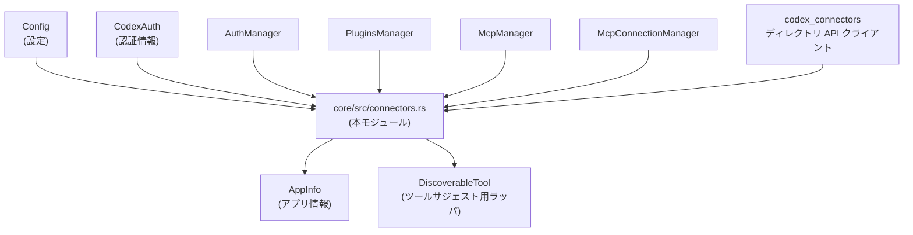
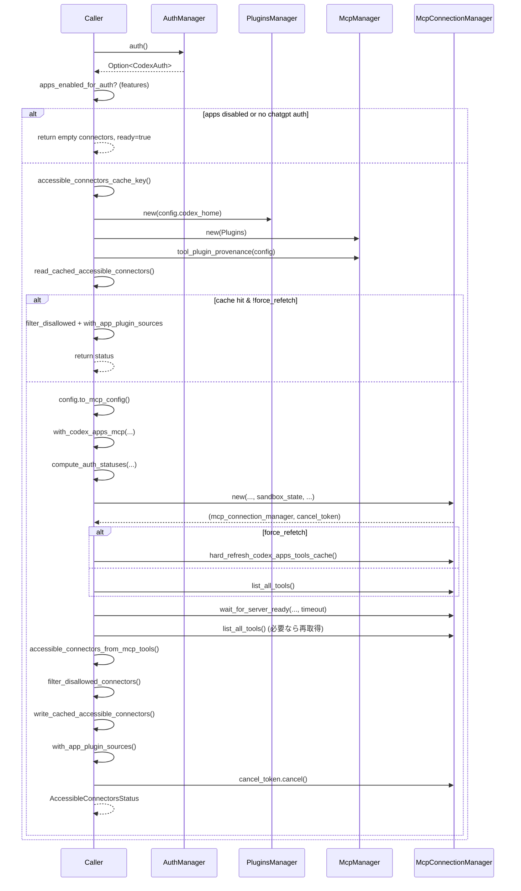

# core/src/connectors.rs

## 0. ざっくり一言

ChatGPT「アプリ / コネクタ」を列挙・マージ・フィルタ・キャッシュし、MCP サーバーやディレクトリ API から取得した情報を `AppInfo` として扱いやすい形にまとめるモジュールです。  
認証状態や設定・環境に応じて「どのアプリがどこまで使用可能か」を判断します。

> 行番号について: 提供されたチャンクには行番号情報が含まれていないため、  
> `core/src/connectors.rs:L開始-終了` 形式での **正確な**範囲指定はできません。  
> 以降の根拠表記は「ファイル単位」で行います（例: `core/src/connectors.rs`）。

---

## 1. このモジュールの役割

### 1.1 概要

このモジュールは、以下のような問題を解決するために存在します。

- MCP サーバー (`codex_apps`) から取得できる「利用可能なツール (ToolInfo)」を、ユーザー向けの「アプリ情報 (`AppInfo`)」へ変換する。
- ChatGPT ディレクトリ API から取得できるアプリ一覧と、MCP 経由のアプリ、プラグインが提供する仮想アプリをマージする。
- 設定 (`apps` 設定や requirements.toml)、アカウント種別、originator（起点クライアント）に応じて、「どのコネクタ / ツールが有効か」を判断する。
- 利用可能なコネクタ一覧をユーザー別にキャッシュし、再取得コストを抑える。

### 1.2 アーキテクチャ内での位置づけ

主要コンポーネントの依存関係は概ね次のようになっています。



- `Config` と `AuthManager` から認証状態と設定を受け取り、  
  `McpManager` / `McpConnectionManager` / `codex_connectors` を使ってアプリ情報を取得します。
- 最終的に `Vec<AppInfo>` や `AccessibleConnectorsStatus` を公開 API として返します。

### 1.3 設計上のポイント

- **状態管理**
  - ユーザー別の「アクセス可能なコネクタ」一覧を  
    `LazyLock<StdMutex<Option<CachedAccessibleConnectors>>>` でプロセス内キャッシュしています。
- **非同期 I/O**
  - MCP とのやり取り (`McpConnectionManager`) と ChatGPT ディレクトリ API への HTTP リクエストは async/await で実装されています。
- **機能フラグ & コンフィグ駆動**
  - `config.features` や `apps` 設定、`requirements.toml` の内容により、アプリ/ツールの有効・無効や承認ポリシーを決定します。
- **安全性・制限**
  - originator（`is_first_party_chat_originator`）や hard-coded な禁止 ID で、一部コネクタを強制的に非表示にします。
  - ツールの `ToolAnnotations`（破壊的操作/オープンワールド操作のヒント）と設定を組み合わせて、デフォルトの有効/無効を決定します。
- **Rust の安全性**
  - 共有キャッシュは `StdMutex` によって同期され、データ競合（data race）が起きないようにしています。
  - `anyhow::Result` と `context` によるエラーラップで、I/O エラーの原因を追いやすくしています。

---

## 2. 主要な機能一覧

- MCP ツールからアクセス可能なコネクタ一覧の取得:
  - `list_accessible_connectors_from_mcp_tools*`, `accessible_connectors_from_mcp_tools`
- キャッシュされたコネクタ一覧の取得・更新:
  - `list_cached_accessible_connectors_from_mcp_tools`, `refresh_accessible_connectors_cache_from_mcp_tools`
- ディレクトリ API とプラグインを組み合わせたツールサジェスト候補の構築:
  - `list_tool_suggest_discoverable_tools_with_auth`
- ディレクトリ API からコネクタ一覧の取得:
  - `list_directory_connectors_for_tool_suggest_with_auth`, `chatgpt_get_request_with_token`
- コネクタ/アプリ一覧のマージ・整形:
  - `merge_connectors`, `merge_plugin_apps`, `merge_plugin_apps_with_accessible`
- 設定に基づくアプリ有効状態の反映:
  - `with_app_enabled_state`, `read_apps_config`, `app_is_enabled`, `apply_requirements_apps_constraints`
- ツールごとの有効・承認ポリシーの判定:
  - `app_tool_policy`, `app_tool_policy_from_apps_config`, `codex_app_tool_is_enabled`
- 禁止コネクタのフィルタリング:
  - `filter_disallowed_connectors`, `filter_disallowed_connectors_for_originator`, `is_connector_id_allowed_for_originator`
- URL・ラベル整形ユーティリティ:
  - `connector_display_label`, `connector_mention_slug`, `connector_install_url`, `sanitize_name`, `sanitize_slug`, `format_connector_label`
- `AppInfo` 構築ユーティリティ:
  - `collect_accessible_connectors`, `plugin_app_to_app_info`, `normalize_connector_value`, `with_app_plugin_sources`

---

## 3. 公開 API と詳細解説

### 3.1 型一覧（構造体・列挙体など）

| 名前 | 種別 | 公開範囲 | 役割 / 用途 | 根拠 |
|------|------|----------|------------|------|
| `AppToolPolicy` | 構造体 | `pub(crate)` | 単一ツールの「有効かどうか」と「承認モード (`AppToolApproval`)」をまとめたポリシー | `core/src/connectors.rs` |
| `AccessibleConnectorsCacheKey` | 構造体 | `struct` (モジュール内) | キャッシュキー: base URL, account_id, chatgpt_user_id, workspace フラグ | 同上 |
| `CachedAccessibleConnectors` | 構造体 | `struct` (モジュール内) | キャッシュエントリ: キー・有効期限・コネクタ一覧 | 同上 |
| `AccessibleConnectorsStatus` | 構造体 | `pub` | コネクタ一覧と「codex_apps MCP サーバーが ready かどうか」のフラグ | 同上 |

`AppInfo`, `AppBranding`, `AppMetadata` は別クレートから `pub use` されています。

### 3.2 関数詳細（重要な 7 件）

#### `list_accessible_connectors_from_mcp_tools(config: &Config) -> anyhow::Result<Vec<AppInfo>>`

**概要**

MCP サーバー (`codex_apps`) から利用可能なツール一覧を取得し、アクセス可能なコネクタ (`AppInfo`) だけを返すシンプルな公開 API です。  
詳細情報（ready 状態など）が不要な場合のショートカットです。

**引数**

| 引数名 | 型 | 説明 |
|--------|----|------|
| `config` | `&Config` | アプリ全体の設定。MCP 設定・feature フラグなどを含みます。 |

**戻り値**

- `Ok(Vec<AppInfo>)`: 利用可能なコネクタ一覧。
- `Err(anyhow::Error)`: 内部で発生した I/O エラーや MCP 初期化エラーなど。

**内部処理の流れ**

1. `list_accessible_connectors_from_mcp_tools_with_options_and_status(config, false)` を呼ぶ。
2. 戻り値の `AccessibleConnectorsStatus` から `connectors` フィールドだけを取り出して返す。

**エラー**

- エラーの種類はすべて `anyhow::Error` にラップされており、具体的な原因は下層 (`McpConnectionManager` など) に依存します。

**エッジケース**

- `apps` 機能が無効、または認証されていない場合は、空の `Vec` が返る（下記 `list_accessible_connectors_from_mcp_tools_with_options_and_status` の仕様による）。

**使用上の注意点**

- codex_apps MCP サーバーがまだ起動中の場合、`codex_apps_ready` が false でも、この関数は単に「現時点で見えているコネクタ」だけを返します。  
  起動完了を待ちたい場合は、ステータスを返す方の API を利用する必要があります。

---

#### `list_accessible_connectors_from_mcp_tools_with_options_and_status(config: &Config, force_refetch: bool) -> anyhow::Result<AccessibleConnectorsStatus>`

**概要**

MCP サーバー経由でコネクタ一覧を取得し、認証状態・feature フラグ・キャッシュ・codex_apps の ready 状態を考慮した総合的なステータスを返します。  
このモジュールの「中核ロジック」です。

**引数**

| 引数名 | 型 | 説明 |
|--------|----|------|
| `config` | `&Config` | MCP, OAuth, sandbox, permissions などの設定。 |
| `force_refetch` | `bool` | true の場合、codex_apps ツールキャッシュを再取得しようとします。 |

**戻り値**

- `AccessibleConnectorsStatus { connectors, codex_apps_ready }`

**内部処理の流れ（簡略版）**



**エラー**

- MCP 接続初期化、OAuth ステータス取得、ツール一覧取得、各種 I/O が失敗した場合、`anyhow::Error` が返ります。
- `hard_refresh_codex_apps_tools_cache()` が失敗した場合は警告ログ出力のみで、既存ツール一覧にフォールバックします（エラーにはしない）。

**エッジケース**

- `config.features.apps_enabled_for_auth(...)` が false の場合:
  - `connectors: Vec::new()`, `codex_apps_ready: true` を返却。
- `with_codex_apps_mcp` が空マップを返した場合:
  - codex_apps MCP サーバーが設定されていないとみなされ、空のコネクタ一覧・ready=true を返却。
- codex_apps が即時 ready でない & `list_all_tools()` が空の場合:
  - `startup_timeout_sec`（なければ `CONNECTORS_READY_TIMEOUT_ON_EMPTY_TOOLS` = 30s）まで ready を待ってから再度ツール一覧を取得します。

**並行性・安全性**

- `McpConnectionManager::new` は sandbox 設定 (`SandboxState`) を受け取り、ファイルアクセスを read-only に制限するポリシーを構成しています。
- `cancel_token.cancel()` により、codex_apps の準備完了後にバックグラウンド処理をキャンセルします。
- 共有キャッシュ (`ACCESSIBLE_CONNECTORS_CACHE`) へのアクセスは内部でミューテックスを取得するため、スレッドセーフです。

**使用上の注意点**

- この関数は MCP とのネットワーク通信を行うため、非同期コンテキスト（`tokio` などのランタイム）から `await` で呼び出す必要があります。
- `force_refetch = true` にすると余分な I/O が増えるため、UI でのリフレッシュ操作など必要なタイミングだけに限定するのが望ましいです。

---

#### `accessible_connectors_from_mcp_tools(mcp_tools: &HashMap<String, ToolInfo>) -> Vec<AppInfo>`

**概要**

MCP サーバーから取得した `ToolInfo` 一覧から、`codex_apps` サーバー由来のツールだけを抽出し、コネクタ単位の `AppInfo` に集約します。

**引数**

| 引数名 | 型 | 説明 |
|--------|----|------|
| `mcp_tools` | `&HashMap<String, ToolInfo>` | MCP 接続マネージャーから得られるツール一覧。キーはツール ID など。 |

**戻り値**

- `Vec<AppInfo>`:  
  各コネクタ ID ごとにまとめられた `AppInfo`。`is_accessible = true, is_enabled = true` をセットして返します。

**内部処理の流れ**

1. `mcp_tools.values()` を走査。
2. `tool.server_name == CODEX_APPS_MCP_SERVER_NAME` 以外のツールは無視。
3. `tool.connector_id` が `None` のツールも無視。
4. `(connector_id, connector_name, connector_description, plugin_display_names)` というタプルに変換。
   - `normalize_connector_value` で name/description の空白・空文字を正規化。
5. `collect_accessible_connectors(tools)` で `AppInfo` ベクタに集約。

**エッジケース**

- `connector_id` を持たないツールは無視されるため、コネクタに紐付かない codex_apps ツールは一覧に現れません。
- `connector_name` が空/未設定の場合、`name` は `connector_id` で代用されます。

**使用上の注意点**

- この関数は codex_apps 用に特化しています。他の MCP サーバーのツールは含まれません。
- プラグイン由来の `plugin_display_names` は `ToolInfo` 側に含まれる値をそのまま使いますが、後段の `with_app_plugin_sources` で再計算される場合があります。

---

#### `merge_connectors(connectors: Vec<AppInfo>, accessible_connectors: Vec<AppInfo>) -> Vec<AppInfo>`

**概要**

ディレクトリ API などから得られる「コネクタ一覧」と、MCP から得られる「アクセス可能なコネクタ一覧」をマージし、重複を統合した単一の `Vec<AppInfo>` を生成します。

**引数**

| 引数名 | 型 | 説明 |
|--------|----|------|
| `connectors` | `Vec<AppInfo>` | ベースとなるコネクタ一覧（通常はディレクトリ側）。 |
| `accessible_connectors` | `Vec<AppInfo>` | MCP などで「実際に使える」と判定されたコネクタ一覧。 |

**戻り値**

- マージされた `Vec<AppInfo>`。  
  - アクセス可能なものが先頭に来るようにソートされます。

**内部処理の流れ**

1. `connectors` を `HashMap<id, AppInfo>` に詰め替えつつ、全て `is_accessible = false` に初期化。
2. `accessible_connectors` を1件ずつ処理:
   - `is_accessible = true` にセット。
   - 同じ ID を持つエントリが `merged` に存在すればフィールドをマージ:
     - `name` が ID と同じプレースホルダの場合は、より良い名前で上書き。
     - `description` / `logo_url` / `logo_url_dark` / `distribution_channel` は「空でない方」を採用。
     - `plugin_display_names` を連結。
   - 存在しなければ、そのまま挿入。
3. `merged` をベクタに変換し、各コネクタに `install_url` が無ければ `connector_install_url` で生成。
4. `plugin_display_names` を `sort_unstable + dedup` で正規化。
5. ソート:
   - `is_accessible`（true が先） → `name` → `id` の順。

**エッジケース**

- `name` が ID のまま & MCP 側の `name` も ID の場合は、名前は ID のまま残ります。
- 両方とも `description` を持たない場合は None のままです。

**使用上の注意点**

- `connectors` 側と `accessible_connectors` 側で、一貫性のない情報が混在する可能性があります。  
  この関数は単純に「空でない/より詳細な方」を優先するだけで、整合性チェックは行いません。

---

#### `with_app_enabled_state(connectors: Vec<AppInfo>, config: &Config) -> Vec<AppInfo>`

**概要**

`apps` 設定 (`apps.default`, `apps.apps`, `requirements.toml`) に基づき、各 `AppInfo` の `is_enabled` フラグを更新します。

**引数**

| 引数名 | 型 | 説明 |
|--------|----|------|
| `connectors` | `Vec<AppInfo>` | 入力コネクタ一覧。 |
| `config` | `&Config` | コンフィグスタックと requirements を含む設定。 |

**戻り値**

- `is_enabled` が設定に従って更新された `Vec<AppInfo>`。

**内部処理の流れ**

1. `read_user_apps_config(config)` でユーザー `apps` 設定を読み込む。
2. `requirements_toml().apps` を参照して requirements 側の設定を取得。
3. 両方とも `None` の場合、そのまま `connectors` を返す（変更なし）。
4. 各コネクタについて:
   - ユーザー apps 設定 (`AppsConfigToml`) に `default` または `apps[connector_id]` がある場合:
     - `app_is_enabled(apps_config, Some(connector.id.as_str()))` の結果で `is_enabled` を更新。
   - requirements 側で `enabled == Some(false)` のアプリが指定されている場合:
     - `is_enabled = false` に強制。

**エッジケース**

- ユーザー設定と requirements が矛盾する場合、requirements 側が優先されます（明示的に false を強制）。
- `apps.default` が存在しない場合のデフォルトは `true` です（`app_is_enabled` 内部）。

**使用上の注意点**

- この関数は `AppInfo.is_enabled` のみを書き換えます。アクセス可能性 (`is_accessible`) には影響しません。
- 要件を満たさないアプリを強制的に無効化したい場合は、requirements.toml 側に `enabled = false` を記述する必要があります。

---

#### `app_tool_policy(config: &Config, connector_id: Option<&str>, tool_name: &str, tool_title: Option<&str>, annotations: Option<&ToolAnnotations>) -> AppToolPolicy`

**概要**

単一ツールに対する「有効/無効」と「承認ポリシー (`AppToolApproval`)」を、apps 設定と `ToolAnnotations` に基づいて決定します。

**引数**

| 引数名 | 型 | 説明 |
|--------|----|------|
| `config` | `&Config` | apps 設定を含むコンフィグ。 |
| `connector_id` | `Option<&str>` | ツールが属するコネクタ ID。 |
| `tool_name` | `&str` | ツール名（内部名）。 |
| `tool_title` | `Option<&str>` | 表示用タイトル。設定のキーとしても使われうる。 |
| `annotations` | `Option<&ToolAnnotations>` | 破壊的操作/オープンワールド操作などのヒント。 |

**戻り値**

- `AppToolPolicy { enabled, approval }`

**内部処理の流れ**

1. `read_apps_config(config)` で apps 設定を統合（ユーザー設定 + requirements の制約適用）。
2. `app_tool_policy_from_apps_config(...)` に委譲。

`app_tool_policy_from_apps_config` の具体的なロジック:

1. apps 設定がなければ `AppToolPolicy::default()`（有効 & `AppToolApproval::Auto`）。
2. 対象コネクタの app 設定を取得（あれば）。
3. app 内の tools セクションから、`tool_name` または `tool_title` でツール設定を検索。
4. `approval` を決定:
   - ツール個別の `approval_mode` → app 全体の `default_tools_approval_mode` → デフォルト `Auto`。
5. `app_is_enabled(apps_config, connector_id)` が false なら、`enabled = false` で終了。
6. ツール個別の `enabled` が設定されていればそれを採用。
7. app の `default_tools_enabled` が設定されていればそれを採用。
8. それ以外の場合、`annotations` および app/app-default の `destructive_enabled` / `open_world_enabled` を組み合わせて判定:
   - 破壊的操作 (`destructive_hint`) が true かつ `destructive_enabled` が false なら無効。
   - オープンワールド (`open_world_hint`) が true かつ `open_world_enabled` が false なら無効。
   - それ以外は有効。

**エッジケース**

- `connector_id` が `None` の場合、app 単位の設定は参照できないため、デフォルトポリシー (`Auto`・enabled = true) になります。
- `tool_title` のみ設定で `tool_name` と一致しない場合でも、タイトルで設定を見つけられる可能性があります。

**使用上の注意点**

- MCP ツール実行前に必ずこのポリシーを参照することで、破壊的なツールをデフォルト無効にするなどの安全策が機能します。
- `annotations` による自動判定は、ツール側の実装が正しくヒントを付与していることが前提です。

---

#### `chatgpt_get_request_with_token<T: DeserializeOwned>(config: &Config, path: String, access_token: &str, account_id: &str) -> anyhow::Result<T>`

**概要**

ChatGPT ディレクトリ API に対して、Bearer トークンと `chatgpt-account-id` ヘッダを付与した GET リクエストを送り、JSON レスポンスを任意の型 `T` にデシリアライズして返します。

**引数**

| 引数名 | 型 | 説明 |
|--------|----|------|
| `config` | `&Config` | `chatgpt_base_url` を含む設定。 |
| `path` | `String` | ベース URL からのパス部分。 |
| `access_token` | `&str` | OAuth アクセストークン。`Authorization: Bearer` に利用。 |
| `account_id` | `&str` | アカウント ID。`chatgpt-account-id` ヘッダに利用。 |

**戻り値**

- `Ok(T)`: レスポンス JSON をパースした結果。
- `Err(anyhow::Error)`: 通信エラー、タイムアウト、JSON パース失敗、HTTP ステータスエラーなど。

**内部処理の流れ**

1. `create_client()` で HTTP クライアントを生成。
2. URL を `format!("{}{}", config.chatgpt_base_url, path)` で構築。
3. 以下のヘッダ付きで GET リクエストを送信:
   - `Authorization: Bearer {access_token}`
   - `chatgpt-account-id: {account_id}`
   - `Content-Type: application/json`
   - タイムアウト: `DIRECTORY_CONNECTORS_TIMEOUT`（60 秒）
4. レスポンスステータスが成功 (2xx) の場合:
   - `response.json().await` で `T` にデシリアライズ。
5. それ以外の場合:
   - `response.text().await.unwrap_or_default()` でボディ文字列を取得。
   - `anyhow::bail!("request failed with status {status}: {body}")` でエラー終了。

**エッジケース**

- レスポンスボディの読み取り (`response.text()`) が失敗した場合でも、`unwrap_or_default()` により空文字列として扱われ、ステータスコードだけでエラー内容を識別可能です。
- タイムアウトすると `send().await` がエラーになり、`context("failed to send request")` 付きでラップされます。

**安全性・セキュリティ**

- アクセストークンは Authorization ヘッダのみで送信されます。ログに直接出力されることはありません（この関数内では）。
- `account_id` はヘッダに含められ、サーバー側で権限制御に利用される前提です。

**使用上の注意点**

- この関数は `async` であり、非同期ランタイム内から呼ぶ必要があります。
- 失敗時には `anyhow::Error` にラップされるため、呼び出し元で `context` を追加しておくとトラブルシュートが容易です。

---

#### `filter_disallowed_connectors(connectors: Vec<AppInfo>) -> Vec<AppInfo>`

**概要**

originator（クライアントの種類）と下記の定数に基づいて、使用を禁止されたコネクタを一覧から除外します。

- `DISALLOWED_CONNECTOR_IDS`
- `FIRST_PARTY_CHAT_DISALLOWED_CONNECTOR_IDS`
- `DISALLOWED_CONNECTOR_PREFIX`

**引数**

| 引数名 | 型 | 説明 |
|--------|----|------|
| `connectors` | `Vec<AppInfo>` | フィルタ前のコネクタ一覧。 |

**戻り値**

- 禁止対象を除外した `Vec<AppInfo>`。

**内部処理の流れ**

1. `originator().value.as_str()` で originator を取得。
2. `filter_disallowed_connectors_for_originator(connectors, originator_value)` に委譲。
3. `filter_disallowed_connectors_for_originator` は `is_connector_id_allowed_for_originator` で ID ごとに許可/不許可を判定。

`is_connector_id_allowed_for_originator` のロジック:

- originator が first-party chat の場合: `FIRST_PARTY_CHAT_DISALLOWED_CONNECTOR_IDS` を使用。
- それ以外: `DISALLOWED_CONNECTOR_IDS` を使用。
- さらに、`DISALLOWED_CONNECTOR_PREFIX` (`"connector_openai_"`) で始まる ID は無条件で拒否。

**エッジケース**

- originator 値が未知のものでも、first-party 判定ロジックに依存します。`is_first_party_chat_originator` の中身は本チャンクには現れません。
- リストに含まれない ID かつ prefix にも一致しない ID は許可されます。

**使用上の注意点**

- セキュリティやポリシー上、必ず表示前にこのフィルタを通す設計になっています（他の関数も内部で呼び出しています）。
- ハードコードされた禁止 ID の意味や背景はこのファイルからは分かりません。

---

### 3.3 その他の関数（一覧）

主な補助関数を役割ベースで整理します。

| 関数名 | 公開範囲 | 役割（1 行） |
|--------|----------|--------------|
| `list_accessible_and_enabled_connectors_from_manager` | `pub(crate)` | `McpConnectionManager` からツール一覧を取得し、`accessible_connectors_from_mcp_tools` → `with_app_enabled_state` → is_accessible & is_enabled の両方が true なコネクタだけを返す。 |
| `list_tool_suggest_discoverable_tools_with_auth` | `pub(crate)` | ディレクトリコネクタ + プラグインから、ツールサジェスト用の `DiscoverableTool` 一覧を構築する。 |
| `list_cached_accessible_connectors_from_mcp_tools` | `pub` | 認証状態と features に応じて、メモリキャッシュからアクセス可能なコネクタ一覧を返す（キャッシュが無ければ `None`）。 |
| `refresh_accessible_connectors_cache_from_mcp_tools` | `pub(crate)` | MCP ツール一覧からキャッシュを更新する。 |
| `list_accessible_connectors_from_mcp_tools_with_options` | `pub` | オプション付き API のショートカットで、`AccessibleConnectorsStatus` からコネクタだけを返す。 |
| `accessible_connectors_cache_key` | 内部 | base URL, account_id, chatgpt_user_id, workspace フラグからキャッシュキーを構築。 |
| `read_cached_accessible_connectors` | 内部 | グローバルミューテックスを通じてキャッシュを取得・期限切れなら破棄。 |
| `write_cached_accessible_connectors` | 内部 | キャッシュを書き込む。 |
| `tool_suggest_connector_ids` | 内部 | プラグイン設定と `config.tool_suggest.discoverables` から、サジェスト対象とするコネクタ ID 集合を構築。 |
| `list_directory_connectors_for_tool_suggest_with_auth` | 内部 async | 認証情報を取得し、`codex_connectors::list_all_connectors_with_options` でディレクトリからコネクタ一覧を取得。 |
| `merge_plugin_apps` | `pub` | 既存コネクタ一覧に、プラグインが提供する `AppConnectorId` をマージ。 |
| `merge_plugin_apps_with_accessible` | `pub` | アクセス可能なコネクタとプラグインアプリをマージ。 |
| `with_app_plugin_sources` | `pub` | `ToolPluginProvenance` から各コネクタの `plugin_display_names` を更新。 |
| `codex_app_tool_is_enabled` | `pub(crate)` | codex_apps サーバーのツールが apps 設定上有効かどうかを判定。 |
| `read_apps_config` | 内部 | ユーザー設定 + requirements の制約を適用した apps 設定を構築。 |
| `read_user_apps_config` | 内部 | `config_layer_stack.effective_config` から生の apps 設定を読み取る。 |
| `apply_requirements_apps_constraints` | 内部 | requirements 側で `enabled = false` 指定されたアプリを apps 設定に反映。 |
| `app_is_enabled` | 内部 | apps 設定に基づき、単一アプリが有効かどうか（デフォルト含む）を判定。 |
| `collect_accessible_connectors` | 内部 | `connector_id` ベースで `AppInfo` を集約し、`plugin_display_names` をまとめる。 |
| `plugin_app_to_app_info` | 内部 | `AppConnectorId` からプレースホルダ的な `AppInfo` を構築。 |
| `normalize_connector_value` | 内部 | 文字列を trim し、空文字を None に変換。 |
| `connector_display_label` | `pub` | コネクタ表示用ラベル文字列を返す（現在は `name` をそのまま返す）。 |
| `connector_mention_slug` | `pub` | メンション用 slug（`sanitize_slug(connector_display_label)`）を返す。 |
| `connector_install_url` | `pub` | `https://chatgpt.com/apps/{slug}/{connector_id}` 形式のインストール URL を生成。 |
| `sanitize_name` | `pub` | slug を `_` に置換した名前を返す。 |
| `sanitize_slug` | 内部 | 名前から slug（英数字小文字 + その他は `-`）を生成、前後の `-` を除去、空なら `app`。 |
| `format_connector_label` | 内部 | 現時点では `name.to_string()` を返すだけ。 |

---

## 4. データフロー

ここでは「MCP からアクセス可能なコネクタ一覧を取得し、キャッシュ・フィルタ・設定反映を行ってクライアントに返す」典型シナリオを説明します。

1. クライアントコードが `list_accessible_connectors_from_mcp_tools_with_options_and_status(config, force_refetch)` を呼び出す。
2. `AuthManager` から `CodexAuth` / `TokenData` を取得し、apps 機能が利用可能か判定。
3. キャッシュキー (`AccessibleConnectorsCacheKey`) を計算し、グローバルキャッシュからコネクタ一覧を読み出す。
   - 期限内かつキー一致であれば、そのまま使用。
4. キャッシュが無効の場合、`McpManager` / `McpConnectionManager` を初期化して codex_apps MCP サーバーへの接続を確立。
5. ツール一覧 (`HashMap<String, ToolInfo>`) を取得。
6. `accessible_connectors_from_mcp_tools` で `Vec<AppInfo>` に変換。
7. `filter_disallowed_connectors` で禁止コネクタを除外。
8. 必要なら `with_app_plugin_sources` / `with_app_enabled_state` などで追加情報・設定を反映。
9. 結果をキャッシュに書き戻し、`AccessibleConnectorsStatus` として返却。

---

## 5. 使い方（How to Use）

### 5.1 基本的な使用方法

MCP ベースのアプリ一覧を UI に表示したい場合の典型フローです。

```rust
use core::connectors::{
    list_accessible_connectors_from_mcp_tools_with_options_and_status,
};
use crate::config::Config;

async fn show_connectors(config: &Config) -> anyhow::Result<()> {
    // アクセス可能なコネクタ一覧と codex_apps の ready 状態を取得する
    let status = list_accessible_connectors_from_mcp_tools_with_options_and_status(
        config,
        /*force_refetch*/ false,
    ).await?;

    // codex_apps MCP サーバーの起動状態に応じて UI を変えるなど
    if !status.codex_apps_ready {
        // まだバックグラウンドで起動中
        // 例: ローディング表示をする
    }

    // 実際に表示するアプリ一覧
    for app in status.connectors {
        if app.is_accessible && app.is_enabled {
            println!("{} ({})", app.name, app.id);
        }
    }

    Ok(())
}
```

### 5.2 ツールサジェスト用の一覧を取得する

```rust
use core::connectors::list_tool_suggest_discoverable_tools_with_auth;
use codex_login::CodexAuth;
use crate::config::Config;

async fn suggest_tools(config: &Config, auth: Option<&CodexAuth>) -> anyhow::Result<()> {
    // 事前に accessible_connectors を取得しておく
    let accessible = crate::connectors::list_accessible_connectors_from_mcp_tools(config).await?;

    let tools = list_tool_suggest_discoverable_tools_with_auth(
        config,
        auth,
        &accessible,
    ).await?;

    for tool in tools {
        println!("tool: {}", tool.name());
    }

    Ok(())
}
```

### 5.3 よくある間違い

```rust
// 間違い例: apps 機能が無効な場合でも強制的に接続を試みる（ロジックを自分で書いてしまう）
async fn wrong(config: &Config) -> anyhow::Result<Vec<AppInfo>> {
    // 独自に McpConnectionManager を作るなど…
    // apps_enabled_for_auth やキャッシュ・禁止 ID フィルタなどを忘れやすい
    unimplemented!()
}

// 正しい例: モジュール提供の API に委譲し、feature フラグやフィルタを尊重する
async fn correct(config: &Config) -> anyhow::Result<Vec<AppInfo>> {
    Ok(
        core::connectors::list_accessible_connectors_from_mcp_tools(config)
            .await?
    )
}
```

---

## 6. 変更の仕方（How to Modify）

### 6.1 新しい機能を追加する場合

例: 新たなフィルタ条件（例えば「ベータ版アプリを隠す」フラグ）を追加したい場合。

1. `AppInfo` に必要なメタデータがあるか確認（なければ上位プロトコル側の変更が必要）。
2. 禁止/フィルタ関連のロジックは通常 `filter_disallowed_connectors` 系に集約されているため、そこに条件を追加するのが自然です。
3. キャッシュのキーに影響する場合は `AccessibleConnectorsCacheKey` を拡張し、`accessible_connectors_cache_key` 内で値を設定します。
4. 変更後は `list_accessible_connectors_from_mcp_tools*` 系が自動的に新しいロジックを利用することを確認します。

### 6.2 既存の機能を変更する場合

- MCP 接続ロジックを変更したい場合:
  - `list_accessible_connectors_from_mcp_tools_with_options_and_status` と `accessible_connectors_from_mcp_tools` が入口になります。
  - `McpConnectionManager::new` の引数や `SandboxState` を変更する際は、サンドボックスポリシーや OAuth ステータスに影響しないか確認します。
- apps 設定の解釈を変更したい場合:
  - `read_apps_config`, `app_is_enabled`, `app_tool_policy_from_apps_config` の3か所が主な対象です。
  - requirements.toml による強制無効化の優先順位を変える場合は `apply_requirements_apps_constraints` も確認します。

変更時の注意点:

- 呼び出し元の多くは `anyhow::Result` をそのまま返しているため、新たなエラー種別も `anyhow::Error` にラップされます。エラーメッセージが十分かどうかを確認することが有用です。
- グローバルキャッシュのミューテックスは同期的にロックされるため、重たい処理をロック区間に入れないようにします（現状ではロック区間は短いです）。

---

## 7. 関連ファイル

| パス | 役割 / 関係 |
|------|------------|
| `core/src/connectors_tests.rs` | 本モジュールのテストコード（内容はこのチャンクには現れません）。 |
| `crate::config` 関連 (`core/src/config.rs` 等) | `Config` 型定義および `to_mcp_config`、`config_layer_stack` などを提供。 |
| `codex_mcp` クレート | `McpConnectionManager`, `ToolInfo`, `SandboxState`, `compute_auth_statuses` など MCP 関連の型と関数を提供。 |
| `codex_connectors` クレート | ディレクトリ API クライアント (`list_all_connectors_with_options`, `AllConnectorsCacheKey`, `DirectoryListResponse`) を提供。 |
| `codex_login` クレート | `AuthManager`, `CodexAuth`, `TokenData`, `create_client`, `originator` など認証・originator 周りの機能を提供。 |
| `crate::plugins` 関連 | `PluginsManager`, `AppConnectorId`, `list_tool_suggest_discoverable_plugins` などプラグインとコネクタの対応を管理。 |
| `codex_config::types` | `AppsConfigToml`, `AppToolApproval`, `AppsRequirementsToml` など設定の型定義。 |

---

## 安全性・バグ・エッジケースのまとめ（このチャンクから分かる範囲）

- **スレッド安全性**
  - グローバルキャッシュは `LazyLock<StdMutex<...>>` で守られており、データ競合は起きない構造です。
  - async 関数内から `StdMutex` を使っているため、極端にロック時間が長くなる変更を加えるとスレッドプールのブロッキングにつながる可能性がありますが、現状の利用範囲は短時間です。
- **エラー処理**
  - ネットワーク・JSON パースなどは `anyhow::Result` を通じて呼び出し元に伝播されます。
  - 一部の「期待しない失敗」（codex_apps tools cache の強制リフレッシュ失敗など）はログ警告にとどめ、フォールバック動作を採用しています。
- **セキュリティ**
  - 禁止コネクタ ID / prefix により、一部のアプリが環境によって強制的に非表示になります。  
    これにより、特定の内部用・実験用アプリを外部から利用できないようにしていると推測されますが、具体的な意図はコードからは分かりません。
  - `ToolAnnotations` に基づく `destructive_hint`/`open_world_hint` 判定により、危険なツールをデフォルトで無効化する仕組みがあります。
- **エッジケース**
  - 認証情報が取得できない／account_id が空などの場合、ディレクトリ API 呼び出しは行われず、空の一覧を返します。
  - `sanitize_slug` により、空の名前や非 ASCII 文字のみの名前に対しても安全な URL スラッグ（最低 `"app"`）を生成します。

この範囲で読み取れる内容は以上です。テスト内容や外部クレート内部の挙動については、このチャンクには現れないため不明です。
