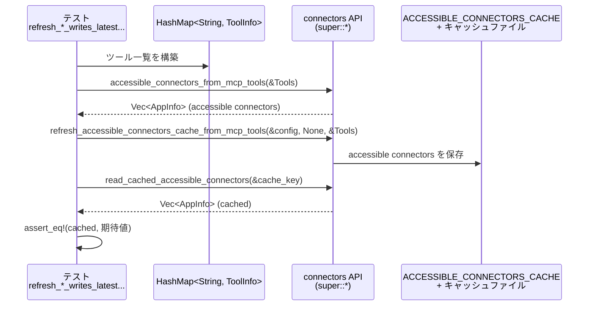
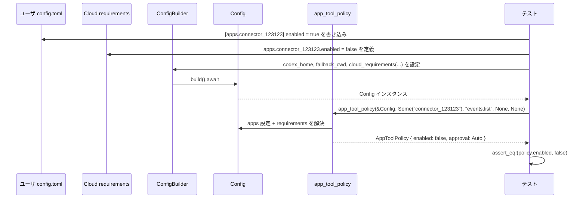

# core/src/connectors_tests.rs コード解説

## 0. ざっくり一言

このファイルは、「コネクタ（apps）」まわりの **マージ・フィルタリング・ポリシー決定・キャッシュ更新・ツールサジェスト** の振る舞いを検証するテスト群と、そのための小さなヘルパー関数を定義しています。

---

## 1. このモジュールの役割

### 1.1 概要

- このモジュールは **アプリ／コネクタ設定とツール実行ポリシー** に関する振る舞いをテストするために存在します。
- 具体的には、以下のような処理の期待仕様をテストから読み取れます：
  - プラグイン定義のコネクタ情報と、MCP から取得した「アクセス可能コネクタ」をどうマージするか
  - Apps の TOML 設定・クラウド／ローカル requirements（強制設定）をどう統合して `AppToolPolicy` を決めるか
  - 禁止されたコネクタ ID のフィルタリングや、ツールサジェスト対象コネクタの抽出ロジック
  - MCP ツールからの「アクセス可能コネクタ一覧」のキャッシュ更新

### 1.2 アーキテクチャ内での位置づけ

テストファイル自身はロジックを持たず、「上位モジュール `super::*`（おそらく `connectors.rs`）の公開 API」を呼び出して検証しています。

テストから見える依存関係を簡略化すると次のようになります：

```mermaid
graph TD
    subgraph core/src/connectors_tests.rs
        T_merge["テスト: merge_connectors_* 系"]
        T_accessible["テスト: accessible_connectors_from_mcp_tools_* 系"]
        T_policy["テスト: app_tool_policy_* 系"]
        T_filter["テスト: filter_* 系"]
        T_suggest["テスト: tool_suggest_* 系"]
        Helper["ヘルパー関数群<br/>annotations/app/..."]
    end

    subgraph core/src/connectors.rs（super::*）
        F_merge["merge_connectors"]
        F_accessible["accessible_connectors_from_mcp_tools"]
        F_cache_refresh["refresh_accessible_connectors_cache_from_mcp_tools"]
        F_read_cache["read_cached_accessible_connectors"]
        F_app_is_enabled["app_is_enabled"]
        F_apply_req["apply_requirements_apps_constraints"]
        F_app_policy_cfg["app_tool_policy_from_apps_config"]
        F_app_policy["app_tool_policy"]
        F_with_state["with_app_enabled_state"]
        F_filter["filter_disallowed_connectors"]
        F_filter_origin["filter_disallowed_connectors_for_originator"]
        F_suggest_ids["tool_suggest_connector_ids"]
        F_suggest_filter["filter_tool_suggest_discoverable_connectors"]
        Cache["ACCESSIBLE_CONNECTORS_CACHE"]
    end

    subgraph config
        ConfigBuilder
        ConfigLayerStack
        ConfigRequirementsToml
        AppsConfigToml
        AppsRequirementsToml
        CloudRequirementsLoader
    end

    subgraph external
        ToolInfo
        Tool
        AppInfo
        AppConfig
        AppToolsConfig
        AppToolConfig
    end

    T_merge --> F_merge
    T_accessible --> F_accessible
    T_accessible --> F_cache_refresh
    T_accessible --> F_read_cache
    T_policy --> F_app_is_enabled
    T_policy --> F_apply_req
    T_policy --> F_app_policy_cfg
    T_policy --> F_app_policy
    T_filter --> F_filter
    T_filter --> F_filter_origin
    T_suggest --> F_suggest_ids
    T_suggest --> F_suggest_filter
    T_accessible --> Cache
    T_policy --> ConfigBuilder
    T_policy --> ConfigLayerStack
    T_policy --> ConfigRequirementsToml
    T_policy --> AppsConfigToml
    T_policy --> AppsRequirementsToml
    T_policy --> CloudRequirementsLoader
    Helper --> ToolInfo
    Helper --> Tool
    Helper --> AppInfo
    Helper --> AppConfig
    Helper --> AppToolsConfig
    Helper --> AppToolConfig
```

> 実装本体（`merge_connectors` など）はこのチャンクには含まれておらず、テストから挙動だけが読み取れます。

### 1.3 設計上のポイント（テストから読み取れる範囲）

- **責務分割**
  - 実ロジックは `super::*` にあり、このファイルはあくまでテストとテスト用ヘルパーのみを持ちます。
  - ヘルパー関数で `AppInfo`, `ToolInfo` などのテストデータを生成し、テスト本体を簡潔に記述しています。
- **状態管理と並行性**
  - `ACCESSIBLE_CONNECTORS_CACHE` というグローバルキャッシュ（`Mutex` で保護されていると推測される）をテスト中だけ退避・クリアする `with_accessible_connectors_cache_cleared` が定義されています。  
    `lock().unwrap_or_else(std::sync::PoisonError::into_inner)` を利用しており、**Poisoned Mutex（過去のパニック）でもテストを継続できる**ようにしています。
- **非同期処理**
  - 設定ロードや requirements の取得が async になっているため、`#[tokio::test]` を使った非同期テストが多数あります。
  - 実装側は非同期 `ConfigBuilder::build().await` などを通じて I/O を伴うと推測されます（ファイル読み込み・クラウドへの問い合わせなど）。
- **エラーハンドリング**
  - テストでは `expect("...")` を多用し、前提条件が満たされない場合は即座にテストを失敗させています。
  - 実装側関数は `Result` を返している箇所（例: `read_cached_accessible_connectors(&cache_key).expect("cache should be populated")`）があり、エラー条件が明示的に扱われていると分かります。

---

## 2. 主要な機能一覧（テスト対象のコア機能）

テストから読み取れる「コア機能」を列挙します（実装は `super::*` 側）。

- **コネクタのマージ**
  - `merge_connectors`: プラグイン由来のコネクタ一覧と、MCP から取得したアクセス可能コネクタ一覧をマージし、表示名や `plugin_display_names` を統合・重複排除する。
- **MCP ツールからのアクセス可能コネクタ抽出**
  - `accessible_connectors_from_mcp_tools`: MCP の `ToolInfo` マップから、`AppInfo` リスト（アクセス可能なコネクタ一覧）を構築する。
  - `refresh_accessible_connectors_cache_from_mcp_tools` / `read_cached_accessible_connectors`: 上記一覧をキャッシュに書き込み・読み出しする。
- **Apps 設定と requirements に基づくツールポリシー決定**
  - `app_is_enabled`: AppsConfigToml の default 設定と per-app 設定から、その app/connector が有効かどうかを判定する。
  - `apply_requirements_apps_constraints`: AppsRequirementsToml（requirements）を既存 AppsConfigToml に適用し、有効／無効を強制する。
  - `app_tool_policy_from_apps_config`: AppsConfigToml（`AppsDefaultConfig`・`AppConfig`・`AppToolsConfig`）とツールの annotations から、`AppToolPolicy` を決定する。
  - `app_tool_policy`: `Config`（ユーザ設定 + クラウド／ローカル requirements）全体から `AppToolPolicy` を決定する。
- **表示用の AppInfo の状態統合**
  - `with_app_enabled_state`: requirements 情報などから、既存 `AppInfo` リストの `is_enabled` を更新・統合する。
- **コネクタ ID に基づくフィルタリング**
  - `filter_disallowed_connectors`: OpenAI 系など、禁止されたコネクタ ID を一覧から除外する。
  - `filter_disallowed_connectors_for_originator`: 「チャットの発話元（originator）」を考慮し、特定 originator から使えないコネクタを除外する。
- **ツールサジェスト対象コネクタの抽出**
  - `tool_suggest_connector_ids`: 設定ファイルの `[tool_suggest.discoverables]` から「コネクタ型」かつ有効な ID だけを抽出する。
  - `filter_tool_suggest_discoverable_connectors`: Discoverable なコネクタ ID と `AppInfo` の状態に基づき、「まだインストールされていないがサジェスト可能なコネクタ」を抽出する。

---

## 3. 公開 API と詳細解説

### 3.1 型一覧（このファイルで登場する主な型）

> 型定義そのものはこのチャンクには含まれていないため、**フィールドはテストコードから読み取れる範囲に限定**して記述します。

| 名前 | 種別 | 役割 / 用途 | 根拠 |
|------|------|-------------|------|
| `AppInfo` | 構造体 | コネクタ／アプリのメタ情報（`id`, `name`, `description`, `logo_url`, `is_accessible`, `is_enabled`, `plugin_display_names` など） | テスト内で初期化しているフィールドから推測（例: `AppInfo { id, name, description, ... }`） |
| `ToolAnnotations` | 構造体 | ツール側が持つヒント情報。特に `destructive_hint`, `open_world_hint`, `idempotent_hint`, `read_only_hint`, `title` を持つ | `annotations` ヘルパーの初期化より（`ToolAnnotations { destructive_hint, idempotent_hint: None, ... }`） |
| `ToolInfo` | 構造体 | MCP ツールのメタ情報。`server_name`, `callable_name`, `callable_namespace`, `tool`（rmcp::model::Tool）, `connector_id`, `connector_name`, `plugin_display_names` など | `codex_app_tool` ヘルパーおよび `accessible_connectors_from_mcp_tools_*` テストより |
| `Tool` | 構造体 | 実行可能なツールのスキーマ・メタ情報。`name`, `description`, `input_schema`, `annotations` など | `test_tool_definition`・`accessible_connectors_from_mcp_tools_preserves_description` より |
| `AppsConfigToml` | 構造体 | Apps 設定（ユーザ設定）を表現する TOML 構造体。`default: Option<AppsDefaultConfig>`, `apps: HashMap<String, AppConfig>` を持つ | `app_tool_policy_*` テストの構築コードより |
| `AppsDefaultConfig` | 構造体 | Apps 全体のデフォルト設定。`enabled`, `destructive_enabled`, `open_world_enabled` | 同上 |
| `AppConfig` | 構造体 | 個別 app/connector の設定。`enabled`, `destructive_enabled`, `open_world_enabled`, `default_tools_approval_mode`, `default_tools_enabled`, `tools` など | 同上 |
| `AppToolsConfig` | 構造体 | 1 つの app 内のツール設定集合。`tools: HashMap<String, AppToolConfig>` | `app_tool_policy_per_tool_enabled_true_overrides_app_level_disable_flags` などより |
| `AppToolConfig` | 構造体 | 特定ツールの設定。`enabled: Option<bool>`, `approval_mode: Option<AppToolApproval>` | 同上 |
| `AppToolPolicy` | 構造体 | 実際に適用されるツールポリシー。`enabled: bool`, `approval: AppToolApproval` | 多数の `app_tool_policy_*` テストの `assert_eq!` より |
| `AppToolApproval` | 列挙体 | ツールの承認モード。少なくとも `Auto`, `Approve`, `Prompt` がある | `AppToolApproval::Auto` などの使用より |
| `AppsRequirementsToml` | 構造体 | requirements 側の Apps 設定。`apps: BTreeMap<String, AppRequirementToml>` | `requirements_*` テストより |
| `AppRequirementToml` | 構造体 | 1 つの app の requirement。`enabled: Option<bool>` を少なくとも持つ | 同上 |
| `ConfigRequirementsToml` | 構造体 | 全体の requirements 設定。`apps: Option<AppsRequirementsToml>` を含む | `cloud_requirements_*` / `local_requirements_*` テストより |
| `Config` | 構造体 | アプリ全体の設定。`ConfigBuilder::build()` の結果で、`features` や `config_layer_stack` などを持つ | テスト内の利用より |
| `ConfigBuilder` | 構造体 | `Config` を構築するためのビルダ。`codex_home`, `fallback_cwd`, `cloud_requirements` などを設定可能 | 複数の `tokio::test` より |
| `ConfigLayerStack` | 構造体 | ユーザ設定・requirements のレイヤー構成を保持し、マージ結果を提供する | `local_requirements_*` テスト内での `ConfigLayerStack::new(...).with_user_config(...)` より |
| `CloudRequirementsLoader` | 構造体 | 非同期にクラウドから `ConfigRequirementsToml` を取得するローダ | `CloudRequirementsLoader::new(async move { ... })` より |
| `AppConnectorId` | タプル構造体 | プラグインのコネクタ ID を包む型 | `plugin_app_to_app_info(AppConnectorId("calendar".to_string()))` より |

※ 行番号はこのチャンクに明示されていないため、正確な `L開始-終了` は指定できません。以降「根拠」欄では関数名とテスト名を示します。

---

### 3.2 関数詳細（重要な 7 関数）

ここでは **プロダクションコード側の公開 API** を対象に、テストから分かる仕様を整理します。  
内部実装はこのチャンクにないため、「テストから読み取れる挙動」として記述します。

#### 1. `merge_connectors(plugins: Vec<AppInfo>, accessibles: Vec<AppInfo>) -> Vec<AppInfo>`

**概要**

- プラグイン由来のコネクタ (`plugins`) と、MCP から取得した「アクセス可能なコネクタ」 (`accessibles`) をマージし、表示名や `plugin_display_names` を統合した `AppInfo` のリストを返す関数です。

**引数**

| 引数名 | 型 | 説明 |
|--------|----|------|
| `plugins` | `Vec<AppInfo>` | プラグイン設定から得られるコネクタ一覧（`plugin_app_to_app_info` などから生成） |
| `accessibles` | `Vec<AppInfo>` | MCP などから取得された「実際にアクセス可能なコネクタ」一覧 |

**戻り値**

- `Vec<AppInfo>`: マージ後のコネクタ一覧。ID ごとにプラグイン情報とアクセス可能情報が統合されています。

**テストから読み取れる挙動**

- **名称・メタ情報の上書き**  
  - プラグイン側はプレースホルダ名（例: `"calendar"`）を持っていても、アクセス可能側が `"Google Calendar"` という人間向け名称を持っていれば、それで上書きされます。  
    （`merge_connectors_replaces_plugin_placeholder_name_with_accessible_name` より）
- **インストール URL の計算**
  - プラグイン側は `install_url: Some(connector_install_url(plugin_name, id))` を持つように見えます。
  - アクセス可能側では `install_url` が `None` でも、マージ結果では `Some(connector_install_url(name, id))` が入ります。
- **`plugin_display_names` のマージと重複排除**
  - プラグイン側とアクセス可能側両方の `plugin_display_names` が統合され、**集合的なユニーク（ソート済み）なリスト** になるとテストから読み取れます。  
    例: `["sample", "alpha", "sample"]` と `["beta", "alpha"]` → `["alpha", "beta", "sample"]`  
    （`merge_connectors_unions_and_dedupes_plugin_display_names` より）
- **`is_accessible` の扱い**
  - アクセス可能側が `is_accessible: true` の場合、マージ結果も `true` になります（プラグイン側の `false` が上書きされている）。

**Examples（使用例）**

テストを簡略化した例です。

```rust
// プラグインから得た placeholder なコネクタ
let plugin = plugin_app_to_app_info(AppConnectorId("calendar".to_string())); 

// MCP から得た実コネクタ情報
let accessible = google_calendar_accessible_connector(&["beta", "alpha"]); 

// マージ
let merged = merge_connectors(vec![plugin], vec![accessible]);

// 期待: name や description は accessible 側が優先される
assert_eq!(merged[0].name, "Google Calendar");
assert_eq!(merged[0].is_accessible, true);

// plugin_display_names は統合 + 重複排除される
assert_eq!(
    merged[0].plugin_display_names,
    plugin_names(&["alpha", "beta", "sample"])
);
```

**Errors / Panics**

- テストからはエラー／パニック条件は確認できません。  
  空の `plugins`／`accessibles` を渡すケースもテストされていないため、その挙動は不明です。

**Edge cases（エッジケース）**

- 同じ `id` を持つ `AppInfo` が複数ある場合の挙動は、テストからは不明です。
- どちらか一方にしか存在しないコネクタ ID がどう扱われるか（そのまま残すのか）は、テスト範囲からは読み取れません。

**使用上の注意点**

- マージルール（どのフィールドがどちらを優先するか）に依存した UI 表示やロジックを組む場合は、実装側ソースとテストの両方を確認する必要があります。
- `plugin_display_names` が順序付きかどうか（昇順ソートされるか）は、テストの期待値からは昇順に見えますが、仕様として保証されているかどうかはコード本体を確認する必要があります。

---

#### 2. `accessible_connectors_from_mcp_tools(tools: &HashMap<String, ToolInfo>) -> Vec<AppInfo>`

**概要**

- MCP から提供されるツール一覧（`ToolInfo` のマップ）を解析し、**コネクタ単位の `AppInfo` 一覧** を構築する関数です。

**引数**

| 引数名 | 型 | 説明 |
|--------|----|------|
| `tools` | `&HashMap<String, ToolInfo>` | MCP サーバから取得したツールの一覧。キーはツールのフルネーム（例: `"mcp__codex_apps__calendar_list_events"`） |

**戻り値**

- `Vec<AppInfo>`: MCP からみて「アクセス可能」と判断されたコネクタごとの `AppInfo` 一覧。

**テストから読み取れる挙動**

- **codex_apps サーバのコネクタのみを対象**
  - `server_name == CODEX_APPS_MCP_SERVER_NAME` かつ `connector_id` が `Some` のものだけが対象です。  
    例: `"mcp__sample__echo"`（`server_name: "sample"`）は無視されます。  
    （`accessible_connectors_from_mcp_tools_carries_plugin_display_names` より）
- **同一コネクタ ID のツールをまとめる**
  - `"calendar_list_events"` と `"calendar_create_event"` の 2 つのツールが同じ `connector_id: "calendar"` を持つケースでは、**1 件の `AppInfo`** に統合されます。
- **名前の決定**
  - `connector_name: Some("Google Calendar")` のように、人間向け名称が指定されている場合は、それを `AppInfo.name` に使います。
  - `connector_name` がない場合は、テストには明示されていませんが、少なくとも `accessible_connectors_from_mcp_tools_carries_plugin_display_names` の最終結果では `"Google Calendar"` が採用されています。
- **plugin_display_names の統合**
  - 各ツールの `plugin_display_names` を統合し、重複を取り除いた上で `AppInfo.plugin_display_names` に格納します。
  - 例: `["sample", "sample"]` と `["beta", "sample"]` → `["beta", "sample"]`（順序は辞書順に見えます）。
- **description の扱い**
  - `connector_description` がある場合は、それが `AppInfo.description` になります。
  - ツールの `Tool.description`（例: `"Create a calendar event"`) は **コネクタの description には使われず**、代わりに `connector_description: Some("Plan events")` が採用されます。  
    （`accessible_connectors_from_mcp_tools_preserves_description` より）

**Examples（使用例）**

```rust
// MCP サーバからのツール一覧（簡略版）
let tools = HashMap::from([
    (
        "mcp__codex_apps__calendar_list_events".to_string(),
        codex_app_tool(
            "calendar_list_events",
            "calendar",
            Some("Google Calendar"),
            &["beta", "sample"],
        ),
    ),
]);

let connectors = accessible_connectors_from_mcp_tools(&tools);

// 1 つの AppInfo にまとめられる
assert_eq!(connectors.len(), 1);
let calendar = &connectors[0];

assert_eq!(calendar.id, "calendar");
assert_eq!(calendar.name, "Google Calendar");
assert!(calendar.is_accessible);
assert_eq!(
    calendar.plugin_display_names,
    plugin_names(&["beta", "sample"])
);
```

**Errors / Panics**

- 無効な `ToolInfo` が渡された場合の挙動はテストからは不明です。
- 空の `tools` マップに対しては、通常は空のベクタを返すと推測されますが、テストでは確認されていません。

**Edge cases**

- `connector_id: None` のツールは無視されるようにテストから読み取れます（`mcp__sample__echo` が対象外）。
- 同じサーバ・同じ `connector_id` だが異なる `connector_name` を持つツールが混在した場合の扱いは不明です。

**使用上の注意点**

- この関数は `ToolInfo` の集合に対し **「コネクタ単位」** の情報に射影するため、ツール単位の情報（どのツールが存在するか）は失われます。
- `connector_name`／`connector_id` の一貫性が重要です。不整合なデータを渡すと、意図しないマージ結果になる可能性があります。

---

#### 3. `refresh_accessible_connectors_cache_from_mcp_tools(config: &Config, auth: Option<...>, tools: &HashMap<String, ToolInfo>)`

> 戻り値の型はテストからは直接見えません（`let _ =` などもないため）。ここでは **副作用**（キャッシュ更新）に着目します。

**概要**

- `accessible_connectors_from_mcp_tools` の結果を使って、ユーザごとの「アクセス可能なコネクタ一覧」をキャッシュ（`ACCESSIBLE_CONNECTORS_CACHE` とファイルなど）に書き込む関数です。

**引数**

| 引数名 | 型 | 説明 |
|--------|----|------|
| `config` | `&Config` | 現在の設定。少なくとも `features` とキャッシュキー（ホームディレクトリ等）を提供 |
| `auth` | `Option<...>` | 認証情報。テストでは `None` しか使われていません |
| `tools` | `&HashMap<String, ToolInfo>` | MCP ツール一覧 |

**戻り値**

- テストからは取得しておらず、不明です。副作用（キャッシュ更新）に依存しています。

**テストから読み取れる挙動**

- `Feature::Apps` が有効であることが前提のようです。  
  テストでは `config.features.set_enabled(Feature::Apps, true)` を行っています。
- `accessible_connectors_cache_key(&config, None)` で得られるキーに対応するキャッシュに、`accessible_connectors_from_mcp_tools` の結果が保存されます。
- `ACCESSIBLE_CONNECTORS_CACHE` という `Mutex<Option<_>>` のようなグローバルキャッシュにも依存していると推測されます。  
  テストでは `with_accessible_connectors_cache_cleared` によって、一時的にキャッシュをクリアした状態で実行されています。
- 「非公開コネクタ」らしきもの（例: `"connector_openai_hidden"`）は、**書き込まれたキャッシュからは除外**されます。  
  `refresh_accessible_connectors_cache_from_mcp_tools_writes_latest_installed_apps` では `"calendar"` だけが残っています。

**Examples（使用例）**

```rust
let tools = HashMap::from([
    (
        "mcp__codex_apps__calendar_list_events".to_string(),
        codex_app_tool(
            "calendar_list_events",
            "calendar",
            Some("Google Calendar"),
            &["calendar-plugin"],
        ),
    )
]);

let codex_home = tempdir().unwrap();
let mut config = ConfigBuilder::default()
    .codex_home(codex_home.path().to_path_buf())
    .build()
    .await
    .unwrap();

let _ = config.features.set_enabled(Feature::Apps, true);

let cache_key = accessible_connectors_cache_key(&config, None);

// テストではキャッシュを一時的にクリアして実行
let cached = with_accessible_connectors_cache_cleared(|| {
    refresh_accessible_connectors_cache_from_mcp_tools(&config, None, &tools);
    read_cached_accessible_connectors(&cache_key).unwrap()
});

assert_eq!(cached[0].id, "calendar");
```

**Errors / Panics**

- `read_cached_accessible_connectors` は `Result` を返しており、テストでは `expect("cache should be populated")` を呼び出しています。  
  → キャッシュが書き込まれていない・ファイルが読み込めない場合に `Err` になる可能性があります。
- `ACCESSIBLE_CONNECTORS_CACHE` の `lock()` が poison されていても `unwrap_or_else(PoisonError::into_inner)` によりテストを継続しますが、実運用ではどのように扱うかは本体次第です。

**Edge cases**

- `Feature::Apps` が無効のときの挙動はテストからは不明です（キャッシュを書かない、といった可能性があります）。
- 空の `tools` を渡したときにキャッシュをどう扱うかも不明です。

**使用上の注意点**

- キャッシュはグローバルな Mutex で守られているため、**頻繁な更新**や**長時間ロック**は性能に影響を与える可能性があります。
- 非同期コードの中から呼び出す場合、ブロッキング I/O（ファイルアクセス等）が含まれていれば、適切なスレッドプールで実行されているか確認する必要があります。

---

#### 4. `app_tool_policy_from_apps_config(apps_config: Option<&AppsConfigToml>, connector_id: Option<&str>, tool_name: &str, tool_title: Option<&str>, annotations: Option<&ToolAnnotations>) -> AppToolPolicy`

**概要**

- ユーザの Apps 設定（TOML）とツールの属性（名前・タイトル・annotations）を元に、特定コネクタ／ツールに対する `AppToolPolicy`（有効か、どう承認するか）を計算します。

**引数**

| 引数名 | 型 | 説明 |
|--------|----|------|
| `apps_config` | `Option<&AppsConfigToml>` | Apps 設定（ない場合はデフォルトポリシーにフォールバック） |
| `connector_id` | `Option<&str>` | 対象のコネクタ ID（例: `"calendar"`） |
| `tool_name` | `&str` | フルツール名（例: `"events/create"`, `"calendar_events/create"`） |
| `tool_title` | `Option<&str>` | ツールの表示名（`calendar_events/create` のような prefix を剥がす際に使用） |
| `annotations` | `Option<&ToolAnnotations>` | ツールの destructive / open_world ヒント |

**戻り値**

- `AppToolPolicy { enabled: bool, approval: AppToolApproval }`

**テストから読み取れる挙動**

1. **App 全体の有効／無効**

   - `AppsDefaultConfig.enabled` と `AppConfig.enabled` に基づき、「アプリ自体が有効か？」を判定します。
   - default.enabled = `false` でも、per-app 設定で `enabled = true` とすれば有効になる。  
     （`app_tool_policy_allows_per_app_enable_when_default_is_disabled`）
   - default.enabled = `false` かつ per-app 設定なし → app は無効。  
     （`app_tool_policy_honors_default_app_enabled_false`）

2. **destructive / open_world ヒントとグローバルデフォルト**

   - `AppsDefaultConfig.destructive_enabled` / `open_world_enabled` が **グローバルデフォルト**として使われます。
   - ツール側 annotations が `destructive_hint: Some(true)` であっても、global で `destructive_enabled = false` の場合は **無効**となる。  
     （`app_tool_policy_uses_global_defaults_for_destructive_hints`）

3. **per-app の destructive / open_world 設定**

   - `AppConfig.destructive_enabled` / `open_world_enabled` がセットされていれば、それが global default より優先します。

4. **tool 単位の設定**

   - `AppToolsConfig.tools["events/create"].enabled = Some(true)` のように、**特定ツールだけ有効**にすることができます。  
     `app_tool_policy_per_tool_enabled_true_overrides_app_level_disable_flags` では、app 全体では destructive/open_world が `false` ですが、ツール個別設定により `enabled: true` となっています。
   - `AppToolsConfig.tools["events/create"].approval_mode` があれば、そのツールに対する `approval` として採用されます。

5. **default_tools_enabled / default_tools_approval_mode**

   - `AppConfig.default_tools_enabled = Some(true)` の場合、ツールの annotations にかかわらず **既定でツールを有効化**します。  
     （`app_tool_policy_default_tools_enabled_true_overrides_app_level_tool_hints`）
   - `default_tools_enabled = Some(false)` の場合、ツールの destructive/open_world ヒントに関係なく、ツールは無効になります。  
     （`app_tool_policy_default_tools_enabled_false_overrides_app_level_tool_hints`）
   - `AppConfig.default_tools_approval_mode` が `Some(Approve)` の場合、`approval` のデフォルト値として用いられます。  
     （`app_tool_policy_uses_default_tools_approval_mode`）

6. **ツール名の prefix 剥がし**

   - `tool_name = "calendar_events/create"` かつ per-tool 設定キーが `"events/create"` の場合でも、**prefix を剥がしてマッチ**します。  
     （`app_tool_policy_matches_prefix_stripped_tool_name_for_tool_config`）

**Examples（使用例）**

```rust
let apps_config = AppsConfigToml {
    default: Some(AppsDefaultConfig {
        enabled: false,
        destructive_enabled: true,
        open_world_enabled: true,
    }),
    apps: HashMap::from([(
        "calendar".to_string(),
        AppConfig {
            enabled: true, // default は false だが、calendar は有効
            destructive_enabled: Some(false),
            open_world_enabled: Some(false),
            default_tools_approval_mode: Some(AppToolApproval::Auto),
            default_tools_enabled: Some(false),
            tools: Some(AppToolsConfig {
                tools: HashMap::from([(
                    "events/create".to_string(),
                    AppToolConfig {
                        enabled: Some(true),
                        approval_mode: Some(AppToolApproval::Approve),
                    },
                )]),
            }),
        },
    )]),
};

let policy = app_tool_policy_from_apps_config(
    Some(&apps_config),
    Some("calendar"),
    "calendar_events/create",
    Some("events/create"),
    Some(&annotations(Some(true), Some(true))),
);

assert_eq!(
    policy,
    AppToolPolicy {
        enabled: true,
        approval: AppToolApproval::Approve,
    }
);
```

**Errors / Panics**

- `apps_config` が `None` の場合の挙動はテストからは明示されていませんが、少なくとも panic はしていない前提でテストされています。
- 存在しない `connector_id` や `tool_name` に対しても、デフォルトポリシー（例: `enabled: false, approval: Auto`）を返しているように見えます。

**Edge cases**

- annotations が `None` の場合は、destructive/open_world のヒント無しとして扱われると推測されますが、テストでは詳しく検証されていません。
- `tool_title` が渡されない場合の prefix 剥がしロジックは不明です。

**使用上の注意点**

- **優先順位** が複雑（default → per-app → per-tool → annotations）なため、仕様を変える際はテストを読みながら整理する必要があります。
- セキュリティ面では、requirements（強制設定）で app を無効にしている場合にでも、この関数を直接使うとそれを無視する可能性があるため、通常は後述の `app_tool_policy` を使う方が安全です。

---

#### 5. `app_tool_policy(config: &Config, connector_id: Option<&str>, tool_name: &str, tool_title: Option<&str>, annotations: Option<&ToolAnnotations>) -> AppToolPolicy`

**概要**

- `Config` 全体（ユーザ Apps 設定 + クラウド requirements + ローカル requirements）を考慮し、最終的な `AppToolPolicy` を計算する高レベル API です。

**引数**

| 引数名 | 型 | 説明 |
|--------|----|------|
| `config` | `&Config` | すでに `ConfigBuilder` によって構築された設定。`config_layer_stack` にユーザ設定と requirements が含まれている |
| `connector_id` | `Option<&str>` | コネクタ ID |
| `tool_name` | `&str` | ツール名 |
| `tool_title` | `Option<&str>` | ツール表示名 |
| `annotations` | `Option<&ToolAnnotations>` | ツールヒント |

**戻り値**

- `AppToolPolicy`（最終的な有効／無効・承認モード）

**テストから読み取れる挙動**

- **クラウド requirements はユーザ設定より優先**
  - ユーザ設定で `enabled = true` でも、クラウド requirements (`ConfigRequirementsToml`) の `enabled = Some(false)` があると、最終ポリシーは `enabled: false` になります。  
    （`cloud_requirements_disable_connector_overrides_user_apps_config`）
  - ユーザ設定に `apps` テーブルが存在しない場合でも、requirements があればそれが適用されます。  
    （`cloud_requirements_disable_connector_applies_without_user_apps_table`）
- **ローカル requirements もユーザ設定より優先**
  - `ConfigLayerStack::new(...).with_user_config(...)` でユーザ設定を追加しても、`requirements` に `enabled = Some(false)` がある場合、最終的に `enabled: false` となります。  
    （`local_requirements_disable_connector_overrides_user_apps_config`）
  - ユーザ設定に `apps` 無しでも requirements の無効化が効きます。  
    （`local_requirements_disable_connector_applies_without_user_apps_table`）
- **requirements が app を無効にする場合、ツールは必ず `enabled: false`**
  - 上記すべての requirements ケースで、`AppToolPolicy { enabled: false, approval: Auto }` になることが確認されています。

**Examples（使用例）**

```rust
let codex_home = tempdir().unwrap();
// ユーザ設定ファイルを書き込む
std::fs::write(
    codex_home.path().join(CONFIG_TOML_FILE),
    r#"
[apps.connector_123123]
enabled = true
"#,
).unwrap();

// クラウド requirements: connector_123123 を強制的に無効化
let requirements = ConfigRequirementsToml {
    apps: Some(AppsRequirementsToml {
        apps: BTreeMap::from([(
            "connector_123123".to_string(),
            AppRequirementToml { enabled: Some(false) },
        )]),
    }),
    ..Default::default()
};

// Config を構築
let config = ConfigBuilder::default()
    .codex_home(codex_home.path().to_path_buf())
    .fallback_cwd(Some(codex_home.path().to_path_buf()))
    .cloud_requirements(CloudRequirementsLoader::new(async move { Ok(Some(requirements)) }))
    .build()
    .await
    .unwrap();

// 最終ポリシー: requirements により無効化
let policy = app_tool_policy(&config, Some("connector_123123"), "events.list", None, None);

assert_eq!(
    policy,
    AppToolPolicy {
        enabled: false,
        approval: AppToolApproval::Auto,
    }
);
```

**Errors / Panics**

- `ConfigBuilder::build()` が `Result` を返し、テストでは `expect("config should build")` しています。  
  → 設定ファイルのパース失敗などで `Err` になり得ます。
- `app_tool_policy` 自体は `AppToolPolicy` を直接返しているように使われており、エラーを返す設計には見えません。

**Edge cases**

- requirements が app を有効化（`enabled = Some(true)`）しようとする場合に、ユーザ設定で無効になっているケースはテストされていません。
- `connector_id` が `None` の場合の挙動はこの関数ではテストされていません。

**使用上の注意点**

- **セキュリティ上重要**: requirements（クラウド／ローカル）がユーザ設定より強いことが保証されているため、安全側のデフォルトを保つには `app_tool_policy_from_apps_config` ではなく、この関数を使う必要があります。
- 設定レイヤーの優先順位を変える場合は、テストを追加して振る舞いを明示することが望ましいです。

---

#### 6. `filter_disallowed_connectors(apps: Vec<AppInfo>) -> Vec<AppInfo>`

**概要**

- コネクタ ID に基づいて「利用禁止とされているコネクタ」を除外し、許可されたものだけの `AppInfo` リストを返す関数です。

**引数**

| 引数名 | 型 | 説明 |
|--------|----|------|
| `apps` | `Vec<AppInfo>` | 入力となるコネクタ一覧 |

**戻り値**

- `Vec<AppInfo>`: 利用許可されたコネクタのみを含む一覧。

**テストから読み取れる挙動**

- **OpenAI 接頭辞の除外**
  - `id` が `"connector_openai_foo"` や `"connector_openai_bar"` のように、`connector_openai_` プレフィックスを持つコネクタは除外されます。  
    （`filter_disallowed_connectors_filters_openai_prefix`）
- **特定 ID の除外**
  - `"asdk_app_6938a94a61d881918ef32cb999ff937c"`、
    `"connector_3f8d1a79f27c4c7ba1a897ab13bf37dc"` といった ID を持つコネクタは明示的に除外されます。  
    （`filter_disallowed_connectors_filters_disallowed_connector_ids`）
- その他のコネクタ（例: `"alpha"`, `"gamma"`, `"delta"`）はそのまま残ります。  
  （`filter_disallowed_connectors_allows_non_disallowed_connectors`）

**Examples（使用例）**

```rust
let apps = vec![
    app("connector_openai_foo"),
    app("asdk_app_6938a94a61d881918ef32cb999ff937c"),
    app("gamma"),
];

let filtered = filter_disallowed_connectors(apps);

// OpenAI 系や特定 ID は除外され、"gamma" だけ残る
assert_eq!(filtered, vec![app("gamma")]);
```

**Errors / Panics**

- 文字列処理だけであり、パニック条件は特に見当たりません（テストからは不明ですが、通常は安全なプレフィックスチェックです）。

**Edge cases**

- 大文字・小文字を区別するか（`"Connector_OpenAI_..."`）はテストから読み取れません（少なくともテストでは全て小文字）。
- フィルタ対象の ID のリストは固定・埋め込みか、設定から読み取るかは不明です。

**使用上の注意点**

- セキュリティ／コンプライアンス上使用を禁止したいコネクタを確実に除外する目的で使われていると考えられます。
- 新たな禁止対象が増えた場合、この関数（とテスト）の更新が必要になります。

---

#### 7. `filter_tool_suggest_discoverable_connectors(all_apps: Vec<AppInfo>, accessible_apps: &[AppInfo], discoverable_ids: &HashSet<String>) -> Vec<AppInfo>`

**概要**

- ツールサジェスト機能において、「ユーザにインストール候補として見せるコネクタ」だけを抽出するためのフィルタ関数です。

**引数**

| 引数名 | 型 | 説明 |
|--------|----|------|
| `all_apps` | `Vec<AppInfo>` | すべてのプラグイン backed コネクタ（候補になりうるもの） |
| `accessible_apps` | `&[AppInfo]` | すでにユーザ環境で「アクセス可能」と判定されているコネクタ（インストール済み） |
| `discoverable_ids` | `&HashSet<String>` | 設定 `[tool_suggest.discoverables]` から抽出した「サジェスト対象のコネクタ ID」集合 |

**戻り値**

- `Vec<AppInfo>`: サジェストに表示すべきコネクタ一覧。

**テストから読み取れる挙動**

1. **discoverables に含まれる ID に限定**

   - `discoverable_ids` に含まれない ID のコネクタはサジェスト対象から除外されます。

2. **すでに accessible なコネクタはサジェストしない**

   - `accessible_apps` に `is_accessible: true` で存在するコネクタは、**サジェスト対象から除外**されます。
   - これは `is_enabled` が `false` でも同様で、**すでに「アクセス可能なインスタンス」があるものはサジェストしない**、という挙動になっています。  
     （`filter_tool_suggest_discoverable_connectors_excludes_accessible_apps_even_when_disabled`）

3. **プラグイン backed の未インストール app のみをサジェスト**

   - `filter_tool_suggest_discoverable_connectors_keeps_only_plugin_backed_uninstalled_apps` では、
     - `all_apps`: Google Calendar / Gmail / Other（いずれも named_app で、プラグイン backed とみなされる）
     - `accessible_apps`: Google Calendar のみ（`is_accessible: true`）
     - `discoverable_ids`: Google Calendar と Gmail の ID
   - 結果: **Gmail だけ** がサジェスト対象として残ります。

**Examples（使用例）**

```rust
let all_apps = vec![
    named_app("connector_calendar", "Google Calendar"),
    named_app("connector_gmail", "Gmail"),
];

// すでにインストールされているのは Calendar のみ
let accessible_apps = &[AppInfo {
    is_accessible: true,
    ..named_app("connector_calendar", "Google Calendar")
}];

let discoverable_ids = HashSet::from([
    "connector_calendar".to_string(),
    "connector_gmail".to_string(),
]);

let filtered = filter_tool_suggest_discoverable_connectors(
    all_apps,
    accessible_apps,
    &discoverable_ids,
);

// 期待: まだインストールされていない Gmail だけ残る
assert_eq!(filtered, vec![named_app("connector_gmail", "Gmail")]);
```

**Errors / Panics**

- 入力リスト／セットに対してのフィルタリングのみであり、特にパニック条件は読み取れません。

**Edge cases**

- `accessible_apps` に同じ ID が重複している場合の扱い（通常は問題にならないはずですが）はテストされていません。
- `discoverable_ids` に空文字や空白のみの ID が含まれた場合は、そもそも `tool_suggest_connector_ids` 側で弾かれます（後述）。

**使用上の注意点**

- この関数単体では、「そのコネクタ ID がツールサジェスト設定から来ているか」を信頼しており、`discoverable_ids` の内容の妥当性はチェックしません。  
  → `tool_suggest_connector_ids` との組み合わせで安全性・一貫性を保つ設計になっていると考えられます。

---

### 3.3 その他の関数・テストヘルパー一覧

#### テスト用ヘルパー関数

| 関数名 | 役割（1 行） |
|--------|--------------|
| `annotations(destructive_hint, open_world_hint) -> ToolAnnotations` | 指定した destructive / open_world ヒントだけをセットした `ToolAnnotations` を生成する |
| `app(id: &str) -> AppInfo` | ID と名前が同一のシンプルな `AppInfo` を生成（`is_accessible = false`, `is_enabled = true`） |
| `named_app(id: &str, name: &str) -> AppInfo` | `app()` の variant で、`name` と `install_url` を設定する |
| `plugin_names(names: &[&str]) -> Vec<String>` | `&[&str]` を `Vec<String>` に変換するユーティリティ |
| `test_tool_definition(tool_name: &str) -> Tool` | 最小限の rmcp::model::Tool を生成する（空の `input_schema` など） |
| `google_calendar_accessible_connector(plugin_display_names: &[&str]) -> AppInfo` | Google Calendar を表す `AppInfo`（accessible = true）を生成する |
| `codex_app_tool(tool_name, connector_id, connector_name, plugin_display_names) -> ToolInfo` | codex_apps サーバ上のコネクタツール `ToolInfo` を生成する |
| `with_accessible_connectors_cache_cleared<R>(f: impl FnOnce() -> R) -> R` | グローバルキャッシュ `ACCESSIBLE_CONNECTORS_CACHE` を一時的に退避・クリアしてから `f()` を実行し、終了後にキャッシュを元に戻す |

#### 主なテスト関数（名前から読み取れる仕様）

ここでは一部だけ列挙します（すべて `#[test]` または `#[tokio::test]`）。

| テスト名 | 検証している仕様 |
|----------|------------------|
| `merge_connectors_replaces_plugin_placeholder_name_with_accessible_name` | `merge_connectors` がアクセス可能コネクタの名称やメタ情報を優先すること |
| `accessible_connectors_from_mcp_tools_carries_plugin_display_names` | `accessible_connectors_from_mcp_tools` が `plugin_display_names` を統合すること |
| `refresh_accessible_connectors_cache_from_mcp_tools_writes_latest_installed_apps` | MCP ツールから得た accessible connectors がキャッシュに書かれること |
| `app_tool_policy_*` シリーズ | AppsConfigToml と annotations から `AppToolPolicy` をどのように計算するか（default／per-app／per-tool／approval_mode 等） |
| `requirements_*` / `cloud_requirements_*` / `local_requirements_*` | requirements 設定がユーザ設定より優先して connector を無効化すること |
| `filter_disallowed_connectors_*` | OpenAI プレフィックスや特定 ID のコネクタがフィルタされること |
| `first_party_chat_originator_filters_target_and_openai_prefixed_connectors` | originator が first-party のときに、ターゲット自身と OpenAI 系コネクタが除外されること |
| `tool_suggest_connector_ids_include_configured_tool_suggest_discoverables` | 設定 `[tool_suggest.discoverables]` から connector 型かつ空白でない ID だけが抽出されること |
| `filter_tool_suggest_discoverable_connectors_*` | サジェスト対象から accessible apps を除外し、discoverable な未インストール app のみ残すこと |

---

## 4. データフロー

ここでは代表的な 2 つのシナリオを説明します。

### 4.1 MCP ツール → アクセス可能コネクタ → キャッシュ

このフローは `refresh_accessible_connectors_cache_from_mcp_tools_writes_latest_installed_apps` テストに対応します。

1. MCP サーバから `HashMap<String, ToolInfo>` としてツール一覧を取得（テストでは手動で構築）。
2. `accessible_connectors_from_mcp_tools` でツール一覧をコネクタ単位の `Vec<AppInfo>` に変換。
3. `refresh_accessible_connectors_cache_from_mcp_tools` がコネクタ一覧をキャッシュに保存。
4. `read_cached_accessible_connectors` でキャッシュから再読込し、内容を検証。



### 4.2 Apps 設定 + requirements → 最終 AppToolPolicy

このフローは `cloud_requirements_disable_connector_overrides_user_apps_config` などのテストに対応します。



この図から分かるように、`app_tool_policy` は

- ユーザ設定（`config.toml`）、
- クラウド／ローカル requirements

を統合した結果に基づいてポリシーを決定する「最終ゲート」として機能しています。

---

## 5. 使い方（How to Use）

### 5.1 基本的な使用方法（代表パターン）

実装本体はこのファイルにはありませんが、テストを参考にすると、コネクタまわりの典型的な使用フローは次のようになります。

```rust
use crate::config::ConfigBuilder;
use crate::connectors::{
    accessible_connectors_from_mcp_tools,
    refresh_accessible_connectors_cache_from_mcp_tools,
    read_cached_accessible_connectors,
    app_tool_policy,
    tool_suggest_connector_ids,
    filter_tool_suggest_discoverable_connectors,
};
use std::collections::HashMap;

// 1. Config の構築
let codex_home = std::path::PathBuf::from("/path/to/codex_home");
let mut config = ConfigBuilder::default()
    .codex_home(codex_home.clone())
    .build()
    .await?;

// 2. MCP ツール一覧を取得（ここでは仮に tools とする）
let tools: HashMap<String, ToolInfo> = get_mcp_tools().await?;

// 3. アクセス可能コネクタ一覧を計算し、キャッシュに反映
let accessible = accessible_connectors_from_mcp_tools(&tools);
refresh_accessible_connectors_cache_from_mcp_tools(&config, None, &tools);

// 4. ユーザの Apps 設定と requirements を反映したツールポリシーを取得
let annotations = ToolAnnotations {
    destructive_hint: Some(true),
    idempotent_hint: None,
    open_world_hint: Some(false),
    read_only_hint: None,
    title: None,
};

let policy = app_tool_policy(
    &config,
    Some("connector_calendar"),
    "events/create",
    Some("events/create"),
    Some(&annotations),
);

// 5. ツールサジェスト用に discoverable な connector を絞り込む
let suggest_ids = tool_suggest_connector_ids(&config);
let plugin_backed_apps = get_plugin_backed_apps(); // 例: プラグイン情報から構築
let discoverables = filter_tool_suggest_discoverable_connectors(
    plugin_backed_apps,
    &accessible,
    &suggest_ids,
);

// 6. policy や discoverables を UI に反映
println!("policy: enabled={}, approval={:?}", policy.enabled, policy.approval);
println!("discoverable connectors: {:?}", discoverables);
```

### 5.2 よくある使用パターン

- **「ツールごとの有効／無効」を制御したい場合**
  - `AppsConfigToml` の per-tool 設定（`AppToolsConfig.tools`）を使い、`enabled` と `approval_mode` を指定する。
  - 実行時には `app_tool_policy_from_apps_config` か `app_tool_policy` を通してポリシーを取得する。
- **「クラウド側で特定コネクタを強制的に無効化」したい場合**
  - クラウドの requirements（`ConfigRequirementsToml.apps`）に `enabled = false` を指定し、`CloudRequirementsLoader` 経由で `ConfigBuilder` に渡す。
  - アプリ側では `app_tool_policy` を使うことで、ユーザ設定に関わらず無効化が反映される。

### 5.3 よくある間違い（テストから想定できるもの）

```rust
// 間違い例: requirements を無視して AppsConfigToml だけでポリシーを計算
let apps_config = load_apps_config_only();
let policy = app_tool_policy_from_apps_config(
    Some(&apps_config),
    Some("connector_123123"),
    "events.list",
    None,
    Some(&annotations),
);
// → クラウド／ローカル requirements で禁止されている可能性を見逃す

// 正しい例: Config を通じて requirements を含めたポリシーを計算
let config = ConfigBuilder::default()
    .codex_home(codex_home)
    .cloud_requirements(loader)
    .build()
    .await?;
let policy = app_tool_policy(
    &config,
    Some("connector_123123"),
    "events.list",
    None,
    Some(&annotations),
);
```

### 5.4 使用上の注意点（まとめ）

- **セキュリティ / ガバナンス**
  - `filter_disallowed_connectors`・`filter_disallowed_connectors_for_originator` を適切なタイミングで通さないと、禁止対象のコネクタが UI に露出する可能性があります。
  - requirements（クラウド／ローカル）はユーザ設定を上書きする前提で設計されているため、その前提を崩さないよう `app_tool_policy` を利用することが重要です。
- **並行性**
  - アクセス可能コネクタのキャッシュは Mutex で保護されているため、ロック時間が長くならないよう注意する必要があります。
  - 非同期コンテキスト内からブロッキング I/O を行う場合は、ランタイム（tokio 等）の推奨する方法で offload することが望ましいです。
- **設定ファイルの検証**
  - `tool_suggest_connector_ids` は Discoverables 設定のうち `type = "connector"` かつ ID が空白でないものだけを使います。  
    誤った設定値があると意図したサジェストが行われないため、CI 等でテストを通すことが安全です。

---

## 6. 変更の仕方（How to Modify）

### 6.1 新しい機能を追加する場合（このモジュール視点）

- **新しいフィルタ条件を追加したい**（例: さらに別の disallowed connector を追加）
  1. `core/src/connectors.rs` の `filter_disallowed_connectors` 実装を修正する。
  2. このテストファイルに `#[test] fn filter_disallowed_connectors_filters_new_id()` のようなテストを追加し、期待挙動を assert する。
- **AppToolPolicy の新しいフラグを追加したい**
  1. `AppToolPolicy` と関連 enum／config（`AppToolApproval` 等）を拡張する。
  2. `app_tool_policy_from_apps_config` / `app_tool_policy` のロジックを更新。
  3. 本テストファイルに、そのフラグに関するテストを追加する（default・per-app・per-tool など異なるケースをカバー）。

### 6.2 既存の機能を変更する場合

- **影響範囲の確認方法**
  - まず `core/src/connectors.rs` 本体を確認し、変更対象関数の呼び出し元を `rg`／`grep` などで洗い出す。
  - このテストファイル内で、その関数名を含むテストをすべて確認し、期待仕様がどこまでカバーされているかを把握する。
- **変更時に注意すべき契約（前提条件・返り値の意味）**
  - `app_tool_policy` 系は「requirements がユーザ設定より優先される」という契約を暗黙に持っているため、変更しない限りその前提は維持する必要があります。
  - `filter_disallowed_connectors` はセキュリティ／コンプライアンス上の契約を担っている可能性が高く、除外対象を狭める変更は慎重に行う必要があります。
- **テスト・使用箇所の再確認**
  - 本ファイル内の既存テストがまだ仕様を正しくカバーしているか確認し、不足していれば追加する。
  - UI や他のモジュールで `AppInfo` や `AppToolPolicy` をどう解釈しているかを確認し、互換性を損なわないようにします。

---

## 7. 関連ファイル

テストから推測される、このモジュールと密接に関係するファイル／モジュールです。

| パス / モジュール | 役割 / 関係 |
|------------------|------------|
| `core/src/connectors.rs`（推定） | 本ファイルがテストしている実装本体。`merge_connectors` や `app_tool_policy` などを提供する |
| `crate::config`（`CONFIG_TOML_FILE`, `ConfigBuilder` など） | `Config` のビルドと設定ファイル（`config.toml`）の読み込みを担当 |
| `crate::config_loader`（`ConfigRequirementsToml`, `CloudRequirementsLoader`, `ConfigLayerStack` など） | クラウド／ローカル requirements のロードとレイヤーマージを担当 |
| `codex_config::types`（`AppConfig`, `AppToolsConfig`, `AppsDefaultConfig` 等） | Apps 設定の TOML マッピング構造体を定義 |
| `codex_mcp`（`ToolInfo`, `CODEX_APPS_MCP_SERVER_NAME`） | MCP ツールのメタ情報および codex_apps サーバ名の定数を提供 |
| `rmcp::model`（`Tool`, `JsonObject`） | MCP ツールのスキーマ格納用構造体を提供 |
| `codex_utils_absolute_path::AbsolutePathBuf` | 要求に応じて絶対パスのみを扱う PathBuf ラッパー |
| `tests` ディレクトリ（存在すれば） | このファイル以外の結合テスト／統合テストがある可能性 |

このテストファイルは、これらのコンポーネントが正しく連携しているかを確認する「結合テスト」に近い位置づけになっています。
