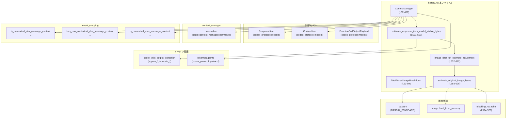
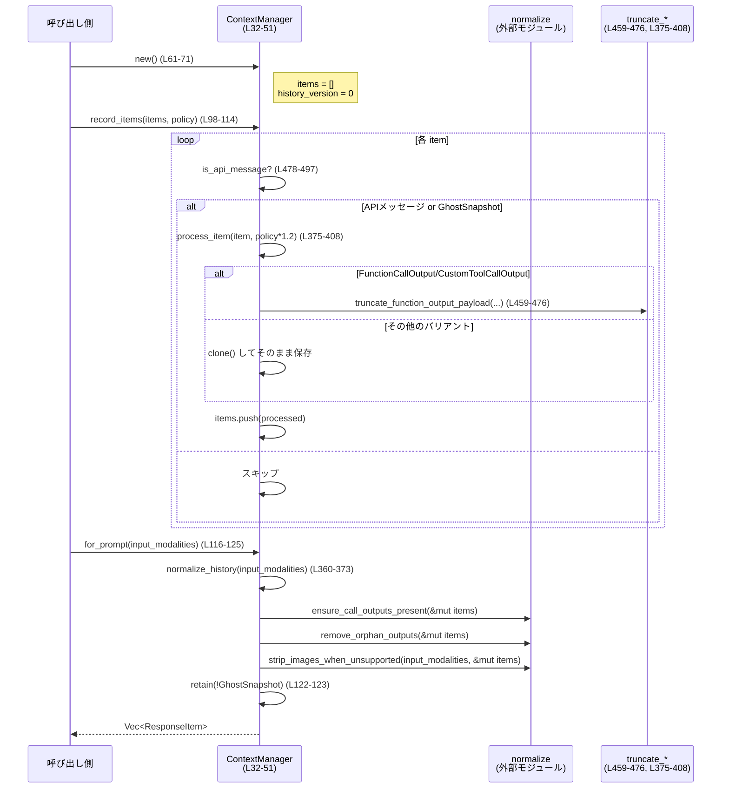
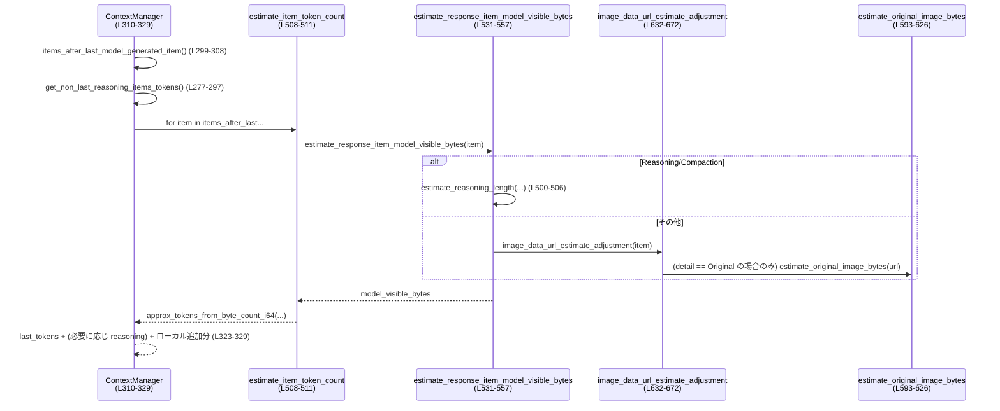

# core/src/context_manager/history.rs コード解説

## 0. ざっくり一言

- スレッドの会話履歴（`ResponseItem` の列）を管理し、  
  モデルに渡す前の正規化・トークン使用量の推定・ロールバックなどを行うコンテキスト管理モジュールです（`ContextManager`、`TotalTokenUsageBreakdown` が中心、L32-59, L61-457）。

---

## 1. このモジュールの役割

### 1.1 概要

- このモジュールは **会話履歴の管理とトークンコスト推定** の問題を解決するために存在し、次の機能を提供します。
  - `ResponseItem` の記録・保持・削除・ロールバック（L32-51, L61-263）
  - モデルに渡す前の履歴正規化（呼び出しと出力の対応付け・画像の除去）（L360-373）
  - トークン使用量の累計・内訳推定（L136-161, L277-358, L500-511, L531-557）
  - 画像を含むレスポンスの「モデル可視バイト数」の概算（L513-557, L559-672）

### 1.2 アーキテクチャ内での位置づけ

`ContextManager` を中心に、他モジュールと概ね次のように連携します。



- モデルに渡す前の履歴構築では `ContextManager::for_prompt` → `normalize_history` → `normalize` モジュールの関数（L360-373）という呼び出し関係になっています。
- トークン推定では `ContextManager::get_total_token_usage` → `estimate_item_token_count` → `estimate_response_item_model_visible_bytes` → 画像関連ヘルパ群という流れになります（L312-332, L508-511, L531-557, L632-672）。

### 1.3 設計上のポイント

- **状態管理**
  - 履歴本体 `items: Vec<ResponseItem>` と履歴バージョン `history_version` を保持（L35-38）。
  - サーバから取得したトークン使用情報 `token_info: Option<TokenUsageInfo>`（L39）と、コンテキスト差分用のスナップショット `reference_context_item`（L40-50）を持つ。
- **履歴の整合性**
  - `normalize_history` で「全てのツール呼び出しに対応する出力がある」「全ての出力に呼び出しがある」という不変条件を保証（L360-373）。
  - 削除・ロールバック時にも `normalize::remove_corresponding_for` などで対応ペアを保持（L163-173, L175-183）。
- **トークン推定**
  - 正確なトークナイザではなく、「バイト数→トークン数」の近似に基づいた下限推定（L136-161, L508-511, L513-517）。
  - 画像は OpenAI の課金仕様に合わせた近似（定数 `RESIZED_IMAGE_BYTES_ESTIMATE` と 32px パッチ数）を使用（L513-522, L593-626）。
- **エラーハンドリング**
  - ほぼ全てが `Option` とデフォルト値（`unwrap_or` / `unwrap_or_default`）で処理され、`panic!` を起こさないように設計（例: L151-152, L540-544, L623-624）。
  - 画像のデコードに失敗しても `trace` ログを出しつつ `None` を返してフォールバック（L603-608, L610-615）。
- **並行性**
  - グローバル画像推定キャッシュ `ORIGINAL_IMAGE_ESTIMATE_CACHE` を `LazyLock<BlockingLruCache<...>>` で管理し、スレッド間安全なアクセスを提供（L524-529）。
  - `ContextManager` 自体にはスレッド同期はなく、通常は単一スレッド / 外側のロックから利用される想定と解釈できます（コードから暗示されるのみ）。

### 1.4 コンポーネントインベントリー（関数/構造体一覧）

> 行番号はこのチャンク内で数えたものです。表記形式は `core/src/context_manager/history.rs:L開始-終了` です。

| 名称 | 種別 | 概要 | 定義位置 |
|------|------|------|----------|
| `ContextManager` | 構造体 | 履歴とトークン情報・基準コンテキストを保持するメイン管理オブジェクト | `history.rs:L32-51` |
| `TotalTokenUsageBreakdown` | 構造体 | トークン使用量の内訳を表現するシンプルな集約構造体 | `history.rs:L53-59` |
| `ContextManager::new` | メソッド | 空の履歴とデフォルトの `TokenUsageInfo` を持つインスタンスを生成 | `history.rs:L61-71` |
| `ContextManager::token_info` | メソッド | `token_info` のクローンを返す | `history.rs:L73-75` |
| `ContextManager::set_token_info` | メソッド | `token_info` を差し替える | `history.rs:L77-79` |
| `ContextManager::set_reference_context_item` | メソッド | `reference_context_item` を設定 | `history.rs:L81-83` |
| `ContextManager::reference_context_item` | メソッド | `reference_context_item` のクローンを返す | `history.rs:L85-87` |
| `ContextManager::set_token_usage_full` | メソッド | コンテキストウィンドウいっぱいまでのトークン使用として `token_info` を更新 | `history.rs:L89-96` |
| `ContextManager::record_items` | メソッド | 受け取った `ResponseItem` 群のうち API メッセージのみを処理・格納 | `history.rs:L98-114` |
| `ContextManager::for_prompt` | メソッド | 正規化とゴーストスナップショット除去を行い、モデルに渡す履歴を返す | `history.rs:L116-125` |
| `ContextManager::raw_items` | メソッド | 内部の生の `items` スライスを返す | `history.rs:L127-130` |
| `ContextManager::history_version` | メソッド | 履歴のバージョン番号を返す | `history.rs:L132-134` |
| `ContextManager::estimate_token_count` | メソッド | モデル固有のベース指示文を含めたトークン数の近似を返す | `history.rs:L136-145` |
| `ContextManager::estimate_token_count_with_base_instructions` | メソッド | 与えた `BaseInstructions` + 履歴からトークン数を推定 | `history.rs:L147-161` |
| `ContextManager::remove_first_item` | メソッド | 最も古い履歴要素と、その対になる呼び出し/出力を削除 | `history.rs:L163-173` |
| `ContextManager::remove_last_item` | メソッド | 最後の履歴要素と対応ペアを削除し、バージョンをインクリメント | `history.rs:L175-183` |
| `ContextManager::replace` | メソッド | 履歴を別の `Vec<ResponseItem>` に丸ごと置き換え、バージョン更新 | `history.rs:L185-188` |
| `ContextManager::replace_last_turn_images` | メソッド | 直近ターンのツール出力内画像をプレースホルダ文字列に差し替える | `history.rs:L190-222` |
| `ContextManager::drop_last_n_user_turns` | メソッド | 指定数のユーザーターン（インストラクションターン）を末尾から削除 | `history.rs:L224-263` |
| `ContextManager::update_token_info` | メソッド | サーバからの `TokenUsage` を `token_info` に追加 | `history.rs:L265-275` |
| `ContextManager::get_non_last_reasoning_items_tokens` | メソッド(非公開) | 最後のユーザーターンより前の reasoning アイテムのトークン数合計 | `history.rs:L277-297` |
| `ContextManager::items_after_last_model_generated_item` | メソッド(非公開) | 最後の「モデル生成アイテム」以降のスライスを返す | `history.rs:L299-308` |
| `ContextManager::get_total_token_usage` | メソッド | API 応答に含まれるトークン + ローカル追加分 + reasoning 分を合算 | `history.rs:L310-329` |
| `ContextManager::get_total_token_usage_breakdown` | メソッド | `TotalTokenUsageBreakdown` 形式でトークン使用内訳を返す | `history.rs:L332-357` |
| `ContextManager::normalize_history` | メソッド(非公開) | 呼び出し/出力の対応付けと画像ストリップの正規化を行う | `history.rs:L360-373` |
| `ContextManager::process_item` | メソッド(非公開) | ツール出力のトランケーションを行い、その他はクローン | `history.rs:L375-408` |
| `ContextManager::trim_pre_turn_context_updates` | メソッド(非公開) | ロールバック境界前の「コンテキスト更新」メッセージを後ろから削る | `history.rs:L411-456` |
| `truncate_function_output_payload` | 関数 | `FunctionCallOutputPayload` の本文をポリシーに従いトランケート | `history.rs:L459-476` |
| `is_api_message` | 関数 | `ResponseItem` が API メッセージか（system 以外、ツール関連等）を判定 | `history.rs:L478-497` |
| `estimate_reasoning_length` | 関数 | base64 エンコード長から元の reasoning バイト長を近似 | `history.rs:L500-506` |
| `estimate_item_token_count` | 関数 | 1 アイテムのモデル可視バイト数からトークン数を近似 | `history.rs:L508-511` |
| `estimate_response_item_model_visible_bytes` | 関数(pub(crate)) | 1 `ResponseItem` の「モデル可視バイト数」を概算 | `history.rs:L531-557` |
| `parse_base64_image_data_url` | 関数 | `data:image/...;base64,...` 形式の URL から base64 部分を抽出 | `history.rs:L564-590` |
| `estimate_original_image_bytes` | 関数 | detail=Original の画像について、32px パッチ数からバイト数を近似 | `history.rs:L593-626` |
| `image_data_url_estimate_adjustment` | 関数 | 画像 data URL を走査し、base64 部分の生バイトと置換バイトの合計を算出 | `history.rs:L632-672` |
| `is_model_generated_item` | 関数 | アイテムがモデル側生成か（assistant, reasoning, 各種 call 等）を判定 | `history.rs:L675-691` |
| `is_codex_generated_item` | 関数(pub(crate)) | Codex 側で生成されたアイテム（ツール出力 / developer メッセージ）かを判定 | `history.rs:L694-700` |
| `is_user_turn_boundary` | 関数(pub(crate)) | ユーザーターン境界となるメッセージかどうかを判定 | `history.rs:L703-710` |
| `is_inter_agent_instruction_content` | 関数 | メッセージ内容がエージェント間指示かどうかを判定 | `history.rs:L712-713` |
| `user_message_positions` | 関数 | ユーザーターン境界のインデックス一覧を返す | `history.rs:L716-723` |
| `tests` モジュール | テストモジュール | `history_tests.rs` にあるテスト群をインポート | `history.rs:L726-728` |

---

## 2. 主要な機能一覧

- 履歴の記録: `record_items` で `ResponseItem` の列を取り込み、ツール出力をトランケートしつつ保存（L98-114, L375-408）。
- プロンプト用履歴の生成: `for_prompt` で正規化と不要アイテム削除を行い、モデルに渡す履歴を構築（L116-125, L360-373）。
- 履歴の部分削除・ロールバック:
  - `remove_first_item` / `remove_last_item` / `replace`（L163-188）
  - `drop_last_n_user_turns` + `trim_pre_turn_context_updates` によるターン単位ロールバック（L224-263, L411-456）。
- トークン使用量の管理:
  - `update_token_info` / `set_token_usage_full` / `get_total_token_usage` / `get_total_token_usage_breakdown`（L89-96, L265-275, L310-358）。
- トークン数の近似推定:
  - `estimate_token_count` / `estimate_token_count_with_base_instructions`（L136-161）。
  - `estimate_item_token_count` / `estimate_response_item_model_visible_bytes` / 画像ヘルパ群（L508-511, L531-557, L559-672）。
- 画像コンテンツの扱い:
  - `replace_last_turn_images` によるツール出力画像のテキスト置換（L190-222）。
  - `normalize_history` + `normalize::strip_images_when_unsupported` による画像ストリップ（L360-373）。
- アイテム種別判定:
  - `is_api_message`, `is_model_generated_item`, `is_codex_generated_item`, `is_user_turn_boundary` など（L478-497, L675-710, L694-700）。

---

## 3. 公開 API と詳細解説

### 3.1 型一覧（構造体・列挙体など）

| 名前 | 種別 | 役割 / 用途 | 定義位置 |
|------|------|-------------|----------|
| `ContextManager` | 構造体 | 会話履歴 (`Vec<ResponseItem>`) とトークン情報・基準コンテキストをまとめて管理する中心的な型です。履歴の追加・削除・ロールバックやトークン推定 API を提供します。 | `history.rs:L32-51` |
| `TotalTokenUsageBreakdown` | 構造体 | トークン使用量の内訳として、「最後の API 応答の total_tokens」「全履歴のバイト数」「最後の応答以降に追加されたアイテムの推定トークン/バイト」を保持します。 | `history.rs:L53-59` |

### 3.2 関数詳細（主要メソッド・関数）

#### `ContextManager::record_items<I>(&mut self, items: I, policy: TruncationPolicy)`  

**概要**

- 履歴に新しいアイテムを追加します（古い→新しい順）。  
- `system` メッセージと `GhostSnapshot` 以外の API メッセージのみを対象とし、ツール出力はトランケートしてから保存します（L98-114, L375-408）。

**引数**

| 引数名 | 型 | 説明 |
|--------|----|------|
| `items` | `I` where `I: IntoIterator`, `I::Item: Deref<Target = ResponseItem>` | 追加対象のレスポンスアイテム群。`&[ResponseItem]` や `Vec<&ResponseItem>` などを渡せます。 |
| `policy` | `TruncationPolicy` | 出力トランケーションのポリシー。`process_item` 内で 1.2 倍した値が使用されます（L375-377）。 |

**戻り値**

- なし（`()`）。副作用として `self.items` にアイテムが追加されます。

**内部処理の流れ**

1. `items` を反復し、各要素を `item.deref()` で `&ResponseItem` に変換（L104-105）。
2. 対象が `ResponseItem::GhostSnapshot` かどうか判定（L106）。
3. `is_api_message` で API メッセージかどうかを判定し、API メッセージでも `GhostSnapshot` でないもののみ処理（L107-108, L478-497）。
4. `process_item` を呼び出し、ツール出力の本文をトランケート（L111, L375-408）。
5. 返ってきた `ResponseItem` を `self.items` に push（L112）。

**Examples（使用例）**

```rust
use codex_protocol::models::ResponseItem;
use codex_utils_output_truncation::TruncationPolicy;
use crate::context_manager::history::ContextManager;

fn add_history_items(cm: &mut ContextManager, new_items: &[ResponseItem]) {
    // Deref<Target = ResponseItem> を満たす &ResponseItem のスライスを渡す
    cm.record_items(new_items.iter(), TruncationPolicy::default());
}
```

※ `ResponseItem` や `TruncationPolicy` の具体的な初期化はこのチャンクには含まれていません。

**Errors / Panics**

- `record_items` 自体は `Result` を返さず、`panic` を起こしうるコード（`unwrap` など）も内部にはありません（L98-114, L375-408）。
- トランケーション処理は外部関数 `truncate_function_output_payload` / `truncate_function_output_items_with_policy` に委譲されますが、それらのエラー挙動はこのファイルからは分かりません。

**Edge cases（エッジケース）**

- `items` が空の場合: ループが実行されず、何も追加されません。
- `system` ロールのメッセージ: `is_api_message` が `false` を返すため無視されます（L481-484）。
- `GhostSnapshot`: `is_ghost_snapshot` が `true` のため、API メッセージかどうかに関わらず処理対象から外れます（L106-108）。
- ツール出力以外のアイテム（メッセージ、ツール呼び出しなど）は `process_item` の `match` で `item.clone()` され、内容は変更されません（L396-407）。

**使用上の注意点**

- `items` に所有権を持つ `ResponseItem` を直接入れようとすると `Deref` を満たさないためコンパイルエラーになります。通常は `.iter()` などで参照を渡す設計です。
- トランケーションポリシーは `policy * 1.2` に拡張されてから適用されます（L375-377）。「シリアライズオーバーヘッド」分のバッファを見込んだ設計であると解釈できます。
- `self.items` への追加はコピー (`clone`) ベースで行われるため、大きな `ResponseItem` を大量に渡すとメモリ・CPU コストが増加します。

---

#### `ContextManager::for_prompt(mut self, input_modalities: &[InputModality]) -> Vec<ResponseItem>`

**概要**

- 現在の履歴をモデルに渡す形に正規化したうえで、`GhostSnapshot` を除いた `Vec<ResponseItem>` を返します（L116-125, L360-373）。
- `self` を消費する（ムーブする）ため、この呼び出し後に同じ `ContextManager` を再利用することはできません。

**引数**

| 引数名 | 型 | 説明 |
|--------|----|------|
| `input_modalities` | `&[InputModality]` | モデルがサポートする入力モダリティの一覧。画像が含まれない場合は、履歴から画像が取り除かれます（L370-372）。 |

**戻り値**

- `Vec<ResponseItem>`: 正規化済みで、`GhostSnapshot` を含まない履歴。

**内部処理の流れ**

1. `normalize_history(input_modalities)` を呼び出して、不変条件を満たすように正規化（L120, L360-373）。
   - 呼び出しと出力のペアを補完 (`ensure_call_outputs_present`)（L365-366）。
   - 孤立した出力を削除 (`remove_orphan_outputs`)（L368-369）。
   - モデルが画像をサポートしない場合は画像を削除 (`strip_images_when_unsupported`)（L371-372）。
2. `self.items.retain` で `ResponseItem::GhostSnapshot` を削除（L122-123）。
3. `self.items` をムーブして返す（L124）。

**Examples（使用例）**

```rust
use codex_protocol::openai_models::InputModality;
use crate::context_manager::history::ContextManager;

fn build_prompt_items(cm: ContextManager) -> Vec<codex_protocol::models::ResponseItem> {
    // 例: テキストのみサポートするモデル
    let modalities = [InputModality::Text];
    cm.for_prompt(&modalities)
}
```

**Errors / Panics**

- 本メソッド内で `panic` を起こすような処理はありません。
- 正規化処理は `normalize` モジュールに委譲されるため、そちらの挙動はこのチャンクからは不明です。

**Edge cases**

- `items` が空の場合: 何も変更されず、空ベクタが返ります。
- 全てが `GhostSnapshot` の場合: `retain` により全削除され、空ベクタが返ります。
- `input_modalities` が空、または `Image` を含まない場合: 画像が全て落とされる可能性がありますが、実際の条件は `normalize::strip_images_when_unsupported` に依存します。

**使用上の注意点**

- `self` を消費するため、「履歴を送る前にロールバックもしたい」といった場合には、事前に `clone()` して別インスタンスに対して `for_prompt` を呼ぶ必要があります。
- 正規化は副作用として `self.items` を書き換えるため、`for_prompt` の前後で `raw_items()` を比較すると内容が変わっている点に注意が必要です。

---

#### `ContextManager::drop_last_n_user_turns(&mut self, num_turns: u32)`

**概要**

- 最後のユーザーターン（またはエージェント間指示ターン）を最大 `num_turns` 個までロールバックします（L224-263）。
- ロールバック境界直前の「コンテキスト更新メッセージ」（コンテキスト付き developer/user メッセージ）も `trim_pre_turn_context_updates` でまとめて削除します（L411-456）。

**引数**

| 引数名 | 型 | 説明 |
|--------|----|------|
| `num_turns` | `u32` | ロールバックするターン数。0 の場合は no-op（L241-243）。 |

**戻り値**

- なし。`self.items` を書き換えます。

**内部処理の流れ**

1. `num_turns == 0` なら何もせず return（L241-243）。
2. `snapshot = self.items.clone()` を作成（L245）。
3. `user_message_positions` でユーザーターン境界のインデックス一覧を取得（L246, L716-723, L703-710）。
4. ユーザーターンが 1 件もなければ `self.replace(snapshot)` で元の状態を再設定し return（L247-250）。
5. `num_turns` を `usize` に変換し、末尾から数えた `n_from_end` 番目のターンを `cut_idx` とする（L252-257）。
   - 指定数が全ユーザーターン数以上なら、最初のユーザーターン位置を `cut_idx` に設定（L253-255）。
6. `trim_pre_turn_context_updates` を呼び、`cut_idx` の直前にあるコンテキストメッセージを後ろから削除（L259-260）。
7. `self.replace(snapshot[..cut_idx].to_vec())` で前方部分だけを残す（L262）。

**`trim_pre_turn_context_updates` の挙動（L411-456）**

- `cut_idx > first_instruction_turn_idx` の間ループし、`snapshot[cut_idx-1]` を検査。
- 条件:
  - developer ロールかつ `is_contextual_dev_message_content` が true のメッセージ → 削除対象。
    - さらに `has_non_contextual_dev_message_content` が true なら `reference_context_item` を `None` にする（L439-444）。
  - user ロールかつ `is_contextual_user_message_content` が true のメッセージ → 削除対象（L447-451）。
- その他のアイテムに当たったらループ終了。
- 最終的な `cut_idx` を返す。

**Examples（使用例）**

```rust
use crate::context_manager::history::ContextManager;

fn rollback_last_user_turn(cm: &mut ContextManager) {
    // 直近 1 ターンだけロールバック
    cm.drop_last_n_user_turns(1);
}
```

**Errors / Panics**

- `clone` や `to_vec` を多用しますが、`unwrap` や `expect` は使用しておらず、panic の可能性はコード上はありません。
- `usize::try_from(num_turns)` が失敗した場合は `unwrap_or(usize::MAX)` で最大値にフォールバックします（L252）。

**Edge cases**

- ユーザーターンが 0 件の場合: `self.replace(snapshot)` により履歴は変わらず終了（L247-250）。
- `num_turns` がユーザーターン数より大きい場合: 最初のユーザーターン以降が全て削除され、それ以前のアイテム（システムメッセージなど）は残ります（L253-255）。
- 直前にコンテキスト付き developer/user メッセージが連続している場合: それらもまとめて削除されます（L434-451）。
- 混在 developer コンテキストメッセージ（コンテキスト部分と持続的テキストを両方含む）が削除された場合: `reference_context_item` がクリアされ、次回以降の差分注入ができない状態になる（L439-444）。

**使用上の注意点**

- このロールバックは「履歴の一部を完全に失う」操作です。元に戻すためにはロールバック前 `ContextManager` を別に保存しておく必要があります。
- `num_turns` が大きい値でも panic しませんが、ターンより多く指定すると「可能な限り全部消える」挙動になる点に注意してください。
- コンテキスト差分機構（`reference_context_item`）を利用している場合、ロールバック後に基準がクリアされてフル再注入が必要になるケースがあることを前提とする必要があります。

---

#### `ContextManager::replace_last_turn_images(&mut self, placeholder: &str) -> bool`

**概要**

- 直近のツール出力ターン（`FunctionCallOutput`）の画像コンテンツをすべてテキストプレースホルダに置き換えます（L190-222）。
- プライバシーやプロンプトサイズの制御など、画像をそのまま保持したくない場合に使うユーティリティです。

**引数**

| 引数名 | 型 | 説明 |
|--------|----|------|
| `placeholder` | `&str` | 画像の代わりに挿入するテキスト。各画像コンテンツは `InputText { text: placeholder.to_string() }` に変換されます（L205-210）。 |

**戻り値**

- `bool`: 画像が 1 つ以上置き換えられた場合は `true`、それ以外は `false`。

**内部処理の流れ**

1. `self.items.iter().rposition(...)` で後ろから走査し、次の条件を満たす最後のインデックスを探す（L193-195）。
   - `ResponseItem::FunctionCallOutput { .. }`
   - または `is_user_turn_boundary(item)` が `true`（L703-710）。
2. 見つからなければ `false` を返す（L195-197）。
3. 見つかった位置のアイテムを `match` で分岐（L199-221）。
   - `FunctionCallOutput` の場合:
     - `output.content_items_mut()` から可変スライスを取得（L201-202）。
     - 各 `FunctionCallOutputContentItem` を走査し、`InputImage` なら `InputText { text: placeholder.clone() }` に置き換え（L204-211）。
     - 1 つでも置き換えられたら `history_version` をインクリメント（L214-216）。
   - `Message` など他のバリアントは何もしないで `false` を返す（L219-221）。

**Examples（使用例）**

```rust
use crate::context_manager::history::ContextManager;

fn scrub_last_tool_images(cm: &mut ContextManager) {
    let changed = cm.replace_last_turn_images("[image removed]");
    if changed {
        // 画像が削除されたことをログに残すなど
    }
}
```

**Errors / Panics**

- `content_items_mut()` が `None` の場合（例えばテキストのみの出力）は `false` を返して終了します（L200-203）。
- 内部で panic を起こす処理はありません。

**Edge cases**

- 直近の `FunctionCallOutput` より後にユーザーターン境界（例: 新たなユーザーメッセージ）がある場合、その境界アイテムにマッチし `Message` 分岐に入り、何も起こらず `false` を返します（L193-195, L219-221）。
- `FunctionCallOutput` が存在しない場合や、画像を含まない場合は常に `false` です。
- `placeholder` が空文字列の場合でも、そのまま `InputText { text: "" }` に置き換えられます。

**使用上の注意点**

- 「最後のターン」判定は単純に `rposition` による最後のマッチなので、「特定ユーザーに対応するツール出力のみを対象にしたい」といった要件には直接は対応していません。
- 画像を消したことに伴うトークン推定の変化は、このメソッド自身では考慮していません。必要であれば `get_total_token_usage_breakdown` などを再度呼び出す必要があります。

---

#### `ContextManager::get_total_token_usage(&self, server_reasoning_included: bool) -> i64`

**概要**

- サーバが報告した `last_token_usage.total_tokens` と、クライアント側でまだサーバに反映されていない履歴アイテムのトークン数を合算し、推定トータルを返します（L310-329）。
- reasoning トークンをサーバが既に計上しているかどうかを `server_reasoning_included` で制御します。

**引数**

| 引数名 | 型 | 説明 |
|--------|----|------|
| `server_reasoning_included` | `bool` | `true` のときサーバ側トークン使用量に reasoning 分が含まれている前提とし、ローカルで再加算しません（L323-329）。 |

**戻り値**

- `i64`: 推定トータルトークン数。

**内部処理の流れ**

1. `last_tokens` を `self.token_info.map(|info| info.last_token_usage.total_tokens).unwrap_or(0)` で取得（L313-317）。
2. `items_after_last_model_generated_item()` で最後のモデル生成アイテム以降の履歴を取り出し、そのトークン数を推定（L318-322, L299-308, L508-511）。
3. `server_reasoning_included` が `true` の場合:
   - `last_tokens + items_after_last_model_generated_tokens` を返す（L323-325）。
4. `false` の場合:
   - `get_non_last_reasoning_items_tokens()`（最後のユーザーターンより前の reasoning 分）を加算し、その上で新規アイテム分も加算（L326-329, L277-297）。

**Examples（使用例）**

```rust
use crate::context_manager::history::ContextManager;

fn current_token_usage(cm: &ContextManager, server_counts_reasoning: bool) -> i64 {
    cm.get_total_token_usage(server_counts_reasoning)
}
```

**Errors / Panics**

- 全ての加算は `saturating_add` を通して行われ、オーバーフロー時は最大値で打ち止めになります（L321-329）。
- `token_info` が `None` の場合は `last_tokens = 0` として扱います（L313-317）。

**Edge cases**

- `token_info` がまだ設定されていない場合: 「サーバ側で計上されたトークン 0 + ローカル推定値」の形になります。
- reasoning アイテムが存在しない場合: `get_non_last_reasoning_items_tokens()` は 0 を返します（L277-281）。
- 最後のモデル生成アイテムが存在しない場合: `items_after_last_model_generated_item()` は全履歴を対象とし、その全てを「サーバ未反映分」として扱います（L301-307）。

**使用上の注意点**

- `server_reasoning_included` の値はバックエンド API の仕様と一致させる必要があります。誤った設定をすると reasoning トークンが二重計上/未計上になります。
- ここでのトークン数はあくまで近似であり、実際のトークナイザと完全には一致しません（`approx_tokens_from_byte_count_i64` ベース、L508-511）。

---

#### `estimate_response_item_model_visible_bytes(item: &ResponseItem) -> i64`

**概要**

- 1 つの `ResponseItem` をモデルに渡したときの「モデルに見えるバイト数」を近似して返します（L531-557）。
- reasoning/compaction については base64 長から復元したバイト長、画像 data URL については固定/パッチ数ベースの推定を使います。

**引数**

| 引数名 | 型 | 説明 |
|--------|----|------|
| `item` | `&ResponseItem` | 評価対象の履歴アイテム。 |

**戻り値**

- `i64`: 推定モデル可視バイト数。  
  エラー時やオーバーフロー時には `i64::MAX` などにフォールバックします（L540-544）。

**内部処理の流れ**

1. `GhostSnapshot` は常に 0 バイト（モデルに渡されない）とみなす（L533）。
2. `Reasoning { encrypted_content: Some(content), .. }` または `Compaction { encrypted_content: content }` の場合:
   - `estimate_reasoning_length(content.len())` で base64 長から元のバイト長を近似し、`i64` に変換（L534-540, L500-506）。
3. それ以外のアイテム:
   - `serde_json::to_string(item)` で JSON にシリアライズし、その文字列長をベースラインとする（L542-544）。
   - `image_data_url_estimate_adjustment(item)` で「画像 data URL の base64 部分の生バイト数」と「置き換え後の推定バイト数」を取得（L545-546, L632-672）。
   - payload/replacement のいずれかが 0 の場合は生シリアライズ長をそのまま返す（L546-547）。
   - それ以外の場合は `raw - payload_bytes + replacement_bytes` を `saturating_sub` / `saturating_add` で計算（L549-553）。

**Examples（使用例）**

```rust
use codex_protocol::models::ResponseItem;
use crate::context_manager::history::estimate_response_item_model_visible_bytes;

fn estimate_bytes_for_item(item: &ResponseItem) -> i64 {
    estimate_response_item_model_visible_bytes(item)
}
```

**Errors / Panics**

- JSON シリアライズが失敗した場合は `.unwrap_or_default()` により 0 として扱われます（L542-544）。
- `estimate_reasoning_length` -> `i64::try_from` 変換は失敗時に `i64::MAX` にフォールバック（L540）。
- `saturating_add` / `saturating_sub` によりオーバーフロー/アンダーフローは安全に処理されます（L552-553）。

**Edge cases**

- 推定対象に画像 data URL が含まれない場合: `image_data_url_estimate_adjustment` から `(0, 0)` が返るため、生の JSON 長が返されます（L545-547）。
- 画像 URL であっても `data:image/...;base64,...` 形式でない場合: 割引対象とならず、raw 長のままです（L564-590, L632-647）。
- reasoning/compaction で `encrypted_content` が `None` の場合: fallback 分岐に入り、JSON 長ベースになります（L531-541）。

**使用上の注意点**

- JSON 長ベースなので、フィールド名や構造の差も含めてコストが計上されます。実トークナイザが内部表現を持つ場合とは乖離が出ます。
- 画像 data URL の場合、実際のバイト数ではなく「モデルが見る圧縮後コスト」の近似で置き換えられるため、トークン数は大幅に割引されることがあります。

---

#### `image_data_url_estimate_adjustment(item: &ResponseItem) -> (i64, i64)`

**概要**

- 1 アイテム中の画像 data URL を走査し、「元の base64 ペイロードの生バイト数」と「置き換え後の推定バイト数」の合計を返します（L632-672）。
- `estimate_response_item_model_visible_bytes` から呼ばれ、画像コストの割引計算に使われます（L545-553）。

**引数**

| 引数名 | 型 | 説明 |
|--------|----|------|
| `item` | `&ResponseItem` | 解析対象アイテム。メッセージまたはツール出力のいずれかであることを想定。 |

**戻り値**

- `(i64, i64)`:
  - 第1要素: 全画像の base64 ペイロードバイト長の合計。
  - 第2要素: それを推定値で置き換えたときのバイト長合計。

**内部処理の流れ**

1. `payload_bytes` と `replacement_bytes` を 0 で初期化（L633-634）。
2. クロージャ `accumulate(image_url, detail)` を定義（L636-646）。
   - `parse_base64_image_data_url(image_url)` で base64 ペイロード部分を抽出し、その長さを `payload_bytes` に加算（L637-639, L564-590）。
   - `detail` が `Some(ImageDetail::Original)` の場合:
     - `estimate_original_image_bytes(image_url)` でパッチ数ベースの推定値を取得し、失敗時は `RESIZED_IMAGE_BYTES_ESTIMATE` にフォールバック（L641-643, L593-626）。
   - それ以外（detail が `None` または Original 以外）の場合:
     - `RESIZED_IMAGE_BYTES_ESTIMATE` を加算（L644-645）。
3. `item` のバリアントによって画像 URL の取り出し方を変える（L649-668）。
   - `Message` の場合: `ContentItem::InputImage { image_url }` を列挙し `accumulate` を呼ぶ（L650-655）。
   - `FunctionCallOutput` / `CustomToolCallOutput` の場合:
     - `FunctionCallOutputBody::ContentItems` の中の `FunctionCallOutputContentItem::InputImage { image_url, detail }` を列挙（L657-666）。
4. `(payload_bytes, replacement_bytes)` を返す（L672）。

**Examples（使用例）**

```rust
use codex_protocol::models::ResponseItem;
use crate::context_manager::history::image_data_url_estimate_adjustment;

fn debug_image_cost(item: &ResponseItem) {
    let (payload, replacement) = image_data_url_estimate_adjustment(item);
    println!("raw base64 bytes: {payload}, estimated visible bytes: {replacement}");
}
```

**Errors / Panics**

- `parse_base64_image_data_url` が `None` を返した場合はその画像を無視し、panic はしません（L637-639）。
- `estimate_original_image_bytes` 内部での失敗は `None` に落ち、その場合は `RESIZED_IMAGE_BYTES_ESTIMATE` を使います（L641-643, L593-626）。

**Edge cases**

- モデルに渡さない画像（メッセージやツール出力以外）や対象外の URL 形式は無視されます。
- `detail` 情報が設定されていない `InputImage` は常に `RESIZED_IMAGE_BYTES_ESTIMATE` として扱われます（L641-645）。

**使用上の注意点**

- この関数を直接呼ぶのは通常はテストやデバッグ用途に限られ、実際のトークン推定では `estimate_response_item_model_visible_bytes` 経由で利用されます。
- 新しい画像コンテンツバリアントを `ResponseItem` に追加する場合、この関数を拡張しないと割引が効かない点に注意が必要です。

---

#### `estimate_original_image_bytes(image_url: &str) -> Option<i64>`

**概要**

- `detail: "original"` の画像について、実際のピクセル数に基づいてトークンコストを推定します（L593-626）。
- 同一 URL に対しては `BlockingLruCache` で結果をキャッシュします（L524-529）。

**引数**

| 引数名 | 型 | 説明 |
|--------|----|------|
| `image_url` | `&str` | `data:image/...;base64,...` 形式の画像 data URL。 |

**戻り値**

- `Option<i64>`:
  - 正常にデコード・読み込みに成功した場合: パッチ数ベースの推定バイト数。
  - 失敗した場合: `None`。

**内部処理の流れ**

1. `sha1_digest(image_url.as_bytes())` でキーを計算（L594）。
2. `ORIGINAL_IMAGE_ESTIMATE_CACHE.get_or_insert_with(key, || { ... })` でキャッシュを参照し、なければクロージャを実行（L595-625）。
3. クロージャ内:
   - `parse_base64_image_data_url(image_url)` でペイロードを抽出。失敗時は `trace` ログを出して `None`（L596-601）。
   - `BASE64_STANDARD.decode(payload)` で base64 デコード。失敗時は `trace` ログ + `None`（L603-608）。
   - `image::load_from_memory(&bytes)` で画像としてパース。失敗時も `trace` + `None`（L610-615）。
   - 画像の `width` / `height` を取得し、32px パッチ数を計算（L617-622）。
   - パッチ数を `usize` に変換し、`approx_bytes_for_tokens(patch_count)` でトークンからバイト数に変換（L623-624）。
4. キャッシュに格納された `Some(i64)` または `None` を返す（L625）。

**Examples（使用例）**

```rust
use crate::context_manager::history::estimate_original_image_bytes;

fn maybe_estimate_original(url: &str) -> i64 {
    estimate_original_image_bytes(url).unwrap_or(7373) // フォールバックとして RESIZED_IMAGE_BYTES_ESTIMATE を利用
}
```

**Errors / Panics**

- base64 デコードや画像デコードに失敗しても panic せず、`trace` ログを出して `None` にフォールバックします（L599-601, L605-608, L612-615）。
- `NonZeroUsize::new(...).unwrap_or(NonZeroUsize::MIN)` の部分も 0 以外を渡しているため、実質 panic しません（L524-529）。

**並行性（言語固有の観点）**

- `ORIGINAL_IMAGE_ESTIMATE_CACHE` は `LazyLock<BlockingLruCache<...>>` で初期化される静的変数です（L524-529）。
  - `LazyLock` により初回アクセス時にスレッド安全に初期化されます。
  - `BlockingLruCache` は名前から、内部で排他制御を行い、同じキーに対する同時アクセスをブロックする設計と推測されますが、具体的な挙動はこのチャンクからは不明です。
- この関数自体は `&str` だけを読み、グローバルキャッシュに対して `get_or_insert_with` を行っているため、データ競合は起きない設計です。

**Edge cases**

- `data:image/...;base64,...` 形式でない URL: 即座に `None` を返し、割引対象になりません（L596-601）。
- 非常に大きい画像の場合: パッチ数計算に `saturating_add` / 通常の除算が使われており、`usize::try_from` 失敗時も `usize::MAX` にフォールバックします（L621-623）。
- LRU キャッシュサイズは 32 エントリに制限されており、古いエントリは追い出されます（L521-522, L524-529）。

**使用上の注意点**

- この関数はあくまで「トークンコスト推定」のためのヘルパであり、画像サイズの正確な取得用途には向きません。
- キャッシュは URL 文字列全体の SHA-1 に基づくため、同じ画像でも URL が変わると別エントリとしてキャッシュされます。

---

### 3.3 その他の関数（サマリ）

上記で詳細説明しなかった関数・メソッドの役割を一覧します。

| 関数名 | 種別 | 役割（1 行） | 定義位置 |
|--------|------|--------------|----------|
| `ContextManager::new` | メソッド | 空の履歴と初期化済み `TokenUsageInfo` を持つ `ContextManager` を生成 | `history.rs:L61-71` |
| `ContextManager::token_info` | メソッド | 現在の `token_info` をクローンして返す | `history.rs:L73-75` |
| `ContextManager::set_token_info` | メソッド | `token_info` を外部から設定 | `history.rs:L77-79` |
| `ContextManager::set_reference_context_item` | メソッド | 差分用の基準コンテキストを設定 | `history.rs:L81-83` |
| `ContextManager::reference_context_item` | メソッド | 基準コンテキストのクローンを取得 | `history.rs:L85-87` |
| `ContextManager::set_token_usage_full` | メソッド | `TokenUsageInfo` を「コンテキストウィンドウ全使用」として埋める | `history.rs:L89-96` |
| `ContextManager::raw_items` | メソッド | 内部の `items` スライスへの参照を返す | `history.rs:L127-130` |
| `ContextManager::history_version` | メソッド | 履歴更新のたび増えるバージョン番号を返す | `history.rs:L132-134` |
| `ContextManager::estimate_token_count` | メソッド | モデル固有のベースインストラクションを含めたトークン数の近似 | `history.rs:L136-145` |
| `ContextManager::estimate_token_count_with_base_instructions` | メソッド | 任意の `BaseInstructions` + アイテム列からトークン数を推定 | `history.rs:L147-161` |
| `ContextManager::remove_first_item` | メソッド | 最古のアイテムとその対応ペアを削除 | `history.rs:L163-173` |
| `ContextManager::remove_last_item` | メソッド | 末尾アイテムと対応ペアを削除し、成功可否を返す | `history.rs:L175-183` |
| `ContextManager::replace` | メソッド | 履歴全体を別ベクタに置き換える | `history.rs:L185-188` |
| `ContextManager::update_token_info` | メソッド | `TokenUsage` を既存の `token_info` に統合 | `history.rs:L265-275` |
| `ContextManager::get_non_last_reasoning_items_tokens` | メソッド | 最後のユーザーターン以前の reasoning アイテムのトークン数を近似 | `history.rs:L277-297` |
| `ContextManager::items_after_last_model_generated_item` | メソッド | 最後のモデル生成アイテム以降のアイテムスライスを返す | `history.rs:L299-308` |
| `ContextManager::get_total_token_usage_breakdown` | メソッド | トークン使用内訳を `TotalTokenUsageBreakdown` にまとめる | `history.rs:L332-357` |
| `ContextManager::normalize_history` | メソッド | 呼び出し/出力の不変条件を満たすよう正規化し、画像をストリップ | `history.rs:L360-373` |
| `ContextManager::process_item` | メソッド | ツール出力をトランケートし、それ以外はクローン | `history.rs:L375-408` |
| `ContextManager::trim_pre_turn_context_updates` | メソッド | ロールバック境界直前のコンテキスト更新メッセージを削除 | `history.rs:L411-456` |
| `truncate_function_output_payload` | 関数 | `FunctionCallOutputPayload` の本文のみトランケート | `history.rs:L459-476` |
| `is_api_message` | 関数 | system メッセージと `GhostSnapshot`・`Other` 以外を API メッセージとして扱う | `history.rs:L478-497` |
| `estimate_reasoning_length` | 関数 | base64 長から元バイト長を `(len * 3 / 4 - 650)` で近似 | `history.rs:L500-506` |
| `estimate_item_token_count` | 関数 | `estimate_response_item_model_visible_bytes` の結果をトークン数に変換 | `history.rs:L508-511` |
| `parse_base64_image_data_url` | 関数 | `data:image/...;base64,...` だけを割引対象としてペイロードを抽出 | `history.rs:L564-590` |
| `is_model_generated_item` | 関数 | モデル生成アイテム（assistant, reasoning, 各種 call）を判定 | `history.rs:L675-691` |
| `is_codex_generated_item` | 関数 | ツール出力および developer メッセージを Codex 生成とみなす | `history.rs:L694-700` |
| `is_user_turn_boundary` | 関数 | 非コンテキストユーザーメッセージ or エージェント間指示メッセージをターン境界とみなす | `history.rs:L703-710` |
| `is_inter_agent_instruction_content` | 関数 | コンテンツが `InterAgentCommunication` として解釈できるかを判定 | `history.rs:L712-713` |
| `user_message_positions` | 関数 | 履歴中の全ユーザーターン境界のインデックスを集める | `history.rs:L716-723` |

---

## 4. データフロー

### 4.1 履歴追加〜プロンプト生成までの流れ

`ContextManager` が履歴を受け取り、モデルに送るアイテム列を作るまでの典型的な流れです。



- この流れの中で、`ContextManager` は履歴の整合性（呼び出し/出力ペア）と、画像対応をモデル能力に合わせて調整します。
- 同時に、ツール出力の本文はトランケーションポリシーに従って短縮され、トークンコストを抑えます。

### 4.2 トークン使用量推定の流れ



- 画像が含まれる場合、`image_data_url_estimate_adjustment` と `estimate_original_image_bytes` によって「実際の data URL の長さ」から「モデルが見るコスト」への変換が行われます。

---

## 5. 使い方（How to Use）

### 5.1 基本的な使用方法

典型的なフローは「履歴の初期化 → アイテム追加 → トークン情報更新 → プロンプト生成」です。

```rust
use crate::context_manager::history::ContextManager;
use codex_protocol::openai_models::InputModality;
use codex_protocol::protocol::{TokenUsage, TokenUsageInfo};

// 設定や依存オブジェクトを用意する
let mut ctx_mgr = ContextManager::new(); // L61-71

// どこかで収集した ResponseItem のリスト
let response_items: Vec<codex_protocol::models::ResponseItem> = /* ... */;

// ツール出力のトランケーションポリシー
let policy = codex_utils_output_truncation::TruncationPolicy::default();

// 履歴に記録する（API メッセージのみ記録される）
ctx_mgr.record_items(response_items.iter(), policy); // L98-114

// サーバから返された TokenUsage を統合
let usage: TokenUsage = /* ... */;
ctx_mgr.update_token_info(&usage, /* model_context_window */ Some(8192)); // L265-275

// モデルの入力モダリティ（例: テキスト + 画像）
let modalities = [InputModality::Text, InputModality::Image];

// モデルに渡す履歴を構築
let prompt_history = ctx_mgr.for_prompt(&modalities); // L116-125

// prompt_history をそのままモデルの入力に使う
```

### 5.2 よくある使用パターン

1. **ロールバック付きの対話編集**

```rust
fn rollback_and_regenerate(cm: &mut ContextManager) {
    // 直近 2 ターン分のユーザーターンをロールバック
    cm.drop_last_n_user_turns(2); // L224-263

    // そのあと、新しいユーザー入力を record_items して for_prompt し直す...
}
```

1. **画像を含むツール出力のスクラブ**

```rust
fn scrub_images_before_logging(cm: &mut ContextManager) {
    // 直近のツール画像をプレースホルダに置き換える
    if cm.replace_last_turn_images("[tool image removed]") {
        // 画像を含まない状態でログに保存できる
    }
}
```

1. **トークン使用量のダッシュボード表示**

```rust
fn show_token_breakdown(cm: &ContextManager, server_counts_reasoning: bool) {
    let total = cm.get_total_token_usage(server_counts_reasoning); // L310-329
    let breakdown = cm.get_total_token_usage_breakdown(); // L332-357

    println!("total: {}", total);
    println!("last api total: {}", breakdown.last_api_response_total_tokens);
    println!(
        "bytes since last response: {}",
        breakdown.estimated_bytes_of_items_added_since_last_successful_api_response
    );
}
```

### 5.3 よくある間違い

```rust
use crate::context_manager::history::ContextManager;
use codex_utils_output_truncation::TruncationPolicy;

// 間違い例: ResponseItem を値のまま渡そうとしている
fn wrong(cm: &mut ContextManager, items: Vec<codex_protocol::models::ResponseItem>) {
    // コンパイルエラー: I::Item: Deref<Target = ResponseItem> を満たさない
    // cm.record_items(items, TruncationPolicy::default());
}

// 正しい例: 参照イテレータを渡す
fn correct(cm: &mut ContextManager, items: Vec<codex_protocol::models::ResponseItem>) {
    cm.record_items(items.iter(), TruncationPolicy::default());
}
```

```rust
// 間違い例: for_prompt 呼び出し前後で同じ ContextManager を再利用しようとしている
fn wrong_reuse(mut cm: ContextManager) {
    let modalities = [InputModality::Text];
    let prompt1 = cm.for_prompt(&modalities);

    // cm はここでムーブされており、以後使えない
    // let prompt2 = cm.for_prompt(&modalities); // コンパイルエラー
}

// 正しい例: clone してから消費する
fn correct_reuse(cm: &ContextManager) {
    let modalities = [InputModality::Text];

    let prompt1 = cm.clone().for_prompt(&modalities);
    let prompt2 = cm.clone().for_prompt(&modalities);
}
```

### 5.4 使用上の注意点（まとめ）

- **所有権と借用**
  - `record_items` は `Deref<Target = ResponseItem>` を要求するため、通常は `.iter()` で参照を渡す必要があります（L100-103）。
  - `for_prompt` は `self` を消費します。履歴を再利用したい場合は事前に `clone` する設計になっています（L116-125）。
- **トークン推定の性質**
  - 全ての推定は「バイト長 → トークン数」の近似であり、実際のトークナイザと一致する保証はありません（L513-517, L508-511）。
  - オーバーフローや変換失敗時には `i64::MAX` や 0 にフォールバックするため、異常値を検出する際には注意が必要です（L151-152, L540-544）。
- **並行性**
  - `ContextManager` 自体には同期機構はなく、スレッド間共有する場合は外部で `Arc<Mutex<...>>` 等を使う必要があります（このファイルでは明示されていません）。
  - グローバル画像キャッシュは `LazyLock<BlockingLruCache<...>>` で管理されていますが、キャッシュ操作中に画像デコード等の重い処理が含まれるため、極端に高頻度な呼び出しはスループットに影響する可能性があります（L524-529, L593-626）。

---

## 6. 変更の仕方（How to Modify）

### 6.1 新しい機能を追加する場合

1. **新しい `ResponseItem` バリアントを追加する場合**
   - 関連箇所:
     - `is_api_message`（API メッセージとして記録するか）: L481-497
     - `is_model_generated_item`（モデル生成アイテムとみなすか）: L675-691
     - `is_codex_generated_item`（Codex 生成アイテムとして扱うか）: L694-700
     - `image_data_url_estimate_adjustment`（画像を含む新バリアントの場合）: L632-672
     - `estimate_response_item_model_visible_bytes`（特殊なコストモデルが必要な場合）: L531-557
   - 手順:
     1. 新バリアントを `codex_protocol::models::ResponseItem` に追加（このファイル外）。
     2. 必要に応じて上記関数の `match` に新バリアントの分岐を追加。
     3. テストモジュール `history_tests.rs` にカバレッジを追加。

2. **新しいロールバック戦略を導入する場合**
   - `drop_last_n_user_turns` と `trim_pre_turn_context_updates` がエントリーポイント（L224-263, L411-456）。
   - 例えば「assistant の通常メッセージもターン境界に含める」などの仕様変更をする場合は、`is_user_turn_boundary` を最初に修正するのが自然です（L703-710）。

3. **トークン推定アルゴリズムの改善**
   - バイト→トークン変換は `approx_*` 関数に委譲しているため、精度を上げたい場合は `codex_utils_output_truncation` 側の変更が中心になります（L23-27, L513-517, L623-624）。
   - reasoning 長の推定ロジックを変える場合は `estimate_reasoning_length`（L500-506）を変更し、それに伴うテスト更新が必要です。

### 6.2 既存の機能を変更する場合の注意点

- **履歴不変条件の維持**
  - `normalize_history` が前提としている不変条件（呼び出しと出力は 1:1 対応）を壊さないようにする必要があります（L360-373）。
  - `remove_first_item` / `remove_last_item` で対応ペアを削除しているロジック（`normalize::remove_corresponding_for`）との整合性も確認します（L163-173, L175-183）。

- **トークン情報の契約**
  - `get_total_token_usage` は「サーバ側トークン + ローカル推定」を契約として持っています（L310-329）。
  - `TokenUsageInfo` の構造や意味を変更する場合は、この関数と `get_total_token_usage_breakdown` の返り値の意味が変わるため、API 利用側のコードも含めて見直しが必要です。

- **エッジケース**
  - `drop_last_n_user_turns` のように `num_turns` が履歴長を超える場合や、ユーザーターンが存在しない場合の挙動は、テストによって明示的にカバーされている可能性があります（`history_tests.rs`、L726-728）。
  - 例外なく `panic` を避けるスタイル（`unwrap_or`, `saturating_add` 等）が採用されているため、新しいコードでも同様の方針を守ると一貫性が保たれます。

---

## 7. 関連ファイル

| パス / モジュール | 役割 / 関係 |
|------------------|------------|
| `crate::context_manager::normalize` | 呼び出し/出力の整合性チェックと画像ストリップなど、履歴正規化ロジックを提供します。`normalize_history` から利用されています（L360-373）。実際のファイルパスはこのチャンクからは不明ですが、Rust の慣習上 `core/src/context_manager/normalize.rs` などが想定されます。 |
| `crate::event_mapping` | `is_contextual_dev_message_content`, `has_non_contextual_dev_message_content`, `is_contextual_user_message_content` を提供し、コンテキストメッセージの判定やロールバック時のトリムに使われます（L3-5, L436-451）。 |
| `codex_protocol::models` | `ResponseItem`, `ContentItem`, `FunctionCallOutputPayload`, `FunctionCallOutputContentItem`, `ImageDetail` など、履歴アイテムやツール出力の型定義を提供します（L8-14）。 |
| `codex_protocol::protocol` | `TokenUsage`, `TokenUsageInfo`, `TurnContextItem`, `InterAgentCommunication` など、トークン情報とエージェント間通信の型を提供します（L16-19）。 |
| `codex_utils_output_truncation` | トークン数近似 (`approx_*`) と出力トランケーション、テキストトランケーションのヘルパ関数を提供します（L22-27, L459-476, L508-511, L623-624）。 |
| `codex_utils_cache` | `BlockingLruCache` と `sha1_digest` により、画像トークンコスト推定結果の LRU キャッシュを提供します（L20-21, L524-529, L593-626）。 |
| `history_tests.rs` | `#[cfg(test)]` でインクルードされるテストモジュールです。`ContextManager` の各種振る舞い（ロールバック、トークン推定など）がここで検証されていると推測されます（L726-728）。 |

---

以上が、本ファイル `core/src/context_manager/history.rs` の構造・役割・データフローと主要 API の解説です。  
他のファイルとのインタラクションや具体的な仕様を深く理解するには、`normalize` モジュールや `codex_protocol::models::ResponseItem` の定義、`history_tests.rs` のテストコードをあわせて参照することが有用です。
