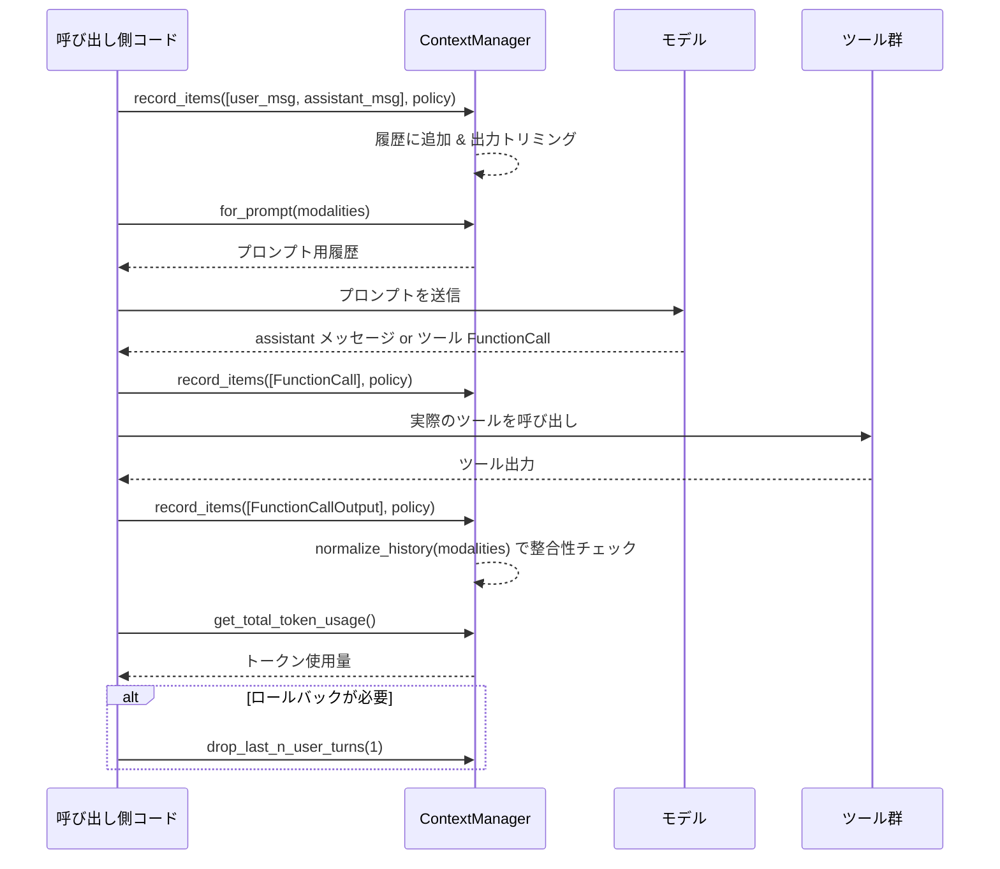

# core/src/context_manager/history_tests.rs コード解説

## 0. ざっくり一言

`ContextManager` と関連ユーティリティ（トークン見積もり・出力のトリミング・履歴正規化・画像データ扱いなど）の **期待される振る舞いをテストで規定しているモジュール**です。  
ユーザー／アシスタントのターン境界、ツール呼び出しペア、画像・exec 出力の扱いなど、「会話履歴管理の仕様書に近いテスト群」になっています。

※ このファイルには行番号情報が含まれていないため、要求されている `L開始-終了` 形式の正確な行番号は付与できません。以降の根拠は「関数名・テスト名・コード断片」で示します。

---

## 1. このモジュールの役割

### 1.1 概要

このテストモジュールは、親モジュール `ContextManager` および関連関数が次のような問題を正しく扱うことを検証します。

- **どの履歴項目を保持／破棄するか**（API に見えるメッセージだけ残す、ゴーストコミットを除外するなど）
- **トークン／バイト数の見積もりとトリミング**（exec 出力・ツール出力・画像の base64 ペイロード）
- **ターン単位での履歴操作**（最後のユーザーターンの巻き戻し、インターエージェントメッセージの扱い）
- **ツール呼び出しと出力の整合性**（孤立した output の削除、欠損 output の補完）
- **画像サポート有無に応じたプロンプト変換**

### 1.2 アーキテクチャ内での位置づけ

このファイル自体はテスト専用ですが、テストを通じて次のコンポーネントの関係が見えます。

```mermaid
flowchart LR
  subgraph CM["context_manager モジュール"]
    C["ContextManager\n(履歴管理本体)"]
    E["estimate_response_item_model_visible_bytes\n(モデル向けバイト数見積もり)"]
  end

  T["このテストモジュール\nhistory_tests.rs"] --> C
  T --> E
  T --> R["ResponseItem / ContentItem\n(プロトコルモデル)"]
  T --> TP["TruncationPolicy / truncate_text\n(出力トリミング)"]
  T --> IMG["image crate\n(PNG/WebP エンコード)"]

  C -->|for_prompt 等| "モデル API"
  C -->|record_items / normalize_history| "ツール呼び出し履歴"
```

- `super::*` から `ContextManager`, `ResponseItem`, `estimate_response_item_model_visible_bytes` などをインポートして使用しています。
- `codex_protocol` のモデル型（`ContentItem`, `FunctionCallOutputPayload`, `TurnContextItem` 等）で会話内容・ツール I/O を表現します。
- `codex_utils_output_truncation::truncate_text` と `TruncationPolicy` により、トークンベースの出力トリミングを行う仕様をテストから規定しています。
- `image` crate と `base64` を使い、本物の PNG/WebP data URL を生成して、画像のサイズに応じたバイト見積もりの挙動を検証しています。

### 1.3 設計上のポイント（テストから読み取れる仕様）

- **責務の分割**
  - `ContextManager`:
    - 履歴追加 (`record_items`)
    - プロンプト用履歴抽出 (`for_prompt`)
    - ターン単位の巻き戻し (`drop_last_n_user_turns`)
    - 履歴の整合性チェックと修正 (`normalize_history`)
    - トークン使用量の計算 (`get_total_token_usage` など)
  - 別関数:
    - exec 出力用トリミング（`truncate_exec_output` はテスト側の小さなラッパー）
    - モデル向け見えるバイト数の見積もり（`estimate_response_item_model_visible_bytes`）
- **状態**
  - `ContextManager` は内部に `items: Vec<ResponseItem>` とトークン使用情報・参照コンテキストなどを保持していることがテストから分かります（`history.items.len()` の参照など）。
- **エラーハンドリング方針**
  - 多くは **panic ではなく静かに正規化** する（リリースビルド）:
    - 孤立したツール output を削除
    - 欠けているツール output を `"aborted"` で補完
  - ただし **debug ビルドでは panic させてバグを検出** する（`#[cfg(debug_assertions)] #[should_panic]` テスト）。
- **安全性・セキュリティ指向**
  - 実行結果やツール出力がモデルコンテキストを圧迫しないように、トークン／バイト数に基づくトリミングを徹底しています。
  - data URL 画像の base64 部分をそのままトークン見積もりに使わず、固定コスト／サイズ依存のヒューリスティックで代替しています。

---

## 2. 主要な機能一覧（コンポーネントインベントリー）

このファイルで **テスト対象になっている主なコンポーネント** を、役割とともに列挙します。

### 2.1 このテストモジュール内のヘルパー関数

| 関数名 | 役割 / 用途 |
|--------|-------------|
| `assistant_msg` | `ResponseItem::Message` を assistant ロールで構築します。単一の `OutputText` コンテンツを持つ簡易ヘルパー。 |
| `inter_agent_assistant_msg` | `InterAgentCommunication` を JSON 化して埋め込んだ assistant メッセージを作成します。インターエージェントメッセージの境界判定用。 |
| `create_history_with_items` | 新しい `ContextManager` を作成し、与えた `ResponseItem` 群を大きなトークン上限で `record_items` します。ほとんどのテストがこのヘルパー経由で履歴を準備します。 |
| `user_msg` | user ロールの `OutputText` メッセージを構築します。 |
| `user_input_text_msg` | user ロールの `InputText` メッセージ（入力扱い）を構築します。セッション prefix や環境コンテキストなどに使われます。 |
| `developer_msg` | developer ロールでの `InputText` メッセージを構築します。 |
| `developer_msg_with_fragments` | developer メッセージに複数の `InputText` フラグメントを含めるためのヘルパー。 |
| `reference_context_item` | `TurnContextItem` のサンプル（cwd, current_date, timezone などを持つ）を生成します。参照コンテキストの roll-back 挙動のテストに使用。 |
| `custom_tool_call_output` | `ResponseItem::CustomToolCallOutput` を簡単に作るヘルパー。 |
| `reasoning_msg` | 平文の reasoning コンテンツを持つ `ResponseItem::Reasoning` を構築します。 |
| `reasoning_with_encrypted_content` | `encrypted_content` のみを持つ `ResponseItem::Reasoning` を構築し、トークン見積もりロジックをテストします。 |
| `truncate_exec_output` | `truncate_text` を `TruncationPolicy::Tokens(EXEC_FORMAT_MAX_TOKENS)` で呼ぶ薄いラッパー。exec 出力のフォーマット仕様テストで使用。 |
| `approx_token_count_for_text` | 文字列長からざっくりトークン数を近似するユーティリティ（テスト専用）。 |
| `assert_truncated_message_matches` | トリミングされた exec 出力が正しいフォーマットかどうかを正規表現で検証します。 |
| `truncated_message_pattern` | トリミングメッセージ検証用の正規表現パターンを生成します。 |

### 2.2 親モジュールの公開 API（テストから見えるもの）

実装はこのファイルにはありませんが、テストから見える **`ContextManager` と関連 API のインベントリー**です。

| API | 種別 | 役割 / 振る舞い（テストから分かる範囲） |
|-----|------|-------------------------------------------|
| `ContextManager::new` / `::default` | 関数/associated fn | 空の履歴とトークン情報を持つ `ContextManager` を作成。 |
| `ContextManager::record_items` | メソッド | 与えられた `&ResponseItem` 群を内部履歴に追加しつつ、トークン上限に応じて FunctionCallOutput / CustomToolCallOutput のテキストをトリミングします。 system メッセージや `ResponseItem::Other` は無視。 |
| `ContextManager::raw_items` | メソッド | 内部の `Vec<ResponseItem>` を借用または所有で返却。テストでは `assert_eq!(history.raw_items(), expected_vec)` で内容検証に使用。 |
| `ContextManager::get_non_last_reasoning_items_tokens` | メソッド | 最後の user メッセージより前にある reasoning 項目のうち、「最後の user 以降の reasoning を除いた」トークン数を返します。 |
| `ContextManager::items_after_last_model_generated_item` | メソッド | 最後のモデル生成項目（assistant メッセージなど）より後の履歴項目を返します。トークン使用量補正に使用。 |
| `ContextManager::update_token_info` | メソッド | 既知の `TokenUsage` とモデルの context window を登録し、以後のトークン計算に使えるようにします。 |
| `ContextManager::get_total_token_usage` | メソッド | サーバー側 reasoning を含む／含まないなどの指定を受け、累積トークン数を返します。最後のモデル出力後に追加された user/tool のトークンを加算。 |
| `ContextManager::for_prompt` | メソッド | モデルの `InputModality`（Text / Vision など）に応じて、履歴をプロンプト用にフィルタ・変換した `Vec<ResponseItem>` を返します。画像の除去・代替テキスト挿入、GhostSnapshot の除外、ImageGenerationCall の扱いなどを担当。 |
| `ContextManager::drop_last_n_user_turns` | メソッド | セッション prefix を保持しつつ最後の N ユーザーターンを roll-back します。環境コンテキストや developer instructions の整合性も調整。 |
| `ContextManager::remove_first_item` / `remove_last_item` | メソッド | 先頭／末尾の項目を削除し、必要に応じて対応するツール呼び出し／出力ペアも合わせて削除します。 |
| `ContextManager::normalize_history` | メソッド | ツール call/output の不整合を検出し、リリースビルドでは `"aborted"` output の挿入や孤立 output の削除を行います。デバッグビルドでは不整合で panic。 |
| `ContextManager::replace_last_turn_images` | メソッド | 最後のターンがツール output の画像のみを含む場合、その画像をテキストメッセージに差し替えます（user 画像は対象外）。 |
| `ContextManager::set_reference_context_item` / `reference_context_item` | メソッド | `TurnContextItem` を「参照コンテキスト」として保存／取得します。ターンの roll-back に伴い、参照コンテキストを維持 or クリアするかを制御。 |
| `estimate_response_item_model_visible_bytes` | 関数 | 1 つの `ResponseItem` がモデルにとってどれだけのバイトコストになるかを見積もります。data URL 画像の base64 は固定コスト化し、detail=Original の場合は画像サイズに応じてコストを計算。 |

---

## 3. 公開 API と詳細解説（主要 7 件）

以下は、テストから見て特に重要な 7 つの API について、仕様を整理したものです。  
実装は `history_tests.rs` には存在せず、ここでの説明は **テストの振る舞いから読み取れる契約** に限定しています。

### 3.1 `truncate_exec_output(content: &str) -> String`

**概要**

- 実行結果（たとえばローカルシェルの stderr/stdout）を、トークン数に基づいてトリミングするラッパーです。
- 実体は `truncate_text(content, TruncationPolicy::Tokens(EXEC_FORMAT_MAX_TOKENS))` の呼び出しです。
- `EXEC_FORMAT_MAX_TOKENS` は 2,500 トークンに設定されています。

**引数**

| 引数名 | 型 | 説明 |
|--------|----|------|
| `content` | `&str` | フォーマット対象となる exec 出力の全文。 |

**戻り値**

- `String`: トリミング済みまたはそのままの exec 出力。トリミングが発生した場合、末尾に「`…<N> tokens truncated…`」のようなマーカーが付きます。

**内部処理の流れ（テストから分かる仕様）**

1. `truncate_text` に `TruncationPolicy::Tokens(EXEC_FORMAT_MAX_TOKENS)` を渡して実行します。
2. 内容が小さく、トークン数・バイト数・行数の制限内であれば、元の文字列をそのまま返します（`format_exec_output_returns_original_when_within_limits`）。
3. 制限を超える場合は、次のような挙動をします（正確なアルゴリズムは `truncate_text` 側ですが、テストが期待する仕様）:
   - トークン数が多い場合: 出力の一部を残しつつ、末尾に `…<removed> tokens truncated…` という形で削除トークン数を明示する。
   - 行数が多い場合: 先頭数行と末尾数行を残し、途中は省略される。メッセージ中に「omitted」などの行省略マーカーが含まれる（`format_exec_output_reports_omitted_lines_and_keeps_head_and_tail`）。
   - バイト上限のみ超過し、行数制限は超えない場合: 行省略マーカーは含めず、トークン削除マーカーのみ含める（`format_exec_output_marks_byte_truncation_without_omitted_lines`）。

**Examples（使用例）**

```rust
// 長いエラーメッセージをトリミングする
let large_error = "very long execution error line...\n".repeat(2_500);
let truncated = truncate_exec_output(&large_error);

// 末尾に "…<removed> tokens truncated…" を含み、元の文字列とは異なる
assert_ne!(truncated, large_error);
assert!(truncated.contains("tokens truncated"));
```

**Errors / Panics**

- この関数自体は `truncate_text` を呼ぶだけで、テストからは panic 条件は確認できません。
- 内部で使用している `truncate_text` が panic するかどうかは、このチャンクからは分かりません。

**Edge cases**

- コンテンツが十分小さい場合は、**完全に同一の文字列**を返します。
- 行数とバイト数が両方制限を超える場合でも、「行数制限を優先して」省略マーカーを付ける仕様がテストから読み取れます（`format_exec_output_prefers_line_marker_when_both_limits_exceeded`）。

**使用上の注意点**

- 出力末尾に `tokens truncated` という文言があることを前提に後段の処理を書く場合は、この仕様に依存することになります。`truncate_text` 側の実装変更に注意が必要です。
- 長大な exec 出力をそのままモデルのコンテキストに渡さないためのガードとして利用する設計になっています。

---

### 3.2 `ContextManager::record_items<I>(&mut self, items: I, policy: TruncationPolicy)`

※ シグネチャは呼び出しからの推測です。正確なジェネリクスは実装側参照。

**概要**

- 履歴に新しい `ResponseItem` 群を追加します。
- 追加時に:
  - API から見える種類のメッセージだけを保持し、
  - ツール出力などに対してトークン／バイト上限に基づくトリミングを行う、
  という役割を持ちます。

**引数**

| 引数名 | 型（推測） | 説明 |
|--------|------------|------|
| `items` | `I: IntoIterator<Item = &'a ResponseItem>` | 追加する履歴項目の反復子。 |
| `policy` | `TruncationPolicy` | トークン数上限などを表すポリシー。 |

**戻り値**

- 戻り値はテストからは観測されず、おそらく `()` です。

**内部処理の流れ（テストから分かる仕様）**

1. **非 API メッセージのフィルタ**
   - `ResponseItem::Message` でも `role == "system"` は履歴に残さない。
   - `ResponseItem::Other` は完全に無視する（`filters_non_api_messages`）。
2. **トークン／バイト上限に基づくツール出力のトリミング**
   - `FunctionCallOutput` の `Text` ボディや `CustomToolCallOutput` のテキストは、`policy` に基づきトリミングされる（`record_items_truncates_function_call_output_content`, `record_items_truncates_custom_tool_call_output_content`）。
   - トリミング結果には必ず `"tokens truncated"` あるいは `"bytes truncated"` といったマーカー文字列が含まれることが期待されています。
3. **カスタムトークン上限の尊重**
   - 小さな `TruncationPolicy::Tokens(10)` を指定すると、それに従って強くトリミングされる（`record_items_respects_custom_token_limit`）。

**Examples（使用例）**

```rust
let mut history = ContextManager::new();
let policy = TruncationPolicy::Tokens(1_000);

let item = ResponseItem::FunctionCallOutput {
    call_id: "call-100".to_string(),
    output: FunctionCallOutputPayload::from_text("very long output ...".to_string()),
};

history.record_items([&item], policy);

// history.items[0] のテキストは "tokens truncated" を含む短いものになっている
```

**Errors / Panics**

- テストからは panic 条件は観測されません。
- トークン計算やトリミング中に内部エラーが起きた場合の挙動は、このチャンクからは不明です。

**Edge cases**

- `policy` に十分大きなトークン上限（例: 10,000）を渡した場合、トリミングは起きず、元のテキストが完全に保持されることがテストから暗に示唆されています（多くのテストが大きな上限を使い、内容が変化していません）。

**使用上の注意点**

- `record_items` を通さずに `history.items` を直接操作すると、トークン使用情報や truncation ポリシーが反映されない可能性が高いです。
- `TruncationPolicy` を小さくしすぎると、ツール出力の内容がほぼマーカーだけになりうるため、デバッグ困難になる可能性があります。

---

### 3.3 `ContextManager::for_prompt(&self, modalities: &[InputModality]) -> Vec<ResponseItem>`

**概要**

- モデルに渡す「プロンプト用履歴」を生成します。
- モデルがサポートする入力モダリティ（テキストのみ／テキスト＋画像など）に応じて、履歴のフィルタリング・変形を行います。

**引数**

| 引数名 | 型 | 説明 |
|--------|----|------|
| `modalities` | `&[InputModality]` | モデルがサポートする入力モーダル（Text, Vision など）の一覧。 |

**戻り値**

- `Vec<ResponseItem>`: モデルにそのまま渡せる形に整形された履歴。

**内部処理の流れ（テストから分かる仕様）**

1. **インターエージェントメッセージの扱い**
   - `InterAgentCommunication` を含む assistant メッセージは:
     - ターン境界として扱われる（`inter_agent_assistant_messages_are_turn_boundaries`）。
     - `for_prompt` でそのまま preserved される（`for_prompt_preserves_inter_agent_assistant_messages`）。
   - 一方、過去の互換形式（`author: /root` などのテキスト）だけのメッセージはターン境界とはみなさない（`legacy_inter_agent_assistant_messages_are_not_turn_boundaries`）。
2. **画像コンテンツの扱い**
   - モデルが画像に対応していない場合（`modalities == [InputModality::Text]`）:
     - `ContentItem::InputImage` は削除され、その位置に `"image content omitted because you do not support image input"` というテキストが挿入される（user メッセージ・FunctionCallOutput・CustomToolCallOutput すべてに対して）。
   - モデルが画像に対応している場合（`default_input_modalities()`）:
     - 画像コンテンツはそのまま保持される（`for_prompt_strips_images_when_model_does_not_support_images` の後段）。
3. **ImageGenerationCall の扱い**
   - 画像サポート有り:
     - `ImageGenerationCall` は status, revised_prompt, result を含めてそのまま保持（`for_prompt_preserves_image_generation_calls_when_images_are_supported`）。
   - 画像サポート無し:
     - `ImageGenerationCall` 自体は残すが、`result` フィールドの画像データは空文字列にクリアされる（`for_prompt_clears_image_generation_result_when_images_are_unsupported`）。
4. **GhostSnapshot の扱い**
   - `ResponseItem::GhostSnapshot` はプロンプトには一切含めない（`get_history_for_prompt_drops_ghost_commits`）。

**Examples（使用例）**

```rust
let history = create_history_with_items(vec![
    ResponseItem::Message { /* user + image */ },
    ResponseItem::FunctionCall { /* ... */ },
    ResponseItem::FunctionCallOutput { /* text + image */ },
]);

// テキストのみのモデル
let text_only = history.for_prompt(&[InputModality::Text]);
// image はすべて "image content omitted ..." テキストに置き換わっている

// 画像対応モデル
let full = history.for_prompt(&default_input_modalities());
// image コンテンツがそのまま残る
```

**Errors / Panics**

- テストでは panic は想定されていません。
- モダリティ配列が空の場合などの挙動は、このチャンクには現れません。

**Edge cases**

- モデルが画像非対応でも、画像関連のツール呼び出し (`FunctionCall`, `CustomToolCall` 自体) は保持され、**中の画像のみテキストに置き換え**られます。
- ImageGenerationCall の `result` 削除は、画像非対応時にのみ発生し、status や revised_prompt は残ります。

**使用上の注意点**

- `for_prompt` の出力をそのままモデルに送る前提の設計になっているため、呼び出し側でさらにフィルタリングを行う場合は、この変換仕様を考慮する必要があります（特に画像の省略テキストや GhostSnapshot の除外）。

---

### 3.4 `ContextManager::drop_last_n_user_turns(&mut self, num_turns: usize)`

**概要**

- 「ユーザーターン」を単位として最後から `num_turns` 個のターンを巻き戻します。
- 巻き戻しには、ユーザーとアシスタントのペアだけでなく、関連する developer instructions や環境コンテキストの調整も含まれます。

**引数**

| 引数名 | 型 | 説明 |
|--------|----|------|
| `num_turns` | `usize` | 巻き戻したいユーザーターン数。 |

**戻り値**

- 戻り値はテストからは観測されず、おそらく `()` です。

**内部処理の流れ（テストから分かる仕様）**

1. **セッション prefix の保持**
   - 会話の先頭にある「セッション prefix」(`assistant_msg("session prefix item")` 等) は、`num_turns` にかかわらず維持される（`drop_last_n_user_turns_preserves_prefix`）。
2. **通常のユーザーターンの巻き戻し**
   - `user -> assistant` の対となるターンが後ろから削除される。
   - `num_turns` が現在の実ターン数より大きくても、セッション prefix 以外をすべて削除したところで止まる。
3. **セッション prefix の user メッセージの特別扱い**
   - `<environment_context>`, `# AGENTS.md instructions`, `<skill>`, `<user_shell_command>`, `<subagent_notification>` など特定タグを含む `user_input_text_msg` は、**セッション prefix として扱われ、巻き戻し対象から除外**されます（`drop_last_n_user_turns_ignores_session_prefix_user_messages`）。
4. **コンテキスト更新の巻き戻し**
   - 巻き戻そうとしているターンの上にある developer メッセージ（特に `"ROLLED_BACK_DEV_INSTRUCTIONS"` などのマーカーを含むもの）や `<environment_context>` の更新は、必要に応じて履歴から取り除かれます（`drop_last_n_user_turns_trims_context_updates_above_rolled_back_turn`）。
   - この場合でも、事前にセットされた `reference_context_item` は維持されることが確認されています。

5. **混在した developer コンテキスト bundle の扱い**
   - 1 つの developer メッセージに、セッション固有の権限指示と persistent な plugin instructions が混在している場合、ロールバックを行うと **参照コンテキスト自体をクリア** する仕様になっています（`drop_last_n_user_turns_clears_reference_context_for_mixed_developer_context_bundles`）。

**Examples（使用例）**

```rust
let mut history = create_history_with_items(vec![
    assistant_msg("session prefix"),
    user_input_text_msg("turn 1 user"),
    assistant_msg("turn 1 assistant"),
    user_input_text_msg("turn 2 user"),
    assistant_msg("turn 2 assistant"),
]);

history.drop_last_n_user_turns(1);

let prompt_items = history.for_prompt(&default_input_modalities());
// => session prefix + 1ターン目だけが残る
```

**Errors / Panics**

- テストでは panic 条件はありません。
- `num_turns == 0` のときの挙動はテストされていません（そのまま何もしないと推測されますが、コードからは断定できません）。

**Edge cases**

- `num_turns` が実際のユーザーターン数を超えても安全に動作し、セッション prefix のみ残す仕様です。
- prefix と判定される user メッセージ群は、数に含まれず、いくらロールバックしても保持されます。

**使用上の注意点**

- 「どこまでが prefix でどこからが通常のユーザーターンか」は、**特定のタグを含むテキストに依存する**実装になっています。新しい種類の prefix メッセージを導入する場合は、この判定ロジックも更新する必要があります。
- 参照コンテキストの維持／クリアの条件は、developer メッセージの内容に依存しているため、仕様の変更には慎重さが必要です。

---

### 3.5 `ContextManager::normalize_history(&mut self, modalities: &[InputModality])`

**概要**

- ツール呼び出しとその出力、ローカルシェル呼び出し、ツール検索呼び出しなどの履歴の整合性を取るための処理です。
- **リリースビルドとデバッグビルドで挙動が異なる**のが特徴です。

**引数**

| 引数名 | 型 | 説明 |
|--------|----|------|
| `modalities` | `&[InputModality]` | モデルの入力モダリティ。テストでは `default_input_modalities()` を渡しています。 |

**戻り値**

- 戻り値はテストからは観測されず、おそらく `()` です。

**内部処理の流れ（テストから分かる仕様）**

1. **ツール呼び出しに対応する output の補完**
   - FunctionCall:
     - 呼び出しのみで output が無い場合、`FunctionCallOutput` を `"aborted"` メッセージ付きで挿入（`normalize_adds_missing_output_for_function_call`, `normalize_mixed_inserts_and_removals`）。
   - CustomToolCall:
     - リリースビルド (`not(debug_assertions)`) では `"aborted"` output を挿入。
     - デバッグビルドでは missing output があると panic（`normalize_adds_missing_output_for_custom_tool_call_panics_in_debug`）。
   - LocalShellCall（`call_id` を持つ）:
     - リリースビルドでは `FunctionCallOutput` を `"aborted"` で挿入。
     - デバッグビルドでは missing output で panic。
   - ToolSearchCall（client 実行）:
     - `ToolSearchOutput` を status=`"completed"`, tools=空配列で挿入（`normalize_adds_missing_output_for_tool_search_call`）。

2. **孤立した output の削除 / その扱い**
   - FunctionCallOutput:
     - 対応する FunctionCall がない場合、リリースビルドでは削除、デバッグビルドでは panic（`normalize_removes_orphan_function_call_output`, `normalize_removes_orphan_function_call_output_panics_in_debug`）。
   - CustomToolCallOutput:
     - 同様に孤立している場合、リリースビルドで削除、デバッグビルドで panic。
   - ToolSearchOutput（client 実行）:
     - リリースビルドで削除、デバッグビルドで panic（`normalize_removes_orphan_client_tool_search_output`）。

3. **特例: server 実行の ToolSearchOutput**
   - `execution == "server"` の `ToolSearchOutput` は、対応する `ToolSearchCall` が無くても保持されます（`normalize_keeps_server_tool_search_output_without_matching_call`）。

4. **複合ケース**
   - 複数の call/output が混在するケースで:
     - 足りない output の挿入と孤立 output の削除が同時に行われる（`normalize_mixed_inserts_and_removals`）。
   - デバッグビルドでは、このような不整合状態自体を許容せず panic するテストも用意されています。

**Examples（使用例）**

```rust
let items = vec![
    ResponseItem::FunctionCall { call_id: "c1".into(), /* ... */ },
    // "c2" の output は孤立
    ResponseItem::FunctionCallOutput { call_id: "c2".into(), output: FunctionCallOutputPayload::from_text("ok".into()) },
];

let mut history = create_history_with_items(items);
history.normalize_history(&default_input_modalities());

// リリースビルド想定:
// - c1 に対して "aborted" output 挿入
// - c2 の output は削除
```

**Errors / Panics**

- **debug ビルドのみ**:
  - missing output や孤立 output がある場合に panic (`#[should_panic]` テスト多数)。
- リリースビルドでは panic は行わず、挿入／削除で整合性を取る設計です。

**Edge cases**

- `LocalShellCall` + `FunctionCallOutput` のペアも FunctionCall と同様に扱われる（挿入／削除）。
- ToolSearch の server 実行だけは特別扱いされ、call がなくても output を残す仕様です。

**使用上の注意点**

- `normalize_history` を **いつ・どのタイミングで呼ぶか** が重要です。  
  呼び出し前に履歴を外部に保存していると、不整合状態が残る可能性があります。
- デバッグビルドでは開発中に不整合をすぐに検知できる一方で、ランタイムで panic するため、テストコード／開発環境でのみ使用することが前提です。

---

### 3.6 `ContextManager::replace_last_turn_images(&mut self, error_message: &str) -> bool`

**概要**

- 最後のターンがツール output の画像のみから構成されている場合に、その画像をテキストメッセージ（多くはエラーメッセージ）に置き換えます。
- user からの画像メッセージは変更しません。

**引数**

| 引数名 | 型 | 説明 |
|--------|----|------|
| `error_message` | `&str` | 画像の代わりに表示するテキスト。例: `"Invalid image"`。 |

**戻り値**

- `bool`: 置換を行った場合は `true`、何も変更しなかった場合は `false`。

**内部処理の流れ（テストから分かる仕様）**

1. 履歴の最後のターンを調べます。
2. そのターンが `FunctionCallOutput`（または CustomToolCallOutput）であり、コンテンツが `InputImage` のみで構成されている場合:
   - コンテンツを `InputText { text: error_message.to_string() }` の単一要素に置き換えます（`replace_last_turn_images_replaces_tool_output_images`）。
3. 最後のターンが user メッセージで、その中に画像が含まれている場合は **一切変更せず `false` を返す**（`replace_last_turn_images_does_not_touch_user_images`）。

**Examples（使用例）**

```rust
let mut history = create_history_with_items(vec![
    user_input_text_msg("hi"),
    ResponseItem::FunctionCallOutput {
        call_id: "call-1".into(),
        output: FunctionCallOutputPayload::from_content_items(vec![
            FunctionCallOutputContentItem::InputImage {
                image_url: "data:image/png;base64,...".into(),
                detail: None,
            },
        ]),
    },
]);

let changed = history.replace_last_turn_images("Invalid image");
assert!(changed);
// 最後の FunctionCallOutput の中身は InputText("Invalid image") に置き換わる
```

**Errors / Panics**

- テストからは panic 条件はありません。

**Edge cases**

- 最後のターンがツール output だが、画像とテキストが混在しているケースの挙動はテストされていません（実装側参照が必要です）。
- ツール output ではなく、ImageGenerationCall が最後の場合の挙動もこのチャンクからは不明です。

**使用上の注意点**

- ツール側で画像生成に失敗した場合などに、**ユーザーにエラーメッセージだけを見せたい**ケースを想定した API です。
- user メッセージの画像を変換しない点に注意が必要です（ユーザー入力の意図を勝手に変更しないため）。

---

### 3.7 `ContextManager::estimate_token_count_with_base_instructions(&self, base: &BaseInstructions) -> Result<i64, _>`

**概要**

- 現在の履歴に指定された「ベース instructions」を加えたときのトークン数を見積もります。
- ここでの `BaseInstructions` は `text: String` を持つ構造体です。

**引数**

| 引数名 | 型 | 説明 |
|--------|----|------|
| `base` | `&BaseInstructions` | システム／開発者向けの instructions テキスト。 |

**戻り値**

- `Result<i64, E>`（エラー型はテストからは不明）:
  - `Ok(estimate)`: 見積もりトークン数。
  - `Err(e)`: 見積もりに失敗した場合のエラー。

**内部処理の流れ（テストから分かる仕様）**

1. 現在の履歴と `base.text` を組み合わせたコンテキストのトークン数を見積もる。
2. `base.text` の長さが変わった場合、トークン数の差分は `approx_token_count_for_text(long.text) - approx_token_count_for_text(short.text)` と一致することがテストで期待されている（`estimate_token_count_with_base_instructions_uses_provided_text`）。

**Examples（使用例）**

```rust
let history = create_history_with_items(vec![assistant_msg("hello from history")]);

let short_base = BaseInstructions { text: "short".into() };
let long_base = BaseInstructions { text: "x".repeat(1_000) };

let short_est = history.estimate_token_count_with_base_instructions(&short_base)?;
let long_est  = history.estimate_token_count_with_base_instructions(&long_base)?;

// base テキストの増加分がトークン見積もり差分として反映される
assert_eq!(long_est - short_est,
           approx_token_count_for_text(&long_base.text)
           - approx_token_count_for_text(&short_base.text));
```

**Errors / Panics**

- テストでは `expect("token estimate")` で `Ok` 前提の呼び出しをしているため、通常ケースでの失敗は想定していません。
- エラー条件（例: トークナイザの初期化失敗など）はこのチャンクには現れません。

**Edge cases**

- `BaseInstructions.text` が空文字列の場合の挙動はテストされていませんが、おそらく履歴のみのトークン数見積もりに近い値になると推測されます（コードからは断定できません）。

**使用上の注意点**

- `BaseInstructions` の内容はそのままトークナイザに渡される前提の見積もりになっているため、`text` に極端に大きい文字列を渡せばその分トークン数は増大します。
- ここでの見積もりはあくまで「近似」であり、実際のモデルのトークン数とは多少の誤差がある可能性があります。

---

### 3.8 `estimate_response_item_model_visible_bytes(item: &ResponseItem) -> i64`

**概要**

- 1 つの `ResponseItem` がモデルにとってどれだけの「見えるバイト数」を持つかを見積もる関数です。
- 特に **data URL 画像の base64 ペイロードをそのまま数えず、固定コストまたは画像サイズに応じたコスト**に置き換えることで、モデルのコンテキスト消費を現実的に見積もります。

**引数**

| 引数名 | 型 | 説明 |
|--------|----|------|
| `item` | `&ResponseItem` | メッセージ／ツール出力などの 1 項目。 |

**戻り値**

- `i64`: モデルにとって可視なバイト数の見積もり。

**内部処理の流れ（テストから分かる仕様）**

1. `item` を `serde_json::to_string` したときの `raw_len`（＝本来のシリアライズサイズ）を基準にする。
2. 画像を含まない場合:
   - `estimated == raw_len` となる（`text_only_items_unchanged`）。
3. data URL 画像を含む場合:
   - URL が `data:image/(png|jpeg|webp);base64,` で始まるときは、base64 payload 部分の長さ `payload.len()` を引き、代わりに固定またはサイズ依存のコストを加算。
   - `RESIZED_IMAGE_BYTES_ESTIMATE` という固定値（テストからは定数値のみ参照）を用いるケースがある。
4. 特殊ケース:
   - data URL でも `;base64,` マーカーが無い（例: SVG の data URL）の場合は **何も調整せず** `raw_len` を返す（`data_url_without_base64_marker_is_unchanged`）。
   - `data:application/octet-stream;base64,...` など、非 image MIME type の場合も調整しない（`non_image_base64_data_url_is_unchanged`）。
   - `DATA:image/png;BASE64,...` のような大小混在のマーカーも正しく認識して調整する（`mixed_case_data_url_markers_are_adjusted`）。
5. 複数の inline 画像がある場合:
   - 各画像ごとに base64 payload を差し引き、それぞれに `RESIZED_IMAGE_BYTES_ESTIMATE` を加算する（`multiple_inline_images_apply_multiple_fixed_costs`）。
6. `detail == Some(ImageDetail::Original)` の場合:
   - 画像をデコードして幅・高さを求め、32px パッチ単位のヒューリスティックでバイトコストを計算する（`original_detail_images_scale_with_dimensions`, `original_detail_webp_images_scale_with_dimensions` の期待値からそのように解釈できます）。

**Examples（使用例）**

```rust
// data URL を含むメッセージ
let payload = "A".repeat(100_000);
let image_url = format!("data:image/png;base64,{payload}");

let image_item = ResponseItem::Message {
    id: None,
    role: "user".into(),
    content: vec![
        ContentItem::InputText { text: "Here is the screenshot".into() },
        ContentItem::InputImage { image_url },
    ],
    end_turn: None,
    phase: None,
};

let raw_len = serde_json::to_string(&image_item).unwrap().len() as i64;
let estimated = estimate_response_item_model_visible_bytes(&image_item);

// base64 payload 分を引いたうえで固定コストを足した値になっている
assert!(estimated < raw_len);
```

**Errors / Panics**

- 画像デコードに失敗した場合の処理（例: base64 デコードエラー、不正な PNG/WebP データ）はこのチャンクではテストされておらず、不明です。
- テストでは正常系のみを扱っています。

**Edge cases**

- 非 image の data URL や、`base64` マーカーの無い data URL は調整されないため、payload がそのままバイト数としてカウントされます。
- 非常に大きい画像 data URL も fixed cost もしくはサイズに応じたコストで扱われるため、**テキストだけのメッセージよりは重いが、payload の実サイズよりはかなり小さい**見積もりになります。

**使用上の注意点**

- この関数の戻り値は **トークン数ではなくバイト数**です（テストでは `i64` として扱われ、トークン=4バイトといったヒューリスティックがあることがコメントから読み取れます）。
- モデルの実際のトークン使用量との対応は近似であり、完璧な一致は保証されません。

---

## 4. データフロー

### 4.1 代表的な処理シナリオ

典型的なフローは次のようになります。

1. 呼び出し側コードが `ContextManager::record_items` で user/assistant/ツールの履歴を追加。
2. 必要に応じて `normalize_history` を呼び、ツール call/output の整合性を取る。
3. `for_prompt` でモデルのモダリティに合わせた履歴を生成し、モデルに渡す。
4. モデルのレスポンス（メッセージや FunctionCall）を再び `record_items` で履歴に追加。
5. ロールバックが必要な場合は `drop_last_n_user_turns` や `remove_first_item`/`remove_last_item` を使って履歴を調整する。
6. トークンやバイトの見積もりには `get_total_token_usage` や `estimate_response_item_model_visible_bytes` を利用する。



---

## 5. 使い方（How to Use）

### 5.1 基本的な使用方法（テストから再構成）

テストコードに基づく、`ContextManager` の典型的な利用フローです。

```rust
use codex_utils_output_truncation::TruncationPolicy;
use codex_protocol::openai_models::default_input_modalities;

// 1. 新しい履歴を作る
let mut history = ContextManager::new();

// 2. 初回の user / assistant メッセージを追加
let user = user_msg("Hello");
let assistant = assistant_msg("Hi, how can I help?");
history.record_items([&user, &assistant], TruncationPolicy::Tokens(10_000));

// 3. モデルに送る履歴を取得（画像対応モデル）
let prompt_items = history.for_prompt(&default_input_modalities());

// 4. ツール呼び出しと output を追加
let call = ResponseItem::FunctionCall {
    id: None,
    name: "do_it".to_string(),
    namespace: None,
    arguments: "{}".to_string(),
    call_id: "call-1".to_string(),
};
let output = ResponseItem::FunctionCallOutput {
    call_id: "call-1".to_string(),
    output: FunctionCallOutputPayload::from_text("ok".to_string()),
};
history.record_items([&call, &output], TruncationPolicy::Tokens(10_000));

// 5. 必要に応じて履歴を正規化
history.normalize_history(&default_input_modalities());

// 6. トークン使用量を取得
let total_tokens = history.get_total_token_usage(/*server_reasoning_included*/ true);
```

### 5.2 よくある使用パターン

- **画像非対応モデルへのプロンプト生成**
  - `for_prompt(&[InputModality::Text])` を使うと、画像入力を自動的にテキストに置き換えます。
- **ターンの巻き戻し**
  - ユーザーが「一つ前の質問に戻りたい」といった操作を行ったときに `drop_last_n_user_turns(1)` を使うと、セッション prefix を保ったまま一つ前のターンまで戻せます。
- **ツール出力のクリーニング**
  - ツール output の画像が壊れている場合に `replace_last_turn_images("Invalid image")` を呼び出すと、ユーザーにはエラーテキストだけが表示されるようになります。

### 5.3 よくある間違い（テストから推測されるもの）

```rust
// 誤り例: ツール呼び出しのみを記録して normalize_history を呼んでいない
let call = ResponseItem::FunctionCall { /* ... */ };
history.record_items([&call], TruncationPolicy::Tokens(10_000));
// => 出力が無いまま履歴に残る可能性がある（normalize_history 前）

// 正しい例: normalize_history を呼んで "aborted" output を挿入する
history.normalize_history(&default_input_modalities());
// => FunctionCallOutput("aborted") が自動的に追加される（リリースビルド）
```

```rust
// 誤り例: セッション prefix を drop_last_n_user_turns で消してしまうと期待する
history.drop_last_n_user_turns(99);
// => prefix は残る仕様なので、完全クリアには向かない

// 正しい例: 履歴を完全にクリアしたいときは新しい ContextManager を作る
let mut history = ContextManager::new();
```

### 5.4 使用上の注意点（まとめ）

- **履歴の整合性**
  - ツール呼び出し／出力ペア、LocalShellCall、ToolSearchCall/Output は `normalize_history` に依存して整合性を取る設計です。  
    不整合状態で外部に保存すると、後から復元したときに期待しない補完が行われる可能性があります。
- **デバッグ vs リリース**
  - debug ビルドでは normalize の不整合で panic するため、テスト環境でのみ使用するのが前提です。  
    リリースビルドでは失敗を `"aborted"` で表現する挙動になるため、クライアント側でこの文字列に依存する処理を書く場合は仕様に合わせてください。
- **画像と data URL の扱い**
  - data URL 画像は見積もりや for_prompt の挙動が特殊です。モデルが画像非対応の場合、画像がテキストに置き換わる点に注意してください。
- **トークン／バイトの見積もり**
  - 実際のモデルが数えるトークン数と少し差が出る可能性があります。  
    この API は **安全側**のヒューリスティック（画像 payload を縮約するなど）を取っていることがテストから分かります。

---

## 6. 変更の仕方（How to Modify）

### 6.1 新しい機能を追加する場合（テスト観点）

1. **どの責務かを決める**
   - 履歴の追加／削除 → `ContextManager` にメソッド追加。
   - トークン見積もり → `estimate_response_item_model_visible_bytes` に近いユーティリティを追加。
   - 出力フォーマット → `truncate_text` のラッパー関数を追加。
2. **対応するテストをこのファイルに追加**
   - 新メソッドが満たすべき契約（入力→出力、境界値、エラー条件など）をテストで規定する。
   - debug / release で挙動が変わりうる場合は、`#[cfg(debug_assertions)]` と `#[cfg(not(debug_assertions))]` を使って別テストを書く。
3. **既存のヘルパーを再利用**
   - メッセージ生成には `assistant_msg`, `user_msg`, `developer_msg` など既存ヘルパーを活用すると、テストが読みやすくなります。

### 6.2 既存の機能を変更する場合（特に normalize / for_prompt）

- **影響範囲の確認**
  - `normalize_history` や `for_prompt` を変更する場合、このファイルの多数のテストが影響を受けます。
  - GhostSnapshot, ImageGenerationCall, ToolSearch, CustomToolCall, LocalShellCall など、すべてのバリアントを一通り見直す必要があります。
- **契約の維持**
  - 「missing output は 'aborted' で補完される」「orphan output はリリースビルドで削除、debug ビルドで panic」などが現在の契約です。  
    仕様変更が必要な場合は、この契約の変更をテストに明示的に反映してください。
- **テスト更新のガイド**
  - 新しい動作を反映するテストを先に書き（または既存テストを更新し）、その後実装を変更することで、契約の破壊を防ぎやすくなります。
- **画像関連の拡張**
  - 新しい `ImageDetail` バリアントを導入する場合は、`estimate_response_item_model_visible_bytes` のテストを追加し、バイト見積もりが期待通りになるよう確認する必要があります。

---

## 7. 関連ファイル

このテストモジュールと強く関連するであろうファイル（パス名は推定を含みます。正確な位置はリポジトリ構成を参照してください）。

| パス（推定） | 役割 / 関係 |
|-------------|------------|
| `core/src/context_manager/mod.rs` または `core/src/context_manager/history.rs` | `ContextManager`, `ResponseItem`, `estimate_response_item_model_visible_bytes` などの実装本体。`super::*` でインポートされています。 |
| `codex_protocol/src/models/*.rs` | `ContentItem`, `FunctionCallOutputPayload`, `ImageDetail`, `LocalShellAction` など、会話とツール I/O のモデル定義。 |
| `codex_protocol/src/openai_models.rs` | `InputModality`, `default_input_modalities` の定義。 |
| `codex_protocol/src/protocol.rs` | `TurnContextItem`, `AskForApproval`, `SandboxPolicy`, `TruncationPolicy` などプロトコルレベルの設定。 |
| `codex_utils_output_truncation/src/lib.rs` | `truncate_text`, `TruncationPolicy` の実装。exec 出力やツール出力のトリミングロジックを提供します。 |
| `codex_git_utils/src/lib.rs` | `GhostCommit` の定義。`ResponseItem::GhostSnapshot` の payload として使用されます。 |

このファイルのテストは、上記コンポーネントの仕様をかなり詳細にカバーしているため、実装を理解する際は **テストを仕様書として読む**と、挙動を把握しやすくなります。
