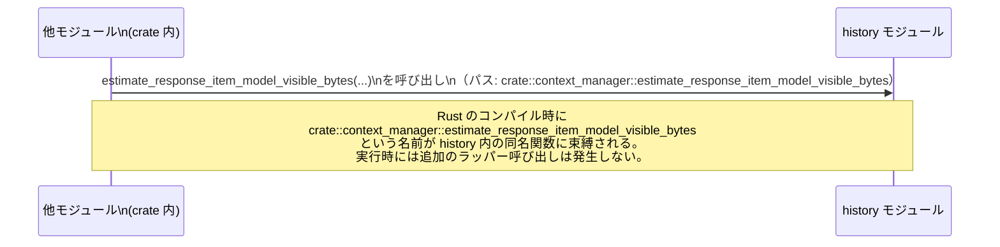

# core/src/context_manager/mod.rs

## 0. ざっくり一言

`core::context_manager` 名前空間の直下で、`history` などのサブモジュールを定義し、そのうち `history` モジュール内の型・関数を `pub(crate)` で再エクスポートする「集約用モジュール」です（`core/src/context_manager/mod.rs:L1-8`）。

---

## 1. このモジュールの役割

### 1.1 概要

- このモジュールは、`context_manager` 配下のサブモジュール（`history`, `normalize`, `updates`）を定義します（`mod history;` など, `core/src/context_manager/mod.rs:L1-3`）。
- そのうち `history` モジュールに定義されている複数のシンボルを、`pub(crate) use history::...;` で crate 内に再公開します（`core/src/context_manager/mod.rs:L4-8`）。
- 再公開されるシンボルは以下です（いずれも実装はこのチャンクには現れません）:
  - `ContextManager`
  - `TotalTokenUsageBreakdown`
  - `estimate_response_item_model_visible_bytes`
  - `is_codex_generated_item`
  - `is_user_turn_boundary`

### 1.2 アーキテクチャ内での位置づけ

このファイルから分かる範囲では、`context_manager` モジュールは次のような依存関係になります。

```mermaid
graph TD
    %% context_manager::mod.rs (L1-8)
    A["他モジュール\n（crate 内部の利用側）"]
    B["context_manager モジュール\nmod.rs (L1-8)"]
    C["history モジュール\n(定義: 不明 / 参照: L1, L4-8)"]
    D["normalize モジュール\n(定義: 不明 / 参照: L2)"]
    E["updates モジュール\n(定義: 不明 / 参照: L3)"]

    A -->|use crate::context_manager::...| B
    B -->|mod history; / pub(crate) use ...| C
    B -->|mod normalize;| D
    B -->|pub(crate) mod updates;| E
```

- `history` と `normalize` は `mod` 宣言のみであり、`pub` が付いていないため、このモジュールの外側からは直接参照できません（Rust の可視性ルールによる）。
- `updates` は `pub(crate) mod updates;` と宣言されており、crate 内の他モジュールから `crate::context_manager::updates` として参照可能です（`core/src/context_manager/mod.rs:L3`）。
- `ContextManager` などのシンボルは、`history` の実装を直接参照するのではなく、`crate::context_manager::ContextManager` といったパスで利用される想定です（再エクスポートにより）。

### 1.3 設計上のポイント

このチャンクから読み取れる設計上の特徴は次のとおりです。

- **集約モジュールとしての役割**  
  - 実装はサブモジュール `history`, `normalize`, `updates` 側に分割し、`mod.rs` はモジュール構成と再エクスポートに専念しています（`core/src/context_manager/mod.rs:L1-8`）。
- **可視性の制御**  
  - `ContextManager` などは `pub(crate) use` で再公開されており、**crate 内部のみ** から利用可能です（`core/src/context_manager/mod.rs:L4-8`）。
  - `updates` サブモジュールも `pub(crate) mod` として crate 内に公開されています（`core/src/context_manager/mod.rs:L3`）。
  - 対して `history` / `normalize` は `mod` のみで、親モジュール外からは直接見えない構成です（`core/src/context_manager/mod.rs:L1-2`）。
- **安全性 / エラー / 並行性に関する情報**  
  - 本ファイルには関数本体や `unsafe` ブロック、エラー処理コード、スレッド関連コードは存在しないため、このレベルでのランタイム安全性・エラー条件・並行性の詳細は分かりません。
  - それらは `history` などの実装モジュールに依存しますが、その内容はこのチャンクには現れません。

---

## 2. 主要な機能一覧

このファイルが提供する「機能」は、実装ではなく**再エクスポートとモジュール公開**です。

- `ContextManager` の再エクスポート: `history` モジュールに定義された `ContextManager` を `crate::context_manager::ContextManager` として利用可能にする（`core/src/context_manager/mod.rs:L4`）。
- `TotalTokenUsageBreakdown` の再エクスポート: `history` モジュール内の同名シンボルを crate 内に再公開する（`core/src/context_manager/mod.rs:L5`）。
- `estimate_response_item_model_visible_bytes` の再エクスポート: `history` モジュール内の関数を crate 内の他モジュールから直接呼び出せるようにする（`core/src/context_manager/mod.rs:L6`）。
- `is_codex_generated_item` の再エクスポート: `history` モジュール内の関数を再公開する（`core/src/context_manager/mod.rs:L7`）。
- `is_user_turn_boundary` の再エクスポート: `history` モジュール内の関数を再公開する（`core/src/context_manager/mod.rs:L8`）。
- `updates` サブモジュールの公開: `pub(crate) mod updates;` により、`crate::context_manager::updates` 以下の API を crate 内に公開する（`core/src/context_manager/mod.rs:L3`）。

実際の「コンテキスト管理」ロジックは `history` / `updates` / `normalize` にあると考えられますが、その内容はこのチャンクには含まれていません。

---

## 3. 公開 API と詳細解説

### 3.1 型一覧（構造体・列挙体など）

このファイルで **再エクスポートされている型** の一覧です。種別（構造体・列挙体など）は、このチャンクからは判別できません。

| 名前 | 種別 | 役割 / 用途（このチャンクから分かる範囲） | 定義元モジュール | 本ファイルでの出現位置 |
|------|------|-------------------------------------------|------------------|------------------------|
| `ContextManager` | 不明（構造体/enum/type alias など。定義は不明） | `history` モジュール内で定義された型を、`crate::context_manager::ContextManager` として再エクスポートしている | `crate::context_manager::history`（定義位置はこのチャンクには現れない） | 再エクスポート: `core/src/context_manager/mod.rs:L4` |
| `TotalTokenUsageBreakdown` | 不明 | `history` モジュール内の型を、`crate::context_manager::TotalTokenUsageBreakdown` として再エクスポートしている | `crate::context_manager::history`（定義位置は不明） | 再エクスポート: `core/src/context_manager/mod.rs:L5` |

> 種別やフィールド構成、具体的な用途は `history` モジュールの実装に依存しており、このチャンクからは分かりません。

### 3.2 関数詳細（最大 7 件）

このファイルは実装ではなく **関数の再エクスポート** だけを行っています。  
そのため、引数や戻り値の型、内部処理ロジックは、このチャンクからは取得できません。

以下では、「このモジュールにおける扱われ方（再エクスポートの振る舞い）」に焦点を当てて説明します。

---

#### `estimate_response_item_model_visible_bytes(...)`

**概要**

- `history` モジュールで定義されている `estimate_response_item_model_visible_bytes` 関数を、`crate::context_manager::estimate_response_item_model_visible_bytes` というパスで利用できるように再エクスポートしています（`core/src/context_manager/mod.rs:L6`）。
- 実際の役割（何を推定するのか、戻り値の型など）は、このチャンクには現れません。

**引数**

- このファイルに関数シグネチャは記載されていないため、引数名・型は不明です。

**戻り値**

- 戻り値の型・意味も、このチャンクからは分かりません。

**内部処理の流れ（このモジュールの観点）**

- `pub(crate) use history::estimate_response_item_model_visible_bytes;` によって：
  - コンパイル時に、`crate::context_manager::estimate_response_item_model_visible_bytes` という名前が `history` モジュール内の同名関数への別名として公開されます。
  - ランタイムに余分なラッパー関数が挟まるわけではなく、関数本体は `history` 側にのみ存在します（Rust の `use` は名前の別名付けであり追加の関数呼び出しを生成しません）。

**Examples（使用例）**

> 引数や戻り値の型が不明なため、ここでは「呼び出し位置」の例のみを示します。

```rust
// crate 内の別モジュールからの利用例（擬似コード）
// 実際の引数・戻り値の型は history モジュールの定義に依存します。

use crate::context_manager::estimate_response_item_model_visible_bytes;

fn demo(/* 実際のシグネチャに応じた引数 */) {
    // 実際の呼び出し例（引数はダミー）
    let _ = estimate_response_item_model_visible_bytes(/* ... */);
}
```

**Errors / Panics**

- このモジュール側ではエラー処理や panic は一切行っていません。
- 実際にどのような条件で `Err` を返したり panic したりするかは、`history` 側の実装に依存し、このチャンクには現れません。

**Edge cases（エッジケース）**

- 本ファイルには条件分岐や入力チェックなどがないため、エッジケースに対する挙動は分かりません。

**使用上の注意点**

- この関数の契約（前提条件・戻り値の意味）は `history` モジュールの実装に依存します。
- 利用者は、可能であれば `history` のドキュメントや実装を確認したうえで使用する必要があります。
- `pub(crate)` により、**crate の外** からはこの関数を呼び出せません（ライブラリ外には公開されない API です）。

---

#### `is_codex_generated_item(...)`

**概要**

- `history` モジュール内の `is_codex_generated_item` 関数を、`crate::context_manager::is_codex_generated_item` として再エクスポートします（`core/src/context_manager/mod.rs:L7`）。

**引数 / 戻り値 / 内部処理**

- シグネチャと処理内容はこのチャンクには現れません。
- 本ファイルは単に `use` による名前の再公開を行うだけで、追加のロジックはありません。

**使用上の注意点**

- 利用方法（どの型を受け取り、何を判定するか）は `history` モジュール側を参照する必要があります。
- `pub(crate)` のため crate 内部でのみ使用できます。

---

#### `is_user_turn_boundary(...)`

**概要**

- `history` モジュール内の `is_user_turn_boundary` 関数を、`crate::context_manager::is_user_turn_boundary` として再エクスポートします（`core/src/context_manager/mod.rs:L8`）。

**その他の項目**

- 引数・戻り値・エラー条件・エッジケースなどは、このチャンクからは分かりません。
- 再エクスポートの仕組み自体は上記二つの関数と同様です。

---

### 3.3 その他の関数

- このファイル自身には、上記以外の関数定義・再エクスポートは現れません（`core/src/context_manager/mod.rs:L1-8`）。

---

## 4. データフロー

このファイルには実行時ロジックはありませんが、「**どういう経路で関数が参照されるか（名前解決上の流れ）」** を sequence diagram で示します。



要点としては:

- 呼び出し側は `crate::context_manager::estimate_response_item_model_visible_bytes` というパスを用います。
- コンパイル時に、この名前は `history` モジュール内の関数に直接解決されます（`pub(crate) use` の効果）。
- 実行時のコールスタックには `context_manager::mod.rs` に相当するフレームは追加されません。

---

## 5. 使い方（How to Use）

### 5.1 基本的な使用方法

このファイルから分かる範囲での典型的な利用パターンは、「`context_manager` モジュールをインポートして、再エクスポートされたシンボルを使う」ことです。

```rust
// crate 内の別モジュールからの利用例（擬似コード）
// 実際の型や引数は history モジュールの定義に依存します。

use crate::context_manager::{
    ContextManager,
    TotalTokenUsageBreakdown,
    estimate_response_item_model_visible_bytes,
    is_codex_generated_item,
    is_user_turn_boundary,
};

fn example_usage() {
    // ContextManager の具体的な初期化方法はこのチャンクからは不明です。
    // ここでは型名の利用例のみを示します。
    // let mut manager = ContextManager::new(/* ... */);

    // 再エクスポートされた関数の呼び出しイメージ
    // 引数や戻り値の型は history 側に依存するため、ここではコメントとしています。
    // let visible_bytes = estimate_response_item_model_visible_bytes(/* ... */);
    // let is_codex = is_codex_generated_item(/* ... */);
    // let is_boundary = is_user_turn_boundary(/* ... */);
}
```

> 上記コードは、**実際のシグネチャが不明なためそのままではコンパイルできません**。  
> 型や引数は `history` モジュールの定義に合わせて補う必要があります。

### 5.2 よくある使用パターン

このチャンクには実際の利用コードは含まれていませんが、モジュール構造から想定されるパターンは以下のとおりです（いずれも一般的な Rust の使い方です）。

- `ContextManager` 型を中心にコンテキストを管理し、必要に応じて `estimate_response_item_model_visible_bytes` などの関数を併用する。
- crate 内の別モジュールからは、`history` や `normalize` の内部構造に依存せず、`crate::context_manager` 直下の再エクスポートされた API のみを利用する。

> ただし、これらはモジュール構造からの一般的な推測であり、`ContextManager` 等の実際の用途はこのチャンクだけからは断定できません。

### 5.3 よくある間違い

可視性に関する典型的な誤用例と正しい例を示します。

```rust
// 間違い例: 非公開モジュール history に直接アクセスしようとしている
// このファイルでは `mod history;` としか宣言されておらず（L1）
// `pub` が付いていないため、親モジュール以外からは参照できません。

// use crate::context_manager::history::ContextManager; // コンパイルエラーになる

// 正しい例: mod.rs が再エクスポートしているシンボルを使う
use crate::context_manager::ContextManager; // OK: pub(crate) use により crate 内から利用可能
```

```rust
// 間違い例: 外部クレートから直接利用しようとしている
// use some_crate::context_manager::ContextManager; // コンパイルエラーになる（pub(crate) のため）

// 正しい例: 同一 crate 内のコードから利用する
use crate::context_manager::ContextManager; // crate 内のコードであれば利用可能
```

### 5.4 使用上の注意点（まとめ）

- `pub(crate)` による可視性制御  
  - `ContextManager` や各種関数は **crate 内専用 API** です。ライブラリのパブリック API には含まれません。
- 実装の確認の必要性  
  - エラー挙動・並行性・パフォーマンスなどの詳細は `history` などの実装に依存します。このファイルだけでは判断できないため、利用時には実装モジュールの確認が前提になります。
- 並行性 / スレッド安全性  
  - このファイルには状態や `static` 変数、スレッド関連のコードはありません。そのため、ここで新たなデータ競合や race condition が発生することはありませんが、`ContextManager` 自体がスレッドセーフかどうかは不明です。

---

## 6. 変更の仕方（How to Modify）

### 6.1 新しい機能を追加する場合

このモジュールは「集約・公開ポイント」として機能しているため、新機能を追加する場合の典型的な流れは次のようになります。

1. **実装モジュールに機能を追加**  
   - 新しい型や関数は、まず `history` / `normalize` / `updates` のいずれかに実装することになります。  
   - どのモジュールが適切かは、実際の責務分割に依存し、このチャンクからは判断できません。

2. **crate 内から利用したい場合は再エクスポートを追加**  
   - crate 内の他モジュールから直接使いたい場合は、この `mod.rs` に以下のような行を追加します。

   ```rust
   // 新しい型 MyType を history に追加した場合の例（擬似コード）
   pub(crate) use history::MyType;
   ```

   - これにより、`crate::context_manager::MyType` として利用できるようになります。

3. **外部クレートにも公開したい場合**（設計方針による）  
   - 現状はすべて `pub(crate)` であり、外部公開はしていません。
   - 外部公開が必要な場合は `pub use history::MyType;` のように `pub` に変更しますが、これはライブラリの公開 API を変えるため慎重な検討が必要です。

### 6.2 既存の機能を変更する場合

既存の再エクスポートやモジュール構成を変更する際の注意点です。

- **影響範囲の確認**  
  - `pub(crate)` で再エクスポートされているシンボルの名前を変更・削除すると、crate 内でそれを利用しているすべての場所に影響します。
  - `rg` や IDE のリファレンス検索で `ContextManager` などの利用箇所を確認する必要があります。

- **契約の維持**  
  - 関数や型のシグネチャを変更する場合、`history` 側だけでなく、この `mod.rs` 経由で利用している呼び出し元コードとの整合性を保つ必要があります。
  - このファイル自体はラッパーではないため、契約は直接 `history` との間で結ばれます。

- **可視性変更の注意**  
  - `mod history;` を `pub mod history;` に変更すると、`crate::context_manager::history::...` というパスで直接アクセスできるようになり、API 表面が増えます。
  - 逆に `pub(crate) mod updates;` を `mod updates;` にすると、既存の呼び出し側がコンパイルできなくなります（`core/src/context_manager/mod.rs:L3` 参照）。

---

## 7. 関連ファイル

このチャンクから分かる、密接に関連するモジュール（およびそのパス）をまとめます。

| モジュールパス / ファイル | 役割 / 関係 |
|---------------------------|-------------|
| `crate::context_manager::history` | `ContextManager`, `TotalTokenUsageBreakdown`, `estimate_response_item_model_visible_bytes`, `is_codex_generated_item`, `is_user_turn_boundary` などを定義しているモジュールです。本ファイルから `pub(crate) use` で再エクスポートされています（`core/src/context_manager/mod.rs:L1, L4-8`）。実際のファイルパス（`history.rs` など）はこのチャンクには現れません。 |
| `crate::context_manager::normalize` | `mod normalize;` により宣言されているサブモジュールです（`core/src/context_manager/mod.rs:L2`）。役割や公開 API はこのチャンクには現れません。 |
| `crate::context_manager::updates` | `pub(crate) mod updates;` により、crate 内から `crate::context_manager::updates` として利用できるサブモジュールです（`core/src/context_manager/mod.rs:L3`）。内部の関数や型はこのチャンクには現れません。 |

---

### まとめ

- `core/src/context_manager/mod.rs` は、実装ロジックを持たない「モジュール構成と再エクスポートのハブ」として振る舞います。
- 安全性・エラー処理・並行性に関する実質的な内容は `history` などの実装モジュールにあり、このチャンクだけでは把握できません。
- crate 内で `ContextManager` や関連関数を利用する場合は、このモジュールが提供する `crate::context_manager::...` という名前を入口として利用する構造になっています。
