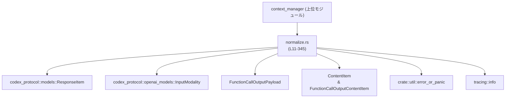
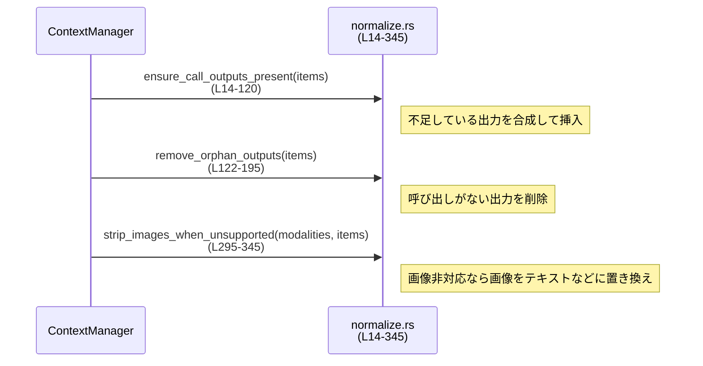

# core/src/context_manager/normalize.rs

## 0. ざっくり一言

`ResponseItem` の列を正規化するためのユーティリティ群です。  
関数呼び出しとその出力のペアリング調整と、「画像非対応モデル」の場合の画像コンテンツ除去を行います。

---

## 1. このモジュールの役割

### 1.1 概要

- このモジュールは、`codex_protocol::models::ResponseItem` の一覧を整形し、上位のコンテキストマネージャが扱いやすい一貫した形式に揃えるために存在します。
- 関数呼び出しと出力が **必ず 1 対 1 で対応する** ことを保証し（不足分の補完と孤立出力の削除）、不要または扱えない画像コンテンツを取り除きます。
- これにより、後続の処理（表示・保存・さらなる変換など）が、形式の揺れを意識せずに `ResponseItem` を扱えるようになります。

### 1.2 アーキテクチャ内での位置づけ

`normalize.rs` は、コンテキストマネージャの内部で `ResponseItem` 列を整形する中間レイヤという位置づけです。  
外部依存として `codex_protocol` の型と、エラー報告ユーティリティを利用しています。



### 1.3 設計上のポイント

- **状態を持たない純粋な関数群**  
  すべての関数は `&mut Vec<ResponseItem>` あるいは `&mut [ResponseItem]` を受け取り、その場で書き換えを行う関数として定義されています（例: `ensure_call_outputs_present` (L14-120), `strip_images_when_unsupported` (L295-345)）。
- **ペアリングと整合性チェック**  
  - ID ベースで「呼び出し」と「呼び出しの出力」を対応づけ、足りない出力を補完したり、対応のない出力を削除します（L14-195, L197-282）。
  - 一部の不整合（CustomToolCall / LocalShellCall など）は `error_or_panic` を用いて重大な異常として扱います（L75-77, L99-101, L166-168 など）。
- **I/O や非同期処理を含まない**  
  すべての処理はメモリ内の `Vec` / `HashSet` の操作とログ出力 (`tracing::info`、`error_or_panic`) のみで構成されています。
- **Rust の安全性**  
  - すべて安全な Rust コードのみで記述されており、`unsafe` ブロックは存在しません。
  - `&mut Vec<ResponseItem>` や `&mut [ResponseItem]` によってコンパイル時に単一所有のミュータブル参照が保証され、データ競合（data race）が防がれています。
- **オーダー維持を意識した挿入・削除**  
  - 不足している出力は「対応する呼び出しの直後」に挿入されます（L116-119）。
  - 削除は `retain`（L161-194）や `remove_first_matching`（L284-291）を使い、なるべく局所的な変更に留めています。

---

## 2. 主要な機能一覧

- 呼び出しに対応する出力の補完: `ensure_call_outputs_present`（L14-120）
- 呼び出しに対応しない孤立出力の除去: `remove_orphan_outputs`（L122-195）
- 特定の呼び出し／出力に対する「対応側」の削除: `remove_corresponding_for`（L197-282）
- 条件付きの画像コンテンツ除去（モデルが画像非対応の場合）: `strip_images_when_unsupported`（L295-345）
- 汎用的な 1 件削除ヘルパ: `remove_first_matching`（L284-291）
- 画像省略時に埋め込むプレースホルダー文字列: `IMAGE_CONTENT_OMITTED_PLACEHOLDER`（L11-12）

---

## 3. 公開 API と詳細解説

### 3.1 コンポーネント一覧

このファイル内の主要な定数・関数の一覧です。

| 名前 | 種別 | 役割 / 用途 | 定義位置 |
|------|------|-------------|----------|
| `IMAGE_CONTENT_OMITTED_PLACEHOLDER` | `const &str` | 画像を省略した際に代わりに埋め込むテキスト | `normalize.rs:L11-12` |
| `ensure_call_outputs_present` | 関数 | 呼び出しに対応する出力がない場合に、合成された出力を挿入する | `normalize.rs:L14-120` |
| `remove_orphan_outputs` | 関数 | 対応する呼び出しが存在しない出力を削除する | `normalize.rs:L122-195` |
| `remove_corresponding_for` | 関数 | 1 つの `ResponseItem` を基準に、その「相方」を削除する | `normalize.rs:L197-282` |
| `remove_first_matching` | 関数（プライベートヘルパ） | 条件に一致する最初の要素を `Vec` から削除する | `normalize.rs:L284-291` |
| `strip_images_when_unsupported` | 関数 | 画像非対応モデル向けにメッセージ・ツール出力から画像を除去またはマスクする | `normalize.rs:L295-345` |

---

### 3.2 関数詳細

#### `ensure_call_outputs_present(items: &mut Vec<ResponseItem>)`

**概要**

- `ResponseItem::FunctionCall` / `ToolSearchCall` / `CustomToolCall` / `LocalShellCall` に対して、対応する出力 (`FunctionCallOutput` / `ToolSearchOutput` / `CustomToolCallOutput`) が存在しない場合に「合成された出力」を追加します（L14-120）。
- 対応が見つからない種別に応じて、`info!` ログや `error_or_panic` によるエラー報告を行います（L31, L54, L75-77, L99-101）。

**引数**

| 引数名 | 型 | 説明 |
|--------|----|------|
| `items` | `&mut Vec<ResponseItem>` | 正規化対象となるレスポンスアイテム列。関数内で要素が挿入され書き換えられます。 |

**戻り値**

- なし（`()`）。  
  副作用として `items` 内に不足していた出力要素が挿入されます。

**内部処理の流れ**

1. 合成出力を一時的に保持するための `missing_outputs_to_insert` ベクタを用意します（L18）。
2. `items` を `for (idx, item) in items.iter().enumerate()` で走査し、各要素の種別によって分岐します（L20-21）。
3. 各呼び出し種別ごとに、「同じ `call_id` を持つ出力が既に存在するか」を `items.iter().any(...)` で判定します（例: L23-28, L45-51, L67-72, L91-96）。
4. 出力が存在しない場合:
   - `FunctionCall` → `info!` でログを残し、`FunctionCallOutput` を合成（`"aborted"` テキストを持つ payload）して `(idx, ResponseItem::FunctionCallOutput { ... })` を `missing_outputs_to_insert` に追加します（L30-38）。
   - `ToolSearchCall` → `info!` を出力し、`ToolSearchOutput` を `status: "completed"`, `execution: "client"`, `tools: Vec::new()` で合成します（L53-63）。
   - `CustomToolCall` → `error_or_panic` を呼び（L75-77）、`CustomToolCallOutput` を `name: None`, `"aborted"` 出力付きで合成します（L78-85）。
   - `LocalShellCall`（`call_id: Some(..)` の場合） → `error_or_panic` を呼び（L99-101）、`FunctionCallOutput` を `"aborted"` で合成します（L102-108）。
5. ループ終了後、`missing_outputs_to_insert` を **インデックスの大きいものから順に** 逆順で走査し、各 `(idx, output_item)` を `items.insert(idx + 1, output_item)` で、対応する呼び出しの直後に挿入します（L116-119）。

**Examples（使用例）**

```rust
use codex_protocol::models::ResponseItem;
use crate::context_manager::normalize::ensure_call_outputs_present;

// どこか上位から得られた items
fn normalize_items(mut items: Vec<ResponseItem>) -> Vec<ResponseItem> {
    // 呼び出しに対応する出力がなければ合成して補完する
    ensure_call_outputs_present(&mut items);
    items
}
```

この例では、`items` 内の `FunctionCall` などに対応する出力が無い場合、`"aborted"` などの合成出力が直後に挿入された状態で返されます。

**Errors / Panics**

- `error_or_panic` がどのように動作するかは別モジュール依存ですが、名前からは「ログ記録と `panic!` のどちらか」を行うことが想定されます（L75-77, L99-101）。
- 本関数自体は `Result` を返さず、異常検出時はこの `error_or_panic` に委ねています。

**Edge cases（エッジケース）**

- 同じ `call_id` を持つ出力が **複数** 存在する場合でも、`any` による存在チェックのみ行い、重複出力の削除は行いません（L23-28 等）。
- `LocalShellCall` で `call_id: None` の場合はチェックの対象外となり、出力の有無チェックも合成も行われません（L89-111 内の `if let Some(call_id)` 参照）。
- 既に `"aborted"` に相当する出力がある場合でも、それを特別扱いするロジックはありません。単に「同じ `call_id` を持つ出力が存在するかどうか」だけを見ています。

**使用上の注意点**

- `items` の要素数 `n` に対して、`items.iter().any(...)` を要素ごとに呼び出しているため、最悪計算量はおおよそ O(n²) になります。大きなレスポンスリストに対してはパフォーマンスに注意が必要です（L20-28, L45-51 など）。
- この関数は **順序を維持したまま** 出力を追加しますが、他の処理で `items` を書き換えた後に再度呼び出すと、合成出力が二重に挿入される可能性があります。1 回の正規化フローの中で 1 度だけ呼ぶ前提で設計されていると解釈できます。
- `error_or_panic` が実際に `panic!` する場合、本関数を呼び出す側で recover することはできません（`catch_unwind` を使わない限り）。エラー扱いの方針は上位設計に依存します。

---

#### `remove_orphan_outputs(items: &mut Vec<ResponseItem>)`

**概要**

- `ensure_call_outputs_present` とは逆に、「呼び出しに対応する `call_id` を持たない出力」を削除し、不整合を検知した場合は `error_or_panic` によってエラーを報告します（L122-195）。
- ToolSearch については `execution == "server"` と `call_id: None` のケースを特別扱いし、呼び出しとの対応がなくても残す設計になっています（L181-182, L192）。

**引数**

| 引数名 | 型 | 説明 |
|--------|----|------|
| `items` | `&mut Vec<ResponseItem>` | 検査・削除対象のレスポンスアイテム列。対応のない出力は削除されます。 |

**戻り値**

- なし（`()`）。  
  副作用として `items` から孤立出力が削除されます。

**内部処理の流れ**

1. `items` 全体から以下の 4 種類の `call_id` を `HashSet<String>` として収集します（L123-159）。
   - `function_call_ids`: `FunctionCall` の `call_id`（L123-129）
   - `tool_search_call_ids`: `ToolSearchCall` で `call_id: Some(..)` のもの（L131-140）
   - `local_shell_call_ids`: `LocalShellCall` で `call_id: Some(..)` のもの（L142-151）
   - `custom_tool_call_ids`: `CustomToolCall` の `call_id`（L153-159）
2. `items.retain` を使って、各要素について「保持するかどうか」を判定します（L161-194）。
3. 各種出力に対して:
   - `FunctionCallOutput { call_id, .. }` → `function_call_ids` または `local_shell_call_ids` に `call_id` が含まれていれば保持し、そうでなければ `error_or_panic` を呼びつつ削除します（L162-170）。
   - `CustomToolCallOutput { call_id, .. }` → `custom_tool_call_ids` に含まれていれば保持し、それ以外は `error_or_panic` と削除（L172-180）。
   - `ToolSearchOutput { execution, .. }` かつ `execution == "server"` → 呼び出しとの対応に関わらず常に保持（L181-182）。
   - `ToolSearchOutput { call_id: Some(call_id), .. }` → `tool_search_call_ids` に含まれていれば保持し、それ以外は `error_or_panic` と削除（L183-191）。
   - `ToolSearchOutput { call_id: None, .. }` → 常に保持（L192）。
4. それ以外の `ResponseItem`（呼び出し本体やメッセージなど）は無条件に保持します（L193-194）。

**Examples（使用例）**

```rust
use codex_protocol::models::ResponseItem;
use crate::context_manager::normalize::remove_orphan_outputs;

fn cleanup_items(mut items: Vec<ResponseItem>) -> Vec<ResponseItem> {
    // 孤立している出力（対応する call がない出力）を削除する
    remove_orphan_outputs(&mut items);
    items
}
```

**Errors / Panics**

- 対応する呼び出しが存在しない出力を検出すると、`error_or_panic` が呼ばれます（L166-168, L175-177, L188-189）。
- `ToolSearchOutput` については、`execution == "server"` または `call_id: None` の場合は不整合チェックを行わないため、そのケースでは `error_or_panic` は発生しません。

**Edge cases（エッジケース）**

- `FunctionCallOutput` が `FunctionCall` と `LocalShellCall` の両方の `call_id` セットに含まれている場合でも、単に「どちらかに含まれるか」だけをチェックするため、特に問題なく保持されます（L163-164）。
- `ToolSearchOutput` で `execution == "server"` かつ `call_id: Some(..)` の場合、呼び出しが存在しなくても「常に保持」されます（L181-182）。これはサーバ側で起こる検索結果などを想定した設計と推測されますが、コード上は特別扱いとして実装されています。
- `items.retain` により、削除対象は 1 回のスキャンでまとめて除去され、インデックスの再計算などは不要です（L161-194）。

**使用上の注意点**

- `ensure_call_outputs_present` によって合成された出力は、基本的に対応する呼び出しが同じ `items` 内にあるため、この関数で削除されることはありません。
- 呼び出しと出力が **別々のバッファに分かれている** ような構成でこの関数を呼ぶと、ほぼすべての出力が「孤立」と判定され削除される可能性があります。必ず「呼び出しと出力を含む 1 つの `Vec<ResponseItem>`」に対して適用する必要があります。

---

#### `remove_corresponding_for(items: &mut Vec<ResponseItem>, item: &ResponseItem)`

**概要**

- 指定された `item` とペアになる「対応側」の `ResponseItem` を、`items` から 1 件だけ削除します（L197-282）。
- 「対応側」とは、同じ `call_id` を共有する呼び出し／出力の組を指します。例えば `FunctionCall` であれば `FunctionCallOutput` が対応側です（L199-207）。

**引数**

| 引数名 | 型 | 説明 |
|--------|----|------|
| `items` | `&mut Vec<ResponseItem>` | 削除対象を含むレスポンスアイテム列 |
| `item` | `&ResponseItem` | 対応側の削除基準となるアイテム（自身は削除しない） |

**戻り値**

- なし（`()`）。  
  `items` から「対応側の要素」が 1 つ削除されます。`item` 自体の削除は呼び出し元で行う前提です。

**内部処理の流れ**

1. `match item` により、`item` のバリアントごとに処理を分岐します（L198-280）。
2. 各ケースで、`remove_first_matching` または `items.iter().position(..)` + `remove` を使い、条件に合う最初の要素を削除します。
   - `FunctionCall { call_id, .. }` → `FunctionCallOutput` で同じ `call_id` を持つ最初の要素を削除（L199-207）。
   - `FunctionCallOutput { call_id, .. }` → まず `FunctionCall` を検索し（L210-213）、なければ `LocalShellCall { call_id: Some(..) }` を検索して削除（L214-218）。
   - `ToolSearchCall { call_id: Some(call_id), .. }` ↔ `ToolSearchOutput { call_id: Some(..) }`（L220-233, L234-249）。
   - `CustomToolCall { call_id, .. }` ↔ `CustomToolCallOutput { call_id, .. }`（L251-266）。
   - `LocalShellCall { call_id: Some(call_id), .. }` ↔ `FunctionCallOutput { call_id, .. }`（L267-279）。
3. `call_id: None` の `ToolSearchCall` や `LocalShellCall` については、対応側を検索・削除しません（`Some(call_id)` で絞り込んでいるため）。

**Examples（使用例）**

```rust
use codex_protocol::models::ResponseItem;
use crate::context_manager::normalize::remove_corresponding_for;

// ある FunctionCallOutput を削除したいときに、対応する FunctionCall も一緒に消す
fn remove_call_and_output(items: &mut Vec<ResponseItem>, index: usize) {
    if let Some(item) = items.get(index) {
        // まず対応側（呼び出し or 出力）を削除
        remove_corresponding_for(items, item);
        // その後、呼び出し元で item 自身を削除する
        items.remove(index.min(items.len().saturating_sub(1)));
    }
}
```

**Errors / Panics**

- 本関数自体は `error_or_panic` を呼びません。  
  条件に合う要素が見つからない場合は単に何も削除されません（`position(..)` が `None` のまま処理終了、L210-218 など）。
- インデックス削除には `Vec::remove` を使っており、`position` を通して境界チェックしているため、インデックス範囲外アクセスによるパニックはありません（L210-218, L284-289）。

**Edge cases（エッジケース）**

- `items` に同じ `call_id` を持つ複数の出力／呼び出しがある場合、**最初に見つかった 1 件のみ** を削除します（L284-289）。
- `item` 自体は削除しません。呼び出し側が `item` を別途削除しない場合、片側だけが残った不整合状態になる可能性があります。
- `ToolSearchCall` や `LocalShellCall` の `call_id` が `None` の場合は対応側を削除しません（L220-223, L267-270）。

**使用上の注意点**

- この関数は「双方削除」を完結させるものではなく、「相方側のみ削除する」ヘルパです。通常は呼び出し元で `item` 自身も削除して、ペアを完全に消す必要があります。
- `items` をイテレートしている最中にこの関数で削除を行う場合は、インデックスのズレに注意する必要があります。一般的には、外側で `retain` や `drain_filter`（Nightly）などのイディオムと併用することが多いです。

---

#### `strip_images_when_unsupported(input_modalities: &[InputModality], items: &mut [ResponseItem])`

**概要**

- モデルが画像入力をサポートしていない場合に、`ResponseItem` 内に含まれる画像コンテンツをテキストのプレースホルダに置き換えたり、画像生成結果を空にします（L293-345）。
- `input_modalities` に `InputModality::Image` が含まれている場合は何も変更を行いません（L299-302）。

**引数**

| 引数名 | 型 | 説明 |
|--------|----|------|
| `input_modalities` | `&[InputModality]` | モデルがサポートしている入力モダリティ。`Image` が含まれる場合は画像削除を行わないフラグとして使用。 |
| `items` | `&mut [ResponseItem]` | 画像コンテンツの削除・マスキング対象となるレスポンス配列。スライスで渡され、その場で書き換えられます。 |

**戻り値**

- なし（`()`）。  
  副作用として `items` 内の画像コンテンツがテキストに置き換わる、または空にされます。

**内部処理の流れ**

1. `input_modalities.contains(&InputModality::Image)` で画像入力サポートの有無を判定し、サポートしている場合は即座に `return` します（L299-302）。
2. `items.iter_mut()` で各 `ResponseItem` を可変参照として走査し、マッチングで種別ごとに処理を分岐します（L304-305）。
3. `ResponseItem::Message { content, .. }`（L306-319）:
   - `content` の長さを元に容量を確保した新しい `Vec` を作成（L307）。
   - 各 `ContentItem` について:
     - `ContentItem::InputImage { .. }` → `ContentItem::InputText { text: IMAGE_CONTENT_OMITTED_PLACEHOLDER.to_string() }` に置き換え（L310-313）。
     - それ以外 → `clone()` してそのままコピー（L315-316）。
   - 最後に `*content = normalized_content` として差し替えます（L318-319）。
4. `ResponseItem::FunctionCallOutput { output, .. }` および `ResponseItem::CustomToolCallOutput { output, .. }`（L320-338）:
   - `output.content_items_mut()` で `Option<&mut Vec<FunctionCallOutputContentItem>>` を取得し、`Some` の場合のみ処理（L322）。
   - 各 `FunctionCallOutputContentItem` について:
     - `InputImage` → `InputText` に置き換え（L325-331）。
     - それ以外 → `clone()` してコピー（L333-334）。
   - 差し替えた `normalized_content_items` を `*content_items` に代入します（L336-337）。
5. `ResponseItem::ImageGenerationCall { result, .. }` → `result.clear()` で画像生成結果を空にします（L339-341）。
6. その他の `ResponseItem` については何も変更しません（L342）。

**Examples（使用例）**

```rust
use codex_protocol::openai_models::InputModality;
use codex_protocol::models::ResponseItem;
use crate::context_manager::normalize::strip_images_when_unsupported;

fn normalize_for_text_only_model(items: &mut [ResponseItem]) {
    let modalities = [InputModality::Text]; // 画像非対応モデル
    strip_images_when_unsupported(&modalities, items);
    // ここ以降、メッセージやツール出力からは画像が除去・マスクされている
}
```

**Errors / Panics**

- 本関数は `Result` を返さず、`panic!` を起こすようなコード（`unwrap` など）も含まれていません。
- `clone()` が失敗する可能性は通常ありません（`Clone` 実装がパニックしない前提）。

**Edge cases（エッジケース）**

- `input_modalities` が空、または `InputModality::Image` を含まない場合にのみ画像削除が行われます（L299-302）。
- `FunctionCallOutputPayload::content_items_mut()` が `None` を返す場合、その出力に含まれる画像コンテンツは一切触られません（L322）。これは「テキストのみの output」や「画像を別のフィールドで持つ output」を想定した設計と考えられます。
- `ResponseItem::ImageGenerationCall` は結果が `clear` されるため、画像生成結果は完全に失われます（L339-341）。プレースホルダー等は残りません。

**使用上の注意点**

- 画像を完全に破棄するのではなく、「後から再度取得できる」前提がある場合（キャッシュなど）、この関数を呼ぶタイミングに注意が必要です。一度 `clear` すると元のデータは再構築できません。
- プレースホルダー文字列は固定で `IMAGE_CONTENT_OMITTED_PLACEHOLDER` を使用します（L11-12, L311-313, L329-331）。クライアント側でユーザー向けのメッセージに変換する場合は、この文字列をキーとして扱う設計も考えられます。

---

### 3.3 その他の関数

| 関数名 | 役割（1 行） | 定義位置 |
|--------|--------------|----------|
| `remove_first_matching<F>` | 与えられた述語を満たす最初の `ResponseItem` を `Vec` から削除するヘルパ関数 | `normalize.rs:L284-291` |

`remove_first_matching` はジェネリックな小ヘルパであり、`remove_corresponding_for` からのみ利用されています（L199-207, L224-233, L238-249, L252-266, L271-278）。

---

## 4. データフロー

このモジュールを用いた典型的な正規化フローとして、次のような順序が考えられます:

1. 上位モジュールで `ResponseItem` の列を構築する。
2. `ensure_call_outputs_present` により、不足している出力を補完する。
3. `remove_orphan_outputs` により、対応のない孤立出力を除去する。
4. モデルが画像非対応であれば `strip_images_when_unsupported` により画像を除去／マスクする。



このフローにより、上位層は「呼び出しと出力が整合しており、かつサポートされていないメディアが除去された `ResponseItem` 列」を前提に後続処理を実装できます。

---

## 5. 使い方（How to Use）

### 5.1 基本的な使用方法

`ResponseItem` の列を正規化する最も単純なコードパターンです。

```rust
use codex_protocol::models::ResponseItem;
use codex_protocol::openai_models::InputModality;
use crate::context_manager::normalize::{
    ensure_call_outputs_present,
    remove_orphan_outputs,
    strip_images_when_unsupported,
};

fn normalize_response_items(
    input_modalities: &[InputModality],
    items: &mut Vec<ResponseItem>,
) {
    // 1. 呼び出しに対応する出力を補完
    ensure_call_outputs_present(items);

    // 2. 対応する呼び出しのない出力を削除
    remove_orphan_outputs(items);

    // 3. 画像非対応モデルの場合、画像コンテンツを除去／マスク
    strip_images_when_unsupported(input_modalities, items);
}
```

この関数を通した後の `items` は、呼び出し／出力の整合性と画像対応状況が揃った状態になります。

### 5.2 よくある使用パターン

1. **呼び出し削除時のペア削除**

```rust
use codex_protocol::models::ResponseItem;
use crate::context_manager::normalize::remove_corresponding_for;

fn delete_call_with_output(items: &mut Vec<ResponseItem>, index: usize) {
    if let Some(item) = items.get(index) {
        // まず対応する相方（呼び出し or 出力）を削除
        remove_corresponding_for(items, item);
        // その後、自身も削除する
        items.remove(index);
    }
}
```

1. **画像非対応クライアントへのレスポンス変換**

```rust
use codex_protocol::models::ResponseItem;
use codex_protocol::openai_models::InputModality;
use crate::context_manager::normalize::strip_images_when_unsupported;

fn prepare_for_client(
    client_supports_images: bool,
    items: &mut [ResponseItem],
) {
    let modalities = if client_supports_images {
        vec![InputModality::Text, InputModality::Image]
    } else {
        vec![InputModality::Text]
    };

    strip_images_when_unsupported(&modalities, items);
}
```

### 5.3 よくある間違い

```rust
use crate::context_manager::normalize::{
    ensure_call_outputs_present,
    remove_orphan_outputs,
};

// 間違い例: 孤立出力の削除を先に行う
fn wrong_order(items: &mut Vec<ResponseItem>) {
    // 先に孤立出力を削除してしまう
    remove_orphan_outputs(items);

    // その後で不足出力を補完すると、本来存在すべきだった出力が
    // 一度も検査されないまま見落とされる可能性がある
    ensure_call_outputs_present(items);
}

// 正しい例: 先に補完してから孤立出力を削除
fn correct_order(items: &mut Vec<ResponseItem>) {
    ensure_call_outputs_present(items);
    remove_orphan_outputs(items);
}
```

```rust
use crate::context_manager::normalize::remove_corresponding_for;
use codex_protocol::models::ResponseItem;

// 間違い例: remove_corresponding_for だけ呼んで自身を削除しない
fn only_remove_corresponding(items: &mut Vec<ResponseItem>, index: usize) {
    if let Some(item) = items.get(index) {
        remove_corresponding_for(items, item);
        // item 自身は残ったまま → 片側だけ残る不整合が発生し得る
    }
}

// 正しい例: 相方削除 + 自身の削除
fn remove_both_sides(items: &mut Vec<ResponseItem>, index: usize) {
    if let Some(item) = items.get(index) {
        remove_corresponding_for(items, item);
        items.remove(index);
    }
}
```

### 5.4 使用上の注意点（まとめ）

- **所有権・並行性**
  - すべての関数は `&mut Vec<ResponseItem>` / `&mut [ResponseItem]` を受け取るため、同一の `items` に対して並行に呼び出すことはできません（コンパイルエラーになります）。  
    これは Rust の所有権ルールによってデータ競合を防ぐための仕組みです。
- **エラー処理**
  - 本ファイルの関数は `Result` を返しません。不整合は `error_or_panic` によるログ・パニックで扱われます（L75-77, L99-101, L166-168, L175-177, L188-189）。
  - エラーを通常の制御フローに載せたい場合は、上位層で `panic` を捕捉するか、`error_or_panic` の実装側を `panic` しない方針にする必要があります。
- **性能面**
  - `ensure_call_outputs_present` は `items` に対して二重ループ的な探索を行うため、大量の `ResponseItem` を扱う場合は計算量が増大します（O(n²) 近似）。  
    通常サイズの会話ログでは問題になりにくいですが、大規模ストリーム処理では注意が必要です。
- **データ喪失**
  - `strip_images_when_unsupported` による画像の削除・マスキングは不可逆です。再変換や再取得が必要な場合は、元データを別の場所に保持しておく前提が望ましいです。

---

## 6. 変更の仕方（How to Modify）

### 6.1 新しい機能を追加する場合

1. **新しい `ResponseItem` バリアントのペアリングを追加する**
   - 例: 新種のツール呼び出し `ResponseItem::NewToolCall` とその出力 `ResponseItem::NewToolCallOutput` を追加する場合:
     - `ensure_call_outputs_present` に新しい `match` アームを追加し、対応する出力が無いときに合成出力を作る（L21-113 のパターンを参考）。
     - `remove_orphan_outputs` に新しい `HashSet` の収集と、対応する出力の保持ロジックを追加する（L123-159, L161-194 を参考）。
     - `remove_corresponding_for` にペアとなる呼び出し／出力の削除ロジックを追加する（L198-280）。
2. **画像コンテンツの取り扱い拡張**
   - 新しい画像種別が `ContentItem` や `FunctionCallOutputContentItem` に追加された場合、`strip_images_when_unsupported` の `match` にパターンを追加し、適切にプレースホルダへの変換や削除を実装します（L309-317, L324-334）。

### 6.2 既存の機能を変更する場合

- **呼び出し／出力の契約の変更**
  - `call_id` の生成ルールやユニーク性の保証が変わる場合:
    - 上記 3 関数すべて（`ensure_call_outputs_present`, `remove_orphan_outputs`, `remove_corresponding_for`）が `call_id` ベースのロジックに依存しているため、影響範囲はファイル全体に及びます。
- **`error_or_panic` の扱い**
  - 不整合を「致命的エラー」ではなく「警告」にしたい場合、`error_or_panic` の実装を変更するか、このファイル内で `error_or_panic` 呼び出し箇所をログだけに置き換える必要があります（L75-77, L99-101, L166-168, L175-177, L188-189）。
- **テスト・確認**
  - 変更後は、以下のようなケースを含むテストを用意すると、回帰を防ぎやすくなります（テストコードはこのチャンクには存在しません）:
    - 呼び出しだけある / 出力だけある / 両方あるケース。
    - `call_id: None` の `ToolSearchCall` / `LocalShellCall` を含むケース。
    - 画像を含む / 含まないメッセージ・ツール出力の組み合わせ。

---

## 7. 関連ファイル

| パス | 役割 / 関係 |
|------|------------|
| `codex_protocol::models` | `ResponseItem`, `ContentItem`, `FunctionCallOutputContentItem`, `FunctionCallOutputPayload` などのドメインモデルを提供し、本モジュールの主要な入力・出力型になっています（L1-4）。 |
| `codex_protocol::openai_models::InputModality` | モデルがサポートする入力モダリティ（テキスト／画像など）を表現し、画像削除の要否判断に用いられます（L5, L295-302）。 |
| `crate::util::error_or_panic` | 不整合検出時のエラー報告・パニック処理を集約するユーティリティ関数で、本モジュールから呼び出されます（L8, L75-77, L99-101, L166-168, L175-177, L188-189）。 |
| `tracing::info` | 不足する出力に関する情報ログを記録するために利用されます（L9, L31, L54）。 |

このチャンクにはテストコードや追加のサポートモジュールは含まれていないため、テストの所在や他のコンテキストマネージャ関連ファイルについては不明です。
