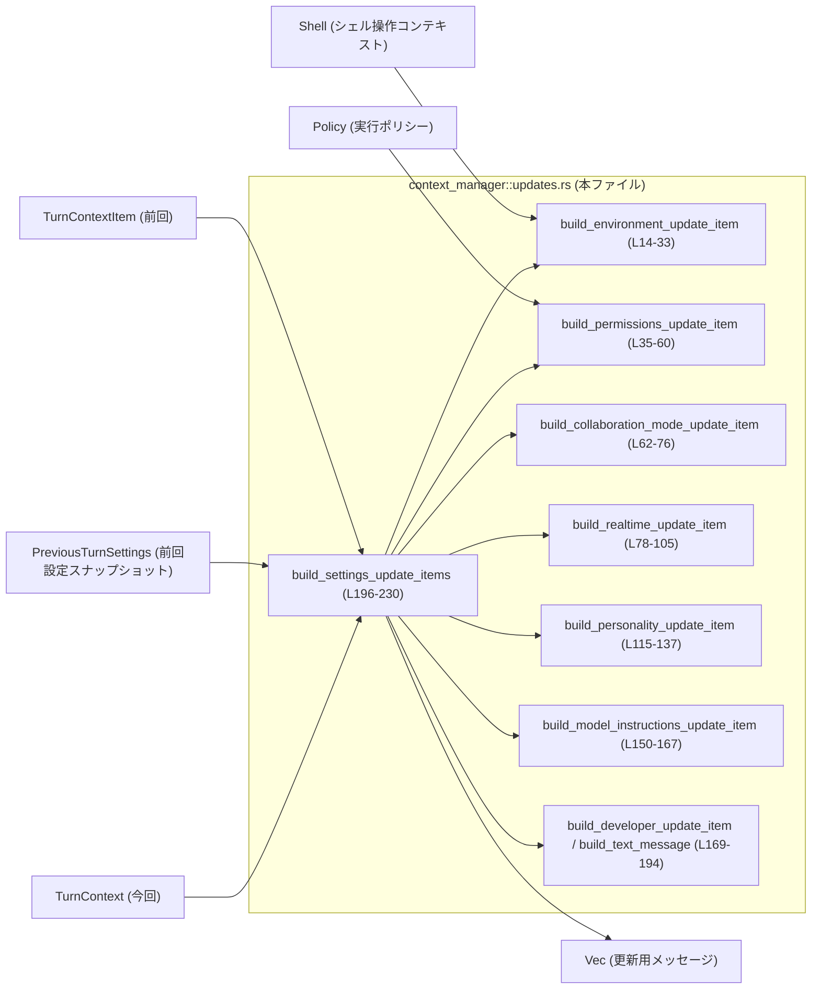
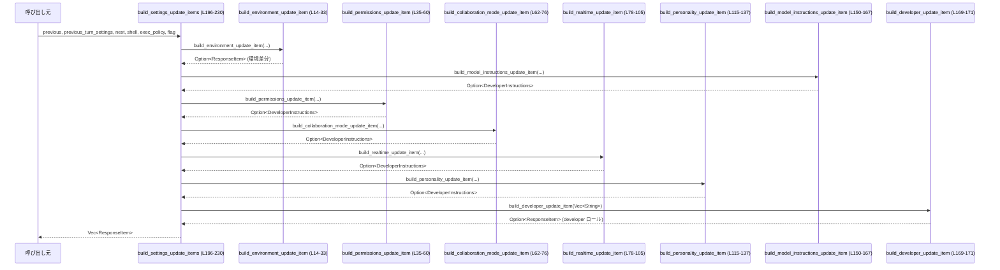

# core/src/context_manager/updates.rs

## 0. ざっくり一言

`TurnContextItem`（前回ターン）と `TurnContext`（今回ターン）を比較し、  
**モデルに再提示すべき「設定・状態の差分メッセージ」**（開発者向け/ユーザー向け）を組み立てるユーティリティ群です。

---

## 1. このモジュールの役割

### 1.1 概要

- このモジュールは、会話の「前回状態」と「今回状態」の差分から  
  - 環境コンテキストの変化  
  - 実行権限・承認ポリシーの変化  
  - コラボレーションモードの変化  
  - リアルタイムモードの開始/終了  
  - モデル切り替え・パーソナリティ指定  
  を検出し、OpenAI 風の `ResponseItem` / `DeveloperInstructions` として再提示用メッセージを構築します。
- これにより、モデル側のプロンプト履歴に「どの設定がいつ変わったか」を明示的に伝えることを目的としていると解釈できます（コメントより、ただし詳細仕様は他ファイル）。

### 1.2 アーキテクチャ内での位置づけ

このモジュールは、コンテキスト管理層の一部として、前後のターン状態から「更新メッセージ」を生成します。



**補足**

- `TurnContextItem` / `TurnContext` / `PreviousTurnSettings` の定義はこのチャンクには存在しないため、詳細なフィールド構造は不明です。
- `ResponseItem` / `DeveloperInstructions` はプロトコル層（`codex_protocol`）の型であり、モデル側に送るメッセージフォーマットを表していると推測できますが、定義自体は他ファイルです。

### 1.3 設計上のポイント

- **純粋関数スタイル**  
  すべての関数は引数のみから戻り値を計算し、副作用を持ちません（ログ出力や I/O なし）  
  → テストや再利用がしやすい構造です。
- **差分ベースの生成**  
  各種 `build_*_update_item` は、前回値と今回値が同じなら `None` を返し、メッセージを生成しません（例: `build_environment_update_item` の比較処理 `equals_except_shell`  
  `core/src/context_manager/updates.rs:L24-28`）。
- **責務ごとの分割**  
  環境、権限、コラボモード、リアルタイム、パーソナリティ、モデル切替など、要素ごとにビルダー関数を分け、それらを `build_settings_update_items` が集約します  
  `core/src/context_manager/updates.rs:L196-221`。
- **Option によるエラー/欠損管理**  
  前回コンテキストがない場合や、メッセージが不要な場合は `Option::None` を返すことで分岐を表現し、`?` 演算子で早期リターンしています（例: `let prev = previous?;`  
  `core/src/context_manager/updates.rs:L23,44,66,123,154`）。
- **Rust の安全性**  
  - `unwrap` や生ポインタは使用せず、すべて `Option` と参照で安全に扱っています。  
  - 共有状態やスレッドは登場せず、並行性に関する危険はこのファイルには現れません。

---

## 2. 主要な機能一覧

### 2.1 コンポーネントインベントリー（関数）

| 関数名 | 可視性 | 戻り値 | 役割（要約） | 根拠 |
|--------|--------|--------|--------------|------|
| `build_environment_update_item` | `fn` | `Option<ResponseItem>` | 環境コンテキストの差分がある場合にユーザー向け `ResponseItem` を生成 | `core/src/context_manager/updates.rs:L14-33` |
| `build_permissions_update_item` | `fn` | `Option<DeveloperInstructions>` | 実行ポリシー/承認ポリシーの変更を検出し、開発者向け指示を生成 | `core/src/context_manager/updates.rs:L35-60` |
| `build_collaboration_mode_update_item` | `fn` | `Option<DeveloperInstructions>` | コラボレーションモード変更時の開発者向け指示を生成 | `core/src/context_manager/updates.rs:L62-76` |
| `build_realtime_update_item` | `pub(crate) fn` | `Option<DeveloperInstructions>` | リアルタイムモードの開始/終了に応じた指示メッセージを生成 | `core/src/context_manager/updates.rs:L78-105` |
| `build_initial_realtime_item` | `pub(crate) fn` | `Option<DeveloperInstructions>` | 初回用ラッパー。`build_realtime_update_item` を再利用 | `core/src/context_manager/updates.rs:L107-113` |
| `build_personality_update_item` | `fn` | `Option<DeveloperInstructions>` | パーソナリティ設定の変更検出と、それに応じた指示メッセージ生成 | `core/src/context_manager/updates.rs:L115-137` |
| `personality_message_for` | `pub(crate) fn` | `Option<String>` | モデル固有のパーソナリティメッセージ文字列を取得 | `core/src/context_manager/updates.rs:L139-148` |
| `build_model_instructions_update_item` | `pub(crate) fn` | `Option<DeveloperInstructions>` | モデル切替時のモデル固有ガイダンスを取得し、メッセージ化 | `core/src/context_manager/updates.rs:L150-167` |
| `build_developer_update_item` | `pub(crate) fn` | `Option<ResponseItem>` | 複数の開発者向けテキスト断片を 1 つの `ResponseItem` メッセージにまとめる | `core/src/context_manager/updates.rs:L169-171` |
| `build_contextual_user_message` | `pub(crate) fn` | `Option<ResponseItem>` | ユーザー役割のテキストメッセージを構築 | `core/src/context_manager/updates.rs:L173-175` |
| `build_text_message` | `fn` | `Option<ResponseItem>` | 任意 `role` のテキストメッセージを汎用的に構築するヘルパー | `core/src/context_manager/updates.rs:L177-193` |
| `build_settings_update_items` | `pub(crate) fn` | `Vec<ResponseItem>` | 上記すべての差分ビルダーを呼びだし、送出すべき更新メッセージ群をまとめて生成 | `core/src/context_manager/updates.rs:L196-230` |

### 2.2 主要な機能（箇条書き）

- 環境コンテキスト差分の検出と再提示 (`build_environment_update_item`)
- 実行・承認ポリシーの差分検出 (`build_permissions_update_item`)
- コラボレーションモード変更時の指示再提示 (`build_collaboration_mode_update_item`)
- リアルタイムモード開始/終了フローの指示生成 (`build_realtime_update_item`, `build_initial_realtime_item`)
- モデルパーソナリティおよびモデル切替に伴うガイダンス生成 (`build_personality_update_item`, `personality_message_for`, `build_model_instructions_update_item`)
- 開発者/ユーザー向けテキストメッセージ構築 (`build_developer_update_item`, `build_contextual_user_message`, `build_text_message`)
- 上記全部をまとめた更新メッセージリストの組み立て (`build_settings_update_items`)

---

## 3. 公開 API と詳細解説

### 3.1 主な型一覧（このファイルで利用しているもの）

| 名前 | 種別 | 説明（このファイルから読み取れる範囲） | 根拠 |
|------|------|----------------------------------------|------|
| `TurnContext` | 構造体（他モジュール） | `config`, `sandbox_policy`, `approval_policy`, `cwd`, `features`, `realtime_active`, `personality`, `model_info` などのフィールドを持つことがわかる。実行時設定をまとめたコンテキストと解釈できる。 | メンバアクセスから `core/src/context_manager/updates.rs:L19-21,40-41,45,53-58,84-93,124-132,155-161,159-160` |
| `TurnContextItem` | 構造体（他モジュール） | 前回ターンのスナップショット。`sandbox_policy`, `approval_policy`, `collaboration_mode`, `realtime_active`, `model`, `personality` を保持している。 | `core/src/context_manager/updates.rs:L44-47,66-67,84-85,124-130` |
| `PreviousTurnSettings` | 構造体（他モジュール） | 前ターン設定の別スナップショット。`realtime_active`, `model` を保持。 | `core/src/context_manager/updates.rs:L79-81,100-103,151-156` |
| `EnvironmentContext` | 構造体（他モジュール） | `from_turn_context_item`, `from_turn_context`, `equals_except_shell`, `diff_from_turn_context_item` を持ち、環境情報の差分計算を担う。 | `core/src/context_manager/updates.rs:L24-32` |
| `Shell` | 構造体（他モジュール） | `EnvironmentContext` の生成に使用されるシェルコンテキスト。詳細は不明。 | `core/src/context_manager/updates.rs:L17,24-25,31,200` |
| `Policy` | 構造体（他クレート） | 実行ポリシー。`DeveloperInstructions::from_policy` に渡される。 | `core/src/context_manager/updates.rs:L38,51-59,201` |
| `Feature` | 列挙体（他クレート） | `'ExecPermissionApprovals'`, `'RequestPermissionsTool'` などの機能フラグを示す。 | `core/src/context_manager/updates.rs:L57-58` |
| `Personality` | 列挙体（他クレート） | モデルのパーソナリティ種別。`get_personality_message` の引数になる。 | `core/src/context_manager/updates.rs:L7,128,141,146` |
| `ContentItem` | 列挙体/構造体（他クレート） | メッセージ中のコンテンツ要素。ここでは `InputText { text }` だけ使用。 | `core/src/context_manager/updates.rs:L8,182-185` |
| `DeveloperInstructions` | 構造体（他クレート） | 開発者向け指示メッセージ。`from_policy`, `from_collaboration_mode`, `realtime_*_message`, `personality_spec_message`, `model_switch_message`, `into_text` を持つ。 | `core/src/context_manager/updates.rs:L9,51,70-72,87-98,100-103,133,164-166,209-221` |
| `ResponseItem` | 列挙体/構造体（他クレート） | モデルへのレスポンスメッセージ。`from`, `Message { .. }` コンストラクタ相当がある。 | `core/src/context_manager/updates.rs:L10,30-32,169-171,173-175,187-193,196-230` |
| `ModelInfo` | 構造体（他クレート） | `slug`, `model_messages`, `get_model_instructions` などを持つモデル定義。 | `core/src/context_manager/updates.rs:L11,124-132,139-147,150-161,159-160` |

> 注: 型の「役割」説明には関数名やフィールド名に基づく推測が含まれます。そのため、厳密な仕様は定義元ファイルを確認する必要があります。

---

### 3.2 重要関数の詳細解説（7件）

#### 3.2.1 `build_settings_update_items(...) -> Vec<ResponseItem>`

```rust
pub(crate) fn build_settings_update_items(
    previous: Option<&TurnContextItem>,
    previous_turn_settings: Option<&PreviousTurnSettings>,
    next: &TurnContext,
    shell: &Shell,
    exec_policy: &Policy,
    personality_feature_enabled: bool,
) -> Vec<ResponseItem> { /* ... */ }
```

**概要**

- 前回ターンと今回ターンの状態差分から、モデルに送るべき更新メッセージ（`ResponseItem`）のリストを組み立てる中心関数です  
  `core/src/context_manager/updates.rs:L196-230`。

**引数**

| 引数名 | 型 | 説明 |
|--------|----|------|
| `previous` | `Option<&TurnContextItem>` | 前回ターンの詳細なコンテキスト。なければ `None`（会話開始など） |
| `previous_turn_settings` | `Option<&PreviousTurnSettings>` | 前ターンの設定スナップショット。リアルタイム/モデル情報のために使用 |
| `next` | `&TurnContext` | 今回ターンのコンテキスト（最新設定） |
| `shell` | `&Shell` | 環境コンテキスト差分計算に使用 |
| `exec_policy` | `&Policy` | 権限更新メッセージ構築に使用 |
| `personality_feature_enabled` | `bool` | パーソナリティ機能が有効かどうかのフラグ |

**戻り値**

- `Vec<ResponseItem>`  
  - 0 個以上の差分メッセージ。  
  - 開発者向けの更新は 1 メッセージ（まとめられた `developer` ロール）、環境コンテキスト更新は `user` ロールメッセージとして返る可能性があります  
    `core/src/context_manager/updates.rs:L208-229`。

**内部処理の流れ**

1. TODO コメントで、まだ全てのモデル可視情報をカバーしきれていないことを明示  
   `core/src/context_manager/updates.rs:L204-207`。
2. 環境コンテキスト用のユーザーメッセージを構築  
   `build_environment_update_item(previous, next, shell)`  
   `core/src/context_manager/updates.rs:L208`。
3. 開発者向けの各種更新（モデル切替、権限、コラボモード、リアルタイム、パーソナリティ）を順番に呼び出し、`Option<DeveloperInstructions>` を配列にまとめる  
   `core/src/context_manager/updates.rs:L209-217`。
4. `.into_iter().flatten()` によって `None` を除外し、`DeveloperInstructions` だけのイテレータに変換  
   `core/src/context_manager/updates.rs:L218-219`。
5. 各 `DeveloperInstructions` を `into_text()` で `String` に変換し、`Vec<String>` として収集  
   `core/src/context_manager/updates.rs:L220-221`。
6. 容量 2 の `Vec<ResponseItem>` を用意し（開発者用 + ユーザー用を想定）、開発者用メッセージを `build_developer_update_item` で構築してあれば push  
   `core/src/context_manager/updates.rs:L223-226`。
7. 1. で生成した環境コンテキストメッセージがあれば push  
   `core/src/context_manager/updates.rs:L227-228`。
8. 生成された `items` を返却  
   `core/src/context_manager/updates.rs:L229-230`。

**Examples（使用例）**

前回コンテキストと今回コンテキストから更新メッセージを得る例です（外部型はダミー）:

```rust
use crate::context_manager::updates::build_settings_update_items;

// ダミーの previous/next を仮定
fn example(
    previous: Option<&TurnContextItem>,
    previous_turn_settings: Option<&PreviousTurnSettings>,
    next: &TurnContext,
    shell: &Shell,
    exec_policy: &Policy,
) {
    let personality_feature_enabled = true; // 機能フラグ

    let update_items = build_settings_update_items(
        previous,
        previous_turn_settings,
        next,
        shell,
        exec_policy,
        personality_feature_enabled,
    ); // 差分メッセージ群を生成

    for item in update_items {
        // ResponseItem を上位レイヤで送出
        println!("{:?}", item);
    }
}
```

**Errors / Panics**

- この関数内では `Result` や `panic!` は使用されていません。  
- `?` 演算子は、各ビルダー関数内部で `Option` を早期 `None` にするためにのみ使われています。
- そのため、**失敗** は「メッセージが生成されない（`None` になる）」として表現されますが、呼び出し側には例外やパニックは発生しません。

**Edge cases（エッジケース）**

- `previous`/`previous_turn_settings` が `None` の場合  
  → 利用するヘルパー側で `?` により `None` となり、該当種類の更新メッセージはスキップされます。
- すべての差分ビルダーが `None` を返した場合  
  → 戻り値は空の `Vec<ResponseItem>` になります。
- `developer_update_sections` が空（差分なし）の場合  
  → `build_developer_update_item` が `None` を返し、開発者向けメッセージは生成されません。

**使用上の注意点**

- この関数は**差分のみ**を生成するため、「初期コンテキスト一式を再送したい」という用途には適しません（TODO コメント参照 `L204-207`）。
- `personality_feature_enabled` フラグが `false` の場合、パーソナリティ関連の更新は抑制されます。
- 返される `Vec<ResponseItem>` の順序は、**開発者メッセージ → ユーザー環境メッセージ** となるよう構成されています（`L223-228`）。

---

#### 3.2.2 `build_environment_update_item(...) -> Option<ResponseItem>`

**概要**

- 環境コンテキスト（`EnvironmentContext`）の前回と今回を比較し、変化があれば `ResponseItem` として差分を返します  
  `core/src/context_manager/updates.rs:L14-33`。

**引数**

| 引数名 | 型 | 説明 |
|--------|----|------|
| `previous` | `Option<&TurnContextItem>` | 前回ターンのコンテキスト。なければ差分は計算されない |
| `next` | `&TurnContext` | 今回のコンテキスト |
| `shell` | `&Shell` | 環境情報生成に必要なシェルコンテキスト |

**戻り値**

- `Some(ResponseItem)` … 環境コンテキストに変更があり、かつ `include_environment_context` が有効な場合。
- `None` … コンテキストが同一、前回がない、もしくは設定により環境コンテキストが無効な場合。

**内部処理の流れ**

1. `next.config.include_environment_context` が `false` なら何も生成せず `None`  
   `L19-21`。
2. `previous?` によって前回コンテキストが存在しなければ `None`  
   `L23`。
3. `EnvironmentContext::from_turn_context_item` と `::from_turn_context` で前後の環境コンテキストを構築  
   `L24-25`。
4. `equals_except_shell` によりシェル以外が全く同じなら `None` を返す  
   `L26-28`。
5. 差分を `EnvironmentContext::diff_from_turn_context_item(prev, next, shell)` で取得し、それを `ResponseItem::from` でラップして `Some` で返す  
   `L30-32`。

**Edge cases**

- 設定で環境コンテキストが無効 (`include_environment_context == false`) の場合、いかなる変化があってもメッセージは生成されません。
- 前回コンテキストがない (`previous == None`) 場合、初期状態の環境を送ることはせず、単に `None` になります。

**使用上の注意点**

- 差分計算ロジックは `EnvironmentContext` に委譲されており、このファイルからはその詳細は分かりません（定義は別ファイル）。
- この関数単体は `pub` ではないため、外部から直接呼ぶのではなく `build_settings_update_items` 経由で利用される前提です。

---

#### 3.2.3 `build_permissions_update_item(...) -> Option<DeveloperInstructions>`

**概要**

- `sandbox_policy` と `approval_policy` の変更を検出し、必要なら開発者向け権限説明を `DeveloperInstructions` として返します  
  `core/src/context_manager/updates.rs:L35-60`。

**引数**

| 引数名 | 型 | 説明 |
|--------|----|------|
| `previous` | `Option<&TurnContextItem>` | 前回ターンのコンテキスト |
| `next` | `&TurnContext` | 今回ターンのコンテキスト |
| `exec_policy` | `&Policy` | 実行ポリシーの詳細（説明生成に利用） |

**戻り値**

- `Some(DeveloperInstructions)` … 権限関連設定が変わった場合。
- `None` … 権限説明を含めない設定 or 変更なし or 前回コンテキストなし。

**内部処理の流れ**

1. `next.config.include_permissions_instructions` が `false` なら `None`  
   `L40-42`。
2. `previous?` で前回がない場合は `None`  
   `L44`。
3. `prev.sandbox_policy` と `*next.sandbox_policy.get()` を比較し、さらに `prev.approval_policy` と `next.approval_policy.value()` を比較、両方同じなら `None`  
   `L45-49`。
4. そうでなければ `DeveloperInstructions::from_policy(...)` を呼び出して `Some` を返す  
   `L51-59`。

**Edge cases**

- 前回と今回の一部だけ変わった場合（例えば sandbox は同じだが approval-policy が変化）でも、`if` 条件が「両方同じなら `None`」なので、片方でも違えば `Some` になります。
- `previous == None` の場合、差分として扱わないため、初回ターンでの権限説明は別経路で行われていると推測できます（このチャンクには現れません）。

**使用上の注意点**

- `exec_policy` や `next.cwd`、`next.features` など複数情報が `from_policy` に渡されているため、ポリシー説明の内容変更はこの関数ではなく `DeveloperInstructions` 側のロジックに依存します。
- 権限に関する重大な変更があっても、この関数が返すのはあくまで「説明メッセージ」であり、実際の権限制御は別の層で行われているはずです。

---

#### 3.2.4 `build_collaboration_mode_update_item(...) -> Option<DeveloperInstructions>`

**概要**

- コラボレーションモード（たとえばペアプロ/レビュー支援などと推測される）が変化したときにのみ、開発者向けの指示を生成します  
  `core/src/context_manager/updates.rs:L62-76`。

**引数**

| 引数名 | 型 | 説明 |
|--------|----|------|
| `previous` | `Option<&TurnContextItem>` | 前回コンテキスト |
| `next` | `&TurnContext` | 今回コンテキスト |

**戻り値**

- `Some(DeveloperInstructions)` … モードが変わり、かつ `from_collaboration_mode` がメッセージを返した場合。
- `None` … 前回なし or モード変化なし or `from_collaboration_mode` が `None` を返した場合。

**内部処理の流れ**

1. `previous?` で前回コンテキストがなければ `None`  
   `L66`。
2. `prev.collaboration_mode.as_ref() != Some(&next.collaboration_mode)` でモードの差分を判定  
   `L67`。
3. 変化があれば `DeveloperInstructions::from_collaboration_mode(&next.collaboration_mode)` を呼び出し、その `Option` に対して `?` を適用し、`Some(...)` に包んで返す  
   `L70-72`。
4. 変化がなければ `None`  
   `L73-75`。

**使用上の注意点**

- `from_collaboration_mode` が `None` を返した場合（空指示のモードなど）、コメントにある通り「更新を出さず、以前の指示が履歴に残る」振る舞いになります  
  `L68-69`。
- 初回ターン用のモード指示は別の経路で送られている前提です（このチャンクには現れません）。

---

#### 3.2.5 `build_realtime_update_item(...) -> Option<DeveloperInstructions>`

**概要**

- リアルタイムモードの ON/OFF 状態に応じて、開始・終了の開発者向けメッセージを生成します  
  `core/src/context_manager/updates.rs:L78-105`。

**引数**

| 引数名 | 型 | 説明 |
|--------|----|------|
| `previous` | `Option<&TurnContextItem>` | 前回コンテキスト。`realtime_active: Option<bool>` を持つ |
| `previous_turn_settings` | `Option<&PreviousTurnSettings>` | 以前の設定スナップショット。`realtime_active: Option<bool>` を持つ |
| `next` | `&TurnContext` | 今回コンテキスト。`realtime_active: bool` を持つ |

**戻り値**

- `Some(DeveloperInstructions)` … リアルタイムモードの開始/終了に応じたメッセージ。
- `None` … 状態に変化がない場合。

**内部処理の流れ**

1. `match` で `(前回の realtime_active, 今回の realtime_active)` の組み合わせを列挙  
   `core/src/context_manager/updates.rs:L83-86`。
2. ケースごとに挙動:

   - `(Some(true), false)`  
     → `realtime_end_message("inactive")` を返す（リアルタイム終了）  
       `L87`。
   - `(Some(false), true)` または `(None, true)`  
     → リアルタイム開始。もし `next.config.experimental_realtime_start_instructions` に特別な文言があれば `realtime_start_message_with_instructions`、なければ `realtime_start_message`  
       `L88-98`。
   - `(Some(true), true)` または `(Some(false), false)`  
     → 状態変化なしのため `None`  
       `L99`。
   - `(None, false)`  
     → `previous_turn_settings` から `realtime_active` が `Some(true)` であれば終了メッセージを返す  
       `L100-103`。

**言語固有の安全性**

- `previous.and_then(|item| item.realtime_active)` によって、`previous` が `None` の場合や、`realtime_active` が `None` の場合も安全に表現しています  
  `L84-85`。
- すべての分岐を列挙しており、`match` は網羅的です（コンパイラによるチェックを利用）。

**Edge cases**

- 「前回コンテキストには情報がないが、`previous_turn_settings` にはある」ケース `(None, false)` を特別扱いしており、履歴の不整合を吸収する意図が見えます `L100-103`。
- `experimental_realtime_start_instructions` が空文字列でない限り、その内容が優先されますが、ここでは空文字チェックは行っていません（空文字でも「ある」とみなされます）。

**使用上の注意点**

- 非同期処理や並行性は関わらず、単なる状態フラグの変化を解釈するロジックです。  
- 実際のリアルタイムストリーム開始/終了は別の層が制御しているはずで、この関数はあくまで「説明メッセージ」のみを扱います。

---

#### 3.2.6 `build_personality_update_item(...) -> Option<DeveloperInstructions>`

**概要**

- パーソナリティ機能が有効かつ、モデルが変わっておらず、かつパーソナリティが変更された場合に、パーソナリティ仕様メッセージを生成します  
  `core/src/context_manager/updates.rs:L115-137`。

**引数**

| 引数名 | 型 | 説明 |
|--------|----|------|
| `previous` | `Option<&TurnContextItem>` | 前回コンテキスト（`model`, `personality` を持つ） |
| `next` | `&TurnContext` | 今回コンテキスト（`model_info.slug`, `personality` を持つ） |
| `personality_feature_enabled` | `bool` | パーソナリティ機能が有効かどうか |

**戻り値**

- `Some(DeveloperInstructions)` … 条件を満たした場合のパーソナリティ仕様メッセージ。
- `None` … 機能無効、前回なし、モデル変更あり、パーソナリティ変更なし、またはメッセージが空の場合。

**内部処理の流れ**

1. フラグが無効なら即 `None`  
   `L120-122`。
2. `previous?` で前回がなければ `None`  
   `L123`。
3. モデルが変わっている場合 (`next.model_info.slug != previous.model`) は、パーソナリティ差分を送らず `None`  
   `L124-126`。
4. `if let Some(personality) = next.personality && next.personality != previous.personality` で  
   - 今回のパーソナリティが `Some`  
   - 前回と異なる  
   の両方を満たす場合のみ処理を行う  
   `L128-130`。
5. `personality_message_for(&next.model_info, personality)` でモデル依存の仕様メッセージ文字列を取得し、`DeveloperInstructions::personality_spec_message` でラップ  
   `L131-133`。
6. 条件を満たさない場合は `None`  
   `L134-136`。

**Edge cases**

- モデルが変わった場合は、パーソナリティ変更であってもここでは扱わず、おそらく `build_model_instructions_update_item` 側で一括説明される想定です。
- `personality_message_for` が空文字列を返した場合は `None` になるため、「メッセージがないパーソナリティ」では更新されません。

**使用上の注意点**

- `Personality` が `Copy` か `Clone` かは不明ですが、ここでは単純コピーとして扱われています。
- 機能フラグを切り替えることで、この機能を一括で無効化できます（AB テストや段階的ロールアウトに利用できる設計です）。

---

#### 3.2.7 `build_model_instructions_update_item(...) -> Option<DeveloperInstructions>`

**概要**

- モデルが切り替わった場合に、そのモデル固有の説明（インストラクション）を取得し、開発者向けに送るメッセージを生成します  
  `core/src/context_manager/updates.rs:L150-167`。

**引数**

| 引数名 | 型 | 説明 |
|--------|----|------|
| `previous_turn_settings` | `Option<&PreviousTurnSettings>` | 前回のモデル情報を含む設定 |
| `next` | `&TurnContext` | 今回のモデル情報（`model_info.slug`, `personality`） |

**戻り値**

- `Some(DeveloperInstructions)` … モデルが変わり、かつモデル固有インストラクションが空でない場合。
- `None` … 前回設定なし or モデル同一 or インストラクション空。

**内部処理の流れ**

1. `previous_turn_settings?` で前回設定がない場合は `None`  
   `L154`。
2. `previous_turn_settings.model == next.model_info.slug` ならモデル変更なしとみなし `None`  
   `L155-156`。
3. `next.model_info.get_model_instructions(next.personality)` でインストラクション文字列を取得  
   `L159-160`。
4. 文字列が空であれば `None`  
   `L160-161`。
5. そうでなければ `DeveloperInstructions::model_switch_message(model_instructions)` を `Some` で返す  
   `L163-166`。

**使用上の注意点**

- モデル変更時のメッセージは、`build_settings_update_items` 内で最初に追加されるよう順序が指定されています（コメント参照 `L210-211`）。これにより、**他の差分より前にモデル固有ガイドラインが読まれる**ことが保証されています。

---

### 3.3 その他の関数（概要のみ）

| 関数名 | 役割（1 行） | 根拠 |
|--------|--------------|------|
| `build_initial_realtime_item` | `build_realtime_update_item` をそのまま呼ぶ薄いラッパー。初期化フェーズでの呼び出し用と推測されます。 | `core/src/context_manager/updates.rs:L107-113` |
| `personality_message_for` | `ModelInfo::model_messages` から `Personality` に対応するメッセージ文字列を取得し、空でなければ返す。 | `core/src/context_manager/updates.rs:L139-148` |
| `build_developer_update_item` | `build_text_message("developer", ...)` による開発者ロールメッセージ構築。 | `core/src/context_manager/updates.rs:L169-171` |
| `build_contextual_user_message` | `build_text_message("user", ...)` によるユーザーロールメッセージ構築。 | `core/src/context_manager/updates.rs:L173-175` |
| `build_text_message` | `Vec<String>` を `ContentItem::InputText` のベクタに変換し、`ResponseItem::Message` を構築。 | `core/src/context_manager/updates.rs:L177-193` |

---

## 4. データフロー

### 4.1 代表的な処理シナリオ：設定更新のビルド

`build_settings_update_items` を中心とした、1 ターン分の更新データフローです。



**要点**

- すべての「差分ビルダー」は `Option<DeveloperInstructions>`/`Option<ResponseItem>` を返し、`flatten` により自動的に無視されるため、「差分がない種類」は自然にスキップされます。
- 開発者向けの複数の差分はテキストの `Vec<String>` に連結され、1 つの `developer` ロールメッセージにまとめられます。
- ユーザー向け環境コンテキストは個別メッセージ（`user` ロール）として追加されます。

---

## 5. 使い方（How to Use）

### 5.1 基本的な使用方法

全体の想定利用パターンは、上位の「ターン管理」ロジックから呼び出す形です。

```rust
use crate::context_manager::updates::build_settings_update_items;
use crate::codex::{TurnContext, PreviousTurnSettings};
use codex_execpolicy::Policy;
use crate::shell::Shell;

fn handle_turn(
    previous_item: Option<&TurnContextItem>,            // 前回ターンのスナップショット
    previous_settings: Option<&PreviousTurnSettings>,   // 前回の設定スナップショット
    next: &TurnContext,                                 // 今回ターンのコンテキスト
    shell: &Shell,                                      // シェルコンテキスト
    exec_policy: &Policy,                               // 実行ポリシー
) {
    let personality_feature_enabled = true;             // 機能フラグ（設定などから取得する想定）

    let update_items = build_settings_update_items(
        previous_item,
        previous_settings,
        next,
        shell,
        exec_policy,
        personality_feature_enabled,
    );                                                  // 差分メッセージ群を構築

    // 生成された ResponseItem をプロトコル層へ送出
    for item in update_items {
        // ここで item をモデルへ渡す
        println!("{:?}", item);
    }
}
```

### 5.2 よくある使用パターン

1. **会話継続時の設定差分送信**
   - `previous` と `previous_turn_settings` を前ターンから引き継ぎ、`next` を新しいターンの設定で構築。
   - 設定が変わっていない場合、多くのビルダーが `None` を返し、不要なメッセージが抑制されます。

2. **フォーク/リジューム時の差分再現**
   - TODO コメントから、将来的には `build_initial_context` の再生をより完全にサポートする意図が読み取れますが、現状は一部の差分のみが扱われます `L204-207`。
   - そのため、フォーク/リジューム時には、ここでカバーされない情報を別途扱う必要がある可能性があります。

### 5.3 よくある間違い（想定されるもの）

```rust
// 間違い例: 前回コンテキストを必ず Some と決め打ちしている
fn wrong(
    previous_item: &TurnContextItem,
    next: &TurnContext,
    shell: &Shell,
    exec_policy: &Policy,
) {
    // 初回ターンなど previous_item が存在しないケースを扱えない
    let _ = build_settings_update_items(
        Some(previous_item),
        None,
        next,
        shell,
        exec_policy,
        true,
    );
}
```

```rust
// 正しい例: Option を素直に渡し、内部での `?` に任せる
fn correct(
    previous_item: Option<&TurnContextItem>,
    previous_settings: Option<&PreviousTurnSettings>,
    next: &TurnContext,
    shell: &Shell,
    exec_policy: &Policy,
) {
    let _ = build_settings_update_items(
        previous_item,
        previous_settings,
        next,
        shell,
        exec_policy,
        true,
    );
}
```

### 5.4 使用上の注意点（まとめ）

- **前提条件**
  - `TurnContext`, `TurnContextItem`, `PreviousTurnSettings` の整合性は呼び出し側で保証する必要があります（例えばモデル名/パスが一致しているかなど）。
- **禁止事項に近い注意**
  - 「初期コンテキスト全体」を再構築する用途にはそのまま使えません。TODO にあるように、まだ全てのモデル可視項目をカバーしていないためです `L204-207`。
- **エラー挙動**
  - 関数群はすべて `Option` を使い、「生成しない」ことでエラー/不要ケースを表す設計です。呼び出し側で `None` とエラーを区別したい場合は別レイヤでラップする必要があります。
- **並行性**
  - このファイルには共有ミュータブル状態がなく、純粋関数のみのため、複数スレッドから同じ引数で呼び出してもレースコンディションは発生しません。

---

## 6. 変更の仕方（How to Modify）

### 6.1 新しい種類の設定更新を追加する場合

1. **新しいビルダー関数を追加**
   - 例: `fn build_locale_update_item(previous: Option<&TurnContextItem>, next: &TurnContext) -> Option<DeveloperInstructions>` のように、既存パターンに倣って実装します。
2. **差分ロジックを記述**
   - 前回と今回の対象フィールドを比較し、変化があれば `Some` を返すようにします。
3. **`build_settings_update_items` に統合**
   - `developer_update_sections` の配列（`L209-217`）に新しいビルダーを追加し、他の更新と同様に `into_text` へ流れるようにします。
4. **順序の検討**
   - モデル切替メッセージを最初に出すという既存方針（コメント `L210-211`）を崩さないよう、新しい項目を配置します。

### 6.2 既存の機能を変更する場合

- **影響範囲の確認**
  - 変更したいビルダーが利用しているフィールド（`TurnContext` / `TurnContextItem` / `PreviousTurnSettings`）の定義ファイルを確認する必要があります（このチャンクには定義がありません）。
- **契約（前提・戻り値）の維持**
  - すべての `build_*_update_item` は「差分がなければ `None`」という契約を暗黙に共有しています。ここを崩すと、上位の `flatten` 前提（`L218-219`）や、「差分のみ送る」という設計と矛盾する可能性があります。
- **テストや使用箇所の確認**
  - このチャンクにテストコードは存在しません。そのため、関連するテストは別モジュール（不明）にあるか、まだ整備されていない可能性があります。変更時はプロジェクト全体の検索が必要です。

---

## 7. 関連ファイル

このモジュールと密接に関係するファイル/モジュール（インポートから読み取れる範囲）です。

| パス | 役割 / 関係 |
|------|------------|
| `crate::codex::PreviousTurnSettings` | 前回ターンの設定スナップショット型。リアルタイムフラグとモデル名を保持し、モデル切替・リアルタイム更新ロジックに利用されます `L1,79-81,100-103,151-156`。 |
| `crate::codex::TurnContext` | 今回ターンのコンテキスト。各種設定・機能フラグ・モデル情報などの中心となる型です `L2,19-21,40-41,45,53-58,84-93,124-132,155-161,159-160`。 |
| `crate::environment_context::EnvironmentContext` | 環境コンテキストの生成・比較・差分出力を担うユーティリティ。`build_environment_update_item` から利用されます `L3,24-32`。 |
| `crate::shell::Shell` | シェル環境を表す型で、環境コンテキストの生成に必要です `L4,17,24-25,31,200`。 |
| `codex_execpolicy::Policy` | 実行ポリシーを表す型。権限更新メッセージの生成に使用されます `L5,38,51-59,201`。 |
| `codex_features::Feature` | 機能フラグを列挙する型。権限関連の機能有効/無効判定に使われます `L6,57-58`。 |
| `codex_protocol::models::{ContentItem, DeveloperInstructions, ResponseItem}` | モデルに渡すメッセージ構造や、開発者向け指示の構造を表す中心的なプロトコル定義です `L8-10,24-32,51-59,70-72,87-98,100-103,133,164-166,169-171,173-175,182-193`。 |
| `codex_protocol::openai_models::ModelInfo` | モデル固有情報（slug, model_messages, model instructions）を持つ型です `L11,124-132,139-147,150-161`。 |
| `codex_protocol::config_types::Personality` | モデルパーソナリティ設定を表す列挙体です `L7,128,141,146`。 |
| `codex_protocol::protocol::TurnContextItem` | 前回ターンの詳細情報を持つ構造体であり、差分計算の基準点になります `L12,15,35-37,62-64,78-80,107-109,115-117`。 |

---

### Bugs / Security / テスト / パフォーマンス に関する補足

- **明確なバグ要因**
  - このチャンクだけを見る限り、パニックを起こす可能性のある箇所（`unwrap`、`panic!`、配列インデックスなど）はありません。
  - すべての外部呼び出し（`EnvironmentContext::*`, `DeveloperInstructions::*` 等）は、戻り値を `Option` 経由で安全に扱っています。
- **セキュリティ観点**
  - このファイルはメッセージ組み立てに特化しており、直接ユーザー入力を評価したり OS リソースを操作したりはしません。そのため、このチャンク単体から重大なセキュリティリスクは読み取れません。
- **テスト**
  - このファイルにはテストコードは存在しません（`#[cfg(test)]` 等なし）。テストがある場合は、別ファイル/モジュールに配置されていると考えられますが、このチャンクからは不明です。
- **パフォーマンス**
  - 処理内容は主に `Option` 判定と文字列/ベクタ操作であり、1 ターンあたりのオーバーヘッドは小さいと考えられます。
  - `Vec::with_capacity(2)` のようにあらかじめ容量を確保するなど、軽微な効率化が行われています `L223`。

このレポートは、本チャンクに含まれるコードのみを根拠としています。それ以外の仕様や挙動は、不明であるか、コメントと命名に基づく推測であることを明記しました。
