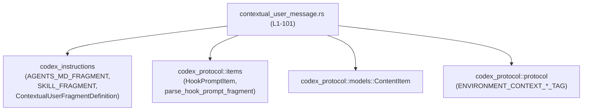
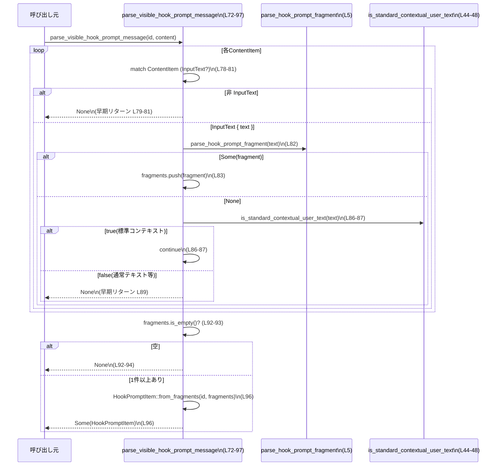

core/src/contextual_user_message.rs

---

## 0. ざっくり一言

ユーザー入力中の「コンテキスト付き断片」（環境コンテキスト、AGENTS.md、スキル、ユーザーシェルコマンド、ターン中断、サブエージェント通知など）を識別し、

- メモリ生成から除外すべきかどうか
- 「HookPromptItem」として統合できるかどうか

を判定するユーティリティ群のモジュールです。  
根拠: `core/src/contextual_user_message.rs:L10-42,L50-57,L58-63,L72-97`

---

## 1. このモジュールの役割

### 1.1 概要

このモジュールは、ユーザーからの入力に含まれる「システム寄りのコンテキスト情報」と通常の会話テキストを区別するために存在し、次の機能を提供します。

- 特定のタグに囲まれたテキストを「コンテキスト付きユーザーフラグメント」として認識するための定義（タグ文字列とその集合）  
  根拠: `L10-15,L17-33,L35-42`
- それらのフラグメントがメモリ生成から除外すべきものかどうかの判定  
  根拠: `L50-57,L58-63`
- ContentItem 列から、HookPromptItem に変換可能な「visible hook prompt message」を抽出する処理  
  根拠: `L72-97`

### 1.2 アーキテクチャ内での位置づけ

このモジュールは自身では新しい型を定義せず、外部クレートの型・定数に依存して判定ロジックのみを提供しています。

- `codex_instructions`
  - `AGENTS_MD_FRAGMENT`, `SKILL_FRAGMENT`, `ContextualUserFragmentDefinition` を使用  
    根拠: `L1-3,L17-33,L35-41`
- `codex_protocol`
  - `ContentItem`, `HookPromptItem`, `parse_hook_prompt_fragment`  
    根拠: `L4-6,L72-97`
  - `ENVIRONMENT_CONTEXT_*_TAG`  
    根拠: `L7-8,L17-21`

依存関係を簡略図で表すと次のようになります。



### 1.3 設計上のポイント

- **定数によりタグとフラグメント定義を集中管理**  
  - タグ文字列（例: `<user_shell_command>`）と、それに対応する `ContextualUserFragmentDefinition` をこのファイルに集約  
    根拠: `L10-15,L17-33`
- **判定ロジックの共通化**  
  - `CONTEXTUAL_USER_FRAGMENTS` 配列と `is_standard_contextual_user_text` により、「標準的な」コンテキスト断片判定を一元化  
    根拠: `L35-42,L44-48`
- **エラーハンドリング方針**  
  - 不正な入力や期待しない ContentItem はエラー型ではなく `bool` や `Option` による否定値（`false` / `None`）で表現  
    根拠: `L58-63,L65-69,L72-97`
- **状態を持たない純粋関数**  
  - すべての関数は入力引数のみを読み取り、グローバルな可変状態を持たない  
    根拠: グローバルな `static mut` や可変変数が存在しない `L1-101`
- **並行性**  
  - 共有されるのは `&'static str` と定数参照（不変）だけであり、内部でミューテックス等は使用していないため、関数自体はスレッド安全な純粋計算として扱えます。  
    根拠: 全体に可変なグローバルがない `L1-101`

---

## 2. 主要な機能一覧

- コンテキストタグ定義: ユーザーシェルコマンド、ターン中断、サブエージェント通知などのタグ文字列とフラグメント定義の提供  
  根拠: `L10-15,L17-33`
- 標準コンテキストテキスト判定: テキストが既知のコンテキスト付き断片に該当するかどうかを判定  
  根拠: `L35-42,L44-48`
- メモリ除外フラグメント判定: ContentItem がメモリ生成から除外すべきコンテキスト断片かどうかを判定  
  根拠: `L50-57,L58-63`
- コンテキスト付きユーザーフラグメント判定: ContentItem がコンテキスト断片（標準 + Hook フラグメント）かどうかを判定  
  根拠: `L65-69`
- Hook プロンプトメッセージ抽出: ContentItem の列から Hook フラグメントだけを集約し、HookPromptItem を構成する  
  根拠: `L72-97`

### 2.1 コンポーネント一覧（定数・関数）

| 名称 | 種別 | 可視性 | 役割 / 用途 | 定義位置 |
|------|------|--------|-------------|----------|
| `USER_SHELL_COMMAND_OPEN_TAG` | 定数 `&'static str` | `pub(crate)` | ユーザーシェルコマンド開始タグ文字列 | `core/src/contextual_user_message.rs:L10` |
| `USER_SHELL_COMMAND_CLOSE_TAG` | 定数 `&'static str` | `pub(crate)` | ユーザーシェルコマンド終了タグ文字列 | `core/src/contextual_user_message.rs:L11` |
| `TURN_ABORTED_OPEN_TAG` | 定数 `&'static str` | `pub(crate)` | ターン中断開始タグ文字列 | `L12` |
| `TURN_ABORTED_CLOSE_TAG` | 定数 `&'static str` | `pub(crate)` | ターン中断終了タグ文字列 | `L13` |
| `SUBAGENT_NOTIFICATION_OPEN_TAG` | 定数 `&'static str` | `pub(crate)` | サブエージェント通知開始タグ文字列 | `L14` |
| `SUBAGENT_NOTIFICATION_CLOSE_TAG` | 定数 `&'static str` | `pub(crate)` | サブエージェント通知終了タグ文字列 | `L15` |
| `ENVIRONMENT_CONTEXT_FRAGMENT` | 定数 `ContextualUserFragmentDefinition` | `pub(crate)` | 環境コンテキスト用フラグメント定義 | `L17-21` |
| `USER_SHELL_COMMAND_FRAGMENT` | 定数 `ContextualUserFragmentDefinition` | `pub(crate)` | ユーザーシェルコマンド用フラグメント定義 | `L22-26` |
| `TURN_ABORTED_FRAGMENT` | 定数 `ContextualUserFragmentDefinition` | `pub(crate)` | ターン中断用フラグメント定義 | `L27-28` |
| `SUBAGENT_NOTIFICATION_FRAGMENT` | 定数 `ContextualUserFragmentDefinition` | `pub(crate)` | サブエージェント通知用フラグメント定義 | `L29-33` |
| `CONTEXTUAL_USER_FRAGMENTS` | 定数 `&[ContextualUserFragmentDefinition]` | `crate` 内限定 | 標準コンテキスト断片の集合（AGENTS.md, 環境コンテキスト, スキル, 各種タグ） | `L35-42` |
| `is_standard_contextual_user_text` | 関数 | private | テキストが標準コンテキスト断片かどうかを判定 | `L44-48` |
| `is_memory_excluded_contextual_user_fragment` | 関数 | `pub(crate)` | メモリ生成から除外すべきコンテキスト断片か判定 | `L58-63` |
| `is_contextual_user_fragment` | 関数 | `pub(crate)` | ContentItem がコンテキスト断片（標準＋Hook）か判定 | `L65-69` |
| `parse_visible_hook_prompt_message` | 関数 | `pub(crate)` | ContentItem 列から HookPromptItem を構成 | `L72-97` |
| `tests` モジュール | モジュール | `cfg(test)` | このモジュールのテスト群（内容はこのチャンクには現れない） | `L99-101` |

---

## 3. 公開 API と詳細解説

### 3.1 型一覧（構造体・列挙体など）

このファイル内で新しく定義される型はありません。

ただし、以下の外部型を使用します。

| 名前 | 所属 | 種別 | 本モジュール内での役割 | 根拠 |
|------|------|------|------------------------|------|
| `ContextualUserFragmentDefinition` | `codex_instructions` | 構造体（詳細は別ファイル） | タグのペアから「フラグメント」を定義し、`matches_text` によりテキストとのマッチングを行う | `L2,L17-33,L35-42,L45-47` |
| `ContentItem` | `codex_protocol::models` | 列挙体（少なくとも `InputText { text }` 変種を持つ） | ユーザー入力等を表す。ここでは `InputText` 変種のみを扱う | `L6,L58-60,L65-67,L78-80` |
| `HookPromptItem` | `codex_protocol::items` | 構造体（詳細不明） | Hook フラグメント群から組み立てられるプロンプトアイテム | `L4,L72-75,L96` |

`ContextualUserFragmentDefinition::new` や `matches_text`, `HookPromptItem::from_fragments`, `parse_hook_prompt_fragment` の詳細実装は、このチャンクには現れないため不明です。

### 3.2 関数詳細

#### `is_standard_contextual_user_text(text: &str) -> bool`（L44-48）

**概要**

テキスト `text` が、「標準的なコンテキスト付きユーザーフラグメント」のいずれかにマッチするかどうかを判定します。  
対象は AGENTS.md、環境コンテキスト、スキル、ユーザーシェルコマンド、ターン中断、サブエージェント通知の各フラグメントです。  
根拠: `L35-42,L44-48`

**引数**

| 引数名 | 型 | 説明 |
|--------|----|------|
| `text` | `&str` | 判定対象のテキスト |

**戻り値**

- `true`: `text` が `CONTEXTUAL_USER_FRAGMENTS` のいずれかの `ContextualUserFragmentDefinition` に `matches_text` するとき  
- `false`: それ以外

**内部処理の流れ**

1. `CONTEXTUAL_USER_FRAGMENTS`（AGENTS.md, ENVIRONMENT_CONTEXT_FRAGMENT, SKILL_FRAGMENT, USER_SHELL_COMMAND_FRAGMENT, TURN_ABORTED_FRAGMENT, SUBAGENT_NOTIFICATION_FRAGMENT）をイテレートする。  
   根拠: `L35-42,L45-46`
2. 各定義に対して `definition.matches_text(text)` を評価し、どれか一つでも `true` なら `true` を返す。  
   根拠: `L45-47`
3. すべてマッチしなければ `false`。  
   根拠: `.any(...)` の戻り値 `L45-47`

**Examples（使用例）**

`matches_text` がどのような文字列をマッチさせるかはこのチャンクからは分かりませんが、概念的な使用例は次のとおりです。

```rust
use codex_protocol::models::ContentItem;

// 仮に text が AGENTS_MD_FRAGMENT にマッチする形式だとする（形式は別モジュール依存）
let text = "...AGENTS.md fragment...";

// text が既知のコンテキストフラグメントかどうかを判定する
let is_ctx = crate::contextual_user_message::is_contextual_user_fragment(
    &ContentItem::InputText { text: text.to_string() },
);
// is_ctx が true であれば、is_standard_contextual_user_text(text) も true になる可能性がある
```

> 注意: モジュールパス `crate::contextual_user_message` は例示です。実際のパスはプロジェクト構成に依存します。

**Errors / Panics**

- パニックの可能性はありません（インデックスアクセスや `unwrap` 等を行っていない）。  
  根拠: `L44-48`
- エラー型も返さず、単純な `bool` 判定のみです。

**Edge cases（エッジケース）**

- 空文字列 `""`:
  - `matches_text("")` の挙動はこのチャンクには現れないため不明ですが、いずれのフラグメントにもマッチしなければ `false` になります。  
    根拠: `.any(...)` の仕様 `L45-47`
- 極端に長い文字列:
  - ロジック上は単純な反復 + メソッド呼び出しのみであり、長さによる特別扱いはありません。  
    根拠: `L44-48`

**使用上の注意点**

- この関数は **「標準」コンテキストのみ** を対象とし、`parse_hook_prompt_fragment` が扱う Hook フラグメントは対象外です。Hook フラグメントも含めて判定したい場合は `is_contextual_user_fragment` を使用する必要があります。  
  根拠: `L65-69`
- 判定ロジックの詳細は `ContextualUserFragmentDefinition::matches_text` に依存します。この挙動は別モジュールで定義されています。  
  根拠: `L2,L17-33,L45-47`

---

#### `is_memory_excluded_contextual_user_fragment(content_item: &ContentItem) -> bool`（L58-63）

**概要**

与えられた `ContentItem` が、メモリ生成の stage-1 入力から除外すべきコンテキスト付きユーザーフラグメントかどうかを判定します。  
AGENTS.md の指示とスキルペイロードは「プロンプトの骨組み」であり、会話内容としての価値が低いので除外する、というポリシーがコメントで明示されています。  
根拠: `L50-57,L58-63`

**引数**

| 引数名 | 型 | 説明 |
|--------|----|------|
| `content_item` | `&ContentItem` | 判定対象のコンテンツ |

**戻り値**

- `true`: `content_item` が `InputText` 変種であり、その `text` が `AGENTS_MD_FRAGMENT` または `SKILL_FRAGMENT` にマッチする場合  
- `false`: それ以外（非 `InputText`、または他のフラグメント／通常テキスト）

**内部処理の流れ**

1. `content_item` が `ContentItem::InputText { text }` であるかパターンマッチ。  
   - そうでなければ `false` を返す。  
   根拠: `L58-61`
2. `AGENTS_MD_FRAGMENT.matches_text(text)` または `SKILL_FRAGMENT.matches_text(text)` のどちらかが `true` なら `true` を返す。  
   根拠: `L62`
3. 上記以外のテキストは `false`。  
   根拠: `L62`

**Examples（使用例）**

```rust
use codex_protocol::models::ContentItem;
use codex_instructions::{AGENTS_MD_FRAGMENT, SKILL_FRAGMENT};

// 仮にこの文字列が AGENTS_MD_FRAGMENT にマッチする形式だと仮定
let agents_like = String::from("...AGENTS.md-like text...");

let item = ContentItem::InputText { text: agents_like };

let excluded =
    crate::contextual_user_message::is_memory_excluded_contextual_user_fragment(&item);

assert!(excluded); // AGENTS.md フラグメントであれば true になる想定
```

**Errors / Panics**

- パニックは発生しません。  
  根拠: 単純なパターンマッチとメソッド呼び出しのみ `L58-63`
- エラーは `bool` の戻り値に畳み込まれています（不適切な型の場合は単に `false`）。

**Edge cases（エッジケース）**

- `ContentItem` が `InputText` 以外（例: 添付ファイルなど他のバリアント）:
  - 即座に `false` を返します。  
    根拠: `L58-61`
- 環境コンテキストやサブエージェント通知にマッチするテキスト:
  - この関数ではチェックしていないため `false` になります（→ メモリには残す方針）。  
    根拠: コメント `L53-57` と判定条件 `L62`

**使用上の注意点**

- 「除外すべきかどうか」だけを判定し、「コンテキストフラグメントかどうか」は判定しません。前者には AGENTS.md とスキルだけが含まれます。  
  根拠: `L50-57,L62`
- `false` には「通常の会話」「他のコンテキストフラグメント」「非 InputText」がすべて含まれるため、呼び出し側で区別が必要な場合は別の判定（`is_contextual_user_fragment` など）と組み合わせる必要があります。  
  根拠: `L58-63,L65-69`

---

#### `is_contextual_user_fragment(content_item: &ContentItem) -> bool`（L65-69）

**概要**

`ContentItem` が「コンテキスト付きユーザーフラグメント」であるかどうかを判定します。  
ここでの「コンテキスト付き」は、

- Hook フラグメント（`parse_hook_prompt_fragment` が `Some` を返すもの）
- 標準コンテキストフラグメント（AGENTS.md, 環境コンテキスト, スキル, 各種タグ）

のいずれかを指します。  
根拠: `L35-42,L44-48,L65-69`

**引数**

| 引数名 | 型 | 説明 |
|--------|----|------|
| `content_item` | `&ContentItem` | 判定対象のコンテンツ |

**戻り値**

- `true`: `ContentItem::InputText { text }` であり、`parse_hook_prompt_fragment(text)` が `Some(_)` になるか、`is_standard_contextual_user_text(text)` が `true` の場合  
- `false`: 上記以外

**内部処理の流れ**

1. `content_item` が `InputText { text }` かどうかをパターンマッチ。そうでなければ `false`。  
   根拠: `L65-67`
2. `parse_hook_prompt_fragment(text).is_some()` が `true` なら `true` を返す。  
   根拠: `L69`
3. そうでなければ `is_standard_contextual_user_text(text)` の結果を返す。  
   根拠: 論理和 `||` による併用 `L69`

**Examples（使用例）**

```rust
use codex_protocol::models::ContentItem;

let item = ContentItem::InputText {
    text: String::from("...some contextual fragment..."), // 形式は parse_hook_prompt_fragment / matches_text 依存
};

let is_ctx =
    crate::contextual_user_message::is_contextual_user_fragment(&item);

if is_ctx {
    // この ContentItem はコンテキスト断片として扱う
}
```

**Errors / Panics**

- パニックは発生しません。  
  根拠: `L65-69`
- `parse_hook_prompt_fragment` がエラーを返す可能性があるかどうかはこのチャンクには現れませんが、ここでは `Option` 戻り値のみを利用しています。  
  根拠: `L5,L69`

**Edge cases（エッジケース）**

- `ContentItem` が `InputText` 以外:
  - 即座に `false`。  
    根拠: `L65-67`
- Hook フラグメントかつ標準コンテキストでもあるテキスト:
  - `parse_hook_prompt_fragment(text).is_some()` が先に評価されますが、いずれにせよ `true` を返します。  
    根拠: `L69`
- テキストがどちらにも該当しない場合:
  - `false`。通常のユーザー発話などはこのケースに該当すると考えられます（ただし実際のマッチ条件は別モジュール依存）。  
    根拠: `L69`

**使用上の注意点**

- この関数は「コンテキストかどうか」の判定であり、「メモリから除外すべきかどうか」は別判断です（`is_memory_excluded_contextual_user_fragment` を併用）。  
  根拠: `L58-63,L65-69`
- Hook フラグメントの形式やマッチ条件は `parse_hook_prompt_fragment` に依存し、このチャンクからは分かりません。  
  根拠: `L5,L69`

---

#### `parse_visible_hook_prompt_message(id: Option<&String>, content: &[ContentItem]) -> Option<HookPromptItem>`（L72-97）

**概要**

`content` に含まれる `ContentItem` 列から Hook フラグメントだけを抽出し、1つの `HookPromptItem` にまとめます。  
以下の条件をすべて満たす場合にのみ `Some(HookPromptItem)` を返します。

- すべての `ContentItem` が `InputText` 変種である
- 各テキストが
  - Hook フラグメントとしてパースできる、または
  - 標準コンテキストテキスト（AGENTS.md 等）である
- 少なくとも1つは Hook フラグメントとしてパースできる

それ以外の場合は `None` を返します。  
根拠: `L72-97`

**引数**

| 引数名 | 型 | 説明 |
|--------|----|------|
| `id` | `Option<&String>` | 結果の `HookPromptItem` に紐付ける識別子（存在しない場合は `None`） |
| `content` | `&[ContentItem]` | Hook メッセージ候補となるコンテンツ列 |

**戻り値**

- `Some(HookPromptItem)`: 上記条件を満たし、少なくとも1つ Hook フラグメントが見つかった場合  
- `None`: 条件を満たさない場合（コンテンツに通常テキストが混じる、非 `InputText` が含まれる、Hook フラグメントが1つもない等）

**内部処理の流れ**

1. 空の `fragments` ベクタを作成。ここに `parse_hook_prompt_fragment` の戻り値を蓄積。  
   根拠: `L75-76`
2. `content` をループ。（`for content_item in content`）  
   根拠: `L78`
3. 各 `content_item` について:
   1. `InputText { text }` でなければ即座に `None` を返す。  
      根拠: `L79-81`
   2. `parse_hook_prompt_fragment(text)` を試す。  
      - `Some(fragment)` なら `fragments` に `push` し、次の要素へ。  
        根拠: `L82-85`
   3. Hook フラグメントでなかった場合、`is_standard_contextual_user_text(text)` を評価。  
      - `true` なら（標準コンテキストとして）無視して次の要素へ。  
        根拠: `L86-87`
      - `false` なら（通常テキスト等が混じったと判断して）`None` を返す。  
        根拠: `L86-89`
4. ループ終了後、`fragments` が空なら `None` を返す（標準コンテキストしかなかった場合など）。  
   根拠: `L92-94`
5. そうでなければ `HookPromptItem::from_fragments(id, fragments)` から生成した結果を `Some(...)` で返す。  
   根拠: `L96`

**Mermaid フローチャート（parse_visible_hook_prompt_message (L72-97)）**



**Examples（使用例）**

Hook フラグメントの実際の文字列表現はこのチャンクからは分からないため、「`<hook-fragment>` は `parse_hook_prompt_fragment` が `Some` を返す形式の文字列であると仮定する」という前提で例を示します。

```rust
use codex_protocol::models::ContentItem;
use codex_protocol::items::HookPromptItem;

// 仮にこの文字列が parse_hook_prompt_fragment でパース可能な Hook フラグメント形式だとする
let hook_text1 = String::from("<hook-fragment-1>");
let hook_text2 = String::from("<hook-fragment-2>");

// Hook フラグメント2つと、標準コンテキスト（例: AGENTS.md）1つが混在した content
let content = vec![
    ContentItem::InputText { text: hook_text1 },
    ContentItem::InputText { text: String::from("...AGENTS.md-like text...") }, // 標準コンテキストを想定
    ContentItem::InputText { text: hook_text2 },
];

let id = String::from("hook-message-1");

let maybe_hook: Option<HookPromptItem> =
    crate::contextual_user_message::parse_visible_hook_prompt_message(
        Some(&id),
        &content,
    );

if let Some(hook_item) = maybe_hook {
    // hook_item は hook_text1, hook_text2 に対応するフラグメントをまとめたもの
} else {
    // Hook メッセージとしては扱えなかった（形式不一致/通常テキスト混入など）
}
```

**Errors / Panics**

- パニックを引き起こす操作はありません。  
  根拠: `L72-97` 内に `unwrap` 等が存在しない
- エラーは `None` で表現されるため、「Hook メッセージ候補ではない」「途中に通常テキストが混じっていた」といった複数の状況を区別できません。

**Edge cases（エッジケース）**

- `content` が空スライス:
  - ループは1回も実行されず、`fragments` は空のまま → `None` を返します。  
    根拠: `L78,L92-94`
- `content` が標準コンテキストのみ（Hook フラグメントなし）:
  - 各要素は `is_standard_contextual_user_text` により許可されますが、`fragments` は空 → 最終的に `None`。  
    根拠: `L86-87,L92-94`
- `content` の中に1つでも非 `InputText` が含まれる:
  - その時点で即 `None` を返します。  
    根拠: `L79-81`
- `content` の中に Hook でも標準コンテキストでもないテキストが1つでも含まれる:
  - `is_standard_contextual_user_text(text)` が `false` になるため、その時点で `None`。  
    根拠: `L86-89`
- Hook フラグメントが1つだけ:
  - 他要素が標準コンテキストだけなら `Some(HookPromptItem)` になります。  
    根拠: `L82-85,L86-87,L92-96`

**使用上の注意点**

- `None` の意味が複数あり得ます（「Hook メッセージでない」「入力に不正な要素が混じっている」「Hook フラグメントが0個」など）。呼び出し側でこれらを区別したい場合は、事前に `is_contextual_user_fragment` などでチェックする必要があります。  
  根拠: `L65-69,L72-97`
- 非 `InputText` が混ざった場合も `None` となるため、「非テキストを許容しつつ Hook 部分だけ拾う」といった用途には直接は使えません。  
  根拠: `L79-81`
- 処理は純粋にメモリ上の操作のみで、I/O やブロッキング処理は含まれません。並行環境でも安全に呼び出せます。

### 3.3 その他の関数

- このファイルに定義される関数は上記 4 つのみです（ヘルパー含む）。  
  根拠: `L44-48,L58-63,L65-69,L72-97`

---

## 4. データフロー

ここでは `parse_visible_hook_prompt_message` を中心に、「ContentItem 列がどのように HookPromptItem に変換されるか」のデータフローを説明します。

1. 上位レイヤーから、ユーザー入力メッセージに対応する `Vec<ContentItem>` とオプションの `id` が渡される。  
   根拠: `L72-75`
2. 各 `ContentItem` について:
   - 非 `InputText` → その時点で「Hook メッセージではない」と判断 (`None`)。  
     根拠: `L79-81`
   - `InputText` 且つ Hook フラグメント → `parse_hook_prompt_fragment` によりフラグメントオブジェクトに変換し、`fragments` ベクタに追加。  
     根拠: `L82-85`
   - `InputText` 且つ標準コンテキスト → Hook には含めずスキップ。  
     根拠: `L86-87`
   - それ以外のテキスト → 通常テキストが混じったとみなし、`None`。  
     根拠: `L86-89`
3. 走査完了後、`fragments` が空でない場合のみ `HookPromptItem::from_fragments(id, fragments)` で 1 つの Hook メッセージにまとめる。  
   根拠: `L92-96`

この処理は、Hook 用の情報だけを抜き出しつつ、不正な混在入力を素早く検出するフィルタの役割を果たしています。

---

## 5. 使い方（How to Use）

### 5.1 基本的な使用方法

典型的なフローは次のようになります。

1. ユーザー入力（またはシステムが注入したコンテキスト）を `Vec<ContentItem>` として受け取る。
2. 各 `ContentItem` について:
   - メモリ生成対象かどうかを `is_memory_excluded_contextual_user_fragment` で判定。
   - コンテキスト断片かどうかを `is_contextual_user_fragment` で判定。
3. Hook メッセージとしてまとめられるかを `parse_visible_hook_prompt_message` で確認し、必要に応じて `HookPromptItem` を生成する。

例（モジュールパスは仮）:

```rust
use codex_protocol::models::ContentItem;
use codex_protocol::items::HookPromptItem;

fn process_user_turn(id: &String, content: Vec<ContentItem>) {
    // 1. メモリ生成用にフィルタする
    let memory_inputs: Vec<&ContentItem> = content
        .iter()
        .filter(|item| {
            !crate::contextual_user_message::is_memory_excluded_contextual_user_fragment(item)
        })
        .collect();

    // 2. Hook メッセージとして扱えるか試す
    let visible_hook: Option<HookPromptItem> =
        crate::contextual_user_message::parse_visible_hook_prompt_message(
            Some(id),
            &content,
        );

    if let Some(hook) = visible_hook {
        // HookPromptItem を使った特別な処理を行う
    } else {
        // 通常のユーザーターンとして処理する
    }

    // 3. コンテキスト断片かどうかの情報を使うことも可能
    for item in &memory_inputs {
        let is_ctx =
            crate::contextual_user_message::is_contextual_user_fragment(item);
        // is_ctx に応じて扱いを変えることができる
    }
}
```

### 5.2 よくある使用パターン

1. **メモリ用フィルタ**  
   - `is_memory_excluded_contextual_user_fragment` で `true` のものをメモリ入力から除外する。  
     根拠: コメント `L50-57` と判定 `L58-63`

2. **コンテキスト検出**  
   - ログ表示や UI 上で、「このテキストはコンテキスト情報である」とラベル付けするために `is_contextual_user_fragment` を使用。  
     根拠: `L65-69`

3. **Hook メッセージ抽出**  
   - 一群の `ContentItem` が完全に Hook 用であれば `parse_visible_hook_prompt_message` で 1 つの `HookPromptItem` に統合し、それ以外は通常メッセージとして扱う。  
     根拠: `L72-97`

### 5.3 よくある間違い

```rust
use codex_protocol::models::ContentItem;

// 間違い例: 通常テキストと Hook フラグメントを混在させてしまう
let content = vec![
    ContentItem::InputText { text: String::from("<hook-fragment>") }, // Hook フラグメントを想定
    ContentItem::InputText { text: String::from("普通のユーザー発話") }, // 通常テキスト
];

let res = crate::contextual_user_message::parse_visible_hook_prompt_message(
    None,
    &content,
);

// res は None になる（途中に標準コンテキストでも Hook でもないテキストが混じるため）
assert!(res.is_none());

// 正しい例: Hook フラグメント + 標準コンテキストのみ
let content_ok = vec![
    ContentItem::InputText { text: String::from("<hook-fragment>") }, // Hook フラグメントを想定
    ContentItem::InputText { text: String::from("...AGENTS.md-like text...") }, // 標準コンテキストを想定
];

let res_ok = crate::contextual_user_message::parse_visible_hook_prompt_message(
    None,
    &content_ok,
);

// Hook フラグメントが 1 つ以上あり、他は標準コンテキストだけなら Some(...) になり得る
assert!(res_ok.is_some());
```

根拠: 通常テキストが混じると `None` になるロジック `L86-89`。

### 5.4 使用上の注意点（まとめ）

- **前提条件**
  - `parse_visible_hook_prompt_message` に渡す `content` は、Hook 用のメッセージ候補だけを含むことが期待されています。通常のユーザー発話が混ざると `None` になります。  
    根拠: `L86-89`
- **並行性**
  - すべての関数は純粋関数であり、共有可変状態を持ちません。複数スレッドから同時に呼んでも問題はありません。  
    根拠: グローバル可変状態がない `L1-101`
- **観測性（ログなど）**
  - このモジュール内ではログ出力などの観測手段は提供していません。デバッグが必要な場合は呼び出し側でテキストや判定結果をログに出す必要があります。  
    根拠: ログやトレース関連コードが存在しない `L1-101`

---

## 6. 変更の仕方（How to Modify）

### 6.1 新しい機能を追加する場合

1. **新しいコンテキストフラグメントを追加したい場合**
   - 新しいタグを定義する定数を追加する。  
     例: `pub(crate) const NEW_FRAGMENT_OPEN_TAG: &str = "<new_fragment>";`  
     根拠: 既存タグ定義 `L10-15`
   - 対応する `ContextualUserFragmentDefinition` を `new` で生成する定数を追加。  
     根拠: 既存定義 `L17-33`
   - `CONTEXTUAL_USER_FRAGMENTS` に新しい定義を追加して、`is_standard_contextual_user_text` で認識できるようにする。  
     根拠: `L35-42,L44-48`

2. **メモリ除外ポリシーを拡張したい場合**
   - `is_memory_excluded_contextual_user_fragment` 内の判定に、新しいフラグメントの `matches_text` を追加する。  
     根拠: 現状 AGENTS.md と SKILL の2種類だけを判定 `L62`

3. **Hook メッセージの許容範囲を変えたい場合**
   - `parse_visible_hook_prompt_message` のループ条件を見直し、例えば「通常テキストを許容するがフラグメントだけを拾う」などの仕様に変える場合は、`return None` の条件を適切に緩和する必要があります。  
     根拠: 早期リターンの条件 `L79-81,L86-89`

### 6.2 既存の機能を変更する場合の注意点

- **契約の維持**
  - `is_memory_excluded_contextual_user_fragment` の `true` は「メモリには入れない」というポリシーに直結しているため、この条件を変更するとメモリの内容が大きく変わります。呼び出し側の仕様を確認する必要があります。  
    根拠: コメント `L50-57`
  - `parse_visible_hook_prompt_message` の `None` は「Hook メッセージではない／処理対象外」という意味で使われていると想定されるため、戻り値の意味を変える場合は呼び出し側すべてのロジック確認が必要です。  
    根拠: ロジック `L72-97`

- **影響範囲の確認**
  - このファイルは他モジュールから `pub(crate)` により参照されている可能性があります。定数名や関数シグネチャを変更する際は、crate 内全体の参照を検索する必要があります。  
    根拠: `pub(crate)` 修飾子 `L10-15,L17-33,L58-63,L65-69,L72-97`

- **テストの更新**
  - `mod tests;` によって別ファイルのテストが紐付いているため、挙動を変えた場合はそのテストも更新する必要があります。  
    根拠: `L99-101`

---

## 7. 関連ファイル

| パス / モジュール | 役割 / 関係 |
|------------------|------------|
| `codex_instructions::AGENTS_MD_FRAGMENT` | AGENTS.md に相当するコンテキストフラグメント定義。標準コンテキスト判定・メモリ除外判定に使用。根拠: `L1,L35,L62` |
| `codex_instructions::SKILL_FRAGMENT` | スキルペイロード用フラグメント定義。標準コンテキスト判定・メモリ除外判定に使用。根拠: `L3,L38,L62` |
| `codex_instructions::ContextualUserFragmentDefinition` | 開始タグ・終了タグからフラグメントを定義し、テキストにマッチさせるための型。根拠: `L2,L17-33,L35-42,L45-47` |
| `codex_protocol::models::ContentItem` | ユーザー入力などを表す列挙体。本モジュールのすべての判定関数の入力となる。根拠: `L6,L58-60,L65-67,L72-75,L78-80` |
| `codex_protocol::items::parse_hook_prompt_fragment` | テキストから Hook フラグメントを抽出する関数。Hook メッセージ判定の中心。根拠: `L5,L69,L82` |
| `codex_protocol::items::HookPromptItem` | 複数の Hook フラグメントから生成されるアイテム。本モジュールの最終的な出力型。根拠: `L4,L72-75,L96` |
| `codex_protocol::protocol::ENVIRONMENT_CONTEXT_OPEN_TAG/CLOSE_TAG` | 環境コンテキスト用のタグ文字列。`ENVIRONMENT_CONTEXT_FRAGMENT` の定義に利用。根拠: `L7-8,L17-21` |
| `core/src/contextual_user_message_tests.rs` | このモジュールのテストコード。`#[path = "contextual_user_message_tests.rs"]` 経由で読み込まれるが、このチャンクには内容は現れない。根拠: `L99-101` |

---

### バグ・セキュリティ上の観点（このチャンクから読み取れる範囲）

- **入力検証**
  - 非 `InputText` や通常テキストを含む場合に `None` / `false` を返しているだけであり、特別なサニタイズは行っていません。  
    根拠: `L58-61,L65-67,L79-81,L86-89`
  - 実際のセキュリティは、`parse_hook_prompt_fragment` や `matches_text` の実装に依存します（このチャンクには現れない）。
- **DoS 的な観点**
  - 入力サイズに応じて線形に処理時間が伸びる構造であり、特別な防御はありませんが、ループとメソッド呼び出しのみで重い処理は見当たりません。  
    根拠: 単純ループのみ `L78-89`
- **パニックやメモリ安全性**
  - unsafe ブロックやパニックを誘発する操作がなく、所有権・借用も標準的な &借用だけを使っているため、Rust の型システムによりメモリ安全性は保たれています。  
    根拠: `L1-101` に unsafe / unwrap 等がないこと

この範囲を超える詳細なセキュリティ評価には、関連モジュール（特に `parse_hook_prompt_fragment`, `ContextualUserFragmentDefinition::matches_text`）のコードが必要です。
