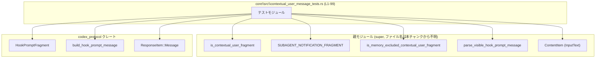
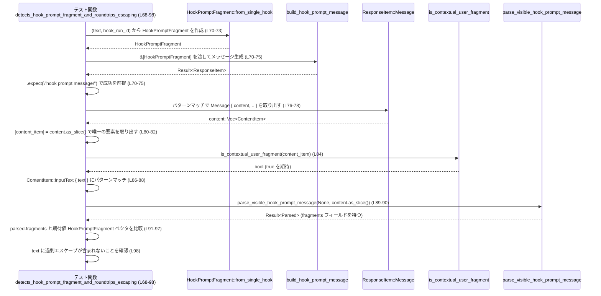

# core\src\contextual_user_message_tests.rs コード解説

---

## 0. ざっくり一言

このファイルは、「文脈付きユーザー入力（contextual user message）」に関するいくつかの関数・定数が **期待どおりに判定／分類／パースされるか** を確認するテスト群です（core\src\contextual_user_message_tests.rs:L6-99）。

---

## 1. このモジュールの役割

### 1.1 概要

このテストモジュールは、親モジュール（`super::*`）で定義されている以下のような機能の挙動を検証しています（core\src\contextual_user_message_tests.rs:L1, L8, L15, L24, L31, L59, L84, L89）。

- `is_contextual_user_fragment`  
  特定のテキストが「文脈付き（contextual）ユーザー断片」とみなされるかどうかの判定
- `SUBAGENT_NOTIFICATION_FRAGMENT`  
  サブエージェント通知断片を検出するためのフラグメント定義（`matches_text` メソッドで使用）
- `is_memory_excluded_contextual_user_fragment`  
  文脈付き断片のうち、「メモリには保存しない（memory-excluded）」べき断片かどうかの分類
- `parse_visible_hook_prompt_message`  
  Hook 用のプロンプトメッセージから、可視化されたフラグメント群をパースする機能

あわせて、`codex_protocol` クレートが提供する Hook プロンプト関連の型／関数との連携も検証しています（core\src\contextual_user_message_tests.rs:L2-4, L70-75, L93-96）。

### 1.2 アーキテクチャ内での位置づけ

このファイルはテスト用モジュールであり、アプリケーションの実際のロジックは親モジュールおよび `codex_protocol` クレート側にあります。

依存関係（テスト視点）の概略は次のとおりです。



すべてのテスト関数は `#[test]` 属性を持つ単体テストであり、並行処理や非同期実行は使用していません（core\src\contextual_user_message_tests.rs:L6, L13, L21, L29, L36, L68）。

### 1.3 設計上のポイント

コードから読み取れるテスト設計上の特徴は次のとおりです。

- **単機能テストの分割**  
  各テスト関数は 1 つの観点（環境コンテキスト検出、AGENTS 指示検出、サブエージェント通知検出、通常テキストの無視、メモリ除外分類、Hook プロンプトの往復）に限定されています（L6-11, L13-19, L21-27, L29-34, L36-66, L68-98）。
- **テーブル駆動テスト**  
  メモリ除外分類では、テキストと期待値の組の配列を用いて複数ケースを一括検証しています（L37-55, L57-65）。
- **パターンマッチングによる厳密な構造検証**  
  Hook プロンプトのテストでは、`ResponseItem::Message { content, .. }` や `ContentItem::InputText { text }` への `let` パターンマッチングに `else { panic!(...) }` を組み合わせることで、期待した構造でなければテストが失敗するようになっています（L76-82, L86-88）。
- **エスケープ／デエスケープの往復検証**  
  Hook プロンプトのテストでは、引用符や `<` を含む文字列が、送信時に適切にエスケープされ、パース後には元の文字列として復元されることを確認しています（L70-75, L93-98）。

---

## 2. 主要な機能・コンポーネント一覧

### 2.1 このファイルで定義されるテスト関数

| 名前 | 種別 | 役割 / テスト対象 | 行範囲 |
|------|------|------------------|--------|
| `detects_environment_context_fragment` | テスト関数 | `<environment_context>...</environment_context>` を `is_contextual_user_fragment` が検出することを確認 | core\src\contextual_user_message_tests.rs:L6-11 |
| `detects_agents_instructions_fragment` | テスト関数 | `# AGENTS.md` + `<INSTRUCTIONS>` ブロックをコンテキストとして検出することを確認 | L13-19 |
| `detects_subagent_notification_fragment_case_insensitively` | テスト関数 | `SUBAGENT_NOTIFICATION_FRAGMENT.matches_text` がタグ名の大文字／小文字に依存せずマッチすることを確認 | L21-27 |
| `ignores_regular_user_text` | テスト関数 | 通常の `"hello"` テキストはコンテキスト断片ではないと判定されることを確認 | L29-34 |
| `classifies_memory_excluded_fragments` | テスト関数 | コンテキスト断片のうち、どれがメモリ除外かを `is_memory_excluded_contextual_user_fragment` が正しく分類することを確認 | L36-66 |
| `detects_hook_prompt_fragment_and_roundtrips_escaping` | テスト関数 | Hook プロンプトメッセージがコンテキスト断片と認識され、かつエスケープされたテキストが元の文字列として復元されることを確認 | L68-98 |

### 2.2 このファイルから利用される主な外部コンポーネント

> これらは **このファイルには定義されておらず**、親モジュールまたは外部クレートからインポートされています。

| 名前 | 種別 | 所属 | このファイルでの役割 / 用途 | 行範囲 |
|------|------|------|-----------------------------|--------|
| `ContentItem::InputText` | 列挙体のバリアント（と推測） | 親モジュール (`super::*`) | ユーザー入力を表すコンテンツ要素として利用 | L8-10, L15-18, L31-33, L59-61, L86-88 |
| `is_contextual_user_fragment` | 関数 | 親モジュール | テキストが「文脈付きユーザー断片」かどうかを判定 | L8, L15, L31, L84 |
| `SUBAGENT_NOTIFICATION_FRAGMENT` | 定数 or 値オブジェクト（型はこのチャンクからは不明） | 親モジュール | `matches_text` によりサブエージェント通知断片かどうかを判定 | L24-25 |
| `is_memory_excluded_contextual_user_fragment` | 関数 | 親モジュール | 文脈付き断片のうちメモリから除外すべきものかどうかを判定 | L59-63 |
| `parse_visible_hook_prompt_message` | 関数 | 親モジュール | メッセージから HookPromptFragment 群をパース | L89-90 |
| `HookPromptFragment` | 構造体（と推測） | `codex_protocol::items` | Hook 実行 ID とテキストを持つフラグメント。`from_single_hook` 関数と `text` / `hook_run_id` フィールドが使われている | L2, L70-73, L93-96 |
| `build_hook_prompt_message` | 関数 | `codex_protocol::items` | Hook プロンプトフラグメント配列からメッセージ (`ResponseItem`) を構築 | L3, L70-75 |
| `ResponseItem::Message` | 列挙体バリアント（と推測） | `codex_protocol::models` | メッセージ型のレスポンスを表現し、その `content` をテスト側で検査 | L4, L76-78 |

---

## 3. 公開 API と詳細解説（テスト観点）

このファイルは **公開 API を定義していません** が、テスト関数は利用者にとっての「使用例」として重要です。ここではテスト関数ごとに、何を検証しているかを整理します。

### 3.1 型一覧（このファイルでの利用イメージ）

| 名前 | 種別 | 役割 / 用途 | 備考 |
|------|------|-------------|------|
| `ContentItem::InputText` | 列挙体バリアント（と推測） | プレーンテキスト入力をラップするコンテント要素。`text: String` フィールドを持つ | 実際の定義は親モジュール側（このチャンクには現れない） |
| `HookPromptFragment` | 構造体（と推測） | Hook 実行のテキストと ID を保持 | `from_single_hook` 関数と `text` / `hook_run_id` フィールドが存在することはコードから読み取れる（L70-73, L93-96） |
| `ResponseItem::Message` | 列挙体バリアント（と推測） | `content` を含むメッセージレスポンス | 他のバリアントやフィールドはこのチャンクには現れない |

---

### 3.2 テスト関数詳細

#### `detects_environment_context_fragment()`

**概要**

- `<environment_context>` タグで囲まれたテキストが、`is_contextual_user_fragment` によってコンテキスト断片として検出されることを確認します（L6-11）。

**引数**

- なし（テスト関数であり、外部入力は取りません）。

**戻り値**

- `()`（テストが成功すれば何も返さず終了、失敗すれば `assert!` によりパニック）。

**内部処理の流れ**

1. `ContentItem::InputText { text: ... }` を構築し、テキストフィールドに `<environment_context>\n<cwd>/tmp</cwd>\n</environment_context>` を設定します（L8-10）。
2. その参照を `is_contextual_user_fragment` に渡します（L8）。
3. 戻り値が真（`true`）であることを `assert!` で検証します（L8）。

**Errors / Panics**

- `is_contextual_user_fragment` が `false` を返した場合、`assert!` がパニックを起こしテストは失敗します（L8）。

**Edge cases（エッジケース）**

- このテストでは `<environment_context>` タグの単一ケースのみを検証しており、タグの欠落やネスト構造など他のケースについてはこのファイルからは分かりません。

**使用上の注意点（テスト観点）**

- テキストの改行やインデントを含んだ文字列をそのまま `text.to_string()` で渡しているため、`is_contextual_user_fragment` 実装は **生の文字列に対するパターンマッチ／パース** を行っていると考えられますが、詳細はこのチャンクには現れません。

---

#### `detects_agents_instructions_fragment()`

**概要**

- `# AGENTS.md instructions for /tmp` というヘッダと `<INSTRUCTIONS>...</INSTRUCTIONS>` ブロックを含むテキストを、コンテキスト断片として検出することを確認します（L13-19）。

**内部処理の流れ**

1. `ContentItem::InputText` に、AGENTS 用の説明と `<INSTRUCTIONS>` タグを含むテキストを設定します（L15-17）。
2. `is_contextual_user_fragment` に渡し、結果が `true` であることを `assert!` します（L15）。

**Errors / Panics**

- `is_contextual_user_fragment` が `false` を返す場合にパニックします（L15）。

**Edge cases**

- パスが `/tmp` 固定であること（L16）  
  → 違うパスでも同様に扱われるかどうかは、このテストからは分かりません。

---

#### `detects_subagent_notification_fragment_case_insensitively()`

**概要**

- サブエージェント通知を表す断片が、大文字・小文字を混在させていても `SUBAGENT_NOTIFICATION_FRAGMENT.matches_text` によって検出されることを確認します（L21-27）。

**内部処理の流れ**

1. 文字列 `"<SUBAGENT_NOTIFICATION>{}</subagent_notification>"` を `matches_text` に渡します（L24-25）。
2. 結果が `true` であることを `assert!` します（L23-26）。

**Errors / Panics**

- `matches_text` が `false` を返した場合、`assert!` によりパニックします（L23-26）。

**Edge cases**

- 開始タグは大文字、終了タグは小文字で記述されている点が重要です（L25）。  
  → これにより、`matches_text` がタグ名のケースインセンシティブな比較を行うことを期待していると解釈できます。

---

#### `ignores_regular_user_text()`

**概要**

- `"hello"` のような通常テキストがコンテキスト断片として誤検出されないことを確認します（L29-34）。

**内部処理の流れ**

1. `ContentItem::InputText { text: "hello".to_string() }` を構築します（L31-33）。
2. `is_contextual_user_fragment` に渡し、結果が `false` であることを `assert!(! ...)` で検証します（L31）。

**Errors / Panics**

- `is_contextual_user_fragment` が `true` を返した場合、`assert!(! ...)` によりパニックします（L31-33）。

**Edge cases**

- 短い単語のみを入力としたケースに対するテストであり、空文字列やその他の非コンテキストテキストについてはこのファイルからは分かりません。

---

#### `classifies_memory_excluded_fragments()`

**概要**

- いくつかの典型的なコンテキスト断片について、それぞれがメモリ除外対象かどうかを `is_memory_excluded_contextual_user_fragment` が正しく判定することを表形式で検証します（L36-66）。

**内部処理の流れ**

1. `(テキスト, 期待値)` のタプル配列 `cases` を定義します（L37-55）。
   - AGENTS 指示ブロック → `true`（メモリ除外）（L39-42）
   - `<skill>...</skill>` ブロック → `true`（L43-46）
   - `<environment_context>...</environment_context>` → `false`（L47-50）
   - `<subagent_notification>...</subagent_notification>` → `false`（L51-54）
2. `for (text, expected) in cases` で各ケースをループします（L57）。
3. 各テキストを `ContentItem::InputText` としてラップし、`is_memory_excluded_contextual_user_fragment` に渡します（L59-61）。
4. 戻り値が `expected` と一致することを `assert_eq!` で検証し、失敗時には 3 番目の引数 `"{text}"` がメッセージとして使われます（L58-64）。

**Errors / Panics**

- `is_memory_excluded_contextual_user_fragment` の結果と `expected` が一致しない場合、`assert_eq!` がパニックします（L58-64）。

**Edge cases**

- テキスト例から読み取れる想定:
  - **メモリ除外 (`true`)**: AGENTS 指示、skill 定義のように、ある種の「設定・スキル定義」のような情報（L39-46）。
  - **メモリに残す (`false`)**: 環境コンテキストやサブエージェントの進捗通知のように、その後の対話に関係するコンテキスト情報（L47-54）。
- 実際に「メモリ除外」とは何を意味するか（たとえば永続メモリに保存しない、など）は、このファイルからは分かりません。

---

#### `detects_hook_prompt_fragment_and_roundtrips_escaping()`

**概要**

- Hook プロンプト用のメッセージを構築し、それが
  1. コンテキスト断片として検出されること
  2. フラグメントに含まれる文字列がエスケープ／デエスケープ後も元どおりであること
- を同時に検証するテストです（L68-98）。

**内部処理の流れ（アルゴリズム）**

1. `HookPromptFragment::from_single_hook` に元のテキスト（`r#"Retry with "waves" & <tides>"#`）と Hook 実行 ID（`"hook-run-1"`）を渡してフラグメントを作成し、そのスライスを `build_hook_prompt_message` に渡します（L70-73）。
2. `build_hook_prompt_message` の結果に対し `.expect("hook prompt message")` を呼び、`Result` が `Err` の場合はパニックさせます（L70-75）。
3. 得られた `message` を `let ResponseItem::Message { content, .. } = message else { panic!(...) };` でパターンマッチし、`Message` バリアントであることと、`content` を取り出せることを確認します（L76-78）。
4. `content.as_slice()` が長さ 1 であることを `let [content_item] = content.as_slice() else { panic!(...) };` により確認し、唯一の `content_item` を取り出します（L80-82）。
5. 取り出した `content_item` がコンテキスト断片として認識されることを `assert!(is_contextual_user_fragment(content_item));` で検証します（L84）。
6. `content_item` が `ContentItem::InputText { text }` であることをパターンマッチで確認し、`text` を取り出します（L86-88）。
7. `parse_visible_hook_prompt_message(None, content.as_slice())` を呼び出し、`.expect("visible hook prompt")` で成功を前提とします（L89-90）。
8. 返された `parsed.fragments` が、元の HookPromptFragment（テキストと ID）のベクタと等しいことを `assert_eq!` で検証します（L91-97）。
9. 最後に、`text` に HTML エスケープされた形（`"&quot;waves&quot; & <tides>"`）が含まれていないことを `assert!(!text.contains(...))` で確認し、ユーザーに見えるテキストが過剰にエスケープされていないことを検証します（L98）。

**Errors / Panics**

- `build_hook_prompt_message` が `Err` を返した場合：`.expect("hook prompt message")` によりパニックします（L70-75）。
- `message` が `ResponseItem::Message` 以外のバリアントだった場合：`panic!("expected hook prompt response item")` が発火します（L76-78）。
- `content` の要素数が 1 でない場合：`panic!("expected a single content item")` が発火します（L80-82）。
- `content_item` が `ContentItem::InputText` バリアントでない場合：`panic!("expected input text content item")` が発火します（L86-88）。
- `parse_visible_hook_prompt_message` が `Err` を返した場合：`.expect("visible hook prompt")` によりパニックします（L89-90）。
- `parsed.fragments` が期待した `HookPromptFragment` ベクタと一致しない場合：`assert_eq!` によりパニックします（L91-97）。
- `text` 内に `&quot;waves&quot; & <tides>` が含まれる場合：最後の `assert!(!...)` によりパニックします（L98）。

**Edge cases**

- 入力テキストにはダブルクォート（`"`）、アンパサンド（`&`）、小なり記号（`<`）が含まれます（L71-72）。
  - これらは HTML / XML 文脈でエスケープが必要になる文字であり、実装がどの段階でどのようにエスケープするかを間接的に検証しています。
- Hook 実行 ID が `"hook-run-1"` で固定されている点から、複数 Hook の扱いについてはこのファイルからは分かりません（L72, L95-96）。

**使用上の注意点（言語・安全性の観点）**

- Rust のパターンマッチング（`let ResponseItem::Message { content, .. } = message else { ... }` や `let [content_item] = content.as_slice() else { ... }`）を使うことで、「期待している形でなければ即座にパニックさせる」という **テスト向きの安全性** を確保しています（L76-82, L86-88）。
- テストコードなので `.expect` や `panic!` の多用は許容される設計です。実運用コードでは、これらを `Result` / `Option` ベースでハンドリングする必要がある点に注意が必要です。

---

### 3.3 その他の関数

このファイルには補助関数やユーティリティ関数は定義されていません。すべてが `#[test]` 付きのテスト関数です（L6, L13, L21, L29, L36, L68）。

---

## 4. データフロー

### 4.1 Hook プロンプト処理のデータフロー（テスト視点）

`detects_hook_prompt_fragment_and_roundtrips_escaping` におけるデータの流れを図示します（L68-98）。



この図から分かる通り、Hook プロンプト関連の処理では

- **生成 → シリアライズ → パース → 比較**

という一連の往復（ラウンドトリップ）がテストされています（L70-75, L89-97）。

---

## 5. 使い方（How to Use）― テストから読み取れる利用方法

### 5.1 `is_contextual_user_fragment` の基本的な使い方

このテストファイルは、`is_contextual_user_fragment` の利用例として機能します（L8, L15, L31, L84）。

```rust
// 文脈付きコンテキストを含むテキスト
let item = ContentItem::InputText {
    text: "<environment_context>\n<cwd>/tmp</cwd>\n</environment_context>".to_string(),
};

// 文脈付き断片かどうかを判定する
let is_context = is_contextual_user_fragment(&item);

// テストでは true であることを期待している
assert!(is_context);
```

- `ContentItem::InputText` を通じてプレーンテキストをラップし、**参照** を `is_contextual_user_fragment` に渡す形になっています（L8-10, L15-18, L31-33, L84-88）。
- 所有権（Ownership）の観点では、`ContentItem` の所有権はテスト関数内にあり、関数側は借用（Borrowing）で読み取る設計と推測できますが、実際のシグネチャはこのチャンクには現れません。

### 5.2 メモリ除外判定の利用パターン

`is_memory_excluded_contextual_user_fragment` のテストからは、次のような利用パターンが読み取れます（L59-63）。

```rust
let item = ContentItem::InputText {
    text: "# AGENTS.md instructions for /tmp\n\n<INSTRUCTIONS>\nbody\n</INSTRUCTIONS>".to_string(),
};

let excluded = is_memory_excluded_contextual_user_fragment(&item);
// このケースでは true を期待（AGENTS 指示はメモリに保存しない）
assert!(excluded);
```

- テキストの内容に応じて、**メモリに保存しないべきコンテキスト** とそうでないものを区別する用途があると考えられますが、具体的な保存ロジックはこのチャンクには現れません。

### 5.3 よくある誤用パターン（推測できる範囲）

テストコードから、次のような誤用が起こりうると考えられます。

```rust
// 誤りの可能性: プレーンな &str を直接渡そうとする（実際のシグネチャはこのチャンクにはないが）
let text = "<environment_context>...</environment_context>";
// let ok = is_contextual_user_fragment(text); // こうではなく

// テストが示す正しい使い方: ContentItem::InputText に包む
let item = ContentItem::InputText { text: text.to_string() };
let ok = is_contextual_user_fragment(&item);
```

- テストが一貫して `ContentItem::InputText` を使っていることから、API 利用時にも同様にコンテント型で包む必要があると解釈できます（L8-10, L15-18, L31-33, L59-61, L86-88）。

---

## 6. 変更の仕方（テストを拡張・修正する場合）

### 6.1 新しいコンテキスト種類を追加する場合

新しい種類の「文脈付きユーザー断片」を親モジュールに追加した場合、テスト側では次のような変更が自然です。

1. その断片形式を表すテキストサンプルを用意する。
2. 以下のどちらか、または両方を追加する。
   - `is_contextual_user_fragment` が `true` を返すことを検証するテストを追加（`detects_*` 系の関数に倣う）（L6-19）。
   - それがメモリ除外かどうかを `classifies_memory_excluded_fragments` の `cases` に追加する（L37-55）。
3. テスト名は既存の命名に合わせて、何を検出・分類するかが分かるようにする（L6, L13, L21, L29, L36, L68）。

### 6.2 既存の分類ロジックを変更する場合

たとえば、「skill 定義はメモリに保持したい」という仕様変更があった場合：

- `classifies_memory_excluded_fragments` の `cases` 配列内の該当エントリの期待値を変更し（L43-46）、実装もそれに合わせて修正する必要があります。
- 影響範囲を確認するには、`is_memory_excluded_contextual_user_fragment` の呼び出し箇所をコードベース全体から検索する必要がありますが、その位置はこのチャンクからは分かりません。

---

## 7. 関連ファイル・モジュール

| パス / モジュール | 役割 / 関係 |
|-------------------|------------|
| 親モジュール（`super`, 具体的なファイル名はこのチャンクには現れない） | `ContentItem`, `is_contextual_user_fragment`, `SUBAGENT_NOTIFICATION_FRAGMENT`, `is_memory_excluded_contextual_user_fragment`, `parse_visible_hook_prompt_message` など本テストの対象となる機能を提供する（L1, L8, L15, L24, L31, L59, L84, L89） |
| `codex_protocol::items` | `HookPromptFragment`, `build_hook_prompt_message` を提供し、Hook プロンプト関連の処理に利用される（L2-3, L70-75, L93-96） |
| `codex_protocol::models::ResponseItem` | レスポンスメッセージ型を提供し、Hook プロンプトメッセージの内容を検証するために使用される（L4, L76-78） |

---

### 安全性・エラー・並行性のまとめ（このファイルに現れる範囲）

- **安全性（Rust 言語機能）**
  - すべてのデータアクセスは所有権／借用ルールに従っており、生ポインタや `unsafe` は使用していません（ファイル全体）。
  - `let ... else { panic! }` 構文を用いたパターンマッチにより、想定外のバリアントや配列長に対して即座に検出・失敗できるようになっています（L76-82, L86-88）。

- **エラーハンドリング**
  - テストでは `.expect(...)` と `assert!` / `assert_eq!` / `panic!` を使用して、すべてのエラーを「テスト失敗」として扱います（L70-75, L76-78, L80-82, L86-88, L89-90, L58-64）。
  - これは単体テストとして一般的なパターンであり、実運用コードでのエラー処理ポリシーはこのチャンクには現れません。

- **並行性**
  - `async` 関数、スレッド、ロック、チャネルなどの並行・並列処理機構は一切使用されていません（ファイル全体）。  
    したがって、このファイルから並行性に関する設計は読み取れません。
