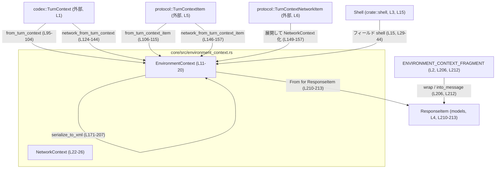
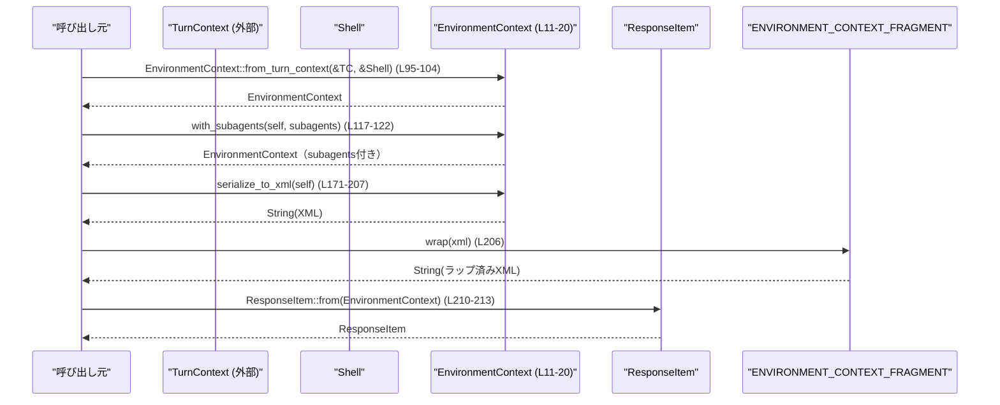

# core/src/environment_context.rs コード解説

## 0. ざっくり一言

`EnvironmentContext` は、現在の作業ディレクトリ・シェル・日付/タイムゾーン・ネットワーク許可ドメインなど「実行環境」を表現し、それを XML 文字列や `ResponseItem` に変換するためのユーティリティです（`core/src/environment_context.rs:L11-20`, `L171-207`, `L210-213`）。

---

## 1. このモジュールの役割

### 1.1 概要

- このモジュールは、**1ターン分の実行環境情報**をまとめて扱うための `EnvironmentContext` 構造体を提供します（`L11-20`）。
- `TurnContext` / `TurnContextItem` から環境情報を抽出・差分計算し、XML に直列化してプロトコル用の `ResponseItem` に変換する役割を持ちます（`L66-93`, `L95-115`, `L171-207`, `L210-213`）。
- ネットワーク関連設定（許可/拒否ドメイン）は内部の `NetworkContext` に集約されます（`L22-26`, `L124-157`）。

### 1.2 アーキテクチャ内での位置づけ

`TurnContext` / `TurnContextItem` と、外部プロトコルの `ResponseItem` の間をつなぐアダプタ的な位置づけです。



### 1.3 設計上のポイント

- **不変データの集約**  
  - `EnvironmentContext` は `Clone` 可能な値オブジェクトで、フィールドはすべて通常の所有型 or `Option` です（`L11-19`, `L22-25`）。
  - 内部可変性や `unsafe` は使われていません（ファイル全体確認）。
- **差分表現**  
  - `diff_from_turn_context_item` では、前後の `TurnContext` を比較し、変化した `cwd` とネットワーク設定のみを `Some` にすることで「差分環境」を表現します（`L66-93`）。
- **XML 直列化を手書き**  
  - XML ライブラリの制約を避けるため、`serialize_to_xml` は文字列連結で XML を構築します（`L160-170`, `L171-207`）。
- **ネットワーク設定の取り出しを分離**  
  - `TurnContext` と `TurnContextItem` からネットワーク関連情報を抽出する処理は、プライベート関数に切り出されています（`L124-144`, `L146-157`）。
- **プロトコル統合**  
  - XML 文字列は `ENVIRONMENT_CONTEXT_FRAGMENT` によってラップされ、`ResponseItem` に変換されます（`L206`, `L210-213`）。

---

## 2. 主要な機能一覧

- 実行環境の表現: `EnvironmentContext` 構造体で cwd, shell, 日付, タイムゾーン, ネットワーク, サブエージェント情報を保持（`L11-19`）
- ネットワーク環境の表現: 許可/拒否ドメインを保持する `NetworkContext` 構造体（`L22-26`）
- 環境コンテキストの生成:
  - 任意の値からの生成 `EnvironmentContext::new`（`L29-45`）
  - `TurnContext` からの生成 `from_turn_context`（`L95-104`）
  - `TurnContextItem` からの生成 `from_turn_context_item`（`L106-115`）
- 環境の比較・差分:
  - シェルを無視した比較 `equals_except_shell`（`L47-64`）
  - `TurnContextItem` と `TurnContext` 間の差分環境生成 `diff_from_turn_context_item`（`L66-93`）
- サブエージェント情報の付加: `with_subagents`（`L117-122`）
- ネットワーク設定の抽出:
  - 実行時コンテキストから `network_from_turn_context`（`L124-144`）
  - プロトコルコンテキストから `network_from_turn_context_item`（`L146-157`）
- XML / ResponseItem への変換:
  - XML 文字列への直列化 `serialize_to_xml`（`L171-207`）
  - `ResponseItem` への変換 `impl From<EnvironmentContext> for ResponseItem`（`L210-213`）

### 2.1 コンポーネントインベントリー（構造体・関数一覧）

| 名前 | 種別 | 公開範囲 | 定義位置 | 概要 |
|------|------|----------|----------|------|
| `EnvironmentContext` | 構造体 | `pub(crate)` | `environment_context.rs:L11-20` | 実行環境の集約（cwd, shell, 日付, timezone, network, subagents） |
| `NetworkContext` | 構造体 | `pub(crate)` | `L22-26` | ネットワーク許可/拒否ドメインの集約 |
| `EnvironmentContext::new` | 関数 | `pub` | `L29-45` | 各フィールドを引数からセットしてインスタンスを生成 |
| `EnvironmentContext::equals_except_shell` | 関数 | `pub` | `L47-64` | shell フィールドを無視して 2 つのコンテキストを比較 |
| `EnvironmentContext::diff_from_turn_context_item` | 関数 | `pub` | `L66-93` | `before`/`after` の差分から新しい `EnvironmentContext` を構築 |
| `EnvironmentContext::from_turn_context` | 関数 | `pub` | `L95-104` | `TurnContext` からフルな `EnvironmentContext` を構築 |
| `EnvironmentContext::from_turn_context_item` | 関数 | `pub` | `L106-115` | `TurnContextItem` からフルな `EnvironmentContext` を構築 |
| `EnvironmentContext::with_subagents` | 関数 | `pub` | `L117-122` | サブエージェント情報（文字列）を設定（空文字は無視） |
| `EnvironmentContext::network_from_turn_context` | 関数 | `fn`（プライベート） | `L124-144` | `TurnContext` の設定から `NetworkContext` を組み立て |
| `EnvironmentContext::network_from_turn_context_item` | 関数 | `fn`（プライベート） | `L146-157` | `TurnContextItem` の `network` フィールドから `NetworkContext` を組み立て |
| `EnvironmentContext::serialize_to_xml` | 関数 | `pub` | `L160-207` | 自身を XML 文字列に直列化 |
| `From<EnvironmentContext> for ResponseItem::from` | 関数 | `pub`（トレイト実装） | `L210-213` | `EnvironmentContext` を XML に変換し `ResponseItem` を生成 |

---

## 3. 公開 API と詳細解説

### 3.1 型一覧（構造体）

| 名前 | 種別 | 役割 / 用途 | 主なフィールド |
|------|------|-------------|----------------|
| `EnvironmentContext` | 構造体 | 実行環境のメタ情報を集約する値オブジェクト（`L11-20`） | `cwd: Option<PathBuf>`, `shell: Shell`, `current_date: Option<String>`, `timezone: Option<String>`, `network: Option<NetworkContext>`, `subagents: Option<String>` |
| `NetworkContext` | 構造体 | 許可/拒否ドメインのリストを保持し、ネットワークアクセス制約を表現（`L22-26`） | `allowed_domains: Vec<String>`, `denied_domains: Vec<String>` |

### 3.2 重要な関数詳細（7件）

#### `EnvironmentContext::new(cwd, shell, current_date, timezone, network, subagents) -> EnvironmentContext`  （`core/src/environment_context.rs:L29-45`）

**概要**

- 各フィールドを引数で指定して `EnvironmentContext` を生成します（`L37-44`）。

**引数**

| 引数名 | 型 | 説明 |
|--------|----|------|
| `cwd` | `Option<PathBuf>` | カレントディレクトリ。`None` の場合は「未指定」または「前回から変更なし」を意味します。 |
| `shell` | `Shell` | 利用中のシェル（例: bash, zsh）。`Shell` の詳細はこのファイルにはありません。 |
| `current_date` | `Option<String>` | 現在日付（フォーマットはこのファイルからは不明）。 |
| `timezone` | `Option<String>` | タイムゾーン（例: `"UTC"`, `"Asia/Tokyo"` などと推測されますが、形式はコードからは不明）。 |
| `network` | `Option<NetworkContext>` | ネットワーク許可/拒否ドメイン情報。`None` ならネットワーク要件が未設定。 |
| `subagents` | `Option<String>` | サブエージェント情報を表す文字列（複数行想定、`serialize_to_xml` 参照, `L201-205`）。 |

**戻り値**

- 指定された値をそのままフィールドに持つ `EnvironmentContext`（`L37-44`）。

**内部処理の流れ**

- 引数をフィールドに対応させたリテラルで `Self` を構築するだけの単純なコンストラクタです（`L37-44`）。

**Examples（使用例）**

```rust
use std::path::PathBuf;
use crate::shell::Shell;                              // Shell 型をインポート（定義は別モジュール）

fn build_env(shell: Shell) -> crate::environment_context::EnvironmentContext {
    // 現在のディレクトリを Some として設定
    let cwd = Some(PathBuf::from("/workspace"));      // "/workspace" をカレントディレクトリとして指定
    // ネットワークは未設定（None）
    let network = None;                               // ネットワーク制約を指定しない

    crate::environment_context::EnvironmentContext::new(
        cwd,                                          // cwd
        shell,                                        // shell
        Some("2024-04-01".to_string()),               // current_date
        Some("UTC".to_string()),                      // timezone
        network,                                      // network
        None,                                         // subagents
    )
}
```

**Errors / Panics**

- エラーや panic を発生させる処理はありません。単純な構造体初期化のみです。

**Edge cases（エッジケース）**

- `cwd = None` の場合、XML 直列化時に `<cwd>` 要素は出力されません（`L173-175`）。
- `current_date` / `timezone` / `network` / `subagents` も `None` の場合、それぞれの XML 要素が出力されません（`L179-205`）。

**使用上の注意点**

- `serialize_to_xml(self)` は `self` を消費するため、`EnvironmentContext` を再利用したい場合は `clone()` してから渡す必要があります（`L171`）。

---

#### `EnvironmentContext::equals_except_shell(&self, other: &EnvironmentContext) -> bool`  （`L47-64`）

**概要**

- `shell` フィールドを除外して 2 つの `EnvironmentContext` が等しいかを判定します（`L47-49`）。

**引数**

| 引数名 | 型 | 説明 |
|--------|----|------|
| `self` | `&EnvironmentContext` | 比較対象その1。 |
| `other` | `&EnvironmentContext` | 比較対象その2。 |

**戻り値**

- `bool`: `cwd`, `current_date`, `timezone`, `network`, `subagents` が全て等しければ `true`（`L59-63`）。

**内部処理の流れ**

- `other` をフィールドごとに分解し、`shell` フィールドだけ `_` に束縛して無視します（`L51-58`）。
- `self` の各フィールドと `other` の各フィールドを == で比較し、論理積でまとめて返します（`L59-63`）。

**Examples**

```rust
use crate::environment_context::EnvironmentContext;

// env1 と env2 は shell が違っても、他のフィールドが同じであれば true になる例
fn compare_env(env1: &EnvironmentContext, env2: &EnvironmentContext) -> bool {
    env1.equals_except_shell(env2)                    // shell を無視した比較
}
```

**Errors / Panics**

- フィールド比較のみであり、panic 要因はありません。

**Edge cases**

- `network` や `subagents` が `None` / `Some` の違いも比較対象に含まれます（`L59-63`）。
- `shell` が全く異なる場合でも、他フィールドが同一なら `true` になります（仕様としてコードに明示, `L47-49`）。

**使用上の注意点**

- 「シェルは初期ターンでのみ決まり、その後は変更不可」という前提での比較に使われることがコメントから読み取れます（`L47-49`）。
- シェルの違いも検出したい場合は、この関数ではなく通常の `==`（`PartialEq` 派生, `L11-12`）を使う必要があります。

---

#### `EnvironmentContext::diff_from_turn_context_item(before, after, shell) -> EnvironmentContext`  （`L66-93`）

**概要**

- 前回ターンを表す `TurnContextItem` と、現在の `TurnContext` の差分から、新しい `EnvironmentContext` を構築します。
- `cwd` とネットワーク設定は変化があった場合のみ `Some` として設定し、それ以外は省略される可能性があります（`L71-84`）。

**引数**

| 引数名 | 型 | 説明 |
|--------|----|------|
| `before` | `&TurnContextItem` | 以前のターンの情報。cwd やネットワーク設定を含む（`L66-68`）。 |
| `after` | `&TurnContext` | 現在のターン情報（`L66-69`）。 |
| `shell` | `&Shell` | 利用中のシェル（`L66-70`）。 |

**戻り値**

- `EnvironmentContext`: 差分を表す環境コンテキスト。`cwd` や `network` は変更時のみ `Some` になりえます（`L71-92`）。

**内部処理の流れ**

1. `before` / `after` からネットワーク設定を抽出（`network_from_turn_context_item`, `network_from_turn_context` を使用, `L71-72`）。
2. `cwd` は `before.cwd` と `after.cwd` を比較し（`L73`）、異なる場合のみ `Some(after.cwd.clone())` を設定、同じなら `None` とします（`L73-77`）。
3. `current_date`, `timezone` は常に `after` 側をクローンして使用します（`L78-79`）。
4. ネットワーク設定が異なる場合は `after_network`、同じ場合は `before_network` を採用します（`L80-84`）。
5. 上記の値と `shell.clone()` を使って `EnvironmentContext::new` でインスタンスを生成します（`L85-92`）。`subagents` は常に `None` で初期化されます（`L91`）。

**Examples**

```rust
use crate::environment_context::EnvironmentContext;
use crate::codex::TurnContext;
use codex_protocol::protocol::TurnContextItem;
use crate::shell::Shell;

// before: 前ターン, after: 現在ターン から差分環境を作る例
fn diff_env(before: &TurnContextItem, after: &TurnContext, shell: &Shell) -> EnvironmentContext {
    EnvironmentContext::diff_from_turn_context_item(before, after, shell)
}
```

**Errors / Panics**

- この関数内では panic を起こすような操作はありません。
- `network_from_turn_context` / `_item` で `?` 演算子を使用していますが（`L130`, `L152`）、これは `Option` に対するものであり、`None` を返すだけです。

**Edge cases**

- `before.cwd` と `after.cwd` が同じ場合、`cwd` は `None` となり、XML 出力でも `<cwd>` が含まれません（`L73-77`, `L173-175`）。
- ネットワーク設定が両方 `None` の場合、`network` も `None` となり、`<network>` 要素は出力されません（`L80-84`, `L185-200`）。
- `current_date` と `timezone` は差分ではなく常に最新の値（`after`）が入るため、差分表現というより「最新値」となります（`L78-79`）。

**使用上の注意点**

- 差分表現であることから、`cwd` や `network` が `None` であっても「情報なし」ではなく「前回から変化なし」を意味する可能性があります。その解釈は呼び出し側プロトコル仕様に依存します（仕様はこのファイルからは不明）。
- `shell` は引数から常にコピーされるため、`before` / `after` とは無関係です（`L85-88`）。

---

#### `EnvironmentContext::from_turn_context(turn_context, shell) -> EnvironmentContext`  （`L95-104`）

**概要**

- 実行中の `TurnContext` から現在の環境をそのまま `EnvironmentContext` に変換します。

**引数**

| 引数名 | 型 | 説明 |
|--------|----|------|
| `turn_context` | `&TurnContext` | 現在の実行コンテキスト。cwd, 日付, タイムゾーン, 設定などを持つ（`L95`）。 |
| `shell` | `&Shell` | 利用中のシェル（`L95`）。 |

**戻り値**

- `EnvironmentContext`: フルな環境情報（cwd を含む）を表すインスタンス（`L96-103`）。

**内部処理の流れ**

- `turn_context.cwd` を `PathBuf` として複製し `Some` に包む（`L97`）。
- `shell` を `clone` して設定（`L98`）。
- `current_date` と `timezone` をクローンして設定（`L99-100`）。
- `network_from_turn_context` でネットワーク設定を抽出（`L101`, `L124-144`）。
- `subagents` は `None` で初期化（`L102`）。

**Examples**

```rust
use crate::environment_context::EnvironmentContext;
use crate::codex::TurnContext;
use crate::shell::Shell;

// 現在の TurnContext から完全な環境を取り出す例
fn current_env(turn_context: &TurnContext, shell: &Shell) -> EnvironmentContext {
    EnvironmentContext::from_turn_context(turn_context, shell)
}
```

**Errors / Panics**

- `network_from_turn_context` 内で `?` が使われているため、ネットワーク設定がなければ `network` は `None` となりますが、エラーや panic にはなりません（`L124-131`）。

**Edge cases**

- `turn_context.config.config_layer_stack.requirements().network` が `None` の場合、`network` は `None` になります（`L124-131`）。
- `turn_context.current_date` / `timezone` が `None` の場合、そのまま `None` が反映されます（`L99-100`）。

**使用上の注意点**

- 差分ではなく「完全なスナップショット」を作る用途に向きます。差分が必要な場合は `diff_from_turn_context_item` を利用する必要があります。

---

#### `EnvironmentContext::from_turn_context_item(turn_context_item, shell) -> EnvironmentContext`  （`L106-115`）

**概要**

- プロトコル層の `TurnContextItem` から `EnvironmentContext` を再構築します。

**引数**

| 引数名 | 型 | 説明 |
|--------|----|------|
| `turn_context_item` | `&TurnContextItem` | プロトコル上で表現されたターン情報（`L106-107`）。 |
| `shell` | `&Shell` | 利用するシェル情報（`L106-107`）。 |

**戻り値**

- `EnvironmentContext`: `TurnContextItem` に基づく環境情報（`L107-114`）。

**内部処理の流れ**

- `turn_context_item.cwd.clone()` を `Some` に入れて設定（`L108`）。
- `shell.clone()` を設定（`L109`）。
- 日付とタイムゾーンをクローンして設定（`L110-111`）。
- `network_from_turn_context_item` でネットワーク設定を抽出（`L112`, `L146-157`）。
- `subagents` は `None` で初期化（`L113`）。

**Examples**

```rust
use crate::environment_context::EnvironmentContext;
use codex_protocol::protocol::TurnContextItem;
use crate::shell::Shell;

// プロトコルから受信した TurnContextItem から環境を復元する例
fn env_from_item(item: &TurnContextItem, shell: &Shell) -> EnvironmentContext {
    EnvironmentContext::from_turn_context_item(item, shell)
}
```

**Errors / Panics**

- `turn_context_item.network` が `None` の場合には `network` は `None` になりますが、エラーにはなりません（`L149-152`）。

**Edge cases**

- `turn_context_item.network` が存在しない（`None`）場合、`network` は `None` となり XML に `<network>` は出力されません（`L149-152`, `L185-200`）。

**使用上の注意点**

- 元の `TurnContextItem` の構造に強く依存しており、そのスキーマ変更時にはこの関数も合わせて修正が必要になります。

---

#### `EnvironmentContext::with_subagents(self, subagents: String) -> EnvironmentContext`  （`L117-122`）

**概要**

- `EnvironmentContext` にサブエージェント情報文字列を設定した新しいインスタンスを返します。
- 空文字列が渡された場合は、`subagents` は変更されません（`L118-120`）。

**引数**

| 引数名 | 型 | 説明 |
|--------|----|------|
| `self` | `EnvironmentContext`（所有権） | 元の環境。ムーブされ、必要に応じて `subagents` が上書きされます。 |
| `subagents` | `String` | サブエージェント情報。複数行を含む文字列が想定されます（`serialize_to_xml` 参照, `L201-205`）。 |

**戻り値**

- `EnvironmentContext`: `subagents` が設定済み、または未変更の新しいインスタンス（`L121`）。

**内部処理の流れ**

- `self` を `mut` で受け取り、`subagents` が空でない場合に `self.subagents = Some(subagents)` を実行（`L117-120`）。
- その後 `self` を返します（`L121`）。

**Examples**

```rust
use crate::environment_context::EnvironmentContext;

// 既存の環境にサブエージェント情報を追加する例
fn add_subagents(env: EnvironmentContext) -> EnvironmentContext {
    let subagents = "agent-a\nagent-b".to_string();   // 2行のサブエージェント情報
    env.with_subagents(subagents)                     // subagents フィールドを設定した新しい EnvironmentContext を返す
}
```

**Errors / Panics**

- エラーや panic はありません。

**Edge cases**

- `subagents` が空文字列 (`""`) の場合、`subagents` フィールドは変更されません（`L118-120`）。
  - もともと `None` なら `None` のまま、`Some` なら元の値が維持されます。

**使用上の注意点**

- `self` の所有権を消費する API なので、呼び出し後も同じインスタンスを他で使いたい場合は `clone()` が必要です。

---

#### `EnvironmentContext::serialize_to_xml(self) -> String`  （`L160-207`）

**概要**

- `EnvironmentContext` の内容を XML 文字列としてシリアライズします。
- `ENVIRONMENT_CONTEXT_FRAGMENT.wrap` によって、ルートタグなどを含む XML フラグメントに整形されます（`L206`）。

**引数**

| 引数名 | 型 | 説明 |
|--------|----|------|
| `self` | `EnvironmentContext`（所有権） | シリアライズ対象の環境。呼び出し後は消費されます（`L171`）。 |

**戻り値**

- `String`: XML 形式の文字列（`L171-207`）。

**内部処理の流れ**

1. `lines: Vec<String>` を初期化（`L172`）。
2. `cwd` が `Some` なら `<cwd>...</cwd>` 行を追加（`L173-175`）。
3. `shell.name()` を取得し `<shell>...</shell>` 行を追加（`L177-178`）。
4. `current_date` が `Some` なら `<current_date>...</current_date>` を追加（`L179-180`）。
5. `timezone` が `Some` なら `<timezone>...</timezone>` を追加（`L182-183`）。
6. `network` が `Some` の場合（`match` の `Some` 分岐, `L185-195`）:
   - `<network enabled="true">` を追加（`L187`）。
   - 各 `allowed_domains` に `<allowed>...</allowed>` 行を追加（`L188-190`）。
   - 各 `denied_domains` に `<denied>...</denied>` 行を追加（`L191-193`）。
   - `</network>` を追加（`L194`）。
   - `None` の場合は何も出力しません（`L196-200`）。
7. `subagents` が `Some` なら `<subagents>` タグを出力し、文字列中の各行にインデントを付けて出力してから `</subagents>` で閉じます（`L201-205`）。
8. すべての `lines` を改行で結合し、`ENVIRONMENT_CONTEXT_FRAGMENT.wrap` でラップして返します（`L206`）。

**Examples**

```rust
use crate::environment_context::EnvironmentContext;
use crate::shell::Shell;

// EnvironmentContext を XML 文字列に変換する例
fn env_to_xml(env: EnvironmentContext) -> String {
    let xml = env.serialize_to_xml();                 // EnvironmentContext が消費され、XML 文字列が返る
    xml
}
```

**Errors / Panics**

- `format!` や `to_string_lossy` など、通常 panic しない APIs を利用しており、この関数内に明示的な panic 要因はありません（`L173-175`, `L177-193`）。
- 文字列の内容によって XML として不正になる可能性はありますが、その場合も Rust のレベルではエラーにはなりません（XML ライブラリでの検証があれば別）。

**Edge cases**

- すべてのフィールドが `None`（`cwd`, `current_date`, `timezone`, `network`, `subagents`）の場合、`<shell>` だけが出力されます（`L177-178`）。
- パスや文字列中に `&`, `<`, `>` などの XML 特殊文字が含まれていてもエスケープされません（`L173-175`, `L179-183`, `L188-193`）。
- `subagents` の各行はそのまま出力されるため、インデント以外の整形は行われません（`L201-204`）。

**使用上の注意点**

- **XML エスケープが行われていない**ため、フィールド値に `<` や `&`、`"` などが含まれると XML として正しくない文字列になる可能性があります。値が外部入力由来かどうかに関わらず、XML パーサ側での扱いに注意が必要です。
- `self` を消費するため、同じ `EnvironmentContext` を `ResponseItem` とその他用途で併用する場合は、`clone()` でコピーを作る必要があります。

---

### 3.3 その他の関数・トレイト実装

| 関数名 / 実装 | 役割 | 定義位置 |
|---------------|------|----------|
| `EnvironmentContext::network_from_turn_context(turn_context: &TurnContext) -> Option<NetworkContext>` | `TurnContext` の設定 (`config_layer_stack.requirements().network`) から `NetworkContext` を組み立てるヘルパー。`network` または `network.domains` が `None` の場合は `None` を返します（`L124-144`）。 | `L124-144` |
| `EnvironmentContext::network_from_turn_context_item(turn_context_item: &TurnContextItem) -> Option<NetworkContext>` | `TurnContextItem.network: Option<TurnContextNetworkItem>` から `NetworkContext` を構築。`as_ref()?` により `None` の場合はそのまま `None` を返します（`L146-157`）。 | `L146-157` |
| `impl From<EnvironmentContext> for ResponseItem` | `EnvironmentContext` を XML に変換し、`ENVIRONMENT_CONTEXT_FRAGMENT.into_message` で `ResponseItem` を生成（`L210-213`）。 | `L210-213` |

---

## 4. データフロー

ここでは、`TurnContext` から環境を構築し、XML を経て `ResponseItem` に変換する典型的なフローを示します。



要点:

- `from_turn_context` で「フルスナップショット」の `EnvironmentContext` を生成します（`L95-104`）。
- 必要に応じて `with_subagents` でサブエージェント情報を追加します（`L117-122`）。
- `serialize_to_xml` で XML に変換し、`ENVIRONMENT_CONTEXT_FRAGMENT.wrap` によってプロトコルに適したフラグメントに整形されます（`L171-207`）。
- `From<EnvironmentContext> for ResponseItem` 実装により、`ResponseItem::from(env)` と書くだけで XML 生成とラップが行われます（`L210-213`）。

---

## 5. 使い方（How to Use）

### 5.1 基本的な使用方法

`TurnContext` から `EnvironmentContext` を作成し、`ResponseItem` に変換する基本フローの例です。

```rust
use crate::codex::TurnContext;                             // 実行中のコンテキスト
use crate::environment_context::EnvironmentContext;        // このファイルで定義される構造体
use crate::shell::Shell;                                   // シェル情報
use codex_protocol::models::ResponseItem;                  // レスポンスモデル

fn build_env_response(turn_context: &TurnContext, shell: &Shell) -> ResponseItem {
    // 1. TurnContext から EnvironmentContext を構築
    let env = EnvironmentContext::from_turn_context(turn_context, shell);   // L95-104

    // 2. 必要ならサブエージェント情報を追加
    let env = env.with_subagents("agent-a\nagent-b".to_string());          // L117-122

    // 3. EnvironmentContext から ResponseItem を生成
    let response: ResponseItem = env.into();                               // L210-213

    response
}
```

### 5.2 よくある使用パターン

1. **差分送信用の環境コンテキスト**

   ```rust
   use crate::environment_context::EnvironmentContext;
   use crate::codex::TurnContext;
   use codex_protocol::protocol::TurnContextItem;
   use crate::shell::Shell;

   // 前回ターン (before) と現在ターン (after) から差分環境を作成するパターン
   fn diff_env_response(
       before: &TurnContextItem,
       after: &TurnContext,
       shell: &Shell,
   ) -> EnvironmentContext {
       EnvironmentContext::diff_from_turn_context_item(before, after, shell)  // L66-93
   }
   ```

2. **XML だけが必要な場合**

   ```rust
   use crate::environment_context::EnvironmentContext;

   // EnvironmentContext を XML 文字列として利用するパターン
   fn env_xml(env: EnvironmentContext) -> String {
       env.serialize_to_xml()                                               // L171-207
   }
   ```

### 5.3 よくある間違いと正しいパターン

```rust
use crate::environment_context::EnvironmentContext;
use crate::shell::Shell;

// 間違い例: serialize_to_xml を呼んだあとで env を再利用しようとしている
fn wrong_reuse(env: EnvironmentContext) {
    let _xml = env.serialize_to_xml();           // ここで env は消費される (L171)
    // println!("{:?}", env);                   // コンパイルエラー: move 後に使用
}

// 正しい例: clone してからシリアライズする
fn correct_reuse(env: EnvironmentContext) {
    let xml = env.clone().serialize_to_xml();    // clone したコピーを消費する
    println!("{}", xml);                         // XML を表示
    println!("{:?}", env);                       // 元の env はまだ使える
}
```

もう一つの典型的な注意点は、`with_subagents` が空文字列を無視する点です：

```rust
// 間違い例: 空文字列で「サブエージェントなし」を明示したつもりになっている
fn wrong_clear_subagents(env: EnvironmentContext) -> EnvironmentContext {
    env.with_subagents("".to_string())           // L118-120: 空文字は無視され、元の subagents が保持される
}

// 正しい例: subagents をクリアしたい場合は、元のフィールドを書き換える別の手段が必要
// （このファイルだけではその API は定義されていません）
```

### 5.4 使用上の注意点（まとめ）

- **所有権と消費**
  - `serialize_to_xml(self)` / `with_subagents(self, ...)` は `self` を消費します（`L117`, `L171`）。再利用したい場合は `clone()` が必要です。
- **XML の安全性**
  - 値のエスケープは行われません。`cwd` や `current_date` などに XML 特殊文字が含まれていると、XML として不正になる可能性があります（`L173-183`, `L188-193`, `L201-204`）。
- **ネットワーク設定**
  - `network` フィールドは `Option<NetworkContext>` であり、`None` の場合 `<network>` 要素自体が出力されません（`L185-200`）。呼び出し側の仕様で `None` の意味を明確にしておく必要があります。
- **並行性**
  - このファイル内にはグローバル状態や `unsafe` はなく、`EnvironmentContext` / `NetworkContext` は普通の `Clone` な値型です（`L11-12`, `L22-23`）。したがって、これらの値をスレッド間で共有する場合は、他フィールド（特に `Shell`）の `Send` / `Sync` 特性に依存します。このファイル単体からは `Shell` の並行性特性は分かりません。

---

## 6. 変更の仕方（How to Modify）

### 6.1 新しい機能を追加する場合

例: `EnvironmentContext` に「ロケール（`locale`）」フィールドを追加する場合を考えます。

1. **フィールドの追加**
   - `EnvironmentContext` にフィールドを追加（`L11-19` 周辺）。
   - `Serialize` / `Deserialize` を利用しているため、フィールド名・ serde 設定に注意します（`L11-12`）。
2. **コンストラクタ・生成関数の更新**
   - `new` の引数とフィールド代入を更新（`L29-45`）。
   - `from_turn_context` / `from_turn_context_item` で適切な情報ソースから値を取得して設定（`L95-104`, `L106-115`）。
3. **比較・差分関数の更新**
   - `equals_except_shell` に新フィールドの比較を追加（`L59-63`）。
   - `diff_from_turn_context_item` で新フィールドを「差分で扱うか」「常に after を採用するか」を決めて実装（`L66-93`）。
4. **XML 直列化**
   - `serialize_to_xml` に `<locale>` 要素を出力する処理を追加（`L171-207`）。
5. **テスト**
   - `environment_context_tests.rs` に対応するテストを追加・更新（`L216-218`）。

### 6.2 既存の機能を変更する場合

- **仕様変更時の影響範囲**
  - `serialize_to_xml` の XML フォーマットを変えると、`ENVIRONMENT_CONTEXT_FRAGMENT` やその利用側（モデル）が影響を受けます（`L171-207`, `L210-213`）。
  - ネットワーク関連のスキーマ (`NetworkContext`) を変えると、`network_from_turn_context` / `_item` も同時に修正する必要があります（`L124-144`, `L146-157`）。
- **契約（前提条件・返り値の意味）**
  - `diff_from_turn_context_item` の `cwd: Option<PathBuf>` が「差分」か「状態」を表しているかはプロトコル仕様に依存します。意味を変えるとクライアント側に影響します（`L73-77`）。
  - `equals_except_shell` は「shell を無視する」という明確な仕様コメントがあるため（`L47-49`）、シェルを含めた比較に変える場合は関数名・コメントの変更も検討すべきです。
- **テスト・使用箇所の再確認**
  - テストモジュール `environment_context_tests.rs`（`L216-218`）の更新に加え、`EnvironmentContext` を利用している他モジュールを検索して仕様変更の影響を確認する必要があります。このファイルからは具体的な使用箇所は分かりません。

---

## 7. 関連ファイル

| パス / モジュール | 役割 / 関係 |
|-------------------|------------|
| `core/src/environment_context_tests.rs` | このモジュールのテスト。`#[path = "environment_context_tests.rs"]` で指定されています（`L216-218`）。内容はこのチャンクには現れません。 |
| `crate::codex::TurnContext` | `from_turn_context` / `diff_from_turn_context_item` で使用される実行コンテキスト（`L1`, `L66-69`, `L95-104`, `L124-131`）。 |
| `codex_protocol::protocol::TurnContextItem` | 前回ターンなどを表すプロトコルコンテキスト。`diff_from_turn_context_item` / `from_turn_context_item` で使用（`L5`, `L66-68`, `L106-107`, `L146-152`）。 |
| `codex_protocol::protocol::TurnContextNetworkItem` | `TurnContextItem.network` フィールドの型。`network_from_turn_context_item` で分解されます（`L6`, `L149-152`）。 |
| `crate::shell::Shell` | `EnvironmentContext.shell` フィールドの型。コンテキストにシェル情報を保持します（`L3`, `L15`, `L29-32`, `L66-70`, `L95-99`, `L106-110`）。 |
| `crate::contextual_user_message::ENVIRONMENT_CONTEXT_FRAGMENT` | XML 文字列をラップして `ResponseItem` に変換するためのヘルパー。`wrap` と `into_message` が使われています（`L2`, `L206`, `L210-213`）。 |
| `codex_protocol::models::ResponseItem` | 外部プロトコル用レスポンスモデル。`From<EnvironmentContext>` 実装で生成されます（`L4`, `L210-213`）。 |
| `codex_config::NetworkDomainPermissionsToml` | ネットワークドメイン設定のパース・アクセスのために利用される型。`allowed_domains` / `denied_domains` メソッドが使用されています（完全修飾で `L136-137`, `L141-142`）。 |

このチャンク外のコード（`TurnContext` や `Shell` など）の具体的な実装やプロトコル仕様は、このファイルからは分かりません。そのため、本レポートでは「どのフィールドをどう使用しているか」の範囲に説明を限定しています。
