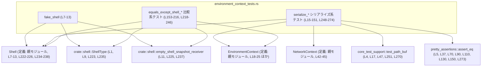
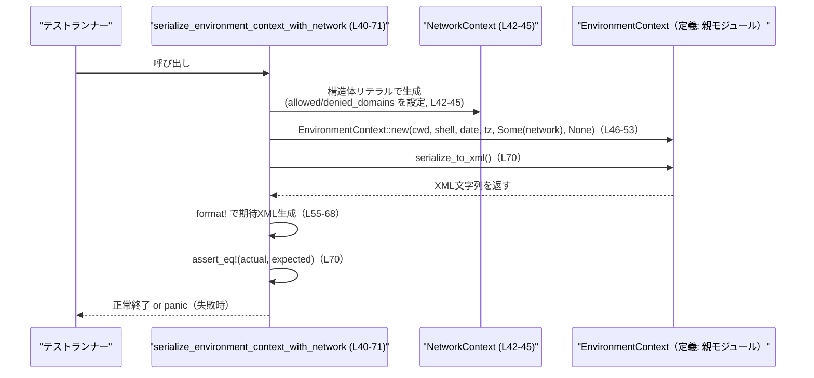

# core/src/environment_context_tests.rs コード解説

## 0. ざっくり一言

このファイルは、`EnvironmentContext` 構造体の **XMLシリアライズ** と **`equals_except_shell` による比較ロジック** をテストするユニットテスト群です。  
`Shell` や `NetworkContext` などの補助的なコンポーネントとの連携もここで検証されています。

---

## 1. このモジュールの役割

### 1.1 概要

- このモジュールは、環境情報を表す `EnvironmentContext` が  
  - 作業ディレクトリ (`cwd`)  
  - シェル (`Shell`)  
  - 日付 (`current_date`)  
  - タイムゾーン (`timezone`)  
  - ネットワーク許可/拒否ドメイン (`NetworkContext`)  
  - サブエージェント設定 (`subagents`)  
  を **XMLにシリアライズ** できることを検証します  
  （例: `serialize_environment_context_with_network` テスト、`core/src/environment_context_tests.rs:L40-71`）。
- あわせて、`equals_except_shell` メソッドが  
  - `cwd` の違いを検出し  
  - シェル差分を無視して比較する  
  という振る舞いを持つことを検証します  
  （例: `equals_except_shell_compares_cwd` と `equals_except_shell_ignores_shell` テスト、`L153-172`, `L218-246`）。

### 1.2 アーキテクチャ内での位置づけ

このモジュールは **テストモジュール** であり、本体は親モジュール (`super`) に存在します（`use super::*;`、`L3`）。  
依存関係を簡略化して示すと次のようになります。



> `EnvironmentContext`, `NetworkContext`, `Shell` の定義本体はこのチャンクには現れず、`super`（親モジュール）側にあります（`core/src/environment_context_tests.rs:L3`）。

### 1.3 設計上のポイント（このテストモジュールに関して）

- **共通シェル生成ヘルパ**  
  - `fake_shell()` でテスト用 `Shell` インスタンスを生成し、重複コードを避けています  
    （`L7-13`）。
- **シナリオごとのテスト関数**  
  - `serialize_*` 系テストが、`cwd` 有無、ネットワーク有無、サブエージェント有無など、シナリオごとに期待される XML を検証しています（`L15-151`, `L248-274`）。
- **比較メソッドの契約をテストで定義**  
  - `equals_except_shell_*` テストで、「`cwd` の違いは見るがシェル差分は無視する」という比較ポリシーが明文化されています（`L153-172`, `L196-216`, `L218-246`）。
- **エラーハンドリング・安全性**  
  - すべて安全な Rust コードで記述されており、`unsafe` ブロックはありません（ファイル全体）。
  - 失敗は `assert_eq!` / `assert!` による **panic → テスト失敗** として扱われます（例: `L37`, `L70`, `L171`, `L245`）。
- **並行性**  
  - 各テスト関数はローカル変数だけを扱い、共有可変状態を持ちません。  
    テストランナーがテストを並列実行しても、このファイルの範囲ではデータ競合を生じるコードはありません。

---

## 2. 主要な機能一覧（コンポーネントインベントリー含む）

### 2.1 関数一覧（コンポーネントインベントリー）

| 名前 | 種別 | 役割 / 説明 | 行範囲 |
|------|------|-------------|--------|
| `fake_shell` | ヘルパ関数 | 固定設定の `Shell` を生成するテスト用ユーティリティ | `core/src/environment_context_tests.rs:L7-13` |
| `serialize_workspace_write_environment_context` | テスト関数 | `cwd` あり・ネットワークなしの環境コンテキストの XML シリアライズを検証 | `L15-38` |
| `serialize_environment_context_with_network` | テスト関数 | `NetworkContext` ありのシリアライズ結果（`<network>` 要素）を検証 | `L40-71` |
| `serialize_read_only_environment_context` | テスト関数 | `cwd` なしの「読み取り専用」環境の XML 出力を検証 | `L73-91` |
| `serialize_external_sandbox_environment_context` | テスト関数 | 外部サンドボックス環境（`cwd`/network なし）の XML 出力を検証 | `L93-111` |
| `serialize_external_sandbox_with_restricted_network_environment_context` | テスト関数 | サンドボックス + 制限付きネットワーク用シナリオ名だが、現状は network `None` のケースを検証 | `L113-131` |
| `serialize_full_access_environment_context` | テスト関数 | フルアクセス環境用シナリオ名だが、現状は network `None` と同じ出力を検証 | `L133-151` |
| `equals_except_shell_compares_cwd` | テスト関数 | `cwd` が同じ場合に `equals_except_shell` が `true` になることを検証 | `L153-172` |
| `equals_except_shell_ignores_sandbox_policy` | テスト関数 | サンドボックスポリシーの違いを無視することを期待するが、現状は完全同一コンテキスト同士を比較 | `L174-194` |
| `equals_except_shell_compares_cwd_differences` | テスト関数 | `cwd` が違うと `equals_except_shell` が `false` になることを検証 | `L196-216` |
| `equals_except_shell_ignores_shell` | テスト関数 | シェル種別 (`Bash` vs `Zsh`) が違っても `equals_except_shell` が `true` になることを検証 | `L218-246` |
| `serialize_environment_context_with_subagents` | テスト関数 | `subagents` 情報が `<subagents>` 要素内に改行付きで埋め込まれることを検証 | `L248-274` |

### 2.2 機能（テスト観点の一言説明）

- XML シリアライズ:
  - `cwd` を含む/含まない XML の出力を検証（`L15-38`, `L73-91`）。
  - ネットワーク許可/拒否ドメインを `<network>` 要素として表現することを検証（`L40-71`）。
  - サブエージェント設定の YAML 風文字列を `<subagents>` 要素内にそのまま格納することを検証（`L248-274`）。
- 比較ロジック (`equals_except_shell`):
  - `cwd` が同じなら `true`、異なれば `false` になることを検証（`L153-172`, `L196-216`）。
  - シェル種別やパスが違っても `true` になることを検証（`L218-246`）。

---

## 3. 公開 API と詳細解説

ここでは、**テストから読み取れる公開 API の契約** と、それを行使しているテスト関数を説明します。

### 3.1 型一覧（構造体・列挙体など）

| 名前 | 種別 | 役割 / 用途 | 根拠 |
|------|------|-------------|------|
| `EnvironmentContext` | 構造体（推定） | 環境情報（`cwd`, `Shell`, 日付, タイムゾーン, ネットワーク, サブエージェント等）をまとめたコンテキスト。`new` コンストラクタと `serialize_to_xml`, `equals_except_shell` メソッドを持つ。 | `new` 呼び出しとメソッド呼び出し（`L18-25`, `L37`, `L46-53`, `L70`, `L75-82`, `L90`, `L135-142`, `L150`, `L153-162`, `L171`, ほか）から |
| `NetworkContext` | 構造体 | ネットワークアクセス制御情報。`allowed_domains: Vec<String>`, `denied_domains: Vec<String>` を持つ。 | フィールド初期化（`L42-45`）より |
| `Shell` | 構造体 | 実行に使用するシェル。`shell_type`, `shell_path`, `shell_snapshot` を持つ。 | `fake_shell` と `equals_except_shell_ignores_shell` 内の初期化子（`L7-13`, `L222-226`, `L234-238`）より |
| `ShellType` | 列挙体 | シェル種別を表す列挙体。少なくとも `Bash`, `Zsh` バリアントが存在する。 | インポートと使用箇所（`L1`, `L9`, `L223`, `L235`）より |
| `PathBuf` | 構造体（標準ライブラリ） | ファイルシステム上のパスを表す。ここでは `cwd` の指定に使われる。 | `PathBuf::from("/repo")` 等（`L10`, `L156`, `L164`, `L199`, `L207`）より |
| `core_test_support::test_path_buf` | 関数 | テスト用の `PathBuf` を返すユーティリティ。`"/repo"` などのパスをラップして利用。 | インポートと使用（`L4`, `L17`, `L47`, `L251`, `L270`）より |

> `EnvironmentContext`, `NetworkContext`, `Shell` の定義本体はこのチャンクには現れず、`use super::*;`（`L3`）経由で親モジュールからインポートされています。

**`EnvironmentContext::new` のシグネチャ（テストから読み取れる範囲）**

テストコードから、`EnvironmentContext::new` は少なくとも次の形で呼べることが分かります:

```rust
EnvironmentContext::new(
    Option<PathBuf>,  // cwd
    Shell,            // シェル
    Option<String>,   // current_date
    Option<String>,   // timezone
    Option<NetworkContext>, // network
    Option<String>,   // subagents の生文字列
)
```

これはすべての呼び出し箇所の引数型から推測したものであり、実際の定義はこのチャンクには現れません（例: `L18-25`, `L46-53`, `L75-82`, `L135-142`, `L250-257`）。

### 3.2 関数詳細（7件）

#### `fake_shell() -> Shell`  （L7-13）

**概要**

- テストで利用する固定設定の `Shell` インスタンスを返します（`L7-13`）。
- シェル種別は Bash、パスは `/bin/bash` に固定されています（`L9-10`）。

**引数**

- なし。

**戻り値**

- `Shell`: `shell_type = ShellType::Bash`, `shell_path = "/bin/bash"`, `shell_snapshot = empty_shell_snapshot_receiver()` を持つシェル。

**内部処理の流れ**

1. `ShellType::Bash` を指定（`L9`）。
2. `PathBuf::from("/bin/bash")` でシェルパスを生成（`L10`）。
3. `crate::shell::empty_shell_snapshot_receiver()` でスナップショット受信側を取得（`L11`）。
4. 以上をフィールドとする `Shell` 構造体を返す（`L8-12`）。

**使用例**

テスト内では次のようにして `EnvironmentContext` を構築しています。

```rust
let context = EnvironmentContext::new(
    Some(test_path_buf("/repo")),              // cwd
    fake_shell(),                              // Bash シェル
    Some("2026-02-26".to_string()),            // 日付
    Some("America/Los_Angeles".to_string()),   // タイムゾーン
    /*network*/ None,
    /*subagents*/ None,
); // core/src/environment_context_tests.rs:L46-53
```

**Errors / Panics**

- `fake_shell` 自体はパニックを起こす要素を含みません（単純な構造体リテラル、`L8-12`）。

**Edge cases**

- 引数がなく、固定値を返すためエッジケースはほぼありません。

**使用上の注意点**

- テスト用の固定シェルであり、実際のユーザー環境のシェル設定とは異なる可能性があります。

---

#### `serialize_workspace_write_environment_context()` （L15-38）

**概要**

- `cwd` を持つ `EnvironmentContext` をシリアライズした結果が、期待される XML と一致することを検証します（`L15-38`）。

**引数**

- なし（テスト関数）。

**戻り値**

- `()`（テストの成功・失敗はアサーション結果で判定）。

**内部処理の流れ**

1. `test_path_buf("/repo")` で `cwd` の `PathBuf` を得る（`L17`）。
2. `EnvironmentContext::new` でコンテキストを構築（`L18-25`）。
3. `format!` で期待される XML 文字列を組み立てる（`L27-35`）。
   - `<cwd>` 要素に `cwd.display()` を埋め込む（`L29`, `L34`）。
4. `context.serialize_to_xml()` の結果と `expected` を `assert_eq!` で比較（`L37`）。

**使用例**

テスト自体が使用例になっていますが、簡略化すると次のような使い方です。

```rust
let cwd = test_path_buf("/repo");                               // L17
let ctx = EnvironmentContext::new(
    Some(cwd.clone()),
    fake_shell(),
    Some("2026-02-26".to_string()),
    Some("America/Los_Angeles".to_string()),
    None,
    None,
); // L18-25

let xml = ctx.serialize_to_xml();                               // L37 で暗黙利用
```

**Errors / Panics**

- `serialize_to_xml` が期待と違う文字列を返した場合、`assert_eq!` によりテストは panic します（`L37`）。
- その他のエラー処理は、テストコードからは分かりません（`serialize_to_xml` の内部はこのチャンクには現れません）。

**Edge cases**

- `cwd` が `Some` のケースだけを検証しており、`None` のケースは別テスト（`serialize_read_only_environment_context`, `L73-91`）で扱われます。
- 日付やタイムゾーンが `Some` のケースのみを検証しています。

**使用上の注意点**

- XML 文字列はインデントと改行を含めて厳密に比較されているため（`L28-33`）、テストコードではホワイトスペースも含めて正しく期待値を作る必要があります。

---

#### `serialize_environment_context_with_network()` （L40-71）

**概要**

- `NetworkContext` を持つ `EnvironmentContext` の XML シリアライズが、  
  `<network enabled="true">` 以下に `allowed` / `denied` 要素を含むことを検証します（`L40-71`）。

**引数**

- なし（テスト関数）。

**戻り値**

- `()`。

**内部処理の流れ**

1. `NetworkContext` を作成し、`allowed_domains` に 2 つ、`denied_domains` に 1 つのドメインを設定（`L42-45`）。
2. `EnvironmentContext::new` に `Some(network)` を渡してコンテキストを構築（`L46-53`）。
3. `format!` で期待される XML を構築（`L55-68`）。
   - `<network enabled="true">` 要素内に `<allowed>` / `<denied>` タグを並べる（`L61-65`）。
4. `serialize_to_xml` の結果と `expected` を `assert_eq!` で比較（`L70`）。

**使用例**

ネットワーク制限付きの環境コンテキスト生成例は次のように表せます。

```rust
let network = NetworkContext {
    allowed_domains: vec![
        "api.example.com".to_string(),
        "*.openai.com".to_string(),
    ], // L42-44
    denied_domains: vec!["blocked.example.com".to_string()],    // L44
};

let ctx = EnvironmentContext::new(
    Some(test_path_buf("/repo")),                                // L47
    fake_shell(),
    Some("2026-02-26".to_string()),
    Some("America/Los_Angeles".to_string()),
    Some(network),                                               // L51
    None,
);

let xml = ctx.serialize_to_xml();
```

**Errors / Panics**

- XML 要素の構造やドメインの並びが期待と異なると、`assert_eq!` により panic します（`L70`）。

**Edge cases**

- `allowed_domains`/`denied_domains` が空の場合の挙動は、このテストからは分かりません（このチャンクにはそのケースのテストがありません）。
- `enabled="true"` 属性があることのみが検証されており、「`Some` なら true、`None` なら absent もしくは false」のようなポリシーは本体コードを見ないと断定できません。

**使用上の注意点**

- ネットワーク設定は単純な許可/拒否リストとして扱われており、ドメインのフォーマットやワイルドカード処理の詳細はこのテストからは分かりません。

---

#### `serialize_read_only_environment_context()` （L73-91）

**概要**

- `cwd` が `None` の `EnvironmentContext` が、`<cwd>` 要素を持たない XML にシリアライズされることを検証します（`L73-91`）。

**引数**

- なし。

**戻り値**

- `()`。

**内部処理の流れ**

1. `cwd` に `None` を渡して `EnvironmentContext::new` を呼び出す（`L75-82`）。
2. `<shell>`, `<current_date>`, `<timezone>` 要素だけを含む期待 XML を定数文字列として定義（`L84-88`）。
3. `serialize_to_xml` の結果と期待値を `assert_eq!` で比較（`L90`）。

**使用例**

```rust
let ctx = EnvironmentContext::new(
    None,                                           // cwd なし, L75-76
    fake_shell(),
    Some("2026-02-26".to_string()),
    Some("America/Los_Angeles".to_string()),
    None,
    None,
);

let xml = ctx.serialize_to_xml();                   // L90 で暗黙利用
```

**Errors / Panics**

- `serialize_to_xml` が `<cwd>` 要素を出力してしまう場合、`assert_eq!` が失敗し panic します（`L90`）。

**Edge cases**

- `current_date` や `timezone` が `None` の場合の挙動は、ここではテストされていません。
- `cwd` が `None` のときのセマンティクス（「読み取り専用」など）は、テスト名から推測されますがコードからは断定できません。

**使用上の注意点**

- `cwd` が `None` の場合の扱いはアプリケーション全体のポリシーに依存するため、本体側のドキュメントも参照する必要があります（このチャンクには存在しません）。

---

#### `serialize_environment_context_with_subagents()` （L248-274）

**概要**

- `subagents` 文字列が `<subagents>` 要素内に **改行を保持した形** で埋め込まれることを検証します（`L248-274`）。

**引数**

- なし。

**戻り値**

- `()`。

**内部処理の流れ**

1. `EnvironmentContext::new` の第 6 引数に `Some("- agent-1: atlas\n- agent-2".to_string())` を渡してコンテキストを生成（`L250-257`）。
2. `<subagents>` 要素内に 2 行のテキストが入った期待 XML を `format!` で作成（`L259-271`）。
   - `<cwd>` の部分は `test_path_buf("/repo").display()` で埋め込み（`L261`, `L270`）。
3. 実際の `serialize_to_xml` の結果と期待 XML を `assert_eq!` で比較（`L273`）。

**使用例**

```rust
let ctx = EnvironmentContext::new(
    Some(test_path_buf("/repo")),                    // cwd, L251
    fake_shell(),
    Some("2026-02-26".to_string()),
    Some("America/Los_Angeles".to_string()),
    None,
    Some("- agent-1: atlas\n- agent-2".to_string()), // subagents, L256
);

let xml = ctx.serialize_to_xml();
```

**Errors / Panics**

- `subagents` 文字列がそのまま出力されなかったり、改行やインデントが期待と異なる場合、テストは panic します（`L273`）。

**Edge cases**

- `subagents` が `None` のときの挙動は、他のテスト（例えば `serialize_workspace_write_environment_context`, `L15-38`）で間接的に検証されています。
- `subagents` に空文字列や長大なテキストを渡した場合の扱いは、このテストからは分かりません。

**使用上の注意点**

- `subagents` は **パースされず、生テキストとして XML に埋め込まれている** ように見えます（改行が保持されているため、`L265-268`）。  
  セキュリティ的には、外部入力をここにそのまま流す場合は XML 内でのエスケープ処理の有無に注意が必要ですが、その実装はこのチャンクからは確認できません。

---

#### `equals_except_shell_compares_cwd()` （L153-172）

**概要**

- `cwd` が同じ 2 つの `EnvironmentContext` について、`equals_except_shell` が `true` を返すことを検証します（`L153-172`）。

**引数**

- なし。

**戻り値**

- `()`。

**内部処理の流れ**

1. `EnvironmentContext::new` で `cwd = Some("/repo")` のコンテキスト `context1`, `context2` を生成（`L155-162`, `L163-170`）。
2. `assert!(context1.equals_except_shell(&context2));` で `true` であることを確認（`L171`）。

**使用例**

```rust
let ctx1 = EnvironmentContext::new(
    Some(PathBuf::from("/repo")), // L156
    fake_shell(),
    None,
    None,
    None,
    None,
);
let ctx2 = EnvironmentContext::new(
    Some(PathBuf::from("/repo")), // L164
    fake_shell(),
    None,
    None,
    None,
    None,
);

assert!(ctx1.equals_except_shell(&ctx2));            // L171
```

**Errors / Panics**

- `equals_except_shell` が `false` を返した場合、`assert!` により panic します（`L171`）。

**Edge cases**

- 比較対象は `cwd` とシェル以外のフィールド（current_date, timezone, network, subagents）をすべて `None` にしているため（`L158-161`, `L166-169`）、それらのフィールドが `equals_except_shell` でどう扱われるかはこのテストだけでは分かりません。

**使用上の注意点**

- `equals_except_shell` は少なくとも `cwd` の違いを重視する比較であることが、このテストおよび後述の差分検出テストから読み取れます。

---

#### `equals_except_shell_ignores_shell()` （L218-246）

**概要**

- `ShellType` や `shell_path` が異なる 2 つの `EnvironmentContext` 同士でも、`equals_except_shell` が `true` になることを検証します（`L218-246`）。

**引数**

- なし。

**戻り値**

- `()`。

**内部処理の流れ**

1. Bash シェル (`ShellType::Bash`, `/bin/bash`) を持つ `context1` を生成（`L220-227`）。
2. Zsh シェル (`ShellType::Zsh`, `/bin/zsh`) を持つ `context2` を生成（`L232-239`）。
   - 両者とも `cwd = Some("/repo")` かつ他フィールドは `None`（`L221`, `L233`, `L227-231`, `L239-243`）。
3. `assert!(context1.equals_except_shell(&context2));` により、シェル差分は無視されることを確認（`L245`）。

**使用例**

```rust
let ctx_bash = EnvironmentContext::new(
    Some(PathBuf::from("/repo")),                   // L221
    Shell {
        shell_type: ShellType::Bash,
        shell_path: "/bin/bash".into(),
        shell_snapshot: crate::shell::empty_shell_snapshot_receiver(),
    },                                              // L222-226
    None,
    None,
    None,
    None,
);

let ctx_zsh = EnvironmentContext::new(
    Some(PathBuf::from("/repo")),                   // L233
    Shell {
        shell_type: ShellType::Zsh,
        shell_path: "/bin/zsh".into(),
        shell_snapshot: crate::shell::empty_shell_snapshot_receiver(),
    },                                              // L234-238
    None,
    None,
    None,
    None,
);

assert!(ctx_bash.equals_except_shell(&ctx_zsh));    // L245
```

**Errors / Panics**

- シェル差分が `equals_except_shell` に影響してしまう場合、`assert!` によりテストが panic します（`L245`）。

**Edge cases**

- このテストでは `cwd` は同一です（`"/repo"`, `L221`, `L233`）。  
  `cwd` が異なる場合は別テスト（`equals_except_shell_compares_cwd_differences`, `L196-216`）で `false` になることを確認しています。
- `shell_snapshot` の値が比較に影響するかどうかは、このテストからは分かりません（両方とも `empty_shell_snapshot_receiver()` を使っているため、`L225`, `L237`）。

**使用上の注意点**

- `equals_except_shell` を利用するときは、「**シェルを無視した環境の同一性判定**」用のメソッドとして扱うのが適切です。  
  シェル差分も含めた完全一致を判定したい場合は、別の比較手段が必要です（このチャンクにはそうしたメソッドの情報はありません）。

---

### 3.3 その他の関数（簡易一覧）

| 関数名 | 役割（1 行） | 行範囲 |
|--------|--------------|--------|
| `serialize_external_sandbox_environment_context` | 外部サンドボックス環境用シナリオ名だが、現状は `cwd=None`, network なしの XML 形式を検証 | `L93-111` |
| `serialize_external_sandbox_with_restricted_network_environment_context` | 制限付きネットワーク付きサンドボックスのテスト名だが、ネットワークは `None` のケースを検証 | `L113-131` |
| `serialize_full_access_environment_context` | フルアクセス環境用シナリオ名だが、`cwd=None`, network なしの XML 形式を検証 | `L133-151` |
| `equals_except_shell_ignores_sandbox_policy` | サンドボックスポリシー差分を無視することを意図するテスト名だが、現状は完全に同一の `EnvironmentContext` 同士を比較 | `L175-194` |
| `equals_except_shell_compares_cwd_differences` | `cwd` の違いが `equals_except_shell` の比較結果に影響する (`false` を返す) ことを検証 | `L196-216` |

> これらのテスト名は、将来 `sandbox policy` やネットワーク設定の差分をテストするための「シナリオの枠」を表している可能性がありますが、現状このチャンク内ではパラメータに差分がない（または network が常に `None`）ため、挙動は他のテストと同様です（例: `L113-122` と `L133-142`）。

---

## 4. データフロー

ここでは代表的なシリアライズシナリオとして  
`serialize_environment_context_with_network`（`L40-71`）のデータフローを示します。

### 4.1 処理の要点

- テスト関数が `NetworkContext` と `EnvironmentContext` を構築し、`serialize_to_xml` で得た XML を期待値と比較します。
- すべてのオブジェクトはテスト関数内のローカルで完結しており、外部への I/O やグローバル状態の更新は行っていません（このチャンク内のコードを見る限り）。

### 4.2 シーケンス図



このフローから分かる点:

- `EnvironmentContext` は純粋関数的に XML 文字列を返しており（テストから見える範囲では副作用なし）、エラーは `Result` ではなく panic（テスト失敗）として扱われます。
- テスト側は `NetworkContext` のフィールドを直接初期化しており、こちらも単純なデータコンテナとして扱われています（`L42-45`）。

---

## 5. 使い方（How to Use）

ここでは **テストコードをベースにした実用的な使用例** を整理します。

> 注意: `EnvironmentContext` や `NetworkContext` のモジュールパス（`crate::...`）は、このチャンクからは分からないため、下記の `use` は例示的なものです。

### 5.1 基本的な使用方法（XML シリアライズ）

```rust
use crate::shell::{Shell, ShellType, empty_shell_snapshot_receiver}; // 実際のパスはプロジェクト構成に依存
use crate::environment_context::{EnvironmentContext, NetworkContext}; // このパスは例示のみ

fn main() {
    // 1. cwd（カレントディレクトリに相当）
    let cwd = std::path::PathBuf::from("/repo");

    // 2. シェル情報（テストの fake_shell と同等）               // L7-13 を参考
    let shell = Shell {
        shell_type: ShellType::Bash,
        shell_path: std::path::PathBuf::from("/bin/bash"),
        shell_snapshot: empty_shell_snapshot_receiver(),
    };

    // 3. ネットワークコンテキスト（任意）                        // L42-45 を参考
    let network = NetworkContext {
        allowed_domains: vec!["api.example.com".to_string()],
        denied_domains: vec!["blocked.example.com".to_string()],
    };

    // 4. EnvironmentContext を組み立てる                          // L18-25, L46-53 を参考
    let context = EnvironmentContext::new(
        Some(cwd),
        shell,
        Some("2026-02-26".to_string()),
        Some("America/Los_Angeles".to_string()),
        Some(network),
        Some("- agent-1: atlas\n- agent-2".to_string()),
    );

    // 5. XML 文字列としてシリアライズする                          // L37, L70, L90, L150, L273
    let xml = context.serialize_to_xml();
    println!("{xml}");
}
```

この例は、`serialize_workspace_write_environment_context`（`L15-38`）や  
`serialize_environment_context_with_network`（`L40-71`）、`serialize_environment_context_with_subagents`（`L248-274`）のテストと同じ構造を持っています。

### 5.2 よくある使用パターン

#### a. `cwd` なしの「読み取り専用」コンテキスト

```rust
let readonly_ctx = EnvironmentContext::new(
    None,                                      // cwd なし, L75-76
    shell,
    Some("2026-02-26".to_string()),
    Some("America/Los_Angeles".to_string()),
    None,
    None,
);

let xml = readonly_ctx.serialize_to_xml();    // serialize_read_only_environment_context を参照
```

#### b. ネットワークアクセス情報付き

```rust
let network = NetworkContext {
    allowed_domains: vec!["*.example.com".to_string()],
    denied_domains: vec![],
};

let ctx = EnvironmentContext::new(
    Some(cwd),
    shell,
    None,
    None,
    Some(network),                             // L51
    None,
);

// ctx.serialize_to_xml() の <network> 要素に allowed/denied が出力されることが期待されます。
```

#### c. サブエージェント設定付き

```rust
let subagents_yaml = "- agent-1: atlas\n- agent-2".to_string(); // L256

let ctx = EnvironmentContext::new(
    Some(cwd),
    shell,
    None,
    None,
    None,
    Some(subagents_yaml),
);
// <subagents> 要素内に改行つきで埋め込まれることがテストで確認されています (L265-268)。
```

### 5.3 よくある間違い（想定されるもの）

```rust
// 間違い例: シェル差分も含めて「完全一致」を判定したいのに equals_except_shell を使う
let equal = ctx1.equals_except_shell(&ctx2);   // シェル差分が無視される (L218-246)
if equal {
    // 「完全に同じ環境」と誤解して処理してしまう
}

// 正しい例: 「シェル以外が同じか」の判定としてのみ equals_except_shell を使う
let equal_except_shell = ctx1.equals_except_shell(&ctx2);
if equal_except_shell {
    // cwd やネットワークなど「環境」は同じだが、シェルは違う可能性がある
    // （このチャンクでは cwd のみテストされています）
}
```

```rust
// 間違い例: テストで XML を比較するときにインデントや改行を無視してしまう（ここでは不可）
let expected = "<environment_context><shell>bash</shell></environment_context>".to_string();
// 実コードは改行・インデントを含む文字列を返す (L28-33, L84-88 など)

// 正しい例: テストではインデントと改行を含む完全一致を比較する
let expected = r#"<environment_context>
  <shell>bash</shell>
  <current_date>2026-02-26</current_date>
  <timezone>America/Los_Angeles</timezone>
</environment_context>"#; // L84-88
```

### 5.4 使用上の注意点（まとめ）

- **比較メソッドの意味**  
  - `equals_except_shell` は少なくとも `cwd` を含む一部のフィールドを比較し、シェル差分は無視します（`L196-216`, `L218-246`）。  
    「完全一致」の比較に使うと誤解を招く可能性があります。
- **XML のホワイトスペース**  
  - テストではインデントと改行を含めて文字列が比較されています（`L28-33`, `L56-65`, `L84-88`, `L104-108`, `L124-128`, `L144-148`, `L260-268`）。  
    出力フォーマットを変更すると既存のテストが壊れる点に注意が必要です。
- **安全性 / エラー / 並行性（このファイルの範囲）**
  - このテストモジュールは `unsafe` を使っておらず、すべて安全な Rust で書かれています（ファイル全体）。
  - エラーは `Result` ではなく `assert!` / `assert_eq!` の panic を通じて表現されます。
  - テストごとに新しい `EnvironmentContext` を生成しているため（`L18-25`, `L46-53`, `L75-82`, `L135-142` など）、共有可変状態は存在せず、テストランナーの並行実行によるデータ競合はこのファイルからは観測されません。

---

## 6. 変更の仕方（How to Modify）

### 6.1 新しい機能を追加する場合（例: XML に新フィールドを追加）

1. **本体コード側の変更**（このチャンクには存在しません）
   - `EnvironmentContext` に新しいフィールドを追加し、`new` コンストラクタと `serialize_to_xml` 内でそのフィールドを処理します。
2. **テストの追加**
   - 既存の `serialize_*` テストを参考に、新フィールドを含むコンテキストを構築し、期待される XML 文字列を `format!` またはリテラルで定義します（例えば `L27-35`, `L55-68`, `L259-271` を参考）。
   - 可能であれば「そのフィールドが `None` のときに XML に出力されない」ケースも別テストで追加します（`serialize_read_only_environment_context`, `L73-91` が `cwd=None` ケースの参考になります）。

### 6.2 既存の機能を変更する場合（例: `equals_except_shell` の比較対象を変更）

- **影響範囲の確認**
  - `equals_except_shell_*` テスト（`L153-172`, `L174-194`, `L196-216`, `L218-246`）が、比較ロジックの仕様を実質的に定義しています。
  - 比較ロジックを変えると、これらのテストの期待結果（`assert!` の `true` / `false`）も変える必要があります。
- **契約の再確認**
  - 現在のテストから読み取れる契約:
    - `cwd` は比較対象（同じなら `true`, 違えば `false`、`L153-172`, `L196-216`）。
    - シェル種別 (`Bash` vs `Zsh`) は無視される（`L218-246`）。
  - 日付・タイムゾーン・ネットワーク・サブエージェントなどが比較対象かどうかは、このチャンクからは不明です。比較対象を変える場合は、そのフィールドに差分を持つテストを新たに追加する必要があります。
- **テスト・使用箇所の確認**
  - 本ファイル以外でも `equals_except_shell` を使っている箇所があれば、その意図に合うようにテストケースを拡充する必要があります（それらの箇所はこのチャンクには現れません）。

---

## 7. 関連ファイル

このモジュールと密接に関係するコンポーネントは、インポートや呼び出しから次のように整理できます。

| パス / モジュール | 役割 / 関係 |
|------------------|------------|
| `super`（親モジュール） | `EnvironmentContext`, `NetworkContext`, `Shell` など、このテストで対象となる型とメソッドを定義しているモジュールです（`use super::*;`, `core/src/environment_context_tests.rs:L3`）。具体的なファイルパスはこのチャンクからは分かりません。 |
| `crate::shell` | `ShellType` 列挙体と `empty_shell_snapshot_receiver` 関数を提供します。`fake_shell` やシェル差分のテストで利用されています（`L1`, `L9`, `L11`, `L223`, `L225`, `L235`, `L237`）。 |
| `core_test_support` | テストユーティリティクレートと思われ、`test_path_buf` 関数でテスト用の `PathBuf` を生成しています（`L4`, `L17`, `L47`, `L251`, `L270`）。 |
| `pretty_assertions` | `assert_eq!` マクロの差し替えを提供し、テスト失敗時の diff を分かりやすく表示します（`L5`, `L37`, `L70`, `L90`, `L110`, `L130`, `L150`, `L273`）。 |

> これらの関連ファイル・モジュールの具体的な実装内容は、このチャンクには含まれていません。そのため本レポートでは、**テストコードから観測できる挙動のみ** を説明しました。
