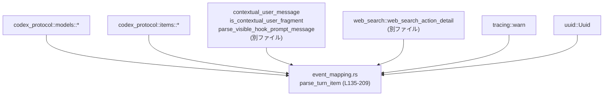
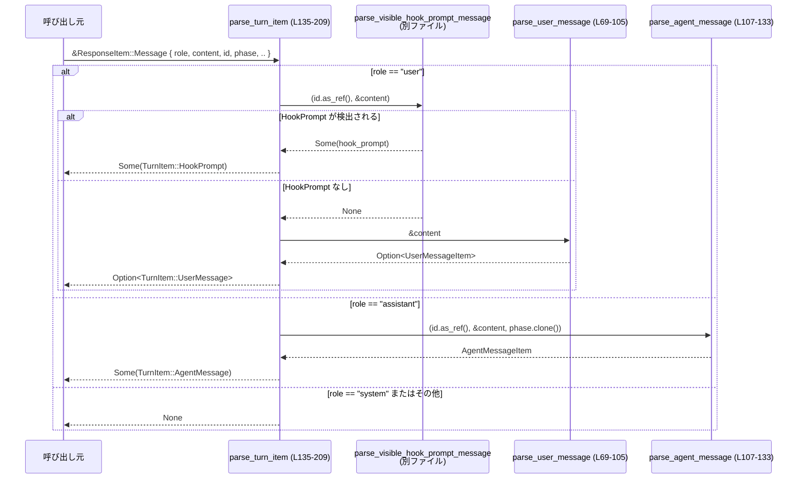
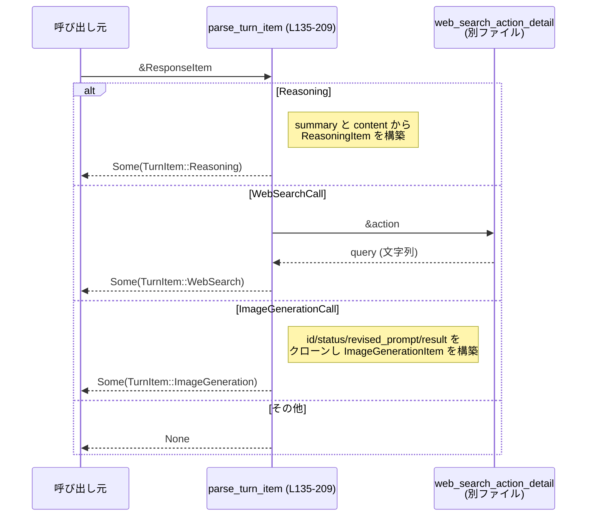

core/src/event_mapping.rs

---

## 0. ざっくり一言

codex_protocol の `ResponseItem` を、アプリケーション内部で扱う `TurnItem`（ユーザー発話・エージェント発話・Reasoning・Web 検索・画像生成など）にマッピングするモジュールです。  
同時に「コンテキスト専用フラグメント」かどうかの判定も行います。  
根拠: `core/src/event_mapping.rs:L27-33,L35-37,L69-105,L135-209`

---

## 1. このモジュールの役割

### 1.1 概要

- このモジュールは **外部プロトコルのイベント表現 (`ResponseItem`) を内部イベント表現 (`TurnItem`) に変換する** ために存在し、  
  併せて **ユーザー／開発者メッセージのうち「コンテキスト専用フラグメント」を検出・フィルタする機能** を提供します。  
  根拠: `core/src/event_mapping.rs:L23-25,L35-37,L44-54,L69-105,L135-209`

### 1.2 アーキテクチャ内での位置づけ

- `codex_protocol::models::ResponseItem`（モデル側の出力）を受け取り、  
  `codex_protocol::items::TurnItem`（コア内部で扱うイベント列）に変換する境界モジュールです。  
- コンテキスト専用のユーザー／開発者フラグメント判定は `contextual_user_message` モジュールと協調して行います。  
- Web 検索アクション詳細の整形は `crate::web_search` に委譲します。  



根拠: `core/src/event_mapping.rs:L1-25,L69-105,L107-133,L135-209`

### 1.3 設計上のポイント

- **完全にステートレス**  
  - グローバルな状態は持たず、全ての関数は引数のみから結果を導きます。  
    根拠: どの関数も `&[ContentItem]` や `&ResponseItem` から値を生成しているのみで、静的可変状態や内部キャッシュはありません。`core/src/event_mapping.rs:L35-37,L44-54,L69-105,L107-133,L135-209`
- **プレフィックスベースのコンテキスト検出**  
  - 開発者メッセージ中の特定プレフィックス（例: `<permissions instructions>`）を、コンテキスト専用フラグメントとして判定します。  
    根拠: `core/src/event_mapping.rs:L27-33,L56-67`
- **安全な文字列操作**  
  - 文字列のプレフィックス判定に `get(..len)` と `is_some_and` を利用し、インデックス範囲外アクセスを避けています（Rust の安全なスライス API）。  
    根拠: `core/src/event_mapping.rs:L61-66`
- **ログによる観測性**  
  - 想定外のコンテンツ（例: ユーザーメッセージ内の OutputText やエージェントメッセージ内の非テキスト）を `tracing::warn!` でログに出力しつつ無視します。  
    根拠: `core/src/event_mapping.rs:L98-100,L119-123`
- **エラーは Result ではなく Option で表現**  
  - 「この ResponseItem を TurnItem に変換しない」という選択を `None` で表現しています（例: system メッセージや未対応バリアント）。  
    根拠: `core/src/event_mapping.rs:L135-154,L182-187,L193-207`
- **並行性**  
  - `async`／`await` やスレッド共有状態は使用しておらず、全て同期・純粋関数的な処理です。データ競合の危険はコード上現れていません。  

---

## 2. 主要な機能一覧

- ユーザーコンテキスト判定: `is_contextual_user_message_content`  
  ユーザーメッセージが「コンテキスト専用フラグメント」を含むか判定します。  
  根拠: `core/src/event_mapping.rs:L35-37`
- 開発者コンテキスト判定: `is_contextual_dev_message_content` / `has_non_contextual_dev_message_content`  
  開発者メッセージ中のコンテキスト部分／非コンテキスト部分の有無を判定します。  
  根拠: `core/src/event_mapping.rs:L39-54`
- ユーザーメッセージのパース: `parse_user_message`  
  `ContentItem` の列を `UserMessageItem`（テキスト＋画像）に変換します。コンテキスト専用メッセージは除外します。  
  根拠: `core/src/event_mapping.rs:L69-105`
- エージェントメッセージのパース: `parse_agent_message`  
  エージェント側のテキストコンテンツを `AgentMessageItem` に変換します。  
  根拠: `core/src/event_mapping.rs:L107-133`
- ResponseItem → TurnItem マッピング: `parse_turn_item`（公開 API）  
  `ResponseItem` の各バリアントを、`TurnItem::UserMessage` / `AgentMessage` / `Reasoning` / `WebSearch` / `ImageGeneration` などにマッピングします。  
  根拠: `core/src/event_mapping.rs:L135-209`

---

## 3. 公開 API と詳細解説

### 3.1 型・定数一覧

#### 本ファイル内で定義される要素

| 名前 | 種別 | 可視性 | 役割 / 用途 | 根拠 |
|------|------|--------|-------------|------|
| `CONTEXTUAL_DEVELOPER_PREFIXES` | 定数 `&[&str]` | `const`（モジュール内） | 開発者メッセージ中で「コンテキスト専用」とみなすテキストのプレフィックス集合 | `core/src/event_mapping.rs:L27-33` |
| `is_contextual_user_message_content` | 関数 | `pub(crate)` | ユーザーメッセージがコンテキスト専用フラグメントを含むか判定 | `core/src/event_mapping.rs:L35-37` |
| `is_contextual_dev_message_content` | 関数 | `pub(crate)` | 開発者メッセージにコンテキスト専用フラグメントが含まれるか判定 | `core/src/event_mapping.rs:L39-46` |
| `has_non_contextual_dev_message_content` | 関数 | `pub(crate)` | 開発者メッセージに「コンテキスト以外」のフラグメントが含まれるか判定 | `core/src/event_mapping.rs:L48-54` |
| `is_contextual_dev_fragment` | 関数 | `fn`（非公開） | 単一 `ContentItem` がコンテキスト専用かどうかを判定するヘルパー | `core/src/event_mapping.rs:L56-67` |
| `parse_user_message` | 関数 | `fn`（非公開） | ユーザーメッセージの `ContentItem` 列から `UserMessageItem` を構築 | `core/src/event_mapping.rs:L69-105` |
| `parse_agent_message` | 関数 | `fn`（非公開） | エージェントメッセージの `ContentItem` 列から `AgentMessageItem` を構築 | `core/src/event_mapping.rs:L107-133` |
| `parse_turn_item` | 関数 | `pub` | 外部 `ResponseItem` を内部 `TurnItem` にマッピングする公開 API | `core/src/event_mapping.rs:L135-209` |
| `tests` | モジュール | `mod`（条件付き） | このモジュールのテスト。実体は `event_mapping_tests.rs` に配置 | `core/src/event_mapping.rs:L211-213` |

#### 主な外部型（このファイルで利用されるもの）

※定義は他ファイルですが、このモジュールでの役割をまとめます。

| 名前 | 所属 | 役割 / 用途 | 根拠 |
|------|------|-------------|------|
| `ContentItem` | `codex_protocol::models` | モデル入出力の 1 要素（入力テキスト、画像、出力テキストなど） | `core/src/event_mapping.rs:L7,L56-67,L69-105,L107-125` |
| `ResponseItem` | `codex_protocol::models` | モデル側からのレスポンスを表す列挙体（Message, Reasoning, WebSearchCall, ImageGenerationCall など） | `core/src/event_mapping.rs:L11,L135-209` |
| `TurnItem` | `codex_protocol::items` | コア内部で扱うイベントの列挙体（UserMessage, AgentMessage, Reasoning, WebSearch, ImageGeneration など） | `core/src/event_mapping.rs:L4,L141-151,L176-181,L187-191,L198-205` |
| `UserMessageItem` | `codex_protocol::items` | 内部表現のユーザーメッセージ | `core/src/event_mapping.rs:L5,L69-105,L146` |
| `AgentMessageItem` | `codex_protocol::items` | 内部表現のエージェントメッセージ | `core/src/event_mapping.rs:L2,L107-133,L147-151` |
| `ReasoningItem` | `codex_protocol::items` | モデルの Reasoning 出力の内部表現 | `core/src/event_mapping.rs:L3,L155-180` |
| `WebSearchItem` | `codex_protocol::items` | Web 検索呼び出しの内部表現 | `core/src/event_mapping.rs:L6,L182-191` |
| `ImageGenerationItem` | `codex_protocol::items` | 画像生成呼び出しの内部表現（別名で fully-qualified 使用） | `core/src/event_mapping.rs:L198-205` |
| `UserInput` | `codex_protocol::user_input` | ユーザー入力の 1 要素（テキスト／画像） | `core/src/event_mapping.rs:L19,L74-95` |
| `AgentMessageContent` | `codex_protocol::items` | エージェントメッセージ中のコンテンツ要素 | `core/src/event_mapping.rs:L1,L112-117` |
| `MessagePhase` | `codex_protocol::models` | メッセージフェーズ（例: draft / final 等、詳細は別ファイル） | `core/src/event_mapping.rs:L8,L107-111,L130` |
| `ReasoningItemReasoningSummary` | `codex_protocol::models` | Reasoning のサマリ要素型 | `core/src/event_mapping.rs:L10,L155-166` |
| `ReasoningItemContent` | `codex_protocol::models` | Reasoning の詳細テキスト要素型 | `core/src/event_mapping.rs:L9,L167-175` |
| `WebSearchAction` | `codex_protocol::models` | Web 検索アクション種別 | `core/src/event_mapping.rs:L12,L182-187,L190` |

---

### 3.2 関数詳細

公開 API とコアロジックに関係する 3 関数を詳しく説明します。

#### `pub fn parse_turn_item(item: &ResponseItem) -> Option<TurnItem>`

**概要**

- codex_protocol の `ResponseItem` をアプリ内部の `TurnItem` に変換するメインの公開関数です。  
- メッセージ種別（role やバリアント）に応じて、ユーザー／エージェント／Reasoning／Web 検索／画像生成などに振り分けます。  
根拠: `core/src/event_mapping.rs:L135-209`

**引数**

| 引数名 | 型 | 説明 |
|--------|----|------|
| `item` | `&ResponseItem` | モデル側から届いた 1 イベント（Message, Reasoning, WebSearchCall など） |

**戻り値**

- `Option<TurnItem>`  
  - `Some(TurnItem::*)` : 内部で扱うべきイベントとして解釈できた場合。  
  - `None` : システムメッセージや未対応の `ResponseItem` は内部イベントに変換せず無視。  
  根拠: `core/src/event_mapping.rs:L135-154,L182-187,L193-207`

**内部処理の流れ**

1. `match item` で `ResponseItem` のバリアントを分岐します。  
   根拠: `core/src/event_mapping.rs:L135-137,L155,L182,L193,L207`
2. `ResponseItem::Message` の場合:
   - フィールド `role, content, id, phase, ..` を取り出し、`role.as_str()` で文字列として分岐。  
     根拠: `core/src/event_mapping.rs:L137-143`
   - `role == "user"`:
     1. `parse_visible_hook_prompt_message(id.as_ref(), content)` を呼び出し、Hook Prompt かどうか判定。  
        根拠: `core/src/event_mapping.rs:L144`
     2. Hook Prompt と判定された場合: `TurnItem::HookPrompt` に包んで返す。  
        根拠: `core/src/event_mapping.rs:L144-145`
     3. Hook Prompt でなければ `parse_user_message(content)` を呼び出し、`TurnItem::UserMessage` に変換を試みる。  
        根拠: `core/src/event_mapping.rs:L145-146`
   - `role == "assistant"`:
     1. `parse_agent_message(id.as_ref(), content, phase.clone())` を呼び出し、`TurnItem::AgentMessage` として返す。  
        根拠: `core/src/event_mapping.rs:L147-151`
   - `role == "system"` およびその他のロール文字列: `None` を返す。  
     根拠: `core/src/event_mapping.rs:L152-154`
3. `ResponseItem::Reasoning` の場合:
   - `summary` から `ReasoningItemReasoningSummary::SummaryText { text }` を抽出して `summary_text: Vec<String>` を生成。  
     根拠: `core/src/event_mapping.rs:L155-166`
   - `content: Option<Vec<ReasoningItemContent>>` を `unwrap_or_default()` で空ベクタにフォールバックし、テキストを `raw_content: Vec<String>` として抽出。  
     根拠: `core/src/event_mapping.rs:L167-175`
   - それらを `ReasoningItem` に詰めて `TurnItem::Reasoning` として返す。  
     根拠: `core/src/event_mapping.rs:L176-180`
4. `ResponseItem::WebSearchCall` の場合:
   - `action` が `Some` ならクローンしつつ `web_search_action_detail(action)` で問い合わせ文字列を生成。  
   - `action` が `None` なら `WebSearchAction::Other` と空文字列を用いる。  
     根拠: `core/src/event_mapping.rs:L182-187`
   - `id` が `None` の場合は空文字列を ID として利用 (`unwrap_or_default()`)。  
     根拠: `core/src/event_mapping.rs:L188`
   - それらを `WebSearchItem` に詰めて `TurnItem::WebSearch` として返す。  
     根拠: `core/src/event_mapping.rs:L187-191`
5. `ResponseItem::ImageGenerationCall` の場合:
   - `id, status, revised_prompt, result` をクローンし、`saved_path: None` に設定して `ImageGenerationItem` を構築し、`TurnItem::ImageGeneration` として返す。  
     根拠: `core/src/event_mapping.rs:L193-205`
6. 上記以外のバリアントは `_ => None` で無視。  
   根拠: `core/src/event_mapping.rs:L207-208`

**Examples（使用例）**

※ `ResponseItem` の他フィールドは簡略化しています（実際の定義は別ファイルに依存）。

```rust
use codex_protocol::models::{ResponseItem, ContentItem};
use crate::event_mapping::parse_turn_item;

// ユーザーからの単純なテキストメッセージ
let item = ResponseItem::Message {
    role: "user".to_string(),
    content: vec![ContentItem::InputText { text: "こんにちは".into() }],
    id: None,
    phase: None,
    // .. 省略
};

if let Some(turn) = parse_turn_item(&item) {
    match turn {
        codex_protocol::items::TurnItem::UserMessage(user_msg) => {
            // user_msg.content などを利用して処理を行う
        }
        _ => {}
    }
}
```

**Errors / Panics**

- この関数自体は `Result` を返さず、エラーに相当するケース（未対応バリアント、system ロールなど）は `None` で表現します。  
- 内部で panic を起こしうる操作（`unwrap` やインデックスアクセス）を使用していません。  
  - `content.unwrap_or_default()` は `Option<Vec<_>>` に対する安全なフォールバックです。  
  - 文字列・スライスのインデックスは使用していません。  
  根拠: `core/src/event_mapping.rs:L161-170,L182-188`

**Edge cases（エッジケース）**

- `ResponseItem::Message` で `role` が `"user"` だが、内容が Hook Prompt と判定される場合:
  - ユーザーメッセージとしてではなく `TurnItem::HookPrompt` に変換されます。  
    根拠: `core/src/event_mapping.rs:L144-146`
- `ResponseItem::Message` で `role` が `"user"` かつ `parse_user_message` が `None` を返した場合:
  - ユーザーコンテキスト専用メッセージとみなされ、`parse_turn_item` も `None` を返します。  
    根拠: `core/src/event_mapping.rs:L145-146,L69-72`
- `ResponseItem::Message` で `role` が `"system"` またはその他の文字列:
  - 全て `None` になり、内部イベントに変換されません。  
    根拠: `core/src/event_mapping.rs:L152-154`
- `ResponseItem::WebSearchCall` で `id == None`:
  - `id` は空文字列 `""` として `WebSearchItem` に格納されます。  
    根拠: `core/src/event_mapping.rs:L188`
- `ResponseItem::WebSearchCall` で `action == None`:
  - `WebSearchAction::Other` と空クエリ文字列が利用されます。  
    根拠: `core/src/event_mapping.rs:L183-186`
- `ResponseItem::Reasoning` で `content == None`:
  - `raw_content` は空の `Vec<String>` になります。  
    根拠: `core/src/event_mapping.rs:L167-170`

**使用上の注意点**

- `None` が返ってきた場合は「エラー」ではなく「このイベントは内部処理対象外」であることを意味します。呼び出し側で必要に応じてログを出すなどの扱いを検討する必要があります。  
- `WebSearchItem` の `id` が空文字になりうるため、ID をキーにマップなどに格納するコードでは、空文字の扱いを明示的に決めておくことが望ましいです（このファイルからは仕様は読み取れませんが、空文字が特別な意味を持つ場合は注意が必要です）。  
- 並行実行されても共有状態がないためデータ競合はありませんが、`tracing::warn` によるログ出力が高頻度になる場合、ログ量に注意が必要です。  

---

#### `fn parse_user_message(message: &[ContentItem]) -> Option<UserMessageItem>`

**概要**

- ユーザーからのメッセージコンテンツ列を、内部表現 `UserMessageItem` に変換するヘルパー関数です。  
- コンテキスト専用フラグメントを含むメッセージは、ユーザー発話としては扱わず `None` を返します。  
根拠: `core/src/event_mapping.rs:L69-105`

**引数**

| 引数名 | 型 | 説明 |
|--------|----|------|
| `message` | `&[ContentItem]` | ユーザーメッセージのコンテンツ列（テキスト・画像など） |

**戻り値**

- `Option<UserMessageItem>`  
  - `Some(UserMessageItem)` : ユーザー発話として扱うべき内容が存在する場合。  
  - `None` : メッセージ全体がコンテキスト専用と判定された場合。  
  根拠: `core/src/event_mapping.rs:L69-72,L104-105`

**内部処理の流れ**

1. `is_contextual_user_message_content(message)` を呼び出し、メッセージ全体がコンテキスト専用かどうかを判定。  
   - コンテキスト専用と判定された場合は直ちに `None` を返す。  
   根拠: `core/src/event_mapping.rs:L69-72`
2. `content: Vec<UserInput>` を初期化。  
   根拠: `core/src/event_mapping.rs:L74`
3. `message.iter().enumerate()` で各 `ContentItem` を走査し、`match` で分岐。  
   根拠: `core/src/event_mapping.rs:L76-77`
4. `ContentItem::InputText { text }` の場合:
   - 画像を表す特別なタグ（`<image>` 等）と、その前後にある `InputImage` をペアに見なして、タグ文字列自体はスキップする。  
     - 「開きタグ + 後続の `InputImage`」、または「前の要素が `InputImage` + 閉じタグ」のどちらかのパターンにマッチした場合 `continue`。  
       根拠: `core/src/event_mapping.rs:L79-85`
   - それ以外のテキストは `UserInput::Text { text: text.clone(), text_elements: Vec::new() }` として `content` に追加。  
     根拠: `core/src/event_mapping.rs:L87-91`
5. `ContentItem::InputImage { image_url }` の場合:
   - `UserInput::Image { image_url: image_url.clone() }` として `content` に追加。  
     根拠: `core/src/event_mapping.rs:L93-96`
6. `ContentItem::OutputText { text }` の場合:
   - 想定外とみなし `tracing::warn!` で警告ログを出すが、ユーザー入力には含めない。  
     根拠: `core/src/event_mapping.rs:L98-100`
7. 最後に `UserMessageItem::new(&content)` から `UserMessageItem` を構築し、`Some(...)` で返す。  
   根拠: `core/src/event_mapping.rs:L104-105`

**Examples（使用例）**

```rust
use codex_protocol::models::ContentItem;
use codex_protocol::user_input::UserInput;

// InputText + InputImage から UserInput ベクタを構築する例（実際には parse_turn_item 経由で呼ばれる）
let message = vec![
    ContentItem::InputText { text: "これは画像です:".into() },
    ContentItem::InputImage { image_url: "https://example.com/image.png".into() },
];

let user_msg = crate::event_mapping::parse_turn_item(
    &codex_protocol::models::ResponseItem::Message {
        role: "user".to_string(),
        content: message,
        id: None,
        phase: None,
        // .. 省略
    },
);
// user_msg が Some(TurnItem::UserMessage(_)) となり、その内部に UserInput::Text と UserInput::Image が含まれる想定です。
```

**Errors / Panics**

- `parse_user_message` 自体は panic しないように実装されています。  
  - スライスアクセスは `message.get(idx ± 1)` で行い、範囲外の場合は `None` になるだけです。  
    根拠: `core/src/event_mapping.rs:L80-83`
- エラー状態は `None`（コンテキスト専用メッセージ）や空の `content` という形で表現されます。  

**Edge cases（エッジケース）**

- `message` にコンテキスト専用フラグメントが 1 つでも含まれる場合:
  - `is_contextual_user_message_content` が `true` を返すかどうかは別モジュールの実装に依存しますが、本関数は `true` の場合に全体を `None` とします。  
    根拠: `core/src/event_mapping.rs:L69-72`
- メッセージが画像タグテキストと `InputImage` のペアのみで構成されている場合:
  - タグテキストはスキップされ、`UserInput::Image` だけが `content` に残ります。  
    根拠: `core/src/event_mapping.rs:L79-87,L93-96`
- `ContentItem::OutputText` が混入している場合:
  - ログには出ますが、ユーザー入力には含まれません。そのため、`content` が空になる可能性があります。  
    根拠: `core/src/event_mapping.rs:L98-100,L104-105`

**使用上の注意点**

- この関数は直接 `pub` ではなく、通常は `parse_turn_item` の内部から利用されます。  
- 画像タグテキストの扱いに依存する処理（例: タグ文字列を UI に表示したい等）を行いたい場合は、このロジックがタグを捨てる点に注意が必要です。  
- `UserInput::Text` に `text_elements` が常に空の `Vec` として設定されているため、UI 上の要素範囲などの情報はここでは保持されません。  
  根拠: `core/src/event_mapping.rs:L87-91`

---

#### `fn parse_agent_message(id: Option<&String>, message: &[ContentItem], phase: Option<MessagePhase>) -> AgentMessageItem`

**概要**

- エージェント（assistant）側のメッセージコンテンツを `AgentMessageItem` に変換する内部ヘルパーです。  
- テキスト系コンテンツのみを取り込み、それ以外は警告ログを出して無視します。  
根拠: `core/src/event_mapping.rs:L107-133`

**引数**

| 引数名 | 型 | 説明 |
|--------|----|------|
| `id` | `Option<&String>` | 既存メッセージ ID。`None` の場合は新規 UUID を採番。 |
| `message` | `&[ContentItem]` | エージェントメッセージのコンテンツ列。 |
| `phase` | `Option<MessagePhase>` | メッセージフェーズ情報（ドラフト／最終など）。 |

**戻り値**

- `AgentMessageItem`  
  - `id` は引数 `id` が `Some` ならそのクローン、`None` ならランダム UUID 文字列。  
  - `content` はテキスト要素のみに基づく `Vec<AgentMessageContent>`.  
  - `memory_citation` は常に `None`.  
  根拠: `core/src/event_mapping.rs:L112-117,L126-132`

**内部処理の流れ**

1. `content: Vec<AgentMessageContent>` を初期化。  
   根拠: `core/src/event_mapping.rs:L112`
2. `message.iter()` をループし、`ContentItem` ごとに `match` で分岐。  
   根拠: `core/src/event_mapping.rs:L113-114`
3. `ContentItem::InputText { text }` または `ContentItem::OutputText { text }` の場合:
   - `AgentMessageContent::Text { text: text.clone() }` として `content` に追加。  
     根拠: `core/src/event_mapping.rs:L115-117`
4. 上記以外（例: `InputImage`）の場合:
   - `warn!("Unexpected content item in agent message: {:?}", content_item)` を出力し、コンテンツには含めない。  
     根拠: `core/src/event_mapping.rs:L118-123`
5. `id` が `Some` なら `id.cloned()`、`None` なら `Uuid::new_v4().to_string()` で ID を決定。  
   根拠: `core/src/event_mapping.rs:L126`
6. `AgentMessageItem { id, content, phase, memory_citation: None }` を構築して返す。  
   根拠: `core/src/event_mapping.rs:L127-132`

**Errors / Panics**

- `Uuid::new_v4()` による UUID 生成は通常 panic しません（OS ランダムソース利用）。  
- `parse_agent_message` 内には `unwrap` やインデックスアクセスはありません。  

**Edge cases（エッジケース）**

- `message` 内にテキスト要素が一つもない場合:
  - `content` は空ベクタとなりますが、そのまま `AgentMessageItem` が返されます。  
- `message` に画像などテキスト以外の要素が含まれる場合:
  - それらは警告ログに残るだけで、実際の `AgentMessageItem` には含まれません。  

**使用上の注意点**

- `id` を指定しない場合、毎回新しい UUID が生成されるため、呼び出し側が ID の安定性を期待している場合は `id` を渡す必要があります。  
- テキスト以外のコンテンツをサポートしたい場合、この関数内の `match` 分岐に新しい `AgentMessageContent` バリアントを追加する必要があります。  

---

#### `pub(crate) fn is_contextual_dev_message_content(message: &[ContentItem]) -> bool`  

および  
`pub(crate) fn has_non_contextual_dev_message_content(message: &[ContentItem]) -> bool`

**概要**

- 開発者メッセージに含まれる各 `ContentItem` が「コンテキスト専用かどうか」を判定し、  
  - 少なくとも 1 つコンテキスト専用フラグメントがあるか (`is_contextual_dev_message_content`)  
  - 少なくとも 1 つ非コンテキストなフラグメントがあるか (`has_non_contextual_dev_message_content`)  
  を判定するユーティリティです。  
根拠: `core/src/event_mapping.rs:L39-54`

**引数**

| 関数 | 引数 | 型 | 説明 |
|------|------|----|------|
| `is_contextual_dev_message_content` | `message` | `&[ContentItem]` | 判定対象の開発者メッセージコンテンツ列 |
| `has_non_contextual_dev_message_content` | `message` | `&[ContentItem]` | 同上 |

**戻り値**

- `bool`  
  - `is_contextual_dev_message_content`: `message` 中に 1 つでもコンテキスト専用フラグメントがあれば `true`。  
  - `has_non_contextual_dev_message_content`: 1 つでも「コンテキストではない」フラグメントがあれば `true`。  

**内部処理の流れ（共通）**

- 両関数とも `message.iter().any(...)` で走査しており、  
  - `is_contextual_dev_message_content` は `is_contextual_dev_fragment` が `true` になる要素を探します。  
    根拠: `core/src/event_mapping.rs:L44-46`
  - `has_non_contextual_dev_message_content` は `!is_contextual_dev_fragment(...)` が `true` になる要素を探します。  
    根拠: `core/src/event_mapping.rs:L50-53`
- `is_contextual_dev_fragment` では、`ContentItem::InputText { text }` だけを対象とし、先頭の空白を除去した後、  
  `CONTEXTUAL_DEVELOPER_PREFIXES` のいずれかをプレフィックスとして持つかを大小文字無視で判定します。  
  根拠: `core/src/event_mapping.rs:L56-67`

**使用上の注意点**

- この 2 関数を組み合わせることで、1 つの開発者メッセージが「コンテキスト専用のみ」「コンテキスト + 永続テキスト混在」「永続テキストのみ」のいずれかかを判定できます。  
- 画像など `InputText` 以外の `ContentItem` はコンテキスト扱いされません（`is_contextual_dev_fragment` は `false` を返すため）。  
  根拠: `core/src/event_mapping.rs:L56-59`

---

### 3.3 その他の関数一覧

| 関数名 | 可視性 | 役割（1 行） | 根拠 |
|--------|--------|--------------|------|
| `is_contextual_user_message_content(message: &[ContentItem]) -> bool` | `pub(crate)` | ユーザーメッセージがコンテキスト専用フラグメントを含むかどうかを判定（`is_contextual_user_fragment` に委譲） | `core/src/event_mapping.rs:L35-37` |

---

## 4. データフロー

ここでは、`parse_turn_item` を中心とした典型的なデータフローを示します。

### 4.1 Message（user / assistant）の処理フロー

ユーザー／エージェントメッセージ (`ResponseItem::Message`) がどのように `TurnItem` に変換されるかを表します。



根拠: `core/src/event_mapping.rs:L137-154,L69-105,L107-133`

### 4.2 Reasoning / WebSearch / ImageGeneration の処理フロー（概要）



根拠: `core/src/event_mapping.rs:L155-181,L182-191,L193-205`

---

## 5. 使い方（How to Use）

### 5.1 基本的な使用方法

`parse_turn_item` を使って、モデルからのレスポンス列を内部のイベント列に変換する例です。

```rust
use codex_protocol::models::ResponseItem;
use codex_protocol::items::TurnItem;
use crate::event_mapping::parse_turn_item;

// どこかから ResponseItem のストリーム（Vec など）が渡される想定
fn handle_responses(items: Vec<ResponseItem>) {
    for item in &items {
        if let Some(turn) = parse_turn_item(item) {
            match turn {
                TurnItem::UserMessage(user) => {
                    // user.content などを用いてユーザー入力を処理する
                }
                TurnItem::AgentMessage(agent) => {
                    // agent.content を用いてアシスタント出力を処理する
                }
                TurnItem::Reasoning(reasoning) => {
                    // reasoning.summary_text / raw_content をログに出すなど
                }
                TurnItem::WebSearch(search) => {
                    // search.query / search.action を使って検索結果と紐付ける
                }
                TurnItem::ImageGeneration(image) => {
                    // 画像生成のステータスを UI に反映する
                }
                _ => {}
            }
        } else {
            // None の場合は system メッセージや未対応イベントなど
            // 必要に応じてログやスキップなどを行う
        }
    }
}
```

### 5.2 よくある使用パターン

1. **ユーザー発話のみを抽出する**

```rust
fn collect_user_messages(items: &[ResponseItem]) -> Vec<codex_protocol::items::UserMessageItem> {
    items
        .iter()
        .filter_map(|item| parse_turn_item(item))
        .filter_map(|turn| {
            if let TurnItem::UserMessage(u) = turn {
                Some(u)
            } else {
                None
            }
        })
        .collect()
}
```

1. **Web 検索呼び出しを監視する**

```rust
fn log_web_search_calls(items: &[ResponseItem]) {
    for item in items {
        if let Some(TurnItem::WebSearch(search)) = parse_turn_item(item) {
            println!("web search action={:?} query={}", search.action, search.query);
        }
    }
}
```

### 5.3 よくある間違い

```rust
// 間違い例: ResponseItem::Message(role="system") もユーザーメッセージとして処理してしまう
fn handle_all_messages_wrong(items: &[ResponseItem]) {
    for item in items {
        // parse_turn_item を使わずに role を見ずに処理してしまうなど
    }
}

// 正しい例: parse_turn_item 経由で、role やバリアントごとの扱いを一元化する
fn handle_all_messages(items: &[ResponseItem]) {
    for item in items {
        if let Some(turn) = parse_turn_item(item) {
            // TurnItem に基づいて処理
        }
    }
}
```

### 5.4 使用上の注意点（まとめ）

- **前提条件**
  - `ResponseItem` は codex_protocol が提供する想定されたフォーマットである必要があります。  
  - ユーザーメッセージのコンテンツ列は、画像タグテキストと `InputImage` の組が決められた形で現れる前提で画像タグのスキップロジックが書かれています。  
    根拠: `core/src/event_mapping.rs:L79-83`
- **禁止事項・注意**
  - `parse_turn_item` から `None` が返るケースを「ありえない」とみなして `unwrap()` するなどは避けるべきです（system メッセージ等は意図的に `None` です）。  
  - 開発者メッセージのコンテキスト判定ロジックに依存する処理を追加する場合は、`is_contextual_dev_fragment` のプレフィックス判定仕様を確認する必要があります。  
- **並行性**
  - すべての関数が引数のみを扱い、共有可変状態を持たないため、複数スレッドから同時に呼び出してもメモリ安全性上の問題は現れていません。  
- **パフォーマンス**
  - 文字列のクローンや `Vec` の構築はありますが、アルゴリズムはすべて線形時間 (`O(n)`) で単純です。大量のメッセージ処理においてもスケールしやすい構造です。  

---

## 6. 変更の仕方（How to Modify）

### 6.1 新しい機能を追加する場合

- **新しい ResponseItem バリアントを TurnItem に対応させたい場合**
  1. `codex_protocol::models::ResponseItem` に新バリアントが追加されたら、`parse_turn_item` の `match item` に新しい分岐を追加します。  
     根拠: `core/src/event_mapping.rs:L135-137,L182,L193,L207`
  2. 必要であれば、対応する `codex_protocol::items::*` の型を追加し、本モジュール内でインポートします。  
  3. 新しいバリアントに対するデータ抽出と `TurnItem` 生成ロジックを実装します。

- **開発者メッセージのコンテキストプレフィックスを追加・変更したい場合**
  1. `CONTEXTUAL_DEVELOPER_PREFIXES` に新しいプレフィックス文字列を追加または変更します。  
     根拠: `core/src/event_mapping.rs:L27-33`
  2. 変更が `is_contextual_dev_message_content` / `has_non_contextual_dev_message_content` の判定に影響するため、関連するテスト（`event_mapping_tests.rs`）を更新します。  

### 6.2 既存の機能を変更する場合

- **ユーザーメッセージ中の画像タグ処理を変更したい場合**
  - `parse_user_message` 内の `InputText` に対する `if` 条件（画像タグと判定して `continue` する部分）を編集します。  
    根拠: `core/src/event_mapping.rs:L79-85`
  - 画像タグテキストもユーザーに表示したい場合は、この `continue` を削除し、タグ文字列を `UserInput::Text` として追加するなどの変更が考えられます（仕様次第）。

- **Reasoning や WebSearch のフィールド構造が変わった場合**
  - `parse_turn_item` の `ResponseItem::Reasoning` / `WebSearchCall` 部分の `match` およびフィールド抽出ロジックを修正し、`ReasoningItem` / `WebSearchItem` へのマッピングを合わせます。  
    根拠: `core/src/event_mapping.rs:L155-181,L182-191`

- 変更時の注意点
  - **契約の維持**: `parse_turn_item` は「変換できないイベントは `None` を返す」という契約を前提に呼ばれている可能性があるため、不要な panic や `Result` への変更は呼び出し側の契約違反につながります。  
  - **テスト**: `#[cfg(test)] mod tests;` によって `event_mapping_tests.rs` が参照されています。振る舞いを変更した場合は、このテストファイルも確認・更新する必要があります（内容はこのチャンクには現れません）。  
    根拠: `core/src/event_mapping.rs:L211-213`

---

## 7. 関連ファイル

| パス | 役割 / 関係 |
|------|------------|
| `core/src/event_mapping.rs` | 本レポート対象。`ResponseItem` → `TurnItem` のマッピングおよびコンテキスト判定を提供。 |
| `core/src/contextual_user_message.rs` （推定） | `is_contextual_user_fragment` と `parse_visible_hook_prompt_message` を提供し、ユーザーメッセージのコンテキスト判定と Hook Prompt 抽出を担う（定義はこのチャンクには現れません）。根拠: `core/src/event_mapping.rs:L23-24` |
| `core/src/web_search.rs` （推定） | `web_search_action_detail` を提供し、`WebSearchAction` から問い合わせ文字列を生成。根拠: `core/src/event_mapping.rs:L25,L182-187` |
| `core/src/event_mapping_tests.rs` | 本モジュールのテスト。`mod tests;` から参照されますが、内容はこのチャンクには含まれていません。根拠: `core/src/event_mapping.rs:L211-213` |
| `codex_protocol::models` | `ResponseItem`, `ContentItem`, `MessagePhase`, `ReasoningItemContent`, `ReasoningItemReasoningSummary`, `WebSearchAction` など、プロトコルレベルのモデルを提供。根拠: `core/src/event_mapping.rs:L7-12,L13-16,L8-10` |
| `codex_protocol::items` | `TurnItem`, `UserMessageItem`, `AgentMessageItem`, `ReasoningItem`, `WebSearchItem`, `ImageGenerationItem`, `AgentMessageContent` など、コア内部で利用されるアイテム型を提供。根拠: `core/src/event_mapping.rs:L1-6,L3-6,L198-205` |

このレポートは、与えられた `core/src/event_mapping.rs` のコード内容のみに基づいており、他ファイルの実装詳細については「このチャンクには現れない」情報として扱っています。
