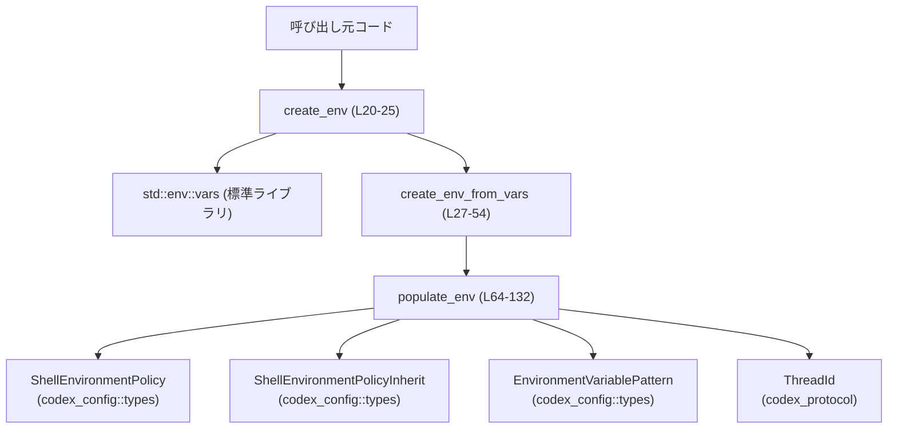
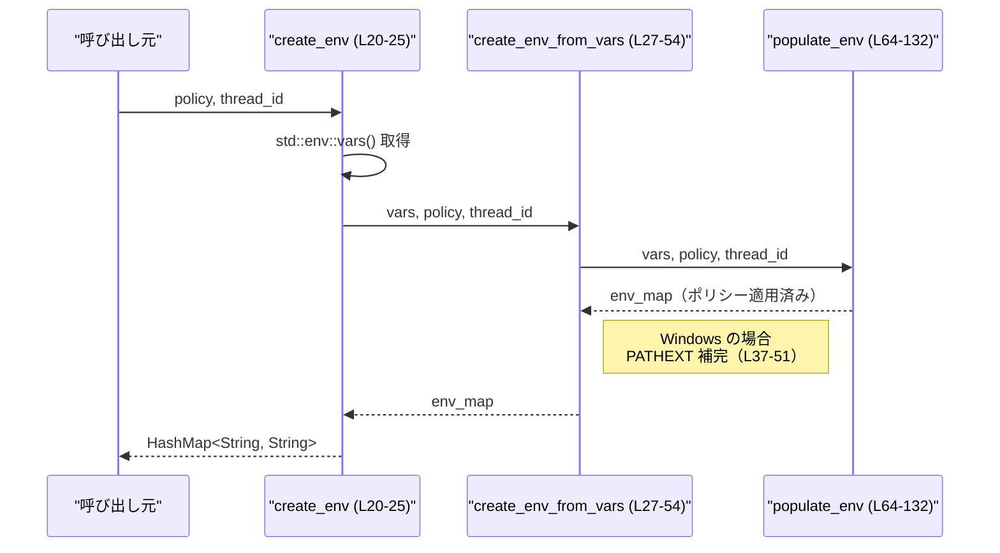

# core\src\exec_env.rs コード解説

## 0. ざっくり一言

このモジュールは、`ShellEnvironmentPolicy` に基づいてサブプロセスに渡す環境変数マップを構築するためのユーティリティを提供するモジュールです。ポリシーに従った継承・除外・上書き・絞り込み処理に加え、スレッド ID 用の環境変数 `CODEX_THREAD_ID` を注入します（core\src\exec_env.rs:L8-25, L64-132）。

---

## 1. このモジュールの役割

### 1.1 概要

- 現在のプロセス環境（`std::env::vars()`）を元に、`ShellEnvironmentPolicy` で指定されたルールに従って、新しい環境変数マップを構築します（core\src\exec_env.rs:L20-25, L64-132）。
- 環境変数の継承方法（すべて／なし／コアのみ）、機密情報の除外、ユーザー定義の除外・上書き・包含リストを順序立てて適用します（core\src\exec_env.rs:L72-124）。
- 必要に応じてスレッド ID を `CODEX_THREAD_ID` 環境変数として注入し、`include_only` が設定されていても必ず含めます（core\src\exec_env.rs:L8, L126-129）。
- Windows 向けには、`PATHEXT` が存在しない場合にデフォルト値を補完するワークアラウンドも行います（core\src\exec_env.rs:L37-51）。

### 1.2 アーキテクチャ内での位置づけ

このモジュールは「環境変数の構築担当」です。外部からは主に `create_env` が呼び出され、内部で環境変数の構築ロジック（`populate_env`）が実行されます。



- 外部から直接利用されるのは `create_env`（公開関数）と `CODEX_THREAD_ID_ENV_VAR`（公開定数）です（core\src\exec_env.rs:L8, L20）。
- `create_env` は現在のプロセス環境を読み出し、`create_env_from_vars` に引き渡します（core\src\exec_env.rs:L24）。
- `create_env_from_vars` は汎用の「任意の `(String, String)` イテレータから環境を構築する」関数で、テストや特殊な呼び出し元から利用されます（ただしモジュール外からは非公開です）（core\src\exec_env.rs:L27-35）。
- 実際のポリシー適用ロジックは `populate_env` に集中しています（core\src\exec_env.rs:L64-132）。

### 1.3 設計上のポイント

- **段階的なアルゴリズム構成**  
  継承 → デフォルト除外 → カスタム除外 → 上書き → include_only → スレッド ID 注入、の順で処理が行われます（core\src\exec_env.rs:L72-129）。処理順序が仕様そのものになっています。
- **継承戦略の明示**  
  `ShellEnvironmentPolicyInherit` の `All` / `None` / `Core` の 3 つの戦略に応じて初期の環境マップを作ります（core\src\exec_env.rs:L72-94）。
- **コア環境変数のプラットフォーム依存リスト**  
  共通コア変数とプラットフォーム固有のコア変数を別定数で定義し（core\src\exec_env.rs:L56-62）、`inherit=Core` の場合にのみ利用します（core\src\exec_env.rs:L78-82）。
- **名前パターンによる除外／包含**  
  機密情報らしき環境変数をデフォルト除外するために `EnvironmentVariablePattern` を使ってパターンマッチングします（core\src\exec_env.rs:L96-108, L111-114, L121-124）。
- **上書きとフィルタリングの順序**  
  除外を先に適用し、その後で `policy.r#set` に基づく上書きを行うことで、除外対象であってもユーザー明示の上書きで再度追加できるようになっています（core\src\exec_env.rs:L101-119）。ただしその後の `include_only` には影響を受けます（core\src\exec_env.rs:L121-124）。
- **スレッド ID の強制注入**  
  `include_only` で絞り込みを行った後に `CODEX_THREAD_ID` を挿入することで、「include_only にもかかわらず必ず含める」という仕様を実現しています（core\src\exec_env.rs:L121-129）。
- **安全性**  
  - このファイルには `unsafe` ブロックは存在しません（core\src\exec_env.rs:全体）。
  - すべてのデータ構造は関数ローカルに作られるため、共有可変状態によるデータ競合はありません。
- **並行性**  
  - 唯一のグローバル状態アクセスは `std::env::vars()` によるプロセス環境の読み取りです（core\src\exec_env.rs:L24）。  
    他スレッドから `std::env::set_var` などで環境を書き換えている場合、読み取られる内容はその時点のスナップショットになります。

---

## 2. 主要な機能一覧

- 環境変数マップの構築: `ShellEnvironmentPolicy` に基づき、子プロセス用の `HashMap<String, String>` を生成します（core\src\exec_env.rs:L20-25, L64-132）。
- プラットフォームに応じたコア環境変数の選択と継承: `inherit=Core` のときに PATH や HOME など最低限の変数のみを引き継ぎます（core\src\exec_env.rs:L56-62, L72-94）。
- 機密情報らしき環境変数のデフォルト除外とユーザー定義フィルタリング: `*KEY*` / `*SECRET*` / `*TOKEN*` などのパターンに基づく除外と、ポリシーで渡された除外・包含リストの適用を行います（core\src\exec_env.rs:L96-108, L111-124）。
- スレッド ID 環境変数の注入: `CODEX_THREAD_ID_ENV_VAR` 定数に基づき、スレッド ID を環境変数として注入します（core\src\exec_env.rs:L8, L126-129）。
- Windows における `PATHEXT` の補完: Bazel 実行時の不具合への対処として、`PATHEXT` が未設定ならデフォルト値を追加します（core\src\exec_env.rs:L37-51）。

### 2.1 コンポーネント一覧（このチャンク内）

#### 内部コンポーネント

| 名前 | 種別 | 公開範囲 | 定義箇所 | 説明 |
|------|------|----------|----------|------|
| `CODEX_THREAD_ID_ENV_VAR` | 定数 `&'static str` | `pub` | core\src\exec_env.rs:L8-8 | スレッド ID を格納する環境変数名 `"CODEX_THREAD_ID"` を表す定数です。 |
| `create_env` | 関数 | `pub` | core\src\exec_env.rs:L20-25 | 現在のプロセス環境から、ポリシーに従った環境マップを構築するエントリポイントです。 |
| `create_env_from_vars` | 関数 | `fn`（モジュール内限定） | core\src\exec_env.rs:L27-54 | 任意の `(String, String)` イテレータから環境マップを構築する内部ヘルパーです。Windows 向けの `PATHEXT` 補完もここで行います。 |
| `COMMON_CORE_VARS` | 定数 `&[&str]` | `const`（モジュール内） | core\src\exec_env.rs:L56-56 | 全プラットフォーム共通の「コア環境変数」名のリストです（例: `"PATH"`, `"SHELL"`）。 |
| `PLATFORM_CORE_VARS` | 定数 `&[&str]` | `const`（モジュール内） | core\src\exec_env.rs:L58-59, L61-62 | プラットフォームごとのコア環境変数リストです。Windows と Unix で別々に定義されています。 |
| `populate_env` | 関数 | `fn`（モジュール内限定） | core\src\exec_env.rs:L64-132 | `ShellEnvironmentPolicy` に従って継承・除外・上書き・絞り込み・スレッド ID 注入を行うコアロジックです。 |
| `tests` | モジュール | `mod`（`cfg(test)` 時のみ） | core\src\exec_env.rs:L134-136 | テスト用モジュールで、`exec_env_tests.rs` に委譲されています。内容はこのチャンクには含まれていません。 |

#### 外部依存コンポーネント（このファイルから参照しているもの）

| 名前 | 種別 | 出典 | 利用箇所 | 用途（わかる範囲） |
|------|------|------|----------|----------------------|
| `ShellEnvironmentPolicy` | 構造体（推測） | `codex_config::types` | core\src\exec_env.rs:L21, L29, L66 | 環境の継承方法や除外／包含パターン、上書き設定を保持するポリシー。`inherit`, `ignore_default_excludes`, `exclude`, `r#set`, `include_only` フィールドが存在します。 |
| `ShellEnvironmentPolicyInherit` | 列挙体 | `codex_config::types` | core\src\exec_env.rs:L73-94 | `All` / `None` / `Core` の 3 バリアントを持ち、環境変数の継承戦略を表します。 |
| `EnvironmentVariablePattern` | 型（詳細不明） | `codex_config::types` | core\src\exec_env.rs:L96-99, L103-107 | 環境変数名に対するパターンマッチを行う型です。`matches` と `new_case_insensitive` メソッドが使われています。実装詳細はこのチャンクにはありません。 |
| `ThreadId` | 型 | `codex_protocol` | core\src\exec_env.rs:L22, L30, L67-68, L126-129 | スレッド ID 表現。`to_string()` が呼ばれているため、表示可能です。 |
| `HashMap`, `HashSet` | コレクション | `std::collections` | core\src\exec_env.rs:L5-6, L74, L78-82, L92, L101-132 | 環境変数のキーと値の保存、およびコア変数名集合の管理に使用されます。 |
| `std::env::vars` | 関数 | 標準ライブラリ | core\src\exec_env.rs:L24 | 現在のプロセス環境を `(String, String)` イテレータとして取得します。 |

---

## 3. 公開 API と詳細解説

### 3.1 型一覧（構造体・列挙体など）

このモジュール内で新しく定義されている構造体・列挙体はありません。

利用している主な外部型は次のとおりです（定義は他ファイル／他クレートにあります）:

| 名前 | 種別 | 役割 / 用途 |
|------|------|-------------|
| `ShellEnvironmentPolicy` | 構造体（外部定義） | 環境の継承・除外・上書き・包含ルールを保持します（inherit フィールドなどから推測）。 |
| `ShellEnvironmentPolicyInherit` | 列挙体（外部定義） | 継承戦略（All / None / Core）を表します。 |
| `EnvironmentVariablePattern` | 型（外部定義） | 環境変数名に対するパターンマッチングを提供します。 |
| `ThreadId` | 型（外部定義） | スレッド ID を表し、文字列化可能です。 |

### 3.2 関数詳細

#### `create_env(policy: &ShellEnvironmentPolicy, thread_id: Option<ThreadId>) -> HashMap<String, String>` （core\src\exec_env.rs:L20-25）

**概要**

- 現在のプロセス環境（`std::env::vars()`）を取得し、`ShellEnvironmentPolicy` と `thread_id` に基づいて環境変数マップを構築する公開 API です（core\src\exec_env.rs:L20-25）。
- 生成された `HashMap<String, String>` は、`std::process::Command::env_clear()` 呼び出し後に `Command::envs()` にそのまま渡すことを意図しています（doc コメント, core\src\exec_env.rs:L10-19）。

**引数**

| 引数名 | 型 | 説明 |
|--------|----|------|
| `policy` | `&ShellEnvironmentPolicy` | 環境変数の継承方法・除外／包含ルール・上書き値などを含むポリシーです。 |
| `thread_id` | `Option<ThreadId>` | スレッド ID。`Some(id)` の場合は `CODEX_THREAD_ID` 環境変数として注入されます。`None` の場合は注入されません（core\src\exec_env.rs:L126-129）。 |

**戻り値**

- `HashMap<String, String>`  
  ポリシーと `thread_id` に基づいて構築された、新しい環境変数マップです（core\src\exec_env.rs:L20-25）。

**内部処理の流れ**

1. `std::env::vars()` を呼び出し、現在のプロセス環境を `(String, String)` のイテレータとして取得します（core\src\exec_env.rs:L24）。
2. そのイテレータと `policy`, `thread_id` を `create_env_from_vars` に渡します（core\src\exec_env.rs:L24）。
3. `create_env_from_vars` から返された `HashMap<String, String>` をそのまま呼び出し元に返します（core\src\exec_env.rs:L24-25）。

**Examples（使用例）**

この例ではモジュール内からの呼び出しを想定し、ポリシーの構築方法は抽象化しています（実際のフィールド構成はこのチャンクにはありません）。

```rust
use std::process::Command;
use codex_config::types::ShellEnvironmentPolicy;
use codex_protocol::ThreadId;

// policy および thread_id はどこか別の場所で構築されていると仮定する
fn spawn_child(policy: &ShellEnvironmentPolicy, thread_id: ThreadId) -> std::io::Result<()> {
    // ポリシーに従った環境マップを構築する
    let env_map = create_env(policy, Some(thread_id)); // core\src\exec_env.rs:L20-25

    // 子プロセスの環境をクリーンにしてから、構築したマップを適用する
    let mut cmd = Command::new("bash");
    cmd.env_clear();
    cmd.envs(&env_map);

    let status = cmd.status()?;
    println!("child exited with: {:?}", status);
    Ok(())
}
```

**Errors / Panics（Rust 言語固有の観点）**

- `create_env` 自体は `Result` を返さず、エラーは型としては表現していません。
- 内部で利用する標準ライブラリの `std::env::vars()` は、環境変数のキーまたは値に無効な UTF-8 が含まれる場合にパニックを起こす可能性があります（Rust 標準ライブラリの仕様による）。この場合、本関数からもパニックが伝播します。
- メモリ不足など、`HashMap` や `String` の割り当てに関する一般的なパニックの可能性はありますが、特別な対策は行っていません。

**Edge cases（エッジケース）**

- `thread_id` が `None` の場合:  
  `CODEX_THREAD_ID` は環境マップに追加されません（core\src\exec_env.rs:L126-129）。
- プロセス環境が空の場合:  
  `std::env::vars()` が空イテレータを返し、以降の処理は `populate_env` に委ねられます（core\src\exec_env.rs:L24）。

**使用上の注意点**

- **環境のクリーン化**:  
  doc コメントにある通り、既存環境と混ざることを避けるには `Command::env_clear()` を呼んだ後で `envs()` に渡すことが前提とされています（core\src\exec_env.rs:L10-13）。
- **並行性**:  
  - `std::env::vars()` はプロセス全体のグローバル環境を読み出します。他スレッドから `set_var` / `remove_var` などで同時に変更される場合、その時点の状態を読み取りますが、読み取り側のコード内には共有可変状態はありません。
- **ロケール・パス依存**:  
  基本的なロケールや PATH 等の扱いには `ShellEnvironmentPolicy` の設定と `inherit` 戦略が影響するため、ポリシーと OS の組み合わせを意識する必要があります。

---

#### `create_env_from_vars<I>(vars: I, policy: &ShellEnvironmentPolicy, thread_id: Option<ThreadId>) -> HashMap<String, String>` （core\src\exec_env.rs:L27-54）

**概要**

- 任意の `(String, String)` のイテレータから環境マップを構築する内部関数です。
- 主な役割は `populate_env` に処理を委譲し、Windows の場合に `PATHEXT` が存在しないときデフォルト値を追加することです（core\src\exec_env.rs:L35-51）。

**引数**

| 引数名 | 型 | 説明 |
|--------|----|------|
| `vars` | `I`（`IntoIterator<Item = (String, String)>`） | 初期環境変数のソース。例えば `std::env::vars()` やテスト用のベクタなどが渡されます。 |
| `policy` | `&ShellEnvironmentPolicy` | 環境の継承・フィルタリングに使用するポリシーです。 |
| `thread_id` | `Option<ThreadId>` | スレッド ID。`populate_env` に渡され、必要なら `CODEX_THREAD_ID` として追加されます。 |

**戻り値**

- `HashMap<String, String>`  
  ポリシー・スレッド ID に従って `populate_env` で処理された環境マップを返します。Windows の場合は `PATHEXT` が補完されている可能性があります（core\src\exec_env.rs:L35-51, L53）。

**内部処理の流れ**

1. `populate_env(vars, policy, thread_id)` を呼び出し、ポリシーに従って環境マップを構築します（core\src\exec_env.rs:L35）。
2. コンパイル時に `target_os = "windows"` のときのみ有効な条件付き処理ブロックが展開されます（core\src\exec_env.rs:L37）。
3. Windows の場合:
   - `env_map` のキーの中に `"PATHEXT"` が（大文字小文字を無視した比較で）存在するかをチェックします（core\src\exec_env.rs:L49）。
   - 存在しない場合、`"PATHEXT"` に `".COM;.EXE;.BAT;.CMD"` を設定します（core\src\exec_env.rs:L50）。
4. 生成された `env_map` を返します（core\src\exec_env.rs:L53）。

**Examples（使用例）**

この関数は非公開ですが、同一モジュール内やテストから、任意の環境セットを使って動作確認する用途が考えられます。

```rust
fn build_env_for_test(policy: &ShellEnvironmentPolicy) -> HashMap<String, String> {
    // 任意の初期環境セット（テスト用）
    let vars = vec![
        ("PATH".to_string(), "/usr/bin".to_string()),
        ("MY_SECRET".to_string(), "xxx".to_string()),
    ];

    // テストでは thread_id を指定しない
    create_env_from_vars(vars, policy, None) // core\src\exec_env.rs:L27-35
}
```

※ 実際のテストコードは `exec_env_tests.rs` にあり、このチャンクには含まれていません。

**Errors / Panics**

- `populate_env` と同様、メモリ割り当てに起因するパニック以外に、特別なエラー処理はありません。
- `vars.into_iter().collect()` などで要素を取り込む際、イテレータ実装がパニックを起こした場合、そのパニックは伝播します（例: 標準ライブラリ以外のイテレータ実装）。

**Edge cases（エッジケース）**

- Windows 以外の OS:  
  `cfg!(target_os = "windows")` はコンパイル時定数として `false` になり、`PATHEXT` 補完コードは実行されません（core\src\exec_env.rs:L37-52）。
- Windows で `PATHEXT` がすでに存在する場合:  
  キー比較は `eq_ignore_ascii_case` を使っているため、大文字小文字が異なっていても既存の `PATHEXT` を尊重し、上書きしません（core\src\exec_env.rs:L49-51）。
- Windows で `PATHEXT` が存在しない場合:  
  デフォルトの実行拡張子リスト `".COM;.EXE;.BAT;.CMD"` が追加されます（core\src\exec_env.rs:L50）。

**使用上の注意点**

- この関数はモジュール外からは利用できません（`pub` ではないため）。
- Windows 固有の問題回避のための暫定的ワークアラウンドである、とコメントされています（core\src\exec_env.rs:L38-48）。将来的に仕様が変わる可能性があります。

---

#### `populate_env<I>(vars: I, policy: &ShellEnvironmentPolicy, thread_id: Option<ThreadId>) -> HashMap<String, String>` （core\src\exec_env.rs:L64-132）

**概要**

- 与えられた初期環境と `ShellEnvironmentPolicy` に基づいて環境マップを構築する、コアロジックを担う内部関数です。
- 継承戦略の適用、デフォルト除外、カスタム除外、ユーザー上書き、包含リスト、`CODEX_THREAD_ID` 注入の 6 ステップで構成されています（core\src\exec_env.rs:L72-129）。

**引数**

| 引数名 | 型 | 説明 |
|--------|----|------|
| `vars` | `I`（`IntoIterator<Item = (String, String)>`） | 初期環境変数のソース。キー・値ともに所有権を持つ `String` のペアです。 |
| `policy` | `&ShellEnvironmentPolicy` | 継承戦略 (`inherit`) や除外／包含パターン、上書き値を含むポリシーです。 |
| `thread_id` | `Option<ThreadId>` | スレッド ID。指定されていれば `CODEX_THREAD_ID` に設定されます。 |

**戻り値**

- `HashMap<String, String>`  
  ポリシーとスレッド ID を適用した最終的な環境マップです（core\src\exec_env.rs:L131-131）。

**内部処理の流れ（アルゴリズム）**

1. **Step 1 – 継承戦略の適用**（core\src\exec_env.rs:L72-94）  
   `policy.inherit` に応じて初期の `env_map` を決定します。
   - `ShellEnvironmentPolicyInherit::All`:  
     `vars.into_iter().collect()` により、すべての環境変数を継承します（core\src\exec_env.rs:L74-75）。
   - `ShellEnvironmentPolicyInherit::None`:  
     空の `HashMap` を作成します（core\src\exec_env.rs:L76-76）。
   - `ShellEnvironmentPolicyInherit::Core`:  
     - `COMMON_CORE_VARS` と `PLATFORM_CORE_VARS` を連結した `core_vars` セットを作成します（core\src\exec_env.rs:L78-82）。
     - `is_core_var` クロージャでキーがコア変数かどうかを判定し、該当するものだけを `env_map` に取り込みます（プラットフォームに応じて大文字小文字の扱いが変わります）（core\src\exec_env.rs:L83-92）。

2. **内部ヘルパー `matches_any` の定義**（core\src\exec_env.rs:L96-99）  
   - `name` が `patterns` のうちいずれかの `EnvironmentVariablePattern` にマッチするかを判定するクロージャです。  
     `patterns.iter().any(|pattern| pattern.matches(name))` で実装されています。

3. **Step 2 – デフォルト除外の適用**（core\src\exec_env.rs:L101-109）  
   - `policy.ignore_default_excludes` が `false` の場合のみ実行されます（core\src\exec_env.rs:L101-102）。
   - `default_excludes` として `*KEY*`, `*SECRET*`, `*TOKEN*` の 3 パターンを `EnvironmentVariablePattern::new_case_insensitive` で構築します（core\src\exec_env.rs:L103-107）。
   - `env_map.retain` を使い、これらパターンにマッチするキーを持つエントリを削除します（core\src\exec_env.rs:L108-108）。

4. **Step 3 – カスタム除外の適用**（core\src\exec_env.rs:L111-114）  
   - `policy.exclude` が空でない場合のみ実行されます（core\src\exec_env.rs:L111-112）。
   - `matches_any(k, &policy.exclude)` にマッチするキーのエントリを削除します（core\src\exec_env.rs:L113-113）。

5. **Step 4 – ユーザー上書きの適用**（core\src\exec_env.rs:L116-119）  
   - `for (key, val) in &policy.r#set` により、上書き設定を走査します（core\src\exec_env.rs:L117）。
   - `env_map.insert(key.clone(), val.clone())` で、既存の値の有無にかかわらず指定されたキーの値を設定します（core\src\exec_env.rs:L118）。
   - `policy.r#set` の具体的な型はこのチャンクにはありませんが、`&(key, val)` のように反復可能なマップ状の構造であると読み取れます。

6. **Step 5 – include_only の適用**（core\src\exec_env.rs:L121-124）  
   - `policy.include_only` が空でない場合のみ実行されます（core\src\exec_env.rs:L121-122）。
   - `matches_any(k, &policy.include_only)` にマッチするキーだけを残し、それ以外を削除します（core\src\exec_env.rs:L123-123）。

7. **Step 6 – スレッド ID の注入**（core\src\exec_env.rs:L126-129）  
   - `thread_id` が `Some(id)` の場合、`env_map.insert(CODEX_THREAD_ID_ENV_VAR.to_string(), id.to_string())` が実行されます（core\src\exec_env.rs:L126-129）。
   - これは `include_only` 適用後に実行されるため、`include_only` の設定に関係なく `CODEX_THREAD_ID` が追加されます。

8. 最終的な `env_map` を返します（core\src\exec_env.rs:L131-131）。

**Examples（使用例）**

`populate_env` は内部関数ですが、その挙動を理解するための疑似的な例です。

```rust
use codex_config::types::{ShellEnvironmentPolicy, ShellEnvironmentPolicyInherit};
use codex_protocol::ThreadId;
use std::collections::HashMap;

fn example(policy: &ShellEnvironmentPolicy, thread_id: Option<ThreadId>) -> HashMap<String, String> {
    // 初期環境（例: PATH とシークレットを含む）
    let vars = vec![
        ("PATH".to_string(), "/usr/bin".to_string()),
        ("API_KEY".to_string(), "secret".to_string()),
    ];

    // 実際には create_env_from_vars から呼ばれます
    populate_env(vars, policy, thread_id) // core\src\exec_env.rs:L64-69
}
```

※ `ShellEnvironmentPolicy` の具体的な生成方法はこのチャンクにはありません。

**Errors / Panics**

- 関数内で明示的に `panic!` を呼び出してはいません。
- `HashMap` の `insert` や `retain`、`HashSet` の `collect` など、標準ライブラリ操作に伴う通常のパニック（メモリ不足等）の可能性はあります。
- `EnvironmentVariablePattern::new_case_insensitive` や `.matches` の内部でのパニック有無は、このチャンクからは分かりません。

**Edge cases（エッジケース）**

- `inherit = None` の場合:  
  Step 1 で空の `env_map` から開始するため、以降の処理（除外・包含）は実質 `policy.r#set` などによる追加にのみ作用します（core\src\exec_env.rs:L76, L116-119）。
- `ignore_default_excludes = true` の場合:  
  `*KEY*` 等のデフォルト除外パターンは適用されません（core\src\exec_env.rs:L101-102）。
- `policy.exclude` も `policy.include_only` も空の場合:  
  カスタム除外と包含によるフィルタリングはスキップされ、継承戦略とデフォルト除外、上書きのみが適用されます（core\src\exec_env.rs:L111-114, L121-124）。
- `policy.r#set` にデフォルト除外に該当する名前の変数が含まれる場合:  
  除外は Step 2, 3 で先に適用され、Step 4 で上書きが行われるため、結果として環境に残ります（core\src\exec_env.rs:L101-114, L116-119）。
- `policy.include_only` が設定されている場合:  
  Step 5 で `include_only` にマッチしない変数はすべて削除されますが、その後 Step 6 で `CODEX_THREAD_ID` が追加されます（core\src\exec_env.rs:L121-129）。
- `thread_id = None` の場合:  
  `CODEX_THREAD_ID` は追加されません（core\src\exec_env.rs:L126-129）。

**使用上の注意点**

- **順序依存**:  
  除外 → 上書き → 包含 → スレッド ID 注入という順序に意味があります。たとえば、`include_only` を先に適用すると、上書きした変数が削除されてしまうなど、現在と異なる挙動になります。
- **大文字小文字の扱い**:
  - コア変数判定 (`inherit=Core`) の場合、Windows では大文字小文字が無視されますが、それ以外の環境では区別されます（core\src\exec_env.rs:L83-90）。
  - `EnvironmentVariablePattern::new_case_insensitive` により、デフォルト除外パターンは大文字小文字を区別しないマッチングを行うと推測されますが、実装詳細はこのチャンクにはありません（core\src\exec_env.rs:L103-107）。
- **並行性**:  
  この関数自体は渡された `vars` 以外のグローバル状態にアクセスせず、`HashMap` もローカル変数としてのみ扱われるため、並行呼び出ししてもデータ競合は発生しません（スレッド安全かどうかは、呼び出し元が提供する `vars` のイテレータ実装に依存します）。

### 3.3 その他の関数

このモジュールには上記 3 関数以外の関数定義はありません。

---

## 4. データフロー

代表的な処理シナリオとして、「呼び出し元が `create_env` で環境マップを構築する」フローを示します。



要点:

- 呼び出し元は `policy` と `thread_id` を `create_env` に渡すだけで、内部の詳細な処理ステップ（継承・除外・上書き・包含・スレッド ID 注入）は `populate_env` に隠蔽されています。
- OS 依存の処理は `create_env_from_vars` 内の `cfg!(target_os = "windows")` ブロックに集約されており、その他のロジックはプラットフォーム非依存です（core\src\exec_env.rs:L37-52）。

---

## 5. 使い方（How to Use）

### 5.1 基本的な使用方法

典型的な使用は、「`ShellEnvironmentPolicy` を決め、`create_env` で環境マップを構築し、`Command` に適用する」という流れです。

```rust
use std::process::Command;
use codex_config::types::ShellEnvironmentPolicy;
use codex_protocol::ThreadId;

// policy, thread_id は別途構築されていると仮定
fn spawn_with_policy(policy: &ShellEnvironmentPolicy, thread_id: Option<ThreadId>) -> std::io::Result<()> {
    // 1. ポリシーに従って環境マップを構築
    let env_map = create_env(policy, thread_id); // core\src\exec_env.rs:L20-25

    // 2. 既存の環境をクリアし、構築した環境を適用
    let mut cmd = Command::new("bash");
    cmd.env_clear();            // 既存の環境をクリア
    cmd.envs(&env_map);         // 新しい環境をまとめて適用

    // 3. コマンドを実行
    let status = cmd.status()?;
    println!("child status: {:?}", status);
    Ok(())
}
```

ポイント:

- `env_clear()` を呼ぶことで、親プロセスの環境が意図せず子プロセスに引き継がれることを防ぎます（core\src\exec_env.rs:L10-13）。
- `thread_id` に `Some` を渡すと、子プロセスから `CODEX_THREAD_ID` 環境変数を経由してスレッド ID を参照できるようになります（core\src\exec_env.rs:L8, L126-129）。

### 5.2 よくある使用パターン

#### 1. すべての環境変数を継承する

`policy.inherit` が `ShellEnvironmentPolicyInherit::All` の場合、`vars` の内容がそのままベースとして利用されます（core\src\exec_env.rs:L74-75）。

- 特徴:
  - 親プロセスと同じ環境をほぼ保ちながら、追加の除外・上書きのみを行いたい場合に適しています。
- 挙動:
  - `ignore_default_excludes` が `false` の場合は、`*KEY*` / `*SECRET*` / `*TOKEN*` にマッチする環境変数は削除されます（core\src\exec_env.rs:L101-109）。

#### 2. コア環境変数のみ継承する

`policy.inherit` が `ShellEnvironmentPolicyInherit::Core` の場合、`COMMON_CORE_VARS` と `PLATFORM_CORE_VARS` に含まれる変数のみ継承されます（core\src\exec_env.rs:L72-82）。

- 例:
  - Unix: `"PATH"`, `"HOME"`, `"LANG"` 等（core\src\exec_env.rs:L56, L61-62）。
  - Windows: `"PATH"`, `"PATHEXT"`, `"USERNAME"` など（core\src\exec_env.rs:L56, L58-59）。
- 用途:
  - 環境を最小限に保ちたいが、実行パスや基本ロケール設定は維持したい場合。

#### 3. `include_only` によるホワイトリスト方式

`policy.include_only` が非空の場合、Step 5 でホワイトリストにマッチする変数のみが残されます（core\src\exec_env.rs:L121-124）。

- 特徴:
  - 必要な変数だけを厳密にコントロールしたい場合に使用します。
- 注意:
  - `CODEX_THREAD_ID` は `include_only` の対象外で常に追加されるため、ホワイトリスト外であっても環境に現れます（core\src\exec_env.rs:L121-129）。

### 5.3 よくある間違い

```rust
use std::process::Command;
use codex_config::types::ShellEnvironmentPolicy;

// 間違い例: env_clear を呼ばずに envs を適用
fn bad_spawn(policy: &ShellEnvironmentPolicy) -> std::io::Result<()> {
    let env_map = create_env(policy, None);

    let mut cmd = Command::new("bash");
    // cmd.env_clear();  // ← これを忘れている

    cmd.envs(&env_map);
    cmd.status()?;
    Ok(())
}

// 正しい例: 既存環境をクリアしてから適用
fn good_spawn(policy: &ShellEnvironmentPolicy) -> std::io::Result<()> {
    let env_map = create_env(policy, None);

    let mut cmd = Command::new("bash");
    cmd.env_clear();   // 既存環境をクリア
    cmd.envs(&env_map);
    cmd.status()?;
    Ok(())
}
```

その他の注意すべき誤用例:

- **`thread_id` を `None` にしているのに、子プロセス側で `CODEX_THREAD_ID` を期待する**  
  → `thread_id` に `Some(id)` を渡さない限り、`CODEX_THREAD_ID` はセットされません（core\src\exec_env.rs:L126-129）。
- **`ignore_default_excludes` を `true` にせずに、`*KEY*` を含む変数が消えてしまうと驚く**  
  → デフォルト除外が有効なためです（core\src\exec_env.rs:L101-109）。
- **`include_only` を設定しているのに `CODEX_THREAD_ID` が残っていると不思議に感じる**  
  → スレッド ID は Step 5 の後で必ず追加される仕様です（core\src\exec_env.rs:L121-129）。

### 5.4 使用上の注意点（まとめ）

- **安全性**
  - このモジュールでは `unsafe` は使用しておらず、データ構造も関数ローカルで完結しています。
  - ただし、標準ライブラリの `std::env::vars()` は無効な UTF-8 を含む場合にパニックする可能性があります。
- **並行性**
  - 関数はスレッドセーフに設計されていますが、プロセス環境はグローバル共有状態であり、他スレッドからの書き換えの影響を受けます。
- **機密情報の扱い**
  - デフォルト除外は名前に `KEY` / `SECRET` / `TOKEN` を含む場合にしか作用しません。それ以外の機密情報は `policy.exclude` を使って明示的に除外する必要があります（core\src\exec_env.rs:L103-114）。
- **パフォーマンス**
  - `inherit=Core` の場合、毎回 `HashSet` を構築しています（core\src\exec_env.rs:L78-82）。通常サイズは小さいため大きな問題にはなりにくいですが、高頻度で呼び出す場合は意識しておくとよいです。

---

## 6. 変更の仕方（How to Modify）

### 6.1 新しい機能を追加する場合

例として、「デフォルト除外パターンを追加する」場合を考えます。

1. **どこに追加するか**
   - デフォルト除外は `populate_env` の Step 2 で定義されているので（core\src\exec_env.rs:L101-109）、このブロックにパターンを追加するのが自然です。
2. **既存の関数・型への依存**
   - 新しいパターンも `EnvironmentVariablePattern::new_case_insensitive` で生成し、既存の `default_excludes` ベクタに追加します（core\src\exec_env.rs:L103-107）。
3. **呼び出し元への影響**
   - `ignore_default_excludes` が `false` のすべての呼び出しに影響するため、既存の挙動に依存しているコードの確認が必要です。
4. **テスト**
   - `exec_env_tests.rs` 内のテストにデフォルト除外の追加ケースを反映する必要があります（core\src\exec_env.rs:L134-136）。

### 6.2 既存の機能を変更する場合

変更時に注意すべき点:

- **処理順序の維持**
  - 除外 → 上書き → include_only → スレッド ID 注入 という順序が仕様になっているため（core\src\exec_env.rs:L101-129）、順序を変えると互換性が壊れる可能性があります。
- **契約事項の確認**
  - `include_only` が設定されていても `CODEX_THREAD_ID` が常に追加される、という仕様は doc コメントで明記されています（core\src\exec_env.rs:L18-19, L126-129）。これを変える場合は、コメントや利用側の期待も更新する必要があります。
- **関連テストの確認**
  - `exec_env_tests.rs`（core\src\exec_env.rs:L135）に、処理順序や PATHEXT 補完などの挙動を前提としたテストが存在する可能性が高いです。変更前後でテストを確認し、必要に応じて更新する必要があります。
- **プラットフォーム依存コード**
  - `PLATFORM_CORE_VARS` や Windows の `PATHEXT` 補完は `cfg` 属性や `cfg!` マクロに依存しているため（core\src\exec_env.rs:L37-52, L58-62）、新たなプラットフォーム特有の処理を追加する際は同様のパターンを踏襲することが望ましいです。

---

## 7. 関連ファイル

このモジュールと密接に関連するファイル・コンポーネントです。

| パス / モジュール | 役割 / 関係 |
|------------------|------------|
| `core\src\exec_env_tests.rs` | テストモジュール。`#[cfg(test)] #[path = "exec_env_tests.rs"] mod tests;` により読み込まれます（core\src\exec_env.rs:L134-136）。具体的なテスト内容はこのチャンクには含まれていません。 |
| `codex_config::types::ShellEnvironmentPolicy` | 環境継承戦略・除外／包含・上書き設定を表すポリシー型です。`populate_env` の主な入力として使われます（core\src\exec_env.rs:L66-67, L72-94, L101-124）。 |
| `codex_config::types::ShellEnvironmentPolicyInherit` | 環境継承戦略を表す列挙体で、Step 1 の挙動を決定します（core\src\exec_env.rs:L72-94）。 |
| `codex_config::types::EnvironmentVariablePattern` | 環境変数名に対するパターンマッチングを提供し、デフォルト除外やカスタム除外・包含に利用されます（core\src\exec_env.rs:L96-99, L103-107, L111-114, L121-124）。 |
| `codex_protocol::ThreadId` | スレッド ID を表す型で、`CODEX_THREAD_ID` 環境変数に文字列として格納されます（core\src\exec_env.rs:L22, L30, L67-68, L126-129）。 |

以上が、`core\src\exec_env.rs` の構造と振る舞い、および Rust 言語特有の安全性・エラー・並行性の観点を含めた解説です。
