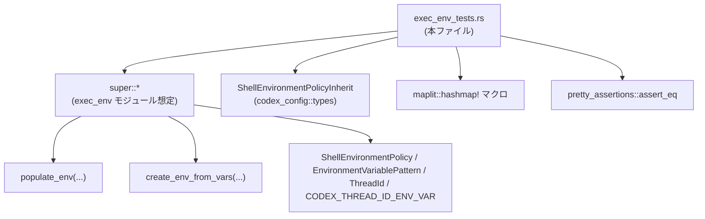
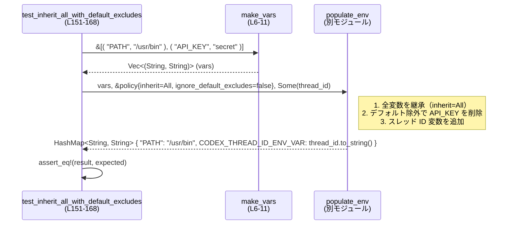

# core/src/exec_env_tests.rs コード解説

## 0. ざっくり一言

`exec_env` モジュールが提供する環境変数生成ロジック（`populate_env`, `create_env_from_vars`）について、継承ポリシーやフィルタリング、Windows 固有の挙動を検証する単体テスト群です（`core/src/exec_env_tests.rs:L13-259`）。

---

## 1. このモジュールの役割

### 1.1 概要

- このモジュールは、**子プロセス用の環境変数マップをどう構築するか** を決める `ShellEnvironmentPolicy` に対して、期待どおりに動作しているかをテストします（`core/src/exec_env_tests.rs:L13-259`）。
- 主に以下の点を検証しています。
  - 秘密情報を含む環境変数をデフォルトで保持／除外する挙動
  - `inherit`（All/Core/None）や `include_only`、`set` などポリシー項目の効き方
  - スレッド ID 用の専用環境変数が付与される条件
  - Windows における `PATH` 系環境変数の **大文字小文字非依存** の扱いと `PATHEXT` の自動補完

### 1.2 アーキテクチャ内での位置づけ

このファイルは `super::*` で親モジュール（おそらく `exec_env`）から以下を利用しています（型・関数定義自体はこのチャンクには存在しません）。

- `ShellEnvironmentPolicy`, `EnvironmentVariablePattern`, `ThreadId`, `CODEX_THREAD_ID_ENV_VAR`
- `populate_env`, `create_env_from_vars`

外部クレートとしては `codex_config::types::ShellEnvironmentPolicyInherit`、`maplit::hashmap!`、`pretty_assertions::assert_eq` を使用します（`core/src/exec_env_tests.rs:L1-4`）。



> 注: 親モジュールのファイルパスや詳細実装は、このチャンクには含まれていません。

### 1.3 設計上のポイント（テストコード視点）

- **重複削減のヘルパー関数**  
  - 環境変数の `(key, value)` ペアを `Vec<(String, String)>` に変換する `make_vars` を定義し、全テストで再利用しています（`core/src/exec_env_tests.rs:L6-11`）。

- **ポリシー駆動のテスト**  
  - `ShellEnvironmentPolicy` の各フィールド（`inherit`, `ignore_default_excludes`, `include_only`, `set`）を組み合わせてテストし、「どの入力でどんな出力マップになるか」を明示しています（例: `core/src/exec_env_tests.rs:L46-59, L66-71, L88-92, L138-142`）。

- **スレッド ID の挿入有無を明示**  
  - `populate_env` の第 3 引数として `Option<ThreadId>` を渡し、`Some` のときだけ `CODEX_THREAD_ID_ENV_VAR` が追加されること、`None` のときは追加されないことをテストしています（`core/src/exec_env_tests.rs:L106-132`）。

- **Windows 固有の分岐を `cfg` で明示**  
  - `#[cfg(target_os = "windows")]` 付きテストで、Windows の環境変数名の大小文字非依存性と `PATHEXT` の扱いを確認しています（`core/src/exec_env_tests.rs:L171-196, L199-215, L218-237`）。

- **エラーハンドリング**  
  - `populate_env` / `create_env_from_vars` はテスト上 `HashMap<String, String>` を直接返しており、`Result` などのエラー型は利用されていません。テストは `assert_eq!` のみで検証しており、異常系・エラーケースについてはこのチャンクからは読み取れません。

---

## 2. 主要な機能一覧（テストが検証していること）

このモジュール自体は機能を「提供」するというより、「検証」しています。その検証対象機能をまとめると次のようになります。

- 環境変数の継承（inherit: All/Core/None）の挙動検証
- `ignore_default_excludes` による秘密情報（`API_KEY` / `SECRET_TOKEN` 等）の除外有無の検証
- `include_only`（`EnvironmentVariablePattern`）による **ホワイトリスト** フィルタの検証
- `policy.set`（生のフィールド名は `r#set`）による変数の新規追加・上書きの検証
- `CODEX_THREAD_ID_ENV_VAR` にスレッド ID を設定する／しない条件の検証
- Windows における `PATH` / `Path` / `PathExt` / `PATHEXT` / `TEMP` の扱いに関する検証
- Windows 上で `PATHEXT` が存在しない場合のデフォルト値挿入、および既存値がある場合の保持（重複作成防止）の検証

---

## 3. 公開 API と詳細解説

### 3.1 型一覧（このファイルで使用される主要な型）

※ 型の定義はすべて他ファイルにあり、このチャンクには存在しません。そのため、用途は**テストコードから読み取れる範囲**でのみ記述します。

| 名前 | 種別 | 役割 / 用途 | 根拠 |
|------|------|-------------|------|
| `ShellEnvironmentPolicy` | 構造体（推定） | 環境変数の継承・フィルタリング・上書きポリシーを表す設定オブジェクト。`inherit`, `ignore_default_excludes`, `include_only`, `set` などのフィールドを持つことがテストからわかります。 | 初期化とフィールド使用（`core/src/exec_env_tests.rs:L22, L46-49, L66-71, L88-92, L138-142, L155-158, L180-183, L203-207, L222-225, L243-247`） |
| `ShellEnvironmentPolicyInherit` | 列挙体（推定） | 環境変数をどこまで継承するかを指定するモード。`All`, `Core`, `None` の 3 値が使われます。 | インポートとフィールド使用（`core/src/exec_env_tests.rs:L2, L138-140, L155-157, L181-182, L203-205, L222-223, L243-245`） |
| `EnvironmentVariablePattern` | 構造体（推定） | `include_only` で使うパターン表現。`new_case_insensitive("*PATH")` から、ワイルドカードと大文字小文字非依存マッチをサポートするパターンであることが読み取れます。 | `include_only` の設定（`core/src/exec_env_tests.rs:L66-71`） |
| `ThreadId` | 型（構造体等、詳細不明） | スレッド ID を表す型。`ThreadId::new()` で生成し、`CODEX_THREAD_ID_ENV_VAR` の値として文字列化して使っています。 | 生成と使用（`core/src/exec_env_tests.rs:L23-24, L50-51, L73-74, L94-95, L110-111, L124-125, L144-147, L161-163, L186-193, L252-257`） |
| `CODEX_THREAD_ID_ENV_VAR` | 定数 | スレッド ID を格納するための環境変数名を表す定数。値はこのチャンクにはありませんが、複数テストで同様に使用されています。 | 使用箇所（`core/src/exec_env_tests.rs:L32, L57, L79, L101, L116, L147, L166, L193, L257`） |
| `HashMap<String, String>` | 標準ライブラリ型 | 環境変数名→値のマップを表現。`populate_env` および `create_env_from_vars` の戻り値として利用されています。 | 期待値の型注釈（`core/src/exec_env_tests.rs:L26, L53, L76, L97, L113, L127, L146, L163, L211, L254`） |

---

### 3.2 関数詳細（最大 7 件）

#### 1. `populate_env(...) -> HashMap<String, String>`（外部関数）

> 定義は `super` モジュール側にあり、このファイルにはありません。以下は**テストから読み取れる契約**です。

**概要**

- 入力となる環境変数のリストと `ShellEnvironmentPolicy`、`Option<ThreadId>` を基に、子プロセスに渡す環境変数マップを構築します。
- ポリシーに応じて、
  - どの変数を継承するか（`inherit`）
  - デフォルト除外ルールを適用するか（`ignore_default_excludes`）
  - `include_only` によるホワイトリストフィルタ
  - `set` による新規セット／上書き
  - スレッド ID 用変数の挿入
  を行うことがテストから分かります。

**引数（テストから見えるもの）**

| 引数名 | 型（推定） | 説明 | 根拠 |
|--------|------------|------|------|
| `vars` | `Vec<(String, String)>` またはそれと互換のイテレータ | 元の環境変数の一覧。`make_vars` の戻り値をそのまま渡しています。 | 呼び出し例（`core/src/exec_env_tests.rs:L15-20, L39-44, L64, L86, L108, L123, L136, L153, L173-178, L241`） |
| `policy` | `&ShellEnvironmentPolicy` | 継承・フィルタ・上書きのポリシー。構造体リテラルまたは `default()` で生成されます。 | 呼び出し例（`core/src/exec_env_tests.rs:L22-24, L46-51, L66-71, L88-95, L109-111, L124-125, L138-142, L155-162, L180-187, L243-253`） |
| `thread_id` | `Option<ThreadId>` | スレッド ID。`Some` の場合は専用環境変数を挿入し、`None` の場合は挿入しないことがテストされています。 | テスト（`core/src/exec_env_tests.rs:L22-24, L50-51, L73-74, L94-95, L110-111, L124-125, L144-147, L161-163, L186-193, L252-257`） |

**戻り値**

- 型: `HashMap<String, String>`
- 意味: 構築された環境変数マップ。入力 `vars` に対してポリシーを適用し、必要に応じて `CODEX_THREAD_ID_ENV_VAR` を追加したものです（例: `core/src/exec_env_tests.rs:L26-35, L53-60, L76-82, L97-104`）。

**内部処理の流れ（テストから推測できる範囲）**

1. **入力の継承モード適用**
   - `policy.inherit == All` の場合  
     → すべての入力変数をベースとしてコピー（`test_inherit_all` の期待値が `vars.into_iter().collect()` と等しい: `core/src/exec_env_tests.rs:L136-147`）。
   - `policy.inherit == Core` の場合  
     → Windows では `"Path"`, `"PathExt"`, `"TEMP"` などコア変数のみを残し、その他（`"FOO"`）は落とします（`core/src/exec_env_tests.rs:L173-193`）。
   - `policy.inherit == None` の場合  
     → 入力 `vars` は全く継承されず、`policy.set` 由来の変数のみになることがテストされています（`core/src/exec_env_tests.rs:L241-257`）。

2. **デフォルト除外フィルタの適用**
   - `policy.ignore_default_excludes == false` のとき、変数名に `KEY` / `SECRET` / `TOKEN` を含むようなものを除外しているとコメントにあります（`core/src/exec_env_tests.rs:L47 // apply KEY/SECRET/TOKEN filter`）。
   - 具体的には `"API_KEY"`, `"SECRET_TOKEN"` が削除されています（`core/src/exec_env_tests.rs:L39-60, L153-168`）。

3. **`include_only` の適用**
   - `include_only` が指定されている場合、そのパターンにマッチする変数だけが残ります。
   - 例: `new_case_insensitive("*PATH")` を指定すると `"PATH"` だけが残り `"FOO"` は落ちます（`core/src/exec_env_tests.rs:L63-82`）。

4. **`set` による上書き・追加**
   - `policy.set`（フィールド名は `r#set`）に登録された `(key, value)` が、環境マップに挿入されます。
   - 例: `NEW_VAR=42` を追加したテストでは、元の `"PATH"` に加えて `"NEW_VAR"` が存在することを確認しています（`core/src/exec_env_tests.rs:L88-103`）。

5. **スレッド ID 用変数の挿入**
   - `thread_id` が `Some(id)` のとき、`CODEX_THREAD_ID_ENV_VAR` をキーとして `id.to_string()` を値に挿入します（`core/src/exec_env_tests.rs:L32, L57, L79, L101, L116, L147, L166, L193, L257`）。
   - `thread_id == None` のときは、この変数は一切挿入されません（`core/src/exec_env_tests.rs:L121-132`）。

**Examples（使用例）**

このファイル自体が使用例になっています。典型的な呼び出しは次のようになります（`test_inherit_all` を簡略化）。

```rust
// 元の環境変数を Vec<(String, String)> で用意する
let vars = make_vars(&[("PATH", "/usr/bin"), ("FOO", "bar")]); // core/src/exec_env_tests.rs:L136

// ポリシーを All 継承・除外なしで構成する
let policy = ShellEnvironmentPolicy {
    inherit: ShellEnvironmentPolicyInherit::All,
    ignore_default_excludes: true, // 何も除外しない
    ..Default::default()
}; // core/src/exec_env_tests.rs:L138-142

// ThreadId を生成して Some(...) として渡す
let thread_id = ThreadId::new(); // core/src/exec_env_tests.rs:L144
let result = populate_env(vars.clone(), &policy, Some(thread_id)); // L145

// 期待されるマップは元の変数 + スレッド ID の環境変数
let mut expected: HashMap<String, String> = vars.into_iter().collect(); // L146
expected.insert(CODEX_THREAD_ID_ENV_VAR.to_string(), thread_id.to_string()); // L147
assert_eq!(result, expected); // L148
```

**Errors / Panics**

- このテストコードからは、`populate_env` が `Result` を返したり、明示的に `panic!` するかどうかは分かりません。
- すべてのテストは正常終了を前提としており、**エラー発生時の挙動はこのチャンクには現れません**。

**Edge cases（エッジケース：テストから読み取れるもの）**

- `thread_id == None` の場合  
  → `CODEX_THREAD_ID_ENV_VAR` は挿入されない（`populate_env_omits_thread_id_when_missing`: `core/src/exec_env_tests.rs:L121-132`）。
- `inherit == None` の場合  
  → 入力 `vars` はすべて無視され、`set` など明示的に指定したものだけが残る（`test_inherit_none`: `core/src/exec_env_tests.rs:L239-259`）。
- `ignore_default_excludes == false` で秘密情報名を含む変数  
  → `API_KEY`, `SECRET_TOKEN` が除去される（`core/src/exec_env_tests.rs:L39-60, L153-168`）。
- `include_only` 指定時  
  → パターンにマッチしない変数は存在しなくなる（`core/src/exec_env_tests.rs:L63-82`）。
- Windows かつ `inherit == Core`  
  → `"Path"`, `"PathExt"`, `"TEMP"` のようなコア変数は残るが、`"FOO"` は削除される（`core/src/exec_env_tests.rs:L171-196`）。

**使用上の注意点（契約観点）**

- `ignore_default_excludes` のデフォルト値について  
  - コメントでは「`ShellEnvironmentPolicy::default()` は `inherit All, default excludes ignored`」とされていますが（`core/src/exec_env_tests.rs:L22`）、実際のフィールド値は型定義がないため断定できません。
  - テスト `test_core_inherit_with_default_excludes_enabled` では、`ignore_default_excludes: false` を明示すると秘密情報が除外されることが前提になっています（`core/src/exec_env_tests.rs:L46-59`）。
- セキュリティ的前提  
  - `ignore_default_excludes == true` の場合、`API_KEY` や `SECRET_TOKEN` のような変数も環境に残ることをテストが期待しています（`core/src/exec_env_tests.rs:L13-35`）。
  - 子プロセスにどの程度秘匿情報を渡してよいかは、呼び出し側のポリシー設定に依存します。
- 並行性  
  - このテストコードにはマルチスレッド実行や共有状態は出てきません。`ThreadId` はあくまで「識別子を環境変数に載せる」用途であり、**並行アクセス安全性についてはこのチャンクからは分かりません**。

---

#### 2. `create_env_from_vars(...) -> HashMap<String, String>`（外部関数）

> 定義は `super` モジュール側。Windows 関連の挙動のみテストされています。

**概要**

- `populate_env` と同様に環境変数マップを構築しますが、Windows 上では特に `PATHEXT` の扱いについて追加のロジックがあることがテストされています。

**テストから分かる挙動**

1. **`PATHEXT` のデフォルト挿入**  
   - 入力 `vars` が空で、`inherit == None` の場合でも、`PATHEXT` が存在しないときに `.COM;.EXE;.BAT;.CMD` を自動挿入します（`core/src/exec_env_tests.rs:L200-215`）。

2. **既存 `PATHEXT` の尊重（大文字小文字非依存）**  
   - 入力に `"PathExt"` キーがある場合、結果のマップでは `PATHEXT` / `PathExt` 等いずれかのキーで **1 つだけ**存在し、その値が変更されず残ります（`.COM;.EXE;.BAT;.CMD;.PS1`）（`core/src/exec_env_tests.rs:L219-237`）。

**Edge cases / 契約**

- Windows 以外では、`#[cfg(target_os = "windows")]` によりこれらのテストはコンパイルされません。非 Windows 環境での `create_env_from_vars` の挙動はこのチャンクからは不明です。
- `PATHEXT` のキー比較が `eq_ignore_ascii_case` で行われていることが、テストのフィルタ条件から分かります（`core/src/exec_env_tests.rs:L230-233`）。

---

#### 3. `make_vars(pairs: &[(&str, &str)]) -> Vec<(String, String)>`

**概要**

- `(key, value)` を `&str` のスライスで受け取り、`Vec<(String, String)>` に変換するテスト用ヘルパーです（`core/src/exec_env_tests.rs:L6-11`）。
- すべてのテストで環境変数の入力を構築する際に使用されています。

**引数**

| 引数名 | 型 | 説明 | 根拠 |
|--------|----|------|------|
| `pairs` | `&[(&str, &str)]` | 環境変数のキーと値のペアの配列。 | 関数定義（`core/src/exec_env_tests.rs:L6`） |

**戻り値**

- 型: `Vec<(String, String)>`
- 意味: キー・値ともに `String` に変換された `(key, value)` のベクタ（`core/src/exec_env_tests.rs:L7-10`）。

**内部処理**

1. `pairs.iter()` で `(&str, &str)` のスライスをイテレートします（`core/src/exec_env_tests.rs:L7-8`）。
2. `.map(|(k, v)| (k.to_string(), v.to_string()))` で、各タプルを `String` へ所有権を持つ形に変換します（`core/src/exec_env_tests.rs:L9`）。
3. `.collect()` で `Vec<(String, String)>` にまとめて返します（`core/src/exec_env_tests.rs:L10`）。

**Examples（使用例）**

```rust
// &str のペア配列を渡すと Vec<(String, String)> に変換される
let vars = make_vars(&[
    ("PATH", "/usr/bin"),
    ("HOME", "/home/user"),
]); // core/src/exec_env_tests.rs:L15-20
```

**Errors / Panics**

- `to_string()` は通常の `&str` に対してパニックしません。
- この関数内に `unwrap` 等はなく、テストコードからはパニック要因は読み取れません。

**Edge cases**

- 空スライス `&[]` を渡した場合、空の `Vec` を返します。実際に `create_env_inserts_pathext_on_windows_when_missing` で `make_vars(&[])` が使用されています（`core/src/exec_env_tests.rs:L200-202`）。

**使用上の注意点**

- テスト用ヘルパーであり、プロダクションコードでの直接利用を想定しているかどうかはこのチャンクからは分かりません。
- 所有権を持つ `String` に変換するため、元の `&str` のライフタイムに依存しない安全なデータになります（Rust の所有権の観点で安全な構造）。

---

#### 4. `test_core_inherit_with_default_excludes_enabled()`

**役割**

- `ignore_default_excludes: false` のとき、秘密情報を含む変数が除外されることを確認するテストです（`core/src/exec_env_tests.rs:L37-60`）。

**テストシナリオ**

1. 入力環境: `PATH`, `HOME`, `API_KEY`, `SECRET_TOKEN`（`core/src/exec_env_tests.rs:L39-44`）。
2. ポリシー:
   - `ignore_default_excludes: false` を明示（`core/src/exec_env_tests.rs:L46-49`）。
   - コメントにより「KEY/SECRET/TOKEN フィルタ」が適用されることが示されています（`core/src/exec_env_tests.rs:L47`）。
3. `populate_env` 呼び出し（`core/src/exec_env_tests.rs:L50-51`）。
4. 期待値: `PATH`, `HOME` のみ + スレッド ID 変数（`core/src/exec_env_tests.rs:L53-59`）。

**契約的に重要な点**

- 名前に `KEY` や `SECRET`、`TOKEN` を含む変数は、`ignore_default_excludes == false` のとき継承されない、という仕様を前提にしています。

---

#### 5. `test_include_only()`

**役割**

- `include_only` によるホワイトリストフィルタが正しく動作することを確認するテストです（`core/src/exec_env_tests.rs:L62-82`）。

**テストシナリオ**

1. 入力環境: `PATH`, `FOO`（`core/src/exec_env_tests.rs:L64`）。
2. ポリシー:
   - `ignore_default_excludes: true`（デフォルト除外はスキップ、`core/src/exec_env_tests.rs:L68`）。
   - `include_only: vec![EnvironmentVariablePattern::new_case_insensitive("*PATH")]`（`core/src/exec_env_tests.rs:L69`）。
3. 結果: `PATH` のみ + スレッド ID 変数（`core/src/exec_env_tests.rs:L76-81`）。

**契約的に重要な点**

- `include_only` は **名前パターンマッチによる絞り込み** であり、指定されなかった変数はすべて削除される前提です。
- `new_case_insensitive` から、少なくとも `include_only` のパターンは大文字小文字非依存で比較されることが推測されますが、実際の実装はこのチャンクにはありません。

---

#### 6. `test_set_overrides()`

**役割**

- `ShellEnvironmentPolicy` の `set` フィールドによる新規変数追加（または上書き）が行われることを確認するテストです（`core/src/exec_env_tests.rs:L84-104`）。

**テストシナリオ**

1. 入力環境: `PATH` のみ（`core/src/exec_env_tests.rs:L86`）。
2. ポリシー:
   - `ignore_default_excludes: true`（`core/src/exec_env_tests.rs:L88-91`）。
   - `policy.r#set.insert("NEW_VAR".to_string(), "42".to_string());` で `NEW_VAR` を追加（`core/src/exec_env_tests.rs:L92`）。
3. 結果: `PATH` と `NEW_VAR` が存在し、スレッド ID 変数もある（`core/src/exec_env_tests.rs:L97-103`）。

**契約**

- `set` に登録された変数が必ず結果に反映されることが前提です。
- 既存のキーと同名のエントリを追加した場合の挙動（上書き or 追加）は、このテストでは検証されていません。

---

#### 7. `test_core_inherit_respects_case_insensitive_names_on_windows()`（Windows 限定）

**役割**

- Windows 環境で `inherit: Core` を指定したとき、環境変数名を **大文字小文字非依存** で評価しつつも、元のキーの大文字小文字は保持されることを確認するテストです（`core/src/exec_env_tests.rs:L170-196`）。

**テストシナリオ**

1. 入力環境（キーに混在した大文字小文字）:
   - `"Path"`, `"PathExt"`, `"TEMP"`, `"FOO"`（`core/src/exec_env_tests.rs:L173-178`）。
2. ポリシー:
   - `inherit: ShellEnvironmentPolicyInherit::Core`（`core/src/exec_env_tests.rs:L181-182`）。
   - `ignore_default_excludes: true`（`core/src/exec_env_tests.rs:L182`）。
3. 結果:
   - `"Path"`, `"PathExt"`, `"TEMP"` のみが含まれ、`"FOO"` は除外されます（`core/src/exec_env_tests.rs:L188-193`）。
   - キーの大文字小文字は入力のまま維持されています（`"Path"` など）。

**契約**

- `inherit: Core` の対象となる「コア環境変数」は、少なくとも `Path` / `PathExt` / `TEMP` を含みます。
- Windows では環境変数名比較が `eq_ignore_ascii_case` 相当で扱われる前提をテストしています。

---

### 3.3 その他の関数（テスト関数一覧）

| 関数名 | 役割（1 行） | 定義位置 |
|--------|--------------|----------|
| `test_core_inherit_defaults_keep_sensitive_vars` | デフォルトポリシーで `API_KEY` / `SECRET_TOKEN` が保持されることを確認する。 | `core/src/exec_env_tests.rs:L13-35` |
| `populate_env_inserts_thread_id` | `Some(thread_id)` を渡したときに `CODEX_THREAD_ID_ENV_VAR` が挿入されることを確認する。 | `core/src/exec_env_tests.rs:L106-119` |
| `populate_env_omits_thread_id_when_missing` | `thread_id == None` のときは専用環境変数が作られないことを確認する。 | `core/src/exec_env_tests.rs:L121-132` |
| `test_inherit_all` | `inherit: All` かつ除外なしで、入力変数がすべて残ることを確認する。 | `core/src/exec_env_tests.rs:L134-149` |
| `test_inherit_all_with_default_excludes` | `inherit: All` でも `ignore_default_excludes: false` を指定すると秘密情報が除外されることを確認する。 | `core/src/exec_env_tests.rs:L151-168` |
| `create_env_inserts_pathext_on_windows_when_missing` | Windows で `PATHEXT` が無い場合にデフォルト値を挿入することを確認する。 | `core/src/exec_env_tests.rs:L198-215` |
| `create_env_preserves_existing_pathext_case_insensitively_on_windows` | Windows で既に `PathExt` 等がある場合、`PATHEXT` が重複して作られず値も保持されることを確認する。 | `core/src/exec_env_tests.rs:L219-237` |
| `test_inherit_none` | `inherit: None` のとき入力環境を無視し、`set` とスレッド ID のみが残ることを確認する。 | `core/src/exec_env_tests.rs:L239-259` |

---

## 4. データフロー

ここでは代表的なシナリオとして、`inherit: All` かつ `ignore_default_excludes: false` の場合（`test_inherit_all_with_default_excludes`）におけるデータフローを示します（`core/src/exec_env_tests.rs:L151-168`）。

### 処理の要点（`test_inherit_all_with_default_excludes`）

1. テストコードで `vars = [("PATH", "/usr/bin"), ("API_KEY", "secret")]` を `make_vars` で生成します（`core/src/exec_env_tests.rs:L153`）。
2. `ShellEnvironmentPolicy` を `inherit: All`, `ignore_default_excludes: false` で構成します（`core/src/exec_env_tests.rs:L155-158`）。
3. `populate_env(vars, &policy, Some(thread_id))` を呼び出します（`core/src/exec_env_tests.rs:L161-162`）。
4. `populate_env` 内で:
   - まず全変数を候補にし（inherit: All）、
   - デフォルト除外フィルタにより `API_KEY` を削除し、
   - スレッド ID 変数を追加します。
5. テストでは、`PATH` + スレッド ID だけが存在することを `assert_eq!` で検証します（`core/src/exec_env_tests.rs:L163-167`）。

### シーケンス図



---

## 5. 使い方（How to Use）

### 5.1 基本的な使用方法（テスト実行）

このファイルはテストモジュールなので、通常は次のように `cargo test` で実行します。

```bash
# 全テストを実行
cargo test

# このファイル内の特定テストだけを実行
cargo test test_inherit_all
cargo test populate_env_inserts_thread_id
```

`populate_env` / `create_env_from_vars` の**実際の呼び出し方**はテストと同様です。

```rust
// 入力環境を構築
let vars = make_vars(&[("PATH", "/usr/bin"), ("FOO", "bar")]);

// ポリシーを設定
let policy = ShellEnvironmentPolicy {
    inherit: ShellEnvironmentPolicyInherit::All,
    ignore_default_excludes: true,
    ..Default::default()
};

// ThreadId を渡して環境を構築
let thread_id = ThreadId::new();
let env = populate_env(vars, &policy, Some(thread_id));
```

### 5.2 よくある使用パターン（テストから読み取れるもの）

- **すべて継承し、秘密情報だけ除外したい場合**

  ```rust
  let vars = make_vars(&[
      ("PATH", "/usr/bin"),
      ("API_KEY", "secret"),
  ]);

  let policy = ShellEnvironmentPolicy {
      inherit: ShellEnvironmentPolicyInherit::All,
      ignore_default_excludes: false, // 秘密系だけ除外
      ..Default::default()
  };

  let env = populate_env(vars, &policy, Some(ThreadId::new()));
  // env には PATH とスレッド ID だけが残ることが test_inherit_all_with_default_excludes に対応
  ```

- **特定の変数だけをホワイトリストで渡したい場合**

  ```rust
  let vars = make_vars(&[("PATH", "/usr/bin"), ("FOO", "bar")]);

  let policy = ShellEnvironmentPolicy {
      ignore_default_excludes: true, // いったん何も除外しない
      include_only: vec![EnvironmentVariablePattern::new_case_insensitive("*PATH")],
      ..Default::default()
  };

  let env = populate_env(vars, &policy, Some(ThreadId::new()));
  // env には PATH とスレッド ID だけが入る（test_include_only 相当）
  ```

- **継承を完全に止めて、明示的に指定した値だけを渡したい場合**

  ```rust
  let vars = make_vars(&[("PATH", "/usr/bin"), ("HOME", "/home")]);

  let mut policy = ShellEnvironmentPolicy {
      inherit: ShellEnvironmentPolicyInherit::None,
      ignore_default_excludes: true,
      ..Default::default()
  };
  policy.r#set.insert("ONLY_VAR".to_string(), "yes".to_string());

  let env = populate_env(vars, &policy, Some(ThreadId::new()));
  // env には ONLY_VAR とスレッド ID だけが存在する（test_inherit_none 相当）
  ```

### 5.3 よくある間違い（想定されるもの）

このテストから推測される「誤用しやすいポイント」を対比で示します。

```rust
// 誤りの例: thread_id を渡し忘れてスレッド識別ができない
let env = populate_env(vars, &policy, None); // populate_env_omits_thread_id_when_missing の挙動

// 正しい例: ThreadId を生成して Some で渡す
let thread_id = ThreadId::new();
let env = populate_env(vars, &policy, Some(thread_id));
```

```rust
// 誤りの例: 秘密情報を除外したいのに ignore_default_excludes を true のままにする
let policy = ShellEnvironmentPolicy {
    inherit: ShellEnvironmentPolicyInherit::All,
    ignore_default_excludes: true, // API_KEY や SECRET_TOKEN もそのまま渡ってしまう
    ..Default::default()
};

// 正しい例: 秘密情報を除外する場合は false にする
let policy = ShellEnvironmentPolicy {
    inherit: ShellEnvironmentPolicyInherit::All,
    ignore_default_excludes: false, // test_inherit_all_with_default_excludes の挙動
    ..Default::default()
};
```

### 5.4 使用上の注意点（まとめ）

- **セキュリティ上の前提**
  - `ignore_default_excludes` の値次第で、`API_KEY` や `SECRET_TOKEN` のような秘匿情報が環境に残ります（`core/src/exec_env_tests.rs:L13-35, L37-60, L151-168`）。
  - デフォルト値がどうなっているかは `ShellEnvironmentPolicy` の定義側を確認する必要があります（コメントだけでは断定できません）。

- **プラットフォーム依存**
  - Windows では環境変数名比較が大文字小文字非依存で行われる想定で `PATHEXT` 関連テストが組まれています（`core/src/exec_env_tests.rs:L171-196, L219-237`）。
  - 非 Windows 環境での `create_env_from_vars` の挙動は、このチャンクからは分かりません。

- **エラー処理**
  - テストはすべて正常系であり、`populate_env` / `create_env_from_vars` がエラーを返すケースは登場しません。そのため、エラー契約は別のファイルの実装・ドキュメントを参照する必要があります。

---

## 6. 変更の仕方（How to Modify）

### 6.1 新しい機能を追加する場合（ポリシー機能の追加に対応したテスト）

このファイルは主に `ShellEnvironmentPolicy` と `populate_env` / `create_env_from_vars` の仕様テストなので、新しい機能（例えば「特定のプレフィックスで始まる変数だけ除外」など）が追加された場合は次のようにテストを追加するのが自然です。

1. **テストシナリオを決める**
   - 入力環境 `vars` に「残したい変数」と「除外したい変数」を混在させる。
2. **ポリシーを構成**
   - 新しく追加されたフィールドやフラグを、テストケースごとに明示的に設定する。
3. **`populate_env` / `create_env_from_vars` を呼び出す**
   - `ThreadId` の有無も含めて、期待する組み合わせを選ぶ。
4. **期待マップを `HashMap<String, String>` で構築**
   - `maplit::hashmap!` マクロで、期待されるキーのみを列挙し、必要ならスレッド ID 変数も挿入する。
5. **`assert_eq!(result, expected)` で検証**
   - 他のテストと同じ形式を踏襲する（`core/src/exec_env_tests.rs:L26-35` など）。

### 6.2 既存の機能を変更する場合（仕様変更への対応）

- **影響範囲の確認**
  - 例えば「デフォルトで秘密情報を除外する仕様」に変更したい場合、少なくとも以下のテストとの整合性を確認する必要があります。
    - `test_core_inherit_defaults_keep_sensitive_vars`（`core/src/exec_env_tests.rs:L13-35`）
    - `test_core_inherit_with_default_excludes_enabled`（`core/src/exec_env_tests.rs:L37-60`）
    - `test_inherit_all_with_default_excludes`（`core/src/exec_env_tests.rs:L151-168`）
- **契約の明示**
  - このファイルではテスト名とコメントが仕様の重要なドキュメントになっています。仕様変更に合わせて、テスト名やコメントを更新しないと、読者に誤解を与える可能性があります。
- **プラットフォーム依存コードの変更**
  - Windows 限定の挙動（`PATHEXT` など）を変える場合、`#[cfg(target_os = "windows")]` 付きテストを中心に修正・追加する必要があります（`core/src/exec_env_tests.rs:L171-196, L198-215, L219-237`）。

---

## 7. 関連ファイル

このモジュールと密接に関係すると思われるファイル・モジュールを、コード中の参照から列挙します。実際のファイルパスはこのチャンクには無いため、モジュール名レベルでの記載にとどめます。

| パス / モジュール | 役割 / 関係 |
|------------------|------------|
| `super` モジュール（`use super::*;`） | `ShellEnvironmentPolicy`, `EnvironmentVariablePattern`, `ThreadId`, `CODEX_THREAD_ID_ENV_VAR`, `populate_env`, `create_env_from_vars` など、このテストで検証している本体実装を提供するモジュールです（`core/src/exec_env_tests.rs:L1`）。 |
| `codex_config::types::ShellEnvironmentPolicyInherit` | `inherit` フィールドに指定する継承モード（`All`, `Core`, `None`）を定義する外部クレートの型です（`core/src/exec_env_tests.rs:L2`）。 |
| `maplit` クレート | `hashmap!` マクロにより、テスト内で期待する環境変数マップを簡潔に構築するために使用されています（`core/src/exec_env_tests.rs:L3, L26, L53, L76, L97, L113, L127, L146, L163, L189, L211, L254`）。 |
| `pretty_assertions` クレート | `assert_eq!` を差分表示付きのアサートに置き換えるために使用されています（`core/src/exec_env_tests.rs:L4, L34, L59, L81, L103, L118, L131, L148, L167, L195, L214, L235, L258`）。 |

以上が、このテストファイルから読み取れる範囲での構造・データフロー・契約の整理です。実際の実装詳細（特に `populate_env` / `create_env_from_vars` のシグネチャや内部ロジック）については、`super` モジュール側のコードをあわせて確認する必要があります。
