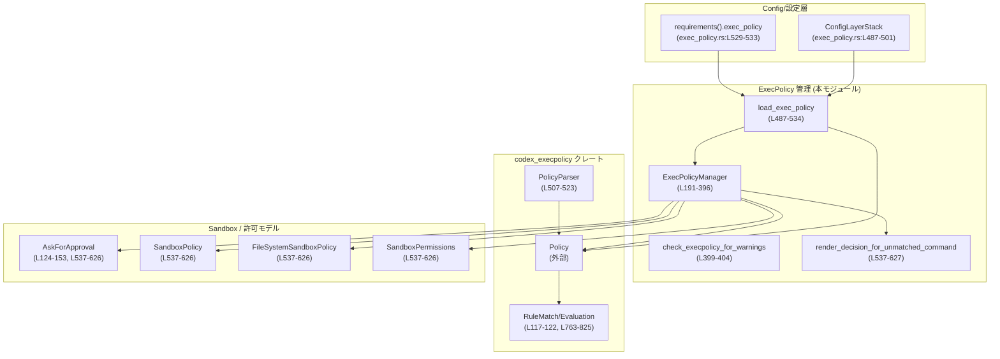
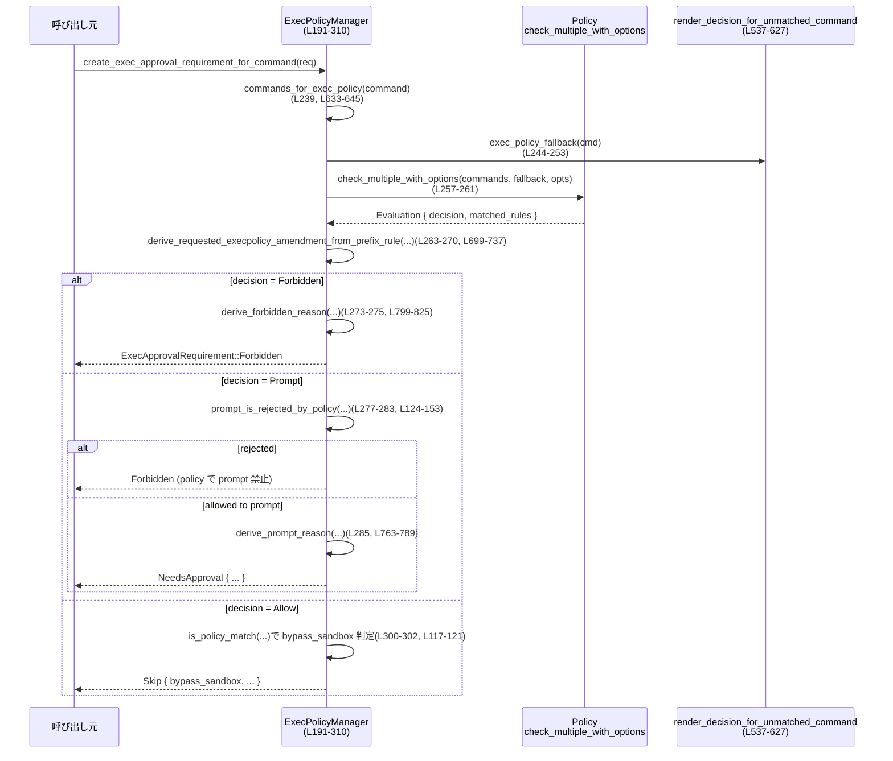
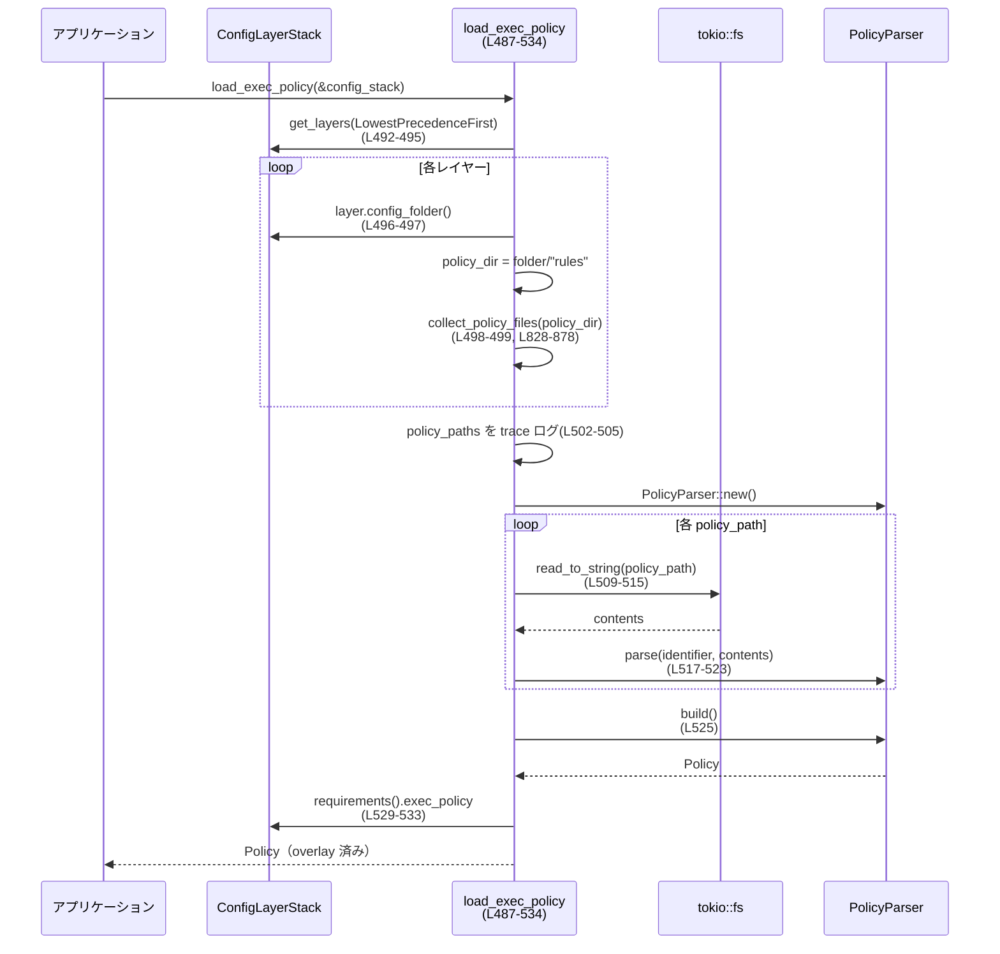

# core/src/exec_policy.rs コード解説

## 0. ざっくり一言

このモジュールは、構成ファイルから「実行ポリシー（execpolicy）」ルールを読み込み・管理し、シェルコマンドやネットワークアクセスに対して「Allow / Prompt / Forbidden」の決定を行うための中核ロジックを提供します（`exec_policy.rs:L41-878`）。

---

## 1. このモジュールの役割

### 1.1 概要

- このモジュールは **コマンド実行・ネットワークアクセスの安全性ポリシーを適用する問題** を扱い、次の機能を提供します。
  - `.rules` ファイル群から `Policy` を構築・マージする（`load_exec_policy` 系、`exec_policy.rs:L487-534`）。
  - 実行ポリシーに基づき、コマンドに対して「実行可否・承認の要否・サンドボックスのバイパス可否」を判定する（`ExecPolicyManager::create_exec_approval_requirement_for_command`, `exec_policy.rs:L226-310`）。
  - ポリシー違反時のエラーメッセージを、元ソース位置付きで整形する（`format_exec_policy_error_with_source`, `exec_policy.rs:L444-475`）。
  - 実行ポリシーのルールをファイルに追記し、同時にメモリ上の `Policy` を更新する（`append_*_and_update`, `exec_policy.rs:L312-390`）。

### 1.2 アーキテクチャ内での位置づけ

主な依存関係の関係を示します。



- 設定層 (`ConfigLayerStack`) から `.rules` ファイルパスを得て `PolicyParser` に渡し `Policy` を構築します（`exec_policy.rs:L487-523`）。
- 実行時には `ExecPolicyManager` がこの `Policy` を保持し、コマンド評価・ルール追記を行います（`exec_policy.rs:L191-390`）。
- サンドボックス関連ポリシー（`SandboxPolicy`, `FileSystemSandboxPolicy`, `SandboxPermissions`）と `AskForApproval` が、ポリシーにマッチしないコマンドに対するフォールバック判定を決めます（`render_decision_for_unmatched_command`, `exec_policy.rs:L537-627`）。

### 1.3 設計上のポイント

- **状態管理**
  - 実行ポリシー `Policy` を `ArcSwap<Policy>` で保持し、読み取りをロックフリーにしています（`exec_policy.rs:L191-193`）。
  - 書き込み（ルールの追加）は `tokio::sync::Mutex<()>` により逐次化されています（`exec_policy.rs:L191-194, L317, L362`）。
- **非同期・並行性**
  - ポリシーファイルの読み込みは `tokio::fs` を用いた非同期 I/O（`exec_policy.rs:L510-515`）。
  - ポリシーファイルの追記（ブロッキング I/O）は `spawn_blocking` で専用スレッド上にオフロードしています（`exec_policy.rs:L319-323, L365-377`）。
- **エラーハンドリング**
  - I/O・パース・ポリシー更新の失敗は専用エラー型 `ExecPolicyError` / `ExecPolicyUpdateError` で表現し、`thiserror::Error` による一貫した `Display` 実装があります（`exec_policy.rs:L155-189`）。
  - execpolicy（Starlark）のパースエラーは、位置情報を組み合わせて人間に読みやすいメッセージに整形します（`exec_policy.rs:L406-475`）。
- **安全性ポリシー**
  - ポリシーにマッチしないコマンドに対しても、既知の安全コマンド・危険コマンド・サンドボックス有無・承認ポリシーに基づいて決定を導出します（`render_decision_for_unmatched_command`, `exec_policy.rs:L537-627`）。
  - 自動で提案する execpolicy 追記（`ExecPolicyAmendment`）は、ヒューリスティックなルールやユーザー指定 prefix が全コマンドを安全に許可できる場合に限り生成されます（`exec_policy.rs:L647-761, L699-761`）。
  - 危険な prefix を提案しないためのブラックリスト（`BANNED_PREFIX_SUGGESTIONS`, `exec_policy.rs:L50-97`）を持ちます。

---

## 2. 主要な機能一覧（コンポーネントインベントリー）

### 2.1 型・関数インベントリー（抜粋）

| 要素名 | 種別 | 概要 | 定義位置 |
|--------|------|------|----------|
| `ExecPolicyError` | `enum` | ポリシーファイル読み込み・パース時のエラー | `exec_policy.rs:L155-174` |
| `ExecPolicyUpdateError` | `enum` | ポリシー更新（ファイル追記・メモリ更新）時のエラー | `exec_policy.rs:L176-189` |
| `ExecPolicyManager` | `struct` | 実行ポリシーの共有・更新とコマンド評価の中核 | `exec_policy.rs:L191-194` |
| `ExecApprovalRequest<'a>` | `struct` | 承認判定に必要な入力パラメータをまとめたリクエスト構造体 | `exec_policy.rs:L196-203` |
| `child_uses_parent_exec_policy` | 関数 | 親子 `Config` が同じ execpolicy 設定を共有しているか判定 | `exec_policy.rs:L99-115` |
| `prompt_is_rejected_by_policy` | 関数 | `AskForApproval` 設定によりプロンプト自体が拒否されるかを判定 | `exec_policy.rs:L124-153` |
| `ExecPolicyManager::load` | 関数（`async`） | 設定スタックからポリシーを読み込み、マネージャを構築 | `exec_policy.rs:L213-220` |
| `ExecPolicyManager::create_exec_approval_requirement_for_command` | 関数（`async`） | コマンドに対して `ExecApprovalRequirement` を返す中核ロジック | `exec_policy.rs:L226-310` |
| `ExecPolicyManager::append_amendment_and_update` | 関数（`async`） | prefix ルールの追記 + インメモリ `Policy` の更新 | `exec_policy.rs:L312-352` |
| `ExecPolicyManager::append_network_rule_and_update` | 関数（`async`） | ネットワークルールの追記 + インメモリ更新 | `exec_policy.rs:L354-390` |
| `check_execpolicy_for_warnings` | 関数（`async`） | ポリシーがパースできなかった場合の警告のみ取得 | `exec_policy.rs:L399-404` |
| `load_exec_policy_with_warning` | 関数（`async`） | ポリシー読み込み＋警告（パース失敗時は空ポリシー） | `exec_policy.rs:L477-485` |
| `load_exec_policy` | 関数（`async`） | `.rules` ファイルを読み込み `Policy` を構築 | `exec_policy.rs:L487-534` |
| `render_decision_for_unmatched_command` | 関数 | ルールにマッチしないコマンドの `Decision` を導出 | `exec_policy.rs:L537-627` |
| `format_exec_policy_error_with_source` | 関数 | `ExecPolicyError` のメッセージを位置情報付きで整形 | `exec_policy.rs:L444-475` |
| `collect_policy_files` | 関数（`async`） | ディレクトリ配下の `.rules` ファイル一覧取得 | `exec_policy.rs:L828-878` |

※ 上記以外の補助関数（例: `commands_for_exec_policy`, `derive_forbidden_reason` 等）は 3.3 でまとめます。

---

## 3. 公開 API と詳細解説

### 3.1 型一覧（構造体・列挙体など）

| 名前 | 種別 | 役割 / 用途 | 定義位置 |
|------|------|-------------|----------|
| `ExecPolicyError` | 列挙体 | ポリシーファイルのディレクトリ読み込み・ファイル読み込み・パースエラーを表現。`load_exec_policy*` 系が返します。 | `exec_policy.rs:L155-174` |
| `ExecPolicyUpdateError` | 列挙体 | ルール追記時の I/O エラー・ `spawn_blocking` の Join エラー・インメモリポリシー更新のエラーを表現。 | `exec_policy.rs:L176-189` |
| `ExecPolicyManager` | 構造体 | `Policy` を `ArcSwap` で共有し、コマンド評価およびルール更新を行う管理オブジェクト。クレート内で共有して利用される想定です。 | `exec_policy.rs:L191-194` |
| `ExecApprovalRequest<'a>` | 構造体 | コマンド配列、承認ポリシー、サンドボックス設定、ファイルシステムサンドボックス設定、権限、prefix ルールをまとめて `create_exec_approval_requirement_for_command` に渡すための型。 | `exec_policy.rs:L196-203` |

### 3.2 重要関数の詳細

ここでは、主な公開 API / コアロジック 7 件を詳細に説明します。

#### 1. `ExecPolicyManager::create_exec_approval_requirement_for_command`

```rust
pub(crate) async fn create_exec_approval_requirement_for_command(
    &self,
    req: ExecApprovalRequest<'_>,
) -> ExecApprovalRequirement
```

**概要**

- 現在の execpolicy とサンドボックス設定に基づき、与えられたコマンドに対して
  - 即時拒否 (`Forbidden`)
  - 承認要求 (`NeedsApproval`)
  - 承認・サンドボックスバイパス可否 (`Skip { bypass_sandbox, ... }`)
  を表す `ExecApprovalRequirement` を返します（`exec_policy.rs:L226-310`）。

**引数**

| 引数名 | 型 | 説明 |
|--------|----|------|
| `req.command` | `&[String]` | 実行対象コマンドの引数リスト。通常は `argv` 相当（`exec_policy.rs:L230-237`）。 |
| `req.approval_policy` | `AskForApproval` | ユーザーへの承認プロンプト方針（Never / OnFailure / OnRequest / UnlessTrusted / Granular）。（`exec_policy.rs:L232`） |
| `req.sandbox_policy` | `&SandboxPolicy` | サンドボックスの種別と設定。特に Windows での特別扱いに影響（`render_decision_for_unmatched_command`, `exec_policy.rs:L552-566`）。 |
| `req.file_system_sandbox_policy` | `&FileSystemSandboxPolicy` | ファイルシステムのサンドボックス種別（制限付き / 非制限 / 外部サンドボックス）。（`exec_policy.rs:L540-541`） |
| `req.sandbox_permissions` | `SandboxPermissions` | コマンドが追加権限（サンドボックス override）を要求しているかなど（`exec_policy.rs:L542-543`）。 |
| `req.prefix_rule` | `Option<Vec<String>>` | ユーザーが提案した execpolicy prefix ルール（承認時に自動でルールを追加する候補）（`exec_policy.rs:L236-237`）。 |

**戻り値**

- `ExecApprovalRequirement`（他モジュール定義）:
  - `Forbidden { reason }`
  - `NeedsApproval { reason, proposed_execpolicy_amendment }`
  - `Skip { bypass_sandbox, proposed_execpolicy_amendment }`

**内部処理の流れ**

1. 現在のポリシー `Policy` を取得（`self.current()`）（`exec_policy.rs:L238`）。
2. コマンドを execpolicy 用に解析し、複数の論理コマンドに分割（`commands_for_exec_policy`, `exec_policy.rs:L239-245, L633-645`）。
   - `used_complex_parsing` によりヒアドキュメント等を含む複雑解析を用いたかどうかが分かります。
3. ルールにマッチしないコマンド向けのフォールバック関数 `exec_policy_fallback` を定義（`render_decision_for_unmatched_command` を呼ぶ）（`exec_policy.rs:L244-253`）。
4. `Policy::check_multiple_with_options` で全コマンドを評価し、`Evaluation` を取得（`exec_policy.rs:L257-261`）。
5. `prefix_rule` が与えられている場合、既存ルールとの整合性を確認しつつ、全コマンドを許可できる自動追記案を検討（`derive_requested_execpolicy_amendment_from_prefix_rule`, `exec_policy.rs:L263-270, L699-737`）。
6. `evaluation.decision` に応じて分岐（`exec_policy.rs:L272-309`）:
   - `Decision::Forbidden`: `derive_forbidden_reason` により理由文字列を生成し、`Forbidden` を返却。
   - `Decision::Prompt`:
     - `evaluation.matched_rules` の中で Prompt 決定を下したルールがあるかを確認し、`prompt_is_rejected_by_policy` でプロンプト自体が拒否されるか判定（`exec_policy.rs:L277-283, L124-153`）。
     - プロンプトが拒否されるなら `Forbidden`、許可されるなら `NeedsApproval` を返す。
     - `NeedsApproval` には、prefix 由来の amendment または heuristics ベースの amendment を含める可能性があります（`try_derive_execpolicy_amendment_for_prompt_rules`, `exec_policy.rs:L285-295, L657-676`）。
   - `Decision::Allow`:
     - execpolicy の prefix ルールが `Allow` を出しているかどうかで `bypass_sandbox` を決定（`exec_policy.rs:L299-302`）。
     - ルールが一切マッチしていない場合のみ、ヒューリスティック `Allow` から sandbox バイパス用 amendment を提案（`try_derive_execpolicy_amendment_for_allow_rules`, `exec_policy.rs:L303-307, L681-697`）。

**Examples（使用例）**

`ExecPolicyManager` が既に初期化されていると仮定した簡略例です。

```rust
// 非同期コンテキスト内の例
async fn decide_command(
    manager: &ExecPolicyManager,                          // ExecPolicyManager の参照
    command: Vec<String>,                                 // 実行コマンド
    sandbox_policy: &SandboxPolicy,                       // サンドボックスポリシー
    fs_policy: &FileSystemSandboxPolicy,                  // ファイルシステムサンドボックス
) -> ExecApprovalRequirement {
    let req = ExecApprovalRequest {                       // リクエスト構造体を組み立てる
        command: &command,                                // コマンド配列
        approval_policy: AskForApproval::OnRequest,       // 通常の承認ポリシー
        sandbox_policy,                                   // サンドボックス設定
        file_system_sandbox_policy: fs_policy,            // FS サンドボックス設定
        sandbox_permissions: SandboxPermissions::default(),// 追加権限要求なし
        prefix_rule: None,                                // 自動ルール提案なし
    };

    manager.create_exec_approval_requirement_for_command(req).await
}
```

**Errors / Panics**

- この関数自体は `Result` を返さず、パニックも行いません。
- ただし内部で利用する `Policy::check_multiple_with_options` や `render_decision_for_unmatched_command` は純関数であり、エラーを返さない設計です（`exec_policy.rs:L257-261, L537-627`）。

**Edge cases（エッジケース）**

- コマンドがヒアドキュメント等を含み、`parse_shell_lc_single_command_prefix` の複雑解析にのみマッチした場合、`auto_amendment_allowed` は `false` になり、自動 amendment を提案しません（`exec_policy.rs:L239-245`）。
- `prefix_rule` が空、または `BANNED_PREFIX_SUGGESTIONS` に含まれる場合、自動 amendment 提案は行いません（`exec_policy.rs:L707-719`）。
- すでに execpolicy ルールがマッチしている場合、追加で prefix ルールを提案しません（`exec_policy.rs:L721-723`）。

**使用上の注意点**

- `ExecPolicyManager` を共有して複数タスクから呼び出すことが想定されており、`current()` が `ArcSwap` ベースであるため読み取りはロックレスですが、結果が更新されるタイミングは同期されません。
- `SandboxPolicy` や `AskForApproval` の設定により、危険なコマンドでも sandbox が明示的に無効化されている場合に `Allow` となるケースがあります（`render_decision_for_unmatched_command`, `exec_policy.rs:L560-573`）。

---

#### 2. `ExecPolicyManager::append_amendment_and_update`

```rust
pub(crate) async fn append_amendment_and_update(
    &self,
    codex_home: &Path,
    amendment: &ExecPolicyAmendment,
) -> Result<(), ExecPolicyUpdateError>
```

**概要**

- 与えられた `ExecPolicyAmendment`（prefix ルール）を、デフォルトポリシーファイルに追記し、同時にメモリ上の `Policy` にも追加します（`exec_policy.rs:L312-352`）。

**引数**

| 引数名 | 型 | 説明 |
|--------|----|------|
| `codex_home` | `&Path` | `rules/default.rules` が存在するホームディレクトリ | `exec_policy.rs:L314-319` |
| `amendment` | `&ExecPolicyAmendment` | 追加すべき prefix ルール（`command: Vec<String>`） | `exec_policy.rs:L315-321` |

**戻り値**

- `Result<(), ExecPolicyUpdateError>`:
  - `Ok(())` 更新成功
  - `Err(ExecPolicyUpdateError::AppendRule)` ファイル追記の失敗
  - `Err(ExecPolicyUpdateError::JoinBlockingTask)` `spawn_blocking` 自体の失敗
  - `Err(ExecPolicyUpdateError::AddRule)` `Policy::add_prefix_rule` が失敗

**内部処理の流れ**

1. `update_lock` を `lock().await` で取得し、並行更新を防止（`exec_policy.rs:L317`）。
2. `default_policy_path(codex_home)` で `rules/default.rules` のパスを計算（`exec_policy.rs:L318, L629-631`）。
3. `spawn_blocking` 上で `blocking_append_allow_prefix_rule` を実行し、ポリシーファイルに新しい prefix ルールを追記（`exec_policy.rs:L319-323`）。
4. 追記に失敗した場合は適切な `ExecPolicyUpdateError` に変換して返却（`exec_policy.rs:L324-329`）。
5. 現在の `Policy` を取得し、同じコマンドに対して既に `Allow` になっているかをチェック（`exec_policy.rs:L331-343`）。
   - 既に `Allow` で、かつ policy ルールが `Allow` を出している場合はメモリ上の更新を省略（`exec_policy.rs:L340-346`）。
6. まだ許可されていない場合、`Policy::add_prefix_rule` でメモリ上の `Policy` を更新し、`ArcSwap` に格納（`self.policy.store`）（`exec_policy.rs:L348-350`）。

**並行性・安全性**

- `update_lock` により、ファイル追記とメモリ更新が逐次実行されるため、同時に複数の amend が走って `Policy` が不整合になることを防いでいます（`exec_policy.rs:L317, L362`）。
- `ArcSwap` で新しい `Arc<Policy>` を `store` するだけなので、既存の読者は古いポリシーを使い続け、新規読者は新しいポリシーを見るという lock-free かつ安全な更新が行われます（`exec_policy.rs:L191-193, L350`）。

**Edge cases**

- `blocking_append_allow_prefix_rule` がファイルのフォーマット上の理由で失敗した場合、メモリ上の `Policy` は更新されません（`exec_policy.rs:L324-329`）。
- 既に `Allow` されているコマンドに対して amend を追加しても、ファイルには追記しますがメモリ上の `Policy` は変更されないため、二重追加は避けられます（`exec_policy.rs:L340-347`）。

**使用上の注意点**

- `update_lock` を保持したまま `spawn_blocking().await` しているため、更新処理が重い場合は他の追加更新が待たされますが、絶対待ち時間は I/O に依存します。デッドロックになるコードパスはこのモジュール内にはありません。

---

#### 3. `ExecPolicyManager::append_network_rule_and_update`

```rust
pub(crate) async fn append_network_rule_and_update(
    &self,
    codex_home: &Path,
    host: &str,
    protocol: NetworkRuleProtocol,
    decision: Decision,
    justification: Option<String>,
) -> Result<(), ExecPolicyUpdateError>
```

**概要**

- 指定された `host`・`protocol`・`decision`（Allow/Prompt/Forbidden）・`justification` をネットワークルールとしてポリシーファイルに追記し、同時にメモリ上の `Policy` にも反映します（`exec_policy.rs:L354-390`）。

**引数**

| 引数名 | 型 | 説明 |
|--------|----|------|
| `codex_home` | `&Path` | `rules/default.rules` の存在するディレクトリ | `exec_policy.rs:L356-363` |
| `host` | `&str` | 対象ホスト名 | `exec_policy.rs:L357, L364-367` |
| `protocol` | `NetworkRuleProtocol` | TCP/UDP などネットワークプロトコル | `exec_policy.rs:L358, L370-375` |
| `decision` | `Decision` | Allow/Prompt/Forbidden | `exec_policy.rs:L359, L370-375` |
| `justification` | `Option<String>` | ルールの説明・理由 | `exec_policy.rs:L360-361, L368-376` |

**戻り値**

- 成功時 `Ok(())`、失敗時は `ExecPolicyUpdateError`。

**内部処理の流れ**

1. `update_lock` を取得（`exec_policy.rs:L362`）。
2. `default_policy_path` でポリシーファイルパスを取得（`exec_policy.rs:L363`）。
3. `spawn_blocking` で `blocking_append_network_rule` を実行し、ファイルにネットワークルールを追記（`exec_policy.rs:L365-377`）。
4. 追記エラーを `ExecPolicyUpdateError::AppendRule` に変換（`exec_policy.rs:L380-384`）。
5. メモリ上の `Policy` を `clone` し、`add_network_rule` でルールを追加後、`ArcSwap` に格納（`exec_policy.rs:L386-388`）。

**使用上の注意点**

- `append_amendment_and_update` 同様、ファイルとメモリの更新が一括で行われるため、失敗時はどちらかだけが更新される不整合は基本的に避けられます。

---

#### 4. `load_exec_policy`

```rust
pub async fn load_exec_policy(
    config_stack: &ConfigLayerStack,
) -> Result<Policy, ExecPolicyError>
```

**概要**

- `ConfigLayerStack` に含まれる各レイヤーの `rules` ディレクトリから `.rules` ファイル群を収集し、それらをパースして `Policy` を構築します（`exec_policy.rs:L487-534`）。

**引数**

| 引数名 | 型 | 説明 |
|--------|----|------|
| `config_stack` | `&ConfigLayerStack` | 設定レイヤーのスタック。各レイヤーから `config_folder()` を取得して `rules` ディレクトリを探索します。 | `exec_policy.rs:L491-500` |

**戻り値**

- 成功時: `Policy`
- 失敗時: `ExecPolicyError`（`ReadDir` / `ReadFile` / `ParsePolicy`）

**内部処理の流れ**

1. `ConfigLayerStack::get_layers` を `LowestPrecedenceFirst` で呼び出し、優先度の低いレイヤーから順に処理（`exec_policy.rs:L492-495`）。
2. 各レイヤーの `config_folder()` から `rules` ディレクトリを決定し、`collect_policy_files` で `.rules` ファイルリストを取得（`exec_policy.rs:L496-499`）。
3. 集めた `policy_paths` をトレース出力（`exec_policy.rs:L502-505`）。
4. `PolicyParser::new()` を作成し、各ファイルを `fs::read_to_string` で読み取り、`parser.parse` に渡す（`exec_policy.rs:L507-523`）。
5. `parser.build()` で `Policy` を構築（`exec_policy.rs:L525`）。
6. `config_stack.requirements().exec_policy` に overlay 用ポリシーが設定されている場合は `merge_overlay` でマージ（`exec_policy.rs:L529-533`）。

**Edge cases**

- `rules` ディレクトリが存在しない場合、`collect_policy_files` が空リストを返し、エラーとはなりません（`exec_policy.rs:L830-833`）。
- いずれかの `.rules` ファイルのパースが失敗すると `ExecPolicyError::ParsePolicy` を返します。`load_exec_policy_with_warning` 経由だと空ポリシー＋警告として扱われます（`exec_policy.rs:L477-485`）。

---

#### 5. `render_decision_for_unmatched_command`

```rust
pub fn render_decision_for_unmatched_command(
    approval_policy: AskForApproval,
    sandbox_policy: &SandboxPolicy,
    file_system_sandbox_policy: &FileSystemSandboxPolicy,
    command: &[String],
    sandbox_permissions: SandboxPermissions,
    used_complex_parsing: bool,
) -> Decision
```

**概要**

- execpolicy がどのルールにもマッチしなかったコマンドに対し、承認ポリシーとサンドボックス設定に基づいて `Decision`（Allow/Prompt/Forbidden）を導出します（`exec_policy.rs:L537-627`）。

**引数**

| 引数名 | 型 | 説明 |
|--------|----|------|
| `approval_policy` | `AskForApproval` | 承認ポリシー | `exec_policy.rs:L538` |
| `sandbox_policy` | `&SandboxPolicy` | サンドボックス設定（特に Windows の ReadOnly 特例） | `exec_policy.rs:L539-552` |
| `file_system_sandbox_policy` | `&FileSystemSandboxPolicy` | ファイルシステムサンドボックス種別 | `exec_policy.rs:L540-541, L593-600` |
| `command` | `&[String]` | 評価対象コマンド | `exec_policy.rs:L541` |
| `sandbox_permissions` | `SandboxPermissions` | サンドボックス override 要求の有無 | `exec_policy.rs:L542-543, L604-605` |
| `used_complex_parsing` | `bool` | ヒアドキュメント等、複雑なシェル解析を使用したかどうか | `exec_policy.rs:L543, L545-547` |

**内部処理の流れ（概要）**

1. 簡単なコマンドで、既知の安全コマンドならそのまま `Allow`（`exec_policy.rs:L545-547`）。
2. Windows かつ ReadOnly サンドボックスの場合は「実質的に無保護」とみなし、特別扱い（`exec_policy.rs:L551-552`）。
3. コマンドが危険と判定された、もしくはサンドボックス保護が無い場合:
   - `AskForApproval::Never` なら、サンドボックスが明示的に無効なら `Allow`、そうでなければ `Forbidden`（`exec_policy.rs:L560-573`）。
   - その他のポリシーは `Prompt`（`exec_policy.rs:L574-577`）。
4. コマンドが危険でない場合:
   - `Never` / `OnFailure`: サンドボックス保護に依存して `Allow`（`exec_policy.rs:L581-586`）。
   - `UnlessTrusted`: 既に「安全コマンドではない」と判定済みなので `Prompt`（`exec_policy.rs:L587-591`）。
   - `OnRequest` / `Granular`: FS サンドボックス種別と override 要求に応じて `Allow` / `Prompt` を決定（`exec_policy.rs:L592-625`）。

**安全性上のポイント**

- 危険コマンド + サンドボックス無保護の組み合わせでは、原則 `Prompt` か `Forbidden` になり、ユーザー操作なしに実行されることはありません（`exec_policy.rs:L554-572`）。
- ただし、ユーザーが明示的にサンドボックスを `DangerFullAccess` または `ExternalSandbox` に設定し、かつ `AskForApproval::Never` の場合は `Allow` となります（`exec_policy.rs:L563-569`）。これはユーザーによる「責任あるオプトアウト」と解釈できます。

---

#### 6. `format_exec_policy_error_with_source`

```rust
pub fn format_exec_policy_error_with_source(
    error: &ExecPolicyError,
) -> String
```

**概要**

- `ExecPolicyError::ParsePolicy` の場合に、Starlark 由来の位置情報・エラーメッセージを解析し、`path:line: message` 形式に整形します（`exec_policy.rs:L444-475`）。

**内部処理の流れ**

1. `ExecPolicyError::ParsePolicy` 以外は `error.to_string()` をそのまま返却（`exec_policy.rs:L472-474`）。
2. `ParsePolicy` の場合:
   - `codex_execpolicy::Error::location()` から構造化された位置情報（ファイルパス・行番号）を取得（`exec_policy.rs:L448-450`）。
   - エラーメッセージ文字列を `parse_starlark_line_from_message` で解析し、`path:line: starlark error` 形式から位置を抽出（`exec_policy.rs:L447-452, L428-441`）。
   - 両者を比較し、構造化された位置が 1 行目のみを指す場合に限り、メッセージ文字列から得た位置を優先するなどの補正を行う（`exec_policy.rs:L452-458`）。
   - `exec_policy_message_for_display` でユーザー向けに適した短いメッセージ行を抽出（`exec_policy.rs:L406-426, L459`）。
   - 位置情報がある場合は `"path:line: message (problem is on or around line line)"` を、ない場合は `"{path}: {message}"` を返す（`exec_policy.rs:L460-471`）。

**使用上の注意点**

- 位置補正ロジックにより、Starlark のラッパーエラーなど複数レイヤーのスタックトレースを持つ場合でも、ユーザーが編集すべき行に近い情報を提示することを意図しています。

---

#### 7. `check_execpolicy_for_warnings`

```rust
pub async fn check_execpolicy_for_warnings(
    config_stack: &ConfigLayerStack,
) -> Result<Option<ExecPolicyError>, ExecPolicyError>
```

**概要**

- ポリシーを読み込みつつ、パースエラーによる「警告」を取得するための補助関数です（`exec_policy.rs:L399-404`）。
- パースに失敗した場合でも `Policy::empty()` を使って続行したい UI 側での利用が想定されます。

**挙動**

- 内部で `load_exec_policy_with_warning`（`exec_policy.rs:L477-485`）を呼び出し、戻り値の `(Policy, Option<ExecPolicyError>)` から警告だけを返します。
- `.rules` に問題がない場合は `Ok(None)`、パースに失敗した場合は `Ok(Some(ParsePolicy{..}))`、I/O エラーなど致命的なエラーの場合は `Err(...)` を返します。

---

### 3.3 その他の関数（補助関数一覧）

| 関数名 | 役割（1 行） | 定義位置 |
|--------|--------------|----------|
| `child_uses_parent_exec_policy` | 親子 `Config` が同じ execpolicy 設定と設定フォルダを共有しているかを比較 | `exec_policy.rs:L99-115` |
| `is_policy_match` | `RuleMatch` が execpolicy ルール由来か heuristics 由来かを判別 | `exec_policy.rs:L117-121` |
| `prompt_is_rejected_by_policy` | Granular 設定等によりプロンプト表示自体がポリシーで禁止されるかどうかを判定 | `exec_policy.rs:L124-153` |
| `exec_policy_message_for_display` | Starlark エラーメッセージからユーザー向けの 1 行を抽出 | `exec_policy.rs:L406-426` |
| `parse_starlark_line_from_message` | `"path:line:column: starlark error:"` 形式から位置を抽出 | `exec_policy.rs:L428-441` |
| `load_exec_policy_with_warning` | パース失敗時に空ポリシー＋警告を返すラッパー | `exec_policy.rs:L477-485` |
| `default_policy_path` | `<codex_home>/rules/default.rules` を組み立てる | `exec_policy.rs:L629-631` |
| `commands_for_exec_policy` | シェルコマンドから execpolicy 用のコマンド列と解析モード（単純/複雑）を導出 | `exec_policy.rs:L633-645` |
| `try_derive_execpolicy_amendment_for_prompt_rules` | heuristics の Prompt から allow prefix を提案 | `exec_policy.rs:L657-676` |
| `try_derive_execpolicy_amendment_for_allow_rules` | heuristics の Allow から sandbox バイパス用 prefix を提案 | `exec_policy.rs:L681-697` |
| `derive_requested_execpolicy_amendment_from_prefix_rule` | ユーザー指定 prefix が全コマンドを許可しうるか検証 | `exec_policy.rs:L699-737` |
| `prefix_rule_would_approve_all_commands` | 仮の prefix ルールを追加した `Policy` で全コマンドが Allow になるか検査 | `exec_policy.rs:L740-761` |
| `derive_prompt_reason` | Prompt 決定時に、最も具体的な prefix ルールの justification を元に説明文を生成 | `exec_policy.rs:L763-789` |
| `render_shlex_command` | 引数リストをシェルの 1 行コマンドとして整形 | `exec_policy.rs:L792-794` |
| `derive_forbidden_reason` | Forbidden 決定時の説明文を最も具体的な prefix ルールから生成 | `exec_policy.rs:L799-825` |
| `collect_policy_files` | ディレクトリ内の `*.rules` ファイルを列挙 | `exec_policy.rs:L828-878` |

---

## 4. データフロー

### 4.1 コマンド評価フロー（`create_exec_approval_requirement_for_command`）

`ExecPolicyManager::create_exec_approval_requirement_for_command (L226-310)` の典型的なデータフローです。



- `Policy` と execpolicy ルールが評価の第一優先であり、マッチしないケースに対してのみ `render_decision_for_unmatched_command` が適用されます。
- Prompt/Allow の場合は、ヒューリスティックやユーザー指定 prefix に基づく自動 amendment 提案が追加で行われます。

### 4.2 ポリシー読み込みフロー（`load_exec_policy`）



---

## 5. 使い方（How to Use）

### 5.1 基本的な使用方法（ポリシーの読み込みと評価）

```rust
use std::sync::Arc;
use core::exec_policy::{
    ExecPolicyManager,                      // 本モジュールの型（実際のパスはクレート構成による）
    load_exec_policy,                       // ポリシーを単体で読み込む関数
};
use crate::config_loader::ConfigLayerStack; // ConfigLayerStack
use codex_protocol::protocol::{AskForApproval, SandboxPolicy};
use codex_protocol::permissions::FileSystemSandboxPolicy;
use crate::sandboxing::SandboxPermissions;
use crate::tools::sandboxing::ExecApprovalRequirement;

async fn example(
    config_stack: &ConfigLayerStack,        // 設定スタック
    sandbox_policy: &SandboxPolicy,         // サンドボックス設定
    fs_policy: &FileSystemSandboxPolicy,    // ファイルシステムサンドボックス設定
) -> anyhow::Result<()> {
    // 1. execpolicy ポリシーを読み込んで Manager を作成
    let policy = load_exec_policy(config_stack).await?;   // Policy を構築（L487-534）
    let manager = ExecPolicyManager::new(Arc::new(policy)); // Manager を初期化（L205-211）

    // 2. コマンドを評価
    let command = vec!["ls".to_string(), "-la".to_string()]; // 実行したいコマンド
    let req = ExecApprovalRequest {                        // 評価に必要な情報を組み立てる（L196-203）
        command: &command,
        approval_policy: AskForApproval::OnRequest,
        sandbox_policy,
        file_system_sandbox_policy: fs_policy,
        sandbox_permissions: SandboxPermissions::default(),
        prefix_rule: None,
    };

    let requirement: ExecApprovalRequirement =
        manager.create_exec_approval_requirement_for_command(req).await; // L226-310

    match requirement {
        ExecApprovalRequirement::Forbidden { reason } => {
            eprintln!("Command rejected: {reason}");
        }
        ExecApprovalRequirement::NeedsApproval { reason, .. } => {
            println!("Need user approval: {}", reason.unwrap_or_default());
        }
        ExecApprovalRequirement::Skip { bypass_sandbox, .. } => {
            println!("Command can run; bypass_sandbox={bypass_sandbox}");
        }
    }

    Ok(())
}
```

### 5.2 よくある使用パターン

- **起動時に一度だけポリシーを読み込み、その `ExecPolicyManager` を `Arc` で共有する**
  - 読み取りは `ArcSwap` によりロックレスなため、並列なコマンド評価でもボトルネックになりにくいです（`exec_policy.rs:L191-193, L222-224`）。
- **UI 起動前に `.rules` のパース警告だけチェックする**
  - `check_execpolicy_for_warnings` を呼び、警告があればログや UI に表示しつつ、空ポリシーで続行する設計ができます（`exec_policy.rs:L399-404, L477-485`）。

### 5.3 よくある間違い

```rust
// 間違い例: ExecPolicyManager を初期化せずに使う
async fn wrong(manager: &ExecPolicyManager, command: Vec<String>) {
    // manager 内の Policy が empty のままかもしれない
    let _ = manager.create_exec_approval_requirement_for_command(
        ExecApprovalRequest {
            command: &command,
            approval_policy: AskForApproval::OnRequest,
            // ...省略...
            sandbox_policy: &SandboxPolicy::ReadOnly { /* ... */ },
            file_system_sandbox_policy: &FileSystemSandboxPolicy::default(),
            sandbox_permissions: SandboxPermissions::default(),
            prefix_rule: None,
        }
    ).await;
}

// 正しい例: load または load_exec_policy を通じて Policy を設定する
async fn correct(config_stack: &ConfigLayerStack, command: Vec<String>) -> anyhow::Result<()> {
    let manager = ExecPolicyManager::load(config_stack).await?; // L213-220
    // 以降 correct な Manager を使用
    Ok(())
}
```

### 5.4 使用上の注意点（まとめ）

- `.rules` ファイルがパースできない場合、`ExecPolicyManager::load` は空ポリシーを返して警告ログを出す設計になっています（`exec_policy.rs:L213-220, L477-485`）。これに依存するエラー処理方針を明示しておく必要があります。
- 危険コマンド＋サンドボックス無保護＋`AskForApproval::Never` という設定は、意図的に完全な保護無効化を意味します（`exec_policy.rs:L560-573`）。
- ルール追記系（`append_*_and_update`）は I/O エラー等で失敗する可能性があるため、必ず戻り値の `Result` を確認する必要があります（`exec_policy.rs:L312-352, L354-390`）。

---

## 6. 変更の仕方（How to Modify）

### 6.1 新しい機能を追加する場合

例: 新たな種類の execpolicy ルール（たとえば「時間帯制限付きルール」）を追加したい場合。

1. **ルール定義の追加**
   - 実際のルール定義は `codex_execpolicy` クレート側に追加する必要があります（このチャンクには定義がありません）。
2. **評価結果の処理追加**
   - 新しい `RuleMatch` のバリアントが追加された場合、`is_policy_match` や `derive_prompt_reason` / `derive_forbidden_reason` での `match` に分岐を追加する必要があります（`exec_policy.rs:L117-121, L770-778, L805-813`）。
3. **自動 amendment ロジックの拡張**
   - heuristics ベースのルールであれば、`try_derive_execpolicy_amendment_for_prompt_rules` / `try_derive_execpolicy_amendment_for_allow_rules` のパターンマッチを拡張します（`exec_policy.rs:L657-676, L681-697`）。

### 6.2 既存の機能を変更する場合

- **Approval ポリシーの挙動変更**
  - `AskForApproval` の挙動は `prompt_is_rejected_by_policy`（プロンプトの禁止）と `render_decision_for_unmatched_command`（フォールバック決定）で集中的に扱われています（`exec_policy.rs:L124-153, L537-627`）。
  - 変更前に、これらを呼び出している箇所（`create_exec_approval_requirement_for_command`）を確認し、期待する全体挙動を整理する必要があります（`exec_policy.rs:L272-309`）。
- **サンドボックス挙動の調整**
  - Windows 特例などは `render_decision_for_unmatched_command` に集中しているため、環境依存の振る舞い変更はここを修正します（`exec_policy.rs:L551-552`）。
- **ファイルレイアウト変更**
  - `.rules` ファイルの配置・命名規則を変える場合は、`RULES_DIR_NAME` / `RULE_EXTENSION` / `DEFAULT_POLICY_FILE` および `collect_policy_files` / `default_policy_path` を見直します（`exec_policy.rs:L47-49, L629-631, L828-878`）。

---

## 7. 関連ファイル

| パス | 役割 / 関係 |
|------|------------|
| `core/src/exec_policy_tests.rs` | 本モジュールのテスト。`#[cfg(test)] mod tests;` として参照されていますが、内容はこのチャンクには現れません（`exec_policy.rs:L880-882`）。 |
| `crate::config_loader`（`ConfigLayerStack`） | `.rules` ファイルが配置される設定フォルダ情報を提供。`load_exec_policy` で使用（`exec_policy.rs:L8-9, L487-501`）。 |
| `codex_execpolicy` クレート | `Policy`, `PolicyParser`, `RuleMatch`, `Evaluation` などポリシー評価のコアロジックを提供（`exec_policy.rs:L10-20, L117-121, L507-523`）。 |
| `codex_protocol::protocol` | `AskForApproval`, `SandboxPolicy` などユーザー承認・サンドボックスの設定モデルを提供（`exec_policy.rs:L24-25, L537-626`）。 |
| `codex_protocol::permissions` | `FileSystemSandboxPolicy`, `FileSystemSandboxKind` を提供し、ファイルシステムサンドボックスの挙動に影響（`exec_policy.rs:L22-23, L593-600, L612-623`）。 |
| `codex_shell_command` | コマンドの安全性判定（`is_known_safe_command`, `command_might_be_dangerous`）とシェルコマンド解析（`parse_shell_lc_*`）を提供（`exec_policy.rs:L26-27, L36-37, L545-547`）。 |

---

### Bugs / Security / Contracts / Edge Cases / Performance（補足）

- **Security**
  - 危険コマンドかつサンドボックス無保護の環境では、ユーザー設定次第で `Allow` となる経路があります（`AskForApproval::Never` + `DangerFullAccess`/`ExternalSandbox`、`exec_policy.rs:L560-573`）。これは強力ですが、意図しない使用を避けるため、UI 側で明示的に警告を出すなどの契約が望ましいです。
  - `BANNED_PREFIX_SUGGESTIONS` により、`python`, `bash`, `sudo` など強力なインタプリタを prefix ルールとして提案しないようになっています（`exec_policy.rs:L50-97, L711-718`）。
- **Contracts / Edge Cases**
  - `.rules` ディレクトリが存在しない場合でもエラーにはならず、ポリシーは空となる契約です（`exec_policy.rs:L830-833`）。
  - Starlark エラーメッセージに行番号 0 が含まれている場合は無効とみなして位置情報を返しません（`exec_policy.rs:L437-441`）。
- **Performance / Scalability**
  - `ArcSwap` によるポリシーの読み取りは O(1) かつ lock-free であり、多数のタスクから同時にコマンド評価を行ってもスケールしやすい設計です（`exec_policy.rs:L191-193, L222-224`）。
  - `.rules` ファイル数が多い場合、`load_exec_policy` 時の I/O とパースコストが立ち上がりのボトルネックになり得ますが、その後はメモリ上の `Policy` による評価のみです。
