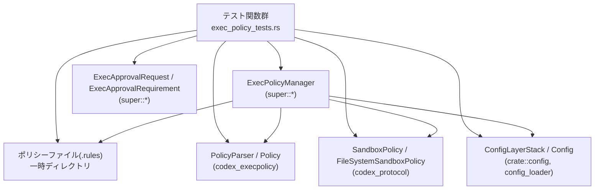
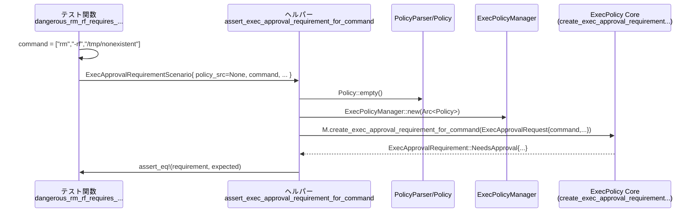
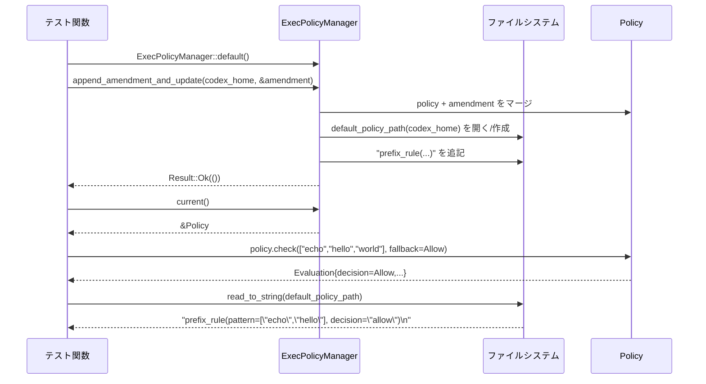

# core/src/exec_policy_tests.rs コード解説

## 0. ざっくり一言

- このファイルは、**ExecPolicyManager とその周辺 API（実行ポリシー／承認ポリシー／サンドボックス設定）**の振る舞いを検証する統合テスト群です。
- コマンド実行の可否・承認要求・ポリシーファイル読み書き・設定レイヤとの統合・危険コマンドの扱いなど、実行ポリシーのコアロジックを網羅的にテストしています。

> 注: 提示されたコードには行番号が含まれていないため、以下の「根拠」では  
> `core/src/exec_policy_tests.rs:L(行番号不明)` のように記載します。

---

## 1. このモジュールの役割

### 1.1 概要

- このモジュールは **コマンド実行ポリシー（exec policy）** の挙動をテストするために存在し、次のような機能を検証しています。

  - `ExecPolicyManager` が `.rules` ファイルと `ConfigLayerStack` からポリシーを読み込むこと
  - `ExecPolicyManager::create_exec_approval_requirement_for_command` が
    - 実行ポリシー (`Policy`)
    - 承認ポリシー (`AskForApproval`)
    - サンドボックス設定 (`SandboxPolicy`, `FileSystemSandboxPolicy`, `SandboxPermissions`)
    を組み合わせて、`ExecApprovalRequirement` を正しく導出すること
  - 危険コマンド（例: `rm -rf`）や PowerShell コマンドなどに対する**ヒューリスティック判定**の挙動
  - ExecPolicy の**自動追記（amendment）**とポリシーファイル更新 (`append_amendment_and_update`) の挙動
  - `requirements.toml` 等からの **requirements exec policy のマージ**とネットワークルールの適用

### 1.2 アーキテクチャ内での位置づけ

- このテストモジュールは「exec policy コア（`super::*`）」と「設定／ポリシーファイル読み込み周り」を結合し、エンドツーエンドでの振る舞いを検証しています。



- 位置づけのポイント（根拠: ファイル冒頭の `use super::*;` および各種 `use`、テスト本体全体  
  `core/src/exec_policy_tests.rs:L(行番号不明)`）:
  - `ExecPolicyManager` 自体の実装は `super` モジュールにあり、本ファイルはそれを外部から利用する側です。
  - `Config`, `ConfigLayerStack` を使い、**ユーザ／プロジェクト層など複数の設定レイヤ**をまたいだポリシー読み込みをテストしています。
  - 実際のファイルシステム（`tempdir`、`fs::write` 等）を使う**準統合テスト**のスタイルです。

### 1.3 設計上のポイント

コードから読み取れる設計上の特徴です。

- 責務の分割
  - 小さな**ヘルパー関数**（例: `config_stack_for_dot_codex_folder`, `test_config`, `vec_str`）でテストの前処理を共通化しています。
  - コマンド→承認要件のテストは `ExecApprovalRequirementScenario` + `assert_exec_approval_requirement_for_command` に集約されており、  
    多数のケースを同じ枠組みで検証しています。
- 状態管理
  - `ExecPolicyManager` 内部のポリシー状態は `Arc<Policy>` で共有されますが、テストでは各ケースごとに独立したインスタンスを生成しており、  
    グローバルな共有状態は持ちません（`ExecPolicyManager::default()`, `ExecPolicyManager::new(Arc::new(...))` の使用）。
- エラーハンドリング
  - `anyhow::Result<()>` を返す async テスト（例: `merges_requirements_exec_policy_network_rules`）では `?` を多用し、中間エラーは即座に失敗扱いにします。
  - 一部のテストは明示的にエラーを期待（`expect_err`／パターンマッチ）し、  
    例: ポリシーバリデーションエラー、空 prefix の amendment エラーなどを確認しています。
- 並行性
  - すべての非同期テストは `#[tokio::test]` を用いており、Tokio ランタイム上で実行されます。
  - 個々のテスト内で `ExecPolicyManager` を複数タスクから共有するような**並行アクセス**は行っておらず、主に API の**逐次的な async 振る舞い**を検証しています。
- プラットフォーム依存
  - `cfg!(windows)` 分岐が各所でテストされており、Windows と Unix 系 OS で挙動が異なる箇所（パス表現, PowerShell 判定, サンドボックス解釈）を明示的にカバーしています。

---

## 2. 主要な機能一覧

このテストファイルが対象としている**主な機能（外部 API の振る舞い）**を列挙します。

- 実行ポリシー継承
  - `child_uses_parent_exec_policy` の挙動:
    - Config のレイヤ構成が変わらない場合に、親と子で実行ポリシーが共有されること
    - 要件 (`ConfigRequirements.exec_policy`) が変わると共有されないこと
- ポリシーファイル読み込み
  - `.codex/exec_policy/` 相当のディレクトリから `.rules` ファイルを収集し、`Policy` に反映すること
  - ディレクトリが存在しない場合は**空ポリシー**を返すこと
  - 無効・不信頼な設定レイヤ（disabled project layer）からのルールを無視すること
  - ユーザレイヤ + プロジェクトレイヤ両方の `.rules` をマージすること
- `RequirementsExecPolicy` との統合
  - `ConfigRequirements.exec_policy` からのネットワークルール (blocked domains) を `Policy` にマージすること
  - 要件オーバレイがあっても host_executable ルールが保持されること
- シェルコマンド解析と prefix ルール
  - `bash -lc` / `zsh -lc` によるスクリプトの内部コマンド（`rm`, `python3`, など）を解析し、prefix ルールで評価すること
  - 空文字や空白のみのスクリプトでは**元のコマンドにフォールバック**すること
  - heredoc (`python3 <<'PY' ... PY`) スクリプトに対する扱い:
    - 自動 amendment の有無
    - `AskForApproval` や prefix_rule との組み合わせ
- ExecApproval 要件の決定ロジック
  - `AskForApproval` のバリアント（`OnRequest`, `UnlessTrusted`, `Never`, `Granular(...)`）ごとの挙動
  - `SandboxPolicy` / `FileSystemSandboxPolicy` / `SandboxPermissions` による**サンドボックス昇格・追加権限要求**の扱い
  - `ExecApprovalRequirement` が
    - `Skip`（実行許可、sandbox の有無／回避）
    - `NeedsApproval`（承認ダイアログ必要）
    - `Forbidden`（完全拒否）
    をどのような条件で返すか
- 危険コマンド・ヒューリスティック
  - `rm -rf` などの危険コマンドに対して、ポリシーがない場合でも approval を要求するヒューリスティックの挙動
  - PowerShell コマンド（`pwsh -Command "echo hi @(calc)"`）に対する解釈:
    - Windows と非 Windows でのサンドボックス信頼度の違い
- ExecPolicy Amendment（ポリシー自動追記）
  - `ExecPolicyAmendment` の自動提案・ファイルへの追記 (`append_amendment_and_update`) の挙動
  - prefix_rule から amendment 候補を導出する `derive_requested_execpolicy_amendment_from_prefix_rule` の振る舞い（テスト用ラッパで検証）
  - 危険・不適切な prefix（shell や `python -c` など）を除外すること

---

### 2.1 コンポーネントインベントリー（このファイル内）

主な関数・構造体の一覧です（説明は 1 行、定義はいずれも `core/src/exec_policy_tests.rs:L(行番号不明)`）。

#### ヘルパー関数

| 名前 | 種別 | 役割 / 用途 |
|------|------|-------------|
| `config_stack_for_dot_codex_folder(dot_codex_folder: &Path)` | 関数 | 与えられた `.codex` 相当ディレクトリから `ConfigLayerStack` を構築するテスト用ヘルパー |
| `host_absolute_path(segments: &[&str])` | 関数 | OS ごとのルート (`C:\` or `/`) からの絶対パス文字列を生成 |
| `host_program_path(name: &str)` | 関数 | `usr/bin/{name}[.exe]` 形式のホスト実行ファイルパスを生成 |
| `starlark_string(value: &str)` | 関数 | Starlark ソースに埋め込めるように `\` と `"` をエスケープ |
| `read_only_file_system_sandbox_policy()` | 関数 | ルートを Read-only とする `FileSystemSandboxPolicy::restricted` を生成 |
| `unrestricted_file_system_sandbox_policy()` | 関数 | 制限なし `FileSystemSandboxPolicy::unrestricted()` を返す |
| `external_file_system_sandbox_policy()` | 関数 | `FileSystemSandboxPolicy::external_sandbox()` を返す |
| `test_config()` | async 関数 | テスト用の `Config` を `ConfigBuilder::without_managed_config_for_tests()` から構築 |
| `vec_str(items: &[&str])` | 関数 | `&[&str]` から `Vec<String>` を生成する小ヘルパー |
| `derive_requested_execpolicy_amendment_for_test(prefix_rule, matched_rules)` | 関数 | テスト用に `derive_requested_execpolicy_amendment_from_prefix_rule` をラップし、簡易引数で呼べるようにしたもの |
| `assert_exec_approval_requirement_for_command(test, expected_requirement)` | async 関数 | シナリオを組み立てて `ExecPolicyManager::create_exec_approval_requirement_for_command` を呼び、期待値と比較 |

#### 構造体

| 名前 | 種別 | 役割 / 用途 |
|------|------|-------------|
| `ExecApprovalRequirementScenario` | 構造体 | `ExecApprovalRequirement` をテストするための入力一式（ポリシーソース／コマンド／承認ポリシー／サンドボックス設定／prefix_rule）を保持 |

#### テスト関数（代表的なグルーピング）

テスト関数は多数（60+）あるため、グループごとに代表名と範囲を示します。

| グループ | 代表的な関数名 | 役割 |
|---------|----------------|------|
| 実行ポリシー継承 | `child_uses_parent_exec_policy_when_layer_stack_matches`, `child_does_not_use_parent_exec_policy_when_requirements_exec_policy_differs` | `Config` 間で実行ポリシーを共有する条件を検証 |
| ポリシーファイル読み込み | `returns_empty_policy_when_no_policy_files_exist`, `collect_policy_files_returns_empty_when_dir_missing`, `loads_policies_from_policy_subdirectory`, `ignores_policies_outside_policy_dir`, `loads_policies_from_multiple_config_layers` | `.rules` ディレクトリの有無・複数レイヤ・無視対象の扱いを検証 |
| Requirements 統合 | `merges_requirements_exec_policy_network_rules`, `preserves_host_executables_when_requirements_overlay_is_present`, `ignores_rules_from_untrusted_project_layers` | `ConfigRequirements.exec_policy` に由来するルールのマージとフィルタリング |
| Starlark エラー処理 | `format_exec_policy_error_with_source_renders_range`, `parse_starlark_line_from_message_*` | Starlark パーサエラーからファイル・行番号を抽出し、人間向けにレンダリングする挙動 |
| シェルコマンド解析 | `evaluates_bash_lc_inner_commands`, `commands_for_exec_policy_falls_back_for_*`, `evaluates_heredoc_script_against_prefix_rules`, `omits_auto_amendment_for_heredoc_fallback_prompts`, `drops_requested_amendment_for_heredoc_fallback_prompts_when_it_wont_match` | `bash -lc` / heredoc の扱いとフォールバックシナリオ |
| ExecApproval ロジック | `justification_is_included_in_forbidden_exec_approval_requirement`, `exec_approval_requirement_prefers_execpolicy_match`, `exec_approval_requirement_respects_approval_policy`, `unmatched_granular_policy_still_prompts_for_restricted_sandbox_escalation`, ... | `ExecApprovalRequirement` が `Skip` / `NeedsApproval` / `Forbidden` を返す条件の網羅的テスト |
| host_executable & 絶対パス | `absolute_path_exec_approval_requirement_matches_host_executable_rules`, `absolute_path_exec_approval_requirement_ignores_disallowed_host_executable_paths`, `requested_prefix_rule_can_approve_absolute_path_commands` | ホスト実行ファイル定義と絶対パスコマンドの対応付け |
| amendment 生成 | `append_execpolicy_amendment_updates_policy_and_file`, `append_execpolicy_amendment_rejects_empty_prefix`, 各種 `proposed_execpolicy_amendment_*`, `derive_requested_execpolicy_amendment_*` | ExecPolicyAmendment の提案・追記ロジックとそのフィルタリング条件 |
| 危険コマンド／PowerShell | `dangerous_rm_rf_requires_approval_in_danger_full_access`, `verify_approval_requirement_for_unsafe_powershell_command`, `dangerous_command_*` | 危険コマンド／PowerShell コマンドの特別扱いと OS ごとの差異 |

---

### 2.2 外部コンポーネントインベントリー（このチャンクには定義なし）

テストから利用されているが、本チャンクには実装が現れない主要コンポーネントです。

| 名前 | 推定種別 | 役割（テストから分かる範囲） |
|------|----------|------------------------------|
| `ExecPolicyManager` | 構造体 | ExecPolicy の読み込み・更新・評価を行うマネージャ。`new`, `default`, `load`, `current`, `append_amendment_and_update`, `create_exec_approval_requirement_for_command` を提供。 |
| `Policy` | 構造体 | 実行ポリシー本体。prefix ルールやネットワークルールなどを保持し、`check` / `check_multiple` / `compiled_network_domains` 等で評価を行う。 |
| `PolicyParser` | 構造体 | Starlark ベースの `.rules` ファイルから `Policy` を構築するパーサ。`parse`, `build` を提供。 |
| `ExecApprovalRequest` | 構造体 | コマンド・承認ポリシー・サンドボックス設定など、承認判定に必要な入力をまとめたリクエスト。 |
| `ExecApprovalRequirement` | 列挙体 | ExecPolicyManager が返す「承認要件」。少なくとも `Skip`, `NeedsApproval`, `Forbidden` を持つ。 |
| `ExecPolicyAmendment` | 構造体 | 追加したい prefix ルールを表す。`new`, `from`, `command: Vec<String>` フィールドなどがテストから読み取れる。 |
| `Evaluation` | 構造体 | `Policy::check` / `check_multiple` の結果。`decision: Decision`, `matched_rules: Vec<RuleMatch>` を保持。 |
| `Decision` | 列挙体 | 少なくとも `Allow`, `Prompt`, `Forbidden` を持つ。 |
| `RuleMatch` | 列挙体 | マッチしたルールを表現。`PrefixRuleMatch`, `HeuristicsRuleMatch` などのバリアントがテスト中に構築されている。 |
| `MatchOptions` | 構造体 | ルールマッチ時のオプションパラメータ（詳細不明）。`MatchOptions::default()` が使われる。 |
| `ExecPolicyUpdateError` | 列挙体 | ポリシー更新処理で発生しうるエラー。`AppendRule { source: AmendError, .. }` などのバリアントが存在。 |
| `AmendError` | 列挙体 | Amendment の検証エラー。`EmptyPrefix` などのバリアントがあり、空 prefix の追加を禁止する。 |
| `FileSystemSandboxPolicy` | 構造体/enum | ファイルシステムサンドボックスのアクセスルール。`restricted`, `unrestricted`, `external_sandbox` などのコンストラクタを持つ。 |
| `SandboxPolicy` | 列挙体 | 実行プロセスのサンドボックス戦略。`DangerFullAccess`, `ExternalSandbox { ... }`, `new_read_only_policy` などを持つ。 |
| `SandboxPermissions` | 列挙体 | サンドボックスの権限要求のモード。`UseDefault`, `RequireEscalated`, `WithAdditionalPermissions` 等がテストで参照されている。 |
| `AskForApproval` | 列挙体 | 承認要求ポリシー。`OnRequest`, `UnlessTrusted`, `Never`, `Granular(GranularApprovalConfig)` などを持つ。 |
| `GranularApprovalConfig` | 構造体 | granular モードで、sandbox / rules / skill / permissions / mcp など各種承認カテゴリの有効/無効を制御する。 |
| `Config`, `ConfigBuilder` | 構造体 | アプリケーション設定。`without_managed_config_for_tests`, `codex_home`, `build` などでテスト用設定を構築。 |
| `ConfigLayerStack`, `ConfigLayerEntry` | 構造体 | 設定レイヤと requirements を束ねるスタック。`new`, `get_layers`, `requirements`, `requirements_toml` などが使用される。 |
| `RequirementsExecPolicy` | 構造体 | `ConfigRequirements.exec_policy` として使われる、requirements 側の ExecPolicy。`new` コンストラクタを持つ。 |

---

## 3. 公開 API と詳細解説

ここでは、**テストの中心となる API／ヘルパー**を 7 件まで選び、詳細に説明します。  
外部定義の API については、「テストから分かる契約」として記述します。

### 3.1 型一覧（このファイルで定義される主要型）

| 名前 | 種別 | 役割 / 用途 |
|------|------|-------------|
| `ExecApprovalRequirementScenario` | 構造体 | 1 つの ExecApproval 判定ケースに必要な入力（ポリシーソース、コマンド、承認／サンドボックス設定、prefix_rule）を束ねる。 |

`ExecApprovalRequirementScenario` のフィールド（根拠: 構造体定義  
`core/src/exec_policy_tests.rs:L(行番号不明)`）:

- `policy_src: Option<String>` — Starlark `.rules` のソースコード
- `command: Vec<String>` — 実行予定のコマンド（argv）
- `approval_policy: AskForApproval` — 承認ポリシー
- `sandbox_policy: SandboxPolicy` — プロセスサンドボックス
- `file_system_sandbox_policy: FileSystemSandboxPolicy` — ファイルシステムサンドボックス
- `sandbox_permissions: SandboxPermissions` — サンドボックス権限モード
- `prefix_rule: Option<Vec<String>>` — ユーザからの「この prefix を許可したい」というリクエスト

---

### 3.2 関数詳細（7 件）

#### 1. `config_stack_for_dot_codex_folder(dot_codex_folder: &Path) -> ConfigLayerStack`

**概要**

- 与えられたディレクトリを「プロジェクトの `.codex` フォルダ」と見なし、その場所をソースとする単一レイヤの `ConfigLayerStack` を作るテストヘルパーです。  
  （根拠: 関数定義および `loads_policies_from_policy_subdirectory` など複数テストでの利用）

**引数**

| 引数名 | 型 | 説明 |
|--------|----|------|
| `dot_codex_folder` | `&Path` | `.codex` 相当のディレクトリパス（絶対パスを想定） |

**戻り値**

- `ConfigLayerStack`  
  - `ConfigLayerSource::Project { dot_codex_folder }` を 1 つだけ持つスタック
  - `ConfigRequirements::default()` と `ConfigRequirementsToml::default()` を用いたデフォルトの requirements 設定を含む

**内部処理の流れ（テストから読める範囲）**

1. `AbsolutePathBuf::from_absolute_path(dot_codex_folder)` で絶対パス化し、`ConfigLayerSource::Project { dot_codex_folder }` を生成。
2. 空の `TomlValue::Table(Default::default())` を持つ `ConfigLayerEntry::new(...)` を 1 要素として `Vec` に詰める。
3. `ConfigLayerStack::new(vec![layer], ConfigRequirements::default(), ConfigRequirementsToml::default())` を呼び出す。
4. `expect("ConfigLayerStack")` により、生成失敗時にはテストが panic します。

**Examples（使用例）**

ポリシーファイルの有無による挙動をテストする例（縮約）:

```rust
let temp_dir = tempdir().expect("create temp dir");               // 一時ディレクトリ作成
let config_stack = config_stack_for_dot_codex_folder(temp_dir.path()); // プロジェクトレイヤスタックを構築

let manager = ExecPolicyManager::load(&config_stack)
    .await
    .expect("manager result");
let policy = manager.current();
// ... policy に対する検証 ...
```

**Errors / Panics**

- `AbsolutePathBuf::from_absolute_path` が失敗した場合に `expect("absolute dot_codex_folder")` で panic。
- `ConfigLayerStack::new` が `Err` を返した場合に `expect("ConfigLayerStack")` で panic。

**Edge cases**

- 相対パスを渡した場合の挙動はテストされていませんが、`from_absolute_path` という名前から、相対パスではエラーになる可能性があります。
- `.codex` ディレクトリ内に `.rules` が存在しない場合、`returns_empty_policy_when_no_policy_files_exist` から、ExecPolicy は空として扱われます。

**使用上の注意点**

- 実装ではテスト専用のヘルパーであり、エラーを `Result` ではなく panic によって扱っています。  
  本番コードで同様の処理を行う場合は、`Result` を返すラッパを別途用意する必要があります。

---

#### 2. `test_config() -> (TempDir, Config)`（非公開 async ヘルパー）

**概要**

- テスト専用の `Config` オブジェクトと、その `codex_home` 用に作成した一時ディレクトリを返します。  
  実際のアプリ設定を模した環境を簡単に用意するためのヘルパーです。

**引数**

- なし

**戻り値**

- `(TempDir, Config)`  
  - `TempDir`: テスト終了時に自動で削除される一時ディレクトリ
  - `Config`: `ConfigBuilder::without_managed_config_for_tests()` から構築されたテスト用設定

**内部処理**

1. `TempDir::new()` でホームディレクトリとして使う一時ディレクトリを作成し、`expect` でエラー時に panic。
2. `ConfigBuilder::without_managed_config_for_tests()` でビルダを取得。
3. `.codex_home(home.path().to_path_buf())` で codex home ディレクトリを設定。
4. `.build().await.expect("load default test config")` で Config を構築。
5. `(home, config)` を返す。

**Examples（使用例）**

```rust
#[tokio::test]
async fn child_uses_parent_exec_policy_when_layer_stack_matches() {
    let (_home, parent_config) = test_config().await;    // テスト用 Config を取得
    let child_config = parent_config.clone();

    assert!(child_uses_parent_exec_policy(&parent_config, &child_config));
}
```

**Errors / Panics**

- 一時ディレクトリの作成に失敗した場合に panic。
- Config の構築に失敗した場合に panic。

**使用上の注意点**

- 非同期関数のため `#[tokio::test]` などの async コンテキストからのみ呼び出し可能です。
- `TempDir` のライフタイム終了とともにディレクトリが削除されるため、戻り値の `Config` がその後もディスクにアクセスする設計であれば、注意が必要です（テストではそうしたケースは見られません）。

---

#### 3. `assert_exec_approval_requirement_for_command(...)`（async テストヘルパー）

```rust
async fn assert_exec_approval_requirement_for_command(
    test: ExecApprovalRequirementScenario,
    expected_requirement: ExecApprovalRequirement,
)
```

**概要**

- `ExecApprovalRequirementScenario` で表現された 1 テストケースを実行し、`ExecPolicyManager` が返した `ExecApprovalRequirement` が期待値と等しいことを `assert_eq!` で検証するヘルパーです。
- 多数のテストで共通の「セットアップ＋ ExecApproval 判定＋比較」処理をカプセル化しています。

**引数**

| 引数名 | 型 | 説明 |
|--------|----|------|
| `test` | `ExecApprovalRequirementScenario` | 入力パラメータ一式（ポリシーソース／コマンド／承認ポリシー／サンドボックス設定／prefix_rule） |
| `expected_requirement` | `ExecApprovalRequirement` | 期待される ExecApproval の結果 |

**戻り値**

- なし（戻り値は `()`）。条件不一致の場合は `assert_eq!` によりテストが失敗します。

**内部処理の流れ**

1. `test` を分解代入し、各フィールド（`policy_src`, `command`, `approval_policy`, `sandbox_policy`, `file_system_sandbox_policy`, `sandbox_permissions`, `prefix_rule`）を取り出す。
2. `policy_src` が `Some(src)` なら:
   - `PolicyParser::new()` でパーサを初期化。
   - `.parse("test.rules", src.as_str())` でポリシーをパースし、`expect("parse policy")` でエラー時に panic。
   - `.build()` で `Policy` を構築し、`Arc` に包んで `ExecPolicyManager::new(Arc<Policy>)` へ渡す。
3. `policy_src` が `None` の場合:
   - `Arc::new(Policy::empty())` を用いて空ポリシーの `ExecPolicyManager` を生成。
4. `ExecPolicyManager::new(policy)` に対して `create_exec_approval_requirement_for_command(ExecApprovalRequest { ... })` を呼び、`await` する。
5. 得られた `requirement` と `expected_requirement` を `assert_eq!` で比較。

**Examples（使用例）**

危険な `rm -rf` コマンドに対し OnRequest で承認を要求するテスト:

```rust
#[tokio::test]
async fn dangerous_rm_rf_requires_approval_in_danger_full_access() {
    let command = vec_str(&["rm", "-rf", "/tmp/nonexistent"]);

    assert_exec_approval_requirement_for_command(
        ExecApprovalRequirementScenario {
            policy_src: None,                                // ポリシーなし
            command: command.clone(),
            approval_policy: AskForApproval::OnRequest,      // 要求時のみ承認ダイアログ
            sandbox_policy: SandboxPolicy::DangerFullAccess, // 危険なフルアクセス
            file_system_sandbox_policy: unrestricted_file_system_sandbox_policy(),
            sandbox_permissions: SandboxPermissions::UseDefault,
            prefix_rule: None,
        },
        ExecApprovalRequirement::NeedsApproval {
            reason: None,
            proposed_execpolicy_amendment: Some(ExecPolicyAmendment::new(command)),
        },
    )
    .await;
}
```

**Errors / Panics**

- `.parse` の失敗や `ExecPolicyManager` 側でのエラーがあった場合は `expect` 経由で panic します。
- `assert_eq!` による不一致でテストが失敗します。

**Edge cases**

- PowerShell コマンドのテスト (`verify_approval_requirement_for_unsafe_powershell_command`) では、`which::which("pwsh")` でバイナリが見つからない場合は早期 `return` し、このヘルパーは呼び出されません。このため、プラットフォーム依存の外部コマンドがない環境でもテストが壊れないようになっています。

**使用上の注意点**

- このヘルパーを使うと、ExecPolicyManager の挙動を 1 行の `assert_exec_approval_requirement_for_command` で記述でき、テストの可読性が高まります。
- `ExecApprovalRequirement` が `PartialEq` を実装している前提で比較しています。構造を変更した場合は `PartialEq` 実装も合わせて更新する必要があります。

---

#### 4. `derive_requested_execpolicy_amendment_for_test(...) -> Option<ExecPolicyAmendment>`

```rust
fn derive_requested_execpolicy_amendment_for_test(
    prefix_rule: Option<&Vec<String>>,
    matched_rules: &[RuleMatch],
) -> Option<ExecPolicyAmendment>
```

**概要**

- 本番関数 `derive_requested_execpolicy_amendment_from_prefix_rule` をテストしやすくするための**薄いラッパー**です。
- デフォルトの `Policy::empty()` と `MatchOptions::default()`、およびシンプルな `commands`・`fallback_decision` を固定し、テストごとに個別に用意する必要を減らしています。

**引数**

| 引数名 | 型 | 説明 |
|--------|----|------|
| `prefix_rule` | `Option<&Vec<String>>` | ユーザが GUI 経由などで要求している prefix ルール。`None` なら「要求なし」。 |
| `matched_rules` | `&[RuleMatch]` | すでにポリシーでマッチしたルール群。allow/prompt/forbidden のいずれか。 |

**戻り値**

- `Option<ExecPolicyAmendment>`  
  - `Some(amendment)`: ExecPolicy に追加することが適切な prefix だとみなされた場合
  - `None`: 不適切（危険コマンド、シェルまるごと、既にポリシーでマッチ済みなど）の場合

**内部処理の流れ**

1. `commands` というローカル変数を構成:
   - `prefix_rule` が `Some(vec)` なら `vec![vec.clone()]`
   - `prefix_rule` が `None` なら `vec![vec!["echo".to_string()]]` （デフォルト）
2. 本番ロジック `derive_requested_execpolicy_amendment_from_prefix_rule(...)` を呼ぶ:
   - `prefix_rule`
   - `matched_rules`
   - `&Policy::empty()`
   - `&commands`
   - `&|_: &[String]| Decision::Allow`（fallback decision）
   - `&MatchOptions::default()`
3. その戻り値をそのまま返す。

**Examples（使用例）**

空 prefix_rule では `None` を返すことの検証:

```rust
#[test]
fn derive_requested_execpolicy_amendment_returns_none_for_empty_prefix_rule() {
    assert_eq!(
        None,
        derive_requested_execpolicy_amendment_for_test(Some(&Vec::new()), &[])
    );
}
```

危険とみなされる先頭だけの `python -c` を拒否するテスト:

```rust
#[test]
fn derive_requested_execpolicy_amendment_returns_none_for_exact_banned_prefix_rule() {
    assert_eq!(
        None,
        derive_requested_execpolicy_amendment_for_test(
            Some(&vec!["python".to_string(), "-c".to_string()]),
            &[],
        )
    );
}
```

**Errors / Panics**

- 本関数自体は `Result` を返しておらず、内部で panic するコードは見当たりません（呼び出す本番関数の実装に依存しますが、テストからはエラーケースは観測されていません）。

**Edge cases**

- 特定の prefix は「危険・不適切」として除外されています（テストからわかる例）:
  - Python のインタラクティブ／スクリプト起動 (`["python", "-c"]` のみ等)
  - Windows 系の Python ランチャ (`py`, `pyw`, `pythonw`, `pypy`, `pypy3` など)
  - 各種シェル（`bash -lc`, `zsh -lc`, `sh -c`, PowerShell 系コマンド）
- ただし、`["python", "-c", "print('hi')"]` のように**より具体的なコマンド列**であれば amendment として許可されることがテストされています。

**使用上の注意点**

- 本関数はあくまでテスト専用ラッパーであり、本番用に使うべきではありません。
- 実際の GUI などから得られる prefix_rule を元に amendment を提案する際は、本番の `derive_requested_execpolicy_amendment_from_prefix_rule` を直接利用し、必要な `Policy` や `MatchOptions` を適切に渡す必要があります。

---

#### 5. `vec_str(items: &[&str]) -> Vec<String>`

**概要**

- `&[&str]` を `Vec<String>` に変換する簡易ヘルパーです。
- テスト中で `vec_str(&["rm", "-rf", "/tmp/nonexistent"])` のように多用され、固定コマンド列の構築を簡潔にしています。

**引数**

| 引数名 | 型 | 説明 |
|--------|----|------|
| `items` | `&[&str]` | 文字列スライスの配列 |

**戻り値**

- `Vec<String>` — 各要素を `String` に変換したベクタ

**内部処理**

- `items.iter().map(std::string::ToString::to_string).collect()`  
  `ToString` トレイト（`Display` に基づく）を用いて `&str` から `String` を生成しています。

**使用例**

```rust
let dangerous_command = vec_str(&["rm", "-rf", "/important/data"]);
```

**使用上の注意点**

- 小さなユーティリティであり、本質的なロジックは持ちません。  
  `items` の長さや内容に関する制約もありません。

---

#### 6. `ExecPolicyManager::create_exec_approval_requirement_for_command`（外部 API）

テストから読み取れるインターフェース:

```rust
impl ExecPolicyManager {
    async fn create_exec_approval_requirement_for_command(
        &self,
        request: ExecApprovalRequest<'_>,
    ) -> ExecApprovalRequirement;
}
```

**概要（テストからの契約）**

- 渡された `ExecApprovalRequest` の内容（コマンド、承認ポリシー、サンドボックス設定、prefix_rule）と内部 `Policy` をもとに、
  そのコマンドの実行に必要な承認要件 `ExecApprovalRequirement` を決定します。
- ここが実行ポリシーの**中核ロジック**であり、本テストファイルの多くはこの関数の振る舞いを対象にしています。

**主な引数（ExecApprovalRequest のフィールド）**

| フィールド | 型 | テストから分かる意味 |
|-----------|----|----------------------|
| `command` | `&Vec<String>` | 実行するコマンド（argv ベクタ） |
| `approval_policy` | `AskForApproval` | 承認戦略（`OnRequest`, `UnlessTrusted`, `Never`, `Granular(...)`） |
| `sandbox_policy` | `&SandboxPolicy` | プロセスサンドボックス（例: `DangerFullAccess`, `new_read_only_policy()`, `ExternalSandbox`） |
| `file_system_sandbox_policy` | `&FileSystemSandboxPolicy` | FS サンドボックスのアクセス制御（Read-only / unrestricted / external） |
| `sandbox_permissions` | `SandboxPermissions` | 追加権限要求などのモード (`UseDefault`, `RequireEscalated`, `WithAdditionalPermissions`) |
| `prefix_rule` | `Option<Vec<String>>` | ユーザが GUI などで「この prefix を許可したい」とリクエストしている場合のコマンド列 |

**戻り値**

- `ExecApprovalRequirement`  
  テストから読み取れるバリアント:

  - `Skip { bypass_sandbox: bool, proposed_execpolicy_amendment: Option<ExecPolicyAmendment> }`
  - `NeedsApproval { reason: Option<String>, proposed_execpolicy_amendment: Option<ExecPolicyAmendment> }`
  - `Forbidden { reason: String }`

**テストから読み取れる振る舞い（アルゴリズムの期待仕様）**

以下は実装ではなく、**テストケースが期待している契約**です。

- **ポリシーとのマッチ**
  - コマンドが `Policy` の prefix ルールにマッチし `Decision::Allow` の場合:
    - `ExecApprovalRequirement::Skip { bypass_sandbox: true, proposed_execpolicy_amendment: None }` が期待されます（例: `prefix_rule(pattern=["echo"], decision="allow")` のテスト）。
  - `Decision::Prompt` の場合:
    - 通常は `NeedsApproval` になり、理由に「`<cmd>` requires approval by policy」といったメッセージが入る事が期待されます。
    - `AskForApproval::Never` の場合は「ポリシーが承認を要求しているのにユーザ設定で一切承認しない」と矛盾するため `Forbidden` になります。
  - `Decision::Forbidden` の場合:
    - `ExecApprovalRequirement::Forbidden` が期待され、「blocked by policy」やルールの `justification` を反映したメッセージが返されます。

- **承認ポリシー `AskForApproval` の影響**
  - `OnRequest`:
    - プロンプトが必要な場合に `NeedsApproval`。ヒューリスティックや sandbox 条件によっては `Skip` もあり。
  - `UnlessTrusted`:
    - policy が allow または信頼できると判定した場合に `Skip`、そうでなければ `NeedsApproval`。
  - `Never`:
    - 原則として**承認ダイアログを出さない**方向。しかし、危険コマンドや `Decision::Prompt` / `Forbidden` なポリシーと組み合わさると `Forbidden` になるケースがあります（テストで確認）。
  - `Granular(GranularApprovalConfig { ... })`:
    - `sandbox_approval`/`rules` 等が `false` の場合、対応するカテゴリの approval 要求が**禁止**され、その結果 `Forbidden` になるケースがあります  
      （例: `sandbox_approval: false` で sandbox 昇格を要求すると `Forbidden`）。

- **サンドボックス・権限の影響**
  - `SandboxPermissions::RequireEscalated` かつ read-only なファイルシステムサンドボックスの場合:
    - 少なくとも `AskForApproval::Granular(... sandbox_approval: true ...)` または `AskForApproval::OnRequest` では `Decision::Prompt` や `NeedsApproval` が期待されています。
  - `SandboxPolicy::ExternalSandbox` + `FileSystemSandboxPolicy::external_sandbox()`:
    - 「サンドボックスが外部に任されている」という意味になり、危険コマンドでも `AskForApproval::Never` と組み合わせると `Skip` になるケースがあります。

- **危険コマンド・ヒューリスティック**
  - `rm -rf /important/data` のような危険コマンド:
    - ポリシーがなくても `NeedsApproval` もしくは `Forbidden` になることが期待されます。
    - `AskForApproval::Never` かつ危険コマンドの場合は `Forbidden` として扱われるテストがあります。
  - PowerShell コマンド (`pwsh -Command "echo hi @(calc)"`) の場合:
    - Windows: read-only sandbox でも信用せず、承認を要求する (`NeedsApproval`)。
    - 非 Windows: read-only sandbox を信用し、`Skip` とする。

- **prefix_rule / Amendment の扱い**
  - ユーザからの prefix_rule が現在のコマンド（またはサブコマンド）を完全にカバーする場合:
    - `NeedsApproval` や `Skip` に `proposed_execpolicy_amendment: Some(ExecPolicyAmendment::new(prefix_rule))` が付与されるケースがあります。
  - ただし、prefix_rule が危険・不適切な場合や、既存のポリシーで十分にカバーされている場合は `None` になります。

**Errors / Panics**

- 本関数自体は `Result` ではなく `ExecApprovalRequirement` を返す（テストからの使用方法より）。  
  そのため、実装内部で起こるエラーは `ExecApprovalRequirement` の内容で表現されるか、panic する可能性がありますが、テストからは panic ケースは観測されていません。

**Edge cases**

- 空の `bash -lc ""`／ホワイトスペースのみのスクリプトは、**元のコマンドとして扱う**ことが期待されます（`commands_for_exec_policy_*` テスト）。
- heredoc スクリプトは、ポリシーのマッチがあれば `Skip` になり、マッチがなくても「自動 amendment をつけない」といった特別扱いがなされます。

**使用上の注意点**

- 非同期関数であるため、必ず async コンテキスト（Tokioなど）から `.await` して呼び出す必要があります。
- `ExecApprovalRequest` 内の `command` は「ユーザが実際に実行するコマンド列」であり、「シェルによるラップ」も含みます。  
  実装は `bash -lc` などを特別扱いして中身のコマンドを解析するため、コマンド列の形に依存した挙動になる点に注意が必要です。

---

#### 7. `ExecPolicyManager::append_amendment_and_update(...)`（外部 API）

テストからの使用形:

```rust
manager
    .append_amendment_and_update(codex_home.path(), &ExecPolicyAmendment::from(prefix))
    .await
```

**概要（テストからの契約）**

- `ExecPolicyAmendment` を現在の ExecPolicy に追加し、その内容を実際の `.rules` ファイル（`default_policy_path(codex_home)`）にも追記・更新する非同期関数です。
- 成功後、`manager.current()` で取得されるポリシーに新しい prefix ルールが反映されます。

**主な引数**

| 引数名 | 型 | 説明 |
|--------|----|------|
| `codex_home` | `&Path` | ポリシーファイルを配置する codex home ディレクトリ |
| `amendment` | `&ExecPolicyAmendment` | 追加したい prefix ルールなどを含む amendment |

**戻り値**

- `Result<(), ExecPolicyUpdateError>`  
  テストで観測されるエラー:

  - `Err(ExecPolicyUpdateError::AppendRule { source: AmendError::EmptyPrefix, .. })` — 空 prefix の amendment を拒否

**テストから読み取れる挙動**

- 正常系 (`append_execpolicy_amendment_updates_policy_and_file`):

  1. 空ポリシーを持つ `ExecPolicyManager::default()` を作成。
  2. `ExecPolicyAmendment::from(vec!["echo", "hello"])` を渡して `append_amendment_and_update` を `await`。
  3. 成功すると、新しい `policy = manager.current()` で `["echo", "hello", "world"]` などのコマンドを `check` した結果、`Decision::Allow` になる。
  4. `default_policy_path(codex_home)` に `.rules` ファイルが生成され、内容は:

     ```text
     prefix_rule(pattern=["echo", "hello"], decision="allow")
     ```

- 異常系 (`append_execpolicy_amendment_rejects_empty_prefix`):

  1. `ExecPolicyAmendment::from(vec![])` を渡して呼び出す。
  2. 戻り値は `Err(ExecPolicyUpdateError::AppendRule { source: AmendError::EmptyPrefix, .. })` となる。

**Errors / Panics**

- エラーは `ExecPolicyUpdateError` でラップされ `Result` で返されます。
- テストコードでは `matches!` を用いて、特定のバリアント（`AppendRule` + `AmendError::EmptyPrefix`）であることを確認しています。
- panic は期待されておらず、テストでも使用していません。

**Edge cases**

- prefix が空の場合は必ずエラーとすることが期待されています。
- その他の不正な prefix（危険コマンドなど）は、`ExecPolicyAmendment` のバリデーションで弾かれるか、`derive_requested_execpolicy_amendment_from_prefix_rule` レベルで `None` になるため、ここまで到達しないと推測されます（詳細は本チャンクには現れません）。

**使用上の注意点**

- ポリシーファイルへの書き込みを行うため、ファイルシステムの書き込み権限が必要です。
- 非同期関数なので、I/O による待ち時間が発生します。高頻度で呼び出すと全体のレスポンスに影響する可能性があります。

---

### 3.3 その他の関数（概要のみ）

テスト関数・補助関数の多くは「ある条件を満たしたときに `ExecApprovalRequirement`／`Evaluation` がどうなるか」を 1 ケースずつ検証するものであり、複雑な内部ロジックは持ちません。  
代表的なものをいくつか挙げます。

| 関数名 | 役割（1 行） |
|--------|--------------|
| `child_uses_parent_exec_policy_when_layer_stack_matches` | 親と子の `Config` でレイヤ構成が同じ場合、実行ポリシーが共有されることを検証。 |
| `child_does_not_use_parent_exec_policy_when_requirements_exec_policy_differs` | `ConfigRequirements.exec_policy` が異なると共有されないことを検証。 |
| `returns_empty_policy_when_no_policy_files_exist` | `.rules` ディレクトリが存在しないとき、空ポリシーが使われることを検証。 |
| `loads_policies_from_policy_subdirectory` | `RULES_DIR_NAME` 以下にある `.rules` ファイルを読み込むことを検証。 |
| `ignores_policies_outside_policy_dir` | ルート直下の `.rules` は無視し、policy ディレクトリのみを対象とすることを検証。 |
| `evaluates_bash_lc_inner_commands` | `bash -lc 'rm ...'` の内部コマンドを prefix ルールで評価できることを検証。 |
| `commands_for_exec_policy_falls_back_for_*` | 空または空白のみの shell script のとき、元のコマンドをそのまま扱う `commands_for_exec_policy` の挙動を検証。 |
| `unmatched_granular_policy_still_prompts_for_restricted_sandbox_escalation` | granular モードで sandbox 昇格に対して prompt が出ることを検証。 |
| `verify_approval_requirement_for_unsafe_powershell_command` | PowerShell コマンドと危険な `rm -rf` の組み合わせで、OS ごとの挙動を検証。 |

---

## 4. データフロー

ここでは、**コマンドから ExecApprovalRequirement が導出される流れ**を、テストコードから読み取れる範囲で整理します。

### 4.1 ExecApproval 判定のデータフロー

代表例として、`dangerous_rm_rf_requires_approval_in_danger_full_access` + `assert_exec_approval_requirement_for_command` を対象にしたシーケンスです。



- 入力:
  - コマンド (`Vec<String>`)
  - ポリシーソース (`policy_src: Option<String>`)
  - 承認ポリシー (`AskForApproval`)
  - サンドボックス設定 (`SandboxPolicy`, `FileSystemSandboxPolicy`, `SandboxPermissions`)
- 中間:
  - Starlark パーサ (`PolicyParser`) による `Policy` 構築
  - `ExecPolicyManager` による `Policy` と各種設定の取りまとめ
- 出力:
  - `ExecApprovalRequirement` — ユーザに提示する「承認が必要か／禁止か／そのまま実行か」を表す値

### 4.2 Amendment 追記のデータフロー

`append_execpolicy_amendment_updates_policy_and_file` の流れです。



- この流れから、**ExecPolicyManager が in-memory policy とディスク上の .rules ファイルを同期させている**ことがわかります。

---

## 5. 使い方（How to Use）

ここでは、本テストコードから読み取れる情報をもとに、**実務コードで ExecPolicyManager を使う場合の典型的なパターン**を整理します。

### 5.1 基本的な使用方法（ExecApprovalRequirement の取得）

```rust
use std::sync::Arc;

// 1. Policy を用意する（Starlark からの読み込み）
let policy_src = r#"prefix_rule(pattern=["rm"], decision="prompt")"#;
let mut parser = PolicyParser::new();                  // ポリシーパ—サを作成
parser.parse("project.rules", policy_src)?;            // .rules 内容をパース
let policy = Arc::new(parser.build());                 // Policy オブジェクトを構築

// 2. ExecPolicyManager を作成
let manager = ExecPolicyManager::new(policy);          // マネージャに Policy を渡す

// 3. コマンドとコンテキストを組み立てる
let command = vec!["rm".to_string(), "-rf".to_string(), "/tmp/test".to_string()];

let request = ExecApprovalRequest {
    command: &command,
    approval_policy: AskForApproval::OnRequest,        // ユーザに都度確認するポリシー
    sandbox_policy: &SandboxPolicy::new_read_only_policy(),
    file_system_sandbox_policy: &read_only_file_system_sandbox_policy(),
    sandbox_permissions: SandboxPermissions::UseDefault,
    prefix_rule: None,                                 // GUI などからのリクエスト prefix があれば Some(...)
};

// 4. ExecApprovalRequirement を取得
let requirement = manager
    .create_exec_approval_requirement_for_command(request)
    .await;

// 5. requirement に応じて UI/実行可否を制御する
match requirement {
    ExecApprovalRequirement::Skip { bypass_sandbox, .. } => {
        // sandbox 無し or read-only sandbox で即実行
    }
    ExecApprovalRequirement::NeedsApproval { reason, proposed_execpolicy_amendment } => {
        // ダイアログを出してユーザ承認を得る
        // proposed_execpolicy_amendment が Some なら、「今後このコマンドを常に許可」オプションも提示可能
    }
    ExecApprovalRequirement::Forbidden { reason } => {
        // 理由付きで実行を拒否
    }
}
```

### 5.2 よくある使用パターン

1. **ポリシーファイルからのロード**

   - テストでは `ExecPolicyManager::load(&ConfigLayerStack)` を利用して、ユーザ／プロジェクトレイヤに置かれた `.rules` ファイルを読み込んでいます。
   - 本番コードでも `ConfigLayerStack` を利用して、ユーザホーム／プロジェクトディレクトリなど複数の場所からポリシーをマージする形が自然です。

2. **危険コマンドのヒューリスティック判定**

   - `ExecPolicyManager::default()`（空ポリシー）でも、`rm -rf` など危険コマンドは `NeedsApproval` になるため、  
     「最低限の安全性」はポリシーファイルが無くても確保されることが期待できます。

3. **ユーザ駆動のポリシー追記**

   - `ExecPolicyAmendment` と `append_amendment_and_update` により、ユーザの操作（「このコマンドを今後は聞かずに許可したい」）を `.rules` ファイルに反映できます。
   - テストでは単一の prefix を `prefix_rule(pattern=..., decision="allow")` として書き出しています。

### 5.3 よくある間違い（テストから推測される NG パターン）

- **シェル全体を prefix_rule にする**

  - 例: `["bash", "-lc"]`, `["powershell", "-Command"]` をそのまま prefix_rule にすると、  
    `derive_requested_execpolicy_amendment_from_prefix_rule` によって拒否される（`None` になる）ことが期待されています。
  - 理由: シェル自体を許可すると、その内部で任意の危険コマンドが実行され得るため、セキュリティ上好ましくありません。

- **空 prefix の amendment**

  - `ExecPolicyAmendment::from(vec![])` を渡すと `ExecPolicyUpdateError::AppendRule { source: AmendError::EmptyPrefix, .. }` で失敗します。
  - 必ず 1 つ以上のトークンからなる prefix を指定する必要があります。

- **AskForApproval とポリシー結果の矛盾**

  - `AskForApproval::Never` かつ `Decision::Prompt`／`Decision::Forbidden` なポリシーがマッチする場合、
    ExecPolicyManager は `Forbidden` を返すテストが存在します。  
    「ポリシーが承認を要求しているのに、ユーザ設定で一切承認しない」が矛盾するためです。

### 5.4 使用上の注意点（まとめ）

- **非同期性**
  - `ExecPolicyManager::create_exec_approval_requirement_for_command` や `append_amendment_and_update` は async 関数です。  
    Tokio などのランタイム上で `.await` して利用する必要があります。
- **ファイルシステム依存**
  - `.rules` ディレクトリの存在有無や書き込み権限に依存します。  
    例: `returns_empty_policy_when_no_policy_files_exist` ではディレクトリがない場合に空ポリシーを返すことがテストされています。
- **プラットフォーム依存**
  - Windows と Unix でパス表現が異なり (`C:\` vs `/`)、PowerShell コマンドの扱いも異なります。  
    テストでは `cfg!(windows)` 分岐ごとに期待値を調整しているため、本番コードでも OS ごとの挙動差を意識する必要があります。
- **サンドボックス前提の違い**
  - 特に `SandboxPolicy::new_read_only_policy()` の意味は Windows / 非 Windows で異なる前提になっています（PowerShell テスト参照）。  
    Windows では「sandbox がない」とみなされるため、より保守的に承認を要求します。

---

## 6. 変更の仕方（How to Modify）

### 6.1 新しい機能を追加する場合

例: 新しい `AskForApproval` モードやサンドボックス戦略を追加したい場合。

1. **コア実装側の変更**
   - `ExecApprovalRequest` / `ExecApprovalRequirement` / `ExecPolicyManager::create_exec_approval_requirement_for_command` に新しいロジックを追加する。
2. **テストシナリオの追加**
   - 本ファイルの `ExecApprovalRequirementScenario` 構造体が新しい入力をカバーできるか確認し、必要ならフィールドを追加する。
   - 新しい挙動を検証するテスト関数を追加し、`assert_exec_approval_requirement_for_command` を使って期待値を記述する。
3. **ポリシーファイルとの統合**
   - 必要であれば、新しい `.rules` 構文を `PolicyParser` 側でサポートし、それに対応するテスト（`PolicyParser::parse` + `ExecPolicyManager`）を追加する。

### 6.2 既存の機能を変更する場合

- **影響範囲の確認**
  - 変更しようとしているロジックに対応するテストを探します（例: dangerous コマンドの扱いなら `dangerous_...` テスト群、heredoc 関連なら `evaluates_heredoc_...` 群）。
  - 本ファイルのテストはかなり網羅的なため、多くの場合は既存テストが失敗し、挙動の変化を教えてくれます。
- **契約の確認**
  - `ExecApprovalRequirement` のバリアントと意味（`Skip` vs `NeedsApproval` vs `Forbidden`）が利用側 UI/UX に強く結びついていることが予想されます。  
    これらを変更する場合は、上位レイヤ（UI・エージェント側）の期待も確認する必要があります。
- **テストの更新**
  - 正しい新仕様を反映するように期待値（`expected_requirement` / `Evaluation`）を更新します。
  - OS 依存挙動を変える場合は、`cfg!(windows)` 分岐を持つテストを忘れずに更新する必要があります。

---

## 7. 関連ファイル

このテストモジュールと密接に関係すると思われるファイル・モジュールです（定義自体は本チャンクには現れません）。

| パス（推定） | 役割 / 関係 |
|--------------|------------|
| `core/src/exec_policy.rs` または同階層 | `super::*` からインポートされる ExecPolicyManager / ExecApprovalRequest / ExecApprovalRequirement / ExecPolicyAmendment / ExecPolicyUpdateError などのコア実装。 |
| `core/src/config.rs` | `Config`, `ConfigBuilder` の定義。テストで `test_config()` により使用。 |
| `core/src/config_loader.rs` | `ConfigLayerStack`, `ConfigLayerEntry`, `ConfigRequirements`, `ConfigRequirementsToml` の定義。ポリシー読み込み時の設定レイヤ管理を担当。 |
| `codex_execpolicy` クレート | `Policy`, `PolicyParser`, `Evaluation`, `Decision`, `RuleMatch`, `MatchOptions`, `NetworkRuleProtocol` などの実行ポリシーコア。 |
| `codex_protocol` クレート | `SandboxPolicy`, `FileSystemSandboxPolicy`, `FileSystemPath`, `FileSystemSpecialPath`, `FileSystemSandboxEntry` などサンドボックス関連の型、`AskForApproval`, `GranularApprovalConfig` などの承認ポリシー。 |
| `codex_app_server_protocol` クレート | `ConfigLayerSource`（User / Project / SessionFlags など）など設定レイヤのソース種別。 |
| `codex_config` クレート | `RequirementsExecPolicy`, `Sourced`, `RequirementSource` など、requirements 側の ExecPolicy 表現。 |

---

以上が、`core/src/exec_policy_tests.rs` におけるコンポーネント一覧・主要 API の振る舞い・データフローおよび使用上の注意点の整理です。  
本ファイルは ExecPolicy 周辺の**公開 API の仕様を実質的に定義するテストスイート**になっているため、実装を変更する際のリファレンスとしても利用できます。
