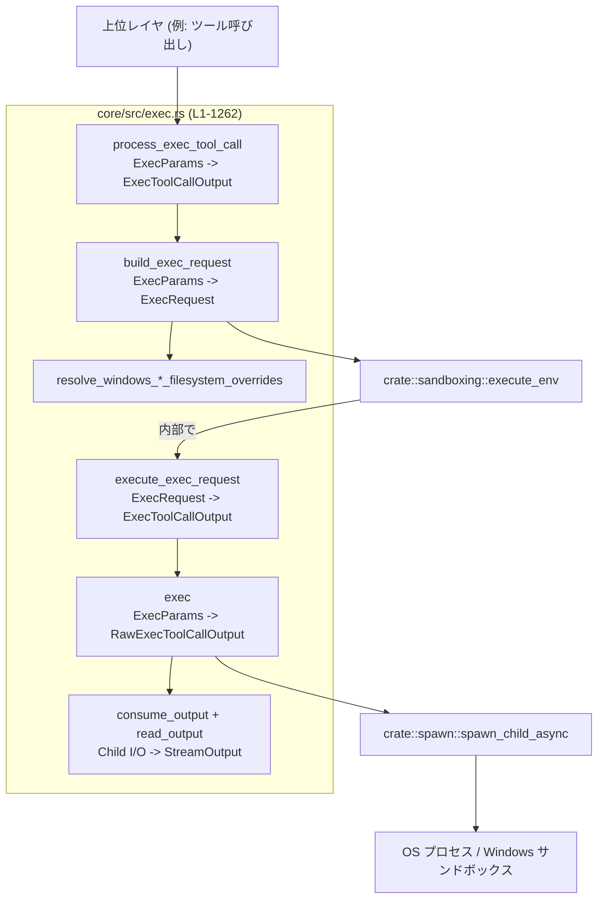
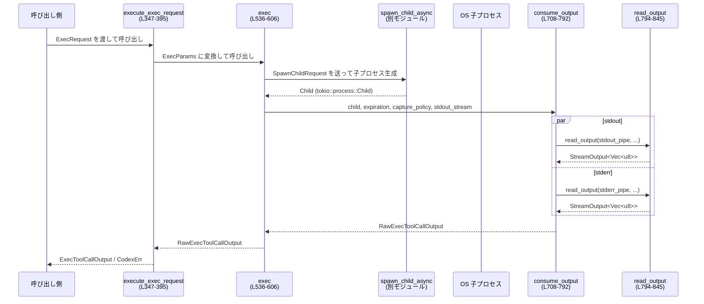

core/src/exec.rs

---

## 0. ざっくり一言

このモジュールは、**外部コマンドをサンドボックス内で実行し、その標準出力/標準エラーをストリーム配信・集約しつつ、タイムアウトやキャンセル、Windows/Unix 固有の制約を扱う「実行エンジン」**を提供します。  
高レベル API（`process_exec_tool_call`）と、より低レベルな実行/出力処理（`exec`・`consume_output` など）が含まれます。  
根拠: `core/src/exec.rs:L1-1262`

---

## 1. このモジュールの役割

### 1.1 概要

- このモジュールは **「ポータブルな Exec リクエスト」** を受け取り、  
  実際の OS プロセス起動（`spawn_child_async` や Windows サンドボックス）までを橋渡しする役割を持ちます。
- **出力キャプチャ方針（`ExecCapturePolicy`）**、**実行期限/キャンセル（`ExecExpiration`）**、  
  **サンドボックス種別（`SandboxType`）とファイルシステム/ネットワークポリシー** に基づき、  
  実行結果を `ExecToolCallOutput` として返します。
- Windows 向けには、ポリシーに応じた **ファイルシステム権限の上書き計算**（`resolve_windows_*_filesystem_overrides`）も提供します。  
根拠: `core/src/exec.rs:L1-1262`

### 1.2 アーキテクチャ内での位置づけ

このファイルは「exec 実行パス」の中心に位置し、  
上位レイヤ（サンドボックスモジュール・プロトコル層）と、下位レイヤ（OS プロセス・Windows サンドボックス）をつなぎます。



- `process_exec_tool_call` は「ツール呼び出し」→「`ExecRequest`」の構築までを担当し、その後は `crate::sandboxing::execute_env` に委譲します。
- `execute_exec_request` は、すでに構築済みの `ExecRequest` から実際にプロセスを起動し、`ExecToolCallOutput` を返す低レベル API です。
- `exec` / `consume_output` / `read_output` が、tokio ベースの非同期プロセス起動・I/O キャプチャを担います。
根拠: `core/src/exec.rs:L96-262, L273-395, L511-707`

### 1.3 設計上のポイント

- **責務の分割**
  - 入力パラメータ定義: `ExecParams`（コマンド・環境変数・サンドボックス設定など）
  - サンドボックスタイプ/ファイルシステムオーバーライド計算:
    - `select_process_exec_tool_sandbox_type`
    - `resolve_windows_restricted_token_filesystem_overrides`
    - `resolve_windows_elevated_filesystem_overrides`
  - 実行制御: `ExecExpiration`・`ExecCapturePolicy`
  - プロセス起動と I/O 処理: `exec`・`consume_output`・`read_output`
  - 結果解釈/エラー分類: `finalize_exec_result`・`is_likely_sandbox_denied`
- **状態管理**
  - 型としての状態: `ExecParams`・`ExecRequest`・`RawExecToolCallOutput`・`ExecToolCallOutput`
  - グローバルな可変状態は持たず、すべて引数・戻り値で受け渡す構造になっています。
- **エラーハンドリング方針**
  - 失敗は `CodexErr`（`SandboxErr` を含む）で表現し、`Result<T, CodexErr>` で返します。
  - タイムアウトやサンドボックス拒否は専用の `SandboxErr` バリアントとして区別されます。
  - I/O エラーやシリアライズ失敗は `CodexErr::Io` でラップされます。
- **並行性/非同期**
  - tokio の `async fn`、`tokio::select!`、`tokio::spawn` を利用して、プロセス待ちと I/O 読み出しを非同期に並列実行します。
  - `CancellationToken`（`ExecExpiration::Cancellation`）により、キャンセル信号で exec を中断可能です（Windows サンドボックスパスは例外、後述）。
- **安全性**
  - 出力バッファには上限 (`EXEC_OUTPUT_MAX_BYTES`) を設け、OOM を防止（`FullBuffer` の場合は意図的に無制限）。
  - Windows サンドボックスがポリシーを正しく強制できない場合は、**明示的にエラーを返して「サンドボックスなし実行」にフェイルバックしない**設計になっています。  
    根拠: `resolve_windows_*_filesystem_overrides` のエラー文言

---

## 2. 主要な機能一覧（コンポーネントインベントリー）

### 2.1 型・構造体・列挙体一覧

| 名前 | 種別 | 公開範囲 | 役割 / 用途 |
|------|------|----------|-------------|
| `ExecParams` | 構造体 | `pub` | コマンドライン・カレントディレクトリ・環境変数・ネットワーク/サンドボックス設定・タイムアウトなど、実行に必要な全ての情報をまとめたパラメータ。 |
| `ExecExpiration` | enum | `pub` | exec をいつ終了させるかを表すメカニズム（明示的タイムアウト・デフォルトタイムアウト・キャンセル）。 |
| `ExecCapturePolicy` | enum | `pub` | 出力の取り扱いポリシー（履歴互換のシェルツール用か、フルバッファか）と、それに伴うタイムアウト/バッファ上限の適用可否を表現。 |
| `StdoutStream` | 構造体 | `pub` | 実行中の stdout/stderr を、イベントストリーム（`Event`）として外部にプッシュするためのチャネル情報。 |
| `WindowsSandboxFilesystemOverrides` | 構造体 | `pub(crate)` | Windows サンドボックスバックエンド向けの、読み取り/書き込みルート・追加 deny-write パスのオーバーライド設定。 |
| `RawExecToolCallOutput` | 構造体 | `private` | 生の `ExitStatus` とバイト列の `StreamOutput<Vec<u8>>` を持つ、低レベルな exec 実行結果。 |

根拠: `core/src/exec.rs:L38-88, L107-156, L181-244, L306-324, L426-443, L526-534`

### 2.2 関数・メソッド一覧（主要なもの）

| 関数名 | 公開範囲 | 役割（1 行） |
|--------|----------|--------------|
| `process_exec_tool_call` | `pub async` | `ExecParams` とサンドボックスポリシーから `ExecRequest` を構築し、`sandboxing::execute_env` にルーティングする高レベル API。 |
| `build_exec_request` | `pub` | `ExecParams` と各種ポリシーから `ExecRequest` を構成し、Windows 用 FS オーバーライドも解決する。 |
| `execute_exec_request` | `pub(crate) async` | 既に構築済みの `ExecRequest` を実際に実行し、`ExecToolCallOutput` を返す。 |
| `exec` | `async` | OS 依存のサンドボックス実装を選択し、子プロセスを起動して `consume_output` へ渡す。 |
| `exec_windows_sandbox` | `async` (Windowsのみ) | Windows サンドボックスバイナリを使ってコマンドを実行し、標準出力/標準エラーをキャプチャする。 |
| `consume_output` | `async` | 起動済み子プロセスの stdout/stderr を非同期タスクで読み取り、タイムアウト/キャンセルを管理しつつ集約する。 |
| `read_output` | `async` | 一方のパイプ（stdout または stderr）から READ_CHUNK_SIZE ごとに読み取り、バッファとイベントストリームに反映。 |
| `finalize_exec_result` | `fn` | `RawExecToolCallOutput` を解釈し、タイムアウト・シグナル・サンドボックス拒否を `CodexErr::Sandbox` などにマッピング。 |
| `is_likely_sandbox_denied` | `pub(crate) fn` | 出力テキストと exit code から、「サンドボックスによる拒否」と推定できるかを判定。 |
| `resolve_windows_restricted_token_filesystem_overrides` | `pub(crate) fn` | Windows restricted token バックエンド用の追加 deny-write パスを計算し、非対応なポリシーはエラーとして報告。 |
| `resolve_windows_elevated_filesystem_overrides` | `pub(crate) fn` | Windows elevated バックエンドの read/write ルートオーバーライドと deny-write パスを計算し、非対応なポリシーを拒否。 |

（その他の補助関数は §3.3 に一覧を示します）  
根拠: `core/src/exec.rs:L246-395, L444-525, L535-707, L708-957, L958-1048`

---

## 3. 公開 API と詳細解説

### 3.1 型一覧（詳細）

| 名前 | 種別 | 主なフィールド / バリアント | 役割 / 用途 |
|------|------|----------------------------|-------------|
| `ExecParams` | 構造体 | `command: Vec<String>`, `cwd: AbsolutePathBuf`, `expiration: ExecExpiration`, `capture_policy: ExecCapturePolicy`, `env: HashMap<String,String>`, `network: Option<NetworkProxy>`, `sandbox_permissions: SandboxPermissions`, `windows_sandbox_level: WindowsSandboxLevel`, `windows_sandbox_private_desktop: bool`, `justification: Option<String>`, `arg0: Option<String>` | 1回の exec 呼び出しに必要なパラメータをすべてまとめて渡すための構造体です。`build_exec_request` や `exec` の入力として利用します。 |
| `ExecExpiration` | enum | `Timeout(Duration)`, `DefaultTimeout`, `Cancellation(CancellationToken)` | exec をいつ終了させるかを指定します。`Timeout` は任意の Duration、`DefaultTimeout` は `DEFAULT_EXEC_COMMAND_TIMEOUT_MS` を使用、`Cancellation` は外部からのキャンセル通知を待ちます。 |
| `ExecCapturePolicy` | enum | `ShellTool`, `FullBuffer` | 出力に対する上限やタイムアウトの「使い方」を決めます。`ShellTool` は従来の「シェルっぽい」振る舞い（出力上限あり+タイムアウト有効）、`FullBuffer` はメモリ上限なし・タイムアウト無効です。 |
| `StdoutStream` | 構造体 | `sub_id: String`, `call_id: String`, `tx_event: Sender<Event>` | 実行中の stdout/stderr チャンクを、`EventMsg::ExecCommandOutputDelta` として外部に配信するためのメタデータとチャネルを保持します。 |
| `WindowsSandboxFilesystemOverrides` | 構造体 | `read_roots_override: Option<Vec<PathBuf>>`, `write_roots_override: Option<Vec<PathBuf>>`, `additional_deny_write_paths: Vec<AbsolutePathBuf>` | Windows サンドボックスの実装制約から、ポリシーとの差分を補うための FS オーバーライドです。 |

根拠: `core/src/exec.rs:L38-88, L107-156, L158-205, L306-324, L426-443`

#### Rust 特有の観点

- `ExecExpiration::Cancellation(CancellationToken)` により、**所有権を安全に移動**しつつ、キャンセル待ちを行います。  
  `CancellationToken` は `cancel.cancelled().await` で非同期に待ち、キャンセルはスレッド安全に共有されます。  
  根拠: `ExecExpiration::wait`

- `ExecCapturePolicy::retained_bytes_cap` が返す `Option<usize>` を通じて、  
  「`Some(limit)` なら `Vec<u8>` バッファに強制上限」「`None` なら無制限」とすることで、**所有権とメモリ管理を型レベルで明示**しています。  
  根拠: `ExecCapturePolicy::retained_bytes_cap`

---

### 3.2 重要関数 詳細（最大 7 件）

#### 1. `process_exec_tool_call(...) -> Result<ExecToolCallOutput>`

```rust
#[allow(clippy::too_many_arguments)]
pub async fn process_exec_tool_call(
    params: ExecParams,
    sandbox_policy: &SandboxPolicy,
    file_system_sandbox_policy: &FileSystemSandboxPolicy,
    network_sandbox_policy: NetworkSandboxPolicy,
    sandbox_cwd: &Path,
    codex_linux_sandbox_exe: &Option<PathBuf>,
    use_legacy_landlock: bool,
    stdout_stream: Option<StdoutStream>,
) -> Result<ExecToolCallOutput>
```

**概要**

- `ExecParams` と各種サンドボックス設定から `ExecRequest` を構築し、  
  実際の exec 実行は `crate::sandboxing::execute_env` に委譲する高レベル API です。
- 呼び出し側は OS/サンドボックスの細かい振る舞いを意識せずに、`ExecToolCallOutput` を取得できます。  
根拠: `core/src/exec.rs:L246-266`

**引数**

| 引数名 | 型 | 説明 |
|--------|----|------|
| `params` | `ExecParams` | 実行するコマンド・環境・ネットワーク・タイムアウトなど。 |
| `sandbox_policy` | `&SandboxPolicy` | レガシー/汎用サンドボックスポリシー。Writable/Readable roots 等。 |
| `file_system_sandbox_policy` | `&FileSystemSandboxPolicy` | より詳細なファイルシステムサンドボックス設定（split read/write roots など）。 |
| `network_sandbox_policy` | `NetworkSandboxPolicy` | ネットワーク許可/禁止に関するポリシー。 |
| `sandbox_cwd` | `&Path` | サンドボックス内から見たカレントディレクトリ。 |
| `codex_linux_sandbox_exe` | `&Option<PathBuf>` | Linux サンドボックスバイナリのパス（あれば使用）。 |
| `use_legacy_landlock` | `bool` | Linux Landlock のレガシーモードを使用するかどうか。 |
| `stdout_stream` | `Option<StdoutStream>` | 実行中の出力をストリーム送信するためのチャネル（不要なら `None`）。 |

**戻り値**

- `Ok(ExecToolCallOutput)`  
  - exit code・stdout/stderr・aggregated output・実行時間・timeout フラグを含む高レベル結果。
- `Err(CodexErr)`  
  - サンドボックス変換・ポリシー制約・実行エラーなど。具体的には `CodexErr::Sandbox` や `CodexErr::Io` など。

**内部処理の流れ**

1. `build_exec_request(...)` を呼び出して、`ExecParams` と各種ポリシーから `ExecRequest` を構築。
2. `crate::sandboxing::execute_env(exec_req, stdout_stream).await` を呼び出し、  
   実際のサンドボックス実行・結果収集を担当させる。
3. そのまま `Result<ExecToolCallOutput>` を呼び出し元へ返す。

**Examples（使用例）**

```rust
use std::collections::HashMap;
use codex_protocol::error::Result;
use codex_protocol::permissions::{
    FileSystemSandboxPolicy, NetworkSandboxPolicy,
};
use codex_protocol::protocol::SandboxPolicy;
use codex_utils_absolute_path::AbsolutePathBuf;
use core::exec::{
    ExecParams, ExecCapturePolicy, ExecExpiration, process_exec_tool_call,
    DEFAULT_EXEC_COMMAND_TIMEOUT_MS,
};

async fn run_echo() -> Result<()> {
    let cwd = AbsolutePathBuf::from_absolute_path(std::env::current_dir().unwrap()).unwrap();
    let params = ExecParams {
        command: vec!["echo".into(), "hello".into()], // 実行コマンド
        cwd,
        expiration: ExecExpiration::from(DEFAULT_EXEC_COMMAND_TIMEOUT_MS), // 既定タイムアウト
        capture_policy: ExecCapturePolicy::ShellTool,
        env: HashMap::new(),
        network: None,
        sandbox_permissions: SandboxPermissions::UseDefault,
        windows_sandbox_level: codex_protocol::config_types::WindowsSandboxLevel::Restricted,
        windows_sandbox_private_desktop: false,
        justification: None,
        arg0: None,
    };

    // 実際にはアプリ側で構成されるポリシーを渡す
    let sandbox_policy = SandboxPolicy::DangerFullAccess;
    let fs_policy = FileSystemSandboxPolicy::full_disk(); // 仮のヘルパーとする
    let network_policy = NetworkSandboxPolicy::default();
    let sandbox_cwd = std::path::Path::new(".");

    let output = process_exec_tool_call(
        params,
        &sandbox_policy,
        &fs_policy,
        network_policy,
        sandbox_cwd,
        &None,
        false,
        None,
    ).await?;

    println!("exit code: {}", output.exit_code);
    println!("stdout: {}", output.stdout.text);
    Ok(())
}
```

（`FileSystemSandboxPolicy::full_disk()` 等のコンストラクタはこのチャンクには現れないため、上記は概念的な例です）

**Errors / Panics**

- `build_exec_request` が `Err(CodexErr)` を返した場合、そのままエラーとして返されます。
  - 例: `params.command` が空、Windows サンドボックスが要求されたポリシーを強制できない、など。
- `crate::sandboxing::execute_env` 内部のエラーも `CodexErr` として伝播します。
- この関数自体はパニック条件を持ちません（パニックを起こしうる `unwrap` などは使用していません）。

**Edge cases（エッジケース）**

- `params.command` が空  
  → `build_exec_request` 内で `Io(InvalidInput)` エラーになります（後述）。
- `stdout_stream` が `Some` の場合でも、実際にイベントを受け取る側が先に閉じていると、  
  `send` が `Err` を返す可能性がありますが、`let _ = ...` で無視されます（ログ等は出ません）。

**使用上の注意点**

- `process_exec_tool_call` は「高レベル API」であり、Windows 特有の制約やサンドボックスバックエンドの選択は  
  内部で `build_exec_request` によって処理されます。  
  **細かな Windows ポリシー差異を把握したい場合は `build_exec_request` と `resolve_windows_*` 群を見る必要があります。**
- 非同期関数なので、**tokio ランタイム上**で `.await` する必要があります。

---

#### 2. `build_exec_request(...) -> Result<ExecRequest>`

```rust
pub fn build_exec_request(
    params: ExecParams,
    sandbox_policy: &SandboxPolicy,
    file_system_sandbox_policy: &FileSystemSandboxPolicy,
    network_sandbox_policy: NetworkSandboxPolicy,
    sandbox_cwd: &Path,
    codex_linux_sandbox_exe: &Option<PathBuf>,
    use_legacy_landlock: bool,
) -> Result<ExecRequest>
```

**概要**

- `ExecParams` と複数のサンドボックス/ネットワークポリシーから、  
  実際にサンドボックスマネージャが消費できる `ExecRequest` を組み立てる関数です。
- Windows のサンドボックスバックエンド（restricted token / elevated）に応じて、  
  ファイルシステムオーバーライド（読取/書込ルートや追加 deny-write パス）を解決します。  
根拠: `core/src/exec.rs:L268-345`

**引数**

| 引数名 | 型 | 説明 |
|--------|----|------|
| `params` | `ExecParams` | 高レベル実行パラメータ。 |
| `sandbox_policy` | `&SandboxPolicy` | レガシーサンドボックスポリシー。 |
| `file_system_sandbox_policy` | `&FileSystemSandboxPolicy` | 詳細な FS サンドボックスポリシー。 |
| `network_sandbox_policy` | `NetworkSandboxPolicy` | ネットワークサンドボックスポリシー。 |
| `sandbox_cwd` | `&Path` | サンドボックス内カレントディレクトリ。 |
| `codex_linux_sandbox_exe` | `&Option<PathBuf>` | Linux サンドボックス実行ファイル。 |
| `use_legacy_landlock` | `bool` | Landlock レガシーモード使用フラグ。 |

**戻り値**

- `Ok(ExecRequest)`  
  - `SandboxManager::transform` によって OS 実行に適した形式に変換されたリクエスト。
- `Err(CodexErr)`  
  - 変換エラー（`SandboxManager::transform` 由来）や、Windows サンドボックスオーバーライド計算の失敗 (`UnsupportedOperation`) など。

**内部処理の流れ**

1. `select_process_exec_tool_sandbox_type` でサンドボックスタイプ (`SandboxType`) を決定。  
   `NetworkProxy` が存在する場合は「管理されたネットワーク強制」を有効にします。
2. `ExecParams` を分解し、`NetworkProxy` があれば `apply_to_env` で環境変数へ反映。
3. `command.split_first()` で `program` と `args` に分割。空なら `Io(InvalidInput)` エラー。
4. `SandboxManager::new().transform(SandboxTransformRequest { ... })` を呼び出し、  
   `SandboxCommand` + ポリシー群を OS ごとの具体的な実行形式へ変換。
5. 成功した変換結果から `ExecRequest::from_sandbox_exec_request(request, options)` を生成。
6. Windows 用バックエンド（elevated or restricted token）を判定し、  
   - `resolve_windows_elevated_filesystem_overrides` または  
   - `resolve_windows_restricted_token_filesystem_overrides`  
   を呼び出して FS オーバーライドを設定。
7. もしこれらが `Err(String)` を返した場合、`CodexErr::UnsupportedOperation` としてマッピングしエラーにする。

**Errors / Panics**

- `command` が空 → `CodexErr::Io(io::ErrorKind::InvalidInput)`。
- `SandboxManager::transform` が失敗 → `CodexErr::from(err)` でラップされて返る。
- `resolve_windows_*_filesystem_overrides` が `Err(String)` を返した場合 →  
  `CodexErr::UnsupportedOperation` として返る。  
  （例: Windows restricted token サンドボックスが split writable roots を直接強制できない場合）
- パニックを起こしうる `unwrap` は使用していません。

**Edge cases**

- Windows で `NetworkProxy` を使うと、ファイアウォール強制が elevated backend に紐づくため、  
  `windows_sandbox_uses_elevated_backend` が `true` になり、elevated サンドボックスを強制します。
- FS ポリシーが Windows サンドボックス実装の制約と矛盾している場合、  
  **この関数がエラーを返し、「サンドボックスなし実行」にフォールバックしない**点が重要です。

**使用上の注意点**

- `build_exec_request` は「ポリシーを忠実に強制できない組み合わせ」をエラーとして扱うため、  
  上位コードは `UnsupportedOperation` を受け取った場合に、ユーザー向けメッセージや代替手段を提供する必要があります。
- `ExecParams.command` は必ず 1 要素以上にする必要があります。

---

#### 3. `execute_exec_request(...) -> Result<ExecToolCallOutput>`

```rust
pub(crate) async fn execute_exec_request(
    exec_request: ExecRequest,
    stdout_stream: Option<StdoutStream>,
    after_spawn: Option<Box<dyn FnOnce() + Send>>,
) -> Result<ExecToolCallOutput>
```

**概要**

- 既に構築されている `ExecRequest` を受け取り、`exec` を呼び出して実際にプロセスを起動し、  
  `finalize_exec_result` で `ExecToolCallOutput` にまとめます。
- サンドボックスモジュールからの「実行エントリポイント」として想定されます。  
根拠: `core/src/exec.rs:L347-395`

**引数**

| 引数名 | 型 | 説明 |
|--------|----|------|
| `exec_request` | `ExecRequest` | サンドボックス変換済みの実行リクエスト。 |
| `stdout_stream` | `Option<StdoutStream>` | ライブ出力をイベントとして送信するかどうか。 |
| `after_spawn` | `Option<Box<dyn FnOnce() + Send>>` | 子プロセス spawn 直後に一度だけ実行するコールバック。 |

**戻り値**

- `Ok(ExecToolCallOutput)`  
  - 正常終了、または非タイムアウト/非サンドボックス拒否として扱われた場合。
- `Err(CodexErr::Sandbox(SandboxErr::Timeout{..}))`  
  - タイムアウトした場合（Unix の場合はシグナル CODE からも検出）。
- `Err(CodexErr::Sandbox(SandboxErr::Denied{..}))`  
  - `is_likely_sandbox_denied` が true を返した場合。
- `Err(CodexErr::Sandbox(SandboxErr::Signal(_)))`  
  - Unix でタイムアウト以外のシグナルで終了した場合。
- その他 `Err(CodexErr)`  
  - spawn 失敗など。

**内部処理の流れ**

1. `ExecRequest` を分解し、`ExecParams` を再構築（`sandbox_permissions` などはデフォルトに戻されます）。
2. `Instant::now()` で開始時刻を記録。
3. `exec(...)` を `.await` し、`Result<RawExecToolCallOutput, CodexErr>` を取得。
4. `duration = start.elapsed()` を計測。
5. `finalize_exec_result(raw_output_result, sandbox, duration)` を呼び出し、  
   - シグナル検出と `SandboxErr::Signal` / `SandboxErr::Timeout` への変換
   - `is_likely_sandbox_denied` による `SandboxErr::Denied` 判定
   - `ExecToolCallOutput` の生成  
   を行う。

**使用上の注意点**

- `after_spawn` は **spawn に成功した場合のみ呼ばれます**。spawn 前のエラーでは呼ばれません。
- タイムアウトやキルシグナルは `finalize_exec_result` 内で解釈されるため、  
  実際の `ExitStatus` と `ExecToolCallOutput.exit_code` が異なる場合があります（タイムアウト時に 124 など）。

---

#### 4. `exec(...) -> Result<RawExecToolCallOutput>`

```rust
#[allow(clippy::too_many_arguments)]
async fn exec(
    params: ExecParams,
    _sandbox: SandboxType,
    _sandbox_policy: &SandboxPolicy,
    _file_system_sandbox_policy: &FileSystemSandboxPolicy,
    _windows_sandbox_filesystem_overrides: Option<&WindowsSandboxFilesystemOverrides>,
    network_sandbox_policy: NetworkSandboxPolicy,
    stdout_stream: Option<StdoutStream>,
    after_spawn: Option<Box<dyn FnOnce() + Send>>,
) -> Result<RawExecToolCallOutput>
```

**概要**

- サンドボックスタイプに応じて適切な実行パスを選択（Windows restricted token サンドボックスなど）し、  
  `spawn_child_async` でプロセスを起動して `consume_output` に渡します。  
根拠: `core/src/exec.rs:L536-606`

**引数**

| 引数名 | 型 | 説明 |
|--------|----|------|
| `params` | `ExecParams` | 実行パラメータ。 |
| `_sandbox` | `SandboxType` | サンドボックス種別（Windows 限定分岐で使用）。 |
| `_sandbox_policy` | `&SandboxPolicy` | Windows サンドボックス実装向け。 |
| `_file_system_sandbox_policy` | `&FileSystemSandboxPolicy` | 同上。 |
| `_windows_sandbox_filesystem_overrides` | `Option<&WindowsSandboxFilesystemOverrides>` | Windows 用 FS オーバーライド。 |
| `network_sandbox_policy` | `NetworkSandboxPolicy` | ネットワークを OS レベルで制限するためのポリシー。 |
| `stdout_stream` | `Option<StdoutStream>` | 出力イベントストリーム。 |
| `after_spawn` | `Option<Box<dyn FnOnce() + Send>>` | spawn 後コールバック。 |

**内部処理の流れ（Unix/一般パス）**

1. （Windows + `SandboxType::WindowsRestrictedToken` の場合は `exec_windows_sandbox` へ分岐。）
2. `ExecParams` を分解し、`NetworkProxy` があれば `env` にプロキシ環境変数を適用。
3. `command.split_first()` で `program` と `args` を取得。空なら `CodexErr::Io(InvalidInput)`。
4. `spawn_child_async(SpawnChildRequest { ... })` を呼び出し、  
   - `network_sandbox_policy` を指定  
   - `StdioPolicy::RedirectForShellTool` で stdout/stderr をパイプにリダイレクト  
   して子プロセスを起動。
5. `after_spawn` が指定されていれば呼び出し。
6. `consume_output(child, expiration, capture_policy, stdout_stream).await` を呼び、  
   出力読み取りとタイムアウト/キャンセル処理を任せる。

**Errors / Edge cases**

- `command` が空 → `CodexErr::Io(InvalidInput)`。
- `spawn_child_async` が失敗 → そのまま `CodexErr` として返る。
- Windows restricted token の場合は `exec_windows_sandbox` が全てを処理し、  
  `RunWindowsSandboxCapture` 系のエラーを `CodexErr::Io` として返します。

**並行性・安全性**

- 実際の I/O 読み取りとタイムアウト制御は `consume_output` に委譲されるため、  
  ここでは「spawn + パラメータ適用」という責務に限定されています。
- `ExecParams` がムーブされるため、実行中に同じパラメータを誤って再利用することはできません（所有権による安全性）。

---

#### 5. `consume_output(...) -> Result<RawExecToolCallOutput>`

```rust
async fn consume_output(
    mut child: Child,
    expiration: ExecExpiration,
    capture_policy: ExecCapturePolicy,
    stdout_stream: Option<StdoutStream>,
) -> Result<RawExecToolCallOutput>
```

**概要**

- tokio の `Child` プロセスから stdout/stderr を非同期タスクで読み続けつつ、  
  `ExecExpiration`（タイムアウト/キャンセル）や `Ctrl-C` を `tokio::select!` で監視し、  
  プロセスを安全に終了させたうえで出力を集約します。  
根拠: `core/src/exec.rs:L708-792`

**内部処理の流れ**

1. `child.stdout.take()` / `child.stderr.take()` でパイプを取り出し、  
   失敗した場合は `CodexErr::Io("stdout pipe was unexpectedly not available")` などを返す。
2. `retained_bytes_cap = capture_policy.retained_bytes_cap()` を取得。
3. `tokio::spawn(read_output(...))` を 2 本起動し、stdout/stderr を並行して読み取り開始。
4. `expiration_wait` という Future を用意:
   - `capture_policy.uses_expiration()` が true の場合は `expiration.wait().await` を実行。
   - false の場合は `std::future::pending()` で無限待ち（タイムアウト無効）。
5. `tokio::select!` で次の 3 つのいずれかを待つ:
   - `child.wait()` 完了 → 正常終了（`timed_out = false`）。
   - `expiration_wait` 完了 → タイムアウト or キャンセル:
     - `kill_child_process_group(&mut child)?; child.start_kill()?;`
     - `synthetic_exit_status(EXIT_CODE_SIGNAL_BASE + TIMEOUT_CODE)` をセットし、`timed_out = true`。
   - `tokio::signal::ctrl_c()` → ユーザー割り込み:
     - 同様に kill し、`synthetic_exit_status(EXIT_CODE_SIGNAL_BASE + SIGKILL_CODE)` をセット。`timed_out = false`。
6. `await_output(handle, io_drain_timeout)` で stdout/stderr の読み取りタスク完了を待つ:
   - `tokio::time::timeout` で `IO_DRAIN_TIMEOUT_MS` 以内を待つ。
   - タイムアウトした場合は `handle.abort()` して空の `StreamOutput` を返す。
7. `aggregate_output(&stdout, &stderr, retained_bytes_cap)` で aggregated output を作成。
8. `RawExecToolCallOutput { exit_status, stdout, stderr, aggregated_output, timed_out }` を返す。

**Errors / Panics**

- パイプ取得失敗 → `CodexErr::Io`。
- `kill_child_process_group` または `start_kill` が失敗した場合 → `CodexErr::Io` で返る。
- 読み取りタスクが `JoinError` を返した場合 → `std::io::Error::other(join_err)` に変換されますが、  
  その後 `CodexErr::Io` にラップされます（`exec` → `execute_exec_request` 経由）。

**並行性 / Rust 特有の安全性**

- stdout/stderr 読み取りはそれぞれ `tokio::spawn` したタスクで行い、  
  `JoinHandle` を `await_output` でタイムアウト付きで待機することで、**孫プロセスによるパイプ開放遅延でハングしない**よう設計されています。
- `kill_child_process_group` を使うことで、直接の子プロセスだけでなく、同じプロセスグループの子孫プロセスもまとめて終了させます。  
  これは「タイムアウト時にサブプロセスが残りつづける」ことを避けるためです。

**Edge cases**

- `capture_policy` が `FullBuffer` の場合でも `io_drain_timeout` は有効なので、  
  「プロセス終了 → 2 秒以内にパイプ読み取りタスクが完了しない場合」は残りのデータを捨てます。
- `ExecExpiration::Cancellation` の場合、`expiration.wait()` は `CancellationToken.cancelled().await` を待つため、  
  トークンがキャンセルされた時点でタイムアウト分岐に入り、プロセスを kill します。

**使用上の注意点**

- `ExecCapturePolicy::ShellTool` で `ExecExpiration::DefaultTimeout`（10秒）を使う構成が基本であり、  
  長時間動作が必要なコマンドに対しては `Timeout` の値を十分に長くする必要があります。
- `FullBuffer` を使うと、**どれだけ出力してもメモリ上に蓄積される**ため、  
  信頼できないコマンドには使用しない方が安全です。

---

#### 6. `read_output<R: AsyncRead + Unpin + Send + 'static>(...)`

```rust
async fn read_output<R: AsyncRead + Unpin + Send + 'static>(
    mut reader: R,
    stream: Option<StdoutStream>,
    is_stderr: bool,
    max_bytes: Option<usize>,
) -> io::Result<StreamOutput<Vec<u8>>>
```

**概要**

- 1 本のパイプ（stdout または stderr）から `READ_CHUNK_SIZE` バイトずつ読み取り、  
  `max_bytes` に応じてバッファへ追加しつつ、必要なら `StdoutStream` 経由でライブイベントを送信します。  
根拠: `core/src/exec.rs:L794-845`

**内部処理の流れ**

1. `buf` を `AGGREGATE_BUFFER_INITIAL_CAPACITY` か `max_bytes` の小さい方の容量で初期化。
2. `tmp` に 8 KiB (`READ_CHUNK_SIZE`) のスタックバッファを確保。
3. ループ:
   - `n = reader.read(&mut tmp).await?;` で読み取り。`n == 0` なら EOF → ループ終了。
   - `stream` が `Some` かつ `emitted_deltas < MAX_EXEC_OUTPUT_DELTAS_PER_CALL` の場合:
     - `chunk = tmp[..n].to_vec()` を生成。
     - `EventMsg::ExecCommandOutputDelta { ... }` を作成し、`stream.tx_event.send(event).await` を実行（エラーは無視）。
     - `emitted_deltas += 1`。
   - `max_bytes` が `Some(limit)` の場合: `append_capped(&mut buf, &tmp[..n], limit)`。
   - `None` の場合: `buf.extend_from_slice(&tmp[..n])`。
4. `StreamOutput { text: buf, truncated_after_lines: None }` を返す。

**Errors / Edge cases**

- `reader.read()` がエラー → そのまま `io::Error` として返る。
- `max_bytes` を超えても読み取りは続行し、**バッファに追加されないだけ**です（バックプレッシャー回避のため）。
- `StdoutStream` のチャネル送信エラー（受信側 drop など）は `let _ = ...` で無視されます。

**並行性上の注意**

- `read_output` 自身は 1 ストリーム専用であり、stdout/stderr を同時に扱う場合は `consume_output` 側で 2 本のタスクとして起動します。
- Rust の所有権規則により、`StdoutStream` は `Option<StdoutStream>` としてムーブされつつクローンされ、  
  複数の `read_output` タスクで安全に共有されます（Clone 実装があるため）。

---

#### 7. `resolve_windows_elevated_filesystem_overrides(...)`

```rust
pub(crate) fn resolve_windows_elevated_filesystem_overrides(
    sandbox: SandboxType,
    sandbox_policy: &SandboxPolicy,
    file_system_sandbox_policy: &FileSystemSandboxPolicy,
    network_sandbox_policy: NetworkSandboxPolicy,
    sandbox_policy_cwd: &Path,
    use_windows_elevated_backend: bool,
) -> std::result::Result<Option<WindowsSandboxFilesystemOverrides>, String>
```

**概要**

- Windows elevated サンドボックスバックエンドに対して、  
  レガシーポリシーと split FS ポリシーの差分を調整するための  
  `read_roots_override` / `write_roots_override` / `additional_deny_write_paths` を計算します。  
根拠: `core/src/exec.rs:L873-957`

**内部処理の流れ（概略）**

1. `sandbox != WindowsRestrictedToken` または `use_windows_elevated_backend == false` の場合 → `Ok(None)`（オーバーライド不要）。
2. `should_use_windows_restricted_token_sandbox` によって、バックエンドが使用可能か検査。
   - 不可能な場合は `"windows sandbox backend cannot enforce ...; refusing to run unsandboxed"`  というエラー文字列を返す。
3. `file_system_sandbox_policy.get_unreadable_roots_with_cwd` が空でない場合 →  
   `"windows elevated sandbox cannot enforce unreadable split filesystem carveouts directly; refusing to run unsandboxed"` エラー。
4. split writable roots に「read-only carveout の下に再度 writable な子ディレクトリを開く」ような構造がないか `has_reopened_writable_descendant` で検査。
   - あればエラーを返す。
5. `needs_direct_runtime_enforcement` で、FS ポリシー上の carveout を runtime enforcement で補う必要があるか調べる。
6. レガシーポリシー (`sandbox_policy`) と split ポリシー (`file_system_sandbox_policy`) の
   - readable roots
   - writable roots  
   を `BTreeSet<PathBuf>` として canonicalize し、差分を比較。
   - 一致していれば `read_roots_override` / `write_roots_override` は `None`。
   - 差分があれば `Some(Vec<PathBuf>)` にセット。
7. `needs_direct_runtime_enforcement` が true の場合、  
   read-only carveout で追加 deny が必要なパスを `additional_deny_write_paths` として計算。
8. 3 つすべてが「オーバーライド不要」の場合 → `Ok(None)`。  
   いずれかが必要な場合 → `Ok(Some(WindowsSandboxFilesystemOverrides{...}))`。

**Errors / セキュリティ観点**

- 実装制約上「安全にサンドボックスを強制できない組み合わせ」の場合、  
  常に `"refusing to run unsandboxed"` というメッセージ付きで `Err(String)` を返します。  
  → 上位の `build_exec_request` がこれを `CodexErr::UnsupportedOperation` に変換し、  
    「サンドボックスなしで実行する」ことはありません。
- これにより、ポリシー上は制限付きのはずなのに実際は制限が効かない、といった**サンドボックス回避リスク**を避ける設計になっています。

---

### 3.3 その他の関数一覧（サマリ）

| 関数名 | 公開範囲 | 役割（1 行） |
|--------|----------|--------------|
| `windows_sandbox_uses_elevated_backend` | `fn` | ネットワーク強制と `WindowsSandboxLevel` を見て elevated バックエンドを使うべきか判定。 |
| `select_process_exec_tool_sandbox_type` | `fn` | `SandboxManager::select_initial` を呼び出して初期サンドボックスタイプを決定。 |
| `ExecExpiration::wait` | `async fn` (impl) | Timeout / DefaultTimeout / Cancellation ごとに適切な待機方法を実行。 |
| `ExecExpiration::timeout_ms` | `fn` | Windows サンドボックス実装向けに timeout をミリ秒で返す（Cancellation の場合は `None`）。 |
| `ExecCapturePolicy::uses_expiration` | `fn` | `ShellTool` のときだけタイムアウト/キャンセルを有効にするかを返す。 |
| `extract_create_process_as_user_error_code` (Windows) | `fn` | エラーメッセージ文字列から Windows エラーコードを抽出。 |
| `record_windows_sandbox_spawn_failure` (Windows) | `fn` | Windows sandbox spawn 失敗時に OTEL メトリクスを記録。 |
| `exec_windows_sandbox` (Windows) | `async fn` | Windows sandbox バイナリを使った exec 実行と出力キャプチャ。 |
| `finalize_exec_result` | `fn` | `RawExecToolCallOutput` を解釈して `ExecToolCallOutput` または `CodexErr` を返す。 |
| `is_likely_sandbox_denied` | `pub(crate) fn` | 出力テキストから sandbox deny を推定。 |
| `append_capped` | `fn` | `Vec<u8>` に対するバイト数上限付き append。 |
| `aggregate_output` | `fn` | stdout/stderr から aggregated output を構築（上限付き/なしを切替）。 |
| `should_use_windows_restricted_token_sandbox` | `fn` | restricted token backend を使うべきかの判定。 |
| `unsupported_windows_restricted_token_sandbox_reason` | `pub(crate) fn` | restricted token backend が使えない理由を文字列で返す。 |
| `resolve_windows_restricted_token_filesystem_overrides` | `pub(crate) fn` | restricted token 用追加 deny-write パスの計算。 |
| `normalize_windows_override_path` | `fn` | Windows パスを `AbsolutePathBuf` 経由で正規化。 |
| `has_reopened_writable_descendant` | `fn` | split writable roots に「read-only carveout 下の再オープン」が含まれるか判定。 |
| `synthetic_exit_status` | `fn` | Unix/Windows 向けに raw code から `ExitStatus` を生成。 |

根拠: `core/src/exec.rs:L88-244, L396-525, L606-707, L958-1048, L1050-1133`

---

## 4. データフロー

### 4.1 代表的な処理シナリオ（Unix / シェルツール）

以下は、`execute_exec_request` を入口として Unix 上でコマンドを実行するケースのデータフローです。



- 途中で `ExecExpiration::wait` の終了や `tokio::signal::ctrl_c()` により、  
  `consume_output` 内の `tokio::select!` でタイムアウト/キャンセル/中断分岐に入ります。
- その場合、`kill_child_process_group` + `start_kill` によって子プロセス群を終了させてから出力処理に進みます。

---

## 5. 使い方（How to Use）

### 5.1 基本的な使用方法（高レベル API）

最も単純な利用方法は、`process_exec_tool_call` に `ExecParams` とポリシーを渡すパターンです。

```rust
use std::collections::HashMap;
use std::path::Path;
use codex_protocol::error::Result;
use codex_protocol::protocol::SandboxPolicy;
use codex_protocol::permissions::{
    FileSystemSandboxPolicy, NetworkSandboxPolicy, FileSystemSandboxKind,
};
use codex_utils_absolute_path::AbsolutePathBuf;
use crate::exec::{
    ExecParams, ExecCapturePolicy, ExecExpiration, process_exec_tool_call,
};

async fn run_command() -> Result<()> {
    let cwd = AbsolutePathBuf::from_absolute_path(
        std::env::current_dir().unwrap()
    ).unwrap();

    let params = ExecParams {
        command: vec!["ls".into(), "-la".into()],      // 実行コマンド
        cwd,
        expiration: ExecExpiration::DefaultTimeout,    // 既定タイムアウト (10s)
        capture_policy: ExecCapturePolicy::ShellTool,  // 出力上限あり
        env: HashMap::new(),
        network: None,
        sandbox_permissions: SandboxPermissions::UseDefault,
        windows_sandbox_level: codex_protocol::config_types::WindowsSandboxLevel::Restricted,
        windows_sandbox_private_desktop: false,
        justification: None,
        arg0: None,
    };

    // sandbox_policy / fs_policy / network_policy はアプリ側で構成
    let sandbox_policy = SandboxPolicy::DangerFullAccess;
    let fs_policy = FileSystemSandboxPolicy {
        kind: FileSystemSandboxKind::Unrestricted,
        // 他のフィールドは省略
    };
    let network_policy = NetworkSandboxPolicy::default();

    let output = process_exec_tool_call(
        params,
        &sandbox_policy,
        &fs_policy,
        network_policy,
        Path::new("."),  // sandbox_cwd
        &None,
        false,
        None,            // ライブストリーム不要
    ).await?;

    println!("stdout: {}", output.stdout.text);
    Ok(())
}
```

### 5.2 よくある使用パターン

1. **長時間実行コマンド + 大量出力（信頼できる内部ツール）**

   - `ExecCapturePolicy::FullBuffer` を使用しタイムアウトを無効化。
   - ただしメモリ上限がなくなるため、**信頼できるプログラム**に限定する必要があります。

   ```rust
   let params = ExecParams {
       // ...
       expiration: ExecExpiration::DefaultTimeout,       // ただし FullBuffer では使われない
       capture_policy: ExecCapturePolicy::FullBuffer,    // タイムアウト無効・上限なし
       // ...
   };
   ```

2. **ユーザー対話的 CLI ツール + ライブログ配信**

   - `stdout_stream: Some(StdoutStream)` を渡して、`read_output` から `ExecCommandOutputDeltaEvent` を受け取る。
   - UI 側で `MAX_EXEC_OUTPUT_DELTAS_PER_CALL` を前提に、ストリームの終端は `ExecToolCallOutput` で確認する。

### 5.3 よくある間違い

```rust
// 間違い例: command が空の ExecParams
let params = ExecParams {
    command: vec![], // 空 → build_exec_request で InvalidInput エラー
    // ...
};

// 正しい例: 実際に実行するバイナリ名を先頭に置く
let params = ExecParams {
    command: vec!["bash".into(), "-c".into(), "echo hi".into()],
    // ...
};
```

```rust
// 間違い例: 信頼できないユーザーコマンドに FullBuffer を使う
let params = ExecParams {
    capture_policy: ExecCapturePolicy::FullBuffer, // 大量出力で OOM のリスク
    // ...
};

// 正しい例: ShellTool を使い、出力上限とタイムアウトを有効化
let params = ExecParams {
    capture_policy: ExecCapturePolicy::ShellTool,
    expiration: ExecExpiration::from(5_000_u64), // 5秒に短縮するなど
    // ...
};
```

### 5.4 使用上の注意点（まとめ）

- **タイムアウト / キャンセル**
  - `ExecCapturePolicy::ShellTool` のときだけ `ExecExpiration` が有効です。  
    `FullBuffer` の場合、`consume_output` 内で `expiration_wait` が常に pending になるため、タイムアウト・キャンセルは効きません。
  - Windows サンドボックスパス（`exec_windows_sandbox`）は TODO コメントの通り、`ExecExpiration::Cancellation` を直接扱っていません。  
    → timeout_ms だけが反映され、`Cancellation` は `timeout_ms()` が `None` を返すため Windows サンドボックスには伝わりません。

- **メモリ使用量**
  - `ShellTool` の場合、`EXEC_OUTPUT_MAX_BYTES` で stdout/stderr/aggregated の各バッファに上限があります。
  - `FullBuffer` の場合は上限がないため、**長時間・大量出力のコマンドではメモリ圧迫の可能性**があります。

- **サンドボックス制約**
  - Windows で FS/ネットワークポリシーがサンドボックス実装の制約（restricted token/elevated）と矛盾する場合、  
    `build_exec_request` が `UnsupportedOperation` を返します。  
    → 「一見サンドボックス有効だが実際は無効」という状態にはなりません。

- **イベントストリーム**
  - `read_output` から送信される `ExecCommandOutputDeltaEvent` は最大 `MAX_EXEC_OUTPUT_DELTAS_PER_CALL` 個に制限されます。  
    → ログ UI などは「最後までストリームを受け取れなくても、最終的には `ExecToolCallOutput` の aggregated_output で完全なログが得られる」前提で設計する必要があります。

---

## 6. 変更の仕方（How to Modify）

### 6.1 新しい機能を追加する場合

1. **新しい capture ポリシーを追加したい場合**
   - `ExecCapturePolicy` に新バリアントを追加。
   - そのバリアントに対する `retained_bytes_cap` / `io_drain_timeout` / `uses_expiration` の振る舞いを定義。
   - `exec_windows_sandbox` や `consume_output` を確認し、新ポリシーでも意図どおり動くか検討する。

2. **新しいサンドボックスタイプを導入したい場合**
   - `SandboxType`（別モジュール）にバリアントを追加。
   - `select_process_exec_tool_sandbox_type` で選択ロジックを拡張。
   - 必要に応じて `exec` 内で `_sandbox` を見て新しい分岐を追加する。

3. **追加のメトリクス・ログを入れたい場合**
   - `finalize_exec_result` 内のエラー分岐や `record_windows_sandbox_spawn_failure` を参考に、  
     `tracing` や `codex_otel` の呼び出しを追加する。

### 6.2 既存の機能を変更する場合の注意点

- **契約（前提条件/返り値）**
  - `build_exec_request` は「Windows サンドボックスがポリシーを強制できない組み合わせならエラーにする」という暗黙の契約があります。  
    この挙動を変えると安全性に影響するため、外部呼び出し側の期待を確認する必要があります。
  - `execute_exec_request` / `finalize_exec_result` は、**タイムアウトやシグナルを `CodexErr::Sandbox` にマッピングする**契約を持ちます。

- **影響範囲の確認**
  - `ExecParams` / `ExecCapturePolicy` / `ExecExpiration` にフィールドやバリアントを追加する場合、  
    - `build_exec_request`  
    - `exec`  
    - `consume_output`  
    - Windows サンドボックス関連関数  
    など、全てのパスで新要素を考慮する必要があります。

- **テスト**
  - `#[cfg(test)] mod tests;` で `exec_tests.rs` が存在します（このチャンクには内容なし）。  
    仕様変更時はここに対応するテストケースを追加・修正する前提です。

---

## 7. 関連ファイル

| パス（推定） | 役割 / 関係 |
|-------------|------------|
| `crate::sandboxing`（例: `sandboxing/mod.rs`） | `ExecRequest` の定義と、`execute_env` の実装。`process_exec_tool_call` がここへ委譲します。 |
| `crate::spawn`（例: `spawn.rs`） | `SpawnChildRequest`, `StdioPolicy`, `spawn_child_async` を提供し、実際の OS プロセス起動を行います。 |
| `codex_protocol::exec_output` | `ExecToolCallOutput`, `StreamOutput` 型を定義し、exec の結果表現を提供します。 |
| `codex_protocol::permissions` | `FileSystemSandboxPolicy`, `NetworkSandboxPolicy`, `FileSystemSandboxKind` などのサンドボックスポリシー型を定義します。 |
| `codex_sandboxing` | `SandboxManager`, `SandboxCommand`, `SandboxTransformRequest`, `SandboxType` など、サンドボックス変換・選択ロジックを提供します。 |
| `codex_network_proxy` | `NetworkProxy` 型と `apply_to_env` を提供し、ネットワークプロキシ設定を環境変数経由で適用します。 |
| `codex_utils_pty::process_group` | `kill_child_process_group` により、プロセスグループ単位の kill を実装します。 |
| `codex_windows_sandbox` | Windows 専用のサンドボックス実行バイナリ（elevated/restricted token）のラッパーです。`exec_windows_sandbox` から呼ばれます。 |
| `core/src/exec_tests.rs` | 本モジュールのテストコード（内容はこのチャンクには含まれません）。 |

根拠: `use` 文および関数呼び出し (`core/src/exec.rs:L1-75, L246-395, L536-606, L606-707, L846-923)`

---

### 補足：Rust 特有の安全性・エラー・並行性まとめ

- **所有権/借用**
  - `ExecParams` や `ExecRequest` は所有権ごと関数にムーブされ、  
    実行中に同じインスタンスを別スレッドで誤用することを防いでいます。
  - `StdoutStream` は `Clone` 可能で、`read_output` タスク間で安全に共有されます。

- **エラーハンドリング**
  - すべての失敗が `Result<..., CodexErr>` または `Result<..., io::Error>` で表現され、  
    `?` 演算子により呼び出し元に明示的に伝播します。
  - サンドボックス由来のエラー (`SandboxErr::Timeout` / `Denied` / `Signal`) は、  
    一般的な I/O エラーと区別して扱えるようになっています。

- **非同期/並行性**
  - `tokio::spawn` で stdout/stderr を別タスクに分離し、`tokio::select!` で  
    プロセス終了・タイムアウト・Ctrl-C を同時に待つことで、**デッドロックやハングの可能性を低減**しています。
  - `IO_DRAIN_TIMEOUT_MS` による読み取りタスクの強制終了により、  
    孫プロセスがパイプを保持し続けるケースでも exec 全体がハングしないようになっています。
