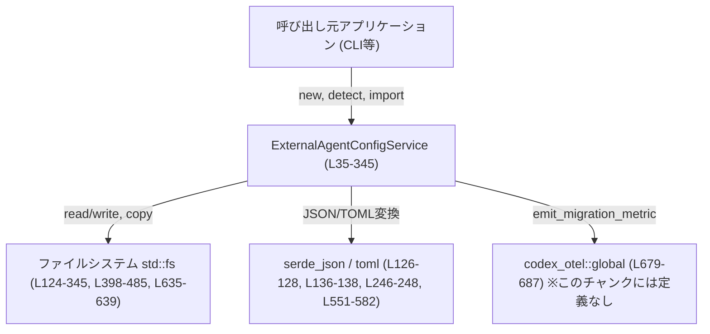
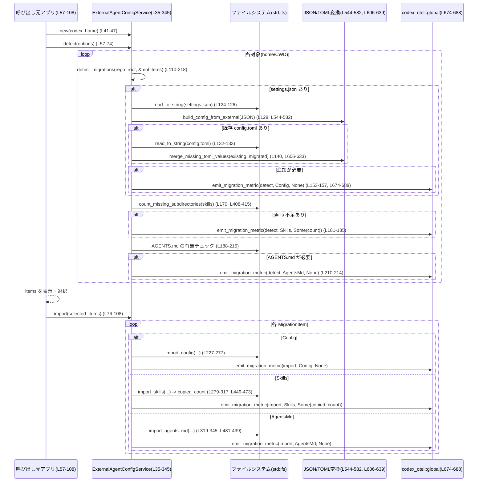

`core/src/external_agent_config.rs`

> 注: 行番号は、このチャンク先頭を `L1` とした便宜的な番号です。実ファイルの行番号とはずれる可能性がありますが、相対的な位置関係の説明として参照してください。

---

## 0. ざっくり一言

Claude 用の設定・スキル・ドキュメント（`settings.json`・`skills` ディレクトリ・`CLAUDE.md`）を、Codex 用の `config.toml`・`skills`・`AGENTS.md` に検出・移行するサービスを提供するモジュールです。（`external_agent_config.rs:L13-345`）

---

## 1. このモジュールの役割

### 1.1 概要

- **問題**: 既存の Claude ベースの設定やスキルファイルを、Codex の新しいディレクトリ構造・設定形式に手作業で移行するのは煩雑です。
- **提供機能**:
  - Claude 設定/スキル/ドキュメントから **移行候補を検出** する（dry-run に近い機能）。（`ExternalAgentConfigService::detect`, `detect_migrations` / `external_agent_config.rs:L57-74, L110-218`）
  - 検出されたアイテムに基づき、**実際にファイルコピーや TOML マージを行う**。（`ExternalAgentConfigService::import` / `external_agent_config.rs:L76-108`）
  - 変換された config の内容生成や、ディレクトリコピー、テキスト内の “Claude” → “Codex” 置換などのユーティリティ。

### 1.2 アーキテクチャ内での位置づけ

このモジュールは「外部エージェント設定の移行サービス」として、ファイルシステムとテレメトリ（OpenTelemetry ベースと思われる `codex_otel`）の間に位置します。（`external_agent_config.rs:L35-38, L674-688`）



### 1.3 設計上のポイント

- **状態管理**
  - `ExternalAgentConfigService` は `codex_home` と `claude_home` のパスだけを保持する軽量なサービスオブジェクトです。（`external_agent_config.rs:L35-38`）
  - それ以外の状態は持たず、I/O は都度ファイルシステムから読み書きします。
- **検出と実行の分離**
  - `detect` で「何を移行すべきか」を列挙し（`ExternalAgentConfigMigrationItem`）、`import` でその結果を実際に適用する構造です。（`external_agent_config.rs:L57-74, L76-108`）
- **エラーハンドリング**
  - ほぼ全ての外部 I/O は `io::Result<T>` で返され、呼び出し元に委ねられます。（例: `detect`, `import_config`, `copy_dir_recursive` / `external_agent_config.rs:L57-60, L227-277, L449-473`）
  - データ形式エラー（壊れた JSON/TOML など）は `io::ErrorKind::InvalidData` に正規化されます。（`invalid_data_error` / `external_agent_config.rs:L653-655`）
- **安全性（Rust 的）**
  - `unsafe` は一切使用していません。
  - パニックにつながる `unwrap` や `expect` も使っておらず、失敗は全て `Result` 経由で明示されます。
- **並行性**
  - API はすべて同期的（blocking I/O）で、スレッドセーフ性を保証するためのロック等は持ちません。
  - 同じファイル/ディレクトリに対する並行実行は OS レベルの挙動に依存します（たとえば二重作成や race condition の可能性があります）。

---

## 2. 主要な機能一覧

- 外部設定検出: `ExternalAgentConfigService::detect` – Claude 設定・スキル・ドキュメントから移行候補を検索。（`external_agent_config.rs:L57-74`）
- 外部設定インポート: `ExternalAgentConfigService::import` – 検出結果に基づき、config/skills/AGENTS.md を生成・マージ・コピー。（`external_agent_config.rs:L76-108`）
- 設定ファイル変換: `build_config_from_external` – `settings.json` から Codex `config.toml` 用の構造を生成。（`external_agent_config.rs:L544-582`）
- スキルディレクトリコピー: `import_skills` / `copy_dir_recursive` – `.claude/skills` → `.agents/skills` 等を再帰コピー。（`external_agent_config.rs:L279-317, L449-473`）
- エージェントドキュメント変換: `import_agents_md`, `rewrite_claude_terms` – `CLAUDE.md` を `AGENTS.md` にコピーしつつ中身の用語を Codex 向けに書き換え。（`external_agent_config.rs:L319-345, L487-499`）
- Git リポジトリルート検出: `find_repo_root` – `.git` を探索してリポジトリ root を求める。（`external_agent_config.rs:L356-390`）
- メトリクス送信: `emit_migration_metric` – 検出・インポートごとに OTEL カウンタをインクリメント。（`external_agent_config.rs:L674-688`）

### 2.1 コンポーネント一覧（型・関数インベントリ）

#### 型一覧

| 名前 | 種別 | 公開 | 役割 / 用途 | 定義位置 |
|------|------|------|-------------|----------|
| `ExternalAgentConfigDetectOptions` | 構造体 | 公開 | `detect` に渡す検出オプション（ホームディレクトリを含めるか、対象 CWD 一覧） | `external_agent_config.rs:L13-17` |
| `ExternalAgentConfigMigrationItemType` | enum | 公開 | 移行対象の種類（config / skills / agents_md / mcp_server_config） | `external_agent_config.rs:L19-25` |
| `ExternalAgentConfigMigrationItem` | 構造体 | 公開 | 1 つの移行作業単位（種類・説明文・リポジトリルート） | `external_agent_config.rs:L27-32` |
| `ExternalAgentConfigService` | 構造体 | 公開 | 移行処理のサービス。`codex_home` と `claude_home` を保持 | `external_agent_config.rs:L34-38` |

#### 関数・メソッド一覧（概要）

**`ExternalAgentConfigService` メソッド**

| 関数名 | 公開 | 役割（1行） | 定義位置 |
|--------|------|-------------|----------|
| `new(codex_home)` | 公開 | デフォルト `claude_home` を推定しサービスを構築 | `external_agent_config.rs:L41-47` |
| `new_for_test(codex_home, claude_home)` | テスト用 | テスト時に任意の home を注入 | `external_agent_config.rs:L49-55` |
| `detect(&self, params)` | 公開 | 既存設定から移行候補（`MigrationItem`）一覧を返す | `external_agent_config.rs:L57-74` |
| `import(&self, items)` | 公開 | `MigrationItem` を実行して実際にファイルを生成・コピー | `external_agent_config.rs:L76-108` |
| `detect_migrations(&self, repo_root, items)` | 非公開 | 単一リポジトリ/ホームから config/skills/agents_md の移行候補を検出 | `external_agent_config.rs:L110-218` |
| `home_target_skills_dir(&self)` | 非公開 | ホームスキルのターゲットディレクトリを決定 | `external_agent_config.rs:L220-225` |
| `import_config(&self, cwd)` | 非公開 | `settings.json` から `config.toml` を作成・マージ | `external_agent_config.rs:L227-277` |
| `import_skills(&self, cwd)` | 非公開 | skills ディレクトリをコピーし、コピー数を返す | `external_agent_config.rs:L279-317` |
| `import_agents_md(&self, cwd)` | 非公開 | `CLAUDE.md` を `AGENTS.md` に書き換えコピー | `external_agent_config.rs:L319-345` |

**トップレベル関数**

| 関数名 | 役割（1行） | 定義位置 |
|--------|-------------|----------|
| `default_claude_home()` | 環境変数から `~/.claude` などを決定 | `external_agent_config.rs:L348-354` |
| `find_repo_root(cwd)` | `.git` を辿ってリポジトリルートを特定 | `external_agent_config.rs:L356-390` |
| `collect_subdirectory_names(path)` | 直下のサブディレクトリ名を `HashSet` で取得 | `external_agent_config.rs:L392-406` |
| `count_missing_subdirectories(source, target)` | source にあるが target にないサブディレクトリ数をカウント | `external_agent_config.rs:L408-415` |
| `is_missing_or_empty_text_file(path)` | ファイルが存在しない/空テキストかどうか | `external_agent_config.rs:L417-425` |
| `is_non_empty_text_file(path)` | 非空テキストファイルかどうか | `external_agent_config.rs:L428-434` |
| `find_repo_agents_md_source(repo_root)` | リポジトリ内の `CLAUDE.md` 探索 | `external_agent_config.rs:L436-447` |
| `copy_dir_recursive(source, target)` | 再帰的なディレクトリコピー（SKILL.md は書き換え付き） | `external_agent_config.rs:L449-473` |
| `is_skill_md(path)` | ファイルが `SKILL.md` か判定（大文字小文字無視） | `external_agent_config.rs:L475-479` |
| `rewrite_and_copy_text_file(source, target)` | 文字列を書き換えてテキストファイルとしてコピー | `external_agent_config.rs:L481-485` |
| `rewrite_claude_terms(content)` | "Claude" 関連語を "Codex" 等に置換 | `external_agent_config.rs:L487-499` |
| `replace_case_insensitive_with_boundaries(...)` | 単語境界を考慮した大文字小文字無視置換 | `external_agent_config.rs:L501-538` |
| `is_word_byte(byte)` | 「単語構成文字」（英数字 or `_`）判定 | `external_agent_config.rs:L540-542` |
| `build_config_from_external(settings)` | JSON 設定から Codex 用 TOML テーブルを構築 | `external_agent_config.rs:L544-582` |
| `json_object_to_env_toml_table(object)` | JSON オブジェクトを TOML テーブル（env 用）に変換 | `external_agent_config.rs:L584-594` |
| `json_env_value_to_string(value)` | JSON env 値を文字列に正規化 | `external_agent_config.rs:L596-603` |
| `merge_missing_toml_values(existing, incoming)` | 既存 TOML に不足キーのみをマージ | `external_agent_config.rs:L606-633` |
| `write_toml_file(path, value)` | TOML を pretty print して保存 | `external_agent_config.rs:L635-639` |
| `is_empty_toml_table(value)` | TOML 値が空のテーブルか確認 | `external_agent_config.rs:L641-650` |
| `invalid_data_error(message)` | `InvalidData` 種別の `io::Error` を生成 | `external_agent_config.rs:L653-655` |
| `migration_metric_tags(item_type, skills_count)` | メトリクスタグを組み立て | `external_agent_config.rs:L657-672` |
| `emit_migration_metric(metric_name, item_type, skills_count)` | グローバルメトリクスにカウンタ記録 | `external_agent_config.rs:L674-688` |

---

## 3. 公開 API と詳細解説

### 3.1 型一覧（構造体・列挙体）

| 名前 | 種別 | 役割 / 用途 | 主なフィールド | 定義位置 |
|------|------|-------------|----------------|----------|
| `ExternalAgentConfigDetectOptions` | 構造体 | `detect` の挙動を指定 | `include_home`: ホームディレクトリを対象にするか / `cwds`: 個別の作業ディレクトリリスト | `external_agent_config.rs:L13-17` |
| `ExternalAgentConfigMigrationItemType` | enum | 移行対象の種別 | `Config` / `Skills` / `AgentsMd` / `McpServerConfig` | `external_agent_config.rs:L19-25` |
| `ExternalAgentConfigMigrationItem` | 構造体 | 検出結果として 1 ステップの移行作業を表現 | `item_type`, `description`, `cwd`（リポジトリルート or `None`） | `external_agent_config.rs:L27-32` |
| `ExternalAgentConfigService` | 構造体 | 検出・インポート処理の窓口 | `codex_home`, `claude_home` | `external_agent_config.rs:L34-38` |

### 3.2 関数詳細（7件）

#### `ExternalAgentConfigService::detect(&self, params: ExternalAgentConfigDetectOptions) -> io::Result<Vec<ExternalAgentConfigMigrationItem>>`

**概要**

- ホームディレクトリおよび指定された CWD 一覧について、移行候補（config, skills, agents_md）を検出し、`ExternalAgentConfigMigrationItem` のベクタとして返します。（`external_agent_config.rs:L57-74`）

**引数**

| 引数名 | 型 | 説明 |
|--------|----|------|
| `&self` | `&ExternalAgentConfigService` | サービスインスタンス |
| `params` | `ExternalAgentConfigDetectOptions` | ホームを含めるか、どの CWD を対象とするか |

**戻り値**

- `io::Result<Vec<ExternalAgentConfigMigrationItem>>`  
  - `Ok(items)`: 検出された移行候補一覧。空の場合もあります。
  - `Err(e)`: ファイル I/O や JSON/TOML パースなどでの失敗を表す `io::Error`。

**内部処理の流れ**

1. 空の `items` ベクタを作成。（`L61`）
2. `params.include_home == true` の場合、ホームディレクトリ（`repo_root = None`）に対して `detect_migrations` を呼び出して結果を `items` に追加。（`L62-64`）
3. `params.cwds` が `Some` なら参照を取り、`None` の場合は空スライスとして扱い、各 CWD についてループ。（`L66`）
4. 各 `cwd` に対して `find_repo_root(Some(cwd))` を呼び出し、Git リポジトリルートを探す。見つからなければスキップ。（`L67-69`）
5. 見つかった `repo_root` それぞれに対して `detect_migrations(Some(&repo_root), &mut items)` を呼び出し、結果を蓄積。（`L70`）
6. すべての処理が成功したら `Ok(items)` を返す。（`L73`）

**Examples（使用例）**

```rust
use std::path::PathBuf;
use crate::external_agent_config::{
    ExternalAgentConfigService,
    ExternalAgentConfigDetectOptions,
};

fn example_detect() -> std::io::Result<()> {
    // Codex のホームディレクトリを指定してサービスを作成
    let service = ExternalAgentConfigService::new(PathBuf::from("/home/user/.codex"));

    // ホームディレクトリと、特定プロジェクトを対象に検出
    let options = ExternalAgentConfigDetectOptions {
        include_home: true,
        cwds: Some(vec![PathBuf::from("/home/user/projects/foo")]),
    };

    let items = service.detect(options)?;  // 失敗時は io::Error
    for item in items {
        println!("- [{}] {}", item.item_type as u8, item.description);
    }
    Ok(())
}
```

**Errors / Panics**

- `detect_migrations` 内部で発生する I/O エラーや JSON/TOML パースエラーが、そのまま `io::Error` として伝播します。（`external_agent_config.rs:L124-140, L170-185`）
- パニックしうるコード (`unwrap`, `expect`) は含まれていません。

**Edge cases（エッジケース）**

- `params.include_home = false` かつ `cwds` が `None` または空の場合、空の `Vec` が返されます。（`L61-66`）
- `cwds` の各エントリが存在しない、または Git 管理されていない場合、それらは無視され、エラーにはなりません（`find_repo_root` が `Ok(None)` を返し、`continue`）。`external_agent_config.rs:L67-69, L356-390`

**使用上の注意点**

- この関数は**検出のみ**であり、ファイルの書き込みは行いません。実際の変更は `import` で行われます。
- 戻り値の `Vec` をそのまま `import` に渡すことで、検出結果通りの移行が行われます。（`external_agent_config.rs:L76-108`）

---

#### `ExternalAgentConfigService::import(&self, migration_items: Vec<ExternalAgentConfigMigrationItem>) -> io::Result<()>`

**概要**

- `detect` で得られた `ExternalAgentConfigMigrationItem` 一覧を受け取り、種類ごとに適切な import 処理（config/skills/agents_md）を実行します。（`external_agent_config.rs:L76-108`）

**引数**

| 引数名 | 型 | 説明 |
|--------|----|------|
| `&self` | `&ExternalAgentConfigService` | サービスインスタンス |
| `migration_items` | `Vec<ExternalAgentConfigMigrationItem>` | 実行したい移行作業の一覧 |

**戻り値**

- `io::Result<()>`  
  すべてのアイテムが成功した場合 `Ok(())`。途中でエラーが発生した場合、そのエラーが返され処理が中断されます。

**内部処理の流れ**

1. `migration_items` を 1 件ずつ取り出してループ。（`L77`）
2. `item_type` に応じて分岐。（`L78-103`）
   - `Config`: `import_config(migration_item.cwd.as_deref())` を呼び出し、完了後 `emit_migration_metric` を送信。（`L79-85`）
   - `Skills`: `import_skills(...)` を呼び出し、コピーしたスキル数をメトリクスタグとして送信。（`L87-93`）
   - `AgentsMd`: `import_agents_md(...)` を呼び出し、メトリクス送信。（`L95-101`）
   - `McpServerConfig`: 現状では何も行いません。（`L103`）
3. 全アイテムを処理したら `Ok(())` を返す。（`L107`）

**Examples（使用例）**

```rust
fn example_detect_and_import() -> std::io::Result<()> {
    use std::path::PathBuf;
    use crate::external_agent_config::{
        ExternalAgentConfigService,
        ExternalAgentConfigDetectOptions,
    };

    let service = ExternalAgentConfigService::new(PathBuf::from("/home/user/.codex"));

    // まず対象を検出
    let items = service.detect(ExternalAgentConfigDetectOptions {
        include_home: true,
        cwds: None,
    })?;

    // 検出結果をそのまま適用
    service.import(items)?;
    Ok(())
}
```

**Errors / Panics**

- 各種 import 関数（`import_config`, `import_skills`, `import_agents_md`）からの I/O エラーがそのまま伝播します。（`external_agent_config.rs:L227-345`）
- メトリクス送信 (`emit_migration_metric`) はエラーを無視し、処理を中断しません。（`external_agent_config.rs:L679-687`）

**Edge cases**

- `migration_items` が空の場合、何もせず成功 (`Ok(())`) を返します。
- `McpServerConfig` タイプのアイテムは現状何も行わずスキップされます。`detect_migrations` からこのタイプが生成されるコードはこのチャンクには現れません。（`external_agent_config.rs:L20-24, L78-104`）

**使用上の注意点**

- `import` は部分的成功/失敗の可能性があります。ベクタ途中でエラーが起きると、それまでのアイテムは反映済みで、それ以降は実行されません。
- 冪等性はおおむね保たれています（既に存在する config キーや skills ディレクトリはスキップ）が、外部からファイルが変更されている場合は結果が変わりうる点に注意が必要です。（`external_agent_config.rs:L131-141, L307-310`）

---

#### `ExternalAgentConfigService::detect_migrations(&self, repo_root: Option<&Path>, items: &mut Vec<ExternalAgentConfigMigrationItem>) -> io::Result<()>`

**概要**

- 単一のホーム or リポジトリ (`repo_root`) について、config / skills / agents_md の三種の移行候補を検出し、`items` に push します。（`external_agent_config.rs:L110-218`）

**引数**

| 引数名 | 型 | 説明 |
|--------|----|------|
| `&self` | `&ExternalAgentConfigService` | サービスインスタンス |
| `repo_root` | `Option<&Path>` | `Some(root)` ならそのリポジトリ、`None` ならホームディレクトリ |
| `items` | `&mut Vec<ExternalAgentConfigMigrationItem>` | 検出結果を追加するバッファ |

**戻り値**

- `io::Result<()>`  
  成功時は `items` が参照越しに更新されます。

**内部処理の流れ**

1. `cwd` として `repo_root` を `PathBuf` に変換（`None` の場合は `None`）。`MigrationItem` の `cwd` に格納するため。（`L115`）
2. **config 設定の検出**（`L116-160`）:
   - `source_settings`:  
     - ホームの場合: `claude_home/settings.json`  
     - リポジトリの場合: `<repo>/.claude/settings.json`（`L116-119`）
   - `target_config`:  
     - ホーム: `codex_home/config.toml`  
     - リポジトリ: `<repo>/.codex/config.toml`（`L120-123`）
   - `source_settings` がファイルなら JSON を読み取り、`build_config_from_external` で TOML テーブルに変換。（`L124-128, L544-582`）
   - 変換結果が空テーブルでなければ、既存 `config.toml` を読み、`merge_missing_toml_values` で「不足分があるか」チェック。（`L129-141, L606-633`）
   - 不足分があれば `Config` タイプの `MigrationItem` を push し、検出用メトリクスを送信。（`L143-157`）
3. **skills ディレクトリの検出**（`L162-186`）:
   - `source_skills`: `<repo>/.claude/skills` または `claude_home/skills`。（`L162-165`）
   - `target_skills`: `<repo>/.agents/skills` または `home_target_skills_dir()`。（`L166-169, L220-225`）
   - `count_missing_subdirectories` で「source にあって target にないサブディレクトリ数」を計算。（`L170, L408-415`）
   - `skills_count > 0` なら `Skills` タイプの `MigrationItem` とメトリクスを追加。（`L171-186`）
4. **AGENTS.md の検出**（`L188-215`）:
   - `source_agents_md`:
     - `Some(repo_root)` の場合: `find_repo_agents_md_source(repo_root)` で `<repo>/CLAUDE.md` or `<repo>/.claude/CLAUDE.md` を探索。（`L188-190, L436-447`）
     - `None` の場合: `claude_home/CLAUDE.md` が非空ファイルならそれを採用。（`L191-193`）
   - `target_agents_md`:  
     - ホーム: `codex_home/AGENTS.md`  
     - リポジトリ: `<repo>/AGENTS.md`。（`L194-197`）
   - `source_agents_md` が存在し、かつ `target_agents_md` が存在しないまたは空なら `AgentsMd` タイプの `MigrationItem` を追加し、メトリクス送信。（`L198-215`）

**Errors / Panics**

- 設定ファイル・TOML 読み込み時の I/O エラーやパースエラーが伝播します。（`L124-140, L132-138`）
- `build_config_from_external` が root JSON を object でないとして `InvalidData` エラーを返す可能性があります。（`external_agent_config.rs:L544-549`）

**Edge cases**

- `settings.json` が存在しない場合、Config の検出はスキップされますが、他の項目の検出は続行されます。（`L124-160`）
- 既存 `config.toml` が空ファイルの場合、空テーブルとして扱われます。（`L133-134`）
- 既存 `config.toml` が不正な TOML の場合、`InvalidData` エラーで検出プロセス全体が失敗します。（`L136-138`）
- `skills` ディレクトリが存在しない場合、`skills_count` は 0 となり、Skills の MigrationItem は生成されません。（`L170-186, L392-406`）

**使用上の注意点**

- `detect` からのみ呼ばれる内部メソッドですが、「どの条件で MigrationItem が生まれるか」を理解するのに重要です。
- `McpServerConfig` タイプの検出ロジックはこの関数内には存在しません。（このチャンク内ではどこからも生成されません。）

---

#### `ExternalAgentConfigService::import_config(&self, cwd: Option<&Path>) -> io::Result<()>`

**概要**

- Claude の `settings.json` から `config.toml` に必要な設定を生成し、既存ファイルがあれば不足キーのみマージして保存します。（`external_agent_config.rs:L227-277`）

**引数**

| 引数名 | 型 | 説明 |
|--------|----|------|
| `&self` | `&ExternalAgentConfigService` | サービスインスタンス |
| `cwd` | `Option<&Path>` | リポジトリ内で実行する場合の基準パス。`None` ならホーム扱い |

**内部処理の流れ（要約）**

1. `find_repo_root(cwd)` により `repo_root` を決定。（`L227-233, L356-390`）
   - `Some(repo_root)` の場合:  
     `source_settings = <repo>/.claude/settings.json`  
     `target_config = <repo>/.codex/config.toml`（`L229-232`）
   - `repo_root = None` かつ `cwd` が非空（存在しないなど）の場合には何もせず `Ok(())`。（`L233-235`）
   - それ以外（`cwd` `None` or 空）の場合:  
     `source_settings = claude_home/settings.json`  
     `target_config = codex_home/config.toml`。（`L236-239`）
2. `source_settings` がファイルでなければ何もせず `Ok(())`。（`L241-243`）
3. JSON を読み、`build_config_from_external` で TOML テーブルを生成。空テーブルなら何もせず終了。（`L245-251, L544-582`）
4. `target_config` の親ディレクトリを作成。親がない場合は `InvalidData` エラー。（`L253-256`）
5. `target_config` が存在しなければ、新規に書き込んで終了。（`L257-260, L635-639`）
6. 存在する場合は読み取り、空なら空テーブルとして、そうでなければ TOML パース。（`L262-268`）
7. `merge_missing_toml_values` により不足キーをマージ。変更がなければ終了、変更があればファイルを書き戻す。（`L270-276`）

**Errors**

- JSON パース / TOML パースの失敗は `InvalidData` として返却。（`L246-248, L266-268`）
- 書き込み権限がない、ディスクフルなどの I/O エラーはそのまま返されます。

**Edge cases**

- `settings.json` が存在しない場合、何もせず成功終了するため「検出済みだが import する頃には消えていた」といった状況でも安全です。（`L241-243`）
- `target_config` のパスに親ディレクトリがない（極端な例として `PathBuf::from("config.toml")` など）場合、エラーになります。（`L253-255`）

**使用上の注意点**

- 既存の設定を**上書きせず**、不足分だけ追加することを保証するため、`merge_missing_toml_values` は既存キーの値を変えません。（`L606-624`）

---

#### `ExternalAgentConfigService::import_skills(&self, cwd: Option<&Path>) -> io::Result<usize>`

**概要**

- Claude の `skills` ディレクトリから、まだ存在しないスキルフォルダのみをターゲットディレクトリに再帰コピーします。（`external_agent_config.rs:L279-317`）

**引数 / 戻り値**

| 名称 | 型 | 説明 |
|------|----|------|
| `cwd` | `Option<&Path>` | リポジトリルート探索の起点。`None` ならホーム扱い |
| 戻り値 | `io::Result<usize>` | コピーしたスキルフォルダ数 |

**処理の概要**

- `find_repo_root(cwd)` でリポジトリを探し、あれば `<repo>/.claude/skills` → `<repo>/.agents/skills` のコピー元/先を設定。（`L280-284`）
- そうでない場合はホームの `claude_home/skills` → `home_target_skills_dir()` を使うか、非空 `cwd` なら何もせず 0 を返す。（`L285-292`）
- コピー元がディレクトリでなければ 0。（`L293-295`）
- ターゲットディレクトリを作成し、直下のサブディレクトリだけを対象にコピー。（`L297-315`）
  - 既に同名ディレクトリが存在する場合はスキップ。（`L307-310`）
  - コピー自体は `copy_dir_recursive` に委譲。（`L312-313`）

**Edge cases**

- スキルディレクトリが空でも、0 を返して成功とみなします。
- ディレクトリの深さに応じて `copy_dir_recursive` が再帰呼び出しを行うため、極端に深い構造ではスタック使用量が増加します。（`external_agent_config.rs:L449-473`）

---

#### `ExternalAgentConfigService::import_agents_md(&self, cwd: Option<&Path>) -> io::Result<()>`

**概要**

- Claude 用の `CLAUDE.md` を探して Codex 用の `AGENTS.md` としてコピーし、中身の用語（"Claude" 等）を適切に書き換えます。（`external_agent_config.rs:L319-345`）

**処理のポイント**

- `find_repo_root(cwd)` に成功した場合:
  - `find_repo_agents_md_source(repo_root)` で `<repo>/CLAUDE.md` or `<repo>/.claude/CLAUDE.md` を探す。見つからなければ何もしない。（`L320-323, L436-447`）
  - ターゲットは `<repo>/AGENTS.md`。（`L324`）
- そうでない場合:
  - `cwd` が非空なら何もせず終了。（`L325-327`）
  - それ以外はホームの `claude_home/CLAUDE.md` → `codex_home/AGENTS.md`。（`L328-331`）
- ソースが非空テキスト、かつターゲットが「存在しない or 空テキスト」でないと何も変更しません。（`L333-336, L417-425, L428-434`）
- ターゲット親ディレクトリを作成し、`rewrite_and_copy_text_file` で書き換えコピー。（`L339-345, L481-485`）

**テキスト書き換えの仕様（概要）**

- `rewrite_claude_terms` が実際の文字列書き換えを行います。（`external_agent_config.rs:L487-499`）
  - まず `"claude.md"` を `"AGENTS.md"` に置換。
  - 次に `"claude code"`, `"claude-code"`, `"claude_code"`, `"claudecode"`, `"claude"` を順に `"Codex"` に置換。
  - 置換は `replace_case_insensitive_with_boundaries` を使い、大文字小文字無視＆単語境界を考慮。（`L501-538`）

---

#### `build_config_from_external(settings: &JsonValue) -> io::Result<TomlValue>`

**概要**

- 外部 JSON 設定（`settings.json`）から、Codex の `config.toml` にマージ可能な TOML テーブルを構築します。（`external_agent_config.rs:L544-582`）

**引数 / 戻り値**

| 名称 | 型 | 説明 |
|------|----|------|
| `settings` | `&JsonValue` | Claudeの設定 JSON 全体 |
| 戻り値 | `io::Result<TomlValue>` | 成功時は `TomlValue::Table`。空テーブルの場合もあり |

**内部処理**

1. `settings` の root が JSON オブジェクトであることをチェック。そうでなければ `InvalidData` エラー。（`L545-549`）
2. 空の TOML テーブル `root` を用意。（`L551`）
3. `env` セクションの処理（`L553-566`）:
   - `settings_obj["env"]` がオブジェクトかつ非空の場合のみ処理。
   - `shell_environment_policy` テーブルを構築:
     - `"inherit" = "core"` 固定。（`L556-557`）
     - `"set"` は `json_object_to_env_toml_table(env)` の結果。（`L558-561, L584-594`）
   - `root["shell_environment_policy"]` にこのテーブルを設定。
4. `sandbox` セクションの処理（`L568-579`）:
   - `settings_obj["sandbox"]["enabled"]` が `true` の場合のみ、
     - `root["sandbox_mode"] = "workspace-write"` を追加。
5. `TomlValue::Table(root)` を返す。（`L581`）

**Edge cases**

- `env` がオブジェクトでない or 空の場合、`shell_environment_policy` は生成されません。
- `sandbox.enabled` が `false` or 非 bool の場合、`sandbox_mode` は設定されません。

**使用上の注意点**

- この関数単体は I/O を行わず、純粋に JSON → TOML 変換だけを担当します。`import_config` と組み合わせて使われます。（`external_agent_config.rs:L245-251`）

---

#### `find_repo_root(cwd: Option<&Path>) -> io::Result<Option<PathBuf>>`

**概要**

- 指定されたパス（相対/絶対あり）の位置から上方向へ `.git` を探索し、最初に見つかったディレクトリ/ファイルをリポジトリルートとみなして返します。（`external_agent_config.rs:L356-390`）

**Edge cases / 契約**

- `cwd` が `None` または空文字のときは `Ok(None)` を返します。（`L357-359`）
- パスが存在しない場合も `Ok(None)` でエラーにはしません。（`L367-369`）
- ファイルが与えられた場合、その親ディレクトリから探索します。（`L371-376`）
- `.git` が見つからない場合は、最初の（存在する）ディレクトリを `Some(fallback)` として返します。（`L378-389`）

この挙動により「Git 管理されていないディレクトリでも、とりあえずそのディレクトリを root とみなす」パターンが実現されています。

---

#### `copy_dir_recursive(source: &Path, target: &Path) -> io::Result<()>`

**概要**

- `source` ディレクトリ以下を再帰的に `target` にコピーしますが、`SKILL.md` ファイルについては中身を書き換える（`rewrite_and_copy_text_file`）という特別扱いがあります。（`external_agent_config.rs:L449-473`）

**処理の要点**

- `fs::create_dir_all(target)` でターゲットディレクトリツリーを作成。（`L450`）
- `fs::read_dir(source)` でエントリ列挙し、各エントリについて:
  - ディレクトリなら再帰呼び出し。（`L458-460`）
  - ファイルなら:
    - `is_skill_md(&source_path)` が真なら、テキスト書き換えコピー。（`L463-466`）
    - それ以外は `fs::copy` でバイナリコピー。（`L467-468`）

**セキュリティ・安全上の注意（観点）**

- コピー対象はローカルファイルシステムであり、パスは `import_skills` からのみ渡されるため、直接的なパス・トラバーサルなどはこのチャンクのコードからは読み取れません。（`external_agent_config.rs:L279-317, L449-473`）
- 非常に深いディレクトリ構造を持つスキルが存在する場合、再帰呼び出しが深くなり得ますが、通常のスキルツリーでは現実的な問題にはなりにくいと考えられます（これは一般論であり、このコードだけからは深さの上限はわかりません）。

---

### 3.3 その他の関数

上記で詳解していない補助関数の役割を簡潔にまとめます。

| 関数名 | 役割 | 定義位置 |
|--------|------|----------|
| `home_target_skills_dir(&self)` | `codex_home` の親から `~/.agents/skills` 相当のパスを導出 | `external_agent_config.rs:L220-225` |
| `default_claude_home()` | `HOME` or `USERPROFILE` から `~/.claude` を導出し、なければ相対 `.claude` にフォールバック | `external_agent_config.rs:L348-354` |
| `collect_subdirectory_names(path)` | `path` 直下のサブディレクトリ名（`OsString`）の集合を返す | `external_agent_config.rs:L392-406` |
| `count_missing_subdirectories(source, target)` | `source` に存在し `target` にないサブディレクトリ数を数える | `external_agent_config.rs:L408-415` |
| `is_missing_or_empty_text_file(path)` | ファイルが存在しない or テキストとして読んで空白のみの場合に `true` | `external_agent_config.rs:L417-425` |
| `is_non_empty_text_file(path)` | テキストとして読んで空でない場合に `true` | `external_agent_config.rs:L428-434` |
| `find_repo_agents_md_source(repo_root)` | `CLAUDE.md` の候補ファイルを順に探索し、最初に見つかった非空ファイルを返す | `external_agent_config.rs:L436-447` |
| `is_skill_md(path)` | ファイル名が大小無視で `SKILL.md` かを判定 | `external_agent_config.rs:L475-479` |
| `rewrite_and_copy_text_file(source, target)` | テキスト内容に `rewrite_claude_terms` を適用し `target` に書き出し | `external_agent_config.rs:L481-485` |
| `rewrite_claude_terms(content)` | "claude.md" → "AGENTS.md" と、各種 "claude" 派生語を "Codex" に置換 | `external_agent_config.rs:L487-499` |
| `replace_case_insensitive_with_boundaries(...)` | ASCII ベースで大文字小文字を無視し、単語境界（英数字/`_` の外側）でのみ置換を行う | `external_agent_config.rs:L501-538` |
| `is_word_byte(byte)` | 単語構成文字か判定（`[A-Za-z0-9_]` 相当） | `external_agent_config.rs:L540-542` |
| `json_object_to_env_toml_table(object)` | JSON オブジェクトの値を文字列化し TOML テーブルに変換（配列/オブジェクトは除外） | `external_agent_config.rs:L584-594` |
| `json_env_value_to_string(value)` | JSON の値を env 用の文字列に変換 | `external_agent_config.rs:L596-603` |
| `merge_missing_toml_values(existing, incoming)` | 既存 TOML テーブルに対して、incoming 側の不足キーを再帰的に追加 | `external_agent_config.rs:L606-633` |
| `write_toml_file(path, value)` | pretty print した TOML を末尾改行付きで書き込む | `external_agent_config.rs:L635-639` |
| `is_empty_toml_table(value)` | TOML が空のテーブルである場合に `true` | `external_agent_config.rs:L641-650` |
| `invalid_data_error(message)` | `ErrorKind::InvalidData` な `io::Error` を生成 | `external_agent_config.rs:L653-655` |
| `migration_metric_tags(item_type, skills_count)` | メトリクス用タグ（migration_type, skills_count）を構築 | `external_agent_config.rs:L657-672` |
| `emit_migration_metric(metric_name, item_type, skills_count)` | `codex_otel::global()` からメトリクスハンドルを取得しカウンタを増加 | `external_agent_config.rs:L674-688` |

---

## 4. データフロー

### 4.1 検出〜インポートのシーケンス

典型的な「検出 → ユーザー確認 → インポート」のフローをシーケンス図にします。



---

## 5. 使い方（How to Use）

### 5.1 基本的な使用方法

代表的な CLI などからの利用イメージです。

```rust
use std::path::PathBuf;
use std::io;
use crate::external_agent_config::{
    ExternalAgentConfigService,
    ExternalAgentConfigDetectOptions,
    ExternalAgentConfigMigrationItemType,
};

fn main() -> io::Result<()> {
    // 1. サービスの初期化 (codex_home を指定)
    let codex_home = dirs::home_dir()
        .unwrap_or_else(|| PathBuf::from("."))
        .join(".codex");
    let service = ExternalAgentConfigService::new(codex_home); // L41-47

    // 2. 移行候補の検出
    let options = ExternalAgentConfigDetectOptions {
        include_home: true,                   // ホーム (~/.claude) も対象
        cwds: Some(vec![PathBuf::from(".")]), // カレントディレクトリのリポジトリも対象
    };
    let items = service.detect(options)?;     // L57-74

    // 3. ユーザーに一覧表示して確認 (ここでは単純に表示)
    for (i, item) in items.iter().enumerate() {
        println!("{:2}: {:?}", i, item);
    }

    // 4. 実際にインポートを実行
    //    現実のアプリではユーザー選択に応じてフィルタすることが多いと考えられます。
    service.import(items)?;                  // L76-108
    Ok(())
}
```

### 5.2 よくある使用パターン

1. **ホームだけを移行対象にする**

```rust
let items = service.detect(ExternalAgentConfigDetectOptions {
    include_home: true,
    cwds: None,
})?;
service.import(items)?;
```

1. **特定リポジトリだけを移行する**

```rust
let items = service.detect(ExternalAgentConfigDetectOptions {
    include_home: false,
    cwds: Some(vec![PathBuf::from("/path/to/repo")]),
})?;
service.import(items)?;
```

1. **検出だけ行い、どのアイテムをインポートするか選別する**

```rust
let mut items = service.detect(options)?;
items.retain(|item| matches!(item.item_type, ExternalAgentConfigMigrationItemType::Skills));
service.import(items)?;
```

### 5.3 よくある間違い

```rust
// 間違い例: detect を呼ばずに import に空ベクタを渡してしまう
let items = Vec::new();
service.import(items)?;   // 何も起こらない

// 正しい例: まず detect で候補を生成してから import する
let items = service.detect(ExternalAgentConfigDetectOptions {
    include_home: true,
    cwds: None,
})?;
service.import(items)?;
```

```rust
// 間違い例: cwd に存在しないパスを渡してもエラーにならないが、何も移行されない
let items = service.detect(ExternalAgentConfigDetectOptions {
    include_home: false,
    cwds: Some(vec![PathBuf::from("/no/such/path")]),
})?;
// items は空の可能性が高い

// 正しい例: CWD が Git リポジトリ or ディレクトリとして存在することを事前に確認する
// (存在チェックまではこのモジュールが行うため、呼び出し側は結果の空/非空で判断する)
```

### 5.4 使用上の注意点（まとめ）

- **I/O とエラー**
  - ファイル読み書き・JSON/TOML パースが失敗した場合は `io::Error` が返され、呼び出し側でハンドリングする必要があります。（`external_agent_config.rs:L124-140, L245-268`）
  - 設定ファイルが単に「ない／空」であるケースは多くの関数で**エラーではなく no-op** として扱われます。（`is_missing_or_empty_text_file`, `is_non_empty_text_file` / `external_agent_config.rs:L417-425, L428-434`）
- **並行性**
  - すべて同期 I/O であり、複数スレッドから同じパスに対して同時に `import` / `import_skills` を呼ぶと、ファイル作成の race が起こりうることに注意が必要です（このモジュール側ではロック等を行っていません）。
- **安全性（文字列処理）**
  - `replace_case_insensitive_with_boundaries` は ASCII ベースの処理であり、UTF-8 文字列に対しても長さを変えない変換（`to_ascii_lowercase`）のみを行っているので、インデックス計算に関しては安全です。（`external_agent_config.rs:L501-538`）
- **メトリクス**
  - `emit_migration_metric` はメトリクス送信に失敗しても処理を中断しません。観測不能だからといって移行自体が失敗することはありません。（`external_agent_config.rs:L674-688`）

---

## 6. 変更の仕方（How to Modify）

### 6.1 新しい機能を追加する場合

例: 新しい種類の移行対象（たとえば `McpServerConfig`）を実際にサポートしたい場合。

1. **enum へのバリアント追加**
   - すでに `ExternalAgentConfigMigrationItemType::McpServerConfig` が定義されていますが、このチャンク内では生成も import もされていません。（`external_agent_config.rs:L20-24, L78-104`）
2. **検出ロジックの追加**
   - `detect_migrations` 内に、対象となる設定ファイルやディレクトリを探す処理を追加し、条件を満たした場合に `MigrationItem` を push します。（`external_agent_config.rs:L110-218`）
3. **インポートロジックの追加**
   - `ExternalAgentConfigService::import` の match 式に `McpServerConfig` の分岐を追加し、新しいメソッド（例: `import_mcp_server_config`）を定義して呼び出します。（`external_agent_config.rs:L76-108`）
4. **メトリクス**
   - `migration_metric_tags` はすでに `McpServerConfig` に対応しているため、必要に応じて `skills_count` 相当のタグを追加するか検討します。（`external_agent_config.rs:L661-666`）

### 6.2 既存の機能を変更する場合

- **契約の確認**
  - `build_config_from_external` は「空のときは空テーブルを返す」という契約を前提に `detect_migrations` や `import_config` が書かれているため、この挙動を変える際には呼び出し側も合わせて確認する必要があります。（`external_agent_config.rs:L129-130, L249-251`）
  - `merge_missing_toml_values` は「既存値を上書きしない」ことが前提なので、上書き挙動に変える場合は既存ユーザー設定を壊さないか慎重な検討が必要です。（`external_agent_config.rs:L606-633`）
- **エッジケースへの影響**
  - `find_repo_root` の `Ok(None)` / `Some(fallback)` の使い方は `import_*` 系や `detect` の挙動に直接影響します。Git 管理されていないディレクトリの扱いを変えるときには、すべての呼び出し箇所を確認する必要があります。（`external_agent_config.rs:L356-390, L227-241, L279-292, L319-332`）
- **テスト**
  - このモジュールには `external_agent_config_tests.rs` が付属しており（`mod tests;` / `external_agent_config.rs:L690-692`）、変更時には該当テストケースを追加・修正するのが自然です。テスト内容自体はこのチャンクには現れないため詳細は不明です。

---

## 7. 関連ファイル

| パス | 役割 / 関係 |
|------|------------|
| `core/src/external_agent_config_tests.rs` | 本モジュールの単体テストを含むモジュール。`#[cfg(test)] mod tests;` で参照されています。（`external_agent_config.rs:L690-692`） |
| （外部クレート）`codex_otel` | メトリクス送信のためのグローバルハンドルを提供。`codex_otel::global()` の実装はこのチャンクには現れません。（`external_agent_config.rs:L679-681`） |
| 設定ファイル: `settings.json` | Claude 側の設定 JSON。ホーム or `<repo>/.claude/settings.json` を読み取ります。（`external_agent_config.rs:L116-119, L229-231`） |
| 設定ファイル: `config.toml` | Codex 側の設定 TOML。ホーム or `<repo>/.codex/config.toml` を生成・更新します。（`external_agent_config.rs:L120-123, L231-232, L236-239`） |
| スキルディレクトリ: `skills/` | Claude (`claude_home` or `<repo>/.claude/skills`) と Codex (`home_target_skills_dir` or `<repo>/.agents/skills`) 間でコピー対象となるディレクトリ。（`external_agent_config.rs:L162-169, L279-292`） |
| ドキュメント: `CLAUDE.md` / `AGENTS.md` | Claude → Codex のドキュメント変換元/先。`find_repo_agents_md_source` や `import_agents_md` で扱われます。（`external_agent_config.rs:L188-193, L319-345, L436-447`） |

以上が、このファイルに含まれるコンポーネントとデータフロー、公開 API、Rust 特有の安全性・エラー・並行性の観点を網羅した解説になります。
