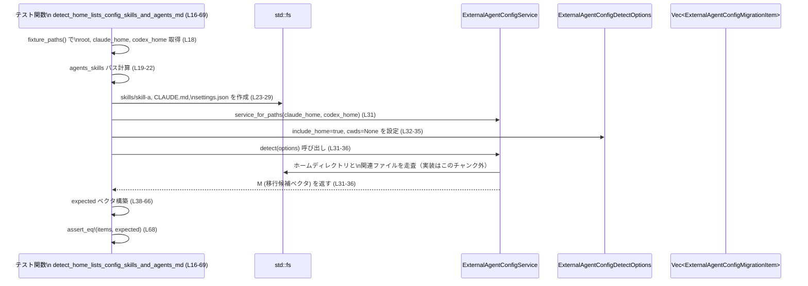
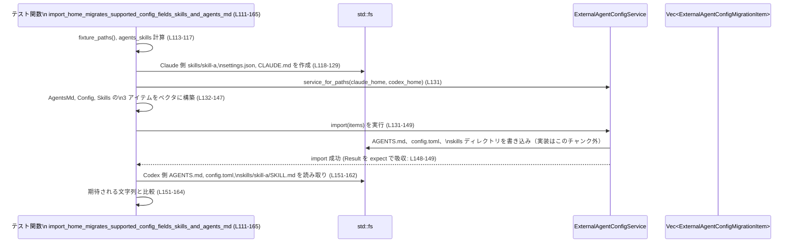

# core/src/external_agent_config_tests.rs コード解説

## 0. ざっくり一言

`ExternalAgentConfigService` まわりの **検出 (`detect`) と移行 (`import`, `import_skills`) の挙動** をファイルシステム越しに検証するテスト群です。  
Claude 向け設定・ドキュメントから Codex 向けへの移行ロジックが、ホームディレクトリとリポジトリの両方で期待どおり動くかを確認します。

---

## 1. このモジュールの役割

### 1.1 概要

このテストモジュールは、`super::*` からインポートされる **`ExternalAgentConfigService` などの外部エージェント設定移行ロジック**が、以下を満たすことを確認します（すべて一時ディレクトリ上で実行）:

- ホームディレクトリ (`~/.claude`, `~/.codex`) に対する移行候補検出 (`detect`) と移行 (`import`) の挙動（例: L16–69, L111–165, L167–186, L188–240）。  
- Git リポジトリ内の `CLAUDE.md` / `.claude/CLAUDE.md` から `AGENTS.md` への移行検出・実行ロジック（例: L71–109, L242–307, L309–368）。  
- Claude から Codex への文言置換ルール（例: L242–285, L111–165）。  
- スキルディレクトリのコピーと、その件数レポート (`import_skills`) の挙動（L381–397）。  
- メトリクスタグ生成関数 `migration_metric_tags` の一部仕様（L370–379）。

### 1.2 アーキテクチャ内での位置づけ

このファイル自体は **テストコードのみ**を含み、実装は `super` モジュール側にあります（`ExternalAgentConfigService` ほかの定義はこのチャンクには現れません）。  
テストはサービスを通じてファイルシステムを操作し、期待されるファイル内容・戻り値を検証します。

```mermaid
flowchart LR
    subgraph core/src/external_agent_config_tests.rs
        T[テスト群\n(L16-397)]
        F1[fixture_paths\n(L5-10)]
        F2[service_for_paths\n(L12-14)]
    end

    subgraph super モジュール\n(実装はこのチャンクには現れない)
        S[ExternalAgentConfigService]
        D[ExternalAgentConfigDetectOptions]
        M[ExternalAgentConfigMigrationItem/Type]
        MM[migration_metric_tags]
    end

    FS[std::fs / PathBuf]
    Tmp[tempfile::TempDir]
    PA[pretty_assertions::assert_eq]

    T --> F1
    T --> F2
    F2 --> S
    T --> S
    T --> D
    T --> M
    T --> MM
    T --> FS
    F1 --> Tmp
    T --> PA
    S --> FS
```

### 1.3 設計上のポイント

- **テスト用ヘルパーで重複を削減**  
  - `fixture_paths` が一時ディレクトリと `.claude`, `.codex` パスをまとめて生成します（L5–10）。  
  - `service_for_paths` が任意のパスから `ExternalAgentConfigService::new_for_test` を構築します（L12–14）。
- **ファイルシステムを使ったブラックボックステスト**  
  - すべてのテストは実際に `std::fs` でファイル・ディレクトリを作成し、その後 `detect` / `import` / `import_skills` の結果を検証します（例: L23–29, L118–129, L250–259 など）。
- **エラー処理は `expect` によるパニックベース**  
  - `TempDir::new`, `fs::create_dir_all`, `fs::write`, `fs::read_to_string`, `detect`, `import` などの `Result` はすべて `.expect("...")` で処理しています（例: L6, L23, L36, L149, L183, L394）。  
  - これはテストでは一般的なパターンで、異常があれば即座にテスト失敗となります。
- **並行性は使用していない**  
  - スレッドや `async` は登場せず、すべて単一スレッド・同期 I/O のテストです。

---

## 2. 主要な機能一覧

このモジュールで検証している主な機能（＝`ExternalAgentConfigService` 側の振る舞い）は次の通りです。

- ホームディレクトリの移行候補検出（L16–69）
  - `~/.claude/settings.json` → `~/.codex/config.toml` への移行候補
  - `~/.claude/skills/*` → `<codex_home_parent>/.agents/skills/*` へのコピー候補
  - `~/.claude/CLAUDE.md` → `~/.codex/AGENTS.md` へのインポート候補
- リポジトリ内 `CLAUDE.md` → `AGENTS.md` 移行候補検出（L71–109, L309–341）
  - 複数 `cwd` に対する検出
  - `.claude/CLAUDE.md` が空でない場合はそちらを優先する挙動
- ホームディレクトリからの実際の移行処理（L111–165, L167–186, L188–240）
  - Claude から Codex への文言置換（AGENTS.md, SKILL.md）
  - `settings.json` から `config.toml` への変換（特定フィールドのみ）
  - 既に同等設定を持つ場合や、移行する値がない場合には設定ファイルを作成しない
  - 既にすべてのスキルディレクトリが存在する場合はスキル移行候補を出さない
- リポジトリ内 AGENTS.md 移行処理（L242–307, L343–368）
  - 文言置換（Claude → Codex, `CLAUDE.md` → `AGENTS.md`）  
  - 既存の `AGENTS.md` が非空の場合は上書きしない / 空白のみの場合は上書きする
- 移行メトリクスタグ生成（L370–379）
  - Skills 移行時に `skills_count` タグを追加する
- `import_skills` の戻り値仕様（L381–397）
  - コピーされた「新規スキルディレクトリ」の数のみを返す

### 2.1 関数・テスト一覧（コンポーネントインベントリー）

#### ローカル関数・テスト

| 名前 | 種別 | 役割 / 用途 | 定義位置 |
|------|------|-------------|----------|
| `fixture_paths` | ヘルパー関数 | 一時ディレクトリと `.claude`, `.codex` のパスをまとめて生成 | `core/src/external_agent_config_tests.rs:L5-10` |
| `service_for_paths` | ヘルパー関数 | 任意のパスから `ExternalAgentConfigService::new_for_test` を構築 | `core/src/external_agent_config_tests.rs:L12-14` |
| `detect_home_lists_config_skills_and_agents_md` | テスト | ホームディレクトリ検出で Config / Skills / AgentsMd の 3 項目が返ることを確認 | `core/src/external_agent_config_tests.rs:L16-69` |
| `detect_repo_lists_agents_md_for_each_cwd` | テスト | 複数 `cwd` に対してリポジトリ単位で AGENTS.md 移行候補が返ることを確認 | `core/src/external_agent_config_tests.rs:L71-109` |
| `import_home_migrates_supported_config_fields_skills_and_agents_md` | テスト | ホームからの import で設定・スキル・AGENTS.md が適切に移行・書き換えされることを確認 | `core/src/external_agent_config_tests.rs:L111-165` |
| `import_home_skips_empty_config_migration` | テスト | 移行対象の設定値がない場合は `config.toml` を作成しないことを確認 | `core/src/external_agent_config_tests.rs:L167-186` |
| `detect_home_skips_config_when_target_already_has_supported_fields` | テスト | 既存 `config.toml` に必要な値がそろっている場合は Config 移行候補を出さないことを確認 | `core/src/external_agent_config_tests.rs:L188-220` |
| `detect_home_skips_skills_when_all_skill_directories_exist` | テスト | すべてのスキルディレクトリが既に存在する場合は Skills 移行候補を出さないことを確認 | `core/src/external_agent_config_tests.rs:L222-240` |
| `import_repo_agents_md_rewrites_terms_and_skips_non_empty_targets` | テスト | Claude → Codex の文言変換と、非空 `AGENTS.md` を上書きしないことを確認 | `core/src/external_agent_config_tests.rs:L242-285` |
| `import_repo_agents_md_overwrites_empty_targets` | テスト | 空白のみの `AGENTS.md` は上書き対象として扱われることを確認 | `core/src/external_agent_config_tests.rs:L287-307` |
| `detect_repo_prefers_non_empty_dot_claude_agents_source` | テスト | ルート `CLAUDE.md` が空で `.claude/CLAUDE.md` が非空な場合、後者をソースとして検出することを確認 | `core/src/external_agent_config_tests.rs:L309-341` |
| `import_repo_uses_non_empty_dot_claude_agents_source` | テスト | 上記条件下で import も `.claude/CLAUDE.md` を使用することを確認 | `core/src/external_agent_config_tests.rs:L343-368` |
| `migration_metric_tags_for_skills_include_skills_count` | テスト | Skills 移行時のメトリクスタグに `skills_count` が含まれることを確認 | `core/src/external_agent_config_tests.rs:L370-379` |
| `import_skills_returns_only_new_skill_directory_count` | テスト | `import_skills` が新規コピーされたスキルディレクトリ数のみを返すことを確認 | `core/src/external_agent_config_tests.rs:L381-397` |

#### 外部コンポーネント参照（定義はこのチャンク外）

| 名前 | 種別 | 用途 | 定義位置 |
|------|------|------|----------|
| `ExternalAgentConfigService` | 構造体 or サービス型 | `detect`, `import`, `import_skills` を提供するメインサービス | `super` モジュール（このチャンクには定義が現れない） |
| `ExternalAgentConfigDetectOptions` | 構造体 | `detect` メソッドへのオプション引数（`include_home`, `cwds` フィールドあり: L32–35, L81–84, L213–216 など） | 同上 |
| `ExternalAgentConfigMigrationItem` | 構造体 | 移行候補 1 件を表す（`item_type`, `description`, `cwd` フィールドを持つ: L38–66, L87–106 など） | 同上 |
| `ExternalAgentConfigMigrationItemType` | 列挙体 | 移行種別を表す（`Config`, `Skills`, `AgentsMd` バリアントがテストに出現: L40, L49, L58, L89, L98 など） | 同上 |
| `migration_metric_tags` | 関数 | メトリクス用タグを生成（L372–378 で `Skills` とカウントからタグベクタを返す） | 同上 |

---

## 3. 公開 API と詳細解説

このファイル自身は公開 API を定義していませんが、**テストヘルパー関数**と、テストを通じて観測できる **サービス API の契約**が重要です。

### 3.1 型一覧（観測できる範囲）

| 名前 | 種別 | 役割 / 用途 | 観測できるフィールド・挙動 |
|------|------|-------------|----------------------------|
| `ExternalAgentConfigDetectOptions` | 構造体 | `detect` のオプション | `include_home: bool`, `cwds: Option<Vec<PathBuf>>` が存在（L32–35, L81–84, L213–216, L323–326） |
| `ExternalAgentConfigMigrationItem` | 構造体 | 移行候補 1 件 | フィールド `item_type: ExternalAgentConfigMigrationItemType`, `description: String`, `cwd: Option<PathBuf>` を持つ（L38–66, L87–106, L132–147 など） |
| `ExternalAgentConfigMigrationItemType` | 列挙体 | 移行種別 | `Config`, `Skills`, `AgentsMd` のバリアントが存在（例: L40, L49, L58, L89, L98, L134, L139, L144） |

※ 実際の定義や追加フィールドがあるかどうかは、このチャンクからは分かりません。

### 3.2 関数詳細（代表 7 件）

#### `fixture_paths() -> (TempDir, PathBuf, PathBuf)` （L5–10）

**概要**

- 一時ディレクトリ配下に `.claude` と `.codex` ディレクトリ用パスを作り、それら 3 つを返すテスト用ユーティリティです（`TempDir`, `claude_home`, `codex_home`）（L5–9）。

**引数**

- なし

**戻り値**

- `(TempDir, PathBuf, PathBuf)`  
  - `TempDir`: テスト専用のルートディレクトリ。ドロップ時に自動削除されます（L6）。  
  - `PathBuf`: `root/.claude`（L7）。  
  - `PathBuf`: `root/.codex`（L8）。

**内部処理の流れ**

1. `TempDir::new()` で一時ディレクトリを作成し、`expect("create tempdir")` で失敗時はパニック（L6）。  
2. その `path()` に対して `.claude` と `.codex` を連結（L7–8）。  
3. タプル `(root, claude_home, codex_home)` を返す（L9）。

**Errors / Panics**

- 一時ディレクトリの生成に失敗すると `expect("create tempdir")` によりパニックします（L6）。

**Edge cases**

- ルートディレクトリの場所は OS 依存ですが、テストでは内容を気にせず `TempDir` の提供するパスのみ使用しています。
- `.claude`, `.codex` ディレクトリ自体はここでは作成されず、呼び出し側で `fs::create_dir_all` を行います（例: L170, L192）。

**使用上の注意点**

- `TempDir` はスコープを抜けると削除されるため、返された `PathBuf` をスレッド間で長期間保持するような用途には向きません（テスト内では問題なし）。

---

#### `service_for_paths(claude_home: PathBuf, codex_home: PathBuf) -> ExternalAgentConfigService` （L12–14）

**概要**

- 指定された Claude / Codex のホームディレクトリパスから、テスト用の `ExternalAgentConfigService` を構築する薄いラッパーです（L12–14）。

**引数**

| 引数名 | 型 | 説明 |
|--------|----|------|
| `claude_home` | `PathBuf` | Claude 設定があるホームディレクトリを指すパス |
| `codex_home` | `PathBuf` | Codex 設定のホームディレクトリを指すパス |

**戻り値**

- `ExternalAgentConfigService` インスタンス。実際のフィールド構成は不明ですが、`detect`, `import`, `import_skills` をメソッドとして提供します（L31–36, L131–149, L392–394）。

**内部処理の流れ**

1. `ExternalAgentConfigService::new_for_test(codex_home, claude_home)` をそのまま呼び出して返す（L13）。

**Errors / Panics**

- `new_for_test` のエラー挙動はこのチャンクには現れません。  
  テスト内では戻り値を `Result` などで受けず、そのまま値として使用しているため、`new_for_test` 自体はエラーを返さないコンストラクタと推測されますが、実装は不明です。

**Edge cases**

- `PathBuf` の存在有無のチェックは行っておらず、存在しないパスもそのまま渡します。実際の検証では後続の `fs::*` で必要なディレクトリを作成します（例: L170, L192）。

**使用上の注意点**

- テスト専用のコンストラクタ名 `new_for_test` を使っているため、本番コードからは別のコンストラクタを利用する可能性があります。

---

#### `detect_home_lists_config_skills_and_agents_md()` （L16–69）

**概要**

- ホームディレクトリに Claude 向け設定・スキル・`CLAUDE.md` が揃っているとき、`detect` が 3 種類の移行候補（Config, Skills, AgentsMd）を返すことを検証します。

**引数**

- なし（テスト関数）

**戻り値**

- なし（`#[test]` 関数）

**内部処理の流れ**

1. `fixture_paths` で一時ディレクトリと `.claude`, `.codex` パスを取得（L18）。  
2. `agents_skills` として、`codex_home.parent().join(".agents/skills")` を計算（親がない場合は相対パス `.agents/skills` を使用: L19–22）。  
3. Claude 側に以下を作成（L23–29）。  
   - `skills/skill-a/` ディレクトリ  
   - `CLAUDE.md`（"claude rules"）  
   - `settings.json`（簡単な `model` と `env` を持つ JSON）  
4. `service_for_paths(...).detect(ExternalAgentConfigDetectOptions { include_home: true, cwds: None })` を実行し、結果を `items` に格納（L31–36）。  
5. 期待される `ExternalAgentConfigMigrationItem` のベクタを組み立てる（L38–66）。  
   - Config: `settings.json` → `config.toml` を示す説明文（L40–45）。  
   - Skills: `~/.claude/skills` → `<codex_parent>/.agents/skills` のコピー説明（L49–55）。  
   - AgentsMd: `CLAUDE.md` → `AGENTS.md` のインポート説明（L58–63）。  
6. `assert_eq!(items, expected)` で完全一致を検証（L68）。

**Errors / Panics**

- 各種ファイル操作と `detect` 呼び出しは `expect` 付きであり、失敗時は即座にパニックします（L23–29, L36）。
- `assert_eq!` 失敗時にはテスト失敗となります（L68）。

**Edge cases / 契約**

このテストから読み取れる `detect` の契約:

- `include_home: true`, `cwds: None` のとき、ホームに必要なファイルが存在すれば、以下 3 種類のアイテムが返される（順序も含めて期待: L38–66）。  
- `description` 文言はフォーマットまで厳密に比較されており、パスの解決ロジック (`codex_home.parent().join(".agents/skills")`) が契約の一部になっています（L19–22, L50–53）。

**使用上の注意点**

- `detect` の戻り値は副作用を持たず（ここではファイルは作らない）、あくまで「候補一覧」として扱われます。実際の移行は `import` 側で行われます（L131–149 など参照）。

---

#### `detect_repo_lists_agents_md_for_each_cwd()` （L71–109）

**概要**

- リポジトリに `CLAUDE.md` がある場合、`detect` が **各リポジトリに対して** `AgentsMd` 移行候補を返すことを検証します。  
- 入力 `cwds` がリポジトリ直下とその子孫ディレクトリでも、両方から同じリポジトリを指すアイテムが返ることを確認します。

**内部処理の流れ（抜粋）**

1. `repo_root/.git` を作成して Git リポジトリであることを示す（L76）。  
2. `nested = repo_root/nested/child` を作成（L75–77）。  
3. `repo_root/CLAUDE.md` を作成（L78）。  
4. `detect(ExternalAgentConfigDetectOptions { include_home: false, cwds: Some(vec![nested, repo_root.clone()]) })` を呼び出し（L80–85）。  
5. 期待される `ExternalAgentConfigMigrationItem` を 2 件作成（L87–106）。  
   - どちらも `description` は `repo_root/CLAUDE.md` → `repo_root/AGENTS.md`。  
   - `cwd` は両方 `Some(repo_root)`（L95, L104）。  
6. `assert_eq!(items, expected)` で検証（L108）。

**契約・挙動**

- `cwds` にリポジトリのサブディレクトリ (`nested`) を渡しても、`ExternalAgentConfigService` はリポジトリルート (`repo_root`) を検出し、`cwd` フィールドにはルートが入ることが分かります（L83, L95, L104）。  
- `include_home: false` のため、このテストではホームディレクトリ由来の候補は返されません（L82）。

---

#### `import_home_migrates_supported_config_fields_skills_and_agents_md()` （L111–165）

**概要**

- ホームディレクトリに存在する Claude 用設定・スキル・ガイド文書が、`import` によって Codex 用に変換される一連の処理を検証します。  
- 特に「どのフィールドが移行されるか」「どの文言が書き換えられるか」を具体的に確認しています。

**内部処理の流れ（要約）**

1. 一時ディレクトリとパスを準備（`fixture_paths`: L113）。  
2. `agents_skills` のパスを `codex_home.parent().join(".agents/skills")` で計算（L114–117）。  
3. Claude 側に以下を準備（L118–129）。  
   - `skills/skill-a/` とその `SKILL.md`（"Use Claude Code and CLAUDE utilities."）。  
   - `settings.json`: `model`, `permissions.ask`, さまざまな `env` 値、`sandbox.enabled`, `sandbox.network.allowLocalBinding` を含む JSON（L120–122）。  
   - `CLAUDE.md`: "Claude code guidance"（L129）。  
4. `import` に 3 つの `ExternalAgentConfigMigrationItem`（AgentsMd, Config, Skills）を渡して実行（L131–149）。  
5. 結果を検証（L151–164）。  
   - `codex_home/AGENTS.md` は `"Codex guidance"`（L151–154）。  
   - `codex_home/config.toml` の内容は以下（L156–159）。  
     - `sandbox_mode = "workspace-write"`  
     - `[shell_environment_policy] inherit = "core"`  
     - `[shell_environment_policy.set]` に `CI`, `FOO`, `MAX_RETRIES`, `MY_TEAM` が文字列として設定。  
   - `<codex_parent>/.agents/skills/skill-a/SKILL.md` の内容は `"Use Codex and Codex utilities."`（L160–163）。

**観測できる移行仕様（契約）**

- Claude → Codex の文言変換例（L125–127, L151–154, L160–163）。
  - `"Claude code guidance"` → `"Codex guidance"`。  
  - `"Use Claude Code and CLAUDE utilities."` → `"Use Codex and Codex utilities."`。  
- `settings.json` → `config.toml` 変換例（L120–122, L156–159）。
  - `sandbox.enabled: true` → `sandbox_mode = "workspace-write"`（L120–122, L156–159）。  
  - `env` の中でも `FOO`, `CI`, `MAX_RETRIES`, `MY_TEAM` は文字列として `[shell_environment_policy.set]` に移行される（L120–122, L156–159）。  
  - `IGNORED: null`, `LIST: ["a","b"]`, `MAP: {"x":1}` などが `config.toml` に現れないことから、特定の型のみ（真偽値・数値・文字列）を文字列化して移行していると解釈できますが、詳細ロジック自体はこのチャンクには現れません。

**Errors / Panics**

- `import` がエラーを返した場合、`.expect("import")` によりテストはパニックします（L148–149）。  
- ファイル作成・読み取りもすべて `expect` 付きです（L118, L123, L128–129, L152–153, L157–158, L161–162）。

**Edge cases**

- このテストは「値のあるケース」を扱っており、値が存在しない場合の挙動は `import_home_skips_empty_config_migration` に委ねています（L167–186）。

---

#### `import_home_skips_empty_config_migration()` （L167–186）

**概要**

- Claude 側の `settings.json` に **実質移行対象となる設定がない**（`sandbox.enabled:false` のみ）場合、`import` が `config.toml` を作成しないことを検証します。

**内部処理のポイント**

1. `settings.json` の内容は `{"model":"claude","sandbox":{"enabled":false}}` のみ（L171–174）。  
2. `import` に Config アイテムのみを渡す（L177–182）。  
3. 結果として `codex_home/config.toml` が存在しないことを `assert!(!exists())` で確認（L185）。

**契約**

- 「移行対象フィールドがない場合は何もしない（出力ファイルを作らない）」という `import` の契約がテストで明示されています（L185）。

---

#### `import_repo_agents_md_rewrites_terms_and_skips_non_empty_targets()` （L242–285）

**概要**

- リポジトリ内の `CLAUDE.md` を `AGENTS.md` にインポートするときの **文言変換** と、すでに存在する非空 `AGENTS.md` を **上書きしない**ことを検証します。

**内部処理のポイント**

1. `repo_root` と `repo_with_existing_target` の 2 つのリポジトリに `.git` を作成（L244–248）。  
2. `repo_root/CLAUDE.md` に `"Claude code\nclaude\nCLAUDE-CODE\nSee CLAUDE.md\n"` を書き込む（L249–252）。  
3. `repo_with_existing_target` に `CLAUDE.md`（"new source"）と `AGENTS.md`（"keep existing target"）を用意（L254–259）。  
4. 2 つの `AgentsMd` アイテムを `import` に渡し実行（L261–273）。  
5. 結果の検証（L276–284）。  
   - `repo_root/AGENTS.md` の内容は `"Codex\nCodex\nCodex\nSee AGENTS.md\n"`（L276–278）。  
   - `repo_with_existing_target/AGENTS.md` は変更されず `"keep existing target"` のまま（L280–283）。

**観測できる変換ルール**

- 少なくともこの入力に対しては、以下の変換が行われています（L250–252, L276–278）。  
  - 行 1: `"Claude code"` → `"Codex"`。  
  - 行 2: `"claude"` → `"Codex"`。  
  - 行 3: `"CLAUDE-CODE"` → `"Codex"`。  
  - 行 4: `"See CLAUDE.md"` → `"See AGENTS.md"`。  

**契約**

- 非空の `AGENTS.md` が存在する場合、`import` はそのファイルを上書きしない（L256–259, L280–283）。  
- 空白のみのファイルは別テストで扱われ、上書き対象になります（L287–307）。

---

#### `import_skills_returns_only_new_skill_directory_count()` （L381–397）

**概要**

- `import_skills` が「新規にコピーされたスキルディレクトリの数」だけを返すことを検証します。

**内部処理のポイント**

1. Claude 側に `skills/skill-a`, `skills/skill-b` を作成（L388–389）。  
2. すでに存在するターゲットとして `<agents_skills>/skill-a` を作成（L390）。  
3. `import_skills(None)` を実行し、その戻り値を `copied_count` として受け取る（L392–394）。  
4. `assert_eq!(copied_count, 1)` により、新規コピーされたのは `skill-b` だけであることを確認（L396）。

**契約**

- `import_skills` は、既に存在するスキルディレクトリをスキップし、新規にコピーしたディレクトリ数のみをカウントして返します（L388–390, L392–396）。

---

### 3.3 その他の関数（簡易一覧）

上記以外のテストも、同様に `detect` / `import` の振る舞いの **否定条件や優先順位** を補完的に検証しています。

| 関数名 | 役割（1 行） | 根拠 |
|--------|--------------|------|
| `detect_home_skips_config_when_target_already_has_supported_fields` | Codex 側 `config.toml` に既に必要な設定が含まれている場合、ホームの Config 移行候補を出さない | `core/src/external_agent_config_tests.rs:L188-220` |
| `detect_home_skips_skills_when_all_skill_directories_exist` | すべてのスキルディレクトリがターゲット側に存在する場合、Skills 移行候補を出さない | `core/src/external_agent_config_tests.rs:L222-240` |
| `import_repo_agents_md_overwrites_empty_targets` | `AGENTS.md` が空白のみの場合は、新しい内容で上書きする | `core/src/external_agent_config_tests.rs:L287-307` |
| `detect_repo_prefers_non_empty_dot_claude_agents_source` | ルート `CLAUDE.md` が空で `.claude/CLAUDE.md` が非空の場合、後者をソースとする移行候補を検出 | `core/src/external_agent_config_tests.rs:L309-341` |
| `import_repo_uses_non_empty_dot_claude_agents_source` | 上記条件で、実際の import も `.claude/CLAUDE.md` を使用 | `core/src/external_agent_config_tests.rs:L343-368` |
| `migration_metric_tags_for_skills_include_skills_count` | `migration_metric_tags(Skills, Some(3))` が `migration_type` と `skills_count` の 2 タグを返すことを確認 | `core/src/external_agent_config_tests.rs:L370-379` |

---

## 4. データフロー

### 4.1 ホームディレクトリ検出のデータフロー（detect_home_lists_config_skills_and_agents_md, L16–69）

このシナリオでは、Claude ホームに最低限のファイルを用意し `detect` を呼び出すことで、移行候補がどのように構築されるかを検証しています。



**要点**

- `detect` はファイルシステムを読み取り、副作用なしに移行候補のベクタを返します。  
- 候補の `description` には具体的なパスが含まれ、テストで文字列として検証されています（L41–45, L50–54, L59–63）。

### 4.2 ホームディレクトリ import のデータフロー（import_home_migrates_supported_config_fields_skills_and_agents_md, L111–165）



**要点**

- `import` は渡された `MigrationItem` の `item_type` に応じて、設定ファイルやドキュメント、スキルをまとめて移行します。  
- 文言変換（Claude → Codex）は `import` 側で行われており、結果ファイルの内容が直接検証されています（L151–154, L160–163）。

---

## 5. 使い方（How to Use）

このファイルはテストですが、**`ExternalAgentConfigService` の利用パターン**を把握する上で参考になります。

### 5.1 基本的な使用方法（テストから読み取れる形）

テストが行っている典型的なフローをまとめると、以下のようになります。

```rust
use std::fs;
use std::path::PathBuf;

// これはテストから抽出した利用例であり、実際には core/src/... の super モジュールで定義されています。

fn example_usage() {
    // 1. Claude / Codex ホームパスを用意する
    // （テストでは TempDir 配下で生成: L5-10）
    let claude_home = PathBuf::from("/path/to/.claude");
    let codex_home = PathBuf::from("/path/to/.codex");

    // 2. サービスを初期化する（L12-14）
    let service = ExternalAgentConfigService::new_for_test(codex_home.clone(), claude_home.clone());

    // 3. 移行候補を検出する（ホームを含める例: L31-36）
    let items = service
        .detect(ExternalAgentConfigDetectOptions {
            include_home: true,
            cwds: None,
        })
        .expect("detect");

    // 4. 必要なアイテムだけを import に渡して実行する（L131-149, L261-273）
    service.import(items).expect("import");

    // 5. 必要に応じてスキルだけを別途 import することも可能（L392-394）
    // let copied_count = service.import_skills(None).expect("import skills");
}
```

※ 実際には `new_for_test` ではなく本番用コンストラクタが存在する可能性がありますが、このチャンクには現れません。

### 5.2 よくある使用パターン（テストから）

- **ホームディレクトリのみを対象にした検出と移行**  
  - `include_home: true`, `cwds: None` でホームを対象に `detect`（L32–35）。  
  - 返ってきた中から Config / Skills / AgentsMd をまとめて `import`（L132–147）。
- **リポジトリ単位の AGENTS.md 移行**  
  - `include_home: false`, `cwds: Some(vec![cwd1, cwd2, ...])` で複数リポジトリを一括検出（L81–84）。  
  - 返ってきた `AgentsMd` アイテムだけを `import` に渡す（L261–273, L295–300, L357–361）。

### 5.3 よくある間違い（テストから類推できるもの）

```rust
// （誤り例）detect だけ呼んで、import を実行していない
let items = service.detect(ExternalAgentConfigDetectOptions {
    include_home: true,
    cwds: None,
}).expect("detect");
// ここで items を使わず終了してしまうと、実際のファイルは移行されない

// （正しい例）detect の結果を import に渡して実際に移行する
let items = service
    .detect(ExternalAgentConfigDetectOptions {
        include_home: true,
        cwds: None,
    })
    .expect("detect");
service.import(items).expect("import");
```

この挙動は、テストで `detect` と `import` を明確に分けて呼んでいることから読み取れます（例: L31–36 と L131–149, L80–85 と L261–273）。

### 5.4 使用上の注意点（まとめ）

- `detect` は **副作用なしのスキャン**、`import` が **実際の移行処理**を行う、という分離が前提になっています。  
- 既存ファイルの扱いにはルールがあります（テストより: L242–285, L287–307）。
  - 非空の `AGENTS.md` は上書きしない。  
  - 空白のみの `AGENTS.md` は上書き対象。  
  - 既存スキルディレクトリは `import_skills` で再コピーされず、カウントにも含まれない（L388–390, L392–396）。  
- テストではすべてのエラーを `expect` で処理しているため、本番利用では `Result` を適切にハンドリングする必要があります（エラー型はこのチャンクからは不明）。

---

## 6. 変更の仕方（How to Modify）

### 6.1 新しい機能を追加する場合（テスト側）

このファイルから分かる「テスト追加の入り口」は次の通りです。

1. **新しい移行ケースを追加したい場合**  
   - `fixture_paths`（L5–10）を使って一時ディレクトリを準備し、必要なファイル構造を `fs::create_dir_all` と `fs::write` で構築します（既存テストのパターン参照: L23–29, L118–129, L249–259 など）。  
   - `service_for_paths`（L12–14）でサービスを初期化し、`detect` や `import` を呼び出します。  
   - 期待される `ExternalAgentConfigMigrationItem` ベクタや、生成されるファイル内容を `assert_eq!` で検証します（L38–66, L151–164, L276–283, L303–306 など）。

2. **新しい `ExternalAgentConfigMigrationItemType` を追加する場合**  
   - そのバリアント専用のテスト関数を追加し、`item_type` と `description`, `cwd` の組み立てを検証するのが、このファイルのスタイルに合致します（`Config` / `Skills` / `AgentsMd` の既存テスト参照: L38–66, L87–106）。

### 6.2 既存の機能を変更する場合（テストがカバーする契約）

変更時には、テストが暗黙に前提としている「契約」を意識する必要があります。

- **文言変換の契約**  
  - Claude → Codex の変換結果文字列はテストで完全一致比較されています（L151–154, L160–163, L276–278）。  
  - 文字列を変更する場合は、対応するテストの期待値も更新する必要があります。
- **既存ファイルの扱い**  
  - 非空 `AGENTS.md` を上書きしない（L256–259, L280–283）。  
  - 空白のみなら上書きする（L293–306）。  
  - これらのポリシーを変更する場合、該当テストの修正または新規テスト追加が必要です。
- **検出条件**  
  - `detect_home_skips_config_when_target_already_has_supported_fields` や `detect_home_skips_skills_when_all_skill_directories_exist` は、「何もする必要がない場合は候補を返さない」契約をテストしています（L188–220, L222–240）。  
  - 検出ロジックを変えると、ここが真っ先に失敗するはずです。

---

## 7. 関連ファイル

このチャンクから判明している関連コンポーネントは次の通りです。

| パス / モジュール | 役割 / 関係 |
|------------------|------------|
| `super` モジュール（正確なパスはこのチャンクには現れない） | `ExternalAgentConfigService`, `ExternalAgentConfigDetectOptions`, `ExternalAgentConfigMigrationItem`, `ExternalAgentConfigMigrationItemType`, `migration_metric_tags` など移行ロジック本体を定義 |
| `std::fs` | テストでのファイル・ディレクトリ作成／読み書きに使用（例: L23–29, L118–129, L250–259, L303–305 など） |
| `std::path::PathBuf` | パス操作に使用（例: L7–8, L19–22, L75–76, L245–246, L312–313 など） |
| `tempfile::TempDir` | 一時ディレクトリ生成に使用し、テストの副作用を隔離（L3, L5–6, L73, L113, L244, L289, L311, L345, L383） |
| `pretty_assertions::assert_eq` | ベクタや文字列を比較する際に読みやすい差分を表示するために使用（L2, L68, L108, L151–164, L219, L239, L276–279, L303–306, L330–339, L372–378, L396–397） |

---

### バグ / セキュリティ / 安全性に関する補足

- **安全性（メモリ / 所有権）**  
  - Rust の所有権・借用ルールに従っており、明示的な `unsafe` コードは登場しません。  
  - `TempDir` による一時ディレクトリの所有権はテスト関数のスコープに限定され、自動的にクリーンアップされます（L5–6, L73, L113 など）。
- **エラー処理**  
  - すべての I/O とサービス呼び出しに `expect` を使っているため、異常があれば即座にテストが失敗します。エラーを握りつぶす箇所はありません。
- **セキュリティ**  
  - テストは一時ディレクトリとカレントディレクトリ直下の相対パス（`.agents/skills` など）しか触れておらず、実環境のユーザホームやシステムディレクトリを直接操作するコードは含まれていません（例: L19–22）。  
  - したがって、このファイルからセキュリティ上の直接的な問題は読み取れません。
- **並行性**  
  - 並行アクセスやロックは登場しないため、レースコンディションなどの問題はこのファイルからは確認できません。
