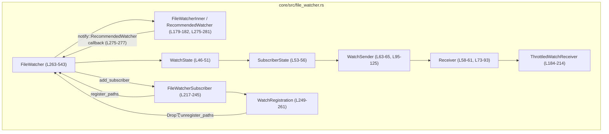
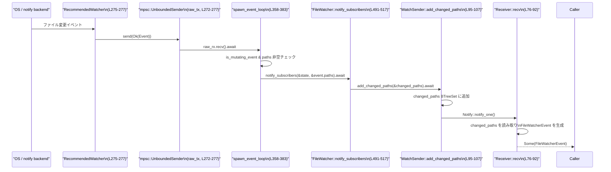

# core/src/file_watcher.rs コード解説

## 0. ざっくり一言

- このモジュールは、`notify` クレートを使ってファイル／ディレクトリの変更を監視し、**複数の購読者ごとにパスベースでフィルタした変更通知を非同期に配信する仕組み**を提供します（`FileWatcher` とその周辺型, `core/src/file_watcher.rs:L263-543`）。

---

## 1. このモジュールの役割

### 1.1 概要

- このモジュールは **ファイルシステムイベントの監視を一元管理**し、各「購読者（subscriber）」が登録したパスにマッチする変更通知だけを受け取れるようにします（`FileWatcher`, `FileWatcherSubscriber`, `Receiver`）。
- `notify` の **コールバックベース API** を **Tokio ランタイム上の非同期ストリーム風 API** にブリッジします（`spawn_event_loop`, `core/src/file_watcher.rs:L356-383`）。
- バースト的なイベントを間引くための **スロットリングラッパー**（`ThrottledWatchReceiver`, `L184-214`）も提供します。

### 1.2 アーキテクチャ内での位置づけ

主要コンポーネント間の依存関係は次のようになっています。



- `FileWatcher` が OS のファイル監視（`RecommendedWatcher`）を所有し、そのイベントを `WatchState` に登録された購読者へ振り分けます。
- 各購読者は専用の `Receiver` を持ち、そこから **非同期に変更通知を pull** します。
- `WatchRegistration` と `Drop` 実装により、「登録されたパスは RAII によって自動的に解除される」契約になっています（`L248-261`）。

### 1.3 設計上のポイント

- **責務分割**
  - `FileWatcher`: 全体の監視対象パスと subscriber の状態管理、および `notify` とのブリッジ（`L269-543`）。
  - `FileWatcherSubscriber` / `WatchRegistration`: 1 ロジカルコンシューマ単位の登録・解除のインターフェース（`L216-261`）。
  - `Receiver` / `WatchSender`: 1 subscriber 向けの変更イベント配送（非同期キュー + 集約, `L58-71, L95-125`）。
  - `ThrottledWatchReceiver`: イベント頻度制御（`L184-214`）。
- **状態の扱い**
  - グローバルな監視状態は `Arc<RwLock<WatchState>>` で共有しつつ、読み取りと書き込みを分離（`L46-51, L263-267`）。
  - OS の watcher は `Mutex<FileWatcherInner>` で保護し、監視パスの追加／削除時のみロック（`L179-182, L263-267, L446-489`）。
  - 各 subscriber のイベントバッファは `tokio::sync::Mutex<BTreeSet<PathBuf>>` で保護し、非同期処理と両立（`ReceiverInner.changed_paths`, `L67-71`）。
- **エラーハンドリング方針**
  - `FileWatcher::new` は `notify::Result<Self>` を返し、OS 監視のセットアップ失敗を呼び出し側に伝えます（`L272-289`）。
  - 監視の追加／削除（`watch` / `unwatch`）失敗や `notify` からのエラーはログ出力（`tracing::warn!`）にとどめ、処理は継続します（`L371-375, L471-473, L484-486`）。
  - ロックは `unwrap_or_else(PoisonError::into_inner)` により、Poison されても panic せず内部値を継続利用します（`L304-307, L327-329, L386-389, L422-424, L456-458, L494-495, L535-537`）。
- **並行性**
  - `notify` のコールバックスレッド → `tokio::mpsc::UnboundedSender` → Tokio ランタイム上のタスク、という非同期ブリッジ（`L272-277, L356-383`）。
  - `WatchSender` のクローン数を `AtomicUsize` で管理し、送信側がなくなったら `Receiver` に終了を伝える（`L67-71, L110-125, L76-92`）。

---

## 2. 主要な機能一覧

- ファイルシステム watcher の生成: `FileWatcher::new`（ライブ監視）／`FileWatcher::noop`（テスト用の空実装）（`L272-289, L293-298`）。
- 購読者の追加と専用受信チャネルの作成: `FileWatcher::add_subscriber`（`L300-323`）。
- パス監視の登録・解除（RAII ベース）:
  - `FileWatcherSubscriber::register_paths` → `FileWatcher::register_paths`（`L223-235, L325-353`）。
  - `WatchRegistration` / `FileWatcherSubscriber` の `Drop` による自動 `unregister`（`L242-245, L255-260, L385-418, L420-443`）。
- 変更イベントの受信:
  - 生の受信: `Receiver::recv`（`L73-93`）。
  - スロットリング付き受信: `ThrottledWatchReceiver::recv`（`L191-214`）。
- パスマッチングロジック:
  - `watch_path_matches_event` による WatchPath とイベントパスのマッチ判定（`L563-573`）。
- イベント種別フィルタ:
  - `is_mutating_event` で、作成・変更・削除系イベントのみを通知対象とする（`L545-549`）。

---

## 3. 公開 API と詳細解説

### 3.1 型一覧（構造体・列挙体など）

| 名前 | 種別 | 公開範囲 | 定義行 | 役割 / 用途 |
|------|------|----------|--------|-------------|
| `FileWatcherEvent` | 構造体 | `pub` | `core/src/file_watcher.rs:L28-33` | 1 回の受信でまとめて渡される、重複除去済み・ソート済みの変更パス一覧。 |
| `WatchPath` | 構造体 | `pub` | `L35-42` | 監視対象のルートパスと再帰監視フラグを表す購読条件。 |
| `Receiver` | 構造体 | `pub` | `L58-61` | 単一 subscriber 向けの変更イベント受信用ハンドル。`recv` で非同期にイベントを取得。 |
| `ThrottledWatchReceiver` | 構造体 | `pub` | `L184-189` | 受信間隔を最低 `interval` 以上にするスロットリング付きラッパー。 |
| `FileWatcherSubscriber` | 構造体 | `pub` | `L217-220` | 1 ロジカルコンシューマを表すハンドル。パス登録を行う。Drop 時に subscriber 自体を解除。 |
| `WatchRegistration` | 構造体 | `pub` | `L249-253` | 特定 subscriber のパス登録セットの RAII ガード。Drop 時に該当パスの登録を解除。 |
| `FileWatcher` | 構造体 | `pub` | `L263-267` | 複数 subscriber を束ねるファイル監視のメインコンポーネント。 |

（内部専用の補助型）

| 名前 | 種別 | 公開範囲 | 定義行 | 役割 / 用途 |
|------|------|----------|--------|-------------|
| `WatchState` | 構造体 | crate 内 private | `L46-51` | subscriber ID 採番、パスごとの参照カウント、subscriber 状態の集約。 |
| `SubscriberState` | 構造体 | private | `L53-56` | 各 subscriber の監視パスと送信チャネル（`WatchSender`）を保持。 |
| `ReceiverInner` | 構造体 | private | `L67-71` | `Receiver`/`WatchSender` の共有内部状態（変更パス集合、Notify、送信者カウント）。 |
| `WatchSender` | 構造体 | private | `L63-65` | `Receiver` に対する内部送信側。`FileWatcher` からのみ利用。 |
| `PathWatchCounts` | 構造体 | private | `L141-145` | 物理パスごとの再帰・非再帰監視の参照カウント。 |
| `FileWatcherInner` | 構造体 | private | `L179-182` | `notify::RecommendedWatcher` と実際に OS に登録済みのパスマップ。 |

### 3.2 重要な関数・メソッド詳細（7 件）

#### 1) `FileWatcher::new() -> notify::Result<FileWatcher>`

**概要**

- ライブなファイルシステム watcher をセットアップし、`notify` のコールバックを Tokio ランタイム上の非同期イベントループにブリッジする `FileWatcher` を生成します（`L269-289`）。

**引数**

- なし。

**戻り値**

- `Ok(FileWatcher)`: 監視が有効な `FileWatcher`。
- `Err(notify::Error)`: OS 依存の watcher 構築に失敗した場合。

**内部処理の流れ**

1. `tokio::sync::mpsc::unbounded_channel` で `raw_tx` / `raw_rx` を生成（`L272-273`）。
2. `notify::recommended_watcher` にコールバックを登録し、`notify::Result<RecommendedWatcher>` を取得（`L275-277`）。
   - コールバックは `raw_tx_clone.send(res)` を行う。送信失敗時は無視（`let _ = ...`, `L275-277`）。
3. `FileWatcherInner` に `watcher` と空の `watched_paths` を格納（`L278-281`）。
4. `WatchState::default()` から初期状態を作成し、`Arc<RwLock<WatchState>>` に包む（`L282-283`）。
5. `FileWatcher { inner: Some(Mutex::new(inner)), state }` を生成（`L283-286`）。
6. `spawn_event_loop(raw_rx)` を呼び出し、Tokio ランタイムがあれば背景タスクを起動（`L287-288, L358-383`）。
7. `Ok(file_watcher)` を返す（`L288-289`）。

**Examples（使用例）**

```rust
use std::sync::Arc;
use std::time::Duration;

use core::file_watcher::{FileWatcher, FileWatcherSubscriber, ThrottledWatchReceiver, WatchPath}; // 仮のパス

#[tokio::main]
async fn main() -> notify::Result<()> {
    let watcher = Arc::new(FileWatcher::new()?);        // ライブ watcher を生成（L272-289）
    let (subscriber, rx) = watcher.add_subscriber();    // 新しい subscriber と Receiver を取得（L300-323）

    // 監視パスを登録（L223-235, L325-353）
    let _registration = subscriber.register_paths(vec![
        WatchPath { path: "/tmp".into(), recursive: true },
    ]);

    let mut rx = ThrottledWatchReceiver::new(rx, Duration::from_secs(1)); // 最低 1 秒間隔で受信（L191-199）

    while let Some(event) = rx.recv().await {           // 変更イベントを待機（L203-213）
        for path in event.paths {
            println!("changed: {}", path.display());
        }
    }

    Ok(())
}
```

**Errors / Panics**

- `notify::recommended_watcher` が `Err` を返した場合、そのまま呼び出し側に返されます（`L275-277`）。
- ロック取得は `unwrap_or_else(PoisonError::into_inner)` を使っており、Poison されても panic しません（`spawn_event_loop` 内での `state.read()` など, `L494-495`）。

**Edge cases（エッジケース）**

- **Tokio ランタイムが存在しない場合**:
  - `spawn_event_loop` 内で `Handle::try_current()` が `Err` を返し、イベントループは起動されません（`L358-383`）。
  - `notify` のコールバックは `raw_tx.send` を試みますが、受信側がドロップされているためすべて破棄されます。
  - ログに `"file watcher loop skipped: no Tokio runtime available"` が 1 度出力されます（`L381-382`）。
  - **監視自体は実行されますが、購読者には一切イベントが届かない**点に注意が必要です。

**使用上の注意点**

- `FileWatcher::new` を呼び出す前に、**現在スレッドに紐づく Tokio ランタイムが存在すること**が前提です（`Handle::try_current`, `L359-361`）。
- ランタイムがない場合、`FileWatcher` は作成されますがイベントは配送されません。テスト用途なら `FileWatcher::noop` の方が明示的です（`L293-298`）。

---

#### 2) `FileWatcher::add_subscriber(&Arc<Self>) -> (FileWatcherSubscriber, Receiver)`

**概要**

- 新しい subscriber を `WatchState` に登録し、その subscriber 専用の送受信チャネル（`WatchSender`/`Receiver`）を構築して返します（`L300-323`）。

**引数**

| 引数名 | 型 | 説明 |
|--------|----|------|
| `self` | `&Arc<FileWatcher>` | 共有所有権を持つ `Arc` 参照。返す `FileWatcherSubscriber` が `Arc` をクローンして保持するため、このシグネチャになっています。 |

**戻り値**

- `(FileWatcherSubscriber, Receiver)`:
  - `FileWatcherSubscriber`: パス登録用ハンドル（RAII）。
  - `Receiver`: この subscriber 向け変更イベントの非同期受信口。

**内部処理の流れ**

1. `watch_channel()` を呼び出し、`WatchSender` と `Receiver` を生成（`L302-303, L127-139`）。
2. `state.write()` で `WatchState` の書き込みロックを取得（`L304-307`）。
3. `next_subscriber_id` を採番し、インクリメント（`L308-309`）。
4. `state.subscribers` に `SubscriberState { watched_paths: HashMap::new(), tx }` を挿入（`L310-315`）。
5. `FileWatcherSubscriber { id, file_watcher: self.clone() }` を作成（`L318-321`）。
6. `(subscriber, rx)` を返却（`L322-323`）。

**Examples（使用例）**

上記 `FileWatcher::new` の例で既に利用しています。

**Errors / Panics**

- 書き込みロック取得に失敗した場合（Poison）、`into_inner` で中身を取り出し、panic にはなりません（`L304-307`）。
- 戻り値は常に成功と見なしてよい設計になっています（`Result` を返しません）。

**Edge cases**

- 同じ `FileWatcher` に対し多くの subscriber を追加した場合、それぞれに独立した `Receiver` が作られます。イベント配送は `notify_subscribers` 内で O(S×P×E)（S: subscriber 数, P: 各 subscriber の WatchPath 数, E: event paths 数）の探索になります（`L491-511`）。

**使用上の注意点**

- `FileWatcherSubscriber` を Drop すると、その subscriber 全体が `remove_subscriber` 経由で解除され、紐づく `WatchSender` も破棄されます（`L242-245, L420-443`）。`Receiver` 側は `None` を返して終了します（`L86-88`）。
- 同じ `FileWatcherSubscriber` から複数の `WatchRegistration` を作成することは可能です（内部でカウントアップ, `L337-340`）。

---

#### 3) `FileWatcherSubscriber::register_paths(&self, watched_paths: Vec<WatchPath>) -> WatchRegistration`

**概要**

- この subscriber に対して複数の `WatchPath` を登録し、Drop 時にそれらを自動解除する RAII ガード `WatchRegistration` を返します（`L223-235`）。

**引数**

| 引数名 | 型 | 説明 |
|--------|----|------|
| `watched_paths` | `Vec<WatchPath>` | 監視したいパスと再帰フラグのリスト。重複は関数内で除去されます。 |

**戻り値**

- `WatchRegistration`: `Drop` 時に `FileWatcher::unregister_paths` を呼ぶガード（`L249-261, L385-418`）。

**内部処理の流れ**

1. `dedupe_watched_paths` でパス＋再帰フラグの組み合わせをソート＆重複除去（`L225-226, L552-560`）。
2. `FileWatcher::register_paths(self.id, &watched_paths)` を呼び出し、`WatchState` と OS watcher を更新（`L227, L325-353`）。
3. `WatchRegistration { file_watcher: Arc::downgrade(&self.file_watcher), subscriber_id: self.id, watched_paths }` を返す（`L229-233`）。

**Examples（使用例）**

```rust
let (subscriber, _rx) = watcher.add_subscriber();  // L300-323
let registration = subscriber.register_paths(vec![
    WatchPath { path: "/var/log".into(), recursive: false },
    WatchPath { path: "/etc".into(), recursive: true },
]);
// registration がスコープを抜けると、これらのパス監視が解除される（L255-260, L385-418）
```

**Errors / Panics**

- `FileWatcher::register_paths` 内のロック取得で Poison が発生した場合でも、`into_inner` で継続します（`L325-329`）。

**Edge cases**

- 同じ `WatchPath` を複数回渡した場合でも、`dedupe_watched_paths` により 1 回分として扱われます（`L552-560`）。
- 既に同じ subscriber の `watched_paths` に同一 `WatchPath` が存在する場合、内部カウンタだけインクリメントされ、物理 watcher の再設定が必要な場合のみ `reconfigure_watch` が呼ばれます（`L337-351`）。

**使用上の注意点**

- **`WatchRegistration` を保持している間だけ監視が有効**という契約です。`WatchRegistration` をすぐに捨てると監視も即解除されます（`Drop`, `L255-260`）。
- `FileWatcherSubscriber` 自体が Drop された場合は、`remove_subscriber` により登録済みの全パスがまとめて解除されます（`L242-245, L420-443`）。

---

#### 4) `Receiver::recv(&mut self) -> Option<FileWatcherEvent>`

**概要**

- この subscriber 向けにバッファリングされているパス変更のバッチを 1 つ取得します。すでに変更が溜まっていれば即座に返し、なければ新しい通知を待ちます（`L73-93`）。
- 対応する sender（`WatchSender`）がすべて Drop された場合、`None` を返してストリーム終了を示します。

**引数**

| 引数名 | 型 | 説明 |
|--------|----|------|
| `&mut self` | `&mut Receiver` | 内部状態を読み書きするため可変参照が必要です。 |

**戻り値**

- `Some(FileWatcherEvent)`: 1 バッチ分の変更パス。
- `None`: 対応する sender がなくなり、これ以上イベントが届かないことを示す。

**内部処理の流れ**

1. 無限ループに入り、`notified = self.inner.notify.notified()` で通知待ち Future を取得（`L77-78`）。
2. `changed_paths` の `AsyncMutex` を lock し、非空なら:
   - `std::mem::take(&mut *changed_paths)` で `BTreeSet<PathBuf>` を一括で取り出し（空集合を残す）、`Vec<PathBuf>` に変換して `FileWatcherEvent` を返す（`L80-84`）。
3. `changed_paths` が空で、かつ `sender_count == 0` なら `None` を返して終了（`L86-88`）。
4. それ以外の場合は `notified.await` で通知を待ってループ先頭に戻る（`L90-91`）。

**Examples（使用例）**

```rust
let mut rx: Receiver = /* add_subscriber から取得 */;
while let Some(event) = rx.recv().await {             // L76-92
    for path in &event.paths {
        println!("changed: {}", path.display());
    }
}
// sender_count == 0 になったのでループを抜けた
```

**Errors / Panics**

- `AsyncMutex` の lock 取得は `await` による通常の待機で、Poison という概念はありません。
- `sender_count` は `AtomicUsize` で、0 との比較のみ。オーバーフローなどは想定されていません（`L67-71, L86-87`）。

**Edge cases**

- `WatchSender` が Drop されて `sender_count` が 0 になった際、`notify_waiters` により待機中の `recv` が速やかに `None` を返します（`L119-124`）。
- 変更パスは `BTreeSet` に格納されるため、**同一パスが短時間に何度通知されても 1 回だけ**まとめて返されます（`L67-71, L101-104`）。

**使用上の注意点**

- `&mut self` を要求するため、1 つの `Receiver` を複数タスクから同時に待受けることはできません。必要なら外側で `Mutex` などを使ってください。
- `None` を受け取ったら、それ以降 `recv` を呼ぶ意味はありません。

---

#### 5) `ThrottledWatchReceiver::recv(&mut self) -> Option<FileWatcherEvent>`

**概要**

- 内部の `Receiver` からの受信をラップし、**前回のイベント発行から最低 `interval` だけ待機する**ようにします（`L191-214`）。

**引数**

| 引数名 | 型 | 説明 |
|--------|----|------|
| `&mut self` | `&mut ThrottledWatchReceiver` | 内部状態（`next_allowed`）を更新するため可変参照。 |

**戻り値**

- `Some(FileWatcherEvent)`: スロットリング済みイベント。
- `None`: 内部 `Receiver::recv` が `None` を返した場合。

**内部処理の流れ**

1. `next_allowed` が `Some(instant)` であれば、その時刻まで `sleep_until(instant).await` で待機（`L203-206`）。
2. `self.rx.recv().await` で内部の `Receiver` からイベントを 1 つ取得（`L208`）。
3. `event.is_some()` の場合、`next_allowed = Some(Instant::now() + interval)` を設定し、次回受信時の待機に使う（`L209-211`）。
4. 取得した `event` をそのまま返す（`L212-213`）。

**Examples（使用例）**

```rust
let mut rx = ThrottledWatchReceiver::new(raw_rx, Duration::from_millis(500)); // L193-199
while let Some(event) = rx.recv().await {                                     // L203-213
    // 500ms 未満の間隔では新しいイベントは流れてこない
}
```

**Errors / Panics**

- `sleep_until` は通常エラーを返さずに完了します。
- 内部の `Receiver::recv` によるエラーもありません（`Option` 戻り値のみ）。

**Edge cases**

- `interval` が 0 の場合、`sleep_until` はほぼ即時に復帰し、ほぼ無スロットリング動作になります。
- 非常に長い `interval` を指定した場合、1 件イベントを受け取ったあと次の受信まで長時間ブロックされます。

**使用上の注意点**

- スロットリングは「受信の間隔」を制御しているので、イベントが内部 `Receiver` に溜まる可能性があります。大量イベント時にはメモリ使用量に注意が必要です。

---

#### 6) `FileWatcher::register_paths(&self, subscriber_id: SubscriberId, watched_paths: &[WatchPath])`

**概要**

- 特定 subscriber にパスリストを登録し、`WatchState` と `notify` の監視設定を更新します（`L325-353`）。
- 公開 API からは `FileWatcherSubscriber::register_paths` 経由でのみ呼ばれます（`L223-227`）。

**引数**

| 引数名 | 型 | 説明 |
|--------|----|------|
| `subscriber_id` | `SubscriberId` (`u64`) | 監視パスを紐づける subscriber の ID。 |
| `watched_paths` | `&[WatchPath]` | 追加登録するパス＋再帰フラグ。 |

**戻り値**

- なし（`()`）。

**内部処理の流れ**

1. `state.write()` で `WatchState` の書き込みロックを取得（`L325-329`）。
2. `inner_guard: Option<MutexGuard<FileWatcherInner>>` を `None` で用意（`L330`）。
3. 各 `watched_path` についてループ（`L332-353`）:
   1. `state.subscribers.get_mut(&subscriber_id)` で subscriber を取得。取得できない場合は早期 return（`L334-336`）。
   2. `subscriber.watched_paths.entry(watched_path.clone()).or_default() += 1;` で per-subscriber の参照カウントを増やす（`L337-340`）。
   3. `state.path_ref_counts.entry(watched_path.path.clone()).or_default()` で物理パス単位のカウントを取得（`L343-346`）。
   4. `previous_mode = counts.effective_mode()` を計算（`L347`）。
   5. `counts.increment(watched_path.recursive, 1)` で参照カウントを更新（`L348`）。
   6. `next_mode = counts.effective_mode()` を計算し、`previous_mode != next_mode` の場合は `reconfigure_watch` を呼んで OS 側 watcher を付け直す（`L349-352, L446-489`）。

**Errors / Panics**

- subscriber が見つからない場合は何もせず return します（`L334-336`）。
- ロック Poison の場合も `into_inner` で継続します（`L325-329`）。
- OS watcher の `watch` / `unwatch` エラーは `reconfigure_watch` 内で warn ログのみ出力し、処理は継続します（`L471-473, L484-486`）。

**Edge cases**

- 同じ物理パスに対して複数 subscriber が登録している場合、`PathWatchCounts` がそれぞれの参照を合算し、`RecursiveMode` の実際のモードは「少なくとも 1 つでも recursive があるなら `Recursive`」というルールになります（`L141-145, L164-172`）。
- `FileWatcher::noop` で `inner: None` の場合、`reconfigure_watch` は即 return するため、実 OS watcher は変更されません（`L451-453`）。

**使用上の注意点**

- この関数は内部専用であり、`FileWatcherSubscriber` 経由での利用が前提です。
- 監視パスの実体が存在しない場合でも `PathWatchCounts` は増えますが、`reconfigure_watch` 内で `path.exists()` をチェックして実際の `watch` 呼び出しはスキップされます（`L477-481`）。

---

#### 7) `FileWatcher::notify_subscribers(state: &RwLock<WatchState>, event_paths: &[PathBuf])`

**概要**

- `notify` から届いたイベントに含まれるパス群と、各 subscriber が登録している `WatchPath` を突き合わせて、該当する subscriber にのみ変更パスをキューイングします（`L491-517`）。

**引数**

| 引数名 | 型 | 説明 |
|--------|----|------|
| `state` | `&RwLock<WatchState>` | グローバルな監視状態。読み取りロックのみ使用。 |
| `event_paths` | `&[PathBuf]` | 1 つの `notify::Event` に含まれるパス群。 |

**戻り値**

- なし（`()`、`async fn`）。

**内部処理の流れ**

1. `state.read()` で読み取りロックを取得（`L493-495`）。
2. `state.subscribers.values()` に対して `filter_map` を実行（`L497-510`）:
   - 各 subscriber について、`event_paths` をループし、`subscriber.watched_paths.keys().any` で 1 つでもマッチする `WatchPath` があれば `changed_paths` に event パスを追加（`L500-508`）。
   - `watch_path_matches_event(watched_path, event_path)` によりマッチ判定（`L503-505, L563-573`）。
   - `changed_paths` が非空なら `(subscriber.tx.clone(), changed_paths)` を `Some` として返し、それらを `collect()` して `subscribers_to_notify` とする（`L509-511`）。
3. 読み取りロックを解放したあと、`for (subscriber, changed_paths) in subscribers_to_notify` のループで、各 subscriber の `WatchSender::add_changed_paths` を `await` しながら順に呼び出す（`L514-516, L95-107`）。

**Errors / Panics**

- `state.read()` が Poison の場合も `into_inner` で panic せず継続します（`L493-495`）。
- `WatchSender::clone` による `sender_count` インクリメントや `add_changed_paths` 内のロック取得は通常の動作です。

**Edge cases**

- 1 つの `notify::Event` に複数の `event_paths` が含まれている場合（たとえば rename）、subscriber はその event 内でマッチするパスすべてを一度に受け取ります（`L499-508`）。
- `event_paths` に同じパスが複数回含まれていても、`ReceiverInner.changed_paths` は `BTreeSet` なので subscriber には重複なしで届きます（`L67-71, L101-104`）。

**使用上の注意点**

- イベントの配送は subscriber 数・登録パス数・イベント内パス数に比例して計算量が増えます。大量の subscriber / パスを扱う場合は、その点を考慮する必要があります。
- `watch_path_matches_event` のマッチ条件は、「監視パスの祖先・自身・子孫」に対して柔軟にマッチします（後述）。

---

### 3.3 その他の関数・メソッド一覧

| 関数名 / メソッド | 定義行 | 役割（1 行） |
|-------------------|--------|--------------|
| `WatchSender::add_changed_paths` | `L95-107` | 変更パスを subscriber の `BTreeSet` に追加し、新規追加があれば `Notify` で起床。 |
| `WatchSender::clone` / `Drop` | `L110-125` | `sender_count` を増減し、最後の sender 破棄時に `notify_waiters` で `Receiver` を起床。 |
| `watch_channel` | `L127-139` | 新しい `WatchSender` / `Receiver` ペアを作成するヘルパ。 |
| `PathWatchCounts::{increment,decrement,effective_mode,is_empty}` | `L147-176` | パス単位の再帰・非再帰監視カウントと効果的な `RecursiveMode` の算出。 |
| `FileWatcher::noop` | `L293-298` | 実 OS watcher を持たないテスト向けのダミー `FileWatcher`。 |
| `FileWatcher::spawn_event_loop` | `L356-383` | `notify` からのイベントを Tokio タスク上で処理するブリッジ。 |
| `FileWatcher::unregister_paths` | `L385-418` | 特定 subscriber の指定パスの参照カウントを減らし、必要に応じて watcher を再設定。 |
| `FileWatcher::remove_subscriber` | `L420-443` | subscriber 全体を削除し、その subscriber が持つすべてのパスの参照カウントを一括で減算。 |
| `FileWatcher::reconfigure_watch` | `L446-489` | 物理 watcher に対する `watch` / `unwatch` を実行し、`watched_paths` マップを更新。 |
| `FileWatcher::send_paths_for_test`（test） | `L519-522` | テスト用に任意のパス一覧を直接 `notify_subscribers` に渡すヘルパ。 |
| `FileWatcher::spawn_event_loop_for_test`（test） | `L524-529` | テスト用に任意の `raw_rx` を使ってイベントループを起動するヘルパ。 |
| `FileWatcher::watch_counts_for_test`（test） | `L532-542` | パスごとの `(non_recursive, recursive)` カウントを取得するテスト用関数。 |
| `is_mutating_event` | `L545-549` | `Create`/`Modify`/`Remove` 以外のイベントをフィルタアウト。 |
| `dedupe_watched_paths` | `L552-560` | `WatchPath` のソート＋重複除去。 |
| `watch_path_matches_event` | `L563-573` | `WatchPath` とイベントパスのマッチ条件ロジック。 |

---

## 4. データフロー

ここでは、**OS ファイル変更イベントが subscriber の `Receiver::recv` まで届く流れ**を示します。

1. OS のファイル変更が `notify::RecommendedWatcher` を通じてコールバックに渡される（`L275-277`）。
2. コールバックはイベントを `mpsc::UnboundedSender` に送信（`L275-277`）。
3. `spawn_event_loop` が Tokio タスク内で受信し、`is_mutating_event` と `event.paths` が非空かを確認（`L356-371, L545-549`）。
4. `notify_subscribers` が `WatchState` 内の各 subscriber の `watched_paths` と `event.paths` をマッチングし、マッチしたパスをその subscriber の `WatchSender` に渡す（`L491-517, L563-573`）。
5. `WatchSender::add_changed_paths` が `ReceiverInner.changed_paths` にパスを追加し、`Notify` で待機中の `Receiver::recv` を起こす（`L95-107, L67-71`）。
6. `Receiver::recv` が `FileWatcherEvent { paths }` を生成して呼び出し側に返す（`L73-93`）。



---

## 5. 使い方（How to Use）

### 5.1 基本的な使用方法

**目的**: 実際のファイル変更を監視し、変更されたパス一覧を一定間隔で処理する簡単な例です。

```rust
use std::sync::Arc;
use std::time::Duration;
use std::path::PathBuf;

use core::file_watcher::{FileWatcher, FileWatcherSubscriber, ThrottledWatchReceiver, WatchPath};

#[tokio::main]
async fn main() -> notify::Result<()> {
    // 1. FileWatcher を生成する（Tokio ランタイムが必要, L272-289）
    let watcher = Arc::new(FileWatcher::new()?);

    // 2. Subscriber と Receiver を追加する（L300-323）
    let (subscriber, rx) = watcher.add_subscriber();

    // 3. 監視したいパスを登録する（L223-235, L325-353）
    let _registration = subscriber.register_paths(vec![
        WatchPath { path: PathBuf::from("./src"), recursive: true },
    ]);
    // _registration を保持している間だけ "./src" の監視が有効になる（L255-260）

    // 4. スロットリング付き Receiver でイベントを処理する（L184-214）
    let mut rx = ThrottledWatchReceiver::new(rx, Duration::from_millis(500));

    while let Some(event) = rx.recv().await {
        for path in &event.paths {
            println!("changed: {}", path.display());
        }
    }

    // 5. subscriber が Drop されると自動的に監視解除され、
    //    Receiver::recv は None を返してループを抜ける（L242-245, L76-88）

    Ok(())
}
```

### 5.2 よくある使用パターン

1. **スロットリングなしで即時反応したい場合**

```rust
let (subscriber, mut rx) = watcher.add_subscriber();
let _reg = subscriber.register_paths(vec![
    WatchPath { path: "/tmp".into(), recursive: false },
]);

while let Some(event) = rx.recv().await {           // すぐに次のイベントを待つ（L76-92）
    /* 即時処理 */
}
```

1. **テスト環境で実際のファイル監視を使わずにテストする**

```rust
// 実 OS watcher を持たない FileWatcher（L293-298）
let watcher = FileWatcher::noop();
let watcher = Arc::new(watcher);

let (subscriber, mut rx) = watcher.add_subscriber();
let _reg = subscriber.register_paths(vec![
    WatchPath { path: "/virtual".into(), recursive: true },
]);

// テストから直接イベントを注入（cfg(test) が必要, L519-522）
// watcher.send_paths_for_test(vec!["/virtual/file.txt".into()]).await;

if let Some(event) = rx.recv().await {
    assert!(event.paths.contains(&"/virtual/file.txt".into()));
}
```

※ `send_paths_for_test` は `#[cfg(test)]` のため、実際にはテストモジュール側でのみ利用できます。

### 5.3 よくある間違い

```rust
// 間違い例: WatchRegistration を変数に束縛せず即時 Drop してしまう
let _ = subscriber.register_paths(vec![
    WatchPath { path: "/tmp".into(), recursive: true },
]);
// ここで registration が Drop されてしまい、監視がすぐに解除される

// 正しい例: スコープの終わりまで WatchRegistration を保持する
let registration = subscriber.register_paths(vec![
    WatchPath { path: "/tmp".into(), recursive: true },
]);
// registration のスコープ内では監視が有効
```

```rust
// 間違い例: Tokio ランタイム外で FileWatcher::new を呼ぶ
fn main() {
    let watcher = FileWatcher::new().unwrap();   // spawn_event_loop が起動せず、イベントが届かない（L356-383）
}

// 正しい例: Tokio ランタイム内で呼ぶ
#[tokio::main]
async fn main() -> notify::Result<()> {
    let watcher = FileWatcher::new()?;           // ランタイムがあるためイベントループが起動
    Ok(())
}
```

### 5.4 使用上の注意点（まとめ）

- **前提条件**
  - `FileWatcher::new` は **Tokio ランタイムが存在するスレッド**上で呼び出す必要があります（`L358-383`）。
  - 監視対象パスの存在有無にかかわらず登録はできますが、実際の OS watcher 登録は `path.exists()` によりスキップされることがあります（`L477-481`）。
- **ライフサイクル契約**
  - `WatchRegistration` の寿命 = 監視の寿命です（`L255-260`）。
  - `FileWatcherSubscriber` を Drop すると、その subscriber のすべてのパス監視がまとめて解除されます（`L242-245, L420-443`）。
- **並行性**
  - `Receiver::recv` は `&mut self` であり、同時に複数タスクから待受けるとコンパイルエラーになります。必要に応じて外側で同期化してください。
  - `WatchState` は `RwLock` によって保護されており、イベント配送時は読み取りロックのみを保持し、実際に `await` する前にロックを解放しています（`L491-512`）。これによりデッドロックを避けています。
- **既知の挙動上の注意点（Bugs / Security 観点を含む）**
  - `watch_path_matches_event` のマッチ条件は、**監視パスの祖先パスに対するイベント**もマッチさせる仕様になっています（`L567-568`）。例えば、`WatchPath { path: "/foo/bar", ... }` に対して `event_path == "/foo"` のイベントもマッチします。監視対象が自分の祖先ディレクトリのリネームや削除イベントも拾う設計と解釈できますが、意図せず広い範囲のイベントを受け取る可能性があります。
  - イベントキューには `tokio::sync::mpsc::unbounded_channel` が使われているため、**極端に多くのファイルイベントが短時間に発生するとメモリ使用量が増加**する可能性があります（`L272-277`）。
  - パスは OS 依存の `PathBuf` であり、特別なサニタイズは行っていません。外部からパス文字列を受け取って `WatchPath` を組み立てる場合は、呼び出し側で検証を行う必要があります。

---

## 6. 変更の仕方（How to Modify）

### 6.1 新しい機能を追加する場合

**例: 監視対象イベント種別を拡張したい（`Rename` なども扱いたい）場合**

1. イベント種別フィルタの入口は `is_mutating_event` です（`L545-549`）。
2. `notify::EventKind` のバリアントに応じて、この関数にパターンを追加します。
3. そのうえで、必要に応じて `FileWatcherEvent` にメタ情報（例えばイベント種別）を追加し、`Receiver::recv` と `ThrottledWatchReceiver::recv` の戻り値型を拡張することができます（`L28-33, L76-92, L203-213`）。
4. 変更した API を利用する側のコードとテスト（`file_watcher_tests.rs`）を更新します。

### 6.2 既存の機能を変更する場合

変更時に確認すべきポイントを列挙します。

- **監視パスのマッチロジックを変更したい (`watch_path_matches_event`)**
  - 現状の条件（祖先／自身／子孫）を理解したうえで、`FileWatcher::notify_subscribers` の期待挙動を確認する必要があります（`L491-511, L563-573`）。
  - マッチ条件を狭める／広げると、すべての subscriber の通知範囲に影響します。
- **監視モード（recursive/non-recursive）の扱いを変更したい**
  - `PathWatchCounts` の `effective_mode` に「recursive が 1 つでもあれば Recursive」というルールが実装されています（`L164-172`）。
  - このルールを変える場合、`register_paths` / `unregister_paths` / `remove_subscriber` の参照カウント処理が整合するように注意する必要があります（`L325-353, L385-418, L420-443`）。
- **エラーハンドリングを強化したい**
  - 現状、`notify`・`watch`・`unwatch` のエラーはすべて warn ログにとどまっています（`L371-375, L471-473, L484-486`）。
  - 例外的な扱い（例えば致命的なエラー時に subscriber へエラー通知を返したいなど）を追加する場合、`FileWatcherEvent` もしくは別のチャネルでエラーを伝搬する設計を検討する必要があります。

---

## 7. 関連ファイル

| パス | 役割 / 関係 |
|------|------------|
| `core/src/file_watcher_tests.rs`（`#[path = "file_watcher_tests.rs"]`） | `FileWatcher` および関連型の挙動を検証するテストモジュール（`L576-578`）。内容はこのチャンクには現れません。 |

このモジュールは、`notify` クレートおよび Tokio ランタイムに密接に依存しています。その他の依存ファイルやモジュール（たとえば、この `FileWatcher` を実際に利用している上位レイヤ）は、このチャンクには現れないため、不明です。
