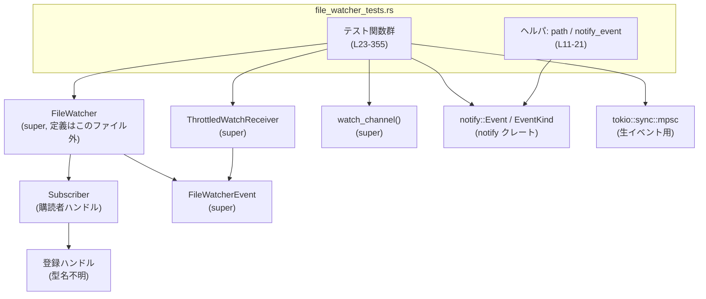
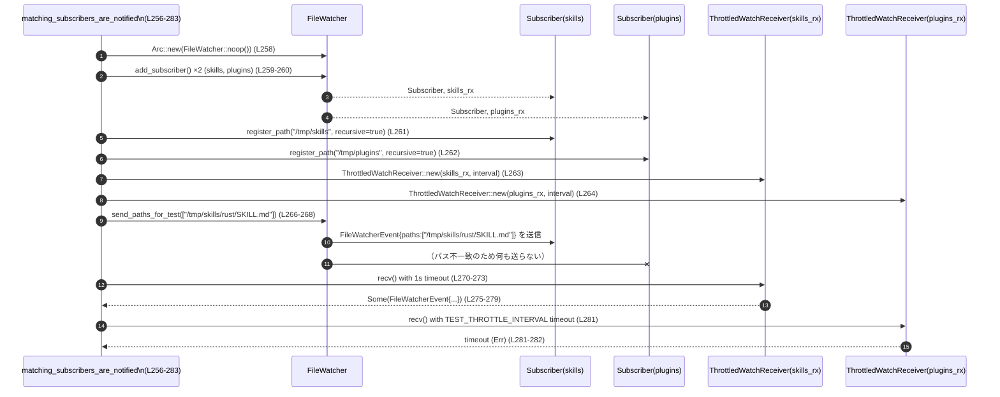

# core/src/file_watcher_tests.rs コード解説

## 0. ざっくり一言

- ファイル監視コンポーネント（`FileWatcher`）の **スロットリング・購読登録/解除・再帰監視・イベントフィルタリング・シャットダウン** の挙動を検証する単体テスト群です（`use super::*` で親モジュールの公開 API を使用しています）（`core/src/file_watcher_tests.rs:L1-7`）。
- `notify` クレート由来の生イベントから、アプリケーション向けの `FileWatcherEvent` に変換するまでの経路と、その並行性制御が意図どおりかを確認しています。

---

## 1. このモジュールの役割

### 1.1 概要

- このモジュールは **ファイル監視ロジックの契約（Contract）** をテストで定義しています。
- 主に次の点を検証します（行番号はおおよその範囲です）:
  - スロットル付き受信 (`ThrottledWatchReceiver`) の挙動（集約・フラッシュ・クローズ）（`L23-87`）
  - `is_mutating_event` によるイベント種別フィルタリング（`L89-112`）
  - パス登録 (`register_path`) と RAII による登録解除の挙動（`L114-154`）
  - 再帰/非再帰監視とパスマッチングの仕様（`L169-201`, `L256-320`）
  - 登録解除時のロック取得順序と排他制御（`L203-254`）
  - 生の `notify::Event` を処理するイベントループのフィルタリング動作（`L322-355`）

### 1.2 アーキテクチャ内での位置づけ

このテストファイルは、親モジュール（`super::*`、具体的なファイルパスはこのチャンクからは不明）で定義されたコンポーネントをブラックボックス的に検証しています（`L1`）。

主な関係を簡略化すると次のようになります。



- `FileWatcher` が監視対象パスと OS / notify レベルのウォッチを管理（利用箇所例: `L116-121, L175-178, L209-213`）。
- `Subscriber` がクライアントごとの購読コンテキスト（登録したパス集合と受信チャネル）を表す（`L117, L136, L148, L159`）。
- `ThrottledWatchReceiver` が、購読チャネルからの生イベントをスロットルしつつ `FileWatcherEvent` としてクライアントに公開（`L26-31, L263-270`）。
- `spawn_event_loop_for_test` が `notify::Event` から `FileWatcherEvent` への変換と `is_mutating_event` によるフィルタリングを担う（`L322-355`）。

### 1.3 設計上のポイント

コードから読み取れる特徴は次のとおりです。

- **RAII による登録解除**
  - `Subscriber::register_path` の戻り値（ここでは単に `registration` 変数）は、`drop` によって登録解除が行われます（`L137-141`, `L189-200`, `L217-219`）。
  - `Subscriber` 自体を drop した場合も、関連するパスが全て unregister され、受信チャネルがクローズします（`L145-153`, `L156-167`）。

- **スロットル付き受信とイベント集約**
  - `ThrottledWatchReceiver` は、一定のインターバル（テストでは 50ms）以内に発生した複数パス変更を 1 つの `FileWatcherEvent` に集約してからクライアントに渡します（`L23-52`）。
  - シャットダウン時には保留中のイベントをフラッシュしてからクローズします（`L54-87`）。

- **イベント種別のフィルタリング**
  - `notify::EventKind::Access`（ファイルオープンなど）は無視し、`Create` や `Modify` のような実際に内容が変化するイベントのみを `FileWatcherEvent` にします（`L89-112`, `L331-355`）。

- **並行性制御**
  - `FileWatcher` は内部状態を `inner`（`Mutex`）と `state`（`RwLock` と推測される）で守っており、登録解除時に `state` の書きロックを保持していることがテストされています（`L214-227`）。
  - `Arc<FileWatcher>` を複数スレッド間で共有し、`std::thread::spawn` を使った並列操作をテストしています（`L209-235`）。

- **再帰／非再帰監視とパスマッチング**
  - 祖先パスのイベントが子のウォッチを通知する（`L300-320`）。
  - 非再帰ウォッチは「孫」以下のディレクトリ変化を無視する（`L285-298`）。
  - `RecursiveMode` 列挙体により、パスごとに再帰/非再帰の状態を保持しています（`L184-197, L244-249`）。

---

## 2. 主要な機能一覧（このファイルが検証する振る舞い）

- スロットル付き受信の集約と時間制御（`throttled_receiver_coalesces_within_interval`）（`L23-52`）
- シャットダウン時の保留イベントフラッシュとチャネルクローズ（`throttled_receiver_flushes_pending_on_shutdown`）（`L54-87`）
- `is_mutating_event` によるイベント種別のフィルタリング（`Create` / `Modify` vs `Access`）（`L89-112`）
- パス・再帰フラグごとの登録数集計と重複登録の扱い（`register_dedupes_by_path_and_scope`）（`L114-131`）
- 登録ハンドルと Subscriber の drop による自動 unregister（`L133-154`）
- Subscriber drop 時に受信チャネルが `None` を返して閉じること（`receiver_closes_when_subscriber_drops`）（`L156-167`）
- 再帰登録と非再帰登録のダウングレード／解除の挙動（`recursive_registration_downgrades_to_non_recursive_after_drop`）（`L169-201`）
- unregister 中に `state` の書きロックが保持され、処理完了まで他の書き込みをブロックすること（`unregister_holds_state_lock_until_unwatch_finishes`）（`L203-254`）
- 複数 Subscriber のうち、パス条件にマッチするものだけが通知されること（`matching_subscribers_are_notified`）（`L256-283`）
- 非再帰ウォッチが深いネストの変更を無視すること（`non_recursive_watch_ignores_grandchildren`）（`L285-298`）
- 子ファイルへのウォッチが祖先ディレクトリのイベントでも通知されること（`ancestor_events_notify_child_watches`）（`L300-320`）
- 生の `notify::Event` を受け取るイベントループが非ミューテイティブなイベントを捨てること（`spawn_event_loop_filters_non_mutating_events`）（`L322-355`）

---

## 3. 公開 API と詳細解説

> 注意: このファイルはテスト専用モジュールであり、実際の API 定義は `super` モジュール側にあります。以下では **テストから観測できる契約** を整理します。シグネチャや内部処理については、コードから推測できる範囲にとどめます。

### 3.1 このファイル内で定義されるコンポーネント一覧

| 名前 | 種別 | 役割 / 用途 | 行範囲 |
|------|------|-------------|--------|
| `TEST_THROTTLE_INTERVAL` | 定数 | テストで使用するスロットル間隔（50ms） | `core/src/file_watcher_tests.rs:L9` |
| `path` | 関数 | `&str` から `PathBuf` を作るヘルパー | `core/src/file_watcher_tests.rs:L11-13` |
| `notify_event` | 関数 | `notify::EventKind` とパスのベクタから `notify::Event` を組み立てるヘルパー | `core/src/file_watcher_tests.rs:L15-21` |
| `throttled_receiver_coalesces_within_interval` | 非同期テスト関数 | スロットル受信が一定間隔内のイベントを集約することを検証 | `core/src/file_watcher_tests.rs:L23-52` |
| `throttled_receiver_flushes_pending_on_shutdown` | 非同期テスト関数 | シャットダウン時に保留イベントをフラッシュし、チャネルを閉じることを検証 | `core/src/file_watcher_tests.rs:L54-87` |
| `is_mutating_event_filters_non_mutating_event_kinds` | テスト関数 | `is_mutating_event` がイベント種別を正しくフィルタリングすることを検証 | `core/src/file_watcher_tests.rs:L89-112` |
| `register_dedupes_by_path_and_scope` | テスト関数 | 同一パス・同一再帰設定での登録数カウントを検証 | `core/src/file_watcher_tests.rs:L114-131` |
| `watch_registration_drop_unregisters_paths` | テスト関数 | 登録ハンドル drop による unregister を検証 | `core/src/file_watcher_tests.rs:L133-142` |
| `subscriber_drop_unregisters_paths` | テスト関数 | Subscriber drop による unregister を検証 | `core/src/file_watcher_tests.rs:L144-154` |
| `receiver_closes_when_subscriber_drops` | 非同期テスト関数 | Subscriber drop による受信チャネルクローズを検証 | `core/src/file_watcher_tests.rs:L156-167` |
| `recursive_registration_downgrades_to_non_recursive_after_drop` | テスト関数 | 再帰登録のハンドルがなくなると非再帰にダウングレードされることを検証 | `core/src/file_watcher_tests.rs:L169-201` |
| `unregister_holds_state_lock_until_unwatch_finishes` | テスト関数 | unregister 中に `state` の書きロックが保持されることを検証 | `core/src/file_watcher_tests.rs:L203-254` |
| `matching_subscribers_are_notified` | 非同期テスト関数 | パス条件にマッチする Subscriber のみが通知されることを検証 | `core/src/file_watcher_tests.rs:L256-283` |
| `non_recursive_watch_ignores_grandchildren` | 非同期テスト関数 | 非再帰ウォッチが孫ディレクトリの変更を無視することを検証 | `core/src/file_watcher_tests.rs:L285-298` |
| `ancestor_events_notify_child_watches` | 非同期テスト関数 | 祖先パスのイベントが子ウォッチに通知されることを検証 | `core/src/file_watcher_tests.rs:L300-320` |
| `spawn_event_loop_filters_non_mutating_events` | 非同期テスト関数 | 生イベントループのフィルタリング動作を検証 | `core/src/file_watcher_tests.rs:L322-355` |

### 3.1 外部コンポーネント（super や外部クレート）

| 名前 | 種別 | 役割 / 用途 | 利用位置（例） |
|------|------|-------------|----------------|
| `FileWatcher` | 構造体（super） | ファイル監視の中核。Subscriber の生成、パス登録/解除、内部状態・ロック管理、テスト用ヘルパを提供 | 生成: `L116, L135, L146, L158, L175, L209, L258, L287, L302, L324` |
| `FileWatcherEvent` | 構造体（super） | クライアントに渡される高レベルイベント。`paths: Vec<PathBuf>` を持つ | 比較: `L34-37, L65-68, L77-81, L275-279, L315-319, L351-355` |
| `ThrottledWatchReceiver` | 構造体（super） | `watch_channel` の受信側をラップし、イベントを時間的にスロットル・集約する | 生成と利用: `L26-31, L56-61, L263-270, L290-297, L306-313, L327-338, L346-349` |
| `watch_channel` | 関数（super） | ファイル変更パスを送受信するチャネルを生成（送信側 `tx` と受信側 `rx`） | `L25-31, L56-61` |
| `Subscriber` | 型（super） | 各クライアントの購読コンテキストを表す。`register_path` などを提供 | `L117-121, L136-150, L159-162, L176-178, L210-213, L259-264, L288-290, L303-306, L325-327` |
| `register_path` | メソッド（super） | パスと再帰フラグを指定してウォッチ登録し、登録ハンドルを返す | `L118-121, L137, L149-150, L177-178, L212-213, L261-262, L289, L305, L232-234` |
| `watch_counts_for_test` | メソッド（super, テスト用） | パスごとの（非再帰, 再帰）登録数を返す | `L123-130, L141, L152, L242` |
| `inner.watched_paths` | フィールド（super の内部構造体） | パスごとの `RecursiveMode` 状態を保持 | `L181-186, L192-197, L244-249` |
| `RecursiveMode` | 列挙体（super） | `Recursive` / `NonRecursive` を表現 | `L184-186, L195-197, L247-249` |
| `state` | フィールド（super） | `RwLock` 的な状態ロック。unregister 中に書きロックされる | `L221-227` |
| `send_paths_for_test` | メソッド（super, テスト用） | 指定したパス集合をイベントとして各 Subscriber に配送 | `L266-268, L293-294, L308` |
| `spawn_event_loop_for_test` | メソッド（super, テスト用） | 生の `notify::Event` ストリームから監視イベントを生成するイベントループを起動 | `L329-329` |
| `is_mutating_event` | 関数（super） | `notify::Event` が内容変更を伴うかどうかを判定 | `L90-111` |
| `notify::Event`, `EventKind`, `CreateKind`, `ModifyKind`, `AccessKind`, `AccessMode` | 型/列挙体（`notify` クレート） | OS レベルのファイルイベントを表現 | 生成と利用: `L15-21, L93-109, L331-344` |
| `tokio::time::timeout` | 関数（tokio） | 非同期処理にタイムアウトを付与（`Result<Output, Elapsed>` を返す） | `L29-31, L40-41, L43-45, L60-62, L73-76, L83-86, L163-166, L270-273, L281-282, L296-297, L310-313, L337-338, L346-349` |
| `tokio::sync::mpsc::unbounded_channel` | 関数 | 生の `notify::Event` を送受信するための非同期チャネルを生成 | `L328-329, L331-336, L340-345` |
| `tempfile::tempdir` | 関数 | テスト用の一時ディレクトリを作成し、自動クリーンアップする | `L171, L205` |

### 3.2 重要な関数・メソッドの詳細（テストから見える契約）

#### `is_mutating_event(event: &Event) -> bool`（定義は super）

**概要**

- `notify::Event` が **ファイル内容に影響する変更かどうか** を判定する関数です。
- テストからは、`Create` / `Modify` が `true`、`Access(Open)` が `false` であることが分かります（`core/src/file_watcher_tests.rs:L90-111`）。

**引数**

| 引数名 | 型 | 説明 |
|--------|----|------|
| `event` | `&notify::Event` と推定 | `notify` クレートのイベント。`Event.kind` にイベント種別が含まれます（`L90-111`）。 |

**戻り値**

- `bool` — イベントが「ミューテイティブ（内容変更を伴う）」であれば `true`、そうでなければ `false`。

**内部処理の流れ（テストからの推定）**

1. `event.kind` をパターンマッチする（`L93-101, L106-108` が根拠）。
2. 種別が `EventKind::Create(..)` または `EventKind::Modify(..)` の場合は `true` を返す。
3. 種別が `EventKind::Access(AccessKind::Open(..))` の場合は `false` を返す。
4. その他の種別（`Remove`, `Rename` など）の扱いは、このファイルからは不明です。

**Examples（使用例）**

```rust
// Create イベントは true
let event = notify_event(
    EventKind::Create(CreateKind::Any),
    vec![path("/tmp/created")],
); // テストヘルパ（L15-21, L93-95）
assert_eq!(is_mutating_event(&event), true);

// Access(Open) イベントは false
let event = notify_event(
    EventKind::Access(AccessKind::Open(AccessMode::Any)),
    vec![path("/tmp/accessed")],
); // (L106-109)
assert_eq!(is_mutating_event(&event), false);
```

**Errors / Panics**

- テストからはエラーやパニック条件は観測されません。
- 引数 `event` が `None` になる可能性はなく、単純な判定関数として振る舞うと見なせます。

**Edge cases（エッジケース）**

- `AccessKind` の他のバリアント（`Close`, `Read` 等）や `Remove`, `Rename` といったイベントの扱いは、このファイルには登場しません。どう扱うかは親モジュール側の実装依存です。

**使用上の注意点**

- 本関数は **「どのイベントをユーザへ通知するか」** のフィルタ条件に直結します。安全側に倒す（多少うるさくても漏らさない）か静穏側に倒すかは設計ポリシーに依存します。
- イベント種別の拡張（`notify` 側のバージョンアップ等）があった場合、この関数と対応テスト（`L89-112`）を合わせて見直す必要があります。

---

#### `ThrottledWatchReceiver::new(rx, interval: Duration) -> ThrottledWatchReceiver`（定義は super）

**概要**

- `watch_channel` の受信側 `rx` をラップし、**短時間に集中するイベントをまとめてからクライアントに渡す** ための構造体を生成します（`L23-31, L56-61, L263-270`）。

**引数**

| 引数名 | 型 | 説明 |
|--------|----|------|
| `rx` | 「ファイル変更通知チャネルの受信側」型（具体名はこのファイルからは不明） | `watch_channel()` から取得した受信側。`rx.recv()` は `Option<FileWatcherEvent>` を返す Future と推定されます（`L25-31`）。 |
| `interval` | `Duration` | 集約に用いるスロットル間隔。テストでは 50ms (`TEST_THROTTLE_INTERVAL`) を使用（`L9, L26, L57, L263, L290, L307, L327`）。 |

**戻り値**

- `ThrottledWatchReceiver` インスタンス。

**内部処理の流れ（`recv` の挙動を含む、テストからの推定）**

1. 内部に `rx`・`interval`・保留中のパス集合を保持する。
2. `recv()` が初めてイベントを検出したときは、即座に `FileWatcherEvent` を生成して返す（`L28-37, L59-68`）。
3. その後、`interval` の間に到着した他のイベントはまとめて保留リストに蓄積し、`interval` 経過後に 1 つの `FileWatcherEvent` に集約して返す（`L39-51`）。
4. 送信側が drop された場合（`tx` を drop）、保留リストに残っているパスをフラッシュしたうえで `Some(FileWatcherEvent)` を返し、次の `recv()` では `None` を返す（`L70-87`）。

**Examples（使用例）**

```rust
let (tx, rx) = watch_channel(); // super からのチャネル生成（L25）
let mut throttled = ThrottledWatchReceiver::new(rx, TEST_THROTTLE_INTERVAL); // (L26)

// 1 件目の変更はすぐに流れる
tx.add_changed_paths(&[path("a")]).await; // 送信（L28）
let first = timeout(Duration::from_secs(1), throttled.recv())
    .await
    .expect("first emit timeout"); // (L29-31)
assert_eq!(
    first,
    Some(FileWatcherEvent { paths: vec![path("a")] }),
);

// 短時間に 2 件まとめて送る
tx.add_changed_paths(&[path("b"), path("c")]).await; // (L39)
let blocked = timeout(TEST_THROTTLE_INTERVAL / 2, throttled.recv()).await; // まだ返ってこない（L40）
assert!(blocked.is_err());

// interval 経過後に 2 件分がまとめて返る
let second = timeout(TEST_THROTTLE_INTERVAL * 2, throttled.recv())
    .await
    .expect("second emit timeout"); // (L43-45)
assert_eq!(
    second,
    Some(FileWatcherEvent { paths: vec![path("b"), path("c")] }),
);
```

**Errors / Panics**

- `recv()` 自体はエラーを返さず、`Option<FileWatcherEvent>` を返す Future であると推定されます。
- テストでは `tokio::time::timeout` の `Err(Elapsed)` を利用して「イベントが発生しなかった」ことを検証しており、`recv()` がパニックするケースは登場しません（`L40-41, L281-282, L296-297, L337-338`）。

**Edge cases（エッジケース）**

- **送信側 drop**: 送信側 drop 後に保留中イベントが 1 回フラッシュされ、次の `recv()` で `None` が返ります（`L70-87`）。
- **イベントがまったく来ない**: テストでは `timeout` をかけて検証しており、`recv()` は待ち続ける設計になっていると考えられます。
- **interval より短いタイミングで連続呼び出し**: `blocked.is_err() == true` から、interval 内では新しいイベントが出力されないことが確認できます（`L40-41`）。

**使用上の注意点**

- `recv()` は Future であり、`await` するコンテキスト（Tokio ランタイムなど）が必要です。
- スロットル間隔中に多数のパスが変化した場合、1 つの `FileWatcherEvent` に集約されるため、「どの時点で変わったか」は失われ、**どのパスが変わったか** のみがわかる設計です。
- シャットダウン時に「最後のイベントが流れない」問題を避けるため、送信側 drop 時にフラッシュされることが保証されています（`L70-87`）。

---

#### `FileWatcher::add_subscriber(&self) -> (Subscriber, Receiver)`（定義は super）

**概要**

- 新しい購読者 (`Subscriber`) と、その購読者向けのイベント受信チャネルを生成します（`L117, L136, L148, L159, L176, L210-211, L259-260, L288-289, L303-304, L325-326`）。
- 各 Subscriber は独立した登録パスセットと受信チャネルを持ちます。

**引数**

| 引数名 | 型 | 説明 |
|--------|----|------|
| `&self` | `&FileWatcher` | 共有されるファイル監視インスタンス（`Arc<FileWatcher>` で共有される）（`L116, L135, L146, L158, L175, L209, L258, L287, L302, L324`）。 |

**戻り値**

- `(Subscriber, Receiver)`:
  - `Subscriber`: パス登録などを行うハンドル。
  - `Receiver`: `ThrottledWatchReceiver::new` に渡される低レベル受信チャネル、もしくはそれと互換な型。

**内部処理の流れ（推定）**

1. 内部状態（`state` フィールドなど）に新しい Subscriber を登録。
2. Subscriber ごとに専用のイベントチャネルを生成。
3. 生成した `(Subscriber, Receiver)` を返却。

**Examples（使用例）**

```rust
let watcher = Arc::new(FileWatcher::noop());      // No-op 実装（L116, L135 など）
let (subscriber, rx) = watcher.add_subscriber();  // 新しい購読者を追加（L117）

// パスを登録して受信側を ThrottledWatchReceiver でラップ
let _registration = subscriber.register_path(path("/tmp/skills"), /*recursive*/ true); // (L118, L261)
let mut rx = ThrottledWatchReceiver::new(rx, TEST_THROTTLE_INTERVAL);                   // (L263)

// イベント受信
let event = timeout(Duration::from_secs(1), rx.recv())
    .await
    .expect("change timeout")
    .expect("change");
```

**Errors / Panics**

- テストでは `add_subscriber()` 呼び出しに対するエラー処理は登場せず、`expect` も使われていません。通常はパニックしない前提で利用されています（`L116-121`, `L135-137` など）。

**Edge cases（エッジケース）**

- `Subscriber` を drop すると、対応する受信チャネルがクローズされ、`rx.recv().await` が `None` を返すことが確認されています（`L156-167`）。
- 同じ `FileWatcher` に対して複数の Subscriber を持つことができ、それぞれ別のパス集合を監視します（`L256-264`）。

**使用上の注意点**

- `FileWatcher` は `Arc` で共有されることを想定しており、複数スレッド／タスクから `add_subscriber` を呼び出しても安全であることがテストから暗示されます（`L209-235`）。
- Subscriber が drop されると監視も解除されるため、長期間監視したい場合は Subscriber のライフタイムに注意する必要があります。

---

#### `Subscriber::register_path(path: PathBuf, recursive: bool) -> RegistrationHandle`（定義は super）

**概要**

- 特定パスを（再帰的または非再帰的に）監視対象として登録し、**RAII で管理される登録ハンドル** を返します。

**引数**

| 引数名 | 型 | 説明 |
|--------|----|------|
| `path` | `PathBuf` | 監視対象ディレクトリまたはファイルのパス（`L118-121, L137, L149-150, L177-178, L212-213, L261-262, L289, L305`）。 |
| `recursive` | `bool` | `true` なら再帰監視、`false` なら非再帰監視（`L118-121` のコメント参照）。 |

**戻り値**

- `RegistrationHandle`（実際の型名はこのファイルからは不明）:
  - drop されるとそのパスの監視が解除されるハンドル（`L137-141, L189-200, L217-219`）。

**内部処理の流れ（推定）**

1. `FileWatcher` 内の状態に対して指定パスと再帰フラグに基づきウォッチを登録。
2. （重複登録）同じ Subscriber が同一の `(path, recursive)` を複数回登録した場合、内部的にはまとめて扱われ、カウントだけが増えるか、あるいは OS レベルのウォッチは 1 回に抑えられていると推測されます（`L114-131`）。
3. `RegistrationHandle` は内部に参照カウントなどを持ち、drop 時に対応する登録数を減らし、ゼロになった場合に実際の unwatch を行う（`L133-142, L169-201, L203-254`）。

**Examples（使用例）**

```rust
let watcher = Arc::new(FileWatcher::noop());
let (subscriber, _rx) = watcher.add_subscriber();

// 非再帰で 2 回、再帰で 1 回登録
let non_recursive1 = subscriber.register_path(path("/tmp/skills"), /*recursive*/ false); // (L118)
let non_recursive2 = subscriber.register_path(path("/tmp/skills"), /*recursive*/ false); // (L119)
let recursive = subscriber.register_path(path("/tmp/skills"), /*recursive*/ true);       // (L120)

// カウント確認
assert_eq!(
    watcher.watch_counts_for_test(&path("/tmp/skills")),
    Some((2, 1)), // (non_recursive, recursive) (L123-126)
);

// RAII による unregister
drop(recursive); // 再帰登録だけ解除（L189）
```

**Errors / Panics**

- テストでは `register_path` の失敗は想定しておらず、`expect` などは使われていません。ファイルシステムの状態異常（権限不足等）の扱いはこのファイルからは不明です。

**Edge cases（エッジケース）**

- **ハンドル drop**: `registration` を drop すると、そのパスの登録が解除され、`watch_counts_for_test` で `None` になることが確認されています（`L133-142`）。
- **Subscriber drop**: Subscriber をスコープ外に出すと、内部で保持している全登録が解除されることが確認されています（`L144-154`）。
- **再帰と非再帰の混在**:
  - 両方の登録が存在する場合は `RecursiveMode::Recursive`（`L180-187`）。
  - 再帰ハンドルだけを drop すると `RecursiveMode::NonRecursive` にダウングレードされる（`L189-200`）。

**使用上の注意点**

- ハンドルを早く drop すると監視もすぐに解除されるため、**ハンドルのライフタイムが監視期間を決める** ことに注意する必要があります。
- 再帰と非再帰を同じパスに対して混在させた場合の挙動（どちらが優先されるか）は、このテストのとおり「少なくとも 1 つ再帰があれば Recursive」→「再帰がなくなれば NonRecursive」という仕様になっています（`L180-201`）。

---

#### `FileWatcher::watch_counts_for_test(path: &Path) -> Option<(usize, usize)>`（定義は super, テスト専用）

**概要**

- テスト専用ヘルパであり、指定パスに対する（非再帰登録数, 再帰登録数）を取得します（`L123-130, L141, L152, L242`）。

**引数**

| 引数名 | 型 | 説明 |
|--------|----|------|
| `path` | `&Path` | 登録状況を知りたいパス。`path("/tmp/skills")` など（`L123-130`）。 |

**戻り値**

- `Option<(usize, usize)>` と推定:
  - `Some((non_recursive_count, recursive_count))`
  - `None` — そのパスに監視登録が無い場合。

**内部処理の流れ（推定）**

1. 内部の `watched_paths` か類似の構造から指定パスの登録情報を取得。
2. 登録数が 0 の場合は `None` を返し、そうでなければ `(非再帰, 再帰)` のタプルを返す。

**Examples（使用例）**

```rust
// 登録状況の確認（L114-131）
assert_eq!(
    watcher.watch_counts_for_test(&path("/tmp/skills")),
    Some((2, 1)),
);
assert_eq!(
    watcher.watch_counts_for_test(&path("/tmp/other-skills")),
    Some((0, 1)),
);

// 登録解除後にカウントが消える（L133-142）
drop(registration);
assert_eq!(
    watcher.watch_counts_for_test(&path("/tmp/skills")),
    None,
);
```

**Errors / Panics**

- テストからはパニックやエラーは観測されません。存在しないパスに対して安全に `None` を返しています（`L141, L152`）。

**Edge cases（エッジケース）**

- **複数 Subscriber からの登録**: `unregister_holds_state_lock_until_unwatch_finishes` では、異なる Subscriber からの登録・解除の組み合わせで最終的に `Some((1, 0))` となることを確認しています（`L242`）。
- **解除後の None**: 全ての登録が解除されると `None` になる仕様です（`L141, L152`）。

**使用上の注意点**

- テスト専用メソッドであるため、本番コードからは利用しないことが想定されます。
- 複数の Subscriber やレジストレーションで同じパスを共有する設計の場合、このカウントが期待どおりかどうかを確認するのに有用です。

---

#### `FileWatcher::send_paths_for_test(paths: Vec<PathBuf>) -> impl Future<Output = ()>`（定義は super, テスト専用）

**概要**

- テスト専用ヘルパであり、`notify` を経由せずに指定パスの変更イベントを直接各 Subscriber のチャネルに送信します（`L266-268, L293-294, L308`）。

**引数**

| 引数名 | 型 | 説明 |
|--------|----|------|
| `paths` | `Vec<PathBuf>` | 変更があったと仮定するパス群。再帰設定やパスマッチングに応じて Subscriber に配信されます。 |

**戻り値**

- 非同期処理（Future）。テストでは `await` して完了を待ちます（`L266-268, L293-294, L308`）。

**内部処理の流れ（推定）**

1. `paths` それぞれについて、どの Subscriber が監視しているかを判定。
2. パスと Subscriber の再帰設定（recursive / non-recursive）に基づき配信対象を決定。
3. 各 Subscriber のチャネルに `FileWatcherEvent { paths: vec![...単一パス...] }` として送信（集約は `ThrottledWatchReceiver` 側で行われる）。

**Examples（使用例）**

```rust
let watcher = Arc::new(FileWatcher::noop());
let (skills_subscriber, skills_rx) = watcher.add_subscriber();
let (plugins_subscriber, plugins_rx) = watcher.add_subscriber();

let _skills = skills_subscriber.register_path(path("/tmp/skills"), /*recursive*/ true);
let _plugins = plugins_subscriber.register_path(path("/tmp/plugins"), /*recursive*/ true);

let mut skills_rx = ThrottledWatchReceiver::new(skills_rx, TEST_THROTTLE_INTERVAL);
let mut plugins_rx = ThrottledWatchReceiver::new(plugins_rx, TEST_THROTTLE_INTERVAL);

// skills 配下のパスだけを送信（L266-268）
watcher
    .send_paths_for_test(vec![path("/tmp/skills/rust/SKILL.md")])
    .await;

// skills 側だけ通知される（L270-279, L281-282）
```

**Errors / Panics**

- テストからはエラーやパニックは観測されず、`await` で完了する前提です。

**Edge cases（エッジケース）**

- **非再帰ウォッチ**: `/tmp/skills` を非再帰で監視しているとき `/tmp/skills/nested/SKILL.md` を送信してもイベントは届きません（`L285-298`）。
- **祖先イベント**: ファイルパス `/tmp/skills/rust/SKILL.md` を監視している場合でも、祖先ディレクトリ `/tmp/skills` のパスを送信するとイベントが届きます（`L300-320`）。

**使用上の注意点**

- テスト専用 API のため、本番コードで直接呼ぶことは想定されていません。
- パスマッチング仕様（祖先/子関係、再帰の扱い）を確認する際のベースラインとして重要です。

---

#### `FileWatcher::spawn_event_loop_for_test(raw_rx: mpsc::UnboundedReceiver<Result<Event, E>>)`（定義は super, テスト専用）

**概要**

- `notify` の生イベント (`notify::Event`) を受け取り、`is_mutating_event` によるフィルタリングとパス抽出を行って各 Subscriber にイベントを配信する **イベントループ** を起動します（`L328-329, L331-345`）。

**引数**

| 引数名 | 型 | 説明 |
|--------|----|------|
| `raw_rx` | `mpsc::UnboundedReceiver<Result<notify::Event, E>>` と推定 | `notify` から届くイベントストリーム。テストでは `Result<Event, _>` 型の `Ok` のみを送信しています（`L331-335, L340-344`）。 |

**戻り値**

- 戻り値はテストからは不明です。おそらくバックグラウンドタスクをスポーンし、直ちに制御を返す関数です（`L329`）。

**内部処理の流れ（推定）**

1. `raw_rx` から `notify::Event` を非同期で受信。
2. 各イベントに対して `is_mutating_event` を適用し、`false` のイベントは破棄（`L331-338` が根拠）。
3. `true` のイベントについてはパスを抽出し、対応する Subscriber に `FileWatcherEvent` として配送（`L340-355`）。

**Examples（使用例）**

```rust
let watcher = Arc::new(FileWatcher::noop());
let (subscriber, rx) = watcher.add_subscriber();
let _registration = subscriber.register_path(path("/tmp/skills"), /*recursive*/ true);

let mut rx = ThrottledWatchReceiver::new(rx, TEST_THROTTLE_INTERVAL);

// 生イベント用チャネルを準備（L328-329）
let (raw_tx, raw_rx) = mpsc::unbounded_channel();
watcher.spawn_event_loop_for_test(raw_rx);

// Access(Open) イベント => 無視される（L331-338）
raw_tx
    .send(Ok(notify_event(
        EventKind::Access(AccessKind::Open(AccessMode::Any)),
        vec![path("/tmp/skills/SKILL.md")],
    )))
    .expect("send access event");
let blocked = timeout(TEST_THROTTLE_INTERVAL, rx.recv()).await;
assert!(blocked.is_err());

// Create(File) イベント => 通知される（L340-355）
raw_tx
    .send(Ok(notify_event(
        EventKind::Create(CreateKind::File),
        vec![path("/tmp/skills/SKILL.md")],
    )))
    .expect("send create event");
let event = timeout(Duration::from_secs(1), rx.recv())
    .await
    .expect("create event timeout")
    .expect("create event");
```

**Errors / Panics**

- `raw_tx.send(...)` は `Result<(), SendError<_>>` を返しており、テストでは `expect` でエラーを報告するのみです（`L335-336, L345-346`）。
- `Err` な `Result<Event, E>` の扱い（`notify` のエラー）はこのテストでは登場せず、不明です。

**Edge cases（エッジケース）**

- **非ミューテイティブイベント**: `Access(Open)` は完全に無視され、Subscriber の受信には何も届きません（`L331-338`）。
- **ミューテイティブイベント**: `Create(File)` は `FileWatcherEvent` に変換されて通知されます（`L340-355`）。

**使用上の注意点**

- 本メソッドもテスト専用 API であり、本番環境では `notify::RecommendedWatcher` などからのイベントを直接処理する別のエントリポイントが存在する可能性があります。
- フィルタリングロジックの変更（例えば `Access(Write)` を通知したくなる場合など）は、このメソッドと `is_mutating_event` 双方の変更とテスト更新が必要です。

---

### 3.3 その他の関数（このファイル内）

| 関数名 | 役割（1 行） | 行範囲 |
|--------|--------------|--------|
| `path(name: &str) -> PathBuf` | 文字列リテラルから `PathBuf` を生成するテスト用ヘルパー | `core/src/file_watcher_tests.rs:L11-13` |
| `notify_event(kind: EventKind, paths: Vec<PathBuf>) -> Event` | 与えた `EventKind` とパスリストから `notify::Event` を組み立てるヘルパー | `core/src/file_watcher_tests.rs:L15-21` |

---

## 4. データフロー

代表的なシナリオとして、**パスマッチングによる Subscriber ごとの通知** を扱うテスト `matching_subscribers_are_notified` のデータフローを整理します（`core/src/file_watcher_tests.rs:L256-283`）。

### 処理の要点（matching_subscribers_are_notified）

1. `FileWatcher::noop()` から `FileWatcher` を生成し、2 つの Subscriber を追加する（skills / plugins）（`L258-260`）。
2. 各 Subscriber で異なるパスを再帰的に登録する（`/tmp/skills`, `/tmp/plugins`）（`L261-262`）。
3. `send_paths_for_test` で `/tmp/skills/rust/SKILL.md` の変更イベントを発生させる（`L266-268`）。
4. `ThrottledWatchReceiver` を通じて、skills 側の Subscriber だけが `FileWatcherEvent` を受け取り、plugins 側は何も受け取らない（`L270-282`）。

### シーケンス図



---

## 5. 使い方（How to Use）

このファイル自体はテスト専用ですが、**`FileWatcher` を使った典型的な利用パターン** がそのまま使用例として参考になります。

### 5.1 基本的な使用方法（テストコードから抽出）

```rust
use std::sync::Arc;
use tokio::time::timeout;

async fn example_usage() -> anyhow::Result<()> {
    // 1. FileWatcher を準備する（noop 版または本物の watcher）
    let watcher = Arc::new(FileWatcher::noop()); // L116, L258 など

    // 2. Subscriber を追加してパスを登録
    let (subscriber, rx) = watcher.add_subscriber(); // L117, L259
    let _registration =
        subscriber.register_path(path("/tmp/skills"), /*recursive*/ true); // L118, L261

    // 3. スロットル付き受信ラッパを作る
    let mut rx = ThrottledWatchReceiver::new(rx, TEST_THROTTLE_INTERVAL); // L26, L263

    // 4. （テストでは）明示的にパス変更を送る
    watcher
        .send_paths_for_test(vec![path("/tmp/skills/rust/SKILL.md")]) // L266-268
        .await;

    // 5. イベントを待ち受ける
    if let Some(event) = timeout(Duration::from_secs(1), rx.recv()) // L270-273
        .await?
    {
        // FileWatcherEvent { paths: Vec<PathBuf> } を利用する
        for changed in event.paths {
            println!("changed: {:?}", changed);
        }
    }

    Ok(())
}
```

### 5.2 よくある使用パターン

- **複数 Subscriber による関心領域の分離**（`matching_subscribers_are_notified`）（`L256-283`）
  - 異なるルートパスを監視し、各チーム／コンポーネントごとにイベントを受け取る。
- **非再帰ウォッチによる限定的な監視**（`non_recursive_watch_ignores_grandchildren`）（`L285-298`）
  - ルートディレクトリ直下のみを対象にし、深い階層の変更ノイズを無視する。
- **祖先ディレクトリでのイベント集約**（`ancestor_events_notify_child_watches`）（`L300-320`）
  - 個別ファイルに対する変更が、祖先ディレクトリのイベントとして通知されるケースを許容・利用する。

### 5.3 よくある間違い（テストから推測される誤用）

```rust
// 間違い例: Subscriber を早く drop してしまい、イベントが受信できない
let watcher = Arc::new(FileWatcher::noop());
let (subscriber, mut rx) = watcher.add_subscriber();
drop(subscriber); // ここで購読が解除されてしまう（L161）

let closed = timeout(Duration::from_secs(1), rx.recv())
    .await
    .expect("closed recv timeout");
assert_eq!(closed, None); // チャネルはすでに閉じている（L163-166）

// 正しい例: Subscriber（および registration ハンドル）を必要な間は保持する
let watcher = Arc::new(FileWatcher::noop());
let (subscriber, rx) = watcher.add_subscriber();
let _registration = subscriber.register_path(path("/tmp/skills"), true);
// subscriber と _registration をスコープに残したまま rx.recv() を使う
```

### 5.4 使用上の注意点（まとめ）

- **ライフタイム管理**
  - `Subscriber` や登録ハンドルを drop すると監視が解除され、チャネルが閉じます（`L133-154, L156-167`）。
- **スロットルによるイベント集約**
  - `ThrottledWatchReceiver` は短時間に集中するイベントをまとめるため、**イベントの時系列の細かい順番** は保証されません（`L23-52`）。
- **時間依存テストとタイムアウト**
  - このファイルでは `tokio::time::timeout` で挙動を検証しており、実運用においても「いつまで待つか」を明示的に決めることが推奨されます（`L29-31, L40-41, L43-45` ほか）。
- **並行性**
  - `unregister_holds_state_lock_until_unwatch_finishes` から、登録解除処理は内部ロックを取りつつ行われることが分かり、**登録と解除が同時に行われても整合性が保たれる設計**になっています（`L214-227, L230-235`）。

---

## 6. 変更の仕方（How to Modify）

### 6.1 新しい機能を追加する場合（テスト観点）

- **新しいイベント種別の扱いを変える場合**
  1. `is_mutating_event` の実装を変更（親モジュール側）。
  2. このファイルの `is_mutating_event_filters_non_mutating_event_kinds` に新しいケースを追加（`L89-112`）。
  3. 必要であれば `spawn_event_loop_filters_non_mutating_events` にもケースを追加（`L322-355`）。

- **新しいパスマッチングルール（例: 特定拡張子のみ）を導入する場合**
  1. 親モジュールのマッチングロジックを変更。
  2. `matching_subscribers_are_notified` や `non_recursive_watch_ignores_grandchildren` を参考に、条件付きで通知されるかどうかを検証するテストを追加（`L256-283, L285-298`）。

### 6.2 既存の機能を変更する場合（契約と影響範囲）

- **スロットル挙動の変更**
  - `ThrottledWatchReceiver` の仕様を変えると、`throttled_receiver_coalesces_within_interval` および `throttled_receiver_flushes_pending_on_shutdown` の期待値が変わります（`L23-52, L54-87`）。
  - 特に「初回は即時」「 interval 内はブロック」「シャットダウン時にフラッシュ」の 3 点が契約としてテストされています。

- **RAII による登録解除の変更**
  - 登録解除タイミング（ハンドル drop、Subscriber drop、`FileWatcher` drop）が変わる場合、`watch_registration_drop_unregisters_paths`, `subscriber_drop_unregisters_paths`, `unregister_holds_state_lock_until_unwatch_finishes` など複数のテストに影響します（`L133-154, L203-254`）。
  - ロック取得順序を変えるとデッドロックの可能性が出るため、`unregister_holds_state_lock_until_unwatch_finishes` のようなテストで検証することが重要です。

- **再帰/非再帰の判定変更**
  - `RecursiveMode` の扱いを変える場合、`recursive_registration_downgrades_to_non_recursive_after_drop`, `non_recursive_watch_ignores_grandchildren`, `ancestor_events_notify_child_watches` が影響を受けます（`L169-201, L285-320`）。

---

## 7. 関連ファイル

| パス / モジュール | 役割 / 関係 |
|-------------------|------------|
| `super` モジュール（ファイルパスはこのチャンクからは不明） | `FileWatcher`, `ThrottledWatchReceiver`, `FileWatcherEvent`, `is_mutating_event` など、本テストで検証される中核ロジックを提供します（`core/src/file_watcher_tests.rs:L1`）。|
| `notify` クレート | OS からのファイルシステムイベントを表す `Event`, `EventKind` などを提供し、`is_mutating_event` やイベントループの入力になります（`L2-5, L15-21, L93-109, L331-344`）。 |
| `tokio` クレート | 非同期テストのためのランタイムと `timeout` 関数を提供し、スロットルやチャネルクローズの挙動を時間ベースで検証します（`L7, L23, L54, L156, L256, L285, L300, L322`）。 |
| `tokio::sync::mpsc` | 生の `notify::Event` を受け取るための非同期チャネルを提供し、`spawn_event_loop_for_test` の入力となります（`L328-329`）。 |
| `tempfile` クレート | 実際のディレクトリを作成して再帰/非再帰ウォッチの挙動を検証するための一時ディレクトリを提供します（`L171, L205`）。 |

---

### 補足: 潜在的な問題・安全性に関する所見

- このファイルで直接確認できる **明確なバグやセキュリティ問題** はありません。
- 並行性については、`unregister_holds_state_lock_until_unwatch_finishes` で **ロックの取得順序と排他性** がテストされており、登録と解除の競合時にもデータ競合が起きないよう設計されていることが分かります（`L203-254`）。
- テストは時間ベースの `timeout` に依存するため、極端に遅い環境では稀にフレーク（不安定なテスト）になる可能性はありますが、これはテストの性質であり、本番ロジックの安全性とは直接関係しません。
