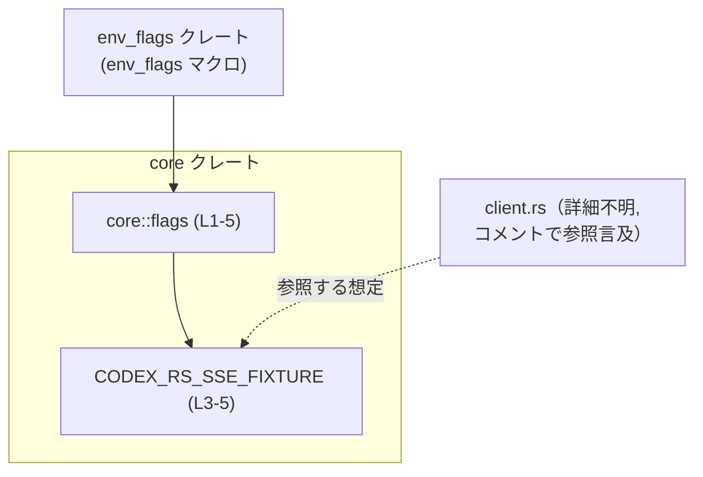
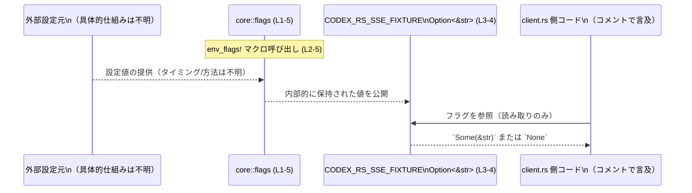

# core/src/flags.rs コード解説

## 0. ざっくり一言

- `env_flags` クレートのマクロを使って、オフラインテスト用のフィクスチャパスを表す **環境フラグ `CODEX_RS_SSE_FIXTURE`** を 1 つ宣言しているファイルです（`Option<&str>`、デフォルトは `None`）。  
  根拠: `core/src/flags.rs:L1-5`

---

## 1. このモジュールの役割

### 1.1 概要

- このモジュールは、オフラインテストで利用されるフィクスチャパスを外部設定可能にするための **フラグ定義を 1 箇所に集約** する役割を持ちます。
- `env_flags!` マクロを通じて、`pub CODEX_RS_SSE_FIXTURE: Option<&str> = None` という公開アイテムを宣言しています。  
  根拠: `core/src/flags.rs:L1-5`

### 1.2 アーキテクチャ内での位置づけ

- 依存関係（このチャンクから読み取れる範囲）は次のとおりです。

  - このモジュールは外部クレート `env_flags` のマクロ `env_flags` に依存します。  
    根拠: `use env_flags::env_flags;`（`core/src/flags.rs:L1`）
  - `CODEX_RS_SSE_FIXTURE` は doc コメントで `client.rs` から参照されることが示唆されていますが、**実際の参照元のパスや詳細はこのチャンクには現れません**。  
    根拠: doc コメント「see client.rs」（`core/src/flags.rs:L3`）



- 破線の矢印は、「doc コメントから参照が示唆されているが、このチャンクにはコードが出てこない」関係を表します。

### 1.3 設計上のポイント

- `env_flags!` マクロを利用することで、**環境フラグの定義を宣言的に記述**している構造になっています。  
  根拠: マクロ呼び出し `env_flags! { ... }`（`core/src/flags.rs:L2-5`）
- フラグの型は `Option<&str>` で、**「値が無い」ことを型で表現**しています。  
  根拠: `pub CODEX_RS_SSE_FIXTURE: Option<&str> = None;`（`core/src/flags.rs:L4`）
- デフォルト値として `None` が指定されているため、「明示的に設定されない限り値は存在しない」という契約になっています。  
  根拠: 同上
- このファイルには `unsafe` ブロックやスレッド同期原語は登場せず、**並行性・メモリ安全性に関する処理は存在しません**（`env_flags` マクロ内部の実装はこのチャンクには現れません）。

---

## 2. 主要な機能一覧

このファイルが提供する主な公開要素は 1 つです。

- `CODEX_RS_SSE_FIXTURE`: オフラインテスト用のフィクスチャパスを表すフラグ。`Option<&str>` 型で、デフォルトは `None`。  
  根拠: `core/src/flags.rs:L3-4`

---

## 3. 公開 API と詳細解説

### 3.1 公開アイテム一覧（定数・フラグ・型など）

このチャンクに現れる公開アイテムの一覧です。

| 名前 | 種別 | 型 | 役割 / 用途 | 定義位置 |
|------|------|----|-------------|----------|
| `CODEX_RS_SSE_FIXTURE` | 環境フラグ相当の公開アイテム（マクロから生成） | `Option<&str>` | オフラインテストで使用するフィクスチャファイルのパスを外部から指定するためのフラグ | `core/src/flags.rs:L3-4` |

補助的な要素:

| 名前 | 種別 | 役割 / 用途 | 定義位置 |
|------|------|-------------|----------|
| `env_flags` | マクロ（外部クレート） | `CODEX_RS_SSE_FIXTURE` のようなフラグアイテムを生成するために使用されるマクロ | `core/src/flags.rs:L1-2` |

> `CODEX_RS_SSE_FIXTURE` 自体はマクロから生成されるため、このチャンクには展開後の具体的なコード（`static` か `const` か等）は現れません。  
> そのため、**内部実装（読み取りタイミング・スレッド安全性など）は不明**です。

### 3.2 関数詳細

- このファイルには **関数定義は存在しません**。  
  根拠: `core/src/flags.rs:L1-5` の全行を確認しても `fn` が出現しない

### 3.3 その他の関数

- なし（関数自体が未定義です）。

---

## 4. データフロー

このファイル単体では「値がどこから来るか」はマクロの実装に依存しており不明ですが、**利用側から見た典型的なデータフロー**は次のように整理できます。

1. 外部の設定元（おそらく環境変数など）が `CODEX_RS_SSE_FIXTURE` に対応する値を提供する。
2. `env_flags!` マクロで生成されたコードが、その設定値を内部的に保持し、`Option<&str>` として公開する。
3. `client.rs` などの呼び出し側コードが `CODEX_RS_SSE_FIXTURE` を参照し、`Some(path)` のときにそのパスからフィクスチャを読み込む。
4. `None` の場合は、「フィクスチャパスが指定されていない」として扱う（この扱い方は呼び出し側に依存し、このチャンクからは不明）。



> 「外部設定元」が何か（環境変数か、構成ファイルか等）、いつ読み込まれるか（起動時か、初回アクセス時か）は、`env_flags` マクロの実装に依存しており、このチャンクからは **不明** です。

---

## 5. 使い方（How to Use）

### 5.1 基本的な使用方法

ここでは、このファイルが `crate::flags` として利用可能になっている一般的なケースを **仮定** した使用例を示します。  
（**実際のモジュールパスはこのチャンクからは分からないため、必要に応じて調整が必要です**。）

```rust
// flags モジュールから環境フラグをインポートする                  // CODEX_RS_SSE_FIXTURE を使う準備
use crate::flags::CODEX_RS_SSE_FIXTURE;                         // 本ファイルが crate::flags として公開されているケースを想定

/// オフラインテストで利用するフィクスチャパスを取得する関数
fn offline_fixture_path() -> Option<String> {                    // Option<String> を返すラッパー
    // CODEX_RS_SSE_FIXTURE は Option<&str> なので map で String に変換する
    CODEX_RS_SSE_FIXTURE.map(|s| s.to_string())                 // Some(&str) -> Some(String)、None -> None
}
```

このように、利用側は

- `CODEX_RS_SSE_FIXTURE` が `Option<&str>` であること
- `None` の可能性があること

を前提に、`match` や `map` などで安全に扱う構造になります。

### 5.2 よくある使用パターン

#### パターン 1: デフォルトパスへのフォールバック

```rust
use crate::flags::CODEX_RS_SSE_FIXTURE;

/// フィクスチャパスを取得し、未設定ならデフォルトにフォールバックする例
fn resolved_fixture_path() -> String {
    // 環境フラグが Some の場合はその値、None の場合は既定パスを使う
    CODEX_RS_SSE_FIXTURE
        .map(|s| s.to_string())                                 // Some(&str) を Some(String) に変換
        .unwrap_or_else(|| "tests/fixtures/default.json".into())// None のときのフォールバックパス
}
```

#### パターン 2: フラグの有無で挙動を切り替える

```rust
use crate::flags::CODEX_RS_SSE_FIXTURE;

/// フィクスチャパスが指定されている場合にのみオフラインテストを実行する例
fn run_offline_test_if_configured() {
    if let Some(path) = CODEX_RS_SSE_FIXTURE {                  // Option<&str> をパターンマッチ
        // path を使ってフィクスチャをロードする処理を行う                 // 詳細実装はこのファイルには現れない
        println!("Using fixture at: {}", path);
    } else {
        println!("No fixture path configured; skipping offline test");
    }
}
```

### 5.3 よくある間違い

このファイルだけから推測できる、**型とデフォルト値に基づく誤用パターン**を挙げます。

```rust
use crate::flags::CODEX_RS_SSE_FIXTURE;

// 間違い例: None の可能性を考慮せずに unwrap してしまう
fn wrong_usage() {
    // CODEX_RS_SSE_FIXTURE が None の場合、ここで panic する可能性がある
    let path = CODEX_RS_SSE_FIXTURE.unwrap();                   // 推奨されない: テストが不必要に落ちる原因になる
    println!("Fixture: {}", path);
}

// 正しい例: Option を安全に扱う
fn correct_usage() {
    if let Some(path) = CODEX_RS_SSE_FIXTURE {
        println!("Fixture: {}", path);                          // 値がある場合だけ利用する
    } else {
        println!("Fixture path is not configured");             // 未設定時の扱いを明示する
    }
}
```

### 5.4 使用上の注意点（まとめ）

- `CODEX_RS_SSE_FIXTURE` は `Option<&str>` であり、**`None` が通常ケースとして想定される可能性があります**（デフォルトが `None` のため）。  
  → 呼び出し側で必ず `None` を考慮する必要があります。
- `unwrap()` などで強制的に取り出すと、`None` のときに panic が発生します。  
  → オフラインテスト用途であっても、テスト実行環境に依存した不安定さを生むため、`match` や `if let` で安全に扱う方が堅牢です。
- このファイルには **書き込み処理や可変状態**は現れません（マクロ展開結果は不明ですが、宣言自体は `pub CODEX_RS_SSE_FIXTURE: Option<&str> = None;` だけです）。  
  → フラグの更新や再設定が可能かどうかは、このチャンクからは判断できません。

---

## 6. 変更の仕方（How to Modify）

### 6.1 新しいフラグを追加する場合

`env_flags!` マクロの使用例として、現在 1 つのフラグが定義されています。

```rust
env_flags! {                                                   // L2
    /// Fixture path for offline tests (see client.rs).        // L3
    pub CODEX_RS_SSE_FIXTURE: Option<&str> = None;             // L4
}                                                              // L5
```

この構造を踏まえると、新しいフラグを追加する自然な手順は次のとおりです（マクロが複数エントリを許容する前提ですが、**実際の許容形式はこのチャンクからは不明**です）。

1. `env_flags!` ブロック内に、既存のエントリと同じスタイルで新しい行を追加する。
   - 例:  

     ```rust
     /// 説明コメント
     pub NEW_FLAG_NAME: Option<&str> = None;
     ```

2. 型とデフォルト値（`None` など）を、利用側の想定に合わせて選ぶ。
3. 追加したフラグを利用するモジュール（例: `client.rs` やテストコード）で `use` し、`Option` として扱う。

> ただし、`env_flags!` マクロがどのようなシンタックスをサポートしているかは、このチャンクだけでは分からないため、**実際には `env_flags` クレート側のドキュメントや実装を確認する必要があります**。

### 6.2 既存のフラグを変更する場合

`CODEX_RS_SSE_FIXTURE` を変更する場合に注意すべき点は次のとおりです。

- **名前を変える場合**
  - 参照しているすべてのモジュール（`client.rs` 等）で名前を更新する必要があります。
  - 既存の環境設定（もしあれば）との互換性が失われる可能性があります。
- **型を変える場合**（例: `Option<PathBuf>` に変更等）
  - 呼び出し側のコードが全てコンパイルエラーになるため、変更範囲を特定しやすい一方で、影響範囲は広くなります。
- **デフォルト値を変える場合**
  - 現在は `None` であるため、「未設定」が一般ケースである可能性があります。  
    → デフォルトを `Some("...")` に変えると、今まで `None` を期待していたロジックの挙動が変わる可能性があります。
- 変更後は、`client.rs` や関連テストコードで、`Option` の扱いや分岐条件が期待通りかを確認する必要があります。

---

## 7. 関連ファイル

このチャンクから分かる範囲での関連ファイル・コンポーネントは次のとおりです。

| パス / コンポーネント | 役割 / 関係 | 根拠 |
|------------------------|------------|------|
| `core/src/flags.rs` | 本レポート対象ファイル。`env_flags!` マクロを用いて `CODEX_RS_SSE_FIXTURE` を宣言する。 | ファイル内容全体（`core/src/flags.rs:L1-5`） |
| `client.rs`（正確なパスは不明） | オフラインテストで `CODEX_RS_SSE_FIXTURE` を利用する側と推測される。コメントで参照が明示されている。 | `/// Fixture path for offline tests (see client.rs).`（`core/src/flags.rs:L3`） |
| `env_flags` クレート | `env_flags!` マクロを提供し、フラグの実体を生成する。内部実装（環境変数名・読み取りタイミング・スレッド安全性など）はこのチャンクには現れない。 | `use env_flags::env_flags;`（`core/src/flags.rs:L1`） |

---

## Bugs / Security / Contracts / Edge Cases まとめ（このファイル単体の観点）

- **バグの可能性（このファイル単体として）**
  - 宣言自体は単純であり、この 5 行のみから明らかなバグは見当たりません。
  - 実際の挙動は `env_flags` マクロの実装と利用側コードに依存します。

- **セキュリティ上の注意**
  - `CODEX_RS_SSE_FIXTURE` の値がファイルパスとして利用される場合、**パスの妥当性チェックやサンドボックス**は利用側（`client.rs` 等）で行う必要があります。
  - このファイルは値の検証・フィルタリングを一切行っていません（宣言のみ）ので、任意パス読み込み等のリスクがあるかどうかは利用方法次第であり、このチャンクからは判断できません。

- **契約（Contract）**
  - 公開 API として、「`CODEX_RS_SSE_FIXTURE` は `Option<&str>` 型であり、デフォルトは `None`」という契約が存在します。  
    → 利用側は「値がない」ケースを必ず扱う必要があります。
  - それ以外の前提条件（例: いつ値が確定するか、途中で変更されうるかなど）は、このチャンクでは定義されていません。

- **エッジケース**
  - `CODEX_RS_SSE_FIXTURE == None` の場合  
    - フィクスチャパス未設定として扱われる想定です。どう扱うか（テストをスキップする、デフォルトにフォールバックする等）は利用側の責務です。
  - `Some("")`（空文字列）の場合  
    - 型シグネチャ上は許容されますが、空パスをどのように扱うかも利用側に依存しており、このファイルからは分かりません。

- **並行性**
  - このチャンクには `unsafe` やミューテーションを伴うコードは存在せず、並行性に関する懸念点は読み取れません。
  - ただし、内部的にスレッドセーフな仕組みを用いているかどうかは `env_flags` マクロの実装次第であり、このファイルからは不明です。

- **テスト**
  - テストコードはこのファイルには含まれていませんが、「Fixture path for offline tests」という doc コメントから、このフラグがテスト用途であることが分かります。  
    → 具体的なテストケースや使われ方は `client.rs` 側で定義されていると推測されます（ただし、このチャンクからはコードとして確認できません）。
