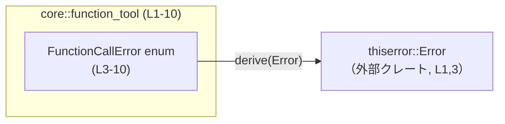
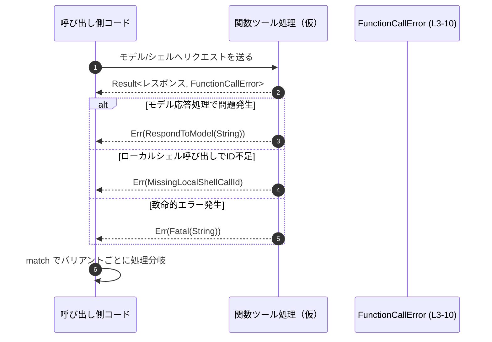

# core/src/function_tool.rs

## 0. ざっくり一言

`FunctionCallError` というエラー用の列挙体（enum）を定義し、`thiserror` クレートの `Error` 派生を使って、人間向けのエラーメッセージと標準的なエラー実装を提供するファイルです（`core/src/function_tool.rs:L1-10`）。

---

## 1. このモジュールの役割

### 1.1 概要

- このファイルは、**関数呼び出し（function call）に関連するエラー状況を列挙型として表現**するためのモジュールです（`FunctionCallError` の名前と各バリアント名・メッセージより、`core/src/function_tool.rs:L3-10`）。
- `thiserror::Error` を利用して、`std::error::Error` トレイト実装と `Display` 文字列を自動生成しています（`core/src/function_tool.rs:L1, L3-5, L7, L9`）。
- 利用側がこの列挙型を `Result<T, FunctionCallError>` などの形で用いることで、エラー種別を分岐させたり、テストで比較したりしやすくなっています（`PartialEq` の派生より、`core/src/function_tool.rs:L3`）。

※ 実際にどの関数から返されているかなどの利用箇所は、このチャンクには現れません。

### 1.2 アーキテクチャ内での位置づけ

このファイルから読み取れる依存関係は、`thiserror` クレートへの依存のみです（`core/src/function_tool.rs:L1, L3`）。  
内部には `FunctionCallError` という 1 つの公開 enum が存在します（`core/src/function_tool.rs:L4-10`）。



- `FunctionCallError` は `thiserror::Error` の派生マクロに依存しており、これにより標準的なエラーとして振る舞えるようになっています（`core/src/function_tool.rs:L1, L3`）。
- 他モジュールから `FunctionCallError` がどのように import されているかは、このチャンクには現れません。

### 1.3 設計上のポイント

コードから読み取れる設計上の特徴は次のとおりです。

- **エラー型を単一の enum に集約**  
  - 関数呼び出し関連のエラーを `FunctionCallError` という 1 つの enum にまとめています（`core/src/function_tool.rs:L4-10`）。
- **`thiserror` によるエラー実装の自動生成**  
  - `#[derive(Error)]` および `#[error(...)]` 属性により、各バリアントごとの `Display` 実装と `std::error::Error` 実装を自動生成しています（`core/src/function_tool.rs:L1, L3, L5, L7, L9`）。
- **比較可能なエラー型**  
  - `PartialEq` を derive しており、テストやロジック中でエラー同士を直接比較できるようになっています（`core/src/function_tool.rs:L3`）。
- **状態付きエラーと状態なしエラーの混在**  
  - `RespondToModel(String)` / `Fatal(String)` はメッセージ文字列を保持する状態付きエラー、`MissingLocalShellCallId` は固定メッセージのみの状態なしエラーです（`core/src/function_tool.rs:L5-10`）。
- **状態は文字列のみ**  
  - 追加情報はすべて `String` によって保持されており、構造化された追加フィールドは持ちません（`core/src/function_tool.rs:L6, L10`）。

---

## 2. 主要な機能一覧

このファイルが提供する主な要素は 1 つです。

- `FunctionCallError` 列挙体:  
  モデル応答処理・ローカルシェル呼び出し・致命的エラーなど、関数呼び出しまわりのエラー種別を表す列挙型です（名前・バリアント名とメッセージより、`core/src/function_tool.rs:L4-10`）。  
  ※ 利用側コードはこのチャンクには現れないため、「どの処理に対して使われるか」は推測の域を出ません。

---

## 3. 公開 API と詳細解説

### 3.1 型一覧（構造体・列挙体など）

| 名前               | 種別   | 公開範囲 | 役割 / 用途                                                                                          | 根拠 |
|--------------------|--------|----------|-------------------------------------------------------------------------------------------------------|------|
| `FunctionCallError` | 列挙体 | `pub`    | 関数呼び出し関連のエラー種別を表す。モデル応答処理失敗、ローカルシェル呼び出し ID 欠如、致命的エラーなどを区別する。 | `core/src/function_tool.rs:L3-10` |

#### `FunctionCallError` のバリアント一覧

| バリアント名             | フィールド | `#[error]` メッセージ                          | 説明（コードから読み取れる範囲）                        | 根拠 |
|--------------------------|-----------|-----------------------------------------------|---------------------------------------------------------|------|
| `RespondToModel(String)` | `String`  | `"{0}"`                                      | モデルへの応答に関するエラーを表すと考えられる。メッセージ内容は外部から与えられる。 | `core/src/function_tool.rs:L5-6` |
| `MissingLocalShellCallId` | なし      | `"LocalShellCall without call_id or id"`     | ローカルシェル呼び出し用の `call_id` または `id` が不足している状況を表す。 | `core/src/function_tool.rs:L7-8` |
| `Fatal(String)`          | `String`  | `"Fatal error: {0}"`                         | 「致命的エラー」として扱われる状況を表す。メッセージ文字列を保持する。 | `core/src/function_tool.rs:L9-10` |

> 「〜と考えられる」としている部分は、名前とメッセージからの推測であり、実際にどの処理で使われるかはこのチャンクからは分かりません。

### 3.2 関数詳細（最大 7 件）

このファイルには**関数やメソッドは定義されていません**（`core/src/function_tool.rs:L1-10`）。  
そのため、本セクションでは代わりに `FunctionCallError` 列挙体とそのバリアントの利用上のポイントを整理します。

#### `FunctionCallError`（enum）

**概要**

- 関数呼び出し関連で発生しうるエラーを 3 種類のバリアントに分類して表現するための列挙型です（`core/src/function_tool.rs:L4-10`）。
- `Debug`, `Error`, `PartialEq` を derive しているため、デバッグ出力、標準的なエラーインターフェース、エラー同士の比較が可能です（`core/src/function_tool.rs:L3`）。

**主な利用イメージ（想定）**

以下は、この enum を `Result` のエラー型として利用する例です。モジュールパスや関数名は仮のものであり、実際のプロジェクト構成はこのチャンクからは分かりません。

```rust
use crate::function_tool::FunctionCallError; // 実際のモジュールパスはプロジェクト構成に依存

// モデルへの応答を生成する処理の例（仮）
fn respond_to_model() -> Result<String, FunctionCallError> {
    // 何らかの処理…
    let ok = false; // ここでは失敗を仮定

    if !ok {
        // 失敗時に詳細メッセージ付きのエラーを返す
        return Err(FunctionCallError::RespondToModel(
            "モデル応答の生成に失敗しました".to_string(), // &str から String へ変換
        ));
    }

    Ok("success".to_string())
}
```

**Errors / Panics**

- この enum 自体は**パニックしません**。単なるデータ型です。
- どのような条件で `FunctionCallError` が生成されるかは、呼び出し側コード次第であり、このチャンクには現れません。

**Edge cases（エッジケース）**

- `RespondToModel` / `Fatal` に渡す `String` が空文字列でもコンパイル・実行はされますが、その場合エラーメッセージが空もしくは「Fatal error: 」のみになる点に注意が必要です（仕様上の制約はなく、利用側の設計の問題です）。
- `MissingLocalShellCallId` は追加情報を一切持たないため、どの呼び出しで起きたかなどを enum 単体で区別することはできません（`core/src/function_tool.rs:L7-8`）。

**使用上の注意点**

- `RespondToModel` / `Fatal` には所有権付きの `String` を渡す必要があります。`&str` から渡す場合は `.to_string()` や `String::from` による変換が必要です（一般的な Rust の仕様）。
- 外部から受け取ったエラーメッセージをそのまま `String` として格納し、ログやユーザー表示に出す場合、機密情報や内部構造を漏らさないよう、利用側でメッセージ内容を管理する必要があります。  
  これはこの enum 固有の仕様ではなく、「エラーメッセージを生の文字列として持つ設計」に伴う一般的な注意点です。

### 3.3 その他の関数

このファイルには補助関数やラッパー関数は一切定義されていません（`core/src/function_tool.rs:L1-10`）。

| 関数名 | 役割（1 行） | 備考 |
|--------|--------------|------|
| なし   | -            | -    |

---

## 4. データフロー

このファイル単体では関数呼び出しの実装は存在しませんが、`FunctionCallError` のバリアント名とメッセージから、**典型的な利用フローの一例**を図示します。  
以下はあくまで想定される利用イメージであり、実際にこのようなコードが存在するかどうかはこのチャンクからは分かりません。



この図が示す要点:

- エラー経路は `Result<_, FunctionCallError>` の `Err` 側を通じて呼び出し元に伝搬すると考えられます（enum であることからの一般的な利用形態）。
- 呼び出し元は `match` もしくは `?` 演算子と `From`/`Into` 実装（別ファイルにあるかは不明）などでエラーを扱うことになります。
- 実際の関数名・モジュール名・戻り値型は、このチャンクには現れません。

---

## 5. 使い方（How to Use）

### 5.1 基本的な使用方法

`FunctionCallError` を、関数のエラー型として利用する基本的なパターンの例です。  
モジュールパスはプロジェクト構成によって異なるため、ここでは仮に `crate::function_tool` としています。

```rust
// 実際のパスはプロジェクトのモジュール構成に合わせて調整する必要があります
use crate::function_tool::FunctionCallError;

// モデル応答を生成する処理の例（仮）
fn generate_response() -> Result<String, FunctionCallError> {
    // 何らかの処理...
    let model_result: Result<String, String> = Err("LLMへの問い合わせに失敗".into());

    match model_result {
        Ok(text) => Ok(text),
        Err(msg) => Err(FunctionCallError::RespondToModel(msg)), // String をそのまま渡す
    }
}

// ローカルシェルを呼び出す処理の例（仮）
fn call_local_shell(call_id: Option<String>) -> Result<(), FunctionCallError> {
    let id = match call_id {
        Some(id) => id,
        None => return Err(FunctionCallError::MissingLocalShellCallId),
    };

    // id を使って何らかの処理...
    let ok = false;
    if !ok {
        return Err(FunctionCallError::Fatal(format!(
            "シェル呼び出し (id={}) に失敗しました",
            id
        )));
    }

    Ok(())
}
```

このように、各バリアントはそれぞれ特定のエラー状況を表現するために使われると考えられますが、実際の関数名や処理内容はこのチャンクからは分かりません。

### 5.2 よくある使用パターン（想定）

1. **`Result<T, FunctionCallError>` として返す**

   - 多くの場合、この enum は関数の戻り値型として `Result<_, FunctionCallError>` に使われると考えられます。
   - 成功時は `Ok(value)`, エラー時は状況に応じたバリアント（`RespondToModel` / `MissingLocalShellCallId` / `Fatal`）を返します。

2. **エラー種別による分岐**

   ```rust
   fn handle_error(err: FunctionCallError) {
       match err {
           FunctionCallError::RespondToModel(msg) => {
               // モデル応答関連のエラーとして処理
               eprintln!("モデル応答エラー: {}", msg);
           }
           FunctionCallError::MissingLocalShellCallId => {
               // ID 不足エラーとして処理
               eprintln!("LocalShellCall に call_id または id が指定されていません");
           }
           FunctionCallError::Fatal(msg) => {
               // 致命的エラーとして扱い、必要なら他のコンポーネントに伝搬
               eprintln!("致命的エラー: {}", msg);
               // 必要に応じてプロセス終了など
           }
       }
   }
   ```

3. **テストでの比較**

   - `PartialEq` を derive しているため、テストコードで期待されるエラーと実際のエラーを直接比較できます（`core/src/function_tool.rs:L3`）。
   - ただし、`RespondToModel` / `Fatal` のように `String` を含むバリアントでは、文字列内容まで一致している必要があります。

### 5.3 よくある間違い（起こり得る誤用の例）

このファイルから実際のバグ事例は分かりませんが、型定義から推測できる「起こり得る誤用例」とその修正例を挙げます。

```rust
use crate::function_tool::FunctionCallError;

// 間違い例: &str をそのまま渡そうとしてコンパイルエラー
// Err(FunctionCallError::RespondToModel("エラーです"))

// 正しい例: String に変換してから渡す
Err(FunctionCallError::RespondToModel("エラーです".to_string()))
```

```rust
// 間違い例: 致命的かどうかに関わらずすべて Fatal にしてしまう
fn handle_any_error(msg: String) -> FunctionCallError {
    FunctionCallError::Fatal(msg) // ここで常に Fatal を使ってしまう
}

// より意味を分ける例: 文脈に応じてバリアントを変える
fn handle_model_error(msg: String) -> FunctionCallError {
    FunctionCallError::RespondToModel(msg)
}
```

> どのようにバリアントを使い分けるべきかは、アプリケーションの設計次第であり、このファイルからは方針は読み取れません。上記はあくまで例です。

### 5.4 使用上の注意点（まとめ）

- **前提条件**
  - `RespondToModel` / `Fatal` に渡すメッセージ文字列は、利用側で適切に生成する必要があります。型としての制約はありませんが、ユーザー向けかログ向けかなどのポリシーは別途決める必要があります。
- **セキュリティ / 情報漏えい**
  - エラーメッセージに外部入力や内部状態を含めた場合、その文字列がログや API レスポンスに出力されると機密情報が漏洩する可能性があります。これはこの enum 自体では制御できないため、利用側でメッセージ内容を管理する必要があります。
- **並行性**
  - この enum は `String` などの所有型のみをフィールドに持つ純粋なデータ型であり、共有可変状態などは含みません（`core/src/function_tool.rs:L4-10`）。一般的にはスレッド間で安全に送受信できるエラーとして扱いやすい構造です。
- **パフォーマンス**
  - `String` の生成・コピーにはヒープ確保が伴うため、大量のエラーを高頻度で生成するようなケースでは文字列の長さや生成頻度に注意する必要があります。  
    ただしこのファイルから具体的な発生頻度は分かりません。

---

## 6. 変更の仕方（How to Modify）

### 6.1 新しい機能（エラー種別）を追加する場合

新しいエラー状況を追加したい場合、典型的には次の手順になります。

1. **新しいバリアントを追加する**

   ```rust
   #[derive(Debug, Error, PartialEq)]
   pub enum FunctionCallError {
       #[error("{0}")]
       RespondToModel(String),
       #[error("LocalShellCall without call_id or id")]
       MissingLocalShellCallId,
       #[error("Fatal error: {0}")]
       Fatal(String),

       // 例: 設定ファイル関連のエラーを追加（仮）
       // #[error("Config error: {0}")]
       // ConfigError(String),
   }
   ```

2. **`#[error(...)]` 属性を付ける**

   - `thiserror` 由来の `#[error]` 属性を新バリアントにも必ず付与し、ユーザー向けメッセージを指定します（既存バリアントと同じパターン、`core/src/function_tool.rs:L5, L7, L9` を参照）。
3. **呼び出し側コードを更新**

   - 新しいバリアントを返す箇所を追加・修正します（利用箇所はこのチャンクには現れません）。
   - `match` 文で `FunctionCallError` を扱っているコードは、コンパイラにより網羅性チェックが行われるため、新バリアント追加時に未対応箇所がコンパイルエラーとして検出されます。

### 6.2 既存の機能（エラー定義）を変更する場合

- **エラーメッセージの文言変更**
  - `#[error("...")]` の中身を変更すると `Display` 出力が変わり、ログやユーザー表示が変わります（`core/src/function_tool.rs:L5, L7, L9`）。
  - テストコードがメッセージ文字列を直接検証している場合、テストが失敗する可能性があります。
- **バリアント名や構造の変更**
  - 例: `Fatal(String)` を `Fatal { message: String, code: i32 }` に変える、など。
  - これは API の互換性に大きな影響を与えます。すべての利用箇所（パターンマッチ、コンストラクタ呼び出しなど）を変更する必要があります。
- **`PartialEq` の利用への影響**
  - `PartialEq` 派生の挙動はフィールド構造に依存するため、フィールドの追加・削除・型変更により、エラー間の比較結果が変わる可能性があります（`core/src/function_tool.rs:L3`）。
- **Bugs/Security 観点**
  - `Fatal` のような意味合いが強い名前を変更・削除する場合は、「どのエラーが致命的でどれがそうでないか」という契約が利用側で崩れないように、呼び出し側との合意を確認する必要があります。
  - エラーメッセージから機密情報を削るリファクタリングを行う場合は、ログ解析などでメッセージに依存している運用がないかを併せて確認する必要があります。

---

## 7. 関連ファイル

このファイルから直接分かる関連は、`thiserror` クレートのみです。  
同一プロジェクト内の他ファイル（この enum を利用しているコード）は、このチャンクには現れません。

| パス / クレート名      | 役割 / 関係                                                                                   | 根拠 |
|------------------------|----------------------------------------------------------------------------------------------|------|
| `thiserror`（外部クレート） | `Error` 派生マクロと `#[error(...)]` 属性を提供し、`FunctionCallError` を標準的なエラー型にする | `core/src/function_tool.rs:L1, L3, L5, L7, L9` |
| （不明）               | `FunctionCallError` を import して利用するモジュール。具体的なファイルはこのチャンクには現れません。 | -    |

このファイル単体では、テストコード（例: `tests/` ディレクトリや `*_test.rs`）への参照も存在しないため、テストとの関係も不明です。
