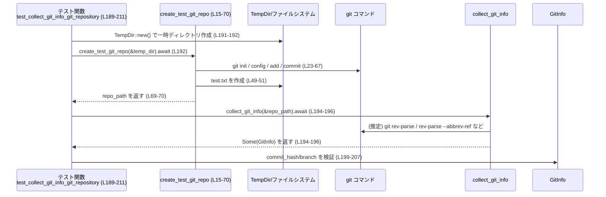
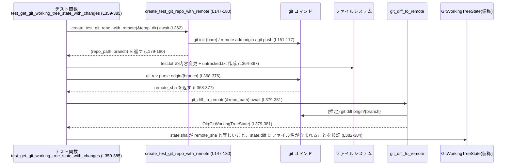

# core/src/git_info_tests.rs コード解説

## 0. ざっくり一言

Git リポジトリからコミット情報やブランチ、変更状態などを取得する `codex_git_utils` クレートの主要 API について、実際の Git コマンドを叩く統合テストをまとめたモジュールです（`GitInfo` のシリアライズ仕様も検証しています）。

---

## 1. このモジュールの役割

### 1.1 概要

- このモジュールは **Git 関連ユーティリティの公開 API が期待どおり動くことを検証する** ために存在します。
- 具体的には `codex_git_utils` の以下の関数・型の挙動を、実際の `git` コマンドを用いてテストします（根拠: `use` 群 `core/src/git_info_tests.rs:L1-7`）。
  - `recent_commits`
  - `collect_git_info`
  - `get_has_changes`
  - `git_diff_to_remote`
  - `resolve_root_git_project_for_trust`
  - `GitInfo`, `GitSha`

### 1.2 アーキテクチャ内での位置づけ

このファイルは **テスト専用モジュール** であり、本番ロジックは `codex_git_utils` クレート側にあります。テストでは一時ディレクトリ上に Git リポジトリを作成し、`tokio::process::Command` で `git` を呼び出して、ライブラリ関数の戻り値を検証します。

```mermaid
graph TD
    subgraph "core/src/git_info_tests.rs"
        T[テスト関数群<br/>(#[tokio::test], #[test])]
        H1[create_test_git_repo<br/>(L15-70)]
        H2[create_test_git_repo_with_remote<br/>(L147-180)]
    end

    subgraph "外部クレート"
        CGI[collect_git_info]
        RCM[recent_commits]
        GHC[get_has_changes]
        GDR[git_diff_to_remote]
        RRT[resolve_root_git_project_for_trust]
        GI[GitInfo / GitSha]
    end

    subgraph "環境"
        GitBin["git コマンド (tokio::process::Command)"]
        FS["一時ディレクトリ / TempDir"]
    end

    T --> H1
    T --> H2
    H1 --> GitBin
    H2 --> GitBin
    T --> CGI
    T --> RCM
    T --> GHC
    T --> GDR
    T --> RRT
    CGI --> GI
    GDR --> GI
    T --> FS
```

### 1.3 設計上のポイント

- **実 Git を使う統合テスト**  
  - 一時ディレクトリに `git init` し、コミット・ブランチ・リモート・worktree などを実際に作成しています（`create_test_git_repo`, `create_test_git_repo_with_remote`。根拠: `core/src/git_info_tests.rs:L15-70`, `L147-180`）。
- **非同期処理と Tokio**  
  - Git コマンド実行は `tokio::process::Command` + `.output().await` による非同期 I/O で行われます（例: `core/src/git_info_tests.rs:L24-30` など）。
  - 多くのテストは `#[tokio::test] async fn ...` として定義されています。
- **失敗時は panic させるテスト設計**  
  - テスト内のファイル操作や Git コマンドはほぼすべて `expect` / `unwrap` でラップされ、失敗時には即座にテストが失敗するようになっています。
- **API の「エラー表現」を重視**  
  - 非 Git ディレクトリに対する `None` 返却、ブランチが無い場合の `branch: None` など、Option / Result でのエラー表現がテストされています。
- **Git worktree や .git ファイルの解釈までカバー**  
  - `resolve_root_git_project_for_trust` のテストが、通常リポジトリ・worktree・`.git` ファイルによるポインタなど、さまざまな構成を確認しています（`core/src/git_info_tests.rs:L429-525`）。

---

## 2. 主要な機能一覧

ここでは、このテストモジュールが検証している **外部 API の機能** を列挙します。

- `recent_commits`: 指定ディレクトリの最新コミット情報を取得し、時系列降順で返す（根拠: `core/src/git_info_tests.rs:L79-145`）。
- `collect_git_info`: Git リポジトリからコミットハッシュ・ブランチ名・リポジトリ URL を収集する（根拠: `L189-211`, `L213-250`, `L252-303`）。
- `get_has_changes`: Git リポジトリに未コミットの変更があるかどうかを `Option<bool>` で返す（根拠: `L305-334`）。
- `git_diff_to_remote`: ローカル作業ツリーと追跡リモートとの差分を取得し、基準となる SHA と差分テキストを返す（根拠: `L336-357`, `L359-385`, `L387-427`, `L528-562`）。
- `resolve_root_git_project_for_trust`: 任意のパスから、その Git プロジェクトの「信頼すべきルートディレクトリ」を特定する。通常リポジトリと worktree の両方に対応（根拠: `L429-525`）。
- `GitInfo` の JSON シリアライズ仕様: `None` フィールドは JSON から省略され、`Some` の場合は `"commit_hash"`, `"branch"`, `"repository_url"` として出力される（根拠: `L564-581`, `L583-597`）。

### 2.1 関数 / テスト一覧（コンポーネントインベントリー）

このファイルで定義されている全関数の一覧です。

| 名称 | 種別 | 役割 / 用途 | 定義位置 |
|------|------|-------------|----------|
| `create_test_git_repo` | 非公開 async ヘルパ | 一時ディレクトリに単一ブランチの Git リポジトリを作成し、初回コミットまで行う | `core/src/git_info_tests.rs:L15-70` |
| `test_recent_commits_non_git_directory_returns_empty` | `#[tokio::test]` | 非 Git ディレクトリで `recent_commits` が空ベクタを返すことを確認 | `L72-77` |
| `test_recent_commits_orders_and_limits` | `#[tokio::test]` | 3 つのコミットが時系列降順・指定件数で返ることと SHA フォーマットを確認 | `L79-145` |
| `create_test_git_repo_with_remote` | 非公開 async ヘルパ | ローカルリポジトリと bare リモートを作り、現在ブランチを push する | `L147-180` |
| `test_collect_git_info_non_git_directory` | `#[tokio::test]` | 非 Git ディレクトリで `collect_git_info` が `None` を返すことを確認 | `L182-187` |
| `test_collect_git_info_git_repository` | `#[tokio::test]` | リポジトリで `collect_git_info` がコミットハッシュ・ブランチを返すことを確認 | `L189-211` |
| `test_collect_git_info_with_remote` | `#[tokio::test]` | リモート `origin` 付きリポジトリで `repository_url` が設定されることを確認 | `L213-250` |
| `test_collect_git_info_detached_head` | `#[tokio::test]` | detached HEAD 状態で `branch` が `None` になることを確認 | `L252-282` |
| `test_collect_git_info_with_branch` | `#[tokio::test]` | 新規作成したブランチ名が `branch` として返ることを確認 | `L284-303` |
| `test_get_has_changes_non_git_directory_returns_none` | `#[tokio::test]` | 非 Git ディレクトリで `get_has_changes` が `None` を返すことを確認 | `L305-309` |
| `test_get_has_changes_clean_repo_returns_false` | `#[tokio::test]` | クリーンなリポジトリで `Some(false)` を返すことを確認 | `L311-316` |
| `test_get_has_changes_with_tracked_change_returns_true` | `#[tokio::test]` | tracked ファイルを変更すると `Some(true)` になることを確認 | `L318-325` |
| `test_get_has_changes_with_untracked_change_returns_true` | `#[tokio::test]` | untracked ファイル追加でも `Some(true)` になることを確認 | `L327-334` |
| `test_get_git_working_tree_state_clean_repo` | `#[tokio::test]` | クリーンなリポジトリで `git_diff_to_remote` の SHA がリモートと一致し diff が空であることを確認 | `L336-357` |
| `test_get_git_working_tree_state_with_changes` | `#[tokio::test]` | tracked/untracked の変更が diff テキストに現れることを確認 | `L359-385` |
| `test_get_git_working_tree_state_branch_fallback` | `#[tokio::test]` | ローカルブランチがリモートに存在しない場合に `origin/feature` へのフォールバックが行われることを確認 | `L387-427` |
| `resolve_root_git_project_for_trust_returns_none_outside_repo` | `#[test]` | Git 管理外で `resolve_root_git_project_for_trust` が `None` を返すことを確認 | `L429-433` |
| `resolve_root_git_project_for_trust_regular_repo_returns_repo_root` | `#[tokio::test]` | 通常リポジトリとそのサブディレクトリから正しいルートが返ることを確認 | `L435-448` |
| `resolve_root_git_project_for_trust_detects_worktree_and_returns_main_root` | `#[tokio::test]` | `git worktree add` で作った worktree から元リポジトリのルートが返ることを確認 | `L450-477` |
| `resolve_root_git_project_for_trust_detects_worktree_pointer_without_git_command` | `#[test]` | `.git` ファイルに `gitdir: .../worktrees/...` と書かれた worktree ルートから元リポジトリが判定されることを確認 | `L480-505` |
| `resolve_root_git_project_for_trust_non_worktrees_gitdir_returns_none` | `#[test]` | `.git` ファイルが worktrees 以外を指す場合は `None` になることを確認 | `L507-525` |
| `test_get_git_working_tree_state_unpushed_commit` | `#[tokio::test]` | ローカルのみのコミットがある場合でも SHA はリモート基準で、diff にローカル変更が含まれることを確認 | `L527-562` |
| `test_git_info_serialization` | `#[test]` | `GitInfo` の全フィールドが Some のとき JSON にキーがすべて出ることを確認 | `L564-581` |
| `test_git_info_serialization_with_nones` | `#[test]` | `GitInfo` のフィールドが None のとき JSON から該当キーが省略されることを確認 | `L583-597` |

---

## 3. 公開 API と詳細解説

ここからは、このテストで検証されている **外部 API** を中心に説明します。型定義・実装本体はこのファイルには含まれないため、「テストから分かる事実」と「推測」を分けて記載します。

### 3.1 型一覧（構造体・列挙体など）

| 名前 | 種別 | 役割 / 用途 | 根拠 |
|------|------|-------------|------|
| `GitInfo` | 構造体（`codex_git_utils`） | コミットハッシュ・ブランチ名・リポジトリ URL を保持し、JSON シリアライズに対応 | `core/src/git_info_tests.rs:L564-570` |
| `GitSha` | 新しい型（おそらく `struct GitSha(String)` のようなラッパ） | SHA-1 などの Git ハッシュ値を表現する。`GitSha::new(&str)` コンストラクタがある | `L2`, `L355`, `L383`, `L426`, `L567` |
| （仮称）`RecentCommitEntry` | 構造体（型名は不明） | `recent_commits` が返す要素。`subject: String`, `sha: String` フィールドを持つ | `L136-144` |
| （仮称）`GitWorkingTreeState` | 構造体（型名は不明） | `git_diff_to_remote` が返す状態。`sha: GitSha`, `diff: String` のようなフィールドを持つ | `L352-356`, `L379-384`, `L423-426`, `L557-561` |

> 型名がコードに現れないものについては、説明の便宜上の仮称であり、実際の型名はこのチャンクからは分かりません。

#### `GitInfo` のフィールドとシリアライズ

テストから分かる `GitInfo` の構造:

- フィールド（`test_git_info_serialization` より、根拠: `L564-581`）
  - `commit_hash: Option<GitSha>`
  - `branch: Option<String>`
  - `repository_url: Option<String>`
- JSON シリアライズ時の挙動
  - `Some` の場合はそれぞれ `"commit_hash"`, `"branch"`, `"repository_url"` キーとして文字列で出力される（根拠: 比較 `parsed["commit_hash"] == "abc123def456"` など `L575-580`）。
  - `None` の場合、そのキー自体が JSON から省略される（根拠: `parsed.as_object().unwrap().contains_key("...")` が false であることを確認 `L594-597`）。

### 3.2 関数詳細（主要 API、最大 7 件）

ここからは `codex_git_utils` に属する関数について、テストから読み取れる仕様を整理します。

#### `recent_commits(path, limit) -> Vec<RecentCommitEntry>`

**概要**

- 指定パスが Git リポジトリなら、最新コミットを時系列の降順（新しい順）で最大 `limit` 件返します。
- Git 管理外のディレクトリでは空ベクタを返します（根拠: `core/src/git_info_tests.rs:L72-77`）。

**引数**

| 引数名 | 型（推定） | 説明 |
|--------|-----------|------|
| `path` | `impl AsRef<Path>` または `&Path` | Git リポジトリのルートまたはその内部を指すパス。非リポジトリ可。テストでは `TempDir::path()` とリポジトリルートを渡している（`L72-76`, `L85-87`, `L136-137`）。 |
| `limit` | `usize` | 取得するコミットの最大件数（例: `10`, `3`。根拠: `L75`, `L136`）。 |

**戻り値**

- 型: `Vec<RecentCommitEntry>`（仮称）
- 各要素は以下のフィールドを持ちます（根拠: `L136-144`）。
  - `subject: String` — コミットメッセージのサマリ
  - `sha: String` — コミット SHA（7 文字以上の 16 進文字列であることをテスト）

**内部処理の流れ（テストから分かる範囲）**

1. `path` が Git リポジトリかどうかを判定し、そうでない場合は空ベクタを返す。（根拠: 非 Git ディレクトリで `entries.is_empty()` `L72-77`）
2. リポジトリの場合、コミットログから `limit` 件までのコミットを取得する。
3. 新しいコミットが先頭になるように降順で並べる（テストでは 1 秒以上の間隔でコミットを作成し、`["third", "second", "first"]` の順で返ることを確認している `L88-140`）。
4. 各コミットから subject と短い SHA（7 文字以上）を抽出してエントリに格納する（`L136-144`）。

> 実際に `git log` を使っているか、libgit2 などを使っているかはこのファイルには現れません。

**Examples（使用例）**

テストから簡略化した使用例です。

```rust
use codex_git_utils::recent_commits;
use std::path::Path;

// 非同期コンテキスト内
let commits = recent_commits(Path::new("."), 5).await;

for c in commits {
    println!("{} {}", &c.sha, &c.subject);
}
```

**Errors / Panics**

- テストからは `recent_commits` 自体が `Result` を返すのかは分かりません。
  - `let entries = recent_commits(...).await;` としか書かれておらず、`expect` などでアンラップしていないため、戻り値は「エラーを含まない型（Vec）」か、内部でエラーを丸めていると考えられます（根拠: `L75`, `L136`）。
- 非 Git ディレクトリに対しては panic せず、空ベクタを返すことがテストされています（`L72-77`）。

**Edge cases（エッジケース）**

- 非 Git ディレクトリ: 空ベクタ（`is_empty()`）を返す（`L72-77`）。
- コミットが 3 件以上存在: 指定 `limit` = 3 のとき、最新 3 件だけが返る（`L88-140`）。
- コミット時刻が異なる: 作成順 `first`, `second`, `third` に対して返却順が `third`, `second`, `first` であることから、時刻降順でソートされていると分かります（`L88-140`）。
- SHA: 各 SHA は長さ 7 以上の ASCII 16 進文字列である（`L142-144`）。

**使用上の注意点**

- 呼び出しは `async` 文脈内で行う必要があります（`.await` が必要。`L75`）。
- ログ件数が多い大型リポジトリでは、`limit` を小さくすることでパフォーマンス負荷を抑えられる可能性があります（テストでは 3〜10 程度）。

---

#### `collect_git_info(path) -> Option<GitInfo>`

**概要**

- 指定パスが Git リポジトリであれば、コミットハッシュ・ブランチ名・リポジトリ URL をまとめて返します。
- 非 Git ディレクトリでは `None` を返します（根拠: `core/src/git_info_tests.rs:L182-187`）。

**引数**

| 引数名 | 型（推定） | 説明 |
|--------|-----------|------|
| `path` | `impl AsRef<Path>` または `&Path` | Git リポジトリのルートまたはその内部パス。 |

**戻り値**

- 型: `impl Future<Output = Option<GitInfo>>`（テストでは `.await` して `Option<GitInfo>` を得ています。`L184-196`, `L215-233`）
- `Some(GitInfo)`:
  - `commit_hash: Some(GitSha)`
    - SHA-1 形式の 40 文字 16 進文字列であることをテスト（`L199-202`）。
  - `branch: Some(String)` または `None`
    - 通常状態では `"main"` または `"master"`（`L205-207`）。
    - detached HEAD の場合 `None`（`L278-281`）。
    - 新しいブランチを checkout した場合、そのブランチ名（`"feature-branch"`）が入る（`L289-302`）。
  - `repository_url: Option<String>`
    - リモートがないローカルリポジトリでは `None` であってよい（コメント `L209-210`）。
    - `origin` が設定されている場合、`git remote get-url origin` と同じ文字列が入っている（`L218-249`）。
- `None`:
  - 非 Git ディレクトリの場合（`L182-187`）。

**内部処理の流れ（推測を含む）**

1. `path` が Git リポジトリかどうかを判定し、非リポジトリの場合 `None` を返す（`L182-187`）。
2. HEAD のコミット SHA を取得し、SHA-1 40 文字として `GitSha` に格納する（`L199-202`）。
3. `rev-parse --abbrev-ref HEAD` などを用いてブランチ名を取得。
   - 結果が `"HEAD"`（detached HEAD）の場合は `branch: None` にする（`L252-281`）。
4. `git remote get-url origin` などからリポジトリ URL を取得。
   - リモートがない場合は `repository_url: None` にする。
   - 実際の URL は環境によって書き換えられる可能性があるため、テストでは `git` が報告する値と比較している（`L235-249`）。

> 実際にどの Git コマンドやライブラリを呼んでいるかはこのファイルからは分かりません。

**Examples（使用例）**

```rust
use codex_git_utils::collect_git_info;

let repo_root = std::env::current_dir()?;

// async コンテキスト内
if let Some(info) = collect_git_info(&repo_root).await {
    if let Some(sha) = info.commit_hash {
        println!("Commit: {}", sha.0); // 実際にフィールド公開かどうかは不明
    }
    if let Some(branch) = info.branch {
        println!("Branch: {}", branch);
    }
    if let Some(url) = info.repository_url {
        println!("Remote: {}", url);
    }
}
```

**Errors / Panics**

- テストからは `collect_git_info` が `Result` ではなく、エラー時に `None` にフォールバックしているように見えます（`L184-187` で `await` 直後に `is_none()` を確認している）。
- 非 Git ディレクトリで panic しないことは確認されています。
- Git コマンドの失敗がどのように扱われるかはこのファイルには現れません。

**Edge cases**

- 非 Git ディレクトリ: `None`（`L182-187`）。
- detached HEAD: `branch: None`（`L252-281`）。
- ブランチを切り替えた場合: `branch` に新ブランチ名が反映される（`L284-303`）。
- リモート無し: `repository_url` が `None` のままでよい（コメント `L209-210`）。
- リモート有り: 実際の `git remote get-url origin` の値がそのまま `repository_url` に入る（`L218-249`）。

**使用上の注意点**

- `collect_git_info` は `async` 関数であり、Tokio などのランタイム上で `.await` する必要があります（`#[tokio::test]` から呼び出している `L182-211`）。
- detached HEAD 状態では `branch: None` になることに依存したロジックを書く場合、忘れずに `Option` を扱う必要があります。

---

#### `get_has_changes(path) -> Option<bool>`

**概要**

- 指定ディレクトリが Git リポジトリであれば、未コミットの変更（staged/unstaged、tracked/untracked を含む）が存在するかを `Some(true/false)` で返します。
- 非 Git ディレクトリでは `None` を返します（`core/src/git_info_tests.rs:L305-309`）。

**引数**

| 引数名 | 型（推定） | 説明 |
|--------|-----------|------|
| `path` | `impl AsRef<Path>` または `&Path` | Git リポジトリまたは任意のディレクトリ。 |

**戻り値**

- 型: `impl Future<Output = Option<bool>>`
- 意味:
  - `None`: Git 管理下ではない（`L305-309`）。
  - `Some(false)`: Git リポジトリだが、変更なし（`L311-316`）。
  - `Some(true)`: Git リポジトリで、変更あり（tracked の変更または untracked ファイル。`L318-334`）。

**内部処理の流れ（テストから分かる範囲）**

1. `path` が Git リポジトリか判定。そうでなければ `None` を返す（`L305-309`）。
2. `git status` に相当する情報から、
   - tracked ファイルの変更（例: `test.txt` を上書き `L323`）
   - untracked ファイルの追加（例: `new_file.txt` を作成 `L332`）
   を検出し、どちらかでも存在すれば `Some(true)` を返します（`L323-325`, `L332-333`）。
3. 変更が一切ない場合は `Some(false)`（`L311-316`）。

**Examples（使用例）**

```rust
use codex_git_utils::get_has_changes;

let repo_path = std::env::current_dir()?;

// async コンテキスト内
match get_has_changes(&repo_path).await {
    None => println!("Not a git repo"),
    Some(true) => println!("Repo has uncommitted changes"),
    Some(false) => println!("Repo is clean"),
}
```

**Errors / Panics**

- 非 Git ディレクトリでも panic せず `None` を返すことが確認されています（`L305-309`）。
- Git コマンドエラー時の挙動はこのファイルからは不明です。

**Edge cases**

- 非 Git ディレクトリ: `None`。
- クリーンリポジトリ: `Some(false)`（`L311-316`）。
- tracked ファイル変更: `Some(true)`（`L318-325`）。
- untracked ファイル追加: `Some(true)`（`L327-334`）。
- staged だがコミットしていない変更も「変更あり」とみなしているかはテストからは直接は分かりません（tracked の上書きケース `L323` はステージングせずに検知しているように見えます）。

**使用上の注意点**

- 戻り値が `Option<bool>` であるため、「Git リポジトリかどうか」と「変更があるかどうか」が同一の戻り値にエンコードされています。呼び出し側は `None` と `Some(false)` を区別する必要があります。

---

#### `git_diff_to_remote(path) -> Result<GitWorkingTreeState, E>`

**概要**

- ローカル作業ツリーと「追跡しているリモートブランチ」の差分状態を取得します。
- テストからは、少なくとも以下を含む状態が返ることが分かります（`core/src/git_info_tests.rs:L352-356`, `L379-384`）。
  - `sha: GitSha` — 基準となるリモートのコミット SHA。
  - `diff: String` — tracked/untracked 変更を含む差分テキスト。

**引数**

| 引数名 | 型（推定） | 説明 |
|--------|-----------|------|
| `path` | `impl AsRef<Path>` または `&Path` | Git リポジトリのパス。リモートが設定されている必要がある（テストでは `create_test_git_repo_with_remote` を常に使う `L336-340`, `L361-363`, `L528-531`）。 |

**戻り値**

- 型（推定）:
  - `impl Future<Output = Result<GitWorkingTreeState, E>>`
  - テストでは `.await.expect("Should collect working tree state")` として利用されているため、`Result` を返すことが分かります（`L352-354`, `L379-381`, `L423-425`, `L557-559`）。
- `GitWorkingTreeState`（仮称）のフィールド（テストから分かる部分）
  - `sha: GitSha`
    - 追跡リモートの SHA と一致する（`origin/{branch}` や `origin/feature` など `L341-350`, `L368-377`, `L412-421`, `L532-541`, `L355`, `L382`, `L426`, `L560`）。
  - `diff: String`
    - クリーンな場合は空文字列または空に相当する値（`state.diff.is_empty()` `L356`）。
    - tracked/untracked の変更がある場合、それらのパスや内容を含む（`state.diff.contains("test.txt")`, `"untracked.txt"`, `"updated"` `L383-384`, `L561`）。

**内部処理の流れ（テストから分かる範囲）**

1. 現在ブランチの追跡リモートを特定し、その SHA を取得する。
   - シンプルケース: `origin/{branch}`（`L341-350`, `L368-377`, `L532-541`）。
   - ブランチフォールバックケース: ローカルブランチがリモートを追跡していない場合、`origin/feature` のような別ブランチにフォールバック（`L387-421`, 特に `rev-parse origin/feature`）。
2. リモート SHA を `state.sha` として格納。
3. ローカル作業ツリーとリモートの差分を計算し、テキスト形式で `state.diff` に格納。
   - コミット済みだが未 push の変更: diff に内容が含まれる（`"updated"` を含むことを確認 `L543-561`）。
   - tracked ファイルの変更・untracked ファイルの追加: diff にファイル名が含まれる（`L364-367`, `L383-384`）。

**Examples（使用例）**

```rust
use codex_git_utils::git_diff_to_remote;

let repo_path = std::env::current_dir()?;

// async コンテキスト内
let state = git_diff_to_remote(&repo_path).await?; // Result を ? で伝播

println!("Remote SHA: {:?}", state.sha);
if state.diff.is_empty() {
    println!("Working tree is clean relative to remote");
} else {
    println!("Diff:\n{}", state.diff);
}
```

**Errors / Panics**

- テスト内では常に `.expect("Should collect working tree state")` でアンラップしているため、エラーケース（例: リモートがない、リポジトリでない）の挙動はこのファイルには現れません。
- エラー時には `Err(E)` となると考えられますが、具体的なエラー型 `E` は不明です。

**Edge cases**

- クリーンなリポジトリ + リモート同期済み: `sha` がリモートの SHA と一致し、`diff` は空（`L336-357`）。
- tracked/untracked 変更あり: `sha` はなおリモートの SHA（ローカル未 push コミットがあっても変わらない）で、`diff` に変更内容が含まれる（`L359-385`, `L528-562`）。
- ブランチフォールバック:
  - ローカル `local-branch` がリモートに存在しないが、`origin/feature` が存在する場合、`state.sha` には `origin/feature` の SHA が入る（`L387-427`）。
- 非 Git ディレクトリ / リモート無しの場合の挙動はこのファイルではテストされておらず不明です。

**使用上の注意点**

- ローカル HEAD SHA ではなく、**リモート側の SHA を返す** ことに依存した設計になっている点に注意が必要です（未 push コミットがある場合でも `sha` はリモートを指す。`L528-562`）。
- ブランチフォールバックの仕様を前提にする場合、どのようなルールでフォールバックするのか（追跡ブランチ / upstream 設定など）は `codex_git_utils` 側の実装とドキュメントを確認する必要があります。

---

#### `resolve_root_git_project_for_trust(path) -> Option<PathBuf>`

**概要**

- 任意のパスから、信頼できる Git プロジェクトの「ルートディレクトリ」を特定します。
- 通常の `.git` ディレクトリ構成だけでなく、`git worktree` による複数ワークツリーや、`.git` が `gitdir:` で別ディレクトリを指す構成にも対応します。

**引数**

| 引数名 | 型 | 説明 |
|--------|----|------|
| `path` | `&Path` | 任意のファイル/ディレクトリパス。リポジトリ内部か、ワークツリー内部か、Git 管理外かが混ざる可能性があります。 |

**戻り値**

- `Option<PathBuf>`
  - `Some(root)`:
    - 通常リポジトリのルート。（`repo_path` とそのサブディレクトリから呼び出して同じ `root` が返る `L435-448`）。
    - worktree のルートから呼び出しても、**元リポジトリのルート** が返る（`L450-477`）。
    - `.git` ファイルに `gitdir: .../worktrees/...` と書かれた worktree ルートやそのサブディレクトリから呼び出した場合も同様（`L480-505`）。
  - `None`:
    - Git 管理外のパス（`L429-433`）。
    - `.git` ファイルが worktrees 以外の場所を指している場合（`L507-525`）。

**内部処理の流れ（テストから分かる範囲）**

1. `path` から親ディレクトリを遡りつつ `.git` を探す。
   - 見つからなければ `None`（`L429-433`）。
2. `.git` がディレクトリの場合:
   - 通常のリポジトリとして、そのディレクトリをルートと見なす（`L435-448`）。
3. `.git` がファイルの場合:
   - 内容を読み、`gitdir: ...` で指しているディレクトリを解析する。
   - パスに `/worktrees/` が含まれる場合、それを「worktree ポインタ」と見なし、**元リポジトリの `.git` の一つ上のディレクトリ**をルートとみなす（`L480-505`）。
   - そうでない場合（`gitdir` が任意の場所を指すが `worktrees` ではない場合）は `None` を返す（`L507-525`）。
4. worktree の場合、`git` コマンドを使わなくても `.git` ファイルからポインタを解釈してルートを見つけられることをテストしています（コメントと挙動より `L480-505`）。

**Examples（使用例）**

```rust
use codex_git_utils::resolve_root_git_project_for_trust;

let path = std::env::current_dir()?;
if let Some(root) = resolve_root_git_project_for_trust(&path) {
    println!("This file belongs to git project at {}", root.display());
} else {
    println!("Not inside a trusted git project");
}
```

**Errors / Panics**

- 非 Git ディレクトリ・不正な `.git` ファイルに対しても panic せず `None` を返すことが確認されています（`L429-433`, `L507-525`）。
- `.git` ファイルのフォーマットが完全に壊れている場合の挙動はこのファイルには現れません。

**Edge cases**

- 通常リポジトリ:
  - リポジトリ直下とネストしたサブディレクトリから同じルートが返る（`L435-448`）。
- worktree:
  - `git worktree add` で作ったディレクトリ（`wt_root`）とそのサブディレクトリ（`nested/sub`）から、元リポジトリのルートが返る（`L450-477`）。
  - `.git` がファイルで `gitdir: <repo_root>/.git/worktrees/<name>` と書かれている構成でも同様（`L480-505`）。
- 不正な `.git` ファイル:
  - `gitdir: <some/other/location>` のように `worktrees` 以外を指す場合は `None`（`L507-525`）。

**使用上の注意点**

- この関数は「信頼境界（trusted root）」判定に使われることが名前から推測されますが、セキュリティポリシー（どのパスを信頼するか）は利用側で慎重に設計する必要があります。
- `.git` のフォーマットに依存しているため、Git の仕様変更や特殊な実装には影響を受ける可能性があります。

---

#### `GitInfo` とシリアライズ

関数ではありませんが、利用頻度が高いので簡単にまとめます。

**概要**

- Git のメタ情報（コミットハッシュ、ブランチ、リポジトリ URL）をまとめたデータ構造で、`serde` を用いた JSON シリアライズに対応しています（`L564-581`）。

**フィールド**

| フィールド名 | 型 | 説明 | 根拠 |
|-------------|----|------|------|
| `commit_hash` | `Option<GitSha>` | 現在 HEAD のコミットハッシュ。`Some` の場合のみ JSON に `"commit_hash"` キーが出力される | `L566-567`, `L575`, `L594-595` |
| `branch` | `Option<String>` | 現在のブランチ名。detached HEAD の場合 `None` | `L568`, `L576`, `L205-207`, `L278-281`, `L302` |
| `repository_url` | `Option<String>` | `origin` の URL など、リポジトリのリモート URL | `L569-570`, `L577-580`, `L213-249` |

**シリアライズ仕様**

- `Some` の場合: 文字列として JSON に出力（`L575-580`）。
- `None` の場合: キー自体が JSON から省略される（`L594-597`）。

---

### 3.3 その他の関数（テストヘルパ・テスト関数）

すでに 2.1 のインベントリーで列挙したため、ここでは **代表的なヘルパ関数のみ** 役割を補足します。

| 関数名 | 役割（1 行） | 根拠 |
|--------|--------------|------|
| `create_test_git_repo` | 一時ディレクトリに `git init` し、ユーザ設定と初回コミットまでを行う共通ヘルパ | `core/src/git_info_tests.rs:L15-70` |
| `create_test_git_repo_with_remote` | `create_test_git_repo` に加えて bare リモートの初期化・`origin` 追加・初回 push まで行うヘルパ | `L147-180` |

---

## 4. データフロー

### 4.1 `collect_git_info` を使うテストのデータフロー

`test_collect_git_info_git_repository (L189-211)` における処理の流れです。



要点:

- テストは実際のファイルシステムと `git` コマンドを通じてリポジトリを構築し、その上で API を呼び出しています。
- `collect_git_info` は Git コマンドを内部で呼んでいると推測されますが、詳細はこのファイルには書かれていません。

### 4.2 `git_diff_to_remote` を使うテストのデータフロー

`test_get_git_working_tree_state_with_changes (L359-385)` を例にします。



要点:

- `git_diff_to_remote` は、**ローカル HEAD ではなくリモート SHA** を選択していることがテストから分かります。
- 変更内容（tracked/untracked）は diff テキストに含まれている必要があります。

---

## 5. 使い方（How to Use）

このファイル自体はテストですが、テストコードは公開 API の具体的な利用例になっています。

### 5.1 基本的な使用方法

`collect_git_info` と `get_has_changes` を組み合わせて、リポジトリの状態を表示する例です。

```rust
use codex_git_utils::{collect_git_info, get_has_changes};
use std::path::Path;

#[tokio::main]
async fn main() -> anyhow::Result<()> {
    let repo = Path::new(".");

    if let Some(info) = collect_git_info(repo).await {
        if let Some(hash) = info.commit_hash {
            // GitSha の内部表現はこのファイルからは不明なので、Display 実装がある前提
            println!("Commit: {}", hash);
        }
        if let Some(branch) = info.branch {
            println!("Branch: {}", branch);
        }
        if let Some(url) = info.repository_url {
            println!("Remote: {}", url);
        }
    } else {
        println!("Not a git repository");
        return Ok(());
    }

    match get_has_changes(repo).await {
        None => println!("Not a git repo (unexpected)"),
        Some(true) => println!("Working tree has uncommitted changes"),
        Some(false) => println!("Working tree is clean"),
    }

    Ok(())
}
```

### 5.2 よくある使用パターン

- **CI でのメタ情報埋め込み**
  - `collect_git_info` を使って、ビルド成果物にコミットハッシュやブランチ名、リモート URL を埋め込む。
- **安全な「変更あり判定」**
  - `get_has_changes` で `Some(true)` なら「dirty」、`Some(false)` なら「clean」、`None` なら「Git 管理外」として扱う。
- **リモート基準の差分確認**
  - `git_diff_to_remote` を使って、「リモートに push されていない差分」をまとめてテキストで得る。

### 5.3 よくある間違い

テストから見える、誤用しがちなポイントと正しい使い方を対比します。

```rust
use codex_git_utils::{collect_git_info, get_has_changes};

// 間違い例: None を考慮していない
async fn wrong(path: &std::path::Path) {
    // 非 Git ディレクトリだと .unwrap() でパニックする可能性
    let info = collect_git_info(path).await.unwrap(); // ❌
    println!("{:?}", info.branch.unwrap()); // ❌
}

// 正しい例: Option をしっかり扱う
async fn correct(path: &std::path::Path) {
    if let Some(info) = collect_git_info(path).await {
        if let Some(branch) = info.branch {
            println!("On branch {branch}");
        } else {
            println!("Detached HEAD");
        }
    } else {
        println!("Not a git repo");
    }

    match get_has_changes(path).await {
        None => println!("Not a git repo"),
        Some(true) => println!("Changes present"),
        Some(false) => println!("No changes"),
    }
}
```

### 5.4 使用上の注意点（まとめ）

- 非 Git ディレクトリへの呼び出しで panic しないよう、`Option`/`Result` を丁寧にハンドリングする必要があります。
- `git_diff_to_remote` の `sha` は「ローカル HEAD」ではなく「リモート SHA」であることを前提にしたコードを書くべきです（テスト `L528-562`）。
- すべての非同期関数は Tokio などのランタイム上で `.await` する必要があります（テストが `#[tokio::test]` になっていることから分かります `L72`, `L79` 他）。

---

## 6. 変更の仕方（How to Modify）

### 6.1 新しい機能を追加する場合（テスト観点）

- `codex_git_utils` に新しい Git 関連 API を追加した場合:
  1. このファイルか近傍に **統合テスト** を追加し、TempDir + `git` コマンドで実際の挙動を検証するのが一貫したスタイルです。
  2. 既存ヘルパ `create_test_git_repo` / `create_test_git_repo_with_remote` を再利用することで、初期リポジトリ構築の重複を避けられます（`L15-70`, `L147-180`）。
  3. リモートや worktree を伴う機能の場合は、`resolve_root_git_project_for_trust` 周辺のテスト（`L450-505`）を参考にシナリオを構成できます。

### 6.2 既存の機能を変更する場合（契約と影響範囲）

- `recent_commits`
  - 非 Git ディレクトリで空ベクタを返す契約（`L72-77`）。
  - コミット順序・件数制限（`L79-145`）。
- `collect_git_info`
  - `commit_hash` が 40 桁 SHA-1 であること（`L199-202`）。
  - detached HEAD 時の `branch: None`（`L252-281`）。
  - `repository_url` が実際の `git remote get-url origin` と一致すること（`L235-249`）。
- `get_has_changes`
  - 非リポジトリで `None`、クリーンで `Some(false)`, 変更ありで `Some(true)` の 3 状態（`L305-334`）。
- `git_diff_to_remote`
  - `sha` がリモート SHA である点と、diff に tracked/untracked/未 push コミットの変更が現れる点（`L336-357`, `L359-385`, `L528-562`）。
- `resolve_root_git_project_for_trust`
  - 通常リポジトリ・worktree・`.git` ファイルポインタそれぞれの挙動（`L429-525`）。

これらの契約を変更する場合は、対応するテストを更新し、新旧挙動の違いを明確にする必要があります。

---

## 7. 関連ファイル

| パス / クレート | 役割 / 関係 |
|----------------|------------|
| `codex_git_utils::GitInfo` | Git メタ情報を保持する構造体。本テストファイルがシリアライズ仕様・フィールドの意味を検証しています（`L564-597`）。 |
| `codex_git_utils::GitSha` | Git ハッシュ値ラッパ。本テストでは SHA の長さ・フォーマットなどを間接的に検証しています（`L199-202`, `L355`, `L382`, `L426`, `L567`）。 |
| `codex_git_utils::collect_git_info` | Git リポジトリのメタ情報収集 API。複数のテストケースで分岐挙動（非リポジトリ・detached HEAD・ブランチ・リモート）を検証しています（`L182-303`）。 |
| `codex_git_utils::recent_commits` | コミット履歴 API。非リポジトリとリポジトリ内での返却値・順序をテストしています（`L72-145`）。 |
| `codex_git_utils::get_has_changes` | 作業ツリーの変更有無 API。非リポジトリ・クリーン・tracked/untracked 変更をカバーしています（`L305-334`）。 |
| `codex_git_utils::git_diff_to_remote` | リモートとの差分 API。クリーン/変更/ブランチフォールバック/未 push コミットのシナリオをテストしています（`L336-357`, `L359-385`, `L387-427`, `L528-562`）。 |
| `codex_git_utils::resolve_root_git_project_for_trust` | Git プロジェクトのルート検出 API。通常リポジトリ・worktree・`.git` ファイルポインタ・不正構成を網羅したテストがあります（`L429-525`）。 |
| `core_test_support::skip_if_sandbox` | サンドボックス環境では実行すべきでないテスト（`recent_commits` のタイムスタンプ依存テスト）をスキップするマクロ（`L79-83`）。 |

このモジュールは、Git 関連 API の仕様を **実 Git を用いた統合テスト** として明文化している位置づけにあり、挙動を理解する際の準公式なドキュメントとしても利用できます。
