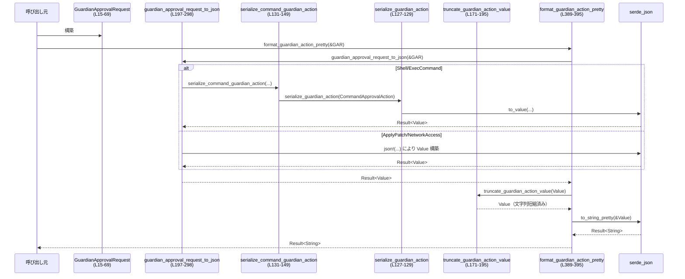

# core/src/guardian/approval_request.rs コード解説

## 0. ざっくり一言

`GuardianApprovalRequest` という「ガーディアン承認が必要な操作」を表す列挙体と、それを  

- JSON にシリアライズする処理  
- プロトコル用の `GuardianAssessmentAction` に変換する処理  

をまとめたモジュールです（core/src/guardian/approval_request.rs:L15-69, L197-359）。

---

## 1. このモジュールの役割

### 1.1 概要

このモジュールは **ガーディアンに承認を求める各種アクション**（シェル実行、exec、パッチ適用、ネットワークアクセス、MCPツール呼び出し）を一つの列挙体で表現し、それを:

- ガーディアン用の **JSON アクション表現**（LLM/フロントエンド向け）に変換する  
- プロトコル層の **`GuardianAssessmentAction`** に変換する  

ためのユーティリティを提供します（core/src/guardian/approval_request.rs:L15-69, L197-359）。

### 1.2 アーキテクチャ内での位置づけ

このモジュールは「ガーディアン要求ドメインオブジェクト」と「外部プロトコル／表示用フォーマット」の間の変換層として位置づけられます。

```mermaid
graph TD
    GAR[GuardianApprovalRequest enum<br/>(L15-69)]
    GAA[guardian_assessment_action<br/>(L300-359)]
    GAJ[guardian_approval_request_to_json<br/>(L197-298)]
    GPRETTY[format_guardian_action_pretty<br/>(L389-395)]
    TRUNC[truncate_guardian_action_value<br/>(L171-195)]
    SCA[serialize_command_guardian_action<br/>(L131-149)]
    SGA[serialize_guardian_action<br/>(L127-129)]
    PROTO[GuardianAssessmentAction<br/>(codex_protocol::approvals)]
    SJ[serde_json (to_value/to_string_pretty)]
    SHLEX[shlex_join<br/>(codex_shell_command::parse_command)]
    TRUNC_TEXT[guardian_truncate_text<br/>(super::prompt)]

    GAR --> GAJ
    GAR --> GAA
    GAJ --> SCA
    SCA --> SGA
    GAJ --> SGA
    GAA --> PROTO
    GAJ --> SJ
    GPRETTY --> GAJ
    GPRETTY --> TRUNC
    TRUNC --> TRUNC_TEXT
    GAJ -->|command text| SHLEX
    GPRETTY --> SJ
```

- 入力は `GuardianApprovalRequest`（L15-69）  
- プロトコル層への出力は `GuardianAssessmentAction`（外部 crate）  
- 表示／LLM入力向けの出力は JSON (`serde_json::Value` / pretty 文字列)  
- 文字列は `guardian_truncate_text` でトークン数ベースにトリミングされます（L171-176）

### 1.3 設計上のポイント

コードから読み取れる設計上の特徴は次のとおりです。

- **単一のドメイン列挙体**  
  - すべてのガーディアン承認対象の操作を `GuardianApprovalRequest` 1 つで表現（L15-69）。
- **変換関数による責務分離**
  - JSON への変換: `guardian_approval_request_to_json`（L197-298）
  - プロトコルアクションへの変換: `guardian_assessment_action`（L300-359）
  - 表示向けの整形 + トリミング: `format_guardian_action_pretty` + `truncate_guardian_action_value`（L171-195, L389-395）
- **ヘルパー構造体で JSON 形状を明示**
  - `CommandApprovalAction`, `ExecveApprovalAction`, `McpToolCallApprovalAction` で JSON の形を定義（L81-93, L95-104, L106-125）。
- **エラーハンドリング**
  - JSON 変換は `serde_json::Result` を返し、呼び出し元にエラーを伝播（L127-129, L197-298, L389-395）。
  - `?` 演算子でエラーを早期リターン（L392）。
- **状態レス & スレッド安全な設計**
  - すべての関数は引数のみを読み取り、グローバル状態や可変静的変数には触れません（L127-395）。
  - 共有可変状態がないため、同じ `GuardianApprovalRequest` を複数スレッドから同時に変換してもデータ競合は発生しません。

### 1.4 コンポーネント一覧（型・関数インベントリ）

| 名前 | 種別 | 公開度 | 定義位置 | 役割 |
|------|------|--------|----------|------|
| `GuardianApprovalRequest` | enum | `pub(crate)` | core/src/guardian/approval_request.rs:L15-69 | ガーディアン承認が必要な操作を表すドメイン列挙体 |
| `GuardianMcpAnnotations` | struct | `pub(crate)` | L71-79 | MCP ツール呼び出しに関するヒント（破壊的か／オープンワールドか／読み取り専用か） |
| `CommandApprovalAction<'a>` | struct | private | L81-93 | シェル／exec コマンド用の JSON シリアライズ形状 |
| `ExecveApprovalAction<'a>` | struct | private (cfg(unix)) | L95-104 | `execve` 用 JSON シリアライズ形状 |
| `McpToolCallApprovalAction<'a>` | struct | private | L106-125 | MCP ツール呼び出しの JSON シリアライズ形状 |
| `serialize_guardian_action` | fn | private | L127-129 | 任意の `Serialize` 実装を `serde_json::Value` に変換 |
| `serialize_command_guardian_action` | fn | private | L131-149 | コマンド系アクションを共通 JSON 形式に変換 |
| `command_assessment_action` | fn | private | L151-161 | コマンド系リクエストを `GuardianAssessmentAction::Command` に変換 |
| `guardian_command_source_tool_name` | fn | private (cfg(unix)) | L163-169 | `GuardianCommandSource` を `"shell"` / `"exec_command"` の文字列にマップ |
| `truncate_guardian_action_value` | fn | private | L171-195 | JSON ツリー全体の文字列をトークン数上限までトリミング |
| `guardian_approval_request_to_json` | fn | `pub(crate)` | L197-298 | `GuardianApprovalRequest` をガーディアン用 JSON 表現に変換 |
| `guardian_assessment_action` | fn | `pub(crate)` | L300-359 | `GuardianApprovalRequest` を `GuardianAssessmentAction` の各バリアントに変換 |
| `guardian_request_target_item_id` | fn | `pub(crate)` | L362-371 | リクエストに付随する「対象アイテムID」（あれば）を取り出す |
| `guardian_request_turn_id` | fn | `pub(crate)` | L374-386 | リクエストに紐づく turn_id（なければデフォルト）を選択 |
| `format_guardian_action_pretty` | fn | `pub(crate)` | L389-395 | JSON 変換 + トリミング + 整形した文字列を返す |

---

## 2. 主要な機能一覧

- ガーディアン承認リクエストのモデリング: `GuardianApprovalRequest` で各種操作を表現（L15-69）
- MCP ツール呼び出しのヒント情報の保持: `GuardianMcpAnnotations`（L71-79）
- ガーディン向け JSON アクションへの変換: `guardian_approval_request_to_json`（L197-298）
- ガーディアン評価アクション（プロトコルオブジェクト）への変換: `guardian_assessment_action`（L300-359）
- 文字列長を制限した JSON pretty 文字列の生成: `format_guardian_action_pretty` + `truncate_guardian_action_value`（L171-195, L389-395）
- リクエストに紐づくターゲットID／turn ID の抽出: `guardian_request_target_item_id`, `guardian_request_turn_id`（L362-371, L374-386）

---

## 3. 公開 API と詳細解説

### 3.1 型一覧（構造体・列挙体など）

#### `GuardianApprovalRequest`（L15-69）

| バリアント | フィールド | 説明 |
|-----------|-----------|------|
| `Shell` | `id: String` | リクエスト識別子 |
|  | `command: Vec<String>` | 実行するシェルコマンド（argv 形式） |
|  | `cwd: PathBuf` | 実行時のカレントディレクトリ |
|  | `sandbox_permissions: SandboxPermissions` | サンドボックス権限設定 |
|  | `additional_permissions: Option<PermissionProfile>` | 追加権限プロファイル |
|  | `justification: Option<String>` | ユーザーによる説明文 |
| `ExecCommand` | `id: String` | リクエスト識別子 |
|  | `command: Vec<String>` | 実行コマンド |
|  | `cwd: PathBuf` | カレントディレクトリ |
|  | `sandbox_permissions: SandboxPermissions` | サンドボックス権限 |
|  | `additional_permissions: Option<PermissionProfile>` | 追加権限 |
|  | `justification: Option<String>` | 説明文 |
|  | `tty: bool` | TTY を割り当てるかどうか |
| `Execve` (cfg(unix)) | `id: String` | リクエスト識別子 |
|  | `source: GuardianCommandSource` | コマンドの起点 (`Shell`/`UnifiedExec`) |
|  | `program: String` | 実行ファイルパス |
|  | `argv: Vec<String>` | 引数リスト |
|  | `cwd: PathBuf` | カレントディレクトリ |
|  | `additional_permissions: Option<PermissionProfile>` | 追加権限 |
| `ApplyPatch` | `id: String` | リクエスト識別子 |
|  | `cwd: PathBuf` | パッチ適用対象のベースディレクトリ |
|  | `files: Vec<AbsolutePathBuf>` | 影響を受けるファイル群 |
|  | `patch: String` | パッチ内容（テキスト） |
| `NetworkAccess` | `id: String` | リクエスト識別子 |
|  | `turn_id: String` | このアクセスが属するターンID |
|  | `target: String` | アクセス対象（説明／ラベル） |
|  | `host: String` | ホスト名 |
|  | `protocol: NetworkApprovalProtocol` | 使用プロトコル |
|  | `port: u16` | ポート番号 |
| `McpToolCall` | `id: String` | リクエスト識別子 |
|  | `server: String` | MCP サーバー名／ID |
|  | `tool_name: String` | 呼び出すツール名 |
|  | `arguments: Option<Value>` | ツール引数（任意の JSON） |
|  | `connector_id: Option<String>` | コネクタID |
|  | `connector_name: Option<String>` | コネクタ表示名 |
|  | `connector_description: Option<String>` | コネクタ説明文 |
|  | `tool_title: Option<String>` | ツールのタイトル |
|  | `tool_description: Option<String>` | ツールの説明 |
|  | `annotations: Option<GuardianMcpAnnotations>` | ツールの性質に関するヒント |

> これがモジュールの中心的なドメイン型です（core/src/guardian/approval_request.rs:L15-69）。

#### `GuardianMcpAnnotations`（L71-79）

```rust
#[derive(Debug, Clone, PartialEq, Eq, Serialize)]
pub(crate) struct GuardianMcpAnnotations {
    #[serde(skip_serializing_if = "Option::is_none")]
    pub(crate) destructive_hint: Option<bool>,
    #[serde(skip_serializing_if = "Option::is_none")]
    pub(crate) open_world_hint: Option<bool>,
    #[serde(skip_serializing_if = "Option::is_none")]
    pub(crate) read_only_hint: Option<bool>,
}
```

- `destructive_hint`: true の場合「破壊的な変更を行う可能性」を示唆（L73-74）。
- `open_world_hint`: true の場合「広い影響範囲（オープンワールド）」を示唆（L75-76）。
- `read_only_hint`: true の場合「読み取り専用操作」であることを示唆（L77-78）。
- いずれも `Option<bool>` で、None の場合はシリアライズ時にキーごと省略されます（`skip_serializing_if` 属性, L73-78）。

### 3.2 関数詳細（主要 7 件）

#### `guardian_approval_request_to_json(action: &GuardianApprovalRequest) -> serde_json::Result<Value>`（L197-298）

**概要**

`GuardianApprovalRequest` をガーディアン用の JSON 表現 (`serde_json::Value`) に変換する関数です。  
アクションの種類ごとに JSON の形状が変わります（core/src/guardian/approval_request.rs:L200-297）。

**引数**

| 引数名 | 型 | 説明 |
|--------|----|------|
| `action` | `&GuardianApprovalRequest` | 変換対象の承認リクエスト |

**戻り値**

- `serde_json::Result<Value>`  
  - 成功時: 対応する JSON 値  
  - 失敗時: `serde_json::Error`（内部での `to_value` / マクロ生成時のエラー）

**内部処理の流れ**

すべて `match` でバリアントごとに処理します（L200-297）。

1. `Shell` / `ExecCommand` の場合  
   - `serialize_command_guardian_action` を呼び出し、共通構造体 `CommandApprovalAction` 経由で JSON に変換（L202-216, L218-233）。
   - `tool` フィールドは `"shell"` / `"exec_command"`（L209, L226）。
   - `sandbox_permissions` と `tty` も JSON に含まれます（L212, L232）。
   - `additional_permissions` / `justification` は `Option` で、None の場合は省略（L81-93 + L213-214, L230-231）。
2. `Execve` (unix) の場合  
   - `ExecveApprovalAction` 構造体に詰めて `serialize_guardian_action` 経由で JSON 化（L235-248）。
   - `tool` は `guardian_command_source_tool_name(source)` から `"shell"` / `"exec_command"` を取得（L242-243, L163-168）。
3. `ApplyPatch` の場合  
   - `serde_json::json!` マクロで `"tool": "apply_patch"` と `cwd`, `files`, `patch` を含むオブジェクトを生成（L249-259）。
4. `NetworkAccess` の場合  
   - `"tool": "network_access"`, `"target"`, `"host"`, `"protocol"`, `"port"` を含む JSON オブジェクトを作成（L260-273）。
   - `id` や `turn_id` は JSON には含めていません（L261-266）。
5. `McpToolCall` の場合  
   - `McpToolCallApprovalAction` 構造体経由で JSON 化（L275-296）。
   - `arguments` や `connector_*`, `tool_*`, `annotations` は `Option` として None なら省略（L107-125, L289-295）。

**Examples（使用例）**

```rust
use serde_json::Value;
use core::guardian::approval_request::{GuardianApprovalRequest, guardian_approval_request_to_json};

fn build_shell_json() -> serde_json::Result<Value> {
    let req = GuardianApprovalRequest::Shell {                 // シェルコマンドのリクエスト（L17-24）
        id: "req-1".to_string(),
        command: vec!["ls".into(), "-la".into()],
        cwd: std::path::PathBuf::from("/tmp"),
        sandbox_permissions: /* SandboxPermissions の値 */,
        additional_permissions: None,
        justification: Some("一覧を確認するため".into()),
    };

    guardian_approval_request_to_json(&req)                    // JSON に変換（L197-216）
}
```

**Errors / Panics**

- `CommandApprovalAction` / `ExecveApprovalAction` / `McpToolCallApprovalAction` のシリアライズ時に `serde_json::to_value` が失敗すると `Err` を返します（L127-129, L209-216, L226-233, L242-248, L285-296）。
- `serde_json::json!` マクロはコンパイル時に型整合性をチェックするため、ランタイムパニックは想定されません（L254-259, L267-273）。
- 明示的な `panic!` 呼び出しはありません（ファイル全体 L1-395）。

**Edge cases（エッジケース）**

- `command` が空配列のとき: そのまま空配列として JSON に含まれます（L84-85, L209-216）。
- `additional_permissions` / `justification` / `tty` が `None` のとき: 対応するキーは JSON 出力から完全に省略されます（`skip_serializing_if`, L87-92）。
- MCP の `arguments` に巨大な JSON が渡された場合: ここではそのまま `Value` として保持します。トリミングは後述の `format_guardian_action_pretty` 側で行います（L289-295, L389-395）。

**使用上の注意点**

- **契約**: `GuardianApprovalRequest` のすべてのフィールドは `serde::Serialize` を満たしている必要があります。そうでない場合はコンパイルエラーになります（`Serialize` の利用, L81-82, L95-97, L106-107）。
- **セキュリティ観点**: この関数自体はコマンドを実行せず、表現として JSON を生成するだけです。ただし生成された JSON がそのまま外部に見えるため、機密情報を含んだフィールド（例: `arguments`, `patch`）の取り扱いには注意が必要です。
- **サイズ制御**: 出力のサイズ制御は行っていません。LLM などに渡す場合は `format_guardian_action_pretty` を経由してトリミングを行う設計です（L389-395）。

---

#### `guardian_assessment_action(action: &GuardianApprovalRequest) -> GuardianAssessmentAction`（L300-359）

**概要**

`GuardianApprovalRequest` をプロトコル層の `GuardianAssessmentAction` 列挙体に変換します。  
こちらは JSON ではなく、`codex_protocol::approvals` で定義されたドメイン型へのマッピングです（L300-359）。

**引数**

| 引数名 | 型 | 説明 |
|--------|----|------|
| `action` | `&GuardianApprovalRequest` | 変換対象のリクエスト |

**戻り値**

- `GuardianAssessmentAction`  
  - それぞれ `Command`, `Execve`, `ApplyPatch`, `NetworkAccess`, `McpToolCall` のいずれかを返します（L156-160, L317-358）。

**内部処理の流れ**

1. `Shell` の場合  
   - `command_assessment_action(GuardianCommandSource::Shell, command, cwd)` を呼び `Command` バリアントを生成（L304-306, L151-161）。
2. `ExecCommand` の場合  
   - `GuardianCommandSource::UnifiedExec` を渡して同様に `Command` バリアントを生成（L307-309）。
3. `Execve` (unix) の場合  
   - `GuardianAssessmentAction::Execve { source, program, argv, cwd }` を直接構築（L311-322）。
   - `program`, `argv`, `cwd` は `.clone()` で所有権を複製（L319-321）。
4. `ApplyPatch` の場合  
   - `GuardianAssessmentAction::ApplyPatch { cwd, files }` を構築（L323-330）。
   - `files` は `AbsolutePathBuf::to_path_buf()` で `PathBuf` に変換（L327-329）。
5. `NetworkAccess` の場合  
   - `GuardianAssessmentAction::NetworkAccess { target, host, protocol, port }` を構築（L332-344）。
6. `McpToolCall` の場合  
   - `GuardianAssessmentAction::McpToolCall { server, tool_name, connector_id, connector_name, tool_title }` を構築（L345-358）。

**Examples（使用例）**

```rust
use codex_protocol::approvals::GuardianAssessmentAction;
use core::guardian::approval_request::{GuardianApprovalRequest, guardian_assessment_action};

fn build_assessment() -> GuardianAssessmentAction {
    let req = GuardianApprovalRequest::NetworkAccess {      // ネットワークアクセスのリクエスト（L49-56）
        id: "net-1".into(),
        turn_id: "turn-42".into(),
        target: "Example API".into(),
        host: "api.example.com".into(),
        protocol: /* NetworkApprovalProtocol の値 */,
        port: 443,
    };

    guardian_assessment_action(&req)                        // プロトコル用のアクションに変換（L300-359）
}
```

**Errors / Panics**

- 戻り値は `Result` ではなく、変換は常に成功します（マッチの網羅性により保証, L303-359）。
- `clone()` や `to_path_buf()` は標準ライブラリおよび外部型のメソッドで、ここではエラーを返しません。
- 明示的なパニックはありません。

**Edge cases**

- `command` が空配列: `shlex_join` の挙動はこのチャンクには現れず不明です（L158-159）。`GuardianAssessmentAction::Command` の `command` フィールドには、その関数の結果が文字列として設定されます（L156-160）。
- `files` が空の `ApplyPatch`: `files: Vec<PathBuf>` が空ベクタとして `GuardianAssessmentAction::ApplyPatch` に渡されます（L323-330）。

**使用上の注意点**

- この関数は純粋な変換であり、副作用はありません。I/O やスレッド同期は行われません（L300-359）。
- `GuardianAssessmentAction` の仕様変更（バリアント追加など）があった場合、この関数側も更新する必要があります。

---

#### `format_guardian_action_pretty(action: &GuardianApprovalRequest) -> serde_json::Result<String>`（L389-395）

**概要**

`guardian_approval_request_to_json` で生成した JSON を、  

1. `truncate_guardian_action_value` で文字列ベースにトリミングし（L392-393）  
2. `serde_json::to_string_pretty` でインデント付きの JSON 文字列に変換  

する関数です。

**引数**

| 引数名 | 型 | 説明 |
|--------|----|------|
| `action` | `&GuardianApprovalRequest` | 対象リクエスト |

**戻り値**

- `serde_json::Result<String>`  
  - 正常時: 整形済み JSON 文字列  
  - 失敗時: `serde_json::Error`（`guardian_approval_request_to_json` または `to_string_pretty` のエラー）

**内部処理の流れ**

1. `guardian_approval_request_to_json(action)?` で内部表現を `Value` に変換（L392）。
2. `truncate_guardian_action_value(value)` で文字列をトークン数上限まで切り詰め（L392-393）。
3. `serde_json::to_string_pretty(&value)` でインデント付き文字列を生成（L394）。

**Examples（使用例）**

```rust
use core::guardian::approval_request::{
    GuardianApprovalRequest,
    format_guardian_action_pretty,
};

fn show_request(req: &GuardianApprovalRequest) {
    match format_guardian_action_pretty(req) {          // L389-395
        Ok(text) => println!("{text}"),
        Err(err) => eprintln!("failed to format action: {err}"),
    }
}
```

**Errors / Panics**

- `guardian_approval_request_to_json` のエラーをそのまま返します（L392）。
- `serde_json::to_string_pretty` が失敗した場合も `Err` を返します（L394）。
- 明示的なパニックはありません。

**Edge cases**

- 非常に長い文字列フィールド（例: `patch`, MCP `arguments` の埋め込み文字列など）は `guardian_truncate_text` によりトークン数ベースで短縮されます（L171-176, L392-393）。
- JSON ツリー内に循環参照は存在しないため、トラバース時の無限ループの心配はありません（`Value` の構造上／このチャンク内の生成方法, L171-195, L197-298）。

**使用上の注意点**

- LLM に渡す / UI に表示するための出力に向いています。一方で、この関数はトリミングを行うため、**元のデータを完全には保持しません**。完全なデータが必要な場合は `guardian_approval_request_to_json` の戻り値を直接利用します。
- トリミングのポリシー（トークン数など）は `GUARDIAN_MAX_ACTION_STRING_TOKENS` と `guardian_truncate_text` に依存しており、このチャンクには詳細が現れません（L12-13, L171-176）。

---

#### `truncate_guardian_action_value(value: Value) -> Value`（L171-195）

**概要**

`serde_json::Value` の木を再帰的に走査し、  
すべての `Value::String` を `guardian_truncate_text` でトークン数上限まで短縮します（L171-176）。

**引数**

| 引数名 | 型 | 説明 |
|--------|----|------|
| `value` | `serde_json::Value` | トリミング対象の JSON 値（所有権を移動） |

**戻り値**

- `serde_json::Value`  
  - 文字列フィールドが短縮された新しい JSON 値

**内部処理の流れ**

1. `match value` で型に応じて分岐（L172-193）。
2. `Value::String(text)`  
   - `guardian_truncate_text(&text, GUARDIAN_MAX_ACTION_STRING_TOKENS)` で短縮された `String` を生成（L173-176）。
3. `Value::Array(values)`  
   - `into_iter()` で各要素の所有権を取り、再帰的に `truncate_guardian_action_value` を適用（L177-182）。
4. `Value::Object(values)`  
   - `(key, value)` のペアを `Vec` に収集（L184-185）。
   - キーでソートしてから、値に同様に再帰的トリミングを適用し、新しいマップを構築（L185-191）。
5. その他（数値・bool・null 等）  
   - そのまま返す（L193-194）。

**Examples（使用例）**

```rust
use serde_json::json;
use core::guardian::approval_request::truncate_guardian_action_value;

fn trim_example() {
    let value = json!({
        "short": "abc",
        "long": "非常に長いテキスト......",          // 実際はもっと長いと想定
        "nested": { "msg": "入れ子の文字列" },
    });

    let trimmed = truncate_guardian_action_value(value); // L171-195
    // trimmed 内の "long", "nested.msg" などの文字列は
    // guardian_truncate_text のポリシーに基づいて短縮される
}
```

**Errors / Panics**

- 再帰処理のみを行い、`Result` を返さないため、エラーは発生しません。
- `guardian_truncate_text` がパニックを起こす可能性は、このチャンクからは分かりません（L173-176）。

**Edge cases**

- 非常に深いネストの JSON: 再帰が深くなるため理論上はスタックオーバーフローの可能性がありますが、通常のガーディアンアクション JSON は浅い構造と想定されます。この点はコードから明示されてはいないため、厳密な保証はありません。
- 巨大な配列やオブジェクト: 文字列以外はサイズを変えないため、配列やオブジェクトのエントリ数はそのままです（L177-191）。

**使用上の注意点**

- **順序の変更**: オブジェクト（マップ）のキーはソートされるため、元のキー順序は失われます（L184-191）。表示の安定性には寄与しますが、順序に意味がある用途には適しません。
- **サイズ制御の範囲**: トークン数制限は文字列単位であり、JSON 全体のトークン数／サイズを保証するものではありません。

---

#### `guardian_request_target_item_id(request: &GuardianApprovalRequest) -> Option<&str>`（L362-371）

**概要**

リクエストに紐づく「対象アイテム ID」を返します。  
`NetworkAccess` のみ None を返し、それ以外のバリアントでは `id` を返します（L363-370）。

**引数**

| 引数名 | 型 | 説明 |
|--------|----|------|
| `request` | `&GuardianApprovalRequest` | 対象リクエスト |

**戻り値**

- `Option<&str>`
  - `Shell` / `ExecCommand` / `ApplyPatch` / `McpToolCall` / `Execve` (unix) の場合: `Some(id)`（L364-367, L370）。
  - `NetworkAccess` の場合: `None`（L368）。

**内部処理の流れ**

1. `match request` でバリアントごとにマッチ（L363-370）。
2. 該当バリアントに `id` がある場合は `Some(id)` を返す。
3. `NetworkAccess` の場合は `None` を返す（L368）。

**Examples（使用例）**

```rust
use core::guardian::approval_request::{
    GuardianApprovalRequest,
    guardian_request_target_item_id,
};

fn maybe_target_id(req: &GuardianApprovalRequest) -> Option<&str> {
    guardian_request_target_item_id(req)                 // L362-371
}
```

**使用上の注意点**

- なぜ `NetworkAccess` の `id` を無視しているかは、このチャンクだけでは分かりません。`id` はあるが「target item id」として扱わない設計になっています（L49-56, L368）。
- 返り値のライフタイムは `request` にバインドされているため、`request` より長く使うことはできません（Rust のライフタイム規則として）。

---

#### `guardian_request_turn_id<'a>(request: &'a GuardianApprovalRequest, default_turn_id: &'a str) -> &'a str`（L374-386）

**概要**

リクエストに固有の `turn_id` があればそれを返し、なければ `default_turn_id` を返します。  
固有の `turn_id` を持つのは `NetworkAccess` バリアントのみです（L379-383）。

**引数**

| 引数名 | 型 | 説明 |
|--------|----|------|
| `request` | `&'a GuardianApprovalRequest` | 対象リクエスト |
| `default_turn_id` | `&'a str` | フォールバック用のデフォルト turn ID |

**戻り値**

- `&'a str`  
  - `NetworkAccess` の場合: `&turn_id`（L379）。
  - その他: `default_turn_id`（L380-383, L385）。

**内部処理の流れ**

1. `match request` を行う（L378-385）。
2. `NetworkAccess { turn_id, .. }` の場合は `turn_id` を返す（L379）。
3. その他のすべてのバリアント（`Shell`, `ExecCommand`, `ApplyPatch`, `McpToolCall`, `Execve`）では `default_turn_id` を返す（L380-383, L385）。

**Examples（使用例）**

```rust
use core::guardian::approval_request::{
    GuardianApprovalRequest,
    guardian_request_turn_id,
};

fn resolve_turn_id(req: &GuardianApprovalRequest) -> String {
    let default = "fallback-turn";
    guardian_request_turn_id(req, default).to_string()   // L374-386
}
```

**使用上の注意点**

- `default_turn_id` は `request` 参照と同じライフタイム `'a` をとるため、一時文字列を直接渡すようなことはできません（例: `guardian_request_turn_id(req, &"tmp".to_string())` は所有権／ライフタイム上危険なパターンです）。通常は長く生きる文字列から参照を渡します。
- `NetworkAccess` 以外のバリアントに turn ID を持たせたい場合、`GuardianApprovalRequest` 自体の設計変更が必要です（L15-69）。

---

#### `serialize_command_guardian_action(...) -> serde_json::Result<Value>`（L131-149）

**概要**

コマンド系（`Shell` / `ExecCommand`）のリクエストを、共通の JSON 形式に変換するヘルパーです。  
`CommandApprovalAction` 構造体を組み立てた上で `serialize_guardian_action` に委譲します（L140-148）。

**引数**

| 引数名 | 型 | 説明 |
|--------|----|------|
| `tool` | `&'static str` | `"shell"` または `"exec_command"` |
| `command` | `&[String]` | コマンド引数 |
| `cwd` | `&Path` | カレントディレクトリ |
| `sandbox_permissions` | `SandboxPermissions` | サンドボックス権限 |
| `additional_permissions` | `Option<&PermissionProfile>` | 追加権限 |
| `justification` | `Option<&String>` | 説明文 |
| `tty` | `Option<bool>` | TTY 使用フラグ（Shell の場合は None） |

**戻り値**

- `serde_json::Result<Value>`  
  - `CommandApprovalAction` のシリアライズ結果

**内部処理の流れ**

1. 引数から `CommandApprovalAction` インスタンスを構築（L140-148）。
2. `serialize_guardian_action` を呼び出し、`serde_json::to_value` で JSON に変換（L140-148, L127-129）。

**使用上の注意点**

- `tty` を `Option<bool>` としているため、`Shell` では None とし、JSON からキーごと省略される設計です（L81-93, L209-216, L226-233）。
- `sandbox_permissions` は値で受け取り、呼び出し側では `*sandbox_permissions` のコピーを渡しています（L212, L229）。このため `SandboxPermissions` は `Copy` であることが前提になっています（そうでなければコンパイルエラーになります）。

---

### 3.3 その他の関数

| 関数名 | 定義位置 | 役割（1 行） |
|--------|----------|--------------|
| `serialize_guardian_action(value: impl Serialize) -> serde_json::Result<Value>` | L127-129 | 任意の `Serialize` 値を `serde_json::Value` に変換する薄いラッパー |
| `command_assessment_action(source: GuardianCommandSource, command: &[String], cwd: &Path) -> GuardianAssessmentAction` | L151-161 | コマンド系リクエストを `GuardianAssessmentAction::Command` に変換し、`shlex_join` で文字列化 |
| `guardian_command_source_tool_name(source: GuardianCommandSource) -> &'static str` (cfg(unix)) | L163-169 | `GuardianCommandSource` を `"shell"` または `"exec_command"` に変換 |

---

## 4. データフロー

### 4.1 代表シナリオ: リクエスト → JSON → トリミング済み文字列

`GuardianApprovalRequest` を LLM などに渡すまでのフローは次のようになります。



- JSON への変換 (`GAJ`) と表示用の整形 (`PRETTY`, `TRUNC`) を明確に分離している点が特徴です（L197-298, L389-395）。
- トリミングは pretty 文字列生成の直前に行われます（L392-393）。

### 4.2 プロトコルアクションへの変換フロー

```mermaid
sequenceDiagram
    participant Caller as 呼び出し元
    participant GAR as GuardianApprovalRequest<br/>(L15-69)
    participant GAA as guardian_assessment_action<br/>(L300-359)
    participant CAA as command_assessment_action<br/>(L151-161)
    participant SHLEX as shlex_join

    Caller->>GAR: 構築
    Caller->>GAA: guardian_assessment_action(&GAR)
    alt Shell/ExecCommand
        GAA->>CAA: command_assessment_action(source, &command, &cwd)
        CAA->>SHLEX: shlex_join(&command)
        SHLEX-->>CAA: String
        CAA-->>GAA: GuardianAssessmentAction::Command
    else Execve/ApplyPatch/NetworkAccess/McpToolCall
        GAA: 各バリアントを直接構築（L311-358）
    end
    GAA-->>Caller: GuardianAssessmentAction
```

- コマンド系は共通ヘルパーを通じて `GuardianAssessmentAction::Command` に集約されます（L151-161, L304-309）。
- その他のバリアントは直接 `GuardianAssessmentAction` の対応するバリアントにマッピングされます（L311-358）。

---

## 5. 使い方（How to Use）

### 5.1 基本的な使用方法

典型的なフローは「`GuardianApprovalRequest` を構築 → JSON / プロトコルアクションに変換」です。

```rust
use serde_json::Value;
use codex_protocol::approvals::GuardianAssessmentAction;
use core::guardian::approval_request::{
    GuardianApprovalRequest,
    guardian_approval_request_to_json,
    guardian_assessment_action,
    format_guardian_action_pretty,
};

fn process_shell_command() -> anyhow::Result<()> {
    // 1. リクエストオブジェクトの構築（L17-24）
    let req = GuardianApprovalRequest::Shell {
        id: "cmd-1".into(),
        command: vec!["rm".into(), "-rf".into(), "/tmp/cache".into()],
        cwd: "/".into(),
        sandbox_permissions: /* SandboxPermissions */,
        additional_permissions: None,
        justification: Some("不要なキャッシュの削除".into()),
    };

    // 2. JSON への変換（ロギング／UI／LLM用, L197-216）
    let json: Value = guardian_approval_request_to_json(&req)?;
    println!("raw json: {}", json);

    // 3. トリミング付き pretty JSON 文字列（L389-395）
    let pretty = format_guardian_action_pretty(&req)?;
    println!("pretty json:\n{pretty}");

    // 4. プロトコルアクションへの変換（L300-359）
    let assessment: GuardianAssessmentAction = guardian_assessment_action(&req);
    // assessment をガーディアン評価ロジックに渡す

    Ok(())
}
```

### 5.2 よくある使用パターン

1. **ネットワークアクセスの監査**

```rust
use core::guardian::approval_request::{
    GuardianApprovalRequest,
    guardian_assessment_action,
    guardian_request_turn_id,
};

fn handle_network_access() {
    let req = GuardianApprovalRequest::NetworkAccess {      // L49-56
        id: "net-1".into(),
        turn_id: "turn-123".into(),
        target: "External API".into(),
        host: "api.example.com".into(),
        protocol: /* NetworkApprovalProtocol */,
        port: 443,
    };

    let turn_id = guardian_request_turn_id(&req, "fallback"); // 固有の turn_id を取得（L374-386）
    let action = guardian_assessment_action(&req);            // プロトコルアクション（L300-359）

    // turn_id と action をセットでログ／評価処理へ渡す
}
```

1. **MCP ツール呼び出しとヒント付き JSON 出力**

```rust
use serde_json::Value;
use core::guardian::approval_request::{
    GuardianApprovalRequest,
    GuardianMcpAnnotations,
    format_guardian_action_pretty,
};

fn mcp_preview() -> serde_json::Result<String> {
    let annotations = GuardianMcpAnnotations {               // L71-79
        destructive_hint: Some(true),
        open_world_hint: None,
        read_only_hint: Some(false),
    };

    let req = GuardianApprovalRequest::McpToolCall {         // L57-68
        id: "mcp-1".into(),
        server: "my-mcp-server".into(),
        tool_name: "delete_resource".into(),
        arguments: Some(serde_json::json!({ "id": 42 })),
        connector_id: None,
        connector_name: Some("dangerous-connector".into()),
        connector_description: None,
        tool_title: Some("Resource Deletion".into()),
        tool_description: None,
        annotations: Some(annotations),
    };

    format_guardian_action_pretty(&req)                      // トリミング付き JSON 文字列（L389-395）
}
```

### 5.3 よくある間違い

```rust
// 間違い例: NetworkAccess の turn_id を無視して固定値で扱う
fn wrong_turn_id(req: &GuardianApprovalRequest) -> &str {
    "always-default"
}

// 正しい例: NetworkAccess の場合は固有の turn_id を利用し、それ以外はデフォルトを使う
use core::guardian::approval_request::guardian_request_turn_id;

fn correct_turn_id<'a>(req: &'a GuardianApprovalRequest, default: &'a str) -> &'a str {
    guardian_request_turn_id(req, default)                  // L374-386
}
```

```rust
// 間違い例: JSON を直接 pretty-print するだけでトリミングを行わない
fn wrong_format(req: &GuardianApprovalRequest) -> serde_json::Result<String> {
    let value = guardian_approval_request_to_json(req)?;    // L197-298
    serde_json::to_string_pretty(&value)                    // 長すぎる文字列がそのまま出る可能性
}

// 正しい例: トリミング処理を挟む
use core::guardian::approval_request::format_guardian_action_pretty;

fn correct_format(req: &GuardianApprovalRequest) -> serde_json::Result<String> {
    format_guardian_action_pretty(req)                      // L389-395
}
```

### 5.4 使用上の注意点（まとめ）

- **サイズ制御**  
  - 直接 `guardian_approval_request_to_json` の結果を外部に出すと、非常に長い文字列（パッチや引数など）が含まれる可能性があります。サイズを抑えたい場合は `format_guardian_action_pretty` を利用する設計になっています（L171-195, L389-395）。
- **ID の扱い**  
  - `guardian_request_target_item_id` は `NetworkAccess` の ID を返しません。ID をログ／UI でどう扱うかは、呼び出し側の設計次第です（L362-371）。
- **並行性**  
  - すべての関数は読み取り専用であり、共有可変状態を持たないため、同じ `GuardianApprovalRequest` を複数スレッドから並行して変換しても安全です（L197-395）。  
    ただし `GuardianApprovalRequest` 自体が `Send` / `Sync` かどうかは、このチャンクには現れない他型（`SandboxPermissions` など）に依存します。

---

## 6. 変更の仕方（How to Modify）

### 6.1 新しい機能（バリアント）を追加する場合

例: `GuardianApprovalRequest::FileUpload` を追加したい場合の一般的な手順です。

1. **列挙体にバリアントを追加**  
   - `GuardianApprovalRequest` に新しいバリアントとフィールドを定義（L15-69）。
2. **JSON 変換を拡張**  
   - `guardian_approval_request_to_json` の `match` に新バリアントの分岐を追加（L200-297）。  
   - 必要であれば、新しい `*ApprovalAction` 構造体を定義して `Serialize` 派生（L81-93, L95-104, L106-125 を参考）。
3. **プロトコルアクション変換を拡張**  
   - `GuardianAssessmentAction` に対応するバリアントがあれば、それにマッピングを追加（L300-359）。  
   - なければプロトコル側の設計も変更が必要です。
4. **ID / turn ID 取得ロジックを更新**  
   - 新バリアントに `id` がある場合は `guardian_request_target_item_id` の `match` に追加（L363-371）。  
   - 特定の turn ID を持たせたい場合は `guardian_request_turn_id` も更新（L378-385）。
5. **テストを追加**  
   - 新バリアントが各関数で正しく処理されることを確認するテストを追加します（このチャンクにはテストは現れていません）。

### 6.2 既存の機能を変更する場合

- **JSON 形式を変更する場合**
  - 対応する `*ApprovalAction` 構造体を修正し（L81-93, L95-104, L106-125）、  
    それを利用している `guardian_approval_request_to_json` の分岐を確認します（L200-297）。
  - 既存のクライアントが JSON 形式に依存している可能性があるため、互換性に注意が必要です。
- **トリミングポリシーの変更**
  - `GUARDIAN_MAX_ACTION_STRING_TOKENS` または `guardian_truncate_text` の実装側（別ファイル）を修正します（L12-13, L171-176）。
  - `truncate_guardian_action_value` が文字列以外をどう扱うかを変えたい場合、この関数を編集します（L171-195）。
- **契約の確認ポイント**
  - `GuardianAssessmentAction` の各バリアントに渡しているフィールドが、必須か任意か、呼び出し側の期待と一致しているか確認します（L156-160, L317-358）。
  - `skip_serializing_if = "Option::is_none"` の付いたフィールドは、None のときキーが完全に欠落することを利用側が理解している必要があります（L73-78, L87-92, L111-124）。

---

## 7. 関連ファイル

| パス / シンボル | 役割 / 関係 |
|----------------|------------|
| `codex_protocol::approvals::GuardianAssessmentAction` | ガーディアン評価アクションのプロトコル型。`guardian_assessment_action` の出力先（L4, L151-161, L300-359）。 |
| `codex_protocol::approvals::GuardianCommandSource` | コマンドの起点（Shell / UnifiedExec）を表す型。`Execve` バリアントおよび `command_assessment_action` で使用（L5, L37-38, L151-152, L163-168）。 |
| `codex_protocol::approvals::NetworkApprovalProtocol` | ネットワークアクセスで使用するプロトコルを表す型（L6, L54-55）。 |
| `codex_protocol::models::PermissionProfile` | `additional_permissions` に使用する権限プロファイル（L7, L22, L30-31, L41, L88, L102-103, L247）。 |
| `crate::sandboxing::SandboxPermissions` | サンドボックス権限の型。`Shell` / `ExecCommand` のフィールドおよび `CommandApprovalAction` に使用（L21, L29-30, L86-87, L212, L229）。実装はこのチャンクには現れません。 |
| `codex_utils_absolute_path::AbsolutePathBuf` | 絶対パスを表す型。`ApplyPatch.files` とその `to_path_buf` 変換で使用（L8, L46-47, L327-329）。 |
| `codex_shell_command::parse_command::shlex_join` | `CommandAssessmentAction` 用に `Vec<String>` をシェルコマンド文字列に結合する関数（L158-159）。実装はこのチャンクには現れません。 |
| `super::prompt::guardian_truncate_text` | 文字列をトークン数上限までトリミングするヘルパー（L13, L173-176）。実装はこのチャンクには現れません。 |
| `super::GUARDIAN_MAX_ACTION_STRING_TOKENS` | トリミングに使用するトークン数の上限値（L12, L173-176）。 |

---

## バグ / セキュリティ / 契約 / テスト / 性能のメモ

- **明確なバグ**  
  - このチャンクから判断できる範囲では、コンパイル不能・ランタイムパニックが明らかな箇所は見当たりません。
- **セキュリティ観点**  
  - このコードはコマンドやパッチを「実行」せず、「表現」として JSON / プロトコルオブジェクトを生成するのみです。  
  - 一方で、生成された JSON にはコマンドやパッチ本文など機密情報が含まれる可能性があるため、外部出力先の権限管理が重要になります。
- **契約 / エッジケース**  
  - `Option` フィールドが None の場合、JSON からキーが完全に欠落する点は利用側の前提条件になります（L73-78, L87-92, L111-124）。  
  - `truncate_guardian_action_value` は文字列だけを短縮し、構造（配列の長さなど）は維持します（L171-195）。
- **テスト観点（推奨）**  
  - 各バリアントごとに `guardian_approval_request_to_json` と `guardian_assessment_action` の出力を確認する単体テスト。  
  - 長い文字列に対して `format_guardian_action_pretty` が短縮された文字列を返すことを確認するテスト。  
  - `guardian_request_target_item_id` / `guardian_request_turn_id` の振舞いをバリアントごとに確認するテスト。
- **性能・スケーラビリティ**  
  - 主な計算コストは JSON の構築と文字列のトリミングです（L171-195, L197-298, L389-395）。  
  - トリミング処理は JSON ツリー全体を再帰的に走査するため、大きな JSON に対してはそれなりのコストがありますが、I/O は含まず CPU のみです。
