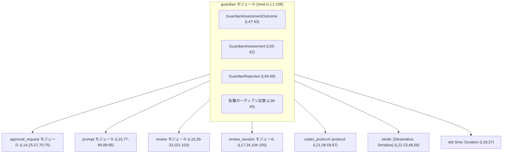
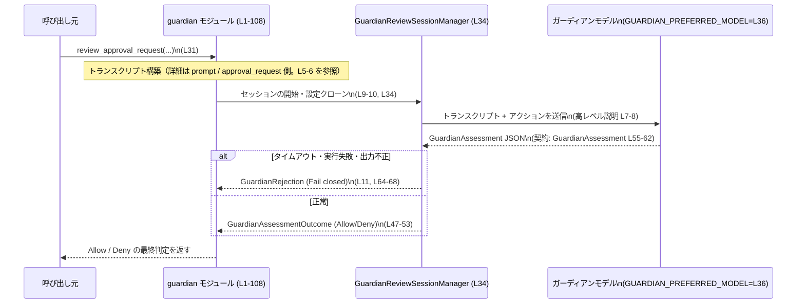

# core/src/guardian/mod.rs

## 0. ざっくり一言

`guardian` モジュールは、**「on-request」な操作について、ユーザーに確認ダイアログを出す代わりに自動承認してよいかどうかを外部ガーディアンにレビューさせ、その Allow/Deny を扱う中核的な API と型をまとめたファサード**です。  
レビューは JSON 契約に従う構造化出力として扱われ、タイムアウトやエラー時は「Fail closed（= 原則 Deny）」になる方針がコメントで示されています（`core/src/guardian/mod.rs:L1-12`）。

---

## 1. このモジュールの役割

### 1.1 概要

- `guardian` モジュールは、「on-request」承認を **自動で許可すべきか／ユーザーに提示すべきか** を判断するための仕組みをまとめます（`core/src/guardian/mod.rs:L1-2`）。
- 高レベルな流れはファイル先頭コメントで説明されています（`L4-12`）：
  1. ユーザー意図と、関連する直近のアシスタント／ツールのコンテキストから「コンパクトなトランスクリプト（履歴）」を作る。
  2. 専用のガーディアンレビューセッションに対して、そのトランスクリプトと計画中の行動を渡し、**厳密な JSON** を返してもらう。
  3. タイムアウト・実行エラー・出力フォーマット不正のときは **fail closed**（閉じた形で失敗＝原則 Deny）。
  4. ガーディアンの Allow/Deny 結果を適用する。

### 1.2 アーキテクチャ内での位置づけ

このファイルは、実装の詳細を持つ下位モジュールへの入口（ファサード）として機能しています。

- サブモジュール:
  - `approval_request`（`mod approval_request;` `L14`）
  - `prompt`（`L15`）
  - `review`（`L16`）
  - `review_session`（`L17`）
- これらから、ガーディアン用リクエスト型やレビュー関数、セッションマネージャを再公開しています（`L25-34`）。
- 外部依存:
  - `codex_protocol::protocol::GuardianAssessmentDecisionSource`（`L21`）
  - Serde の `Deserialize` / `Serialize`（`L22-23`）
  - `std::time::Duration`（`L19`）

高レベルの依存関係を Mermaid 図で表すと、次のようになります。



> 図は、このチャンクに現れる `mod` 宣言と `use` / `pub use` に基づく依存関係のみを表現しています。

### 1.3 設計上のポイント

コード（およびコメント）から読み取れる設計上の特徴を列挙します。

- **ファサード構造**  
  - 実際のロジックは `approval_request` / `prompt` / `review` / `review_session` に分割されており、この `mod.rs` はそれらの代表的な型／関数をまとめて再公開しています（`L14-17,25-34`）。
- **JSON ベースの厳密な出力契約**  
  - ガーディアンの出力を表す `GuardianAssessmentOutcome` / `GuardianAssessment` に `serde` の `Serialize` / `Deserialize` を実装し（`L48,56`）、バリアント名を小文字に強制する `#[serde(rename_all = "lowercase")]` を付与することで（`L49`）、`"allow"` / `"deny"` という明確な JSON 形式を契約にしています。
- **Fail-closed なエラー方針**  
  - コメントで「タイムアウト・実行失敗・出力不正の場合は fail closed」と明示されており（`L11`）、安全側に倒す設計方針が示されています。
  - これを支える一部として、レビューのタイムアウト時間 `GUARDIAN_REVIEW_TIMEOUT` が `Duration::from_secs(90)` で定義されています（`L37`）。
- **トークン／履歴長の制御**  
  - トランスクリプトのメッセージ／ツール部分、各エントリ、アクション文字列のトークン数と直近エントリ数に上限を設ける定数が定義されています（`L39-44`）。  
    これにより、プロンプトの肥大化やモデル制約超過を防ぐ意図が推測されますが、実際の使われ方はこのチャンクには現れません。
- **Rust の安全性・エラー・並行性の観点（このファイルに現れる範囲）**
  - メモリ安全性:
    - すべての型は通常の所有権ベースの構造体／列挙体であり、`Clone` / `Copy` / `Debug` / `PartialEq` / `Eq` などの安全な派生トレイトのみ付与されています（`L48,56,64`）。
  - エラーハンドリング:
    - このファイル内で `Result` や `panic!` は直接使われていません。  
      エラーに相当する状態は、`GuardianAssessmentOutcome::Deny` や `GuardianRejection` という **値オブジェクト** として表現される前提になっています（`L47-53,64-68`）。
  - 並行性:
    - `Send` / `Sync` など並行性関連トレイトは明示的に登場しません。  
      これらの型が `Send` / `Sync` かどうかは、内部フィールド（`String` や `codex_protocol` 側の型）がそれらを実装しているかに依存しますが、このチャンクだけでは断定できません。

---

## 2. 主要な機能一覧

この `mod.rs` が提供する主な機能を、再公開している API と定数ベースで整理します。

- ガーディアンレビューリクエストの型と JSON 変換:
  - `GuardianApprovalRequest`、`GuardianMcpAnnotations`、`guardian_approval_request_to_json`（`L25-27`）
- レビュー判定・ルーティング:
  - `review_approval_request`、`review_approval_request_with_cancel`、`routes_approval_to_guardian`（`L31-33`）
- メタ情報／ユーティリティ:
  - `new_guardian_review_id`、`guardian_rejection_message`、`is_guardian_reviewer_source`（`L28-30`）
- レビューセッション管理:
  - `GuardianReviewSessionManager`（`L34`）
- ガーディアンの構造化出力:
  - `GuardianAssessmentOutcome`（Allow/Deny）と `GuardianAssessment`（リスクレベル・ユーザー認可・理由）（`L47-62`）
  - 内部的な拒否情報 `GuardianRejection`（`L64-68`）
- モデル・タイムアウト・トランスクリプト制限の定数:
  - `GUARDIAN_PREFERRED_MODEL`、`GUARDIAN_REVIEW_TIMEOUT`、`GUARDIAN_REVIEWER_NAME` など各種定数（`L36-45`）

---

## 3. 公開 API と詳細解説

### 3.1 型一覧

#### このファイル内で定義されている型

| 名前 | 種別 | 役割 / 用途 | 定義位置 |
|------|------|------------|----------|
| `GuardianAssessmentOutcome` | 列挙体 (`enum`) | ガーディアンレビューの最終的な Allow / Deny を表現する。`serde` で小文字の `"allow"` / `"deny"` としてシリアライズされる。 | `core/src/guardian/mod.rs:L47-53` |
| `GuardianAssessment` | 構造体 (`struct`) | ガーディアンレビューの構造化結果。リスクレベル、ユーザー認可状況、Allow/Deny、理由テキストを保持する。 | `core/src/guardian/mod.rs:L55-62` |
| `GuardianRejection` | 構造体 (`struct`) | 内部的な「拒否」の表現。拒否の理由テキストと、その決定がどこから来たかを示す `GuardianAssessmentDecisionSource` を保持する。 | `core/src/guardian/mod.rs:L64-68` |

#### 他モジュールから再公開される型（詳細不明）

このチャンクには型定義本体が現れませんが、`pub(crate) use` により再公開されています。

| 名前 | 種別 | 役割 / 用途（名前からの推測、断定不可） | 再公開位置 |
|------|------|------------------------------------------|------------|
| `GuardianApprovalRequest` | 型（詳細不明） | ガーディアンレビューに渡すリクエスト内容を表す型と考えられますが、定義は `approval_request` モジュール側にあり、このチャンクでは確認できません。 | `core/src/guardian/mod.rs:L25` |
| `GuardianMcpAnnotations` | 型（詳細不明） | MCP 関連のメタ情報を表す型と推測されますが、詳細は不明です。 | `core/src/guardian/mod.rs:L26` |
| `GuardianReviewSessionManager` | 型（詳細不明） | ガーディアンレビューセッションの管理を担う型と考えられますが、詳細は `review_session` モジュール側に依存します。 | `core/src/guardian/mod.rs:L34` |

> 上記 3 型について、「構造体か列挙体か」などの詳細は、このチャンクからは特定できません。

#### 定数一覧

| 名前 | 型 | 説明 | 定義位置 |
|------|----|------|----------|
| `GUARDIAN_PREFERRED_MODEL` | `&'static str` | ガーディアンレビューに用いる優先モデル名。`"gpt-5.4"` に設定されています。 | `core/src/guardian/mod.rs:L36` |
| `GUARDIAN_REVIEW_TIMEOUT` | `Duration` | ガーディアンレビューのタイムアウト。90 秒 (`Duration::from_secs(90)`)。 | `core/src/guardian/mod.rs:L37` |
| `GUARDIAN_REVIEWER_NAME` | `&'static str` | ガーディアンレビューを担当する「レビュアー名」。`"guardian"`。 | `core/src/guardian/mod.rs:L38` |
| `GUARDIAN_MAX_MESSAGE_TRANSCRIPT_TOKENS` | `usize` | メッセージトランスクリプト部分の最大トークン数。`10_000`。 | `core/src/guardian/mod.rs:L39` |
| `GUARDIAN_MAX_TOOL_TRANSCRIPT_TOKENS` | `usize` | ツールトランスクリプト部分の最大トークン数。`10_000`。 | `core/src/guardian/mod.rs:L40` |
| `GUARDIAN_MAX_MESSAGE_ENTRY_TOKENS` | `usize` | 単一メッセージエントリの最大トークン数。`2_000`。 | `core/src/guardian/mod.rs:L41` |
| `GUARDIAN_MAX_TOOL_ENTRY_TOKENS` | `usize` | 単一ツールエントリの最大トークン数。`1_000`。 | `core/src/guardian/mod.rs:L42` |
| `GUARDIAN_MAX_ACTION_STRING_TOKENS` | `usize` | 行動内容（アクション文字列）の最大トークン数。`16_000`。 | `core/src/guardian/mod.rs:L43` |
| `GUARDIAN_RECENT_ENTRY_LIMIT` | `usize` | トランスクリプトの直近エントリの最大件数。`40`。 | `core/src/guardian/mod.rs:L44` |
| `TRUNCATION_TAG` | `&'static str` | テキストをトランケートしたことを示すタグ文字列。`"truncated"`。 | `core/src/guardian/mod.rs:L45` |

> これら定数が実際にどのようなアルゴリズムで使われるかは、`prompt` や `approval_request` モジュール側のコードを確認する必要があります。このチャンクには処理ロジックは現れません。

### 3.2 代表的な関数（再公開）の詳細

このファイル自体には関数定義はありませんが（メタ情報の `functions=0` と一致）、いくつかの関数が他モジュールから再公開されています（`core/src/guardian/mod.rs:L27-33`）。  
ここでは、特に代表的と思われる 3 つについて、**「関数名と用途を示すが、シグネチャや内部処理はこのチャンクからは不明」** であることを前提に、テンプレート形式で整理します。

#### `review_approval_request(/* 引数不明 */) -> /* 戻り値不明 */`

**概要**

- `approval_request` 由来のリクエストをレビューし、ガーディアンの判定を得るメインエントリと考えられる関数です。
- 実体は `review` モジュール側にあり、この `mod.rs` では `pub(crate) use review::review_approval_request;` として再公開されています（`core/src/guardian/mod.rs:L31`）。

**引数**

このチャンクには関数シグネチャが現れないため、引数は不明です。以下は「不明」であることを明示するための表です。

| 引数名 | 型 | 説明 |
|--------|----|------|
| 不明 | 不明 | シグネチャは `review` モジュール側にあり、このチャンクには定義がありません。 |

**戻り値**

- 戻り値の型もこのチャンクには現れません。`Result` などを返すかどうかも不明です。

**内部処理の流れ（アルゴリズム）**

- 内部処理は `review` モジュール側に実装されており、このチャンクには一切現れません。
- 関数名とファイル先頭コメント（高レベルフロー `L4-12`）から推測すると：
  - トランスクリプト構築 → ガーディアンセッション呼び出し → JSON の解析 → `GuardianAssessment` / `GuardianRejection` の生成、という流れが想定されますが、**推測であり、コードからは断定できません**。

**Examples（使用例）**

> 以下は「典型的な利用イメージ」を示す擬似コードであり、実際のシグネチャとは異なる可能性があります。

```rust
// 擬似コード: guardian::review_approval_request の利用イメージ
use crate::guardian::{
    GuardianApprovalRequest,          // L25
    review_approval_request,          // L31
};

fn handle_on_request_action(/* 省略 */) {
    // GuardianApprovalRequest の具体的なフィールド構造は approval_request モジュール側で定義されており、
    // このチャンクからは分かりません。
    let request: GuardianApprovalRequest = /* ... */;

    // review_approval_request のシグネチャも不明なため、引数／戻り値は仮置きです。
    let _outcome = review_approval_request(/* request, 他の引数など */);
}
```

**Errors / Panics**

- このチャンクからは、`review_approval_request` がどのような条件でエラーや panic を発生させるかは分かりません。
- ファイル先頭コメントでは、タイムアウト・実行失敗・出力不正時に「fail closed」とする方針が述べられているため（`L11`）、呼び出し側は「ガーディアンのエラー＝基本的に Deny」になる設計を前提に扱う必要があると考えられますが、**具体的なエラー型は不明**です。

**Edge cases（エッジケース）**

- エッジケースの扱い（空のリクエスト、非常に長いトランスクリプトなど）は `review` / `prompt` モジュールに閉じており、このチャンクでは確認できません。

**使用上の注意点**

- `GuardianAssessment` や `GuardianRejection` など、このファイル内で定義される評価結果型との整合性を保つ必要があります（`L47-62,64-68`）。
- `GUARDIAN_REVIEW_TIMEOUT` などの定数を通じてタイムアウトが設定されているため（`L37`）、呼び出し側はレビューがタイムアウト／Deny になる可能性を常に考慮する必要があります。

---

#### `review_approval_request_with_cancel(/* 引数不明 */) -> /* 戻り値不明 */`

**概要**

- キャンセル可能なレビュー実行を行う関数と考えられます。
- `pub(crate) use review::review_approval_request_with_cancel;` として再公開されています（`core/src/guardian/mod.rs:L32`）。

**引数 / 戻り値 / 内部処理**

- すべて `review` モジュール側にあり、このチャンクには一切現れません。
- 名称から、「キャンセル用のトークン」や「キャンセルハンドル」などを受け取る設計が想定されますが、**推測に過ぎず、実シグネチャは不明**です。

**使用上の注意点**

- 並行実行中のガーディアンレビューをキャンセルするための API である可能性が高いため、呼び出し側ではキャンセル時の挙動（ログを残すか、Deny とみなすかなど）を明確に決める必要があります。  
  ただし、そのポリシーがどのように実装されているかはこのチャンクでは確認できません。

---

#### `guardian_approval_request_to_json(/* 引数不明 */) -> /* 戻り値不明 */`

**概要**

- `GuardianApprovalRequest` をガーディアン用の JSON 形式に変換する関数と考えられます。
- `pub(crate) use approval_request::guardian_approval_request_to_json;` により再公開されています（`core/src/guardian/mod.rs:L27`）。

**引数 / 戻り値**

- 実体は `approval_request` モジュール側にあり、このチャンクにはシグネチャが現れません。

**内部処理の流れ（推測を含む）**

- `serde` を使って JSON シリアライズしている可能性がありますが、このファイル内にそのコードは存在しません。
- `GuardianAssessment` が JSON 契約として設計されていること（`L55-62`）から、リクエスト側も同様に JSON でやり取りされると考えられますが、**詳細は不明**です。

**使用上の注意点**

- `GuardianApprovalRequest` の定義に従った JSON を生成する必要があり、フィールド名や構造が外部ガーディアン側の期待とずれると、ファイル先頭コメントにある「malformed output」に該当する可能性があります（`L11`）。
- 実際にどのようなフォーマットが期待されるかは、`approval_request` モジュールとガーディアン側の仕様を確認する必要があります。

---

### 3.3 その他の関数・再公開 API

このチャンクに現れる他の再公開関数やテスト用ユーティリティを一覧にします（いずれもシグネチャ・実装は他モジュール側にあります）。

#### 実行時に利用される再公開関数

| 関数名 | 役割（名前からの推測、断定不可） | 再公開位置 |
|--------|----------------------------------|------------|
| `guardian_rejection_message` | ガーディアンによる拒否時にユーザーへ表示するメッセージを生成する関数と考えられます。 | `core/src/guardian/mod.rs:L28` |
| `is_guardian_reviewer_source` | 与えられた `GuardianAssessmentDecisionSource` がガーディアン由来かどうかを判定するユーティリティと考えられます。 | `core/src/guardian/mod.rs:L29` |
| `new_guardian_review_id` | ガーディアンレビュー用の一意な ID を生成する関数と推測されます。 | `core/src/guardian/mod.rs:L30` |
| `routes_approval_to_guardian` | ある承認リクエストがガーディアンにルーティングされる対象かどうかを判定する関数と考えられます。 | `core/src/guardian/mod.rs:L33` |

> これらの関数の実際の戻り値やエラー条件は、このチャンクには現れません。

#### テスト用にのみ利用される API / ユーティリティ

`#[cfg(test)]` でガードされたテスト専用の `use` / `pub use` が多数あります（`core/src/guardian/mod.rs:L70-105`）。

| 名前 | 種別 | 用途（名前からの推測） | 位置 |
|------|------|------------------------|------|
| `format_guardian_action_pretty` | 関数 | ガーディアンが実行しようとしているアクションの見やすい文字列表現を生成するテスト用ユーティリティと推測されます。 | `L70-71` |
| `guardian_assessment_action` | 関数 | `GuardianAssessment` とアクションの対応を取得するテスト用関数と思われます。 | `L72-73` |
| `guardian_request_turn_id` | 関数 | リクエストに対応する会話ターン ID を取り出すテスト補助関数と推測されます。 | `L74-75` |
| `GuardianPromptMode` 他 | 型／関数 | プロンプトの構築／トランスクリプト収集／スキーマ定義／トランケーション処理／出力解析など、プロンプト関連のテストに使われる型・関数群と見られます。具体名は `GuardianTranscriptCursor`、`GuardianTranscriptEntry`、`GuardianTranscriptEntryKind`、`build_guardian_prompt_items`、`collect_guardian_transcript_entries`、`guardian_output_schema`、`guardian_truncate_text`、`parse_guardian_assessment`、`render_guardian_transcript_entries` などです。 | `L77-99` |
| `guardian_policy_prompt` / `guardian_policy_prompt_with_config` | 関数（テスト時のみ再公開） | ガーディアンのポリシーを含むプロンプトを生成する関数と推測されます。テストから直接呼べるよう `pub(crate) use` されています。 | `L91-93` |
| `GuardianReviewOutcome` | 型 | レビューの結果（Allow / Deny など）を表すテスト用型と推測されます。 | `L101` |
| `run_guardian_review_session_for_test` | 関数 | 実際にガーディアンレビューセッションを起動して結果を得るテスト用ラッパー。`run_guardian_review_session` をテストに露出させるための別名です。 | `L101-103` |
| `build_guardian_review_session_config_for_test` | 関数 | セッション設定を構築するテスト用関数。`build_guardian_review_session_config` のテスト公開版と推測されます。 | `L104-105` |
| `mod tests` | モジュール | このファイルに対応する単体テスト群。 | `L107-108` |

---

## 4. データフロー

### 4.1 高レベルなレビュー処理フロー

具体的な関数呼び出しは別モジュールにありますが、ファイル先頭コメント（`core/src/guardian/mod.rs:L4-12`）に基づき、ガーディアンレビューの代表的なデータフローを高レベルで整理します。

1. 呼び出し元が「on-request」な操作を実行しようとする。
2. 直近の会話履歴（ユーザー発話・アシスタント応答・ツール実行結果など）から、ユーザー意図と関連コンテキストを保ったコンパクトなトランスクリプトを構築する（ステップ 1, `L5-6`）。
3. ガーディアンレビューセッションを開始し、トランスクリプトと計画中のアクションを渡して JSON による評価を要求する（ステップ 2, `L7-8`）。セッション設定は親ターンの設定（ネットワークプロキシ／許可リストなど）をクローンする（`L9-10`）。
4. タイムアウト・実行失敗・フォーマット不正があれば Fail closed（デフォルトで Deny 相当）とする（ステップ 3, `L11`）。
5. 問題なければガーディアンの Allow/Deny 判定を適用する（ステップ 4, `L12`）。

これを、`GuardianReviewSessionManager` を介したイメージの sequence diagram として表現します。



> 実際に `GuardianReviewSessionManager` がどの関数を提供し、どのようにモデルと通信するかは、このチャンクには現れません。

---

## 5. 使い方（How to Use）

この `mod.rs` はトップレベルのファサードであり、利用者は通常、このモジュールが再公開する型や関数を通じてガーディアン機能にアクセスすると考えられます。

### 5.1 基本的な使用方法（イメージ）

実際のシグネチャがこのチャンクにないため、以下は **コンセプトを示す擬似コード** です。

```rust
// 擬似コード: guardian モジュールを使って on-request アクションをレビューする

use crate::guardian::{
    GuardianApprovalRequest,          // L25
    GuardianAssessmentOutcome,        // L47-53
    GuardianRejection,                // L64-68
    review_approval_request,          // L31
};

fn handle_on_request_action(/* ... */) {
    // 1. GuardianApprovalRequest を構築
    //    - 実際のフィールド構造は approval_request モジュール依存で、このチャンクからは不明。
    let request: GuardianApprovalRequest = /* ... */;

    // 2. ガーディアンレビューを実行
    //    - review_approval_request の戻り値やエラー型はこのチャンクでは不明のため、仮に Result を返すと想定している。
    let result = review_approval_request(/* request, 他の引数など */);

    // 3. 結果の扱い（GuardianAssessmentOutcome / GuardianRejection を利用）
    //    - 実際にどの型を返すかに応じて分岐処理を書く。
    match result {
        /* 擬似的なパターンマッチ。実際の型は review モジュールの定義を参照する必要がある。 */
        Ok(outcome) => {
            match outcome {
                GuardianAssessmentOutcome::Allow => {
                    // アクションを実行
                }
                GuardianAssessmentOutcome::Deny => {
                    // 実行をブロックし、GuardianRejection の rationale をユーザーに提示するなど
                }
            }
        }
        Err(_e) => {
            // Fail closed ポリシーに従い、エラー時も Deny として扱う、など
        }
    }
}
```

> 上記は動作保証のあるコードではなく、「どの概念的な型がどの役割を持つか」を示すためのイメージです。

### 5.2 よくある使用パターン（想定）

このチャンクが示す API から、想定される使用パターンを列挙します。

- **標準レビュー vs キャンセル可能レビュー**
  - 通常のケース: `review_approval_request` を用いて同期的にレビューする（`L31`）。
  - 長時間かかりうる／ユーザーキャンセルが必要なケース: `review_approval_request_with_cancel` を用いて、キャンセル可能なレビューを行う（`L32`）。
- **ルーティング判定**
  - すべてのアクションをガーディアンに投げるのではなく、`routes_approval_to_guardian` により、「どのアクションをガーディアン経由にするか」を事前に判定するパターンが想定されます（`L33`）。
- **メッセージ整形**
  - ユーザー向けメッセージ生成には、`guardian_rejection_message` のような関数が使われる可能性があります（`L28`）。

### 5.3 よくある間違い（起こりうる誤用の例）

このチャンクから直接分かる範囲で、「起こりそうな誤用」とその対比を示します。

```rust
// 誤りがちと思われる例（イメージ）:
// ガーディアンの評価結果を確認せずにアクションを実行してしまう。

// review_approval_request(...) の結果を無視して即実行
let _ = review_approval_request(/* ... */);
// アクションを無条件に実行してしまう
perform_sensitive_action();

// 望ましいイメージ:
let outcome = review_approval_request(/* ... */);
if /* outcome が Allow であることを確認 */ {
    perform_sensitive_action();
} else {
    // Deny / エラーの場合は実行しない（Fail closed ポリシー）
}
```

> 実際のパターンマッチや条件分岐は、`review_approval_request` の戻り値の設計に依存します。このチャンクからは戻り値の詳細は分かりません。

### 5.4 使用上の注意点（まとめ）

- **Fail-closed を前提にした設計**
  - ファイル先頭コメントで「タイムアウト・失敗・出力不正は Fail closed」と明示されているため（`core/src/guardian/mod.rs:L11`）、呼び出し側は「エラー時にもアクションを実行しない」設計と整合するように実装する必要があります。
- **JSON 契約の遵守**
  - `GuardianAssessmentOutcome` に `#[serde(rename_all = "lowercase")]` が付与されており（`L49`）、`"allow"` / `"deny"` という文字列で外部とやり取りする契約になっています。ガーディアン側出力と整合しない場合、出力不正（malformed output）として扱われる可能性があります。
- **トークン制限の考慮**
  - トランスクリプトやアクション文字列のトークン上限が定義されているため（`L39-44`）、これらの上限を超える入力を渡すとトランケーションやエラーにつながる可能性があります。  
    実際のトランケーションロジックは `prompt::guardian_truncate_text` などテスト用に露出された関数名から推測されますが、詳細はこのチャンクにはありません（`L95`）。
- **並行性とキャンセル**
  - キャンセル付き API（`review_approval_request_with_cancel`）とタイムアウト定数（`GUARDIAN_REVIEW_TIMEOUT`）から、レビューが非同期／長時間処理になる可能性があります（`L32,37`）。  
    実際に async/await を用いているか、どのランタイム上で動くかはこのチャンクには現れませんが、「キャンセル／タイムアウト発生時の扱い」は呼び出し側で明示的に設計する必要があります。

---

## 6. 変更の仕方（How to Modify）

### 6.1 新しい機能を追加する場合

この `mod.rs` は、ガーディアン関連機能の入口としての役割を持つため、新しい機能を追加する際のパターンは次のようになります。

1. **実装を適切なサブモジュールに追加する**
   - リクエスト構造や JSON 変換に関する変更 → `approval_request` モジュール（`mod approval_request;` `L14`）
   - プロンプト構築やトランスクリプト処理 → `prompt` モジュール（`L15`）
   - レビュー実行ロジック → `review` モジュール（`L16`）
   - セッション管理・外部モデルとのやり取り → `review_session` モジュール（`L17`）
2. **必要に応じてこの `mod.rs` から再公開する**
   - 新機能が外部から直接使われるべき API であれば、既存のパターンにならって `pub(crate) use ...;` を追加します（`L25-34` を参照）。
3. **構造化出力契約への影響を確認する**
   - `GuardianAssessment` / `GuardianAssessmentOutcome` / `GuardianRejection` に新フィールドやバリアントを追加する場合、外部ガーディアンとの JSON 契約変更になるため、互換性への影響を慎重に確認する必要があります（`L47-62,64-68`）。
4. **テスト用のエクスポートを整備する**
   - 新しい機能に対するテストを `mod tests;` 配下に追加し（`L107-108`）、必要なら `#[cfg(test)] pub(crate) use ...;` でテストから直接呼べるようにします（既存のテスト用再公開 `L91-93` などを参考にできます）。

### 6.2 既存の機能を変更する場合の注意点

- **契約の維持（構造化出力）**
  - `GuardianAssessmentOutcome` のバリアント名称や `serde` 属性を変更すると、外部 JSON 契約が変わってしまい、既存のガーディアン出力との互換性を失います（`L47-53`）。  
    特に `#[serde(rename_all = "lowercase")]` を外す／変更する場合は、ガーディアン側の実装も同時に調整する必要があります。
- **定数の意味の変更**
  - `GUARDIAN_REVIEW_TIMEOUT` や各種トークン制限の値を変更すると、システム全体の振る舞い（タイムアウトしやすさ、トランケーション頻度）が変わります（`L37,39-44`）。  
    大きく変更する際は、ガーディアンレビューの UX と安全性（Fail closed が発生する頻度）への影響を確認する必要があります。
- **エラー／Fail-closed の扱い**
  - ファイル先頭コメントで宣言された「Fail closed」ポリシー（`L11`）と実装が乖離しないように注意する必要があります。  
    たとえば、新しいエラーケースを追加したときに、それが Allow へフォールバックしてしまうような変更は避けるべきです。
- **テストの更新**
  - テスト向けに再公開されている関数群（`L70-105`）は、プロンプト構築やセッション処理の振る舞いを前提としている可能性があります。  
    実装変更に合わせてテストコードも更新し、期待されるトランスクリプト内容や JSON フォーマットとの整合性を保つ必要があります。

---

## 7. 関連ファイル

このモジュールと密接に関係するファイル・外部依存をまとめます。

| パス / モジュール | 役割 / 関係 | 根拠 |
|-------------------|------------|------|
| `core/src/guardian/approval_request.rs`（推定） | `mod approval_request;` でインクルードされるモジュール。`GuardianApprovalRequest` や `GuardianMcpAnnotations`、`guardian_approval_request_to_json` などを定義していると考えられます（`pub(crate) use` からの推測）。 | `core/src/guardian/mod.rs:L14,25-27,70-75` |
| `core/src/guardian/prompt.rs`（推定） | プロンプト構築やトランスクリプト処理、出力スキーマ定義を担うモジュールと考えられます。テスト用に多くの型／関数が再公開されています。 | `core/src/guardian/mod.rs:L15,77-99,89-95` |
| `core/src/guardian/review.rs`（推定） | ガーディアンレビューの実行・結果評価を行うモジュール。`review_approval_request` や `GuardianReviewOutcome` などを定義していると見られます。 | `core/src/guardian/mod.rs:L16,28-33,101-103` |
| `core/src/guardian/review_session.rs`（推定） | ガーディアンレビューセッションの設定・ライフサイクル管理を行うモジュール。`GuardianReviewSessionManager` や `build_guardian_review_session_config` などを提供していると考えられます。 | `core/src/guardian/mod.rs:L17,34,104-105` |
| `codex_protocol::protocol` | ガーディアンに関するプロトコル型（`GuardianAssessmentDecisionSource`, `GuardianRiskLevel`, `GuardianUserAuthorization`）を提供します。`GuardianAssessment` / `GuardianRejection` がこれらをフィールドとして利用しています。 | `core/src/guardian/mod.rs:L21,58-59,67` |
| `serde` クレート | `GuardianAssessmentOutcome` / `GuardianAssessment` の JSON シリアライズ／デシリアライズを担うトレイトを提供します。 | `core/src/guardian/mod.rs:L22-23,48,56` |
| `std::time::Duration` | レビュータイムアウト定数 `GUARDIAN_REVIEW_TIMEOUT` の型として利用されます。 | `core/src/guardian/mod.rs:L19,37` |
| `core/src/guardian/tests.rs`（推定） | `mod tests;` でインクルードされる、このモジュール専用の単体テスト群。テスト用の再公開 API を使用して、プロンプト生成やセッション実行の動作を検証すると考えられます。 | `core/src/guardian/mod.rs:L107-108,70-105` |

> サブモジュールの具体的なファイル名（`approval_request.rs` など）は Rust の通常のモジュール解決規則に基づく推測であり、このチャンクにはファイルパス自体は明示されていません。
