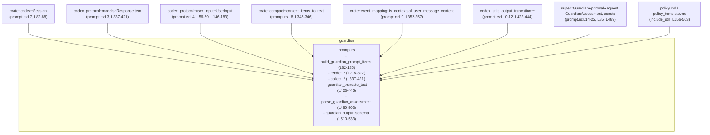
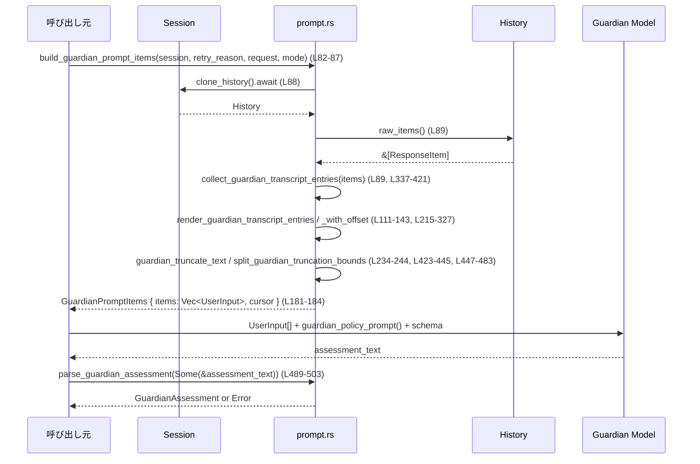

## core/src/guardian/prompt.rs

---

## 0. ざっくり一言

guardian レビュー用のプロンプトを組み立てるモジュールです。  
会話履歴から「監査用トランスクリプト」を抽出・圧縮し、承認リクエスト JSON とセットで `UserInput` 群を構築し、モデルから返ってきたガーディアン評価 JSON をパースする処理を提供します。

---

## 1. このモジュールの役割

### 1.1 概要

- このモジュールは **Codex エージェントの会話履歴＋ツール呼び出し結果＋承認リクエスト** をまとめて、ガーディアン用レビューセッションに渡すためのプロンプトを生成します（`build_guardian_prompt_items`、prompt.rs:L82-185）。
- また、履歴からガーディアン向けに残すべき部分だけを選択・トークン数でトリミングするロジックを持ちます（`render_guardian_transcript_entries` 系、prompt.rs:L215-327）。
- ガーディアンモデルから返ってきた JSON 風テキストを構造体 `GuardianAssessment` にパースし（`parse_guardian_assessment`、prompt.rs:L489-503）、さらにその JSON 形式のスキーマと説明プロンプトを提供します（`guardian_output_schema` / `guardian_output_contract_prompt`、prompt.rs:L510-545）。
- ガーディアンポリシーのテンプレートとテナント固有設定を組み合わせたポリシープロンプトも構築します（`guardian_policy_prompt_with_config`、prompt.rs:L560-563）。

### 1.2 アーキテクチャ内での位置づけ

このファイルは「guardian レイヤ」の一部として、他コンポーネントと次のように連携します（依存は `use` と呼び出しから読み取れる範囲のみ記述します）。



- 入力:
  - `Session` から履歴 (`history.raw_items()`) を取得。
  - ガーディアン承認リクエスト `GuardianApprovalRequest`。
- 中間表現:
  - 履歴を `ResponseItem` から `GuardianTranscriptEntry` ベクタに変換。
- 出力:
  - Guardian レビューセッションに渡す `Vec<UserInput>`（`GuardianPromptItems` 内）。
  - ガーディアン評価 `GuardianAssessment`。
  - ガーディアン用ポリシープロンプト文字列と JSON スキーマ。

### 1.3 設計上のポイント

- **責務の分割**
  - 履歴から「何を残すか」を決めるロジックと（`collect_guardian_transcript_entries`、prompt.rs:L337-421）、
  - 残すと決めた文をトークン数制限でトリミングするロジック（`guardian_truncate_text`、prompt.rs:L423-445）、
  - それらをまとめて `UserInput` に組み立てるロジック（`build_guardian_prompt_items`、prompt.rs:L82-185）
  が分離されています。
- **トークン・バジェット管理**
  - 「メッセージ（user/assistant）」と「ツール（call/result）」のトークンバジェットを別々に管理し、ツールの証拠が人間の会話を食い潰さないようにしています（prompt.rs:L199-211, L255-316）。
- **差分モード（Delta）**
  - すでにレビュー済みの履歴部分を再送しないためのカーソル `GuardianTranscriptCursor` と差分モード `GuardianPromptMode::Delta` を提供し、履歴の一部だけを送る最適化が行われています（prompt.rs:L61-72, L96-145）。
- **エラーハンドリング**
  - JSON 生成で失敗しうる箇所は `serde_json::Result` や `anyhow::Result` を返し、呼び出し側にエラーを伝播する設計です（`build_guardian_prompt_items` の `format_guardian_action_pretty` 呼び出し、prompt.rs:L94-95; `parse_guardian_assessment`、prompt.rs:L489-503）。
  - JSON パースに失敗した場合、明示的なメッセージで `bail!` しています。
- **安全性（Rust 言語特有）**
  - 文字列トリミングは `char_indices` を使って UTF-8 文字境界を保ちながらバイト数で分割しており、文字化けや不正 UTF-8 を防いでいます（`split_guardian_truncation_bounds`、prompt.rs:L447-483）。
  - 共有状態は `Session` 以外に存在せず、このモジュール内の構造体はすべて所有権ベースのデータ（`String`, `Vec`）で構成されています。
- **並行性**
  - 非同期関数は `build_guardian_prompt_items` だけであり（prompt.rs:L82）、これは `Session` から履歴を非同期に取得するために `async` になっています。
  - それ以外の関数は純粋関数に近く、副作用はありません。

---

## 2. 主要な機能一覧

- 履歴抽出: `collect_guardian_transcript_entries`  
  → `ResponseItem` 列からガーディアン用に残す transcript エントリ（user/assistant/tool）を抽出（prompt.rs:L337-421）。

- トランスクリプト整形・トリミング:  
  - `render_guardian_transcript_entries` / `render_guardian_transcript_entries_with_offset`  
    → エントリ列を、行番号付き・ロール付きの文字列に変換しつつ、トークンバジェットに収まるよう選択（prompt.rs:L215-327）。
  - `guardian_truncate_text` / `split_guardian_truncation_bounds`  
    → 各メッセージをトークン数上限で前後から切って中央にトランケーションマーカーを挿入（prompt.rs:L423-445, L447-483）。

- ガーディアンプロンプト組み立て:  
  - `build_guardian_prompt_items`  
    → compact transcript と承認リクエスト JSON、リトライ理由などを `Vec<UserInput>` に分割してガーディアンレビュー用プロンプトを構築（prompt.rs:L82-185）。

- ガーディアン評価パース:  
  - `parse_guardian_assessment`  
    → モデル出力テキストから `GuardianAssessment` を JSON パースし、ラッパーの余計な文章を許容（prompt.rs:L489-503）。

- ガーディアン出力契約・ポリシー:  
  - `guardian_output_schema`  
    → ガーディアン最終出力の JSON スキーマを構築（prompt.rs:L510-533）。
  - `guardian_policy_prompt` / `guardian_policy_prompt_with_config`  
    → `policy_template.md` ＋ テナント設定 ＋ JSON 契約の説明を連結したポリシープロンプトを返す（prompt.rs:L556-563）。
  - `guardian_output_contract_prompt`（内部）  
    → スキーマを自然文＋ JSON 例として説明するフラグメントを提供（prompt.rs:L535-545）。

---

## 3. 公開 API と詳細解説

### 3.1 型一覧（構造体・列挙体など）

| 名前 | 種別 | 公開範囲 | 役割 / 用途 | 定義位置 |
|------|------|----------|-------------|----------|
| `GuardianTranscriptEntry` | 構造体 | `pub(crate)` | ガーディアンに渡す 1 エントリ分の履歴（種別＋本文テキスト）を表現 | prompt.rs:L26-29 |
| `GuardianTranscriptEntryKind` | enum | `pub(crate)` | エントリの種別（`User` / `Assistant` / `Tool(String)`）を識別 | prompt.rs:L32-36 |
| `GuardianPromptItems` | 構造体 | `pub(crate)` | ガーディアン用に組み立てた `Vec<UserInput>` と対応するトランスクリプトカーソルを束ねる | prompt.rs:L56-59 |
| `GuardianTranscriptCursor` | 構造体 | `pub(crate)` | どこまでのトランスクリプトをガーディアンが確認済みかを表すカーソル（履歴バージョン＋エントリ数） | prompt.rs:L61-67 |
| `GuardianPromptMode` | enum | `pub(crate)` | プロンプトを「全体（Full）」か「差分（Delta）」かで切り替えるモード | prompt.rs:L69-72 |
| `GuardianPromptShape` | enum | private | 内部用: `GuardianPromptMode` から決定される具体的なプロンプト形状（Full/Delta + オフセット） | prompt.rs:L187-190 |
| `GuardianPromptHeadings` | 構造体 | private | プロンプト中に使う固定の見出し類の文字列束 | prompt.rs:L192-197 |

`GuardianTranscriptEntryKind` には以下のメソッドがあります（すべて private）:

- `role(&self) -> &str` — OpenAI 風のロール名（"user" / "assistant" / 任意の tool ロール）を返す（prompt.rs:L39-45）。
- `is_user(&self) -> bool` — `User` かどうか（prompt.rs:L47-49）。
- `is_tool(&self) -> bool` — `Tool(_)` かどうか（prompt.rs:L51-53）。

### 3.2 重要関数の詳細

#### `build_guardian_prompt_items(session: &Session, retry_reason: Option<String>, request: GuardianApprovalRequest, mode: GuardianPromptMode) -> serde_json::Result<GuardianPromptItems>` （prompt.rs:L82-185）

**概要**

- Codex セッション履歴と承認リクエストから、ガーディアンレビュー用の `Vec<UserInput>` を生成し、同時に新しい `GuardianTranscriptCursor` を返します。
- Full/Delta モードに応じて、履歴全体または差分のみを含むトランスクリプトを作成します。

**引数**

| 引数名 | 型 | 説明 |
|--------|----|------|
| `session` | `&Session` | 履歴や会話 ID を取得するための Codex セッション（prompt.rs:L82-88）。 |
| `retry_reason` | `Option<String>` | ガーディアンへの再試行理由。存在する場合、プロンプト中に挿入されます（prompt.rs:L169-173）。 |
| `request` | `GuardianApprovalRequest` | ガーディアンに承認を求めるアクション内容（JSON 生成に使用、prompt.rs:L85, L94-95）。 |
| `mode` | `GuardianPromptMode` | Full か Delta（カーソル付き）かを指定（prompt.rs:L86, L96-109）。 |

**戻り値**

- `serde_json::Result<GuardianPromptItems>`  
  - `Ok(GuardianPromptItems { items, transcript_cursor })` — 正常にプロンプトが構築できた場合（prompt.rs:L181-184）。
  - `Err(serde_json::Error)` — `format_guardian_action_pretty(&request)` の JSON 生成に失敗した場合（`?` による伝播、prompt.rs:L94-95）。

**内部処理の流れ**

1. `session.clone_history().await` で履歴オブジェクトを取得し（prompt.rs:L88）、`history.raw_items()` から `ResponseItem` スライスを得ます。
2. `collect_guardian_transcript_entries` を呼び出し、レビューに残すべきエントリだけを `Vec<GuardianTranscriptEntry>` として抽出します（prompt.rs:L89, L337-421）。
3. その長さと `history.history_version()` から `GuardianTranscriptCursor` を作成します（prompt.rs:L90-93）。
4. 承認リクエストを JSON 文字列に整形します（`format_guardian_action_pretty(&request)?`、prompt.rs:L94-95）。
5. `mode` とカーソル情報により `GuardianPromptShape` を決定します（prompt.rs:L96-109）。カーソルが履歴と整合しない場合は自動的に Full へフォールバックします。
6. `GuardianPromptShape` に応じて:
   - Full の場合: `render_guardian_transcript_entries` を使って全エントリからトランスクリプト文字列列と省略ノートを作成します（prompt.rs:L111-123, L215-223）。
   - Delta の場合: 既に見たエントリ数をオフセットとして `render_guardian_transcript_entries_with_offset` を呼び、差分のみのトランスクリプトを作成します（prompt.rs:L125-143, L225-327）。
7. `UserInput::Text` を積み上げて、intro、transcript 部分、セッション ID、（あれば）省略ノート、アクション説明、リトライ理由、planned action JSON を順番に追加します（prompt.rs:L146-180）。
8. `GuardianPromptItems { items, transcript_cursor }` を `Ok` で返します（prompt.rs:L181-184）。

**Examples（使用例）**

※ 実際の `Session` や `GuardianApprovalRequest` の生成はこのチャンクにはないため、擬似コードとして示します。

```rust
use crate::guardian::prompt::{build_guardian_prompt_items, GuardianPromptMode};
use crate::codex::Session;
use crate::guardian::GuardianApprovalRequest;

async fn run_guardian_review(session: &Session, request: GuardianApprovalRequest) -> anyhow::Result<()> {
    // 初回は Full モードでトランスクリプト全体を送る
    let prompt_items = build_guardian_prompt_items(
        session,
        None,                                   // retry_reason なし
        request,
        GuardianPromptMode::Full,              // 全履歴を対象
    )?;                                        // serde_json::Error は ? で伝播

    // prompt_items.items を使って guardian モデルに問い合わせる …
    // guardian_result_text: String = ...

    Ok(())
}
```

**Errors / Panics**

- `format_guardian_action_pretty(&request)` が `serde_json::Error` を返した場合に `Err` として返ります（prompt.rs:L94-95）。  
  → 承認リクエストのシリアライズに失敗した場合です。
- この関数内で panic を起こすコードは見当たりません（`unwrap` 等なし）。

**Edge cases（エッジケース）**

- 履歴にレビュー対象のエントリが一つもない場合:
  - `collect_guardian_transcript_entries` が空ベクタを返し（prompt.rs:L337-421）、`render_guardian_transcript_entries` が `<no retained transcript entries>` の 1 行だけを含むトランスクリプトを返します（prompt.rs:L215-223, L225-232）。
- Delta モードで与えられたカーソルが履歴と整合しない場合:
  - `cursor.parent_history_version` と現在の `history_version()` が異なる、または `transcript_entry_count` が現在より大きい場合、Full にフォールバックします（prompt.rs:L96-107）。
- `retry_reason` が `Some("")` など空文字列でも、そのままプロンプト内に追加されます（prompt.rs:L169-173）。

**使用上の注意点**

- **並行性**: `build_guardian_prompt_items` は `async fn` なので、Tokio などの async ランタイム上で `.await` する必要があります。内部で共有状態を直接扱ってはいませんが、`Session` の実装によっては別スレッドからの同時アクセスに注意が必要です（`Session` の実装はこのチャンクには現れません）。
- **履歴カーソル**: Delta モードで使う `GuardianTranscriptCursor` は、履歴バージョンとエントリ数の組み合わせが一致している場合にのみ差分として使われます。外部で改変すると常に Full に戻ります（prompt.rs:L96-107）。
- **バジェット**: トランスクリプトは内部でトークンバジェットに基づいてトリミングされるため、元の履歴と完全には一致しない点に注意が必要です（prompt.rs:L199-211, L234-327）。

---

#### `render_guardian_transcript_entries(entries: &[GuardianTranscriptEntry]) -> (Vec<String>, Option<String>)` （prompt.rs:L215-223）

**概要**

- `GuardianTranscriptEntry` のスライスから、行番号とロールを含む文字列列を生成します。
- 各エントリをトークン数上限でトリミングしつつ、トランスクリプト全体のトークン予算を守るようにどのエントリを残すか選択します。
- 省略が発生した場合は簡単なノート `"Some conversation entries were omitted."` を返します。（prompt.rs:L324-326）

**引数**

| 引数名 | 型 | 説明 |
|--------|----|------|
| `entries` | `&[GuardianTranscriptEntry]` | 事前に `collect_guardian_transcript_entries` 等で抽出された履歴エントリ（prompt.rs:L215-217）。 |

**戻り値**

- `Vec<String>`: `[<番号>] <role>: <トリミング済みテキスト>` 形式の文字列列（prompt.rs:L244-249, L318-323）。
- `Option<String>`: 何かしらのエントリが落とされた場合 `"Some conversation entries were omitted."` を格納した `Some`、すべて残ったか、または `entries` が空だった場合は `None`（prompt.rs:L213-214, L324-326）。

**内部処理の流れ**

1. 実装は `render_guardian_transcript_entries_with_offset(entries, 0, "<no retained transcript entries>")` へのラッパーです（prompt.rs:L218-222）。
2. `entries` が空なら、プレースホルダ文字列だけを返します（prompt.rs:L225-232）。

`render_guardian_transcript_entries_with_offset` のアルゴリズム（詳細は次の関数で説明）でエントリ選択・トリミングを行います。

**Examples（使用例）**

```rust
use crate::guardian::prompt::{render_guardian_transcript_entries, GuardianTranscriptEntry, GuardianTranscriptEntryKind};

fn summarize(entries: Vec<GuardianTranscriptEntry>) {
    let (lines, omission_note) = render_guardian_transcript_entries(&entries);

    for line in &lines {
        println!("{line}");
    }

    if let Some(note) = omission_note {
        eprintln!("Note: {note}");
    }
}
```

**Errors / Panics**

- この関数はエラー型を返さず、内部でも `unwrap` 等を使っていません。`entries` の内容に応じて決定的な結果を返します。

**Edge cases**

- `entries` が空の場合:
  - `("<no retained transcript entries>".to_string(), None)` が返されます（prompt.rs:L225-232）。
- 全エントリのトークン数がバジェット内に収まる場合:
  - すべてのエントリが `included = true` になり、省略ノートは `None`（prompt.rs:L324-326）。
- 全エントリがバジェットに収まらず、非ユーザーエントリも多い場合:
  - 「ユーザー発話を優先」し、「最近の非ユーザー（assistant/tool）」のみを追加で残す挙動になります（prompt.rs:L255-316）。

**使用上の注意点**

- `entries` は事前に `collect_guardian_transcript_entries` でフィルタされている前提なので、ここでは synthetic なコンテキストメッセージはすでに除外されています（collect 側の仕様、prompt.rs:L329-336, L352-357）。
- トークン数計算は `approx_token_count` に依存しており「近似」です（prompt.rs:L250-251）。実際のモデル側トークン数とは多少のズレがありうる点に注意が必要です。

---

#### `collect_guardian_transcript_entries(items: &[ResponseItem]) -> Vec<GuardianTranscriptEntry>` （prompt.rs:L337-421）

**概要**

- セッション履歴を表す `ResponseItem` 列から、ガーディアンレビューに関連する情報だけを抽出して `GuardianTranscriptEntry` ベクタに変換します。
- 「人間の会話」と「ツール呼び出し / ツール結果」を残し、コンテキスト用の synthetic user メッセージ等は除外します。

**引数**

| 引数名 | 型 | 説明 |
|--------|----|------|
| `items` | `&[ResponseItem]` | セッションの生履歴（prompt.rs:L337-339）。 |

**戻り値**

- `Vec<GuardianTranscriptEntry>`: user/assistant/tool の、空でないテキストのみが入ったエントリ列（prompt.rs:L340-348, L415-420）。

**内部処理の流れ**

1. `entries` ベクタと `tool_names_by_call_id: HashMap<String, String>` を初期化します（prompt.rs:L340-341）。
2. ヘルパークロージャを定義:
   - `non_empty_entry` — トリムして空でない文字列だけ `GuardianTranscriptEntry` にする（prompt.rs:L342-344）。
   - `content_entry` — `content_items_to_text(content)` でメッセージコンテンツをテキスト化してから `non_empty_entry` を適用（prompt.rs:L345-346）。
   - `serialized_entry` — `serde_json::to_string` 等でシリアライズされた JSON テキストから `non_empty_entry` を作成（prompt.rs:L347-348）。
3. `items` を順に走査し、`match` で各バリアントごとに処理します（prompt.rs:L350-413）。
   - `ResponseItem::Message` で `role == "user"`:
     - `is_contextual_user_message_content(content)` が `true` のものはスキップ、それ以外のみ `GuardianTranscriptEntryKind::User` として残します（prompt.rs:L352-357）。
   - `ResponseItem::Message` で `role == "assistant"`:
     - 常に `GuardianTranscriptEntryKind::Assistant` として `content_entry`（prompt.rs:L359-361）。
   - `ResponseItem::LocalShellCall`:
     - `action` を JSON 文字列化し、`"tool shell call"` ロールの `Tool` エントリとして保持（prompt.rs:L362-365）。
   - `ResponseItem::FunctionCall` / `CustomToolCall`:
     - `call_id` と `name` をマップに保存し（prompt.rs:L372, L384）、引数文字列（`arguments` または `input`）が空でなければ `"tool {name} call"` ロールの `Tool` エントリとして保持（prompt.rs:L372-377, L384-388）。
   - `ResponseItem::WebSearchCall`:
     - `action` が `Some` の場合のみ JSON シリアライズし `"tool web_search call"` ロールの `Tool` エントリとして保持（prompt.rs:L390-395）。
   - `ResponseItem::FunctionCallOutput` / `CustomToolCallOutput`:
     - `output.body.to_text()` に成功した場合に `Tool` エントリとして保持。ロール名は対応する `call_id` の name から `"tool {name} result"` を付けるか、見つからなければ `"tool result"`（prompt.rs:L396-411）。
   - その他のバリアントはすべてスキップ（prompt.rs:L412-413）。
4. `entry` が `Some` であれば `entries.push(entry)`（prompt.rs:L415-417）。
5. 最後に `entries` を返す（prompt.rs:L419-420）。

**Examples（使用例）**

```rust
use codex_protocol::models::ResponseItem;
use crate::guardian::prompt::collect_guardian_transcript_entries;

fn build_transcript_from_history(raw_items: &[ResponseItem]) {
    let entries = collect_guardian_transcript_entries(raw_items);
    // ここで render_guardian_transcript_entries などに渡して表示用に加工できる
    for e in entries {
        println!("{:?}: {}", e.kind, e.text);
    }
}
```

**Errors / Panics**

- 返り値は `Vec` であり、エラー型を返しません。
- `serde_json::to_string(action).ok()` の結果が失敗した場合、そのエントリは単純にスキップされます（prompt.rs:L362-365, L390-395）。panic にはなりません。

**Edge cases**

- `content_items_to_text(content)` が `Err` を返した場合:
  - `and_then` を使っているため、そのメッセージはスキップされます（prompt.rs:L345-346）。  
    つまり、テキスト化不能なメッセージはガーディアンには見えません。
- `FunctionCallOutput` に対応する `call_id` が `tool_names_by_call_id` に存在しない場合:
  - ロールは `"tool result"` になります（prompt.rs:L404-407）。
- `arguments`/`input` が空白だけの場合:
  - `trim().is_empty()` で弾かれ、エントリが作成されません（prompt.rs:L372-376, L384-388）。

**使用上の注意点**

- この関数は「何を残すか」の判定ロジックの中心です。新しい `ResponseItem` バリアントを追加した場合、ガーディアンに見せたいかどうかをここで判定する必要があります。
- `tool_names_by_call_id` は同一 `call_id` に対して最後に見た name を記録する単純なマップです。複数回の同一 `call_id` の上書きを前提にするような複雑なプロトコルはこのチャンクには現れません。

---

#### `guardian_truncate_text(content: &str, token_cap: usize) -> String` （prompt.rs:L423-445）

**概要**

- 入力テキストを「近似トークン数上限」に収まるようにバイト単位でトリミングし、中央にトランケーションマーカー（`<TRUNCATION_TAG omitted_approx_tokens="..."/>`）を挿入します。
- UTF-8 文字境界を保ちつつ前半と後半を残します。

**引数**

| 引数名 | 型 | 説明 |
|--------|----|------|
| `content` | `&str` | トランケーション対象のテキスト（prompt.rs:L423-424）。 |
| `token_cap` | `usize` | 許容トークン数上限。`approx_bytes_for_tokens` に渡されます（prompt.rs:L428-429）。 |

**戻り値**

- 上限内でトリミングされた新しい `String`。元のテキストが短ければそのまま返されます（prompt.rs:L429-431）。

**内部処理の流れ**

1. 空文字列なら空 `String` を返す（prompt.rs:L423-426）。
2. `approx_bytes_for_tokens(token_cap)` で最大バイト数を算出（prompt.rs:L428-429）。
3. `content.len() <= max_bytes` ならそのまま `to_string()`（prompt.rs:L429-431）。
4. 超過している場合、`content.len() - max_bytes` を `approx_tokens_from_byte_count` に渡して省略トークン数を近似計算し、マーカー文字列 `<{TRUNCATION_TAG} omitted_approx_tokens="{omitted_tokens}" />` を組み立てる（prompt.rs:L433-435）。
5. `max_bytes <= marker.len()` の場合、マーカーだけを返す（prompt.rs:L435-437）。
6. それ以外では、`available_bytes = max_bytes - marker.len()` を前半・後半に分配し（prompt.rs:L439-441）、`split_guardian_truncation_bounds` で UTF-8 境界に揃えた prefix/suffix を取得（prompt.rs:L441-442）。
7. `format!("{prefix}{marker}{suffix}")` で連結して返す（prompt.rs:L443-444）。

**Examples（使用例）**

```rust
use crate::guardian::prompt::guardian_truncate_text;

fn demo_truncate() {
    let long_text = "a".repeat(10_000);
    let truncated = guardian_truncate_text(&long_text, 1000);
    println!("{}", truncated); // 中央付近に <TRUNCATION_TAG ... /> が挿入されたテキストになる
}
```

**Errors / Panics**

- エラー型は返さず、内部でも panic を起こすような操作（`unwrap` 等）はありません。
- `split_guardian_truncation_bounds` では `char_indices` によって UTF-8 境界を維持しているため、インデックス範囲外参照のリスクは抑えられています（prompt.rs:L447-483）。

**Edge cases**

- `content` が空文字列の場合: 空 `String` を返します（prompt.rs:L423-426）。
- `max_bytes` がマーカー長より小さい場合:
  - コンテンツは一切残さずマーカーのみを返します（prompt.rs:L435-437）。  
    → 非常に小さい `token_cap` を指定したケース。
- `available_bytes` が極端に小さい場合:
  - `split_guardian_truncation_bounds` の計算により prefix または suffix のどちらかが空になることがありますが、それでもマーカーは必ず含まれます（prompt.rs:L439-444, L447-483）。

**使用上の注意点**

- トークン数とバイト数は近似関数に依存しているため、「指定した token_cap を厳密に守る」ものではなく、おおよその制御です（prompt.rs:L428, L433）。
- この関数を連続して適用すると、既にトランケーションされたテキストにさらにマーカーが増える可能性があります。実装上は各エントリにつき 1 回の適用を前提としているように読めます（render 側、prompt.rs:L234-244）。

---

#### `parse_guardian_assessment(text: Option<&str>) -> anyhow::Result<GuardianAssessment>` （prompt.rs:L489-503）

**概要**

- ガーディアンモデルから返されたテキストから `GuardianAssessment` JSON を抽出・パースします。
- モデルには「strict JSON 出力」を要求しますが、実運用でのフォーマット揺れに対処するため、「JSON を囲む余計な文章」が付いていても、最初の `{` から最後の `}` までを切り出して再度パースを試みる「薄い回復パス」を持ちます（prompt.rs:L485-488, L496-501）。

**引数**

| 引数名 | 型 | 説明 |
|--------|----|------|
| `text` | `Option<&str>` | モデルからの生テキスト。`None` の場合は評価がまったく返されていないとみなします（prompt.rs:L489-492）。 |

**戻り値**

- `Ok(GuardianAssessment)` — JSON パースに成功した場合（全文または切り出した範囲、prompt.rs:L493-495, L500-501）。
- `Err(anyhow::Error)` — 以下のいずれか:
  - `text` が `None` の場合（prompt.rs:L490-492）。
  - JSON としてパースできない、または `{` `}` の囲みが見つからない場合（prompt.rs:L496-503）。

**内部処理の流れ**

1. `text` が `None` なら即座に `bail!("guardian review completed without an assessment payload")`（prompt.rs:L490-492）。
2. まず `serde_json::from_str::<GuardianAssessment>(text)` を試し、成功すれば即 `Ok` を返す（prompt.rs:L493-495）。
3. 失敗した場合:
   - `text.find('{')` と `text.rfind('}')` で先頭と末尾の波括弧インデックスを探し（prompt.rs:L496-497）、
   - `start < end` かつ `text.get(start..=end)` が `Some(slice)` の場合に、そのスライスで再度 `serde_json::from_str` を試行（prompt.rs:L496-501）。
4. それでも失敗すれば `anyhow::bail!("guardian assessment was not valid JSON")`（prompt.rs:L502-503）。

**Examples（使用例）**

```rust
use crate::guardian::prompt::parse_guardian_assessment;
use crate::guardian::GuardianAssessment;

fn handle_guardian_output(model_output: String) -> anyhow::Result<GuardianAssessment> {
    let assessment = parse_guardian_assessment(Some(&model_output))?;
    Ok(assessment)
}
```

**Errors / Panics**

- すべてのエラーは `anyhow::Error` として返されます。panic は使われていません。
- エラーメッセージは固定の文字列で、ログや監視での識別に使いやすい形式になっています（prompt.rs:L490-492, L502-503）。

**Edge cases**

- モデルがまったく JSON を含まないテキストを返した場合:
  - `{` や `}` が一つも見つからないか、一致しないため、最終的に `"guardian assessment was not valid JSON"` エラーになります（prompt.rs:L496-503）。
- モデルが JSON を囲む前後に長い説明文を付与した場合:
  - 最初の `{` から最後の `}` までを切り出すことで復旧を試みます（prompt.rs:L496-501）。JSON 内に余計な `}` などが含まれている場合は依然として失敗します。

**使用上の注意点**

- この関数は「フォーマット揺れに対する薄い回復パス」を意図しており、任意のテキストから JSON を抜き出す汎用パーサではありません。  
  → JSON の外側に `{` や `}` を含むテキストが混じると誤った範囲を切り出す可能性があります。
- ガーディアンセッションには `guardian_output_schema()` による JSON スキーマを渡すことが前提になっているため、モデル側に適切な制約をかけることが重要です（prompt.rs:L505-533, L535-545）。

---

#### `guardian_output_schema() -> Value` （prompt.rs:L510-533）

**概要**

- ガーディアンモデルの最終出力に対して要求する JSON スキーマを `serde_json::Value` として返します。
- `final_output_json_schema` 等に渡すことを想定しています（コメントより、prompt.rs:L505-509）。

**戻り値**

- `serde_json::Value` — JSON Schema 風のオブジェクト（prompt.rs:L510-533）。

  プロパティ:

  - `risk_level`: `"low" | "medium" | "high" | "critical"`
  - `user_authorization`: `"unknown" | "low" | "medium" | "high"`
  - `outcome`: `"allow" | "deny"`
  - `rationale`: `string`

  追加プロパティは禁止（`"additionalProperties": false`）。

**内部処理**

- `serde_json::json!` マクロでリテラル JSON を構築しているだけで、動的な処理はありません（prompt.rs:L511-532）。

**使用上の注意点**

- このスキーマと `GuardianAssessment` 型、および `guardian_output_contract_prompt` の内容が整合していることが前提です（prompt.rs:L505-509, L535-545）。片方だけを変更するとパースエラーや挙動不一致が発生します。

---

#### `guardian_policy_prompt_with_config(tenant_policy_config: &str) -> String` （prompt.rs:L560-563）

**概要**

- `policy_template.md` の中の `{tenant_policy_config}` プレースホルダを呼び出し元から与えられた設定文字列で置換し、さらに `guardian_output_contract_prompt()` の JSON 契約説明を末尾に追加したポリシープロンプトを構築します。

**引数**

| 引数名 | 型 | 説明 |
|--------|----|------|
| `tenant_policy_config` | `&str` | 各テナントごとの設定文。`policy_template.md` 内の `{tenant_policy_config}` を置き換える文字列（prompt.rs:L560-562）。 |

**戻り値**

- `String` — テンプレート＋テナント設定＋ JSON 契約説明を組み合わせた完全なプロンプト（prompt.rs:L561-563）。

**内部処理**

1. `include_str!("policy_template.md").trim_end()` でテンプレートファイルを埋め込み（prompt.rs:L561）。
2. `{tenant_policy_config}` を `tenant_policy_config.trim()` で置換（prompt.rs:L561-562）。
3. `format!("{prompt}\n\n{}\n", guardian_output_contract_prompt())` で JSON 契約説明を 2 行の空行を挟んで結合（prompt.rs:L562-563）。

**使用上の注意点**

- テンプレート内では `{tenant_policy_config}` という文字列リテラルを単純な置換対象として扱っているため、テナント設定に同じ文字列が含まれると意図しない置換が起こり得ます。この挙動はコードから読み取れる範囲です（prompt.rs:L561-562）。
- `guardian_policy_prompt()` は `"policy.md"` を `tenant_policy_config` として渡すだけの薄いラッパーです（prompt.rs:L556-558）。

---

### 3.3 その他の関数

| 関数名 | シグネチャ | 役割（1 行） | 定義位置 |
|--------|-----------|--------------|----------|
| `GuardianTranscriptEntryKind::role` | `fn role(&self) -> &str` | エントリ種別に対応するロール文字列（"user"/"assistant"/tool ロール）を返す | prompt.rs:L39-45 |
| `GuardianTranscriptEntryKind::is_user` | `fn is_user(&self) -> bool` | ユーザーエントリかどうかを判定 | prompt.rs:L47-49 |
| `GuardianTranscriptEntryKind::is_tool` | `fn is_tool(&self) -> bool` | ツールエントリかどうかを判定 | prompt.rs:L51-53 |
| `render_guardian_transcript_entries_with_offset` | `fn render_guardian_transcript_entries_with_offset(entries: &[GuardianTranscriptEntry], entry_number_offset: usize, empty_placeholder: &str) -> (Vec<String>, Option<String>)` | トランスクリプト行番号にオフセットを加えた版。Delta モードやカスタムプレースホルダに利用（Full/Delta 両方から利用、prompt.rs:L225-327）。 | prompt.rs:L225-327 |
| `split_guardian_truncation_bounds` | `fn split_guardian_truncation_bounds(content: &str, prefix_bytes: usize, suffix_bytes: usize) -> (&str, &str)` | UTF-8 文字境界を保ちつつ、前半・後半のバイト数上限に収まるスライスを返す | prompt.rs:L447-483 |
| `guardian_output_contract_prompt` | `fn guardian_output_contract_prompt() -> &'static str` | `guardian_output_schema()` の JSON 契約を自然文＋ JSON 例でモデルに伝える文字列を返す | prompt.rs:L535-545 |
| `guardian_policy_prompt` | `fn guardian_policy_prompt() -> String` | デフォルトの `policy.md` を `tenant_policy_config` として `guardian_policy_prompt_with_config` に渡すショートカット | prompt.rs:L556-558 |

---

## 4. データフロー

ここでは、ガーディアン承認リクエストを送る際の代表的なデータフローを示します。

### 4.1 ガーディアンプロンプト構築のフロー

1. 呼び出し元が `build_guardian_prompt_items` を `await` し、`Session` と `GuardianApprovalRequest` を渡します（prompt.rs:L82-88）。
2. `Session` から `history` を取得し、`history.raw_items()` が `&[ResponseItem]` を返します（`raw_items()` の実装はこのチャンクには現れません）。
3. `collect_guardian_transcript_entries` が `ResponseItem` から `Vec<GuardianTranscriptEntry>` を構築します（prompt.rs:L337-421）。
4. `render_guardian_transcript_entries` または `render_guardian_transcript_entries_with_offset` がこのエントリ列をトークン上限に収まる文字列列に変換し、省略ノートを返します（prompt.rs:L215-223, L225-327）。
5. `guardian_truncate_text` と `split_guardian_truncation_bounds` が個々のエントリのトリミングに利用されます（prompt.rs:L234-244, L423-445, L447-483）。
6. `build_guardian_prompt_items` が `Vec<UserInput>` として intro・トランスクリプト・セッション ID・承認リクエスト JSON 等を順に追加し、`GuardianPromptItems` として返します（prompt.rs:L146-184）。



※ `History` や `GuardianAssessment` の詳細実装はこのチャンクには現れません。

---

## 5. 使い方（How to Use）

### 5.1 基本的な使用方法

ガーディアンレビューを一回実行する場合の典型的なコードフローです。

```rust
use crate::codex::Session;
use crate::guardian::{
    GuardianApprovalRequest, GuardianAssessment,
};
use crate::guardian::prompt::{
    build_guardian_prompt_items,
    GuardianPromptMode,
    guardian_policy_prompt,
    guardian_output_schema,
    parse_guardian_assessment,
};

async fn run_guardian_once(session: &Session, request: GuardianApprovalRequest) -> anyhow::Result<GuardianAssessment> {
    // 1. ガーディアン用プロンプトアイテムを構築 (Full モード)
    let prompt_items = build_guardian_prompt_items(
        session,
        None,                         // retry_reason なし
        request,
        GuardianPromptMode::Full,
    )?;                              // serde_json::Error は anyhow::Error に統合してもよい

    // 2. guardian_policy_prompt と guardian_output_schema を使って
    //    guardian モデルとのセッションを開始（詳細実装はこのチャンクにはありません）
    let policy = guardian_policy_prompt();       // デフォルトポリシー (L556-558)
    let schema = guardian_output_schema();       // JSON schema (L510-533)

    // let guardian_output_text = call_guardian_model(policy, prompt_items.items, schema).await?;

    // 3. モデルが返したテキストを構造化された GuardianAssessment に変換
    // let assessment = parse_guardian_assessment(Some(&guardian_output_text))?;
    // Ok(assessment)

    unimplemented!() // 実際のモデル呼び出し部分はこのファイルには存在しません
}
```

### 5.2 よくある使用パターン

1. **差分レビュー（Delta モード）**

```rust
use crate::guardian::prompt::{build_guardian_prompt_items, GuardianPromptMode};
use crate::guardian::prompt::GuardianTranscriptCursor;

// 1回目: Full
let full = build_guardian_prompt_items(session, None, request.clone(), GuardianPromptMode::Full).await?;

// 2回目: Delta (前回のカーソルを使用)
let delta = build_guardian_prompt_items(
    session,
    Some("retry with adjusted parameters".to_string()),
    request,
    GuardianPromptMode::Delta { cursor: full.transcript_cursor },
).await?;
// delta.items には、前回以降の新しいトランスクリプトのみが含まれる可能性がある
```

`cursor` が古くなっている場合は自動的に Full にフォールバックするため、呼び出し側で厳密なバージョン管理をする必要はありません（prompt.rs:L96-107）。

1. **テナント固有ポリシーの適用**

```rust
use crate::guardian::prompt::guardian_policy_prompt_with_config;

let tenant_policy = r#"
- このワークスペースでは機密ファイルへのアクセスは常に deny
- 社内ネットワーク外部への書き込みは medium リスク以上として扱う
"#;

let policy_prompt = guardian_policy_prompt_with_config(tenant_policy);
// この policy_prompt を guardian セッションの developer メッセージとして使う
```

### 5.3 よくある間違い

コードから推測できる範囲で、起こりうる誤用を挙げます。

```rust
use crate::guardian::prompt::{build_guardian_prompt_items, GuardianPromptMode};

// 間違い例: 以前のカーソルを別セッションに流用してしまう
async fn wrong_reuse_cursor(
    session1: &Session,
    session2: &Session,
    request: GuardianApprovalRequest,
) -> anyhow::Result<()> {
    let p1 = build_guardian_prompt_items(session1, None, request.clone(), GuardianPromptMode::Full).await?;
    
    // 別セッションに p1.transcript_cursor を使うのは意味がない
    let p2 = build_guardian_prompt_items(
        session2,
        None,
        request,
        GuardianPromptMode::Delta { cursor: p1.transcript_cursor },
    ).await?;
    
    // この場合、履歴バージョンが一致しないので Full にフォールバックする (prompt.rs:L96-107)
    Ok(())
}
```

**正しい例**: カーソルは同一セッションの連続したレビューでのみ共有する。

```rust
// 正しい: 同じ session に対してのみ cursor を使う
let p1 = build_guardian_prompt_items(session, None, request.clone(), GuardianPromptMode::Full).await?;
let p2 = build_guardian_prompt_items(
    session,
    Some("user updated the request parameters".to_string()),
    request,
    GuardianPromptMode::Delta { cursor: p1.transcript_cursor },
).await?;
```

また、`parse_guardian_assessment(None)` を呼ぶと必ずエラーになるため、モデル出力が `None` になりうる設計（例: タイムアウトやストリーム中断）では `Option` の扱いに注意が必要です（prompt.rs:L489-492）。

### 5.4 使用上の注意点（まとめ）

- **並行性**
  - このモジュールの関数は状態を持たず、`Session` 以外の共有 mutable state は扱いません。したがって、同一プロセス内で複数タスクから同時に呼び出してもこのモジュール単体でのデータ競合は発生しません（`Session` の実装には依存します）。
- **エラー処理**
  - `build_guardian_prompt_items` のエラー（`serde_json::Error`）や `parse_guardian_assessment` のエラー（`anyhow::Error`）は、呼び出し側でログ・リトライ・フォールバックポリシーを実装する必要があります。
- **セキュリティ**
  - 履歴中のツール呼び出しや結果は JSON シリアライズされた文字列としてプロンプトに含まれます（prompt.rs:L362-365, L390-395）。モデル側にこれらを「指示として解釈しない」ようプロンプト上で明示しており（`headings.intro` の文言、prompt.rs:L118-121, L138-141）、ガーディアンは「証拠」としてのみ扱うことを意図しています。
- **トークンバジェット**
  - 会話やツール結果が多い場合、一部は省略されます。ガーディアンが判断するのに必要な情報が十分含まれているかは、バジェット設定（`GUARDIAN_MAX_*` 定数、prompt.rs:L14-18）に依存します。

---

## 6. 変更の仕方（How to Modify）

### 6.1 新しい機能を追加する場合

1. **新しい履歴タイプをガーディアンに見せたい場合**
   - 該当する `ResponseItem` バリアントを `collect_guardian_transcript_entries` の `match` に追加します（prompt.rs:L350-413）。
   - どのロール名（`GuardianTranscriptEntryKind`）で表現するかを決め、必要なら `Tool(String)` に適切な名称を付けます。
   - 追加のエントリがトランスクリプトにどのように残るかは `render_guardian_transcript_entries_with_offset` のアルゴリズムに従います（prompt.rs:L234-327）。

2. **ガーディアン出力 JSON に新しいフィールドを追加したい場合**
   - `guardian_output_schema()` の `properties` と `required` を更新します（prompt.rs:L510-533）。
   - `guardian_output_contract_prompt()` の JSON 例も同様に更新します（prompt.rs:L535-545）。
   - `GuardianAssessment` 型（このチャンクには現れません）の定義も忘れずに変更し、`parse_guardian_assessment` のパースが成功するようにします。

3. **トークン予算戦略を変更したい場合**
   - 予算値自体は `super::GUARDIAN_MAX_*` 定数として他ファイルに定義されているため（prompt.rs:L14-18）、そこを変更します。
   - 選択ロジック（ユーザー発話を優先するなど）を変えたい場合は `render_guardian_transcript_entries_with_offset` 内の `user_indices` 選択と `retained_non_user_entries` ループを調整します（prompt.rs:L258-263, L292-316）。

### 6.2 既存の機能を変更する場合の注意点

- **ガーディアン出力契約とポリシープロンプト**
  - `guardian_output_schema()` と `guardian_output_contract_prompt()`、`policy_template.md` / `policy.md` の記述は相互に整合している必要があります。片方のみ更新するとモデルの期待とパース結果が不一致になる可能性があります（prompt.rs:L505-509, L535-545, L556-563）。
- **トランケーションロジック**
  - `guardian_truncate_text` と `split_guardian_truncation_bounds` は UTF-8 安全性のために `char_indices` を使用しており（prompt.rs:L462-476）、単純な `&content[..prefix_bytes]` 等に置き換えると文字境界を壊す可能性があります。
- **Edge Case の契約**
  - `render_guardian_transcript_entries_with_offset` は「ユーザー発話を優先し、かつ最新の非ユーザーエントリを追加で残す」という契約を実装しています（コメントとコードから、prompt.rs:L199-211, L278-316）。  
    → これを変更するとガーディアンが参照する文脈が変わるため、ポリシーの期待やレビュー品質に影響します。
- **テスト・検証**
  - このチャンクにはテストコードは含まれていません。変更後は:
    - 典型的な履歴パターン（user/assistant/tool call/result 混在）
    - 極端に長いテキスト
    - JSON 出力が崩れた guardian 応答
    に対する挙動をユニットテストもしくは統合テストで検証するのが望ましいです。

---

## 7. 関連ファイル

このモジュールと密接に関連するファイル（パスは推定を含みますが、`include_str!` や `super::` から読める範囲のみ記述します）。

| パス | 役割 / 関係 |
|------|------------|
| `core/src/guardian/policy.md` | `guardian_policy_prompt()` から `include_str!` されるデフォルトのガーディアンポリシー本文（prompt.rs:L556-558）。 |
| `core/src/guardian/policy_template.md` | `guardian_policy_prompt_with_config()` で読み込まれるテンプレート。`{tenant_policy_config}` プレースホルダを持つ（prompt.rs:L560-562）。 |
| `core/src/guardian/approval_request.rs`（推定） | `format_guardian_action_pretty` を提供し、`GuardianApprovalRequest` の JSON 整形ロジックを持つと推測されます（prompt.rs:L19, L22, L94-95）。 |
| `core/src/guardian/mod.rs` など（推定） | `GuardianApprovalRequest`, `GuardianAssessment`, `GUARDIAN_MAX_*` 定数, `TRUNCATION_TAG` を定義しているモジュール（prompt.rs:L14-21）。 |
| `core/src/codex/session.rs`（推定） | `Session` 型と `clone_history`, `history_version`, `raw_items` を提供するモジュール（prompt.rs:L7, L82-93）。 |
| `core/src/compact/mod.rs` など | `content_items_to_text` により、Message コンテンツをテキストへ変換（prompt.rs:L8, L345-346）。 |
| `core/src/event_mapping.rs` など | `is_contextual_user_message_content` を通じて、コンテキスト用 user メッセージかどうかを判定（prompt.rs:L9, L352-357）。 |

このチャンクにはテストファイルへの参照は現れません。ガーディアン関連の仕様変更やバグ修正を行う場合は、これら関連ファイルも合わせて確認する必要があります。
