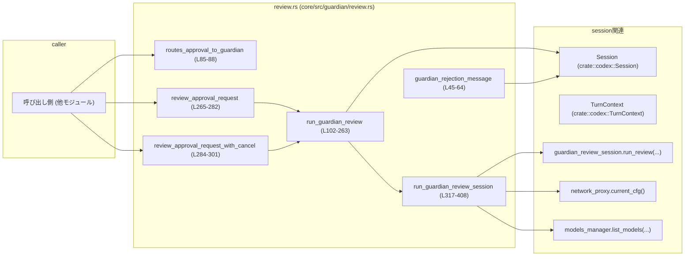

# core/src/guardian/review.rs コード解説

## 0. ざっくり一言

Guardian サブエージェントに「自動承認レビュー」を実行させ、その結果を `ReviewDecision`（Approve/Deny/Abort）として返しつつ、セッションイベントや拒否理由を一元管理するモジュールです。  
失敗・タイムアウト時には常に「ハイリスクの否認」として扱うことで **fail closed** を実現しています（core/src/guardian/review.rs:L100-201）。

---

## 1. このモジュールの役割

### 1.1 概要

- このモジュールは、ユーザー操作やエージェントの提案アクションに対して **Guardian レビュー（安全性審査）を実行し、その結果を統合的に扱う** ために存在します。
- Guardian 用の専用サブセッションを起動・再利用し、モデル選択やネットワーク設定を固定した「サンドボックス環境」でレビューを行います（L303-375）。
- レビューの途中経過や最終結果を `EventMsg::GuardianAssessment`・`EventMsg::Warning` としてセッションに通知し、否認時の理由を `guardian_rejections` に保存・取り出しします（L113-127, L218-255, L45-64, L230-239）。

### 1.2 アーキテクチャ内での位置づけ

主な依存関係とフローを簡略化した図です。



- 呼び出し側は `routes_approval_to_guardian` でこのターンを Guardian に回すべきかを判定し（L85-88）、`review_approval_request` / `_with_cancel` で実際のレビューを起動します（L265-301）。
- `run_guardian_review` がこのモジュールのコアで、イベント送信・結果の fail-closed 処理・拒否理由の保存などを行います（L102-263）。
- 実際の LLM 呼び出しやサンドボックスセッション管理は `session.guardian_review_session.run_review(...)` に委譲され、ここから `run_guardian_review_session` を通じて呼び出されます（L317-408）。

### 1.3 設計上のポイント

- **fail closed（安全側に倒す）**  
  - ネットワーク設定取得失敗・モデル設定生成失敗・Guardian セッションエラー・タイムアウト・出力パース失敗はすべて **High リスクの Deny** として扱います（L165-180, L325-329, L370-379, L398-405）。
- **状態管理の最小化**  
  - モジュール自身はほぼステートレスで、拒否理由だけを `session.services.guardian_rejections` に保存します（L230-239）。
- **非同期 & キャンセル対応**  
  - 主要関数は `async` で、`tokio_util::sync::CancellationToken` により **外部キャンセル** を受け付けます（L108-151, L317-324, L381-397）。
- **イベント駆動の観測性**  
  - Guardian レビューの開始・中断・完了はすべて `EventMsg::GuardianAssessment` / `WarningEvent` として送信され、外部から状態が観測しやすい構造になっています（L113-127, L134-147, L181-198, L218-223, L241-255）。

---

## 2. 主要な機能一覧（コンポーネントインベントリー）

### 2.1 定数・型

| 名前 | 種別 | 役割 / 用途 | 定義位置 |
|------|------|-------------|----------|
| `GUARDIAN_REJECTION_INSTRUCTIONS` | `&'static str` 定数 | Guardian による拒否時に、エージェントへ「回避や迂回をしないこと」などの指示を付与するメッセージ（L33-39）。 | core/src/guardian/review.rs:L33-39 |
| `GuardianReviewOutcome` | enum | Guardian レビューセッションの結果を表す内部用の状態。`Completed(Result<GuardianAssessment>)` / `TimedOut` / `Aborted` を持つ（L66-71）。 | core/src/guardian/review.rs:L66-71 |

### 2.2 関数（一覧）

| 関数名 | 公開範囲 | 概要 | 定義位置 |
|--------|----------|------|----------|
| `new_guardian_review_id()` | `pub(crate)` | UUID ベースの新しいレビュー ID を生成するユーティリティ（L41-43）。 | L41-43 |
| `guardian_rejection_message(session, review_id)` | `pub(crate)` `async` | 指定 ID の Guardian 拒否理由を取り出し、人間向けメッセージを構築する（L45-64）。 | L45-64 |
| `guardian_risk_level_str(level)` | `fn` (モジュール内のみ) | `GuardianRiskLevel` を `"low" / "medium" / "high" / "critical"` の文字列に変換（L73-79）。 | L73-79 |
| `routes_approval_to_guardian(turn)` | `pub(crate)` | このターンの OnRequest 承認を Guardian にルーティングするかどうか判定（L85-88）。 | L85-88 |
| `is_guardian_reviewer_source(session_source)` | `pub(crate)` | セッションソースが Guardian レビュワー由来かどうかを判定（L90-97）。 | L90-97 |
| `run_guardian_review(...)` | `async` (モジュール内のみ) | Guardian レビューのコアロジック。イベント送信・fail-closed 判定・拒否理由保存を行い `ReviewDecision` を返す（L102-263）。 | L102-263 |
| `review_approval_request(...)` | `pub(crate)` `async` | Guardian レビュー付き承認処理の公開エントリポイント（キャンセルなし版）（L265-282）。 | L265-282 |
| `review_approval_request_with_cancel(...)` | `pub(crate)` `async` | `CancellationToken` 付きの公開エントリポイント（L284-301）。 | L284-301 |
| `run_guardian_review_session(...)` | `pub(super)` `async` | Guardian サブセッション（サンドボックス）を構成・実行し、`GuardianReviewOutcome` にまとめて返す（L317-408）。 | L317-408 |

---

## 3. 公開 API と詳細解説

### 3.1 型一覧（構造体・列挙体など）

| 名前 | 種別 | 役割 / 用途 | フィールド | 定義位置 |
|------|------|-------------|------------|----------|
| `GuardianReviewOutcome` | enum | Guardian レビューセッションの結果を表現する内部用列挙体。`run_guardian_review_session` から `run_guardian_review` に返されます（L317-408）。 | - `Completed(anyhow::Result<GuardianAssessment>)` : 正常完了だが LLM 出力のパースが成功/失敗の両ケースを含む（L68-69）<br>- `TimedOut` : セッションがタイムアウトした（L69）。<br>- `Aborted` : 外部キャンセルなどで中断された（L70）。 | L66-71 |

`GuardianAssessment` や `GuardianRiskLevel` などの型は別モジュールで定義されており、このチャンクには定義が現れません。

### 3.2 関数詳細（主要 7 件）

#### `guardian_rejection_message(session: &Session, review_id: &str) -> String` （L45-64）

**概要**

- `run_guardian_review` が保存した Guardian の拒否理由を取り出し、人間向けの説明文を構築する関数です（L230-239 と連携）。
- 保存済み理由が無い、または空文字列の場合はデフォルトメッセージにフォールバックします（L51-56）。

**引数**

| 引数名 | 型 | 説明 |
|--------|----|------|
| `session` | `&Session` | セッション全体の状態への参照。`services.guardian_rejections` にアクセスします（L46-49）。 |
| `review_id` | `&str` | Guardian レビューを一意に識別する ID。`guardian_rejections` のキーとして使用します（L51）。 |

**戻り値**

- `String` : ユーザー／エージェントに提示する拒否メッセージ。拒否理由と `GUARDIAN_REJECTION_INSTRUCTIONS` を含みます（L58-62）。

**内部処理の流れ**

1. `session.services.guardian_rejections.lock().await` で拒否理由マップに対する排他ロックを取得します（L46-50）。
2. `remove(review_id)` で該当 ID の `GuardianRejection` を取り出し、マップから削除します（L51）。
3. `filter(|rejection| !rejection.rationale.trim().is_empty())` で空理由を除外します（L52-52）。
4. 見つからなかった場合は `GuardianRejection { rationale: "...", source: Agent }` を生成します（L53-56）。
5. `match rejection.source { Agent => ... }` でメッセージを整形し、理由と共通指示文を付加して返します（L57-62）。

**Examples（使用例）**

```rust
// Guardian レビュー後に拒否された場合に、ユーザーに理由を説明する例
async fn explain_guardian_rejection(session: &Session, review_id: String) {
    let message = guardian_rejection_message(session, &review_id).await;
    // 取得したメッセージをチャットレスポンスなどに使用する
    println!("{message}");
}
```

**Errors / Panics**

- この関数内には `unwrap` や `expect` はなく、明示的な `panic!` もありません。
- `guardian_rejections.lock()` がパニックを起こすケースは、このファイルからは読み取れません。

**Edge cases（エッジケース）**

- `review_id` に対応するエントリが存在しない場合: デフォルト文言 `"Guardian denied the action without a specific rationale."` を使用します（L53-55）。
- 保存された `rationale` が空または空白のみ: 同じくデフォルト文言にフォールバックします（L52-56）。
- この関数は `remove` を使うため、同じ `review_id` で二度呼び出しても二回目以降は常にデフォルト文言になります（L51）。

**使用上の注意点**

- 一度メッセージを取得するとエントリが削除されるため、**再利用したい場合は呼び出し側で文字列を保持**する必要があります（L51）。
- `ReviewDecision::Denied` を返した直後にのみ意味のある情報が入っている設計である点に留意します（L230-239）。

---

#### `routes_approval_to_guardian(turn: &TurnContext) -> bool` （L85-88）

**概要**

- 現在のターンの設定に基づき、「承認プロンプトを Guardian 経由で処理すべきか」を判定する関数です。

**引数**

| 引数名 | 型 | 説明 |
|--------|----|------|
| `turn` | `&TurnContext` | 現在のターンのコンテキスト。`approval_policy` と `config.approvals_reviewer` を参照します（L85-87）。 |

**戻り値**

- `bool` :  
  - `true` : 承認プロンプトを Guardian にルーティングすべき。  
  - `false` : 通常どおりユーザーなどにそのまま表示すべき。

**内部処理の流れ**

1. `turn.approval_policy.value() == AskForApproval::OnRequest` かどうかをチェックします（L86）。
2. `turn.config.approvals_reviewer == ApprovalsReviewer::GuardianSubagent` かどうかをチェックします（L87）。
3. 両方が `true` の場合にのみ `true` を返します（L86-87）。

**Examples（使用例）**

```rust
async fn maybe_route_to_guardian(
    session: &Arc<Session>,
    turn: &Arc<TurnContext>,
    request: GuardianApprovalRequest,
) -> ReviewDecision {
    if routes_approval_to_guardian(turn) {
        // Guardian によるレビューを実行
        review_approval_request(session, turn, new_guardian_review_id(), request, None).await
    } else {
        // ここでは Guardian を使わず、別の承認フローを実行する
        ReviewDecision::Approved  // 仮の例
    }
}
```

**Errors / Panics**

- 代入や unwrap はなく、panic の可能性は見当たりません（L85-88）。

**Edge cases**

- `approval_policy` が `OnRequest` 以外の場合は必ず `false` です（L86）。
- `config.approvals_reviewer` が `GuardianSubagent` 以外（例: ユーザー直接承認）なら `false` です（L87）。

**使用上の注意点**

- この関数は **ルーティングポリシーの判定だけ** を行い、実際のレビュー実行は呼び出し側が行う必要があります。
- 承認フローの変更時には `TurnContext` のフィールドとこの関数の条件を同期させる必要があります。

---

#### `is_guardian_reviewer_source(session_source: &codex_protocol::protocol::SessionSource) -> bool` （L90-97）

**概要**

- 与えられた `SessionSource` が **Guardian レビュワーセッション** からのものかどうかを判定します。

**引数**

| 引数名 | 型 | 説明 |
|--------|----|------|
| `session_source` | `&SessionSource` | セッションの起点を表す列挙体。SubAgent 名を含みます（L91-96）。 |

**戻り値**

- `bool` : Guardian レビュワーであれば `true`、それ以外は `false`。

**内部処理の流れ**

1. `matches!` マクロで `SessionSource::SubAgent(SubAgentSource::Other(name))` パターンをマッチングします（L93-96）。
2. `name == GUARDIAN_REVIEWER_NAME` のとき `true` を返します（L95-96）。
3. それ以外のケースはすべて `false` です。

**Examples**

```rust
fn handle_session_source(source: &codex_protocol::protocol::SessionSource) {
    if is_guardian_reviewer_source(source) {
        // Guardian レビュワー由来のセッションとして扱う
    } else {
        // 通常のセッションとして扱う
    }
}
```

**Errors / Panics**

- `matches!` は安全なパターンマッチであり、panic 要因はありません（L93-97）。

**Edge cases**

- Guardian が `SubAgentSource::Other` 以外（例: 別の variant）で表現されるようになった場合は `false` になります。この点は、外部の enum 定義と合わせて保守する必要があります。

**使用上の注意点**

- `GUARDIAN_REVIEWER_NAME` は `super` モジュールからインポートされており（L19）、名前の変更時にはここも更新が必要です。

---

#### `review_approval_request(...) -> ReviewDecision` （L265-282）

```rust
pub(crate) async fn review_approval_request(
    session: &Arc<Session>,
    turn: &Arc<TurnContext>,
    review_id: String,
    request: GuardianApprovalRequest,
    retry_reason: Option<String>,
) -> ReviewDecision
```

**概要**

- Guardian レビュー付き承認処理の **公開エントリポイント** です。
- キャンセルトークンを使わない標準ケースで `run_guardian_review` を呼び出します（L273-281）。

**引数**

| 引数名 | 型 | 説明 |
|--------|----|------|
| `session` | `&Arc<Session>` | セッション全体への共有ポインタ。内部で `Arc::clone` されます（L273-275）。 |
| `turn` | `&Arc<TurnContext>` | 現在のターン情報。こちらも `Arc::clone` されます（L273-275）。 |
| `review_id` | `String` | このレビューの ID。イベント送信や拒否理由保存に使用されます（L117, L186, L245）。 |
| `request` | `GuardianApprovalRequest` | Guardian に渡すレビュー対象リクエスト（L155, L320）。 |
| `retry_reason` | `Option<String>` | 再試行時の理由など、Guardian への補足情報として渡されるもの（L159, L321）。 |

**戻り値**

- `ReviewDecision` :  
  - `Approved` / `Denied` / `Abort` のいずれか。  
  - エラーやタイムアウトなども `Denied` または `Abort` に変換されます（L165-199, L258-262）。

**内部処理の流れ**

1. `Arc::clone` で `session` と `turn` をローカル `Arc` にクローンします（L273-275）。
2. `run_guardian_review(..., /*external_cancel*/ None)` を呼び、Guardian レビューを実施します（L273-280）。
3. そのまま `await` した結果を返します（L281）。

**Examples**

```rust
async fn run_guardian_flow(
    session: Arc<Session>,
    turn: Arc<TurnContext>,
    request: GuardianApprovalRequest,
) -> ReviewDecision {
    let review_id = new_guardian_review_id();
    review_approval_request(&session, &turn, review_id, request, None).await
}
```

**Errors / Panics**

- エラー自体は `run_guardian_review` 内で吸収され、`ReviewDecision` に変換されます（L165-180）。
- 本関数ではパニックを引き起こす処理はありません。

**Edge cases**

- `retry_reason` を `None` にしても問題なく動作します（L159）。

**使用上の注意点**

- `routes_approval_to_guardian` の判定を通過したケースで呼び出すことが想定されます（L85-88）。
- 実際の UI や上位ロジックでは `ReviewDecision::Denied` や `Abort` に応じて適切なメッセージやロールバック処理を行う必要があります。

---

#### `review_approval_request_with_cancel(...) -> ReviewDecision` （L284-301）

```rust
pub(crate) async fn review_approval_request_with_cancel(
    session: &Arc<Session>,
    turn: &Arc<TurnContext>,
    review_id: String,
    request: GuardianApprovalRequest,
    retry_reason: Option<String>,
    cancel_token: CancellationToken,
) -> ReviewDecision
```

**概要**

- `review_approval_request` のキャンセル対応版です。
- 外部から渡された `CancellationToken` を `run_guardian_review` と `run_guardian_review_session` に渡します（L292-298, L323）。

**追加の引数**

| 引数名 | 型 | 説明 |
|--------|----|------|
| `cancel_token` | `CancellationToken` | 外部キャンセルを表すトークン。Guardian レビュー処理全体を中断できます（L290, L292-298）。 |

**内部処理の流れ**

1. `Arc::clone` で `session` と `turn` をクローン（L292-295）。
2. `run_guardian_review(..., Some(cancel_token))` を呼び出し、キャンセル可能な Guardian レビューを実行（L292-298）。
3. 結果をそのまま返します（L300）。

**キャンセルの扱い（言語固有の並行性）**

- `run_guardian_review` 内で、最初に `external_cancel.is_some_and(is_cancelled)` をチェックし、すでにキャンセル済みなら即座に `ReviewDecision::Abort` を返しつつ `GuardianAssessmentStatus::Aborted` を送信します（L130-151）。
- その後も `run_guardian_review_session` に `external_cancel` が渡されるため、Guardian サブセッション内部でも適切にキャンセルされます（L155-162, L381-395）。

**使用上の注意点**

- 長時間かかる可能性のあるレビュー処理に対して、ユーザーキャンセルやシャットダウン処理を反映させたい場合はこちらの関数を利用します。
- キャンセルされた場合は `ReviewDecision::Abort` が返ることに注意し、呼び出し側で適切に区別する必要があります（L150, L198, L258-262）。

---

#### `run_guardian_review(...) -> ReviewDecision` （L102-263）

```rust
async fn run_guardian_review(
    session: Arc<Session>,
    turn: Arc<TurnContext>,
    review_id: String,
    request: GuardianApprovalRequest,
    retry_reason: Option<String>,
    external_cancel: Option<CancellationToken>,
) -> ReviewDecision
```

**概要**

- このモジュールのコア関数で、Guardian レビューのライフサイクル（開始イベント → セッション実行 → 結果評価 → イベント・拒否理由保存 → `ReviewDecision` 返却）を一括で行います。
- コメントにもある通り、「**常に fail closed**」で設計されており、タイムアウト・セッション失敗・パース失敗はすべて **High リスクの Deny** として扱われます（L100-101, L165-180）。

**引数**

| 引数名 | 型 | 説明 |
|--------|----|------|
| `session` | `Arc<Session>` | セッション全体。イベント送信・サービスアクセスに使用（L102-104, L113-127, L181-198, L218-223, L241-255）。 |
| `turn` | `Arc<TurnContext>` | 対象ターン。`sub_id` やモデル情報、設定が含まれます（L111, L156-158）。 |
| `review_id` | `String` | このレビューを一意に識別する ID（L117, L186, L245）。 |
| `request` | `GuardianApprovalRequest` | Guardian に渡すレビュー対象（L110-112, L155-161）。 |
| `retry_reason` | `Option<String>` | 再試行理由等のメタ情報（L159）。 |
| `external_cancel` | `Option<CancellationToken>` | 外部キャンセル。キャンセル済みの場合は即 Abort します（L130-151）。 |

**戻り値**

- `ReviewDecision` :  
  - `Approved` : Guardian が `Allow` を返した場合（L202-206, L224-227, L258-259）。  
  - `Denied` : Guardian が `Deny` もしくはエラー・タイムアウト・パース失敗を起こした場合（L165-180, L202-206, L258-262）。  
  - `Abort` : 外部キャンセルなどによりレビューが中断された場合（L134-151, L181-199）。

**内部処理の流れ**

1. **コンテキスト抽出と開始イベント送信**
   - `guardian_request_target_item_id` / `guardian_request_turn_id` / `guardian_assessment_action` で、対象アイテム ID・ターン ID・アクション要約を取得（L110-112）。
   - `GuardianAssessmentStatus::InProgress` のイベントを送信（L113-127）。

2. **事前キャンセルチェック**
   - `external_cancel.is_some_and(is_cancelled)` が `true` なら、`status: Aborted` のイベントを送信し（L134-147）、`ReviewDecision::Abort` を返す（L150）。

3. **Guardian サブセッション実行**
   - `guardian_output_schema()` から出力スキーマを取得し（L153）、`run_guardian_review_session` を呼び出して Guardian サブセッションを実行（L155-163）。

4. **結果の fail-closed 解釈**
   - `GuardianReviewOutcome::Completed(Ok(assessment))` : そのまま使用（L165-166）。
   - `Completed(Err(err))` : `GuardianAssessment` を High リスク・未知の認可・Deny で生成し、エラー内容を rationale に入れる（L167-172）。
   - `TimedOut` : High リスク・未知の認可・Deny、タイムアウトメッセージを rationale に使用（L173-180）。
   - `Aborted` : `status: Aborted` のイベントを送信し、`ReviewDecision::Abort` を返す（L181-199）。

5. **最終判定と警告イベント**
   - `assessment.outcome` が `Allow` なら `approved = true`、`Deny` なら `false`（L202-205）。
   - リスクレベル・ユーザー認可レベルを文字列化し、`WarningEvent` を送信（L206-217, L218-223）。

6. **拒否理由の保存と完了イベント**
   - `session.services.guardian_rejections.lock().await` でマップにアクセスし、  
     - Approved: `review_id` を削除（L230-233）。  
     - Denied: `GuardianRejection` を挿入（L234-239）。
   - `GuardianAssessmentStatus::Approved/Denied` とともに最終 `GuardianAssessmentEvent` を送信（L241-255）。

7. **最終 `ReviewDecision` の返却**
   - `approved` に応じて `ReviewDecision::Approved` または `Denied` を返します（L258-262）。

**Examples**

```rust
async fn run_single_review(
    session: Arc<Session>,
    turn: Arc<TurnContext>,
    request: GuardianApprovalRequest,
) -> ReviewDecision {
    let review_id = new_guardian_review_id();
    // 通常は外部から直接呼ばず、review_approval_request を使う
    review_approval_request(&session, &turn, review_id, request, None).await
}
```

**Errors / Panics**

- ネットワーク・モデル・Guardian セッションのエラーはすべて `GuardianAssessment` に変換され、High リスクの Deny となります（L165-180, L325-329, L370-379, L398-405）。
- 明示的な panic や unwrap は使用されていません。

**Edge cases**

- Guardian セッションが何らかの理由で出力を返さなかったり、`parse_guardian_assessment` が失敗した場合でも、`ReviewDecision::Denied` として安全側に倒れます（L165-172, L398-401）。
- 外部キャンセルトークンが途中でキャンセルされた場合、`run_guardian_review_session` 側で `GuardianReviewOutcome::Aborted` が返ると推測され、この関数内では `Abort` 判定になります（L181-199）。  
  （キャンセル検出の詳細は `run_guardian_review_session` および `guardian_review_session.run_review` の実装に依存し、このチャンクからは断定できません。）

**使用上の注意点**

- この関数はモジュール内部用であり、通常は `review_approval_request` / `_with_cancel` を介して利用します（L265-301）。
- すべてのエラーを Deny/Abort に変換するため、「Guardian が実行に成功したかどうか」を区別したい場合は、`GuardianAssessmentEvent` や Warning のログから判断する必要があります（L218-223, L241-255）。

---

#### `run_guardian_review_session(...) -> GuardianReviewOutcome` （L317-408）

```rust
pub(super) async fn run_guardian_review_session(
    session: Arc<Session>,
    turn: Arc<TurnContext>,
    request: GuardianApprovalRequest,
    retry_reason: Option<String>,
    schema: serde_json::Value,
    external_cancel: Option<CancellationToken>,
) -> GuardianReviewOutcome
```

**概要**

- Guardian を「ロックダウンされた再利用可能なレビューセッション」内で実行し、その結果を `GuardianReviewOutcome` として返す関数です（L303-316）。
- ネットワーク設定・モデル選択・Reasoning Effort を決定し、`session.guardian_review_session.run_review` によってレビューを実行します（L325-375, L381-395）。

**引数**

| 引数名 | 型 | 説明 |
|--------|----|------|
| `session` | `Arc<Session>` | 親セッション。Guardian サブセッション管理やサービスへのアクセスに使用（L317-318, L325-336, L381-385）。 |
| `turn` | `Arc<TurnContext>` | 親ターン。モデル情報・設定などを参照します（L319-323, L360-368, L392-393）。 |
| `request` | `GuardianApprovalRequest` | Guardian に渡すレビュー対象リクエスト（L320, L387）。 |
| `retry_reason` | `Option<String>` | 再試行理由など（L321, L388）。 |
| `schema` | `serde_json::Value` | Guardian 出力の JSON スキーマ。`guardian_output_schema()` から渡されます（L322, L389）。 |
| `external_cancel` | `Option<CancellationToken>` | 外部キャンセル。`run_review` に渡されます（L323, L394）。 |

**戻り値**

- `GuardianReviewOutcome` :  
  - `Completed(Ok(GuardianAssessment))` または `Completed(Err(anyhow::Error))`。  
  - `TimedOut` : Guardian サブセッションのタイムアウト。  
  - `Aborted` : キャンセルなどによる中断。

**内部処理の流れ**

1. **ネットワーク設定の取得**
   - `session.services.network_proxy.as_ref()` を確認し、存在すれば `current_cfg().await` で設定取得（L325-327）。
   - 取得成功時は `Some(config)`、失敗時は `GuardianReviewOutcome::Completed(Err(err))` で早期リターン（L327-329）。

2. **利用可能モデル一覧の取得**
   - `models_manager.list_models(RefreshStrategy::Offline).await` を呼び出し、事前に登録されたモデル一覧を取得（L332-336）。

3. **Reasoning Effort とモデルの選択**
   - クロージャ `preferred_reasoning_effort` を定義し、Low Reasoning Effort がサポートされていれば `Some(Low)` を使い、そうでなければ fallback を使う方針にします（L337-343）。
   - 事前定義の `GUARDIAN_PREFERRED_MODEL` が利用可能であればそれを使い、対応する reasoning_effort を計算（L344-359）。
   - なければ現在のターンのモデル (`turn.model_info.slug`) と Reasoning Effort を流用します（L360-368）。

4. **Guardian 用セッション設定の構築**
   - `build_guardian_review_session_config(turn.config.as_ref(), live_network_config.clone(), guardian_model.as_str(), guardian_reasoning_effort)` を呼び出し、Guardian セッションのスパンコンフィグを生成（L370-375）。
   - 失敗時は `GuardianReviewOutcome::Completed(Err(err))` を返します（L376-379）。

5. **Guardian サブセッションの実行**
   - `session.guardian_review_session.run_review(...)` を実行（L381-395）。
     - `parent_session` / `parent_turn` を指定し（L384-385）、
     - `spawn_config` に Guardian 専用設定を渡し（L386）、
     - `request`, `retry_reason`, `schema`, `model`, `reasoning_effort`, `reasoning_summary`, `personality`, `external_cancel` を含めて実行します（L387-394）。

6. **結果のマッピング**
   - `GuardianReviewSessionOutcome::Completed(Ok(last_agent_message))` → JSON 出力を `parse_guardian_assessment(last_agent_message.as_deref())` でパースし、その `Result` を `GuardianReviewOutcome::Completed` に梱包（L398-401）。
   - `Completed(Err(err))` → そのまま `Err(err)` として `Completed` に包む（L403-405）。
   - `TimedOut` → `GuardianReviewOutcome::TimedOut`（L406）。
   - `Aborted` → `GuardianReviewOutcome::Aborted`（L407）。

**Errors / Panics**

- ネットワーク設定取得エラー: `GuardianReviewOutcome::Completed(Err(err))`（L325-329）。
- Guardian セッション設定生成エラー: 同様に `Completed(Err(err))`（L370-379）。
- Guardian からのレスポンスパースエラー: `parse_guardian_assessment` の `Err` として `Completed(Err(err))` になります（L398-401）。
- panic を起こす箇所はこの関数内にはありません。

**Edge cases**

- `session.services.network_proxy` が `None` の場合、`live_network_config` は `None` となり、ネットワーク無しの設定として Guardian を実行する前提になります（L325-331）。
- `available_models` が空の場合でも、`preferred_model` が `None` になるだけで、`turn.model_info.slug` にフォールバックする構造になっています（L344-347, L360-368）。
- `guardian_reasoning_effort` は `Option<ReasoningEffort>` であり、Low がサポートされず fallback も `None` の場合は `None` になり得ます。`build_guardian_review_session_config` 側でどのように扱うかは、このチャンクからは分かりません。

**使用上の注意点**

- この関数は `pub(super)` であり、通常は `run_guardian_review` 経由で使用されることが想定されます（L155-161）。
- 「Guardian のプロンプト構造や sandbox 方針」を変えたい場合は、この関数ではなく `build_guardian_review_session_config` 側を中心に変更する必要があります（L370-375）。

---

### 3.3 その他の関数（ユーティリティ）

| 関数名 | 概要 | 定義位置 |
|--------|------|----------|
| `new_guardian_review_id() -> String` | `uuid::Uuid::new_v4().to_string()` で新しいレビュー ID を生成する単純なヘルパーです（L41-43）。 | L41-43 |
| `guardian_risk_level_str(level: GuardianRiskLevel) -> &'static str` | `GuardianRiskLevel::Low/Medium/High/Critical` を `"low" / "medium" / "high" / "critical"` に変換する内部ユーティリティです（L73-79）。`run_guardian_review` 内の Warning メッセージで使用されます（L215）。 | L73-79 |

---

## 4. データフロー

### 4.1 代表的な処理シナリオ：Guardian レビュー付き承認

以下は `review_approval_request` から始まる典型的なフローです。  
図中の関数名には行番号をコメントとして添えています。

```mermaid
sequenceDiagram
    participant Caller as 呼び出し側
    participant ReviewMod as review.rs (core/src/guardian/review.rs)
    participant Session as Session
    participant GRSess as guardian_review_session

    Caller->>ReviewMod: review_approval_request(&Arc<Session>, &Arc<TurnContext>, review_id, request, retry_reason) (L265-282)
    activate ReviewMod

    Note right of ReviewMod: run_guardian_review(...) (L102-263)

    ReviewMod->>Session: send_event(GuardianAssessment{status: InProgress}) (L113-127)

    alt external_cancel is cancelled (L130-151)
        ReviewMod->>Session: send_event(GuardianAssessment{status: Aborted}) (L134-147)
        ReviewMod-->>Caller: ReviewDecision::Abort (L150)
        deactivate ReviewMod
    else normal path
        ReviewMod->>ReviewMod: run_guardian_review_session(...) (L155-163, L317-408)
        activate GRSess
        GRSess->>Session: network_proxy.current_cfg() (L325-329)
        GRSess->>Session: models_manager.list_models(...) (L332-336)
        GRSess->>Session: guardian_review_session.run_review(params) (L381-395)
        GRSess-->>ReviewMod: GuardianReviewOutcome (L398-407)
        deactivate GRSess

        ReviewMod->>ReviewMod: outcome -> GuardianAssessment (fail-closed) (L165-180)

        alt Completed(Ok(assessment))
            Note right of ReviewMod: assessment.outcome == Allow/Deny (L202-205)
        else Completed(Err) or TimedOut
            Note right of ReviewMod: synthesize High-risk Deny (L167-180)
        else Aborted
            ReviewMod->>Session: send_event(GuardianAssessment{status: Aborted}) (L181-198)
            ReviewMod-->>Caller: ReviewDecision::Abort (L198)
            deactivate ReviewMod
        end

        ReviewMod->>Session: send_event(Warning{...}) (L218-223)
        ReviewMod->>Session: update guardian_rejections (L230-239)
        ReviewMod->>Session: send_event(GuardianAssessment{status: Approved/Denied}) (L241-255)
        ReviewMod-->>Caller: ReviewDecision::Approved/Denied (L258-262)
        deactivate ReviewMod
    end
```

このフローから分かる通り:

- ネットワーク・モデル・Guardian セッションのエラーは `GuardianReviewOutcome::Completed(Err(_))` や `TimedOut` として返され、それらはすべて High リスクの `GuardianAssessment` に変換されます（L165-180, L325-329, L370-379, L398-405）。
- `guardian_rejections` には **Denied のときだけ** エントリが追加され、Approved のときは削除されます（L230-239）。

---

## 5. 使い方（How to Use）

### 5.1 基本的な使用方法

典型的には、ターン開始時に `routes_approval_to_guardian` でルーティングを判定し、Guardian に回すべき承認リクエストに対して `review_approval_request` を呼び出します。

```rust
use std::sync::Arc;
use tokio_util::sync::CancellationToken;

async fn handle_action_with_guardian(
    session: Arc<Session>,
    turn: Arc<TurnContext>,
    request: GuardianApprovalRequest,
) -> anyhow::Result<()> {
    // このターンが Guardian レビュー対象か判定
    if routes_approval_to_guardian(&turn) {
        let review_id = new_guardian_review_id(); // (L41-43)
        let decision = review_approval_request(&session, &turn, review_id.clone(), request, None).await; // (L265-282)

        match decision {
            ReviewDecision::Approved => {
                // アクションを実行
            }
            ReviewDecision::Denied => {
                // Guardian の拒否理由を取得してユーザーに説明
                let msg = guardian_rejection_message(&session, &review_id).await; // (L45-64)
                println!("Denied: {msg}");
            }
            ReviewDecision::Abort => {
                // キャンセル/中断として扱う
            }
        }
    } else {
        // 通常の承認フロー
    }

    Ok(())
}
```

### 5.2 よくある使用パターン

#### パターン 1: キャンセル対応のレビュー

長時間かかる可能性があるレビューには、`CancellationToken` を使ったバージョンを利用します。

```rust
async fn handle_with_cancellable_guardian(
    session: Arc<Session>,
    turn: Arc<TurnContext>,
    request: GuardianApprovalRequest,
    cancel_token: CancellationToken,
) -> ReviewDecision {
    let review_id = new_guardian_review_id();
    review_approval_request_with_cancel(&session, &turn, review_id, request, None, cancel_token).await // (L284-301)
}
```

#### パターン 2: Guardian 由来セッションの判別

Guardian レビュワーからのセッションかどうかで処理を分けたい場合に `is_guardian_reviewer_source` を使えます（L90-97）。

```rust
fn route_by_session_source(source: &codex_protocol::protocol::SessionSource) {
    if is_guardian_reviewer_source(source) {
        // Guardian レビュワー用のハンドリング
    } else {
        // 通常ハンドリング
    }
}
```

### 5.3 よくある間違いと正しい例

```rust
// 間違い例: Guardian レビュー結果を無視してアクションを実行してしまう
async fn bad_example(session: Arc<Session>, turn: Arc<TurnContext>, request: GuardianApprovalRequest) {
    let review_id = new_guardian_review_id();
    let _ = review_approval_request(&session, &turn, review_id, request, None).await;
    // ReviewDecision を無視して続行してしまうのは危険
}

// 正しい例: ReviewDecision に基づいて分岐
async fn good_example(session: Arc<Session>, turn: Arc<TurnContext>, request: GuardianApprovalRequest) {
    let review_id = new_guardian_review_id();
    let decision = review_approval_request(&session, &turn, review_id.clone(), request, None).await;

    match decision {
        ReviewDecision::Approved => {
            // 安全と判断して実行
        }
        ReviewDecision::Denied => {
            // 実行せず、ユーザーへ理由を提示
        }
        ReviewDecision::Abort => {
            // キャンセルやシステム停止などとして扱う
        }
    }
}
```

### 5.4 使用上の注意点（まとめ）

- **非同期必須**: 主要関数はすべて `async fn` のため、Tokio などの非同期ランタイム内で実行する必要があります。
- **fail closed の理解**: エラーやタイムアウトも Deny として扱われるため、「Guardian の結果が取れなかった」場合もアクションは実行されない前提で設計する必要があります（L165-180）。
- **一度きりの拒否メッセージ**: `guardian_rejection_message` は `remove` を使うため、同じ `review_id` に対して何度も呼ぶと情報が失われます（L51）。
- **キャンセル処理**: キャンセルした場合は `ReviewDecision::Abort` になるため、ユーザーキャンセルと Guardian の否認を区別して扱うロジックが必要です（L130-151, L181-199）。

---

## 6. 変更の仕方（How to Modify）

### 6.1 新しい機能を追加する場合

1. **Guardian レビューの結果に新たな状態を追加したい場合**
   - 例: 「ユーザー再確認が必要」といった中間状態。
   - `GuardianAssessmentOutcome` や関連イベント型に新しい variant を追加する必要がありますが、これらはこのチャンク外の定義です。
   - そのうえで、`run_guardian_review` の `assessment.outcome` マッチ部分（L202-205）と `GuardianAssessmentStatus` の決定（L224-227）を拡張し、追加状態を適切に `ReviewDecision` へマッピングする必要があります。

2. **Guardian 出力スキーマを拡張したい場合**
   - `guardian_output_schema()` と `parse_guardian_assessment` は別モジュールにあります（L27-28）。
   - スキーマ変更に応じて `parse_guardian_assessment` の返す `GuardianAssessment` を更新し、このモジュールではそのフィールドを適宜イベントに反映するだけで済みます（L245-252）。

3. **モデル選択ロジックの変更**
   - Guardian 用に特定のモデルや Reasoning Effort を強制したい場合は、`run_guardian_review_session` 内のモデル選択ロジック（L344-359, L360-368）を変更します。
   - その際、`build_guardian_review_session_config` 呼び出し部分（L370-375）と整合性を取る必要があります。

### 6.2 既存の機能を変更する場合の注意点

- **fail closed 方針の変更**
  - `run_guardian_review` の `match outcome` 部分（L165-199）を変更することになります。
  - エラーやタイムアウトを Allow に変えると安全性に影響するため、設計ポリシーに沿って慎重に検討する必要があります。

- **イベントスキーマの変更**
  - `GuardianAssessmentEvent` のフィールド追加・変更を行う場合、  
    - InProgress イベント（L113-127）、  
    - Aborted イベント（L134-147, L181-198）、  
    - 最終イベント（L241-255）  
    のすべてを一貫して更新する必要があります。

- **拒否理由管理の変更**
  - `guardian_rejections` の構造を変更する場合は、  
    - 保存側（L230-239）  
    - 読み出し側 `guardian_rejection_message`（L45-64）  
    の両方を合わせて変更する必要があります。

---

## 7. 関連ファイル

このモジュールと密接に関係する他ファイル・型は以下のとおりです（名前と利用箇所のみ、目的は名称から推測されますが、詳細な実装はこのチャンクにはありません）。

| パス / 型 | 役割 / 関係（このチャンクから分かる範囲） |
|-----------|-------------------------------------------|
| `crate::codex::Session` | セッション全体の状態とサービス（`services.network_proxy`, `services.models_manager`, `services.guardian_rejections`, `guardian_review_session` など）を提供。イベント送信メソッド `send_event` が使われています（L16, L46-50, L113-127, L181-198, L218-223, L230-239, L241-255, L325-336, L381-395）。 |
| `crate::codex::TurnContext` | 各ターンの設定・モデル情報・サブ ID などを保持。`routes_approval_to_guardian` やモデル選択に利用されています（L17, L85-88, L111, L360-368, L392-393）。 |
| `super::approval_request` モジュール | `guardian_assessment_action`, `guardian_request_target_item_id`, `guardian_request_turn_id` を提供し、Guardian レビュー対象リクエストのメタ情報抽出に使われます（L24-26, L110-112）。 |
| `super::prompt` モジュール | `guardian_output_schema`, `parse_guardian_assessment` を提供し、Guardian 出力のスキーマとパース処理を定義します（L27-28, L153, L398-401）。 |
| `super::review_session` モジュール | `GuardianReviewSessionOutcome`, `GuardianReviewSessionParams`, `build_guardian_review_session_config` を提供し、Guardian サンドボックスセッションの設定および実行結果を扱います（L29-31, L370-379, L381-407）。 |
| `codex_protocol::protocol::*` | Guardian 関連のプロトコル型（`GuardianAssessment`, `GuardianRiskLevel`, `GuardianUserAuthorization`, `GuardianAssessmentEvent`, `ReviewDecision`, `WarningEvent` など）を定義し、このモジュールの主要な I/O 型として使用されています（L3-13, L21-22, L33-39, L113-127, L181-198, L218-223, L241-255）。 |

このチャンクにはテストコード（`#[cfg(test)]` セクションなど）は含まれていません。そのため、テスト戦略については別ファイルを確認する必要があります。
