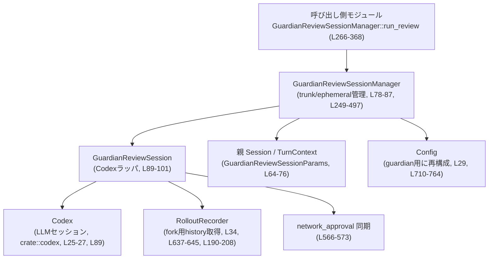

# core/src/guardian/review_session.rs コード解説

## 0. ざっくり一言

Guardian レビュー用のサブエージェント（Codex セッション）を管理し、  
親セッションからの「GuardianApprovalRequest」に対して、タイムアウト・キャンセル・コンフィグ拘束付きでレビューを実行するモジュールです。

---

## 1. このモジュールの役割

### 1.1 概要

- このモジュールは **Guardian レビュー用の Codex セッションを再利用／一時生成しつつ、安全な設定でレビューを実行する** ために存在します。
- タイムアウト・外部キャンセル・Codex 側のイベント（完了／エラー／中断）に応じて、  
  `GuardianReviewSessionOutcome`（Completed / TimedOut / Aborted）を返します（`core/src/guardian/review_session.rs:L57-L62`）。
- Guardian セッション用の `Config` を生成し、ネットワークやツール利用を強く制限することで、安全なレビュー環境を構成します（`build_guardian_review_session_config`、`L710-L764`）。

### 1.2 アーキテクチャ内での位置づけ

主なコンポーネント間の依存関係は以下の通りです。



- 呼び出し側は `GuardianReviewSessionManager::run_review` を通じてレビューを要求します（`L266-L368`）。
- Manager は `GuardianReviewSession`（trunk または ephemeral）を選択／生成し、`Codex` セッション上で `Op::UserTurn` を実行します（`L575-L599`）。
- Codex セッションのイベントストリームを `wait_for_guardian_review` で監視し、完了結果を `GuardianReviewSessionOutcome` にまとめて返します（`L648-L708`）。

### 1.3 設計上のポイント

- **セッション再利用と一時セッション**
  - trunk（長寿命）と ephemeral（一時）レビューセッションを区別して管理します（`GuardianReviewSessionState`, `L83-L87`）。
  - `GuardianReviewSessionReuseKey` により、「設定が同一なら trunk を再利用、異なるなら使い捨て」とするポリシーを実装しています（`L115-L142`, `L144-L170`）。

- **非同期・並行性**
  - `Arc` + `tokio::sync::Mutex` により、複数タスクからの `GuardianReviewSessionManager` 共有を前提とした設計です（`L21`, `L78-L81`）。
  - `run_before_review_deadline` / `run_before_review_deadline_with_cancel` と `CancellationToken` により、  
    「レビューの締切」と「外部キャンセル」を統一的に扱う仕組みになっています（`L766-L782`, `L784-L795`）。

- **エラーハンドリング**
  - 完了結果は `GuardianReviewSessionOutcome::Completed(anyhow::Result<Option<String>>)` という 2 層の Result で表現されます（`L57-L60`）。
    - 外側の `GuardianReviewSessionOutcome` はタイムアウトや中断などプロトコルレベルの状態。
    - 内側の `anyhow::Result` は Codex セッション内のエラー（例: モデルエラー）を表現。

- **安全な実行環境**
  - Guardian セッション用 `Config` では:
    - 常に `AskForApproval::Never`、`SandboxPolicy::new_read_only_policy()` を強制（`L726-L728`）。
    - ネットワーク権限がある場合のみ、制約付きの `NetworkProxySpec` を構成（`L729-L743`）。
    - 一部の機能フラグ（SpawnCsv / Collab / WebSearchRequest / WebSearchCached）を disable し、disable できなければエラーとします（`L744-L762`）。

- **リソースクリーンアップ**
  - セッション終了時は `GuardianReviewSession::shutdown` で `CancellationToken` をキャンセルし、`codex.shutdown_and_wait()` を待ちます（`L173-L177`）。
  - Ephemeral セッションは RAII 的に `EphemeralReviewCleanup` の Drop 実装でクリーンアップされます（`L103-L106`, `L211-L225`, `L227-L247`）。

---

## 2. 主要な機能一覧

- Guardian レビューセッションの再利用管理: trunk / ephemeral セッションを `GuardianReviewSessionManager` が管理（`L78-L87`, `L249-L497`）。
- Guardian レビューの実行: `GuardianReviewSessionManager::run_review` と `run_review_on_session`（`L266-L368`, `L539-L623`）。
- Codex セッションイベントの監視と結果収集: `wait_for_guardian_review`（`L648-L708`）。
- Guardian 用 Config 生成と権限制御: `build_guardian_review_session_config`（`L710-L764`）。
- デッドライン／キャンセル対応のラッパ: `run_before_review_deadline` / `run_before_review_deadline_with_cancel`（`L766-L795`）。
- Codex ターンの割り込みと drain: `interrupt_and_drain_turn`（`L797-L815`）。
- Rollout フォーク用の履歴スナップショット取得: `load_rollout_items_for_fork` と `GuardianReviewSession::refresh_last_committed_fork_snapshot`（`L637-L645`, `L190-L208`）。

---

## 3. 公開 API と詳細解説

### 3.1 型一覧（構造体・列挙体など）

| 名前 | 種別 | 可視性 | 役割 / 用途 | 定義位置 |
|------|------|--------|------------|----------|
| `GuardianReviewSessionOutcome` | enum | `pub(crate)` | レビューセッションの結果（成功/タイムアウト/中断）を表す（内部の `anyhow::Result` で Codex 側エラーを表現） | `core/src/guardian/review_session.rs:L57-L62` |
| `GuardianReviewSessionParams` | struct | `pub(crate)` | レビュー実行時に必要な親セッション・モデル名・スキーマ等をまとめたパラメータ | `L64-L76` |
| `GuardianReviewSessionManager` | struct | `pub(crate)` | trunk/ephemeral Guardian セッションのライフサイクルとレビュー実行を管理 | `L78-L81` |
| `GuardianReviewSessionState` | struct | private | Manager の内部状態（trunk と active ephemeral セッション一覧） | `L83-L87` |
| `GuardianReviewSession` | struct | private | 1 つの Guardian Codex セッションとその状態（取消トークン・再利用キーなど） | `L89-L95` |
| `GuardianReviewState` | struct | private | レビュー回数・最後の transcript cursor・フォークスナップショットなどセッション内部状態 | `L97-L101` |
| `EphemeralReviewCleanup` | struct | private | ephemeral セッションを state から外しつつ shutdown するための RAII ヘルパ | `L103-L106` |
| `GuardianReviewForkSnapshot` | struct | private, Clone | fork 用の初期履歴・prior_review_count・cursor をまとめたスナップショット | `L108-L113` |
| `GuardianReviewSessionReuseKey` | struct | private, Debug+Clone+PartialEq | セッション再利用判定に使うキー。モデル・権限・各種パス等「挙動に影響する設定」を含む | `L115-L142` |

### 3.2 詳細解説（主要関数）

以下では特に重要な関数 7 件を選び、詳細に説明します。

---

#### 1. `GuardianReviewSessionManager::run_review(&self, params: GuardianReviewSessionParams) -> GuardianReviewSessionOutcome`

**定義位置**: `core/src/guardian/review_session.rs:L266-L368`  
**可視性**: `pub(crate)`  
**概要**

- Guardian レビューを 1 回実行するメインエントリです。
- 既存の trunk セッションが再利用可能かを判定し、必要に応じて新規 trunk または ephemeral セッションを生成してレビューを実行します。
- タイムアウト／外部キャンセルを `GuardianReviewSessionOutcome::TimedOut` / `::Aborted` として返します。

**引数**

| 引数名 | 型 | 説明 |
|--------|----|------|
| `params` | `GuardianReviewSessionParams` | 親セッション、モデル名、JSON スキーマ、外部キャンセルトークンなど、レビューに必要な情報 |

**戻り値**

- `GuardianReviewSessionOutcome`  
  - `Completed(anyhow::Result<Option<String>>)` : Codex セッションがターンを完了した場合の結果。内部 `Err` は Codex 側のエラー。`Ok(Some(String))` は Guardian エージェントの最終メッセージ（JSON等）を想定。`Ok(None)` はメッセージが無い完了。
  - `TimedOut` : `GUARDIAN_REVIEW_TIMEOUT` までに処理が完了しなかった場合（`L270`）。
  - `Aborted` : 外部 `CancellationToken` がキャンセルされた場合。

**内部処理の流れ**

1. デッドラインと再利用キーを決定  
   - `deadline = now + GUARDIAN_REVIEW_TIMEOUT`（`L270`）。  
   - `next_reuse_key = GuardianReviewSessionReuseKey::from_spawn_config(&params.spawn_config)`（`L271`）。

2. state ロックの取得をデッドライン・外部キャンセル付きで行う  
   - `run_before_review_deadline(deadline, params.external_cancel.as_ref(), self.state.lock())` で `Mutex` ロックを試行（`L273-L278`）。
   - ロックが取得できないままタイムアウト or 外部キャンセルされた場合は `TimedOut` / `Aborted` を即返します。

3. trunk セッションの再利用判定・古い trunk の shutdown  
   - `state.trunk` が存在し、`reuse_key` が `next_reuse_key` と異なり、かつ `review_lock.try_lock().is_ok()` な場合、  
     その trunk を `stale_trunk_to_shutdown` に移し、state から取り除きます（`L281-L286`）。
   - この時点では trunk は利用中ではない（`try_lock` 成功）ことを確認しています。

4. trunk セッションが無ければ新規生成  
   - `state.trunk.is_none()` の場合、新しい `CancellationToken` を作成し（`L289`）、  
     `spawn_guardian_review_session` を `run_before_review_deadline_with_cancel` で呼び出します（`L290-L301`）。
     - spawn 中にタイムアウト/キャンセルした場合は、spawn 用 cancel_token をキャンセルし、`TimedOut` / `Aborted` を返します（`L784-L795`）。

5. trunk セッションの確定  
   - state トランザクション終了後、`trunk_candidate` に trunk をクローンし（`L313-L316`）、  
     古い trunk があれば `shutdown_in_background` で非同期 shutdown を開始します（`L318-L320`）。
   - trunk が存在しない場合はエラーとして `Completed(Err(anyhow!("guardian review session was not available after spawn")))` を返します（`L322-L325`）。

6. reuse_key に基づく trunk or ephemeral の選択  
   - `trunk.reuse_key != next_reuse_key` なら trunk を使わず `run_ephemeral_review` で ephemeral セッションを利用（`L328-L337`）。

7. trunk の `review_lock` による同時実行制御  
   - `trunk.review_lock.try_lock()` に成功した場合のみ trunk を使い、失敗した場合は trunk が「現在レビュー中」とみなし、  
     `run_ephemeral_review` で ephemeral セッションを利用します（`L339-L351`）。

8. trunk セッション上でレビュー実行  
   - `run_review_on_session(trunk.as_ref(), &params, deadline).await` を呼び、  
     `(outcome, keep_review_session)` を受け取ります（`L353-L355`）。
   - `keep_review_session && outcome が Completed(...)` の場合は `refresh_last_committed_fork_snapshot` で snapshot を更新（`L355-L357`）。

9. trunk の保持／破棄判定  
   - `keep_review_session == false` の場合、`remove_trunk_if_current` で trunk を state から取り除き、  
     `shutdown_in_background` で完全に終了させます（`L360-L367`）。

**Examples（使用例）**

以下は、同一 `GuardianReviewSessionManager` に対して複数回レビューを実行する想定の簡略例です。

```rust
// GuardianReviewSessionManager を共有しておき、複数のレビューを順に実行する例
async fn run_guardian_reviews(
    manager: Arc<GuardianReviewSessionManager>,        // 共有マネージャ（L78-L81）
    parent_session: Arc<Session>,                      // 親セッション（L64-L66）
    parent_turn: Arc<TurnContext>,                     // 親ターンコンテキスト（L64-L67）
    base_config: Config,                               // 親用 Config（L29, L710）
    request: GuardianApprovalRequest,                  // レビュー対象リクエスト（L41, 型定義は別モジュール）
    schema: serde_json::Value,                         // 最終出力 JSON スキーマ（L70）
) -> anyhow::Result<()> {
    // Guardian 用 Config を生成（ネットワーク・権限を制限）
    let guardian_config = build_guardian_review_session_config(
        &base_config,
        /* live_network_config */ None,
        "gpt-4-guardian-model",
        /* reasoning_effort */ None,
    )?;                                                 // L710-L764

    let params = GuardianReviewSessionParams {         // L64-L76
        parent_session: Arc::clone(&parent_session),
        parent_turn: Arc::clone(&parent_turn),
        spawn_config: guardian_config,
        request,
        retry_reason: None,
        schema,
        model: "gpt-4-guardian-model".to_string(),
        reasoning_effort: None,
        reasoning_summary: ReasoningSummaryConfig::default(),
        personality: None,
        external_cancel: None,
    };

    let outcome = manager.run_review(params).await;    // L266-L368

    match outcome {
        GuardianReviewSessionOutcome::Completed(inner) => {
            match inner {
                Ok(maybe_json) => {
                    if let Some(json) = maybe_json {
                        println!("Guardian result: {json}");
                    }
                }
                Err(e) => eprintln!("Guardian review error: {e:?}"),
            }
        }
        GuardianReviewSessionOutcome::TimedOut => {
            eprintln!("Guardian review timed out");
        }
        GuardianReviewSessionOutcome::Aborted => {
            eprintln!("Guardian review aborted");
        }
    }
    Ok(())
}
```

**Errors / Panics**

- `Completed(Err(..))` になりうるケース:
  - `spawn_guardian_review_session` 内の `run_codex_thread_interactive` が `Err` を返した場合（`L514-L524`, `L505-L525`）。
  - Codex からのイベント取得 (`codex.next_event`) が `Err` を返した場合（`L698-L702`）。
  - `run_review_on_session` 内で `build_guardian_prompt_items` や `codex.submit` が `Err` の場合（`L575-L582`, `L583-L599`, `L606-L613`）。
- `TimedOut`:
  - state ロック取得・セッション spawn・Codex submit・レビュー完了待ちなど、  
    `run_before_review_deadline` を通した箇所でデッドラインを超えた場合（`L273-L278`, `L290-L301`, `L562-L603`）。
- `Aborted`:
  - 上記と同じ箇所で外部 `CancellationToken` がキャンセルされた場合。

panic を直接発生させるコードはこのファイル内にはありません（`unwrap` / `expect` はテストコード以外では使用されていません）。

**Edge cases（エッジケース）**

- trunk セッションが取得できなかった場合  
  → `"guardian review session was not available after spawn"` というメッセージの `Err` で `Completed` が返ります（`L322-L325`）。
- trunk の `reuse_key` が変更された後、別のスレッドが trunk をすぐに使い始めた場合  
  → このコードは `try_lock` に成功したときのみ stale とみなすため、そのような競合は `stale_trunk_to_shutdown` の対象になりません（`L281-L286`）。  
    そのため「古い設定でレビューが行われる可能性」が残りますが、これは挙動レベルの問題であり、安全性には直接影響しません。

**使用上の注意点**

- `GuardianReviewSessionManager` は `Arc` で共有する前提の設計ですが、内部は `Mutex` により直列化されるため、極端な高頻度呼び出しでは待ち時間が増える可能性があります（`L78-L81`, `L249-L257`）。
- `params.external_cancel` を渡さない場合、キャンセルは `GUARDIAN_REVIEW_TIMEOUT` のみで制御されます。  
  長時間のレビューを確実に止めたい場合は `CancellationToken` を利用する必要があります（`L270`, `L273-L278`, `L562-L565`）。

---

#### 2. `GuardianReviewSessionManager::run_ephemeral_review(...) -> GuardianReviewSessionOutcome`

**定義位置**: `L457-L495`  
**概要**

- trunk を使えない（設定差分 or trunk 繁忙）場合に、一時的な Guardian セッションを生成してレビューを行います。
- ephemeral セッションはレビュー完了後、必ず `shutdown_in_background` でクリーンアップされます。

**引数**

| 引数名 | 型 | 説明 |
|--------|----|------|
| `params` | `GuardianReviewSessionParams` | レビュー実行パラメータ |
| `reuse_key` | `GuardianReviewSessionReuseKey` | ephemeral セッションの再利用キー（通常 trunk 不使用時のキー） |
| `deadline` | `tokio::time::Instant` | レビュー締切 |
| `fork_snapshot` | `Option<GuardianReviewForkSnapshot>` | trunk から分岐したスナップショット（あればその履歴を引き継ぐ） |

**内部処理の流れ**

1. `spawn_cancel_token` を生成し、`fork_config` を `ephemeral = true` に設定（`L464-L466`）。
2. `spawn_guardian_review_session` を `run_before_review_deadline_with_cancel` で呼び出し、  
   失敗やタイムアウト／キャンセル時には即 `Outcome` を返却（`L467-L484`）。
3. 生成された `review_session` を `register_active_ephemeral` で state に登録（`L485-L487`）。
4. `EphemeralReviewCleanup` を生成し、スコープ終了時のクリーンアップを準備（`L487-L488`）。
5. `run_review_on_session` でレビュー実行（`L490`）。
6. 正常に state から取り外せた場合（`take_active_ephemeral` が Some を返す）、  
   `cleanup.disarm()` で Drop 時の処理を無効化しつつ、`shutdown_in_background` を呼び出す（`L491-L494`）。

**Errors / Edge cases / 注意点**

- `spawn_guardian_review_session` のエラーは `Completed(Err(..))` として返されます（`L481-L483`）。
- `EphemeralReviewCleanup` が Drop されるケース（panic など）でも asynchronous cleanup が走るように設計されています（`L227-L247`）。
- `ephemeral = true` にしているため、Config 側で ephemeral セッションに特有の制約がある場合、その挙動に従います（`L465-L466`）。

---

#### 3. `spawn_guardian_review_session(...) -> anyhow::Result<GuardianReviewSession>`

**定義位置**: `L499-L537`  
**概要**

- 親セッション・ターンコンテキストから Guardian 用の Codex サブエージェントを起動し、`GuardianReviewSession` を組み立てるヘルパ関数です。

**引数**

| 引数名 | 型 | 説明 |
|--------|----|------|
| `params` | `&GuardianReviewSessionParams` | 親セッション・ターン・サービスなどを含むパラメータ |
| `spawn_config` | `Config` | Guardian セッションに使用する Config（事前に `build_guardian_review_session_config` などで加工されたもの） |
| `reuse_key` | `GuardianReviewSessionReuseKey` | セッション再利用キー |
| `cancel_token` | `CancellationToken` | セッション全体のキャンセル制御に使うトークン |
| `fork_snapshot` | `Option<GuardianReviewForkSnapshot>` | 既存 trunk からのフォーク情報（初期履歴に反映） |

**戻り値**

- `Ok(GuardianReviewSession)` : Codex サブエージェント起動に成功し、GuardianReviewSession が構築された場合。
- `Err(anyhow::Error)` : `run_codex_thread_interactive` がエラーを返した場合など。

**内部処理の流れ**

1. `fork_snapshot` の有無によって `initial_history` / `prior_review_count` / `initial_transcript_cursor` を決定（`L506-L513`）。
2. `run_codex_thread_interactive` を呼び出し、Guardian 用サブエージェントを起動（`L514-L523`）。
   - `SubAgentSource::Other(GUARDIAN_REVIEWER_NAME.to_string())` により、「Guardian レビューワー」として識別されます（`L521`）。
3. `GuardianReviewSession` を初期状態（`prior_review_count` など）で構築して返却（`L526-L536`）。

**注意点**

- この関数自体はデッドラインや外部キャンセルを直接扱わず、呼び出し側（`run_before_review_deadline_with_cancel`）がそれを包んでいます（`L467-L477`, `L784-L795`）。
- `cancel_token` は `run_codex_thread_interactive` に渡され、Codex セッションの中断に使用される前提です（`L520`）。

---

#### 4. `run_review_on_session(...) -> (GuardianReviewSessionOutcome, bool)`

**定義位置**: `L539-L623`  
**概要**

- 既に用意された `GuardianReviewSession` 上で実際の Guardian レビュー（1 ターン）を実行し、その結果と「セッションを保持してよいかどうか」のフラグを返します。

**引数**

| 引数名 | 型 | 説明 |
|--------|----|------|
| `review_session` | `&GuardianReviewSession` | レビューを実行する Codex セッション |
| `params` | `&GuardianReviewSessionParams` | 親セッション・モデル・スキーマなど |
| `deadline` | `tokio::time::Instant` | レビュー締切 |

**戻り値**

- `(GuardianReviewSessionOutcome, bool)`  
  - 第 1 要素: レビューの結果（Completed / TimedOut / Aborted）。
  - 第 2 要素: `keep_review_session` フラグ。`true` の場合、呼び出し側はこのセッションを trunk / ephemeral として再利用してよい。

**内部処理の流れ**

1. レビュー履歴に基づく `prompt_mode` 決定と followup リマインダ  
   - `prior_review_count` と `last_reviewed_transcript_cursor` を読み取り、  
     - 初回: `GuardianPromptMode::Full`  
     - 2 回目以降で cursor あり: `GuardianPromptMode::Delta { cursor }`  
     - cursor なし: `Full`  
     を選びます（`L544-L554`）。
   - `prior_review_count == 1`（2 回目のレビュー）であれば `append_guardian_followup_reminder` を呼び出してリマインダを付与（`L547`, `L558-L560`）。

2. Codex への UserTurn 提出（デッドライン付き）  
   - `run_before_review_deadline` で包んだ async ブロック内で以下を実行（`L562-L603`）:
     1. 親セッションの `network_approval` から Guardian セッションの `network_approval` へ、許可済みホストを同期（`L566-L573`）。
     2. `build_guardian_prompt_items` で Guardian 用のプロンプトを生成（`L575-L581`）。
     3. `review_session.codex.submit(Op::UserTurn { ... })` により、Guardian セッションにユーザーターンを投げる（`L583-L599`）。
   - 戻り値として `GuardianTranscriptCursor` を取得（`L601`）。

3. submit フェーズのエラー処理  
   - デッドライン／キャンセルで失敗した場合、`run_before_review_deadline` が `GuardianReviewSessionOutcome::TimedOut/Aborted` を返し、  
     `(outcome, false)` を返却（`L605-L608`）。
   - submit 自体が `Err` の場合は `Completed(Err(err))` とし、`keep=false`（`L609-L613`）。

4. レビュー完了待ち  
   - `wait_for_guardian_review` を呼んで Codex イベントストリームを監視し、 `(outcome, keep)` を取得（`L616-L617`）。
   - `outcome` が `Completed(...)` の場合のみ、`prior_review_count` と `last_reviewed_transcript_cursor` を更新（`L618-L622`）。

**Edge cases / 注意点**

- submit 前にタイムアウトした場合  
  → 実際には Codex ターンは開始されず、`TimedOut` か `Aborted` となり、`keep=false` です。
- `wait_for_guardian_review` で `Completed(Err(..))` になった場合でも `keep` は `true` になりうるため、  
  呼び出し側は「エラーだがセッション状態はまだ再利用可能」という判断ができます（`L676-L687`, `L680-L683`）。

---

#### 5. `wait_for_guardian_review(...) -> (GuardianReviewSessionOutcome, bool)`

**定義位置**: `L648-L708`  
**概要**

- Guardian Codex セッションからのイベントを監視し、ターンの完了・中断・エラー・タイムアウト・外部キャンセルを判定するループです。

**引数**

| 引数名 | 型 | 説明 |
|--------|----|------|
| `review_session` | `&GuardianReviewSession` | 監視対象セッション |
| `deadline` | `tokio::time::Instant` | レビュー締切 |
| `external_cancel` | `Option<&CancellationToken>` | 外部キャンセル用トークン |

**戻り値**

- `(GuardianReviewSessionOutcome, bool)`  
  - `TimedOut` / `Aborted` / `Completed(...)` のいずれか。  
  - `bool` は「このセッションを再利用してよいか」のヒント。  
    - `interrupt_and_drain_turn` が成功した場合のみ `true` になるパターンがあります（`L660-L671`）。

**内部処理の流れ（tokio::select!）**

1. デッドラインまでの `timeout` future を準備し pin（`L653-L654`）。
2. `loop { tokio::select! { ... } }` で 3 つの競合:
   - `timeout` 経過（`L659-L662`）
     - `interrupt_and_drain_turn` を呼んで Codex ターンを割り込み＋drain。
     - 成功なら `keep_review_session = true`、失敗なら false。
     - `GuardianReviewSessionOutcome::TimedOut` を返す。
   - `external_cancel` のキャンセル（`L663-L672`）
     - `timeout` と同様に `interrupt_and_drain_turn` を呼び、`Aborted` を返す。
   - `review_session.codex.next_event()` の結果（`L673-L705`）
     - `Ok(event)` の場合:
       - `EventMsg::TurnComplete(turn_complete)`  
         - `turn_complete.last_agent_message.is_none()` かつ `last_error_message` が Some の場合:  
           → `Completed(Err(anyhow!(error_message)))`（`L677-L683`）。
         - それ以外: `Completed(Ok(turn_complete.last_agent_message))`（`L685-L687`）。
       - `EventMsg::Error(error)`  
         → `last_error_message = Some(error.message)` を記録し、継続（`L690-L692`）。
       - `EventMsg::TurnAborted(_)`  
         → `Aborted` を返す（`L693-L695`）。
       - その他のイベントは無視（`L696`）。
     - `Err(err)`（イベントストリーム自体のエラー）  
       → `Completed(Err(err.into()))` とし、`keep=false`（`L698-L702`）。

**Errors / Edge cases / 注意点**

- Codex から `Error` イベントが来たが、その後に `TurnComplete` で `last_agent_message` が存在する場合、  
  エラーではなく成功として扱われます。これは「エラー後に回復して最終応答が出た」ケースを許容していると解釈できます（`L675-L687`）。
- `interrupt_and_drain_turn` 自体がタイムアウトした場合（内部で 5 秒の timeout）、  
  `keep_review_session` は `false` となり、そのセッションは上位で破棄されます（`L660-L662`, `L670-L671`, `L797-L815`）。

---

#### 6. `build_guardian_review_session_config(...) -> anyhow::Result<Config>`

**定義位置**: `L710-L764`  
**概要**

- 親の `Config` から Guardian レビュー用の設定を派生させます。
- モデル・開発者指示・権限・ネットワーク・機能フラグなどを Guardian 用に安全寄りに調整します。

**引数**

| 引数名 | 型 | 説明 |
|--------|----|------|
| `parent_config` | `&Config` | 親セッションの Config |
| `live_network_config` | `Option<codex_network_proxy::NetworkProxyConfig>` | 実際のネットワークプロキシ設定（あれば利用） |
| `active_model` | `&str` | Guardian セッションで使用するモデル名 |
| `reasoning_effort` | `Option<ReasoningEffort>` | モデルの reasoning effort 設定 |

**戻り値**

- `Ok(Config)` : Guardian 用に調整された Config。
- `Err(anyhow::Error)` : ネットワーク設定や feature disable に失敗した場合。

**内部処理のポイント**

1. 基本設定のコピーとモデル設定
   - `let mut guardian_config = parent_config.clone();`（`L716`）。
   - `guardian_config.model = Some(active_model.to_string());`（`L717`）。
   - `guardian_config.model_reasoning_effort = reasoning_effort;`（`L718`）。

2. Guardian 方針の developer_instructions を設定  
   - `parent_config.guardian_policy_config` があれば `guardian_policy_prompt_with_config`、  
     なければ `guardian_policy_prompt` を使用し、`developer_instructions` に設定（`L719-L725`）。

3. 権限の強制制限
   - 承認ポリシー: `AskForApproval::Never` のみを許可（`L726`）。
   - サンドボックス: `SandboxPolicy::new_read_only_policy()` のみを許可（`L727-L728`）。

4. ネットワーク設定
   - `live_network_config` が Some かつ `permissions.network` が Some のときのみ、  
     `NetworkProxySpec::from_config_and_constraints` を呼び出して `permissions.network` を再構成（`L729-L743`）。

5. 機能フラグの無効化と検証
   - `[Feature::SpawnCsv, Feature::Collab, Feature::WebSearchRequest, Feature::WebSearchCached]` を disable（`L744-L755`）。
   - disable に失敗した場合はエラー。
   - disable 後も `enabled(feature)` が true の場合は `anyhow::bail!` でエラー（`L756-L761`）。

**Security / Safety 観点**

- Guardian セッションは:
  - 書き込み無しのサンドボックス (`read_only`) で実行されます（`L727-L728`）。
  - ネットワーク権限は存在する場合でも `NetworkProxySpec::from_config_and_constraints` による制約が掛かります（`L732-L742`）。
  - 協調編集・CSV スポーン・Web 検索など、外部と強く連携する機能は disable されます（`L744-L762`）。
- これにより「Guardian がレビュー中に環境へ副作用を与えるリスク」を下げる設計になっています。

---

#### 7. `run_before_review_deadline_with_cancel<T>(...) -> Result<T, GuardianReviewSessionOutcome>`

**定義位置**: `L784-L795`  
（ベースとなる `run_before_review_deadline` は `L766-L782`）

**概要**

- 任意の Future に対し、デッドライン／外部キャンセルを適用し、  
  失敗時には付随する `CancellationToken` をキャンセルするヘルパ関数です。
- セッション spawn やレビュー submit といった「長くかかりうる処理」を安全にラップするために使われています。

**引数**

| 引数名 | 型 | 説明 |
|--------|----|------|
| `deadline` | `tokio::time::Instant` | 処理締切 |
| `external_cancel` | `Option<&CancellationToken>` | 外部キャンセルトークン |
| `cancel_token` | `&CancellationToken` | 対象処理（セッションなど）に紐づくキャンセルトークン |
| `future` | `impl Future<Output = T>` | 実行したい非同期処理 |

**戻り値**

- `Ok(T)` : future が正常に完了した場合。`cancel_token` はキャンセルされません（`L790-L794`）。
- `Err(GuardianReviewSessionOutcome::TimedOut)` : デッドライン超過。
- `Err(GuardianReviewSessionOutcome::Aborted)` : 外部キャンセル。

**内部処理**

1. `run_before_review_deadline` で `future` をラップし、結果を待ちます（`L790`）。
2. `result.is_err()` の場合（TimedOut / Aborted）、`cancel_token.cancel()` を呼び出します（`L791-L792`）。
3. 結果をそのまま返します（`L793-L794`）。

**Tests**

- `run_before_review_deadline_*` 系のテストが複数用意されており、タイムアウト・キャンセル・正常完了時の挙動が検証されています（`L853-L952`）。

---

### 3.3 その他の関数一覧

| 関数名 | 役割（1 行） | 定義位置 |
|--------|--------------|----------|
| `GuardianReviewSession::shutdown` | セッションの cancel_token をキャンセルし、`codex.shutdown_and_wait()` を待機 | `L173-L177` |
| `GuardianReviewSession::shutdown_in_background` | `tokio::spawn` で `shutdown` をバックグラウンド実行 | `L179-L184` |
| `GuardianReviewSession::fork_snapshot` | `last_committed_fork_snapshot` を取得 | `L186-L188` |
| `GuardianReviewSession::refresh_last_committed_fork_snapshot` | 現在の rollout 履歴を読み取り、フォークスナップショットを更新 | `L190-L208` |
| `EphemeralReviewCleanup::new` / `disarm` | ephemeral セッションの RAII クリーンアップ設定と解除 | `L211-L220`, `L222-L224` |
| `Drop for EphemeralReviewCleanup::drop` | ephemeral セッションを state から外した上で shutdown を非同期実行 | `L227-L247` |
| `GuardianReviewSessionManager::shutdown` | trunk とすべての ephemeral セッションを順に shutdown | `L250-L264` |
| `GuardianReviewSessionManager::cache_for_test` | テスト用に trunk セッションを直接キャッシュ | `L371-L386` |
| `GuardianReviewSessionManager::register_ephemeral_for_test` | テスト用に ephemeral セッションを直接登録 | `L389-L408` |
| `GuardianReviewSessionManager::committed_fork_rollout_items_for_test` | trunk の committed fork スナップショットから RolloutItem を取得 | `L410-L419` |
| `GuardianReviewSessionManager::remove_trunk_if_current` | 指定 trunk が現在の trunk なら state から取り除く | `L421-L435` |
| `GuardianReviewSessionManager::register_active_ephemeral` | ephemeral セッションを state に登録 | `L437-L443` |
| `GuardianReviewSessionManager::take_active_ephemeral` | 指定 ephemeral を state から取り除きつつ取得 | `L445-L455` |
| `append_guardian_followup_reminder` | 2 回目のレビュー時に Guardian 用 followup リマインダを会話履歴に追加 | `L626-L635` |
| `load_rollout_items_for_fork` | 現在の rollout パスから RolloutItem の配列を取得 | `L637-L645` |
| `run_before_review_deadline` | 汎用のデッドライン／外部キャンセル付きラッパ | `L766-L782` |
| `interrupt_and_drain_turn` | Codex に `Op::Interrupt` を送ってターン終了までイベントを drain | `L797-L815` |

---

## 4. データフロー

ここでは、trunk セッションを再利用して Guardian レビューを実行する代表的なフローを示します。

### 4.1 処理の要点

1. 呼び出し側が `GuardianReviewSessionManager::run_review` を呼ぶ。
2. Manager が trunk セッションを再利用するか、必要なら新規生成する。
3. `run_review_on_session` が Guardian 用プロンプトを構築し、Codex に `Op::UserTurn` を送る。
4. `wait_for_guardian_review` が Codex のイベントを監視し、最終結果を `GuardianReviewSessionOutcome` にまとめて返す。
5. Manager が trunk のスナップショットや prior_review_count を更新し、セッションの再利用可否を判断する。

### 4.2 シーケンス図

```mermaid
sequenceDiagram
    %% GuardianReviewSessionManager::run_review (L266-368) の典型フロー
    participant Caller as 呼び出し側
    participant Manager as GuardianReviewSessionManager
    participant State as GuardianReviewSessionState<br/>(Mutex, L83-87)
    participant Session as GuardianReviewSession<br/>(L89-95)
    participant Codex as Codex<br/>(L89, L514-524)

    Caller->>Manager: run_review(params) (L266-269)
    Manager->>State: run_before_review_deadline(..., state.lock()) (L273-278)
    State-->>Manager: trunk セッション/None (L280-316)

    alt trunk 再利用
        Manager->>Session: review_lock.try_lock() (L339-341)
    else trunk 繁忙または reuse_key 不一致
        Manager->>Manager: run_ephemeral_review(...) (L328-337, L342-349)
        Manager-->>Caller: GuardianReviewSessionOutcome (L490-495)
        return
    end

    Manager->>Session: run_review_on_session(...) (L353-355)
    Session->>Codex: submit(Op::UserTurn { ... }) (L583-599)
    Codex-->>Session: submit結果 or エラー (L601-613)

    Session->>Codex: next_event() ループ (L648-705)
    Codex-->>Session: TurnComplete / Error / TurnAborted (L675-697)
    Session-->>Manager: (GuardianReviewSessionOutcome, keep) (L616-623)
    Manager-->>Caller: GuardianReviewSessionOutcome (L360-367)
```

---

## 5. 使い方（How to Use）

### 5.1 基本的な使用方法

Guardian レビューを 1 回実行する典型的なフローです。

```rust
use std::sync::Arc;
use serde_json::json;
use tokio_util::sync::CancellationToken;

// 他モジュールから取得する型（定義はこのファイル外）
use crate::codex::{Session, TurnContext};
use crate::guardian::{GuardianReviewSessionManager, GuardianApprovalRequest};

async fn run_single_guardian_review(
    manager: Arc<GuardianReviewSessionManager>, // L78-L81
    parent_session: Arc<Session>,               // L64-L66
    parent_turn: Arc<TurnContext>,              // L64-L67
    parent_config: Config,                      // L29, L710
) -> anyhow::Result<()> {
    // Guardian 用 Config を構築
    let guardian_config = build_guardian_review_session_config(
        &parent_config,
        None,                      // live_network_config
        "guardian-model",
        None,                      // reasoning_effort
    )?;                            // L710-L764

    // Guardian にレビューさせたいリクエストを構築（詳細は他モジュール）
    let request = GuardianApprovalRequest::default();

    // 最終出力 JSON スキーマ（例として簡易なもの）
    let schema = json!({
        "type": "object",
        "properties": {
            "outcome": { "type": "string" },
            "reason": { "type": "string" }
        },
        "required": ["outcome"]
    });

    // キャンセル用トークン（任意）
    let cancel = CancellationToken::new();

    let params = GuardianReviewSessionParams {        // L64-L76
        parent_session: Arc::clone(&parent_session),
        parent_turn: Arc::clone(&parent_turn),
        spawn_config: guardian_config,
        request,
        retry_reason: None,
        schema,
        model: "guardian-model".to_string(),
        reasoning_effort: None,
        reasoning_summary: ReasoningSummaryConfig::default(),
        personality: None,
        external_cancel: Some(cancel.clone()),
    };

    let outcome = manager.run_review(params).await;   // L266-L368

    match outcome {
        GuardianReviewSessionOutcome::Completed(inner) => {
            match inner {
                Ok(Some(result_json)) => {
                    println!("Guardian result: {result_json}");
                }
                Ok(None) => {
                    println!("Guardian review completed with no output");
                }
                Err(e) => {
                    eprintln!("Guardian review error: {e:?}");
                }
            }
        }
        GuardianReviewSessionOutcome::TimedOut => {
            eprintln!("Guardian review timed out");
        }
        GuardianReviewSessionOutcome::Aborted => {
            eprintln!("Guardian review aborted");
        }
    }

    Ok(())
}
```

### 5.2 よくある使用パターン

1. **同一 Config での連続レビュー**
   - 同じ `GuardianReviewSessionManager` と `spawn_config` を使う場合、trunk セッションが再利用され、  
     `GuardianPromptMode::Delta` による差分プロンプトが利用されます（`L544-L554`）。
   - 2 回目のレビュー時には followup リマインダが自動付与されます（`L547`, `L558-L560`, `L626-L635`）。

2. **Config 変更を伴うレビュー**
   - 親の `Config` を変更してから `build_guardian_review_session_config` を再度呼ぶと、  
     `GuardianReviewSessionReuseKey` が変化し、既存 trunk は再利用されません（`L710-L764`, テスト `L822-L851`）。

3. **外部キャンセルを用いた早期終了**
   - `GuardianReviewSessionParams.external_cancel` に `CancellationToken` を渡すと、  
     `run_before_review_deadline` / `wait_for_guardian_review` がこれを監視し、中断時に `Aborted` を返します（`L273-L278`, `L562-L565`, `L663-L672`, `L766-L782`）。

### 5.3 よくある間違い

```rust
// 間違い例: Guardian 用 Config を経由せずに任意の Config を渡してしまう
let params = GuardianReviewSessionParams {
    spawn_config: parent_config.clone(),  // Guardian 権限が制約されない可能性
    // ...
};

// 正しい例: build_guardian_review_session_config を通して Guardian 用に制限された Config を使用する
let guardian_config = build_guardian_review_session_config(
    &parent_config,
    None,
    "guardian-model",
    None,
)?;
let params = GuardianReviewSessionParams {
    spawn_config: guardian_config,        // L710-L764 の制約が適用される
    // ...
};
```

```rust
// 間違い例: run_review を並列で大量に叩き、外部キャンセルも締切も設定しない
for _ in 0..1000 {
    let manager = Arc::clone(&manager);
    tokio::spawn(async move {
        let _ = manager.run_review(params.clone()).await;
    });
}

// 正しい例: トークンや締切を設定し、負荷やキャンセル条件を制御する
let cancel = CancellationToken::new();
let params = GuardianReviewSessionParams {
    external_cancel: Some(cancel.clone()),
    // ...
};
let handle = tokio::spawn({
    let manager = Arc::clone(&manager);
    async move {
        manager.run_review(params).await
    }
});
// ある条件で
cancel.cancel();
```

### 5.4 使用上の注意点（まとめ）

- **Config の安全性**: Guardian 用 Config を生成せずに任意の Config を使うと、  
  Guardian エージェントが不要な権限（書き込み・ネットワーク・検索など）を持つ可能性があります。
- **キャンセルと締切**:  
  - `GUARDIAN_REVIEW_TIMEOUT` のみでは細かい制御が難しいため、時間制御が重要なシステムでは `external_cancel` を併用することが推奨されます（コードから読み取れる設計上の前提）。
- **並行実行**:  
  - trunk セッションは `review_lock` により 1 回のレビューしか同時に処理しません（`L339-L341`）。
  - 高い並列度が必要な場合、ephemeral セッションが大量に生成される可能性があるため、外部で呼び出し頻度を制御する必要があります。

---

## 6. 変更の仕方（How to Modify）

### 6.1 新しい機能を追加する場合

例: Guardian セッションに新しい「履歴モード」を追加したい場合。

1. **状態の追加**
   - `GuardianReviewState` に必要なフィールドを追加します（`L97-L101`）。
   - `spawn_guardian_review_session`・`GuardianReviewSessionManager::cache_for_test` など、  
     `GuardianReviewState` を初期化している箇所も合わせて更新する必要があります（`L531-L535`, `L380-L384`, `L402-L406`）。

2. **プロンプトモード判定の拡張**
   - `run_review_on_session` 内の `prompt_mode` 判定ロジックに新しいモードを追加します（`L544-L554`）。

3. **フォークスナップショットとの整合性**
   - `GuardianReviewForkSnapshot` にも新しい状態が必要であれば追加し（`L108-L113`）、  
     `refresh_last_committed_fork_snapshot` でセットします（`L190-L208`）。

### 6.2 既存の機能を変更する場合

- **タイムアウト値を変更したい**
  - `GUARDIAN_REVIEW_TIMEOUT` の定義はこのファイル外（`super`）にあります（`L39`）。  
    そちらを変更すると `run_before_review_deadline` / `wait_for_guardian_review` 全体に影響します。
- **セッション再利用条件を変更したい**
  - `GuardianReviewSessionReuseKey` に含めるフィールドを追加・削除し（`L115-L142`, `L144-L170`）、  
    それが Config 変化とどのように対応するかをテストコード（`guardian_review_session_config_change_invalidates_cached_session`, `L822-L851`）で検証する必要があります。
- **ネットワークや機能の制約を緩和／強化したい**
  - `build_guardian_review_session_config` における `permissions` や `features` の設定を変更します（`L726-L762`）。  
    変更後は、Guardian セッションが意図しない権限を持たないことを確認する必要があります。

---

## 7. 関連ファイル

このモジュールで参照されている主な他コンポーネントは以下の通りです（モジュールパスベースで記載します）。

| モジュール / 型 | 役割 / 関係 |
|----------------|------------|
| `crate::codex::{Codex, Session, TurnContext}` | Codex セッションおよび親セッション・ターンの型。Guardian セッションの実体を提供（`L25-L27`, `L89`, `L500-L523`, `L626-L634`）。 |
| `crate::codex_delegate::run_codex_thread_interactive` | Guardian 用サブエージェントを起動するユーティリティ関数（`L28`, `L514-L523`）。 |
| `crate::config::{Config, Constrained, ManagedFeatures, NetworkProxySpec, Permissions}` | Config と権限制御のための型群。Guardian 用設定の生成に使用（`L29-L33`, `L710-L764`）。 |
| `crate::rollout::recorder::RolloutRecorder` | Rollout 履歴の取得に使用し、Guardian セッションのフォークスナップショットを構築（`L34`, `L637-L645`, `L190-L208`）。 |
| `codex_protocol::protocol::{Op, EventMsg, InitialHistory, RolloutItem, SandboxPolicy, AskForApproval, SubAgentSource}` | Codex プロトコルのメッセージ・履歴・サンドボックス設定など（`L13-L19`, `L15`, `L17`, `L18`, `L19`）。 |
| `super::prompt::{GuardianPromptMode, GuardianTranscriptCursor, build_guardian_prompt_items, guardian_policy_prompt, guardian_policy_prompt_with_config}` | Guardian 用プロンプト生成と履歴カーソル制御（`L42-L46`, `L575-L582`）。 |
| `super::{GUARDIAN_REVIEW_TIMEOUT, GUARDIAN_REVIEWER_NAME, GuardianApprovalRequest}` | Guardian レビューのタイムアウト値、レビューワー名、リクエスト型（`L39-L41`, `L520`, `L68`）。 |

---

## Bugs / Security / Contracts / Edge Cases まとめ（コードから読み取れる範囲）

- **Bugs（潜在的な挙動上の懸念）**
  - `run_review` の trunk 置き換えロジックは `review_lock.try_lock().is_ok()` により「利用中でないこと」を一瞬だけ確認しますが、  
    その後の処理との間に小さなレース条件の余地があります（`L281-L286`）。  
    これは「古い設定の trunk を別スレッドが使い始める」ことを完全には防げませんが、安全性よりも挙動上の問題に留まります。

- **Security**
  - Guardian 用 Config で権限を大きく絞っている点（サンドボックス read-only、ネットワーク制約、危険度の高い機能の disable）は、  
    レビュー処理中の副作用を最小限にする設計です（`L726-L762`）。
  - このファイル内に `unsafe` ブロックは存在せず、メモリ安全性は Rust の所有権システムにより保たれています。

- **Contracts / Edge Cases**
  - デッドラインと外部キャンセルは常に `GuardianReviewSessionOutcome` の形で明示されるため、  
    呼び出し側は「Timeout/Aborted と Completed を区別して処理する」契約が前提です（`L57-L62`, `L766-L782`）。
  - `wait_for_guardian_review` では、「エラーイベントがあっても、最後にメッセージがあれば成功とみなす」契約になっています（`L675-L687`）。

- **Tests**
  - `run_before_review_deadline` / `run_before_review_deadline_with_cancel` の挙動（タイムアウト・キャンセル・成功時の cancel_token 状態）がテストで検証されています（`L853-L952`）。
  - Config 変更が `GuardianReviewSessionReuseKey` に反映されることもテストされています（`L822-L851`）。

- **Performance / Scalability**
  - `GuardianReviewSessionManager` の内部状態は `Mutex` で保護されており、  
    trunk/ephemeral の登録・削除は直列化されます（`L78-L81`, `L249-L257`）。
  - 大量の並列レビューでは、ephemeral セッションが多数生成される可能性があり、  
    Codex セッションのリソース消費に注意が必要です。

---

この解説は、提示されたコード（本チャンク）に基づいて記述しています。  
他ファイルに定義されている型や関数（`GuardianApprovalRequest` 等）の詳細は、このチャンクには現れないため不明です。
