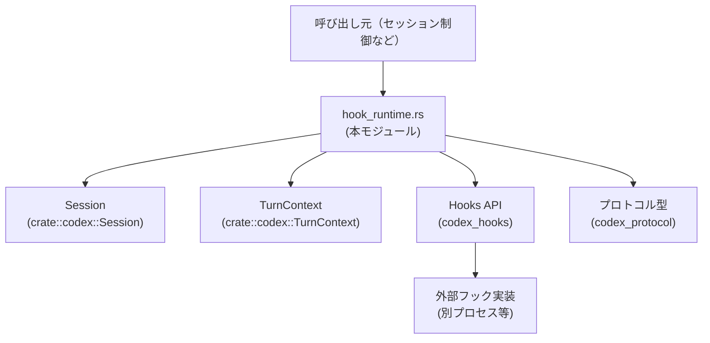
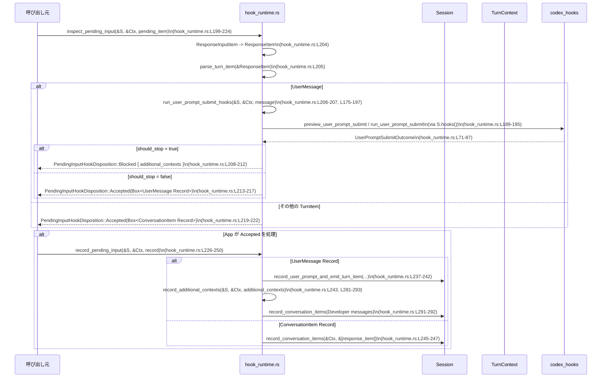

# core/src/hook_runtime.rs コード解説

## 0. ざっくり一言

このモジュールは、`Session` と `TurnContext` を用いて **各種フック（セッション開始・ユーザープロンプト送信・ツール実行前後）を実行し、その結果に応じた追加コンテキストの注入や入力のブロック/許可を行うランタイム層** です（hook_runtime.rs:L27-30, L89-197, L199-250）。

---

## 1. このモジュールの役割

### 1.1 概要

- このモジュールは **フックシステムと会話管理 (`Session`) の橋渡し** を行います。
- セッション開始・ユーザープロンプト・ツール実行前後のイベントに対して、`codex_hooks` のフックを呼び出し、生成されたイベントや追加コンテキストを `codex_protocol` 形式で会話ログに記録します（hook_runtime.rs:L89-173, L175-197, L281-300）。
- ユーザー入力を事前にフックにかけて検査し、**ブロックするか受け入れるか** を判定する仕組みも提供します（hook_runtime.rs:L199-224, L226-250）。

### 1.2 アーキテクチャ内での位置づけ

このモジュールは、セッション制御コードとフック実装との間に位置する調整役です。



- 呼び出し元は本モジュールの関数群（例: `inspect_pending_input`, `run_pre_tool_use_hooks`）を呼び出します。
- 本モジュールは `Session`・`TurnContext` を使ってフックの実行に必要な情報を集め、`codex_hooks` API を通してフックを実行します（hook_runtime.rs:L97-105, L124-135, L155-166, L180-188）。
- フックの開始・完了は `EventMsg` を通じてイベントとして送出されます（hook_runtime.rs:L302-327）。
- フックから返ってきた追加コンテキストは `DeveloperInstructions` → `ResponseItem` に変換され、会話ログに追記されます（hook_runtime.rs:L281-293, L295-300）。

### 1.3 設計上のポイント

- **結果の共通表現**  
  - フック結果を `HookRuntimeOutcome` にまとめ、`should_stop` と `additional_contexts` の2点に整理しています（hook_runtime.rs:L27-30）。
  - `SessionStartOutcome` と `UserPromptSubmitOutcome` を `ContextInjectingHookOutcome` に `From` で変換し、実行パターンを共通化しています（hook_runtime.rs:L53-87）。
- **共通ランナー関数**  
  - `run_context_injecting_hook` で「事前プレビュー → HookStartedイベント送信 → 実行 → HookCompletedイベント送信 → コンテキスト取得」の流れを1か所に集約しています（hook_runtime.rs:L252-267）。
- **非同期 + 共有状態 (`Arc`)**  
  - すべての主要関数は `async fn` であり、`Arc<Session>` と `Arc<TurnContext>` への参照を受け取ることで、複数タスクから安全に共有できる設計になっています（hook_runtime.rs:L89-92, L118-123, L148-154, L175-179, L199-203, L226-230）。
- **入力検査と遅延記録**  
  - `inspect_pending_input` と `record_pending_input` により、「入力の検査（ブロック/許可）」と「実際の記録」が分離されています（hook_runtime.rs:L199-224, L226-250）。
- **権限モードの抽象化**  
  - `hook_permission_mode` で `AskForApproval` の各バリアントをフック側の文字列モードにマッピングしています（hook_runtime.rs:L330-338）。

---

## 2. 主要な機能一覧

- セッション開始フック実行とコンテキスト注入: `run_pending_session_start_hooks`（hook_runtime.rs:L89-116）
- ツール実行前フック実行とブロック理由の取得: `run_pre_tool_use_hooks`（hook_runtime.rs:L118-146）
- ツール実行後フック実行: `run_post_tool_use_hooks`（hook_runtime.rs:L148-173）
- ユーザープロンプト送信フック実行とコンテキスト注入: `run_user_prompt_submit_hooks`（hook_runtime.rs:L175-197）
- ペンディング入力の検査（ユーザー入力かどうかの判定 + フック実行）: `inspect_pending_input`（hook_runtime.rs:L199-224）
- ペンディング入力の記録と追加コンテキストの記録: `record_pending_input`（hook_runtime.rs:L226-250）
- 追加コンテキスト文字列を Developer メッセージに変換し、会話に記録:  
  `record_additional_contexts` / `additional_context_messages`（hook_runtime.rs:L281-300）
- Hook の開始・完了イベント送信:  
  `emit_hook_started_events`, `emit_hook_completed_events`（hook_runtime.rs:L302-327）
- 承認ポリシーからフック用の permission mode 文字列への変換: `hook_permission_mode`（hook_runtime.rs:L330-338）

### 2.1 コンポーネントインベントリー

#### 型（構造体・列挙体）

| 名前 | 種別 | 公開範囲 | 役割 / 用途 | 根拠 |
|------|------|----------|------------|------|
| `HookRuntimeOutcome` | 構造体 | `pub(crate)` | フック実行後、「停止すべきか」と「追加コンテキスト」をまとめた結果 | hook_runtime.rs:L27-30 |
| `PendingInputHookDisposition` | 列挙体 | `pub(crate)` | ペンディング入力がフックにより「受理」されたか「ブロック」されたか、追加コンテキスト付きで表現 | hook_runtime.rs:L32-35 |
| `PendingInputRecord` | 列挙体 | `pub(crate)` | 検査済みペンディング入力の実体。ユーザーメッセージか他の会話アイテムかを区別し、記録に用いる | hook_runtime.rs:L37-46 |
| `ContextInjectingHookOutcome` | 構造体 | モジュール内のみ | フックから返るイベント列と `HookRuntimeOutcome` をまとめ、共通ランナーで扱いやすくする | hook_runtime.rs:L48-51 |
| `From<SessionStartOutcome> for ContextInjectingHookOutcome` | トレイト実装 | モジュール内のみ | `SessionStartOutcome` を共通形式に変換 | hook_runtime.rs:L53-69 |
| `From<UserPromptSubmitOutcome> for ContextInjectingHookOutcome` | トレイト実装 | モジュール内のみ | `UserPromptSubmitOutcome` を共通形式に変換 | hook_runtime.rs:L71-87 |

#### 関数

| 関数名 | async | 公開範囲 | 概要 | 根拠 |
|--------|-------|----------|------|------|
| `run_pending_session_start_hooks` | はい | `pub(crate)` | 保留中のセッション開始フックがあれば実行し、追加コンテキストを記録しつつ停止要否を返す | hook_runtime.rs:L89-116 |
| `run_pre_tool_use_hooks` | はい | `pub(crate)` | ツール実行前フックを実行し、ブロックされる場合は理由文字列を返す | hook_runtime.rs:L118-146 |
| `run_post_tool_use_hooks` | はい | `pub(crate)` | ツール実行後フックを実行し、その結果（含: hook_events）を返す | hook_runtime.rs:L148-173 |
| `run_user_prompt_submit_hooks` | はい | `pub(crate)` | ユーザープロンプト送信フックを実行し、追加コンテキストなどをまとめた `HookRuntimeOutcome` を返す | hook_runtime.rs:L175-197 |
| `inspect_pending_input` | はい | `pub(crate)` | ペンディング入力を `TurnItem` にパースし、必要ならユーザープロンプトフックを実行して Blocked/Accepted を判定 | hook_runtime.rs:L199-224 |
| `record_pending_input` | はい | `pub(crate)` | `PendingInputRecord` に応じてユーザープロンプトや会話アイテムを `Session` に記録し、追加コンテキストも記録 | hook_runtime.rs:L226-250 |
| `run_context_injecting_hook` | はい | モジュール内のみ | プレビュー → HookStarted イベント送信 → フック実行 → HookCompleted イベント送信 → コンテキスト取り出し、の共通処理 | hook_runtime.rs:L252-267 |
| `HookRuntimeOutcome::record_additional_contexts` | はい（メソッド） | モジュール内のみ | 自身が持つ追加コンテキストを記録し、停止フラグを返す | hook_runtime.rs:L269-279 |
| `record_additional_contexts` | はい | `pub(crate)` | Vec<String> の追加コンテキストを Developer メッセージに変換し、会話に記録 | hook_runtime.rs:L281-293 |
| `additional_context_messages` | いいえ | モジュール内のみ | 追加コンテキスト文字列を `DeveloperInstructions` 経由で `ResponseItem` のメッセージに変換 | hook_runtime.rs:L295-300 |
| `emit_hook_started_events` | はい | モジュール内のみ | プレビューされた HookRunSummary ごとに HookStarted イベントを送出 | hook_runtime.rs:L302-317 |
| `emit_hook_completed_events` | はい | モジュール内のみ | 完了したフックイベントを HookCompleted として送出 | hook_runtime.rs:L319-327 |
| `hook_permission_mode` | いいえ | モジュール内のみ | `AskForApproval` を文字列の permission mode に変換 | hook_runtime.rs:L330-338 |
| `additional_context_messages_stay_separate_and_ordered` | いいえ（テスト） | テストのみ | 追加コンテキストメッセージが分離され順序を保持していることを検証 | hook_runtime.rs:L348-380 |

---

## 3. 公開 API と詳細解説

### 3.1 型一覧（構造体・列挙体など）

| 名前 | 種別 | 主要フィールド / バリアント | 役割 |
|------|------|-----------------------------|------|
| `HookRuntimeOutcome` | 構造体 | `should_stop: bool`, `additional_contexts: Vec<String>` | フックの実行結果を「停止フラグ」と「追加コンテキスト文字列」に要約したもの（hook_runtime.rs:L27-30）。 |
| `PendingInputHookDisposition` | 列挙体 | `Accepted(Box<PendingInputRecord>)`, `Blocked { additional_contexts: Vec<String> }` | ペンディング入力が許可されたかブロックされたかを表現し、ブロック時にも追加コンテキストを保持（hook_runtime.rs:L32-35）。 |
| `PendingInputRecord` | 列挙体 | `UserMessage { content, response_item, additional_contexts }`, `ConversationItem { response_item }` | 検査後に実際に記録すべき入力内容と、その際に添える追加コンテキストを保持（hook_runtime.rs:L37-46）。 |
| `ContextInjectingHookOutcome` | 構造体 | `hook_events: Vec<HookCompletedEvent>`, `outcome: HookRuntimeOutcome` | フックの完了イベント列と、ランタイム結果を一括で扱うための内部構造体（hook_runtime.rs:L48-51）。 |

### 3.2 関数詳細（主要 7 件）

#### `run_pending_session_start_hooks(sess: &Arc<Session>, turn_context: &Arc<TurnContext>) -> bool`

**概要**

- `Session` が保持している「保留中のセッション開始ソース」があればフックを実行し、追加コンテキストを会話に記録します。
- フックの結果として「ここで対話を停止すべきか」を `bool` で返します（hook_runtime.rs:L89-116）。

**引数**

| 引数名 | 型 | 説明 |
|--------|----|------|
| `sess` | `&Arc<Session>` | 会話およびフック管理を行う `Session` への共有参照（hook_runtime.rs:L89-90）。 |
| `turn_context` | `&Arc<TurnContext>` | 現在のターン（サブ会話）のコンテキスト情報（カレントディレクトリ、モデル情報など）への共有参照（hook_runtime.rs:L89-92）。 |

**戻り値**

- `bool`  
  - `true`: フック結果により「停止すべき」と判断された場合。  
  - `false`: 保留中のセッション開始ソースがなかった場合、またはフック結果が停止を要求しなかった場合（hook_runtime.rs:L93-95, L114-116, L269-279）。

**内部処理の流れ**

1. `Session::take_pending_session_start_source().await` により、保留中のセッション開始ソースを取得（`Option<_>` を想定）（hook_runtime.rs:L93）。
   - `None` の場合は何もせず `false` を返して終了します（hook_runtime.rs:L93-95）。
2. `SessionStartRequest` を構築し、セッションID・カレントディレクトリ・トランスクリプトパス・モデル・permission mode・source を詰めます（hook_runtime.rs:L97-104）。
3. `sess.hooks().preview_session_start(&request)` でプレビューを取得（hook_runtime.rs:L105）。
4. `run_context_injecting_hook` を呼び出し、プレビューと実際の `run_session_start` Future を渡します（hook_runtime.rs:L106-112）。
5. 戻り値として受け取った `HookRuntimeOutcome` に対し、`HookRuntimeOutcome::record_additional_contexts` を呼んで追加コンテキストを記録しつつ `should_stop` を返します（hook_runtime.rs:L113-116, L269-279）。

**Examples（使用例）**

```rust
use std::sync::Arc;
use core::hook_runtime::run_pending_session_start_hooks; // パスは実際のcrate構成に依存

async fn handle_new_session(sess: Arc<Session>, ctx: Arc<TurnContext>) {
    // セッション開始時に、保留中のフックがあれば実行する
    let should_stop = run_pending_session_start_hooks(&sess, &ctx).await;

    if should_stop {
        // ここで対話フローを中断するなどの処理を行う
        // （呼び出し側の設計に依存）
    } else {
        // 通常のフローを継続
    }
}
```

※ `Session` / `TurnContext` の具体的な生成方法はこのチャンクには現れません。

**Errors / Panics**

- この関数は `Result` を返さず、内部で `?` も使用していないため、フック実行や記録処理の失敗は型からは観測できません（hook_runtime.rs:L89-116）。
- `sess.take_pending_session_start_source()` や `sess.hooks().run_session_start()` の実装はこのチャンクには現れないため、内部でのエラー処理・panic の有無は不明です。

**Edge cases（エッジケース）**

- 保留中のセッション開始ソースがない場合: すぐに `false` を返して終了します（hook_runtime.rs:L93-95）。
- 追加コンテキストが空の場合: `HookRuntimeOutcome::record_additional_contexts` 内で `record_additional_contexts` が呼ばれますが、空ベクタに対しては何も記録しません（hook_runtime.rs:L269-279, L281-288）。

**使用上の注意点**

- `take_pending_session_start_source()` は名前から「保留中のソースを消費して取得する」用途が想定されますが、実装がこのチャンクにはないため、再入時の挙動は不明です。
- 非同期関数のため、必ず `.await` する必要があります。
- `sess` / `turn_context` は `Arc` の参照として受け取るため、他タスクと共有して使う場合でも所有権の衝突は起こりません（所有権システムによりコンパイル時に保証）。

---

#### `run_pre_tool_use_hooks(sess: &Arc<Session>, turn_context: &Arc<TurnContext>, tool_use_id: String, command: String) -> Option<String>`

**概要**

- ツール（ここでは "Bash" 固定）の実行前にフックを実行し、ツール実行がブロックされる場合はその理由文字列を返します（hook_runtime.rs:L118-146）。

**引数**

| 引数名 | 型 | 説明 |
|--------|----|------|
| `sess` | `&Arc<Session>` | 現在のセッション。フック呼び出しやイベント送信に使用（hook_runtime.rs:L118-120）。 |
| `turn_context` | `&Arc<TurnContext>` | 実行中ターンのコンテキスト（hook_runtime.rs:L118-121）。 |
| `tool_use_id` | `String` | ツール呼び出しを識別するID（hook_runtime.rs:L121-122, L132）。 |
| `command` | `String` | 実行予定のコマンド文字列（hook_runtime.rs:L122-123, L133）。 |

**戻り値**

- `Option<String>`  
  - `Some(block_reason)`: フックが `should_block = true` と評価し、その理由文字列がある場合。  
  - `None`: ブロックされない場合（hook_runtime.rs:L138-145）。

**内部処理の流れ**

1. `PreToolUseRequest` を構築し、セッションID・ターンID・cwd・トランスクリプトパス・モデル・permission mode・tool_name ("Bash")・`tool_use_id`・`command` を設定（hook_runtime.rs:L124-134）。
2. `sess.hooks().preview_pre_tool_use(&request)` でフック実行プランを取得し、`emit_hook_started_events` で HookStarted イベントを送出（hook_runtime.rs:L135-136, L302-317）。
3. `sess.hooks().run_pre_tool_use(request).await` により実行し、`PreToolUseOutcome { hook_events, should_block, block_reason }` を得る（hook_runtime.rs:L138-142）。
4. `emit_hook_completed_events` で完了イベントを送出（hook_runtime.rs:L143-144）。
5. `should_block` が真なら `block_reason` をそのまま返し、偽なら `None` を返す（hook_runtime.rs:L145）。

**Examples（使用例）**

```rust
async fn maybe_run_command(sess: Arc<Session>, ctx: Arc<TurnContext>, id: String, cmd: String) {
    // ツール実行前にフックで検査する
    if let Some(reason) = run_pre_tool_use_hooks(&sess, &ctx, id.clone(), cmd.clone()).await {
        // ブロックされた場合: 理由をログに出す / ユーザーに通知するなど
        eprintln!("tool blocked: {reason}");
        return;
    }

    // ブロックされなかった場合のみ、実際のコマンド実行処理に進む
    // run_bash_command(id, cmd).await;  // 実装は別モジュール
}
```

**Errors / Panics**

- この関数自体は `Option<String>` を返すのみで、エラー型を返しません（hook_runtime.rs:L118-146）。
- `sess.hooks().run_pre_tool_use` 内での失敗の扱いはこのチャンクには現れないため不明です。

**Edge cases**

- `preview_runs` が空の場合: `emit_hook_started_events` のループが実行されないだけで、特別な処理はありません（hook_runtime.rs:L135-137, L307-316）。
- `block_reason` が `None` かつ `should_block = true` というケースを排除するロジックはこの関数内にはありません。そうなった場合は `None` が返ります（`if should_block { block_reason } else { None }` のため）（hook_runtime.rs:L145）。

**使用上の注意点**

- `tool_name` は `"Bash"` に固定されています（hook_runtime.rs:L131）。他のツールに対するフックには別の関数が用意される可能性がありますが、このチャンクには現れません。
- ツール実行側では、`Some(reason)` の場合に **必ず実行を中止する** ことが前提になっていると考えられます（名称 `should_block` からの推測）。

---

#### `run_post_tool_use_hooks(sess: &Arc<Session>, turn_context: &Arc<TurnContext>, tool_use_id: String, command: String, tool_response: Value) -> PostToolUseOutcome`

**概要**

- ツール実行後にフックを実行し、その結果（追加イベントや変更されたレスポンスなどを含む `PostToolUseOutcome`）を返します（hook_runtime.rs:L148-173）。

**引数**

| 引数名 | 型 | 説明 |
|--------|----|------|
| `sess` | `&Arc<Session>` | セッション（hook_runtime.rs:L148-150）。 |
| `turn_context` | `&Arc<TurnContext>` | ターンコンテキスト（hook_runtime.rs:L148-151）。 |
| `tool_use_id` | `String` | ツール呼び出しID（hook_runtime.rs:L151-152, L163）。 |
| `command` | `String` | 実行したコマンド（hook_runtime.rs:L152-153, L164）。 |
| `tool_response` | `Value` | ツールからのレスポンス JSON（serde_json::Value）（hook_runtime.rs:L153-154, L165）。 |

**戻り値**

- `PostToolUseOutcome`（`codex_hooks` 側の型）  
  - 中身の詳細はこのチャンクには現れませんが、`hook_events: Vec<HookCompletedEvent>` フィールドが存在することが `outcome.hook_events.clone()` から分かります（hook_runtime.rs:L170-172）。

**内部処理の流れ**

1. `PostToolUseRequest` を構築し、事前フックと同様のメタ情報に加えて `tool_response` を詰める（hook_runtime.rs:L155-166）。
2. `preview_post_tool_use` → `emit_hook_started_events` で開始イベント送出（hook_runtime.rs:L167-168）。
3. `run_post_tool_use` を実行し、`outcome` を取得（hook_runtime.rs:L170）。
4. `outcome.hook_events.clone()` を用いて完了イベントを送出（hook_runtime.rs:L171）。
5. `outcome` をそのまま呼び出し元に返す（hook_runtime.rs:L172）。

**Examples（使用例）**

```rust
use serde_json::json;

async fn after_tool(sess: Arc<Session>, ctx: Arc<TurnContext>, id: String, cmd: String) {
    let tool_resp = json!({ "exit_code": 0, "stdout": "ok" }); // ツール結果の例

    let outcome = run_post_tool_use_hooks(&sess, &ctx, id, cmd, tool_resp).await;

    // outcome の詳細の扱いは codex_hooks 側の仕様に依存
    // ここでは hook_events が既にイベントとして送信されていることだけが分かる（L171）。
}
```

**Errors / Panics**

- 同様に `Result` を返さないため、この関数レベルではエラーは表現されていません（hook_runtime.rs:L148-173）。
- `serde_json::Value` は不正なJSONを保持することはありませんが、ツール側からの内容は検証されません（このチャンクでは）。

**Edge cases**

- `preview_runs` が空の場合、開始イベントは送出されません。
- `outcome.hook_events` が空の場合、完了イベントも送出されません（hook_runtime.rs:L171-172, L319-327）。

**使用上の注意点**

- `outcome.hook_events` を `clone()` しているため、大量のイベントが含まれる場合にはメモリコストが増えます（hook_runtime.rs:L171）。ただし、このチャンク内では他の用途でも参照されているかは不明です。

---

#### `run_user_prompt_submit_hooks(sess: &Arc<Session>, turn_context: &Arc<TurnContext>, prompt: String) -> HookRuntimeOutcome`

**概要**

- ユーザーが送信しようとしているプロンプトに対してフックを実行し、**停止フラグと追加コンテキスト** を返します（hook_runtime.rs:L175-197）。

**引数**

| 引数名 | 型 | 説明 |
|--------|----|------|
| `sess` | `&Arc<Session>` | セッション（hook_runtime.rs:L175-177）。 |
| `turn_context` | `&Arc<TurnContext>` | ターンコンテキスト（hook_runtime.rs:L175-178）。 |
| `prompt` | `String` | ユーザーが送信しようとしているテキストプロンプト（hook_runtime.rs:L178-179, L187）。 |

**戻り値**

- `HookRuntimeOutcome`  
  - `should_stop`: このプロンプト送信後に対話を停止すべきかどうか。  
  - `additional_contexts`: 会話に追加すべきコンテキスト文字列のリスト（hook_runtime.rs:L27-30, L180-188, L252-267）。

**内部処理の流れ**

1. `UserPromptSubmitRequest` を構成（セッションID・ターンID・cwd・トランスクリプトパス・モデル・permission mode・`prompt`）（hook_runtime.rs:L180-188）。
2. `preview_user_prompt_submit` でプレビューを取得（hook_runtime.rs:L189）。
3. `run_context_injecting_hook` を呼び、プレビューと `run_user_prompt_submit(request)` Future を渡す（hook_runtime.rs:L190-195）。
4. `run_context_injecting_hook` 内で HookStarted/Completed イベントを送信し、`ContextInjectingHookOutcome` を `HookRuntimeOutcome` に変換して返却（hook_runtime.rs:L252-267, L71-87）。

**Examples（使用例）**

```rust
async fn run_prompt_hooks(sess: Arc<Session>, ctx: Arc<TurnContext>, prompt: String) {
    let outcome = run_user_prompt_submit_hooks(&sess, &ctx, prompt).await;

    if outcome.should_stop {
        // 追加コンテキストだけを記録して、ユーザーの入力処理は中止するなど
    } else {
        // outcome.additional_contexts を後続処理で record_additional_contexts に渡してもよい
    }
}
```

**Errors / Panics**

- この関数自体は `HookRuntimeOutcome` を直接返すのみで、エラーは外部に露出しません（hook_runtime.rs:L175-197）。
- 実際のフック実行でのエラーは `codex_hooks` 側の処理に依存し、このチャンクには現れません。

**Edge cases**

- フックが 0 件の場合でも、`run_context_injecting_hook` により HookStarted/Completed の送信ループが走らないだけで、`HookRuntimeOutcome`（デフォルト値）は `From` 実装側次第です（hook_runtime.rs:L71-87, L252-267）。詳細はこのチャンクには現れません。

**使用上の注意点**

- `run_user_prompt_submit_hooks` は **追加コンテキストの記録までは行いません**。`HookRuntimeOutcome::record_additional_contexts` か `record_additional_contexts` を別途呼び出す必要があります（hook_runtime.rs:L269-279, L281-293）。

---

#### `inspect_pending_input(sess: &Arc<Session>, turn_context: &Arc<TurnContext>, pending_input_item: ResponseInputItem) -> PendingInputHookDisposition`

**概要**

- エンジンから生成されたペンディング入力（`ResponseInputItem`）を `ResponseItem` / `TurnItem` に変換し、**ユーザーメッセージの場合のみユーザープロンプトフックを実行してブロック/許可を判定** します（hook_runtime.rs:L199-224）。

**引数**

| 引数名 | 型 | 説明 |
|--------|----|------|
| `sess` | `&Arc<Session>` | セッション（hook_runtime.rs:L199-201）。 |
| `turn_context` | `&Arc<TurnContext>` | ターンコンテキスト（hook_runtime.rs:L199-202）。 |
| `pending_input_item` | `ResponseInputItem` | まだユーザーに確定していない入力候補アイテム（hook_runtime.rs:L201-203）。 |

**戻り値**

- `PendingInputHookDisposition`  
  - `Accepted(Box<PendingInputRecord>)`: 入力を受理してよい場合。`PendingInputRecord` に実体（ユーザーメッセージ/会話アイテム）と追加コンテキストを含む。  
  - `Blocked { additional_contexts }`: フックによりブロックされた場合。その後の処理側でコンテキストのみを記録するなどの使い方が想定されます（hook_runtime.rs:L32-35, L209-212）。

**内部処理の流れ**

1. `ResponseInputItem` を `ResponseItem` に変換（`From` 実装を利用）（hook_runtime.rs:L204）。
2. `parse_turn_item(&response_item)` で `TurnItem` を解析（hook_runtime.rs:L205）。
3. `TurnItem::UserMessage(user_message)` の場合:
   - `run_user_prompt_submit_hooks(sess, turn_context, user_message.message())` を実行し、停止フラグと追加コンテキストを取得（hook_runtime.rs:L206-207）。
   - `should_stop` が `true` なら `Blocked { additional_contexts }` を返す（hook_runtime.rs:L208-212）。
   - `false` なら `PendingInputRecord::UserMessage { content, response_item, additional_contexts }` を `Box` で包み `Accepted` として返す（hook_runtime.rs:L213-217）。
4. その他の `TurnItem` の場合:
   - `PendingInputRecord::ConversationItem { response_item }` を `Accepted` として返す（hook_runtime.rs:L219-222）。

**Examples（使用例）**

```rust
async fn handle_pending_input(sess: Arc<Session>, ctx: Arc<TurnContext>, item: ResponseInputItem) {
    match inspect_pending_input(&sess, &ctx, item).await {
        PendingInputHookDisposition::Accepted(record) => {
            // 後で record_pending_input に渡す
            record_pending_input(&sess, &ctx, *record).await;
        }
        PendingInputHookDisposition::Blocked { additional_contexts } => {
            // ブロックされた場合: 追加コンテキストを記録するだけなど
            record_additional_contexts(&sess, &ctx, additional_contexts).await;
        }
    }
}
```

**Errors / Panics**

- `parse_turn_item` の実装はこのチャンクには現れず、パース失敗時の挙動（`None` を返すか panic するか）は不明です（hook_runtime.rs:L205）。
- `inspect_pending_input` 自身には panic を起こすコードは含まれていません（全ての分岐は `if let` / `else` でカバー）（hook_runtime.rs:L199-224）。

**Edge cases**

- `parse_turn_item` が `None` を返した場合、ユーザーメッセージとして扱われず `ConversationItem` として受理されます（hook_runtime.rs:L219-222）。
  - これは「ユーザーメッセージでなければフックは走らない」という仕様を意味します。
- `user_prompt_submit_outcome.additional_contexts` が空でも、そのまま `Blocked` あるいは `Accepted` に渡されます（hook_runtime.rs:L210-211, L216-217）。

**使用上の注意点**

- `inspect_pending_input` は **入力の記録を行いません**。`Accepted` の場合は、必ずどこかで `record_pending_input` を呼び出さないと、会話ログに残りません（hook_runtime.rs:L226-250）。
- ブロック時の `additional_contexts` は呼び出し元側で `record_additional_contexts` を呼び出して会話に反映させることが想定されます。

---

#### `record_pending_input(sess: &Arc<Session>, turn_context: &Arc<TurnContext>, pending_input: PendingInputRecord)`

**概要**

- `PendingInputRecord` に基づき、ユーザーメッセージまたは会話アイテムを `Session` に記録します。
- ユーザーメッセージの場合は、**追加コンテキストも合わせて記録** します（hook_runtime.rs:L226-250）。

**引数**

| 引数名 | 型 | 説明 |
|--------|----|------|
| `sess` | `&Arc<Session>` | セッション（hook_runtime.rs:L226-228）。 |
| `turn_context` | `&Arc<TurnContext>` | ターンコンテキスト（hook_runtime.rs:L226-229）。 |
| `pending_input` | `PendingInputRecord` | `inspect_pending_input` などから渡される入力レコード（hook_runtime.rs:L229-230）。 |

**戻り値**

- なし (`()`)

**内部処理の流れ**

1. `match pending_input` でバリアントごとに分岐（hook_runtime.rs:L231-249）。
2. `PendingInputRecord::UserMessage` の場合（hook_runtime.rs:L232-244）:
   - `sess.record_user_prompt_and_emit_turn_item(turn_context.as_ref(), content.as_slice(), response_item).await` を呼び、ユーザープロンプトを記録しつつターンアイテムを発火（hook_runtime.rs:L237-242）。
   - その後 `record_additional_contexts(sess, turn_context, additional_contexts).await` を呼び、追加コンテキストを Developer メッセージとして記録（hook_runtime.rs:L243）。
3. `PendingInputRecord::ConversationItem` の場合（hook_runtime.rs:L245-247）:
   - `sess.record_conversation_items(turn_context, std::slice::from_ref(&response_item)).await` を呼び、一つの会話アイテムとして記録（hook_runtime.rs:L245-247）。

**Examples（使用例）**

上記 `inspect_pending_input` の例を参照（`record_pending_input` を後段で呼び出す）（hook_runtime.rs:L226-250）。

**Errors / Panics**

- この関数自体は `Result` を返さず、エラーは外部に露出しません。
- `record_user_prompt_and_emit_turn_item` や `record_conversation_items` がどのようにエラーを扱うかは、このチャンクには現れません。

**Edge cases**

- `additional_contexts` が空の `UserMessage` の場合、`record_additional_contexts` 内で即returnするため、追加メッセージは何も記録されません（hook_runtime.rs:L243, L281-288）。
- `ConversationItem` バリアントでは追加コンテキストを持たないため、追加メッセージは記録されません（hook_runtime.rs:L245-247）。

**使用上の注意点**

- `PendingInputRecord` は所有権を持っており、この関数に渡すと消費されます。再利用はできません。
- `&Arc<TurnContext>` から `TurnContext` への参照を取るために `as_ref()` を使っています（hook_runtime.rs:L237-239）。所有権を移動していないため、他でも同じ `Arc` を利用可能です。

---

#### `run_context_injecting_hook<Fut, Outcome>(sess: &Arc<Session>, turn_context: &Arc<TurnContext>, preview_runs: Vec<HookRunSummary>, outcome_future: Fut) -> HookRuntimeOutcome`

**概要**

- セッション開始フックやユーザープロンプトフックなど、**追加コンテキストを返すフックの共通実行パターン** を提供する内部関数です（hook_runtime.rs:L252-267）。
- HookStarted/HookCompleted イベント送信と `ContextInjectingHookOutcome` への変換を一か所で行います。

**引数**

| 引数名 | 型 | 説明 |
|--------|----|------|
| `sess` | `&Arc<Session>` | セッション（hook_runtime.rs:L252-254）。 |
| `turn_context` | `&Arc<TurnContext>` | ターンコンテキスト（hook_runtime.rs:L252-255）。 |
| `preview_runs` | `Vec<HookRunSummary>` | 事前に計算されたフック実行プラン（hook_runtime.rs:L252-256）。 |
| `outcome_future` | `Fut` | 実際のフック実行を表す Future。`Output = Outcome` かつ `Outcome: Into<ContextInjectingHookOutcome>`（hook_runtime.rs:L256-260）。 |

**戻り値**

- `HookRuntimeOutcome`  
  - `Outcome` を `Into<ContextInjectingHookOutcome>` で変換し、その `outcome` フィールドを取り出したもの（hook_runtime.rs:L264-266）。

**内部処理の流れ**

1. `emit_hook_started_events(sess, turn_context, preview_runs).await` で HookStarted イベントを送信（hook_runtime.rs:L262）。
2. `outcome_future.await.into()` でフックを実行し、結果を `ContextInjectingHookOutcome` に変換（hook_runtime.rs:L264）。
3. `emit_hook_completed_events(sess, turn_context, outcome.hook_events).await` で完了イベントを送信（hook_runtime.rs:L265）。
4. `outcome.outcome`（`HookRuntimeOutcome`）を返す（hook_runtime.rs:L266）。

**Examples（使用例）**

実際には外部から直接呼ばれておらず、`run_pending_session_start_hooks` や `run_user_prompt_submit_hooks` から利用されています（hook_runtime.rs:L105-112, L189-195）。

**Errors / Panics**

- 共通処理であり、個々のフック実行 Future がどのようなエラーを返すかは `Outcome` 型に依存します。この関数自体は `HookRuntimeOutcome` を返し、エラーを外部に報告しません。

**Edge cases**

- `preview_runs` が空の場合でも問題なく動作し、その場合は HookStarted イベントが送信されません（hook_runtime.rs:L262, L302-317）。
- `outcome.hook_events` が空の場合、HookCompleted イベントは送信されません（hook_runtime.rs:L265, L319-327）。

**使用上の注意点**

- `Outcome: Into<ContextInjectingHookOutcome>` の制約により、**型レベルで「追加コンテキストを持つフック」のみここで扱える** ようになっています。
- `Fut` は `Send` 制約などは付与されていないため、並行実行時のスレッド配置は呼び出し元のランタイム設定に依存します。

---

### 3.3 その他の関数

| 関数名 | 役割（1 行） | 根拠 |
|--------|--------------|------|
| `HookRuntimeOutcome::record_additional_contexts` | 自身の `additional_contexts` を `record_additional_contexts` に委譲して記録し、`should_stop` を返す（hook_runtime.rs:L269-279）。 | hook_runtime.rs:L269-279 |
| `record_additional_contexts` | `Vec<String>` の追加コンテキストを `DeveloperInstructions` メッセージに変換して会話に記録（空なら何もしない）（hook_runtime.rs:L281-293）。 | hook_runtime.rs:L281-293 |
| `additional_context_messages` | 文字列リストを `Vec<ResponseItem>`（developer ロールのメッセージ）に変換（hook_runtime.rs:L295-300）。 | hook_runtime.rs:L295-300 |
| `emit_hook_started_events` | プレビューされた各 `HookRunSummary` に対して HookStarted イベントを送出（hook_runtime.rs:L302-317）。 | hook_runtime.rs:L302-317 |
| `emit_hook_completed_events` | 各 `HookCompletedEvent` に対して HookCompleted イベントを送出（hook_runtime.rs:L319-327）。 | hook_runtime.rs:L319-327 |
| `hook_permission_mode` | `AskForApproval` 値を `"bypassPermissions"` または `"default"` にマッピング（hook_runtime.rs:L330-338）。 | hook_runtime.rs:L330-338 |

---

### 3.4 想定される問題点とセキュリティ上の観点

- **フックに依存したブロックロジック**  
  - `run_pre_tool_use_hooks` で `should_block` が真でも `block_reason` が `None` の場合、`None` が返ります（hook_runtime.rs:L145）。呼び出し側が「`None` = ブロックしない」と解釈していると、ブロックが反映されない可能性があります。
- **パース結果に依存したユーザーフック実行**  
  - `inspect_pending_input` は `TurnItem::UserMessage` のときのみユーザープロンプトフックを実行します（hook_runtime.rs:L205-207）。`parse_turn_item` がユーザーメッセージを誤って別のバリアントとして返した場合、フックが走らず検査をすり抜けることになりますが、これは `parse_turn_item` 実装側の責務です。
- **ツールコマンドの安全性**  
  - このモジュールはツールコマンド文字列をフックに渡すだけで、実行は別モジュールに委ねられています（hook_runtime.rs:L124-134, L155-166）。コマンドのサニタイズや権限制御は他のコンポーネント側に依存します。

---

## 4. データフロー

ここでは、「ペンディング入力の検査と記録」のデータフローを示します。

### 4.1 ペンディング入力検査〜記録のフロー



このフローから分かる要点:

- 入力検査（フック実行）と記録は分離されており、呼び出し元は `Accepted` / `Blocked` を見て適切な後処理（記録・中止）を選択できます。
- 追加コンテキストは `UserMessage` 経由の Accepted か Blocked のときのみ付与され、それぞれ別ルートで記録することができます（hook_runtime.rs:L210-211, L216-217, L243, L281-293）。

---

## 5. 使い方（How to Use）

### 5.1 基本的な使用方法

典型的な流れは「ペンディング入力の検査 → 結果に応じた記録/中止」です。

```rust
use std::sync::Arc;
use codex_protocol::models::ResponseInputItem;

async fn handle_turn(sess: Arc<Session>, ctx: Arc<TurnContext>, pending: ResponseInputItem) {
    // 1. ペンディング入力をフックで検査
    let disposition = inspect_pending_input(&sess, &ctx, pending).await;

    match disposition {
        PendingInputHookDisposition::Accepted(record) => {
            // 2a. 受理された場合は実際に会話ログへ記録
            record_pending_input(&sess, &ctx, *record).await;
        }
        PendingInputHookDisposition::Blocked { additional_contexts } => {
            // 2b. ブロックされた場合、追加コンテキストのみ記録（または別処理）
            record_additional_contexts(&sess, &ctx, additional_contexts).await;
            // 入力自体は記録しない、などの方針を呼び出し側で決める
        }
    }
}
```

### 5.2 よくある使用パターン

1. **セッション開始時のフック実行**

```rust
async fn on_session_start(sess: Arc<Session>, ctx: Arc<TurnContext>) {
    let should_stop = run_pending_session_start_hooks(&sess, &ctx).await;
    if should_stop {
        // セッション開始直後に追加コンテキストだけ提示して終了する等
    }
}
```

1. **ツール実行前後でのフックチェーン**

```rust
async fn run_tool_with_hooks(sess: Arc<Session>, ctx: Arc<TurnContext>, id: String, cmd: String) {
    // 前フック: 実行可否チェック
    if let Some(reason) = run_pre_tool_use_hooks(&sess, &ctx, id.clone(), cmd.clone()).await {
        eprintln!("tool denied: {reason}");
        return;
    }

    // 実際のツール実行（別モジュール）
    let resp = run_tool_and_get_json(&cmd).await;

    // 後フック: ロギングやポリシーチェックなど
    let _outcome = run_post_tool_use_hooks(&sess, &ctx, id, cmd, resp).await;
}
```

※ `run_tool_and_get_json` はこのチャンクには現れません。例示目的です。

### 5.3 よくある間違い（想定）

実装から推測できる誤用例と正しい使い方:

```rust
// 誤り例: Accepted されたレコードを記録しない
async fn wrong(sess: Arc<Session>, ctx: Arc<TurnContext>, pending: ResponseInputItem) {
    if let PendingInputHookDisposition::Accepted(_record) =
        inspect_pending_input(&sess, &ctx, pending).await
    {
        // ここで何もしないままだと、入力は Session に記録されない（L226-250）。
    }
}

// 正しい例: 必ず record_pending_input で記録する
async fn correct(sess: Arc<Session>, ctx: Arc<TurnContext>, pending: ResponseInputItem) {
    if let PendingInputHookDisposition::Accepted(record) =
        inspect_pending_input(&sess, &ctx, pending).await
    {
        record_pending_input(&sess, &ctx, *record).await;
    }
}
```

### 5.4 使用上の注意点（まとめ）

- すべての主要関数は `async fn` のため、**非同期コンテキスト内で `.await` する必要** があります。
- `Arc<Session>` / `Arc<TurnContext>` を引数で借用しているため、複数タスクから共有しても所有権の競合は起こりませんが、`Session` 内部でのスレッド安全性はその実装に依存します（このチャンクには現れません）。
- 追加コンテキストは **文字列として一旦集約され、Developer メッセージとして変換・記録** されます（hook_runtime.rs:L281-293, L295-300）。フック実装側はこのフォーマットを前提としてメッセージを生成する必要があります。
- `hook_permission_mode` により、`AskForApproval` の詳細なバリアントは `"bypassPermissions"` と `"default"` の2種類に集約されます（hook_runtime.rs:L330-338）。フック側のポリシーはこの文字列に基づきます。

---

## 6. 変更の仕方（How to Modify）

### 6.1 新しい機能を追加する場合

**例: 新しい「コンテキスト注入型フック」を追加したい場合**

1. `codex_hooks` 側で新しいフックアウトカム型（例: `NewHookOutcome`）と `HookRunSummary` プレビューAPIを追加する（このチャンクには定義なし）。
2. そのアウトカムに対して `Into<ContextInjectingHookOutcome>` か `From<NewHookOutcome> for ContextInjectingHookOutcome` を実装する（hook_runtime.rs:L53-87 を参考）。
3. 本モジュールに `run_new_hook(...) -> HookRuntimeOutcome` の関数を追加し、`run_context_injecting_hook` を利用して共通処理を行う（hook_runtime.rs:L252-267 を参考）。
4. 必要なら `inspect_pending_input` 等から新しいフックを呼び出すように拡張する。

### 6.2 既存の機能を変更する場合

- **影響範囲の確認**
  - `PendingInputHookDisposition` / `PendingInputRecord` のバリアントを変更すると、これらを `match` しているコード（このモジュール外も含む）に影響します（hook_runtime.rs:L199-224, L226-250）。
- **契約・前提条件の維持**
  - `run_pre_tool_use_hooks` の戻り値 `Option<String>` の意味（`Some` = ブロック理由 / `None` = ブロックなし）を変更すると、呼び出し側のロジックが破綻する可能性があります（hook_runtime.rs:L138-146）。
  - `HookRuntimeOutcome` の `should_stop` を別の意味で使うようにすると、`run_pending_session_start_hooks` などの挙動が変わるため注意が必要です（hook_runtime.rs:L27-30, L89-116）。
- **テストの更新**
  - `additional_context_messages` の出力フォーマットを変える場合、テスト `additional_context_messages_stay_separate_and_ordered` を更新し、順序やロールが期待通りか確認する必要があります（hook_runtime.rs:L348-380）。

---

## 7. 関連ファイル

| パス / 型 | 役割 / 関係 | 根拠 |
|-----------|------------|------|
| `crate::codex::Session` | フックのプレビュー・実行 (`hooks()` 経由) や会話アイテムの記録 (`record_user_prompt_and_emit_turn_item`, `record_conversation_items`)、イベント送信 (`send_event`) を提供するセッションオブジェクト。実装はこのチャンクには現れませんが、メソッド呼び出しから用途が推測できます。 | hook_runtime.rs:L93, L105-112, L124-135, L155-167, L237-247, L302-327 |
| `crate::codex::TurnContext` | 現在のターンのコンテキスト（cwd, モデル情報, サブID, approval_policy 等）を保持。permission mode 計算やイベントに含めるメタ情報に利用されます。 | hook_runtime.rs:L97-103, L124-131, L155-162, L180-187, L330-337 |
| `crate::event_mapping::parse_turn_item` | `ResponseItem` を `TurnItem` にパースする関数。ユーザーメッセージかどうかの判定に使用されます。実装はこのチャンクには現れません。 | hook_runtime.rs:L25, L205 |
| `codex_hooks` クレート | 各種フックの Request/Outcome 型と実行メソッド (`preview_*`, `run_*`) を提供します。 | hook_runtime.rs:L4-10, L53-87, L89-197 |
| `codex_protocol` クレート | 会話アイテム (`ResponseItem`, `TurnItem`)、イベント (`EventMsg`, `HookStartedEvent`, `HookCompletedEvent`)、承認ポリシー (`AskForApproval`) などのプロトコル型を提供します。 | hook_runtime.rs:L11-20, L295-300, L330-338 |
| テストモジュール `tests` | `additional_context_messages` が developer ロールのメッセージを順序どおり生成していることを検証します。`ContentItem::InputText` のみを受け付け、それ以外は panic させることでフォーマットの前提も確認しています。 | hook_runtime.rs:L341-381 |

このチャンクに現れない他のファイルや実装（`Session`, `TurnContext`, 各種フック実装など）の詳細な挙動は不明ですが、本モジュールのインターフェースと呼び出しパターンから上記のような役割が読み取れます。
