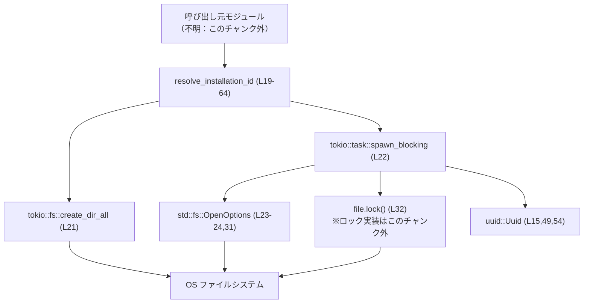
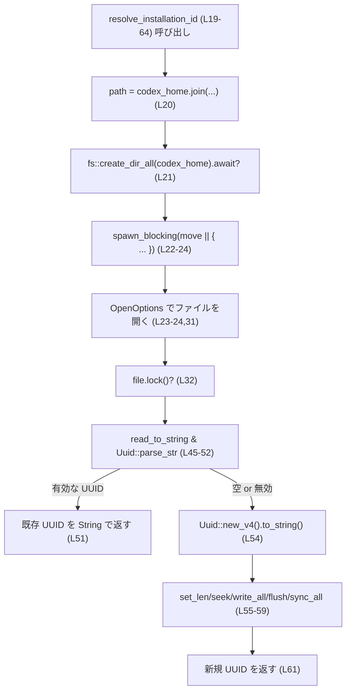
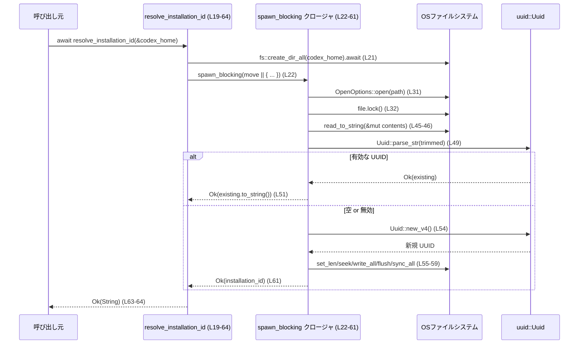

# core/src/installation_id.rs コード解説

---

## 0. ざっくり一言

インストールごとに一意な UUID をファイルに保存し、以後は同じ値を再利用するための「インストール ID」管理モジュールです。（`core/src/installation_id.rs:L17-L64`）

---

## 1. このモジュールの役割

### 1.1 概要

- このモジュールは、クライアント／ツールの「インストール単位で不変な識別子」を生成・永続化し、以降の起動時に再利用する役割を持ちます。（`core/src/installation_id.rs:L17-L64`）
- 識別子は `uuid::Uuid` により生成される UUID v4 を文字列化したものです。（`core/src/installation_id.rs:L15,L54`）
- ID は `codex_home` ディレクトリ配下の `installation_id` というテキストファイルに保存されます。（`core/src/installation_id.rs:L17,L20`）

### 1.2 アーキテクチャ内での位置づけ

このモジュールは、呼び出し元からは「非同期関数 `resolve_installation_id` を呼ぶだけで、安定したインストール ID が取得できる」ユーティリティとして使われる設計です。（`core/src/installation_id.rs:L19-L64`）

依存関係の概略は次のようになります。



> 呼び出し元モジュールが `resolve_installation_id` を呼び出し、内部で tokio の非同期 I/O とブロッキング I/O を組み合わせて OS のファイルシステムにアクセスします。

### 1.3 設計上のポイント

- **非同期 API + ブロッキング I/O の分離**  
  - 外部インターフェースは `async fn` ですが、実際のファイル操作は `tokio::task::spawn_blocking` 内で同期 I/O として実行しています。（`core/src/installation_id.rs:L19-L24,L31-L59`）
- **ファイルロックによる排他制御（意図）**  
  - `file.lock()?` により、ファイルに対して何らかのロックを取得しています。ロックの具体的な実装や性質（プロセス間かスレッド間か等）は、このチャンクからは分かりません。（`core/src/installation_id.rs:L31-L32`）
- **Unix 向けの権限管理**  
  - Unix 環境ではファイル生成時のモードを `0o644` に指定し、既存ファイルのモードもチェックして必要に応じて `0o644` に修正します。（`core/src/installation_id.rs:L26-L29,L34-L42`）
- **フォーマット検証付きの再利用**  
  - 既存ファイルの内容を読み込み、UUID としてパースできればそのまま再利用し、無効な内容の場合は新しい UUID を生成して置き換えます。（`core/src/installation_id.rs:L45-L52,L54-L59`）
- **永続化の確実性を意識したフラッシュ**  
  - 書き込み後に `flush` と `sync_all` を呼び出しており、データが OS バッファを経てストレージに実際に書き込まれることを意図しています。（`core/src/installation_id.rs:L57-L59`）

---

## 2. コンポーネントと主要機能

### 2.1 コンポーネント一覧（インベントリー）

| 名前 | 種別 | 公開範囲 | 行範囲 | 役割 / 用途 |
|------|------|----------|--------|-------------|
| `INSTALLATION_ID_FILENAME` | `&'static str` 定数 | `pub(crate)` | `core/src/installation_id.rs:L17` | インストール ID を保存するファイル名（`"installation_id"`） |
| `resolve_installation_id` | 非同期関数 | `pub(crate)` | `core/src/installation_id.rs:L19-L64` | インストール ID を生成・取得し、必要ならファイルに永続化するメイン API |
| `tests` モジュール | テスト用モジュール | `#[cfg(test)]` 内部 | `core/src/installation_id.rs:L66-L145` | `resolve_installation_id` の挙動を 3 ケースで検証 |
| `resolve_installation_id_generates_and_persists_uuid` | テスト関数 | テストのみ | `core/src/installation_id.rs:L77-L101` | 新規生成と永続化、および Unix での権限を検証 |
| `resolve_installation_id_reuses_existing_uuid` | テスト関数 | テストのみ | `core/src/installation_id.rs:L103-L123` | 既存の有効な UUID を再利用することを検証 |
| `resolve_installation_id_rewrites_invalid_file_contents` | テスト関数 | テストのみ | `core/src/installation_id.rs:L125-L144` | 無効な内容があっても新しい UUID に書き換えることを検証 |

### 2.2 主要な機能一覧

- インストール ID ファイルの保存場所の定義（`INSTALLATION_ID_FILENAME`）。（`core/src/installation_id.rs:L17`）
- インストール ID の生成・取得と永続化（`resolve_installation_id`）。（`core/src/installation_id.rs:L19-L64`）
- Unix 環境でのファイル権限の統一（`0o644`）。（`core/src/installation_id.rs:L26-L29,L34-L42`）
- 無効なファイル内容の検出と自動修復（再生成）。（`core/src/installation_id.rs:L45-L52,L54-L59`）
- 上記挙動を確認する非同期テスト群。（`core/src/installation_id.rs:L77-L144`）

---

## 3. 公開 API と詳細解説

### 3.1 型一覧（構造体・列挙体など）

このファイル内には公開構造体・列挙体はありませんが、公開定数があります。

| 名前 | 種別 | 公開範囲 | フィールド / 値 | 役割 / 用途 | 根拠 |
|------|------|----------|-----------------|-------------|------|
| `INSTALLATION_ID_FILENAME` | `&'static str` 定数 | `pub(crate)` | `"installation_id"` | インストール ID を保存するファイル名を一元管理 | `core/src/installation_id.rs:L17` |

### 3.2 関数詳細：`resolve_installation_id`

#### `resolve_installation_id(codex_home: &Path) -> std::io::Result<String>`

**概要**

- 指定された `codex_home` ディレクトリ配下に `installation_id` ファイルを作成し、その内容としてインストール ID（UUID v4）を生成・保存します。（`core/src/installation_id.rs:L17,L19-L21,L54-L59`）
- すでにファイルが存在し、内容が有効な UUID 文字列であれば、その値をそのまま返します。（`core/src/installation_id.rs:L45-L52`）
- 無効な内容または空の場合には、新しい UUID を生成してファイル内容を上書きし、その値を返します。（`core/src/installation_id.rs:L45-L52,L54-L59`）

**引数**

| 引数名 | 型 | 説明 | 根拠 |
|--------|----|------|------|
| `codex_home` | `&Path` | インストール ID ファイルを配置する「ホーム」ディレクトリへのパス。関数内で `codex_home.join(INSTALLATION_ID_FILENAME)` によりファイルパスが生成されるため、ディレクトリを指す想定です。 | `core/src/installation_id.rs:L19-L21` |

**戻り値**

- 型: `std::io::Result<String>`（`use std::io::Result;` によりエイリアス）。（`core/src/installation_id.rs:L3,L19`）
- 成功時 (`Ok`) は UUID 文字列（`Uuid::new_v4().to_string()` もしくは既存ファイル内容に基づく）を返します。（`core/src/installation_id.rs:L49-L52,L54-L61`）
- 失敗時 (`Err`) はファイル操作やディレクトリ作成、あるいは（Tokio 標準実装に従うなら）スレッドジョイン時のエラーに対応する `std::io::Error` が返る設計です。（`core/src/installation_id.rs:L21,L31-L32,L36-L37,L45-L47,L55-L59`）

**内部処理の流れ（アルゴリズム）**

処理は大きく「ディレクトリ準備」「spawn_blocking 内の同期処理」の 2 段階に分かれます。

1. **ファイルパスの決定とディレクトリ作成**  
   - `let path = codex_home.join(INSTALLATION_ID_FILENAME);` でファイルパスを構築。（`core/src/installation_id.rs:L20`）  
   - `tokio::fs::create_dir_all(codex_home).await?;` で `codex_home` ディレクトリを再帰的に作成（すでに存在する場合は何もしない）。失敗すると即座に `Err` を返します。（`core/src/installation_id.rs:L21`）

2. **ブロッキングスレッドでのファイル操作開始**  
   - `tokio::task::spawn_blocking(move || { ... })` により、以降の同期 I/O を専用のブロッキングスレッドで実行します。（`core/src/installation_id.rs:L22-L24`）

3. **ファイルオープンと Unix での作成モード指定**  
   - `OpenOptions::new()` → `.read(true).write(true).create(true)` で読み書き可能・存在しなければ作成するオプションを準備。（`core/src/installation_id.rs:L23-L24`）  
   - Unix 環境では `options.mode(0o644);` により作成時のパーミッションを指定。（`core/src/installation_id.rs:L26-L29`）  
   - `let mut file = options.open(&path)?;` でファイルを開く。失敗時は `Err` が返ります。（`core/src/installation_id.rs:L31`）

4. **ファイルロックの取得**  
   - `file.lock()?;` でファイルロックを取得しています。ロックの実装（どのクレートのどのトレイトか）はこのチャンクには現れませんが、排他アクセスを意図したものと解釈できます。（`core/src/installation_id.rs:L31-L32`）

5. **Unix での権限補正**  
   - Unix 環境では `file.metadata()?.permissions().mode() & 0o777` で現在のモードを取得し、`0o644` と異なる場合は `set_mode(0o644)` → `file.set_permissions(permissions)?` で修正しています。（`core/src/installation_id.rs:L34-L42`）

6. **既存コンテンツの読み込みと UUID 検証**  
   - `file.read_to_string(&mut contents)?;` でファイル全体を文字列として読み込み。（`core/src/installation_id.rs:L45-L46`）  
   - `trim()` で前後の空白を除去し、空でないかつ `Uuid::parse_str(trimmed)` が `Ok` なら、その UUID を `existing.to_string()` として返します。（`core/src/installation_id.rs:L47-L52`）

7. **新規 UUID の生成と書き込み**  
   - 上記条件を満たさない場合、新しい UUID を `Uuid::new_v4().to_string()` で生成。（`core/src/installation_id.rs:L54`）  
   - ファイルを `set_len(0)?` で truncate し、`seek(SeekFrom::Start(0))?` で先頭に戻し、`write_all(installation_id.as_bytes())?` で書き込み。（`core/src/installation_id.rs:L55-L57`）  
   - `flush()?;` と `sync_all()?;` によりデータのフラッシュと永続化後、その文字列を返します。（`core/src/installation_id.rs:L58-L61`）

8. **ブロッキングタスクの完了待ち**  
   - `spawn_blocking` の戻り値に対して `.await?` を呼び、ブロッキング処理の結果を非同期コンテキストに戻します。（`core/src/installation_id.rs:L62-L63`）  
   - ここでの `?` によるエラー伝播方法については後述の「潜在的な問題」で触れます。

Mermaid の簡易フロー図です。



**Examples（使用例）**

この関数を利用して、アプリケーション起動時にインストール ID を取得する例です。

```rust
use std::path::PathBuf;
use core::installation_id::resolve_installation_id; // 実際のパスはクレート構成による（このチャンク外）

#[tokio::main] // tokio ランタイム上で実行
async fn main() -> std::io::Result<()> {
    // アプリケーション専用のホームディレクトリを決める
    let codex_home = PathBuf::from("/var/lib/myapp"); // ディレクトリを想定

    // インストール ID を取得（必要なら生成され、ファイルに保存される）
    let installation_id = resolve_installation_id(&codex_home).await?;

    println!("installation id = {}", installation_id); // UUID 文字列が出力される
    Ok(())
}
```

> `codex_home` はディレクトリを指すことが前提であり、ファイルパスを渡すと `create_dir_all` が失敗する可能性があります。（`core/src/installation_id.rs:L20-L21`）

**Errors / Panics**

- `fs::create_dir_all(codex_home).await?`  
  - ディレクトリ作成に失敗した場合（権限不足、親ディレクトリの問題、`codex_home` がすでにファイルとして存在するなど）、`std::io::Error` が返ります。（`core/src/installation_id.rs:L21`）
- `OpenOptions::open(&path)?`  
  - ファイルの作成・オープンに失敗した場合（権限不足・パスの不整合など）、`Err` を返します。（`core/src/installation_id.rs:L31`）
- `file.lock()?`  
  - ロック取得が失敗する可能性があります。エラー型は `?` で伝播しており、`std::io::Error` への変換が行われていると推測されますが、ロック機構の実装はこのチャンクからは不明です。（`core/src/installation_id.rs:L32`）
- `metadata`, `set_permissions`, `read_to_string`, `set_len`, `seek`, `write_all`, `flush`, `sync_all`  
  - これらの I/O 操作が失敗した場合もすべて `?` により `Err` が返ります。（`core/src/installation_id.rs:L36-L37,L41-L42,L45-L47,L55-L59`）
- `spawn_blocking(...).await?`  
  - **Tokio 1.x の一般的な仕様では** `JoinHandle<T>` の `.await` は `Result<T, JoinError>` を返します。このコードでは `Result<String>`（`std::io::Error`）を返す関数内で `.await?` を直接使っており、`JoinError` から `std::io::Error` への変換が標準では存在しないため、そのままではコンパイルできない構成です。  
  - ただし、このチャンクには `spawn_blocking` のラッパーや型変換に関する定義は含まれておらず、実際にどのようにコンパイルされているかは分かりません。そのため、「Tokio 標準 API にそのまま従う場合には注意が必要な箇所」として挙げるにとどめます。（`core/src/installation_id.rs:L22,L62-L63`）

この関数内で `panic!` を明示的に呼び出している箇所はありません。（`core/src/installation_id.rs` 全体）

**Edge cases（エッジケース）**

- **ファイルが存在しない場合**  
  - `OpenOptions::create(true)` によりファイルが新規作成されます。中身は空のため、`trimmed.is_empty()` が真となり、新しい UUID が生成・書き込まれます。（`core/src/installation_id.rs:L23-L24,L45-L48,L54-L59`）
- **ファイルが存在し、空文字または空白のみの場合**  
  - `trim()` の結果が空文字列であるため、新しい UUID が生成されます。（`core/src/installation_id.rs:L47-L48,L54-L59`）
- **ファイルに有効な UUID 文字列が書かれている場合**  
  - `Uuid::parse_str(trimmed)` が `Ok(existing)` となり、その文字列化（`existing.to_string()`）を返します。大文字・小文字の揺れは `Uuid` が正規化してくれるため、テストでも大文字の文字列が再利用されることが確認されています。（`core/src/installation_id.rs:L49-L52,L103-L123`）
- **ファイルに不正な文字列（UUID でない）がある場合**  
  - `Uuid::parse_str(trimmed)` が `Err` となり、if 条件を通らないため、新しい UUID を生成してファイルに書き込み、返します。テストで `"not-a-uuid"` のケースが検証されています。（`core/src/installation_id.rs:L48-L52,L54-L59,L125-L144`）
- **Unix 以外の環境（Windows 等）**  
  - `#[cfg(unix)]` ブロックが無効になるため、ファイル権限の明示的な設定・補正は行われません。OpenOptions による作成時の権限は OS とランタイムのデフォルトに依存します。（`core/src/installation_id.rs:L9-L12,L26-L29,L34-L42`）
- **複数スレッド／プロセスからの同時呼び出し**  
  - このチャンクからはロックの具体的な性質が分かりませんが、`file.lock()?` により、少なくとも「同じファイルへのアクセスを直列化する」ことを意図していると考えられます。（`core/src/installation_id.rs:L31-L32`）  
  - ロックがプロセス間共有かスレッド内のみかなどの詳細は、このチャンクには現れません。

**使用上の注意点**

- **非同期ランタイムが必要**  
  - この関数は `async fn` であり、さらに `tokio::fs` と `tokio::task::spawn_blocking` に依存しているため、Tokio ランタイム上で呼び出す必要があります。（`core/src/installation_id.rs:L14,L19,L21-L22`）
- **`codex_home` はディレクトリを指す必要がある**  
  - 関数内で `fs::create_dir_all(codex_home)` を呼び出すため、`codex_home` がファイルパスであるとエラーになります。また、`join(INSTALLATION_ID_FILENAME)` によってファイル名を追加する設計です。（`core/src/installation_id.rs:L20-L21`）
- **エラー処理の伝播**  
  - ほぼ全ての I/O 操作に `?` を用いているため、呼び出し側では `Result<String, std::io::Error>` を適切に処理する必要があります。エラーが起きた場合、インストール ID は取得できません。（`core/src/installation_id.rs:L21,L31-L32,L36-L37,L41-L42,L45-L47,L55-L59,L62-L63`）
- **ファイルロック実装への依存**  
  - `file.lock()` の実装はこのファイルには含まれておらず、別のクレート／モジュールに依存しています。その仕様によっては、プロセス間ロックでない等の制約がありうるため、並行実行時の挙動を正確に把握するには、実装元を確認する必要があります。（`core/src/installation_id.rs:L31-L32`）
- **Tokio バージョンとの整合性**  
  - 先述の通り、Tokio 1.x 標準の `spawn_blocking` の戻り値型との整合性を確認する必要があります。このチャンクだけを見ると、`JoinError` を `std::io::Error` へ変換する処理が見当たらず、API バージョンによってはコンパイルエラーになる構成です。（`core/src/installation_id.rs:L22,L62-L63`）

### 3.3 その他の関数（テスト）

このモジュールに含まれるテスト関数の一覧です。

| 関数名 | 役割（1 行） | 行範囲 | 根拠 |
|--------|--------------|--------|------|
| `resolve_installation_id_generates_and_persists_uuid` | 新規に UUID を生成してファイルへ保存し、その内容が UUID かつ Unix ではモード `0o644` になることを検証 | `core/src/installation_id.rs:L77-L101` | テスト名とアサーション内容より |
| `resolve_installation_id_reuses_existing_uuid` | 事前に書き込んだ有効な UUID 文字列（大文字）を `resolve_installation_id` が正規化して再利用することを検証 | `core/src/installation_id.rs:L103-L123` | 既存文字列の書き込みと再パース、`assert_eq!` より |
| `resolve_installation_id_rewrites_invalid_file_contents` | 無効な文字列 `"not-a-uuid"` がファイルに存在しても、新しい UUID を生成してファイル内容を置き換えることを検証 | `core/src/installation_id.rs:L125-L144` | 無効文字列の書き込みと `Uuid::parse_str` 成功確認より |

---

## 4. データフロー

### 4.1 代表的な処理シナリオ

代表的なシナリオは「呼び出し元がインストール ID を要求し、それがファイルを通じて生成・永続化される」という流れです。

1. 呼び出し元が `resolve_installation_id(&codex_home)` を `await` する。（`core/src/installation_id.rs:L19`）
2. `codex_home` ディレクトリが存在しなければ作成される。（`core/src/installation_id.rs:L21`）
3. ブロッキングスレッドでファイルを開き、ロックを取得する。（`core/src/installation_id.rs:L22-L24,L31-L32`）
4. ファイル内容を読み込み、有効な UUID なら再利用、そうでなければ新しい UUID を生成して書き込む。（`core/src/installation_id.rs:L45-L52,L54-L59`）
5. 得られた UUID 文字列が呼び出し元に返される。（`core/src/installation_id.rs:L61-L64`）

Mermaid のシーケンス図は次の通りです。



---

## 5. 使い方（How to Use）

### 5.1 基本的な使用方法

以下は、アプリケーションの起動時に `resolve_installation_id` を呼び出し、インストール ID を取得・ログ出力する基本例です。

```rust
use std::path::PathBuf;
use std::io::Result;
use core::installation_id::resolve_installation_id; // 実際のパスはクレート構成による（このチャンク外）

#[tokio::main]
async fn main() -> Result<()> {
    // インストールごとに一意なホームディレクトリを指定する
    let codex_home = PathBuf::from("/var/lib/myapp"); // ディレクトリを想定

    // インストール ID を取得（内部で作成・再利用・検証が行われる）
    let installation_id = resolve_installation_id(&codex_home).await?;

    // 以降、分析・トラッキング・設定ファイルへの埋め込みなどに使用できる
    println!("installation id: {}", installation_id);

    Ok(())
}
```

ポイント:

- `#[tokio::main]` などで Tokio ランタイムが起動しているコンテキストから呼び出す必要があります。（`core/src/installation_id.rs:L14,L19,L21-L22`）
- 戻り値は `std::io::Result<String>` なので、`?` でエラーを伝播するか、`match` 等でハンドリングします。（`core/src/installation_id.rs:L3,L19`）

### 5.2 よくある使用パターン

1. **アプリケーション全体で 1 回だけ呼び出し、キャッシュする**

```rust
async fn get_installation_id_cached(codex_home: &Path) -> std::io::Result<String> {
    // 起動時に 1 度だけ呼び出す想定
    let id = resolve_installation_id(codex_home).await?;
    // 必要ならグローバルな状態や DI コンテナに保存する
    Ok(id)
}
```

- インストール ID は変わらない前提なので、アプリケーション内では 1 回だけディスクから決定し、メモリに保持して使うパターンが自然です。（`core/src/installation_id.rs:L45-L52,L54-L59`）

1. **異なる「ホーム」ディレクトリごとに別 ID を持たせる**

```rust
let id1 = resolve_installation_id(Path::new("/var/lib/myapp/profile1")).await?;
let id2 = resolve_installation_id(Path::new("/var/lib/myapp/profile2")).await?;
```

- `codex_home` を変えればファイルパスも変わるため、複数プロファイルごとに異なるインストール ID を持たせることができます。（`core/src/installation_id.rs:L20`）

### 5.3 よくある間違い

```rust
// 間違い例: tokio ランタイム外から直接 await しようとしている
// fn main() {
//     let home = PathBuf::from("/var/lib/myapp");
//     let id = resolve_installation_id(&home).await.unwrap(); // コンパイルエラー
// }

// 正しい例: tokio ランタイムを起動してから await する
#[tokio::main]
async fn main() -> std::io::Result<()> {
    let home = PathBuf::from("/var/lib/myapp");
    let id = resolve_installation_id(&home).await?;
    println!("{}", id);
    Ok(())
}
```

- 非同期関数を同期コンテキストから直接 `await` することはできないため、ランタイムを用意する必要があります。（`core/src/installation_id.rs:L19,L21-L22`）

```rust
// 間違い例: codex_home にファイルパスを渡してしまう
let codex_home = PathBuf::from("/var/lib/myapp/installation_id");
let id = resolve_installation_id(&codex_home).await?;
// → create_dir_all("/var/lib/myapp/installation_id") を試みるため、意図しないディレクトリが作られるか、既存ファイルと衝突する

// 正しい例: ディレクトリを渡す
let codex_home = PathBuf::from("/var/lib/myapp");
let id = resolve_installation_id(&codex_home).await?;
```

- 関数内部で `codex_home.join(INSTALLATION_ID_FILENAME)` を行うため、引数はディレクトリである必要があります。（`core/src/installation_id.rs:L20-L21`）

### 5.4 使用上の注意点（まとめ）

- **ランタイム**: Tokio ランタイム上でのみ利用可能（`tokio::fs`, `tokio::task::spawn_blocking` への依存）。（`core/src/installation_id.rs:L14,L21-L22`）
- **引数の前提**: `codex_home` はディレクトリパスを指し、アプリケーション内で一貫して同じ場所を用いる必要があります。（`core/src/installation_id.rs:L20-L21`）
- **エラー処理**: I/O エラーがそのまま伝播するため、呼び出し側で `Result` を必ず処理する必要があります。（`core/src/installation_id.rs:L21,L31-L32,L36-L37,L41-L42,L45-L47,L55-L59,L62-L63`）
- **並行実行**: `file.lock()` により排他制御を意図しているものの、ロック実装の詳細はチャンク外です。プロセス間／スレッド間のどの範囲で排他されるかは実装元のトレイトを確認する必要があります。（`core/src/installation_id.rs:L31-L32`）
- **ファイル権限**: Unix ではファイルが `0o644` に統一されます。インストール ID を秘匿情報とみなすかどうかに応じて、権限を変更する場合はこの箇所の修正が必要になります。（`core/src/installation_id.rs:L26-L29,L34-L42`）

---

## 6. 変更の仕方（How to Modify）

### 6.1 新しい機能を追加する場合

1. **ファイル名や保存場所を変えたい場合**
   - `INSTALLATION_ID_FILENAME` を変更すると、保存されるファイル名が変わります。（`core/src/installation_id.rs:L17,L20`）
   - `codex_home` の扱いは呼び出し側の責務なので、異なるディレクトリ構成を採用する場合は、呼び出し側で `codex_home` を変更します。

2. **権限ポリシーを変更したい場合（Unix）**
   - 生成時のモード: `options.mode(0o644);` を別の値に変更します。（`core/src/installation_id.rs:L26-L29`）
   - 既存ファイルの補正: `current_mode != 0o644` および `permissions.set_mode(0o644);` の値を合わせて変更します。（`core/src/installation_id.rs:L36-L41`）

3. **ID のフォーマットを変えたい場合**
   - UUID 以外の形式を用いる場合は、`Uuid::parse_str(trimmed)` 部分と `Uuid::new_v4().to_string()` 部分を別の生成・検証ロジックに差し替えます。（`core/src/installation_id.rs:L49-L52,L54`）
   - その際、テスト 3 本も対応するように修正する必要があります。（`core/src/installation_id.rs:L77-L144`）

### 6.2 既存の機能を変更する場合

- **影響範囲の確認**
  - `resolve_installation_id` はこのファイルで唯一の公開関数であり、ここを変更するとインストール ID の生成・再利用の挙動がすべて変わります。（`core/src/installation_id.rs:L19-L64`）
  - 具体的な呼び出し元はこのチャンクには現れないため、クレート全体の参照検索が必要です（IDE や `rg` など）。

- **前提条件・契約の維持**
  - 「インストール ID は一意かつ安定している」という前提（I/O エラーやファイル削除などの例外を除く）は、多くの呼び出し側で暗黙の契約になっている可能性があります。
  - ファイルに既存の値があれば再利用する、という挙動（テストで明示）を変える場合は、関連する仕様やドキュメントも合わせて更新する必要があります。（`core/src/installation_id.rs:L45-L52,L77-L101,L103-L123`）

- **テストの再確認**
  - 既存の 3 つのテストは、この関数の基本契約（生成・再利用・修復・権限）を網羅的にカバーしているため、挙動を変えた際はこれらを更新・追加し、必ず再実行する必要があります。（`core/src/installation_id.rs:L77-L144`）

---

## 7. 関連ファイル

このチャンクには、他モジュールのパスや定義は直接現れません。そのため、関連ファイルについて確定的な情報はありません。

参考として、このファイル内で使用している外部クレート・標準ライブラリを挙げます。

| パス / クレート | 役割 / 関係 | 根拠 |
|-----------------|------------|------|
| `std::fs::OpenOptions` | ファイルの読み書き・作成オプションを管理し、`open` でファイルを開く | `core/src/installation_id.rs:L1,L23-L24,L31` |
| `std::io::{Read, Seek, SeekFrom, Write, Result}` | ファイルからの読み込み・シーク・書き込みと、I/O エラー型を提供 | `core/src/installation_id.rs:L2-L6` |
| `std::path::Path` | `codex_home` 引数のパス表現に使用 | `core/src/installation_id.rs:L7,L19` |
| `std::os::unix::fs::{OpenOptionsExt, PermissionsExt}` | Unix 環境でファイル作成モード・パーミッション操作を行うための拡張トレイト | `core/src/installation_id.rs:L9-L12,L26-L29,L34-L42` |
| `tokio::fs` | 非同期版 `create_dir_all` を提供 | `core/src/installation_id.rs:L14,L21` |
| `tokio::task::spawn_blocking` | ブロッキング I/O を別スレッドで実行し、非同期 API から利用可能にする | `core/src/installation_id.rs:L22` |
| `uuid::Uuid` | インストール ID として用いる UUID の生成・パースに使用 | `core/src/installation_id.rs:L15,L49,L54` |
| `pretty_assertions::assert_eq` | テストでの比較結果表示を分かりやすくするアサートマクロ | `core/src/installation_id.rs:L70` |
| `tempfile::TempDir` | テスト用に一時ディレクトリを作成するユーティリティ | `core/src/installation_id.rs:L71,L79,L105,L127` |

> 実際のプロダクションコードにおけるこのモジュールの呼び出し元や、`file.lock()` を提供するトレイト定義などは、このチャンクには含まれていないため「不明」です。
