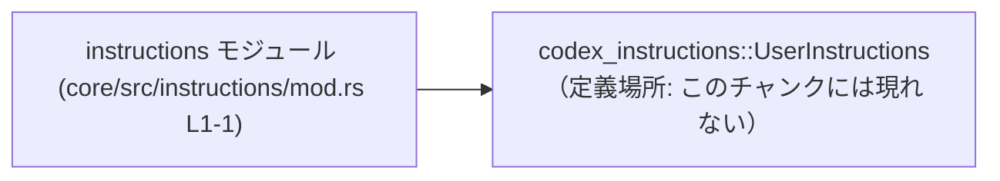
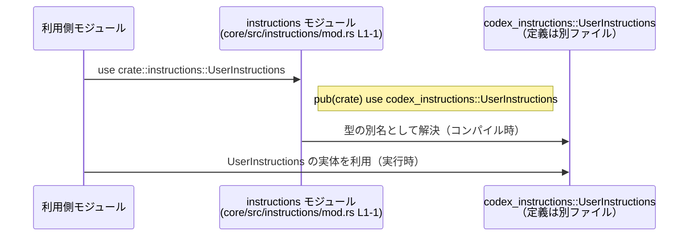

# core/src/instructions/mod.rs コード解説

## 0. ざっくり一言

- `codex_instructions` に定義されている `UserInstructions` 型を、同一クレート内から参照しやすくするために **再エクスポート** しているモジュールです（`core/src/instructions/mod.rs:L1-1`）。

---

## 1. このモジュールの役割

### 1.1 概要

- このモジュールは、`codex_instructions::UserInstructions` を `pub(crate) use` で再エクスポートすることで、
  - クレート内部の他モジュールから `crate::instructions::UserInstructions` という経路で利用できるようにする
  - 実際の定義場所（`codex_instructions`）を意識せずに使えるようにする
  という役割を持っています。

根拠:

- `pub(crate) use codex_instructions::UserInstructions;`  
  （`core/src/instructions/mod.rs:L1-1`）

### 1.2 アーキテクチャ内での位置づけ

このモジュールは、**「型の窓口」** として振る舞います。

- 依存先:
  - `codex_instructions` という名前空間にある `UserInstructions`
  - このチャンクからは、`codex_instructions` が外部クレートか上位モジュールかは判定できません（不明）。
- 依存元:
  - 同一クレート内で `instructions::UserInstructions` を `use` する側のモジュール（このチャンクには登場しません）。

依存関係を簡略化した図は次のとおりです。



この図は、「`instructions` モジュールが `codex_instructions::UserInstructions` に依存し、その型をクレート内向けに再エクスポートしている」ことを表しています。

### 1.3 設計上のポイント

- **再エクスポート専用モジュール**
  - このファイルには実行時処理がなく、`use` による再エクスポートのみが記述されています（`L1-1`）。
- **クレート内公開 (`pub(crate)` )**
  - 再エクスポートの可視性が `pub(crate)` のため、**同一クレート内からのみ** `instructions::UserInstructions` として利用できます。
  - 他クレートからは、このモジュール経由の `UserInstructions` にはアクセスできません。
- **状態・副作用なし**
  - グローバル状態やフィールド・関数は定義されておらず、実行時副作用はありません。
- **エラーハンドリング・並行性への直接的な関与なし**
  - 実行時コードがないため、このファイル自身はエラーや並行性の問題を直接発生させません。
  - これらの挙動は、実際の `UserInstructions` の定義と、その利用側コードに依存します。

---

## 2. 主要な機能一覧

このモジュールが提供している機能は、1 行の再エクスポートに集約されています。

- `UserInstructions` のクレート内再エクスポート:  
  `codex_instructions::UserInstructions` を `instructions::UserInstructions` としてクレート内で利用可能にする  
  （`core/src/instructions/mod.rs:L1-1`）

---

## 3. 公開 API と詳細解説

### 3.1 型一覧（構造体・列挙体など）

このファイルで **クレート内に露出している型名** は次のとおりです。

| 名前 | 種別 | 役割 / 用途 | 定義元 | 根拠 |
|------|------|-------------|--------|------|
| `UserInstructions` | 不明（構造体 / 列挙体など、このチャンクからは判定できません） | ユーザー向けの何らかの「指示」を表す型である可能性がありますが、具体的な意味やフィールドはこのチャンクだけでは不明です | `codex_instructions::UserInstructions`（定義ファイルのパスはこのチャンクには現れない） | `pub(crate) use codex_instructions::UserInstructions;`（`core/src/instructions/mod.rs:L1-1`）

> 注: 「用途がユーザー向けの指示を表す」という解釈は名前からの推測であり、**具体的なフィールドやメソッド、挙動はコードからは読み取れません**。

### 3.2 関数詳細（最大 7 件）

- このファイルには関数定義は存在しません。  
  （`core/src/instructions/mod.rs:L1-1` に `use` 行のみが存在）

したがって、このセクションで詳細解説する対象となる関数はありません。

### 3.3 その他の関数

- 補助関数やラッパー関数も、このファイルには定義されていません。

---

## 4. データフロー

このファイルには実行時の処理やデータ変換は含まれていませんが、**型の名前解決という意味での「フロー」** は存在します。

- クレート内部の利用側モジュールは、`crate::instructions::UserInstructions` をインポートする
- コンパイル時に、その参照は `codex_instructions::UserInstructions` へ解決される
- 実行時には、`UserInstructions` のインスタンスは `codex_instructions` 側の定義に従って扱われる

この流れをシーケンス図として表現します。



要点:

- **このモジュール自身は実行時に何も処理しません**。
- `UserInstructions` に関する実際のデータの流れ（インスタンス生成・メソッド呼び出しなど）は、  
  `codex_instructions` 内の定義および利用側コードに依存します（このチャンクからは不明）。

---

## 5. 使い方（How to Use）

### 5.1 基本的な使用方法

このモジュールは、クレート内部から `UserInstructions` 型をインポートしやすくするための窓口です。  
同一クレート内の別モジュールからの利用例を示します。

```rust
// 同一クレート内の別モジュールからの利用例
use crate::instructions::UserInstructions; // core/src/instructions/mod.rs の再エクスポートを経由

// UserInstructions を引数に取る関数の例
fn handle_user_instructions(instr: UserInstructions) {
    // UserInstructions の具体的なフィールドやメソッドは
    // このチャンクからは不明なので、ここでは触れません。
}
```

ポイント:

- `pub(crate)` 再エクスポートにより、**クレート内のどこからでも** `crate::instructions::UserInstructions` を `use` できます。
- 再エクスポートを使うことで、利用側は `codex_instructions::UserInstructions` という具体的な定義場所を意識する必要がなくなります。

### 5.2 よくある使用パターン

このチャンクからは実際の利用コードは分かりませんが、**一般的な「型再エクスポート」パターン** として、次のような使い方が想定されます（一般論であり、本リポジトリに特有とは限りません）。

1. **ドメインサービスへの引数として受け取る**

```rust
use crate::instructions::UserInstructions;

// ユーザーの指示を処理するサービス関数の例
fn process_instructions(instr: UserInstructions) {
    // ここで instr を解釈・処理する
    // （具体的な処理内容は UserInstructions の定義に依存し、このチャンクからは不明）
}
```

1. **構造体のフィールドとして保持する**

```rust
use crate::instructions::UserInstructions;

// UserInstructions を内部に保持するコンテナの例
struct InstructionContext {
    // UserInstructions の具体的な型情報（struct / enum など）はこのチャンクからは不明
    instructions: UserInstructions,
}
```

> 上記は「再エクスポートされた型をどのように使えるか」の一般例であり、  
> 実際にこのコードベースがこのように使っているかは、このチャンクだけでは分かりません。

### 5.3 よくある間違い

この再エクスポートに関して起こりうる典型的な誤りと、その修正例を示します。

#### 1. 他クレートからのアクセスを試みる

```rust
// 別クレートからの誤った利用例（コンパイルエラーになる）
use core::instructions::UserInstructions; // 仮にクレート名が core だとして

fn main() {
    // ...
}
```

- 問題点:
  - `core/src/instructions/mod.rs:L1-1` の可視性は `pub(crate)` のため、  
    **他クレートからは `instructions::UserInstructions` にアクセスできません**。
- 対応:
  - 他クレートから `UserInstructions` を使いたい場合は、  
    - 直接 `codex_instructions::UserInstructions` を使う
    - または、このクレート側で `pub` で再エクスポートする（設計方針に応じて変更が必要）

#### 2. `codex_instructions` を依存に追加していない

```rust
// core/src/instructions/mod.rs
pub(crate) use codex_instructions::UserInstructions;
```

- `codex_instructions` クレート（あるいはモジュール）が存在しない場合、この行はコンパイルエラーになります。
- Cargo.toml の依存やモジュール定義側が適切に設定されている必要があります。  
  （依存定義自体はこのチャンクには現れません）

### 5.4 使用上の注意点（まとめ）

- **可視性**
  - `pub(crate)` のため、このモジュール経由での `UserInstructions` 利用は **同一クレート内限定** です。
- **定義への依存**
  - 実際のフィールド・メソッド・振る舞いは `codex_instructions::UserInstructions` の定義に依存します。
  - 仕様や挙動を理解するには、そちらの定義（別ファイル）を確認する必要があります（このチャンクには含まれません）。
- **安全性 / エラー / 並行性**
  - このファイル自身は実行時コードを持たないため、直接的な
    - メモリ安全性
    - エラーハンドリング
    - スレッドセーフティ
    に影響する処理は存在しません。
  - これらは `UserInstructions` の実装および利用コードに依存します。

---

## 6. 変更の仕方（How to Modify）

### 6.1 新しい機能を追加する場合

このモジュールに新しい「指示関連型」を追加したい場合、主に次のような変更が考えられます。

1. **別の型を再エクスポートする**

```rust
// 例: 別の Instructions 型を追加で再エクスポートする
pub(crate) use codex_instructions::UserInstructions;
pub(crate) use codex_instructions::AdminInstructions; // 仮の型名（このチャンクには現れない）
```

- 効果:
  - クレート内の他モジュールから `crate::instructions::AdminInstructions` を同様に利用できるようになります。
- 注意点:
  - 追加する型が実際に `codex_instructions` 側で定義されていることを確認する必要があります。

1. **外部公開 API に昇格させる**

```rust
// 例: クレート外にも公開したい場合（設計変更）
pub use codex_instructions::UserInstructions;
```

- 効果:
  - 他クレートから `your_crate::instructions::UserInstructions` として利用可能になります。
- 注意点:
  - API の公開範囲が広がるため、**後方互換性** や **バージョニング戦略** を考慮する必要があります。

### 6.2 既存の機能を変更する場合

`UserInstructions` の再エクスポート方法を変更する際に考慮すべき点を整理します。

- **再エクスポート先のパスを変更する場合**
  - 例: `codex_instructions::UserInstructions` → `codex_instructions::v2::UserInstructions` など
  - 影響:
    - クレート内の全ての `crate::instructions::UserInstructions` 利用箇所に影響します。
    - 利用側で期待している API（フィールド・メソッド）が変わる可能性があります。
  - 対応:
    - 利用箇所のコンパイルエラー確認
    - 挙動変化がないかの動作確認

- **型名の別名を付ける場合**

```rust
// 例: 別名を付ける
pub(crate) use codex_instructions::UserInstructions as CoreUserInstructions;
```

- 影響:
  - 既存コードが `UserInstructions` という名前で参照している場合、すべて `CoreUserInstructions` に変更が必要になります。
- 契約:
  - 「`instructions` モジュールからは `UserInstructions` が見える」という暗黙の契約が変わるため、  
    変更前に利用状況の調査が必要です。

---

## 7. 関連ファイル

このモジュールと密接に関連するコンポーネントを整理します。

| パス / 名前空間 | 役割 / 関係 | 根拠 |
|----------------|------------|------|
| `codex_instructions::UserInstructions` | 実際の `UserInstructions` 型の定義。フィールドやメソッド、振る舞いはここで決まります。 | `pub(crate) use codex_instructions::UserInstructions;`（`core/src/instructions/mod.rs:L1-1`） |
| `crate::instructions` を利用している他モジュール | クレート内から `UserInstructions` 型を参照する利用側。具体的なファイルパスやモジュール名は、このチャンクには現れません。 | モジュールパスの一般的な規則（`src/instructions/mod.rs` → `crate::instructions`）。実際の利用箇所は不明。 |

> このチャンクにはテストコードや `codex_instructions` の実装ファイルは含まれていないため、  
> テスト戦略・`UserInstructions` の具体的な仕様・バージョン管理などについては、  
> 別ファイルまたは別クレート側のコードを確認する必要があります。

---

以上が、`core/src/instructions/mod.rs` 単独から読み取れる範囲での客観的な解説です。
