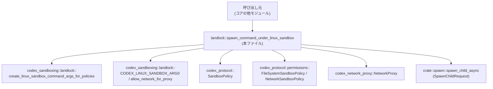
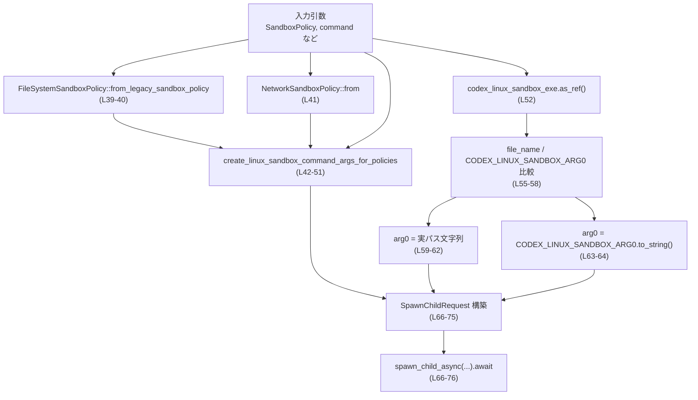
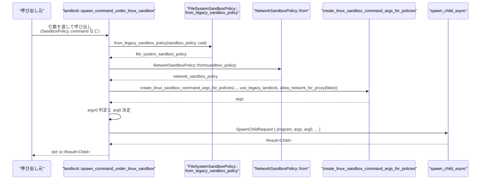

# core/src/landlock.rs コード解説

---

## 0. ざっくり一言

Linux 向けのサンドボックスヘルパー (`codex-linux-sandbox`) の下でコマンドを非同期に起動するためのヘルパー関数を 1 つ提供するモジュールです。  
レガシーな `SandboxPolicy` からファイルシステム／ネットワークの個別ポリシーを組み立て、子プロセス起動リクエストにまとめて渡します（`core/src/landlock.rs:L16-23, L39-51, L66-76`）。

---

## 1. このモジュールの役割

### 1.1 概要

- Linux 上で、Codex のサンドボックスヘルパー `codex-linux-sandbox` 経由でコマンドを起動するためのユーティリティです（`core/src/landlock.rs:L16-23, L25-35`）。
- 旧来の `SandboxPolicy` から、ファイルシステム用 `FileSystemSandboxPolicy` とネットワーク用 `NetworkSandboxPolicy` を作成し、Linux サンドボックスヘルパーのコマンドライン引数を構築します（`L39-51`）。
- `tokio` の非同期プロセス API（`tokio::process::Child`）を使い、非同期に子プロセスを起動します（`L14, L25, L35, L76`）。

### 1.2 アーキテクチャ内での位置づけ

この関数は「コア層のプロセス起動ヘルパー (`crate::spawn`)」と「Linux サンドボックス実装 (`codex_sandboxing::landlock`)」、「ポリシー定義 (`codex_protocol`)」、「ネットワークプロキシ (`codex_network_proxy`)」の橋渡しを行います。



- 呼び出し元は `SandboxPolicy` とコマンド情報を渡してこの関数を呼び出します。
- この関数は `codex_sandboxing::landlock` の関数／定数でコマンド引数や `argv[0]`（`arg0`）を組み立て、`SpawnChildRequest` に詰めて `spawn_child_async` に渡します（`L39-51, L52-65, L66-75`）。

### 1.3 設計上のポイント

- **ステートレスな関数**  
  グローバル状態を持たず、すべての情報は引数から受け取り、その場で `SpawnChildRequest` を構築して返します（`L25-35, L39-75`）。
- **ポリシー変換の分離**  
  レガシー `SandboxPolicy` から、ファイルシステム／ネットワークに分割されたポリシーを作る処理を `FileSystemSandboxPolicy::from_legacy_sandbox_policy` と `NetworkSandboxPolicy::from` に委譲しています（`L39-41`）。
- **Linux 専用の `argv[0]` 制御**  
  Linux サンドボックスのエントリポイントに確実に到達するよう、実行ファイル名と `CODEX_LINUX_SANDBOX_ARG0` を比較し、`arg0` を条件付きで書き換えています（`L52-65`）。
- **非同期実行モデル**  
  戻り値に `std::io::Result<tokio::process::Child>` を返す `async fn` として定義されており、Tokio ランタイム上で非同期にプロセスを起動できます（`L14, L25, L35, L76`）。

---

## 2. 主要な機能一覧（コンポーネントインベントリー）

このファイル内で **定義** されているコンポーネントは 1 つです。

- `spawn_command_under_linux_sandbox`: Linux サンドボックスヘルパー経由でコマンドを非同期起動する（`core/src/landlock.rs:L25-76`）

このファイル内で **利用** している主な外部コンポーネントは次のとおりです（インターフェースの詳細は他ファイル／クレートにあります）。

| 名前 | 種別 | このファイルでの役割 | 根拠 |
|------|------|----------------------|------|
| `SpawnChildRequest` | 構造体（推定） | 子プロセス起動に必要な情報をまとめて渡すためのリクエストオブジェクト | `core/src/landlock.rs:L1, L66-75` |
| `StdioPolicy` | 型 | 子プロセスの標準入出力の扱い方針を表す | `core/src/landlock.rs:L2, L32, L73` |
| `spawn_child_async` | 関数 | `SpawnChildRequest` を受け取り非同期に子プロセスを起動する | `core/src/landlock.rs:L3, L66-76` |
| `NetworkProxy` | 型 | ネットワークアクセスをプロキシ経由で行うためのハンドル | `core/src/landlock.rs:L4, L33, L72` |
| `FileSystemSandboxPolicy` | 型 | ファイルシステムサンドボックスのポリシー表現 | `core/src/landlock.rs:L5, L39-40, L46` |
| `NetworkSandboxPolicy` | 型 | ネットワークサンドボックスのポリシー表現 | `core/src/landlock.rs:L6, L41, L47, L71` |
| `SandboxPolicy` | 型 | レガシーな統合サンドボックスポリシー表現 | `core/src/landlock.rs:L7, L29, L39-41, L45` |
| `CODEX_LINUX_SANDBOX_ARG0` | 定数 | Linux サンドボックスヘルパー用に指定すべき `argv[0]` の期待値 | `core/src/landlock.rs:L8, L58, L64` |
| `allow_network_for_proxy` | 関数 | プロキシ用のネットワーク許可ポリシーを生成 | `core/src/landlock.rs:L9, L49-50` |
| `create_linux_sandbox_command_args_for_policies` | 関数 | サンドボックスポリシーから Linux サンドボックスヘルパーのコマンドライン引数を生成 | `core/src/landlock.rs:L10, L42-51` |
| `tokio::process::Child` | 構造体 | 非同期に待機可能な子プロセスハンドル | `core/src/landlock.rs:L14, L35` |

---

## 3. 公開 API と詳細解説

### 3.1 型一覧（このファイル内で定義される型）

このファイル内で **新たに定義される構造体・列挙体等はありません**。  
上記 2 章の表にある型はすべて他モジュール／クレート由来であり、本ファイルではそれらを利用するのみです。

### 3.2 関数詳細

#### `spawn_command_under_linux_sandbox<P>(...) -> std::io::Result<Child>`

**シグネチャ（抜粋）**

```rust
pub async fn spawn_command_under_linux_sandbox<P>(
    codex_linux_sandbox_exe: P,
    command: Vec<String>,
    command_cwd: PathBuf,
    sandbox_policy: &SandboxPolicy,
    sandbox_policy_cwd: &Path,
    use_legacy_landlock: bool,
    stdio_policy: StdioPolicy,
    network: Option<&NetworkProxy>,
    env: HashMap<String, String>,
) -> std::io::Result<Child>
where
    P: AsRef<Path>,
{ /* ... */ }
```

（`core/src/landlock.rs:L25-38`）

**概要**

- Linux サンドボックスヘルパー（`codex-linux-sandbox`）を介して、指定したコマンドを **非同期に** 起動する関数です。
- レガシー `SandboxPolicy` からファイルシステム／ネットワークポリシーを生成し、`create_linux_sandbox_command_args_for_policies` に渡して、ヘルパーへのコマンドライン引数を構築します（`L39-51`）。
- `SpawnChildRequest` に各種情報をまとめ、`spawn_child_async` を呼び出すことで `tokio::process::Child` を返します（`L66-76`）。

**引数**

| 引数名 | 型 | 説明 | 根拠 |
|--------|----|------|------|
| `codex_linux_sandbox_exe` | `P`（`where P: AsRef<Path>`） | 実行するサンドボックスヘルパー `codex-linux-sandbox` のパス。`AsRef<Path>` 制約により、`&Path`, `PathBuf`, `&str` などから柔軟に指定可能です。 | `core/src/landlock.rs:L25, L36-37, L52-53, L66-67` |
| `command` | `Vec<String>` | サンドボックス内で実行したいコマンドと引数を表す文字列ベクタ。`create_linux_sandbox_command_args_for_policies` にそのまま渡されます。 | `core/src/landlock.rs:L27, L42-43` |
| `command_cwd` | `PathBuf` | 子プロセスのカレントディレクトリ（ワーキングディレクトリ）。引数生成と最終的な `SpawnChildRequest` に利用されます。 | `core/src/landlock.rs:L28, L44, L70` |
| `sandbox_policy` | `&SandboxPolicy` | レガシー形式のサンドボックスポリシー。ファイルシステム／ネットワークポリシーの生成元として利用されます。 | `core/src/landlock.rs:L29, L39-41, L45` |
| `sandbox_policy_cwd` | `&Path` | サンドボックスポリシーの基準ディレクトリ（パス展開などに使われると推測されますが、詳細は他モジュール側で決まります）。 | `core/src/landlock.rs:L30, L39-40, L48` |
| `use_legacy_landlock` | `bool` | レガシーな Landlock モードを利用するかどうかを表すフラグ。引数生成時に渡されます。 | `core/src/landlock.rs:L31, L49` |
| `stdio_policy` | `StdioPolicy` | 子プロセスの標準入出力／エラーの扱い方針。`SpawnChildRequest` にそのまま渡されます。 | `core/src/landlock.rs:L32, L73` |
| `network` | `Option<&NetworkProxy>` | ネットワークプロキシの参照。`Some` の場合のみプロキシを通してネットワークを扱うことが想定されます。 | `core/src/landlock.rs:L33, L72` |
| `env` | `HashMap<String, String>` | 子プロセスに設定する環境変数のマップ。 | `core/src/landlock.rs:L34, L74` |

**戻り値**

- 型: `std::io::Result<tokio::process::Child>`（`core/src/landlock.rs:L35`）
  - `Ok(Child)`：子プロセスの起動に成功した場合のハンドル。非同期 I/O を伴うプロセス制御を行うための Tokio の `Child` 型です。
  - `Err(e)`：プロセス起動までのどこかで I/O エラーが発生した場合（具体的な発生条件は `spawn_child_async` 等の実装に依存し、このチャンクからは分かりません）。

**内部処理の流れ（アルゴリズム）**

1. **ファイルシステムポリシーの生成**  
   `FileSystemSandboxPolicy::from_legacy_sandbox_policy` を用いて、レガシー `SandboxPolicy` からファイルシステム専用のポリシーに変換します（`L39-40`）。
2. **ネットワークポリシーの生成**  
   `NetworkSandboxPolicy::from(sandbox_policy)` により、同じ `SandboxPolicy` からネットワークポリシーを生成します（`L41`）。
3. **サンドボックスヘルパー用引数の構築**  
   `create_linux_sandbox_command_args_for_policies` に対し、実行したいコマンド、カレントディレクトリ、レガシー／変換済みポリシー、`use_legacy_landlock` フラグ、`allow_network_for_proxy(false)` の結果を渡して、Linux サンドボックスヘルパーのコマンドライン引数 `args` を計算します（`L42-51`）。
4. **実行ファイルパスと `argv[0]` の決定**  
   - `codex_linux_sandbox_exe` を `AsRef<Path>` から `&Path` に変換し（`L52`）、
   - そのファイル名と `CODEX_LINUX_SANDBOX_ARG0` を比較します（`L55-58`）。
   - ファイル名が `CODEX_LINUX_SANDBOX_ARG0` と一致する場合は、古い bubblewrap ビルド向けに実際のヘルパーパス文字列を `arg0` として用います（`L59-62`）。
   - 一致しない場合は、`arg0` として `CODEX_LINUX_SANDBOX_ARG0.to_string()` を用います（`L63-64`）。
5. **子プロセス起動リクエストの構築と送出**  
   - 上記の情報を `SpawnChildRequest` 構造体に詰めます（`program`, `args`, `arg0`, `cwd`, `network_sandbox_policy`, `network`, `stdio_policy`, `env`）（`L66-75`）。
   - `spawn_child_async` にリクエストを渡し、`.await` して `Result<Child>` を返します（`L66-76`）。

**処理フロー図（関数内の流れ）**



**Examples（使用例）**

この関数は `async fn` なので、Tokio などの非同期ランタイム上で `.await` して利用します。  
以下は、呼び出し側がすでに `SandboxPolicy` と（任意の）`NetworkProxy` を持っている前提のサンプルです。

```rust
use std::collections::HashMap;                             // env 用マップ
use std::path::{Path, PathBuf};                           // パス型
use tokio::process::Child;                                // 戻り値の型

use crate::landlock::spawn_command_under_linux_sandbox;   // 本モジュールの関数
use codex_protocol::protocol::SandboxPolicy;              // レガシーポリシー
use codex_network_proxy::NetworkProxy;                    // ネットワークプロキシ
use crate::spawn::StdioPolicy;                            // 標準入出力ポリシー

// policy と network の作り方はこのチャンクからは分からないため、引数として受け取る形にしています。
async fn run_in_sandbox_example(
    codex_linux_sandbox_exe: impl AsRef<std::path::Path>, // サンドボックスヘルパーへのパス
    sandbox_policy: &SandboxPolicy,                       // 既存のポリシー
    network: Option<&NetworkProxy>,                       // 任意のネットワークプロキシ
    stdio_policy: StdioPolicy,                            // 呼び出し側で決めた stdio ポリシー
) -> std::io::Result<Child> {
    let command = vec![
        "/usr/bin/bash".to_string(),                      // 実行コマンド
        "-lc".to_string(),                                // オプション
        "echo hello from sandbox".to_string(),            // 実行するシェルコマンド
    ];

    let command_cwd = PathBuf::from("/tmp");              // 子プロセスのカレントディレクトリ
    let sandbox_policy_cwd = Path::new("/");              // ポリシー解決の基準ディレクトリ（例）

    let env: HashMap<String, String> = HashMap::new();    // 必要なら環境変数を詰める

    // レガシー Landlock を使わない例（use_legacy_landlock = false）
    let child = spawn_command_under_linux_sandbox(
        codex_linux_sandbox_exe,
        command,
        command_cwd,
        sandbox_policy,
        sandbox_policy_cwd,
        false,                                            // use_legacy_landlock
        stdio_policy,
        network,
        env,
    )
    .await?;                                              // I/O エラー時は Err を返す

    Ok(child)
}
```

> 補足: `SandboxPolicy` や `StdioPolicy` の具体的な構築方法は、このファイルには現れないため不明です。

**Errors / Panics**

- **`Err(std::io::Error)` が返りうるケース**
  - 実際のエラー条件は `spawn_child_async` と下層の実装に依存しますが、一般的には次のようなケースが想定されます（あくまで一般論であり、このチャンクから断定はできません）。
    - `codex_linux_sandbox_exe` のパスが存在しない／実行権限がない。
    - サンドボックスヘルパーの起動に失敗した。
  - ソース上では `spawn_child_async(...).await` の結果をそのまま返しているため、そこで発生した I/O エラーがそのまま呼び出し元に伝播します（`core/src/landlock.rs:L66-76`）。
- **panic の可能性**
  - この関数内には `unwrap`, `expect`, `panic!` 等は使用されていません（`L25-76`）。
  - したがって、少なくともこの関数単体では明示的な panic を起こさない構造になっています。
  - ただし、呼び出している外部関数（`from_legacy_sandbox_policy`, `create_linux_sandbox_command_args_for_policies` 等）が内部で panic するかどうかは、このチャンクからは分かりません。

**Edge cases（エッジケース）**

コードから読み取れる範囲での代表的なエッジケースと挙動です。

- **`command` が空の `Vec` の場合**（`L27, L42-43`）
  - そのまま `create_linux_sandbox_command_args_for_policies` に渡されます。
  - 空コマンドをどう扱うかはその関数の実装依存であり、このチャンクからは不明です。
- **`codex_linux_sandbox_exe` にファイル名がない場合**（`L52-58`）
  - `file_name()` が `None` を返すと `and_then` チェーン全体が `None` になり、`== Some(CODEX_LINUX_SANDBOX_ARG0)` が `false` になります。
  - この場合は `arg0 = CODEX_LINUX_SANDBOX_ARG0.to_string()` が選択されます（`L63-64`）。
- **`network` が `None` の場合**（`L33, L72`）
  - `network` はそのまま `SpawnChildRequest` に渡されます。`None` の扱い（ネットワーク全面禁止なのか、制約なしなのか）は `spawn_child_async` 側の仕様に依存し、このチャンクからは分かりません。
- **`env` が空の `HashMap` の場合**（`L34, L74`）
  - そのまま `SpawnChildRequest` に渡されます。実際に環境変数がどう設定されるかは、子プロセス起動側の実装に依存します。

**使用上の注意点（安全性・並行性を含む）**

- **非同期関数であること**
  - `async fn` なので、Tokio などの非同期ランタイム内で `.await` して利用する必要があります（`L25, L76`）。
  - この関数自体はローカル変数しか持たないため、**複数タスクから同時に呼び出してもデータ競合は発生しない構造**になっています（`L39-75`）。
- **Landlock／サンドボックスの有効性**
  - 実際にどの程度のファイルシステム／ネットワーク制限が掛かるかは、`FileSystemSandboxPolicy`, `NetworkSandboxPolicy`, および `create_linux_sandbox_command_args_for_policies` の実装に依存します（`L39-51`）。
  - セキュリティ上重要な処理であれば、これら下層コンポーネントの仕様の確認が必要です。
- **`argv[0]` の扱い**
  - `arg0` を条件付きで書き換えるロジックは、「古い bubblewrap ビルドで `--argv0` が使えない場合にも Linux サンドボックスエントリポイントに到達させる」ためとコメントされています（`L53-54, L59-62`）。
  - `codex_linux_sandbox_exe` のパスやファイル名を外部入力に依存させる場合、その値によって `arg0` が変わることを理解しておく必要があります。
- **ネットワーク関連の注意**
  - `allow_network_for_proxy(/*enforce_managed_network*/ false)` を固定で渡しているため、「管理されたネットワークの強制」のような概念があっても、この関数からは `false` 固定で使用されます（`L49-50`）。
  - これが適切かどうかはプロジェクト全体のポリシー設計に依存し、このチャンクだけでは評価できません。

### 3.3 その他の関数

このファイルには、補助的な関数やラッパー関数は存在しません。  
定義されている関数は `spawn_command_under_linux_sandbox` のみです（`core/src/landlock.rs:L25-76`）。

---

## 4. データフロー

### 4.1 代表的な処理シナリオ

典型的なシナリオは、「呼び出し元が SandboxPolicy とコマンド情報を持っており、それを Linux サンドボックスヘルパー経由で実行する」というものです。

1. 呼び出し元が、コマンド、カレントディレクトリ、`SandboxPolicy` などを用意し、`spawn_command_under_linux_sandbox` を `.await` 付きで呼び出します。
2. 関数内でファイルシステム／ネットワークポリシーが生成され、サンドボックスヘルパー向けの引数リストが構築されます（`L39-51`）。
3. `argv[0]` に渡す文字列が `CODEX_LINUX_SANDBOX_ARG0` および実ファイルパスをもとに決定されます（`L52-65`）。
4. これらをまとめて `SpawnChildRequest` を構築し、`spawn_child_async` が子プロセスを起動します（`L66-76`）。
5. 非同期の `Child` ハンドルが呼び出し元に `Result` として返ります。

### 4.2 シーケンス図



---

## 5. 使い方（How to Use）

### 5.1 基本的な使用方法

呼び出し側では、必要なポリシーやコマンド情報を用意し、Tokio ランタイム上で `.await` しながら呼び出します。

```rust
use std::collections::HashMap;
use std::path::{Path, PathBuf};
use tokio::process::Child;

use crate::landlock::spawn_command_under_linux_sandbox;
use crate::spawn::StdioPolicy;
use codex_protocol::protocol::SandboxPolicy;
use codex_network_proxy::NetworkProxy;

async fn run_tool(
    helper_path: impl AsRef<std::path::Path>,          // codex-linux-sandbox のパス
    sandbox_policy: &SandboxPolicy,                    // 呼び出し元が準備したポリシー
    stdio_policy: StdioPolicy,                         // 呼び出し元が決めた stdio ポリシー
    network: Option<&NetworkProxy>,                    // ネットワークプロキシ（任意）
) -> std::io::Result<Child> {
    let command = vec![
        "/usr/bin/mytool".to_string(),
        "--flag".to_string(),
    ];

    let command_cwd = PathBuf::from("/tmp");
    let sandbox_policy_cwd = Path::new("/");           // 実際の基準パスは要件に応じて設定

    let env: HashMap<String, String> = HashMap::new(); // 必要な環境変数を追加

    // レガシー Landlock を使わない例
    spawn_command_under_linux_sandbox(
        helper_path,
        command,
        command_cwd,
        sandbox_policy,
        sandbox_policy_cwd,
        false,                                         // use_legacy_landlock
        stdio_policy,
        network,
        env,
    )
    .await
}
```

> この例では `SandboxPolicy` や `StdioPolicy` の具体的な設定方法は示していません。  
> それらは他モジュールに依存するため、このチャンクでは不明です。

### 5.2 よくある使用パターン

このチャンクから読み取れる範囲で、次のような使い分けが考えられます。

1. **ネットワークプロキシを使わないシンプルな実行**
   - `network` に `None` を渡し、`NetworkSandboxPolicy` により定義された制限だけで実行する。
2. **ネットワークプロキシを利用した実行**
   - `Some(&network_proxy)` を渡し、`allow_network_for_proxy(false)` による設定と合わせてサンドボックスを構成する（`L33, L49-50, L72`）。
3. **レガシー Landlock モードのオン／オフ**
   - `use_legacy_landlock` を `true`／`false` に切り替え、サンドボックスの互換モードを制御する（`L31, L49`）。
   - 実際にどのような差が出るかは `create_linux_sandbox_command_args_for_policies` 側の実装に依存し、このチャンクからは不明です。

### 5.3 よくある間違い（推測される例）

コードから推測される「起こりうる誤用」とその対比です。

```rust
// 誤りの可能性がある例: Tokio ランタイム外で .await を使おうとする
// fn main() {
//     let result = spawn_command_under_linux_sandbox(...).await; // コンパイルエラー／実行時エラー
// }

// 正しい例: Tokio ランタイム上で async main を使う
#[tokio::main]
async fn main() -> std::io::Result<()> {
    // 必要なポリシーやパラメータは仮定
    let sandbox_policy: SandboxPolicy = todo!("SandboxPolicy を構築する");
    let stdio_policy: StdioPolicy = todo!("StdioPolicy を選択する");

    let child = spawn_command_under_linux_sandbox(
        "/usr/bin/codex-linux-sandbox",
        vec!["/usr/bin/mytool".into()],
        PathBuf::from("/tmp"),
        &sandbox_policy,
        Path::new("/"),
        false,
        stdio_policy,
        None,
        HashMap::new(),
    )
    .await?;

    // child を必要に応じて待機
    // child.await?; // 実際の使い方は tokio::process::Child の API 依存

    Ok(())
}
```

### 5.4 使用上の注意点（まとめ）

- **非同期ランタイムが必須**: `spawn_command_under_linux_sandbox` は `async fn` であり、Tokio などのランタイム内で .await する前提です（`L25, L76`）。
- **サンドボックスの正しさはポリシー次第**: セキュリティ要件を満たすには、`SandboxPolicy` およびそこから生成される `FileSystemSandboxPolicy` と `NetworkSandboxPolicy` の定義が重要です（`L39-41`）。
- **実行ファイルパスと名前の関係**: `codex_linux_sandbox_exe` のファイル名によって `arg0` が変わりうるため、ヘルパーの配置や名前付けに依存した挙動を理解しておく必要があります（`L52-65`）。
- **環境変数・カレントディレクトリの指定**: `command_cwd` や `env` はそのまま子プロセスに反映されます（`L44, L70, L34, L74`）。誤ったディレクトリや不適切な環境変数設定は、期待しない動作やエラーの原因になりえます。

---

## 6. 変更の仕方（How to Modify）

このファイル内での変更ポイントは主に 1 つの関数に集約されています。

### 6.1 新しい機能を追加する場合

例として、「サンドボックスヘルパーに追加のフラグを渡したい」場合を考えます。

1. **`create_linux_sandbox_command_args_for_policies` 側で対応する**  
   - 可能であれば、引数生成ロジックは `create_linux_sandbox_command_args_for_policies` に隠蔽されているため、そちらを変更するのが自然です（`L42-51`）。
2. **この関数の引数を増やしたい場合**
   - 新しい設定値をこの関数の引数として追加し、`create_linux_sandbox_command_args_for_policies` や `SpawnChildRequest` に渡す形に拡張します。
   - 変更時には、他の呼び出し元がすべてコンパイルエラーとして検出されるので、それらを順に修正していくことができます。
3. **ネットワーク周りの挙動変更**
   - `allow_network_for_proxy(false)` の引数を呼び出し側から制御したい場合は、この関数にフラグを追加し、それを `allow_network_for_proxy` に渡すよう改修するのが一案です（`L49-50`）。

### 6.2 既存の機能を変更する場合

- **影響範囲の確認**
  - この関数は `pub` であるため、**クレート内の他モジュール**からも利用されている可能性があります（`L25`）。
  - 変更前に、`spawn_command_under_linux_sandbox` の参照箇所（呼び出し元）を検索し、期待されている挙動を把握する必要があります。
- **契約（前提条件・返り値）の維持**
  - 戻り値型 `std::io::Result<Child>` は I/O エラーを表現する契約の一部です（`L35`）。  
    これを変更すると多くの呼び出し側に影響するため、契約変更か内部実装変更かを区別して検討する必要があります。
- **テスト**
  - このファイルにはテストコードは現れません（このチャンクにはテストは含まれていません）。  
    変更時には、関連する統合テストや上位レイヤのテストで、サンドボックス経由での実行パスをカバーすることが望ましいです（但し、どのテストファイルが存在するかはこのチャンクからは不明です）。

---

## 7. 関連ファイル

このモジュールと密接に関係するコンポーネントは、`use` 宣言から次のように読み取れます。

| パス / クレート | 役割 / 関係 | 根拠 |
|-----------------|------------|------|
| `crate::spawn` | `SpawnChildRequest`, `StdioPolicy`, `spawn_child_async` を提供し、実際の子プロセス起動処理を担うモジュールと推定されます。 | `core/src/landlock.rs:L1-3, L66-76` |
| `codex_sandboxing::landlock` | Linux 用サンドボックス実装。コマンドライン引数生成、`CODEX_LINUX_SANDBOX_ARG0` 定数、ネットワーク許可設定関数を提供します。 | `core/src/landlock.rs:L8-10, L49-50, L58, L64` |
| `codex_protocol::protocol` | レガシーな統合サンドボックスポリシー `SandboxPolicy` を定義するモジュール。 | `core/src/landlock.rs:L7, L29, L39-41, L45` |
| `codex_protocol::permissions` | ファイルシステム／ネットワーク個別のサンドボックスポリシー型を提供します。 | `core/src/landlock.rs:L5-6, L39-41, L46-47, L71` |
| `codex_network_proxy` | ネットワークプロキシの型 `NetworkProxy` を提供します。 | `core/src/landlock.rs:L4, L33, L72` |
| `tokio::process` | 非同期子プロセスハンドル `Child` を提供します。 | `core/src/landlock.rs:L14, L35` |

> これら関連ファイル／モジュールの中身は、このチャンクには含まれていないため、詳細な挙動や追加の API については不明です。
